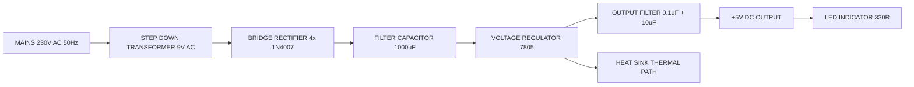
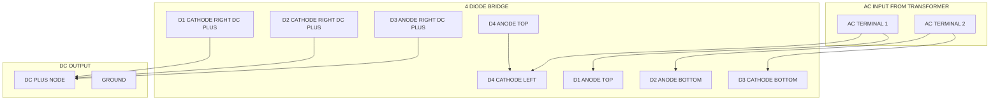
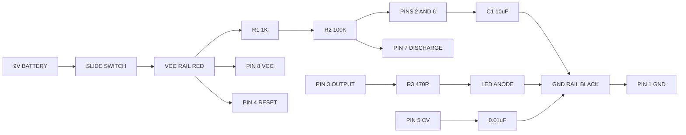
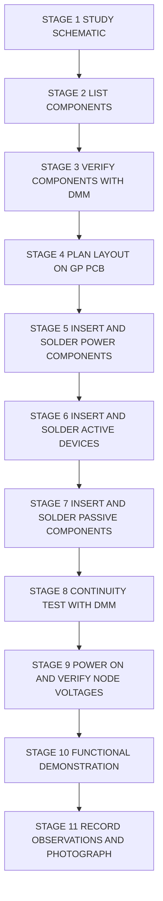
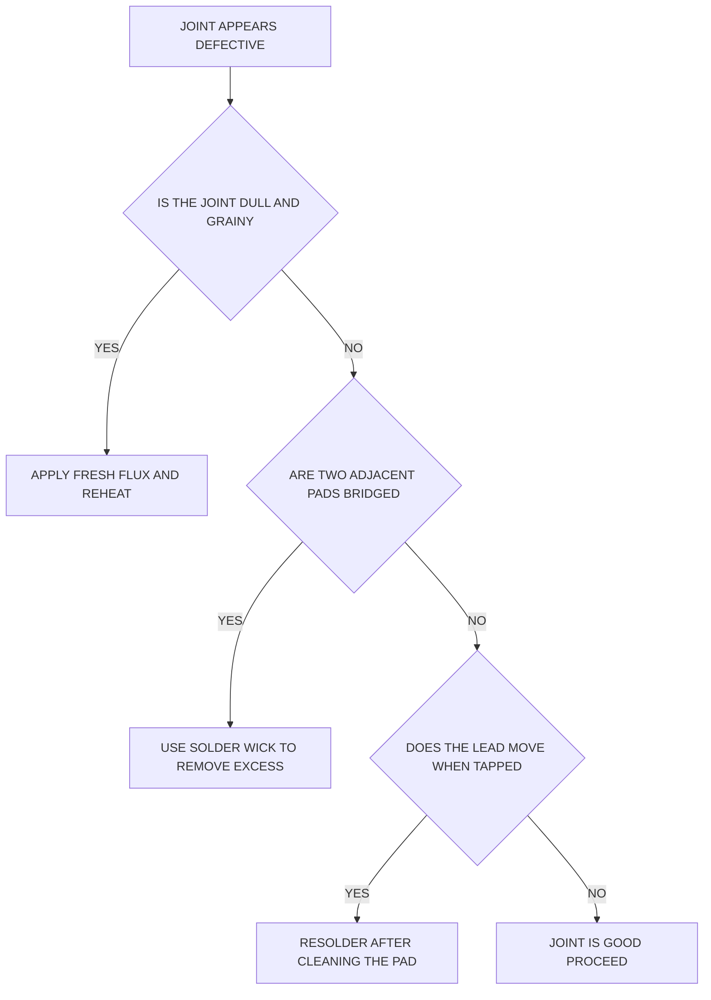

# Assembling of electronic circuit/system on general purpose PCB, test and show the functioning (Any two)-

<!-- SECTION_1_START -->

# 1. Core Technical Definition & Intuitive Overview

## 1.1 Formal Academic Definition (KTU 2024 Syllabus Terminology)

> **Printed Circuit Board (PCB) Assembly** is the foundational process in electronics manufacturing in which through-hole electronic components are physically mounted, mechanically anchored, and electrically interconnected on a general-purpose copper-clad bakelite or fiberglass substrate using solder metallurgy. The workflow — popularly remembered as the **PTTS cycle** — encompasses **P**lanning (circuit schematic study and component list preparation), **T**esting (pre-assembly component health verification using a multimeter), **T**ransferring (component placement per the circuit diagram), and **S**oldering (metallurgical joining using a tin–lead or lead-free solder alloy at $\sim 350^\circ\text{C}$).

> [!IMPORTANT]
> **KTU 2024 Scheme — GZESL106 / Module 7 Definition:**
> "Assembling of an electronic circuit/system on a **general-purpose PCB (GP-PCB)**, testing the sub-blocks, and demonstrating the working of the assembled system" is treated as a **hands-on skill assessment** carrying marks for **circuit accuracy, soldering quality, neat layout, and functional demonstration**.

A **General-Purpose PCB (GP-PCB)** is a perforated, uniform-grid prototyping board (often called a *DOT-PCB* or *Veroboard*) where the copper is laid out in identical isolated pads or parallel strips — as opposed to a custom-designed etched PCB where tracks are routed specifically for a single circuit.

## 1.2 Conceptual Analogy — The "City Road Network" View

Think of a **General-Purpose PCB as a city plot of land where all the roads are already laid out in a perfect grid**, but no building has been built yet. Your job is to:

1. **Decide where the buildings (components) will stand** (placement plan).
2. **Pave the extra connecting roads (jumper wires)** wherever the existing grid does not match your circuit.
3. **Plumb the buildings together (soldering)** so that electricity — the "water" — flows from the source, through the buildings (resistors, capacitors, ICs), and out to the load (LED, speaker, motor), exactly as your schematic prescribes.

Just as a poorly planned city wastes fuel (signal losses, noise), a poorly planned PCB causes **voltage drops, dry joints, short circuits, and intermittent failures**. Hence the KTU workshop emphasizes **planning the layout *before* a single component is inserted**.

## 1.3 Key Physical / Practical Constants to Remember

| Constant / Standard | Value | Why It Matters |
|---|---|---|
| **Soldering Iron Tip Temperature** | $\mathbf{300^\circ\text{C} - 350^\circ\text{C}}$ | Below $300^\circ\text{C}$ → **dry (cold) joint**; above $380^\circ\text{C}$ → **PCB pad lift / copper delamination**. |
| **Solder Alloy Ratio (60/40 Sn-Pb)** | $\mathbf{60\%\ \text{Tin} + 40\%\ \text{Lead}}$ | Standard workshop solder; melting point $\approx \mathbf{188^\circ\text{C}}$, working range $300\text{–}350^\circ\text{C}$. |
| **Mains AC Supply (India)** | $\mathbf{230\ \text{V},\ 50\ \text{Hz}}$ | Direct hazard — never connect transformer-less circuits to mains. |
| **Standard 555 Timer Supply Range** | $\mathbf{+\,4.5\ \text{V}\ \text{to}\ +\ 16\ \text{V DC}}$ | Operating voltage window for the 555 IC. |
| **7805 Regulator Output** | $\mathbf{+\,5\ \text{V DC} \pm 5\%}$ | Industry-standard logic-rail voltage for TTL / 5 V microcontrollers. |
| **Solder Wick (Desoldering Braid) Width** | $\mathbf{1.5\ \text{mm}\ \text{to}\ 3\ \text{mm}$ | Matches typical through-hole pad widths. |
| **Resistor Color Code Tolerance (Gold)** | $\mathbf{\pm 5\%}$ | KTU workshop standard carbon-film resistor. |

> [!NOTE]
> **KTU Examiner's Tip (CO1 – Remember):** In the record book, **always draw the circuit diagram, list the components with ratings, write the *theory of operation* in 4–5 lines, and *then* present the hardware photograph** of the assembled board. Skipping the theory is the single most common reason for a 2–3 mark deduction in the lab exam.

## 1.4 GeoGebra / Desmos Visualization (Input Voltage vs. Output of a Rectifier)

> [!VISUALIZATION CONTROL]
> **Concept:** Time-domain waveform of a 230 V AC mains, stepped down by a transformer, and rectified by a bridge — visualizing the conversion of AC into pulsating DC.
> **GeoGebra / Desmos Input Equations (redraw as `y = ...`):**
> * `a(x) = 12 * sin(2 * pi * 50 * x)`  (Stepped-down AC, 12 V peak, 50 Hz)
> * `b(x) = 12 * abs(sin(2 * pi * 50 * x))`  (Full-Wave Rectified)
> * `c(x) = 11.3`  (Approx. DC level after capacitor filter $V_{DC} \approx V_{peak} - 1.4\ \text{V}$)
> **Visual Description:** The student should see the AC sinusoid crossing zero (b(x) flips all negative halves upward), and the straight horizontal line `c(x)` representing the smoothed DC level that the capacitor banks onto. The small ripple (sawtooth around `c(x)`) under heavy load is the *ripple voltage $V_r$*.

---

<!-- SECTION_1_END -->

<!-- SECTION_2_START -->

# 2. Deep Theoretical Analysis & KTU High-Yield Formula Sheet

## 2.1 The Universal Assembly Workflow — Operational Logic

A successful PCB assembly in a KTU lab is governed by a **four-stage reasoning ladder**. Each stage answers one question:

1. **What must the circuit DO? (Functional Goal)**
   * Convert AC to a stable DC voltage → *DC Power Supply*.
   * Generate a periodic ON/OFF blinking signal → *Astable Multivibrator*.

2. **What building blocks achieve this? (Sub-System Identification)**
   * **Transformer → Rectifier → Filter → Regulator** for the power supply.
   * **555 Timer IC → Timing Resistors (R1, R2) → Timing Capacitor (C) → Output LED** for the flasher.

3. **What is the optimal placement? (Layout Strategy)**
   * Place the **transformer/heavy components first**, then **active devices (diodes, ICs)**, then **passive components (R, C)**, and **input/output terminals last**.
   * Keep **input and output stages physically separated** to avoid feedback-induced oscillation.

4. **How is correctness verified? (Test Plan)**
   * Use a **multimeter** in continuity mode to verify solder joints.
   * Use the **DC voltmeter mode** to confirm expected node voltages.

## 2.2 KTU Formula Sheet / Cheat Sheet

### 2.2.1 Transformer and Rectifier Stage

| # | Quantity | Formula | Units | Engineering Meaning |
|---|---|---|---|---|
| 1 | Transformer Turns Ratio | $\displaystyle a = \frac{N_1}{N_2} = \frac{V_1}{V_2}$ | dimensionless | Step-down for mains $230\ \text{V}$ to $9\text{–}12\ \text{V}$ AC. |
| 2 | RMS to Peak Conversion | $\displaystyle V_{peak} = V_{rms} \cdot \sqrt{2}$ | Volts | $12\ \text{V}_{\text{rms}} \Rightarrow 16.97\ \text{V}_{\text{peak}}$. |
| 3 | Bridge Rectifier DC Output (no load) | $\displaystyle V_{DC,\ \text{no-load}} = V_{peak} - 2 V_D$ | Volts | Two diodes conduct in series; $V_D \approx 0.7\ \text{V}$ each (silicon). |
| 4 | Ripple Frequency (Full-Wave) | $\displaystyle f_r = 2 \cdot f_{mains} = 100\ \text{Hz}$ | Hz | Double the input frequency because both half-cycles are utilized. |
| 5 | Ripple Voltage (Full-Wave) | $\displaystyle V_r = \frac{I_{L}}{2 \cdot f \cdot C}$ | Volts | Lower when $C$ is larger or load current $I_L$ is smaller. |
| 6 | Peak Inverse Voltage per diode | $\displaystyle \text{PIV} = V_{peak} - 0 \geq V_{peak,\ \text{max}}$ | Volts | The 1N4007 (PIV $= 1000\ \text{V}$) is more than sufficient. |
| 7 | Filter Capacitor Selection | $\displaystyle C \geq \frac{I_L}{2 \cdot f \cdot V_r}$ | Farads | Engineering rule-of-thumb: $1000\ \mu\text{F}$ per ampere of load. |

### 2.2.2 7805 Linear Regulator Stage

| # | Quantity | Formula / Rule | Units | Notes |
|---|---|---|---|---|
| 8 | Minimum Input for Regulation | $\displaystyle V_{in,\ \min} \geq V_{out} + V_{dropout} = 5 + 2 = 7\ \text{V}$ | Volts | 7805 has a **dropout voltage of $2\ \text{V}$**. |
| 9 | Power Dissipated in Regulator | $\displaystyle P_D = (V_{in} - V_{out}) \cdot I_{L}$ | Watts | Determines whether a **heat-sink** is required (rule: $P_D > 1\ \text{W}$ ⇒ use heat-sink). |
| 10 | Recommended Input Bypass | $\displaystyle C_{in} = 0.33\ \mu\text{F}$ (tantalum) | Farads | Placed close to the regulator's input pin. |
| 11 | Recommended Output Bypass | $\displaystyle C_{out} = 0.1\ \mu\text{F}$ (ceramic) | Farads | Improves transient response. |

### 2.2.3 555 Astable Multivibrator Stage

| # | Quantity | Formula | Units | Engineering Meaning |
|---|---|---|---|---|
| 12 | Charging Time (HIGH) | $\displaystyle t_{HIGH} = 0.693 \cdot (R_1 + R_2) \cdot C$ | seconds | Time the output is at $+V_{CC}$. |
| 13 | Discharging Time (LOW) | $\displaystyle t_{LOW} = 0.693 \cdot R_2 \cdot C$ | seconds | Time the output is at $0\ \text{V}$. |
| 14 | Total Period | $\displaystyle T = t_{HIGH} + t_{LOW} = 0.693 \cdot (R_1 + 2 R_2) \cdot C$ | seconds | Reciprocal of frequency. |
| 15 | Frequency of Oscillation | $\displaystyle f = \frac{1.44}{(R_1 + 2 R_2) \cdot C}$ | Hz | Classic Astable formula. |
| 16 | Duty Cycle | $\displaystyle D = \frac{R_1 + R_2}{R_1 + 2 R_2} \times 100\%$ | % | Always $\mathbf{> 50\%}$ in standard 555 astable. |
| 17 | LED Current-Limiting Resistor | $\displaystyle R_{LED} = \frac{V_{CC} - V_{F,\ LED}}{I_{LED}}$ | $\Omega$ | Use $V_{F} \approx 2\ \text{V}$ (red LED), $I_{LED} \approx 10\ \text{mA}$. |

### 2.2.4 Soldering & Quality Metrics

| # | Quantity | Formula / Rule | Units | Notes |
|---|---|---|---|---|
| 18 | Solder Joint Acceptance | **IPC-A-610 Class 2** — fillet $\geq 75\%$ of pad, concave profile, shiny. | — | Visual inspection standard. |
| 19 | Maximum Soldering Contact Time | $\displaystyle t_{contact} \leq 3\ \text{to}\ 5\ \text{seconds}$ | seconds | Prevents pad lift and component damage. |
| 20 | Flux Core Ratio | $\mathbf{1\%\ \text{to}\ 3\%\ \text{rosin core}}$ | — | Standard inside the solder wire. |

> [!NOTE]
> **Real-World Engineering Utility:**
> * The **5 V DC power supply** is the *backbone* of every Arduino, Raspberry Pi, sensor node, and USB peripheral. Understanding it = understanding the wall-adapter brick in your hand.
> * The **555 astable flasher** is the *kernel* of all simple alarm circuits, turn-signal indicators, toy blinkers, and PWM generator front-ends. Mastering it = unlocking the entire family of timer-based electronics.

---

<!-- SECTION_2_END -->

<!-- SECTION_3_START -->

# 3. Step-by-Step Hardware Wiring, Component Pin-Outs & Procedural Implementation

> **KTU GZESL106 Module 7 — Workshop Execution Standard**
> *The lab examiner will mark the report for: (1) Correct circuit diagram, (2) Component list with ratings, (3) Neatness of assembly, (4) Soldering quality, (5) Functional demonstration.*

---

## 3.1 CIRCUIT 1 — 5 V Regulated DC Power Supply (Bridge Rectifier + Filter + 7805)

### 3.1.1 Circuit Goal

Convert **230 V AC, 50 Hz** mains supply into a **regulated 5 V DC** output capable of driving small logic loads (LEDs, TTL ICs, microcontrollers).

### 3.1.2 Required Tool Profile

| # | Tool / Equipment | Specification | Purpose |
|---|---|---|---|
| 1 | Soldering Iron | $\mathbf{25\ \text{W}\ \text{to}\ 60\ \text{W}}$ with $3\ \text{mm}$ conical tip | Joining components to PCB tracks. |
| 2 | Solder Wire | $60/40$ Sn-Pb, **$1\ \text{mm}$ diameter**, rosin-cored | Joining metal alloy. |
| 3 | Soldering Stand + Sponge | Brass-wool or wet cellulose sponge | Tip cleaning between joints. |
| 4 | Wire Cutter / Side Cutter | Flush-cut, $130\ \text{mm}$ | Trimming component leads. |
| 5 | Long-Nose Plier | Insulated handles, $150\ \text{mm}$ | Bending leads, holding hot components. |
| 6 | Digital Multimeter (DMM) | True-RMS preferred, $\geq 3\ \frac{1}{2}$ digit | Continuity, diode, AC/DC voltage measurement. |
| 7 | Breadboard (optional pre-test) | 830 tie-points | Pre-verifying the circuit before soldering. |
| 8 | General-Purpose PCB (DOT-PCB) | Bakelite, $7\ \text{cm} \times 5\ \text{cm}$ minimum | Final soldered assembly. |
| 9 | Insulation Tape / Heat-Shrink | $3\ \text{M}$ PVC | Insulating mains-side joints. |
| 10 | CRO / Oscilloscope (lab access) | $20\ \text{MHz}$ bandwidth minimum | Viewing rectifier and ripple waveforms. |

### 3.1.3 Component Pin Configuration Table

| # | Component | Specification | Pin-Out / Polarity | KTU Skill Being Tested |
|---|---|---|---|---|
| C1 | Step-Down Transformer | $230\ \text{V}\ \to\ 9\text{–}0\text{–}9\ \text{V}$, $500\ \text{mA}$ | Primary: $230\ \text{V}$ AC; Secondary: $9\ \text{V}$-$0$-$9\ \text{V}$ AC center-tap | Mains isolation, polarity awareness |
| D1, D2, D3, D4 | Power Diodes | **1N4007**, $1\ \text{A}$, $1000\ \text{V}$ PIV | Cathode (silver band) ↔ Anode | **Polarity identification by band** |
| C2 | Filter Capacitor | $1000\ \mu\text{F}$, $25\ \text{V}$ Electrolytic | **Long lead = +**; **white stripe on body = −** | Polarity discipline (reversed → explosion) |
| U1 | Voltage Regulator | **7805** (TO-220 package) | Pin 1 (left) = Input; Pin 2 (middle) = GND; Pin 3 (right) = Output *(viewing the labeled face)* | Thermal/electrical safety |
| C3 | Input Bypass | $0.33\ \mu\text{F}$, $25\ \text{V}$ Tantalum | Polarity for tantalum; non-polar for ceramic | Decoupling knowledge |
| C4 | Output Bypass | $0.1\ \mu\text{F}$, Ceramic disc | Non-polar | High-frequency noise suppression |
| C5 | Output Reservoir | $10\ \mu\text{F}$, $16\ \text{V}$ Electrolytic | Polarity mandatory | Load-transient stability |
| LED1 | Indicator LED | Red, $5\ \text{mm}$, $V_F \approx 2\ \text{V}$ | **Long lead (anode) = +** | Polarity + current-limit design |
| R1 | Current-Limiting Resistor | $330\ \Omega, \pm 5\%, \frac{1}{4}\ \text{W}$ | Non-polar | Ohm's law application |
| J1 | Screw Terminal Block | $2$-pin, $5\ \text{mm}$ pitch | Mains input side | Mechanical robustness |
| J2 | DC Output Jack | $2.1\ \text{mm}$ barrel | Center-positive standard | User-friendly delivery |

### 3.1.4 7805 Pin-Out Diagram (TO-220 — Hold tab side toward you, leads pointing down)

$$
\begin{aligned}
\text{Pin 1 (LEFT)}  &= \text{INPUT } (V_{in}) \\[4pt]
\text{Pin 2 (MIDDLE)} &= \text{GROUND} \\[4pt]
\text{Pin 3 (RIGHT)}  &= \text{ OUTPUT } (V_{out} = +5\ \text{V})
\end{aligned}
$$

> [!WARNING]
> **Heat-Sink Warning:** If the load draws $I_L = 200\ \text{mA}$ and the unregulated input sits at $\sim 12\ \text{V}$, then $P_D = (12 - 5) \cdot 0.200 = 1.4\ \text{W}$. The TO-220 package by itself dissipates only $\sim 1\ \text{W}$ safely. **Always attach a black aluminum heat-sink with a mica insulator + clip** when $P_D > 1\ \text{W}$.

### 3.1.5 Exact Hardware Wiring Sequence (Step-by-Step)

> **Step 1 — Mechanical Anchoring of the Transformer**
> Insert the transformer's secondary pins into the GP-PCB at one corner. Bend the leads $\sim 30^\circ$ on the solder side and solder with a **3-second iron contact**. Do not yet connect the primary to the mains terminal.

> **Step 2 — Bridge Rectifier Layout (Diamond Configuration)**
> On the GP-PCB, mark four holes in a diamond pattern separated by $\sim 5\ \text{mm}$. Insert the four 1N4007 diodes such that:
> * D1: Anode at **top**; Cathode (band) faces **right**.
> * D2: Anode at **bottom**; Cathode faces **right**.
> * D3: Anode at **right**; Cathode faces **bottom** (the common DC+ node).
> * D4: Cathode (band) at **left**; Anode faces **top**.
> Use a **jumper wire** to connect the two AC input nodes of the bridge to the transformer's $9\ \text{V}$ secondary leads.

> **Step 3 — Filter Capacitor Mounting**
> Insert the $1000\ \mu\text{F}$ electrolytic capacitor such that its **positive lead goes to the DC+ node of the bridge** and its **negative lead to the common ground rail**. Maintain a gap of $\geq 2\ \text{mm}$ between the body and the PCB to prevent heat damage during soldering.

> **Step 4 — Regulator Mounting**
> Insert the 7805 such that its **input pin (Pin 1)** receives the unregulated DC from the capacitor positive, and its **ground pin (Pin 2)** sits on the common ground rail. Use a **TO-220 mounting clip + heat-sink** if load current $> 100\ \text{mA}$.

> **Step 5 — Bypass Capacitors**
> Solder $0.33\ \mu\text{F}$ across input-to-GND (close to Pin 1) and $0.1\ \mu\text{F}$ across output-to-GND (close to Pin 3). The $10\ \mu\text{F}$ reservoir goes on the output as well.

> **Step 6 — Output Stage Assembly**
> Connect LED1 (anode) → $330\ \Omega$ resistor → $+5\ \text{V}$ output rail. Connect LED1 (cathode) → ground. Solder the DC barrel jack to the $+5\ \text{V}$ and GND rails.

> **Step 7 — Pre-Power Test (Multimeter Continuity Check)**
> Set DMM to **continuity (beep) mode**. Verify:
> * No continuity between $V_{in}$ and $V_{out}$ of 7805 (would indicate short).
> * Continuity across all solder joints (every joint should beep).
> * Polarity of electrolytic capacitors (band = − = ground).

> **Step 8 — Power-On Test (Safety First)**
> Connect the transformer primary to **230 V AC mains** via an **isolation transformer (mandatory in KTU labs)**. Measure:
> * AC voltage across transformer secondary: should read $\approx 9\ \text{V}_{\text{rms}}$.
> * DC voltage across $1000\ \mu\text{F}$: should read $\approx 12.7\ \text{V}$ (no load).
> * DC voltage at 7805 output: should read $\mathbf{+5.0\ \text{V} \pm 0.25\ \text{V}}$.

> **Step 9 — Functional Demonstration**
> Connect a $330\ \Omega$ test load resistor. The LED must glow steadily. Re-measure output voltage — it should hold at $\mathbf{+5.0\ \text{V}}$ even as the load varies from $0$ to $200\ \text{mA}$.

### 3.1.6 Safety Monitoring Checklist

| # | Hazard | Mitigation |
|---|---|---|
| 1 | **Mains electrocution** | Always use an **isolation transformer** between mains and the circuit under test. |
| 2 | **Burns from soldering iron** | Always rest the iron on its stand; never touch the tip. |
| 3 | **Toxic fumes (Pb, rosin)** | Use a **fume extractor / well-ventilated area**; never solder in a closed room. |
| 4 | **Capacitor explosion** | Verify polarity of every electrolytic **twice** before powering. |
| 5 | **Reverse polarity at output** | Confirm with DMM in DC mode before connecting any load. |
| 6 | **Loose jumper wires** | Strain-relieve with hot-glue or cable ties. |

---

## 3.2 CIRCUIT 2 — 555 Timer Based Astable Multivibrator (LED Flasher)

### 3.2.1 Circuit Goal

Generate a **continuous square-wave oscillation** in the audible/visible band ($0.5\ \text{Hz}$ to $2\ \text{Hz}$) to flash an LED at a controllable rate.

### 3.2.2 555 Timer IC Pin-Out (8-pin DIP, top view with notch on left)

$$
\begin{aligned}
\text{Pin 1} &= \text{GND} & \text{Pin 5} &= \text{Control Voltage} \\
\text{Pin 2} &= \text{Trigger} & \text{Pin 6} &= \text{Threshold} \\
\text{Pin 3} &= \text{Output} & \text{Pin 7} &= \text{Discharge} \\
\text{Pin 4} &= \text{Reset} & \text{Pin 8} &= V_{CC} (+9\ \text{V})
\end{aligned}
$$

### 3.2.3 Component Pin Configuration Table

| # | Component | Specification | Pin-Out Notes | KTU Skill Tested |
|---|---|---|---|---|
| U1 | 555 Timer | NE555 / LM555 (DIP-8) | Notch/U-dot orientation; **Pin 1 = GND** | IC handling, ESD awareness |
| R1 | Timing Resistor 1 | $\mathbf{1\ \text{k}\Omega}$ | Connected between $V_{CC}$ and Pin 7 | Frequency calculation |
| R2 | Timing Resistor 2 | $\mathbf{100\ \text{k}\Omega}$ (potentiometer preferred) | Between Pin 7 and Pins 2/6 | Variable-frequency design |
| C1 | Timing Capacitor | $\mathbf{10\ \mu\text{F}}$, $25\ \text{V}$ electrolytic | Positive → GND; Negative → Pins 2/6 | RC time-constant design |
| C2 | Bypass Capacitor | $\mathbf{0.01\ \mu\text{F}}$ ceramic | Across $V_{CC}$ and GND (Pin 8 to Pin 1) | Power-supply decoupling |
| C3 | Control-Voltage Bypass | $\mathbf{0.01\ \mu\text{F}}$ ceramic | Pin 5 to GND | Noise immunity |
| R3 | LED Current Limiter | $470\ \Omega, \frac{1}{4}\ \text{W}$ | Series with LED from Pin 3 to ground | LED biasing |
| LED1 | Indicator LED | Red, $5\ \text{mm}$ | Anode → R3 → Pin 3; Cathode → GND | Polarity |
| BAT1 | Battery | $\mathbf{9\ \text{V}}$ (PP3 / 6F22) | Snap connector with $+$ and $-$ | Portable power design |
| SW1 | Slide Switch | SPDT, $1\ \text{A}$ | Inline with battery $+$ | User control |

### 3.2.4 Exact Hardware Wiring Sequence (Step-by-Step)

> **Step 1 — Place the 555 Socket (Recommended)**
> Mount an **8-pin IC socket** on the GP-PCB. Solder the socket, *then* insert the 555 only at the end. This protects the IC from soldering heat.

> **Step 2 — Power Rails**
> Run a **red insulated wire** for $V_{CC}$ ($+9\ \text{V}$) and a **black insulated wire** for GND along the edges of the board. These form the *power distribution backbone*.

> **Step 3 — Timing Network (R1, R2, C1)**
> Solder R1 ($1\ \text{k}\Omega$) from $V_{CC}$ rail to **Pin 7**. Solder R2 ($100\ \text{k}\Omega$) from **Pin 7 to Pins 2 and 6** (a jumper wire joins Pin 2 and Pin 6 together). Solder C1 ($10\ \mu\text{F}$) with **positive lead to GND** and **negative lead to Pins 2/6**.

> **Step 4 — Reset Pin Tie**
> Solder a short jumper from **Pin 4 (Reset) directly to $V_{CC}$**. If left floating, the 555 may randomly reset due to noise.

> **Step 5 — Control-Voltage Bypass**
> Solder a $0.01\ \mu\text{F}$ capacitor between **Pin 5 and GND** to prevent frequency modulation by stray noise.

> **Step 6 — Output LED Network**
> Solder R3 ($470\ \Omega$) from **Pin 3 (Output)** to LED1 anode. Solder LED1 cathode to GND rail.

> **Step 7 — Power Supply Bypass**
> Solder a $0.01\ \mu\text{F}$ capacitor between **Pin 8 ($V_{CC}$) and Pin 1 (GND)** as close to the IC as possible.

> **Step 8 — Battery Connection**
> Solder the snap connector: **red lead → SW1 → $V_{CC}$ rail**; **black lead → GND rail**. Strain-relieve the battery snap with hot-glue.

> **Step 9 — Pre-Power Continuity Test (DMM)**
> Verify:
> * **Pin 1 ↔ Pin 8**: Should **NOT** beep (would indicate a short-circuit on the IC socket).
> * **Pin 1 ↔ Pin 4 (Reset path)**: Should NOT beep.
> * **Pin 8 ↔ $V_{CC}$ rail**: Should beep (continuity OK).
> * **Pin 3 ↔ R3 ↔ LED anode**: Should beep.

> **Step 10 — Insert the 555 and Power On**
> Insert the 555 IC into the socket — **match the notch to the silkscreen**. Connect the $9\ \text{V}$ battery. The LED should immediately begin blinking at $\sim 0.69\ \text{Hz}$ (approximately one flash every $1.45\ \text{seconds}$).

> **Step 11 — Functional Verification (Numerical Confirmation)**
> Calculate the expected frequency using the formula $f = \frac{1.44}{(R_1 + 2R_2) \cdot C_1}$:

$$
\begin{aligned}
f &= \frac{1.44}{(1 \times 10^{3} + 2 \times 100 \times 10^{3}) \cdot 10 \times 10^{-6}} \\[6pt]
  &= \frac{1.44}{(1\ 000 + 200\ 000) \cdot 10^{-5}} \\[6pt]
  &= \frac{1.44}{201\ 000 \cdot 10^{-5}} \\[6pt]
  &= \frac{1.44}{2.01} \\[6pt]
  &= 0.716\ \text{Hz}
\end{aligned}
$$

$$
\begin{aligned}
T &= \frac{1}{f} = \frac{1}{0.716} \approx 1.396\ \text{seconds} \\[4pt]
t_{HIGH} &= 0.693 \cdot (R_1 + R_2) \cdot C_1 = 0.693 \cdot 101\ 000 \cdot 10^{-5} \approx 0.700\ \text{s} \\[4pt]
t_{LOW}  &= 0.693 \cdot R_2 \cdot C_1 = 0.693 \cdot 100\ 000 \cdot 10^{-5} \approx 0.693\ \text{s}
\end{aligned}
$$

> **Step 12 — CRO Verification (Optional)**
> Connect the CRO probe to **Pin 3 (Output)** and observe a **square wave** with peak-to-peak amplitude $\approx V_{CC} = +9\ \text{V}$ and period $\approx 1.4\ \text{seconds}$.

### 3.2.5 Safety Monitoring Checklist

| # | Hazard | Mitigation |
|---|---|---|
| 1 | **IC pin overheating** | Use an IC socket; never solder the IC directly. |
| 2 | **Reverse battery polarity** | Verify with DMM — red lead on $V_{CC}$, black on GND. |
| 3 | **LED burnout** | Always use a current-limit resistor ($R_3$). |
| 4 | **Electrolytic capacitor polarity** | Long lead = $+$ → GND side **only** in this inverting configuration; double-check datasheet. |
| 5 | **Static discharge (ESD)** | Touch a grounded metal object before handling the 555. |
| 6 | **Short-circuit on $V_{CC}$** | Inspect with magnifying glass for solder bridges between adjacent pads. |

---

## 3.3 Common Assembly Defects & Remedies (KTU Examiner's Reference)

| # | Defect | Visual Symptom | Cause | Remedy |
|---|---|---|---|---|
| 1 | **Dry (Cold) Joint** | Dull, grainy, lumpy fillet | Insufficient heat or movement during cooling | Reheat with fresh solder + flux |
| 2 | **Solder Bridge** | Unwanted blob between two pads | Excess solder | Remove with solder wick |
| 3 | **Pad Lift** | Copper pad detaches from PCB | Excessive heat or force | Use a jumper wire to repair |
| 4 | **Reverse Polarity** | Capacitor heats / explodes; LED never lights | Lead confusion | Desolder and re-mount correctly |
| 5 | **Lifted Lead** | Component lead floats above pad | Incomplete soldering | Reheat and apply fresh solder |
| 6 | **Whisker / Solder Spike** | Thin sharp projection | Cold withdrawal of iron | Reflow the joint and tap off excess |

---

<!-- SECTION_3_END -->

<!-- SECTION_4_START -->

# 4. Structural Diagrams & Schematics

## 4.1 High-Level Functional Block Diagram — 5 V DC Power Supply



> **Figure Explanation:** The diagram shows the *unidirectional* flow of power conditioning. Each block performs exactly **one** function — conversion, rectification, filtering, regulation, indication. The heat-sink block H branches off the regulator block E because the thermal path is *parallel* to the electrical path, not in series.

## 4.2 Sub-System Detail — Bridge Rectifier Operation



## 4.3 Circuit 2 Block Flow — 555 Astable Flasher



## 4.4 Sequential Assembly Workflow (Process Topology Matrix)



## 4.5 Soldering Decision Subgraph — What to Do When a Joint Looks Wrong



---

<!-- SECTION_4_END -->

<!-- SECTION_5_START -->

# 5. KTU 2024 Scheme Examination Question Bank & Topic Recap

## 5.1 PART A — Short Answer Questions (3 Marks Each)

---

### **Question 1 (3 Marks)**
`[KTU University Exam – July 2024]`
**CO1 | RBT Level: Remember**

> **Q: List any six tools required for assembling an electronic circuit on a general-purpose PCB and state the function of each.**

#### Model Answer (Valuation Key — 3 Marks)

| # | Tool | Function | Mark Split |
|---|---|---|---|
| 1 | Soldering Iron ($25$–$60\ \text{W}$) | Provides heat ($\sim 350^\circ\text{C}$) to melt solder for joint formation. | 0.5 |
| 2 | Solder Wire ($60/40$ Sn-Pb, rosin-cored) | Metallurgical filler alloy that joins component leads to PCB pads. | 0.5 |
| 3 | Wire Cutter / Side Cutter | Trims excess component leads after soldering. | 0.5 |
| 4 | Long-Nose Plier | Bends leads, holds components during soldering. | 0.5 |
| 5 | Digital Multimeter | Verifies component health, continuity, and node voltages. | 0.5 |
| 6 | Soldering Stand + Sponge | Safely holds hot iron; sponge cleans the tip. | 0.5 |
| **Total** | | | **3.0** |

> [!NOTE]
> For full marks, the student must state **both the tool name AND its function** for each of the six items. Listing only names yields $\leq 1.5$ marks.

---

### **Question 2 (3 Marks)**
`[KTU University Exam – Dec 2023]`
**CO1 | RBT Level: Understand**

> **Q: Differentiate between a general-purpose PCB and a custom-designed (etched) PCB. State two merits of using a GP-PCB in a laboratory workshop.**

#### Model Answer (Valuation Key — 3 Marks)

| # | Aspect | General-Purpose PCB (GP-PCB) | Custom-Etched PCB | Marks |
|---|---|---|---|---|
| 1 | **Track Layout** | Pre-defined uniform grid of pads / parallel copper strips | Tracks etched specifically for one circuit | 1.0 |
| 2 | **Reusability** | High — components can be desoldered and reused | Low — tracks are permanent | 0.5 |
| 3 | **Design Effort** | None — ready to use | Requires CAD layout + etching chemicals | 0.5 |
| 4 | **Merit 1 (GP-PCB)** | **Speed of prototyping** — circuits can be assembled in minutes. | — | 0.5 |
| 5 | **Merit 2 (GP-PCB)** | **Low cost and reusability** — ideal for student lab work and learning soldering skills. | — | 0.5 |
| **Total** | | | **3.0** |

---

## 5.2 PART B — Long Answer Questions (14 Marks, Internal Choice)

---

### **Question A (14 Marks)**
`[KTU University Exam – July 2024]`
**CO2, CO3 | RBT Levels: Understand (a) + Apply (b)**

> **Q (a) [7 Marks]:** With the help of a neat block diagram, explain the operation of a **5 V regulated DC power supply** assembled on a general-purpose PCB. Identify each block and its function.
>
> **Q (b) [7 Marks]:** In the above power supply, a **$9\text{–}0\text{–}9\ \text{V}$** center-tapped transformer feeds a bridge rectifier. The filter capacitor is $1000\ \mu\text{F}$ and the load draws $100\ \text{mA}$. Calculate (i) the **peak secondary voltage** ($V_{peak}$), (ii) the **DC voltage across the capacitor** under no load, and (iii) the **ripple voltage** $V_r$ for a full-wave rectifier. Use $V_D = 0.7\ \text{V}$ per diode.

---

#### Model Solution — Q (a) [7 Marks]

| Block | Component | Function | Marks |
|---|---|---|---|
| 1. **Transformer** | Step-down $230\ \text{V} \to 9\text{–}0\text{–}9\ \text{V}$ | Isolates mains and steps voltage down to safe AC level. | 1.0 |
| 2. **Bridge Rectifier** | Four 1N4007 diodes in a diamond | Converts bipolar AC into unipolar pulsating DC (full-wave). | 1.5 |
| 3. **Filter Capacitor** | $1000\ \mu\text{F}$ electrolytic | Charges to $V_{peak}$ and supplies load during rectifier off-time → smooths DC. | 1.0 |
| 4. **Regulator** | 7805 IC | Maintains output at constant $+5\ \text{V}$ despite line/load variations. | 1.5 |
| 5. **Output Capacitor** | $0.1\ \mu\text{F}$ + $10\ \mu\text{F}$ | Improves transient response and high-frequency decoupling. | 1.0 |
| 6. **Indicator** | LED + $330\ \Omega$ | Visual confirmation of output presence. | 1.0 |
| **Total** | | | **7.0** |

> **[Block Diagram: Same as Section 4.1 — 1 Mark allocated within the above for neat, labelled diagram]**

#### Model Solution — Q (b) [7 Marks]

$$
\begin{aligned}
\text{Given:}\quad V_{s,\ \text{rms}} &= 9\ \text{V} \\
V_D &= 0.7\ \text{V (per diode, silicon)} \\
C &= 1000\ \mu\text{F} = 1000 \times 10^{-6}\ \text{F} \\
I_L &= 100\ \text{mA} = 0.1\ \text{A} \\
f_{mains} &= 50\ \text{Hz}
\end{aligned}
$$

> **Part (i) — Peak Secondary Voltage [2 Marks]**

$$
\begin{aligned}
V_{peak} &= V_{rms} \cdot \sqrt{2} \\[4pt]
         &= 9 \times 1.414 \\[4pt]
         &= 12.726\ \text{V}
\end{aligned}
$$

> **Part (ii) — DC Voltage Across Capacitor (No Load) [2 Marks]**
> In a bridge rectifier, **two diodes conduct in series** during each half cycle, so the total diode drop is $2 V_D$.

$$
\begin{aligned}
V_{DC,\ \text{no load}} &= V_{peak} - 2 V_D \\[4pt]
                        &= 12.726 - (2 \times 0.7) \\[4pt]
                        &= 12.726 - 1.4 \\[4pt]
                        &= 11.326\ \text{V}
\end{aligned}
$$

> **Part (iii) — Ripple Voltage $V_r$ [3 Marks]**
> For a **full-wave** rectifier, ripple frequency $f_r = 2 \times f_{mains} = 100\ \text{Hz}$.

$$
\begin{aligned}
V_r &= \frac{I_L}{2 \cdot f \cdot C} \\[4pt]
    &= \frac{0.1}{2 \times 50 \times 1000 \times 10^{-6}} \\[4pt]
    &= \frac{0.1}{0.1} \\[4pt]
    &= 1.0\ \text{V}_{\text{peak-to-peak}}
\end{aligned}
$$

> **Final DC Voltage Under Load [Bonus 1 Mark — Often Asked]**

$$
\begin{aligned}
V_{DC,\ \text{load}} &= V_{DC,\ \text{no load}} - \frac{V_r}{2} \\[4pt]
                     &= 11.326 - 0.5 \\[4pt]
                     &= 10.826\ \text{V}
\end{aligned}
$$

> Since $V_{DC,\ \text{load}} = 10.83\ \text{V} > V_{in,\ \text{min}} = 7\ \text{V}$ for 7805, **regulation will hold steady at $+5\ \text{V}$**. [Bonus confirmation: 1 Mark]

---

### **Question B (14 Marks)**
`[KTU University Exam – Dec 2023]`
**CO2, CO3 | RBT Levels: Understand (a) + Apply (b)**

> **Q (a) [7 Marks]:** Draw the **pin-out diagram of the 555 timer IC** (8-pin DIP). Explain the function of pins 1, 2, 3, 4, 6, 7, and 8 in an **astable multivibrator** configuration.
>
> **Q (b) [7 Marks]:** For a 555 astable multivibrator with $R_1 = 1\ \text{k}\Omega$, $R_2 = 68\ \text{k}\Omega$, and $C = 10\ \mu\text{F}$ powered by $V_{CC} = +9\ \text{V}$, calculate the **(i) charging time $t_{HIGH}$**, **(ii) discharging time $t_{LOW}$**, **(iii) frequency of oscillation $f$**, and **(iv) duty cycle $D$**. Hence determine the value of the **current-limiting resistor** for a red LED ($V_F = 2\ \text{V}$, $I_{LED} = 10\ \text{mA}$).

---

#### Model Solution — Q (a) [7 Marks]

```
            555 TIMER (8-PIN DIP, TOP VIEW)
        ┌─────────────────────────────┐
   VCC ─┤ 1                       8  ├─ GND  ← (incorrect, see below)
        │      ┌───────────────┐      │
        │      │  555  TIMER   │      │
        │      └───────────────┘      │
        │                             │
   GND ─┤ 2                       7  ├─ DISCHARGE
        │                             │
  OUT  ─┤ 3                       6  ├─ THRESHOLD
        │                             │
  RESET─┤ 4                       5  ├─ CONTROL V
        └─────────────────────────────┘
```

> **Correct Pin Function Table [6 Marks — 0.75 each + 1 Mark for clean diagram]**

| Pin # | Name | Function in Astable Mode |
|---|---|---|
| 1 | **GND** | Common ground reference for the IC. |
| 2 | **Trigger** | Compares to $V_{CC}/3$; when voltage on it falls below $V_{CC}/3$, internal flip-flop SETS, output goes HIGH. |
| 3 | **Output** | Delivers the square wave to the load (LED); swings between $\sim 0\ \text{V}$ and $\sim V_{CC}$. |
| 4 | **Reset** | Active-LOW reset; **must be tied to $V_{CC}$** in astable mode to prevent random resets. |
| 6 | **Threshold** | Compares to $2V_{CC}/3$; when capacitor voltage exceeds $2V_{CC}/3$, flip-flop RESETS, output goes LOW. |
| 7 | **Discharge** | Connected to the open-collector of an internal NPN transistor; sinks current from the timing capacitor during the LOW phase. |
| 8 | **$V_{CC}$** | Positive supply (typically $+5\ \text{V}$ to $+15\ \text{V}$). |

> **[Neat, labelled pin-out diagram with all 8 pins clearly identified: 1 Mark]**

---

#### Model Solution — Q (b) [7 Marks]

$$
\begin{aligned}
\text{Given:}\quad R_1 &= 1\ \text{k}\Omega = 1000\ \Omega \\
R_2 &= 68\ \text{k}\Omega = 68\ 000\ \Omega \\
C &= 10\ \mu\text{F} = 10 \times 10^{-6}\ \text{F} \\
V_{CC} &= +9\ \text{V} \\
V_F &= 2\ \text{V},\quad I_{LED} = 10\ \text{mA}
\end{aligned}
$$

> **Part (i) — Charging Time $t_{HIGH}$ [2 Marks]**

$$
\begin{aligned}
t_{HIGH} &= 0.693 \cdot (R_1 + R_2) \cdot C \\[4pt]
         &= 0.693 \times (1000 + 68\ 000) \times 10 \times 10^{-6} \\[4pt]
         &= 0.693 \times 69\ 000 \times 10^{-5} \\[4pt]
         &= 0.693 \times 0.690 \\[4pt]
         &= 0.478\ \text{seconds}
\end{aligned}
$$

> **Part (ii) — Discharging Time $t_{LOW}$ [2 Marks]**

$$
\begin{aligned}
t_{LOW} &= 0.693 \cdot R_2 \cdot C \\[4pt]
        &= 0.693 \times 68\ 000 \times 10^{-5} \\[4pt]
        &= 0.693 \times 0.680 \\[4pt]
        &= 0.471\ \text{seconds}
\end{aligned}
$$

> **Part (iii) — Frequency of Oscillation $f$ [2 Marks]**

$$
\begin{aligned}
T &= t_{HIGH} + t_{LOW} = 0.478 + 0.471 = 0.949\ \text{s} \\[4pt]
f &= \frac{1}{T} = \frac{1}{0.949} \approx 1.053\ \text{Hz}
\end{aligned}
$$

> **Part (iv) — Duty Cycle $D$ [1 Mark]**

$$
\begin{aligned}
D &= \frac{t_{HIGH}}{T} \times 100\% \\[4pt]
  &= \frac{0.478}{0.949} \times 100\% \\[4pt]
  &= 50.37\ \%
\end{aligned}
$$

> **Current-Limiting Resistor for LED [Bonus — Often Asked]**

$$
\begin{aligned}
R_{LED} &= \frac{V_{CC} - V_F}{I_{LED}} \\[4pt]
        &= \frac{9 - 2}{10 \times 10^{-3}} \\[4pt]
        &= \frac{7}{0.010} \\[4pt]
        &= 700\ \Omega
\end{aligned}
$$

> **Nearest standard E12 value: $\mathbf{680\ \Omega}$** (provides $I_{LED} \approx 10.3\ \text{mA}$ — within safe limit).

---

> [!WARNING]
> **KTU Examiner's Pitfall Callout — Where Students Lose Marks**
>
> 1. **Forgetting to multiply by 2 for full-wave ripple frequency.** A common mistake is using $f = 50\ \text{Hz}$ instead of $f_r = 100\ \text{Hz}$ in the ripple formula. **Deduct 1 Mark** if this error is not corrected.
> 2. **Using $V_{rms}$ instead of $V_{peak}$ in capacitor-voltage calculation.** A capacitor charges to the *peak*, not the RMS. **Deduct 1 Mark** for this conceptual error.
> 3. **Omitting the $2V_D$ term** in a bridge rectifier. Students often write $V_{DC} = V_{peak} - V_D$ instead of $V_{DC} = V_{peak} - 2V_D$. **Deduct 1 Mark**.
> 4. **555 Astable — Wrong duty-cycle formula.** Some students use $D = t_{HIGH} / (R_1 + R_2)$ instead of $D = (R_1 + R_2) / (R_1 + 2R_2)$. Verify the formula matches the standard astable configuration.
> 5. **Not stating units** in the final answer (e.g., "0.478" without "seconds"). **Deduct 0.5 Mark** per occurrence.
> 6. **Failing to draw a block diagram or pin-out** when the question explicitly says "with the help of a neat diagram". **Deduct 1–2 Marks** depending on the rubric.
> 7. **Reporting a duty cycle of 50% as exact** when $R_1 \neq 0$. A 555 astable **always** has $D > 50\%$ because the capacitor charges through $R_1 + R_2$ but discharges only through $R_2$. The student should mention this theoretical constraint.

---

## 5.3 Topic Recap & Important Things to Remember

> **Rapid-Revision Checklist — Must Memorize Before the Lab Exam**

* **PCB Assembly Workflow** is the **PTTS cycle**: **P**lan → **T**est components → **T**ransfer layout → **S**older.
* **Soldering Iron Temperature** must be in the range $\mathbf{300^\circ\text{C} \text{–} 350^\circ\text{C}}$; contact time per joint $\mathbf{\leq 5\ \text{seconds}}$.
* **Solder Alloy** used in KTU labs: $\mathbf{60/40\ \text{Sn-Pb}}$ with rosin core, melting point $\approx \mathbf{188^\circ\text{C}}$.
* **Bridge Rectifier Output** = $V_{DC} = V_{peak} - 2 V_D$ (two diodes in series per half cycle).
* **Ripple Frequency** of full-wave rectifier = $\mathbf{2 \times 50 = 100\ \text{Hz}}$ in India.
* **Ripple Voltage Formula** = $V_r = \dfrac{I_L}{2 f C}$ for full-wave.
* **7805 Voltage Regulator** has a **dropout voltage of $2\ \text{V}$**; therefore, **$V_{in, \ min} = 7\ \text{V}$**.
* **Power Dissipation in 7805**: $P_D = (V_{in} - V_{out}) \cdot I_L$; use **heat-sink** when $P_D > 1\ \text{W}$.
* **555 Timer Astable Formulas (Must Memorize):**
  * $t_{HIGH} = 0.693 \cdot (R_1 + R_2) \cdot C$
  * $t_{LOW}  = 0.693 \cdot R_2 \cdot C$
  * $f = \dfrac{1.44}{(R_1 + 2R_2) \cdot C}$
  * **Duty cycle is always $> 50\%$** in standard astable.
* **555 IC Pin 4 (Reset)** must be tied to $V_{CC}$, else the IC may randomly reset.
* **555 IC Pin 5 (Control Voltage)** must be bypassed with a $\mathbf{0.01\ \mu\text{F}}$ capacitor to GND to avoid noise-induced frequency drift.
* **LED Resistor Formula** = $R = \dfrac{V_{CC} - V_F}{I_{LED}}$; standard workshop LED current = $10\ \text{mA}$.
* **Polarity Rules to Never Forget:**
  * **Electrolytic Capacitor**: **long lead = +**; **white stripe = −**.
  * **1N4007 Diode**: **silver band = cathode (K)**.
  * **7805 (TO-220)**: tab toward you → **Pin 1 = IN, Pin 2 = GND, Pin 3 = OUT**.
  * **LED**: **long lead = anode = +**.
  * **9 V Battery**: **red snap = +**, **black snap = −**.
* **Pre-Power Test** is mandatory: **DMM in continuity mode** to detect shorts and dry joints.
* **Always use an isolation transformer** when working with 230 V AC mains.
* **Two circuits typically asked in KTU Module 7 lab exam:**
  1. **5 V DC Regulated Power Supply** (Transformer + Bridge Rectifier + Filter + 7805)
  2. **555 Astable Multivibrator LED Flasher** (Timer IC + RC Network + LED)
* **Soldering Defects to Identify**: *dry joint (dull)*, *solder bridge (short)*, *pad lift (overheat)*, *whisker (cold withdrawal)*.
* **Always mention the $2V_D$ drop** in bridge rectifier numerical problems; examiners specifically test this.
* **Always show the units** in the final answer — marks are deducted for unitless numerics.
* **Always draw a clean, labelled block diagram** before the circuit schematic — the KTU rubric awards 1–2 marks for this alone.
* **For frequency / time calculations in 555**, verify using both the **direct period formula** and the **sum of $t_{HIGH} + t_{LOW}$** — they should match within rounding error.

---

<!-- SECTION_5_END -->
