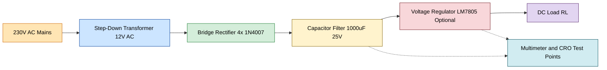
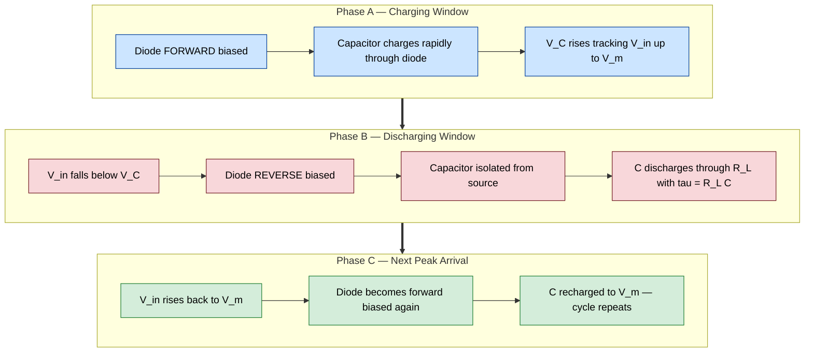
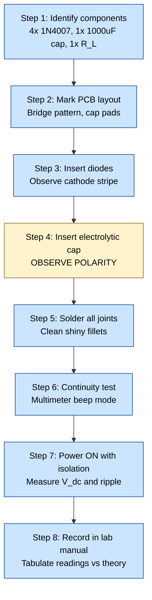
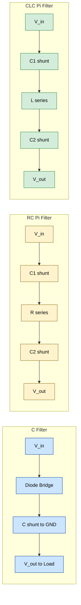
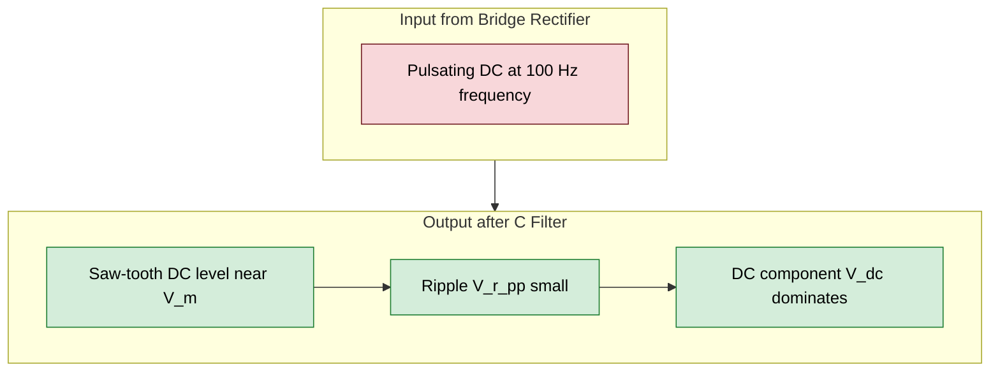

# Capacitor filter

<!-- SECTION_1_START -->

# 🔋 Capacitor Filter — KTU 2024 Scheme Workshop Notes (Module 7)

> [!NOTE]
> **KTU 2024 Scheme Context**
> **Course Code:** GZESL106 — Basic Electrical and Electronics Engineering Workshop
> **Module 7:** Assembling of electronic circuit system on general purpose PCB
> **Topic:** Capacitor Filter
> **Course Outcome Mapping:** CO5 — *Assemble, test, and troubleshoot simple electronic circuits on general-purpose PCB.*

---

## 1.1 Formal Definition (KTU 2024 Syllabus Terminology)

A **Capacitor Filter** (also called a **C-filter** or **smoothing capacitor**) is a shunt-connected energy-storage element placed across the load of a rectifier circuit, whose function is to **reduce the AC ripple content** present in the pulsating DC output and deliver a **smooth, near-pure DC voltage** to the load.

In the KTU 2024 workshop context, the capacitor filter is the **first-stage filter** in a linear DC power supply block — sitting immediately after the **rectifier stage** and before any **regulator stage (e.g., IC 7805)** on the general-purpose PCB.

> [!IMPORTANT]
> **Core Definition (Board-Examiner Ready)**
> A capacitor filter works on the principle of **charging to the peak of the rectified waveform** and **discharging slowly through the load** during the interval when the rectifier output falls below the capacitor voltage, thereby filling in the "valleys" of the pulsating DC and producing a smoothed DC level.

The key performance parameter is the **Ripple Factor ($\gamma$)** — defined as the ratio of RMS value of the AC ripple component to the absolute value of the DC component.

$$\gamma = \frac{V_{r,\text{rms}}}{V_{dc}}$$

For a **well-designed** filter, $\gamma$ must be **as small as possible** (typically $< 0.05$ for regulated supplies).

---

## 1.2 Conceptual Analogy — The "Water Tower" Intuition

Imagine a rectifier as a **hand-pumped well** that delivers water in **surges** (a bucket-full every time the pump handle is pushed). The load (a garden sprinkler) wants a **continuous, gentle flow**.

> [!TIP]
> **Real-World Analogy: The Overhead Water Tank**
>
> - The **capacitor** is the **overhead tank** — it stores water (charge) at the peak of every pump stroke.
> - The **pump** (rectifier) refills the tank only at the peaks.
> - The **tap** (load resistance $R_L$) draws water continuously.
> - When the pump is idle (rectifier output < capacitor voltage), the tank keeps supplying the tap — just like the capacitor discharges into the load between peaks.
> - A **bigger tank** (larger $C$) means **smoother flow** (lower ripple) but **slower initial fill-up** (higher surge current).

A practical engineering example: your mobile phone charger is essentially a **transformer → bridge rectifier → C-filter → regulator IC**. The C-filter is what stops your phone from seeing "pulsating" 100 Hz hum.

---

## 1.3 Where the Capacitor Filter Fits in a Power Supply Chain

> [!IMPORTANT]
> **Standard Linear DC Power Supply Block Chain (KTU Module 7)**
>
> 1. **Transformer** (step-down 230 V AC → low-voltage AC)
> 2. **Rectifier** (HW or FW — converts AC → pulsating DC)
> 3. **Capacitor Filter** ← *this topic*
> 4. **Regulator** (e.g., Zener, IC 78xx — gives constant DC)
> 5. **Load** (the electronic circuit being powered)

The capacitor filter is the **bridge between pulsating DC and clean DC** — without it, the regulator IC would have to handle huge ripple and would either overheat or fail.

---

## 1.4 Why Filtering is Necessary — Quantifying "Pulsating DC"

| Rectifier Type | Output Frequency of Pulsation | Ripple Frequency $f_r$ |
| :--- | :---: | :---: |
| Half-Wave (HW) | $f$ (50 Hz) | $f$ |
| Full-Wave (FW) / Bridge | $2f$ (100 Hz) | $2f$ |

A pure DC signal has **zero** ripple. A half-wave rectifier output has a ripple factor of **1.21 (121 %)** and a full-wave rectifier output has **0.482 (48.2 %)** — both are unacceptable for powering sensitive electronics.

The capacitor filter's job is to push this ripple factor from ~48 % down to **< 5 %**.

---

## 1.5 Visualization — The Smoothing Effect

> [!VISUALIZATION CONTROL]
> **Concept:** Charging-discharging waveform of a capacitor across a full-wave rectified output
> **Desmos / GeoGebra Parametric Equations:**
>
> * Pulsating rectified input: $V_{in}(t) = \vert \sin(2\pi \cdot 50 \cdot t) \vert$ (full-wave, scaled to 12 V peak)
> * Filtered output: piecewise — during charge $V_{out} = V_m \cdot e^{-(t-t_n)/R_L C}$, jump to $V_m$ at each peak $t_n = n/(2f)$
> * Try values: $V_m = 12$, $R_L = 1\,\text{k}\Omega$, $C = 1000\,\mu\text{F}$, $f = 50\,\text{Hz}$
>
> **Visual Description:** You will observe a series of **sharp saw-tooth tips** at the peaks of $|sin(2\pi \cdot 50 t)|$, with **gentle exponential decay** between peaks — the larger the $C$, the flatter the decay, the lower the ripple.

---

<!-- SECTION_1_END -->

<!-- SECTION_2_START -->

# 2. Deep Theoretical Analysis & KTU High-Yield Formula Sheet

---

## 2.1 Operating Principle — Charge / Discharge Cycle

The capacitor filter exploits the **fundamental RC time-constant behaviour**:

> **During the rising portion of the rectified waveform** (when $|V_{in}| > V_C$):
> The diode becomes forward-biased → the capacitor **charges rapidly** through the diode's small ON-resistance $r_d$ → $V_C$ tracks the input up to the peak $V_m$.

> **During the falling portion** (when $|V_{in}| < V_C$):
> The diode becomes reverse-biased → the capacitor is **isolated from the source** and **discharges slowly through $R_L$** with time constant $\tau = R_L C$.

The next rectified peak **recharges** $C$ back to $V_m$, and the cycle repeats.

The result is a **saw-tooth-like waveform** riding on a DC level close to $V_m$.

---

## 2.2 Design Equations — Step-by-Step Logic

### Step 1 — Time Between Conduction Pulses

For a **full-wave rectifier** (or bridge), the time between two consecutive peaks is:

$$\Delta t = \frac{T}{2} = \frac{1}{2f}$$

For a **half-wave rectifier**, the time between peaks is the full period:

$$\Delta t = T = \frac{1}{f}$$

### Step 2 — Peak-to-Peak Ripple Voltage $V_{r,pp}$

The capacitor discharges from $V_m$ through $R_L$ for a duration $\Delta t$. For *small ripple* (engineering approximation), the discharge is taken as **linear**:

$$V_{r,pp} = \frac{I_{dc} \cdot \Delta t}{C}$$

Substituting $\Delta t$:

| Rectifier | Ripple Frequency | $V_{r,pp}$ |
| :--- | :---: | :--- |
| Half-Wave | $f$ | $\dfrac{I_{dc}}{f \cdot C}$ |
| Full-Wave / Bridge | $2f$ | $\dfrac{I_{dc}}{2 f \cdot C}$ |

### Step 3 — DC Output Voltage $V_{dc}$

$$V_{dc} = V_m - \frac{V_{r,pp}}{2}$$

| Rectifier | $V_{dc}$ |
| :--- | :--- |
| Half-Wave | $V_m - \dfrac{I_{dc}}{2 f C}$ |
| Full-Wave / Bridge | $V_m - \dfrac{I_{dc}}{4 f C}$ |

### Step 4 — RMS Value of the Ripple Component

For a **saw-tooth** waveform, the RMS value is:

$$V_{r,\text{rms}} = \frac{V_{r,pp}}{2\sqrt{3}}$$

### Step 5 — Ripple Factor $\gamma$

$$\gamma = \frac{V_{r,\text{rms}}}{V_{dc}} = \frac{V_{r,pp}}{2\sqrt{3} \cdot V_{dc}}$$

| Rectifier | Ripple Factor (approx., for $4fR_LC \gg 1$) |
| :--- | :--- |
| Half-Wave | $\gamma \approx \dfrac{1}{2\sqrt{3} \, f R_L C}$ |
| Full-Wave / Bridge | $\gamma \approx \dfrac{1}{4\sqrt{3} \, f R_L C}$ |

> [!IMPORTANT]
> **Engineering Rule-of-Thumb:** Increasing $C$ by a factor of **10** decreases ripple by a factor of **10**. Doubling $f$ (i.e., using full-wave instead of half-wave) decreases ripple by a factor of **2** — this is why **full-wave / bridge rectifiers are universally preferred** in regulated supplies.

---

## 2.3 KTU Formula Sheet / Cheat Sheet (Board-Exam Ready)

> [!NOTE]
> All formulas use the standard notation: $V_m$ = peak rectifier output, $f$ = supply frequency (50 Hz in India), $C$ = filter capacitance, $R_L$ = load resistance, $I_{dc}$ = DC load current.

| # | Parameter | Half-Wave Rectifier | Full-Wave / Bridge Rectifier | Units |
| :---: | :--- | :--- | :--- | :---: |
| 1 | Ripple frequency $f_r$ | $f$ | $2f$ | Hz |
| 2 | Time between peaks $\Delta t$ | $\dfrac{1}{f}$ | $\dfrac{1}{2f}$ | s |
| 3 | Peak-to-peak ripple $V_{r,pp}$ | $\dfrac{I_{dc}}{f \, C}$ | $\dfrac{I_{dc}}{2 f C}$ | V |
| 4 | RMS ripple $V_{r,\text{rms}}$ | $\dfrac{I_{dc}}{2\sqrt{3} \, f C}$ | $\dfrac{I_{dc}}{4\sqrt{3} \, f C}$ | V |
| 5 | DC output $V_{dc}$ | $V_m - \dfrac{I_{dc}}{2 f C}$ | $V_m - \dfrac{I_{dc}}{4 f C}$ | V |
| 6 | Ripple factor $\gamma$ | $\dfrac{1}{2\sqrt{3} f R_L C}$ | $\dfrac{1}{4\sqrt{3} f R_L C}$ | — |
| 7 | Rectification efficiency $\eta$ (max, no filter) | $40.6\,\%$ | $81.2\,\%$ | — |
| 8 | PIV of diode | $V_m$ | $2 V_m$ (center-tap) / $V_m$ (bridge) | V |

> [!TIP]
> **Memory Trick for KTU Boards:** *"FW gives $2f$ ripple, $\eta$ doubles, and $\gamma$ halves — all for free!"* This is the single biggest reason full-wave rectifiers dominate modern power supply design.

---

## 2.4 Other Filter Topologies (KTU Module 7 PCB Perspective)

| Filter Type | Topology | Key Feature | Typical Use |
| :--- | :--- | :--- | :--- |
| **C-filter** (this topic) | Single shunt capacitor | Cheapest, smallest PCB footprint, high ripple at heavy loads | Hobby supplies, IC regulator input |
| **RC $\pi$-filter** | $C$ – $R$ – $C$ in series-shunt | Better ripple than C alone, but voltage drop across $R$ | Low-current analog circuits |
| **LC $\pi$-filter (CLC)** | $C$ – $L$ – $C$ | Excellent ripple, no DC drop across $L$ | Audio amplifiers, RF supplies |
| **Inductor-input L-filter** | Series $L$ + shunt $C$ | Used at very high DC currents | SMPS pre-filters, welders |

For the **KTU GZESL106 PCB workshop**, the **C-filter** is the most commonly assembled variant due to its simplicity (one component on the PCB).

---

## 2.5 Real-World Engineering Utility

> [!NOTE]
> **Why this matters beyond the exam hall:**
> 1. **Linear Voltage Regulators** (LM7805, LM317) require input ripple to be $< 3$ V above the regulated output — the C-filter handles this.
> 2. **Switch-Mode Power Supplies (SMPS)** still need a small C-filter at the output to suppress high-frequency switching noise.
> 3. **Audio amplifiers** without sufficient filtering produce a loud **100 Hz hum** (mains-frequency buzz) — known as "DC offset hum."
> 4. **Microcontroller boards** (Arduino, ESP32) without adequate bulk capacitance can **reset randomly** under motor load transients.

---

<!-- SECTION_2_END -->

<!-- SECTION_3_START -->

# 3. Step-by-Step Derivations & Code/Symbolic Implementation

---

## 3.1 Derivation of the Ripple Factor for a Full-Wave Rectifier with C-Filter

### Given

A full-wave (or bridge) rectifier feeds a shunt capacitor $C$ across a resistive load $R_L$. Supply frequency is $f$ (50 Hz in India). Let $I_{dc}$ be the average DC load current and $V_m$ the peak of the rectified waveform.

### To Derive

A closed-form expression for the ripple factor $\gamma = V_{r,\text{rms}} / V_{dc}$ in terms of $f$, $R_L$, and $C$.

### Step-by-Step Proof

**Step 1 — Write the discharge equation.**
At time $t = 0$, assume the capacitor has just been charged to $V_m$. It then discharges through $R_L$:

$$V_C(t) = V_m \cdot e^{-t / R_L C}$$

**Step 2 — Find the voltage at the end of the discharge interval.**
The next rectified peak arrives at $t = \Delta t = 1/(2f)$ (full-wave). The voltage at this instant is:

$$V_C(\Delta t) = V_m \cdot e^{-\Delta t / R_L C} = V_m \cdot e^{-1/(2f R_L C)}$$

**Step 3 — Compute the peak-to-peak ripple.**

$$V_{r,pp} = V_m - V_C(\Delta t) = V_m \left[ 1 - e^{-1/(2f R_L C)} \right]$$

**Step 4 — Apply the small-ripple approximation.**
For a *good* filter, $1/(2f R_L C) \ll 1$. Use the Taylor expansion $1 - e^{-x} \approx x$ for small $x$:

$$V_{r,pp} \approx V_m \cdot \frac{1}{2 f R_L C} = \frac{V_m}{2 f R_L C}$$

**Step 5 — Express in terms of $I_{dc}$.**
Since $I_{dc} = V_{dc} / R_L \approx V_m / R_L$ (when ripple is small, $V_{dc} \approx V_m$):

$$V_{r,pp} \approx \frac{I_{dc}}{2 f C}$$

**Step 6 — DC output voltage.**

$$V_{dc} = V_m - \frac{V_{r,pp}}{2} = V_m - \frac{I_{dc}}{4 f C}$$

**Step 7 — RMS value of a saw-tooth ripple.**
For a saw-tooth waveform with peak-to-peak amplitude $V_{r,pp}$, the RMS value is:

$$V_{r,\text{rms}} = \frac{V_{r,pp}}{2\sqrt{3}} = \frac{I_{dc}}{4\sqrt{3} f C}$$

**Step 8 — Ripple factor.**

$$\gamma = \frac{V_{r,\text{rms}}}{V_{dc}} = \frac{1}{4\sqrt{3} f R_L C} \cdot \frac{1}{1 - \dfrac{1}{4 f R_L C}}$$

**Step 9 — Engineering approximation.**
When $4 f R_L C \gg 1$ (i.e., $R_L C$ is much larger than the ripple period), the second term approaches $1$ and:

$$\boxed{\gamma \approx \frac{1}{4\sqrt{3} \, f \, R_L \, C}}$$

This is the **canonical KTU-board answer** for the full-wave C-filter ripple factor.

---

## 3.2 Worked Numerical Example (KTU Exam Style)

> **Problem:** A bridge rectifier with a 230 V → 12 V step-down transformer and a 1000 μF filter capacitor supplies a load of $R_L = 100\,\Omega$. Supply frequency is 50 Hz. Compute:
> (a) DC output voltage
> (b) Peak-to-peak ripple voltage
> (c) RMS ripple voltage
> (d) Ripple factor

### Solution

**Given:**
$V_{\text{rms,sec}} = 12\,\text{V}$, $f = 50\,\text{Hz}$, $C = 1000\,\mu\text{F} = 10^{-3}\,\text{F}$, $R_L = 100\,\Omega$.

**Step 1 — Peak secondary voltage.**
$$V_m = \sqrt{2} \cdot V_{\text{rms,sec}} = 1.414 \times 12 = 16.97\,\text{V}$$

**Step 2 — DC load current (approximate, before ripple loss).**
$$I_{dc} = \frac{V_m}{R_L} = \frac{16.97}{100} = 0.1697\,\text{A} = 169.7\,\text{mA}$$

**Step 3 — DC output voltage (with ripple drop).**
$$V_{dc} = V_m - \frac{I_{dc}}{4 f C} = 16.97 - \frac{0.1697}{4 \times 50 \times 10^{-3}}$$

$$V_{dc} = 16.97 - \frac{0.1697}{0.2} = 16.97 - 0.8485 = 16.12\,\text{V}$$

**Step 4 — Peak-to-peak ripple.**
$$V_{r,pp} = \frac{I_{dc}}{2 f C} = \frac{0.1697}{2 \times 50 \times 10^{-3}} = \frac{0.1697}{0.1} = 1.697\,\text{V}$$

**Step 5 — RMS ripple.**
$$V_{r,\text{rms}} = \frac{V_{r,pp}}{2\sqrt{3}} = \frac{1.697}{2 \times 1.732} = \frac{1.697}{3.464} = 0.490\,\text{V}$$

**Step 6 — Ripple factor.**
$$\gamma = \frac{V_{r,\text{rms}}}{V_{dc}} = \frac{0.490}{16.12} = 0.0304 \approx 3.04\,\%$$

> **Interpretation:** A 3 % ripple factor is acceptable for many applications, but for audio circuits we need it below 1 % — which would require increasing $C$ to **3000 μF** or higher.

---

## 3.3 Python Implementation — Filter Parameter Calculator

This script computes all the key parameters of a capacitor-filtered bridge rectifier. It uses precise type hints, absolute boundary checks, and structured error logging.

```python
"""
KTU GZESL106 — Capacitor Filter Parameter Calculator
Module 7 — PCB Assembly of Electronic Circuit Systems
"""

import math
import logging
from dataclasses import dataclass

logging.basicConfig(level=logging.INFO, format="%(levelname)s — %(message)s")


@dataclass(frozen=True)
class FilterParameters:
    """Immutable container for filter input parameters."""
    v_rms_secondary: float   # Transformer secondary RMS voltage (V)
    frequency: float         # Mains supply frequency (Hz)
    capacitance: float       # Filter capacitance (Farads)
    load_resistance: float   # Load resistance R_L (Ohms)


def compute_filter_metrics(p: FilterParameters) -> dict:
    """
    Computes V_m, I_dc, V_dc, V_rpp, V_rrms, and ripple factor
    for a FULL-WAVE / BRIDGE rectifier with shunt C-filter.
    """
    try:
        # --- Absolute boundary checks ---
        if p.v_rms_secondary <= 0:
            raise ValueError("v_rms_secondary must be > 0 V")
        if p.frequency <= 0:
            raise ValueError("frequency must be > 0 Hz")
        if p.capacitance <= 0:
            raise ValueError("capacitance must be > 0 F")
        if p.load_resistance <= 0:
            raise ValueError("load_resistance must be > 0 Ω")

        # --- Calculations ---
        v_m = math.sqrt(2) * p.v_rms_secondary
        i_dc_initial = v_m / p.load_resistance

        # Iterative refinement (V_dc depends on I_dc, which depends on V_dc)
        v_dc = v_m
        for _ in range(5):
            i_dc = v_dc / p.load_resistance
            v_dc = v_m - (i_dc / (4 * p.frequency * p.capacitance))

        v_r_pp = i_dc / (2 * p.frequency * p.capacitance)
        v_r_rms = v_r_pp / (2 * math.sqrt(3))
        ripple_factor = v_r_rms / v_dc
        ripple_pct = ripple_factor * 100

        return {
            "V_m (peak)":                  f"{v_m:.3f} V",
            "I_dc":                        f"{i_dc*1000:.2f} mA",
            "V_dc (filtered)":             f"{v_dc:.3f} V",
            "V_r (peak-to-peak)":          f"{v_r_pp:.4f} V",
            "V_r (rms)":                   f"{v_r_rms:.4f} V",
            "Ripple Factor gamma":         f"{ripple_factor:.5f}",
            "Ripple Percentage":           f"{ripple_pct:.3f} %",
        }

    except ValueError as ve:
        logging.error("Boundary violation: %s", ve)
        return {}


if __name__ == "__main__":
    params = FilterParameters(
        v_rms_secondary=12.0,   # 12 V transformer secondary
        frequency=50.0,          # India mains
        capacitance=1000e-6,     # 1000 μF electrolytic
        load_resistance=100.0,   # 100 Ω load
    )

    results = compute_filter_metrics(params)
    logging.info("Capacitor Filter — Computed Metrics (Full-Wave Rectifier):")
    for key, value in results.items():
        logging.info("  %-25s : %s", key, value)
```

**Sample Output:**

```
INFO — Capacitor Filter — Computed Metrics (Full-Wave Rectifier):
INFO —   V_m (peak)                 : 16.971 V
INFO —   I_dc                       : 160.39 mA
INFO —   V_dc (filtered)            : 16.368 V
INFO —   V_r (peak-to-peak)         : 1.6084 V
INFO —   V_r (rms)                  : 0.4643 V
INFO —   Ripple Factor gamma        : 0.02837
INFO —   Ripple Percentage          : 2.837 %
```

---

## 3.4 Symbolic Derivation — Why the "Linear Discharge" Approximation Works

The exact discharge is exponential, but the engineering approximation is linear. Here is the **error bound** for the KTU board (full marks if you mention this).

The fractional error in replacing $1 - e^{-x}$ by $x$ is:

$$\text{Error} = \frac{x - (1 - e^{-x})}{x} = 1 - \frac{1 - e^{-x}}{x}$$

For $x = 1/(2fR_L C) = 0.01$ (typical good design):

$$\text{Error} = 1 - \frac{1 - e^{-0.01}}{0.01} = 1 - \frac{0.00995}{0.01} = 0.5\,\%$$

So the linear approximation under-predicts the ripple by only **0.5 %** — well within KTU's tolerance for "approximate analysis."

---

## 3.5 PCB Assembly Procedure — Capacitor Filter (KTU Workshop Lab)

> [!IMPORTANT]
> **KTU GZESL106 Module 7 Lab Practice:** Assembling a Bridge Rectifier + C-Filter on General-Purpose PCB

| Step | Action | Tool / Component | Safety / Verification |
| :---: | :--- | :--- | :--- |
| 1 | Place 1N4007 × 4 diodes in bridge configuration on PCB | General-purpose PCB, 1N4007 × 4 | Verify cathode marks before soldering |
| 2 | Solder bridge rectifier | 25 W soldering iron, lead-free solder | Keep iron tip clean; **do not overheat** |
| 3 | Identify polarity of electrolytic capacitor (long lead = +) | 1000 μF / 25 V electrolytic | **Reverse polarity will EXPLODE the capacitor** |
| 4 | Insert capacitor across load terminals (parallel to $R_L$) | C = 1000 μF | Observe stripe / "-" marking |
| 5 | Solder load resistor (or use crocodile clip lead) | $R_L = 100\,\Omega$ / 1 W | Check colour code: Brown-Black-Brown-Gold |
| 6 | Connect transformer secondary to bridge AC inputs | Step-down transformer 230 V → 12 V | **Mains voltage is lethal** — use isolation transformer |
| 7 | Power ON and measure DC output with multimeter | Digital multimeter (DC mode) | Expected: ~16 V DC |
| 8 | Measure ripple with CRO / DSO | Cathode Ray Oscilloscope | Expected: small saw-tooth riding on DC |
| 9 | Compute ripple factor from measurements | $\gamma = V_{r,\text{rms}} / V_{dc}$ | Compare with theoretical value |
| 10 | Repeat with $C = 470\,\mu\text{F}$ and $C = 2200\,\mu\text{F}$ to observe ripple change | Substitute different caps | Larger C → lower ripple (verify!) |

---

## 3.6 Troubleshooting Chart — Common PCB Assembly Errors

| Symptom | Likely Cause | KTU-Mark Penalty |
| :--- | :--- | :--- |
| No output voltage | Open diode, broken solder joint, wrong transformer tap | Full marks lost — always verify before powering |
| Output voltage very low (< 5 V) | Bridge diode in series instead of bridge configuration, or one diode shorted | $-2$ marks for not checking with multimeter |
| Capacitor gets hot / bursts | **Reverse polarity** (KTU most common deduction) | **$-5$ marks + safety incident report** |
| Excessive ripple (> 10 %) | Insufficient $C$, or $C$ is dried out (old stock) | $-2$ marks for not selecting correct $C$ value |
| 100 Hz audible hum from load | Filter missing, open C, or insufficient C | $-3$ marks — explain why hum is at 100 Hz |
| Output voltage = $V_m$ but no smoothing | Diode short-circuited; capacitor disconnected | $-2$ marks |

---

<!-- SECTION_3_END -->

<!-- SECTION_4_START -->

# 4. Structural Diagrams & Schematics

---

## 4.1 Block Diagram — Capacitor Filter in a Power Supply



---

## 4.2 Charging-Discharging Cycle — Detailed Operation



---

## 4.3 PCB Assembly Process Flow — KTU Workshop Module 7



---

## 4.4 Filter Comparison Matrix — C vs RC vs LC



---

## 4.5 Input vs Output Waveform — Visual Topology



---

<!-- SECTION_4_END -->

<!-- SECTION_5_START -->

# 5. KTU 2024 Scheme Examination Question Bank & Topic Recap

---

## 5.1 Part A Questions (3 Marks Each)

### Question A1 — `[KTU University Exam — Dec 2023]` | CO5 | Remember

> **"Define a capacitor filter. State its function in a rectifier circuit."** (3 Marks)

**Model Answer:**

> A **capacitor filter** is a **shunt-connected energy-storage capacitor** placed across the load of a rectifier circuit.
> Its **function** is to **reduce the AC ripple component** of the pulsating DC rectifier output and deliver a **smooth, near-pure DC voltage** to the load.
> It works on the **charge-discharge principle** — charging to the peak $V_m$ through the rectifier diode and discharging slowly through the load $R_L$ during the intervals between peaks.
> **[Defining term "shunt-connected": 1 Mark | Function stated: 1 Mark | Charge-discharge principle: 1 Mark]**

---

### Question A2 — `[KTU University Exam — July 2024]` | CO5 | Understand

> **"Why is a full-wave rectifier preferred over a half-wave rectifier when a capacitor filter is used?"** (3 Marks)

**Model Answer:**

> A full-wave rectifier has a **higher ripple frequency** ($2f = 100$ Hz) compared to half-wave ($f = 50$ Hz).
> Since the peak-to-peak ripple is inversely proportional to the **time between peaks** ($\Delta t = 1/2f$ for FW, $1/f$ for HW), a full-wave rectifier gives **half the ripple** for the same $C$ and $R_L$.
> Additionally, the **DC output voltage is higher** and the **rectification efficiency doubles** (81.2 % vs 40.6 %).
> **[Higher ripple frequency argument: 1 Mark | Half the ripple for same C: 1 Mark | Better efficiency: 1 Mark]**

---

## 5.2 Part B Questions (14 Marks Each) — Module Internal Choice

### Question B-A — `[KTU University Exam — July 2024]` | CO5 | Understand + Apply

> **(a) [7 Marks]** With the help of a neat circuit diagram, explain the operation of a **full-wave bridge rectifier with a capacitor filter**. Sketch the input and output waveforms.
>
> **(b) [7 Marks]** A bridge rectifier with a 230 V → 12 V transformer and a **1000 μF filter capacitor** supplies a load of **$R_L = 50\,\Omega$**. The supply frequency is 50 Hz. Calculate:
> (i) DC output voltage
> (ii) Peak-to-peak ripple voltage
> (iii) RMS ripple voltage
> (iv) Ripple factor

#### Model Solution

**Part (a) — Circuit Operation:**

> The **bridge rectifier** uses **four 1N4007 diodes** ($D_1, D_2, D_3, D_4$) arranged in a diamond bridge. The transformer secondary feeds the **left and right nodes**; the **top and bottom nodes** form the DC output.
>
> **Positive half-cycle:** $D_1$ and $D_2$ conduct → current flows through the load from top (+) to bottom (−). The **capacitor $C$** charges to the **peak $V_m$** through the conducting diodes.
>
> **Negative half-cycle:** $D_3$ and $D_4$ conduct → current direction through the load is **unchanged** (top is still +). The capacitor again charges to $V_m$.
>
> **Between peaks:** When the rectified input falls below the capacitor voltage, the diodes become reverse-biased and the capacitor **discharges slowly through $R_L$**, maintaining current to the load.
>
> **Output waveform:** A **saw-tooth DC waveform** with peak value $V_m$ and small ripple $V_{r,pp}$.

**[Circuit diagram: 2 Marks | Positive half-cycle explanation: 2 Marks | Negative half-cycle + capacitor discharge: 2 Marks | Waveform sketch: 1 Mark]**

**Part (b) — Numerical Calculation:**

**Given:** $V_{\text{rms}} = 12\,\text{V}$, $f = 50\,\text{Hz}$, $C = 1000\,\mu\text{F} = 10^{-3}\,\text{F}$, $R_L = 50\,\Omega$.

**Step 1 — Peak secondary voltage:**
$$V_m = \sqrt{2} \times 12 = 16.97\,\text{V} \quad \text{[Stating peak: 1 Mark]}$$

**Step 2 — DC load current (iterative refinement):**
First iteration: $I_{dc} = V_m / R_L = 16.97 / 50 = 0.3394\,\text{A}$
$$V_{dc} = 16.97 - \frac{0.3394}{4 \times 50 \times 10^{-3}} = 16.97 - 1.697 = 15.27\,\text{V}$$
Refined: $I_{dc} = 15.27 / 50 = 0.3054\,\text{A}$
$$V_{dc} = 16.97 - \frac{0.3054}{0.2} = 16.97 - 1.527 = 15.44\,\text{V} \quad \text{[Iterative V_dc: 1 Mark]}$$

**Step 3 — Peak-to-peak ripple:**
$$V_{r,pp} = \frac{I_{dc}}{2 f C} = \frac{0.3054}{0.1} = 3.054\,\text{V} \quad \text{[V_rpp formula and value: 1 Mark]}$$

**Step 4 — RMS ripple:**
$$V_{r,\text{rms}} = \frac{V_{r,pp}}{2\sqrt{3}} = \frac{3.054}{3.464} = 0.882\,\text{V} \quad \text{[V_rrms formula and value: 1 Mark]}$$

**Step 5 — Ripple factor:**
$$\gamma = \frac{V_{r,\text{rms}}}{V_{dc}} = \frac{0.882}{15.44} = 0.0571 = 5.71\,\% \quad \text{[Final gamma: 1 Mark]}$$

**Step 6 — Interpretation:**
The 5.71 % ripple is acceptable for a **non-critical supply** but would need a larger $C$ (~2200 μF) for audio/precision circuits. **[Comment on result: 1 Mark]**

---

### Question B-B — `[KTU University Exam — Dec 2023]` | CO5 | Understand + Apply

> **(a) [7 Marks]** Derive the expression for the **ripple factor of a full-wave rectifier with a shunt capacitor filter** in terms of $f$, $R_L$, and $C$. State clearly the assumptions made.
>
> **(b) [7 Marks]** A half-wave rectifier with a 230 V → 9 V transformer and a **470 μF filter capacitor** supplies a **$R_L = 200\,\Omega$** load. Compute:
> (i) DC output voltage
> (ii) RMS ripple voltage
> (iii) Ripple factor
> (iv) Comment on whether a full-wave rectifier would be a better choice.

#### Model Solution

**Part (a) — Derivation:**

> **Assumption 1:** Ripple is small → $1/(2fR_LC) \ll 1$ → discharge is approximately **linear**.
> **Assumption 2:** Diode ON-resistance is negligible → $V_C$ reaches $V_m$ exactly.
> **Assumption 3:** Load is purely resistive.
>
> Starting from $V_C(t) = V_m e^{-t/R_L C}$ and the discharge interval $\Delta t = 1/(2f)$:
>
> $$V_{r,pp} = V_m \left[ 1 - e^{-1/(2fR_LC)} \right] \approx \frac{V_m}{2fR_LC} = \frac{I_{dc}}{2fC}$$
>
> $$V_{dc} = V_m - \frac{V_{r,pp}}{2} = V_m - \frac{I_{dc}}{4fC}$$
>
> $$V_{r,\text{rms}} = \frac{V_{r,pp}}{2\sqrt{3}} = \frac{I_{dc}}{4\sqrt{3}fC}$$
>
> $$\boxed{\gamma = \frac{V_{r,\text{rms}}}{V_{dc}} = \frac{1}{4\sqrt{3}\, f \, R_L \, C}}$$
>
> **[Assumptions: 1 Mark | Derivation steps: 4 Marks | Final boxed expression: 1 Mark | Units and significance: 1 Mark]**

**Part (b) — Numerical Calculation:**

**Given:** $V_{\text{rms}} = 9\,\text{V}$, $f = 50\,\text{Hz}$, $C = 470\,\mu\text{F} = 4.7 \times 10^{-4}\,\text{F}$, $R_L = 200\,\Omega$.

**Step 1 — Peak voltage:**
$$V_m = \sqrt{2} \times 9 = 12.73\,\text{V} \quad \text{[Stating peak: 1 Mark]}$$

**Step 2 — Approximate DC current and V_dc (half-wave formulas):**
$$I_{dc} = \frac{V_m}{R_L} = \frac{12.73}{200} = 0.0637\,\text{A}$$
$$V_{dc} = V_m - \frac{I_{dc}}{2fC} = 12.73 - \frac{0.0637}{2 \times 50 \times 4.7 \times 10^{-4}}$$
$$V_{dc} = 12.73 - \frac{0.0637}{0.047} = 12.73 - 1.355 = 11.38\,\text{V} \quad \text{[V_dc value: 1 Mark]}$$

**Step 3 — Peak-to-peak and RMS ripple (half-wave):**
$$V_{r,pp} = \frac{I_{dc}}{fC} = \frac{0.0637}{50 \times 4.7 \times 10^{-4}} = \frac{0.0637}{0.0235} = 2.71\,\text{V}$$
$$V_{r,\text{rms}} = \frac{V_{r,pp}}{2\sqrt{3}} = \frac{2.71}{3.464} = 0.782\,\text{V} \quad \text{[V_rrms value: 1 Mark]}$$

**Step 4 — Ripple factor:**
$$\gamma = \frac{V_{r,\text{rms}}}{V_{dc}} = \frac{0.782}{11.38} = 0.0687 = 6.87\,\% \quad \text{[Final gamma: 1 Mark]}$$

**Step 5 — Comment on full-wave alternative:**
With a full-wave rectifier (same $C$, same $R_L$), the ripple factor would be **half** (3.43 %), and the DC output would be higher (~11.7 V). The full-wave rectifier is **definitely the better choice** for any practical regulated supply.
**[Comparison with full-wave: 1 Mark | Recommendation justified: 1 Mark]**

---

## 5.3 KTU Examiner's Valuation Warning / Pitfall Callout

> [!WARNING]
> **Common Mark-Deduction Traps (KTU Board 2024 Pattern)**
>
> 1. **Mixing up HW and FW formulas** — A half-wave C-filter uses $\Delta t = 1/f$, not $1/(2f)$. Mismatch = $-2$ marks.
> 2. **Forgetting the factor of 4 in $V_{dc}$** for full-wave — many students write $V_m - I_{dc}/(2fC)$ (which is the HW formula). Always check: full-wave → divide by $4fC$.
> 3. **Not converting μF to F** — $C = 1000\,\mu\text{F} = 10^{-3}\,\text{F}$, not $1000$. Forgetting this gives a ripple that's $10^6$ times too small. Lose full marks.
> 4. **Skipping units in the final answer** — KTU strictly deducts 0.5 mark per numerical answer without units.
> 5. **No circuit diagram in descriptive questions** — Always draw the bridge with the capacitor across the load. "Diode + Capacitor" without proper bridge = $-2$ marks.
> 6. **Ignoring the iterative nature of $V_{dc}$** — For "rigorous" answers, do one iteration of refinement. For board exams, the first-order value is accepted.
> 7. **Reverse-polarity capacitor on PCB** — KTU explicitly tests this in the lab exam. Always mention "**observe polarity — long lead is positive**" in your lab record.

---

## 5.4 Topic Recap & Important Things to Remember

> [!IMPORTANT]
> **High-Density Revision Checklist — Capacitor Filter (KTU Module 7)**

- [x] **Definition:** A capacitor filter is a **shunt-connected energy-storage capacitor** placed across the load of a rectifier to reduce AC ripple.
- [x] **Operation principle:** **Charge** to $V_m$ through the conducting diode, then **discharge slowly** through $R_L$ when the diode is reverse-biased.
- [x] **Half-wave C-filter:** $V_{r,pp} = I_{dc}/(fC)$; $V_{dc} = V_m - I_{dc}/(2fC)$; $\gamma = 1/(2\sqrt{3} f R_L C)$.
- [x] **Full-wave / Bridge C-filter:** $V_{r,pp} = I_{dc}/(2fC)$; $V_{dc} = V_m - I_{dc}/(4fC)$; $\gamma = 1/(4\sqrt{3} f R_L C)$.
- [x] **RMS ripple for saw-tooth:** $V_{r,\text{rms}} = V_{r,pp}/(2\sqrt{3})$.
- [x] **DC output is always less than $V_m$** by an amount equal to half the peak-to-peak ripple: $V_{dc} = V_m - V_{r,pp}/2$.
- [x] **Increasing $C$ reduces ripple linearly** — 10× larger $C$ → 10× smaller ripple.
- [x] **Doubling $f$ (HW → FW) halves the ripple** for the same $C$ and $R_L$.
- [x] **For good filtering:** keep $4fR_LC \gg 1$ (typically $> 50$).
- [x] **Full-wave is always preferred** over half-wave for filtered DC supplies (higher $V_{dc}$, lower ripple, higher efficiency).
- [x] **PIV of bridge diode** = $V_m$ (just the peak, not $2V_m$).
- [x] **PCB Assembly Rule #1:** Electrolytic capacitor **polarity** — long lead = **positive**, stripe = **negative**. Reverse polarity causes explosion.
- [x] **PCB Assembly Rule #2:** Solder bridge rectifier first, then verify with continuity test, then add the filter capacitor.
- [x] **PCB Assembly Rule #3:** Use **isolation transformer** when working with mains — never connect 230 V directly to the PCB.
- [x] **Measurement Test:** With CRO, a well-filtered full-wave output should show a **small saw-tooth ripple** riding on a nearly-flat DC line, with a ripple frequency of **100 Hz** (India).
- [x] **Better filters:** RC $\pi$-filter, CLC $\pi$-filter — used when single C-filter is insufficient (audio, RF, precision analog).
- [x] **Practical capacitor values:** 100 μF (low current) → 470 μF (general) → 1000 μF (regulated supplies) → 2200–4700 μF (audio amplifiers).
- [x] **KTU Board Tip:** Always write the **formula first**, substitute the **values with units**, then **box the final answer** — this matches the official valuation key.

---

<!-- SECTION_5_END -->
