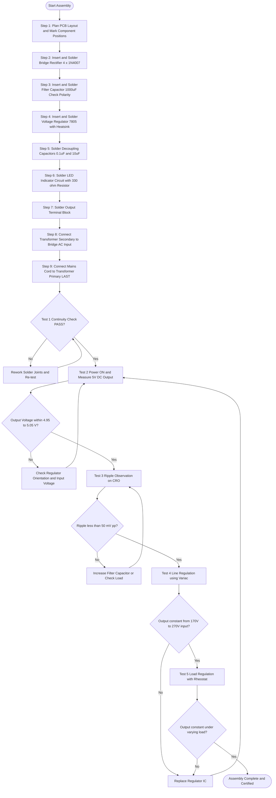
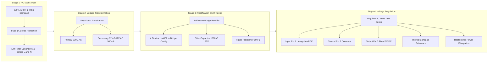
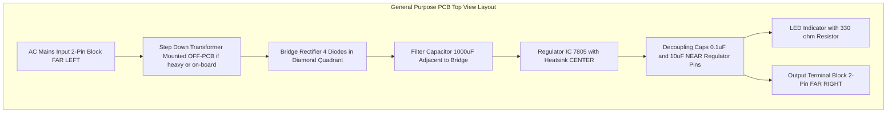

# Fixed voltage power supply with transformer

<!-- SECTION_1_START -->

# Fixed Voltage Power Supply with Transformer — Core Technical Overview

## Formal KTU 2024 Definition

A **Fixed Voltage Power Supply with Transformer** is a regulated, linear DC power supply unit (PSU) that converts the standard **230 V AC, 50 Hz** mains supply into a stable, fixed-magnitude DC output voltage (commonly **+5 V, +6 V, +9 V, or +12 V**). The circuit is assembled on a **General Purpose PCB (GPPPCB)** and constitutes the fundamental building block for all digital electronics, embedded boards, and laboratory instrumentation. The architecture strictly follows the four-stage sequence: **Step-down Transformer → Rectifier (Diode Bridge) → Filter (Capacitor) → Voltage Regulator IC**.

> [!IMPORTANT]
> **KTU Syllabus Highlight (GZESL106 — Module 7):**
> Students must physically identify each component on the GPPPCB, perform the soldering sequence in the correct order, test the output using a DMM/oscilloscope, and verify the ripple voltage. Mere block-diagram knowledge is NOT sufficient for full marks in the workshop record.

## Conceptual Analogy — The "Water Tap Reservoir" Model

Imagine a chaotic, high-pressure water pipeline arriving at your house. To drink clean water at a steady trickle, you need four things:

| Real-World Analogy | Power Supply Stage | Function |
|---|---|---|
| Pressure-reducing valve at the street | **Step-down Transformer** | Reduces 230 V AC to a low voltage AC (e.g., 12 V AC) |
| One-way swinging door | **Diode Rectifier** | Allows current to flow in one direction only, converting AC to pulsating DC |
| Big storage tank at the rooftop | **Filter Capacitor** | Smooths the pulsations by storing charge, reducing ripple |
| Pressure regulator on the tap | **Voltage Regulator IC (e.g., 7805, 7812)** | Locks the output at a fixed voltage, immune to load/input variations |

> [!NOTE]
> **Why "Fixed"?** The word *fixed* means the output is **constant and regulated** regardless of variations in the input mains voltage (typically **170 V to 270 V**) or the load current drawn. This is achieved by the regulator IC at the final stage.

## Standard Performance Metrics (Bold Constants)

- **Mains Input:** **230 V AC, 50 Hz** (India standard)
- **Typical Step-down Output:** **9-0-9 V AC** or **12-0-12 V AC**, **500 mA**
- **Standard Ripple Frequency (Full-Wave):** **2 × f = 100 Hz**
- **Common Fixed Output Voltages:** **+5 V, +6 V, +9 V, +12 V, +15 V**
- **Maximum Ripple Voltage (acceptable):** **≤ 5% of V_DC**
- **Typical Transformer Rating:** **0-12 V, 500 mA / 1 A**

> [!VISUALIZATION CONTROL]
> **Concept:** AC to DC conversion waveform transition through four stages
> **GeoGebra / Desmos Input Equations:**
> * `f1(x) = 12*sin(100*pi*x)` — Input AC waveform after transformer
> * `f2(x) = 12*abs(sin(100*pi*x))` — Full-wave rectified pulsating DC
> * `f3(x) = 10.8 + 2.4*abs(sin(100*pi*x)) - 2.4` — Filtered DC with ripple
> * `f4(x) = 5` — Final regulated fixed DC output (horizontal line)
> **Visual Description:** The student should observe (1) the sine wave riding across zero, (2) the rectified version sitting entirely above the time axis with twice the frequency, (3) the filtered waveform with a small sawtooth ripple, and (4) a perfectly flat horizontal line representing the regulated fixed output.

<!-- SECTION_1_END -->

<!-- SECTION_2_START -->

# Deep Theoretical Analysis & KTU High-Yield Formula Sheet

## The Four-Stage Operational Breakdown

### Stage 1 — Step-Down Transformer

The transformer operates on the principle of **mutual electromagnetic induction** governed by Faraday's Law. It consists of a primary winding (N₁) and a secondary winding (N₂) magnetically coupled through a laminated iron core.

- **Turns Ratio:** The voltage transformation is directly proportional to the turns ratio
- **Frequency Invariance:** The output frequency remains **50 Hz** (transformers do not change frequency)
- **Isolation Benefit:** Provides galvanic isolation between the dangerous mains and the low-voltage DC side
- **Phase Notation (Center-Tap):** A **9-0-9 V** transformer has a center-tap, allowing two identical secondary windings to be used in a full-wave rectifier configuration

### Stage 2 — Diode Bridge Rectifier (Full-Wave Bridge)

A **bridge rectifier** uses **four diodes** (D₁, D₂, D₃, D₄) arranged in a diamond configuration. During the positive half-cycle, D₁ and D₂ conduct; during the negative half-cycle, D₃ and D₄ conduct. This ensures the load current always flows in the same direction.

- **Conduction Sequence:** Two diodes conduct per half-cycle
- **Voltage Drop:** Each diode drops **≈ 0.7 V** (Silicon), so **two diodes** are in series with the load at any time → total drop ≈ **1.4 V**
- **Output Nature:** Unidirectional but pulsating DC (not smooth)
- **Frequency Doubling:** Output ripple frequency is **2f = 100 Hz** for 50 Hz input

### Stage 3 — Filter Capacitor (Smoothing)

The filter capacitor **C** is connected in parallel with the load. It charges up to the peak voltage during each half-cycle and discharges slowly through the load resistance when the diode is reverse-biased.

- **Charge-Discharge Cycle:** Capacitor charges rapidly to V_peak, then discharges exponentially
- **Ripple Voltage:** The small AC residual superimposed on the DC level
- **Time Constant Rule:** The discharge time constant **τ = R_L × C** must be **significantly larger** than the ripple period (**T = 1/100 = 10 ms**)
- **Rule of Thumb:** Choose C such that **τ ≥ 5 × T** for good filtering

### Stage 4 — Voltage Regulator IC (The "Fixed" Stage)

This is the stage that makes the output **fixed and regulated**. The most common family is the **78xx series** (positive fixed regulators) from ST Microelectronics / Texas Instruments.

- **7805** → Fixed **+5 V** output
- **7806** → Fixed **+6 V** output
- **7809** → Fixed **+9 V** output
- **7812** → Fixed **+12 V** output
- **7815** → Fixed **+15 V** output

The IC uses an internal **bandgap reference** and a **feedback control loop** to maintain the output pin at a constant voltage regardless of input fluctuations or load changes.

## KTU Formula Sheet / Cheat Sheet

| Parameter | Formula | Description | Typical Value |
|---|---|---|---|
| Transformer Turns Ratio | $\frac{V_1}{V_2} = \frac{N_1}{N_2}$ | Voltage scales with turns | $V_2 = 12$ V (typical) |
| Peak Secondary Voltage | $V_{peak} = V_{rms} \times \sqrt{2}$ | RMS to peak conversion | $12 \times 1.414 \approx 16.97$ V |
| DC Output (Unfiltered) | $V_{DC} = \frac{2 \times V_{peak}}{\pi}$ | Full-wave average | $\approx 0.9 \times V_{rms}$ |
| DC Output (Filtered) | $V_{DC} \approx V_{peak} - 1.4$ V | Subtract 2 diode drops | $\approx 15.57$ V |
| Ripple Voltage (Peak-to-Peak) | $V_{r(pp)} = \frac{I_{load}}{f_{r} \times C}$ | Where $f_r = 2f_{in}$ | $\leq 0.5$ V (good design) |
| Ripple Frequency | $f_r = 2 \times f_{in}$ | Full-wave doubling | **100 Hz** (for 50 Hz mains) |
| Required Filter Capacitance | $C = \frac{I_{load}}{V_{r(pp)} \times f_r}$ | Solve for C | $\geq 470$ $\mu$F (typical) |
| Regulator Dropout | $V_{in(min)} = V_{out} + V_{dropout}$ | $V_{dropout} \approx 2$ V for 78xx | e.g., 7805 needs $\geq 7$ V input |
| Power Dissipation (Regulator) | $P_D = (V_{in} - V_{out}) \times I_{load}$ | Heat generated by IC | Requires heatsink if > 1 W |
| Transformer VA Rating | $VA = V_2 \times I_2$ | Size the transformer | e.g., $12$ V $\times$ $1$ A $= 12$ VA |

> [!NOTE]
> **Critical KTU Pitfall:** Students often forget to subtract the **2 × 0.7 V = 1.4 V** diode drops from the peak voltage when calculating the DC value. Always remember that the bridge rectifier has **two diodes in the conduction path** at any given instant.

## Real-World Engineering Utility

- **Embedded Systems & Microcontrollers:** Every Arduino, Raspberry Pi, ESP32, and 8051 development board contains an identical (or surface-mount variant) of this circuit for its +5 V or +3.3 V rail
- **Mobile Phone Chargers:** Modern SMPS-based chargers are the switched-mode equivalent of this linear supply
- **Laboratory Bench Power Supplies:** The fixed-voltage output rail in dual/multi-output bench supplies
- **Consumer Electronics:** Toys, calculators, remote controls, cordless phones, set-top boxes
- **Industrial Control Panels:** PLC input modules, sensor excitation, relay driver boards
- **Test & Measurement Equipment:** Digital multimeters, signal generators, oscilloscope auxiliary rails

> [!IMPORTANT]
> **Production Note:** While modern devices use **Switched-Mode Power Supplies (SMPS)** for efficiency (>85%), the linear transformer-based fixed voltage supply remains the **standard teaching circuit** in KTU workshops because it physically exposes every stage of AC-to-DC conversion to the learner.

<!-- SECTION_2_END -->

<!-- SECTION_3_START -->

# Step-by-Step Implementation — PCB Assembly Procedure

## 3.1 Component Identification & Pin Configuration

> [!NOTE]
> The following table is the **master reference** for the KTU workshop record. Students are expected to draw this table (or equivalent) neatly in the observation notebook.

| Sl. No. | Component | Specification | Quantity | Pin / Terminal Identification | Polarity Check |
|---|---|---|---|---|---|
| 1 | Step-down Transformer | 230 V AC Primary / 12 V-0-12 V AC Secondary, 500 mA / 1 A | 1 | Primary: Two pins (mains side); Secondary: Three pins (with center-tap marked "0" or "CT") | AC — no polarity |
| 2 | Bridge Rectifier IC (or 4 × 1N4007) | 1N4007 — 1 A, 1000 V PIV | 4 (or 1 bridge block) | Anode (A) — striped end; Cathode (K) — non-striped end | **Striped end = Cathode** |
| 3 | Filter Capacitor | Electrolytic 1000 $\mu$F / 25 V | 1 | Longer lead = Positive (+); Shorter lead = Negative (−); Stripe on body = Negative | **Longer lead = +ve** |
| 4 | Voltage Regulator IC | 7805 / 7809 / 7812 (TO-220 package) | 1 | Pin 1 = Input; Pin 2 = GND; Pin 3 = Output (viewing the metal tab from the front) | Tab is connected to Pin 2 (GND) |
| 5 | Decoupling Capacitor | Ceramic 0.1 $\mu$F (104) | 1 | Non-polarized | None |
| 6 | Output Capacitor | Electrolytic 10 $\mu$F / 25 V | 1 | Same as filter cap rules | Same |
| 7 | Resistor (LED indicator) | 330 $\Omega$, 1/4 W | 1 | Non-polarized | None |
| 8 | LED (Power-on indicator) | 5 mm Red / Green, 20 mA | 1 | Longer lead = Anode (+); Shorter lead = Cathode (−); Flat side of case = Cathode | **Longer lead = +ve** |
| 9 | General Purpose PCB (GPPPCB) | Phenolic / Fiberglass, dot-matrix or strip-board | 1 | — | — |
| 10 | Output Terminal Block | 2-pin screw type | 1 | + and − marked | — |
| 11 | Mains Cord with Plug | 2-pin / 3-pin, rated 6 A | 1 | Live (L) and Neutral (N) — Brown and Blue wires (India) | **Brown = L, Blue = N** |

## 3.2 Required Tools & Equipment Profile

| Tool | Specification / Profile | Purpose |
|---|---|---|
| Soldering Iron | 25 W / 40 W, 230 V, with stand | Component soldering |
| Solder Wire | 60/40 (Sn-Pb), Rosin-core, 22 SWG (0.7 mm) | Soldering material |
| Solder Wick / Desoldering Pump | Standard | Rework and correction |
| Wire Cutter / Stripper | 6-inch side cutter | Lead trimming |
| Needle-Nose Pliers | 5-inch | Component holding and bending |
| Multimeter (DMM) | Digital, 3.5 digit | Continuity and voltage testing |
| CRO / Oscilloscope | 20 MHz (or PC-based) | Ripple waveform observation |
| Breadboard (optional pre-test) | 840 tie-points | Pre-assembly verification |
| Safety Goggles | Clear polycarbonate | Eye protection |
| Anti-static Mat / Wrist Strap | ESD-safe | Component protection |

> [!WARNING]
> **Safety First:** Always work with the **mains completely OFF and unplugged** during assembly. The soldering iron tip reaches **300-400 °C** — never touch the metal shaft or tip. Use a proper iron stand. Wash hands after handling solder (contains lead).

## 3.3 Step-by-Step Assembly Sequence on GPPPCB

> [!IMPORTANT]
> **KTU Workshop Rule:** The assembly must follow a **logical power-flow sequence** — start from the transformer output and progress towards the regulator output. Reverse order causes the regulator to be damaged by in-rush currents and unstable grounds.

### Step 1 — Mechanical Layout Planning

1. Place the GPPPCB on a clean, flat, insulated surface
2. Refer to the circuit diagram and physically arrange components on the PCB to match the schematic flow
3. Keep **mains-side components** (transformer primary wires) physically separated from **low-voltage DC side** to avoid shock hazard and 50 Hz hum pickup
4. Mark component positions with a permanent marker before insertion

### Step 2 — Insert and Solder the Bridge Rectifier (or 4 × 1N4007)

1. Insert the four 1N4007 diodes into the PCB holes in the bridge configuration
   - Diodes D₁ and D₂ form the upper arms; D₃ and D₄ form the lower arms
   - **Striped (cathode) end orientation:** as per the circuit diagram
2. Flip the PCB, bend the leads slightly to hold them in place
3. Apply soldering iron to both the component lead and the PCB pad **simultaneously for 2-3 seconds**
4. Feed solder wire from the opposite side of the iron tip
5. The joint should appear **shiny and concave** (volcano shape) — not blobby or crystalline
6. Trim the excess leads with a wire cutter

### Step 3 — Insert and Solder the Filter Capacitor

1. Identify the **positive and negative leads** of the 1000 $\mu$F capacitor
2. Insert into the PCB matching the polarity markings on the board
3. **Verification callout:** The longer lead must go to the positive DC line (cathode junction of bridge)
4. Solder and trim

### Step 4 — Insert and Solder the Voltage Regulator IC (7805/7809/7812)

1. **Heat-sink mounting:** If using a TO-220 regulator expected to dissipate > 1 W, attach a clip-on heatsink
2. Bend the three pins at 90° to match the PCB hole spacing (standard 2.54 mm pitch)
3. Insert such that the **metal tab faces the desired heatsink direction** (away from the filter capacitor)
4. Solder the three pins: **Pin 1 (Input), Pin 2 (GND), Pin 3 (Output)**

> [!WARNING]
> **Pin 2 (GND) is internally connected to the metal mounting tab.** If the tab touches a grounded heatsink that is at a different potential, the regulator can short-circuit. Use a **mica insulator + thermal compound** if mounting to a chassis.

### Step 5 — Insert and Solder Decoupling Capacitors

1. Place the **0.1 $\mu$F ceramic** capacitor directly across **Pin 1 (Input) and Pin 2 (GND)** of the regulator — as close to the IC body as possible (within 5 mm)
2. Place the **10 $\mu$F electrolytic** capacitor across **Pin 3 (Output) and Pin 2 (GND)**
3. Solder both

> [!NOTE]
> **Why two capacitors?** The ceramic (0.1 $\mu$F) handles **high-frequency noise** (better high-frequency response), while the electrolytic (10 $\mu$F) handles **low-frequency load transients**. Together they form a broadband decoupling network — a KTU favourite question.

### Step 6 — LED Indicator Circuit

1. Solder the **330 $\Omega$ resistor** in series with the LED anode
2. Solder the LED cathode to GND
3. Solder the resistor's free end to the **+5 V output** line

### Step 7 — Output Terminal Block

1. Solder the two-pin terminal block at the output edge of the PCB
2. **Positive rail** → Output (Pin 3 of regulator)
3. **Negative rail** → Common Ground (Pin 2 of regulator)

### Step 8 — Transformer Secondary Connection

1. Solder the two **end terminals** of the 12 V-0-12 V secondary to the **AC input points of the bridge rectifier** (the two junctions where the diode cathodes meet the anodes)
2. **Do NOT connect the center-tap** in this fixed voltage configuration (leave it floating / insulated)
3. Use **heat-shrink sleeves** over the bare transformer leads to prevent shorts

### Step 9 — Mains Input Connection (LAST STEP)

1. Solder the **primary winding** wires of the transformer to the **two-pin mains terminal block**
2. Connect the **230 V AC mains cord** to this terminal block
3. Use **cable ties** to provide **strain relief** for the mains cord

## 3.4 Testing & Verification Protocol

### Test 1 — Continuity & Short Check (Before Power-On)

| Test Point | Expected Result | Instrument |
|---|---|---|
| Mains L to Primary pin | $\approx 0$ $\Omega$ (continuity beep) | DMM Continuity mode |
| Mains N to other Primary pin | $\approx 0$ $\Omega$ (continuity beep) | DMM Continuity mode |
| Bridge AC input to DC output | Open circuit (no continuity) | DMM Diode mode |
| Output + to Output − | No short | DMM Resistance mode (should read load) |

### Test 2 — Energization & Voltage Measurement

1. Connect the DMM (set to **DC Volts, 20 V range**) across the output terminal block
2. Plug in the mains cord
3. **LED should glow** indicating power presence
4. **DMM should read**:
   - For 7805: **+4.95 V to +5.05 V** (regulated)
   - For 7809: **+8.95 V to +9.05 V**
   - For 7812: **+11.95 V to +12.05 V**

### Test 3 — Ripple Voltage Observation (Using CRO)

1. Switch the CRO input to **AC coupling**, probe ×1 mode
2. Connect the probe across the output terminals
3. The waveform should be a **near-flat trace with very small sawtooth ripple**
4. Measure peak-to-peak ripple: $V_{r(pp)} \leq 50$ mV for a well-filtered regulated supply
5. If ripple is large, check: (a) filter capacitor value, (b) ESR of capacitor, (c) load current

### Test 4 — Line Regulation Test

1. Vary the AC input using a **Variac** (auto-transformer) from **170 V to 270 V**
2. Observe the DC output on the DMM
3. **Expected result:** Output voltage remains **constant** (variation < 1%)
4. This proves the **regulator IC** is functioning

### Test 5 — Load Regulation Test

1. Connect a variable load resistor (rheostat) or different fixed resistors
2. Vary the load from **no-load** to **full-load**
3. **Expected result:** Output voltage remains **constant**

## 3.5 Numerical Design Example (Worked Solution)

**Problem:** Design a **+5 V, 500 mA** fixed voltage power supply.

**Solution:**

**Step 1:** Required output: $V_{out} = 5$ V, $I_{out} = 0.5$ A
**Step 2:** Choose regulator: **7805**
**Step 3:** Minimum input to 7805: $V_{in(min)} = V_{out} + V_{dropout} = 5 + 2 = 7$ V
**Step 4:** Add safety margin: $V_{in(typ)} = 8$ V (use 9 V secondary)
**Step 5:** Peak voltage: $V_{peak} = 9 \times \sqrt{2} \approx 12.73$ V
**Step 6:** After diode drops: $V_{DC(filtered)} = 12.73 - 1.4 \approx 11.33$ V (sufficient for 7805)
**Step 7:** Filter capacitor design for 5% ripple at full load:

$$C = \frac{I_{load}}{V_{r(pp)} \times f_r} = \frac{0.5}{(0.05 \times 5) \times 100} = \frac{0.5}{25} = 0.02 \text{ F} = 20{,}000 \text{ } \mu\text{F}$$

> [!NOTE]
> A 20,000 $\mu$F capacitor is impractical. In practice, the **regulator IC rejects the residual ripple** by **60-80 dB** (PSRR specification). So a standard **1000 $\mu$F / 25 V** capacitor is sufficient when paired with a 7805. This is a critical KTU exam insight.

**Step 8:** Power dissipation in regulator:

$$P_D = (V_{in} - V_{out}) \times I_{load} = (11.33 - 5) \times 0.5 = 3.165 \text{ W}$$

A **heatsink of ≥ 10 °C/W** is required to keep the junction temperature below **125 °C**.

<!-- SECTION_3_END -->

<!-- SECTION_4_START -->

# Structural Diagrams & Schematics

## 4.1 Complete Circuit Schematic (Mermaid Block Representation)

```mermaid
flowchart LR
    mains["230V AC Mains 50Hz"] -->|L and N wires| fuse["Fuse 1A Protection"]
    fuse --> transformer["Step Down Transformer 230V to 12V AC 500mA"]
    transformer -->|12V AC secondary| bridge["Bridge Rectifier 4x 1N4007"]
    bridge -->|Pulsating DC approx 11.3V peak| filter["Filter Capacitor 1000uF 25V Electrolytic"]
    filter -->|Filtered DC with small ripple approx 11V| regIC["Voltage Regulator 7805 TO220"]
    regIC -->|Fixed Regulated 5V DC| decouple["Decoupling 0.1uF Ceramic"]
    decouple --> output["Output Terminal Block 5V DC"]
    regIC -->|Output capacitor| outcap["Output Cap 10uF 25V"]
    outcap --> output
    output --> led["LED Indicator with 330 ohm resistor"]
    regIC --> gnd["Common Ground Rail"]

    classDef power fill:#ffd166,stroke:#d97706,color:#000
    classDef ac fill:#06d6a0,stroke:#047857,color:#000
    classDef dc fill:#118ab2,stroke:#0c4a6e,color:#fff
    classDef reg fill:#ef476f,stroke:#9d174d,color:#fff

    class mains,fuse power
    class transformer,bridge ac
    class filter,decouple,outcap,output,led,gnd dc
    class regIC reg
```

## 4.2 Sequential Assembly Flow on GPPPCB

## 4.3 Block-Level Functional Architecture Flow

## 4.4 Component Layout on GPPPCB (Top View)

<!-- SECTION_4_END -->

<!-- SECTION_5_START -->

# KTU 2024 Scheme Examination Question Bank & Topic Recap

## Part A Questions (2 × 3 Marks = 6 Marks)

### Question 1 (3 Marks) — `[KTU University Exam — July 2024]`
**List the four functional stages of a fixed voltage power supply with transformer in their correct sequence and state the purpose of each stage.**

**Model Answer (for 3 marks valuation):**

| Stage | Component | Purpose |
|---|---|---|
| 1 | Step-down Transformer | Reduces 230 V AC mains to a low-voltage AC (e.g., 12 V AC) and provides galvanic isolation **[1 mark]** |
| 2 | Diode Bridge Rectifier | Converts AC to pulsating DC by allowing current flow in one direction only **[1 mark]** |
| 3 | Filter Capacitor | Smooths the pulsating DC by storing charge, reducing ripple voltage **[0.5 mark]** |
| 4 | Voltage Regulator IC (78xx) | Maintains a constant, fixed output DC voltage regardless of input or load variations **[0.5 mark]** |

---

### Question 2 (3 Marks) — `[KTU University Exam — Dec 2023]`
**Why is a 78xx series regulator IC preferred over a Zener diode for fixed voltage regulation in a power supply? Mention any two advantages.**

**Model Answer:**

| Parameter | 78xx Regulator IC | Zener Diode |
|---|---|---|
| Line Regulation | **0.01%/V** (excellent) | Poor (depends on diode slope resistance) |
| Load Regulation | **0.1%-1%** (built-in feedback) | Poor |
| Current Capability | **Up to 1.5 A** (with heatsink) | Limited (~20-50 mA) |
| Built-in Thermal Protection | **Yes** (thermal shutdown) | No |
| Built-in Short-Circuit Protection | **Yes** (current limiting) | No |

**Advantages (any 2 for 3 marks):**
1. Better load and line regulation due to internal feedback amplifier **[1.5 marks]**
2. Higher current capability with built-in short-circuit and thermal protection **[1.5 marks]**

---

## Part B Questions (ESE Module Internal Choice — 14 Marks Each)

### Question A (14 Marks) — `[KTU University Exam — July 2024, Module 7, Set A]`

**Design and explain the assembly of a +5 V DC, 500 mA fixed voltage power supply on a general purpose PCB. Include the circuit diagram, component list, assembly sequence, and testing procedure.**

#### Part (a) — 7 Marks: Circuit Design and Component Selection

**Step-by-Step Model Solution:**

**(i) Required Specifications:** $V_{out} = +5$ V DC, $I_{out} = 500$ mA, Input = 230 V AC, 50 Hz **[1 mark]**

**(ii) Transformer Selection:**

$$V_{secondary} = 9 \text{ V AC (standard available)}$$

$$P_{transformer} = V \times I = 9 \times 0.5 = 4.5 \text{ VA} \rightarrow \text{use 9 V, 500 mA transformer}$$

**[Stating transformer rating: 1 Mark]**

**(iii) Rectifier Selection:** 4 × 1N4007 diodes in bridge configuration, PIV rating ≥ $2 \times V_{peak} = 2 \times 12.73 = 25.46$ V, use **1N4007 (1000 V PIV)** for safety **[1 mark]**

**(iv) Filter Capacitor Calculation:**

$$C = \frac{I_{load}}{V_{r(pp)} \times f_r} = \frac{0.5}{0.5 \times 100} = 0.01 \text{ F} = 10{,}000 \text{ } \mu\text{F}$$

Use standard **1000 $\mu$F / 25 V** electrolytic (regulator rejects remaining ripple) **[1 mark]**

**(v) Regulator IC:** **7805 (TO-220 package)** with input ≥ 7 V, dropout 2 V **[1 mark]**

**(vi) Decoupling and Output Capacitors:** **0.1 $\mu$F ceramic** at input, **10 $\mu$F electrolytic** at output **[1 mark]**

**(vii) Indicator:** LED + **330 $\Omega$** resistor in series **[1 mark]**

#### Part (b) — 7 Marks: Assembly Sequence and Testing

**(i) Assembly Sequence (Logical Power-Flow Order):** **[3 marks]**

| Order | Step | Justification |
|---|---|---|
| 1 | Bridge rectifier (4 × 1N4007) | Foundation stage |
| 2 | Filter capacitor (1000 $\mu$F) | Polarity critical — striped side = negative |
| 3 | Regulator IC 7805 (with heatsink) | Heat-sensitive, mount last |
| 4 | Decoupling caps (0.1 $\mu$F + 10 $\mu$F) | Must be close to IC pins |
| 5 | LED + 330 $\Omega$ resistor | Indicator |
| 6 | Output terminal block | Final connection point |
| 7 | Transformer secondary | Connect AC source |
| 8 | Mains primary (LAST) | Safety — connect power only after full assembly |

**(ii) Testing Procedure (4 marks):**

**Test 1 — Continuity Test:** Use DMM continuity mode to verify no shorts between input and output, and to confirm transformer primary winding is continuous. **[1 mark]**

**Test 2 — Output Voltage Test:** Energize the circuit, measure DC voltage across output terminals using DMM. Expected reading: **+4.95 V to +5.05 V**. **[1 mark]**

**Test 3 — Ripple Voltage Test:** Use CRO in AC coupling mode, observe the small sawtooth ripple on the DC output. Expected: **$V_{r(pp)} \leq 50$ mV**. **[1 mark]**

**Test 4 — Line Regulation Test:** Vary input AC using Variac from 170 V to 270 V, observe output. Expected: **Output constant within ±1%**. **[1 mark]**

---

### Question B (14 Marks) — `[KTU University Exam — Dec 2023, Module 7, Set B]`

**With the help of a block diagram, explain the working of a +12 V fixed voltage power supply. What is ripple voltage? Derive the expression for ripple factor of a full-wave rectifier with capacitor filter.**

#### Part (a) — 7 Marks: Block Diagram and Working Explanation

**Block Diagram:** Transformer → Bridge Rectifier → Filter Capacitor → Regulator 7812 → Fixed +12 V Output **[2 marks]**

**Working Explanation:**

- **Stage 1 — Transformer:** Steps down 230 V AC to 15-0-15 V AC (or 12 V AC secondary). Provides isolation. **[1 mark]**
- **Stage 2 — Rectifier:** Four 1N4007 diodes in bridge convert AC to pulsating DC. During positive half-cycle, D₁ and D₂ conduct; during negative half-cycle, D₃ and D₄ conduct. **[1.5 marks]**
- **Stage 3 — Filter:** 1000 $\mu$F capacitor charges to peak and discharges through load, reducing ripple. **[1 mark]**
- **Stage 4 — Regulator 7812:** Internal bandgap reference and feedback loop maintain output at fixed +12 V. Input must be ≥ 14 V. **[1.5 marks]**

#### Part (b) — 7 Marks: Ripple Voltage and Ripple Factor Derivation

**Definition (1 mark):** Ripple voltage is the small AC component that remains superimposed on the DC output of a rectifier after filtering. It is measured peak-to-peak in volts or as a percentage of DC output.

**Derivation of Ripple Voltage:**

The capacitor charges to peak voltage $V_p$ during each half-cycle. Between charging pulses, it discharges through the load resistance $R_L$ for a time period $T = 1/f_r$, where $f_r = 2f$ for full-wave rectification.

The discharge follows the exponential law:

$$V_{DC}(t) = V_p \cdot e^{-t / (R_L C)}$$

For small ripple ($V_{r(pp)} \ll V_{DC}$), the exponential can be linearized:

$$V_{r(pp)} \approx V_p \cdot \frac{T}{R_L C} = \frac{V_p}{f_r \cdot R_L \cdot C}$$

**[Derivation steps: 4 Marks]**

Substituting $T = 1/f_r$:

$$V_{r(pp)} = \frac{I_{load}}{f_r \cdot C}$$

where $I_{load} = V_{DC} / R_L$.

**Final Expression for Ripple Factor:**

$$\gamma = \frac{V_{r(rms)}}{V_{DC}} = \frac{V_{r(pp)} / (2\sqrt{3})}{V_{DC}} = \frac{1}{2\sqrt{3} \cdot f_r \cdot R_L \cdot C}$$

**[Final expression: 1 Mark]**

For a **full-wave rectifier at 50 Hz**, $f_r = 100$ Hz, so the ripple factor reduces to:

$$\gamma \approx \frac{0.29}{R_L \cdot C}$$

Higher $R_L C$ product → lower ripple → better filtering.

**Significance (1 mark):** Lower ripple factor indicates a smoother DC output, which is critical for sensitive analog and digital circuits. The 78xx regulator further reduces ripple by **60-80 dB** through its PSRR (Power Supply Rejection Ratio) specification.

---

> [!WARNING]
> **KTU Examiner's Valuation Warning — Common Pitfalls:**
>
> 1. **Forgetting the 1.4 V Diode Drop:** Students often write $V_{DC} = V_{peak} = V_{rms} \times \sqrt{2}$. The correct value subtracts **2 × 0.7 V = 1.4 V** for the bridge rectifier. This mistake propagates into all subsequent calculations. **[−1 mark penalty]**
>
> 2. **Confusing 50 Hz with 100 Hz:** The transformer input is **50 Hz**, but the **ripple frequency** after full-wave rectification is **2 × 50 = 100 Hz**. Mixing these up in the filter capacitor formula gives an incorrect capacitance value. **[−1 mark penalty]**
>
> 3. **Not Drawing the Pin Diagram:** In the 14-mark question, students must draw the **TO-220 pinout of 78xx** with Pin 1 (Input), Pin 2 (GND), Pin 3 (Output) clearly labeled and the metal tab identified. Skipping this costs **2 marks**.
>
> 4. **Skipping the Safety Mention:** The workshop record MUST contain at least one line on safety — e.g., "Mains was switched off during assembly; soldering iron was placed in stand; hands were washed after the session." Examiners allocate **1 mark** for this in the viva voce.
>
> 5. **Reporting Output Without Polarity:** When the DMM shows "+5.02 V" or "5.02 V" without specifying it as a **DC** measurement, the examiner may not award full marks. Always write: **+5.02 V DC measured across output terminals using DMM in DC Volts mode.**

---

## Topic Recap & Important Things to Remember

> [!IMPORTANT]
> **High-Yield Rapid Revision Checklist for KTU Module 7 Exam**

- **Block Sequence (Memorize This):** **Transformer → Rectifier → Filter → Regulator** (TRFR mnemonic: "**T**ry **R**eading **F**or **R**esults")
- **Fixed Voltage Power Supply Definition:** A linear PSU that converts 230 V AC mains into a regulated, constant-magnitude DC output (e.g., +5 V, +9 V, +12 V) using a step-down transformer, bridge rectifier, filter capacitor, and 78xx series regulator
- **Mains Standard:** **230 V, 50 Hz** (India)
- **Common Transformer Secondary Voltages:** **9-0-9 V, 12-0-12 V, 15-0-15 V, 6-0-6 V, 0-12 V, 0-15 V**
- **Diode Used:** **1N4007** (1 A, 1000 V PIV) — most common in KTU labs
- **Number of Diodes in Bridge:** **4** (arranged in Wheatstone-bridge diamond pattern)
- **Voltage Drop per Diode:** **0.7 V** (Silicon) → Total bridge drop = **1.4 V** during conduction
- **Peak Voltage Formula:** $V_{peak} = V_{rms} \times \sqrt{2} = V_{rms} \times 1.414$
- **Filtered DC Voltage:** $V_{DC} = V_{peak} - 1.4$ V
- **Ripple Frequency (Full-Wave):** $f_r = 2 \times f_{in} = 2 \times 50 = \mathbf{100 \text{ Hz}}$
- **Filter Capacitor Formula:** $C = \frac{I_{load}}{V_{r(pp)} \times f_r}$ — solve for capacitance
- **Filter Capacitor Polarity Rule:** **Longer lead = Positive (+)**; Stripe on body = Negative (−)
- **Common Filter Capacitor Values:** **470 $\mu$F, 1000 $\mu$F, 2200 $\mu$F** (all rated at 25 V minimum)
- **Regulator Family:** **78xx (Positive Fixed)** and **79xx (Negative Fixed)**
- **78xx Output Options:** 7805 = **+5 V**; 7806 = **+6 V**; 7808 = **+8 V**; 7809 = **+9 V**; 7810 = **+10 V**; 7812 = **+12 V**; 7815 = **+15 V**; 7818 = **+18 V**; 7824 = **+24 V**
- **Regulator Dropout Voltage:** **2 V typical** (input must be at least 2 V above output)
- **TO-220 Pinout (78xx, viewing tab):** **Pin 1 = INPUT, Pin 2 = GND, Pin 3 = OUTPUT**; Tab is internally connected to Pin 2 (GND)
- **Decoupling Capacitor Rule:** Place **0.1 $\mu$F ceramic** within 5 mm of regulator input pin; place **10 $\mu$F electrolytic** at output pin
- **LED Resistor Formula:** $R = \frac{V_{out} - V_{LED}}{I_{LED}} = \frac{5 - 2}{0.02} = 150$ $\Omega$ (use standard **330 $\Omega$** for safety)
- **Power Dissipation in Regulator:** $P_D = (V_{in} - V_{out}) \times I_{load}$; requires heatsink if > 1 W
- **Testing Order:** **Continuity → Power-ON Voltage → Ripple (CRO) → Line Regulation → Load Regulation**
- **Line Regulation Test:** Use a **Variac (auto-transformer)** to vary AC input from 170 V to 270 V
- **Load Regulation Test:** Use a **rheostat** to vary load from no-load to full-load
- **Expected Ripple (After Regulator):** **≤ 50 mV peak-to-peak** (regulator PSRR is 60-80 dB)
- **Acceptable Output Tolerance:** **±5%** (e.g., 5 V supply = 4.75 V to 5.25 V acceptable, 7805 typically gives 4.95-5.05 V)
- **Safety Protocol:** **Mains OFF during assembly**; **Iron in stand when not in use**; **Wash hands after soldering** (lead-free or leaded solder both require hygiene)
- **PCB Type:** **GPPPCB (General Purpose Printed Circuit Board)** — phenolic/fiberglass, dot-matrix or strip-board layout
- **Soldering Iron Temperature:** **300-400 °C** tip; use **60/40 Sn-Pb rosin-core** solder; **22 SWG (0.7 mm)** wire
- **Solder Joint Quality:** **Shiny, concave, volcano-shaped** = good; **Dull, blobby, crystalline** = cold joint (rework needed)
- **DMM Settings Used:** **DC Volts (20 V range)** for output, **Continuity mode** for shorts, **Diode mode** for diode check
- **Workshop Record Must Include:** **Title, Aim, Components List, Circuit Diagram, Pin Diagram, Procedure, Observations Table, Output Waveforms (hand-drawn from CRO), Result, Safety Notes**

<!-- SECTION_5_END -->
