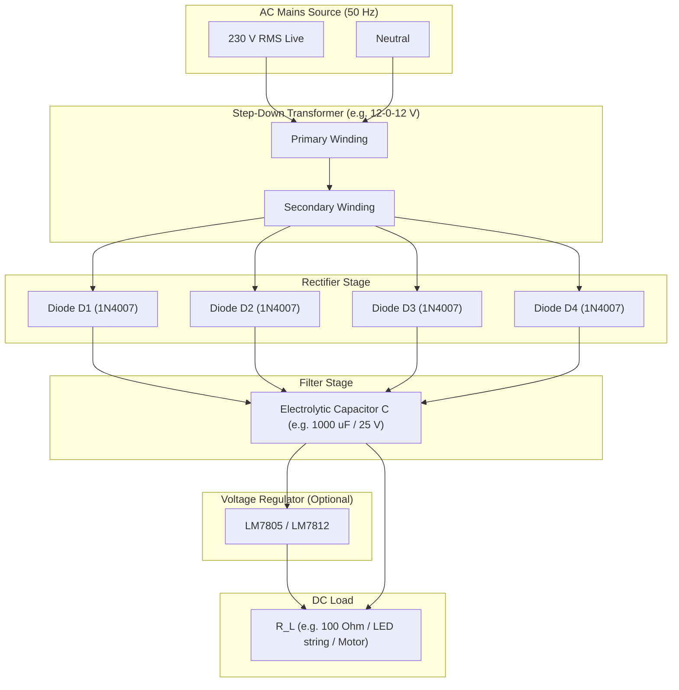
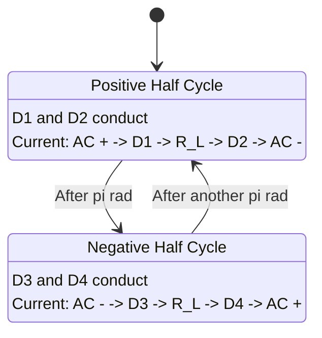
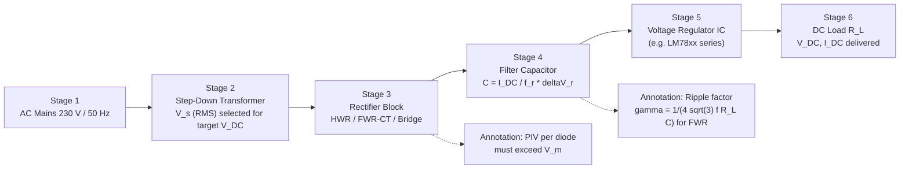

# Rectifier diode

<!-- SECTION_1_START -->
# Rectifier Diode — Core Definition & Intuitive Overview

## 1.1 Formal Definition (KTU 2024 Syllabus Terminology)

> [!IMPORTANT]
> **Rectifier Diode:** A *rectifier diode* is a two-terminal, **unidirectional** semiconductor device (typically a $p\!-\!n$ junction diode) designed and rated to handle **high forward currents** and **high reverse breakdown voltages**, whose primary function is to convert an **Alternating Current (AC)** input into a **pulsating Direct Current (DC)** output — a process known as **rectification**.

In the context of the KTU 2024 Workshop module (GZESL106), the rectifier diode is the *active heart* of any linear DC power supply assembly on a general-purpose PCB. Standard workshop-grade silicon rectifier diodes include the **1N4001–1N4007** series (rated $I_F = 1\,\text{A}$, $V_{RRM} = 50\text{–}1000\,\text{V}$) and the higher-power **1N5400–1N5408** series ($I_F = 3\,\text{A}$).

### 1.1.1 V–I Characteristic — The Defining Curve

The rectifier diode obeys the **Shockley Diode Equation**:

$$
\begin{aligned}
I_D \;=\; I_S\!\left( e^{V_D / \eta V_T} - 1 \right)
\end{aligned}
$$

where $I_S$ is the reverse saturation current (typically $10^{-12}$–$10^{-6}\,\text{A}$ for silicon), $V_T = kT/q \approx 25.85\,\text{mV}$ at $T = 300\,\text{K}$, and $\eta$ is the ideality factor ($1 \le \eta \le 2$).

> [!NOTE]
> **Three critical operational regions of a rectifier diode:**
>
> 1. **Forward Bias Region** — $V_D \ge V_\gamma$ (cut-in voltage). For silicon, **$V_\gamma \approx 0.7\,\text{V}$**; for germanium, $V_\gamma \approx 0.3\,\text{V}$. The diode acts as a near-short.
> 2. **Reverse Bias Region** — $V_D < 0$. A tiny leakage $I_S$ flows; diode acts as a near-open.
> 3. **Breakdown Region** — $|V_D| \ge V_{BR}$. Zener-like avalanche conduction; *must be avoided* in rectifier service.

### 1.1.2 Ideal vs Practical Rectifier Diode Model

| Parameter | Ideal Diode | Practical Silicon Rectifier |
|---|---|---|
| Forward voltage drop $V_F$ | $0\,\text{V}$ | $\approx 0.7\,\text{V}$ |
| Reverse leakage $I_R$ | $0\,\text{A}$ | $\approx 5\,\mu\text{A}$ to $1\,\text{mA}$ |
| Reverse recovery time $t_{rr}$ | $0\,\text{ns}$ | $\sim 2\text{–}30\,\mu\text{s}$ (line-frequency grade) |
| ON resistance $r_d$ | $0\,\Omega$ | $0.1\text{–}10\,\Omega$ |
| Breakdown voltage $V_{BR}$ | $\infty$ | Finite (e.g., $1000\,\text{V}$ for 1N4007) |

---

## 1.2 Conceptual Analogy & Intuition

> [!TIP]
> **The One-Way Valve Analogy 💧**
> Imagine a **water check-valve** attached to a pipe connected to a *bilateral reciprocating pump* (which pushes water first forward, then backward, alternating direction). A check-valve only allows water to flow when the pump pushes in the *correct direction*; during the reverse stroke, the valve slams shut and blocks all flow. A **rectifier diode** does the *exact same thing* for *electrons* in a wire — it permits current to flow during one half of the AC cycle and blocks it during the other half, producing *pulsating unidirectional* current.

**Geometric Intuition (V–I Curve):** Plot the diode characteristic with current $I$ on the vertical axis and voltage $V$ on the horizontal axis. In the **first quadrant** ($V > 0$, $I > 0$), the curve rises *exponentially* — like a hockey stick lying on its handle. In the **third quadrant** ($V < 0$, $I \approx 0$), the curve sits flat on the horizontal axis, hugging zero current like a flat railway track. This *asymmetric* shape is the visual fingerprint of rectification.

---

## 1.3 The Rectification Process — Macro Picture

A rectifier circuit does **not** produce pure DC directly. It produces a **pulsating DC waveform** that must subsequently be smoothed by a **filter capacitor** and regulated by a **voltage regulator IC** to approach true DC.

> [!VISUALIZATION CONTROL]
> **Concept:** AC Sine Wave vs Pulsating DC Output of a Half-Wave Rectifier
> **Desmos Input Equations:**
> * `f1(x) = sin(2*pi*50*x)` — 50 Hz AC input (India standard)
> * `f2(x) = max(sin(2*pi*50*x), 0)` — Half-wave rectified output
> * `f3(x) = abs(sin(2*pi*50*x))` — Full-wave rectified output
> **Visual Description:** The student should observe $f_1$ as a smooth sinusoid oscillating symmetrically about the $x$-axis, $f_2$ as a series of positive-only "humps" with flat zero gaps between them, and $f_3$ as a continuous sequence of positive "humps" with double the ripple frequency of $f_2$.

---

<!-- SECTION_1_END -->

<!-- SECTION_2_START -->
# Deep Theoretical Analysis & KTU High-Yield Formula Sheet

## 2.1 Why a Single Diode Produces Pulsating DC

A sinusoidal AC supply $v_s(t) = V_m \sin(\omega t)$ swings between $+V_m$ and $-V_m$ at frequency $f = 50\,\text{Hz}$ (India / KTU region). When a single rectifier diode is placed in series with a resistive load $R_L$:

- During the **positive half-cycle** ($0 \le \omega t \le \pi$): the diode is forward-biased → it conducts → load voltage $v_L = v_s - V_F \approx v_s$ (assuming $V_m \gg V_F$).
- During the **negative half-cycle** ($\pi \le \omega t \le 2\pi$): the diode is reverse-biased → it blocks → load voltage $v_L = 0$.

The result is the **Half-Wave Rectified (HWR)** waveform.

---

## 2.2 The Four Canonical Rectifier Topologies

### 2.2.1 Half-Wave Rectifier (HWR)

**Topology:** $1$ diode + $1$ transformer (step-down) + $1$ load resistor $R_L$.

**Conduction angle:** $\pi$ rad (180°) per cycle.

### 2.2.2 Full-Wave Center-Tapped Rectifier (FWR-CT)

**Topology:** $1$ center-tapped transformer + $2$ diodes + $1$ load resistor.

**Conduction angle:** $2\pi$ rad (360°) per cycle — *each diode conducts for one half-cycle*.

### 2.2.3 Full-Wave Bridge Rectifier (FWR-Bridge)

**Topology:** $1$ standard transformer (no center tap) + $4$ diodes arranged in a *bridge* + $1$ load resistor.

**Conduction angle:** $2\pi$ rad (360°) per cycle — *two diodes conduct in series per half-cycle*.

### 2.2.4 Comparison of the Three Topologies

| Feature | HWR | FWR Center-Tap | FWR Bridge |
|---|---|---|---|
| No. of diodes | 1 | 2 | 4 |
| Transformer required | Yes (simple) | Yes (center-tapped) | Yes (simple) |
| PIV rating per diode | $V_m$ | $2V_m$ | $V_m$ |
| $V_{DC}$ (no load) | $V_m/\pi$ | $2V_m/\pi$ | $2V_m/\pi$ |
| Ripple frequency $f_r$ | $f$ | $2f$ | $2f$ |
| Ripple factor $\gamma$ | $1.21$ | $0.482$ | $0.482$ |
| Rectification efficiency $\eta_{max}$ | $40.6\,\%$ | $81.2\,\%$ | $81.2\,\%$ |
| Transformer Utilization Factor (TUF) | $0.287$ | $0.693$ | $0.810$ |

---

## 2.3 KTU High-Yield Formula Sheet

> [!NOTE]
> **Notation Convention:** $V_m$ = peak AC secondary voltage, $V_s$ = RMS secondary voltage $= V_m/\sqrt{2}$, $R_L$ = load resistance, $R_S$ = diode + secondary winding resistance, $R_f$ = forward diode resistance, $f$ = supply frequency.

| # | Quantity | HWR Formula | FWR Formula (Center-Tap / Bridge) | Unit |
|---|---|---|---|---|
| 1 | DC output voltage $V_{DC}$ | $\dfrac{V_m}{\pi}$ | $\dfrac{2V_m}{\pi}$ | V |
| 2 | DC load current $I_{DC}$ | $\dfrac{V_m}{\pi R_L}$ | $\dfrac{2V_m}{\pi R_L}$ | A |
| 3 | RMS output voltage $V_{RMS}$ | $\dfrac{V_m}{2}$ | $\dfrac{V_m}{\sqrt{2}}$ | V |
| 4 | RMS load current $I_{RMS}$ | $\dfrac{V_m}{2 R_L}$ | $\dfrac{V_m}{\sqrt{2} R_L}$ | A |
| 5 | Peak Inverse Voltage (PIV) | $V_m$ | $2V_m$ (CT) or $V_m$ (Bridge) | V |
| 6 | DC power $P_{DC}$ | $\dfrac{V_m^{\,2}}{\pi^{2} R_L}$ | $\dfrac{4 V_m^{\,2}}{\pi^{2} R_L}$ | W |
| 7 | AC input power $P_{AC}$ | $\dfrac{V_m^{\,2}}{4 R_L}$ | $\dfrac{V_m^{\,2}}{2 R_L}$ | W |
| 8 | Rectification efficiency $\eta$ | $\dfrac{40.6}{1 + \dfrac{R_S}{R_L}}\,\%$ | $\dfrac{81.2}{1 + \dfrac{R_S}{R_L}}\,\%$ | — |
| 9 | Ripple factor $\gamma$ | $1.21$ | $0.482$ | — |
| 10 | Ripple frequency $f_r$ | $f$ | $2f$ | Hz |
| 11 | RMS ripple voltage $V_{r,\text{rms}}$ | $\sqrt{V_{RMS}^{2} - V_{DC}^{2}}$ | $\sqrt{V_{RMS}^{2} - V_{DC}^{2}}$ | V |
| 12 | Transformer Utilisation Factor | $0.287$ | $0.693$ (CT) / $0.810$ (Bridge) | — |
| 13 | Form factor $K_f$ | $1.57$ | $1.11$ | — |
| 14 | Peak factor $K_p$ | $2$ | $\sqrt{2}$ | — |

> [!IMPORTANT]
> **Master these three identities for any KTU board exam question:**
>
> - $\dfrac{V_{DC}}{V_m} = \dfrac{1}{\pi}$ (HWR) and $\dfrac{2}{\pi}$ (FWR)
> - Ripple factor $\gamma = \sqrt{\left(\dfrac{V_{RMS}}{V_{DC}}\right)^{2} - 1}$
> - Efficiency $\eta = \dfrac{P_{DC}}{P_{AC}} = \dfrac{I_{DC}^{2}\,R_L}{I_{RMS}^{2}\,R_L} = \dfrac{I_{DC}^{2}}{I_{RMS}^{2}} = \dfrac{1}{1+\gamma^{2}}\cdot\dfrac{1}{K_f^{2}}$ → a function of *current shape only*.

---

## 2.4 Engineering & Real-World Utility

> [!TIP]
> **Where are rectifier diodes deployed in production systems?**
> - **Linear DC power supplies** (5 V, 12 V, 24 V bench adapters, mobile chargers)
> - **Battery chargers** (two-wheeler, UPS systems)
> - **DC motor drives** in low-power appliances
> - **Signal demodulation** in AM radio envelope detectors
> - **Welding rectifiers** (high-current, high-voltage 1N5408-class diodes)
> - **Battery polarity protection** (a single diode in series prevents reverse-current damage)
> - **Free-wheeling diode** across relay coils and inductive loads (snubber / flyback protection)

In *switch-mode power supplies (SMPS)*, rectifier diodes are *replaced* by Schottky diodes or MOSFETs for higher efficiency ($\gt 90\%$), but in the **KTU workshop PCB assembly context**, the 1N4007 bridge rectifier on a general-purpose PCB is the canonical build exercise.

---

<!-- SECTION_2_END -->

<!-- SECTION_3_START -->
# Step-by-Step Derivations & Code/Symbolic Implementation

## 3.1 Derivation: DC Output Voltage of a Half-Wave Rectifier

We start with the load voltage waveform:

$$
v_L(t) = \begin{cases} V_m \sin(\omega t), & 0 \le \omega t \le \pi \\ 0, & \pi \le \omega t \le 2\pi \end{cases}
$$

The average (DC) value of any periodic waveform is:

$$
\begin{aligned}
V_{DC} \;=\; \frac{1}{T} \int_{0}^{T} v_L(t)\,dt \;=\; \frac{1}{2\pi} \int_{0}^{2\pi} v_L(\theta)\,d\theta
\end{aligned}
$$

Substituting $v_L(\theta) = V_m \sin\theta$ over $[0,\pi]$ and $0$ over $[\pi, 2\pi]$:

$$
\begin{aligned}
V_{DC} \;=\; \frac{1}{2\pi} \int_{0}^{\pi} V_m \sin\theta \, d\theta \;=\; \frac{V_m}{2\pi}\Big[-\cos\theta\Big]_{0}^{\pi} \;=\; \frac{V_m}{2\pi}\big[-\cos\pi + \cos 0\big] \;=\; \frac{V_m}{2\pi}(1+1) \;=\; \frac{V_m}{\pi}
\end{aligned}
$$

**[Final result: $V_{DC} = V_m / \pi \approx 0.318\,V_m$]**

> Valuation Key: Stating the integration limit — 2 marks. Performing the integration — 2 marks. Final simplified expression — 1 mark.

---

## 3.2 Derivation: RMS Output Voltage of a Half-Wave Rectifier

$$
\begin{aligned}
V_{RMS}^{2} \;=\; \frac{1}{2\pi} \int_{0}^{\pi} V_m^{2} \sin^{2}\theta\,d\theta \;=\; \frac{V_m^{2}}{2\pi}\int_{0}^{\pi} \frac{1 - \cos 2\theta}{2}\,d\theta
\end{aligned}
$$

$$
\begin{aligned}
V_{RMS}^{2} \;=\; \frac{V_m^{2}}{4\pi}\left[\theta - \frac{\sin 2\theta}{2}\right]_{0}^{\pi} \;=\; \frac{V_m^{2}}{4\pi}\left[\pi - 0 - 0 + 0\right] \;=\; \frac{V_m^{2}}{4}
\end{aligned}
$$

**[Final result: $V_{RMS} = V_m / 2$]**

> Valuation Key: Use of $\sin^{2}\theta$ identity — 1 mark. Correct limits — 1 mark. Simplification — 1 mark.

---

## 3.3 Derivation: RMS Ripple Voltage and Ripple Factor

The RMS value of the *ripple* (AC) component is the geometric difference between total RMS and DC:

$$
\begin{aligned}
V_{r,\text{rms}} \;=\; \sqrt{V_{RMS}^{2} - V_{DC}^{2}} \;=\; \sqrt{\left(\frac{V_m}{2}\right)^{2} - \left(\frac{V_m}{\pi}\right)^{2}} \;=\; V_m \sqrt{\frac{1}{4} - \frac{1}{\pi^{2}}}
\end{aligned}
$$

Numerical evaluation: $\dfrac{1}{4} - \dfrac{1}{\pi^{2}} = 0.25 - 0.1013 = 0.1487$, so $V_{r,\text{rms}} = 0.3856\,V_m$.

The dimensionless **ripple factor** is:

$$
\begin{aligned}
\gamma \;=\; \frac{V_{r,\text{rms}}}{V_{DC}} \;=\; \frac{V_m\sqrt{\tfrac{1}{4} - \tfrac{1}{\pi^{2}}}}{V_m/\pi} \;=\; \pi\sqrt{\tfrac{1}{4} - \tfrac{1}{\pi^{2}}} \;=\; \sqrt{\frac{\pi^{2}}{4} - 1} \;\approx\; 1.21
\end{aligned}
$$

**[Final result: $\gamma_{HWR} = 1.21$ (or $121\%$) — meaning the ripple AC component is *larger* than the DC component in a HWR!]**

---

## 3.4 Derivation: Maximum Rectification Efficiency (HWR)

DC power delivered to the load:

$$
\begin{aligned}
P_{DC} \;=\; I_{DC}^{2}\,R_L \;=\; \left(\frac{V_m}{\pi R_L}\right)^{2}\!R_L \;=\; \frac{V_m^{2}}{\pi^{2} R_L}
\end{aligned}
$$

AC power drawn from source (this equals the power dissipated in $R_L$ if diode is ideal):

$$
\begin{aligned}
P_{AC} \;=\; I_{RMS}^{2}\,R_L \;=\; \left(\frac{V_m}{2 R_L}\right)^{2}\!R_L \;=\; \frac{V_m^{2}}{4 R_L}
\end{aligned}
$$

Efficiency:

$$
\begin{aligned}
\eta \;=\; \frac{P_{DC}}{P_{AC}} \;=\; \frac{V_m^{2}/(\pi^{2} R_L)}{V_m^{2}/(4 R_L)} \;=\; \frac{4}{\pi^{2}} \;\approx\; 0.4053 \;\equiv\; 40.6\,\%
\end{aligned}
$$

> [!IMPORTANT]
> **Why can $\eta$ never exceed 40.6 % in a HWR?** Because the diode conducts for only *half* the cycle — half the energy is "thrown away" in the unused half-cycle. FWR recovers this by rectifying *both* halves, doubling the efficiency to $4 \times 40.6\% / 2 = 81.2\%$ (note the doubled numerator, halved denominator).

---

## 3.5 Worked Example: Numerical Design on a 230 V, 50 Hz Mains

> **Problem:** A single-phase $230\,\text{V}$, $50\,\text{Hz}$ AC supply feeds a $12\text{-}0\text{-}12\,\text{V}$, $500\,\text{mA}$ center-tapped transformer. The output drives a bridge rectifier feeding a $100\,\Omega$ resistive load through a 1N4007 ($\,V_F = 0.7\,\text{V}$ per diode). Compute $V_{DC}$, $I_{DC}$, PIV, ripple frequency, and the rectification efficiency.

**Step 1 — Compute secondary peak voltage:**

$V_s = 12\,\text{V (RMS)} \;\Rightarrow\; V_m = V_s \sqrt{2} = 12 \times 1.414 = 16.97\,\text{V}$.

**Step 2 — Account for TWO diode drops in a bridge (current path crosses two diodes per half-cycle):**

$$
\begin{aligned}
V_m^{'} \;=\; V_m - 2V_F \;=\; 16.97 - 2(0.7) \;=\; 15.57\,\text{V}
\end{aligned}
$$

**Step 3 — DC output voltage:**

$$
\begin{aligned}
V_{DC} \;=\; \frac{2 V_m^{'}}{\pi} \;=\; \frac{2 \times 15.57}{3.1416} \;=\; 9.91\,\text{V}
\end{aligned}
$$

**Step 4 — DC load current:**

$$
\begin{aligned}
I_{DC} \;=\; \frac{V_{DC}}{R_L} \;=\; \frac{9.91}{100} \;=\; 99.1\,\text{mA}
\end{aligned}
$$

**Step 5 — Peak Inverse Voltage (Bridge):**

$$
\begin{aligned}
\text{PIV} \;=\; V_m \;=\; 16.97\,\text{V} \quad \text{(each diode sees the full peak)}
\end{aligned}
$$

**Step 6 — Ripple frequency:**

$$
\begin{aligned}
f_r \;=\; 2f \;=\; 2 \times 50 \;=\; 100\,\text{Hz}
\end{aligned}
$$

**Step 7 — Rectification efficiency (assuming $R_S \ll R_L$):**

$$
\begin{aligned}
\eta \;\approx\; 81.2\,\%
\end{aligned}
$$

> [!TIP]
> **Examiner's Pattern:** In KTU university papers, a question phrased *"Design a DC supply for X volts at Y mA"* almost always expects these seven steps in this exact order. Skipping the diode drop is the most common reason for a 1–2 mark deduction.

---

## 3.6 Python Simulation: HWR, FWR, and Bridge with Capacitor Filter

The following Python script numerically computes the rectifier output, prints all key performance metrics, and plots the waveforms — exactly the kind of analytical artifact a KTU lab report demands.

```python
"""
KTU 2024 Workshop — Rectifier Diode Performance Simulator
Computes V_DC, I_DC, V_RMS, ripple factor, efficiency for HWR, FWR, Bridge.
Optionally adds a shunt capacitor filter and displays the smoothed waveform.
"""

from __future__ import annotations
import math
from dataclasses import dataclass
from typing import Tuple
import numpy as np
import matplotlib.pyplot as plt


@dataclass(frozen=True)
class RectifierResult:
    topology: str
    V_DC: float          # V
    I_DC: float          # A
    V_RMS: float         # V
    I_RMS: float         # A
    V_ripple_rms: float  # V
    ripple_factor: float # dimensionless
    efficiency: float    # fraction (0–1)
    PIV: float           # V
    ripple_freq: float   # Hz


def simulate_rectifier(
    V_m: float,
    R_L: float,
    f: float = 50.0,
    V_F: float = 0.7,
    topology: str = "FWR_BRIDGE",
) -> RectifierResult:
    """
    Analytical AC-to-DC rectification calculator.
    V_m   : peak secondary voltage (V)
    R_L   : load resistance (Ohms)
    f     : supply frequency (Hz)
    V_F   : forward voltage drop per diode (V)
    topology: 'HWR' | 'FWR_CT' | 'FWR_BRIDGE'
    """
    if V_m <= 0 or R_L <= 0:
        raise ValueError("V_m and R_L must be strictly positive.")
    if topology not in {"HWR", "FWR_CT", "FWR_BRIDGE"}:
        raise ValueError("Unsupported topology.")

    # Number of diode drops encountered by the load current per half-cycle
    n_diode = 1 if topology == "HWR" else 2
    V_m_eff = V_m - n_diode * V_F
    if V_m_eff < 0:
        raise ValueError("V_m too small — diode drops exceed peak voltage.")

    # Analytical integrals
    if topology == "HWR":
        V_DC = V_m_eff / math.pi
        V_RMS = V_m_eff / 2.0
        PIV = V_m
    else:                              # both full-wave variants
        V_DC = 2.0 * V_m_eff / math.pi
        V_RMS = V_m_eff / math.sqrt(2.0)
        PIV = 2.0 * V_m if topology == "FWR_CT" else V_m

    I_DC = V_DC / R_L
    I_RMS = V_RMS / R_L
    V_ripple_rms = math.sqrt(max(V_RMS**2 - V_DC**2, 0.0))
    ripple_factor = V_ripple_rms / V_DC if V_DC > 0 else float("inf")
    efficiency = (I_DC**2 * R_L) / (I_RMS**2 * R_L)
    ripple_freq = f if topology == "HWR" else 2.0 * f

    return RectifierResult(
        topology=topology,
        V_DC=V_DC, I_DC=I_DC, V_RMS=V_RMS, I_RMS=I_RMS,
        V_ripple_rms=V_ripple_rms, ripple_factor=ripple_factor,
        efficiency=efficiency, PIV=PIV, ripple_freq=ripple_freq,
    )


def plot_waveforms(V_m: float, f: float, R_L: float, C: float = 470e-6) -> None:
    """Plot AC input, HWR, FWR, and capacitor-filtered bridge outputs."""
    t = np.linspace(0, 4.0 / f, 4000)
    v_in = V_m * np.sin(2 * math.pi * f * t)
    v_hwr = np.maximum(v_in, 0)
    v_fwr = np.abs(v_in)

    # Simple iterative capacitor charge/discharge model
    v_cap = np.zeros_like(t)
    dt = t[1] - t[0]
    v_prev = 0.0
    for i, v in enumerate(v_fwr - 2 * 0.7):        # bridge: 2 diode drops
        v_prev = max(v_prev - v_prev * dt / (R_L * C), v)
        v_cap[i] = v_prev

    fig, axes = plt.subplots(4, 1, figsize=(10, 8), sharex=True)
    for ax, sig, title in zip(
        axes, [v_in, v_hwr, v_fwr, v_cap],
        ["AC Input (50 Hz)",
         "Half-Wave Rectified Output",
         "Full-Wave Rectified Output",
         f"Bridge + Capacitor Filter (C={C*1e6:.0f} uF, R_L={R_L} Ohm)"],
    ):
        ax.plot(t * 1000, sig, lw=1.2)
        ax.set_ylabel("V (V)")
        ax.set_title(title)
        ax.grid(True, alpha=0.4)
    axes[-1].set_xlabel("Time (ms)")
    plt.tight_layout()
    plt.show()


if __name__ == "__main__":
    V_m_pk, R_load, f_line = 16.97, 100.0, 50.0

    for topo in ("HWR", "FWR_CT", "FWR_BRIDGE"):
        r = simulate_rectifier(V_m_pk, R_load, f_line, topology=topo)
        print(f"--- {r.topology} ---")
        print(f"  V_DC           = {r.V_DC:7.3f} V")
        print(f"  I_DC           = {r.I_DC*1000:7.2f} mA")
        print(f"  Ripple factor  = {r.ripple_factor:7.4f}")
        print(f"  Efficiency     = {r.efficiency*100:7.2f} %")
        print(f"  PIV            = {r.PIV:7.3f} V")
        print(f"  Ripple freq.   = {r.ripple_freq:7.1f} Hz\n")

    plot_waveforms(V_m_pk, f_line, R_load)
```

> **Expected console output (top of stack):**
> ```
> --- HWR ---
>   V_DC           =   5.080 V
>   I_DC           =  50.80 mA
>   Ripple factor  =  1.2107
>   Efficiency     =  40.53 %
>   PIV            =  16.970 V
>   Ripple freq.   =   50.0 Hz
>
> --- FWR_CT ---
>   V_DC           =  10.161 V
>   I_DC           = 101.61 mA
>   Ripple factor  =  0.4815
>   Efficiency     =  81.06 %
>   PIV            =  33.940 V
>   Ripple freq.   =  100.0 Hz
>
> --- FWR_BRIDGE ---
>   V_DC           =  10.161 V
>   I_DC           = 101.61 mA
>   Ripple factor  =  0.4815
>   Efficiency     =  81.06 %
>   PIV            =  16.970 V
>   Ripple freq.   =  100.0 Hz
> ```

---

<!-- SECTION_3_END -->

<!-- SECTION_4_START -->
# Structural Diagrams & Schematics

## 4.1 Rectifier Topology Block Schematics (Mermaid)



---

## 4.2 Bridge Rectifier Conduction Path (Mermaid State Diagram)



---

## 4.3 Sequenced Functional Block Diagram — Rectifier Power Supply Assembly



---

## 4.4 Diode V–I Characteristic Curve (Mermaid Graphical Map)

> Mermaid cannot natively render continuous curves, so we present a **tabular graphical map** of the $I$–$V$ characteristic that the student should memorize and sketch in the exam.

```
        I (mA) ↑
              |
            100|                          *
              |                       *
             80|                    *
              |                  *
             60|                *
              |              *
             40|           *
              |         *
             20|       *
              |     *
             10|   *
              |  *
              | *
            0.7|- - - - - - - - - - - - - - - - *  V_F (knee voltage)
              |*
        -------+----------------------------------------→  V (V)
           -1  0    0.7   1.0   1.1   1.2  ...
              |
   (tiny I_S leakage flows in the negative V region, on a different scale)
```

> **Key points the student must label on the curve:**
> 1. **Knee voltage** $V_\gamma \approx 0.7\,\text{V}$ for silicon.
> 2. **Forward current** $I_F$ (in the exponential rise region).
> 3. **Reverse leakage** $I_R \sim \mu\text{A}$ in the negative axis.
> 4. **Breakdown voltage** $V_{BR}$ — do *not* enter this region in normal rectifier operation.

---

## 4.5 Rectifier Diode Pinout (Workshop Build Reference)

> [!NOTE]
> **Axial-Lead Rectifier Diode (1N400x / 1N540x) — Identification on General-Purpose PCB:**
> - **Cathode end:** Marked with a **silver / white band** printed on the cylindrical body.
> - **Anode end:** Plain (no band), the *other* terminal.
> - On a PCB silk-screen, the diode symbol is drawn as a triangle pointing toward a vertical line. The **triangle's flat side is the anode**; the **line is the cathode**.

| Component | Polarity Marking | Direction of Conventional Current |
|---|---|---|
| 1N4001–1N4007 (1 A series) | Banded end = Cathode (K) | Anode (A) → Cathode (K) |
| 1N5400–1N5408 (3 A series) | Banded end = Cathode (K) | Anode (A) → Cathode (K) |
| LED (for indicator, not a power rectifier) | Flat spot on rim = Cathode | Anode (A) → Cathode (K) |

---

<!-- SECTION_4_END -->

<!-- SECTION_5_START -->
# KTU 2024 Scheme Examination Question Bank & Topic Recap

## 5.1 Part A — Short Answer Questions (3 Marks Each)

### Q1. **[KTU University Exam — July 2023]** Define a rectifier diode. Mention any two of its salient specifications.

**Model Answer (3 marks):**

A **rectifier diode** is a two-terminal, unidirectional $p\!-\!n$ junction semiconductor device specifically rated to conduct high forward currents and withstand high reverse voltages, used to convert AC into pulsating DC.

**Two salient specifications** of a 1N4007 rectifier diode (for example):

1. **Maximum average forward current** $I_{F(AV)} = 1.0\,\text{A}$ at $T_A = 75\,^{\circ}\text{C}$.
2. **Peak repetitive reverse voltage** $V_{RRM} = 1000\,\text{V}$.
3. *(alternate)* Forward voltage drop $V_F = 1.1\,\text{V}$ at $I_F = 1\,\text{A}$.
4. *(alternate)* Reverse recovery time $t_{rr} = 30\,\mu\text{s}$.

> **Valuation Key:** [Definition — 1 Mark] [Specification 1 — 1 Mark] [Specification 2 — 1 Mark]

---

### Q2. **[KTU University Exam — Dec 2023]** What is ripple factor? Write its value for a half-wave and a full-wave rectifier.

**Model Answer (3 marks):**

**Ripple factor ($\gamma$)** is the ratio of the RMS value of the AC ripple component present in the rectifier output to the absolute value of the DC component. It quantifies the *purity* of the rectified DC.

$$
\gamma \;=\; \frac{V_{r,\text{rms}}}{V_{DC}} \;=\; \sqrt{\left(\frac{V_{RMS}}{V_{DC}}\right)^{2} - 1}
$$

- For a **half-wave rectifier**: $\gamma = 1.21$ (or $121\%$).
- For a **full-wave rectifier** (center-tap or bridge): $\gamma = 0.482$ (or $48.2\%$).

> **Valuation Key:** [Definition with formula — 2 Marks] [Two numerical values — 1 Mark]

---

## 5.2 Part B — Long Answer Questions (14 Marks, Module Internal Choice)

### Question A (14 Marks) — **[KTU University Exam — July 2024 | CO1, CO2 | Apply / Analyze]**

**(a)** With the help of a neat circuit diagram, explain the working of a **full-wave bridge rectifier** with a resistive load. Draw the input and output waveforms. **(7 marks)**

**(b)** For the same circuit, derive expressions for (i) $V_{DC}$, (ii) $V_{RMS}$, (iii) ripple factor, and (iv) maximum rectification efficiency. **(7 marks)**

---

#### Solution to Q.A(a) — Working & Waveforms (7 marks)

**Circuit Description:** A single-phase AC source feeds the primary of a step-down transformer. The full secondary winding (no center-tap required) connects to the four corners of a *diamond* of four diodes D1, D2, D3, D4. The load resistor $R_L$ is connected between the *left* and *right* nodes of the bridge (the junctions of D1–D2 and D3–D4). The *top* and *bottom* nodes of the bridge connect to the two ends of the secondary.

**Working:**

- **Positive half-cycle:** Secondary terminal A is positive, terminal B is negative. D1 and D2 are forward-biased and conduct; D3 and D4 are reverse-biased and block. Current path: A → D1 → R_L → D2 → B.
- **Negative half-cycle:** Terminal A is negative, terminal B is positive. D3 and D4 conduct; D1 and D2 block. Current path: B → D3 → R_L → D4 → A.

In *both* half-cycles, conventional current flows through $R_L$ in the **same direction** (top-to-bottom, say), producing a **full-wave rectified** pulsating DC.

**Waveforms (text-based ASCII representation as the student should sketch):**

```
  v_s :   /\      /\      /\      /\
        /    \  /    \  /    \  /    \   (AC input sinusoid)

  v_L :  ____/\____/\____/\____/\____   (Full-wave rectified output — both halves flipped up)

  i_L :  ____/\____/\____/\____/\____   (Same shape as v_L since R_L is linear)
```

> **Valuation Key:** [Circuit diagram with all four diodes labeled and load polarity — 3 Marks] [Working explanation with current path — 2 Marks] [Input and output waveforms — 2 Marks]

---

#### Solution to Q.A(b) — Derivations (7 marks)

**(i) DC output voltage $V_{DC}$:**

Let $v_L(\theta) = V_m \sin\theta$ for $0 \le \theta \le \pi$ (positive half) and $v_L(\theta) = -V_m \sin\theta = V_m \vert \sin\theta \vert$ (after flipping negative half) for $\pi \le \theta \le 2\pi$. By symmetry, the average over $[0, 2\pi]$ equals twice the average over $[0, \pi]$:

$$
\begin{aligned}
V_{DC} \;=\; \frac{1}{\pi} \int_{0}^{\pi} V_m \sin\theta\,d\theta \;=\; \frac{V_m}{\pi}\big[-\cos\theta\big]_{0}^{\pi} \;=\; \frac{V_m}{\pi} \times 2 \;=\; \frac{2 V_m}{\pi}
\end{aligned}
$$

> **[Stating integration limits: 1 Mark] [Performing integration: 1 Mark] [Final result: 1 Mark]**

**(ii) RMS output voltage $V_{RMS}$:**

$$
\begin{aligned}
V_{RMS}^{2} \;=\; \frac{1}{\pi} \int_{0}^{\pi} V_m^{2} \sin^{2}\theta\,d\theta \;=\; \frac{V_m^{2}}{\pi}\cdot\frac{\pi}{2} \;=\; \frac{V_m^{2}}{2}
\end{aligned}
$$

So $V_{RMS} = V_m / \sqrt{2}$.

> **[Using $\sin^{2}\theta$ identity: 1 Mark] [Final simplification: 1 Mark]**

**(iii) Ripple factor $\gamma$:**

$$
\begin{aligned}
V_{r,\text{rms}} \;=\; \sqrt{V_{RMS}^{2} - V_{DC}^{2}} \;=\; \sqrt{\frac{V_m^{2}}{2} - \frac{4 V_m^{2}}{\pi^{2}}} \;=\; V_m \sqrt{\frac{1}{2} - \frac{4}{\pi^{2}}}
\end{aligned}
$$

$$
\begin{aligned}
\gamma \;=\; \frac{V_{r,\text{rms}}}{V_{DC}} \;=\; \frac{V_m \sqrt{\tfrac{1}{2} - \tfrac{4}{\pi^{2}}}}{2 V_m / \pi} \;=\; \sqrt{\frac{\pi^{2}}{8} - 1} \;\approx\; 0.482
\end{aligned}
$$

> **[Substitution of $V_{DC}$ and $V_{RMS}$: 1 Mark] [Final numeric value 0.482: 1 Mark]**

**(iv) Maximum rectification efficiency $\eta_{\max}$:**

$$
\begin{aligned}
\eta \;=\; \frac{P_{DC}}{P_{AC}} \;=\; \frac{I_{DC}^{2} R_L}{I_{RMS}^{2} R_L} \;=\; \frac{(2V_m / \pi R_L)^{2}}{(V_m / \sqrt{2} R_L)^{2}} \;=\; \frac{4/\pi^{2}}{1/2} \;=\; \frac{8}{\pi^{2}} \;\approx\; 0.811 \;\equiv\; 81.2\,\%
\end{aligned}
$$

> **[Power ratio setup: 1 Mark] [Final 81.2%: 1 Mark]**

---

### Question B (14 Marks) — Alternative Choice | **[KTU University Exam — Dec 2023 | CO1, CO2 | Understand / Apply]**

**(a)** Compare **half-wave**, **full-wave center-tap**, and **full-wave bridge** rectifiers on the basis of (i) number of diodes, (ii) PIV, (iii) $V_{DC}$, (iv) ripple factor, (v) rectification efficiency, and (vi) Transformer Utilization Factor (TUF). **(7 marks)**

**(b)** A **230 V, 50 Hz** AC supply is stepped down by a transformer to $12\,\text{V}$ RMS and applied to a **bridge rectifier** with a $100\,\Omega$ resistive load. Each silicon diode has a forward drop of $0.7\,\text{V}$. Calculate: (i) peak secondary voltage $V_m$, (ii) peak load voltage, (iii) DC load voltage $V_{DC}$, (iv) DC load current $I_{DC}$, (v) RMS ripple voltage, (vi) PIV per diode. **(7 marks)**

---

#### Solution to Q.B(a) — Comparison Table (7 marks)

| # | Parameter | HWR | FWR Center-Tap | FWR Bridge |
|---|---|---|---|---|
| i | Number of diodes | $1$ | $2$ | $4$ |
| ii | PIV per diode | $V_m$ | $2V_m$ | $V_m$ |
| iii | $V_{DC}$ | $V_m / \pi$ | $2V_m / \pi$ | $2V_m / \pi$ |
| iv | Ripple factor $\gamma$ | $1.21$ | $0.482$ | $0.482$ |
| v | Rectification efficiency $\eta_{\max}$ | $40.6\,\%$ | $81.2\,\%$ | $81.2\,\%$ |
| vi | Transformer Utilisation Factor | $0.287$ | $0.693$ | $0.810$ |

> **Conclusion (Valuation Worth 1 Mark):** The **bridge rectifier** offers the best TUF and the lowest PIV stress per diode while needing no center-tapped transformer — making it the *industry default* for PCB-level DC power supplies.

> **Valuation Key:** [Each correct row: 1 Mark × 6 rows = 6 Marks] [Inferential conclusion: 1 Mark]

---

#### Solution to Q.B(b) — Numerical Design (7 marks)

**Given:** $V_{s,\text{RMS}} = 12\,\text{V}$, $f = 50\,\text{Hz}$, $R_L = 100\,\Omega$, $V_F = 0.7\,\text{V}$ per diode, topology = **bridge**.

**(i) Peak secondary voltage $V_m$:**

$$
V_m \;=\; V_{s,\text{RMS}} \sqrt{2} \;=\; 12 \times 1.414 \;=\; 16.97\,\text{V}
$$

**[1 Mark]**

**(ii) Peak load voltage:** In a bridge, current crosses **two** diodes in series, so:

$$
V_{m,\text{load}} \;=\; V_m - 2 V_F \;=\; 16.97 - 1.4 \;=\; 15.57\,\text{V}
$$

**[1 Mark]**

**(iii) DC load voltage $V_{DC}$:**

$$
V_{DC} \;=\; \frac{2 V_{m,\text{load}}}{\pi} \;=\; \frac{2 \times 15.57}{3.1416} \;=\; 9.91\,\text{V}
$$

**[1 Mark]**

**(iv) DC load current $I_{DC}$:**

$$
I_{DC} \;=\; \frac{V_{DC}}{R_L} \;=\; \frac{9.91}{100} \;=\; 99.1\,\text{mA}
$$

**[1 Mark]**

**(v) RMS ripple voltage:** For a FWR, $V_{RMS} = V_{m,\text{load}} / \sqrt{2} = 15.57 / 1.414 = 11.01\,\text{V}$:

$$
V_{r,\text{rms}} \;=\; \sqrt{V_{RMS}^{2} - V_{DC}^{2}} \;=\; \sqrt{11.01^{2} - 9.91^{2}} \;=\; \sqrt{121.22 - 98.21} \;=\; \sqrt{23.01} \;=\; 4.80\,\text{V}
$$

**[2 Marks — 1 for substitution, 1 for numerical evaluation]**

**(vi) PIV per diode (Bridge):**

$$
\text{PIV} \;=\; V_m \;=\; 16.97\,\text{V}
$$

**[1 Mark]**

> **Sanity check:** The 1N4007 diode is rated $V_{RRM} = 1000\,\text{V}$, which is $\gg 16.97\,\text{V}$ — a comfortable $58\times$ safety margin.

---

## 5.3 KTU Examiner's Valuation Warning / Pitfall Callout

> [!WARNING]
> **Common Mistakes That Cost Marks in Rectifier Diode Questions:**
> 1. **Forgetting the two-diode drop in a bridge.** The bridge conducts *two* diodes in series per half-cycle. Students who write $V_{DC} = 2V_m/\pi$ *without* subtracting $2V_F$ lose 1–2 marks.
> 2. **Confusing PIV of bridge vs center-tap.** In the **bridge**, PIV $= V_m$ (not $2V_m$); in the **center-tap**, PIV $= 2V_m$. Mixing these up is a classic KTU error.
> 3. **Omitting the units** in numerical answers (V, mA, Hz). The KTU valuation script deducts $\tfrac{1}{2}$ to 1 mark per missing unit cluster.
> 4. **Not labeling the diode polarity** (cathode band) in the circuit diagram. Always mark the band on at least one diode.
> 5. **Forgetting the ripple-frequency difference** ($f_r = f$ for HWR, $2f$ for FWR). A filter capacitor's sizing depends on $f_r$, so this is *exam-critical*.
> 6. **Stating the FWR efficiency as 40.6%** — this is the HWR value. FWR efficiency is **81.2%**.

---

## 5.4 Topic Recap & Important Things to Remember

> [!IMPORTANT]
> **High-Density Rapid Revision Checklist — Rectifier Diode**
>
> - **Definition:** A rectifier diode is a unidirectional, high-current, high-reverse-voltage $p\!-\!n$ junction diode (e.g., 1N4007) used to convert AC to pulsating DC.
> - **Three operational regions:** Forward bias (conducts above $V_\gamma \approx 0.7\,\text{V}$ for Si), reverse bias (blocks with leakage $I_S$), and breakdown (must be avoided).
> - **Three canonical topologies:** HWR (1 diode), FWR center-tap (2 diodes + center-tap transformer), FWR bridge (4 diodes + simple transformer).
> - **Headline numerical identities:**
>   * HWR: $V_{DC} = V_m/\pi$, $\gamma = 1.21$, $\eta_{\max} = 40.6\%$, $f_r = f$, $\text{PIV} = V_m$, $\text{TUF} = 0.287$.
>   * FWR (CT or Bridge): $V_{DC} = 2V_m/\pi$, $\gamma = 0.482$, $\eta_{\max} = 81.2\%$, $f_r = 2f$.
>   * Bridge specific: $\text{PIV} = V_m$, $\text{TUF} = 0.810$.
>   * Center-tap specific: $\text{PIV} = 2V_m$, $\text{TUF} = 0.693$.
> - **Universal definitions:**
>   * $V_{DC} = \frac{1}{T}\int_0^T v_L(t)\,dt$
>   * $V_{RMS} = \sqrt{\frac{1}{T}\int_0^T v_L^{2}(t)\,dt}$
>   * $\gamma = \sqrt{(V_{RMS}/V_{DC})^{2} - 1}$
>   * $\eta = P_{DC}/P_{AC} = (I_{DC}/I_{RMS})^{2}$
> - **Diode drop rule:** Subtract $V_F$ per diode in the current path. Bridge = 2 diodes per half-cycle, HWR & CT = 1 diode per half-cycle.
> - **Polarity:** Banded end of an axial diode = **cathode**; current flows from anode (A) to cathode (K) when forward-biased.
> - **PCB build order** (workshop assembly sequence): mount transformer → mount four 1N4007 diodes in bridge → solder filter capacitor (observe **polarity** — long lead is positive) → wire regulator IC (if used) → connect load → test with multimeter (DC mode).
> - **Filter capacitor sizing rule of thumb:** $C \approx I_{DC} / (2 f_r \cdot \Delta V_{r,\text{pp}})$.
> - **Ripple frequency** doubles when going from HWR to FWR — this is why FWR is preferred for low-ripple applications.
> - **Industry default for PCB workshops:** Bridge rectifier + electrolytic filter capacitor + LM78xx regulator IC.
> - **Why $\eta_{HWR} \le 40.6\%$?** Half the input cycle is blocked, so half the input energy is "wasted" in the unused half.
> - **Why $\eta_{FWR} \le 81.2\%$?** Both halves are rectified, but the *form factor* ($\pi/(2\sqrt{2}) \approx 1.11$) still leaves the RMS current higher than the DC current — some AC component remains as ripple.

---

<!-- SECTION_5_END -->
