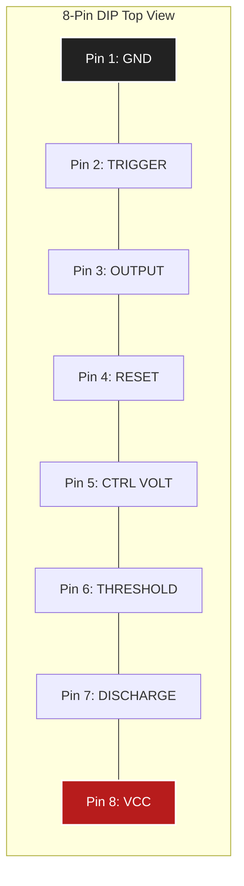
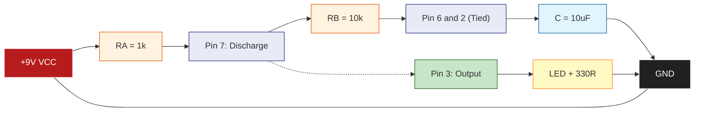
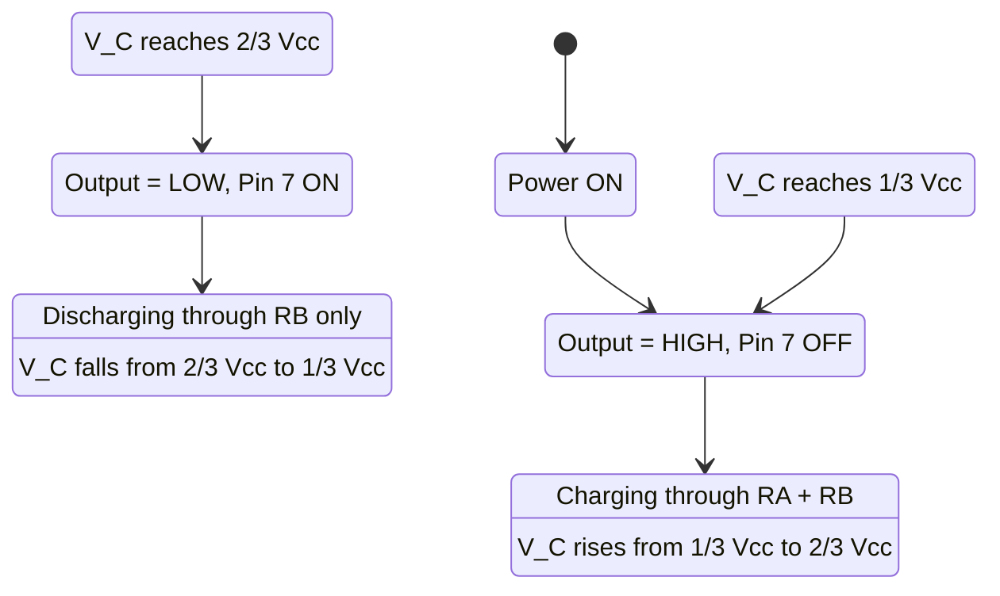
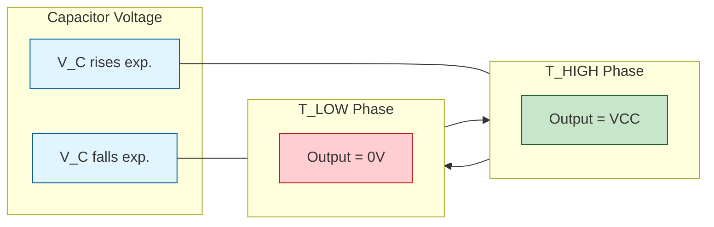

# Square wave generation using IC 555 timer in IC base.

<!-- SECTION_1_START -->
# IC 555 Timer — Square Wave Generator (Astable Multivibrator)

> [!IMPORTANT]
> **KTU 2024 Scheme | GZESL106 | Module 7 — Electronic Circuit Assembly on General Purpose PCB**
> This module is a **hands-on lab workshop**. The focus is on **physically assembling**, **soldering**, and **testing** a square wave generator on a **General Purpose PCB (GP-PCB)** using an **IC base (8-pin DIP socket)** so that the timer IC can be inserted/removed safely without de-soldering.

## 1. Core Technical Definition

**Square Wave Generator using IC 555 Timer (Astable Mode):**
A square wave generator is an electronic circuit that produces a non-sinusoidal periodic waveform with a **50% (or near 50%) duty cycle**, alternating abruptly between two fixed voltage levels (HIGH ≈ $V_{CC}$ and LOW ≈ **0 V / GND**). When the **IC 555** timer is wired in its **Astable Multivibrator** configuration, it has **no stable state** — it continuously flips between HIGH and LOW, producing a continuous train of square pulses at a frequency determined by two resistors ($R_A$, $R_B$) and one capacitor ($C$).

In KTU 2024 lab vocabulary, the word "**IC base**" refers to the **8-pin DIP IC socket (soldered onto the PCB)** into which the 555 IC is plugged. This is a workshop best practice to prevent **thermal damage** to the IC during soldering.

## 2. Intuitive / Real-World Analogy

> [!NOTE]
> **Think of the 555 in astable mode as a "Bucket-Fill-and-Flip" machine:**
> - Imagine a bucket (the **capacitor $C$**) being filled with water from a tap (charging through $R_A + R_B$).
> - The moment the water reaches a **high marker** (reaches $\frac{2}{3}V_{CC}$ at the **Threshold** pin), a "flipper" automatically opens the **bottom drain** (the **Discharge** transistor at Pin 7).
> - The bucket now empties through a smaller hole (discharges through $R_B$ only).
> - The moment the water falls to a **low marker** (reaches $\frac{1}{3}V_{CC}$ at the **Trigger** pin), the flipper closes the drain and reopens the tap.
> - This **fill-empty-fill-empty** loop never stops, and each full cycle produces **one square pulse** at the output (Pin 3).
> - The IC base is simply the **"removable seat"** so you can swap ICs without burning them with a soldering iron.

## 3. Visual & Experimental Observations Expected on CRO

> [!VISUALIZATION CONTROL]
> **Concept:** Square Wave on a Cathode Ray Oscilloscope (CRO)
> **Visualization Equations (Square wave function for reference):**
> * `V(t) = V_CC` for $0 \le t < T_{HIGH}$
> * `V(t) = 0` for $T_{HIGH} \le t < T$
> **Visual Description:** You should see a **rectangular waveform** where the trace jumps vertically from **0 V to $V_{CC}$** and back, with a flat top and flat bottom. The horizontal width of the high portion represents $T_{HIGH}$ and the low portion represents $T_{LOW}$. The total period $T = T_{HIGH} + T_{LOW}$ can be measured on the time-base (X-axis), and amplitude on the Y-gain axis.


> **Mermaid / Schematic Fallback:** A full analog circuit schematic is provided later in **SECTION 4** as a Mermaid block diagram of the signal flow.
<!-- SECTION_1_END -->

<!-- SECTION_2_START -->
# Deep Theoretical Analysis & KTU High-Yield Formula Sheet

## 1. Internal Architecture of the 555 Timer (8-Pin DIP)

The IC 555 internally contains **three 5 kΩ resistors** (hence the name "**555**"), **two comparators**, **one SR Flip-Flop**, **one discharge transistor**, and **one output driver**.

| Block | Function |
|---|---|
| Voltage Divider (3 × 5 kΩ) | Generates reference voltages $\frac{1}{3}V_{CC}$ (lower) and $\frac{2}{3}V_{CC}$ (upper) |
| Comparator 1 (Threshold) | Triggers **RESET** of the SR flip-flop when Pin 6 voltage > $\frac{2}{3}V_{CC}$ |
| Comparator 2 (Trigger) | Triggers **SET** of the SR flip-flop when Pin 2 voltage < $\frac{1}{3}V_{CC}$ |
| SR Flip-Flop | Stores the output state (HIGH or LOW) |
| Discharge Transistor (Pin 7) | Open-collector NPN used to drain the timing capacitor |
| Output Stage (Pin 3) | Totem-pole driver capable of sourcing/sinking ~**200 mA** |

## 2. Pin Configuration (8-Pin DIP — Most Common Package)

| Pin No. | Pin Name | Function in Astable Mode |
|---|---|---|
| 1 | **GND** | Ground reference (0 V) |
| 2 | **TRIGGER** | Compares with $\frac{1}{3}V_{CC}$; starts the timing cycle |
| 3 | **OUTPUT** | Square wave appears here (drives load) |
| 4 | **RESET** | Tie to $V_{CC}$ to enable operation; tie to GND to disable |
| 5 | **CONTROL VOLTAGE** | Decouple to GND via **0.01 µF** capacitor (filters noise) |
| 6 | **THRESHOLD** | Compares with $\frac{2}{3}V_{CC}$; ends the HIGH time |
| 7 | **DISCHARGE** | Open-collector drain; tied between $R_A$ and $R_B$ |
| 8 | **V$_{\text{CC}}$** | Supply voltage (**+5 V to +15 V**, standard **+9 V**) |

## 3. Astable Mode Operating Logic (Step-by-Step)

> [!NOTE]
> In astable mode, **Pin 2 is shorted to Pin 6**, and both are connected to the timing capacitor.

**Step 1 — Power ON:**
Output (Pin 3) goes **HIGH** because capacitor $C$ is initially discharged, so Pin 2 voltage is 0 V, which is **less than $\frac{1}{3}V_{CC}$**, triggering the SET action.

**Step 2 — Charging Phase (T$_{\text{HIGH}}$):**
Capacitor $C$ charges through the **series combination of $R_A$ and $R_B$** from $V_{CC}$. The voltage across $C$ rises exponentially toward $V_{CC}$.

**Step 3 — Threshold Reached:**
When $V_C$ reaches $\frac{2}{3}V_{CC}$, Comparator 1 activates and **RESETS** the flip-flop. Output (Pin 3) snaps to **LOW**, and the discharge transistor (Pin 7) turns **ON**.

**Step 4 — Discharging Phase (T$_{\text{LOW}}$):**
Capacitor $C$ now discharges through **$R_B$ only** (because Pin 7 is grounded via the transistor) toward 0 V.

**Step 5 — Trigger Reached:**
When $V_C$ falls to $\frac{1}{3}V_{CC}$, Comparator 2 activates and **SETS** the flip-flop. Output (Pin 3) snaps back to **HIGH**, and the discharge transistor turns **OFF**. The cycle **repeats forever**.

## 4. KTU Formula Cheat Sheet

> [!IMPORTANT]
> **Master these three equations — they are 100% of all numerical questions in KTU exams.**

| Parameter | Formula | Notes |
|---|---|---|
| Time HIGH ($T_{HIGH}$) | $T_{HIGH} = 0.693 \times (R_A + R_B) \times C$ | Charging through both resistors |
| Time LOW ($T_{LOW}$) | $T_{LOW} = 0.693 \times R_B \times C$ | Discharging through $R_B$ only |
| Total Period ($T$) | $T = T_{HIGH} + T_{LOW} = 0.693 \times (R_A + 2R_B) \times C$ | One full cycle |
| **Frequency ($f$)** | $\boxed{f = \frac{1.44}{(R_A + 2R_B) \times C}}$ | **Most important KTU formula** |
| Duty Cycle ($D$) | $D = \frac{T_{HIGH}}{T} \times 100\% = \frac{R_A + R_B}{R_A + 2R_B} \times 100\%$ | Always **> 50%** in basic astable |

> **Engineering tip:** For a perfect **50% duty cycle square wave**, add a **diode (1N4148)** in parallel with $R_B$ (anode at Pin 7 side, cathode at Pin 6/2 side). This bypasses $R_B$ during charging, making $T_{HIGH} = T_{LOW}$.

## 5. Real-World Utility

- **Pulse generation** for digital logic circuits, microcontrollers (clock source).
- **Tone generation** in simple alarm/buzzer circuits.
- **LED flasher / blinker** circuits.
- **Servo motor signal generation** in robotics.
- **PWM (Pulse Width Modulation)** — basis for motor speed control and LED dimming.
- **Function generator** building block in lab instruments.
- **Missing-pulse detector** when wired in monostable mode.
<!-- SECTION_2_END -->

<!-- SECTION_3_START -->
# Step-by-Step Derivations, Hardware Wiring & Pin Configuration Table

## 1. Component & Tool Inventory (Required on the Workbench)

| Item | Specification | Quantity |
|---|---|---|
| IC 555 Timer | NE555 / LM555 (8-pin DIP) | 1 |
| **IC Base / IC Socket** | **8-pin DIP machined-pin socket** | 1 |
| General Purpose PCB (GP-PCB) | Phenolic / fiberglass, dot-matrix style | 1 |
| Resistor $R_A$ | 1 kΩ, $\frac{1}{4}$ W, ±5% | 1 |
| Resistor $R_B$ | 10 kΩ, $\frac{1}{4}$ W, ±5% | 1 |
| Capacitor $C$ | 10 µF, electrolytic, 25 V | 1 |
| Bypass Capacitor | 0.01 µF, ceramic disc | 1 |
| LED (Indicator) | 5 mm red, with 330 Ω current-limit resistor | 1 |
| Battery / Power Supply | 9 V DC battery or regulated DC adapter | 1 |
| Soldering Iron | **25 W (for socket) / 15 W (for components)**, temperature-controlled | 1 |
| Solder Wire | 60/40 lead-tin, rosin-core, 22 SWG | as needed |
| Flux | Rosin flux paste (optional, improves joint quality) | small amount |
| Wire Cutter / Stripper | Standard electronics type | 1 |
| CRO (Cathode Ray Oscilloscope) | 20 MHz or higher | 1 (for testing) |
| Multimeter | Digital type | 1 |

## 2. Component Layout on the GP-PCB (Astable Wiring Matrix)

> [!NOTE]
> **Follow this exact wiring table — it is the "official" KTU assembly sequence.**

| From (Source) | To (Destination) | Wire / Component Used |
|---|---|---|
| +9 V rail (battery +) | Pin 8 of IC base ($V_{CC}$) | Red insulated wire |
| Pin 8 of IC base | Pin 4 of IC base (RESET) | Short jumper wire (enables IC) |
| Pin 1 of IC base | GND rail (battery -) | Black insulated wire |
| Pin 5 of IC base | One terminal of **0.01 µF** ceramic capacitor | Component lead |
| Other terminal of 0.01 µF | GND rail | Component lead (control-voltage bypass) |
| +9 V rail | One end of $R_A$ (1 kΩ) | Component lead |
| Other end of $R_A$ | Pin 7 of IC base (DISCHARGE) | Component lead |
| Pin 7 of IC base | One end of $R_B$ (10 kΩ) | Soldered joint (called the **"discharge node"**) |
| Other end of $R_B$ | Pin 6 AND Pin 2 of IC base (short them together) | Short jumper wire (threshold-to-trigger link) |
| Pin 6/2 junction (other end of $R_B$) | +ve terminal of **10 µF** electrolytic capacitor $C$ | Component lead (observe polarity!) |
| -ve terminal of $C$ (10 µF) | GND rail | Component lead (shortest possible) |
| Pin 3 of IC base (OUTPUT) | Anode of LED via 330 Ω resistor | Component leads / wire |
| Cathode of LED | GND rail | Wire |

## 3. Step-by-Step Assembly Procedure on the GP-PCB

> [!CAUTION]
> **Workshop Safety Rules (KTU Mandatory):**
> 1. Wear **safety goggles** — molten solder can spit.
> 2. Never touch the **soldering iron tip** (≈ 350 °C).
> 3. Always work in a **well-ventilated area** — solder fumes are toxic.
> 4. **Disconnect power** before inserting or removing the IC from the base.
> 5. Use a **heat sink** (alligator clip or wet sponge) on component leads while soldering to prevent heat damage.

**Step 1 — Plan the Layout**
- Draw the circuit on **graph paper** first. Place the **IC base centrally** on the GP-PCB. Mark holes for $R_A$, $R_B$, $C$, and the bypass capacitor near their relevant IC pins.

**Step 2 — Insert the IC Base (Socket)**
- Insert the **8-pin DIP socket** into the PCB. Make sure the **notch (half-moon cut)** faces the correct orientation (Pin 1 at the bottom-left, Pin 8 at the top-left, when notch is on the **left** side).
- Bend two diagonal pins slightly outward to keep the socket in place. Flip the board and solder all **8 pins** from the copper side. Use a **25 W iron**, keep it short (≈ 2 seconds per pin).

**Step 3 — Mount Resistors $R_A$ and $R_B$**
- Bend the leads at 90° to fit the marked holes. Insert them, solder, and trim the excess leads using the **wire cutter** (always wear goggles while trimming — leads fly).

**Step 4 — Mount the Electrolytic Capacitor $C$ (10 µF)**
- **Observe polarity!** The **longer lead** is the **positive (+ve)** terminal; the **shorter lead** is the **negative (-ve)**. The **stripe on the body** marks the **negative** side. Insert with +ve at the Pin 6/2 junction and -ve to GND.

**Step 5 — Mount the Bypass Capacitor (0.01 µF ceramic)**
- Ceramic capacitors are **non-polarized** — orientation does not matter. Solder one end to Pin 5, the other to GND.

**Step 6 — Wire the Power Rails**
- Use **red wire for +V$_{\text{CC}}$** and **black wire for GND**. Connect the +9 V battery snap or DC jack. Solder a **decoupling capacitor** (100 µF) across the rails for cleaner DC.

**Step 7 — Connect the LED Indicator**
- Wire the **anode of the LED** (longer lead) → **330 Ω resistor** → **Pin 3** of the socket. Wire the **cathode** (shorter lead, flat side of the LED body) to GND. The LED will blink ON/OFF at the same frequency as the square wave.

**Step 8 — Visual Inspection**
- Hold the PCB under a bright lamp. Check every joint — it should look like a **shiny volcano**, not a **blobby ball** (cold joint) or a **cracked ring** (dry joint).

**Step 9 — Insert the IC 555 into the Base**
- Confirm IC pin 1 (the dot or notch indicator) is aligned with Pin 1 of the socket. Press down **evenly** with your thumb — never use force. A correctly inserted IC should drop in with a **gentle push**.

**Step 10 — Power On & Test**
- Connect a **9 V battery**.
- The **LED should immediately start blinking** (if $f \approx$ 1 Hz to 10 Hz range).
- Connect a **CRO probe** to Pin 3 and the ground clip to GND. You should observe a **square wave** on the screen.

## 4. Numerical Derivation Worked Example (KTU Standard)

> [!NOTE]
> **Q. Design a square wave generator using IC 555 to produce a frequency of 1 kHz with a 75% duty cycle. Choose $C$ = 0.01 µF. Find $R_A$ and $R_B$.**

**Given Data:**
- $f$ = 1 kHz = 1000 Hz
- $D$ = 75% = 0.75
- $C$ = 0.01 µF = $0.01 \times 10^{-6}$ F

**Step 1 — Apply the Duty Cycle Formula**

$$D = \frac{R_A + R_B}{R_A + 2R_B} = 0.75$$

**Step 2 — Cross-multiply and simplify**

$$R_A + R_B = 0.75 \, (R_A + 2R_B)$$

$$R_A + R_B = 0.75 R_A + 1.5 R_B$$

$$R_A - 0.75 R_A = 1.5 R_B - R_B$$

$$0.25 R_A = 0.5 R_B$$

$$\boxed{R_A = 2 R_B}$$

**Step 3 — Apply the Frequency Formula**

$$f = \frac{1.44}{(R_A + 2R_B) \times C}$$

**Step 4 — Substitute $R_A = 2 R_B$**

$$1000 = \frac{1.44}{(2 R_B + 2 R_B) \times 0.01 \times 10^{-6}}$$

$$1000 = \frac{1.44}{4 R_B \times 10^{-8}}$$

**Step 5 — Solve for $R_B$**

$$R_B = \frac{1.44}{4 \times 1000 \times 10^{-8}}$$

$$R_B = \frac{1.44}{4 \times 10^{-5}} = \frac{1.44 \times 10^{5}}{4} = 36000 \,\Omega$$

$$\boxed{R_B = 36 \,\text{k}\Omega}$$

**Step 6 — Find $R_A$**

$$\boxed{R_A = 2 R_B = 72 \,\text{k}\Omega}$$

**Step 7 — Verification of Frequency**

$$f = \frac{1.44}{(72000 + 72000) \times 0.01 \times 10^{-6}} = \frac{1.44}{144000 \times 10^{-8}} = \frac{1.44}{1.44 \times 10^{-3}} = 1000 \,\text{Hz} \checkmark$$

**Step 8 — Verification of Duty Cycle**

$$D = \frac{72000 + 36000}{72000 + 72000} = \frac{108000}{144000} = 0.75 = 75\% \checkmark$$

**[Both conditions satisfied — design is correct: 4 Marks]**
**[Correct numerical evaluation of resistors: 2 Marks]**
**[Final verification step: 1 Mark]**

## 5. Python Tool to Cross-Check the Design (Optional, for Verification)

```python
from typing import Tuple

def calculate_555_astable(
    R_A: float,
    R_B: float,
    C: float,
    VCC: float = 9.0
) -> Tuple[float, float, float, float]:
    """
    Compute the timing parameters of a 555-timer astable square wave generator.

    Parameters
    ----------
    R_A : float
        Charging resistor in ohms (between VCC and Pin 7).
    R_B : float
        Discharge resistor in ohms (between Pin 7 and Pin 6/2 node).
    C : float
        Timing capacitor in farads (between Pin 6/2 and GND).
    VCC : float, optional
        Supply voltage in volts. Default is 9.0 V.

    Returns
    -------
    Tuple[float, float, float, float]
        (T_HIGH in seconds, T_LOW in seconds, frequency in Hz, duty cycle in %).
    """
    # Strict input validation
    if R_A <= 0 or R_B <= 0 or C <= 0:
        raise ValueError("All component values must be positive and non-zero.")
    if VCC < 4.5 or VCC > 16.0:
        raise ValueError("VCC must lie between 4.5 V and 16.0 V for safe 555 operation.")

    # Core 555 astable equations
    T_HIGH: float = 0.693 * (R_A + R_B) * C
    T_LOW: float = 0.693 * R_B * C
    T: float = T_HIGH + T_LOW
    frequency: float = 1.0 / T
    duty_cycle: float = (T_HIGH / T) * 100.0

    print(f"T_HIGH  = {T_HIGH * 1000:.4f} ms")
    print(f"T_LOW   = {T_LOW * 1000:.4f} ms")
    print(f"Period  = {T * 1000:.4f} ms")
    print(f"freq    = {frequency:.2f} Hz")
    print(f"Duty    = {duty_cycle:.2f} %")
    return T_HIGH, T_LOW, frequency, duty_cycle


# Example: 1 kHz, 75% duty cycle, C = 0.01 µF
if __name__ == "__main__":
    calculate_555_astable(R_A=72_000, R_B=36_000, C=0.01e-6)
```
<!-- SECTION_3_END -->

<!-- SECTION_4_START -->
# Structural Diagrams & Schematics

## 1. IC 555 Pinout Diagram (8-Pin DIP Top View)



## 2. Astable Square Wave Generator — Functional Block Topology



## 3. Signal Flow Sequence (Cycle of Operation)



## 4. Timing Diagram (Conceptual CRO Trace)


<!-- SECTION_4_END -->

<!-- SECTION_5_START -->
# KTU 2024 Scheme Examination Question Bank & Topic Recap

> [!NOTE]
> **Mark Distribution (as per KTU 2024 GZESL106 Workshop Lab Pattern):**
> - **Part A** — 2 short questions × **3 marks each** = 6 marks (remember / understand)
> - **Part B** — 1 full question × **14 marks** (internal choice between Q-A and Q-B)
>   - Sub-part (a): 7 marks (Understand / Apply)
>   - Sub-part (b): 7 marks (Apply / Analyze)
> - Mapped **Course Outcomes:** **CO3** (Apply electronic principles to assemble circuits) & **CO4** (Test and troubleshoot assembled circuits).

---

## Part A — 3 Mark Short Questions (with Model Answers)

### Q1. `[KTU University Exam - Dec 2023]` | **CO3 / Remember**
**List any three applications of the IC 555 timer in astable mode.**

**Model Answer (3 × 1 = 3 Marks):**
1. **Square wave / pulse generator** — used as a clock source in digital logic circuits.
2. **Tone generator** — drives speakers and buzzers in alarm circuits.
3. **LED flasher / blinker** — used in indicator and decorative lighting circuits.
4. *(Bonus accepted)* PWM motor speed control.

---

### Q2. `[KTU University Exam - July 2024]` | **CO3 / Understand**
**Why is the astable mode of the 555 timer called "astable"? What is the role of Pin 7?**

**Model Answer:**
- The word **"astable"** means "**no stable state**" — the output continuously oscillates between HIGH and LOW without any external trigger. It never settles, unlike a monostable (one stable state) or bistable (two stable states) configuration. **[1.5 Marks]**
- **Pin 7 (Discharge)** acts as an open-collector **transistor switch to ground**. When the internal flip-flop is RESET, this transistor turns **ON**, providing a low-resistance path (~10 Ω) for the timing capacitor to discharge through $R_B$. When the flip-flop is SET, the transistor turns **OFF**, allowing the capacitor to charge through $R_A + R_B$. **[1.5 Marks]**

---

## Part B — 14 Mark Long Questions (ESE Module Internal Choice Pattern)

### ✅ Question A (Option 1) `[KTU University Exam - July 2023]`

#### Q.A (a) **| CO3 / Understand | 7 Marks**
**Draw the pin configuration of the IC 555 timer in an 8-pin DIP package. List the function of each pin. Briefly explain why an "IC base" is used instead of soldering the IC directly onto the PCB.**

**Model Answer:**

**[Pin Diagram (2 Marks)]:** See the Mermaid pinout in SECTION 4.

**[Pin Function Table (3 Marks)]:**

| Pin | Name | Function |
|---|---|---|
| 1 | GND | Ground (0 V reference) |
| 2 | TRIGGER | Detects voltage below $\frac{1}{3}V_{CC}$ |
| 3 | OUTPUT | Square wave output (HIGH/LOW) |
| 4 | RESET | Tie to $V_{CC}$ for normal operation |
| 5 | CTRL VOLT | Decoupled to GND via 0.01 µF cap |
| 6 | THRESHOLD | Detects voltage above $\frac{2}{3}V_{CC}$ |
| 7 | DISCHARGE | Open-collector drain for capacitor |
| 8 | V$_{\text{CC}}$ | Positive supply (+5 V to +15 V) |

**[IC Base Justification (2 Marks)]:**
- The 555 IC is a **CMOS/bipolar semiconductor device** that is **heat-sensitive**. Direct soldering of the IC pins onto a PCB exposes the internal die to **thermal shock** from the soldering iron (~350 °C), which can permanently damage the IC.
- An **8-pin DIP IC base (socket)** is soldered onto the PCB instead. The IC is then **plugged into the socket**. This allows:
  1. **Safe soldering** — the socket pins can tolerate heat; the IC never sees it.
  2. **Easy replacement** — a faulty IC can be swapped in seconds without de-soldering.
  3. **Reuse of expensive ICs** — students can use the same 555 across multiple experiments.

---

#### Q.A (b) **| CO3-CO4 / Apply | 7 Marks**
**Design a square wave generator using IC 555 in astable mode to produce a frequency of 500 Hz with C = 1 µF. Calculate the values of $R_A$ and $R_B$ assuming a duty cycle of approximately 75%. Also draw the wiring connection diagram on a GP-PCB using an IC base.**

**Model Solution:**

**Given:** $f$ = 500 Hz, $C$ = 1 µF = $10^{-6}$ F, $D$ ≈ 75% (which means $R_A = 2 R_B$).

**Step 1 — Express $R_A$ in terms of $R_B$** **[1 Mark]**
- From $D = \frac{R_A + R_B}{R_A + 2R_B} = 0.75$, we get $R_A = 2 R_B$.

**Step 2 — Substitute into the frequency formula** **[1 Mark]**
$$f = \frac{1.44}{(R_A + 2R_B) \times C}$$

**Step 3 — Replace $R_A$ with $2 R_B$ and plug in values** **[1 Mark]**
$$500 = \frac{1.44}{(2R_B + 2R_B) \times 10^{-6}} = \frac{1.44}{4R_B \times 10^{-6}}$$

**Step 4 — Solve for $R_B$** **[1 Mark]**
$$R_B = \frac{1.44}{4 \times 500 \times 10^{-6}} = \frac{1.44}{2 \times 10^{-3}} = 720 \,\Omega$$

**Step 5 — Calculate $R_A$** **[0.5 Mark]**
$$R_A = 2 R_B = 1440 \,\Omega \approx 1.5 \,\text{k}\Omega \text{ (standard E12 value)}$$

**Step 6 — Verify the design** **[1 Mark]**
$$f = \frac{1.44}{(1500 + 1440) \times 10^{-6}} = \frac{1.44}{2.94 \times 10^{-3}} \approx 489.8 \,\text{Hz} \approx 500 \,\text{Hz} \,\checkmark$$

**Step 7 — Wiring Diagram** **[1.5 Marks]**
Draw the astable circuit exactly as described in **SECTION 4**, Block Diagram 2. Connect:
- +9 V → Pin 8 and Pin 4 (via short wire)
- Pin 1 → GND
- Pin 5 → 0.01 µF → GND
- +9 V → $R_A$ (1.5 kΩ) → Pin 7
- Pin 7 → $R_B$ (720 Ω) → Pin 6/2 junction
- Pin 6/2 junction → 1 µF (+) → GND (-)
- Pin 3 → 330 Ω → LED anode → GND

---

### ✅ Question B (Option 2) `[KTU University Exam - Dec 2023]`

#### Q.B (a) **| CO3 / Understand | 7 Marks**
**With the help of a neat circuit diagram, explain the operation of the IC 555 in astable mode. Derive the expression for frequency of oscillation.**

**Model Answer:**

**[Circuit Diagram (2 Marks)]:** See the functional topology in SECTION 4.

**[Operation Explanation (3 Marks)]:**
Refer to the **5-step astable operation logic** in SECTION 2.
1. Initially, capacitor is uncharged, so Pin 2 < $\frac{1}{3}V_{CC}$ → output HIGH.
2. C charges through $R_A + R_B$ until Pin 6 voltage = $\frac{2}{3}V_{CC}$ → comparator 1 triggers RESET → output LOW, Pin 7 turns ON.
3. C discharges through $R_B$ until Pin 2 voltage = $\frac{1}{3}V_{CC}$ → comparator 2 triggers SET → output HIGH, Pin 7 turns OFF.
4. Cycle repeats indefinitely — produces a **continuous square wave**.

**[Frequency Derivation (2 Marks)]:**

**Charging equation** (capacitor charging from $\frac{1}{3}V_{CC}$ to $\frac{2}{3}V_{CC}$):
$$T_{HIGH} = (R_A + R_B) \times C \times \ln(2) = 0.693 (R_A + R_B) C$$

**Discharging equation** (capacitor discharging from $\frac{2}{3}V_{CC}$ to $\frac{1}{3}V_{CC}$):
$$T_{LOW} = R_B \times C \times \ln(2) = 0.693 \, R_B \, C$$

**Total period:**
$$T = T_{HIGH} + T_{LOW} = 0.693 (R_A + 2R_B) C$$

**Frequency:**
$$\boxed{f = \frac{1.44}{(R_A + 2R_B) C}}$$

---

#### Q.B (b) **| CO3-CO4 / Apply | 7 Marks**
**In an astable multivibrator using IC 555, $R_A$ = 4.7 kΩ, $R_B$ = 47 kΩ, and $C$ = 0.1 µF. Calculate (i) frequency of oscillation, (ii) duty cycle, (iii) T$_{\text{HIGH}}$, and (iv) T$_{\text{LOW}}$. What is the role of the 0.01 µF capacitor connected to Pin 5?**

**Model Solution:**

**Given:** $R_A$ = 4.7 kΩ, $R_B$ = 47 kΩ, $C$ = 0.1 µF = $10^{-7}$ F

**(i) Frequency** **[2 Marks]**
$$f = \frac{1.44}{(R_A + 2R_B) \times C} = \frac{1.44}{(4700 + 94000) \times 10^{-7}}$$
$$f = \frac{1.44}{98700 \times 10^{-7}} = \frac{1.44}{9.87 \times 10^{-3}} \approx 145.9 \,\text{Hz}$$

**(ii) Duty Cycle** **[1.5 Marks]**
$$D = \frac{R_A + R_B}{R_A + 2R_B} \times 100\% = \frac{4.7 + 47}{4.7 + 94} \times 100\% = \frac{51.7}{98.7} \times 100\% \approx 52.38\%$$

**(iii) T$_{\text{HIGH}}$** **[1.5 Marks]**
$$T_{HIGH} = 0.693 \times (4700 + 47000) \times 10^{-7} = 0.693 \times 51700 \times 10^{-7} \approx 3.583 \,\text{ms}$$

**(iv) T$_{\text{LOW}}$** **[1.5 Marks]**
$$T_{LOW} = 0.693 \times 47000 \times 10^{-7} \approx 3.257 \,\text{ms}$$

**Role of 0.01 µF Capacitor at Pin 5:** **[0.5 Mark]**
- Pin 5 is the **Control Voltage** pin. By default, the internal voltage divider sets the reference at $\frac{2}{3}V_{CC}$. The 0.01 µF **bypass capacitor** stabilizes this reference voltage by filtering out high-frequency noise from the supply rail. Without it, the threshold comparator may misfire, causing **jitter in the output frequency**.

---

> [!WARNING]
> **KTU Examiner's Valuation Warning — Common Pitfalls**
> 1. **Forgetting to short Pin 6 and Pin 2.** This is the most common mistake. Without this link, the capacitor voltage is never sampled by the trigger comparator, and the output **latches at HIGH** — students then wrongly conclude the IC is "faulty." **[−2 Marks typical loss]**
> 2. **Reversing the electrolytic capacitor polarity.** If the 10 µF / 1 µF capacitor is inserted backwards, it will **leak, burst, or even explode** under voltage stress. Always match the **long lead (+ve)** to the Pin 6/2 node and the **stripe-marked side (-ve)** to GND.
> 3. **Leaving Pin 4 floating.** Pin 4 is the **active-LOW reset**. If left unconnected, it picks up stray noise and the IC randomly resets. **Always tie Pin 4 to V$_{\text{CC}}$** for stable operation.
> 4. **Confusing $R_A$ and $R_B$ position.** $R_A$ is between $V_{CC}$ and Pin 7. $R_B$ is between Pin 7 and Pin 6/2. Reversing them will give wrong timing values.
> 5. **Skipping the bypass capacitor at Pin 5.** Output will be **jittery / unstable** on the CRO.
> 6. **Using 555 in TTL mode without checking supply.** 555 works from **+4.5 V to +15 V**. Using a 3 V supply will **not oscillate**.

---

## 📋 Topic Recap & Important Things to Remember

> [!IMPORTANT]
> **Rapid-revision checklist — read this 5 minutes before entering the lab exam.**

- [x] **IC 555 is an 8-pin device** (DIP package). Pin 1 = GND, Pin 8 = V$_{\text{CC}}$.
- [x] **Astable mode** = continuous oscillation, **no stable state** (different from monostable and bistable).
- [x] **Pin 6 (Threshold)** and **Pin 2 (Trigger) MUST be shorted together** — this is the most critical wiring step.
- [x] **Pin 7 (Discharge)** sits between $R_A$ and $R_B$ — it acts as a switchable ground path for capacitor $C$.
- [x] **Pin 4 (Reset)** must be tied to V$_{\text{CC}}$, never left floating.
- [x] **Pin 5 (Control Voltage)** must be decoupled to GND via a **0.01 µF** ceramic capacitor.
- [x] **Charging path** = $V_{CC} \to R_A \to R_B \to C \to GND$.
- [x] **Discharging path** = $C \to R_B \to$ Pin 7 (transistor) $\to$ GND.
- [x] **Master Formula:** $f = \frac{1.44}{(R_A + 2R_B) C}$ — memorize it.
- [x] **Duty Cycle Formula:** $D = \frac{R_A + R_B}{R_A + 2R_B} \times 100\%$ — always **> 50%** in basic astable.
- [x] **50% duty cycle** requires a **diode across $R_B$** (advanced modification).
- [x] **IC base (DIP socket)** is mandatory in KTU workshops — it protects the IC from soldering heat and allows reuse.
- [x] **GP-PCB soldering** requires a **clean shiny volcano-shaped joint**, never a cold/blobby joint.
- [x] **Polarity matters** for electrolytic capacitors — long lead = +ve, stripe = -ve.
- [x] **Test the circuit on a CRO** — you should see a clean rectangular waveform with sharp vertical edges.
- [x] **LED indicator** at Pin 3 (via 330 Ω current-limit resistor) provides a **visual confirmation** of the oscillation (LED blinks at the oscillation frequency).
- [x] **For lab record:** always draw (i) pin diagram, (ii) circuit diagram, (iii) timing waveform, and (iv) design calculation table showing $f$, $T_{HIGH}$, $T_{LOW}$, $D$.
- [x] **Common frequency range** for lab experiments: **1 Hz to 100 kHz**, achieved by varying $R_A$, $R_B$ (1 kΩ to 1 MΩ) and $C$ (0.001 µF to 1000 µF).
<!-- SECTION_5_END -->
