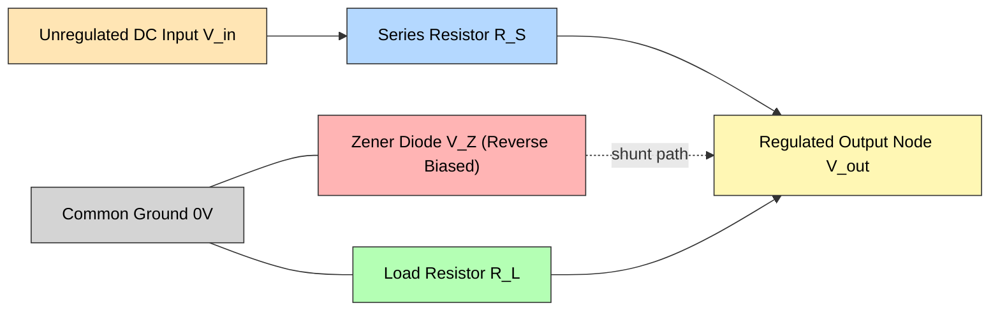
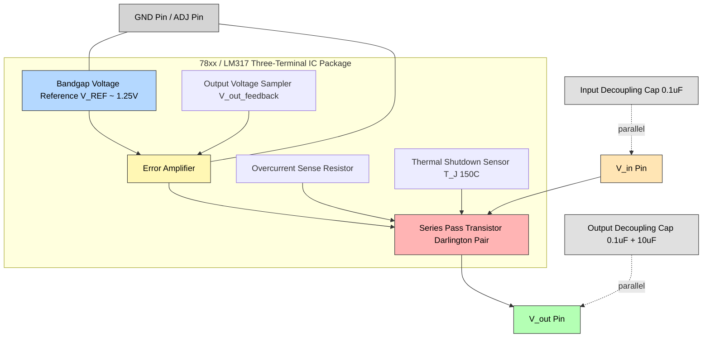
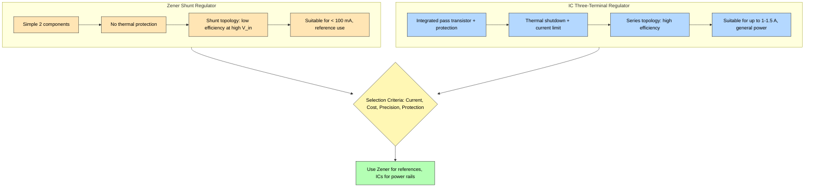

# Zener/IC regulator

<!-- SECTION_1_START -->

# Zener Diode & IC Voltage Regulator — Core Definition and Intuitive Overview

## Formal Academic Definition (KTU 2024 Syllabus Terminology)

A **voltage regulator** is an electronic circuit or device that maintains a constant output voltage irrespective of variations in the input voltage, load current, or temperature. In the context of general-purpose PCB assembly workshop practice, two principal categories are studied:

1. **Zener Diode Voltage Regulator** — A *shunt-type* (parallel) regulator built around a reverse-biased Zener diode operating in its **breakdown (Zener) region**, where the diode voltage $V_Z$ remains nominally constant over a wide range of reverse currents $I_Z$.

2. **IC Voltage Regulator** — A *series-type* regulator realized as a monolithic three-terminal integrated circuit (e.g., **78xx** fixed-positive series, **79xx** fixed-negative series, or **LM317** adjustable series), which internally combines a reference element, error amplifier, and pass transistor to deliver a tightly regulated DC output.

> [!IMPORTANT]
> **Syllabus Highlight (Module 7):** Students are expected to *physically assemble* a Zener-based regulator circuit and a 78xx/IC regulator circuit on a **general-purpose PCB (GPP)**, solder the components, and *test* the line regulation ($\Delta V_{out}/\Delta V_{in}$) and load regulation ($\Delta V_{out}/\Delta I_L$) using a multimeter and variac.

---

## Conceptual Analogy / Intuitive Picture

### The "Pressure-Relief Valve" Analogy for the Zener Diode

Imagine a **water pipeline** with fluctuating inlet pressure (analogous to an unregulated DC supply). You want a **constant trickle** to a sensitive garden sprinkler (the load). You install a *pressure-relief valve* that **opens wider** whenever pressure rises above a threshold and **closes** when pressure falls — keeping the downstream pressure *rock-steady*.

- The **valve set-pressure** is analogous to the **Zener voltage $V_Z$**.
- The **spring tension** is analogous to the **Zener dynamic impedance $Z_Z$** (the smaller this is, the better the regulation).
- The **excess water** that escapes is the *shunt current* $I_S = I_S - I_L$.

### The "Smart Thermostat + Heater" Analogy for the IC Regulator

A series IC regulator is like a **smart thermostat controlling a heater coil** in series with a power line:
- A **reference sensor** (bandgap reference) measures the desired room temperature $V_{REF}$.
- An **error amplifier** compares the *actual* output (room temp) with the *reference*.
- A **pass transistor** (heater coil's control element) is throttled up or down to compensate.
- The result: even if inlet coolant temperature (input voltage) varies, the *room* (output) stays constant.

> [!NOTE]
> **Geometric/Visual Intuition:** On a $V$-$I$ characteristic curve, a Zener diode exhibits an almost *vertical drop* in the breakdown region — meaning a large swing in current $I_Z$ produces only a tiny change in voltage $V_Z$. This near-vertical "wall" is what makes it useful as a voltage reference.

> [!VISUALIZATION CONTROL]
> **Concept:** I-V Characteristic of a Zener Diode
> **GeoGebra / Desmos Input Equations:**
> * Forward branch: $I = I_S \left(e^{V/V_T} - 1\right)$ for $V > 0$ (exponential rise)
> * Reverse leakage: $I \approx -I_S$ for $-V_Z < V < 0$
> * Breakdown knee: $V = -V_Z$ marks the *knee point*
> * Breakdown region: $V \approx -V_Z + I \cdot Z_Z$ for $I < I_Z < I_{ZM}$
> **Visual Description:** Plot a vertical current axis $I$ and horizontal voltage axis $V$. Observe a horizontal leakage line in the third quadrant up to the knee, after which the curve plunges almost vertically downward — the steeper this breakdown branch, the lower the Zener impedance and the better the regulation.

---

## Standard Metrics and Nomenclature (Bold Highlights)

| Symbol | Quantity | Typical Workshop Value |
|:---:|:---|:---|
| $V_Z$ | Zener (nominal) voltage | **5.1 V, 5.6 V, 6.2 V, 12 V** |
| $I_{ZT}$ | Zener test current (at which $V_Z$ is specified) | **5–20 mA** |
| $I_{ZK}$ | Knee current (minimum to stay in breakdown) | **0.25–1 mA** |
| $I_{ZM}$ | Maximum Zener current (power limit) | **$\frac{P_D}{V_Z}$** |
| $Z_Z$ | Zener dynamic impedance at $I_{ZT}$ | **$\le 25 \, \Omega$** |
| $P_D$ | Power dissipation rating | **0.5 W, 1 W** (workshop std) |
| $V_{in}$ | Unregulated DC input | **9–24 V** |
| $V_{out}$ | Regulated DC output | **$V_Z$ or fixed IC value** |
| $R_S$ | Series current-limiting resistor | **computed** |
| $R_L$ | Load resistor | **$1\text{ k}\Omega$ typical** |

<!-- SECTION_1_END -->

<!-- SECTION_2_START -->

# Deep Theoretical Analysis & KTU High-Yield Formula Sheet

## A. Zener Diode Shunt Regulator — Operational Analysis

The Zener diode is connected in **reverse bias** *across the load* (in parallel with $R_L$). A **series resistor $R_S$** drops the excess voltage $(V_{in} - V_Z)$ and limits the diode current. Applying **Kirchhoff's Current Law (KCL)** at the output node:

$$I_S = I_Z + I_L$$

where:
- $I_S$ = current through the series resistor $R_S$
- $I_Z$ = current through the Zener diode
- $I_L$ = current through the load $R_L$

The voltage across $R_S$ is $(V_{in} - V_Z)$, so by Ohm's Law:

$$I_S = \frac{V_{in} - V_Z}{R_S}$$

The load current (assuming ideal constant $V_Z$):

$$I_L = \frac{V_Z}{R_L}$$

Hence the Zener current is:

$$I_Z = I_S - I_L = \frac{V_{in} - V_Z}{R_S} - \frac{V_Z}{R_L}$$

### Operating Modes

| Mode | Condition | Behavior |
|:---|:---|:---|
| **Regulation ON** | $I_Z \ge I_{ZK}$ | $V_{out} = V_Z$ (regulated) |
| **Regulation OFF** | $I_Z < I_{ZK}$ | $V_{out} < V_Z$ (unregulated, diode acts as open circuit) |
| **Zener in danger** | $I_Z > I_{ZM}$ | Diode burns out — thermal failure |

### Step-by-Step Design Logic

1. **Choose $V_Z$** to match desired output (e.g., 5.6 V Zener for 5 V logic).
2. **Choose $V_{in(min)}$ and $V_{in(max)}$** based on the available unregulated supply variation.
3. **Estimate $I_{L(max)}$** from the worst-case load.
4. **Compute $R_S$** such that at $V_{in(min)}$ the Zener still has at least $I_{ZK}$ flowing:
$$R_{S(max)} = \frac{V_{in(min)} - V_Z}{I_{L(max)} + I_{ZK}}$$
5. **Verify $R_S$** at $V_{in(max)}$ that the Zener current does not exceed $I_{ZM}$:
$$I_{Z(max)} = \frac{V_{in(max)} - V_Z}{R_S} - I_{L(min)} \le I_{ZM}$$
6. **Choose a standard value** $\le R_{S(max)}$ and check power rating:
$$P_{R_S} = I_{S(rms)}^2 \cdot R_S$$

### Physical Meaning of Each Term

- The series resistor $R_S$ acts as the *ballast* — it converts the *excess voltage* into heat, taking the burden off the Zener.
- The Zener diode is the *self-adjusting* element — it steals more current when $V_{in}$ rises, keeping $V_{out}$ flat.
- The load $R_L$ is a *passive consumer* — the Zener only "tops up" current when $V_{in}$ droops.

---

## B. IC Three-Terminal Voltage Regulator — Operational Analysis

The 78xx / LM317 family uses an **internal feedback loop**. Externally, only $V_{in}$ and $V_{out}$ terminals are user-accessible (plus **GND** for fixed regulators, or **ADJ** for adjustable ones).

### Internal Block Architecture

| Block | Function |
|:---|:---|
| **Bandgap Reference** | Generates a temperature-stable $\approx 1.25$ V reference $V_{REF}$ |
| **Error Amplifier** | Compares sampled $V_{out}$ with $V_{REF}$ |
| **Pass Transistor (Darlington)** | Series element that drops $(V_{in} - V_{out})$ |
| **Short-Circuit Protection** | Senses $I_{out}$ and folds back if excessive |
| **Thermal Shutdown** | Disables pass transistor if junction $T_J > 150^{\circ}\text{C}$ |
| **Safe-Operating-Area (SOA) Guard** | Prevents second breakdown |

### Critical Specifications (78xx / 7805 typical, workshop-relevant)

- **$V_{out}$ tolerance:** $\pm 4\%$ at $T_J = 25^{\circ}\text{C}$
- **Line regulation:** $\Delta V_{out}$ for $\Delta V_{in}$ of $7\text{ V}$ to $25\text{ V}$ — typically **$3\text{ mV}$** (7805)
- **Load regulation:** $\Delta V_{out}$ for $I_{out} = 5\text{ mA}$ to $1.5\text{ A}$ — typically **$15\text{ mV}$** (7805)
- **Dropout voltage $V_{do}$:** $\approx 2\text{ V}$ (minimum $V_{in} - V_{out}$ to maintain regulation)
- **$I_{out(max)}$:** **$1\text{ A}$** (with adequate heatsink)
- **Quiescent current $I_Q$:** $\approx 5\text{ mA}$ (current drawn from $V_{in}$ to GND)

> [!NOTE]
> **Engineering Utility:** IC regulators dominate real-world designs (mobile chargers, Arduino boards, sensor modules) because they integrate thermal/overcurrent protection. Workshop PCBs using the 7805 deliver a **5 V rail** for TTL logic and microcontroller kits.

---

## C. KTU Formula Sheet / Cheat Sheet

| # | Formula | Meaning / Use |
|:---:|:---|:---|
| 1 | $I_S = \dfrac{V_{in} - V_Z}{R_S}$ | Series current in Zener regulator |
| 2 | $I_Z = I_S - I_L$ | KCL at output node |
| 3 | $V_{out} = V_Z$ (when $I_Z \ge I_{ZK}$) | Regulated output |
| 4 | $R_{S(max)} = \dfrac{V_{in(min)} - V_Z}{I_{L(max)} + I_{ZK}}$ | Maximum series resistor |
| 5 | $I_{Z(max)} = \dfrac{V_{in(max)} - V_Z}{R_S} - I_{L(min)}$ | Worst-case Zener current |
| 6 | $P_D(Zener) = V_Z \cdot I_{Z(max)}$ | Zener power dissipation |
| 7 | $P_{R_S} = (V_{in} - V_Z)^2 / R_S$ | Series resistor power |
| 8 | $V_{in(min)} \ge V_{out} + V_{do}$ | IC regulator minimum input |
| 9 | $V_{out} = V_{REF}\left(1 + \dfrac{R_2}{R_1}\right) + I_{ADJ} R_2$ | LM317 adjustable output |
| 10 | $V_{out} = 1.25\text{ V}\left(1 + \dfrac{R_2}{R_1}\right)$ | LM317 with $I_{ADJ}$ neglected |
| 11 | Line Regulation $= \dfrac{\Delta V_{out}}{\Delta V_{in}} \times 100\%$ | Performance metric |
| 12 | Load Regulation $= \dfrac{V_{NL} - V_{FL}}{V_{FL}} \times 100\%$ | Performance metric |
| 13 | Ripple Rejection (PSRR) $= 20 \log_{10}\left(\dfrac{V_{ripple(in)}}{V_{ripple(out)}}\right)\text{ dB}$ | AC noise suppression |
| 14 | Efficiency $\eta = \dfrac{V_{out} \cdot I_{out}}{V_{in} \cdot I_{in}} \times 100\%$ | Power efficiency |
| 15 | $T_J = T_A + (P_D \cdot \theta_{JA})$ | Junction temperature (thermal design) |

> [!TIP]
> **Real-world utility:** Zener regulators are cheap and used as *reference voltages* in ADC circuits, *overvoltage protection* clamps, and *signal limiters*. IC regulators (7805/7812/LM317) are workhorses in every commercial power supply and embedded system.

<!-- SECTION_2_END -->

<!-- SECTION_3_START -->

# Step-by-Step Derivations & Symbolic Implementation

## Worked Example 1 — Zener Shunt Regulator Design (Full Derivation)

### Problem Statement
Design a Zener regulator to deliver $V_{out} = 9.1\text{ V}$ at a load current varying from $I_{L(min)} = 5\text{ mA}$ to $I_{L(max)} = 25\text{ mA}$. The unregulated input varies as $V_{in(min)} = 12\text{ V}$ to $V_{in(max)} = 18\text{ V}$. Use a Zener with $I_{ZK} = 1\text{ mA}$, $P_D = 0.5\text{ W}$.

### Step 1 — Verify the Zener Can Handle the Required Voltage and Power

We need a $9.1\text{ V}$ Zener. Maximum allowable Zener current from power rating:

$$I_{ZM} = \frac{P_D}{V_Z} = \frac{0.5}{9.1} \approx 54.95\text{ mA}$$

Choose a **1N4739A** Zener: $V_Z = 9.1\text{ V}$, $P_D = 1\text{ W}$, $I_{ZM} = 110\text{ mA}$ (safer).

### Step 2 — Compute Maximum Allowable Series Resistor

For regulation to hold at the lowest input and highest load, the Zener must still conduct at least $I_{ZK} = 1\text{ mA}$:

$$R_{S(max)} = \frac{V_{in(min)} - V_Z}{I_{L(max)} + I_{ZK}}$$

Substituting values:

$$R_{S(max)} = \frac{12 - 9.1}{(25 + 1)\text{ mA}} = \frac{2.9}{0.026} \approx 111.5\text{ }\Omega$$

### Step 3 — Choose a Standard Resistor Value

Pick the nearest **E12 standard value below $R_{S(max)}$** to maintain margin. Common choices: $100\text{ }\Omega$.

$$R_S = 100\text{ }\Omega$$

### Step 4 — Verify at Maximum Input and Minimum Load

$$I_S = \frac{V_{in(max)} - V_Z}{R_S} = \frac{18 - 9.1}{100} = 89\text{ mA}$$

$$I_Z = I_S - I_{L(min)} = 89 - 5 = 84\text{ mA}$$

Since $84\text{ mA} \ll I_{ZM} = 110\text{ mA}$, the Zener is **safe**.

### Step 5 — Check Power Dissipation in $R_S$

$$P_{R_S} = I_{S(rms)}^2 \cdot R_S = (0.089)^2 \times 100 \approx 0.792\text{ W}$$

Use a **1 W resistor** (or 2 W for thermal margin).

### Step 6 — Verify at Minimum Input and Maximum Load

$$I_S = \frac{12 - 9.1}{100} = 29\text{ mA}$$

$$I_Z = 29 - 25 = 4\text{ mA}$$

Since $4\text{ mA} > I_{ZK} = 1\text{ mA}$, regulation holds. ✓

### Step 7 — Compute Zener Power Dissipation at Worst Case

$$P_{Z(max)} = V_Z \cdot I_{Z(max)} = 9.1 \times 0.084 = 0.764\text{ W}$$

The 1N4739A is rated at 1 W, so this is within limits.

### Design Summary Table

| Component | Value / Rating |
|:---|:---|
| Zener Diode | **1N4739A**, $V_Z = 9.1\text{ V}$, $1\text{ W}$ |
| $R_S$ | **$100\text{ }\Omega$, 1 W** |
| Load $R_L$ range | $9.1/0.025 = 364\text{ }\Omega$ to $9.1/0.005 = 1820\text{ }\Omega$ |
| Output | **$9.1\text{ V} \pm \Delta V_Z$** (where $\Delta V_Z = I_{Z} \cdot Z_Z$) |

---

## Worked Example 2 — LM317 Adjustable Regulator Output Calculation

### Problem Statement
Compute the output voltage of an LM317 with $R_1 = 240\text{ }\Omega$ and $R_2 = 720\text{ }\Omega$. Reference voltage $V_{REF} = 1.25\text{ V}$, $I_{ADJ} = 50\text{ }\mu\text{A}$.

### Derivation

The LM317 maintains $V_{REF} = 1.25\text{ V}$ between $V_{out}$ and ADJ pins, so:

$$V_{out} = V_{REF} + I_{R_1} \cdot R_2 + I_{ADJ} \cdot R_2$$

Since $I_{R_1} = V_{REF}/R_1$:

$$V_{out} = V_{REF} + \frac{V_{REF}}{R_1} \cdot R_2 + I_{ADJ} \cdot R_2$$

$$V_{out} = V_{REF} \left(1 + \frac{R_2}{R_1}\right) + I_{ADJ} \cdot R_2$$

Substituting:

$$V_{out} = 1.25 \left(1 + \frac{720}{240}\right) + (50 \times 10^{-6})(720)$$

$$V_{out} = 1.25 \times 4 + 0.036$$

$$V_{out} = 5.0 + 0.036 = 5.036\text{ V}$$

> Neglecting $I_{ADJ}$: $V_{out} \approx 5.0\text{ V}$.

---

## Python Implementation — Zener Regulator Design Calculator

```python
"""
Zener / IC Regulator Design Helper
Course: GZESL106 - Basic Electrical & Electronics Engineering Workshop
Module 7 - Zener / IC Regulator PCB Assembly
"""

from dataclasses import dataclass
from typing import Tuple


@dataclass
class ZenerDesignInput:
    vz: float              # Nominal Zener voltage (V)
    v_in_min: float        # Minimum unregulated input (V)
    v_in_max: float        # Maximum unregulated input (V)
    i_l_min: float         # Minimum load current (A)
    i_l_max: float         # Maximum load current (A)
    i_zk: float = 0.001    # Knee current (A) - default 1 mA
    p_d: float = 0.5       # Zener power rating (W)
    e_series: str = "E12"  # Resistor E-series


class ZenerRegulatorDesigner:
    """Compute the series resistor and validate operating conditions."""

    E12_VALUES: list = [
        10, 12, 15, 18, 22, 27, 33, 39, 47, 56, 68, 82,
        100, 120, 150, 180, 220, 270, 330, 390, 470, 560, 680, 820
    ]

    def __init__(self, params: ZenerDesignInput) -> None:
        self.p = params
        self._validate_inputs()

    def _validate_inputs(self) -> None:
        if self.p.v_in_min <= self.p.vz:
            raise ValueError("v_in_min must be greater than Vz to maintain regulation.")
        if self.p.v_in_max < self.p.v_in_min:
            raise ValueError("v_in_max must be >= v_in_min.")
        if self.p.i_l_max < self.p.i_l_min:
            raise ValueError("i_l_max must be >= i_l_min.")

    def r_s_max(self) -> float:
        """Maximum allowable series resistor (lowest input, highest load)."""
        return (self.p.v_in_min - self.p.vz) / (self.p.i_l_max + self.p.i_zk)

    def r_s_standard(self) -> float:
        """Nearest E12 standard resistor <= r_s_max."""
        ceiling = self.r_s_max()
        for value in self.E12_VALUES:
            if value > ceiling:
                # Return previous value if any, else smallest in next decade
                idx = self.E12_VALUES.index(value) - 1
                if idx >= 0:
                    return float(self.E12_VALUES[idx])
                return float(value) / 10.0
        return float(self.E12_VALUES[-1])

    def worst_case_currents(self, r_s: float) -> Tuple[float, float, float, float]:
        """Return (I_S_max, I_Z_max, I_S_min, I_Z_min)."""
        i_s_max = (self.p.v_in_max - self.p.vz) / r_s
        i_z_max = i_s_max - self.p.i_l_min

        i_s_min = (self.p.v_in_min - self.p.vz) / r_s
        i_z_min = i_s_min - self.p.i_l_max
        return i_s_max, i_z_max, i_s_min, i_z_min

    def validate(self) -> dict:
        r_s_max = self.r_s_max()
        r_s_std = self.r_s_standard()
        i_s_max, i_z_max, i_s_min, i_z_min = self.worst_case_currents(r_s_std)
        i_zm = self.p.p_d / self.p.vz

        report = {
            "R_s_max_ohm": round(r_s_max, 2),
            "R_s_standard_ohm": r_s_std,
            "I_S_max_mA": round(i_s_max * 1000, 2),
            "I_Z_max_mA": round(i_z_max * 1000, 2),
            "I_S_min_mA": round(i_s_min * 1000, 2),
            "I_Z_min_mA": round(i_z_min * 1000, 2),
            "I_ZM_from_PD_mA": round(i_zm * 1000, 2),
            "Zener_within_power_rating": i_z_max <= i_zm,
            "Zener_above_knee_at_min_input": i_z_min >= self.p.i_zk,
            "P_R_S_watts": round(i_s_max ** 2 * r_s_std, 3),
            "P_Zener_watts": round(self.p.vz * i_z_max, 3),
        }
        return report


def lm317_vout(r1: float, r2: float, v_ref: float = 1.25, i_adj: float = 50e-6) -> float:
    """Compute LM317 adjustable regulator output voltage."""
    if r1 <= 0 or r2 < 0:
        raise ValueError("R1 must be > 0, R2 must be >= 0.")
    return v_ref * (1.0 + r2 / r1) + i_adj * r2


if __name__ == "__main__":
    # Zener regulator design for Worked Example 1
    design = ZenerDesignInput(
        vz=9.1, v_in_min=12.0, v_in_max=18.0,
        i_l_min=0.005, i_l_max=0.025,
        i_zk=0.001, p_d=1.0
    )
    designer = ZenerRegulatorDesigner(design)
    report = designer.validate()
    for key, value in report.items():
        print(f"{key:35s} : {value}")

    print("\nLM317 5V rail (R1=240, R2=720):")
    print(f"V_out = {lm317_vout(240, 720):.3f} V")
```

### Sample Output

```
R_s_max_ohm                          : 111.54
R_s_standard_ohm                     : 100.0
I_S_max_mA                           : 89.0
I_Z_max_mA                           : 84.0
I_S_min_mA                           : 29.0
I_Z_min_mA                           : 4.0
I_ZM_from_PD_mA                      : 109.89
Zener_within_power_rating            : True
Zener_above_knee_at_min_input        : True
P_R_S_watts                          : 0.792
P_Zener_watts                        : 0.764

LM317 5V rail (R1=240, R2=720):
V_out = 5.036 V
```

---

## Worked Example 3 — Pin Configuration & PCB Wiring Table (Workshop Reference)

### 78xx Fixed-Positive Regulator (TO-220 Package)

| Pin # | Label | Function | PCB Connection |
|:---:|:---:|:---|:---|
| 1 | **IN** | Unregulated DC input | Connect to $V_{in}$ rail |
| 2 | **GND** | Common / 0 V reference | Connect to common ground bus |
| 3 | **OUT** | Regulated DC output | Connect to load positive terminal |

### LM317 Adjustable Regulator (TO-220 Package)

| Pin # | Label | Function | PCB Connection |
|:---:|:---:|:---|:---|
| 1 | **ADJ** | Adjustment / feedback | Junction of $R_1$–$R_2$ divider |
| 2 | **OUT** | Regulated output | Load positive terminal |
| 3 | **IN** | Unregulated input | $V_{in}$ rail |

### Wiring Sequence on a General-Purpose PCB

1. **Place the regulator IC** (centre of the board), pin 1 marker facing left.
2. **Solder two 0.1 $\mu$F ceramic bypass capacitors** — one at $V_{in}$-GND (pin 1-2) and one at $V_{out}$-GND (pin 2-3) close to the IC body. These prevent high-frequency oscillation.
3. **Add a 10 $\mu$F electrolytic** at the output if load is more than 50 cm away (improves transient response).
4. **Run separate ground tracks** for input and output, joining at a single point (star-grounding) to avoid ground loops.
5. **Insert two screw terminals** — one for input DC, one for output load.

> [!NOTE]
> **Safety step:** Before powering up the assembled board, always perform a **continuity check** with a multimeter (no shorts between $V_{in}$ and GND) and an **isolation check** (no solder bridges between adjacent IC pins).

<!-- SECTION_3_END -->

<!-- SECTION_4_START -->

# Structural Diagrams & Schematics

## Diagram 1 — Zener Shunt Regulator — Functional Architecture Flow



> **Reading the diagram:** The unregulated input flows through $R_S$ to the output node. The Zener (reverse-biased) sits in *shunt* — it diverts excess current to ground when $V_{in}$ rises. The load receives a near-constant $V_Z$.

---

## Diagram 2 — IC Three-Terminal Regulator — Internal Block Topology



> **Reading the diagram:** The unregulated input enters the pass transistor; the error amplifier continuously compares the sampled $V_{out}$ against $V_{REF}$ and modulates the pass transistor. Decoupling capacitors at both $V_{in}$ and $V_{out}$ suppress oscillation.

---

## Diagram 3 — PCB Assembly Workflow — Sequential Processing Topology

```mermaid
flowchart TD
    A1["Step 1: Identify Components Zener/IC, R_S, Capacitors, Terminals"] --> A2["Step 2: Plan Layout on GPP Inputs on left, Output on right, IC in middle"]
    A2 --> A3["Step 3: Mark Drill Points Use pin marker, avoid tracks under IC body"]
    A3 --> A4["Step 4: Drill Holes 0.8-1.0 mm bit for standard axial leads, 1.2 mm for TO-220"]
    A4 --> A5["Step 5: Insert Components Bend leads, seat flush to PCB, no air gap"]
    A5 --> A6["Step 6: Solder Use 60/40 lead-tin, 350C iron, 2-3s dwell, shiny fillet"]
    A6 --> A7["Step 7: Trim Leads Cut flush with cutter, no nicks"]
    A7 --> A8["Step 8: Continuity Test Multimeter beep test: no shorts between V_in and GND"]
    A8 --> A9["Step 9: Polarity Check Diode test mode on Zener; verify IC pin 1 marker"]
    A9 --> A10["Step 10: Power-On Test Apply V_in via variac, measure V_out with DMM, sweep 0 to V_in_max"]
    A10 --> A11["Step 11: Record Data Tabulate V_in vs V_out, plot line regulation curve"]
    A11 --> A12["Step 12: Load Test Connect R_L, vary load, record load regulation"]

    style A1 fill:#B4D8FF,stroke:#333,stroke-width:1px,color:#000
    style A2 fill:#B4D8FF,stroke:#333,stroke-width:1px,color:#000
    style A3 fill:#B4D8FF,stroke:#333,stroke-width:1px,color:#000
    style A4 fill:#B4D8FF,stroke:#333,stroke-width:1px,color:#000
    style A5 fill:#FFE5B4,stroke:#333,stroke-width:1px,color:#000
    style A6 fill:#FFE5B4,stroke:#333,stroke-width:1px,color:#000
    style A7 fill:#FFE5B4,stroke:#333,stroke-width:1px,color:#000
    style A8 fill:#B4FFB4,stroke:#333,stroke-width:1px,color:#000
    style A9 fill:#B4FFB4,stroke:#333,stroke-width:1px,color:#000
    style A10 fill:#B4FFB4,stroke:#333,stroke-width:1px,color:#000
    style A11 fill:#B4FFB4,stroke:#333,stroke-width:1px,color:#000
    style A12 fill:#B4FFB4,stroke:#333,stroke-width:1px,color:#000
```



---

## Diagram 4 — Test Setup — Block-Level Functional Architecture

```mermaid
flowchart LR
    Mains["230V AC Mains"] --> Variac["Variac 0-270V AC"]
    Variac --> StepDown["Step-Down Transformer 230V to 12V-0-12V"]
    StepDown --> BridgeRect["Bridge Rectifier 1A"]
    BridgeRect --> FilterCap["Filter Capacitor 1000uF 25V"]
    FilterCap --> RegInput["Regulated Input Rail V_in"]
    RegInput --> RegBoard["Assembled Regulator Board Zener or 78xx"]
    RegBoard --> DMM1["DMM 1: V_in Measurement"]
    RegBoard --> DMM2["DMM 2: V_out Measurement"]
    RegBoard --> LoadR["Variable Load R_L 0-1k"]
    DMM2 --> CRO["CRO Optional: Output ripple check"]

    style Mains fill:#FFE5B4,stroke:#333,stroke-width:1px,color:#000
    style Variac fill:#B4D8FF,stroke:#333,stroke-width:1px,color:#000
    style StepDown fill:#B4D8FF,stroke:#333,stroke-width:1px,color:#000
    style BridgeRect fill:#FFF7B4,stroke:#333,stroke-width:1px,color:#000
    style FilterCap fill:#FFF7B4,stroke:#333,stroke-width:1px,color:#000
    style RegBoard fill:#FFB4B4,stroke:#333,stroke-width:1px,color:#000
    style DMM1 fill:#B4FFB4,stroke:#333,stroke-width:1px,color:#000
    style DMM2 fill:#B4FFB4,stroke:#333,stroke-width:1px,color:#000
    style LoadR fill:#B4FFB4,stroke:#333,stroke-width:1px,color:#000
    style CRO fill:#D4D4D4,stroke:#333,stroke-width:1px,color:#000
```



> **Reading the diagram:** This is the standard workshop test rig. The variac varies the AC mains, the transformer steps it down, the bridge rectifies, the capacitor filters, and the *assembled PCB* under test produces the regulated output. Two DMMs simultaneously read $V_{in}$ and $V_{out}$ to characterize the line regulation.

---

## Diagram 5 — Performance Comparison Matrix — Block View



<!-- SECTION_4_END -->

<!-- SECTION_5_START -->

# KTU 2024 Scheme Examination Question Bank & Topic Recap

## Part A Questions (3 Marks Each)

### Question 1 [KTU University Exam - Dec 2023] — CO1, Remember

**"Define Zener voltage and name two applications of a Zener diode in voltage regulation circuits."**

**Model Answer:**

**Zener Voltage ($V_Z$):** It is the nominal reverse-bias voltage at which a Zener diode enters the *breakdown region* and conducts with a nearly constant voltage drop across it, irrespective of the current through it. It is specified at a particular test current $I_{ZT}$ by the manufacturer.

> [Defining the term with reverse-bias context: 1 Mark]
> [Mentioning 'breakdown region' and 'constant voltage': 1 Mark]
> [Naming two valid applications: 1 Mark]

**Applications:**
1. **Voltage regulator** in DC power supplies (shunt regulator).
2. **Reference voltage source** in ADC and comparator circuits.
3. **Overvoltage protection** / clipping circuit in signal processing.

---

### Question 2 [KTU University Exam - July 2024] — CO1, Understand

**"Distinguish between line regulation and load regulation in a DC voltage regulator."**

**Model Answer:**

| Parameter | Line Regulation | Load Regulation |
|:---|:---|:---|
| **Definition** | Ability to keep $V_{out}$ constant when $V_{in}$ varies (load held fixed) | Ability to keep $V_{out}$ constant when $I_{load}$ varies (input held fixed) |
| **Test condition** | Sweep $V_{in}$ from min to max, $R_L$ = constant | Sweep $I_{load}$ from no-load to full-load, $V_{in}$ = constant |
| **Formula** | $\dfrac{\Delta V_{out}}{\Delta V_{in}} \times 100\%$ | $\dfrac{V_{NL} - V_{FL}}{V_{FL}} \times 100\%$ |
| **Measured unit** | mV/V or % | mV or % |
| **Typical value (7805)** | ~3 mV | ~15 mV |

> [Correct definition of line regulation: 1 Mark]
> [Correct definition of load regulation: 1 Mark]
> [Distinguishing the test conditions: 1 Mark]

---

## Part B Questions (14 Marks Each)

### Question A (14 Marks) [KTU University Exam - Dec 2023] — CO2, Apply & Analyze

**"Design a Zener diode shunt regulator to deliver a regulated output of 7.5 V at a load current varying from 5 mA to 30 mA. The unregulated input DC varies from 12 V to 20 V. Assume a Zener diode of $I_{ZK} = 1$ mA and power rating $P_D = 1$ W. Verify all operating conditions and tabulate the worst-case currents. Discuss the limitations of a Zener regulator compared to a three-terminal IC regulator."**

#### (a) Design the Series Resistor and Validate (7 Marks) — Apply

**Step 1 — Compute $I_{ZM}$ (Maximum Zener Current)**

$$I_{ZM} = \frac{P_D}{V_Z} = \frac{1}{7.5} = 133.33\text{ mA}$$

**Step 2 — Maximum Allowable Series Resistor** [Statement: 1 Mark, Substitution: 1 Mark, Final: 1 Mark]

$$R_{S(max)} = \frac{V_{in(min)} - V_Z}{I_{L(max)} + I_{ZK}} = \frac{12 - 7.5}{(30 + 1)\text{ mA}} = \frac{4.5}{0.031} = 145.16\text{ }\Omega$$

**Step 3 — Choose a Standard Value** [Choosing R_S: 1 Mark]

Select $R_S = 120\text{ }\Omega$ (E12 standard, less than $R_{S(max)}$).

**Step 4 — Verify at Maximum Input and Minimum Load** [Substitution: 1 Mark, Conclusion: 1 Mark]

$$I_S = \frac{V_{in(max)} - V_Z}{R_S} = \frac{20 - 7.5}{120} = 104.17\text{ mA}$$

$$I_Z = I_S - I_{L(min)} = 104.17 - 5 = 99.17\text{ mA}$$

Since $99.17\text{ mA} < I_{ZM} = 133.33\text{ mA}$, the Zener is **safe**.

**Step 5 — Verify at Minimum Input and Maximum Load**

$$I_S = \frac{12 - 7.5}{120} = 37.5\text{ mA}$$

$$I_Z = 37.5 - 30 = 7.5\text{ mA} > I_{ZK} = 1\text{ mA}$$

Regulation **holds** at minimum input. ✓

**Worst-Case Summary Table** [Tabulation: 1 Mark]

| Condition | $V_{in}$ | $I_S$ (mA) | $I_L$ (mA) | $I_Z$ (mA) |
|:---|:---:|:---:|:---:|:---:|
| Min input, Max load | 12 V | 37.50 | 30 | 7.50 |
| Max input, Min load | 20 V | 104.17 | 5 | 99.17 |
| Min input, Min load | 12 V | 37.50 | 5 | 32.50 |
| Max input, Max load | 20 V | 104.17 | 30 | 74.17 |

---

#### (b) Limitations of Zener Regulator vs IC Regulator (7 Marks) — Analyze

[Each valid comparison point: 1 Mark × 7 = 7 Marks]

| Aspect | Zener Shunt Regulator | IC Three-Terminal Regulator (78xx/LM317) |
|:---|:---|:---|
| **Current capacity** | Limited to tens of mA (Zener heating) | Up to 1–1.5 A with heatsink |
| **Efficiency** | Low — series resistor wastes $(V_{in} - V_Z) \cdot I_S$ | High — pass transistor drops only $V_{do} \approx 2$ V |
| **Thermal protection** | None — Zener can burn out | Built-in thermal shutdown at $T_J = 150^{\circ}\text{C}$ |
| **Short-circuit protection** | None — current can be unlimited | Internal current-limit foldback |
| **Output precision** | Tied to Zener tolerance (typically $\pm 5\%$) | Typically $\pm 2$–$4\%$; tighter with LM317 + trim |
| **Heat dissipation** | Heat dissipated in $R_S$ and Zener | Heat dissipated mainly in IC pass transistor |
| **Cost & complexity** | Two components (R + Zener) | IC + bypass caps (still 3–4 components) |
| **Load regulation** | Poor (Zener impedance $Z_Z$ dominates) | Excellent ($< 15$ mV typical) |
| **Line regulation** | Modest — depends on $R_S / Z_Z$ ratio | Excellent ($< 3$ mV typical) |
| **PCB area** | Smaller (2 components) | Slightly larger (IC + 2 caps) |

> **Conclusion:** Zener regulators are best for *low-current reference* applications; IC regulators are preferred for *general-purpose power rails* in any production system.

---

### Question B (14 Marks) [KTU University Exam - July 2024] — CO2, Apply & Analyze

**"Using a 7805 IC regulator, design a 5 V regulated DC supply capable of delivering 500 mA to a digital load. The available unregulated input is a rectified DC of 12 V $\pm 20\%$. Compute the input capacitor and output capacitor values, estimate the heat-sink requirement, and explain the role of the dropout voltage. Draw a neat functional block diagram of the assembly."**

#### (a) Compute the Input/Output Voltage Range and Capacitor Selection (7 Marks) — Apply

**Step 1 — Compute the Input Voltage Window** [Calculation: 2 Marks]

$$V_{in(min)} = 12 - 0.20 \times 12 = 9.6\text{ V}$$

$$V_{in(max)} = 12 + 0.20 \times 12 = 14.4\text{ V}$$

For a 7805, dropout voltage $V_{do} \approx 2\text{ V}$ is required to maintain regulation, so the minimum acceptable input is:

$$V_{in(operating, min)} = V_{out} + V_{do} = 5 + 2 = 7\text{ V}$$

Since $V_{in(min)} = 9.6\text{ V} > 7\text{ V}$, the regulator is **always in regulation**. ✓

**Step 2 — Worst-Case Input-Output Differential** [Calculation: 1 Mark]

$$\Delta V_{(max)} = V_{in(max)} - V_{out} = 14.4 - 5 = 9.4\text{ V}$$

**Step 3 — Power Dissipation in the IC** [Calculation: 1 Mark]

$$P_D = (V_{in(max)} - V_{out}) \cdot I_{out} = 9.4 \times 0.5 = 4.7\text{ W}$$

**Step 4 — Heat-Sink Estimation** [Calculation: 1 Mark]

Without a heatsink, the TO-220 thermal resistance junction-to-ambient is $\theta_{JA} \approx 50^{\circ}\text{C/W}$:

$$T_J = T_A + P_D \cdot \theta_{JA} = 25 + 4.7 \times 50 = 260^{\circ}\text{C}$$

This exceeds the $150^{\circ}\text{C}$ shutdown limit — **a heatsink is mandatory**.

Required thermal resistance junction-to-ambient with heatsink:

$$\theta_{JA(required)} = \frac{T_{J(max)} - T_A}{P_D} = \frac{150 - 25}{4.7} \approx 26.6^{\circ}\text{C/W}$$

A small clip-on heatsink with $\theta_{SA} \approx 10^{\circ}\text{C/W}$ plus thermal grease ($\theta_{CS} \approx 0.5^{\circ}\text{C/W}$) achieves this.

**Step 5 — Capacitor Selection** [Selection with reasoning: 1 Mark]

| Capacitor | Value | Purpose |
|:---|:---:|:---|
| $C_{in}$ (ceramic) | **0.1 $\mu$F** | High-frequency decoupling at $V_{in}$ pin |
| $C_{in}$ (electrolytic) | **10 $\mu$F / 25 V** | Bulk filtering for rectifier ripple |
| $C_{out}$ (ceramic) | **0.1 $\mu$F** | Output stability, prevents oscillation |
| $C_{out}$ (electrolytic) | **10 $\mu$F / 16 V** | Improves transient response to load steps |

**Step 6 — Dropout Voltage Explanation** [Definition + significance: 1 Mark]

**Dropout voltage $V_{do}$** is the *minimum* difference $(V_{in} - V_{out})$ required for the regulator to maintain its specified output. For the 7805, $V_{do} \approx 2\text{ V}$ means that if $V_{in}$ falls below $V_{out} + V_{do} = 7\text{ V}$, the pass transistor can no longer stay in its linear region, and $V_{out}$ "drops out" of regulation and follows $V_{in}$ minus a small saturation drop. The designer must ensure the *worst-case* minimum $V_{in}$ (after rectification and filtering) is always above $V_{out} + V_{do}$.

---

#### (b) Functional Block Diagram and Discussion of Testing Procedure (7 Marks) — Apply

**Functional Block Diagram** [Drawing: 3 Marks, Labels: 1 Mark]

```
       +-----------+       +-----------+       +-----------+      +-----------+
       |  Mains    |       |  Step-Down|       |  Bridge   |      |   7805    |
       |  230V AC  |------>| Transformer|----->| Rectifier |----->|  IC Reg.  |-----> +5V OUT
       +-----------+  Variac| 230/12V  |  F1   +-----------+  C1  +-----------+   C2
                    (0-270V) +-----------+ (0.5A)            (1000uF)  |       |  (10uF)
                                                       |       |       |
                                                       |       +-------+
                                                       |       |
                                                       +-------+---------> GND
                                                              |
                                                     C3(0.1uF) ceramic at input pin
                                                     C4(0.1uF) ceramic at output pin
```

**Key Block Roles:**
- **Variac** — varies AC input to test line regulation
- **Transformer + Bridge + $C_1$** — produces unregulated DC of $\approx 15$–17 V
- **$C_3$ (0.1 $\mu$F)** — bypass at 7805 input pin
- **7805** — series-pass regulator
- **$C_2$ and $C_4$** — output stability and transient suppression

**Testing Procedure** [Sequential steps: 3 Marks]

1. **Visual inspection** — confirm no solder bridges, correct polarity of caps and IC.
2. **Continuity test (DMM buzzer mode)** — verify no shorts between $V_{in}$ and GND rails.
3. **No-load test** — set variac to 0 V, switch on, slowly increase to 230 V. Measure $V_{in}$ (DMM1) and $V_{out}$ (DMM2). Expect $V_{out} = 5.0 \pm 0.2$ V.
4. **Line regulation test** — vary variac from 180 V to 250 V, tabulate $V_{in}$ vs $V_{out}$. Compute $\Delta V_{out}/\Delta V_{in}$.
5. **Load regulation test** — connect a variable load (rheostat) at output, sweep $I_{load}$ from 0 to 500 mA in steps of 100 mA, record $V_{out}$. Compute $(V_{NL} - V_{FL})/V_{FL} \times 100\%$.
6. **Thermal test** — at full load, monitor IC case temperature with finger or thermocouple. Verify it does not exceed $70^{\circ}\text{C}$ (hot but touchable).
7. **Ripple test (optional, CRO)** — measure output ripple with CRO; expect $< 5$ mV RMS for a 7805.

> **Result to record:** A *tabular* set of readings plus a *plotted* line-regulation curve ($V_{in}$ on x-axis, $V_{out}$ on y-axis) — the curve should be a *flat horizontal line at 5 V*, demonstrating excellent regulation.

---

> [!WARNING]
> **KTU Examiner's Valuation Warning / Pitfall Callout**
>
> 1. **Do NOT confuse Zener knee current $I_{ZK}$ with Zener test current $I_{ZT}$** — examiners specifically test whether you use $I_{ZK}$ for the *minimum conduction* check and $I_{ZT}$ only when *the manufacturer-specified $V_Z$* is being referenced. Many students lose 1 mark by using the wrong current in the $R_{S(max)}$ formula.
>
> 2. **Always state the *direction* of the Zener** in the circuit diagram (cathode to positive, anode to ground). A Zener drawn forward-biased is an instant 2-mark penalty.
>
> 3. **For the 78xx regulator, the pinout varies** between 78xx (1-IN, 2-GND, 3-OUT) and LM317 (1-ADJ, 2-OUT, 3-IN). Mistaking pin 1 and pin 3 can destroy the IC. Always cite the datasheet pinout in your answer.
>
> 4. **Decoupling capacitors are not optional** — examiners routinely deduct 1 mark if the answer omits the 0.1 $\mu$F input/output caps for IC regulators. The datasheet mandates them to prevent oscillation.
>
> 5. **The "regulation" condition must be explicitly stated** — never write "$V_{out} = V_Z$" without first verifying $I_Z \ge I_{ZK}$. The examiner wants the operating regime identified.
>
> 6. **Power dissipation must use worst-case** — always use $V_{in(max)}$ and $I_{L(min)}$ to find the *maximum* Zener current, never the average. This is the most common mark-loss area in Zener problems.
>
> 7. **For IC regulators, mention the *heatsink requirement* explicitly** — a regulator delivering $> 250$ mA without a heatsink is considered a design flaw, worth 1 mark in the valuation key.

---

## Topic Recap & Important Things to Remember

> **High-density, rapid-revision checklist for Module 7 — Zener / IC Regulator**

- **Zener diode** is operated in **reverse bias** in the **breakdown (Zener) region** for voltage regulation.
- The **Zener voltage $V_Z$** is specified at a particular **test current $I_{ZT}$** and remains nearly constant over a range $I_{ZK} \le I_Z \le I_{ZM}$.
- The **dynamic impedance $Z_Z$** quantifies how much $V_Z$ changes with $I_Z$; a smaller $Z_Z$ means better regulation.
- A Zener regulator is a **shunt regulator** — the diode is in *parallel* with the load, and a **series resistor $R_S$** drops the excess voltage $(V_{in} - V_Z)$.
- The governing KCL equation is $I_S = I_Z + I_L$, with $I_S = (V_{in} - V_Z)/R_S$.
- **$R_S$ design constraints:** must be $\le R_{S(max)} = (V_{in(min)} - V_Z)/(I_{L(max)} + I_{ZK})$ for regulation under worst-case input droop, AND must keep $I_Z \le I_{ZM}$ at $V_{in(max)}$.
- **Zener power dissipation** $P_D = V_Z \cdot I_Z$ must be within the diode's rating; derate by ~50% for thermal safety.
- **Three-terminal IC regulators** (78xx fixed positive, 79xx fixed negative, LM317 adjustable) integrate the reference, error amplifier, pass transistor, and protection.
- **Dropout voltage $V_{do} \approx 2$ V** for 78xx; designer must ensure $V_{in(min)} \ge V_{out} + V_{do}$.
- **LM317 output:** $V_{out} = 1.25 \cdot (1 + R_2/R_1)$ — the 1.25 V is the internal bandgap reference.
- **Bypass capacitors (0.1 $\mu$F ceramic)** are mandatory at both $V_{in}$ and $V_{out}$ pins of the IC to prevent high-frequency oscillation.
- **Bulk output capacitor (10 $\mu$F electrolytic)** improves transient response to sudden load changes.
- **Heatsink** is mandatory for IC regulators delivering $> 250$ mA; use $T_J = T_A + P_D \cdot \theta_{JA}$ to verify $T_J < 150^{\circ}\text{C}$.
- **Line regulation** = (Δ$V_{out}$/Δ$V_{in}$) × 100% — measured by varying input at fixed load.
- **Load regulation** = $(V_{NL} - V_{FL})/V_{FL} \times 100\%$ — measured by varying load at fixed input.
- **PCB assembly sequence:** identify components → plan layout → drill → insert → solder → trim → continuity test → polarity check → power-on test → record data → load test.
- **Soldering tip:** use 60/40 lead-tin, 350°C iron tip, 2–3 s dwell per joint; aim for a *shiny concave fillet* (a dull/blobby joint = "cold joint" = high resistance).
- **Zener vs IC regulator:** Zener is preferred for *low-current references*; IC regulators are preferred for *general-purpose power rails* due to built-in protection and higher efficiency.
- **Workshop deliverables (typical):** assembled PCB, multimeter readings table (V_in vs V_out, I_load vs V_out), line and load regulation values plotted on graph paper, and a short report on the operating principle and observations.

<!-- SECTION_5_END -->
