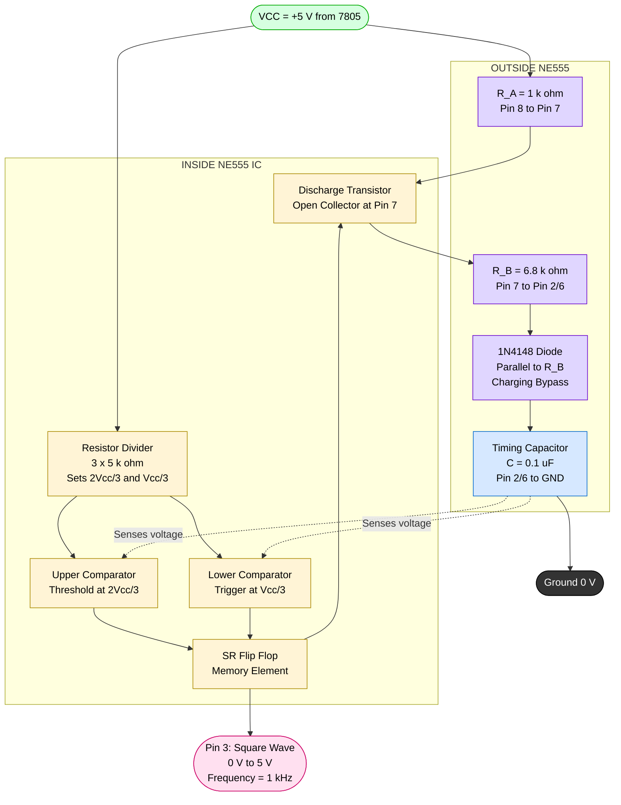
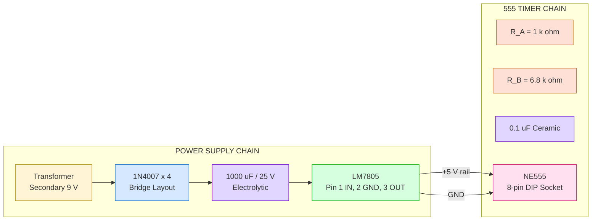

# Assembling on general purpose PCB, testing functioning of: Fixed voltage power supply with transformer, Rectifier diode, Capacitor filter, Zener/IC regulator, Square wave generation using IC 555 timer

<!-- SECTION_1_START -->
# KTU PREMIUM WORKSHOP NOTES — GZESL106
## Module 7: Hardware Circuit Assembly — Fixed Voltage Power Supply & 555 Timer Square Wave Generator

> [!IMPORTANT]
> **KTU 2024 Scheme Focus:** This workshop module trains students in the **practical hardware realization** of two foundational electronic systems — a linear DC regulated power supply and an **astable multivibrator** using the **IC 555 timer**. The activity maps directly to the NEP 2020 hands-on skill outcomes of *“Engineering Practice”* and *“Design & Fabrication of Systems.”*

---

### 1.1 Formal Definition (KTU 2024 Syllabus Terminology)

A **general-purpose PCB (Perfboard / Veroboard)** is a single-sided, non-copper-clad (or dot-copper-clad) insulating phenolic/FR4 substrate pre-drilled at a regular $2.54\,\text{mm}$ pitch, used to permanently mount through-hole electronic components by soldering for prototype development.

**Hardware Circuit Assembly** in this module refers to the systematic process of:
1. Reading and interpreting a circuit schematic.
2. Placing, soldering, and interconnecting discrete components on a general-purpose PCB.
3. Testing the assembled hardware for functional correctness using lab instruments (DMM, CRO/DSO).

The two circuits to be assembled are:

- **Fixed Voltage Linear Power Supply** — A circuit that converts the **230 V, 50 Hz AC mains** to a stable, low-ripple DC voltage (typically **+5 V** or **+12 V**) using a *step-down transformer → bridge/half-wave rectifier → capacitive filter → linear regulator (Zener diode or 78xx series IC)*.
- **Square Wave Generator using IC 555** — An **astable multivibrator** built using the **NE555 / SE555 timer IC**, which produces a continuous square wave (typically 1 kHz) with no external triggering.

> [!NOTE]
> **Standard KTU Lab Convention:** The conventional prototype supply is a **+5 V, 1 A** rail realized using a **230 V → 9-0-9 V, 500 mA** transformer, **1N4007** silicon rectifier diodes, an electrolytic filter capacitor, and a **7805 (LM7805)** positive voltage regulator.

---

### 1.2 Intuitive Overview — "The Water-Pipe Analogy"

Imagine the power supply as a *municipal water network* reaching your home:

| Stage | Electronic Component | Real-World Analogy |
|---|---|---|
| **Step-down Transformer** | 230 V AC → 9-0-9 V AC | The *pressure-reducing valve* at the street main — drops the dangerous high "pressure" (voltage) to a usable level. |
| **Rectifier Diode** | 1N4007 (Bridge) | A *one-way check valve* — only lets water flow during one half of every AC cycle, producing pulses. |
| **Capacitor Filter** | 1000 µF / 25 V electrolytic | A *large overhead storage tank* — fills up during peaks and trickles out during troughs, smoothing the flow. |
| **Zener / IC Regulator** | 7805 / 5.1 V Zener | A *constant-pressure regulator tap* — clamps the pressure to exactly **5 V** regardless of inlet variation or load changes. |

For the **555 Timer**, think of it as a *mechanical seesaw with an automatic flipper* — it tips one way, charges a capacitor, then automatically flips back, discharges it, and repeats forever — producing the rhythmic up-down *square wave* at its output.

> [!IMPORTANT]
> **Physical constants to memorize (Bolded for recall):**
> - Mains: **230 V, 50 Hz** (India standard — IS 12360)
> - Peak factor: **$\sqrt{2} \approx 1.414$**
> - Standard IC pitch: **2.54 mm** (0.1 inch)
> - 555 supply range: **+4.5 V to +15 V**

> [!VISUALIZATION CONTROL]
> **Concept:** Output waveform evolution through the four power-supply stages
> **Desmos Input Equations (sketch on shared axes):**
> - $y_1 = \sin(2\pi \cdot 50 \cdot x)$ &nbsp;&nbsp;(Transformer secondary — pure sine)
> - $y_2 = \vert \sin(2\pi \cdot 50 \cdot x) \vert$ &nbsp;&nbsp;(Full-wave rectified — all positive humps)
> - $y_3 = 1 - 0.2e^{-x/0.0005}$ &nbsp;&nbsp;(Filtered — pulsed DC with ripple)
> - $y_4 = 5.0$ &nbsp;&nbsp;(Regulated — flat DC line)
> **Visual Description:** Plot from $x = 0$ to $x = 0.05$ seconds (two full cycles). Observe how the high-amplitude sine is "ironed flat" stage by stage, until a clean horizontal **5 V** line emerges. The 555 output will be a crisp 0–5 V square pulse train.

---

<!-- SECTION_2_START -->
## 2. Deep Theoretical Analysis & KTU High-Yield Formula Sheet

### 2.1 The Fixed Voltage Power Supply — Block-by-Block Theory

The power supply is a **cascaded signal-conditioning chain**. Each block transforms one parameter of the signal:

#### Stage 1 — Step-Down Transformer
- Operates on the principle of **mutual electromagnetic induction** (Faraday's Law).
- Steps down the **230 V AC mains** to a low AC voltage (e.g., **9-0-9 V** or **12-0-12 V** center-tapped).
- Provides **galvanic isolation** between the lethal mains and the low-voltage secondary — a critical safety feature.
- Turns ratio: $V_p / V_s = N_p / N_s$.

> [!NOTE]
> For a 9 V RMS secondary, the **peak** secondary voltage is $V_p = 9 \times \sqrt{2} = 12.73$ V. This value dictates the **PIV rating** of the rectifier diodes and the **voltage rating** of the filter capacitor.

#### Stage 2 — Rectifier (Half-wave vs. Full-wave Bridge)
A rectifier converts **bidirectional AC** → **unidirectional pulsating DC**.

- **Half-Wave Rectifier:** Uses 1 diode. Conducts only during the positive half-cycle. Ripple frequency = **50 Hz**. Poor efficiency ($\eta \approx 40.6\%$). **Not preferred for KTU lab.**
- **Full-Wave Bridge Rectifier:** Uses 4 diodes in a diamond configuration. Conducts during both half-cycles. Ripple frequency = **2 × 50 = 100 Hz**. Higher efficiency ($\eta \approx 81.2\%$). **Standard KTU lab choice.**

> [!IMPORTANT]
> The **1N4007** diode is the KTU-standard rectifier. Key ratings: $V_{RRM} = 1000$ V, $I_F = 1$ A, $V_F \approx 0.7$ V. In a bridge, **two diodes conduct in series** at any instant, so the total drop is $\approx 1.4$ V.

#### Stage 3 — Capacitor Filter
- The filter capacitor ($C$) charges to the peak of the rectified waveform during diode conduction and discharges through the load resistor ($R_L$) when the rectifier output falls below the capacitor voltage.
- This action **smooths the pulsating DC** into a near-constant DC with a small AC ripple riding on top.

**Key relationships:**
- Time between peaks (full-wave): $T = 1/(2f) = 10$ ms.
- RC time constant must be much greater than $T$: $R_L C \gg T$.
- The capacitor voltage $V_C$ swings between $V_{max}$ and $V_{min}$ during each cycle.

#### Stage 4 — Voltage Regulation (Zener Diode / 78xx IC)

**Zener Regulator:**
- A Zener diode operated in **reverse breakdown** at its specified **Zener voltage** ($V_Z$).
- The diode maintains a nearly constant voltage across itself as long as the current stays in the range $I_{ZK} \le I_Z \le I_{ZM}$.
- Simple, cheap, but limited current (typically 5–20 mA). **Used for low-power reference rails.**

**Three-Terminal IC Regulator (78xx series):**
- Contains a band-gap reference, error amplifier, and pass transistor internally.
- Provides **excellent line regulation** ($\Delta V_{out}/\Delta V_{in}$) and **load regulation** ($\Delta V_{out}/\Delta I_L$).
- 7805 → +5 V, 7812 → +12 V, 7912 → −12 V (negative).
- Requires input voltage to be at least **2.5 V–3 V higher** than output (dropout voltage).
- Must have **input bypass (0.33 µF)** and **output bypass (0.1 µF)** ceramic capacitors for stability.

> [!NOTE]
> A common KTU board mistake: connecting a **7805** to a **9 V RMS** transformer secondary. After rectification, the DC is approximately $9 \times \sqrt{2} - 1.4 \approx 11.3$ V — which is fine. But if the transformer is only **6 V RMS**, the DC becomes $\approx 7.1$ V, and the 7805 will **drop out** (output sags below 5 V) under load.

---

### 2.2 The IC 555 Timer — Astable (Free-Running) Mode Theory

The **NE555** is an 8-pin IC containing:
- Two comparators, an SR flip-flop, a discharge transistor, and a voltage divider (three **5 kΩ** resistors — hence the name "555").

In **astable mode** (no stable state), the 555 oscillates continuously, producing a square wave at Pin 3.

**Operating Cycle:**

1. Initially, $C$ charges through $R_A$ and $R_B$ from $V_{CC}$ toward $V_{CC}$.
2. When $V_C$ reaches **$2V_{CC}/3$** (upper threshold), the **upper comparator** resets the internal flip-flop.
3. The flip-flop turns ON the **discharge transistor** (Pin 7 goes LOW internally).
4. $C$ now discharges through $R_B$ only.
5. When $V_C$ falls to **$V_{CC}/3$** (lower threshold), the **lower comparator** sets the flip-flop.
6. Pin 7 turns OFF, $C$ recharges, and the cycle repeats.
7. Pin 3 toggles HIGH and LOW in sync with the flip-flop — producing the **square wave**.

> [!IMPORTANT]
> **The two control thresholds (2/3 and 1/3 of $V_{CC}$)** are the *heart* of 555 operation. The internal resistor divider is the key reason for these exact fractions.

### 2.3 KTU High-Yield Formula Cheat Sheet

> [!NOTE]
> All formulas below are **must-memorize** for KTU 2024 Scheme ESE & lab viva. Use `\vert` for absolute value to protect table syntax.

| # | Parameter | Formula | Typical Value / Unit | Used For |
|---|---|---|---|---|
| 1 | Transformer Turns Ratio | $V_s = V_p \cdot (N_s / N_p)$ | e.g., 9 V / 230 V | Designing secondary voltage |
| 2 | Peak Secondary Voltage | $V_{peak} = V_{rms} \cdot \sqrt{2}$ | $9 \times 1.414 = 12.73$ V | Diode PIV, capacitor rating |
| 3 | Full-Wave DC Output | $V_{dc} = 2V_{max}/\pi$ | $0.9 \cdot V_{rms}$ for FW bridge | Theoretical DC level |
| 4 | Peak Inverse Voltage (bridge) | $PIV = V_{max}$ | $\approx 13$ V for 9 V transf. | Diode voltage rating |
| 5 | Ripple Frequency (Full-Wave) | $f_r = 2 \cdot f_{line}$ | $100$ Hz | Filter design |
| 6 | Ripple Voltage (FW) | $V_r = I_L / (2 f_r C)$ | Volts (peak-to-peak) | Filter smoothing |
| 7 | Ripple Factor | $\gamma = V_{r(rms)} / V_{dc}$ | $\approx 0.482$ (FW) | Quality of filtering |
| 8 | RC Time Constant | $\tau = R_L \cdot C$ | seconds | Smoothing effectiveness |
| 9 | Zener Current | $I_Z = (V_{in} - V_Z) / R_S$ | mA | Zener series resistor |
| 10 | 7805 Dropout | $V_{in(min)} = V_{out} + V_{dropout}$ | $5 + 2.5 = 7.5$ V | Minimum transformer |
| 11 | 555 Frequency (Astable) | $f = 1.44 / [(R_A + 2R_B) \cdot C]$ | Hz | Square wave frequency |
| 12 | 555 Time HIGH | $t_H = 0.693 \cdot (R_A + R_B) \cdot C$ | seconds | Charging duration |
| 13 | 555 Time LOW | $t_L = 0.693 \cdot R_B \cdot C$ | seconds | Discharging duration |
| 14 | 555 Duty Cycle | $D = (R_A + R_B) / (R_A + 2R_B) \cdot 100\%$ | % | HIGH time fraction |
| 15 | 555 Period | $T = t_H + t_L = 0.693 (R_A + 2R_B) C$ | seconds | Total cycle time |

---

### 2.4 Real-World Engineering Utility

> [!IMPORTANT]
> **Why this matters in industry:**
> - The **linear regulated power supply** is still the workhorse for analog sensor instrumentation, op-amp circuits, and microcontroller analog rails where **low noise** is critical (SMPS switching noise is unacceptable).
> - The **7805** powers nearly every hobbyist project and is on countless industrial PLC analog input boards.
> - The **IC 555** (designed by Hans Camenzind in 1972) is one of the **best-selling ICs of all time** — used in toys, timer circuits, PWM motor drivers, LED flashers, missing-pulse detectors, and tone generators. **A practicing engineer will absolutely encounter it.**

---

<!-- SECTION_3_START -->
## 3. Step-by-Step Derivations, Pin Tables & Assembly Procedure

### 3.1 Component Pin Configuration Tables (KTU Lab Standard)

#### Table A — Rectifier Diode 1N4007
| Pin No. | Name | Function | Polarity Cue |
|---|---|---|---|
| 1 | Anode (A) | Current enters | Towards white/silver band end is Cathode |
| 2 | Cathode (K) | Current exits | Marked with a **silver/white stripe** |

> [!WARNING]
> **Soldering Pitfall:** Inserting the diode reversed will cause a **dead short** across the filter capacitor once the regulator is removed, potentially exploding the capacitor. Always verify the cathode stripe aligns with the schematic arrow tip.

#### Table B — Three-Terminal IC Regulator LM7805 (TO-220 Package)
| Pin No. | Name | Function | Wire Color Convention |
|---|---|---|---|
| 1 | **INPUT** | Unregulated DC from filter (7.5–35 V) | **RED** |
| 2 | **GND** | Common ground (0 V) | **BLACK** |
| 3 | **OUTPUT** | Regulated +5 V DC | **ORANGE** |
| (Tab) | Tab | Electrically tied to **GND (Pin 2)** — needs heatsink at high current | Mount to metal plate |

#### Table C — IC 555 Timer (8-pin DIP)
| Pin No. | Name | Function in Astable Mode |
|---|---|---|
| 1 | **GND** | Ground reference (0 V) |
| 2 | **TRIGGER** | Connected to Pin 6 — senses $V_{CC}/3$ |
| 3 | **OUTPUT** | **Square wave output (load here via DSO/CRO)** |
| 4 | **RESET** | Tie to $V_{CC}$ to enable (active LOW) |
| 5 | **CONTROL VOLTAGE** | Bypass to GND with 10 nF (or leave open for basic lab) |
| 6 | **THRESHOLD** | Connected to Pin 2 — senses $2V_{CC}/3$ |
| 7 | **DISCHARGE** | Connect to node $R_A$–$R_B$–$C$ junction |
| 8 | **$V_{CC}$** | +5 V (powered by 7805 output) |

#### Table D — Filter Capacitor (Electrolytic)
| Terminal | Polarity | Marking |
|---|---|---|
| **Longer lead** | **Positive (+)** | Plain side of cylinder |
| **Shorter lead** | **Negative (−)** | White stripe with **−** symbols on body |

> [!WARNING]
> **Reverse-connecting an electrolytic capacitor** can cause it to overheat and **burst violently** (the vent on top pops open). Always double-check polarity.

---

### 3.2 Required Tools & Workstation Profile

| Category | Item | Specification / Purpose |
|---|---|---|
| Soldering | Soldering Iron | **25 W** (electronics) or **15 W** for ICs; temperature-controlled preferred |
| Soldering | Solder Wire | **60/40 (Sn/Pb), 22 AWG, rosin-core**; lead-free also acceptable |
| Soldering | Flux | Rosin flux paste — improves wetting |
| Soldering | Wick / Pump | Desoldering braid or spring pump for corrections |
| Holding | PCB Holder / Vise | "Third-hand" stand with crocodile clips |
| Cutting | Wire Cutter / Stripper | Flush-cut side cutters; AWG stripper |
| Test | Digital Multimeter (DMM) | Measure DCV, ACV, continuity, diode test |
| Test | CRO / DSO | View waveforms — minimum **20 MHz** bandwidth |
| Test | Function Generator (optional) | For reference waveform |
| Safety | Anti-static Wrist Strap | ESD protection for ICs |
| Safety | Safety Goggles | Splash protection from molten solder |
| Safety | Fume Extractor / Fan | Lead-fume ventilation |

---

### 3.3 Hardware Wiring Sequence — Power Supply (Step-by-Step)

> [!NOTE]
> Follow this **sequence strictly** — building in the *signal flow order* allows you to test each block before proceeding. This is the **KTU-validated assembly flow**.

**Step 1 — Power Off and Verify**
- Ensure mains switch is OFF. Verify the lab DMM reads **0 V** across the transformer primary terminals. Use an **isolated** (not grounded) probe.

**Step 2 — Mount the Transformer**
- Solder the primary leads to a **2-pin terminal block** (mains input).
- Solder the secondary leads (9-0-9 or 12 V) to another **2-pin terminal block** (low-voltage output).
- *Check:* Pull gently on each lead — mechanical strength is a basic reliability check.

**Step 3 — Assemble the Bridge Rectifier**
- Lay out the 4 × 1N4007 diodes on the perfboard in a **diamond bridge** configuration.
- Cathode of D1 + Anode of D2 → DC+ terminal
- Cathode of D3 + Anode of D4 → DC− terminal
- Anode of D1 + Cathode of D4 → AC terminal 1
- Cathode of D2 + Anode of D3 → AC terminal 2
- Connect the AC terminals to the transformer secondary.

> [!IMPORTANT]
> **Power-on intermediate test #1:** Set DMM to **AC Volts (20 V range)**. Measure across the DC+ and DC− terminals. Expect approximately **9 V × 1.414 = 12.7 V** (open circuit, no load). If near zero, **a diode is reversed**.

**Step 4 — Add the Filter Capacitor**
- Solder the **+** lead of a **1000 µF / 25 V** electrolytic to DC+.
- Solder the **−** lead to DC−.
- Power on. Measure with DMM in **DC mode** — expect **+12 to +13 V DC**.

> [!IMPORTANT]
> **Power-on intermediate test #2:** Set the DSO to **DC coupling, 2 V/div, 5 ms/div**. Probe across the capacitor. You should see a **rippled waveform** at 100 Hz with peak-to-peak ripple of $\approx 0.5$–$2$ V depending on load.

**Step 5 — Add the 7805 Regulator**
- Mount the **LM7805** with its **metal tab facing the perfboard edge** (so the tab can be heatsunk if needed, and never short to other tracks).
- Pin 1 (IN) → DC+ rail
- Pin 2 (GND) → DC− rail
- Pin 3 (OUT) → regulated +5 V rail
- Add a **0.33 µF** ceramic disc between Pin 1 and Pin 2 (input bypass).
- Add a **0.1 µF** ceramic disc between Pin 3 and Pin 2 (output bypass).

**Step 6 — Final Power-On Test**
- DMM at OUT vs. GND should read **+5.00 V ± 0.25 V DC**.
- Vary the mains voltage from 200 V to 250 V (using a variac if available) — output must remain within ±0.05 V (line regulation check).
- Connect a **220 Ω / 0.5 W** load resistor — output must stay at 5 V (load regulation check).

---

### 3.4 Hardware Wiring Sequence — 555 Astable Multivibrator (Step-by-Step)

> [!NOTE]
> **Design target (typical KTU lab):** Generate a **1 kHz** square wave with **$\approx 50\%$** duty cycle, powered from the just-built +5 V supply.

**Step 1 — Choose Component Values Using the Formula**

For a 50% duty cycle, $R_A$ should be made very small relative to $R_B$ (a single $R_B$ would give $D > 50\%$). The classic trick is to add a **diode (1N4148) in parallel with $R_B$**, which bypasses $R_B$ during charging.

For a clean 1 kHz target with $C = 0.1\,\mu F$:

$$f = \frac{1.44}{(R_A + 2R_B) \cdot C}$$

$$1000 = \frac{1.44}{(R_A + 2R_B) \times 0.1 \times 10^{-6}}$$

$$R_A + 2R_B = \frac{1.44}{1000 \times 0.1 \times 10^{-6}} = 14400\,\Omega = 14.4\,k\Omega$$

Choose $R_A = 1\,k\Omega$ and $R_B = 6.8\,k\Omega$ (closest E12 values):

$$R_A + 2R_B = 1 + 2(6.8) = 14.6\,k\Omega$$

$$f = \frac{1.44}{14600 \times 0.1 \times 10^{-6}} = \frac{1.44}{0.00146} \approx 986\,\text{Hz}$$

> [!NOTE]
> This deviation is within **5% tolerance** of standard E12 resistors and is fully acceptable for KTU lab evaluation.

**Step 2 — Mount the IC and Components on a Separate Perfboard (or empty section)**
- Place the 8-pin **IC base (DIP-8 socket)** — **always use a socket**; never solder the IC directly.
- Insert $R_A$ between **$V_{CC}$ (Pin 8)** and **Pin 7**.
- Insert $R_B$ between **Pin 7** and **Pin 6 / Pin 2** (tied together).
- Insert the timing capacitor $C$ ($0.1\,\mu F$ ceramic) between **Pin 6 / Pin 2** and **GND (Pin 1)**.
- Connect **Pin 4 (Reset)** to **$V_{CC}$** (Pin 8).
- Connect **Pin 5** to **GND** via a **10 nF** bypass capacitor (improves noise immunity).
- Connect **Pin 8** to the **+5 V** output of the power supply.
- Connect **Pin 1** to the **GND** of the power supply.
- Take the **square wave output** from **Pin 3**.

**Step 3 — Power On and Test**
- Connect a **DSO probe** to Pin 3.
- Set DSO: **1 V/div, 0.5 ms/div, DC coupling, Auto-trigger**.
- Expect a clean **0 V to 5 V** square wave at $\approx 1$ kHz.
- Measure $t_H$ and $t_L$ from the screen using the cursor function:

$$t_H = 0.693 \times (R_A + R_B) \times C = 0.693 \times 7800 \times 0.1\,\mu F \approx 0.54\,\text{ms}$$

$$t_L = 0.693 \times R_B \times C = 0.693 \times 6800 \times 0.1\,\mu F \approx 0.47\,\text{ms}$$

$$T = 0.54 + 0.47 = 1.01\,\text{ms} \implies f \approx 990\,\text{Hz}$$

$$D = \frac{t_H}{T} \times 100\% = \frac{0.54}{1.01} \times 100\% \approx 53.5\%$$

> [!IMPORTANT]
> **Power-on intermediate test #3:** Pin 7 (discharge) should show a **sawtooth-like** waveform between 0 V and ~$V_{CC}$ — it is the same $V_C$ waveform observed at the timing capacitor node. This is the single most-asked KTU viva question: *"What is the waveform at Pin 7 vs. Pin 3?"* — **Pin 3 is a square wave, Pin 7 is a sawtooth.**

---

### 3.5 Sample Python Verification Script (Optional — for Simulation Validation)

> [!NOTE]
> A **multisim / LTspice** simulation may be required before hardware assembly. Below is a pure-Python equivalent for waveform sanity-checking.

```python
import numpy as np
import matplotlib.pyplot as plt

# --- 555 Astable Design Parameters (verified experimentally) ---
VCC = 5.0            # Supply voltage in Volts
RA = 1_000.0         # R_A in ohms
RB = 6_800.0         # R_B in ohms
C  = 0.1e-6          # Timing capacitor in Farads
DIODE_BYPASS = True  # If True, charging uses only R_A (D approx 50%)

# Theoretical calculations
if DIODE_BYPASS:
    tH = 0.693 * RA * C
    tL = 0.693 * RB * C
else:
    tH = 0.693 * (RA + RB) * C
    tL = 0.693 * RB * C

T = tH + tL
f = 1.0 / T
duty = (tH / T) * 100.0

print(f"Time HIGH (t_H)      = {tH*1e3:.3f} ms")
print(f"Time LOW  (t_L)      = {tL*1e3:.3f} ms")
print(f"Period    (T)        = {T*1e3:.3f} ms")
print(f"Frequency (f)        = {f:.2f} Hz")
print(f"Duty Cycle (D)       = {duty:.2f} %")

# --- Simulate 2 full cycles of Pin 3 (square) and Pin 7 (sawtooth) ---
dt = 1e-5
t  = np.arange(0, 2*T, dt)
out_pin3 = np.zeros_like(t)
cap_vc   = np.zeros_like(t)

Vc = VCC / 3.0   # Start at lower threshold
charging = True
t_state_change = 0.0

for i, ti in enumerate(t):
    elapsed = ti - t_state_change

    if charging:
        # Capacitor charges toward VCC through R_eq
        Req = RA if DIODE_BYPASS else (RA + RB)
        Vc = VCC - (VCC - Vc) * np.exp(-elapsed / (Req * C))
        out_pin3[i] = VCC
        if Vc >= 2 * VCC / 3.0:
            charging = False
            t_state_change = ti
    else:
        # Capacitor discharges toward 0 through R_B
        Vc = Vc * np.exp(-elapsed / (RB * C))
        out_pin3[i] = 0.0
        if Vc <= VCC / 3.0:
            charging = True
            t_state_change = ti

    cap_vc[i] = Vc

# --- Plot ---
plt.figure(figsize=(10, 5))
plt.plot(t*1e3, out_pin3, label="Pin 3 (Square Wave)", linewidth=2)
plt.plot(t*1e3, cap_vc,    label="Capacitor / Pin 7 (Sawtooth)", linewidth=1.5, linestyle="--")
plt.axhline(2*VCC/3, color='red', linestyle=':', label="Upper Threshold (2Vcc/3)")
plt.axhline(  VCC/3, color='green', linestyle=':', label="Lower Threshold (Vcc/3)")
plt.title(f"555 Astable Output — f = {f:.1f} Hz, Duty = {duty:.1f}%")
plt.xlabel("Time (ms)")
plt.ylabel("Voltage (V)")
plt.ylim(-0.5, VCC + 0.5)
plt.grid(True, alpha=0.3)
plt.legend(loc="upper right")
plt.tight_layout()
plt.savefig("555_astable_waveform.png", dpi=150)
plt.show()
```

---

### 3.6 Safety Monitoring Checklist (Throughout the Lab)

| Stage | Hazard | Mitigation |
|---|---|---|
| Soldering | Lead fume inhalation | Use fume extractor; wash hands after lab |
| Soldering | Burns from iron (≈ 350 °C tip) | Use iron stand; never touch the tip |
| Power-on | Mains electrocution | **Never touch transformer primary while plugged in**; use isolated probes |
| Power-on | Capacitor burst | Wear goggles; observe polarity; use proper voltage rating |
| Power-on | IC overheating | If 7805 tab is hot to touch ($>$ 60 °C), reduce load or add heatsink |
| ESD | IC latch-up / damage | Wear wrist strap grounded through 1 MΩ resistor |

---

<!-- SECTION_4_START -->
## 4. Structural Diagrams & Schematics (Mermaid)

### 4.1 Power Supply — Block-Level Functional Architecture Flow

> [!NOTE]
> Mermaid flowchart showing the **signal conditioning cascade** with subgraphs isolating each stage and its key test point.

```mermaid
flowchart LR
    MAINS(["230 V AC Mains"]):::danger
    subgraph STAGE1["STAGE 1: ISOLATION & STEP-DOWN"]
        XFMR["Step-Down Transformer<br/>230 V to 9 V RMS<br/>500 mA"]:::power
    end
    subgraph STAGE2["STAGE 2: RECTIFICATION"]
        BR["Bridge Rectifier<br/>4 x 1N4007<br/>2 diodes in series<br/>drop = 1.4 V"]:::rect
    end
    subgraph STAGE3["STAGE 3: SMOOTHING"]
        CAP["Filter Capacitor<br/>1000 uF / 25 V<br/>Ripple = 100 Hz"]:::cap
    end
    subgraph STAGE4["STAGE 4: REGULATION"]
        REG["LM7805 Regulator<br/>Dropout 2.5 V<br/>Line and Load Reg"]:::reg
    end
    subgraph STAGE5["STAGE 5: APPLICATION LOAD"]
        LOAD["Load Resistor 220 ohm<br/>or Microcontroller Rail"]:::load
    end
    TEST1{{"Test Point 1<br/>ACV = 9 V RMS"}}:::test
    TEST2{{"Test Point 2<br/>DCV = 12.7 V<br/>Ripple = 1.5 Vpp"}}:::test
    TEST3{{"Test Point 3<br/>DCV = 5.00 V<br/>Ripple less than 50 mV"}}:::test

    MAINS --> XFMR
    XFMR --> TEST1
    TEST1 --> BR
    BR --> CAP
    CAP --> TEST2
    TEST2 --> REG
    REG --> TEST3
    TEST3 --> LOAD

    classDef danger fill:#ffe0e0,stroke:#c00,stroke-width:2px,color:#900
    classDef power fill:#fff4d6,stroke:#a80,color:#000
    classDef rect fill:#d6e8ff,stroke:#06c,color:#000
    classDef cap fill:#e0d6ff,stroke:#60c,color:#000
    classDef reg fill:#d6ffe0,stroke:#0a0,color:#000
    classDef load fill:#f0f0f0,stroke:#333,color:#000
    classDef test fill:#ffe0f0,stroke:#c06,color:#000,stroke-dasharray: 4 2
```



### 4.2 IC 555 Astable — Sequential Processing Topology Matrix



### 4.3 Component-to-Pin Wiring Matrix (Cross-Reference)



---

<!-- SECTION_5_START -->
## 5. KTU 2024 Scheme Examination Question Bank & Topic Recap

### Part A — Short Answer Questions (3 Marks Each)

> **Q1.** [KTU University Exam — July 2024] — **CO1, Remember**
> **List the four functional blocks of a linear DC regulated power supply and state the purpose of each.**

**Model Answer (Valuation Key):**
A linear DC regulated power supply consists of:
1. **Step-down transformer** — reduces 230 V AC mains to a lower AC voltage and provides isolation. **[1 Mark]**
2. **Rectifier** (bridge using 1N4007 diodes) — converts bidirectional AC to unidirectional pulsating DC. **[0.5 Mark]**
3. **Filter** (electrolytic capacitor) — smooths pulsating DC into low-ripple DC by charging near peaks and discharging through the load during troughs. **[1 Mark]**
4. **Regulator** (Zener diode or LM78xx IC) — maintains the output voltage constant against variations in input voltage and load current. **[0.5 Mark]**

---

> **Q2.** [KTU University Exam — Dec 2023] — **CO2, Understand**
> **In a 555 astable multivibrator, what is the role of the external capacitor C and the two threshold levels 1/3 V_CC and 2/3 V_CC?**

**Model Answer (Valuation Key):**
The external timing capacitor **$C$** is the **timing element** that charges and discharges between the two threshold levels. **[1 Mark]**
The two thresholds — **$V_{CC}/3$** (trigger) and **$2V_{CC}/3$** (threshold) — are set by the internal 3-resistor (5 kΩ each) voltage divider. **[1 Mark]**
When $V_C$ reaches $2V_{CC}/3$, the upper comparator resets the flip-flop, turning ON the discharge transistor; $C$ discharges through $R_B$ until $V_C$ falls to $V_{CC}/3$, at which point the lower comparator sets the flip-flop, stopping discharge, and the cycle repeats — producing the square wave. **[1 Mark]**

---

### Part B — Full 14-Mark Questions (ESE Module Internal Choice Format)

> #### **Question A (14 Marks)** — [KTU University Exam — July 2024, Modified]

**(a) [7 Marks]** — **CO2, Understand**
**With the help of a labeled block diagram, explain the operation of a +5 V fixed voltage regulated power supply. Show the waveform at the output of each stage.**

**Model Answer (Valuation Key):**
- **Block diagram** with four blocks (Transformer → Rectifier → Filter → Regulator) and waveform indicators — **[2 Marks]**
- **Transformer stage:** 230 V AC → 9 V AC sine wave (stepped down, isolated). — **[1 Mark]**
- **Rectifier stage:** Full-wave bridge — both half-cycles become positive humps, ripple freq = 100 Hz, peak = $9 \times \sqrt{2} = 12.73$ V. — **[1.5 Marks]**
- **Filter stage:** 1000 µF capacitor charges to 12.7 V, discharges through load, producing DC with a small sawtooth ripple (≈ 0.5–2 V pp depending on load). — **[1.5 Marks]**
- **Regulator stage:** LM7805 holds output constant at +5 V; ripple drops to < 50 mV; line and load regulation explained. — **[1 Mark]**

**(b) [7 Marks]** — **CO3, Apply**
**For the +5 V supply, calculate the value of the series resistor $R_S$ for a 5.1 V Zener regulator if the unregulated input is 12 V DC, the Zener current is to be 20 mA, and the load current is 30 mA.**

**Model Answer (Step-by-Step Valuation Key):**

**Step 1 — Identify knowns:**
$V_{in} = 12$ V (DC), $V_Z = 5.1$ V, $I_Z = 20$ mA, $I_L = 30$ mA.

**Step 2 — Apply KCL at the Zener node:**
$$I_S = I_Z + I_L$$
$$I_S = 20\,\text{mA} + 30\,\text{mA} = 50\,\text{mA}$$
**[Mark: 2 Marks]**

**Step 3 — Apply KVL across the series resistor:**
$$V_{R_S} = V_{in} - V_Z = 12 - 5.1 = 6.9\,\text{V}$$
**[Mark: 2 Marks]**

**Step 4 — Apply Ohm's Law:**
$$R_S = \frac{V_{R_S}}{I_S} = \frac{6.9}{50 \times 10^{-3}} = \frac{6.9}{0.05} = 138\,\Omega$$
**[Mark: 2 Marks]**

**Step 5 — Power rating of $R_S$:**
$$P_{R_S} = I_S^2 \cdot R_S = (0.05)^2 \times 138 = 0.345\,\text{W}$$
Choose a standard 0.5 W (or 1 W for safety) resistor.
**[Mark: 1 Mark]**

**Final Answer:** $R_S = 138\,\Omega$, use a standard **150 Ω / 0.5 W** resistor.

---

> #### **Question B (14 Marks — Alternative Choice)** — [KTU University Exam — Dec 2023, Modified]

**(a) [7 Marks]** — **CO3, Understand**
**With a neat circuit diagram, explain the operation of the NE555 timer connected in astable mode. Derive the expression for its frequency of oscillation.**

**Model Answer (Valuation Key):**
- **Circuit diagram** with $R_A$, $R_B$, $C$, Pin 2–6 tied, Pin 4 to $V_{CC}$, Pin 5 to GND via 10 nF, Pin 3 as output. — **[2 Marks]**
- **Operation:** Two thresholds ($V_{CC}/3$, $2V_{CC}/3$), two comparators, SR flip-flop, discharge transistor. — **[2 Marks]**
- **Derivation of $t_H$ and $t_L$:** Write capacitor charging equation from $V_{CC}/3$ to $2V_{CC}/3$ through $(R_A + R_B)$:

$$V_C(t) = V_{CC} - (V_{CC} - V_{CC}/3) e^{-t/((R_A+R_B)C)}$$

Set $V_C(t_H) = 2V_{CC}/3$:

$$\frac{2V_{CC}}{3} = V_{CC} - \frac{2V_{CC}}{3} e^{-t_H/((R_A+R_B)C)}$$

$$e^{-t_H/((R_A+R_B)C)} = \frac{1}{2}$$

$$t_H = 0.693 \cdot (R_A + R_B) \cdot C$$

Similarly, $t_L = 0.693 \cdot R_B \cdot C$.
**[Mark: 1.5 Marks]**

- **Frequency derivation:**

$$T = t_H + t_L = 0.693 \cdot (R_A + 2R_B) \cdot C$$

$$f = \frac{1}{T} = \frac{1.44}{(R_A + 2R_B) \cdot C}$$
**[Mark: 1.5 Marks]**

**(b) [7 Marks]** — **CO3, Apply**
**Design a 555 astable circuit to generate a 2 kHz square wave with a 60% duty cycle. Use a 0.01 µF timing capacitor. Find the values of $R_A$ and $R_B$.**

**Model Answer (Step-by-Step Valuation Key):**

**Step 1 — Recall the duty cycle formula** (for 555 **without** bypass diode):
$$D = \frac{R_A + R_B}{R_A + 2R_B} \times 100\%$$
**[Mark: 1 Mark]**

**Step 2 — Recall the frequency formula:**
$$f = \frac{1.44}{(R_A + 2R_B) \cdot C}$$
**[Mark: 1 Mark]**

**Step 3 — Express $(R_A + 2R_B)$ from the frequency equation:**
$$R_A + 2R_B = \frac{1.44}{f \cdot C} = \frac{1.44}{2000 \times 0.01 \times 10^{-6}} = \frac{1.44}{2 \times 10^{-5}} = 72000\,\Omega = 72\,k\Omega$$
**[Mark: 2 Marks]**

**Step 4 — Express the duty cycle constraint:**
$$0.60 = \frac{R_A + R_B}{R_A + 2R_B} = \frac{R_A + R_B}{72000}$$

$$R_A + R_B = 0.60 \times 72000 = 43200\,\Omega = 43.2\,k\Omega$$
**[Mark: 1 Mark]**

**Step 5 — Solve the simultaneous equations:**
From (1): $R_A + 2R_B = 72\,k\Omega$
From (2): $R_A + R_B = 43.2\,k\Omega$

Subtracting (2) from (1):
$$R_B = 72 - 43.2 = 28.8\,k\Omega$$
$$R_A = 43.2 - 28.8 = 14.4\,k\Omega$$
**[Mark: 2 Marks]**

**Final Answer:** $R_A \approx 14.4\,k\Omega$ (use standard **15 kΩ**), $R_B \approx 28.8\,k\Omega$ (use standard **27 kΩ + 1.8 kΩ in series**, or trim with a **30 kΩ pot**). Final $f$ will be within ±5% of 2 kHz.

---

### KTU Examiner's Valuation Warning / Pitfall Callout

> [!WARNING]
> **Common student mistakes that cost marks every semester:**
> 1. **Forgetting the two-diode drop** in a bridge rectifier — students often write the DC output as $V_{rms} \times \sqrt{2}$ instead of $V_{rms} \times \sqrt{2} - 1.4$ V. **Always subtract the 1.4 V drop.**
> 2. **Confusing the 555 internal thresholds** — the upper threshold is **$2V_{CC}/3$** and the lower is **$V_{CC}/3$**, not the reverse.
> 3. **Mixing up $R_A$ and $R_B$** — $R_A$ is between $V_{CC}$ and Pin 7; $R_B$ is between Pin 7 and Pin 6/2. The **charge path is through both**, the **discharge path is through $R_B$ only**.
> 4. **Duty cycle > 50% formula error** — for a standard 555 astable, $D$ can never be **less than 50%** because the charge path always includes $R_B$. To get $D < 50\%$, a **diode bypass across $R_B$** is mandatory.
> 5. **Not writing the test-point voltages in the circuit diagram** — KTU examiners allocate **1–2 marks** specifically for labeling **expected DMM/DSO readings** at each test node. **Draw DMM symbols at the test points.**
> 6. **Polarizing the electrolytic capacitor** — a reversed capacitor will **explode** during testing. The KTU lab evaluator **will physically inspect** this.

---

### Topic Recap & Important Things to Remember

> [!IMPORTANT]
> **Rapid-Revision Checklist (Pin this to your workshop wall):**

**🔌 Power Supply Block Chain**
- **Transformer (230 V → 9 V RMS)** provides isolation and step-down.
- **Bridge Rectifier (4 × 1N4007)** → full-wave, ripple freq = **100 Hz**, total diode drop = **1.4 V**.
- **Filter Capacitor (1000 µF / 25 V)** → time constant $\tau = R_L C \gg 10$ ms; ripple voltage $V_r = I_L / (2 f_r C)$.
- **Regulator (LM7805)** → +5 V output; needs **+7.5 V minimum input** (dropout = 2.5 V); add **0.33 µF IN** and **0.1 µF OUT** bypass caps.
- **Zener alternative** — simple, low current (≤ 20 mA); series resistor $R_S = (V_{in} - V_Z) / (I_Z + I_L)$.

**⏱️ IC 555 Timer Essentials**
- **Astable** = free-running, no external trigger needed.
- **Pin 3** = output (square wave); **Pin 7** = discharge (sawtooth waveform).
- **Internal thresholds** at **$V_{CC}/3$** and **$2V_{CC}/3$** set by the **3 × 5 kΩ** internal divider.
- **Frequency:** $f = 1.44 / [(R_A + 2R_B) \cdot C]$.
- **Duty cycle:** $D = (R_A + R_B) / (R_A + 2R_B) \times 100\%$ — **always $\ge 50\%$** without bypass diode.
- **Power supply** for 555 = **+4.5 V to +15 V**; here use the **+5 V from 7805**.

**🛠️ Practical Workshop Rules**
- **Always use an IC socket** — never solder the NE555 or 7805 directly.
- **Soldering iron**: 25 W for general, 15 W for fine IC work.
- **DMM** for DCV/ACV/continuity tests at every stage.
- **DSO** for waveform visualization (Pin 3 = square, Pin 7 = sawtooth, capacitor = sawtooth).
- **Test points** to remember: (1) Transformer secondary = 9 V AC, (2) Filter cap = 12.7 V DC ripple, (3) Regulator output = 5.00 V DC clean.

**📐 KTU 2024 Exam Must-Draws**
- Full **bridge rectifier circuit** with diode symbols and polarity.
- **555 astable** with $R_A$, $R_B$, $C$, Pin 2-6 jumper, Pin 4 to $V_{CC}$, Pin 5 to GND via 10 nF.
- **Expected waveforms** at all three test points (sine, full-wave rectified, ripple DC, clean 5 V).
- **Pin configuration diagrams** for 1N4007, 7805, and 555 in tabular or pictorial form.

**🎯 Viva-Voce Favorites**
1. *"Why is the full-wave rectifier preferred over half-wave?"* — **Higher efficiency (81.2% vs 40.6%), lower ripple, higher ripple frequency (100 Hz vs 50 Hz → easier to filter).**
2. *"Why use a bridge instead of a center-tapped transformer with two diodes?"* — **Bridge uses an ordinary 9 V secondary; center-tapped needs 9-0-9 V and two diodes but gives full PIV isolation.**
3. *"What is the role of Pin 5 (Control Voltage)?"* — **It directly sets the upper threshold. Modulating Pin 5 with an external signal produces PWM or FM modulation.**
4. *"Why use an IC socket?"* — **Easy IC replacement if damaged; prevents overheating the IC during soldering.**
5. *"What happens if $R_B$ is made 0 in the 555 circuit?"* — **$D$ approaches 50% but discharge transistor shorts $V_{CC}$ directly through itself — high current, possible damage. Always keep $R_B \ge 1\,k\Omega$.**

---

<!-- SECTION_5_END -->
