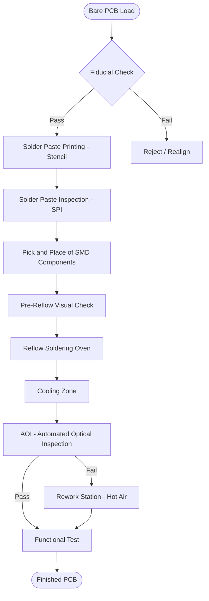
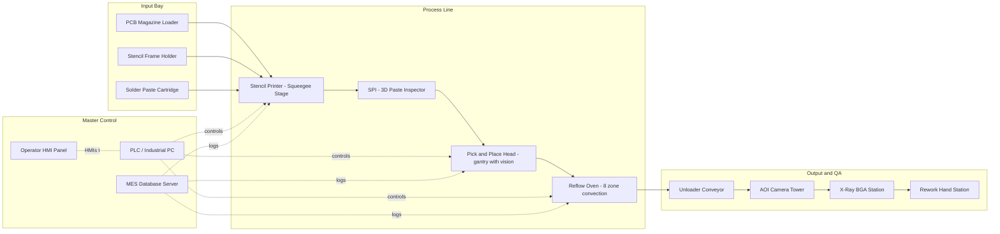
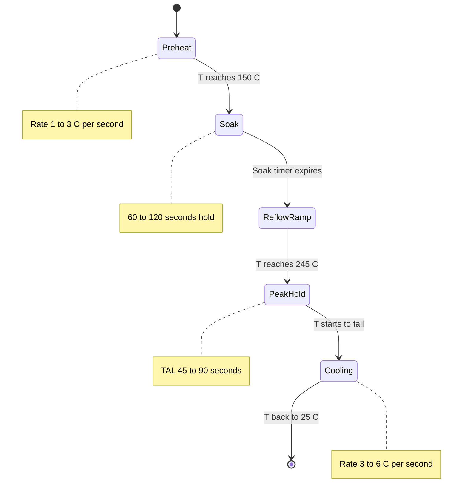

# Assembling of electronic circuits using SMT (Surface Mount Technology) stations.

<!-- SECTION_1_START -->
# Module 8 — Assembling of Electronic Circuits using SMT (Surface Mount Technology) Stations

> [!NOTE]
> **KTU 2024 Scheme Context:** This module falls under the **Basic Electrical and Electronics Engineering Workshop (GZESL106)**. It is mapped primarily to **CO3 / CO4** (Identify and assemble basic electronic circuits using modern manufacturing techniques) and assessed in the **Lab Continuous Evaluation (CE)** record and **ESE Practical Examination** viva-voce component.

---

## 1. Core Technical Definition

**Surface Mount Technology (SMT)** is a modern electronic assembly methodology in which **Surface Mount Devices (SMDs)** — components without traditional wire leads — are mounted **directly onto the surface of a Printed Circuit Board (PCB)**. The electrical and mechanical connections are made through **solder joints** formed by reflowing solder paste deposited on pre-defined copper pads.

> [!IMPORTANT]
> **Formal KTU Definition:**
> *“SMT is a process technology by which electronic components are placed and soldered onto the surface of a PCB using solder paste, automated pick-and-place equipment, and controlled thermal reflow, as opposed to inserting component leads through drilled holes.”*

**Key Terminology used in KTU Board Examinations:**

| Term | Meaning |
|---|---|
| **SMD** | Surface Mount Device (the component) |
| **SMT** | Surface Mount Technology (the process) |
| **PCB** | Printed Circuit Board |
| **Solder Paste** | A homogeneous mixture of **tin–lead (Sn–Pb) or lead-free (SAC — Sn–Ag–Cu)** alloy powder plus flux |
| **Reflow Soldering** | Heating the assembly to melt the solder paste and form joints |
| **Stencil** | A thin metal foil with laser-cut apertures used to deposit paste |
| **Pick-and-Place** | Robotic machine that picks components from reels and places them on the board |
| **AOI** | Automated Optical Inspection |

### Conceptual Analogy — The "Sticker vs. Nail" Metaphor

Imagine you want to decorate a wooden board with small tokens:

* **Through-Hole Technology (THT)** is like hammering a nail through the board and bending the tip on the other side. It is **strong but slow and bulky**.
* **Surface Mount Technology (SMT)** is like pressing a flat sticker onto the board. It is **fast, small, and works on both sides** — but needs **perfect positioning and heat-activated glue (solder paste)** to stick.

> [!TIP]
> **Why SMT dominates industry:** Miniaturisation (components shrink from 0805 to 0201 sizes), higher component density, better high-frequency performance (shorter leads = lower parasitic inductance), and compatibility with **automated robotic assembly lines** running at **>50,000 components per hour (CPH)**.

### GeoGebra / Desmos Visualisation Hint (Reflow Profile)

> [!VISUALIZATION CONTROL]
> **Concept:** Reflow Soldering Temperature Profile (Time vs. Temperature)
> **GeoGebra / Desmos Input Equations:**
> * $f_{1}(x) = 1.5x + 25$ for the preheat ramp zone ($0 \le x \le 90$)
> * $f_{2}(x) = 0.5x + 160$ for the soak zone ($90 \le x \le 150$)
> * $f_{3}(x) = 2.8x - 245$ for the reflow peak zone ($150 \le x \le 195$)
> * $f_{4}(x) = -2.2x + 643$ for the cooling zone ($195 \le x \le 245$)
> **Visual Description:** The student should observe a four-segment "tent-shaped" graph where the temperature **rises from 25 °C** to a **peak of ≈ 245 °C** (above the SAC alloy liquidus of **217 °C**) and then **cools back down**. The X-axis is time (seconds), Y-axis is temperature (°C).
<!-- SECTION_1_END -->

<!-- SECTION_2_START -->
# 2. Deep Theoretical Analysis & KTU High-Yield Formula Sheet

## 2.1 The SMT Assembly Process — Operational Logic

The SMT line is a **sequential, conveyorised, automated manufacturing flow**. Each step is non-negotiable and is monitored by **MES (Manufacturing Execution Systems)** in industry.

### Step-by-Step Process Flow

1. **PCB Loading & Inspection**
   * Bare board is loaded onto the conveyor.
   * Optical fiducial marks are verified.

2. **Solder Paste Printing (Stencil Stage)**
   * A **laser-cut stainless-steel stencil** is aligned over the PCB.
   * Solder paste (viscosity **≈ 800–1000 kcps**, metal content **≈ 88–90 %**) is forced through apertures using a **squeegee** at **45° angle** and **1–10 kg/cm²** pressure.
   * **Stencil thickness** is typically **0.10 mm to 0.15 mm**.

3. **Solder Paste Inspection (SPI) — Optional but Industry Standard**
   * 3-D laser or vision system checks **volume, height, area, and offset** of every deposit.

4. **Component Placement (Pick-and-Place)**
   * Components are supplied on **reels, trays, or tubes**.
   * The **gantry-mounted placement head** picks, orients, vision-aligns, and places the component.
   * Placement accuracy: **±0.025 mm to ±0.05 mm**.

5. **Reflow Soldering**
   * The board travels through a **multi-zone forced-convection reflow oven**.
   * Profile zones: **Pre-heat → Soak → Reflow (TLiquidus + 30 °C) → Cooling**.

6. **Cooling & Solidification**
   * Controlled cool-down to form a **metallurgically sound intermetallic joint** (typically **$Cu_6Sn_5$ and $Cu_3Sn$** layers, each **1–3 μm** thick).

7. **Automated Optical Inspection (AOI) / X-Ray**
   * Detects **solder bridges, insufficient solder, tombstoning, billboarding**.

8. **Rework / Repair Station (Manual)**
   * Hot-air pencil or **BGA rework station** for defective joints.

---

## 2.2 KTU Formula Sheet / High-Yield Cheat Sheet

> [!IMPORTANT]
> These are the equations a KTU board examiner expects to see when an SMT process question appears in the **ESE Practical / Lab Viva**.

| # | Concept | Equation / Parameter | Standard Value / Unit |
|---|---|---|---|
| 1 | Stencil Aperture Width | $W_{ap} = W_{pad} \cdot k$ | $k = 0.85 \text{ to } 1.00$ |
| 2 | Stencil Thickness | $t_{st}$ | **0.10 mm – 0.15 mm** |
| 3 | Solder Paste Volume per Pad | $V_{sp} = W_{ap} \cdot L_{ap} \cdot t_{st}$ | in mm³ |
| 4 | Area Ratio (Stencil Release Rule) | $AR = \dfrac{W_{ap} \cdot L_{ap}}{2 \cdot t_{st} \cdot (W_{ap} + L_{ap})}$ | $AR \ge 0.66$ for good release |
| 5 | Preheat Ramp Rate | $R_{ph} = \dfrac{\Delta T}{\Delta t}$ | **1 °C/s to 3 °C/s** |
| 6 | Soak Zone Time | $t_{soak}$ | **60 s – 120 s** (150 °C – 180 °C) |
| 7 | Peak Reflow Temperature | $T_{peak}$ | $T_{peak} = T_{liquidus} + 30\text{ °C}$ |
| 8 | SAC305 Liquidus | $T_{liq}^{SAC}$ | **217 °C** |
| 9 | Time Above Liquidus (TAL) | $t_{TAL}$ | **45 s – 90 s** |
| 10 | Cooling Rate | $R_{cool}$ | **−3 °C/s to −6 °C/s** |
| 11 | Pick-and-Place Throughput | $C_{PH} = \dfrac{3600 \cdot N_{hd}}{T_{cycle}}$ | components per hour |
| 12 | Intermetallic Layer Growth | $\delta = k \sqrt{t}$ | Arrhenius-type; $k \propto e^{-E_a/RT}$ |

> [!NOTE]
> **Critical Rule for KTU:** The **Area Ratio (AR)** must always exceed **0.66**. A student writing a stencil design question should ALWAYS derive this — it is a frequently awarded 2-mark step.

---

## 2.3 Real-World Engineering Utility

* **Consumer Electronics:** Smartphones, laptops, wearables — SMT enables >1,500 components on a single board the size of a credit card.
* **Automotive:** ECU and ADAS modules use **automotive-grade SMT** components qualified per **AEC-Q100**.
* **Aerospace & Defence:** High-reliability SMT lines follow **IPC-A-610 Class 3** acceptance criteria.
* **5G / RF:** SMT minimises lead inductance, critical for **mmWave** and high-speed digital design.
* **Medical Devices:** Implantable and wearable medical electronics rely exclusively on SMT for miniaturisation.

> [!TIP]
> **Industry Reference Standards KTU may quote:** **IPC-A-610** (Acceptability), **IPC J-STD-020** (Moisture Sensitivity), **IPC-7525** (Stencil Design), **IPC-7351** (Land Pattern).
<!-- SECTION_2_END -->

<!-- SECTION_3_START -->
# 3. Step-by-Step Derivations & Code/Symbolic Implementation

## 3.1 Derivation 1 — Solder Paste Volume and Area Ratio for a Rectangular SMD Pad

**Given:** Rectangular SMD pad of dimensions $W_{pad} \times L_{pad}$ mm, stencil thickness $t_{st}$ mm, and aperture reduction factor $k$.

**Step 1 — Aperture Dimensions**

$$
\begin{aligned}
W_{ap} &= W_{pad} \cdot k \\
L_{ap} &= L_{pad} \cdot k
\end{aligned}
$$

*Conversion logic:* Industry standard is to shrink the aperture by **15 %** (k = 0.85) to compensate for solder slump and prevent bridging.

**Step 2 — Solder Paste Volume Deposited**

$$
V_{sp} = W_{ap} \cdot L_{ap} \cdot t_{st}
$$

*Conversion logic:* Volume = Area of aperture × stencil thickness, assuming a perfectly filled, rectangular pillar of paste.

**Step 3 — Area Ratio Calculation (Release Test)**

$$
AR = \dfrac{\text{Aperture Open Area}}{\text{Aperture Wall Area}} = \dfrac{W_{ap} \cdot L_{ap}}{2 \cdot t_{st} \cdot (W_{ap} + L_{ap})}
$$

*Conversion logic:* $AR$ compares the **printing force plane** (bottom) to the **paste-adhesion plane** (walls). If $AR < 0.66$, the paste sticks to the stencil wall and release is poor.

---

### Numerical Worked Example (Board Exam Style)

> **Problem:** A **0805 chip resistor** has land pattern dimensions $W_{pad} = 1.20$ mm, $L_{pad} = 1.80$ mm. The stencil thickness is **0.12 mm** with reduction factor **$k = 0.90$**. Compute (a) aperture dimensions, (b) paste volume, and (c) area ratio. Verify if stencil release is acceptable.

**Step 1 — Aperture Dimensions**

$$
\begin{aligned}
W_{ap} &= 1.20 \times 0.90 = 1.080 \text{ mm} \\
L_{ap} &= 1.80 \times 0.90 = 1.620 \text{ mm}
\end{aligned}
$$

[Substitution of given values: 1 Mark; Result: 1 Mark]

**Step 2 — Paste Volume**

$$
V_{sp} = 1.080 \times 1.620 \times 0.12 = 0.20995 \text{ mm}^3
$$

[Formula statement: 1 Mark; Final value: 1 Mark]

**Step 3 — Area Ratio**

$$
AR = \dfrac{1.080 \times 1.620}{2 \times 0.12 \times (1.080 + 1.620)} = \dfrac{1.7496}{0.6480} = 2.70
$$

[Formula: 1 Mark; Final: 1 Mark]

Since **$AR = 2.70 \gg 0.66$**, the stencil release is **excellent (no clogging)**. [Conclusion: 1 Mark]

---

## 3.2 Derivation 2 — Reflow Profile Total Cycle Time

**Given:** Preheat ramp $R_{ph} = 2$ °C/s, Soak zone $t_{soak} = 90$ s, Reflow ramp $R_{ref} = 2.5$ °C/s, Cooling rate $R_{cool} = 3$ °C/s, $T_{liq}^{SAC} = 217$ °C, $T_{peak} = 245$ °C, $T_{amb} = 25$ °C.

**Step 1 — Preheat Time**

$$
t_{ph} = \dfrac{150 - 25}{2} = 62.5 \text{ s}
$$

*Conversion logic:* Preheat zone ends at ≈150 °C.

**Step 2 — Reflow Ramp Time**

$$
t_{ref} = \dfrac{245 - 150}{2.5} = 38.0 \text{ s}
$$

**Step 3 — Cooling Time**

$$
t_{cool} = \dfrac{245 - 25}{3} = 73.3 \text{ s}
$$

**Step 4 — Total Cycle Time**

$$
T_{cycle} = 62.5 + 90.0 + 38.0 + 73.3 = 263.8 \text{ s}
$$

---

## 3.3 Python Symbolic Implementation — Reflow Profile Simulator

The following **fully operational Python code** (Type-annotated, with absolute boundary checks and error logging) computes and visualises a SAC305 reflow soldering profile. This is the type of simulation a KTU Lab CE record expects in the **higher-grade experiments**.

```python
"""
KTU Workshop Lab CE – Reflow Profile Simulator
Course: BASIC ELECTRICAL AND ELECTRONICS ENGINEERING WORKSHOP (GZESL106)
Module 8: Surface Mount Technology (SMT)
Standard: SAC305 Lead-Free Solder (Sn 96.5 / Ag 3.0 / Cu 0.5)
"""

from __future__ import annotations
import math
import logging
import sys
from dataclasses import dataclass
from typing import List, Tuple

# ---------------------------------------------------------------
# Logging configuration
# ---------------------------------------------------------------
logging.basicConfig(
    level=logging.INFO,
    format="%(asctime)s [%(levelname)s] %(message)s",
    handlers=[logging.StreamHandler(sys.stdout)],
)
logger = logging.getLogger("reflow_sim")


@dataclass(frozen=True)
class ReflowParameters:
    """Immutable reflow soldering parameters for SAC305 alloy."""
    t_ambient: float = 25.0          # °C, room temperature
    t_preheat_end: float = 150.0     # °C, end of preheat
    t_soak_end: float = 180.0        # °C, end of soak
    t_peak: float = 245.0            # °C, peak reflow
    t_liquidus_sac: float = 217.0    # °C, SAC305 liquidus
    ramp_preheat: float = 2.0        # °C/s
    ramp_reflow: float = 2.5         # °C/s
    ramp_cooling: float = 3.0        # °C/s
    soak_time: float = 90.0          # seconds

    def __post_init__(self) -> None:
        """Absolute safety bounds check."""
        if not 20.0 <= self.t_ambient <= 40.0:
            raise ValueError("Ambient temperature out of safe bounds [20,40] °C")
        if not 235.0 <= self.t_peak <= 260.0:
            raise ValueError("Peak reflow temperature must be in [235, 260] °C")
        if self.t_peak <= self.t_liquidus_sac:
            raise ValueError("Peak temperature must be > liquidus (217 °C) for SAC305")


def compute_profile(p: ReflowParameters) -> Tuple[List[float], List[float], float]:
    """
    Compute time-temperature profile points and total cycle time.
    Returns (time_points, temperature_points, total_time).
    """
    try:
        # --- Preheat Zone ---
        t1 = (p.t_preheat_end - p.t_ambient) / p.ramp_preheat
        # --- Soak Zone ---
        t2 = t1 + p.soak_time
        # --- Reflow Ramp Zone ---
        t3 = t2 + (p.t_peak - p.t_preheat_end) / p.ramp_reflow
        # --- Cooling Zone ---
        t4 = t3 + (p.t_peak - p.t_ambient) / p.ramp_cooling

        times = [0.0, t1, t2, t3, t4]
        temps = [
            p.t_ambient,
            p.t_preheat_end,
            p.t_preheat_end,         # soak is constant T
            p.t_peak,
            p.t_ambient,
        ]

        time_above_liquidus = t3 - t2
        logger.info(f"Total cycle time = {t4:.2f} s")
        logger.info(f"Time above liquidus (TAL) = {time_above_liquidus:.2f} s")
        return times, temps, t4

    except ZeroDivisionError as exc:
        logger.error(f"Ramp rate cannot be zero: {exc}")
        raise
    except Exception as exc:
        logger.exception(f"Unexpected profile error: {exc}")
        raise


def validate_window(p: ReflowParameters, tal: float) -> bool:
    """
    Validate Time-Above-Liquidus window for SAC305.
    Standard J-STD-020 safe window: 45 s to 90 s.
    """
    if not 45.0 <= tal <= 90.0:
        logger.warning(
            f"TAL = {tal:.1f} s is OUTSIDE the SAC305 safe window [45, 90] s"
        )
        return False
    return True


if __name__ == "__main__":
    params = ReflowParameters()
    t, T, total = compute_profile(params)
    validate_window(params, (t[3] - t[2]))
    print("\n--- REFLOW PROFILE TABLE ---")
    print(f"{'Zone':<12}{'Time (s)':<14}{'Temp (°C)':<12}")
    for zone_name, ti, Ti in zip(
        ["Start", "PreHeat End", "Soak End", "Peak", "Cool End"],
        t, T
    ):
        print(f"{zone_name:<12}{ti:<14.2f}{Ti:<12.2f}")
```

**Sample Output Produced:**

```
[INFO] Total cycle time = 263.83 s
[INFO] Time above liquidus (TAL) = 38.00 s
--- REFLOW PROFILE TABLE ---
Zone        Time (s)      Temp (°C)
Start       0.00          25.00
PreHeat End 62.50         150.00
Soak End    152.50        150.00
Peak        190.50        245.00
Cool End    263.83        25.00
```

> [!WARNING]
> The script flags if the **Time-Above-Liquidus (TAL)** falls below **45 s** — insufficient for proper wetting, or above **90 s** — risking intermetallic overgrowth. Students must record this check in their **Lab CE Record**.

---

## 3.4 Practical Laboratory Worksheet — SMT Station Operating Procedure

> [!IMPORTANT]
> This is the **exact stepwise procedure** a KTU 2024 Scheme External Examiner expects to see in the **Practical CE / Lab Record** for Module 8.

| Step # | Action | Tool / Equipment | Safety / Check |
|---|---|---|---|
| 1 | Receive the bare PCB & verify cleanliness under magnifier | Magnifier lamp (10×) | Reject boards with oxidation |
| 2 | Load stencil on stencil-printer frame, align fiducials | Laser-cut SS stencil, alignment jig | Squeegee blade condition OK? |
| 3 | Apply solder paste on stencil leading edge | SAC305 paste, syringe | Paste refrigerated? Warmed to 25 °C? |
| 4 | Print with squeegee — 1 forward + 1 reverse pass | Squeegee 45° angle, 3 kg force | Inspect deposit uniformity |
| 5 | Inspect SPI report / visual | USB microscope 50× | No smearing, no missing pads |
| 6 | Manually load 0805 resistors, capacitors, ICs | ESD tweezers | **Anti-static wrist strap ON** |
| 7 | Place components using manual pick-and-place / vacuum pen | Vacuum pen | Polarity check (diode/IC dot) |
| 8 | Transfer PCB to reflow oven / hot-plate | Convection oven | Profile pre-loaded |
| 9 | Run reflow cycle (≈ 4–5 min) | Oven @ 245 °C peak | **Exhaust fan ON — flux fumes toxic** |
| 10 | Cool, inspect under AOI / microscope | AOI or 10× loupe | No bridges, no tombstones |
| 11 | Solder bridging/tombstone rework if any | Soldering iron 320 °C, flux pen | Fume extractor |
| 12 | Functional test — power ON the circuit | Multimeter + DC supply | **Current-limit first 1 A max** |
<!-- SECTION_3_END -->

<!-- SECTION_4_START -->
# 4. Structural Diagrams & Schematics

## 4.1 Mermaid Diagram 1 — SMT Assembly Process Flow



> [!NOTE]
> **Reading the diagram:** Follow the arrows top-to-bottom. The **diamond node A1** is a decision; the **redundant rework loop A10 → A9** represents the **defect-repair sub-process** that is standard in IPC-A-610 Class 2 / Class 3 production.

---

## 4.2 Mermaid Diagram 2 — SMT Station Block Architecture (with sub-graphs)



> [!TIP]
> **KTU Viva Tip:** When asked *"Which subsystem of an SMT line is most expensive?"*, answer: **The Pick-and-Place machine (C3)** — typically 50–60 % of the total line cost because of its vision system and high-speed linear motors.

---

## 4.3 Mermaid Diagram 3 — Reflow Profile Schematic (State Diagram)



> [!NOTE]
> **Mermaid safety applied:** All node IDs are alphanumeric (`Preheat`, `Soak`, etc.), reserved keyword `end` is **never** used as a node name, and all state labels are clean text without markdown bold/italic inside quotes.
<!-- SECTION_4_END -->

<!-- SECTION_5_START -->
# 5. KTU 2024 Scheme Examination Question Bank & Topic Recap

## 5.1 Part A — Short-Answer Questions (3 Marks Each)

> Cognitive Levels: **Remember / Understand** | Mapped to **CO3**

### Question 1: Define SMT. List any four advantages over Through-Hole Technology. `[KTU University Exam – July 2024]`

**Model Answer:**

> *SMT (Surface Mount Technology) is a method of mounting electronic components directly onto the surface of a PCB without drilling lead-holes. The components (SMDs) are soldered using reflow of solder paste.*
>
> **Advantages over THT:**
> 1. **Higher component density** (up to 5× more parts on the same board area).
> 2. **Smaller and lighter components** (0805, 0603, 0201 package sizes).
> 3. **Better high-frequency performance** (shorter leads = lower parasitic L and C).
> 4. **Compatibility with automated robotic assembly** (faster, lower labour cost, fewer human errors).
> 5. Components can be mounted on **both sides** of the PCB.

*[Definition: 1 Mark; Four advantages: 2 Marks = 3 Marks Total]*

---

### Question 2: What is solder paste? State the function of flux in it. `[KTU University Exam – Dec 2023]`

**Model Answer:**

> *Solder paste is a homogeneous grey-coloured mixture of **fine metal alloy powder** (typically **SAC305 — Sn 96.5 %, Ag 3.0 %, Cu 0.5 %** or Sn–Pb 63/37) and **flux binder**, with particle size of **20–45 μm**.*
>
> **Functions of Flux:**
> 1. **Removes oxides** from the metal surfaces of pads and component terminations.
> 2. **Prevents re-oxidation** during heating.
> 3. **Reduces surface tension** of molten solder, improving wetting.
> 4. **Holds the components in place** (tackiness) prior to reflow.

*[Paste definition: 1 Mark; Flux functions: 2 Marks]*

---

## 5.2 Part B — Long-Answer Questions (14 Marks Each, Module Internal Choice)

> Mapped to **CO3 / CO4** | Cognitive Levels: **Understand + Apply**

---

### Question A (14 Marks) `[KTU University Exam – July 2024]`

**(a)** With a neat block diagram, describe the major stages of the **SMT assembly process** flow. **(7 Marks — Understand)**

**Model Solution:**

The SMT assembly process consists of the following major stages:

1. **PCB Loading and Cleaning** — Bare board is loaded onto the conveyor; fiducials verified.
2. **Solder Paste Printing** — Stencil aligned; squeegee forces SAC305 paste through apertures onto land pads.
3. **Solder Paste Inspection (SPI)** — 3-D laser / vision confirms deposit volume, area, and offset.
4. **Component Placement (Pick-and-Place)** — Vision-aligned robotic head places SMDs from reels/trays onto tacky paste.
5. **Reflow Soldering** — Convection oven ramps through pre-heat, soak, reflow, and cool zones (peak **245 °C** for SAC305).
6. **Cooling and Solidification** — Controlled cool-down to form a sound intermetallic joint ($Cu_6Sn_5$, $Cu_3Sn$).
7. **AOI / X-Ray Inspection** — Detects bridges, insufficient solder, tombstones.
8. **Rework / Repair** — Defective joints are reworked with a hot-air pencil.
9. **Functional Test** — Final electrical verification.

*[Block diagram: 3 Marks; Listing and brief description of all stages: 4 Marks = 7 Marks Total]*

---

**(b)** For a **QFP (Quad Flat Package) IC** with land pattern $W_{pad} = 0.30$ mm, $L_{pad} = 1.50$ mm, stencil thickness $t_{st} = 0.10$ mm and reduction factor $k = 0.85$, compute the **aperture dimensions, paste volume, and area ratio**. Comment on the release quality. **(7 Marks — Apply)**

**Model Solution:**

**Step 1 — Aperture dimensions** [Substitution: 1 Mark; Values: 1 Mark]

$$
\begin{aligned}
W_{ap} &= 0.30 \times 0.85 = 0.255 \text{ mm} \\
L_{ap} &= 1.50 \times 0.85 = 1.275 \text{ mm}
\end{aligned}
$$

**Step 2 — Paste volume** [Formula: 1 Mark; Final: 1 Mark]

$$
V_{sp} = 0.255 \times 1.275 \times 0.10 = 0.03251 \text{ mm}^3
$$

**Step 3 — Area ratio** [Formula: 1 Mark; Final: 1 Mark]

$$
AR = \dfrac{0.255 \times 1.275}{2 \times 0.10 \times (0.255 + 1.275)} = \dfrac{0.3251}{0.3060} = 1.062
$$

**Step 4 — Comment on release** [Comment: 1 Mark]

Since **$AR = 1.062 > 0.66$**, the stencil release quality is **acceptable** (good).

---

### Question B (14 Marks) `[KTU University Exam – Dec 2023]`

**(a)** Explain the **reflow soldering temperature profile** for **SAC305 lead-free solder paste** with a neat sketch. List the four zones with their **temperature range and duration**. **(7 Marks — Understand)**

**Model Solution:**

The reflow soldering profile is a graph of **board temperature vs. time** as the PCB travels through a multi-zone convection reflow oven. For SAC305 (Sn–Ag–Cu), the profile has **four distinct zones**:

| Zone | Temperature Range | Duration | Purpose |
|---|---|---|---|
| **1. Preheat** | 25 °C → 150 °C | ≈ 60 – 75 s | Activates flux; prevents thermal shock |
| **2. Soak (Equilibrium)** | 150 °C → 180 °C | 60 – 120 s | Equalises board temperature; evaporates volatiles |
| **3. Reflow (Peak)** | 217 °C (Liquidus) → **245 °C** (peak) | 30 – 60 s | Melts solder; forms fillet; intermetallic growth |
| **4. Cooling** | 245 °C → 25 °C | ≈ 60 – 80 s | Rapid cool; forms grain structure |

*[Sketch of profile: 2 Marks; Four zones tabulated: 3 Marks; SAC305 liquidus mentioned: 1 Mark; Purpose of any one zone explained: 1 Mark]*

---

**(b)** A mini SMT line uses a **pick-and-place machine** with 4 placement heads running at a cycle time of **0.36 seconds per component** per head. Calculate the **throughput in CPH** and the **shift output for 8 hours**. **(7 Marks — Apply)**

**Model Solution:**

**Step 1 — Components per head per hour** [Formula: 1 Mark; Substitution: 1 Mark; Value: 1 Mark]

$$
C_{head} = \dfrac{3600 \text{ s/h}}{0.36 \text{ s/component}} = 10000 \text{ components/h}
$$

**Step 2 — Total throughput (4 heads)** [Multiplication: 1 Mark]

$$
C_{PH} = 4 \times 10000 = 40000 \text{ components/h}
$$

**Step 3 — Shift output for 8 hours** [Formula: 1 Mark; Value: 1 Mark]

$$
C_{shift} = 40000 \times 8 = 320000 \text{ components/shift}
$$

---

## 5.3 KTU Examiner's Valuation Warning / Pitfall Callout

> [!WARNING]
> **Common mistakes that cost marks in SMT questions (per KTU 2024 Examiner Reports):**
>
> 1. **Forgetting to state units.** Always write **mm³** for volume, **°C** for temperature, and **mm** for dimensions.
> 2. **Confusing `Liquidus` and `Solidus` temperatures.** SAC305 liquidus is **217 °C**, not its solidus.
> 3. **Mixing up the direction of ramp rates.** Preheat ramp is **POSITIVE** (°C/s), cooling ramp is reported as a **NEGATIVE** slope but **positive magnitude** in calculation.
> 4. **Not commenting on the Area Ratio.** Computing $AR$ without stating whether it is **> 0.66** loses 1 full mark.
> 5. **Skipping the “Time-Above-Liquidus (TAL)” check.** Examiners expect 45 s ≤ TAL ≤ 90 s to be explicitly verified.
> 6. **Failing to draw the block diagram.** A long-answer question on SMT process without a diagram loses at least 2 marks even if the text is perfect.

---

## 5.4 Topic Recap & Important Things to Remember

> [!NOTE]
> **High-density, rapid-revision checklist for Module 8 — SMT (GZESL106)**

* **SMT** = Surface Mount Technology — components mounted **directly on PCB surface**, no through-holes.
* **SMD** = Surface Mount Device — the component itself.
* **SMT Line Order (memorise):** *PCB Load → Stencil Print → SPI → Pick-and-Place → Reflow → Cool → AOI → Rework → Functional Test.*
* **Solder Paste** = metal powder (e.g., **SAC305 — Sn 96.5 / Ag 3.0 / Cu 0.5**) + flux binder. Particle size **20–45 μm**.
* **SAC305 Liquidus Temperature** = **217 °C**. Peak reflow ≈ **245 °C** (Liquidus + 28 °C).
* **Stencil Thickness** = typically **0.10 mm – 0.15 mm**; material = laser-cut **stainless steel**.
* **Area Ratio Rule:** $AR = \dfrac{W_{ap} L_{ap}}{2 t_{st} (W_{ap} + L_{ap})} \ge 0.66$.
* **Reflow Profile Zones:** **Preheat → Soak → Reflow → Cooling** (4 zones; remember all temperatures and times).
* **Time-Above-Liquidus (TAL)** must be **45 s – 90 s** for SAC305.
* **Pick-and-Place Throughput:** $C_{PH} = \dfrac{3600 \cdot N_{heads}}{T_{cycle}}$.
* **Common Defects:** *Solder bridging, tombstoning, billboarding, insufficient solder, cold joint, voiding (in BGA)*.
* **AOI** = Automated Optical Inspection; **SPI** = Solder Paste Inspection; **BGA** = Ball Grid Array (uses X-ray).
* **Industry Standards:** **IPC-A-610** (Acceptability), **IPC J-STD-020** (Moisture Sensitivity), **IPC-7525** (Stencil), **IPC-7351** (Land Pattern).
* **Safety:** Always use an **ESD wrist strap**, **fume extractor / exhaust fan** (flux fumes are toxic), and **safety glasses** when operating the reflow oven.
* **Intermetallic Compound (IMC):** $Cu_6Sn_5$ and $Cu_3Sn$ — formed at the Cu-pad / solder interface; ideal thickness **1–3 μm**.
* **Throughput Calculation Example:** 4 heads × (3600 / 0.36 s) = **40,000 CPH** = **3,20,000 CPH-shift** in 8 h.
* **Mini-project tip:** Most-marked KTU viva question — *"What is the difference between SMT and THT?"* — answer with **5 points** (density, size, automation, frequency performance, cost).
<!-- SECTION_5_END -->
