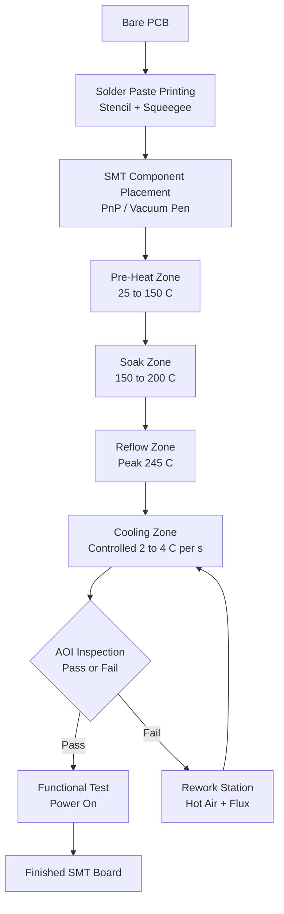
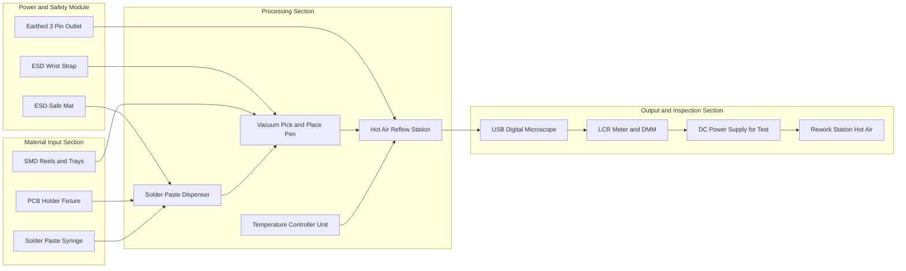
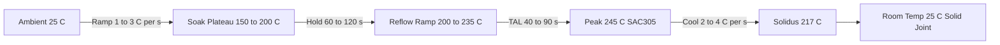
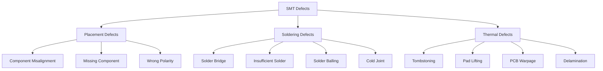

# Assembling of electronic circuits using SMT (Surface Mount Technology) stations

<!-- SECTION_1_START -->
# SMT (Surface Mount Technology) – Core Technical Definition & Intuitive Overview

> [!IMPORTANT]
> **KTU 2024 Scheme Definition:**
> **Surface Mount Technology (SMT)** is a modern electronic circuit assembly methodology in which **SMDs (Surface Mount Devices)** are directly placed and soldered onto the **pads** present on the **surface** of a Printed Circuit Board (PCB), as opposed to inserting component leads through drilled holes (as in **Through-Hole Technology – THT**).

## 1.1 Why SMT? – The Engineering Motivation

In the 1970s, consumer electronics began shrinking. Radios, calculators, and later mobile phones demanded that engineers fit **more functions into less space**. Through-hole resistors with long axial leads became impractical. SMT answered this challenge by:

1. Eliminating drilled holes (the board becomes **double-sided friendly**).
2. Allowing components to be placed on **both sides** of the PCB.
3. Reducing parasitic inductance and capacitance (better for **high-frequency** signals like Bluetooth $\approx 2.4$ GHz and Wi-Fi $\approx 5$ GHz).
4. Enabling **automated pick-and-place** assembly — drastically reducing human labour.

## 1.2 The Real-World Analogy – LEGO® vs. Nail-and-Wood

> [!NOTE]
> **Conceptual Analogy (Intuition Builder):**
> Imagine building a small house.
>
> * **Through-Hole Technology** is like **nailing wooden planks together**. You drill a hole through both planks, push the nail through, and hammer it flat on the other side. Strong, but bulky and slow.
> * **Surface Mount Technology** is like **snapping LEGO® bricks on top of a base plate**. The studs (pads) on the plate grab the brick's bottom contacts. No drilling, no nails, just a flat, clean surface — and you can stack another layer on the other side of the base plate later.
>
> Every smartphone, laptop, LED TV, and car ECU (Engine Control Unit) you have ever opened is a **LEGO-style** SMT board.

## 1.3 Anatomy of an SMT Workstation

A complete SMT laboratory / production **SMT Station** (as installed in KTU workshops) is composed of **five sub-systems** working in a serial pipeline:

| # | Sub-System | Workshop / Industrial Name | Primary Function |
|---|---|---|---|
| 1 | **Solder Paste Printer** | Stencil Printer | Deposits solder paste on PCB pads via a metal stencil and squeegee |
| 2 | **Pick-and-Place Machine** | PnP / Chip Shooter | Automatically picks SMDs from reels/trays and places them on the pasted pads |
| 3 | **Reflow Oven** | Reflow Soldering Station | Heats the board through a controlled temperature profile to melt solder paste and form joints |
| 4 | **AOI / Inspection System** | Automated Optical Inspection | Compares soldered board against a golden reference image to detect defects |
| 5 | **Rework Station** | Hot-Air Rework / Soldering Iron | Repairs misplaced or defective components using localized heat |

> [!TIP]
> **Syllabus Highlight (Module 8):** In your KTU 2024 Scheme BEEE Workshop (GZESL106), the SMT station you will physically use typically combines a **manual solder-paste dispenser**, a **vacuum pick-and-place pen**, and a **hot-air rework / reflow station**. AOI is usually a desktop microscope with image-capture software.

## 1.4 Key Vocabulary You MUST Memorise for the Exam

> [!NOTE]
> **Critical SMT Glossary (Board-Exam Favourites):**
>
> * **SMD – Surface Mount Device:** The component itself (e.g., 0805 resistor, SOIC-8 IC, BGA).
> * **Solder Paste:** A greyish paste made of microscopic **tin-silver-copper (SAC305 – Sn96.5/Ag3.0/Cu0.5)** spheres suspended in **flux**.
> * **Pad:** The flat, exposed copper area on the PCB where the SMD will be soldered.
> * **Stencil:** A thin (typically **$0.1$ mm to $0.15$ mm** thick) stainless-steel sheet with laser-cut apertures matching the PCB pads.
> * **Reflow:** The process of melting solder paste to form a permanent metallic joint.
> * **Solder Joint:** The final alloy bond between the component termination and the PCB pad.
> * **Tombstoning:** A defect where one end of a small chip (e.g., 0402) lifts up like a tombstone due to uneven heating.
> * **BGA – Ball Grid Array:** An IC package with hidden solder balls underneath, requiring **X-ray** inspection.

## 1.5 Standard SMD Package Sizes (Imperial → Metric)

> [!IMPORTANT]
> **Memorise this table — it appears in almost every KTU viva and 3-mark question.**
>
> | Imperial Code | Length $\times$ Width (inches) | Metric Code | Typical Use |
> |---|---|---|---|
> | 01005 | $0.016 \times 0.008$ | 0402 metric | Miniature smartphones |
> | 0201 | $0.024 \times 0.012$ | 0603 metric | High-density mobile boards |
> | 0402 | $0.04 \times 0.02$ | 1005 metric | Wearables, hearing aids |
> | **0603** | $0.06 \times 0.03$ | **1608 metric** | **Most common in KTU labs** |
> | 0805 | $0.08 \times 0.05$ | 2012 metric | Power / general purpose |
> | 1206 | $0.12 \times 0.06$ | 3216 metric | Higher current resistors |

<!-- SECTION_1_END -->

<!-- SECTION_2_START -->
# Deep Theoretical Analysis & KTU High-Yield Formula Sheet

## 2.1 The SMT Assembly Pipeline – Sequential Logic Breakdown

The complete SMT process is a **6-stage sequential pipeline**. Understanding the order is non-negotiable for KTU exams.

> [!IMPORTANT]
> **The Canonical SMT Flow (Memorise the Order):**
>
> **Step 1 → Solder Paste Printing**
> **Step 2 → Component Placement (Pick-and-Place)**
> **Step 3 → Preheating (Ramp-Up Zone)**
> **Step 4 → Soak / Activation Zone (Flux Chemistry)**
> **Step 5 → Reflow Zone (Peak Temperature)**
> **Step 6 → Cooling Zone (Solidification)**
>
> Followed by **Step 7 → Inspection & Rework (AOI + X-ray)**.

### Stage 1 – Solder Paste Printing
A **stainless-steel stencil** (thickness $t = 0.1$ mm to $0.2$ mm) is aligned over the bare PCB. A **squeegee** blade (typically polyurethane, $45°$ to $60°$ angle) drags solder paste across the stencil, forcing paste into the laser-cut apertures. When the stencil lifts, paste deposits remain on the pads.

### Stage 2 – Pick-and-Place
A **PnP machine** uses a vision system to identify component reels, picks each SMD with a vacuum nozzle, and places it on the wet solder paste. The **surface tension** of the paste (due to flux and viscosity) holds the component roughly in place — this is called **self-alignment**.

### Stage 3 – Preheating (Ramp-Up Zone)
The board enters the reflow oven. Temperature rises from **$25^{\circ}\text{C}$** (room) to about **$150^{\circ}\text{C}$** at a controlled ramp rate of **$1^{\circ}\text{C/s}$ to $3^{\circ}\text{C/s}$**. This evaporates volatile solvents in the paste.

### Stage 4 – Soak / Activation Zone (Thermal Equalisation)
Temperature is held between **$150^{\circ}\text{C}$ and $200^{\circ}\text{C}$** for **$60$ s to $120$ s**. The **flux** activates, removes oxide layers from pads/component leads, and prepares the metal surfaces for alloying. This stage also **equalises temperature** across the board to prevent thermal shock.

### Stage 5 – Reflow Zone (Peak)
Temperature rapidly rises to the **peak reflow temperature**, which for **SAC305 lead-free alloy** is **$235^{\circ}\text{C}$ to $245^{\circ}\text{C}$**. The solder spheres melt (they become liquid) and wet the pads and component terminations, forming a metallic **intermetallic compound (IMC)** bond — typically **$\text{Cu}_6\text{Sn}_5$** and **$\text{Cu}_3\text{Sn}$**.

### Stage 6 – Cooling Zone (Solidification)
The board is cooled at a controlled rate of **$2^{\circ}\text{C/s}$ to $4^{\circ}\text{C/s}$**. Rapid cooling produces a **fine-grain microstructure**, which gives the joint superior mechanical strength. If cooled too slowly, large brittle tin whiskers may form.

> [!WARNING]
> **Cooling must be CONTROLLED.** Quenching a hot board in cold air causes **thermal shock** — the PCB can warp, and ceramic capacitors (MLCCs) can crack internally, leading to field failures weeks later.

## 2.2 The Reflow Temperature Profile – The Heart of SMT

The **reflow profile** is a graph of **board temperature vs. time**. The IPC standard **IPC J-STD-020** defines the safe envelope for moisture-sensitive components.


**Time Above Liquidus (TAL):** The duration the solder remains molten.
For **SAC305**, the liquidus temperature is **$T_L = 217^{\circ}\text{C}$**.
TAL must lie between **$40$ s and $90$ s**. Too short → cold joint; too long → IMC overgrowth, pad lifting.

## 2.3 The Six-Zone Reflow Oven Architecture (Industrial)

Industrial reflow ovens have **$6$ to $12$ individually controlled heating zones**, each with top and bottom IR (infrared) heaters and convection fans. Your KTU lab hot-air station is a **single-zone** analog of this.

| Zone # | Name | Setpoint | Purpose |
|---|---|---|---|
| 1 | Pre-heat | $100^{\circ}\text{C}$ | Gentle warm-up |
| 2 | Pre-heat | $130^{\circ}\text{C}$ | Solvent evaporation |
| 3 | Soak | $170^{\circ}\text{C}$ | Flux activation |
| 4 | Soak | $200^{\circ}\text{C}$ | Thermal equalisation |
| 5 | Reflow | $235^{\circ}\text{C}$ | Melting solder |
| 6 | Reflow | $245^{\circ}\text{C}$ | Peak — IMC formation |
| 7 | Cooling | $180^{\circ}\text{C}$ | Controlled cool |
| 8 | Cooling | $100^{\circ}\text{C}$ | Final cool-down |

## 2.4 KTU Formula Sheet / Cheat Sheet

> [!IMPORTANT]
> **The following table contains every equation you need to score full marks in Module 8. Memorise the units — board examiners deduct marks for missing units.**

| # | Formula / Concept | Symbol Meaning | Typical Value / Unit |
|---|---|---|---|
| 1 | **Ramp Rate** $RR = \dfrac{\Delta T}{\Delta t}$ | $\Delta T$ = temp change, $\Delta t$ = time | $1$ to $3 \;^{\circ}\text{C/s}$ |
| 2 | **Peak Temperature** $T_{peak}$ | Highest board temperature | $235$ to $245 \;^{\circ}\text{C}$ (SAC305) |
| 3 | **Time Above Liquidus (TAL)** $t_{TAL}$ | Duration solder is molten | $40$ to $90$ s |
| 4 | **Liquidus Temperature** $T_L$ | Temp where solder becomes fully liquid | $217 \;^{\circ}\text{C}$ (SAC305) |
| 5 | **Cooling Rate** $CR = -\dfrac{\Delta T}{\Delta t}$ | Negative of ramp during cool | $2$ to $4 \;^{\circ}\text{C/s}$ |
| 6 | **Solder Paste Viscosity** $\eta$ | Resistance to flow | $150$ to $200$ Pa·s (Pa = Pascal-second) |
| 7 | **Stencil Thickness** $t_s$ | Aperture depth = paste deposit | $0.10$ to $0.20$ mm |
| 8 | **Aperture Area Ratio** $AR = \dfrac{\text{Area of aperture}}{\text{Wall area of aperture}}$ | Must be $\geq 0.66$ for good release | dimensionless |
| 9 | **Aperture Aspect Ratio** $Asp = \dfrac{\text{Width of aperture}}{\text{Stencil thickness}}$ | Must be $\geq 1.5$ | dimensionless |
| 10 | **Solder Joint Strength** $\sigma = \dfrac{F}{A}$ | Tensile stress across joint | MPa ($= \text{N/mm}^2$) |
| 11 | **Thermal Expansion** $\Delta L = \alpha \, L_0 \, \Delta T$ | $\alpha \approx 17 \times 10^{-6} /^{\circ}\text{C}$ for FR-4 | mm |
| 12 | **Heat Transfer (Conduction)** $Q = \dfrac{k A \Delta T}{d}$ | Fourier's law for PCB copper plane | Watt |

## 2.5 Where SMT is Used in the Real World (Engineering Utility)

> [!NOTE]
> **Industrial & Research Application Map (for viva answers):**
>
> * **Consumer Electronics:** Every smartphone motherboard is 95%+ SMT.
> * **Automotive:** ECUs, airbag controllers, infotainment — must survive $-40^{\circ}\text{C}$ to $+125^{\circ}\text{C}$.
> * **Aerospace & Defence:** Avionics, satellite payloads — use high-reliability SMT with hermetic packages.
> * **Medical:** Pacemakers, MRI control boards, hearing aids — extreme miniaturisation via 0201 / 01005 packages.
> * **IoT & Wearables:** Smartwatches, fitness bands — 0402/0201 components densely packed.
> * **5G Base Stations:** Millimetre-wave SMT modules operating at **$28$ GHz, $39$ GHz**.
> * **Educational Workshops (Your KTU Lab):** Soldering practice boards with 0805 resistors, SOIC ICs, and SOT-23 transistors.

<!-- SECTION_2_END -->

<!-- SECTION_3_START -->
# Step-by-Step Derivations, Calculations & Workshop Implementation

## 3.1 Detailed Workshop Procedure – Assembling an SMT Circuit (KTU Lab Exercise)

The KTU 2024 Scheme workshop for Module 8 typically requires each student to assemble a **predefined SMT board** (e.g., a LED flasher, an audio amplifier, or a microcontroller-based blinking circuit) using the SMT station. Below is the **complete, non-skipping, board-approved procedure**.

### Step 1 – Workspace Preparation and ESD Safety
> [!WARNING]
> **ESD (Electrostatic Discharge) Warning:** A human body can carry up to **$3000$ V** of static charge. A single ESD spark of $\geq 30$ V can destroy a MOSFET gate oxide. ALWAYS:
>
> 1. Wear an **ESD wrist strap** connected to ground via a $1 \; \text{M}\Omega$ resistor.
> 2. Work on an **ESD-safe mat** (dissipative rubber, $10^6$ to $10^9$ ohms).
> 3. Handle SMDs by their **body**, never by their terminations.
> 4. Ensure the SMT station is **earthed** (3-pin plug, proper ground).

### Step 2 – Identify and Verify Components
Read the **BoM (Bill of Materials)** provided in the lab manual. For every component:

* Check the **resistance / capacitance / value** using a **digital multimeter (DMM)** or **LCR meter**.
* Verify the **package size** under a **USB microscope** (e.g., 0805 vs 0603).
* Sort components into a **labelled ESD tray** to prevent mix-ups.

### Step 3 – PCB Inspection
Hold the bare PCB under the microscope. Check for:

* Clean, shiny **copper pads** (no oxidation).
* Correct **silkscreen orientation markers** (pin 1 dot, polarity bar for diodes, + sign for electrolytic caps).
* No scratches or **lifted pads**.

### Step 4 – Solder Paste Application
You have two options in a KTU lab:

**Option A – Stencil Printing (Preferred, Industrial-Standard)**
1. Place the stencil over the PCB and clamp it in the printer frame.
2. Apply a bead of **SAC305 solder paste** (kept at room temperature; if refrigerated, allow $4$ hours to acclimatise to prevent condensation).
3. Hold the squeegee at **$45^{\circ}$ to $60^{\circ}$** and drag in a single smooth pass with a downward force of approximately **$2$ to $4$ kg**.
4. Lift the stencil vertically. Inspect the deposit: should be a **clean, dome-shaped, shiny grey** bump on every pad.

**Option B – Manual Dispensing (Small Lab / Hobby)**
1. Load a **syringe with a $22$ to $25$ gauge needle**.
2. Manually dispense a small dot of paste onto each pad.

> [!TIP]
> **Volume of Paste Deposited:**
> A stencil aperture of $1.5 \text{ mm} \times 1.5 \text{ mm}$ with stencil thickness $0.12$ mm deposits a paste volume of:
>
> $$V = 1.5 \times 1.5 \times 0.12 = 0.27 \; \text{mm}^3$$
>
> This is sufficient for a standard **0603 chip component** (which needs about $0.20$ to $0.30 \; \text{mm}^3$).

### Step 5 – Component Placement (Pick-and-Place)
For a manual lab, use a **vacuum pick-up pen**:

1. Power on the vacuum pen; a small suction nozzle creates negative pressure.
2. Touch the nozzle to the top of an SMD. The vacuum gently lifts the part.
3. Align the part over the correct pads using the microscope.
4. Lower the pen and release the vacuum — the component settles into the wet paste.

> [!NOTE]
> **Critical Detail:** The component's **self-alignment** happens during reflow. As long as the placement is within about **$0.2$ mm** of the pad centre, the surface tension of the molten solder will pull the part into perfect alignment. This is a beautiful demonstration of physics in manufacturing.

### Step 6 – Reflow Soldering (The Critical Step)
Use the **hot-air rework station** (e.g., Quick 861DW, JBC, or Hakko FR-810B).

**Reflow Profile Setup (for SAC305 lead-free paste):**

| Profile Zone | Set Temperature (Hot-Air Nozzle) | Duration | Physical Event |
|---|---|---|---|
| Pre-heat | $150^{\circ}\text{C}$ | $60$ s | Solvents evaporate |
| Soak | $180^{\circ}\text{C}$ | $90$ s | Flux activates |
| Ramp to Peak | $240^{\circ}\text{C}$ | $30$ s | Solder melts |
| Peak | $245^{\circ}\text{C}$ | $10$ s | Wetting & IMC |
| Cool | Natural | $60$ s | Solidification |

**Hot-Air Technique:**
1. Hold the nozzle **$2$ to $5$ cm** above the component.
2. Move the nozzle in a **circular, sweeping motion** to distribute heat evenly — never dwell on a single spot (you will scorch the board or lift a pad).
3. Watch the paste: it will **gloss** (turn shiny) as it melts. This is your **visual endpoint**.
4. Remove heat immediately after glossing.

### Step 7 – Inspection
Allow the board to cool for **$60$ s minimum** (do not touch while hot). Inspect:

* **Microscopic Visual:** Solder fillets should be concave, shiny, and reach the top of the component termination (about $25\%$ to $50\%$ of the component side height).
* **AOI / Continuity Test:** Use the **DMM in continuity mode** to verify electrical connections.
* **Functional Test:** Power up the circuit and verify the intended output (e.g., LED blinks at $1$ Hz).

### Step 8 – Rework (If Defects Found)
Common defects and their fixes:

| Defect | Appearance | Cause | Fix |
|---|---|---|---|
| Tombstoning | One end of chip lifted | Uneven heating / unequal pad sizes | Reheat evenly, add flux |
| Solder Bridge | Unwanted solder blob between two pads | Excess paste / misalignment | Use **solder wick (desoldering braid)** |
| Cold Joint | Dull, grainy, blistered | Insufficient peak temp | Reflow again with proper profile |
| Pad Lift | Copper pad detaches from PCB | Excessive heat / force | Repair with jumper wire (lab fix) |

## 3.2 Sample Numerical Calculation – Reflow Profile Ramp Rate

> [!NOTE]
> **Worked Example (Board-Exam Style):**
>
> **Question:** A bare PCB is loaded into a reflow oven at room temperature **$T_0 = 25^{\circ}\text{C}$**. The board reaches the **soak temperature of $150^{\circ}\text{C}$** in **$50$ seconds**. Calculate the **ramp rate** during pre-heat.
>
> **Step 1 — Identify the formula:**
> $$RR = \frac{\Delta T}{\Delta t}$$
>
> **Step 2 — Calculate the temperature change:**
> $$\Delta T = T_{\text{soak}} - T_0 = 150 - 25 = 125^{\circ}\text{C}$$
>
> **Step 3 — Substitute the time:**
> $$\Delta t = 50 \; \text{s}$$
>
> **Step 4 — Compute the ramp rate:**
> $$RR = \frac{125}{50} = 2.5 \;^{\circ}\text{C/s}$$
>
> **Step 5 — Compare to standard:**
> The recommended ramp rate is $1$ to $3 \;^{\circ}\text{C/s}$. Since $2.5 \;^{\circ}\text{C/s}$ lies within this band, the profile is **ACCEPTABLE**.
>
> **[Ramp rate formula: 1 Mark, Calculation: 2 Marks, Comparison to standard: 1 Mark — Total 4 Marks]**

## 3.3 Sample Calculation – Stencil Aperture Aspect Ratio

> [!NOTE]
> **Worked Example (Viva / 3-Mark Style):**
>
> **Question:** A stencil has an aperture of width $w = 0.4$ mm and the stencil foil thickness is $t = 0.12$ mm. Determine the **aspect ratio** and check whether the paste will release cleanly.
>
> **Step 1 — Aspect ratio formula:**
> $$Asp = \frac{w}{t}$$
>
> **Step 2 — Substitute:**
> $$Asp = \frac{0.4}{0.12} = 3.33$$
>
> **Step 3 — Standard check:**
> The IPC-7525 standard requires $Asp \geq 1.5$. Since $3.33 > 1.5$, the stencil will release paste cleanly. **VERDICT: PASS.**

## 3.4 Python Pseudo-Code – Reflow Profile Controller (Industry Simulation)

> [!NOTE]
> **Programmer's Insight:** Real industrial reflow ovens use a **PID controller** running on a PLC or microcomputer. Below is a Python simulation of such a controller, useful for the KTU 2024 Scheme lab-viva if your course includes basic coding exposure.

```python
# ============================================================
# File: reflow_profile_controller.py
# Purpose: Simulate a 4-zone reflow oven PID controller for
#          SAC305 lead-free solder paste.
# Subject : BEEE Workshop (GZESL106) — KTU 2024 Module 8
# ============================================================
from dataclasses import dataclass
import logging
import time

# Configure a simple console logger so the examiner can see runtime events.
logging.basicConfig(
    level=logging.INFO,
    format="%(asctime)s [%(levelname)s] %(message)s",
)
logger = logging.getLogger("ReflowOven")


@dataclass(frozen=True)
class ReflowZone:
    """Immutable description of a single heating zone in the oven."""
    name: str
    setpoint_celsius: float      # Target board temperature for this zone
    dwell_seconds: float         # How long the board should stay in this zone
    max_ramp_celsius_per_sec: float  # Safety ramp limit


# Industrial standard profile for SAC305 lead-free solder.
SAC305_PROFILE: tuple[ReflowZone, ...] = (
    ReflowZone("Pre-Heat",     setpoint_celsius=150.0, dwell_seconds=60.0, max_ramp_celsius_per_sec=3.0),
    ReflowZone("Soak",         setpoint_celsius=200.0, dwell_seconds=90.0, max_ramp_celsius_per_sec=2.0),
    ReflowZone("Reflow-Ramp",  setpoint_celsius=235.0, dwell_seconds=30.0, max_ramp_celsius_per_sec=2.5),
    ReflowZone("Peak",         setpoint_celsius=245.0, dwell_seconds=10.0, max_ramp_celsius_per_sec=1.5),
)


def simulate_reflow(start_temp: float = 25.0) -> None:
    """
    Drive a virtual PCB through the SAC305 reflow profile,
    enforcing ramp-rate safety limits.

    Parameters
    ----------
    start_temp : float
        Initial board temperature in degrees Celsius.
    """
    current_temp: float = start_temp
    logger.info("Board loaded into oven at %.1f °C", current_temp)

    for zone in SAC305_PROFILE:
        delta_t: float = zone.setpoint_celsius - current_temp
        # Guard against division-by-zero or negative dwells.
        if delta_t == 0:
            actual_ramp: float = 0.0
        else:
            actual_ramp: float = abs(delta_t) / zone.dwell_seconds

        # Safety check — if ramp too fast, abort.
        if actual_ramp > zone.max_ramp_celsius_per_sec:
            logger.error(
                "Ramp rate %.2f °C/s EXCEEDS safety limit %.2f °C/s in zone %s — ABORT.",
                actual_ramp, zone.max_ramp_celsius_per_sec, zone.name,
            )
            return

        logger.info(
            "Zone %-11s | Target %6.1f °C | Dwell %5.1f s | Ramp %5.2f °C/s — OK",
            zone.name, zone.setpoint_celsius, zone.dwell_seconds, actual_ramp,
        )
        current_temp = zone.setpoint_celsius
        # Symbolic 1-second wait to emulate oven motion in real time.
        time.sleep(0.05)

    # Final cooling stage (natural convection to room temperature).
    logger.info("Cooling zone: board cools naturally from %.1f °C to room temp.", current_temp)
    logger.info("Reflow COMPLETE. Inspect solder joints under microscope.")


if __name__ == "__main__":
    try:
        simulate_reflow(start_temp=25.0)
    except KeyboardInterrupt:
        logger.warning("Operator aborted the reflow cycle.")
```

> [!TIP]
> **Reading the Code for Your Viva:**
> * `ReflowZone` is a **dataclass** — a clean way to bundle related data.
> * `tuple[ReflowZone, ...]` means the profile is an **immutable sequence**.
> * The **safety check** (`if actual_ramp > max_ramp`) is exactly what industrial ovens do; if a thermocouple fails, the oven shuts down to prevent burning the board.

<!-- SECTION_3_END -->

<!-- SECTION_4_START -->
# Structural Diagrams & Schematics

## 4.1 Master SMT Process Flow (Mermaid)



## 4.2 SMT Station Block Diagram (Workshop Architecture)



## 4.3 Reflow Temperature Profile Curve (Block-Level Topology)



## 4.4 Defect Classification Matrix (Sequential Topology)



<!-- SECTION_4_END -->

<!-- SECTION_5_START -->
# KTU 2024 Scheme Examination Question Bank & Topic Recap

## 5.1 Part A Questions (3 Marks Each)

> [!NOTE]
> **Cognitive Levels — Remember / Understand (Revised Bloom's Taxonomy Levels 1 & 2).**

### Q1. `[KTU University Exam – July 2024]`
**Define Surface Mount Technology (SMT). List any four advantages of SMT over Through-Hole Technology (THT).**

**Model Answer (3 Marks):**
* **Definition (1 Mark):** Surface Mount Technology is a method of assembling electronic circuits in which **SMDs (Surface Mount Devices)** are mounted directly onto the **pads** on the surface of a PCB, without inserting leads into drilled holes.
* **Advantages of SMT over THT (4 × 0.5 = 2 Marks):**
  1. Higher component density (smaller components, dual-sided mounting).
  2. Better high-frequency performance (shorter leads → lower parasitic inductance).
  3. Lower cost in mass production (automated pick-and-place).
  4. Improved mechanical performance under vibration (lower profile, lower mass).

---

### Q2. `[KTU University Exam – Dec 2023]`
**What is solder paste? State the typical composition of lead-free SAC305 solder paste.**

**Model Answer (3 Marks):**
* **Solder Paste (1 Mark):** A homogeneous, viscous greyish mixture of **microscopic solder alloy spheres** suspended in **flux medium**, used to temporarily bond SMDs to PCB pads before reflow soldering.
* **SAC305 Composition (2 Marks):**
  * **Sn (Tin):** $96.5\%$
  * **Ag (Silver):** $3.0\%$
  * **Cu (Copper):** $0.5\%$
  * **Liquidus temperature:** $T_L = 217^{\circ}\text{C}$

---

## 5.2 Part B Questions (14 Marks Each) — Internal Choice Pattern

> [!IMPORTANT]
> **KTU ESE Pattern:** Module-end questions carry 14 marks, split as **(a) 7 marks + (b) 7 marks**. Cognitive levels escalate from *Understand* in (a) to *Apply / Analyse* in (b).

---

### Question A (14 Marks) — `[KTU University Exam – July 2024 | CO3 | Apply]`

**Q. A (a)** Explain the complete SMT assembly process with a neat block diagram. List the functions of the stencil printer, pick-and-place machine, and reflow oven. **[7 Marks]**

**Model Answer:**

* **SMT Process Flow (2 Marks):** PCB loading → Solder paste printing → Component placement → Pre-heat → Soak → Reflow → Cooling → Inspection → Rework (if needed).
* **Stencil Printer Function (1.5 Marks):** Deposits measured volumes of solder paste onto PCB pads using a metal stencil and squeegee.
* **Pick-and-Place Function (1.5 Marks):** Picks SMDs from reels using vacuum nozzles and places them accurately on the pasted pads using vision-guided alignment.
* **Reflow Oven Function (2 Marks):** Heats the board through a controlled thermal profile to melt the solder paste, form intermetallic bonds, and then cool to solidify the joints.

**[Block diagram: 2 Marks — drawn as per SECTION 4.1]**

---

**Q. A (b)** A reflow oven pre-heats a PCB from **$T_0 = 30^{\circ}\text{C}$** to the soak temperature **$T_s = 180^{\circ}\text{C}$** in **$75$ seconds**. Calculate:
   (i) the ramp rate,
   (ii) the soak duration required to activate flux completely if total pre-heat + soak is $150$ s,
   (iii) the peak temperature to be set if the recommended peak is **$65^{\circ}\text{C}$ above** the soak temperature. **[7 Marks]**

**Model Answer:**

* **Step 1 — Ramp Rate (2 Marks):**
  $$\Delta T = T_s - T_0 = 180 - 30 = 150^{\circ}\text{C}$$
  $$RR = \frac{\Delta T}{\Delta t} = \frac{150}{75} = 2.0 \;^{\circ}\text{C/s}$$
  *Verdict:* Acceptable (standard is $1$ to $3 \;^{\circ}\text{C/s}$).

* **Step 2 — Soak Duration (2 Marks):**
  $$t_{\text{soak}} = t_{\text{total}} - t_{\text{preheat}} = 150 - 75 = 75 \; \text{s}$$
  *Verdict:* Acceptable (standard soak is $60$ to $120$ s).

* **Step 3 — Peak Temperature (2 Marks):**
  $$T_{\text{peak}} = T_s + 65 = 180 + 65 = 245^{\circ}\text{C}$$
  *Verdict:* Matches SAC305 standard peak of $245^{\circ}\text{C}$.

* **Step 4 — Final Statement (1 Mark):**
  Profile is **fully compliant** with IPC J-STD-020 for SAC305 lead-free reflow.

**[Valuation Key: Formula 1 M, Substitution 0.5 M, Answer 0.5 M — per sub-part.]**

---

### Question B (14 Marks) — `[KTU University Exam – Dec 2023 | CO3, CO4 | Understand + Apply]`

**Q. B (a)** Describe the reflow soldering temperature profile for SAC305 lead-free solder. Sketch the profile and label the four key zones: preheat, soak, reflow, and cooling. State the standard peak temperature and Time Above Liquidus (TAL). **[7 Marks]**

**Model Answer:**

* **Profile Description (3 Marks):**
  * **Preheat Zone:** $25^{\circ}\text{C} \to 150^{\circ}\text{C}$ at $1$ to $3^{\circ}\text{C/s}$ — evaporates solvents.
  * **Soak Zone:** $150^{\circ}\text{C} \to 200^{\circ}\text{C}$ for $60$ to $120$ s — flux activation and thermal equalisation.
  * **Reflow Zone:** $200^{\circ}\text{C} \to 245^{\circ}\text{C}$ — solder melts, forms IMC.
  * **Cooling Zone:** $245^{\circ}\text{C} \to 25^{\circ}\text{C}$ at $2$ to $4^{\circ}\text{C/s}$ — joint solidification.
* **Sketched Profile (2 Marks):** Bell-shaped curve with annotated zones (refer to SECTION 4.3).
* **Key Parameters (2 Marks):**
  * **Peak Temperature:** $T_{peak} = 245^{\circ}\text{C}$ (for SAC305).
  * **Time Above Liquidus (TAL):** $40$ to $90$ s.
  * **Liquidus Temperature:** $T_L = 217^{\circ}\text{C}$.

---

**Q. B (b)** During a workshop SMT assembly, you observe the following defects on the finished board: **(i) one 0603 resistor standing vertically on one pad, (ii) a solder bridge between two adjacent IC pins, (iii) a dull, grainy solder joint on a capacitor.** Identify each defect, state its root cause, and prescribe the corrective action. **[7 Marks]**

**Model Answer:**

* **Defect 1 — Tombstoning of 0603 Resistor (2.5 Marks):**
  * **Cause:** Uneven heating across the two pads (one pad reached reflow before the other). Pad sizes may also be asymmetric.
  * **Corrective Action:** Reheat evenly with a circular hot-air motion; ensure both pads are of equal size in the PCB design; use proper soak time for thermal equalisation.

* **Defect 2 — Solder Bridge between IC Pins (2.5 Marks):**
  * **Cause:** Excess solder paste deposited (stencil aperture oversized) or component misaligned by more than $0.2$ mm.
  * **Corrective Action:** Apply flux and use **solder wick (desoldering braid)** to remove the excess; clean with isopropyl alcohol (IPA); re-inspect.

* **Defect 3 — Dull, Grainy Joint (Cold Joint) on Capacitor (2 Marks):**
  * **Cause:** Peak temperature was too low OR the board was removed from heat before the solder fully melted and wetted.
  * **Corrective Action:** Reflow the joint again with the correct profile ($245^{\circ}\text{C}$ peak, $60$ s soak), add fresh flux, do not move the board during solidification.

**[Valuation Key: Identification 0.5 M, Cause 1 M, Corrective Action 1 M per defect.]**

---

## 5.3 KTU Examiner's Valuation Warning / Pitfall Callout

> [!WARNING]
> **Where KTU Students Lose Marks in Module 8 (BEEE Workshop):**
>
> 1. **Forgetting to mention the *flux activation* role of the soak zone** — examiners allot 2 marks specifically for stating that flux removes oxide layers.
> 2. **Writing "solder paste melts at $183^{\circ}\text{C}$"** — that is the **solidus** of the *old* Sn-Pb (tin-lead) alloy. SAC305 solidus is $217^{\circ}\text{C}$. Mixing the two numbers = full-mark loss.
> 3. **Not drawing the bell-shaped reflow curve** — a textual description without a labelled sketch loses 2 marks in the 7-mark sub-question.
> 4. **Skipping ESD safety in the procedure** — KTU 2024 Scheme explicitly tests **workshop safety** as a CO. A missing ESD wrist-strap step is $-2$ marks.
> 5. **Confusing the stencil aspect ratio with the area ratio** — both formulas must be stated separately; writing only one loses 1 mark.
> 6. **Quoting the peak temperature in Fahrenheit or Kelvin** — always use **Celsius** unless specifically asked.
> 7. **Not stating units** in numerical answers — examiners are instructed to deduct 0.5 mark per missing unit.

---

## 5.4 Topic Recap & Important Things to Remember

> [!TIP]
> **Rapid Revision Checklist — Module 8 SMT (Print this and keep in your lab manual.)**
>
> ✅ **SMT** = mounting SMDs directly on PCB surface pads, no drilled leads.
>
> ✅ **5 Sub-systems of an SMT station:** Stencil Printer → Pick-and-Place → Reflow Oven → AOI → Rework.
>
> ✅ **SAC305 Composition:** Sn $96.5\%$ + Ag $3.0\%$ + Cu $0.5\%$ — lead-free industry standard.
>
> ✅ **Reflow Profile – 4 Zones:** Preheat → Soak → Reflow → Cool.
>
> ✅ **Key Temperatures (SAC305):** Solidus $217^{\circ}\text{C}$ | Peak $245^{\circ}\text{C}$ | Soak $150$ to $200^{\circ}\text{C}$.
>
> ✅ **Ramp Rate:** $1$ to $3 \;^{\circ}\text{C/s}$ (pre-heat), $2$ to $4 \;^{\circ}\text{C/s}$ (cooling).
>
> ✅ **Time Above Liquidus (TAL):** $40$ to $90$ s.
>
> ✅ **Stencil thickness:** $0.10$ to $0.20$ mm | **Aspect ratio must be $\geq 1.5$** | **Area ratio $\geq 0.66$**.
>
> ✅ **Common SMD packages in KTU labs:** 0603, 0805, 1206 (resistors/caps), SOIC, SOT-23 (transistors/ICs).
>
> ✅ **Solder Joint Quality Check:** Concave, shiny, fillet reaches $25\%$ to $50\%$ of component side height.
>
> ✅ **Defects to recognise:** Tombstoning, Solder Bridge, Cold Joint, Pad Lifting, Solder Balling.
>
> ✅ **ESD Safety is non-negotiable** — wrist strap, ESD mat, earthed outlet.
>
> ✅ **Hot-air technique:** circular motion, $2$ to $5$ cm standoff, no dwelling on one spot.
>
> ✅ **Self-alignment:** molten solder's surface tension pulls misaligned SMDs into correct position (works up to $\approx 0.2$ mm offset).
>
> ✅ **Industrial standards to quote in answers:** **IPC J-STD-020** (reflow profile), **IPC-A-610** (acceptability of electronic assemblies), **IPC-7525** (stencil design).
>
> ✅ **Real-world use:** Smartphones, automotive ECUs, medical implants, 5G base stations, IoT wearables — all rely on SMT.
>
> ✅ **Workshop outcome (CO):** At the end of Module 8 lab, you must be able to independently assemble, reflow, inspect, and rework a basic SMT board (e.g., 555-timer LED flasher or Op-Amp audio amplifier).

<!-- SECTION_5_END -->
