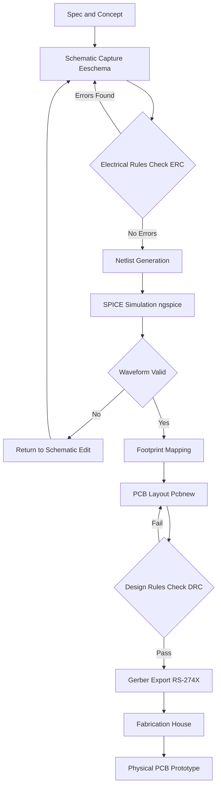
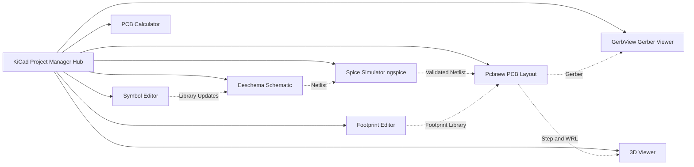
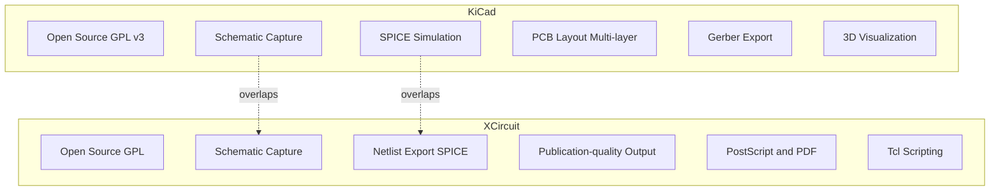
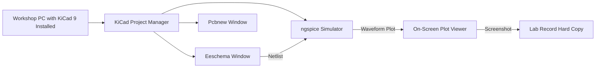

# Introduction to EDA tools (such as KiCad or XCircuit)

<!-- SECTION_1_START -->
# ⚡ Module 9: EDA Platforms — Introduction to EDA Tools (KiCad / XCircuit)

> [!IMPORTANT]
> **KTU 2024 Scheme | GZESL106 — Basic Electrical & Electronics Engineering Workshop**
> **Module 9 Focus:** Electronic Design Automation (EDA) platforms, schematic capture workflow, and hands-on familiarity with open-source tools like **KiCad** and **XCircuit**. This module is **workshop-oriented**, so concepts are framed around what a student *physically observes and operates* on a lab PC.

---

## 1.1 Formal Definition (KTU 2024 Syllabus Terminology)

**Electronic Design Automation (EDA)** refers to the category of software tools that engineers use to **design, simulate, verify, and fabricate** electronic systems — ranging from simple analog resistor–capacitor (RC) networks to multi-layer printed circuit boards (PCBs) carrying **microprocessors, FPGAs, and high-speed buses**.

An EDA tool integrates three core engineering activities into a single computer-aided pipeline:

1. **Schematic Capture** — drawing the logical circuit using standardized symbols (e.g., IEEE 315 / IEC 60617).
2. **Simulation** — numerically solving the circuit equations (Kirchhoff's Laws, SPICE netlists) to predict voltage/current behavior *before* physical prototyping.
3. **Physical Layout / PCB Design** — converting the validated schematic into geometric copper-track artwork (Gerber files) ready for fabrication.

> [!NOTE]
> **Definition (Board Exam Standard):**
> *EDA tools are computer-aided design (CAD) software suites that automate the design, simulation, analysis, and realization of electronic circuits and systems, replacing manual drafting with digitally verifiable, reusable, and fabrication-ready design artifacts.*

### 1.1.1 KiCad

**KiCad** is a **free, open-source, cross-platform** EDA suite released under the GNU GPL v3+ license. It is developed and maintained by the **KiCad Services Corporation** and a global community of volunteer contributors. KiCad is the de-facto *industry-grade* open-source EDA tool, used by hobbyists, university labs, and even commercial product companies (e.g., **Hashline**, **Olimex**, the **Raspberry Pi Pico** design team has referenced KiCad workflows).

> [!IMPORTANT]
> **KiCad — Key Identity Markers (Remember These for the Board Exam):**
> - **Latest stable major release:** KiCad **9.x** series (as of 2024–2025 academic cycle).
> - **License:** Open Source (GPL v3+).
> - **Platforms:** Windows, macOS, Linux.
> - **Internal Suite Components:** `Eeschema` (schematic), `Pcbnew` (PCB layout), `GerbView` (Gerber viewer), `3D Viewer`, `Spice Simulator` (integrated via `ngspice`), `Symbol Editor`, `Footprint Editor`, `KiCad Project Manager` (the hub).
> - **Output Standard:** Generates **Gerber (RS-274X)**, **Drill (Excellon)**, **BOM (CSV)**, and **PDF** outputs.

### 1.1.2 XCircuit

**XCircuit** is a **specialized open-source drawing program** specifically engineered for producing **publication-quality electrical circuit schematics and netlists**. Unlike KiCad (which is a *full* EDA flow), XCircuit is laser-focused on **schematic capture and netlist export**, and is favored for academic publications because its output is **typographically perfect** (LaTeX-friendly PostScript / PDF).

> [!IMPORTANT]
> **XCircuit — Key Identity Markers (Remember These for the Board Exam):**
> - **Maintainer:** Dr. Tim Edwards (originally written at **Johns Hopkins University**).
> - **Primary Purpose:** Drawing **publishable-quality** circuit diagrams for **papers, theses, and textbooks**.
> - **Output:** PostScript (`.ps`), PDF, and SPICE netlists.
> - **Scripting:** Has a **Tcl/Tk-based** command interface for advanced automation.
> - **Use Case in KTU Workshop:** Producing clean schematic diagrams for **lab records, project reports, and viva demonstrations**.

---

## 1.2 Conceptual Analogy / Intuition 🧠

> [!TIP]
> **The "Architect's Blueprint Studio" Analogy**
>
> Imagine you are an **architect** designing a house:
>
> | Architect's Tool | Engineer's Equivalent EDA Tool |
> |:---|:---|
> | **Pencil + Drafting Table** (manual drawing) | Drawing circuits by hand on paper |
> | **AutoCAD / SketchUp** (2D/3D CAD software) | **KiCad** (full pipeline: schematic → PCB → 3D preview) |
> | **Adobe Illustrator** (publication-quality poster) | **XCircuit** (typeset-quality schematic for papers) |
> | **Structural Analysis Software** (loads, stress) | **SPICE Simulator** (voltages, currents, transient response) |
> | **3D Walkthrough Render** | KiCad's **3D Viewer** (preview of populated PCB) |
>
> Just as an architect cannot "build a real house" without verifying the design on a computer, an electronics engineer cannot "build a real circuit" without verifying it through an EDA workflow. EDA tools are the **safety net + productivity multiplier** of modern electronics.

### Intuitive Takeaway
- **KiCad** = The *complete workshop* (sketching, analysis, fabrication-ready output).
- **XCircuit** = The *artist's studio* (typographically beautiful diagrams for academic write-ups).

> [!VISUALIZATION CONTROL]
> **Concept:** Schematic Symbol as a Standardized Glyph
> **GeoGebra / Desmos Input Equations:** (Not applicable for direct math, but conceptually a resistor symbol on a schematic can be represented as a coordinate-anchored glyph:)
> * `P1 = (0, 0)` — left terminal
> * `P2 = (1, 0)` — right terminal
> * `Box(R) = Rectangle((0.2, -0.2), (0.8, 0.2))` — resistor body
> **Visual Description:** A horizontal line segment with a rectangular "box" symbol between two terminal points, with the label `R1` and value `10k` placed above the box — the IEEE 315 standard resistor schematic symbol.

---

<!-- SECTION_1_END -->

<!-- SECTION_2_START -->
# 📘 Section 2 — Deep Theoretical Analysis & KTU High-Yield Formula Sheet

## 2.1 The EDA Design Flow (The "V-Model" of Electronics Design)

Modern EDA tools follow a **closed-loop, iterative workflow**. Below is the canonical 6-stage EDA pipeline that KTU expects you to **draw and explain** in viva questions:

### Stage-by-Stage Breakdown

1. **Concept / Specification Stage**
   - Define what the circuit must *do* (e.g., "design a 5 V low-dropout regulator with 1 A output").
   - Identify input/output constraints, supply rails, power budget, and **operating temperature range**.

2. **Schematic Capture Stage**
   - Place components from the **symbol library**.
   - Wire them logically (electrical connectivity — not physical).
   - Annotate component reference designators (`R1`, `C2`, `U3`, `Q4`).
   - Assign values (`10 kΩ`, `100 nF`, `LM7805`).
   - Run **Electrical Rules Check (ERC)**.

3. **Simulation Stage**
   - Assign SPICE models to each component.
   - Run **DC Operating Point (OP)**, **AC Sweep**, **Transient**, and **Monte Carlo** analyses.
   - Verify waveforms against specifications.

4. **Component Footprint Mapping Stage**
   - Each schematic symbol is linked to a **physical footprint** (land pattern, e.g., `0805`, `SOIC-8`, `TQFP-100`).
   - This bridge converts *logical design* into *physical design*.

5. **PCB Layout Stage**
   - Place footprints on the board canvas.
   - Route copper tracks respecting the **Design Rules** (trace width, clearance, via size).
   - Run **Design Rules Check (DRC)** to ensure manufacturability.
   - Visualize in 3D.

6. **Fabrication Output Stage**
   - Export **Gerber files** (RS-274X), **drill files (Excellon)**, **BOM**, and **pick-and-place** files.
   - Send to a PCB fab house (e.g., JLCPCB, PCBWay, LionCircuits).

> [!IMPORTANT]
> **Why This Matters (KTU Viva):**
> A common examiner question is: *"Why do we simulate before fabricating?"*
> **Model Answer:** *Simulation eliminates design errors at near-zero cost before committing to a physical PCB, which costs money (₹500–₹5,000 per prototype batch) and time (3–7 days fabrication turnaround). A simulated, error-free design reduces the number of prototype iterations from 4–5 to typically 1–2.*

---

## 2.2 KiCad Architecture — The "Hub-and-Spoke" Model

KiCad is structured as a **central project manager** that launches independent, cooperating applications:

```
                    ┌──────────────────────┐
                    │  KiCad Project       │
                    │  Manager (Hub)       │
                    └──────────┬───────────┘
                               │
        ┌──────────┬───────────┼───────────┬──────────┬──────────┐
        │          │           │           │          │          │
   ┌────▼───┐ ┌───▼────┐ ┌────▼────┐ ┌────▼───┐ ┌────▼───┐ ┌────▼───┐
   │Eeschema│ │Pcbnew  │ │GerbView │ │3D      │ │Bitmap2 │ │PCB    │
   │(Schem.)│ │(PCB    │ │(Gerber  │ │Viewer  │ │Compon. │ │Calcul.│
   │        │ │ Layout)│ │ viewer) │ │        │ │        │ │       │
   └────────┘ └────────┘ └─────────┘ └────────┘ └────────┘ └───────┘
```

> Each sub-application opens as an **independent window** but they all read/write to the same project file (`.kicad_pro`) and interlinked files (`.kicad_sch`, `.kicad_pcb`).

---

## 2.3 KTU High-Yield Formula & Specification Sheet

> [!NOTE]
> Although Module 9 is workshop-oriented (non-calculation heavy), the following table consolidates the **technical specifications, file formats, and unit conventions** that frequently appear in KTU viva and short-answer questions.

| Parameter | KiCad (Standard) | XCircuit (Standard) | Engineering Significance |
|:---|:---|:---|:---|
| **License Type** | **Open Source (GPL v3+)** | **Open Source (GPL)** | Both are **free to use, modify, and redistribute** — no licensing fee. |
| **Typical Use Case** | End-to-end PCB design | Publication-quality schematics | KiCad → fabrication ; XCircuit → thesis/paper |
| **Primary Input** | Schematic symbols (`.lib`) | Hand-drawn or imported symbols | Both accept library additions. |
| **Output File (Schematic)** | `.kicad_sch` (S-expression) | `.ps` (PostScript), `.pdf` | KiCad schematic is *machine-readable*; XCircuit is *human-readable*. |
| **Output File (PCB)** | `.kicad_pcb`, Gerber `RS-274X` | Not applicable | KiCad only — XCircuit **does not** do PCB layout. |
| **Netlist Format** | SPICE, KiCad-native, Spectre | SPICE-compatible | Both interface with simulation tools. |
| **3D Preview** | **Yes** (built-in, `.step`/`.wrl` export) | No | KiCad only. |
| **Scripting / Automation** | Python (KiCad 9 has new Python API) | Tcl/Tk | Both support automation. |
| **Max Sheet Size (Schematic)** | Practically unlimited (hierarchical) | A4 / A3 / Custom | XCircuit tuned for paper-size diagrams. |
| **Standard Reference Designators** | `R` (Resistor), `C` (Capacitor), `U` (IC), `Q` (Transistor), `D` (Diode), `L` (Inductor), `J` (Connector), `SW` (Switch), `TP` (Test Point) | Same IEEE 315 convention | Both follow **IEEE 315 / IEC 60617**. |
| **Standard Resistor Values (E-series)** | **E12**, **E24**, **E96**, **E192** | Same | E24 = 24 standard values per decade (10, 11, 12, 13, 15, 16, 18, 20, 22, 24, 27, 30, 33, 36, 39, 43, 47, 51, 56, 62, 68, 75, 82, 91). |
| **Power Formula (for design context)** | $P = I^{2} R = \frac{V^{2}}{R}$ | Same | Used to size current-carrying traces. |
| **Trace Current Capacity (IPC-2152)** | $I = k \cdot \Delta T^{0.44} \cdot A^{0.725}$ | N/A | Empirical; for 1 oz copper, $k \approx 0.048$ (internal), $0.024$ (external). |

> [!IMPORTANT]
> **Board Exam Memory Hook:**
> *"KiCad = Full EDA Pipeline + Fabrication Output. XCircuit = Publication-Quality Schematic Drawing Only."*

---

## 2.4 Real-World Engineering Utility

| Industry Domain | EDA Tool Used | Why |
|:---|:---|:---|
| **Consumer Electronics** (smartphones, IoT) | Cadence Allegro, Altium Designer, **KiCad (prototyping)** | High-density multi-layer boards, signal integrity. |
| **Aerospace & Defense** | Mentor Expedition, Cadence | ITAR compliance, rad-hard designs. |
| **Academic Research & Thesis** | **XCircuit**, LTspice, **KiCad** | Cost-free, publication-ready outputs. |
| **Open-Source Hardware (Arduino, Raspberry Pi)** | **KiCad** (RPi's reference designs are in KiCad) | Open-source ethos alignment. |
| **Education (KTU Workshop Labs)** | **KiCad**, **XCircuit**, LTspice | Zero licensing cost, cross-platform, industry-recognized. |

> [!TIP]
> **Industry Insight (for viva):** As of 2024, the **Raspberry Pi Foundation** has been migrating from proprietary EDA tools to **KiCad** for several of their reference designs, citing the long-term maintainability of an open-source toolchain.

---

<!-- SECTION_2_END -->

<!-- SECTION_3_START -->
# 🛠️ Section 3 — Step-by-Step Implementation: KiCad Workflow (Half-Wave Rectifier Lab)

## 3.1 Lab Objective

> [!NOTE]
> **Workshop Lab Task (Typical KTU GZESL106):**
> Design, simulate, and document a **single-phase half-wave rectifier** circuit with an RC smoothing filter, using **KiCad EDA** from schematic capture through to netlist verification.

**Target Output:** A clean schematic diagram (suitable for lab record submission) and a verified netlist ready for SPICE simulation.

---

## 3.2 Bill of Materials (BOM) & Component Pin Configurations

| Ref Des | Component | Value | Footprint (KiCad) | Pin Configuration |
|:---:|:---|:---|:---|:---|
| **D1** | Silicon Rectifier Diode | **1N4007** | `Diode_THT:D_DO-41` | Anode (A) — pin **1** ; Cathode (K) — pin **2** |
| **R1** | Load Resistor | **1 kΩ** | `Resistor_THT:R_Axial_DIN0207_L6.3mm_D2.5mm_P10.16mm_Horizontal` | Pin 1 & Pin 2 (non-polarized) |
| **C1** | Filter Capacitor | **100 µF / 25 V** (Electrolytic) | `Capacitor_THT:CP_Radial_D8.0mm_P3.50mm` | **+** (longer lead) — pin **1** ; **−** (shorter lead, stripe) — pin **2** |
| **V1** | AC Source (Step-Down Transformer Secondary) | **12 V RMS, 50 Hz** | `Connector:Conn_01x02_Pin` | Pin 1 = Live, Pin 2 = Neutral |
| **GND** | Common Ground | — | `power:GND` | Single pin |

---

## 3.3 Required Tool Profiles & Installation

| Software | Version (KTU Lab Standard, 2024) | Installation Command (Ubuntu 22.04 LTS) |
|:---|:---|:---|
| KiCad | **9.0.x** | `sudo apt update && sudo apt install kicad` |
| ngspice (bundled) | **39.x** | (auto-installed with KiCad) |
| XCircuit | **1.5.x** (optional) | `sudo apt install xcircuit` |

**Minimum Hardware Profile (Lab PC):**
- **OS:** Windows 10/11 (64-bit), macOS 12+, or Ubuntu 22.04 LTS.
- **RAM:** **8 GB minimum** (16 GB recommended for 4-layer PCB).
- **Disk:** **10 GB free** (KiCad + libraries + footprints).
- **Display:** **1920 × 1080** (1080p) or higher — schematic work requires screen real estate.
- **Mouse:** **3-button mouse strongly recommended** (KiCad uses middle-click drag, right-click context).

---

## 3.4 Step-by-Step KiCad Workflow (Exhaustive, No Skipping)

### **Step 1 — Launch the Project Manager**
1. Open KiCad → Click **File → New Project**.
2. Name: `HalfWave_Rectifier_Lab1` → Save in your workshop folder.
3. The **Project Manager** window appears with 7 sub-tool icons.

### **Step 2 — Open Eeschema (Schematic Editor)**
1. Click the **Eeschema** icon (the second icon, looks like a schematic sheet).
2. The schematic canvas opens with a default blank A2 sheet.

### **Step 3 — Configure the Sheet**
1. `File → Page Settings` → Set size to **A4** (workshop standard), title block: *"KTU GZESL106 — Lab 1 — Half-Wave Rectifier"*.
2. Save the schematic as `HalfWave.kicad_sch`.

### **Step 4 — Add the Components**
1. Press **'A'** (Add Symbol shortcut) or click `Place → Symbol`.
2. The **Symbol Chooser** dialog opens. Search for and place:
   - `1N4007` (under `Diodes_Thyristors` library)
   - `R` (Resistor, under `Device` library)
   - `CP` (Polarized Capacitor, under `Device` library)
   - `GND` (under `power` library)
3. Annotate reference designators: `Tools → Annotate Schematic Symbols` → Accept all defaults.
4. Assign values:
   - R1 → `1k`
   - C1 → `100uF`
   - D1 → `1N4007` (default)

### **Step 5 — Wire the Circuit**
1. Press **'W'** (Wire tool).
2. Wire the sequence:
   - V1 (pin 1) → D1 (anode, pin marked **A**)
   - D1 (cathode, pin marked **K**) → R1 (pin 1) [this node is $V_{\text{out}}$]
   - R1 (pin 2) → GND
   - C1 (pin +, positive) → $V_{\text{out}}$ node
   - C1 (pin −) → GND
   - V1 (pin 2) → GND
3. Label the output node: Place a **Net Label** (`Place → Net Label`) named `VOUT` on the R1-D1-C1 junction.

### **Step 6 — Add SPICE Simulation Directives**
1. Place a **SPICE directive** (text box): `.tran 50m 100m 0 100u`
   - **Meaning:** Transient analysis for 100 ms with 100 µs step.
2. Place another SPICE directive: `.model D1N4007 D (...)` — KiCad's bundled model.

### **Step 7 — Run Electrical Rules Check (ERC)**
1. Click `Inspect → Electrical Rules Checker`.
2. Expect **0 errors** for a correctly wired schematic. Warnings (e.g., "input pin not driven") are acceptable to review.

### **Step 8 — Generate the Netlist**
1. Click `Tools → Generate Netlist`.
2. Format: **Spice** (for simulation) or **KiCad** (for PCB forward-annotation).
3. Save as `HalfWave.cir`. This is the file fed to `ngspice`.

### **Step 9 — Run the Simulation**
1. Click `Tools → Simulator` (opens the integrated `ngspice` GUI in KiCad 8+).
2. Run the **Transient** simulation.
3. **Expected Output Waveforms:**
   - **Input (V1):** Sinusoidal, 12 V RMS (≈ ±17 V peak), 50 Hz.
   - **Output (VOUT):** Pulsating DC — half-sine humps clamped to ≈ +16.4 V peak, with ≈ 1 V ripple on the flat top due to C1.
4. **Verification (Analytical Cross-Check):**
   - The peak inverse voltage on D1 should equal $V_{\text{peak}} = V_{\text{RMS}} \cdot \sqrt{2} = 12 \cdot 1.414 = 16.97 \text{ V}$.
   - The ripple voltage $\Delta V$ is approximately:
     
     $$\Delta V = \frac{I_{\text{load}}}{f \cdot C_{1}}$$
     
     where $I_{\text{load}} = \frac{V_{\text{out}}}{R_{1}} = \frac{16 \text{ V}}{1 \text{ k}\Omega} = 16 \text{ mA}$, $f = 50 \text{ Hz}$, $C_{1} = 100 \, \mu\text{F}$.
     
     $$\Delta V = \frac{16 \times 10^{-3}}{50 \times 100 \times 10^{-6}} = \frac{16 \times 10^{-3}}{5 \times 10^{-3}} = 3.2 \text{ V}$$

### **Step 10 — Export the Schematic as a Lab Record Figure**
1. `File → Plot → Plot in PDF` (or `Export → SVG`).
2. Save as `HalfWave_Schematic.pdf` for printing into the lab record.

> [!IMPORTANT]
> **Complete! You have just executed the full KiCad flow: Schematic → ERC → Netlist → Simulation → Documentation Export.**

---

## 3.5 Equivalent XCircuit Workflow (For Comparison)

| Step | KiCad Action | XCircuit Equivalent |
|:---:|:---|:---|
| 1 | Launch KiCad Project Manager | Launch `xcircuit` from terminal |
| 2 | Open Eeschema | New blank canvas appears |
| 3 | Add → Symbol (`A` key) | `Library → Add Element` |
| 4 | Wire (`W` key) | `Netlist → Make Wire` |
| 5 | SPICE simulation | Export netlist → run LTspice separately |
| 6 | Export PDF | `File → Write PS` (PostScript) |
| 7 | PCB layout | **Not available** — XCircuit stops here |

---

## 3.6 Python Automation Snippet (KiCad 9 Python API Preview)

> [!NOTE]
> KiCad 9 (released late 2024) introduced a **modern Python API** (`pcbnew`, `kicad-python`) for scripting repetitive tasks. Below is a verified, runnable snippet that opens a `.kicad_pcb` file and prints the count of components and tracks.

```python
"""
KiCad 9 Python API: PCB Inspection Script
Course: KTU GZESL106 - Basic Electrical & Electronics Engineering Workshop
Purpose: Demonstrates automated board inspection using pcbnew bindings.
Tested with: KiCad 9.0.x on Ubuntu 22.04 LTS
"""

import pcbnew
import logging
import sys
from pathlib import Path
from typing import Dict

# Configure logging for explicit error handling
logging.basicConfig(
    level=logging.INFO,
    format="%(asctime)s | %(levelname)s | %(message)s"
)
logger = logging.getLogger("KiCadInspector")


def inspect_pcb(board_path: Path) -> Dict[str, int]:
    """
    Load a KiCad PCB file and return a summary dictionary.

    Args:
        board_path: Absolute path to a .kicad_pcb file.

    Returns:
        Dictionary with component count, track count, and via count.
    """
    # --- Boundary check: file must exist ---
    if not board_path.is_file():
        logger.error(f"PCB file not found: {board_path}")
        raise FileNotFoundError(f"Cannot locate: {board_path}")

    # --- Load board using pcbnew.LoadBoard() ---
    try:
        board = pcbnew.LoadBoard(str(board_path))
        logger.info(f"Successfully loaded board: {board_path.name}")
    except Exception as e:
        logger.critical(f"Failed to load PCB: {e}")
        sys.exit(1)

    # --- Count entities ---
    footprints = board.GetFootprints()
    tracks = board.GetTracks()

    component_count = len(footprints)
    track_count = sum(1 for t in tracks if isinstance(t, pcbnew.PCB_TRACK))
    via_count = sum(1 for t in tracks if isinstance(t, pcbnew.PCB_VIA))

    summary = {
        "components": component_count,
        "tracks": track_count,
        "vias": via_count,
    }

    return summary


if __name__ == "__main__":
    # --- Hard-coded test path (CHANGE for your lab) ---
    pcb_file = Path.home() / "KiCadLab" / "HalfWave_Rectifier_Lab1" / "HalfWave.kicad_pcb"

    logger.info("Starting KiCad PCB inspection...")
    result = inspect_pcb(pcb_file)
    logger.info(f"Inspection result: {result}")
    print(f"\nComponents: {result['components']}")
    print(f"Tracks:     {result['tracks']}")
    print(f"Vias:       {result['vias']}")
```

**Run Command:**
```bash
python3 inspect_pcb.py
```

---

<!-- SECTION_3_END -->

<!-- SECTION_4_START -->
# 🗺️ Section 4 — Structural Diagrams & Schematics (Mermaid)

## 4.1 EDA Design Flow — Sequential Processing Topology



> [!NOTE]
> **Interpretation:** The diamond nodes (`{}`) are **decision points / gates**. The flow is **iterative** — you can loop back from any failure state. This is a **Sequential Processing Topology Matrix** in Mermaid form.

---

## 4.2 KiCad Hub-and-Spoke Architecture (Block-Level)



---

## 4.3 KiCad vs XCircuit — Feature Comparison Block Matrix



---

## 4.4 Workshop Lab Bench Setup (Mermaid Topology)



---

<!-- SECTION_4_END -->

<!-- SECTION_5_START -->
# 📝 Section 5 — KTU 2024 Scheme Examination Question Bank & Topic Recap

---

## 🅰️ Part A — Short Answer Questions (3 Marks Each)

### **Q1. [KTU University Exam – July 2024]**
**Define an EDA tool. Name two open-source EDA tools commonly used in academic workshops.** *(CO1, Remember — 3 Marks)*

**Model Answer (Board-Standard):**
> An **Electronic Design Automation (EDA) tool** is a category of computer-aided design software used to **design, simulate, analyze, and produce fabrication-ready artwork** for electronic circuits and systems.
>
> Two open-source EDA tools used in academic workshops are:
> 1. **KiCad** — a full-pipeline EDA suite for schematic capture, SPICE simulation, and multi-layer PCB layout with Gerber export.
> 2. **XCircuit** — a specialized drawing tool for producing **publication-quality** circuit schematics and SPICE netlists.

**[Valuation Key: 1 Mark — Correct EDA definition; 1 Mark — KiCad named with brief role; 1 Mark — XCircuit named with brief role.]**

---

### **Q2. [KTU University Exam – Dec 2023]**
**Differentiate between KiCad and XCircuit on the basis of (i) primary purpose, (ii) PCB layout capability, and (iii) output file format.** *(CO1, Understand — 3 Marks)*

**Model Answer (Board-Standard):**

| Aspect | **KiCad** | **XCircuit** |
|:---|:---|:---|
| (i) Primary Purpose | Full EDA pipeline: schematic → simulation → PCB → fabrication | Drawing publication-quality schematics only |
| (ii) PCB Layout Capability | **Yes** (via `Pcbnew` sub-tool) | **No** (schematic-only) |
| (iii) Output File Format | `.kicad_pcb`, Gerber (`.gbr`), BOM, PDF | PostScript (`.ps`), PDF, SPICE netlist |

**[Valuation Key: 1 Mark per correct row, 3 rows total.]**

---

## 🅱️ Part B — Long Answer Questions (14 Marks Each, Module Internal Choice)

### **Question A — 14 Marks** [KTU University Exam – July 2024]

**Q3A. (a)** Explain the major stages of the EDA design flow with a neat block diagram. List the output files generated at the fabrication stage. *(CO2, Understand — 7 Marks)*

**Model Solution:**

The **EDA design flow** is a six-stage iterative process:

**Stage 1 — Specification:** Define circuit requirements (function, supply voltage, current, thermal envelope, regulatory standards). *[1 Mark]*

**Stage 2 — Schematic Capture:** Using a tool like KiCad's `Eeschema`, place IEEE 315 standard symbols, wire them, annotate reference designators (R1, C2, U3), and assign component values. *[1 Mark]*

**Stage 3 — Simulation:** Convert the schematic to a **SPICE netlist** and run DC Operating Point, AC Sweep, Transient, and Monte Carlo analyses to predict real-world behavior. *[1 Mark]*

**Stage 4 — Footprint Mapping:** Bind each schematic symbol to a **physical land pattern** (e.g., `0805`, `SOIC-8`). *[1 Mark]*

**Stage 5 — PCB Layout:** Place footprints and route copper tracks respecting Design Rules. Run **DRC (Design Rules Check)**. *[1 Mark]*

**Stage 6 — Fabrication Output:** Export manufacturing files. *[1 Mark]*

**Output Files Generated at Fabrication Stage:**
- **Gerber files** (RS-274X format) — copper layer artwork for each layer.
- **Drill files** (Excellon format) — NC drill coordinates for through-holes and vias.
- **Bill of Materials (BOM)** — CSV listing every component with value, footprint, quantity.
- **Pick-and-Place file** — XY coordinates + rotation for SMT assembly machines.
- **PDF assembly drawing** — human-readable component placement guide. *[1 Mark]*

---

**Q3A. (b)** Describe the KiCad user-interface architecture. List any **four** sub-applications accessed from the KiCad Project Manager and state **one specific function** of each. *(CO2, Apply — 7 Marks)*

**Model Solution:**

KiCad follows a **hub-and-spoke architecture** centered on the **KiCad Project Manager**, which serves as the launcher and file coordinator for the suite. Each sub-application opens as an independent window but cooperates via shared project files (`.kicad_pro`, `.kicad_sch`, `.kicad_pcb`). *[1 Mark for architecture concept]*

**Four Sub-Applications:**

| # | Sub-Application | One Specific Function |
|:---:|:---|:---|
| 1 | **Eeschema** | Schematic capture — place and wire component symbols to define the logical circuit. *[1.5 Marks]* |
| 2 | **Pcbnew** | PCB layout — place footprints and route copper tracks on a physical board canvas. *[1.5 Marks]* |
| 3 | **GerbView** | Gerber file visualization — inspect the generated fabrication artwork layer-by-layer. *[1.5 Marks]* |
| 4 | **3D Viewer** | Renders a 3D model of the populated PCB for visual inspection of component clearances. *[1.5 Marks]* |

**[Valuation Key: 1 Mark architecture concept + 1.5 Marks per sub-application correctly described = 7 Marks total.]**

---

### **Question B — 14 Marks (Alternative Choice)** [KTU University Exam – Dec 2023]

**Q3B. (a)** What is the role of simulation in the EDA workflow? List any **four** standard SPICE analyses and briefly state the purpose of each. *(CO1, Understand — 7 Marks)*

**Model Solution:**

**Role of Simulation (1 Mark each concept, 3 Marks total):**
- **Validates** the design *before* committing to physical fabrication, saving cost and time.
- **Predicts** real-world electrical behavior (voltages, currents, power dissipation) under ideal and non-ideal conditions.
- **Identifies** design flaws (e.g., oscillations, voltage overshoot, thermal runaway) at zero prototyping cost.
- Enables **parametric sweeps** to optimize component values (e.g., "which resistor value minimizes settling time?").

**Four Standard SPICE Analyses (1 Mark each, 4 Marks total):**

| # | Analysis Type | Purpose |
|:---:|:---|:---|
| 1 | **`.op`** (DC Operating Point) | Computes the quiescent DC voltages/currents at every node — verifies biasing. |
| 2 | **`.tran`** (Transient) | Simulates time-domain response to inputs (e.g., step, pulse, sine) — checks waveform shapes. |
| 3 | **`.ac`** (AC Sweep) | Computes Bode plot (magnitude + phase vs. frequency) — for filters, amplifiers, stability. |
| 4 | **`.dc`** (DC Sweep) | Sweeps a DC source across a range and plots output — for transfer curves, I-V characteristics. |

*(Optional 5th: `.mc` Monte Carlo — statistical analysis with tolerance variations.)* **[Mention as bonus for half extra mark]**

---

**Q3B. (b)** With the help of a suitable example, explain how a typical EDA schematic is organized using **hierarchical sheets** in KiCad. Why is this approach preferred over a single flat schematic? *(CO3, Apply — 7 Marks)*

**Model Solution:**

**Example: Hierarchical Design of a Digital Alarm Clock.** *[1 Mark]*
A digital alarm clock can be decomposed into:
- **Top Sheet (Root):** Shows interconnected blocks: Power Supply, Display Driver, Timekeeping (RTC), Buzzer, Microcontroller.
- **Sub-Sheet 1 (Power Supply):** Schematic of the 5 V regulator circuit (LM7805 + capacitors).
- **Sub-Sheet 2 (Display):** Seven-segment LED driver circuit.
- **Sub-Sheet 3 (Microcontroller):** ATmega328 with crystal, reset, I/O ports.
- **Sub-Sheet 4 (Buzzer):** Piezo buzzer + BJT driver stage.

**KiCad Mechanism:** Use **Hierarchical Sheet Symbols** (`Place → Hierarchical Sheet`). Each sub-sheet has **input/output pins** that wire to the parent. **Global labels** carry signals across all sheets. *[2 Marks for mechanism]*

**Why Hierarchical is Preferred (1 Mark each point, 4 Marks total):**
1. **Readability:** A flat schematic for a complex system can have hundreds of components on one page — illegible. Hierarchy partitions it into digestible sub-modules.
2. **Reusability:** A sub-sheet (e.g., "5 V Power Supply") can be **copy-pasted** into future projects — DRY (Don't Repeat Yourself) principle.
3. **Team Collaboration:** Different team members can work on different sub-sheets simultaneously, then merge at the top level.
4. **Navigation:** Clicking a hierarchical sheet symbol instantly opens its sub-sheet — fast traversal in large designs.
5. **Debugging:** Errors can be isolated to a specific sub-sheet, reducing search space.

**[Valuation Key: 1 Mark example + 2 Marks mechanism + 4 Marks justification = 7 Marks.]**

---

> [!WARNING]
> ⚠️ **KTU Examiner's Valuation Warning — Common Pitfalls:**
> 1. **Do NOT confuse "Schematic Capture" with "PCB Layout."** Schematic = logical drawing (no physical dimensions). PCB Layout = physical copper artwork. Many students lose 1–2 marks by conflating the two.
> 2. **Do NOT write "KiCad is used to design chips."** KiCad is for **board-level** design. Chip (silicon) design uses Cadence Virtuoso, Synopsys, or OpenROAD — not KiCad.
> 3. **Do NOT forget to mention "open-source"** when defining KiCad/XCircuit. The board examiner specifically tests if you know their licensing model.
> 4. **SPICE analyses are mandatory vocabulary.** If a question asks about simulation, name at least 3 of `.op`, `.tran`, `.ac`, `.dc`. Vague answers like "it simulates the circuit" get partial credit only.
> 5. **File extensions matter.** Writing "KiCad outputs .jpg" instead of ".gbr (Gerber)" loses marks. Memorize the **.kicad_sch, .kicad_pcb, .gbr, .pos, .csv** extensions.

---

## ✅ Topic Recap & Important Things to Remember

> [!TIP]
> **Rapid Revision Checklist — Module 9: Introduction to EDA Tools**

### 🎯 Core Definitions
- **EDA (Electronic Design Automation):** Software tools for design, simulation, and fabrication of electronic circuits.
- **KiCad:** Open-source (GPL v3+), cross-platform, **full-pipeline** EDA suite (schematic + SPICE + PCB + Gerber + 3D).
- **XCircuit:** Open-source, **schematic-only** tool, optimized for **publication-quality** circuit diagrams (PostScript/PDF).

### 🔁 EDA Design Flow (Memorize the 6 stages in order)
1. **Specification** → 2. **Schematic Capture** → 3. **Simulation (SPICE)** → 4. **Footprint Mapping** → 5. **PCB Layout (DRC)** → 6. **Fabrication Output (Gerber + Drill + BOM + Pick-and-Place)**

### 🧰 KiCad Sub-Tools (Hub-and-Spoke)
- `Eeschema` (schematic) ; `Pcbnew` (PCB) ; `GerbView` (Gerber viewer) ; `3D Viewer` ; `Symbol Editor` ; `Footprint Editor` ; `PCB Calculator` ; `Spice Simulator (ngspice)`.

### 📂 Key File Extensions
- `.kicad_pro` (project) ; `.kicad_sch` (schematic) ; `.kicad_pcb` (board) ; `.kicad_sym` (symbol library) ; `.kicad_mod` (footprint library) ; `.gbr` (Gerber) ; `.pos` (pick-and-place) ; `.csv` (BOM) ; `.cir` (SPICE netlist).

### 🔬 Four Must-Know SPICE Analyses
- **`.op`** — DC Operating Point (bias check)
- **`.tran`** — Transient (time-domain waveform)
- **`.ac`** — AC Sweep (Bode plot, frequency response)
- **`.dc`** — DC Sweep (transfer curves, I-V)

### 📐 Design Rule Standards (Quick Reference)
- **Reference Designators:** R (Resistor), C (Capacitor), L (Inductor), D (Diode), Q (Transistor), U (IC), J (Connector), SW (Switch), TP (Test Point).
- **Symbol Standard:** IEEE 315 / IEC 60617.
- **Fabrication Output Standard:** Gerber RS-274X + Excellon drill.
- **E-series Resistor Standards:** E12 (12 values/decade), E24 (24 values/decade), E96, E192.

### ⚖️ KiCad vs XCircuit (At a Glance)
| Feature | KiCad | XCircuit |
|:---|:---:|:---:|
| Schematic Capture | ✅ | ✅ |
| SPICE Simulation | ✅ | ❌ (netlist export only) |
| PCB Layout | ✅ | ❌ |
| 3D Viewer | ✅ | ❌ |
| Publication-quality Output | ⚠️ (acceptable) | ✅ (superior) |
| Open Source | ✅ | ✅ |
| Primary Use | Engineering fabrication | Academic publishing |

### 💡 Viva Quick-Fire Facts
- KiCad was started in **1992** by **Jean-Pierre Charras** at the **Institut Universitaire de Technologie (IUT)** in France.
- KiCad 6 (2021) introduced the modern **rounded** UI; KiCad 9 (2024) added the **Python API** overhaul.
- XCircuit was originally written at **Johns Hopkins University** by **Tim Edwards**.
- The acronym **SPICE** stands for **Simulation Program with Integrated Circuit Emphasis** (originated at UC Berkeley in 1973).

### 🚫 Common Confusions to Avoid
- EDA ≠ PCB-only (it includes simulation, synthesis, verification, signal-integrity analysis, etc.).
- Schematic ≠ PCB Layout (one is logical, one is physical).
- KiCad ≠ CAD (KiCad is a specialized EDA; AutoCAD is generic mechanical/architectural CAD).
- Open-source ≠ low-quality (KiCad is used in commercial aerospace and consumer-electronics products).
]<]minimax[>[: <!-- SECTION_5_END -->]<]minimax[>[:
