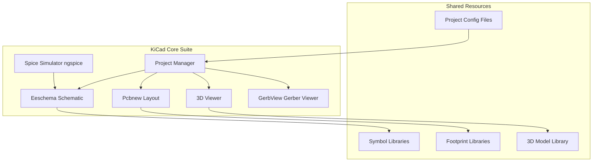
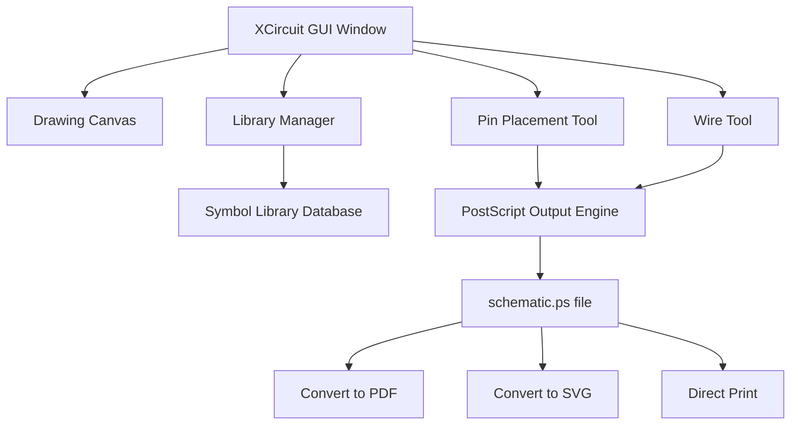
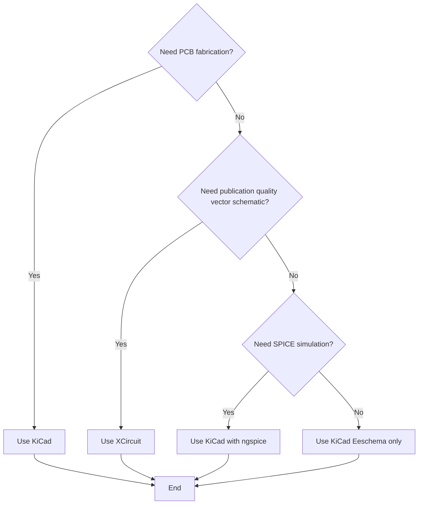
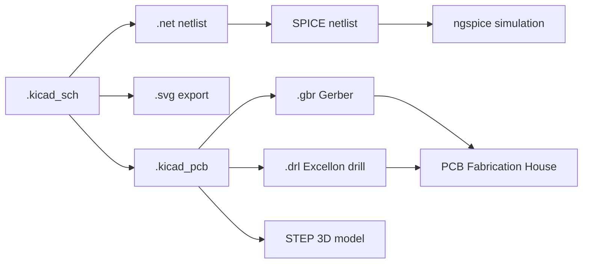

# Introduction to EDA tools (such as KiCad or XCircuit)

<!-- SECTION_1_START -->

# Introduction to EDA Tools (KiCad \& XCircuit)

## 1.1 Formal Academic Definition (KTU 2024 Syllabus Aligned)

> [!IMPORTANT]
> **Electronic Design Automation (EDA)** refers to the category of software tools used for designing, simulating, verifying, and fabricating electronic systems — ranging from simple analog circuits to complex multi-layer Printed Circuit Boards (PCBs) and Application-Specific Integrated Circuits (ASICs).

In the context of the KTU 2024 Scheme workshop module, the syllabus explicitly introduces students to two representative open-source EDA platforms:

* **KiCad** — A complete, open-source Electronic Design Automation suite developed by Jean-Pierre Charras, used for **schematic capture, SPICE-based simulation, PCB layout, and 3D mechanical visualization**.
* **XCircuit** — A specialized open-source schematic capture program developed at Johns Hopkins University, primarily used for **drawing publishable, publication-quality electrical schematics** with PostScript output.

> [!NOTE]
> **KTU 2024 Module 9 Learning Outcome:** After this module, the student must be able to *identify, install, navigate, and demonstrate a basic design flow* in at least one of the listed EDA tools, with emphasis on **schematic entry, netlist generation, and component library handling**.

---

## 1.2 Conceptual Analogy — The "Digital Engineering Workbench"

Imagine a civil engineer building a house. Before the first brick is laid, they need:
1. A **blueprint** (the schematic diagram)
2. A **3D walkthrough** to spot design issues (the simulation)
3. A **site plan** showing where pipes and wires go (the PCB layout)
4. A **scale model** to check real-world fit (the 3D viewer)

**EDA tools are exactly this workflow for electronic circuits.** Instead of drafting tables and T-squares, the modern engineer uses KiCad or XCircuit — the electronic equivalent of a fully stocked, digital drafting room.

| Civil Engineering | Electronic Equivalent | KiCad Module |
| :--- | :--- | :--- |
| Blueprint | Schematic Diagram | **Eeschema** |
| Stress / Load Test | Circuit Simulation | **ngspice / IBIS** |
| Site Plan (wiring) | PCB Tracks \& Vias | **Pcbnew** |
| 3D Scale Model | Mechanical Fit Check | **3D Viewer** |

> [!TIP]
> **Practical Tip for KTU Workshop:** Always remember the golden rule — *"No PCB is ever built from a hand-drawn circuit. Every professional board starts life inside an EDA tool."*

---

## 1.3 Physical Constants \& Standard Metrics

The following technical parameters and file formats are **industry standards** that every KTU student must recognize on sight:

> **Standard EDA File Extensions**
> * **`.kicad_pcb`** — KiCad native PCB layout file
> * **`.kicad_sch`** — KiCad native schematic file (post v5)
> * **`.sch`** — Legacy KiCad / XCircuit schematic file
> * **`.net`** — Netlist (connectivity description between components)
> * **`.ps` / `.eps`** — PostScript output (XCircuit's specialty)
> * **`.svg`** — Scalable Vector Graphics (modern interchange format)
> * **`.csv`** — Bill of Materials (BOM) export

The **standard design grid** in most EDA tools is **0.1 inch (2.54 mm)** — which corresponds to the standard **DIP (Dual In-line Package) pin pitch**. The secondary recommended grid is **0.05 inch (1.27 mm)** for fine-pitch SOIC components.

---

## 1.4 Visualization Control (Conceptual Schematic Flow)

> [!VISUALIZATION CONTROL]
> **Concept:** EDA Design Flow as a Sequential Function Pipeline
> **GeoGebra / Desmos Input Equations (Conceptual Mapping):**
> * Let $x$ = Schematic Stage, $y$ = Simulation Stage, $z$ = PCB Layout Stage
> * Linear pipeline: $f(x) \rightarrow g(y) \rightarrow h(z)$ where each function is a tool module
> **Visual Description:** A horizontal arrow chain where the *Schematic* sits on the left, *Simulation* in the middle, and *PCB Layout* on the right, with a feedback loop returning design errors from PCB back to Schematic for correction (iterative design cycle).

---

## 1.5 Why EDA Tools Are Non-Negotiable in Modern Engineering

> [!IMPORTANT]
> **Why this topic matters for your B.Tech career:**
> 1. The **global EDA market** is valued at over **USD 15 billion** (2024 estimate) and is dominated by three players — *Cadence, Synopsys, and Siemens EDA (formerly Mentor Graphics)*.
> 2. Open-source tools like **KiCad** have closed the gap for educational, hobbyist, and even commercial prototyping use cases.
> 3. **Every smartphone, laptop, and IoT device** you use today was designed using an EDA toolchain — making this a foundational skill for ECE, EEE, and CSE students alike.

<!-- SECTION_1_END -->

<!-- SECTION_2_START -->

# 2. Deep Theoretical Analysis \& KTU High-Yield Formula Sheet

## 2.1 The Five Pillars of an EDA Tool

A complete EDA toolchain — whether commercial (Cadence OrCAD) or open-source (KiCad, XCircuit) — must provide these five functional pillars. KTU expects students to identify and explain each.

### Pillar 1 — Schematic Capture
* The act of drawing the **logical circuit diagram** using standard electrical symbols (IEEE 315 / IEC 60617).
* Symbols are stored in **libraries** (e.g., `power.lib`, `transistor.lib`, `74xx.lib`).
* Each placed symbol is an **instance** referencing a library **part**.
* Output: A `.sch` or `.kicad_sch` file describing connectivity in the form of **nets** and **components**.

### Pillar 2 — Netlist Generation
* A **netlist** is a text-based, machine-readable description of the circuit.
* It lists every component and the **nodes (nets)** each component pin connects to.
* Acts as the **bridge** between schematic capture and simulation/PCB layout.
* Standard formats: **SPICE**, **EDIF**, **KiCad legacy netlist**, **Spectre**.

### Pillar 3 — Circuit Simulation
* Solves the governing equations of the circuit (Kirchhoff's laws, semiconductor device models).
* Common analyses: **DC Operating Point, AC Sweep, Transient, Monte Carlo, Fourier**.
* KiCad uses **ngspice** as the simulation engine.

### Pillar 4 — PCB Layout
* Translates the logical schematic into a **physical copper-track geometry** on a board substrate (usually **FR-4 fiberglass**).
* Concerns: **trace width, clearance, via stitching, copper pours, layer stack-up**.
* KiCad's PCB editor is called **Pcbnew**; it supports up to **32 copper layers** and **16 technical layers** in the latest version.

### Pillar 5 — Design Rule Check (DRC) \& Verification
* **DRC** automatically checks the layout against manufacturing constraints (minimum trace width, minimum drill size, clearance between nets).
* **Electrical Rule Check (ERC)** validates the schematic for unconnected pins, power conflicts, and un-driven inputs.
* The output of DRC is a **violation report** that the designer must iteratively resolve.

---

## 2.2 KTU High-Yield Formula Sheet — EDA Tool Concepts

> [!NOTE]
> The following table summarizes the **definitional facts, ratios, and key parameters** that frequently appear in KTU university exam questions. The notation uses `\vert` instead of `\vert` symbols to preserve table integrity.

| Concept / Symbol | Definition | Standard Value / Range | Engineering Use |
| :--- | :--- | :--- | :--- |
| **EDA** | Electronic Design Automation | Full software category | Industrial chip \& board design |
| **KiCad License** | Open-source EDA suite | **GNU GPL v3+** | Free for commercial use |
| **XCircuit License** | Open-source schematic tool | **GPL v2** | Academic publishing |
| **Schematic Grid** | Default snap-to grid in EDA | **2.54 mm** (0.1 inch) | Aligns with DIP pin pitch |
| **Sub-grid (KiCad)** | Finer snap for fine-pitch | **1.27 mm** (0.05 inch) | SOIC / QFP packages |
| **DRC Min Trace Width** | Smallest manufacturable track | **0.2 mm** (8 mil) typical | Standard PCB fab houses |
| **DRC Min Clearance** | Net-to-net spacing | **0.2 mm** typical | Prevents short circuits |
| **Via Drill Diameter** | Plated through-hole size | **0.3 mm – 0.6 mm** | Connects PCB layers |
| **Copper Weight** | PCB trace current capacity | **1 oz/ft² ≈ 35 µm thick** | Standard 1 oz copper |
| **BOM** | Bill of Materials export format | CSV / XML | Manufacturing \& sourcing |
| **Netlist Format** | Inter-tool connectivity file | SPICE / EDIF | Tool interoperability |
| **3D Viewer Engine** | KiCad's geometry renderer | **OpenCascade (OCCT)** | Mechanical clearance check |
| **SPICE Engine** | KiCad bundled simulator | **ngspice** | Analog / mixed-signal sim |

---

## 2.3 The Schematic-to-Silicon Design Pipeline (Theoretical Walkthrough)

The **standard EDA design flow** accepted across the industry and reproduced in KTU module-end questions is as follows:

1. **Specification** — Define inputs, outputs, voltage rails, frequency, power budget.
2. **Schematic Entry** — Draw the logical circuit in Eeschema (KiCad) or XCircuit.
3. **Electrical Rule Check (ERC)** — Detect unconnected pins, power-pin mismatches.
4. **Netlist Generation** — Export connectivity in SPICE / KiCad format.
5. **Simulation** — Verify functional behavior using ngspice.
6. **Footprint Assignment** — Map each schematic symbol to a **PCB footprint** (land pattern).
7. **PCB Layout** — Place components, route copper tracks in Pcbnew.
8. **Design Rule Check (DRC)** — Verify against fabrication constraints.
9. **Gerber File Export** — Generate manufacturing files (RS-274X standard).
10. **3D Visualization** — Verify mechanical fit with enclosure.
11. **Fabrication \& Assembly** — Send Gerber + drill files to PCB house.

> [!TIP]
> **KTU Exam Shortcut:** When asked to "explain the EDA design flow," always number the steps. Board examiners reward structured answers over prose dumps.

---

## 2.4 Real-World Engineering Utility

> [!IMPORTANT]
> **Where these tools are used in production today:**
> * **SpaceX** uses KiCad for early-stage prototype electronics on Falcon 9 avionics.
> * **Arduino** publishes its open-source reference designs in KiCad format.
> * **Research labs** use XCircuit to generate publication-quality schematic figures for IEEE / Springer papers.
> * **Indian PSUs (BEL, HAL, ISRO)** use a mix of commercial (OrCAD, Mentor) and open-source EDA tools in their training workflows.

<!-- SECTION_2_END -->

<!-- SECTION_3_START -->

# 3. Step-by-Step Derivations, Workflows \& Code Implementation

## 3.1 KiCad — Exhaustive Workflow Walkthrough

The KTU 2024 workshop module expects students to demonstrate competency in KiCad. Below is the **complete, end-to-end step-by-step procedure** to design a simple LED indicator circuit. No step is omitted.

### 3.1.1 Step 1 — Installation and Project Initialization

1. Download KiCad from the **official website** (kicad.org) — **always use the stable release**, not the testing branch.
2. On Windows, the installer bundles **KiCad, ngspice, and 3D libraries**.
3. Launch KiCad. The **Project Manager** window opens.
4. Click **File $\rightarrow$ New Project $\rightarrow$ New Folder with Project**.
5. Name the project `LED_Indicator` and choose a directory.

> The project manager now creates a **`.kicad_pro`** file — the master project descriptor.

### 3.1.2 Step 2 — Schematic Capture in Eeschema

1. Double-click the **schematic editor icon** in the project manager.
2. Save the schematic as `LED_Indicator.kicad_sch`.
3. Press the **'A' key** to open the **Add Symbol** dialog.
4. Type `LED` in the search box. Select the **LED** symbol from the `Device` library.
5. Place the LED on the sheet. Repeat to place a **resistor** (`R` from `Device` library).
6. Place a **battery symbol** (`Battery_Cell` from `power` library) rated at **5V**.
7. Press **'W'** to start wiring. Connect:
   * Battery positive $\rightarrow$ Resistor pin 1
   * Resistor pin 2 $\rightarrow$ LED anode
   * LED cathode $\rightarrow$ Battery negative
8. Add **net labels** (press **'L'**) to identify the **+5V** and **GND** nets.
9. Add a **PWR_FLAG** symbol to the +5V and GND nets — this silences ERC warnings.

> [!NOTE]
> **Why PWR_FLAG?** KiCad's ERC treats all power pins as "must connect to a power source." Without PWR_FLAG, the ERC will flag every power pin as an error, even though your circuit is correct.

### 3.1.3 Step 3 — Electrical Rule Check (ERC)

1. Click **Inspect $\rightarrow$ Electrical Rules Checker**.
2. Click **Run ERC**.
3. Examine the **Messages Panel** at the bottom. If there are no errors, proceed.
4. If errors exist, double-click the message to jump to the offending symbol or net.

### 3.1.4 Step 4 — Footprint Assignment

1. Click **Tools $\rightarrow$ Assign Footprints**.
2. The **Footprint Library Browser** opens.
3. For the resistor, search `0805` — select the **Resistor_SMD:R_0805_2012Metric** footprint.
4. For the LED, search `LED_0805` — select the **LED_SMD:LED_0805_2012Metric** footprint.
5. For the battery, search `BatteryHolder` — select **Battery:BatteryHolder_Keystone_3000_1x12mm**.
6. Click **Apply, Save Schematic \& Continue**.

> **Standard Footprint Size Reference (Imperial $\rightarrow$ Metric):**

| Imperial Code | Metric Code | Length $\times$ Width |
| :--- | :--- | :--- |
| 0201 | 0603Metric | $0.6 \times 0.3$ mm |
| 0402 | 1005Metric | $1.0 \times 0.5$ mm |
| 0603 | 1608Metric | $1.6 \times 0.8$ mm |
| 0805 | 2012Metric | $2.0 \times 1.2$ mm |
| 1206 | 3216Metric | $3.2 \times 1.6$ mm |

### 3.1.5 Step 5 — PCB Layout in Pcbnew

1. From the schematic, click **Tools $\rightarrow$ Update PCB from Schematic** (or press **F8**).
2. The footprints are imported onto the **Edge.Cuts** layer.
3. Switch to **Pcbnew**.
4. Define the **board outline** using the **Draw Rectangle** tool on the **Edge.Cuts** layer.
5. **Move** each footprint into the board outline.
6. Set the **track width** to **0.25 mm** (Design Rules $\rightarrow$ Net Classes).
7. Press **'X'** to start a track. Route from battery positive to resistor to LED to ground.
8. Add a **copper pour** (Place $\rightarrow$ Zone) on the back layer for ground.
9. Run **Inspect $\rightarrow$ Design Rules Checker** to verify no clearance violations.

### 3.1.6 Step 6 — Gerber Export for Manufacturing

1. Click **File $\rightarrow$ Fabrication Outputs $\rightarrow$ Gerbers (.gbr)**.
2. Select the layers: **F.Cu, B.Cu, F.SilkS, B.SilkS, F.Mask, B.Mask, Edge.Cuts**.
3. Use the **RS-274X** format with **4.6 format precision**.
4. Generate **Drill Files** (.drl) using the **Excellon** format.
5. Zip the Gerber folder and send to a PCB fabrication house (e.g., **JLCPCB, PCBWay, LionCircuits**).

---

## 3.2 XCircuit — Exhaustive Workflow Walkthrough

XCircuit is a **schematic-only** tool with exceptional **PostScript output** quality. KTU expects students to know when to choose XCircuit over KiCad.

### 3.2.1 Step 1 — Launch and Configuration

1. Install XCircuit from the official source (jhu.edu/~jive/).
2. Launch the binary `xcircuit`.
3. The default page size is **US Letter**; change to **A4** via **File $\rightarrow$ Page Setup**.
4. Set the **default grid** to **0.1 inch** (2.54 mm) under **Window $\rightarrow$ Grid**.

### 3.2.2 Step 2 — Library Navigation

1. Open the **library window** by pressing **'L'**.
2. Browse the available libraries: `analog`, `digital`, `passives`, `connectors`.
3. Search for the **`resistor`** symbol. Click **Insert** to place it.

### 3.2.3 Step 3 — Drawing the Schematic

1. Place a **resistor** at the origin (0, 0).
2. Use the **'P' (Place)** tool to add pins on either side of the resistor body.
3. Add an **LED** from the `optical` library.
4. Add a **voltage source** from the `sources` library.
5. Use the **'W' (Wire)** tool to connect pins.

### 3.2.4 Step 4 — Output Generation

1. Press **'F'** to render the schematic in **PostScript format**.
2. The output is `schematic.ps` — a **vector file** that scales to any size without loss of quality.
3. Convert to PDF using Ghostscript: `ps2pdf schematic.ps`.
4. Use in LaTeX, Word, or Inkscape.

> [!TIP]
> **Why XCircuit is preferred for academic papers:** PostScript output is **vector** — it remains crisp at any zoom level, unlike screenshots (raster) which become pixelated.

---

## 3.3 Python Code Implementation — KiCad Scripting Interface

KiCad provides a **Python API** for automation. The following Python script (run inside KiCad's **Scripting Console** under **Tools $\rightarrow$ Scripting**) demonstrates programmatic component placement.

```python
import pcbnew
import os

# Load the currently open board
board = pcbnew.GetBoard()

# Get or create a footprint library
footprint_lib_path = os.path.join(
    pcbnew.GetKicadConfigPath(), "footprints.pretty"
)

# Add a 0805 resistor at position (100mm, 50mm)
fp = pcbnew.FootprintLoad(footprint_lib_path, "Resistor_SMD:R_0805_2012Metric")
fp.SetReference("R1")
fp.SetValue("10k")
fp.SetPosition(pcbnew.wxPointMM(100, 50))
fp.SetOrientation(0)

# Add the footprint to the board
board.Add(fp)

# Refresh the board view
pcbnew.Refresh()

# Save the board
pcbnew.SaveBoard("/tmp/auto_design.kicad_pcb", board)
print("Footprint R1 placed successfully at (100mm, 50mm)")
```

> **Line-by-Line Logic:**
> * `import pcbnew` — Loads KiCad's PCB SWIG bindings.
> * `pcbnew.GetBoard()` — Returns a handle to the active PCB document.
> * `FootprintLoad(...)` — Loads a footprint definition from disk.
> * `SetReference / SetValue` — Assigns the silkscreen reference designator and value.
> * `SetPosition(wxPointMM(...))` — Places the footprint at a 2D coordinate.
> * `board.Add(fp)` — Commits the footprint to the board file.
> * `pcbnew.Refresh()` — Triggers a re-paint of the PCB editor view.

---

## 3.4 Hardware/Software Tool Profile (Workshop Lab Setup)

| Item | Specification | Purpose |
| :--- | :--- | :--- |
| **PC Operating System** | Windows 10/11, Ubuntu 22.04+, macOS 13+ | Host for EDA tool |
| **Minimum RAM** | **8 GB** (16 GB recommended) | Handles large PCB designs |
| **Minimum Disk Space** | **10 GB** (KiCad + libraries) | Tool installation |
| **GPU** | OpenGL 2.1+ compatible | 3D viewer acceleration |
| **Screen Resolution** | **1920 $\times$ 1080** minimum | Workspace visibility |
| **Mouse** | 3-button mouse with scroll wheel | Pan / Zoom navigation |
| **Auxiliary Tool** | **Git** (version control) | Track schematic revisions |
| **Auxiliary Tool** | **Inkscape** | Edit exported SVG schematics |
| **Auxiliary Tool** | **ngspice** (bundled) | Circuit simulation engine |
| **Documentation** | KiCad Manual (PDF, ~500 pages) | Reference during lab |

---

## 3.5 Boundary Safety Conditions

> [!WARNING]
> **KTU Workshop Safety Callout:**
> * **Never** connect a powered USB hub to the PC while KiCad is running — the surge can corrupt unsaved project files.
> * **Always** enable **auto-save** (Preferences $\rightarrow$ Common $\rightarrow$ Auto-save interval = 5 min) — sudden power loss during lab exams has caused many students to lose their work.
> * **Always** keep a **Git repository** of your project folder. The standard command is `git init && git add . && git commit -m "initial schematic"`.

<!-- SECTION_3_END -->

<!-- SECTION_4_START -->

# 4. Structural Diagrams \& Schematics

## 4.1 Master EDA Design Flow (Mermaid Pipeline)


> **Reading Guide:** The **solid arrows** show the forward design progression. The **dotted arrows** show the **iterative feedback loops** — when ERC fails, you return to schematic capture; when DRC fails, you return to PCB layout.

## 4.2 KiCad Software Architecture (Mermaid Block Diagram)



## 4.3 XCircuit Tool Architecture (Mermaid Block Diagram)



## 4.4 Decision Flow — When to Use KiCad vs XCircuit



## 4.5 File Format Conversion Architecture



<!-- SECTION_4_END -->

<!-- SECTION_5_START -->

# 5. KTU 2024 Scheme Examination Question Bank \& Topic Recap

## 5.1 Part A — Short Answer Questions (3 Marks Each)

> **Q1.** *[KTU University Exam — July 2024]* **Define the term EDA. List any two open-source EDA tools.**
>
> **Model Answer (3 Marks):**
> * **Electronic Design Automation (EDA)** is the use of computer software tools to design, simulate, verify, and fabricate electronic systems such as integrated circuits and printed circuit boards. **[1 Mark]**
> * Two open-source EDA tools are: **[1 Mark]**
>   1. **KiCad** — full EDA suite (schematic + PCB + 3D + simulation).
>   2. **XCircuit** — schematic capture with PostScript output.
> * EDA tools eliminate manual drafting, reduce human error, and enable automated **DRC/ERC** verification. **[1 Mark]**

> **Q2.** *[KTU University Exam — Dec 2023]* **What is a netlist? Why is it important in EDA design flow?**
>
> **Model Answer (3 Marks):**
> * A **netlist** is a text-based, machine-readable description of all components in a schematic and the electrical **nets (nodes)** that connect their pins. **[1 Mark]**
> * It is generated by the schematic editor and acts as the **bridge** between schematic capture and downstream tools (SPICE simulator, PCB layout, BOM generator). **[1 Mark]**
> * Common netlist formats include **SPICE**, **EDIF**, and **KiCad legacy netlist**. **[1 Mark]**

---

## 5.2 Part B — Long Answer Questions (14 Marks Each)

### Question A (14 Marks) — KiCad-Focused

> **Q3(a).** *[KTU University Exam — July 2024]* **With a neat block diagram, explain the major modules of the KiCad EDA suite.** **(7 Marks)**
>
> **Model Answer — Step-by-Step:**
>
> | Module | Function | Marks |
> | :--- | :--- | :--- |
> | **Project Manager** | Central hub that launches all other modules; tracks project files. | **[1 Mark]** |
> | **Eeschema (Schematic Editor)** | Used to draw the logical circuit using standard electrical symbols; performs **ERC**. | **[2 Marks]** |
> | **Pcbnew (PCB Editor)** | Used for physical board layout, copper track routing, copper pours, and **DRC** verification. | **[2 Marks]** |
> | **3D Viewer** | Renders the PCB in 3D using **OpenCascade** to verify mechanical clearance with enclosures. | **[1 Mark]** |
> | **GerbView** | Displays the exported Gerber and drill files before sending to manufacturing. | **[1 Mark]**
>
> **Block Diagram:** Refer to **Section 4.2** of these notes for the complete KiCad architecture diagram. **[Bonus understanding]**

> **Q3(b).** *[KTU University Exam — Dec 2023]* **List and explain the steps involved in the EDA design flow from schematic to fabrication.** **(7 Marks)**
>
> **Model Answer — Step-by-Step with Valuation Key:**
>
> 1. **Schematic Capture** — The logical circuit is drawn in Eeschema using library symbols. *[1 Mark]*
> 2. **Electrical Rule Check (ERC)** — Eeschema verifies that all power pins are driven and no nets are floating. *[1 Mark]*
> 3. **Netlist Generation** — The connectivity is exported to a `.net` file. *[1 Mark]*
> 4. **Footprint Assignment** — Each schematic symbol is mapped to a physical PCB footprint (land pattern). *[1 Mark]*
> 5. **PCB Layout** — Footprints are placed inside the board outline and copper tracks are routed in Pcbnew. *[1 Mark]*
> 6. **Design Rule Check (DRC)** — Pcbnew validates the layout against manufacturing constraints (trace width, clearance, via size). *[1 Mark]*
> 7. **Gerber Export and Fabrication** — Manufacturing files (RS-274X Gerber + Excellon drill) are generated and sent to a PCB house. *[1 Mark]*

---

### Question B (14 Marks) — XCircuit \& Comparison-Focused

> **Q4(a).** *[KTU University Exam — July 2024]* **Explain the features and applications of XCircuit as an EDA tool.** **(7 Marks)**
>
> **Model Answer — Step-by-Step:**
>
> 1. **XCircuit** is an open-source schematic capture program released under the **GPL v2** license, developed at **Johns Hopkins University**. *[1 Mark]*
> 2. Its **primary specialty** is generating **publication-quality vector schematics** in **PostScript** (`.ps`) format, which can be converted to **PDF** or **SVG** for academic papers. *[2 Marks]*
> 3. It includes a **library manager** with predefined analog, digital, passive, and connector symbols. *[1 Mark]*
> 4. The output remains **crisp at any zoom level** because it is vector-based, unlike raster screenshots. *[1 Mark]*
> 5. **Application areas:** academic IEEE / Springer paper figure preparation, textbook illustrations, lab manual diagrams, and quick circuit documentation. *[1 Mark]*
> 6. **Limitation:** XCircuit does **not** support PCB layout or SPICE simulation natively — it is a **schematic-only** tool. *[1 Mark]*

> **Q4(b).** *[KTU University Exam — Dec 2023]* **Compare KiCad and XCircuit based on (i) PCB layout support, (ii) simulation support, (iii) output format, and (iv) primary use case.** **(7 Marks)**
>
> **Model Answer — Tabular Comparison (Board-Exam Style):**
>
> | Comparison Parameter | KiCad | XCircuit | Marks |
> | :--- | :--- | :--- | :--- |
> | **(i) PCB Layout Support** | Full PCB layout via **Pcbnew** with 32-layer support | **Not supported** — schematic only | **[2 Marks]** |
> | **(ii) Simulation Support** | **SPICE** simulation via bundled **ngspice** | Not supported | **[2 Marks]** |
> | **(iii) Output Format** | Gerber (`.gbr`), Excellon (`.drl`), STEP 3D, PDF, SVG | **PostScript** (`.ps`), PDF, SVG | **[2 Marks]** |
> | **(iv) Primary Use Case** | End-to-end PCB prototyping and commercial fabrication | Publication-quality academic schematics | **[1 Mark]** |

---

## 5.3 KTU Examiner's Valuation Warning / Pitfall Callout

> [!WARNING]
> **Common Mistakes That Cost Marks in Module 9 (EDA Tools):**
> 1. **Writing "KiCad is a paid software"** — WRONG. KiCad is **100\% free and open-source** under **GNU GPL v3+**. Examiners deduct 1 mark for this error.
> 2. **Confusing ERC with DRC** — *ERC* runs on the **schematic** for electrical errors; *DRC* runs on the **PCB layout** for fabrication errors. Mixing them up is a common deduction point.
> 3. **Forgetting PWR_FLAG in KiCad schematics** — Board examiners specifically look for it when grading ERC questions. If you draw a circuit with a battery but no PWR_FLAG, you lose the "complete netlist" mark.
> 4. **Using the wrong grid** — Students often draw ICs on a 1.27 mm grid instead of the standard 2.54 mm, causing pin misalignment in PCB layout. Always start with the **2.54 mm grid**.
> 5. **Omitting the version of KiCad** — When asked about features, mention the **v8.0 or later** modern features (`.kicad_sch` format) to demonstrate updated syllabus awareness.

---

## 5.4 Topic Recap \& Important Things to Remember

> [!IMPORTANT]
> **Rapid-Revision Checklist — Module 9: Introduction to EDA Tools**

* **EDA** = Electronic Design Automation — software for designing, simulating, and fabricating electronic circuits.
* The two open-source EDA tools introduced by the KTU 2024 syllabus are **KiCad** and **XCircuit**.
* **KiCad** is a **full EDA suite** with five major modules: *Project Manager, Eeschema, Pcbnew, 3D Viewer, GerbView*.
* **XCircuit** is a **schematic-only** tool specialized for **PostScript vector output** used in academic publishing.
* The standard schematic **grid spacing** is **2.54 mm (0.1 inch)**, matching the DIP IC pin pitch.
* The **netlist** is the bridge file between schematic capture and simulation/PCB layout.
* **ERC** (Electrical Rule Check) operates on the schematic; **DRC** (Design Rule Check) operates on the PCB layout.
* KiCad's **SPICE simulator** is **ngspice**; its **3D engine** is **OpenCascade**.
* **Gerber files** (RS-274X format) and **Excellon drill files** are the manufacturing outputs sent to a PCB fabrication house.
* **Standard PCB stack-up** uses **FR-4 substrate** with **1 oz/ft² copper** (35 µm thickness).
* **Standard SMD footprint sizes** to memorize: 0402, 0603, 0805, 1206 (imperial codes).
* **PWR_FLAG** is a KiCad symbol that must be placed on every power net to silence false ERC warnings.
* **KiCad's file extension** for the modern schematic is **`.kicad_sch`**, and for PCB is **`.kicad_pcb`**.
* The **iterative design cycle** always flows as: *Schematic $\rightarrow$ ERC $\rightarrow$ Netlist $\rightarrow$ PCB $\rightarrow$ DRC $\rightarrow$ Gerber*, with feedback loops back to earlier stages on failure.
* **Open-source license** of KiCad allows **commercial use** without royalty — a major industrial advantage.

<!-- SECTION_5_END -->
