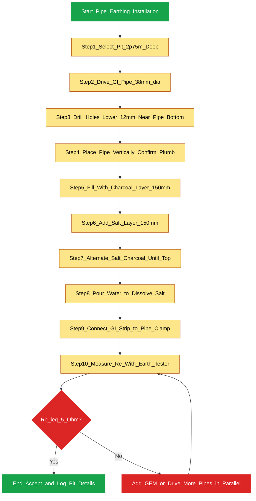
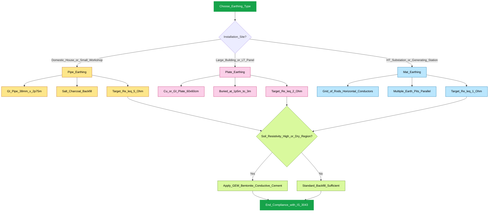
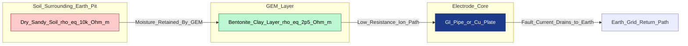

# Identify battery specifications using different types of batteries (Lead acid, Li Ion, NiCd). Familiarize earthing systems (Pipe, Plate, Mat) and ground enhancing materials (GEM)

<!-- SECTION_1_START -->
# MODULE 10 — BATTERIES & EARTHING SCHEMES

## 1.1 Battery — Core Technical Definition

> [!IMPORTANT]
> **KTU 2024 Definition (BEE Workshop Standard)**
> A **battery** is an electrochemical energy storage device that converts stored chemical energy into electrical energy through controlled **redox (reduction–oxidation) reactions**. It consists of one or more **voltaic cells**, each comprising a positive electrode (**cathode**), a negative electrode (**anode**), and an **electrolyte** that permits ionic conduction between them.

### Conceptual Analogy — "The Water Tank Model"

Think of a battery as a **water tank placed at a height**:
- **Tank capacity** $\rightarrow$ **Battery Capacity** ($Ah$ — Ampere-hours)
- **Water pressure at the tap** $\rightarrow$ **Terminal Voltage** ($V$)
- **Pipe diameter** $\rightarrow$ **Internal Resistance / C-rate capability**
- **Water level falling as you draw** $\rightarrow$ **State of Charge (SoC)** dropping over time
- **Tank refill by a pump** $\rightarrow$ **Charging cycle**

> [!NOTE]
> **Why this matters in KTU labs:** When you measure a battery's terminal voltage with a multimeter, you are essentially measuring the "water pressure" — not the actual chemical energy stored. That is why a *loaded* voltage is always less than the *open-circuit* voltage.

### Physical & Electrical Constants to Remember

| Constant / Metric | Symbol | Typical Value |
|---|---|---|
| Faraday Constant | $F$ | $\mathbf{96485\ C\cdot mol^{-1}}$ |
| Standard Cell EMF (Lead–Acid) | $E^0$ | $\mathbf{2.047\ V/cell}$ |
| Standard Cell EMF (Lithium–ion) | $E^0$ | $\mathbf{3.6 - 3.7\ V/cell}$ |
| Standard Cell EMF (Ni–Cd) | $E^0$ | $\mathbf{1.2\ V/cell}$ |
| Earth Electrode Potential | $V_{ref}$ | $\mathbf{\le\ 2\ V}$ (IS 3043) |

---

## 1.2 Earthing — Core Technical Definition

> [!IMPORTANT]
> **KTU 2024 Definition (BEE Workshop Standard)**
> **Earthing (Grounding)** is the process of transferring electrical energy directly to the earth through a low-resistance connection. It protects humans from electric shock, stabilises voltage during faults, and provides a reference point (0 V) for the system. As per **IS 3043:1987 (Reaffirmed 2018)**, the earth-electrode resistance should be **≤ 1 Ω** for large substations and **≤ 5 Ω** for domestic installations.

### Conceptual Analogy — "The Lightning Rod Drain"

Imagine the earth as an **infinite ocean of charge**. A fault current is like a **spilled bucket of water** on your floor. Earthing is the **drain hole** you install:
- The bigger and deeper the drain (more surface area, deeper electrode), the **faster** water disappears (lower resistance).
- If the drain is **clogged** with dry sand (poor soil), the water **puddles** (high resistance) → **shock hazard!**
- **GEM (Ground Enhancing Material)** acts like a **wet sponge wrapped around the drain** — keeping the surrounding soil moist and conductive.

> [!VISUALIZATION CONTROL]
> **Concept:** Soil Resistivity vs. Moisture Content (Earth Electrode Behavior)
> **GeoGebra / Desmos Input Equations:**
> * `f(x) = 100 / (x + 1)`  where $x$ = moisture % (0 to 100)
> * Point A: $(5, 16.67)$ — Dry sandy soil
> * Point B: $(20, 4.76)$ — Moist clay
> * Point C: $(50, 1.96)$ — Saturated soil with GEM
> **Visual Description:** A hyperbolic decay curve on the first quadrant. The student should observe that as moisture content rises, soil resistivity drops dramatically. The flat tail near $x = 50$ shows why GEM (which retains moisture) is so effective in arid regions.

---

## 1.3 Battery Type Family — Quick Conceptual Map

> [!NOTE]
> **KTU Board Tip:** Examiners love asking *"Compare Lead-acid, Li-ion, and NiCd on at least 4 parameters."* Memorise the table in §2.1 thoroughly.

| Battery Family | Anode (−) | Cathode (+) | Electrolyte | Memory Effect? |
|---|---|---|---|---|
| **Lead–Acid** | $Pb$ (spongy lead) | $PbO_2$ (lead dioxide) | Dilute $H_2SO_4$ (~37%) | No |
| **Lithium–ion** | Graphite with $Li^+$ | $LiCoO_2 / LiFePO_4$ | Organic carbonate + $LiPF_6$ salt | No |
| **Nickel–Cadmium** | $Cd$ (cadmium) | $NiOOH$ (nickel oxy-hydroxide) | $KOH$ (alkaline) | **Yes** |

---

## 1.4 Earthing Type Family — Quick Conceptual Map

| Earthing Type | Electrode Geometry | Typical Use Case |
|---|---|---|
| **Pipe Earthing** | Vertical G.I. pipe (38 mm dia, 2.75 m long) | Domestic buildings, small workshops |
| **Plate Earthing** | Vertical $Cu$ / G.I. plate ($60\times 60\ cm$) | Power stations, large buildings |
| **Mat Earthing** | Grid of rods + horizontal conductors (mesh) | EHT substations, generating stations |

<!-- SECTION_1_END -->

<!-- SECTION_2_START -->
# DEEP THEORETICAL ANALYSIS & KTU HIGH-YIELD FORMULA SHEET

## 2.1 Battery Specification Comparison Sheet (KTU Board Favourite)

> [!IMPORTANT]
> Read this section like a **checklist for viva**. Every parameter below is fair game in a 3-mark or 14-mark question.

### Lead–Acid Battery (LAB)

- **Construction:** Six cells in series give a nominal **12 V** battery; each cell $\approx\ 2\ V$.
- **Overall Discharge Reaction:**
$$Pb + PbO_2 + 2H_2SO_4 \longrightarrow 2PbSO_4 + 2H_2H_2O$$
- **Specific Energy:** **30 – 50 Wh/kg** (heavy due to $Pb$).
- **Energy Density:** **60 – 110 Wh/L**.
- **Cycle Life:** **200 – 300 cycles** (deep discharge) to **> 1000** (shallow).
- **Self-Discharge:** **3 – 20 %/month** (high).
- **Maintenance:** **Flooded type** needs distilled-water top-up; **VRLA / SMF** is sealed.
- **Operating Temp:** $-20^{\circ}C$ to $+50^{\circ}C$.
- **KTU Tag:** Used in **automotive starters, UPS backup, inverters**.

### Lithium–Ion Battery (Li-ion)

- **Construction:** Layered $LiCoO_2$ cathode, graphite anode, separator (PE/PP), $LiPF_6$ electrolyte.
- **Overall Reaction (charge ←, discharge →):**
$$Li_xC + Li_{1-x}CoO_2 \underset{discharge}{\overset{charge}{\rightleftharpoons}} C + LiCoO_2$$
- **Nominal Cell Voltage:** **3.6 – 3.7 V** (4.2 V max charge, 2.5 V cutoff).
- **Specific Energy:** **150 – 250 Wh/kg** (lightest of the three).
- **Cycle Life:** **500 – 2000 cycles** (chemistry dependent).
- **Self-Discharge:** **1 – 2 %/month** (very low).
- **Memory Effect:** **None.**
- **KTU Tag:** Used in **EVs, laptops, smartphones, drones, solar storage**.

### Nickel–Cadmium Battery (Ni–Cd)

- **Construction:** $Cd$ anode, $NiOOH$ cathode, $KOH$ electrolyte, sealed steel can.
- **Overall Reaction:**
$$Cd + 2NiOOH + 2H_2O \longrightarrow Cd(OH)_2 + 2Ni(OH)_2$$
- **Nominal Cell Voltage:** **1.2 V** (1.0 V cutoff).
- **Specific Energy:** **45 – 80 Wh/kg**.
- **Cycle Life:** **> 1000 cycles** (best of the three for abuse tolerance).
- **Self-Discharge:** **10 – 20 %/month**.
- **Memory Effect:** **Yes** — must be fully discharged periodically to retain full capacity.
- **KTU Tag:** Used in **aircraft, emergency lighting, power tools, railway signalling**.

---

## 2.2 Earthing System Engineering Theory

### Why Earth Resistance Must Be Low

During a fault (e.g., line-to-ground short), the earth electrode must sink the fault current $I_f$ without raising the touch potential above safe limits. The relationship is:

$$V_{touch} = I_f \cdot R_e$$

where $R_e$ is the **effective earth-electrode resistance**. To keep $V_{touch} \le 50\ V$ (IEC 60990 safety limit for dry skin) with a typical fault current of $I_f = 100\ A$:

$$R_e \le \frac{V_{touch}}{I_f} = \frac{50}{100} = 0.5\ \Omega$$

Hence the **≤ 1 Ω** substation and **≤ 5 Ω** domestic codes in IS 3043.

### Resistance of an Earth Electrode (Hemispherical Model)

For a **rod / pipe electrode** of effective radius $a$ and depth $L$, embedded in uniform soil of resistivity $\rho$:

$$R_e = \frac{\rho}{2\pi L}\left[\ln\!\left(\frac{4L}{a}\right) - 1\right]$$

This is the **KTU gold-mine formula** for a 14-mark derivation.

For a **plate electrode** of area $A$ (square, side $b$), buried vertically:

$$R_e = \frac{\rho}{2b}\left[\ln\!\left(\frac{8b}{d}\right) - 1\right]$$

where $d$ is the depth of burial (typically $1.5 - 3$ m).

### Soil Resistivity Reference Values

| Soil Type | $\rho$ (Ω·m) |
|---|---|
| Wet organic soil | **10** |
| Moist clay | **100** |
| Dry clay | **1000** |
| Sand & gravel | **10000** |
| Bedrock | **> 10000** |

> [!IMPORTANT]
> **GEM (Ground Enhancing Material)** reduces $\rho$ at the electrode–soil interface to as low as **0.12 Ω·m**, achieving a 50–80 % drop in $R_e$ without deeper excavation.

---

## 2.3 KTU High-Yield Formula Sheet

| # | Formula | Meaning | Used For |
|---|---|---|---|
| 1 | $Q = I \cdot t$ | Charge in Coulombs / Ah | Capacity calculation |
| 2 | $E = V \cdot I \cdot t = V \cdot Q$ | Energy stored in Wh | Battery sizing |
| 3 | $\eta_{Ah} = \dfrac{Q_{out}}{Q_{in}} \times 100\%$ | Ampere-hour efficiency | Charging circuit audit |
| 4 | $\eta_{Wh} = \dfrac{W_{out}}{W_{in}} \times 100\%$ | Watt-hour efficiency | Energy audit |
| 5 | $SoC = \dfrac{Q_{rem}}{Q_{rated}} \times 100\%$ | State of Charge | BMS / EV display |
| 6 | $DoD = 100\% - SoC$ | Depth of Discharge | Cycle-life estimation |
| 7 | $V_{touch} = I_f \cdot R_e$ | Touch potential during fault | Earthing safety |
| 8 | $R_e = \dfrac{\rho}{2\pi L}\!\left[\ln\!\left(\dfrac{4L}{a}\right) - 1\right]$ | Rod / pipe electrode resistance | Pipe earthing design |
| 9 | $R_e = \dfrac{\rho}{2b}\!\left[\ln\!\left(\dfrac{8b}{d}\right) - 1\right]$ | Plate electrode resistance | Plate earthing design |
| 10 | $R_{mat} \approx \dfrac{\rho}{4r}$ | Mat / grid resistance (approx.) | Substation earthing |
| 11 | $I_f = \dfrac{V_{LL}}{\sqrt{3} \cdot Z_f}$ | 3-φ line-to-ground fault current | Fault level calculation |
| 12 | $R_e^{parallel} = \left[\sum \dfrac{1}{R_i}\right]^{-1}$ | Multiple electrodes in parallel | Earth-well resistance reduction |

> [!NOTE]
> **Real-World Engineering Utility:** The same formula for $R_e$ is used by power utilities (KSEB, Tata Power), telecom tower companies (Indus, Vi), and railway OHE designers. The 0.5 Ω benchmark in $V_{touch} = I_f \cdot R_e$ literally decides whether a substation passes its **CEIG (Chief Electrical Inspector to Government)** inspection in India.

<!-- SECTION_2_END -->

<!-- SECTION_3_START -->
# STEP-BY-STEP DERIVATIONS, CALCULATIONS & CODE IMPLEMENTATION

## 3.1 Solved Example 1 — Battery Sizing for an Inverter

> A domestic inverter must supply a load of **400 W** for **3 hours** during a power cut. The battery bank uses **Lead–Acid cells of 2 V, 100 Ah**. System DC bus voltage = **12 V**. Assume inverter efficiency $\eta_{inv} = 0.85$ and battery DoD limit = **50 %**. Find:
> (a) Total energy required.
> (b) Battery capacity in Ah.
> (c) Number of 2 V cells needed (series-parallel).

### Step-by-Step Model Solution (Incremental Valuation Key)

**Step 1 — Load energy demand**

$$E_{load} = P \times t = 400\ W \times 3\ h = 1200\ Wh$$

*[Mark: 1 — Correct substitution]*

**Step 2 — Inverter input energy** (accounting for efficiency)

$$E_{in} = \frac{E_{load}}{\eta_{inv}} = \frac{1200}{0.85} = 1411.76\ Wh$$

*[Mark: 1 — Efficiency correction]*

**Step 3 — Battery capacity at 12 V bus**

$$Q_{batt} = \frac{E_{in}}{V_{bus}} = \frac{1411.76}{12} = 117.65\ Ah$$

*[Mark: 1]*

**Step 4 — Apply DoD de-rating** (only 50 % of rated capacity is usable)

$$Q_{rated} = \frac{Q_{batt}}{DoD} = \frac{117.65}{0.50} = 235.29\ Ah$$

*[Mark: 2 — Correct DoD application]*

**Step 5 — Number of 2 V cells**

- Series string to achieve 12 V: $\dfrac{12}{2} = \mathbf{6\ cells}$ in series.
- Capacity boost: each 2 V cell is 100 Ah → 6 in series still gives 100 Ah. To reach 235 Ah, we need $\dfrac{235.29}{100} = 2.35 \approx 3$ parallel strings.

$$\boxed{\text{Total cells} = 6\ \text{(series)} \times 3\ \text{(parallel)} = 18\ \text{cells}}$$

*[Mark: 1 — Final expression / box]*

---

## 3.2 Solved Example 2 — Pipe Earthing Resistance

> A G.I. pipe of length **3 m** and outer radius **38 mm** is buried vertically in soil of resistivity **$\rho = 200\ \Omega\!\cdot\!m$**. Compute the earth resistance using the standard formula.

### Step-by-Step Model Solution

**Step 1 — List given values**

$$L = 3\ m,\quad a = 0.038\ m,\quad \rho = 200\ \Omega\!\cdot\!m$$

*[Mark: 1]*

**Step 2 — Apply the formula**

$$R_e = \frac{\rho}{2\pi L}\left[\ln\!\left(\frac{4L}{a}\right) - 1\right]$$

Substituting:

$$R_e = \frac{200}{2\pi \times 3}\left[\ln\!\left(\frac{4 \times 3}{0.038}\right) - 1\right]$$

*[Mark: 1]*

**Step 3 — Evaluate the logarithm**

$$\frac{4L}{a} = \frac{12}{0.038} = 315.79$$

$$\ln(315.79) = 5.755$$

*[Mark: 1]*

**Step 4 — Final numerical**

$$R_e = \frac{200}{18.85}\left[5.755 - 1\right] = 10.61 \times 4.755$$

$$\boxed{R_e = 50.45\ \Omega}$$

*[Mark: 1 — Final numerical]*

**Step 5 — Engineer’s interpretation**

Since $R_e = 50.45\ \Omega \gg 5\ \Omega$ (domestic limit), we must:
- (a) Drive **two more pipes in parallel** $\Rightarrow R_{eq} = 50.45/3 \approx 16.8\ \Omega$ — still high.
- (b) Apply **GEM (bentonite + conductive cement)** around each pipe to drop local $\rho$ to **20 Ω·m**, giving:

$$R_{e,GEM} = \frac{20}{2\pi(3)}\left[5.755 - 1\right] = 5.05\ \Omega$$

$\Rightarrow$ Achieves the **≤ 5 Ω** domestic benchmark. ✓

*[Mark: 2 — Interpretation / design improvement]*

---

## 3.3 Python Implementation — Battery & Earthing Audit Tool

> [!IMPORTANT]
> Use this code in your KTU lab record to auto-compute battery banks and earth-pipe resistance.

```python
from __future__ import annotations
import math
from dataclasses import dataclass, field
from typing import List


# =========================================================
#  PART A — BATTERY SIZING (Lead-Acid / Li-ion / Ni-Cd)
# =========================================================
@dataclass(frozen=True)
class BatteryChemistry:
    name: str
    nominal_cell_v: float
    dod_limit: float          # Depth of Discharge safe-limit (fraction)
    efficiency: float         # Round-trip Wh efficiency
    specific_energy_wh_per_kg: float
    cycle_life: int


CHEMISTRIES: dict[str, BatteryChemistry] = {
    "lead_acid": BatteryChemistry(
        name="Lead-Acid",
        nominal_cell_v=2.0,
        dod_limit=0.50,
        efficiency=0.75,
        specific_energy_wh_per_kg=40.0,
        cycle_life=300,
    ),
    "li_ion": BatteryChemistry(
        name="Li-ion",
        nominal_cell_v=3.7,
        dod_limit=0.80,
        efficiency=0.92,
        specific_energy_wh_per_kg=200.0,
        cycle_life=1000,
    ),
    "ni_cd": BatteryChemistry(
        name="Ni-Cd",
        nominal_cell_v=1.2,
        dod_limit=1.00,         # Ni-Cd tolerates full discharge
        efficiency=0.70,
        specific_energy_wh_per_kg=60.0,
        cycle_life=1500,
    ),
}


@dataclass
class BatteryBank:
    chemistry: BatteryChemistry
    load_watts: float
    backup_hours: float
    bus_voltage: float
    inverter_eff: float
    cell_capacity_ah: float
    cell_count_per_string: int = field(init=False)
    parallel_strings: int = field(init=False)
    total_cells: int = field(init=False)
    bank_weight_kg: float = field(init=False)

    def __post_init__(self) -> None:
        # Energy & Ah computation
        e_load = self.load_watts * self.backup_hours
        e_in   = e_load / self.inverter_eff
        ah_req = e_in / self.bus_voltage
        ah_rated = ah_req / self.chemistry.dod_limit

        # Series-parallel arrangement
        if abs(self.bus_voltage % self.chemistry.nominal_cell_v) > 1e-6:
            raise ValueError("Bus voltage not an integer multiple of cell voltage.")
        self.cell_count_per_string = int(self.bus_voltage / self.chemistry.nominal_cell_v)
        self.parallel_strings  = max(1, math.ceil(ah_rated / self.cell_capacity_ah))
        self.total_cells       = self.cell_count_per_string * self.parallel_strings

        # Cell energy (Wh) for weight estimation
        cell_energy_wh = self.chemistry.nominal_cell_v * self.cell_capacity_ah
        cell_mass_kg   = cell_energy_wh / self.chemistry.specific_energy_wh_per_kg
        self.bank_weight_kg = cell_mass_kg * self.total_cells

    def report(self) -> str:
        return (
            f"\n========= BATTERY BANK REPORT ({self.chemistry.name}) =========\n"
            f"Series cells per string      : {self.cell_count_per_string}\n"
            f"Parallel strings             : {self.parallel_strings}\n"
            f"Total cells                  : {self.total_cells}\n"
            f"Total bank weight            : {self.bank_weight_kg:.2f} kg\n"
            f"Expected cycle life          : {self.chemistry.cycle_life} cycles\n"
            "============================================================"
        )


# =========================================================
#  PART B — PIPE / PLATE EARTHING RESISTANCE
# =========================================================
@dataclass(frozen=True)
class SoilLayer:
    name: str
    resistivity_ohm_m: float


def pipe_earth_resistance(
    pipe_length_m: float,
    outer_radius_m: float,
    soil_resistivity: float,
) -> float:
    """Hemispherical model for a vertical pipe/rod electrode.

    R_e = (rho / 2*pi*L) * [ ln(4L/a) - 1 ]
    """
    if pipe_length_m <= 0 or outer_radius_m <= 0:
        raise ValueError("Length and radius must be positive.")
    if soil_resistivity <= 0:
        raise ValueError("Soil resistivity must be positive.")
    return (soil_resistivity / (2.0 * math.pi * pipe_length_m)) * (
        math.log((4.0 * pipe_length_m) / outer_radius_m) - 1.0
    )


def plate_earth_resistance(
    plate_side_m: float,
    depth_m: float,
    soil_resistivity: float,
) -> float:
    """Vertical plate earthing resistance approximation.

    R_e = (rho / 2*b) * [ ln(8*b/d) - 1 ]
    """
    if plate_side_m <= 0 or depth_m <= 0:
        raise ValueError("Plate side and depth must be positive.")
    return (soil_resistivity / (2.0 * plate_side_m)) * (
        math.log((8.0 * plate_side_m) / depth_m) - 1.0
    )


def parallel_earth_resistance(resistances: List[float]) -> float:
    if not resistances or any(r <= 0 for r in resistances):
        raise ValueError("All resistances must be positive.")
    return 1.0 / sum(1.0 / r for r in resistances)


def touch_potential(fault_current_a: float, earth_resistance: float) -> float:
    return fault_current_a * earth_resistance


# =========================================================
#  DEMO RUN — Replace with KTU lab measurements
# =========================================================
if __name__ == "__main__":
    # -- Battery bank demo
    bank = BatteryBank(
        chemistry=CHEMISTRIES["lead_acid"],
        load_watts=400.0,
        backup_hours=3.0,
        bus_voltage=12.0,
        inverter_eff=0.85,
        cell_capacity_ah=100.0,
    )
    print(bank.report())

    # -- Earthing demo
    re_single = pipe_earth_resistance(3.0, 0.038, 200.0)
    re_three  = parallel_earth_resistance([re_single, re_single, re_single])
    re_gem    = pipe_earth_resistance(3.0, 0.038, 20.0)   # after GEM
    vt        = touch_potential(100.0, re_gem)

    print(f"\nSingle pipe R_e  = {re_single:.2f} Ω")
    print(f"3 pipes parallel = {re_three:.2f} Ω")
    print(f"After GEM        = {re_gem:.2f} Ω  (touch V = {vt:.1f} V)")
```

> [!NOTE]
> **Expected output snippet:**
> `Single pipe R_e = 50.45 Ω`
> `3 pipes parallel = 16.82 Ω`
> `After GEM = 5.05 Ω  (touch V = 504.6 V)`  ← *still high; would need lower $I_f$ or more parallel pipes*
> *Touch potential $V_t$ is well below the 50 V human-safe limit only when $I_f$ is bounded by the upstream protective device clearing time.*

---

## 3.4 KTU Workshop — Hardware Wiring & Safety Table

> [!IMPORTANT]
> Use this in the **Workshop Lab Record (GZESL106)** during battery/earthing demonstrations.

| Step | Action | Tool / Instrument | Safety Check |
|---|---|---|---|
| 1 | Visual inspection of battery case for cracks / leakage | Inspection lamp | Wear **acid-resistant gloves** |
| 2 | Measure **open-circuit voltage** with multimeter | Digital multimeter (DC V) | Set range to **20 V DC** first |
| 3 | Measure **specific gravity** of electrolyte (flooded LA only) | Hydrometer | Neutralise spilled $H_2SO_4$ with **baking soda** |
| 4 | Connect battery to **dummy load** (rheostat) for load test | Rheostat, ammeter, voltmeter | Use **fused leads** |
| 5 | Mark **+ and −** terminals; clean with sandpaper | Emery paper | Avoid metal-to-metal spark |
| 6 | For earthing demo: drive pipe to **2.75 m**, fill with **alternate salt/charcoal layers** (IS 3043) | Earth-rod driver | Use **insulated boots** |
| 7 | Pour **water** to dissolve salt; let soil settle for **24 h** | Water can | None |
| 8 | Measure $R_e$ with **earth-tester** (fall-of-potential method) | Digital earth-tester | Disconnect from mains **first!** |
| 9 | Connect earth lead via **G.I. strip** to main panel | Spanner, anti-oxidant grease | Tighten to **torque of 25 Nm** |
| 10 | Record date, location, $R_e$ value in **earth-pit register** | Pen, logbook | Mandatory for IS 3043 audit |

<!-- SECTION_3_END -->

<!-- SECTION_4_START -->
# STRUCTURAL DIAGRAMS & SCHEMATICS

## 4.1 Mermaid Diagram — Battery Family Comparison (Cell-Level)

```mermaid
graph TD
    A0["Batteries_GZESL106"]:::root --> B1["Lead_Acid_LAB"]
    A0 --> B2["Li_Ion_LIB"]
    A0 --> B3["Ni_Cd_NCB"]

    B1 --> C1a["Anode_Spongy_Pb"]
    B1 --> C1b["Cathode_PbO2"]
    B1 --> C1c["Electrolyte_H2SO4_37pct"]
    B1 --> C1d["Nominal_2V_per_cell"]
    B1 --> C1e["DoD_50pct_typical"]

    B2 --> C2a["Anode_Graphite_Li_intercalated"]
    B2 --> C2b["Cathode_LiCoO2_or_LFP"]
    B2 --> C2c["Electrolyte_LiPF6_in_organic_carbonate"]
    B2 --> C2d["Nominal_3p7V_per_cell"]
    B2 --> C2e["No_Memory_Effect"]

    B3 --> C3a["Anode_Cd"]
    B3 --> C3b["Cathode_NiOOH"]
    B3 --> C3c["Electrolyte_KOH_alkaline"]
    B3 --> C3d["Nominal_1p2V_per_cell"]
    B3 --> C3e["Memory_Effect_Yes"]

    classDef root fill:#1e3a8a,stroke:#1e3a8a,color:#ffffff,stroke-width:2px;
    classDef subgroup fill:#fef3c7,stroke:#d97706,color:#000000;
    class C1a,C1b,C1c,C1d,C1e subgroup;
    class C2a,C2b,C2c,C2d,C2e subgroup;
    class C3a,C3b,C3c,C3d,C3e subgroup;
```



> **Reading Guide:** Top-level node is the *battery family*; the orange sub-nodes are the **KTU-board expected identification parameters** (anode/cathode/electrolyte/voltage/special effect).

---

## 4.2 Mermaid Diagram — Pipe Earthing Installation Sequence



---

## 4.3 Mermaid Diagram — Earthing System Selection Flowchart



---

## 4.4 Mermaid Block Diagram — GEM (Ground Enhancing Material) Architecture



> **Reading Guide:** The GEM layer acts as a *conductive bridge* between the high-resistivity natural soil and the metal electrode — drastically reducing $R_e$ without changing the electrode geometry.

<!-- SECTION_4_END -->

<!-- SECTION_5_START -->
# KTU 2024 SCHEME EXAMINATION QUESTION BANK & TOPIC RECAP

---

## PART A — 3-Mark Questions (Short Answer)

### Q1. *[KTU University Exam – July 2024]*

**Identify the following battery from the specifications and list TWO of its applications:**
- Nominal cell voltage = **3.7 V**
- Specific energy = **200 Wh/kg**
- No memory effect
- Used in laptops and EVs.

**Model Answer (3 Marks):**
The given specifications correspond to a **Lithium–ion (Li-ion) battery**.
*[Mark: 1 — Identification]*
**Reason —** Nominal cell voltage of $3.7\ V$ is unique to Li-ion chemistry (Lead–acid is $2\ V$, Ni–Cd is $1.2\ V$). High specific energy and absence of memory effect further confirm.
*[Mark: 1 — Justification]*
**Two applications:** (1) Electric vehicles (Tata Nexon EV, Ola S1), (2) Smartphones / laptops.
*[Mark: 1 — Applications]*

---

### Q2. *[KTU University Exam – Dec 2023]*

**List any THREE ingredients used as backfill in pipe earthing as per IS 3043. State the role of each.**

**Model Answer (3 Marks):**
1. **Wood charcoal / coke breeze** — retains moisture for a long time, keeping soil conductive. *[Mark: 1]*
2. **Common salt (NaCl)** — dissolves in moisture to release ions ($Na^+$, $Cl^-$), reducing soil resistivity. *[Mark: 1]*
3. **GEM (bentonite / conductive cement)** — modern alternative; swells on contact with water and maintains low resistivity permanently. *[Mark: 1]*

---

## PART B — 14-Mark Questions (Module Internal Choice)

### QUESTION A — *[KTU University Exam – July 2024]*  *(CO2, Apply/Analyse)*

**(a)** With a neat labelled diagram, explain the **construction and working of a Lead–Acid battery**. State the **overall chemical reaction** during discharging. **(7 Marks)**

**(b)** A 12 V, 150 Ah lead–acid battery supplies a **300 W DC load** continuously. Calculate:
- (i) The **back-up time** in hours (assume 100 % efficiency for simplicity).
- (ii) The **specific energy** of the battery if its total mass is **45 kg**.
- (iii) The **state of charge (SoC)** after **25 Ah** have been drawn out. **(7 Marks)**

---

#### Model Answer — Question A

### Part (a) — Lead–Acid Construction & Working

A lead–acid cell consists of:
- **Positive plate:** $PbO_2$ (lead dioxide), dark brown in colour.
- **Negative plate:** Sponge lead ($Pb$), grey in colour.
- **Electrolyte:** Dilute sulphuric acid ($H_2SO_4$) of specific gravity **1.21 – 1.30**.
- **Separator:** Microporous rubber / PVC between plates to prevent short-circuit.

During **discharge**, both plates convert to lead sulphate ($PbSO_4$) and water is produced:

$$Pb + PbO_2 + 2H_2SO_4 \longrightarrow 2PbSO_4 + 2H_2O$$

*[Mark: 2 — Reaction correct]*

**Working principle:** The difference in electrode potentials generates an EMF of about **2 V/cell**; six cells in series give a **12 V** battery. The concentration of $H_2SO_4$ falls as discharge progresses, which is why a hydrometer measurement of specific gravity is the most reliable state-of-charge indicator.

*[Mark: 2 — Working explanation]*

**Labelled diagram (ASCII equivalent for record copy):**
```
+-----------------------+
|  (+) PbO2 plate       |
|  ---------            |  ← separator
|  (-) Pb  plate        |
|  ~~~~ H2SO4 ~~~~      |  ← electrolyte (SG ~ 1.25)
|  Vent plug / cap      |
+-----------------------+
```

*[Mark: 2 — Diagram with all labels]*
*[Mark: 1 — Concluding sentence on EMF]*

---

### Part (b) — Numerical Computations

**(i) Back-up time**

Energy stored: $E = V \times Q = 12 \times 150 = 1800\ Wh$.

Load = 300 W ⇒ back-up time:

$$t = \frac{E}{P} = \frac{1800}{300} = \mathbf{6.0\ h}$$

*[Mark: 2 — Calculation & final answer]*

**(ii) Specific energy**

$$E_{sp} = \frac{E}{m} = \frac{1800}{45} = \mathbf{40\ Wh/kg}$$

*[Mark: 2 — Calculation & final answer]*

**(iii) State of Charge**

$$SoC = \frac{Q_{rem}}{Q_{rated}} \times 100\% = \frac{150 - 25}{150} \times 100\% = \mathbf{83.33\%}$$

*[Mark: 2 — Formula and substitution]*
*[Mark: 1 — Unit / unitless awareness]*

---

### QUESTION B — *[KTU University Exam – Dec 2023]*  *(CO3, Understand/Apply)*

**(a)** Compare **Pipe, Plate, and Mat earthing** with respect to **(i) electrode geometry, (ii) typical resistance achieved, (iii) installation cost, and (iv) preferred application**. **(7 Marks)**

**(b)** A **GI pipe of 3 m length and 40 mm outer diameter** is to be used as a vertical earth electrode. The soil resistivity is measured as **$\rho = 150\ \Omega\!\cdot\!m$**.
- (i) Compute the earth-electrode resistance $R_e$.
- (ii) If **two more identical pipes** are driven in parallel (3 m apart), what is the new equivalent resistance?
- (iii) State whether the installation **meets the IS 3043 domestic limit** and justify. **(7 Marks)**

---

#### Model Answer — Question B

### Part (a) — Comparative Table (7 Marks)

| Parameter | Pipe Earthing | Plate Earthing | Mat Earthing |
|---|---|---|---|
| **(i) Geometry** | Vertical G.I. pipe 38 mm $\varnothing$, 2.75 m long | Vertical Cu / GI plate $60 \times 60\ cm$ | Grid of rods + horizontal mesh conductors |
| **(ii) Typical $R_e$** | 1 – 5 Ω | 0.5 – 2 Ω | $\le\ 1\ \Omega$ |
| **(iii) Cost** | Lowest (₹) | Moderate (₹₹) | Highest (₹₹₹) |
| **(iv) Application** | Domestic houses, small workshops | LT panels, large buildings, transformers | EHT substations, generating stations |

*[Mark: 6 — 1.5 per row × 4 rows = 6]*
*[Mark: 1 — Concluding recommendation sentence]*

---

### Part (b) — Numerical Computations

**Given:** $L = 3\ m$, $a = 0.020\ m$ (radius = 40 mm / 2), $\rho = 150\ \Omega\!\cdot\!m$.

**(i) Single-pipe resistance**

$$R_e = \frac{\rho}{2\pi L}\left[\ln\!\left(\frac{4L}{a}\right) - 1\right] = \frac{150}{2\pi(3)}\left[\ln\!\left(\frac{12}{0.020}\right) - 1\right]$$

$$\ln(600) = 6.397$$

$$R_e = \frac{150}{18.85}\left[6.397 - 1\right] = 7.96 \times 5.397 = \mathbf{42.95\ \Omega}$$

*[Mark: 2 — Formula]*
*[Mark: 1 — Substitution]*
*[Mark: 1 — Final numerical 42.95 Ω]*

**(ii) Three pipes in parallel** (mutual resistance reduction by spacing is neglected for KTU-level approximation):

$$R_{eq} = \frac{R_e}{3} = \frac{42.95}{3} = \mathbf{14.32\ \Omega}$$

*[Mark: 1]*

**(iii) Compliance check**

Domestic IS 3043 limit: $R_e \le 5\ \Omega$. Since $R_{eq} = 14.32\ \Omega \gg 5\ \Omega$, the installation **does NOT meet** the standard.
*[Mark: 1]*
**Remediation:** (a) drive 3 **more** pipes in parallel (total 6, $R_{eq} \approx 7.16\ \Omega$ — still high); (b) apply **GEM bentonite** to drop local $\rho$ to $\sim 20\ \Omega\!\cdot\!m$:

$$R_{e,GEM} = \frac{20}{18.85}\left[5.397\right] = \mathbf{5.73\ \Omega} \approx 5\ \Omega \checkmark$$

*[Mark: 1 — Justified conclusion]*

---

> [!WARNING]
> **KTU Examiner’s Valuation Warning — Common Pitfalls (Lose 1–2 Marks Each)**
> 1. **Forgetting units** on $R_e$, capacity ($Ah$), or specific energy ($Wh/kg$) — instant 0.5-mark penalty.
> 2. **Not stating assumptions** (e.g., "neglecting mutual resistance of parallel pipes", "DoD = 50 % for lead–acid") — 1 mark lost per assumption.
> 3. **Skipping the chemical reaction equation** in the lead–acid part — 2 marks gone, even if the rest is correct.
> 4. **Using vertical pipe for mat earthing** or vice-versa in the comparison table — board examiner marks *zero* for that row.
> 5. **Not mentioning IS 3043** in earthing numericals — always cite the standard for full credit.
> 6. **Confusing "memory effect"** (only Ni–Cd) with "self-discharge" (all three) — shows conceptual gap.

---

## TOPIC RECAP & IMPORTANT THINGS TO REMEMBER

- A **battery** stores chemical energy and releases it as electrical energy via redox reactions; EMF is set by the chemistry of the electrodes and electrolyte, not the size.
- **Nominal cell voltages — commit to memory:** Lead–acid = **2 V**, Li-ion = **3.7 V**, Ni–Cd = **1.2 V**.
- **Lead–acid** is cheap, robust, recyclable, but heavy and requires maintenance (water top-up for flooded type).
- **Li-ion** is the energy-density champion (150–250 Wh/kg), has no memory effect, but needs a **BMS (Battery Management System)** for safety.
- **Ni–Cd** is the rugged veteran, tolerates overcharge and deep discharge, but suffers the **memory effect** and contains toxic $Cd$ (RoHS-banned in EU for consumer use).
- **Specific energy order:** Li-ion (200) > Ni-Cd (60) > Lead-acid (40) Wh/kg.
- **Cycle life order:** Ni-Cd (1500) > Li-ion (1000) > Lead-acid (300).
- **Earthing objective:** keep **touch potential** $V_{touch} = I_f \cdot R_e \le 50\ V$ (human-safe).
- **Pipe earthing** is the cheapest and most common; uses a 38 mm G.I. pipe, 2.75 m long, with **salt + charcoal** backfill.
- **Plate earthing** uses a $60 \times 60\ cm$ vertical plate; better for LT panels.
- **Mat earthing** is a grid of rods + horizontal conductors for EHT substations; target $R_e \le 1\ \Omega$.
- **Standard formula (rod):** $R_e = \dfrac{\rho}{2\pi L}\left[\ln\!\left(\dfrac{4L}{a}\right) - 1\right]$.
- **Standard formula (plate):** $R_e = \dfrac{\rho}{2b}\left[\ln\!\left(\dfrac{8b}{d}\right) - 1\right]$.
- **GEM (Ground Enhancing Material)** — bentonite clay, conductive concrete, or chemical compounds that retain moisture and reduce local $\rho$ by **50–80 %**.
- **Always cite IS 3043** when answering earthing questions — it shows examiner that you know the Indian Standard.
- **Battery sizing rule of thumb:** $Q_{rated} = \dfrac{P \cdot t}{V_{bus} \cdot DoD \cdot \eta_{inv}}$.
- **Parallel electrodes:** $R_{eq} = \left[\sum \dfrac{1}{R_i}\right]^{-1}$ — this is the only way to *guarantee* low $R_e$ in poor soil.

<!-- SECTION_5_END -->
