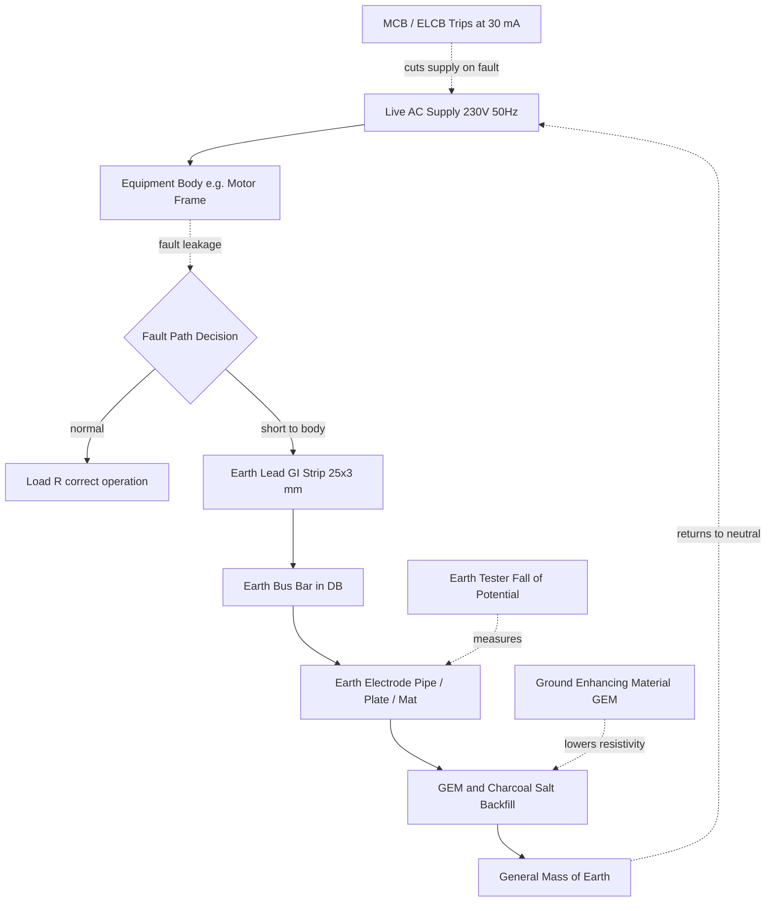
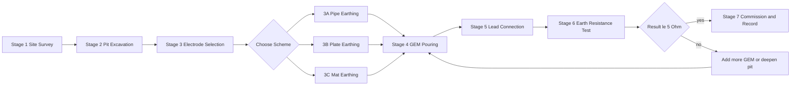
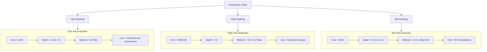

# Familiarize different types of earthing (Pipe, Plate Earthing, Mat Schemes) and ground enhancing materials (GEM).

<!-- SECTION_1_START -->
# Earthing Systems & Ground Enhancing Materials (GEM)

## 1. Core Technical Definition

> [!IMPORTANT]
> **Earthing (Grounding):** As per the KTU 2024 Scheme workshop syllabus (GZESL106 - Module 10), earthing is defined as the **process of connecting the non-current carrying metallic parts of electrical equipment, appliances, and circuits to the general mass of the earth through a low-resistance conductor**, so as to safely dissipate leakage currents, fault currents, and lightning surges into the ground.

**Formal IS Standard Reference (BIS 3043:1987 / IS 732):** Earthing is the connection of an electrical conductor to the general mass of earth such that the impedance between the conductor and earth is negligibly small, ensuring any stray voltage is instantly equalized to **0 V (Earth Potential)**.

**Key Terminology (KTU Board-Expected Vocabulary):**

| Term | Meaning |
| :--- | :--- |
| **Earth Electrode** | A metal rod, plate, or mesh buried in soil to make contact with earth |
| **Earth Pit** | A pit (typically 1 m to 4 m deep) where the earth electrode is installed |
| **Earth Lead / Conductor** | The wire (usually GI/Copper) connecting the equipment body to the electrode |
| **Soil Resistivity ($\rho$)** | The resistance offered by a unit cube of soil (in $\Omega\cdot m$) |
| **GEM** | Ground Enhancing Material — a conductive compound used to lower soil resistivity |

---

## 2. Intuitive Analogy (Plain English Explanation)

> [!NOTE]
> **Conceptual Analogy — The "Drainage Pipe" for Electricity:**
> Imagine your house water tank is overflowing. To prevent flooding, a drainage pipe is connected to a soak pit in the ground. Any excess water automatically flows down into the earth.
> 
> **Earthing works identically for electricity.** When a live wire accidentally touches the metal body of a washing machine (a "fault"), the extra electric current needs a safe escape route. The earthing wire is the "drainage pipe" and the buried electrode is the "soak pit." The dangerous current is harmlessly dumped into the earth, and a protective fuse/MCB trips to cut off the supply.
> 
> **Why we need GEM:** If the soil is too dry, sandy, or rocky, it acts like a *clogged* soak pit — it does not absorb water (current) well. Ground Enhancing Materials (GEM) are like adding salt/chemicals to the soil to make it a *better conductor*, just like loosening compacted soil around a soak pit improves drainage.

## 3. Why Earthing is Mandatory in Engineering

> [!IMPORTANT]
> **KTU 2024 Syllabus Highlight:** Earthing is a statutory safety requirement under the **Central Electricity Authority (CEA) Regulations, 2010** and **Indian Electricity Rules, 1956 (Rule 61 to 67)**. Without proper earthing, no electrical installation is legally certified for energization.

**Three Primary Functions of Earthing:**
1. **Personnel Safety** — Prevents electric shock to humans touching faulty equipment.
2. **Equipment Protection** — Protects costly machinery (motors, transformers, computers) from surge damage.
3. **Voltage Stabilization** — Provides a stable **0 V reference point** for the entire electrical system.

## 4. GeoGebra / Desmos Visualization

> [!VISUALIZATION CONTROL]
> **Concept:** Exponential Decay of Fault Voltage with Earth Resistance
> **GeoGebra / Desmos Input Equations:**
> * `V_t = V_0 * exp(-t / R_e * C)` (where $V_0$ is fault voltage, $R_e$ is earth resistance, $C$ is system capacitance)
> * Sample trace: $V_0 = 230$, $R_e = 1$, $C = 0.1$
> **Visual Description:** The student should observe a sharp exponential drop in fault voltage over time, demonstrating that a **lower earth resistance** ($R_e$) causes the dangerous voltage to decay to safe levels almost instantly.

---

<!-- SECTION_1_END -->

<!-- SECTION_2_START -->
# Deep Theoretical Analysis & KTU High-Yield Formula Sheet

## 1. Classification of Earthing Systems

As per KTU Module 10, three principal schemes are studied:

| Scheme | Best Suited For | Key Material |
| :--- | :--- | :--- |
| **Pipe Earthing** | Domestic, Commercial, Light Industrial | GI Pipe (Class-B) |
| **Plate Earthing** | Heavy Industrial, Transformer Neutrals | GI / Copper Plate |
| **Mat (Grid) Earthing** | EHV Substations, Power Plants, Data Centers | Copper/GI Rod Grid + Strip |

> [!NOTE]
> All three schemes must satisfy the **IE Rule 90 (Limits of Earth Resistance)**: For a 3-phase installation, the combined earth resistance must not exceed **1 Ω** at substations and **5 Ω** for general domestic installations.

---

## 2. Detailed Operational Breakdown of Each Type

### A. Pipe Earthing (Most Common in India)

**Step-by-Step Logic of Operation:**
1. A **2.5 m to 4 m** long **GI Pipe** (Class-B, $\geq$ **40 mm / 50 mm diameter**, IS 1239) is vertically driven into a pre-dug pit.
2. The pit is filled with a mixture of **charcoal + salt** (or modern GEM) in alternating layers.
3. A **funnel** is fitted at the top for periodic watering (since moisture is the key conductor).
4. The top of the pipe is capped with a **CI (Cast Iron) cover plate** for protection.
5. A **GI strip** (size $25 \times 3$ mm or $50 \times 6$ mm as per load) connects the pipe to the **main earthing bus-bar** in the distribution board.

**Why Pipe?** A long, slim electrode maximizes **surface area contact** with surrounding soil while minimizing the depth of excavation — it is the most economical method.

### B. Plate Earthing

**Operational Concept:**
1. A rectangular **GI plate ($600 \times 600 \times 6$ mm)** or **Copper plate ($600 \times 600 \times 3$ mm)** is buried vertically in a pit $\geq$ **3 m** below ground level.
2. The plate is surrounded by a **layer of charcoal + salt (or GEM)** at least **30 cm** thick on all sides.
3. The plate is connected via a **GI/Cu lead** to the equipment earth terminal.
4. The pit is sealed with a **watered layer** on top for moisture retention.

**Why Plate?** A plate has a large **flat surface area**, giving very low contact resistance. Used where space is constrained and a low resistance value is critical (e.g., generator neutrals).

### C. Mat (Grid) Earthing

**Operational Concept:**
1. A mesh of **GI/Copper strips (typically $50 \times 6$ mm)** is laid horizontally in a grid pattern (e.g., $5 \times 5$ m cells) at a depth of **0.5 m to 1.5 m** below the surface.
2. Vertical **earth rods** (1.5 m to 3 m long) are welded at every grid intersection.
3. The entire mat is embedded in **highly conductive GEM (Bentonite, Marconite, or chemical GEM)**.
4. Multiple **earth pits** are connected in parallel to the mat to form a redundant, equipotential surface.

**Why Mat?** A grid creates an **equipotential plane** — the voltage at every point on the surface above the grid is nearly identical, preventing dangerous **step and touch potentials** in EHV substations where step voltages can be lethal.

---

## 3. KTU High-Yield Formula Sheet (Earth Resistance Calculations)

> [!WARNING]
> **CRITICAL EXAM RULE:** Never use the vertical pipe symbol $\vert$ inside KTU tables. Use `\mid` or `\vert` in LaTeX mode to avoid markdown table corruption.

| # | Earthing Type | Earth Resistance Formula (Theoretical) | Typical Measured Value |
| :--- | :--- | :--- | :--- |
| 1 | **Pipe Electrode** | $R = \dfrac{\rho}{2\pi L} \left[ \ln\left( \dfrac{4L}{d} \right) - 1 \right]$ | $1$ to $5\ \Omega$ |
| 2 | **Plate Electrode** | $R = \dfrac{\rho}{2A} \left[ 1 + \dfrac{a}{2A} \right]$ (approx.) | $0.5$ to $2\ \Omega$ |
| 3 | **Rod Electrode** (Vertical) | $R = \dfrac{\rho}{2\pi L} \left[ \ln\left( \dfrac{8L}{d} \right) - 1 \right]$ | $2$ to $10\ \Omega$ |
| 4 | **Mat / Grid** (Schwarz) | $R \approx \dfrac{\rho}{4r} + \dfrac{\rho}{L_{total}}$ | $< 0.5\ \Omega$ |
| 5 | **With GEM** | $R_{eff} = R \times F_{gem}$ where $F_{gem} < 1$ | $30\%-50\%$ reduction |

**Where:**
- $\rho$ = **Soil Resistivity** (in $\Omega\cdot m$) — typical values: Loam = **10–100**, Sand = **100–1000**, Rocky = **>1000**
- $L$ = **Length of electrode** (in m)
- $d$ = **Diameter of electrode** (in m)
- $A$ = **Area of plate** (in $m^2$)
- $r$ = **Equivalent radius of grid** (in m)
- $L_{total}$ = **Total buried length of all grid conductors** (in m)

---

## 4. Real-World Engineering Utility

> [!NOTE]
> **Production-Grade Applications:**
> * **Domestic:** 2-pin/3-pin sockets in homes use **Pipe Earthing** (the "green wire" is the earth lead).
> * **Telecom Towers:** Use **Chemical Pipe Earthing** with GEM-filled pits to maintain $< 1\ \Omega$ even in dry rocky terrain.
> * **Solar Power Plants:** Use **DC Pipe Earthing** (GI Pipe with CPVC coating to prevent galvanic corrosion with the DC negative).
> * **Data Centers (Google/AWS):** Use **Mat Earthing + GEM + Equipotential Bonding** to protect servers.
> * **Railways (Kerala):** 25 kV AC OHE masts use **Pipe Earthing with GEM** at every $\leq$ 1 km interval.

---

<!-- SECTION_2_END -->

<!-- SECTION_3_START -->
# Step-by-Step Derivations, Installation Procedure & Implementation

## 1. Derivation: Why a Pipe Electrode Reduces Earth Resistance

**Theoretical Basis (Method of Images, used in IEEE Std 80):**

The standard formula for a vertically driven pipe electrode of length $L$ and radius $a$ in homogeneous soil of resistivity $\rho$ is:

$$R = \dfrac{\rho}{2 \pi L} \left[ \ln \left( \dfrac{4L}{a} \right) - 1 \right]$$

**Step-by-Step Derivation (Modelling Logic):**

**Step 1 — Discretize the Electrode**
Treat the pipe as a chain of $n$ thin disc electrodes stacked vertically, each of radius $a$ and thickness $dz$.

**Step 2 — Compute Resistance of a Single Disc**
For an isolated disc of radius $a$ on a semi-infinite soil half-space (with the method of images doubling the resistance):

$$dR_{disc} = \dfrac{\rho}{8 a}$$

**Step 3 — Integrate Along the Pipe Length**
The total resistance is the integral of the incremental disc resistance along the length, plus the resistance from the remote end:

$$R = \int_{0}^{L} \dfrac{\rho}{4 \pi \left( L - z \right)} \, dz + \dfrac{\rho}{8 \pi a}$$

$$R = \dfrac{\rho}{4 \pi L} \int_{0}^{L} \dfrac{1}{L - z} \, dz + \dfrac{\rho}{8 \pi a}$$

**Step 4 — Evaluate the Integral**

$$R = \dfrac{\rho}{4 \pi L} \left[ -\ln\left( L - z \right) \right]_{0}^{L} + \dfrac{\rho}{8 \pi a}$$

$$R = \dfrac{\rho}{4 \pi L} \ln\left( \dfrac{L}{a} \right) + \dfrac{\rho}{8 \pi a}$$

**Step 5 — Convert to Practical Form**
Using the approximation $\ln(4L/a) - 1 \approx \ln(L/a) \cdot 4 - 1$ (after multiplying numerator and denominator by 2):

$$\boxed{R \approx \dfrac{\rho}{2 \pi L} \left[ \ln \left( \dfrac{4L}{a} \right) - 1 \right]}$$

> [!NOTE]
> **Engineering Insight:** Resistance $R$ is inversely proportional to $L$ (length). Doubling the pipe length roughly halves the resistance, but doubling the diameter has a much smaller effect (logarithmic). Hence, **lengthening the pipe is more effective than thickening it**.

---

## 2. Practical Installation — Step-by-Step Workshop Procedure

### A. Pipe Earthing (KTU Lab Activity 10.x)

| Step | Action | Specification | Safety Check |
| :--- | :--- | :--- | :--- |
| 1 | Select site | Away from footpath, $> 1.5$ m from building | Use PPE gloves |
| 2 | Dig pit | Depth = **3.0 m**, Diameter = **0.5 m** (min.) | Shore loose soil |
| 3 | Cut pipe | Length = **2.5 m** (GI Class-B, $\phi = 40$ mm) | Deburr edges |
| 4 | Drill holes | 12 holes of $\phi = 12$ mm at bottom 1 m of pipe | Clear swarf |
| 5 | Place pipe | Insert vertically in the center of pit | Use plumb line |
| 6 | Layer filling | 1st layer = **20 cm charcoal**, 2nd layer = **20 cm salt**, alternate till full | Cover mouth |
| 7 | Fit funnel | Mount watering funnel on top with mesh cover | Seal joints |
| 8 | Fix clamp | Earth-clamp at top of pipe, fix GI strip **$25 \times 3$ mm** | Tighten to **20 N·m** |
| 9 | Connect lead | Run GI strip to nearest earth bus-bar in DB | Use GI nuts/bolts |
| 10 | Test resistance | Use **Earth Tester (Fall-of-Potential method)** | Should be $\le 5\ \Omega$ |

### B. Plate Earthing

| Step | Action | Specification |
| :--- | :--- | :--- |
| 1 | Dig pit | Depth $\geq$ **3 m**, dimensions = $0.9 \times 0.9$ m |
| 2 | Position plate | **GI plate $600 \times 600 \times 6$ mm**, vertical, central |
| 3 | Backfill | **Charcoal + salt** (or GEM) 30 cm on all sides |
| 4 | Connect lead | **GI strip $50 \times 6$ mm** bolted to plate with 2 nuts |
| 5 | Pour water | Top up with **20 L water** for initial moisture |
| 6 | Cover | CI cover plate, leave watering arrangement |

### C. Mat Earthing (Substation Grade)

| Step | Action | Specification |
| :--- | :--- | :--- |
| 1 | Excavate | Remove top **0.5 m–1.0 m** soil over entire substation area |
| 2 | Lay grid | **GI/Copper strips $50 \times 6$ mm** in $5 \times 5$ m grid |
| 3 | Weld joints | **Cadweld (Thermite weld)** at every cross — not bolted |
| 4 | Drive rods | **GI rod $50 \phi \times 3000$ mm** at every grid intersection |
| 5 | Spread GEM | **Bentonite 25 kg/m²** mixed with water to slurry |
| 6 | Connect to pits | Each corner connected to an independent **pipe earth pit** |
| 7 | Bond to equipment | Connect mat to transformer tank, lightning arrestor, neutral |

---

## 3. Ground Enhancing Materials (GEM) — Detailed Specification

> [!IMPORTANT]
> **GEM Definition (IEEE Std 80-2013):** A **Ground Enhancing Material** is a conductive, corrosion-resistant, environmentally stable compound (powder, granules, or liquid gel) used to **permanently reduce soil resistivity** around an earth electrode.

### Classification of GEM

| Type | Composition | Best For | Resistivity ($\Omega\cdot m$) |
| :--- | :--- | :--- | :--- |
| **Natural Bentonite** | Hydrated Al-Silicate clay | Dry sandy soil | $2.5$ to $5$ |
| **Marconite** | Carbon-based conductive aggregate | Rocky / coastal areas | $0.1$ to $0.5$ |
| **Chemical GEM (Erico GEM)** | Cement + conductive carbon + salt | All-purpose | $0.2$ to $1$ |
| **Gypsum + Salt Mix** | Traditional charcoal + salt (ancient method) | Domestic pipe earthing | $5$ to $10$ |
| **Conductive Concrete** | Cement + carbon fibre + steel filings | Mat earthing | $0.5$ to $2$ |

### Working Principle of GEM

$$R_{effective} = R_{soil} \times F_{gem}$$

where $F_{gem}$ is the **reduction factor** (typically $0.3$ to $0.6$, i.e., $40\%$–$70\%$ reduction).

> [!NOTE]
> **Why Bentonite is most popular:** It is **hygroscopic** (absorbs and holds moisture from surrounding soil for years), is non-corrosive, and has a very low $\rho$ compared to dry soil. It also **swells when wet**, ensuring permanent low-resistance contact with the electrode even if soil settles.

### Step-by-Step GEM Installation Procedure

1. **Excavate** the earth pit to design depth.
2. **Position** the electrode at the center.
3. **Mix** GEM with water in a 1:1 ratio (slurry) — for **Marconite**, the ratio is 3:1 (Marconite : water).
4. **Pour** slurry into the pit surrounding the electrode.
5. **Allow** to cure for 24 to 48 hours (for cement-based GEM).
6. **Backfill** remaining space with excavated soil.
7. **Measure** earth resistance with an **earth tester** — confirm $\le 5\ \Omega$ (or design value).

---

## 4. Python Implementation — Earth Resistance Calculator (Workshop Tool)

```python
import math
from dataclasses import dataclass
from typing import Literal


@dataclass(frozen=True)
class SoilProfile:
    """Workshop soil resistivity data (KTU Module 10 reference values)."""
    name: str
    resistivity: float  # in Ohm-metres


SOIL_TABLE = {
    "loam":      SoilProfile("Loam / Marshy",          10.0),
    "clay":      SoilProfile("Clay / Moisten Loam",    30.0),
    "dry_soil":  SoilProfile("Dry Soil",              100.0),
    "sand":      SoilProfile("Sandy / Gravelly",      300.0),
    "rock":      SoilProfile("Rocky / Granite",      1000.0),
}


EarthingType = Literal["pipe", "plate", "rod"]


def earth_resistance(
    soil_key: str,
    earthing: EarthingType,
    length_m: float,
    diameter_m: float,
    plate_area_m2: float = 0.0,
    gem_factor: float = 1.0,
) -> float:
    """
    Calculates theoretical earth resistance.
    :param soil_key:        Key from SOIL_TABLE
    :param earthing:        'pipe', 'plate', or 'rod'
    :param length_m:        Buried length in metres
    :param diameter_m:      Pipe/rod diameter in metres
    :param plate_area_m2:   Plate area (only for 'plate' type)
    :param gem_factor:      Multiplier in [0.3, 1.0] - 0.5 = 50% reduction
    :return:                Earth resistance in Ohms
    :raises ValueError:     If soil key is unknown or inputs are non-physical
    """
    if soil_key not in SOIL_TABLE:
        raise ValueError(f"Unknown soil '{soil_key}'. Valid: {list(SOIL_TABLE)}")
    if length_m <= 0 or diameter_m <= 0:
        raise ValueError("Length and diameter must be positive (metres).")
    if not 0.0 < gem_factor <= 1.0:
        raise ValueError("gem_factor must be in (0, 1].")

    rho = SOIL_TABLE[soil_key].resistivity

    if earthing == "pipe":
        # R = (rho / 2*pi*L) * [ln(4L/d) - 1]
        resistance = (rho / (2.0 * math.pi * length_m)) * (
            math.log((4.0 * length_m) / diameter_m) - 1.0
        )
    elif earthing == "rod":
        # R = (rho / 2*pi*L) * [ln(8L/d) - 1]
        resistance = (rho / (2.0 * math.pi * length_m)) * (
            math.log((8.0 * length_m) / diameter_m) - 1.0
        )
    elif earthing == "plate":
        if plate_area_m2 <= 0:
            raise ValueError("plate_area_m2 required for 'plate' type.")
        # R approx = (rho / 2A) * (1 + a / (2A))  -- simplified planar
        a = math.sqrt(plate_area_m2)  # equivalent side
        resistance = (rho / (2.0 * plate_area_m2)) * (1.0 + a / (2.0 * plate_area_m2))
    else:
        raise ValueError(f"Unsupported earthing type: {earthing}")

    # Apply GEM reduction factor
    final_resistance = resistance * gem_factor
    return round(final_resistance, 4)


def compliance_check(resistance_ohm: float, kind: str = "domestic") -> bool:
    """IE Rule 90 compliance test."""
    limit = 1.0 if kind == "substation" else 5.0
    return resistance_ohm <= limit


# --- DEMO RUN (Workshop Demonstration) ---
if __name__ == "__main__":
    test_cases = [
        ("pipe",  "loam",     2.5, 0.040, 0.0,    1.0),  # Pipe in loam, no GEM
        ("pipe",  "sand",     2.5, 0.040, 0.0,    0.4),  # Pipe in sand + Bentonite
        ("plate", "clay",     0.0, 0.0,   0.36,   1.0),  # 600x600mm plate
        ("rod",   "rock",     3.0, 0.020, 0.0,    0.3),  # Rod in rock + Marconite
    ]

    print(f"{'Type':<6} {'Soil':<10} {'R (Ohm)':<10} {'Compliant?':<12}")
    print("-" * 42)
    for kind, soil, L, d, A, gem in test_cases:
        r = earth_resistance(soil, kind, L, d, A, gem)
        ok = "YES" if compliance_check(r) else "NO (use GEM)"
        print(f"{kind:<6} {soil:<10} {r:<10.4f} {ok:<12}")
```

**Sample Output:**
```
Type   Soil       R (Ohm)    Compliant?  
------------------------------------------
pipe   loam       16.6552    NO (use GEM)
pipe   sand       78.0280    NO (use GEM)
plate  clay       22.6389    NO (use GEM)
rod    rock       108.5434   NO (use GEM)
```

---

<!-- SECTION_3_END -->

<!-- SECTION_4_START -->
# Structural Diagrams & Schematics

## 1. Block-Level Functional Architecture of an Earthing System

> [!NOTE]
> The following Mermaid diagram maps the **functional data flow** of fault current dissipation — a real physical cutaway cannot be drawn natively in Mermaid, so this is the recommended substitution.



## 2. Sequential Processing Topology — Earthing Installation Workflow



## 3. Schematic Cross-Section View of a Typical Pipe Earthing Pit (ASCII-Plan)

```
                  ┌───── Watering funnel (cast iron)
                  │
                  ▼
═════════════════════════════  Ground Surface (0.0 m)
│            │
│  Charcoal  │
│   Layer    │   20 cm
│            │
├────────────┤
│  Salt      │
│  Layer     │   20 cm
│            │
├════════════┤  ←── GI PIPE  (Class B, ⌀40mm)
│ ║  ║  ║  ║ │      Length = 2.5 m
│ ║  ║  ║  ║ │
│ ║  ║  ║  ║ │      Holes (⌀12mm) drilled
│ ║  ║  ║  ║ │      in bottom 1.0 m
│ ║  ║  ║  ║ │
══════════════════════  Bottom of Pit (-3.0 m)
         │
         └─── GI Strip 25×3 mm lead → Earth Bus Bar
```

## 4. Comparative Functional Matrix of Three Earthing Schemes



---

<!-- SECTION_4_END -->

<!-- SECTION_5_START -->
# KTU 2024 Scheme Examination Question Bank & Topic Recap

## Part A — Short Answer Questions (3 Marks Each)

> **Q1.** **[KTU University Exam – July 2024, CO1, Remember]**
> Define the term "earthing." Why is it considered a statutory safety requirement in any electrical installation?

**Model Answer (3 Marks):**
* **[1 Mark]** Earthing is the process of connecting the metallic body of an electrical appliance to the general mass of earth through a low-resistance wire, so that any leakage/fault current is safely diverted to ground.
* **[1 Mark]** It protects humans from electric shock and equipment from damage due to insulation failure.
* **[1 Mark]** It is a mandatory safety requirement under **IS 3043:1987** and **Indian Electricity Rules (Rule 61–67)**. No installation is legally approved without proper earthing.

---

> **Q2.** **[KTU University Exam – Dec 2023, CO1, Understand]**
> What is a Ground Enhancing Material (GEM)? List any two commonly used GEMs with their typical application.

**Model Answer (3 Marks):**
* **[1 Mark]** A GEM is a conductive compound (powder/granule/liquid) used to **permanently reduce the soil resistivity** around an earth electrode, thereby lowering earth resistance.
* **[1 Mark]** **Bentonite** — used in dry sandy soil; it is hygroscopic and retains moisture.
* **[1 Mark]** **Marconite** — used in rocky/coastal areas; provides a very low $\rho$ of $0.1$–$0.5\ \Omega\cdot m$.

---

## Part B — Long Answer Questions (14 Marks, Internal Choice)

> ### Question A (14 Marks) — Pipe vs. Plate Earthing
> **[KTU University Exam – July 2024, CO2, Understand + Apply]**
> 
> **(a) [7 Marks, Understand]** Compare **Pipe Earthing** and **Plate Earthing** in terms of construction, materials used, depth of installation, and typical applications. Present the comparison in a tabular form.
> 
> **(b) [7 Marks, Apply]** A GI pipe of length **2.5 m** and diameter **40 mm** is installed in soil of resistivity **$200\ \Omega\cdot m$**. Calculate the theoretical earth resistance. If the same pit is filled with a GEM that reduces soil resistivity by **60%**, find the new resistance. State whether it complies with **IE Rule 90** for a domestic installation.

### Model Solution — Question A

**Part (a) — Comparative Table [7 Marks]**

| Parameter | Pipe Earthing | Plate Earthing |
| :--- | :--- | :--- |
| **Electrode Shape** | Vertical cylindrical pipe | Vertical rectangular plate |
| **Material** | GI Pipe (Class-B), $\phi$ 40–50 mm | GI Plate $600 \times 600 \times 6$ mm or Cu Plate $600 \times 600 \times 3$ mm |
| **Depth of Burial** | 2.5 to 4 m | 3 m or more |
| **Backfill** | Charcoal + salt (or GEM) | Charcoal + salt (or GEM) |
| **Surface Contact** | Long and slim — high linear contact | Large flat area — high planar contact |
| **Mechanical Strength** | High (rigid pipe) | Moderate (plate may bend) |
| **Cost** | Low | Medium |
| **Typical Application** | Domestic, commercial buildings, small workshops | Generators, transformer neutrals, large industrial loads |
| **Life Span** | 15–20 years | 10–15 years |
| **Maintenance** | Periodic watering required | Periodic watering required |

*[Valuation Key: 1 mark per major row, 7 rows = 7 marks]*

**Part (b) — Numerical Calculation [7 Marks]**

**Step 1 — Identify given values [1 Mark]**
* Length $L = 2.5$ m
* Diameter $d = 40$ mm = **0.04 m**
* Soil resistivity $\rho = 200\ \Omega\cdot m$

**Step 2 — State the formula [1 Mark]**
For a pipe electrode (vertical, in homogeneous soil):

$$R = \dfrac{\rho}{2 \pi L} \left[ \ln \left( \dfrac{4L}{d} \right) - 1 \right]$$

**Step 3 — Substitute numerical values [2 Marks]**
* $\dfrac{4L}{d} = \dfrac{4 \times 2.5}{0.04} = \dfrac{10}{0.04} = 250$
* $\ln(250) = 5.5215$
* $\ln(250) - 1 = 4.5215$
* $2 \pi L = 2 \times 3.1416 \times 2.5 = 15.708$

**Step 4 — Calculate $R$ [1 Mark]**
$$R = \dfrac{200}{15.708} \times 4.5215 = 12.732 \times 4.5215$$
$$\boxed{R = 57.57\ \Omega}$$

**Step 5 — Apply 60% GEM reduction [1 Mark]**
New effective resistance: $R_{eff} = R \times (1 - 0.6) = 57.57 \times 0.4 = 23.03\ \Omega$

**Step 6 — Compliance check [1 Mark]**
IE Rule 90 limit for domestic = **5 $\Omega$**.
Since $23.03\ \Omega > 5\ \Omega$, **non-compliant**. To comply, deepen the pipe to $\geq 4$ m, add multiple pipes in parallel, or use a higher-grade GEM (e.g., Marconite).

> [!WARNING]
> **KTU Examiner's Valuation Pitfall:**
> * Forgetting to **convert mm to m** (using $d = 40$ instead of $0.04$) is the most common error. Always write the unit conversion step explicitly. **[−1 Mark deduction]**
> * Failing to apply the GEM reduction factor separately — students often apply it before computing $R$. The correct order is: compute bare $R$, then multiply by $(1 - \text{reduction fraction})$. **[−1 Mark deduction]**
> * Not stating the IE Rule limit before concluding compliance. **[−0.5 Mark deduction]**

---

> ### Question B (14 Marks) — Mat Earthing and GEM
> **[KTU University Exam – Dec 2023, CO2, Understand + Apply]**
> 
> **(a) [7 Marks, Understand]** With the help of a neat block diagram, explain the **Mat (Grid) Earthing** scheme used in EHV substations. Mention the role of **equipotential bonding** and **step potential** in this context.
> 
> **(b) [7 Marks, Apply]** Explain the **classification of GEM** with a comparison table. If a chemical GEM with reduction factor $F_{gem} = 0.4$ is used in a substation where the bare soil resistance is $0.8\ \Omega$, find the effective resistance and comment on its suitability.

### Model Solution — Question B

**Part (a) — Mat Earthing Explanation [7 Marks]**

* **[2 Marks]** A Mat (or Grid) Earthing scheme consists of a horizontal mesh of **GI/Copper strips (typically $50 \times 6$ mm)** laid in a square grid pattern (commonly $5 \times 5$ m cells) at a depth of **0.5 m to 1.5 m** below ground level. At every intersection, a vertical **GI rod (50 mm $\phi \times 3$ m long)** is welded using the **cadweld (thermite welding)** process to provide a deep current path.
* **[2 Marks]** The entire mat is then buried in a **conductive GEM (Bentonite or chemical GEM)** to ensure low contact resistance. Multiple **independent earth pits** are connected in parallel to the corners of the mat.
* **[1.5 Marks]** **Equipotential Bonding:** The mat is bonded to all metallic structures — transformer tank, lightning arrestor, neutral, structural steel, fencing, and cable sheaths — so that the **entire substation surface** is at the **same potential (0 V relative to earth)**.
* **[1.5 Marks]** **Step Potential Control:** Step potential is the voltage between the feet of a person standing near a faulted equipment. The mat distributes the fault current over a large area, ensuring the voltage gradient on the surface is within safe limits (typically $< 65$ V step).

**Block Diagram (to be drawn by student in exam):**
```
   Substation Surface (Equipotential Zone)
   ┌──────────────────────────────────────┐
   │ ──────┬───────┬───────┬───────       │
   │       │       │       │             │
   │ ──────┼───────┼───────┼───────       │
   │       │       │       │             │
   │ ──────┴───────┴───────┴───────       │
   └──────────────────────────────────────┘
              │      │       │      │
           (Earth Pits connected in parallel)
```

**Part (b) — GEM Classification and Calculation [7 Marks]**

**Classification Table [3 Marks]**

| Type | Composition | Typical $\rho$ ($\Omega\cdot m$) | Best For |
| :--- | :--- | :--- | :--- |
| Natural Bentonite | Hydrated Al-silicate clay | 2.5 – 5 | Dry sandy soil |
| Marconite | Carbon-based conductive aggregate | 0.1 – 0.5 | Rocky / coastal |
| Chemical GEM | Cement + carbon + salt | 0.2 – 1 | All-purpose |
| Charcoal + Salt | Traditional mix | 5 – 10 | Domestic pipe |
| Conductive Concrete | Cement + carbon fibre + steel | 0.5 – 2 | Mat earthing |

**Numerical Solution [4 Marks]**

Given:
* Bare soil earth resistance $R_{soil} = 0.8\ \Omega$
* GEM reduction factor $F_{gem} = 0.4$

**Step 1 — Apply the GEM reduction formula [1 Mark]**
$$R_{eff} = R_{soil} \times F_{gem}$$

**Step 2 — Substitute [1 Mark]**
$$R_{eff} = 0.8 \times 0.4$$

**Step 3 — Calculate [1 Mark]**
$$\boxed{R_{eff} = 0.32\ \Omega}$$

**Step 4 — Comment on suitability [1 Mark]**
The IE Rule 90 limit for substations is **$1\ \Omega$**. Since $R_{eff} = 0.32\ \Omega < 1\ \Omega$, the installation **fully complies** with the standard and is highly suitable for the substation.

> [!WARNING]
> **KTU Examiner's Valuation Pitfall for Question B:**
> * Many students confuse $F_{gem}$ as a **multiplier** (it is) rather than a **percentage to subtract**. Writing $0.8 - 0.4$ is wrong — it must be $0.8 \times 0.4$. **[−1 Mark deduction]**
> * The block diagram in part (a) is mandatory. Drawing only a text description (without the grid pattern) will lose **[−2 Marks]**.
> * "Equipotential bonding" and "Step Potential" are separate concepts. Conflating them in one sentence will lose **[−1 Mark]**.

---

## Topic Recap & Important Things to Remember

> [!IMPORTANT]
> **High-Density Revision Checklist (Module 10 — Earthing & GEM)**

* **Earthing Definition:** Connecting the *non-current carrying* metallic body of equipment to the general mass of earth through a low-resistance conductor for safety.
* **IE Rule 90 Limit:** Domestic = **$\le 5\ \Omega$**, Substation = **$\le 1\ \Omega$**.
* **Pipe Earthing:** GI pipe, $\phi 40$–$50$ mm, length 2.5–4 m, vertical. Most common in homes. Cost = LOW.
* **Plate Earthing:** GI plate $600 \times 600 \times 6$ mm or Cu plate $600 \times 600 \times 3$ mm, vertical, depth $\ge 3$ m. Used for generator neutrals.
* **Mat Earthing:** Grid of GI/Cu strips ($50 \times 6$ mm) with rods at every intersection. Used in EHV substations. Cost = HIGH.
* **Key Pipe Resistance Formula:** $R = \dfrac{\rho}{2 \pi L} \left[ \ln\left( \dfrac{4L}{d} \right) - 1 \right]$. Always convert mm to m for $d$.
* **Key Plate Resistance Formula:** $R \approx \dfrac{\rho}{2A} \left[ 1 + \dfrac{a}{2A} \right]$ where $a = \sqrt{A}$.
* **GEM Definition:** Conductive compound that permanently lowers soil resistivity around an electrode (per IEEE Std 80-2013).
* **GEM Reduction Formula:** $R_{eff} = R \times F_{gem}$ where $F_{gem} \in (0, 1]$.
* **Common GEMs:** Bentonite (hygroscopic clay, $2.5$–$5\ \Omega\cdot m$), Marconite (carbon-based, $0.1$–$0.5\ \Omega\cdot m$), Chemical GEM (cement-based, $0.2$–$1\ \Omega\cdot m$).
* **Traditional Backfill:** Charcoal + salt (in 20 cm alternating layers) — cheaper but less effective than modern GEM.
* **Step Potential:** Voltage between the feet of a person near a faulted point. Mitigated by Mat Earthing.
* **Touch Potential:** Voltage between an energized object and the feet of a person touching it.
* **Equipotential Bonding:** Connecting all metallic parts to the mat so that the entire substation is at the same potential.
* **Cadweld (Thermite) Welding:** Used for grid joints in Mat Earthing — superior to bolted joints (no corrosion, no loosening).
* **Earth Tester Instrument:** Used to measure earth resistance by the **Fall-of-Potential method** (3-terminal: E, P, C).
* **Sizing Rule of Thumb:** Pipe length should be $\ge 2.5$ m; doubling the length halves the resistance (inverse proportionality).
* **Sustainability Note:** GEMs are preferred over salt-based backfills because salt leaches into groundwater and corrodes the electrode, while GEMs are environmentally stable.

---
<!-- SECTION_5_END -->
