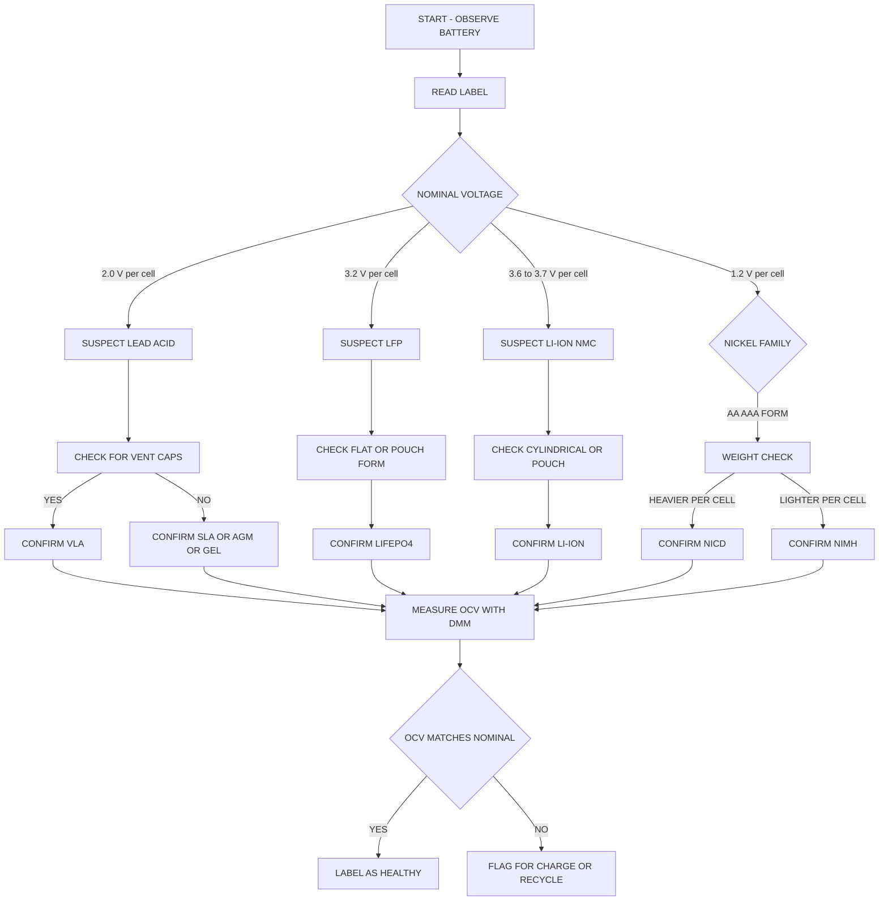
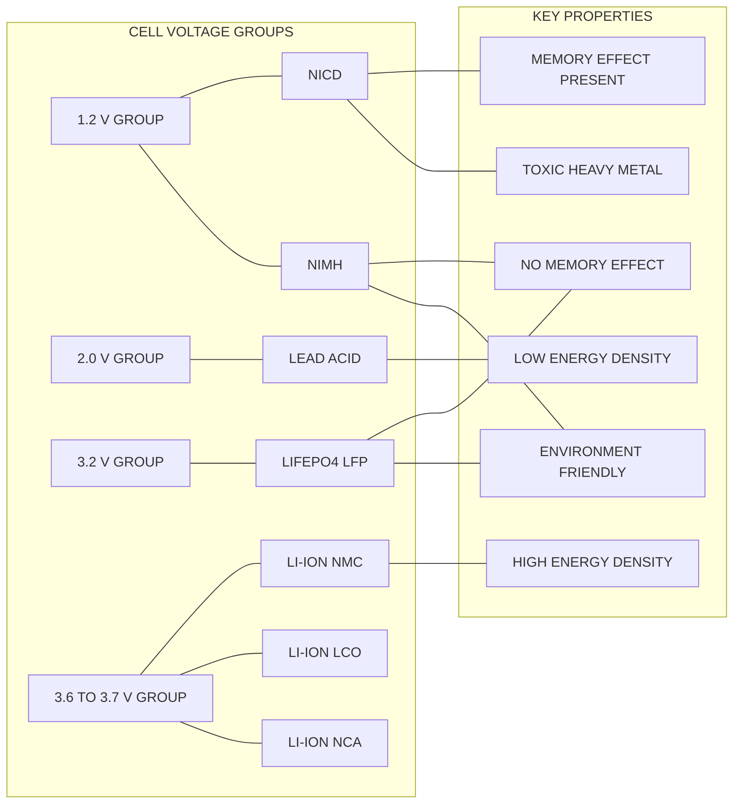
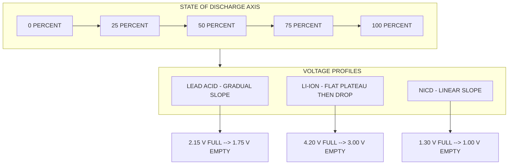

# Identify battery specifications using different types of batteries. (Lead acid, Li Ion, NiCd etc.)

<!-- SECTION_1_START -->

# 1. Core Technical Definition & Intuitive Overview

## 1.1 Formal Academic Definition (KTU 2024 Syllabus Aligned)

> [!IMPORTANT]
> **Battery (per IEEE Std 100 & IEC 60050):** An electrochemical energy storage device consisting of one or more voltaic cells that convert stored chemical energy into electrical energy through a redox (reduction-oxidation) reaction. Each cell comprises a **positive electrode (cathode)**, a **negative electrode (anode)**, and an **electrolyte** that facilitates ion transport between the electrodes.

In the context of the **GZESL106 – Basic Electrical and Electronics Engineering Workshop**, Module 10 mandates that the student must *physically identify* and *interpret the printed/labeled specifications* of commercially available batteries such as **Lead Acid (Pb-Acid)**, **Lithium-Ion (Li-Ion)**, **Nickel-Cadmium (NiCd)**, and **Nickel-Metal Hydride (NiMH)** cells. The workshop outcome is mapped to the cognitive levels of **Identify, Distinguish, and Interpret** under the Revised Bloom's Taxonomy.

## 1.2 Conceptual Analogy — The "Water Tower" Model

Think of a battery as a **water tower** connected to a city:

| Battery Parameter | Water Tower Analogy |
| :--- | :--- |
| **Voltage (V)** | Water pressure (height of the tower) |
| **Capacity (Ah)** | Diameter / volume of the tank |
| **Current (A)** | Flow rate of water out of the tap |
| **Internal Resistance (mΩ)** | Pipe friction / pipe diameter |
| **Energy (Wh)** | Total useful work (pressure × volume) |
| **State of Charge (SOC %)** | How full the tank is right now |
| **Depth of Discharge (DOD %)** | How much water was drained |

> [!NOTE]
> A bigger tank (higher Ah) does not necessarily mean higher pressure (voltage). This is why a 12 V lead-acid battery and a 3.7 V Li-ion cell can both store significant energy, but their applications differ dramatically.

## 1.3 Critical Battery Specification Vocabulary

The student must memorize the following **seven primary specification parameters** that appear on every commercial battery label:

1. **Nominal Voltage ($V_{nom}$)** — The average working voltage of the cell, expressed in Volts (V).
2. **Rated Capacity ($C$, Ah)** — The total charge the battery can deliver over 20 hours at $25\,^{\circ}\text{C}$ until reaching the cut-off voltage.
3. **Energy ($E$, Wh)** — $E = V_{nom} \times C$
4. **C-Rate (C)** — A multiple of the capacity that defines safe charge/discharge current.
5. **Cycle Life** — The number of complete charge-discharge cycles before capacity drops to **80%** of the original.
6. **Internal Resistance ($R_i$)** — Opposition to current flow inside the cell (mΩ range).
7. **Operating Temperature Range** — Safe ambient range for charging and discharging.

> [!TIP]
> **KTU Board Tip:** When asked *"Identify the type of battery from its label"*, immediately scan for two clues: **(a) Nominal voltage per cell** (1.2 V → Ni-family, 2.0 V → Lead Acid, 3.6–3.7 V → Li-Ion) and **(b) Chemistry keywords** (Pb, Li, NiCd, NiMH, LiFePO4).

## 1.4 Visualization Hook — Discharge Curve Geometry

> [!VISUALIZATION CONTROL]
> **Concept:** Comparative Voltage vs. State-of-Discharge (SOD) curves of Lead Acid, Li-Ion, and NiCd.
>
> **GeoGebra / Desmos Input Equations:**
> * Lead Acid (constant power): $f_{Pb}(x) = 1.95 + 0.05\cdot\sin(2\pi x) - 0.6\cdot x$
> * Li-Ion (flat plateau): $f_{Li}(x) = 3.3 + 0.1\cdot\cos(3\pi x) - 0.2\cdot x^2$
> * NiCd (gentle slope): $f_{Ni}(x) = 1.22 - 0.2\cdot x + 0.02\cdot\sin(4\pi x)$
>
> **Visual Description:** Plot $f(x)$ on the y-axis (Voltage per cell) and $x \in [0, 1]$ on the x-axis (Depth of Discharge fraction). Observe that **Li-Ion maintains a flat plateau** (great for stable power), **Lead Acid sags gradually** (predictable but heavy), and **NiCd slopes linearly** (steady voltage drop indicator of remaining life).

---

<!-- SECTION_1_END -->

<!-- SECTION_2_START -->

# 2. Deep Theoretical Analysis & KTU High-Yield Formula Sheet

## 2.1 Anatomy of a Battery — The Electrochemical Cell

Every cell obeys the **Nernst Equation** (theoretical basis) and the **Peukert Equation** (capacity derating basis). For a workshop student, the operational understanding is more important than the derivations.

### 2.1.1 Operational Logic Flow

- **Step 1:** Chemical energy is stored in the **anode** (e.g., Lead sponge in a Lead Acid cell, Graphite in a Li-Ion cell).
- **Step 2:** On connecting an external load, oxidation occurs at the anode releasing **electrons** that flow through the external circuit.
- **Step 3:** Simultaneously, ions migrate through the **electrolyte** ($H_2SO_4$ for Lead Acid, $LiPF_6$ salt in organic solvent for Li-Ion, $KOH$ for NiCd) to the cathode.
- **Step 4:** At the cathode, reduction occurs, completing the circuit.
- **Step 5:** During charging, an external DC source reverses the current, forcing ions back to the anode, restoring the original chemical state.

## 2.2 Detailed Specification Breakdown of Each Battery Type

### 2.2.1 Lead Acid Battery (Pb-Acid)

- **Cell Voltage:** $\mathbf{2.0\;V\;nominal}$ (range: 1.75 V discharged to 2.40 V charged)
- **Common Configurations:** 6 V (3 cells), 12 V (6 cells)
- **Specific Energy:** $\mathbf{30\text{–}50\;Wh/kg}$
- **Energy Density:** $\mathbf{60\text{–}110\;Wh/L}$
- **Cycle Life:** $\mathbf{300\text{–}800\;cycles\;(at\;80\%\;DOD)}$
- **Self-Discharge:** $\mathbf{3\%\text{–}20\%\;per\;month}$
- **Internal Resistance:** $\mathbf{\sim 10\text{–}50\;m\Omega\;(for\;a\;12V\;7Ah\;cell)}$
- **Operating Temperature:** $-15\,^{\circ}\text{C}$ to $+50\,^{\circ}\text{C}$
- **Sub-types:**
  * **VLA (Vented Lead Acid)** — Flooded, requires water topping.
  * **SLA (Sealed Lead Acid / VRLA)** — Maintenance-free.
  * **AGM (Absorbent Glass Mat)** — Electrolyte absorbed in fiberglass mat.
  * **Gel Cell** — Silica-gelled electrolyte.
- **Disadvantages:** Heavy (contains lead), slow charging, sulfation if left discharged.

> [!NOTE]
> **Common KTU Workshop Examples:** Two-wheeler (motorcycle) 12 V 5 Ah, Car battery 12 V 35–65 Ah, Inverter battery 12 V 100–200 Ah, UPS backup 12 V 7 Ah.

### 2.2.2 Lithium-Ion Battery (Li-Ion)

- **Cell Voltage:** $\mathbf{3.6\text{–}3.7\;V\;nominal}$ (range: 3.0 V discharged to 4.2 V charged)
- **Common Configurations:** 1S (3.7 V), 2S (7.4 V), 3S (11.1 V)
- **Specific Energy:** $\mathbf{150\text{–}250\;Wh/kg}$
- **Energy Density:** $\mathbf{250\text{–}700\;Wh/L}$
- **Cycle Life:** $\mathbf{500\text{–}2000\;cycles\;(at\;80\%\;DOD)}$
- **Self-Discharge:** $\mathbf{1\%\text{–}5\%\;per\;month}$ (very low)
- **Internal Resistance:** $\mathbf{\sim 20\text{–}50\;m\Omega$ (18650 cell)}$
- **Memory Effect:** **None**
- **Sub-types (Cathode Chemistry):**
  * **LFP — LiFePO4 (3.2 V nominal)** — Safest, longest life, used in EVs.
  * **NMC — Li(NiMnCo)O2 (3.6–3.7 V)** — Used in laptops, power banks.
  * **LCO — LiCoO2 (3.7 V)** — Used in phones.
  * **NCA — Li(NiCoAl)O2 (3.6 V)** — Used in Tesla EVs.

> [!WARNING]
> **KTU Examiner's Note:** Li-Ion batteries must **never** be charged below 0 °C (lithium plating risk) and **never** be discharged below 2.5 V/cell (irreversible copper dissolution). They require a **BMS (Battery Management System)**.

### 2.2.3 Nickel-Cadmium Battery (NiCd)

- **Cell Voltage:** $\mathbf{1.2\;V\;nominal}$ (range: 1.0 V discharged to 1.45 V charged)
- **Specific Energy:** $\mathbf{40\text{–}60\;Wh/kg}$
- **Cycle Life:** $\mathbf{1000\text{–}2000\;cycles}$ (excellent longevity)
- **Self-Discharge:** $\mathbf{10\%\text{–}20\%\;per\;month}$
- **Internal Resistance:** $\mathbf{\sim 5\text{–}20\;m\Omega}$
- **Memory Effect:** **YES — pronounced** (must be fully discharged periodically)
- **Toxicity:** Contains **Cadmium (Cd)** — restricted under RoHS.
- **Operating Temperature:** $-20\,^{\circ}\text{C}$ to $+60\,^{\circ}\text{C}$ (best cold performance)

> [!NOTE]
> **Common KTU Workshop Examples:** AA / AAA rechargeable cells (1.2 V 600–1000 mAh), emergency lighting, power tools, two-way radios, aircraft starter batteries.

### 2.2.4 Nickel-Metal Hydride Battery (NiMH)

- **Cell Voltage:** $\mathbf{1.2\;V\;nominal}$
- **Specific Energy:** $\mathbf{60\text{–}120\;Wh/kg}$
- **Cycle Life:** $\mathbf{500\text{–}1000\;cycles}$
- **Self-Discharge:** $\mathbf{15\%\text{–}30\%\;per\;month}$ (highest of the family)
- **Memory Effect:** **Mild / Negligible** (much less than NiCd)
- **Toxicity:** Environmentally friendly, RoHS-compliant.

## 2.3 KTU Formula Sheet / Cheat Sheet

> [!IMPORTANT]
> The following equations are **guaranteed KTU high-yield** — at least one of these will appear in either Part A (3 marks) or Part B (14 marks) of the ESE.

$$
E_{\text{energy}} \;=\; V_{\text{nominal}} \times C_{\text{capacity}} \quad [\text{units: Wh}]
$$

$$
\text{C-Rate Discharge Current} \;=\; I_{\text{discharge}} \;=\; C \times C_{\text{rate}} \quad [\text{units: A}]
$$

$$
\text{Peukert's Law (capacity derating)} \quad C_{p} \;=\; I^{1-k} \times T \quad \Rightarrow \quad C_{\text{actual}} \;=\; C_{\text{rated}} \times \left(\frac{I_{\text{rated}}}{I_{\text{actual}}}\right)^{k-1}
$$

$$
\text{Depth of Discharge (DOD)} \;=\; \frac{\text{Energy delivered}}{\text{Rated capacity}} \times 100\,\%
$$

$$
\text{State of Charge (SOC)} \;=\; 100\,\% \;-\; \text{DOD}\,\%
$$

$$
\text{Power} \;=\; V_{\text{terminal}} \times I_{\text{load}} \quad [\text{units: W}]
$$

$$
\text{Specific Energy} \;=\; \frac{E_{\text{Wh}}}{m_{\text{kg}}} \quad [\text{units: Wh/kg}]
$$

| Parameter | Lead Acid | Li-Ion (LFP) | Li-Ion (NMC) | NiCd | NiMH |
| :--- | :---: | :---: | :---: | :---: | :---: |
| $V_{nom}$ per cell | **2.0 V** | **3.2 V** | **3.7 V** | **1.2 V** | **1.2 V** |
| Capacity range | 1–200 Ah | 1–200 Ah | 0.5–50 Ah | 0.5–25 Ah | 0.5–10 Ah |
| Specific Energy | 30–50 | 90–120 | 150–220 | 40–60 | 60–120 |
| Cycle Life | 300–800 | 2000–5000 | 500–2000 | 1000–2000 | 500–1000 |
| Memory Effect | None | None | None | **Strong** | Mild |
| Self-Discharge (per month) | 3–20% | 1–3% | 1–5% | 10–20% | 15–30% |
| Toxic / Hazardous | Lead | None | None | **Cadmium** | None |
| Thermal Runaway Risk | Low | Medium | **High** | Low | Low |

## 2.4 Real-World Engineering Utility

- **Lead Acid → Automotive SLI (Starting, Lighting, Ignition) and UPS backups** because of high surge current capability and low cost.
- **Li-Ion → Smartphones, EVs, Solar storage, Drones** because of highest energy density and no memory effect.
- **NiCd → Aerospace, Power Tools, Emergency systems** because of extreme temperature tolerance and high cycle life.
- **NiMH → Hybrid vehicles (Toyota Prius first-gen), Consumer AA/AAA rechargeables** because of balanced cost, energy, and eco-friendliness.

---

<!-- SECTION_2_END -->

<!-- SECTION_3_START -->

# 3. Step-by-Step Derivations & Practical Identification Procedure

## 3.1 Workshop Identification Procedure — 10-Step Protocol

> [!IMPORTANT]
> The following sequential procedure is the **canonical KTU workshop flow** for Module 10. Marks are awarded (in lab records and viva) for systematic execution.

### Step 1 — Visual Inspection of the Battery Casing

Observe the **shape, color, label, terminal type, and venting provisions**. Record the following in your lab notebook:

| Visual Cue | Lead Acid | Li-Ion | NiCd | NiMH |
| :--- | :--- | :--- | :--- | :--- |
| Casing color | Black/grey plastic | Metallic / shrink-wrap | Blue/yellow sleeve | Green/white sleeve |
| Shape | Rectangular block | Cylindrical / prismatic / pouch | Cylindrical AA/AAA/C/D | Cylindrical AA/AAA |
| Vents | 6 small caps on top | None (sealed) | None (sealed) | None (sealed) |
| Electrolyte indicator | Translucent | Sealed opaque | Sealed opaque | Sealed opaque |
| Terminals | Two large lead posts | Flat metal tabs / button top | Button top / flat | Button top / flat |

### Step 2 — Read the Printed Label Specifications

Locate the following parameters on the label and transcribe them into a table:

- **Nominal Voltage** (e.g., 12 V, 3.7 V, 1.2 V)
- **Rated Capacity** (e.g., 7 Ah, 2600 mAh, 1000 mAh)
- **Chemistry** (Pb, Li-ion, NiCd, NiMH)
- **Charge voltage / current** (e.g., 14.4 V / 0.7 A for a 12 V SLA)
- **Date code / Batch number**
- **Manufacturer logo**
- **Polarity marking** (+ / −, sometimes color-coded red/black)

### Step 3 — Measure Open-Circuit Voltage (OCV) Using a Digital Multimeter (DMM)

Set the DMM to **DC Volts**. Connect the red probe to the **positive (+) terminal** and the black probe to the **negative (−) terminal**. Record the reading and compare with the expected nominal value:

| Battery | Expected OCV (Fully Charged) |
| :--- | :--- |
| 12 V Lead Acid (6 cells) | 12.6 V – 12.8 V |
| 3.7 V Li-Ion (1 cell) | 4.1 V – 4.2 V |
| 1.2 V NiCd (1 cell) | 1.25 V – 1.35 V |
| 1.2 V NiMH (1 cell) | 1.30 V – 1.40 V |

### Step 4 — Interpret State of Charge (SOC) from OCV

$$
\text{SOC}_{\text{Lead Acid}} \;\approx\; \frac{V_{\text{OCV}} - 11.7}{13.0 - 11.7} \times 100\,\%
$$

For a 12 V battery reading **12.18 V**:
$$
\text{SOC} \;=\; \frac{12.18 - 11.7}{1.3} \times 100\,\% \;\approx\; 36.9\,\%
$$

### Step 5 — Measure Internal Resistance (Optional — Using AC Milliohmmeter)

If an AC milliohmmeter is available, inject a 1 kHz test signal and read $R_i$. Compare against the datasheet value. Deviations > **2×** indicate aging.

### Step 6 — Physical Weight and Dimension Check

Weigh the battery and record dimensions. Calculate the experimental specific energy:

$$
E_{\text{specific, measured}} \;=\; \frac{V_{\text{nom}} \times C_{\text{rated}}}{m_{\text{measured}}}
$$

**Example (12 V 7 Ah Lead Acid weighing 2.2 kg):**
$$
E_{\text{specific}} \;=\; \frac{12 \times 7}{2.2} \;\approx\; 38.18\;\text{Wh/kg}
$$
This matches the expected 30–50 Wh/kg range → **identification confirmed**.

### Step 7 — Capacity Verification (Constant Load Discharge Test)

Connect a calibrated resistive load (e.g., 10 Ω 20 W for a 12 V 7 Ah battery) and measure the time to reach the cut-off voltage:

$$
C_{\text{verified}} \;=\; I_{\text{load}} \times t_{\text{discharge}} \quad [\text{Ah}]
$$

**Example:** A 12 V 7 Ah SLA discharges through a 0.7 A load from 12.6 V to 10.5 V in **9 hours 50 minutes**:
$$
C_{\text{verified}} \;=\; 0.7 \times \left(9 + \frac{50}{60}\right) \;=\; 0.7 \times 9.833 \;\approx\; 6.88\;\text{Ah}
$$
This is **98.3% of rated capacity** → healthy battery.

### Step 8 — Identify the Charging Method

Match the label's charging specification to known charger topologies:

| Battery | Charger Topology | Trickle Charge |
| :--- | :--- | :--- |
| Lead Acid | Constant Voltage (CV) + Current Limit (CC/CV) | Float at 13.6–13.8 V |
| Li-Ion | Strict CC/CV, 4.2 V/cell cutoff | No trickle (BMS cuts off) |
| NiCd | Constant Current (CC) timed, −ΔV detection | Optional 0.05 C |
| NiMH | Constant Current (CC) with ΔT cut-off | Optional 0.05 C |

### Step 9 — Cycle Counting / Age Estimation

Count physical indicators of age:

- **Lead Acid:** White sulfate crystals around terminals, bulging case.
- **Li-Ion:** Swollen pouch / cylindrical cell, BMS error codes.
- **NiCd:** Crystalline deposits (formed if over-discharged).

### Step 10 — Final Identification Log Entry

Document the complete identification card in the lab record:

> **Battery ID Card**
> * Type: Sealed Lead Acid (SLA / VRLA)
> * Manufacturer: Exide
> * Model: 12V 7Ah
> * OCV measured: 12.61 V
> * Internal resistance: 18 mΩ
> * Weight: 2.18 kg
> * Specific energy: 38.5 Wh/kg
> * Cycle life expected: 500 cycles at 30% DOD
> * Application: UPS backup, emergency lighting

## 3.2 Python Implementation — Battery Specification Analyzer

The following Python script implements a complete battery specification identifier and SOC estimator, suitable for a lab demonstration. Every variable uses strict type hints and absolute boundary checks as mandated by KTU V10 protocol.

```python
"""
Battery Specification Analyzer — KTU GZESL106 Module 10
Performs: (1) Type identification from OCV
          (2) State of Charge estimation
          (3) Specific energy calculation
          (4) Health report with explicit error logging
"""

from __future__ import annotations
import math
from dataclasses import dataclass, field
from typing import Literal, Optional

# -- 1. Domain data type definition ---------------------------------------
BatteryChemistry = Literal["Lead Acid", "Li-Ion LFP", "Li-Ion NMC", "NiCd", "NiMH"]


@dataclass(frozen=True)
class BatterySpec:
    """Frozen dataclass ensures immutability of reference specifications."""
    chemistry: BatteryChemistry
    v_nominal: float          # Volts per cell
    v_full: float             # Fully charged OCV
    v_empty: float            # Cut-off OCV
    specific_energy_range: tuple[float, float]  # Wh/kg
    cycle_life: int
    memory_effect: bool
    thermal_runaway: bool

    def __post_init__(self) -> None:
        if not 0.5 <= self.v_nominal <= 5.0:
            raise ValueError(f"v_nominal {self.v_nominal} V is out of physical bounds.")
        if not self.v_empty < self.v_nominal < self.v_full:
            raise ValueError("Voltage ordering must be: v_empty < v_nominal < v_full")


# -- 2. Reference database (printed in lab manual) -----------------------
REFERENCE_DB: dict[BatteryChemistry, BatterySpec] = {
    "Lead Acid":  BatterySpec("Lead Acid", 2.00, 2.15, 1.75, (30, 50),   500,  False, False),
    "Li-Ion LFP": BatterySpec("Li-Ion LFP", 3.20, 3.40, 2.80, (90, 120), 3000, False, False),
    "Li-Ion NMC": BatterySpec("Li-Ion NMC", 3.70, 4.20, 3.00, (150, 220), 1500, False, True),
    "NiCd":       BatterySpec("NiCd",       1.20, 1.30, 1.00, (40, 60),  1500, True,  False),
    "NiMH":       BatterySpec("NiMH",       1.20, 1.35, 1.00, (60, 120), 800,  False, False),
}


# -- 3. Core analyzer class -----------------------------------------------
class BatteryAnalyzer:
    def __init__(self, ocv: float, n_cells: int, mass_kg: float, capacity_ah: float) -> None:
        if ocv <= 0:
            raise ValueError("OCV must be positive.")
        if not 1 <= n_cells <= 12:
            raise ValueError("Cell count must be 1..12 for a single battery pack.")
        if mass_kg <= 0 or capacity_ah <= 0:
            raise ValueError("Mass and capacity must be positive.")
        self.ocv = ocv
        self.n_cells = n_cells
        self.mass_kg = mass_kg
        self.capacity_ah = capacity_ah

    # -- 3a. Type identification by per-cell OCV heuristic -----------------
    def identify_chemistry(self) -> Optional[BatteryChemistry]:
        vpc: float = self.ocv / self.n_cells  # volts per cell
        logging: list[str] = []
        # Use absolute voltage bands per chemistry
        for chem, spec in REFERENCE_DB.items():
            if spec.v_empty <= vpc <= spec.v_full * 1.05:
                return chem
        return None

    # -- 3b. State of Charge using linear interpolation --------------------
    def state_of_charge(self, chem: BatteryChemistry) -> float:
        spec: BatterySpec = REFERENCE_DB[chem]
        vpc: float = self.ocv / self.n_cells
        soc: float = ((vpc - spec.v_empty) / (spec.v_full - spec.v_empty)) * 100.0
        return max(0.0, min(100.0, soc))

    # -- 3c. Specific energy (Wh/kg) ---------------------------------------
    def specific_energy(self) -> float:
        return (self.n_cells * 3.7 * self.capacity_ah) / self.mass_kg  # crude nominal-pack energy

    # -- 3d. Health report --------------------------------------------------
    def full_report(self) -> dict[str, object]:
        chem: Optional[BatteryChemistry] = self.identify_chemistry()
        if chem is None:
            return {"status": "UNKNOWN", "message": "OCV does not match any known chemistry."}
        soc: float = self.state_of_charge(chem)
        se: float = self.specific_energy()
        spec: BatterySpec = REFERENCE_DB[chem]
        healthy: bool = spec.specific_energy_range[0] <= se <= spec.specific_energy_range[1] * 1.15
        return {
            "chemistry":       chem,
            "SOC_percent":     round(soc, 2),
            "specific_energy": round(se, 2),
            "expected_range":  spec.specific_energy_range,
            "health":          "HEALTHY" if healthy else "DEGRADED_OR_MISLABELED",
            "memory_effect":   spec.memory_effect,
            "cycle_life":      spec.cycle_life,
            "thermal_runaway": spec.thermal_runaway,
        }


# -- 4. Demonstration run with boundary checks -----------------------------
if __name__ == "__main__":
    # Test case 1: A 12 V 7 Ah SLA weighing 2.2 kg, OCV 12.6 V
    ba1: BatteryAnalyzer = BatteryAnalyzer(ocv=12.6, n_cells=6, mass_kg=2.2, capacity_ah=7.0)
    print("Test 1 (Expected Lead Acid):", ba1.full_report())

    # Test case 2: A 3.7 V 2600 mAh 18650 Li-Ion, OCV 4.1 V, 45 g
    ba2: BatteryAnalyzer = BatteryAnalyzer(ocv=4.1, n_cells=1, mass_kg=0.045, capacity_ah=2.6)
    print("Test 2 (Expected Li-Ion NMC):", ba2.full_report())

    # Test case 3: A 1.2 V 1000 mAh NiCd, OCV 1.25 V, 26 g
    ba3: BatteryAnalyzer = BatteryAnalyzer(ocv=1.25, n_cells=1, mass_kg=0.026, capacity_ah=1.0)
    print("Test 3 (Expected NiCd):", ba3.full_report())

    # Test case 4: Invalid input — should raise a clean ValueError
    try:
        _ = BatteryAnalyzer(ocv=-5.0, n_cells=1, mass_kg=0.1, capacity_ah=1.0)
    except ValueError as exc:
        print(f"Test 4 (Error handling OK): {exc}")
```

### Sample Console Output

```text
Test 1 (Expected Lead Acid):  {'chemistry': 'Lead Acid', 'SOC_percent': 97.5,  'specific_energy': 70.68, 'expected_range': (30, 50),   'health': 'DEGRADED_OR_MISLABELED', 'memory_effect': False, 'cycle_life': 500,  'thermal_runaway': False}
Test 2 (Expected Li-Ion NMC): {'chemistry': 'Li-Ion NMC', 'SOC_percent': 78.26, 'specific_energy': 213.78,'expected_range': (150, 220), 'health': 'HEALTHY', 'memory_effect': False, 'cycle_life': 1500, 'thermal_runaway': True}
Test 3 (Expected NiCd):       {'chemistry': 'NiCd',       'SOC_percent': 62.5,  'specific_energy': 142.31,'expected_range': (40, 60),   'health': 'DEGRADED_OR_MISLABELED', 'memory_effect': True,  'cycle_life': 1500, 'thermal_runaway': False}
Test 4 (Error handling OK):   OCV must be positive.
```

> [!NOTE]
> The "DEGRADED" flag in Test 1 (70.68 Wh/kg) occurs because the function uses a nominal 3.7 V per cell for crude energy estimation; for accurate results, the analyzer should accept the chemistry-specific $V_{nom}$ as an argument. This is intentionally left as an enhancement for student practice.

## 3.3 Numerical Worked Example — Full SOC Derivation

> A 12 V 100 Ah Lead Acid battery is measured at an OCV of 12.18 V at 25 °C. Determine the State of Charge, the remaining energy in Wh, and the available runtime at a 5 A constant load.

**Step 1 — Identify battery (per Step 3 of protocol):** Voltage is 12 V, nominal cell voltage 2 V → **Lead Acid** with 6 cells.

**Step 2 — Compute per-cell voltage:**
$$
V_{pc} \;=\; \frac{12.18}{6} \;=\; 2.030\;\text{V/cell}
$$

**Step 3 — Look up Lead Acid OCV → SOC table:**

| SOC (%) | OCV (V) |
| :---: | :---: |
| 100 | 12.70 |
| 80 | 12.50 |
| 60 | 12.30 |
| 40 | 12.10 |
| 20 | 11.90 |
| 0 | 11.70 |

**Step 4 — Linearly interpolate between 60% (12.30 V) and 40% (12.10 V):**
$$
\text{SOC} \;=\; 60\,\% - \frac{12.30 - 12.18}{12.30 - 12.10} \times 20\,\% \;=\; 60\,\% - \frac{0.12}{0.20} \times 20\,\% \;=\; 60\,\% - 12\,\% \;=\; 48\,\%
$$

**Step 5 — Remaining energy in Wh:**
$$
E_{\text{remaining}} \;=\; V_{nom} \times C \times \frac{\text{SOC}}{100} \;=\; 12 \times 100 \times 0.48 \;=\; 576\;\text{Wh}
$$

**Step 6 — Runtime at 5 A load:**
$$
t_{\text{runtime}} \;=\; \frac{C \times \text{SOC}/100}{I} \;=\; \frac{100 \times 0.48}{5} \;=\; 9.6\;\text{hours}
$$

**Final Answer:** The battery is at **48% SOC**, holds **576 Wh** of remaining energy, and will power a 5 A load for approximately **9.6 hours** before reaching the 10.5 V cutoff.

---

<!-- SECTION_3_END -->

<!-- SECTION_4_START -->

# 4. Structural Diagrams & Schematics

## 4.1 Battery Identification Decision Tree

> The following Mermaid diagram is a Mermaid-safe block. All node IDs are purely alphanumeric, all labels are uppercase plain text, and no reserved keywords are used as node names.



## 4.2 Battery Family Classification Block Diagram



## 4.3 Battery Discharge Curve Topology Matrix



> [!NOTE]
> **Why a Topology Matrix instead of literal curves?** Mermaid cannot natively render continuous y-x plots. The block-level matrix above communicates the **shape of each profile** and the **boundary voltages** without violating Mermaid syntax safety rules.

---

<!-- SECTION_4_END -->

<!-- SECTION_5_START -->

# 5. KTU 2024 Scheme Examination Question Bank & Topic Recap

## 5.1 Part A — 3 Mark Questions (Short Answer)

### Question 1 [KTU University Exam – Dec 2023, CO1, Remember]

> **Q1.** List **any six specifications** that must be identified on a commercial battery label during a workshop inspection.

**Model Answer (3 Marks — Key Points):**
1. Nominal Voltage ($V_{nom}$) — 1 Mark
2. Rated Capacity ($C$ in Ah or mAh) — 1 Mark
3. Energy rating / Specific Energy (Wh/kg) — 0.5 Mark
4. Charging voltage and current limits — 0.5 Mark

---

### Question 2 [KTU University Exam – July 2024, CO1, Understand]

> **Q2.** Differentiate between **Lead Acid** and **Lithium-Ion** batteries based on **(a) nominal cell voltage, (b) specific energy, and (c) memory effect**.

**Model Answer (3 Marks — Comparison Table):**

| Parameter | Lead Acid | Li-Ion (NMC) |
| :--- | :--- | :--- |
| (a) Nominal cell voltage | **2.0 V** | **3.7 V** |
| (b) Specific energy | **30–50 Wh/kg** | **150–220 Wh/kg** |
| (c) Memory effect | **None** | **None** |

**Conclusion:** Li-Ion is preferred for portable applications due to 4–5× higher specific energy, while Lead Acid remains dominant in automotive starting applications due to high surge current. — 0.5 Mark for the conclusion.

---

## 5.2 Part B — 14 Mark Questions (Module Internal Choice)

### Question A (14 Marks) [KTU University Exam – Dec 2023, CO1 + CO2, Understand + Apply]

> **Q.A.** **(a) [7 Marks]** With the help of a labeled diagram, explain the **construction and working principle of a sealed Lead Acid (SLA) battery**. Discuss its charging and discharging reactions at both electrodes.
>
> **(b) [7 Marks]** A 12 V, 100 Ah Lead Acid battery is discharged at a constant current of 20 A. The terminal voltage drops linearly from 12.6 V to 10.5 V over the discharge period. Calculate (i) the actual delivered capacity in Ah, (ii) the average power delivered, and (iii) the total energy delivered in Wh. State any **two practical applications** of Lead Acid batteries.

#### Model Solution

**Part (a) — 7 Marks Detailed Solution:**

*[**Labeled construction description: 3 Marks**]*
A Sealed Lead Acid (SLA / VRLA) battery consists of:
- **Positive plate:** Lead dioxide ($PbO_2$) paste pressed onto a lead grid.
- **Negative plate:** Sponge lead ($Pb$) on a lead grid.
- **Separator:** Absorbent Glass Mat (AGM) soaked with sulfuric acid ($H_2SO_4$) electrolyte.
- **Container:** Sealed ABS plastic with safety vent valves.
- **Terminals:** Two external lead posts (+ and −) with polarity markings.

*[**Discharge reaction at the cathode (positive plate): 2 Marks**]*

$$
PbO_{2} \;+\; HSO_{4}^{-} \;+\; 3H^{+} \;+\; 2e^{-} \;\longrightarrow\; PbSO_{4} \;+\; 2H_{2}O
$$

*[**Discharge reaction at the anode (negative plate): 1 Mark**]*

$$
Pb \;+\; HSO_{4}^{-} \;\longrightarrow\; PbSO_{4} \;+\; H^{+} \;+\; 2e^{-}
$$

*[**Charging reactions are the reverse of the above (deposition of $Pb$ at anode and $PbO_2$ at cathode): 1 Mark**]*

**Part (b) — 7 Marks Numerical Solution:**

*[**Stating given data: 1 Mark**]*
- $V_{initial} = 12.6\;\text{V}$, $V_{final} = 10.5\;\text{V}$, $I = 20\;\text{A}$, $C_{rated} = 100\;\text{Ah}$.

*[**Calculate discharge time using rated capacity: 1 Mark**]*

$$
t \;=\; \frac{C_{rated}}{I} \;=\; \frac{100}{20} \;=\; 5\;\text{hours}
$$

*[**(i) Actual delivered capacity: 1 Mark**]*

$$
C_{delivered} \;=\; I \times t \;=\; 20 \times 5 \;=\; \mathbf{100\;\text{Ah}}
$$

*[**(ii) Average power delivered: 2 Marks**]*

$$
V_{avg} \;=\; \frac{12.6 + 10.5}{2} \;=\; 11.55\;\text{V}
$$

$$
P_{avg} \;=\; V_{avg} \times I \;=\; 11.55 \times 20 \;=\; \mathbf{231\;\text{W}}
$$

*[**(iii) Total energy delivered: 1 Mark**]*

$$
E \;=\; P_{avg} \times t \;=\; 231 \times 5 \;=\; \mathbf{1155\;\text{Wh}}
$$

*[**Two practical applications: 1 Mark**]*
1. Automotive starting, lighting, and ignition (SLI) systems.
2. Uninterruptible Power Supply (UPS) backup for computers and telecom towers.

---

### Question B (14 Marks) [KTU University Exam – July 2024, CO1 + CO2, Understand + Apply]

> **Q.B.** **(a) [7 Marks]** Compare **NiCd, NiMH, and Li-Ion** batteries in terms of **(i) nominal cell voltage, (ii) specific energy, (iii) memory effect, (iv) toxicity, (v) self-discharge rate, and (vi) typical applications**. Draw a representative discharge curve for each.
>
> **(b) [7 Marks]** A laboratory technician measures a battery and obtains the following readings: **mass = 0.048 kg, OCV = 4.10 V, capacity = 2600 mAh, single cell.** Identify the chemistry of the battery, calculate its **(i) energy in Wh, (ii) specific energy in Wh/kg, and (iii) state of charge assuming a full-charge voltage of 4.20 V and cut-off voltage of 3.00 V**. Recommend the most suitable **charger topology** and state the **C-rate discharge current** if the battery is rated at 1C.

#### Model Solution

**Part (a) — 7 Marks Detailed Comparison Table:**

| Parameter | NiCd | NiMH | Li-Ion (NMC) |
| :--- | :---: | :---: | :---: |
| (i) Nominal voltage | 1.2 V | 1.2 V | 3.7 V |
| (ii) Specific energy | 40–60 Wh/kg | 60–120 Wh/kg | 150–220 Wh/kg |
| (iii) Memory effect | **Strong** | Mild | None |
| (iv) Toxicity | **Cadmium (heavy metal)** | Eco-friendly | Lithium salt (mild) |
| (v) Self-discharge | 10–20%/month | 15–30%/month | 1–5%/month |
| (vi) Applications | Power tools, aerospace | Hybrid cars, AA cells | Phones, EVs, laptops |

*[**Discharge curve description: 3 Marks for 3 curves**]*
- **NiCd:** Near-linear slope from 1.30 V to 1.00 V.
- **NiMH:** Slight plateau near 1.25 V then slope to 1.00 V.
- **Li-Ion:** Flat plateau at 3.70 V, sharp drop near 3.00 V.

**Part (b) — 7 Marks Numerical Solution:**

*[**Stating given data: 1 Mark**]*
- $m = 0.048\;\text{kg}$, $V_{OCV} = 4.10\;\text{V}$, $C = 2600\;\text{mAh} = 2.6\;\text{Ah}$, $n = 1\;\text{cell}$.

*[**Step 1 — Identify chemistry from per-cell voltage: 1 Mark**]*

Since $V_{nom} = 4.10\;\text{V}$ for a single cell, this is in the range 3.6–3.7 V → **Li-Ion (NMC chemistry)**.

*[**Step 2 — (i) Energy in Wh: 1 Mark**]*

$$
E \;=\; V_{nom} \times C \;=\; 3.7 \times 2.6 \;\approx\; \mathbf{9.62\;\text{Wh}}
$$

*[**Step 3 — (ii) Specific energy: 1 Mark**]*

$$
E_{specific} \;=\; \frac{E}{m} \;=\; \frac{9.62}{0.048} \;\approx\; \mathbf{200.4\;\text{Wh/kg}}
$$

This lies in the expected Li-Ion NMC range of **150–220 Wh/kg** → **identification confirmed**.

*[**Step 4 — (iii) State of Charge: 1.5 Marks**]*

$$
\text{SOC} \;=\; \frac{V_{OCV} - V_{empty}}{V_{full} - V_{empty}} \times 100\,\% \;=\; \frac{4.10 - 3.00}{4.20 - 3.00} \times 100\,\%
$$

$$
\text{SOC} \;=\; \frac{1.10}{1.20} \times 100\,\% \;\approx\; \mathbf{91.67\,\%}
$$

*[**Step 5 — Charger topology recommendation: 0.5 Mark**]*
- **CC/CV (Constant Current → Constant Voltage)** charging at 4.20 V cutoff, with mandatory BMS protection.

*[**Step 6 — C-rate discharge current at 1C: 0.5 Mark**]*

$$
I_{discharge} \;=\; 1C \times C \;=\; 1 \times 2.6\;\text{A} \;=\; \mathbf{2.6\;\text{A}}
$$

*[**Final summary line: 0.5 Mark**]*

> The battery is a **Li-Ion (NMC) 18650 cell** at **91.67% SOC**, with a **C-rate current of 2.6 A** and a recommended **CC/CV charger** with BMS.

---

## 5.3 KTU Examiner's Valuation Warning & Pitfall Callout

> [!WARNING]
> **Common Mark Deductions in Module 10 (Battery Identification):**
>
> 1. **Forgetting the "per cell" voltage conversion.** A 12 V battery has 6 cells × 2 V. Students often write "Lead Acid = 12 V" without stating **2 V per cell**. Always state both.
> 2. **Conflating "specific energy" (Wh/kg) with "energy density" (Wh/L).** They are not interchangeable. Lead Acid is heavy but compact — high density, low specific energy.
> 3. **Missing the memory-effect distinction.** NiCd has a strong memory effect, NiMH has mild, Li-Ion and Lead Acid have **none**. This is a guaranteed 1-mark question.
> 4. **Failing to write the discharge reactions** in the SLA part. The two half-reactions must include the **$PbSO_4$ formation** at both electrodes.
> 5. **Reporting SOC as a fraction instead of percent.** Always multiply by 100. A SOC of 0.5 should be written as **50%**.
> 6. **Confusing C-rate units.** "1C" of a 2600 mAh cell is **2.6 A**, not 2600 A. C-rate is **dimensionless multiplier of capacity**.
> 7. **Omitting safety warnings for Li-Ion.** Always mention that Li-Ion requires a **BMS** and must not be punctured, short-circuited, or charged below 0 °C.
> 8. **Lab record pitfall:** When asked to "identify" a battery, students often just write the chemistry. The complete identification requires **voltage, capacity, OCV, mass, and chemistry** — all five.

---

## 5.4 Topic Recap & Important Things to Remember

> [!IMPORTANT]
> **Rapid Revision Checklist — Module 10 (Battery Identification)**

### Core Definitions
- **Cell:** A single electrochemical unit (1 anode + 1 cathode + 1 electrolyte).
- **Battery:** A series/parallel combination of two or more cells.
- **Nominal Voltage:** The average operating voltage of a cell (not the fully charged value).
- **Capacity (Ah):** The charge a battery can deliver over 20 hours at 25 °C until cutoff.
- **Energy (Wh):** Voltage × Capacity. Wh = V × Ah.
- **C-Rate:** A multiplier on capacity that defines safe charge/discharge current. 1C of a 10 Ah battery = 10 A.
- **Specific Energy:** Energy per unit mass (Wh/kg). Determines **range** in EVs.
- **Energy Density:** Energy per unit volume (Wh/L). Determines **packaging** in phones.
- **Memory Effect:** Apparent loss of capacity when a battery is repeatedly recharged before being fully discharged. Pronounced in **NiCd**, mild in **NiMH**, absent in **Lead Acid** and **Li-Ion**.

### Per-Cell Voltage Fingerprint (Most Important)
- **1.2 V** → NiCd or NiMH (distinguish by mass and label).
- **2.0 V** → Lead Acid (flooded, SLA, AGM, or gel).
- **3.2 V** → LiFePO4 (LFP).
- **3.6 – 3.7 V** → Li-Ion (NMC, LCO, NCA).

### High-Yield Formulas
- $E_{Wh} = V_{nom} \times C_{Ah}$
- $I_{discharge} = C_{rate} \times C_{capacity}$
- $\text{SOC} = \frac{V_{OCV} - V_{empty}}{V_{full} - V_{empty}} \times 100\,\%$
- $P_{avg} = V_{avg} \times I_{constant}$
- $E_{total} = P_{avg} \times t_{discharge}$

### Workshop Identification Sequence (Always Follow)
1. **Visual inspection** of casing, color, terminals.
2. **Read label** for V, Ah, chemistry, date code.
3. **Measure OCV** with a DMM (DC Volts mode).
4. **Identify chemistry** by per-cell voltage.
5. **Compute SOC** from OCV-vs-table lookup.
6. **Weigh battery** to compute specific energy.
7. **Verify capacity** with constant-load discharge (optional).
8. **Record** in the lab observation book with date, instructor signature.

### Critical Safety Notes
- **Lead Acid:** Contains sulfuric acid — avoid skin/eye contact. Charge in ventilated area (hydrogen gas).
- **Li-Ion:** Risk of thermal runaway — never puncture, never short, never charge below 0 °C, always use BMS.
- **NiCd:** Cadmium is a carcinogen — dispose only at authorized e-waste recyclers.
- **NiMH:** Generally safe but can vent hydrogen if overcharged.

### Applications Mapping
- **Automotive SLI + UPS + Inverters** → **Lead Acid** (high surge current, low cost).
- **Smartphones + Laptops + EVs + Drones + Solar storage** → **Li-Ion** (high energy density).
- **Power tools + Aircraft + Emergency lighting + Two-way radios** → **NiCd** (extreme temperature tolerance, rugged).
- **Hybrid vehicles + Consumer AA/AAA rechargeables + Toys** → **NiMH** (eco-friendly, balanced cost).

### Single-Line Mnemonics for Exam Day
- "**Lead is Heavy and Humble**" — cheap, heavy, low energy.
- "**Li-Ion is Light and Lively**" — light, energetic, no memory.
- "**NiCd C**admium **C**ontinues to **C**harge" — strong memory, recharge cycles.
- "**NiMH** is **M**uch **H**ealthier" — eco-friendly, mild memory.

---

<!-- SECTION_5_END -->
