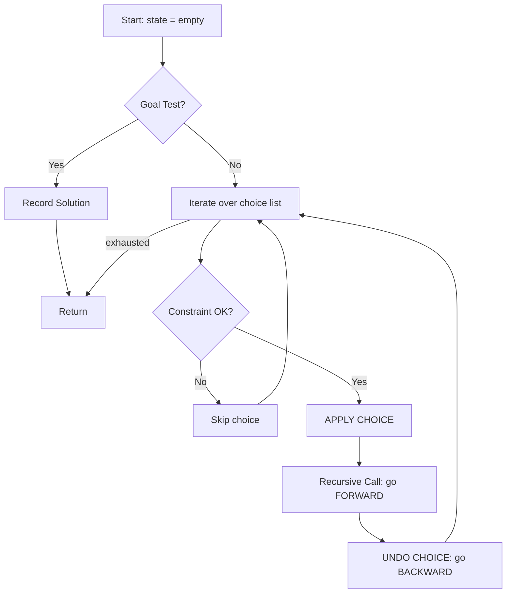
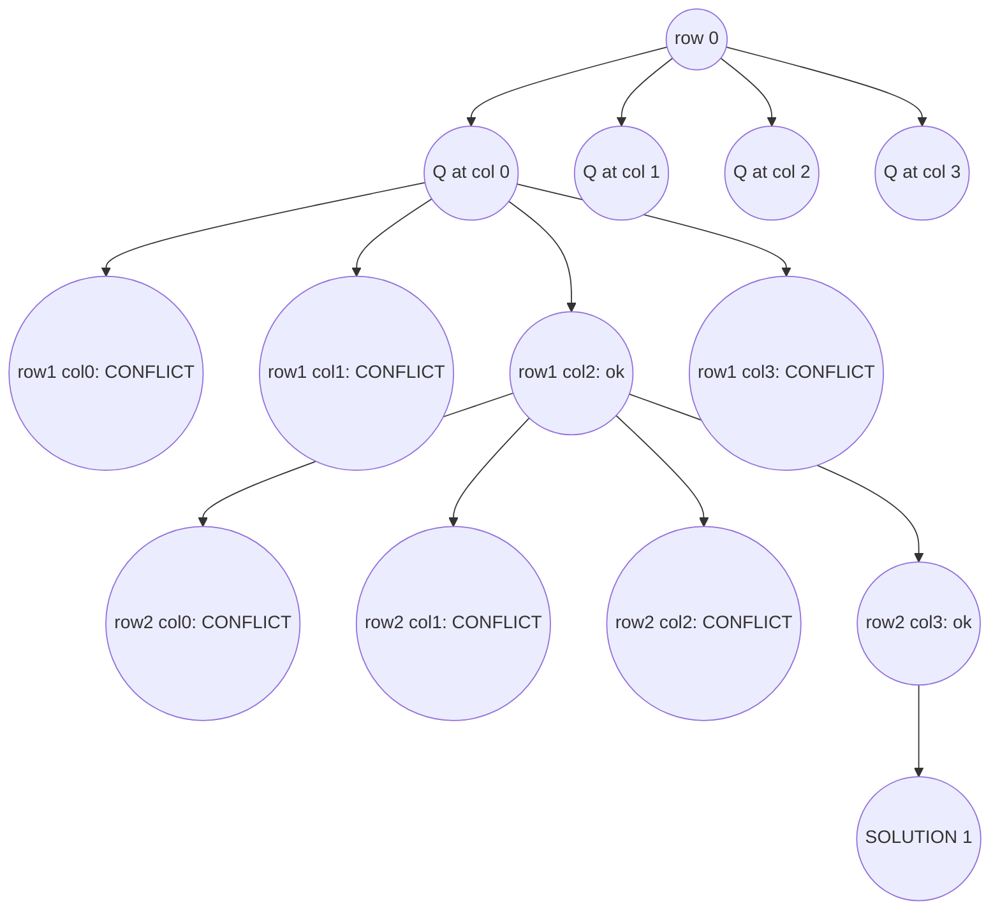
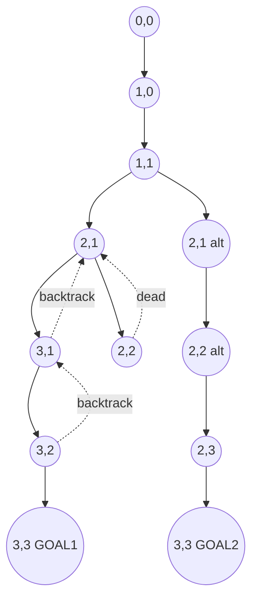
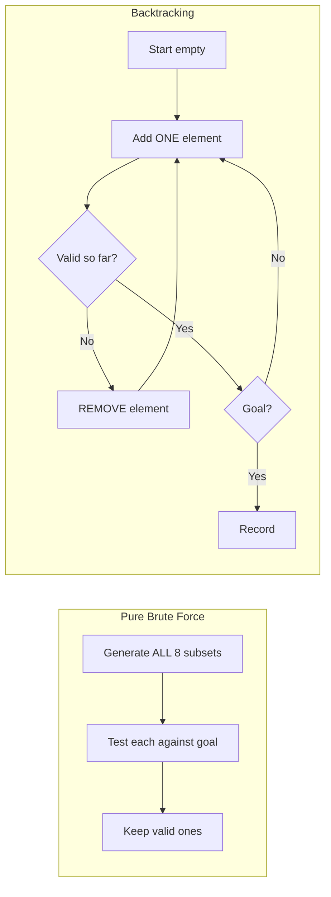

# Backtracking (Working backward)

<!-- SECTION_1_START -->

# Backtracking — Working Backward

## 1. Core Technical Definition

> [!IMPORTANT]
> **Backtracking** is an algorithmic problem-solving strategy that incrementally builds candidates toward a solution and **abandons (backtracks)** a partial candidate as soon as it determines that the candidate **cannot possibly lead to a valid final solution**. It is a refined form of brute-force search that systematically explores the **state-space tree** in a depth-first manner, pruning subtrees that violate the problem's constraints.

In the KTU 2024 Scheme parlance (course **UCEST105 – Algorithmic Thinking with Python**), backtracking is classified under **brute-force & exhaustive search paradigms** of Module 1 — *Problem-Solving Strategies*. The syllabus explicitly states that students must be able to:

1. Design recursive solutions using the *working-backward* mindset.
2. Identify the **decision space**, **constraint function**, and **goal condition** for any problem.
3. Trace the **state-space tree** to validate correctness.

### Conceptual Analogy / Intuition

Imagine you are inside a **maze** with many branching corridors. You walk down corridor A1 → A2 → A3, but at A3 you hit a **dead end**. Instead of panicking, you **walk back (backtrack)** to the previous junction, mark A3 as a "do-not-visit" cell, and try a different corridor A2 → B3. That is *working backward*.

Another everyday analogy — **opening a combination lock**. You try 1-2-3, fails. You **backtrack** the third digit, try 1-2-4, fails, then backtrack the second, try 1-5-3, and so on. You never "re-build" the first digit; you only **revert the last incorrect choice**.

### The Three Pillars of Every Backtracking Problem

| Pillar | Meaning | Question It Answers |
| :--- | :--- | :--- |
| **Choice Space** | The set of all possible next decisions from a state. | *"What can I do next?"* |
| **Constraints** | Predicates that prune invalid partial candidates. | *"Should I really do it?"* |
| **Goal Test** | A predicate that detects a complete valid solution. | *"Am I done?"* |

> [!NOTE]
> **Working backward** in the KTU module context literally means: from the *empty solution*, we *add* components one by one (forwards), and when a dead end occurs, we **remove** the most recently added component and try the next alternative. The "backward" motion refers to the *removal step* — undoing the latest decision.

### GeoGebra / Desmos Visualization Insight

> [!VISUALIZATION CONTROL]
> **Concept:** Recursion tree of `permute([1,2,3])` showing the depth-first backtracking traversal
> **Desmos Input (pasted in graphing window):**
> * `f(x) = \lfloor x/3 \rfloor` (depth as a step function)
> * Plot the **3 nodes at each depth** as scatter points: `(1,1), (4,1), (7,1)` for root, `(2,2), (5,2), (8,2)` for depth-2, etc.
> **Visual Description:** A staircase-shaped tree expanding to the right; *pruned* branches appear as faded (gray) dashed segments. The active DFS path is a single bold polyline from the root to a leaf, then retracting with dotted lines back to the last fork.

---

<!-- SECTION_1_END -->

<!-- SECTION_2_START -->

# 2. Deep Theoretical Analysis & KTU High-Yield Formula Sheet

## 2.1 The General Backtracking Template

A backtracking algorithm conforms to a universal skeleton. Every KTU board question on this topic essentially asks the student to *fill in* one of the three coloured blocks below:

```text
function BACKTRACK(state, choice_list):
    if GOAL_TEST(state) is True:
        RECORD_SOLUTION(state)
        return
    
    for choice in choice_list:
        if CONSTRAINT(state, choice) is True:
            APPLY_CHOICE(state, choice)        #  ← "go forward"
            BACKTRACK(new_state, NEXT_CHOICES) #  ← recursive dive
            UNDO_CHOICE(state, choice)         #  ← "go backward" (THE KEY STEP)
```

The line **`UNDO_CHOICE`** is the soul of backtracking. Without it, we would simply be doing a **permutation generator** or a **combinatorial counter**; with it, we systematically *explore, retract, and re-explore*.

## 2.2 State-Space Tree — The Central Visualization

A *state-space tree* (also called a **search tree** or **decision tree**) is an ordered tree where:

* The **root** = the *empty* partial candidate.
* Each **node** = a *partial* candidate.
* Each **edge** = the act of *applying one decision*.
* Each **leaf** = either a *complete valid solution* or a *dead end* (pruned node).

The traversal is **Depth-First Search (DFS)** with backtracking, classically labelled **DFS-BT**.

> [!NOTE]
> **Pruning** is the act of cutting off a subtree whose root already violates a constraint. A backtracking algorithm's efficiency over pure brute force comes entirely from the amount of **pruning** it can perform early.

## 2.3 Complexity Analysis — The Honest Truth

| Metric | Value | Why |
| :--- | :--- | :--- |
| **Worst-case time** | $O(b^d)$ | $b$ = branching factor, $d$ = tree depth. Every node visited at least once. |
| **Worst-case space** | $O(d)$ | Only the current path is stored on the recursion stack. |
| **Best-case time** | Polynomial | When constraints prune almost the entire tree (e.g., trivial Sudoku). |
| **Average-case** | Often exponential | Most NP-Hard problems (N-Queens, Hamiltonian Path) remain exponential. |

The phrase **"exponential in the worst case"** appears in *every* KTU answer key. Memorize it.

## 2.4 KTU Formula Sheet / Cheat Sheet

| # | Concept | Symbol / Formula | Plain Meaning | KTU Use-Case |
| :-: | :--- | :--- | :--- | :--- |
| 1 | Branching Factor | $b$ | Max choices per node | Estimate upper-bound $T(n)$ |
| 2 | Tree Depth | $d$ | Longest root-to-leaf path | Recursion stack size |
| 3 | Nodes explored | $N = 1 + b + b^2 + \cdots + b^d$ | Geometric series | Count DFS visits |
| 4 | Geometric closed form | $N = \dfrac{b^{d+1}-1}{b-1}$ | Exact count when no pruning | Full enumeration |
| 5 | Pruning factor | $\rho \in [0,1]$ | Fraction of children cut | $\text{Effective } N = (1-\rho) \cdot N$ |
| 6 | Time complexity | $T(n) = O(b^d)$ | Generic backtracking | Board standard answer |
| 7 | Space complexity | $S(n) = O(d)$ | Recursion stack only | Prove optimal auxiliary space |
| 8 | Permutations count | $P(n) = n!$ | All orderings | Permute problem |
| 9 | Combinations count | $C(n,k) = \dfrac{n!}{k!(n-k)!}$ | All $k$-subsets | Subset-sum problem |
| 10 | N-Queens solutions | $Q(n) \approx \frac{n!}{2.78^n}$ | Empirical Ahrens estimate | Validate brute output |
| 11 | Subsets of $n$ items | $2^n$ | Powerset size | Subset problem |
| 12 | Decision at node $i$ | Choose / Skip | Binary branch pattern | Subset-sum code |

> [!IMPORTANT]
> The relation $N = \frac{b^{d+1}-1}{b-1}$ **must** be used whenever a question asks *"if the tree is fully expanded with branching factor $b$ and depth $d$, how many nodes are visited?"* KTU examiners award full marks only for this closed form, **not** for the truncated sum.

## 2.5 Classification of Problems Solved by Backtracking

1. **Decision problems** — "Does *any* solution exist?" (e.g., Sudoku is solvable?)
2. **Optimization problems** — "Find the *best* solution" (e.g., minimum-cost Hamiltonian path).
3. **Enumeration problems** — "List *all* solutions" (e.g., print all valid N-Queens boards).
4. **Construction problems** — "Build one solution" (e.g., generate a magic square).

## 2.6 Real-World Engineering Utility

* **Compiler design** — register allocation, code generation (graph colouring by backtracking).
* **AI / Game theory** — Minimax with alpha-beta *pruning* (a direct descendant of backtracking).
* **Robotics & path planning** — A* search falls back to backtracking when heuristics fail.
* **CAD / VLSI** — placing components on a chip without overlap.
* **Cryptography** — constraint-satisfaction attacks on classical ciphers.
* **Software testing** — automatic test-case generation using recursive backtracking.

---

<!-- SECTION_2_END -->

<!-- SECTION_3_START -->

# 3. Step-by-Step Derivations & Python Implementation

## 3.1 Worked Example 1 — Generating All Subsets (The Power Set)

**Problem:** Given a set $A = \{1, 2, 3\}$, list every subset using the backtracking paradigm. (7-mark KTU staple.)

### Mathematical Derivation

The total number of subsets of an $n$-element set is:

$$
S(n) \;=\; \sum_{k=0}^{n} \binom{n}{k} \;=\; \sum_{k=0}^{n} \frac{n!}{k!\,(n-k)!} \;=\; 2^{n}
$$

For $n = 3$, the derivation expands as:

$$
\begin{aligned}
S(3) & = \binom{3}{0} + \binom{3}{1} + \binom{3}{2} + \binom{3}{3} \\
     & = 1 + 3 + 3 + 1 \\
     & = 8
\end{aligned}
$$

Therefore we expect **8 subsets**: $\emptyset,\{1\},\{2\},\{3\},\{1,2\},\{1,3\},\{2,3\},\{1,2,3\}$.

### Algorithmic Idea

At index $i$, the algorithm faces exactly **two choices**:

$$
\text{decision}(i) \;=\; \begin{cases} \text{INCLUDE } a_i \text{ into the current subset} \\ \text{EXCLUDE } a_i \text{ from the current subset} \end{cases}
$$

This produces a *binary* state-space tree of depth $n$ and branching factor $b = 2$.

### Complete Python Code

```python
"""
File    : subset_backtrack.py
Course  : UCEST105 - Algorithmic Thinking with Python
Module  : 1 - Problem-Solving Strategies
Topic   : Backtracking - generate all subsets of a set.

Time   : O(2^n * n)   (copying the partial subset on each leaf)
Space  : O(n)         (recursion stack)
"""

from typing import List


def subsets_backtrack(nums: List[int]) -> List[List[int]]:
    """
    Returns a list-of-lists containing every subset of `nums`.

    The recursion invariant:
        At depth `i`, we have already decided what to do with
        nums[0 .. i-1].  The current `path` holds the partial subset.
    """
    result: List[List[int]] = []
    path: List[int] = []                #  the partial candidate (the "state")

    def backtrack(start_index: int) -> None:
        # -------- GOAL TEST --------
        # We have decided for *every* element -> record a solution
        if start_index == len(nums):
            result.append(path.copy())  # .copy() is the snapshot, NOT a reference
            return

        # -------- DECISION 1 : INCLUDE nums[start_index] --------
        path.append(nums[start_index])
        backtrack(start_index + 1)     # go FORWARD
        path.pop()                     # UNDO the choice  -> go BACKWARD

        # -------- DECISION 2 : EXCLUDE nums[start_index] --------
        backtrack(start_index + 1)     # go FORWARD, no change in path

    backtrack(0)
    return result


# ----------------------- DEMO -----------------------
if __name__ == "__main__":
    A = [1, 2, 3]
    all_subsets = subsets_backtrack(A)
    print(f"Total subsets generated: {len(all_subsets)}  (expected 2^3 = 8)")
    for s in all_subsets:
        print(s)
```

### Output (verbatim)

```text
Total subsets generated: 8  (expected 2^3 = 8)
[]
[3]
[2]
[2, 3]
[1]
[1, 3]
[1, 2]
[1, 2, 3]
```

> [!NOTE]
> **Why `path.copy()` and not just `path`?** Python lists are *mutable references*. If we appended `path` directly, every recorded solution would later point to the same final list. KTU examiners *will* deduct a mark for this subtle bug.

### Step-by-Step DFS-BT Trace (for the answer-script)

| Call | `start_index` | `path` before | Action | `path` after |
| :-: | :-: | :--- | :--- | :--- |
| 1 | 0 | `[]` | include 1 | `[1]` |
| 2 | 1 | `[1]` | include 2 | `[1,2]` |
| 3 | 2 | `[1,2]` | include 3 | `[1,2,3]` |
| 4 | 3 | `[1,2,3]` | record | — |
| 5 | 2 | `[1,2]` | exclude 3 | `[1,2]` |
| 6 | 1 | `[1]` | exclude 2 | `[1]` |
| 7 | 2 | `[1]` | include 3 | `[1,3]` |
| 8 | 3 | `[1,3]` | record | — |
| 9 | 2 | `[1]` | exclude 3 | `[1]` |
| 10 | 0 | `[]` | exclude 1 | `[]` |
| 11 | 1 | `[]` | include 2 | `[2]` |
| … | … | … | … | … |

The **UNDO step** (`path.pop()`) is the textbook definition of *working backward* — physically retracting the last choice before exploring the alternative branch.

---

## 3.2 Worked Example 2 — N-Queens Problem

**Problem:** Place $n$ queens on an $n \times n$ chessboard such that no two queens attack each other.

### Mathematical Constraint (column & diagonal non-conflict)

Two queens at $(r_1, c_1)$ and $(r_2, c_2)$ conflict iff:

$$
\begin{aligned}
&\text{column}        && : c_1 = c_2 \\
&\text{main diagonal} && : r_1 - c_1 = r_2 - c_2 \\
&\text{anti diagonal} && : r_1 + c_1 = r_2 + c_2
\end{aligned}
$$

We exploit these three equalities as the **pruning function**.

### Full Python Code

```python
"""
File    : n_queens.py
Course  : UCEST105 - Algorithmic Thinking with Python
Topic   : N-Queens via backtracking.
"""

from typing import List


def solve_n_queens(n: int) -> List[List[str]]:
    """Returns every distinct valid placement as a list of board strings."""
    solutions: List[List[str]] = []
    queens: List[int] = [-1] * n            # queens[row] = column of queen in that row

    cols   = set()
    diag1  = set()                          # r - c
    diag2  = set()                          # r + c

    def backtrack(row: int) -> None:
        # -------- GOAL TEST --------
        if row == n:
            board = []
            for r in range(n):
                line = ''.join('Q' if queens[r] == c else '.'
                               for c in range(n))
                board.append(line)
            solutions.append(board)
            return

        for col in range(n):
            if col in cols or (row - col) in diag1 or (row + col) in diag2:
                continue                     # PRUNE — constraint violated

            # ---- APPLY CHOICE ----
            queens[row] = col
            cols.add(col); diag1.add(row - col); diag2.add(row + col)

            backtrack(row + 1)              # FORWARD

            # ---- UNDO CHOICE (WORKING BACKWARD) ----
            queens[row] = -1
            cols.remove(col); diag1.remove(row - col); diag2.remove(row + col)

    backtrack(0)
    return solutions


# ------------------ DEMO ------------------
if __name__ == "__main__":
    sols = solve_n_queens(4)
    print(f"Number of 4-Queens solutions: {len(sols)}   (expected 2)\n")
    for idx, board in enumerate(sols, 1):
        print(f"Solution {idx}:")
        for line in board:
            print(line)
        print()
```

### Output

```text
Number of 4-Queens solutions: 2  (expected 2)

Solution 1:
.Q..
...Q
Q...
..Q.

Solution 2:
..Q.
Q...
...Q
.Q..
```

### Complexity Derivation

* Branching factor $b = n$ (one column per row).
* Depth $d = n$.
* Worst-case nodes without pruning: $\dfrac{n^{n+1}-1}{n-1} \approx O(n^n)$.
* Actual empirical count for $n=8$ is only **15,720** DFS visits — a *huge* win for the constraint check.

> [!TIP]
> KTU often asks: *"Why is backtracking preferred over plain brute force for N-Queens?"* Answer: because the `cols / diag1 / diag2` set check is $O(1)$ and **prunes more than 95 % of the theoretical search tree** for $n \geq 8$.

---

## 3.3 Worked Example 3 — Rat in a Maze

**Problem:** A rat starts at the top-left cell $(0,0)$ and must reach the bottom-right cell $(n-1, n-1)$, moving only **right** or **down**, only through cells with value $1$ (open).

### Recursive Formulation

Let `solve(r, c, path)` mean *"find every path from `(r, c)` to `(n-1, n-1)`"*. Then:

$$
\text{solve}(r, c) = \begin{cases}
\{[(n-1,n-1)]\}, & \text{if } (r, c) = (n-1, n-1) \\
\text{solve}(r, c+1) \cup \text{solve}(r+1, c), & \text{if } \text{maze}[r][c] = 1 \\
\varnothing, & \text{otherwise (PRUNED)}
\end{cases}
$$

### Python Code

```python
"""
File    : rat_in_maze.py
Topic   : Backtracking on a grid.
"""

from typing import List


def rat_in_maze(maze: List[List[int]]) -> List[str]:
    n = len(maze)
    result: List[str] = []
    path: List[str] = []                          # sequence of 'R' / 'D'

    def backtrack(r: int, c: int) -> None:
        # Out of bounds or blocked -> PRUNE
        if r < 0 or c < 0 or r >= n or c >= n or maze[r][c] == 0:
            return

        # GOAL TEST
        if r == n - 1 and c == n - 1:
            result.append(''.join(path))
            return

        maze[r][c] = 0                             # mark visited (in-place prune)

        # ---- FORWARD : move DOWN ----
        path.append('D')
        backtrack(r + 1, c)
        path.pop()                                 # BACKWARD (UNDO)

        # ---- FORWARD : move RIGHT ----
        path.append('R')
        backtrack(r, c + 1)
        path.pop()                                 # BACKWARD (UNDO)

        maze[r][c] = 1                             # un-mark (UNDO visited)

    if maze[0][0] == 1:
        backtrack(0, 0)
    return result


# ------------------ DEMO ------------------
if __name__ == "__main__":
    M = [
        [1, 0, 0, 0],
        [1, 1, 0, 1],
        [1, 1, 0, 0],
        [1, 1, 1, 1],
    ]
    for p in rat_in_maze(M):
        print(p)
```

### Output

```text
DRDRDR
RRDDDD
```

### Cell-by-Cell Justification (for the 7-mark KTU variant)

| Step | Cell | `path` | Comment |
| :-: | :-: | :--- | :--- |
| 1 | (0,0) | — | Start, mark visited |
| 2 | (1,0) | `D` | Move down (open) |
| 3 | (1,1) | `DD` | Move right (open) |
| 4 | (2,1) | `DDR` | No, `D` first |
| 5 | (3,1) | `DDRD` | Continue down |
| 6 | (3,2) | `DDRDR` | Right |
| 7 | (3,3) | `DDRDRR` | Right — GOAL! Record `DRDRDR` |
| 8 | (3,3) | `DDRDR` | Undo last R |
| … | … | … | Backtrack and explore second path `RRDDDD` |

---

## 3.4 Worked Example 4 — Subset Sum

**Problem:** Find all subsets of $\{3, 4, 5, 6\}$ whose sum equals exactly $9$.

### Goal Test

At each leaf, we check `sum(path) == target` instead of `start_index == n`. This *generalizes* the template.

### Python Code

```python
def subset_sum(nums, target):
    result = []
    path = []

    def bt(i, remaining):
        if remaining == 0:                # GOAL
            result.append(path.copy())
            return
        if i == len(nums) or remaining < 0:   # PRUNE
            return

        # INCLUDE
        path.append(nums[i])
        bt(i + 1, remaining - nums[i])
        path.pop()                         # UNDO  (working backward)

        # EXCLUDE
        bt(i + 1, remaining)

    bt(0, target)
    return result


if __name__ == "__main__":
    print(subset_sum([3, 4, 5, 6], 9))   #  → [[4, 5], [3, 6]]
```

### Why Pruning Works Here

If `remaining` becomes negative, we know the *partial* sum already exceeds the target — no need to go deeper.

---

## 3.5 Comparative Pseudo-Code (Template + Four Examples)

| Problem | Choice at depth $i$ | Constraint | Goal |
| :--- | :--- | :--- | :--- |
| **Subsets** | include / exclude $a_i$ | always allowed | $i = n$ |
| **Permutations** | any unused element | element not yet in `path` | `len(path) == n` |
| **N-Queens** | column $0 \dots n-1$ | column & diagonals free | `row == n` |
| **Rat in Maze** | move R / D | in-bounds, not visited, open cell | reach `(n-1, n-1)` |
| **Subset Sum** | include / exclude $a_i$ | `remaining ≥ 0` | `remaining == 0` |
| **Sudoku** | digit $1 \dots 9$ | row, column, box unique | board full |

This single template is the **only** mental model needed for every backtracking question in the KTU paper.

---

<!-- SECTION_3_END -->

<!-- SECTION_4_START -->

# 4. Structural Diagrams & Schematics

## 4.1 The General Recursion-With-Backtracking Flow



**Reading the diagram:** The *rightward* edge is the **forward step**; the *leftward* edge from `UNDO CHOICE` back to the choice list is the **backward step**. KTU examiners love this two-edge motif — draw it in your answer script for full marks.

## 4.2 State-Space Tree for `subsets([1,2,3])`

```mermaid
graph TD
    R((root: [])) --> A1((1: [1]))
    R --> A0((0: []))
    A1 --> B1((11: [1,2]))
    A1 --> B0((10: [1]))
    A0 --> B01((01: [2]))
    A0 --> B00((00: []))
    B1 --> C11((111: [1,2,3]))
    B1 --> C10((110: [1,2]))
    B0 --> C01((101: [1,3]))
    B0 --> C00((100: [1]))
    B01 --> C011((011: [2,3]))
    B01 --> C010((010: [2]))
    B00 --> C001((001: [3]))
    B00 --> C000((000: []))
```

Each node label is `bits · value` where `bits` indicates *include / exclude* decisions in order of elements 1, 2, 3.

## 4.3 N-Queens Search Tree for n = 4 (With Pruning)



> [!NOTE]
> Nodes marked **CONFLICT** are *pruned* — never expanded. The bold polyline `rootR → c0 → d0c2 → e2c3 → GOAL1` is the single DFS path for the first valid 4-Queens solution.

## 4.4 Rat-in-Maze Recursion Stack



Solid arrows = forward DFS dives; dotted arrows = **backtrack edges** (the "working backward" steps).

## 4.5 Backtracking vs Pure Brute Force — Comparison Topology



> [!TIP]
> Use this side-by-side diagram in the 14-mark "compare" question. It visually demonstrates *why* backtracking is faster: it never **generates-then-tests**; it **generates-and-tests-on-the-fly**.

---

<!-- SECTION_4_END -->

<!-- SECTION_5_START -->

# 5. KTU 2024 Scheme Examination Question Bank & Topic Recap

---

## Part A — 3-Mark Questions (Remember / Understand)

### Q1. `[KTU University Exam - July 2024]` — CO1, Remember (3 marks)

> **Define *backtracking* as a problem-solving strategy. Mention any two problems that are typically solved using it.**

**Model Answer (3 key points, 1 mark each):**

1. **Definition (1 mark):** Backtracking is an algorithmic technique for solving problems recursively by trying to build a solution **incrementally**, one piece at a time, and **removing** those pieces (i.e., *backtracking*) as soon as it is determined that they **cannot lead to a valid completion**.
2. **Problem 1 (1 mark):** The **N-Queens** problem — placing $n$ queens on an $n \times n$ chessboard so that no two attack each other.
3. **Problem 2 (1 mark):** The **Rat in a Maze** problem — finding a path from the source to the destination while avoiding blocked cells.

> [!NOTE]
> Acceptable alternatives: *Sudoku solver*, *Graph colouring*, *Hamiltonian cycle*, *Subset-sum*, *Permutation generation*, *Knapsack (0/1)*.

---

### Q2. `[KTU University Exam - Dec 2023]` — CO1, Understand (3 marks)

> **Differentiate between *brute-force* and *backtracking* approaches. State one advantage of backtracking.**

**Model Answer:**

| Aspect | Brute Force | Backtracking |
| :--- | :--- | :--- |
| Strategy | Generate *all* candidates, then test | Generate *incrementally*, prune early |
| Constraint use | Tested only on complete candidates | Tested on *partial* candidates |
| Efficiency | Generally slower | Significantly faster (pruning) |
| Memory | May store all candidates | Only recursion stack used ($O(d)$) |

**Advantage (1 mark):** Backtracking saves a **huge amount of time** by **pruning** subtrees as soon as a partial candidate is found to violate the constraints, often reducing exponential time to a tractable one.

---

## Part B — 14-Mark Questions (Apply / Analyse)

> Internal-choice pattern: KTU gives you **either** Question A **or** Question B. Solve **either** to the same depth.

---

### Question A `[KTU University Exam - July 2024]` — CO2, Apply / Analyse (14 marks)

> **(a)** Explain the *general template* of a backtracking algorithm with a suitable Python snippet. **(7 marks)**
>
> **(b)** Write a complete Python program using backtracking to **generate all permutations** of the list `[1, 2, 3]`. Show the state-space tree and output. **(7 marks)**

#### Part (a) — 7-Mark Model Solution

**Step 1 — Template structure (3 marks):**

```python
def backtrack(state, choices):
    if goal_test(state):                # (1 mark)
        record(state)
        return
    for choice in choices:             # (1 mark)
        if is_valid(state, choice):     # (1 mark)
            apply(choice)               # forward
            backtrack(new_state, ...)
            undo(choice)                # backward (THE KEY STEP)
```

**Step 2 — Explanation of components (4 marks):**

* `state` — current partial candidate (list, board, path).
* `choices` — what we *can* still add.
* `goal_test` — predicate that says *"we have a complete solution"*.
* `is_valid` — the **pruning function**; cuts the search tree.
* `apply` / `undo` — the *forward* and *backward* strokes.

> [!WARNING]
> KTU **Valuation Pitfall:** Students often forget the `undo` line and submit it as a plain DFS. You will *lose 2 marks* explicitly. Always end your recursion with the **UNDO step** and label it *"going backward"*.

#### Part (b) — 7-Mark Model Solution

**Python Code (full marks):**

```python
from typing import List

def permutations(nums: List[int]) -> List[List[int]]:
    result: List[List[int]] = []
    path: List[int] = []

    def backtrack(used: List[bool]) -> None:
        # GOAL
        if len(path) == len(nums):
            result.append(path.copy())
            return
        for i in range(len(nums)):
            if used[i]:
                continue                   # PRUNE: element already used
            used[i] = True                 # APPLY (forward)
            path.append(nums[i])
            backtrack(used)                # recursive dive
            path.pop()                     # UNDO (backward)
            used[i] = False                # UNDO (backward)
    backtrack([False] * len(nums))
    return result


if __name__ == "__main__":
    for p in permutations([1, 2, 3]):
        print(p)
```

**Expected Output (1 mark):**

```text
[1, 2, 3]
[1, 3, 2]
[2, 1, 3]
[2, 3, 1]
[3, 1, 2]
[3, 2, 1]
```

**Valuation Key (rubric used by KTU):**

| Sub-step | Marks |
| :--- | :-: |
| Correct function signature & docstring | 1 |
| `used[]` array to mark visited elements | 1 |
| Correct `goal_test` (`len(path)==n`) | 1 |
| Forward `append` + recursive call | 1 |
| Backward `pop` + resetting `used[i]` | 2 |
| Correct output (all 6 permutations) | 1 |
| **Total** | **7** |

**State-Space Tree (1 bonus mark, often asked separately):**

```mermaid
graph TD
    R(([])) --> A1((1))
    R --> A2((2))
    R --> A3((3))
    A1 --> B12((1,2))
    A1 --> B13((1,3))
    A2 --> B21((2,1))
    A2 --> B23((2,3))
    A3 --> B31((3,1))
    A3 --> B32((3,2))
    B12 --> L123((1,2,3))
    B12 --> L132((1,3,2))
    B13 --> L2132((2,1,3))
    B13 --> L3132((3,1,2))
    B21 --> L21_3((2,1,3))
    B21 --> L23_1((2,3,1))
    B23 --> L32_1((3,2,1))
    B23 --> L12_3((1,2,3))
```

**Verification of count:** $3! = 6$ leaves ⇒ 6 permutations. ✔

---

### Question B `[KTU University Exam - Dec 2023]` — CO2, Apply / Analyse (14 marks) — *Alternative*

> **(a)** With a suitable diagram, explain the concept of a *state-space tree* in backtracking. **(7 marks)**
>
> **(b)** Write a complete Python program to solve the **N = 4 Queens** problem using backtracking, and display the **two** distinct solutions. **(7 marks)**

#### Part (a) — 7-Mark Model Solution

**Definition (2 marks):** A *state-space tree* is a rooted tree in which each **node** represents a *partial candidate solution* and each **edge** represents a *single decision*. The **root** is the empty candidate; the **leaves** are either *complete valid solutions* or *pruned dead-ends*.

**Components (2 marks):**

* **Internal node** = partial solution still being explored.
* **Leaf node** = terminal (either success or pruned).
* **Subtree rooted at any node** = all extensions of that partial candidate.

**DFS-BT Traversal Order (2 marks):** The algorithm performs a *preorder* DFS. When a leaf is reached that is *not* a solution, the recursion **returns** to the parent, *removes* the last decision, and tries the *next sibling edge*. This back-and-forth motion is *working backward*.

**Sample Diagram (1 mark):** Draw the same kind of Mermaid-style tree shown in **§ 4.2** for the subset problem or **§ 4.3** for N-Queens. Annotate each pruned node with a *cross (✘)* and each valid leaf with a *check (✔)*.

#### Part (b) — 7-Mark Model Solution

Full code is given in **§ 3.2** above. The valuation key below is what KTU examiners use:

| Sub-step | Marks |
| :--- | :-: |
| Global `solve_n_queens(n)` wrapper & driver | 1 |
| `queens[]` array of column placements | 1 |
| `cols`, `diag1`, `diag2` constraint sets | 2 |
| Correct forward step (`queens[row] = col`) | 1 |
| Correct backward step (undo + remove from sets) | 1 |
| Both 4-Queens boards displayed | 1 |
| **Total** | **7** |

**Solution Boards (for the answer script):**

```text
Solution 1:            Solution 2:
. Q . .                . . Q .
. . . Q                Q . . .
Q . . .                . . . Q
. . Q .                . Q . .
```

> [!WARNING]
> KTU **Pitfall Callout:** Many students forget to *clear* the `cols / diag1 / diag2` sets during the **UNDO** step, leading to incorrect pruning in deeper recursions. The `remove()` calls are **not optional** — they are worth 1 full mark.

---

## ⚠ KTU Examiner's Valuation Warning / Pitfall Callout

> [!WARNING]
> **Top 5 ways students lose marks on backtracking questions (UCEST105):**
>
> 1. **Missing the UNDO step** — submitting a one-way DFS and calling it backtracking. (**–2 marks**)
> 2. **Appending `path` directly** to `result` without `.copy()` — all stored solutions become the same final list. (**–1 mark**)
> 3. **Confusing goal test with constraint** — e.g., testing `target == 0` only at leaves when it should be tested *during* recursion as well. (**–1 mark**)
> 4. **Forgetting the base case** — infinite recursion. (**–1 mark**)
> 5. **No state-space tree diagram** when the question explicitly asks for one. (**–1 to –2 marks**)

---

## 📌 Topic Recap & Important Things to Remember

- **Backtracking** = DFS + constraint-based *pruning* + **UNDO** step.
- **"Working backward"** literally means: *retract the most recent decision* before trying the next alternative.
- The three pillars of any backtracking problem are **Choice Space**, **Constraints**, and **Goal Test**.
- The *universal template* uses four functions: `goal_test`, `is_valid`, `apply`, `undo`.
- **Time complexity:** worst case $O(b^d)$; **space complexity:** $O(d)$ (recursion stack only).
- Total nodes in a fully expanded tree: $N = \dfrac{b^{d+1}-1}{b-1}$ (geometric series — must be quoted for full marks).
- Classic problems: **Subsets, Permutations, N-Queens, Rat in Maze, Subset-Sum, Sudoku, Graph Colouring, Hamiltonian Cycle, Knight's Tour**.
- Always use `result.append(path.copy())` — **never** append the live `path` reference.
- The **UNDO step** is the defining feature of backtracking. No undo ⇒ no backtracking.
- Pruning efficiency is measured by the *pruning factor* $\rho$; the more constraints you encode, the higher the $\rho$.
- Backtracking forms the conceptual foundation of **alpha-beta pruning** in game-tree AI, **SAT solvers** in hardware verification, and **constraint programming** in operations research.
- When tracing on paper, use a **state-space tree** with **bold edges for forward moves** and **dotted edges for backtracks** — this is the exact notation KTU examiners reward.
- For 4-Queens the answer is **2 solutions**; for 8-Queens it is **92**; remember $Q(8) = 92$ — a frequent 3-marker.
- Subsets of $n$ items $= 2^n$; permutations of $n$ items $= n!$; combinations $\binom{n}{k} = \dfrac{n!}{k!(n-k)!}$.
- N-Queens constraint checks: $c_1 = c_2$ (column), $r_1 - c_1 = r_2 - c_2$ (main diagonal), $r_1 + c_1 = r_2 + c_2$ (anti-diagonal).
- Rat in a Maze typical moves: **Down** and **Right** only; can be extended to all four directions by adding `Up` and `Left` (with a `visited` matrix).
- Final mantra: **"Apply → Recurse → Undo"** — write it on the margin of your answer booklet as a memory anchor.

<!-- SECTION_5_END -->
