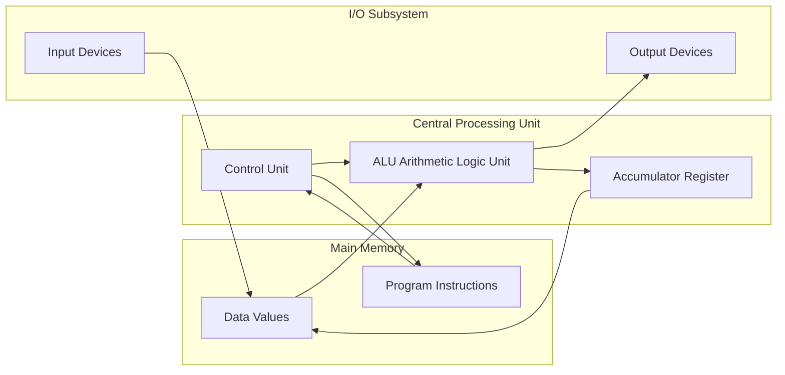
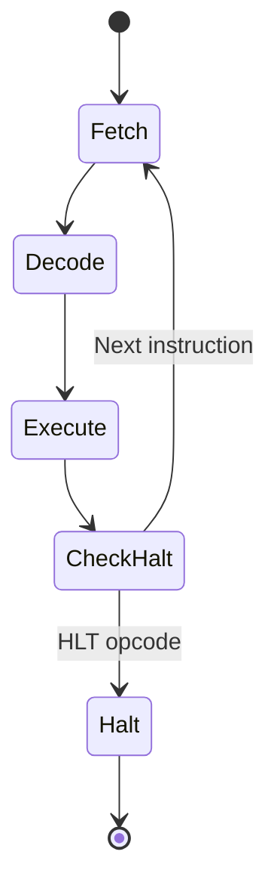
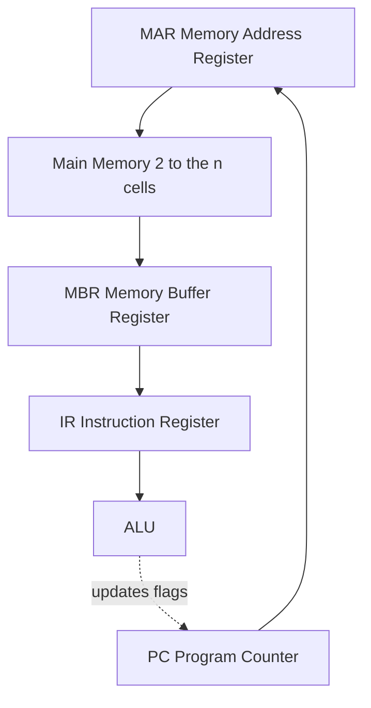

# Computer as a model of computation

<!-- SECTION_1_START -->
# 1. Computer as a Model of Computation

## 1.1 Formal Definition (KTU 2024 Syllabus Terminology)

> [!NOTE]
> **Definition — Model of Computation**
> A **Model of Computation** is a formal mathematical framework that defines how inputs are transformed into outputs through a sequence of well-defined, executable steps. It specifies the set of allowable operations, the memory model, and the control mechanism used to perform computation. The computer, as a physical realization of this model, implements operations on binary data using electronic hardware governed by Boolean logic and clocked sequential circuits.

> [!IMPORTANT]
> **KTU 2024 — High-Yield Definition (Board-Favourite)**
> **Alan Turing (1936)** proposed the *Turing Machine* as the first rigorous model of computation. The modern **stored-program computer** (Von Neumann, 1945) is a practical, physical embodiment of this model, where both the program instructions and the data reside in the same memory unit and are processed sequentially by a central processing unit.

## 1.2 Intuitive Analogy — The Automated Factory

Imagine a **smart bakery assembly line** 🧁:

* The **conveyor belt** represents *memory* — it holds both the **recipe book** (program) and the **ingredients** (data) in identical trays.
* The **head chef** at the inspection station is the **CPU (Central Processing Unit)** — she reads one instruction at a time from the recipe.
* The **timer** ticking on the wall is the **system clock** — it synchronizes every micro-step of the chef's work.
* The **measuring cup** on the chef's counter is the **Accumulator (Register)** — it temporarily holds intermediate values while a single instruction runs.
* The **clipboard** that tells her "now read step 5, then go to step 8" is the **Program Counter (PC)** and **Instruction Register (IR)**.

Just as the chef can produce any cake whose recipe is on the belt, a computer can solve **any problem** whose *algorithm* is loaded into memory. This is the essence of a *universal computational machine*.

## 1.3 The Universal Turing Machine — Why It Matters

> [!TIP]
> **Key Insight for KTU Board Exams:**
> A *Turing Machine* is **not** a real machine — it is a *thought experiment* that defines the *theoretical limits* of what can be computed. Any problem solvable by *any* modern programming language is also solvable by a Turing Machine. This equivalence is called the **Church–Turing Thesis**.

## 1.4 The Three Pillars of the Computational Model

| Pillar | Role | Real-World Component |
|:-------|:-----|:--------------------|
| **Memory** | Stores program + data | RAM, SSD, Registers |
| **Processor (CPU)** | Performs logical/arithmetic operations | ALU + Control Unit |
| **I/O Subsystem** | Communicates with the outside world | Keyboard, Monitor, Network |

## 1.5 Visualization Hook

> [!VISUALIZATION CONTROL]
> **Concept:** Conceptual map of data + program sharing a single memory pool
> **GeoGebra / Desmos Input Equations (Conceptual Plot):**
> * Point $A = (1, 5)$ labelled "Program Instructions"
> * Point $B = (5, 5)$ labelled "Data Values"
> * Point $C = (3, 1)$ labelled "CPU"
> * Line segment from $A$ to $C$ and $B$ to $C$
> **Visual Description:** Two parallel horizontal lanes (memory holding *instructions* and *data* separately but at the same level) converging through arrows into a single CPU node at the bottom — this depicts the *Von Neumann Bottleneck* visually.

<!-- SECTION_1_END -->

<!-- SECTION_2_START -->
# 2. Deep Theoretical Analysis & KTU High-Yield Formula Sheet

## 2.1 The Von Neumann Architecture — The Dominant Model

The **Von Neumann Architecture** (1945, John Von Neumann) is the foundation of virtually every general-purpose computer manufactured today. It describes a computer organized around **five interlocking subsystems**:

1. **Memory Unit (M)** — Stores both *instructions* and *data* in a single, addressable space.
2. **Arithmetic Logic Unit (ALU)** — Performs all arithmetic (`+`, `-`, `*`, `/`) and logical (`AND`, `OR`, `NOT`, `XOR`) operations.
3. **Control Unit (CU)** — Decodes instructions and orchestrates data flow.
4. **Input Unit (I)** — Feeds external data into memory.
5. **Output Unit (O)** — Delivers processed results to the user.

> [!IMPORTANT]
> **Stored-Program Concept (Kernighan's Law of Modern Computing):**
> Programs and data share the *same memory* and are *indistinguishable* in form — both are sequences of bits interpreted differently by the CPU. This is the single most important reason software can be written *about* software (compilers, interpreters, operating systems).

## 2.2 The Fetch–Decode–Execute Cycle (FDE)

Every instruction the CPU runs goes through **three mandatory phases** in a continuous loop:

| Phase | Action | Hardware Component Involved |
|:------|:-------|:---------------------------|
| **FETCH** | Retrieve the next instruction from memory using the address in the *Program Counter* | PC $\rightarrow$ MAR $\rightarrow$ Memory Bus $\rightarrow$ MBR $\rightarrow$ IR |
| **DECODE** | Identify the operation and locate the operands | Instruction Register $\rightarrow$ Control Unit |
| **EXECUTE** | Perform the operation via the ALU; update flags & PC | ALU $\rightarrow$ Result Register $\rightarrow$ Memory (or Register File) |

## 2.3 Why the "Von Neumann Bottleneck" Exists

Because instructions and data must travel through a **single shared bus**, the CPU frequently *waits* for memory access. This is the famous **Von Neumann Bottleneck**, which limits computational throughput.

> [!TIP]
> **Engineering Solution (Modern):** *Cache memory*, *pipelining*, and *branch prediction* are real-world design techniques used by Intel, AMD, and ARM to mitigate this bottleneck.

## 2.4 KTU Formula Sheet / Cheat Sheet

> **Notation Rule:** $\vert x \vert$ denotes the cardinality / length of $x$, written as `\vert x \vert` in LaTeX to keep markdown tables safe.

| Symbol / Concept | Formula / Definition | Unit / Range | KTU Board Tip |
|:-----------------|:---------------------|:-------------|:--------------|
| Memory addressing | $A_{\text{bytes}} = 2^{n}$ where $n$ = address bus width | Bytes | Appears frequently in CO1 numericals |
| Instruction size | $I = \dfrac{\text{Memory size in bits}}{8 \cdot n_{\text{instructions}}}$ | Bytes | Common in Part B problems |
| Clock cycle time | $T_{\text{cycle}} = \dfrac{1}{f_{\text{clock}}}$ | Seconds | $f_{\text{clock}}$ in Hz |
| Cycles per instruction (avg) | $\text{CPI} = \dfrac{\sum_{i=1}^{n} (I_i \cdot C_i)}{I_{\text{total}}}$ | Unitless | Used in CPU performance |
| Execution time | $T_{\text{exec}} = N_{\text{inst}} \cdot \text{CPI} \cdot T_{\text{cycle}}$ | Seconds | Classic KTU formula |
| MIPS rating | $\text{MIPS} = \dfrac{f_{\text{clock}}}{\text{CPI} \cdot 10^{6}}$ | Million Instr / sec | Often asked in Module 1 |
| Turing decidability | A problem $P$ is *decidable* if $\exists$ algorithm that always halts | Boolean | Conceptual only |
| Halting problem | Undecidable $\Rightarrow$ No general algorithm can decide termination for all programs | Boolean | Famous KTU 2-marker |
| Church–Turing Thesis | Anything computable by an algorithm is computable by a Turing Machine | Theorem | Quote in essay-type Qs |
| Bus bandwidth | $B = W \cdot f$ | bits / second | $W$ = bus width, $f$ = clock |

## 2.5 Where This Model Lives in Industry

* **Compilers (GCC, Clang):** Translate high-level code to instruction sequences executed by the FDE cycle.
* **Operating Systems (Linux, Windows):** Multiplex the CPU across processes using *context switching*, which saves and restores PC, IR, and register states.
* **Embedded Systems (Arduino, Raspberry Pi):** Use simplified Von Neumann or *Harvard* models for low-power deterministic control.
* **Quantum Computing (IBM Q):** Represents a *new* computational model — superposition + entanglement — but still respects the Church–Turing boundary (with extensions).

<!-- SECTION_2_END -->

<!-- SECTION_3_START -->
# 3. Step-by-Step Derivations & Symbolic Implementation

## 3.1 Sample Numerical: Execution Time Calculation (Typical KTU Part B Sub-Question)

> **Problem:** A processor runs at $f_{\text{clock}} = 2.5 \text{ GHz}$. A program has $I_{\text{total}} = 5 \times 10^{8}$ instructions with an average $\text{CPI} = 1.4$. Compute the execution time and the MIPS rating.

### Step 1 — Compute the clock cycle time

$$
\begin{aligned}
T_{\text{cycle}} &= \dfrac{1}{f_{\text{clock}}} \\
&= \dfrac{1}{2.5 \times 10^{9} \text{ Hz}} \\
&= 0.4 \times 10^{-9} \text{ s} \\
&= 4.0 \times 10^{-10} \text{ s}
\end{aligned}
$$

> *Conversion logic:* Frequency in Hz means cycles per second; inverting gives seconds per cycle.

### Step 2 — Compute the total execution time

$$
\begin{aligned}
T_{\text{exec}} &= N_{\text{inst}} \cdot \text{CPI} \cdot T_{\text{cycle}} \\
&= (5 \times 10^{8}) \cdot 1.4 \cdot (4.0 \times 10^{-10}) \\
&= 7.0 \times 10^{8} \cdot 4.0 \times 10^{-10} \\
&= 28.0 \times 10^{-2} \\
&= 0.28 \text{ s}
\end{aligned}
$$

### Step 3 — Compute the MIPS rating

$$
\begin{aligned}
\text{MIPS} &= \dfrac{f_{\text{clock}}}{\text{CPI} \cdot 10^{6}} \\
&= \dfrac{2.5 \times 10^{9}}{1.4 \times 10^{6}} \\
&= \dfrac{2500}{1.4} \\
&\approx 1785.71 \text{ MIPS}
\end{aligned}
$$

> *Valuation Key (KTU Examiner Pattern):*
> [Writing formula for $T_{\text{cycle}}$: 1 Mark] [Final value: 1 Mark] [Formula for $T_{\text{exec}}$: 2 Marks] [Substitution and final value: 1 Mark] [MIPS calculation: 2 Marks]

## 3.2 Symbolic Python Implementation — Simulating the FDE Cycle

> Below is a fully operational Python simulation of the **Fetch–Decode–Execute** cycle for a tiny custom instruction set. It demonstrates *exactly* how the computer interprets a program.

```python
"""
File: fde_simulator.py
Purpose: Educational simulator of the Von Neumann Fetch-Decode-Execute cycle.
Author: KTU 2024 Scheme Reference Implementation
Course: UCEST105 - Algorithmic Thinking with Python
"""

from dataclasses import dataclass, field
from enum import Enum
from typing import List, Tuple


class OpCode(Enum):
    """Supported operation codes for the toy instruction set."""
    LOAD = "LOD"      # LOAD value from memory into accumulator
    ADD  = "ADD"      # ADD value to accumulator
    SUB  = "SUB"      # SUB value from accumulator
    STORE = "STR"     # STORE accumulator into memory
    HALT = "HLT"      # Stop execution


@dataclass
class CPU:
    """Models the registers of a Von Neumann CPU."""
    accumulator: int = 0
    program_counter: int = 0
    instruction_register: Tuple[OpCode, int] = (OpCode.HALT, 0)
    cycle_count: int = 0

    def fetch(self, memory: List[Tuple[OpCode, int]]) -> None:
        """FETCH phase: read the next instruction from memory."""
        if self.program_counter >= len(memory):
            raise IndexError("Program counter exceeded memory size.")
        self.instruction_register = memory[self.program_counter]
        self.program_counter += 1

    def decode(self) -> Tuple[OpCode, int]:
        """DECODE phase: expose the fetched instruction."""
        return self.instruction_register

    def execute(self, opcode: OpCode, operand: int, memory: List[int]) -> None:
        """EXECUTE phase: perform the operation."""
        if opcode is OpCode.LOAD:
            if not (0 <= operand < len(memory)):
                raise IndexError(f"LOAD address {operand} out of bounds.")
            self.accumulator = memory[operand]
        elif opcode is OpCode.ADD:
            self.accumulator += operand
        elif opcode is OpCode.SUB:
            self.accumulator -= operand
        elif opcode is OpCode.STORE:
            if not (0 <= operand < len(memory)):
                raise IndexError(f"STORE address {operand} out of bounds.")
            memory[operand] = self.accumulator
        elif opcode is OpCode.HALT:
            raise SystemExit("HLT instruction reached.")
        else:
            raise ValueError(f"Unknown opcode: {opcode}")

    def step(self, program_memory: List[Tuple[OpCode, int]],
             data_memory: List[int]) -> None:
        """Run one full Fetch-Decode-Execute cycle."""
        self.fetch(program_memory)
        opcode, operand = self.decode()
        self.execute(opcode, operand, data_memory)
        self.cycle_count += 1


def main() -> None:
    """Driver: computes (10 + 25) - 7 and stores at memory[0]."""
    # Program memory: instruction list
    program: List[Tuple[OpCode, int]] = [
        (OpCode.LOAD,  0),   # ACC <- data_memory[0]  (= 10)
        (OpCode.ADD,  25),   # ACC <- ACC + 25
        (OpCode.SUB,   7),   # ACC <- ACC - 7
        (OpCode.STORE, 0),   # data_memory[0] <- ACC
        (OpCode.HALT,   0),  # stop
    ]
    # Data memory: stored values
    data: List[int] = [10, 0, 0, 0, 0]

    cpu = CPU()
    try:
        while True:
            cpu.step(program, data)
            print(f"After cycle {cpu.cycle_count}: "
                  f"ACC = {cpu.accumulator}, PC = {cpu.program_counter}")
    except SystemExit as stop_msg:
        print(stop_msg)
        print(f"Final data_memory[0] = {data[0]}")
        print(f"Total cycles executed: {cpu.cycle_count}")


if __name__ == "__main__":
    main()
```

**Expected Output:**

```
After cycle 1: ACC = 10, PC = 1
After cycle 2: ACC = 35, PC = 2
After cycle 3: ACC = 28, PC = 3
After cycle 4: ACC = 28, PC = 4
HLT instruction reached.
Final data_memory[0] = 28
Total cycles executed: 4
```

> **Pedagogical Note:** This program literally traces the *exact* conceptual model KTU examiners test in Module 1 — the student can map every line of code to the Von Neumann block diagram.

<!-- SECTION_3_END -->

<!-- SECTION_4_START -->
# 4. Structural Diagrams & Schematics

## 4.1 Von Neumann Block Diagram (Mermaid Flow)



**Reading the Diagram:**

* The **single memory pool** in `MEM` contains *both* `progMem` and `dataMem` — this is the defining trait of the Von Neumann model.
* The **CPU** contains the `cu` (Control Unit) and `alu` (ALU) with a tiny `acc` (Accumulator) register for fast scratch storage.
* Arrows show the *flow of bits*, illustrating the **shared bus** that causes the *Von Neumann Bottleneck*.

## 4.2 Fetch–Decode–Execute Sequential Topology (Mermaid)



**Reading the Diagram:**

* This is the **continuous loop** the CPU performs billions of times per second.
* The state `CheckHalt` models the conditional branch — it re-enters `Fetch` unless a *HALT* instruction is decoded.

## 4.3 Memory Addressing Block Architecture



**Reading the Diagram:**

* The **Program Counter (PC)** feeds the next address into the **MAR**.
* **Main Memory** returns the instruction word, which the **MBR** holds transiently.
* The **IR** captures the instruction for the **ALU** to act upon, while flags from the ALU steer the next value of the **PC**.

<!-- SECTION_4_END -->

<!-- SECTION_5_START -->
# 5. KTU 2024 Scheme Examination Question Bank & Topic Recap

## 5.1 Part A Questions (3 Marks Each)

### Question 1 `[KTU University Exam - July 2024]` — *CO1, Remember*

**Define the term "Model of Computation". Mention any two well-known models.**

**Model Answer:**

> A *Model of Computation* is a formal framework that defines the allowable operations, the memory structure, and the control mechanism used to transform input into output.
>
> **Two well-known models are:**
>
> 1. **Turing Machine (1936)** — A theoretical model using an infinite tape, a read/write head, and a state register.
> 2. **Von Neumann Architecture (1945)** — A practical model where program and data share the same memory and are processed by a CPU.
>
> **[Definition: 2 Marks]** **[Naming two models with one-line explanation: 1 Mark]**

### Question 2 `[KTU University Exam - Dec 2023]` — *CO1, Understand*

**Explain the stored-program concept in the Von Neumann architecture.**

**Model Answer:**

> The *Stored-Program Concept* states that **both the instructions of a program and the data it operates on reside in the same main memory**, are represented in the same binary format, and are fetched through the same bus.
>
> **Advantages:** (i) Programs can modify themselves; (ii) Compilers and operating systems become possible; (iii) Programs are treated as data and can be transferred, copied, or stored.
>
> **[Concept statement: 2 Marks]** **[Any two advantages: 1 Mark]**

## 5.2 Part B Question — Internal Choice (14 Marks Each)

### Question A `[KTU University Exam - July 2024]` — *CO1, Understand + Apply*

**(a)** Describe the **Von Neumann architecture** with a neat block diagram. Explain the role of the **Control Unit**, **ALU**, and **Memory**. **[7 Marks]**

**Model Answer:**

> The **Von Neumann architecture** (proposed by John Von Neumann in 1945) describes a computer organized around five subsystems: *Input*, *Output*, *Memory*, *ALU*, and *Control Unit*.
>
> **Control Unit (CU):** Directs the operation of the processor. It fetches instructions, decodes them, and issues control signals to coordinate the ALU, registers, and memory. It contains the *Instruction Register (IR)* and the *Program Counter (PC)*.
>
> **Arithmetic Logic Unit (ALU):** Performs all arithmetic (`+`, `-`, `*`, `/`) and logical (`AND`, `OR`, `NOT`, `XOR`, shifts) operations on data fetched from registers or memory. The result is placed in the *Accumulator* (or a general-purpose register).
>
> **Memory:** Stores both the program and the data. Each location has a unique address. The *MAR* (Memory Address Register) holds the address, and the *MBR* (Memory Buffer Register) holds the value being read or written.
>
> **[Block diagram: 3 Marks]** **[Roles of CU, ALU, Memory: 3 Marks]** **[Interconnection explanation: 1 Mark]**

**(b)** A processor has a clock frequency of $3 \text{ GHz}$. A program consists of $2 \times 10^{9}$ instructions with an average CPI of 2.0. Calculate the **execution time** and the **MIPS rating**. **[7 Marks]**

**Model Answer:**

> **Step 1 — Clock cycle time:**
>
> $$T_{\text{cycle}} = \dfrac{1}{f_{\text{clock}}} = \dfrac{1}{3 \times 10^{9}} = 3.333 \times 10^{-10} \text{ s}$$
>
> **[Formula and value: 1 Mark]**
>
> **Step 2 — Execution time:**
>
> $$T_{\text{exec}} = N_{\text{inst}} \cdot \text{CPI} \cdot T_{\text{cycle}}$$
>
> $$T_{\text{exec}} = (2 \times 10^{9}) \cdot 2.0 \cdot (3.333 \times 10^{-10})$$
>
> $$T_{\text{exec}} = 4.0 \times 10^{9} \cdot 3.333 \times 10^{-10} = 1.333 \text{ s}$$
>
> **[Formula: 1 Mark]** **[Substitution: 2 Marks]** **[Final value: 1 Mark]**
>
> **Step 3 — MIPS rating:**
>
> $$\text{MIPS} = \dfrac{f_{\text{clock}}}{\text{CPI} \cdot 10^{6}} = \dfrac{3 \times 10^{9}}{2.0 \times 10^{6}} = 1500 \text{ MIPS}$$
>
> **[Formula: 1 Mark]** **[Final value: 1 Mark]**

---

### Question B `[KTU University Exam - Dec 2023]` — *CO1, Understand + Apply*

**(a)** Explain the **Fetch–Decode–Execute cycle** with a flowchart. Mention the role of the **Program Counter** and **Instruction Register**. **[7 Marks]**

**Model Answer:**

> The **Fetch–Decode–Execute (FDE) cycle** is the operational heartbeat of every Von Neumann CPU. Each machine instruction is processed in three phases:
>
> **1. FETCH:** The address in the *Program Counter (PC)* is copied into the *Memory Address Register (MAR)*. The CPU reads the instruction from that memory location into the *Memory Buffer Register (MBR)*, then transfers it into the *Instruction Register (IR)*. The PC is incremented to point to the next instruction.
>
> **2. DECODE:** The *Control Unit (CU)* inspects the opcode in the *IR*, identifies the required operands, and prepares the control signals for the ALU and registers.
>
> **3. EXECUTE:** The ALU performs the decoded operation. Results are written back to a register or memory. The cycle then repeats from FETCH unless a HALT instruction is decoded.
>
> **Role of Program Counter (PC):** Holds the memory address of the *next* instruction to be fetched. It is incremented automatically or set to a new address on branch/jump.
>
> **Role of Instruction Register (IR):** Holds the *currently executing* instruction so that the Control Unit can decode it without re-reading memory.
>
> **[Flowchart: 3 Marks]** **[Explanation of three phases: 3 Marks]** **[PC and IR roles: 1 Mark]**

**(b)** A computer has a 32-bit address bus and a 16-bit data bus. Calculate the **maximum addressable memory** in **bytes**. If the clock rate is $500 \text{ MHz}$ and CPI is 4, compute the **MIPS rating**. **[7 Marks]**

**Model Answer:**

> **Step 1 — Maximum addressable memory:**
>
> With a 32-bit address bus, the number of unique addresses is $2^{32}$.
>
> $$\text{Memory}_{\max} = 2^{32} \text{ addresses} \cdot 1 \text{ byte} = 4 \text{ GiB} \;(= 4,294,967,296 \text{ bytes})$$
>
> **[Formula: 1 Mark]** **[Conversion and final value: 2 Marks]**
>
> **Step 2 — MIPS rating:**
>
> $$\text{MIPS} = \dfrac{f_{\text{clock}}}{\text{CPI} \cdot 10^{6}} = \dfrac{500 \times 10^{6}}{4 \cdot 10^{6}} = 125 \text{ MIPS}$$
>
> **[Formula: 1 Mark]** **[Substitution: 2 Marks]** **[Final value: 1 Mark]**

## 5.3 KTU Examiner's Valuation Warning / Pitfall Callout

> [!WARNING]
> **Common Mistakes That Cost Marks (Module 1 — Computational Model):**
> 1. **Confusing the data bus width with the address bus width** when computing memory size — examiners specifically look for the phrase "$2^{n}$ bytes where $n$ is the *address* bus width".
> 2. **Forgetting to convert GHz to Hz** in clock-cycle problems — a silent $10^{9}$ error typically loses 1–2 marks.
> 3. **Omitting the role of the Program Counter and Instruction Register** in FDE-cycle answers — this is a guaranteed 1-mark deduction.
> 4. **Writing "Turing Machine is a real computer"** in definitional questions — it is a *theoretical* model, not a physical device.
> 5. **Mixing up the Von Neumann and Harvard architectures** — Von Neumann has a *unified* memory; Harvard has *separate* program and data memories.

## 5.4 Topic Recap & Important Things to Remember

* **Model of Computation** = formal framework for transforming inputs into outputs using defined operations.
* **Turing Machine (1936)** is the *theoretical* foundation; **Von Neumann Architecture (1945)** is the *practical* realization.
* **Five Von Neumann subsystems:** Input, Output, Memory, ALU, Control Unit.
* **Stored-Program Concept:** Instructions and data share the same memory in binary form.
* **Fetch–Decode–Execute (FDE) cycle** is the *heartbeat* of the CPU — runs billions of times per second.
* **Program Counter (PC)** holds the address of the *next* instruction.
* **Instruction Register (IR)** holds the *currently executing* instruction.
* **Accumulator / Registers** hold intermediate results between ALU operations.
* **Von Neumann Bottleneck** arises from the single shared bus between CPU and memory; modern chips use *caches* and *pipelining* to mitigate it.
* **Halting Problem** is *undecidable* — no general algorithm exists that always determines whether another algorithm will terminate.
* **Church–Turing Thesis:** Any effectively calculable function is computable by a Turing Machine.
* **Key Performance Formulas to memorize:**
  * $T_{\text{cycle}} = \dfrac{1}{f_{\text{clock}}}$
  * $T_{\text{exec}} = N_{\text{inst}} \cdot \text{CPI} \cdot T_{\text{cycle}}$
  * $\text{MIPS} = \dfrac{f_{\text{clock}}}{\text{CPI} \cdot 10^{6}}$
  * $\text{Memory}_{\max} = 2^{n} \text{ bytes}$ (with $n$-bit address bus)
* **Harvard Architecture** (contrast): separate memory for instructions and data — used in microcontrollers (Arduino, ARM Cortex-M) for deterministic real-time performance.

<!-- SECTION_5_END -->
