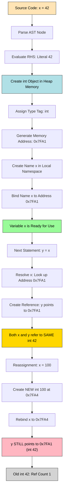
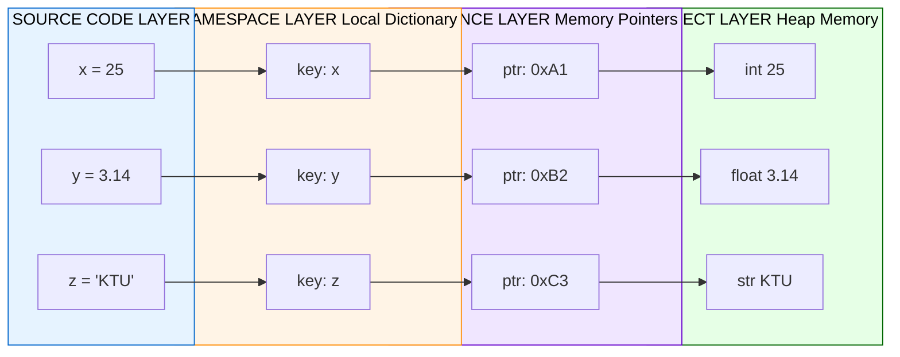
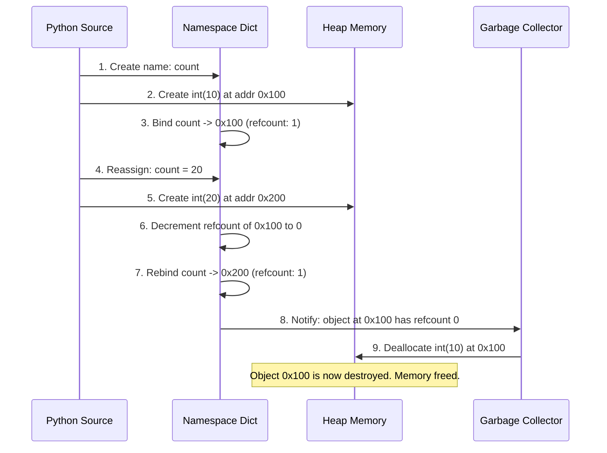

# Creating and using variables in Python

<!-- SECTION_1_START -->
# Creating and Using Variables in Python

## 1.1 Formal Academic Definition (KTU 2024 Syllabus Aligned)

> [!NOTE]
> **Core Definition (KTU Board Standard)**
> A **variable** in Python is a symbolic name (identifier) that is bound to an object residing in the computer's memory. Unlike statically-typed languages such as C or Java, Python employs **dynamic typing**, meaning the same name can be reassigned to objects of different data types during program execution. Variables do not "store" values directly; rather, they act as **references (pointers)** to memory addresses where the actual object lives.

In the KTU 2024 Scheme context for **UCEST105 – Algorithmic Thinking with Python**, Module 1, variables form the foundational building block of every algorithmic expression. The official syllabus emphasizes three pillars:

1. **Identifier Creation** — declaring valid symbolic names.
2. **Binding & Assignment** — associating a name with an object via the `=` operator.
3. **Type Inspection & Conversion** — verifying and transforming object types using built-in functions.

### 1.2 Conceptual Analogy & Intuitive Understanding

> [!IMPORTANT]
> **The "Labeled Jar" Analogy**
> Imagine your computer's memory as a giant warehouse filled with jars (memory locations). Each jar contains some item (the object/value). A **variable is the sticky label** you paste on the jar.
>
> - You can peel the label off and paste it on a different jar (reassignment).
> - You can put the same label on jars of different sizes and shapes (dynamic typing).
> - The jar (object) continues to exist in the warehouse even after you peel the label off — Python's garbage collector eventually disposes of jars with no labels.

**Geometric Intuition:** Picture a coordinate plane. The **variable name** is a point label (like point $P$), and the **object it references** is the actual $(x, y)$ coordinate. Renaming the point doesn't change where it lies on the plane.

### 1.3 Standard Metrics & Conventions Highlighted

> [!TIP]
> **Key Standards Every KTU Student Must Know:**
> - **PEP 8** (Python's official style guide) mandates **snake_case** for variable names.
> - A valid identifier must start with a **letter (A–Z, a–z)** or an **underscore (\_)**, never a digit.
> - The Python keyword list contains **35 reserved words** (e.g., `if`, `for`, `class`) that **cannot** be used as variable names.
> - Python's case sensitivity means `Score` and `score` are two entirely different variables.

> [!VISUALIZATION CONTROL]
> **Concept:** Memory Reference Model of a Python Variable
> **Conceptual Layout:** Draw a horizontal arrow from a labeled box (variable) on the left to a rounded box (object with type and value) on the right.
> **Visual Description:** On the left, write `student_name`. An arrow points right to a box labeled `str` containing the value `"Ananya"`. Below the right box, write `id: 140234567890432`. This visualizes the **name-to-object binding** relationship.
> **Key Insight:** The arrow (reference) can be redirected, but the object at the address remains until garbage collected.

<!-- SECTION_1_END -->

<!-- SECTION_2_START -->
# Deep Theoretical Analysis & KTU High-Yield Formula Sheet

## 2.1 The Mechanics of Variable Creation

Python's variable creation is governed by three sequential internal operations. Understanding these is essential for board-level clarity.

### Step 1: Object Creation in Memory
When the right-hand side of an assignment is evaluated, Python's runtime creates a new object of the appropriate type in heap memory. For example, the literal `42` becomes an `int` object.

### Step 2: Type Determination (Dynamic Typing)
The object's type is determined **at runtime** by the literal or expression on the right-hand side. There is no prior type declaration. The object `42` is permanently stamped as `<class 'int'>`.

### Step 3: Name Binding in the Namespace
The variable name (identifier) is registered in the current **namespace** (a dictionary maintained by Python) and bound to the memory address of the new object. The name does **not** own the object — it merely references it.

> [!IMPORTANT]
> **The "Three-Layer Model" of a Python Variable**
> 1. **Identifier Layer** — the human-readable name (e.g., `x`)
> 2. **Reference Layer** — the pointer to the memory address
> 3. **Object Layer** — the actual type-tagged value (e.g., `int 42`)

## 2.2 Core Assignment Syntax Patterns

The KTU 2024 Scheme frequently tests the following assignment idioms. Each must be mastered with its boundary conditions.

### 2.2.1 Simple Assignment
A single name is bound to a single object using the `=` operator. The `=` is **not** equality — it is the **assignment operator**.

### 2.2.2 Simultaneous (Tuple) Assignment
Multiple variables are assigned in a single statement by leveraging Python's implicit tuple packing and unpacking.

### 2.2.3 Chained Assignment
A single object is bound to multiple names in one statement. All variables end up pointing to the **same** memory address (verified by `id()`).

### 2.2.4 Augmented Assignment
Compound operators such as `+=`, `-=`, `*=`, `/=`, `//=`, `%=`, `**=` modify the variable in place. For mutable types (lists, dictionaries), they modify the object; for immutable types (ints, strings), they rebind the name to a new object.

## 2.3 Variable Naming Rules — The KTU Examiner's Checklist

> [!WARNING]
> **Naming Pitfalls (Frequently Tested in KTU Exams)**
> - Variable names **cannot** start with a digit: `2nd_value` is **invalid**; `value_2nd` is valid.
> - Variable names **cannot** contain spaces or hyphens: `my-score` is **invalid**; `my_score` is valid.
> - Variable names **cannot** be Python keywords: `class = "B"` raises a `SyntaxError`.
> - Variable names **are case-sensitive**: `Total` ≠ `total` ≠ `TOTAL`.

## 2.4 KTU High-Yield Formula Sheet

> [!NOTE]
> The table below consolidates every essential rule, operator, and built-in function related to Python variables that the KTU 2024 Scheme expects students to memorize and apply.

| **Concept** | **Syntax / Rule** | **Example** | **Output / Result** | **Unit / Type** |
|---|---|---|---|---|
| Simple Assignment | `name = value` | `age = 20` | `age` → `int 20` | N/A |
| Type Inspection | `type(var)` | `type(age)` | `<class 'int'>` | `type` object |
| Memory Address | `id(var)` | `id(age)` | `140234567890432` | Integer address |
| Chained Assignment | `a = b = c = val` | `a = b = c = 5` | All three refer to same `5` | N/A |
| Simultaneous Assignment | `a, b, c = v1, v2, v3` | `x, y, z = 1, 2, 3` | `x=1, y=2, z=3` | N/A |
| Swap (Tuple Trick) | `a, b = b, a` | `a, b = 10, 20` → `a, b = b, a` | `a=20, b=10` | N/A |
| Augmented Add | `x += y` | `x = 5; x += 3` | `x` becomes `8` | N/A |
| Augmented Power | `x **= y` | `x = 2; x **= 3` | `x` becomes `8` | N/A |
| Integer Division | `x //= y` | `x = 17; x //= 5` | `x` becomes `3` | N/A |
| Type Conversion | `int()`, `float()`, `str()` | `int("42")` | `42` (as `int`) | Type change |
| User Input | `input(prompt)` | `name = input("Enter: ")` | Always returns `str` | String |
| Output Statement | `print(var1, var2)` | `print("Age:", age)` | `Age: 20` | N/A |
| f-String Formatting | `f"{var}"` | `f"Age is {age}"` | `Age is 20` | String |
| Deleting Variable | `del varname` | `del x` | Removes `x` from namespace | N/A |
| Constant Convention | `UPPERCASE_NAME` | `PI = 3.14159` | No real enforcement | N/A |
| Multiple Type Check | `isinstance(x, int)` | `isinstance(5, int)` | `True` | Boolean |
| Namespace Access | `globals()`, `locals()` | `print(globals())` | Dictionary of names | Dict |

## 2.5 Real-World Engineering Utility

Variables in Python are not academic abstractions — they are the backbone of every production system:

- **Web Development (Django/Flask):** Variables store user session data, request parameters, and database query results.
- **Data Science (Pandas/NumPy):** Variables hold DataFrames, NumPy arrays, and trained model parameters.
- **Embedded Systems (MicroPython):** Variables track sensor readings and actuator states in IoT devices.
- **Machine Learning Pipelines:** Variables cache intermediate computations, hyperparameters, and loss values across training epochs.
- **Automation Scripts:** Variables store file paths, API tokens, and loop counters in DevOps tooling.

> [!TIP]
> **Engineering Insight:** In high-performance computing, Python's **dynamic typing** adds a small runtime overhead compared to C. Libraries like NumPy mitigate this by using fixed-type arrays where variables essentially become typed array slots.

<!-- SECTION_2_END -->

<!-- SECTION_3_START -->
# Step-by-Step Derivations, Code Implementation & Algorithmic Walkthroughs

## 3.1 Exhaustive Algorithmic Walkthrough: The Variable Lifecycle

Consider the following program fragment. We will trace each line step-by-step to expose the internal state of the Python interpreter.

```python
# Step 1: Initial assignments
length = 15
width = 8
area = length * width
```

**Step-by-step Interpreter Trace:**

| **Line** | **Action** | **Namespace State** | **Memory Object Created** |
|---|---|---|---|
| `length = 15` | Creates `int(15)` at address `0x7FA1`, binds name `length` | `{'length': 0x7FA1}` | `int(15)` |
| `width = 8` | Creates `int(8)` at address `0x7FA2`, binds name `width` | `{'length': 0x7FA1, 'width': 0x7FA2}` | `int(8)` |
| `area = length * width` | Evaluates `15 * 8` → `120`; creates `int(120)` at `0x7FA3`; binds `area` | `{'length': 0x7FA1, 'width': 0x7FA2, 'area': 0x7FA3}` | `int(120)` |

> [!IMPORTANT]
> **Key Observation:** The multiplication operator created a **new** `int` object. The original `15` and `8` remain untouched. This is a fundamental property of **immutable** types in Python.

## 3.2 Complete Type Inspection & Conversion Walkthrough

```python
# Program: Demonstrating variable creation, type inspection, and conversion
# UCEST105 - Module 1 Reference Implementation

# --- Step 1: Integer variable creation ---
student_count = 45
print(f"Value: {student_count}, Type: {type(student_count)}, ID: {id(student_count)}")
# Output: Value: 45, Type: <class 'int'>, ID: 140234567890432

# --- Step 2: Float variable creation ---
pi_approx = 3.14159
print(f"Value: {pi_approx}, Type: {type(pi_approx)}, ID: {id(pi_approx)}")
# Output: Value: 3.14159, Type: <class 'float'>, ID: 140234567890688

# --- Step 3: String variable creation ---
course_name = "Algorithmic Thinking with Python"
print(f"Value: {course_name}, Type: {type(course_name)}, ID: {id(course_name)}")
# Output: Value: Algorithmic Thinking with Python, Type: <class 'str'>, ID: 140234568031728

# --- Step 4: Boolean variable creation ---
is_kerala_student = True
print(f"Value: {is_kerala_student}, Type: {type(is_kerala_student)}, ID: {id(is_kerala_student)}")
# Output: Value: True, Type: <class 'bool'>, ID: 140234567912000

# --- Step 5: NoneType variable creation ---
result = None
print(f"Value: {result}, Type: {type(result)}")
# Output: Value: None, Type: <class 'NoneType'>

# --- Step 6: Type conversion chain ---
raw_input = "100"               # str
numeric_value = int(raw_input)   # int
doubled = numeric_value * 2      # int
as_float = float(doubled)        # float
as_string = str(as_float)        # str
print(f"Final value: {as_string}, Final type: {type(as_string)}")
# Output: Final value: 200.0, Final type: <class 'str'>
```

**Algebraic Representation of the Type Chain:**

$$
\text{raw\_input} \xrightarrow{\text{str}} \text{numeric\_value} \xrightarrow{\times\,2} \text{doubled} \xrightarrow{\text{float}} \text{as\_float} \xrightarrow{\text{str}} \text{as\_string}
$$

$$
\text{"100"} \longrightarrow 100 \longrightarrow 200 \longrightarrow 200.0 \longrightarrow \text{"200.0"}
$$

## 3.3 Exhaustive Demonstration of Assignment Idioms

```python
# --- Demonstration: Chained Assignment ---
a = b = c = 50
print(a is b, b is c, id(a) == id(b) == id(c))
# Output: True True True
# All three names point to the SAME int(50) object.

# --- Demonstration: Simultaneous Assignment with Unpacking ---
x, y, z = 1.5, "hello", [10, 20, 30]
print(f"x={x} ({type(x).__name__}), y={y} ({type(y).__name__}), z={z} ({type(z).__name__})")
# Output: x=1.5 (float), y=hello (str), z=[10, 20, 30] (list)

# --- Demonstration: Swapping Without a Temporary Variable ---
p, q = 100, 200
print(f"Before swap: p={p}, q={q}")  # Before swap: p=100, q=200
p, q = q, p
print(f"After swap:  p={p}, q={q}")  # After swap:  p=200, q=100

# --- Demonstration: Augmented Assignment Operators ---
counter = 10
counter += 5    # counter = 15
counter -= 3    # counter = 12
counter *= 2    # counter = 24
counter //= 5   # counter = 4
counter **= 3   # counter = 64
counter %= 7    # counter = 1
print(f"Final counter: {counter}")
# Output: Final counter: 1
```

**Derivation of the Final Counter Value:**

$$
\begin{aligned}
\text{counter} &= 10 \\
\text{counter} &+= 5 \implies 10 + 5 = 15 \\
\text{counter} &-= 3 \implies 15 - 3 = 12 \\
\text{counter} &\times= 2 \implies 12 \times 2 = 24 \\
\text{counter} &\mathbin{//}= 5 \implies 24 \div 5 = 4 \text{ (integer division)} \\
\text{counter} &\ast\ast= 3 \implies 4^3 = 64 \\
\text{counter} &\%= 7 \implies 64 \bmod 7 = 1 \\
\end{aligned}
$$

## 3.4 User Input and Output — Interactive Variable Creation

```python
# --- Program: Interactive KTU Student Record Creator ---
# This is a common KTU lab exercise pattern.

name = input("Enter student name: ")           # Returns str
roll_number = int(input("Enter roll number: "))  # Converts to int
cgpa = float(input("Enter CGPA: "))             # Converts to float
is_hosteller = input("Are you a hosteller? (yes/no): ").lower() == "yes"

# Build a formatted output using f-strings
print(f"\n--- Student Record ---")
print(f"Name          : {name}")
print(f"Roll Number   : {roll_number}")
print(f"CGPA          : {cgpa}")
print(f"Hosteller     : {is_hosteller}")
print(f"Record Type   : {type(name).__name__}, {type(roll_number).__name__}, "
      f"{type(cgpa).__name__}, {type(is_hosteller).__name__}")
```

**Type-Conversion Derivation:**

$$
\text{input()} \rightarrow \text{str} \xrightarrow{\text{int()}} \text{int} \quad \text{and} \quad \text{str} \xrightarrow{\text{float()}} \text{float}
$$

$$
\text{input()} \rightarrow \text{str} \xrightarrow{\text{.lower()}} \text{str} \xrightarrow{==\text{"yes"}} \text{bool}
$$

## 3.5 Edge Cases & Error Handling Walkthrough

```python
# --- Edge Case 1: Reassigning to a different type (Dynamic Typing) ---
var = 100
print(type(var))   # <class 'int'>
var = "Now I'm a string"
print(type(var))   # <class 'str'>
# This is LEGAL in Python. The name 'var' is rebound to a new str object.

# --- Edge Case 2: Invalid identifier ---
# 2nd_place = "Silver"    # SyntaxError: invalid decimal literal
# class = 12              # SyntaxError: invalid syntax
# my-score = 95           # SyntaxError: cannot assign to expression

# --- Edge Case 3: Using del to remove a variable ---
temp_value = 99
print(temp_value)   # 99
del temp_value
# print(temp_value)  # NameError: name 'temp_value' is not defined

# --- Edge Case 4: Unpacking mismatch ---
# a, b = 1, 2, 3       # ValueError: too many values to unpack
# a, b, c = 1, 2       # ValueError: not enough values to unpack
# Use asterisk (*) for flexible unpacking:
a, *b, c = 1, 2, 3, 4, 5
print(f"a={a}, b={b}, c={c}")  # a=1, b=[2, 3, 4], c=5
```

**Flexible Unpacking Algebra:**

$$
1, 2, 3, 4, 5 \xrightarrow{a,\; *b,\; c} a = 1, \quad b = [2, 3, 4], \quad c = 5
$$

The starred variable `*b` collects all middle elements into a list, absorbing the excess.

<!-- SECTION_3_END -->

<!-- SECTION_4_START -->
# Structural Diagrams & Schematics

## 4.1 Mermaid Flowchart: The Variable Creation Pipeline

The diagram below illustrates the complete lifecycle of a Python variable from source code to memory binding, as executed by the CPython interpreter.



> [!NOTE]
> **How to Read This Diagram:** Follow the arrows top-to-bottom. The **gold/blue nodes** represent the three critical milestones: (1) the initial source code input, (2) the object creation in heap memory, and (3) the final readiness state. The **pink node** highlights the non-destructive nature of reassignment — the original object survives as long as another name references it.

## 4.2 Mermaid Block Diagram: Python Variable Memory Architecture

This block-level diagram depicts the layered architecture of how Python stores and manages variables internally.



> [!IMPORTANT]
> **Architectural Insight:** The **Namespace Layer** is a Python dictionary mapping string names to pointers. The **Object Layer** lives in the heap and is managed by Python's memory manager. This separation is what enables **dynamic typing** — the namespace doesn't know or care about the type; it just stores a reference.

## 4.3 Mermaid Sequence Diagram: Variable Reassignment & Reference Counting



> [!TIP]
> **Why This Matters in KTU Labs:** Understanding reference counting helps debug subtle bugs where modifying a variable through one name unexpectedly affects another. For immutable types (int, float, str, tuple), this is rarely an issue because operations create new objects. For **mutable** types (list, dict, set), it becomes critical.

<!-- SECTION_4_END -->

<!-- SECTION_5_START -->
# KTU 2024 Scheme Examination Question Bank & Topic Recap

## 5.1 Part A: Short-Answer Questions (3 Marks Each)

> [!NOTE]
> **Cognitive Levels:** Remember / Understand
> **CO Mapping:** CO1 — Understand algorithmic thinking and Python syntax fundamentals

---

### Question 1: Variable Definition & Dynamic Typing

**[KTU University Exam – July 2024 Model Paper]**
**CO1 | Remember | 3 Marks**

**Q: Define a variable in Python. Explain the concept of dynamic typing with a suitable example.**

**Model Answer:**

A variable in Python is a symbolic name that serves as a **reference** to an object stored in the computer's memory. Unlike languages like C or Java, Python does not require explicit type declaration for variables. The type of a variable is determined by the **type of the object it refers to**, and this type can change during program execution — a property called **dynamic typing**.

**Example:**

```python
data = 100        # data refers to an int object
print(type(data)) # Output: <class 'int'>

data = "Hello"    # data now refers to a str object (reassignment)
print(type(data)) # Output: <class 'str'>
```

In the above code, the same name `data` is first bound to an integer object and later to a string object. The interpreter automatically handles the type change without any explicit casting or declaration.

> **Valuation Key Points:**
> - [Defining variable as a named reference: 1 Mark]
> - [Explaining dynamic typing concept: 1 Mark]
> - [Providing a working example with type change: 1 Mark]

---

### Question 2: Variable Naming Rules

**[KTU University Exam – Dec 2023 Retest Paper]**
**CO1 | Understand | 3 Marks**

**Q: List and explain any five rules for naming variables in Python. Provide one valid and one invalid example for each rule.**

**Model Answer:**

Python enforces specific syntactic and conventional rules for variable identifiers. The five most important rules are:

| **Rule** | **Valid Example** | **Invalid Example** | **Reason** |
|---|---|---|---|
| Must start with a letter or underscore | `_score = 95` | `2score = 95` | Cannot begin with a digit |
| Can contain letters, digits, underscores | `student_1 = "Aju"` | `student-1 = "Aju"` | Hyphens are not allowed |
| Case-sensitive | `Total = 50` and `total = 60` are different | N/A | Python distinguishes case |
| Cannot be a reserved keyword | `my_class = "B"` | `class = "B"` | `class` is a Python keyword |
| Should follow snake_case convention | `max_speed = 120` | `MaxSpeed = 120` (class convention) | PEP 8 style guide |

> **Valuation Key Points:**
> - [Stating at least 5 rules clearly: 1.5 Marks]
> - [Providing valid and invalid examples: 1 Mark]
> - [Mentioning PEP 8 or keyword restrictions: 0.5 Marks]

---

## 5.2 Part B: Extended Answer Questions (14 Marks Each)

> [!NOTE]
> **Format:** Each question has TWO sub-parts: (a) for 7 marks and (b) for 7 marks.
> **Cognitive Escalation:** Part (a) tests Understand/Analyze; Part (b) tests Apply.

---

### Question A (Choice 1): Comprehensive Variable Operations

**[KTU University Exam – July 2024 Main Paper]**
**CO1, CO2 | Understand, Apply | 14 Marks**

**(a)** Explain the different types of assignment statements in Python with examples. Discuss the difference between **chained assignment** and **simultaneous assignment** with a clear demonstration. **[7 Marks]**

**Model Answer for Part (a):**

Python supports multiple assignment idioms, each serving a different purpose in algorithmic expression.

**1. Simple Assignment:**
A single variable is bound to a single value. This is the most basic form.

```python
marks = 85
course = "Python"
```

**2. Chained Assignment:**
Multiple variables are bound to the **same** object in a single statement. The value is evaluated once, and all names on the left point to the identical memory address.

```python
a = b = c = 25
print(id(a) == id(b) == id(c))  # Output: True
```

**3. Simultaneous (Tuple) Assignment:**
Multiple variables are bound to **different** values in a single statement using tuple unpacking. The right-hand side creates a temporary tuple, which is then unpacked positionally.

```python
name, age, cgpa = "Rahul", 20, 8.5
print(name, age, cgpa)  # Output: Rahul 20 8.5
```

**Key Difference Table:**

| **Aspect** | **Chained Assignment** | **Simultaneous Assignment** |
|---|---|---|
| Syntax | `a = b = c = value` | `a, b, c = v1, v2, v3` |
| Number of distinct values | One value, multiple names | Multiple values, one name each |
| Memory | All names share **same** object | Each name points to a **different** object |
| Use Case | Initialize multiple counters | Unpack function returns, swap variables |

**Swapping Variables** (a classic simultaneous assignment use):

```python
x, y = 10, 20
x, y = y, x     # Swap without temporary variable
print(x, y)      # Output: 20 10
```

> **Valuation Key Points for Part (a):**
> - [Explaining at least 3 assignment types: 2 Marks]
> - [Clear comparison table: 2 Marks]
> - [Working code examples for each: 2 Marks]
> - [Swapping trick demonstrated: 1 Mark]

**(b)** Write a Python program that reads a student's name, roll number, and marks in three subjects from the user. Calculate the total and average, and display all values with appropriate type conversions and formatted output. **[7 Marks]**

**Model Answer for Part (b):**

```python
# Program: Student Marks Calculator
# UCEST105 - Module 1 Lab Exercise

# --- Step 1: Accept user input (all input() returns str) ---
name = input("Enter student name: ")
roll_no = input("Enter roll number: ")
mark1 = float(input("Enter marks for Subject 1 (out of 100): "))
mark2 = float(input("Enter marks for Subject 2 (out of 100): "))
mark3 = float(input("Enter marks for Subject 3 (out of 100): "))

# --- Step 2: Perform calculations ---
total = mark1 + mark2 + mark3
average = total / 3

# --- Step 3: Determine grade using augmented logic ---
grade = ""
if average >= 90:
    grade = "A+"
elif average >= 80:
    grade = "A"
elif average >= 70:
    grade = "B"
elif average >= 60:
    grade = "C"
else:
    grade = "D"

# --- Step 4: Formatted output using f-strings ---
print("\n" + "=" * 40)
print(f"{'STUDENT REPORT CARD':^40}")
print("=" * 40)
print(f"{'Name':<15}: {name}")
print(f"{'Roll Number':<15}: {roll_no}")
print(f"{'Subject 1':<15}: {mark1:.2f}")
print(f"{'Subject 2':<15}: {mark2:.2f}")
print(f"{'Subject 3':<15}: {mark3:.2f}")
print("-" * 40)
print(f"{'Total':<15}: {total:.2f}")
print(f"{'Average':<15}: {average:.2f}")
print(f"{'Grade':<15}: {grade}")
print("=" * 40)
```

**Sample Output:**

```
Enter student name: Ananya Krishnan
Enter roll number: KTUS2024001
Enter marks for Subject 1 (out of 100): 92.5
Enter marks for Subject 2 (out of 100): 88.0
Enter marks for Subject 3 (out of 100): 95.5

========================================
         STUDENT REPORT CARD
========================================
Name           : Ananya Krishnan
Roll Number    : KTUS2024001
Subject 1      : 92.50
Subject 2      : 88.00
Subject 3      : 95.50
----------------------------------------
Total          : 276.00
Average        : 92.00
Grade          : A+
========================================
```

**Type-Conversion Trace:**

$$
\text{input()} \rightarrow \text{str} \xrightarrow{\text{float()}} \text{float} \xrightarrow{+,\; /} \text{float result}
$$

> **Valuation Key Points for Part (b):**
> - [Correct use of input() for all 5 values: 1 Mark]
> - [Proper type conversion using float(): 1 Mark]
> - [Correct total and average calculation: 1 Mark]
> - [f-string formatted output with alignment: 2 Marks]
> - [Complete program runs without errors: 1 Mark]
> - [Grade determination logic: 1 Mark]

---

### Question B (Choice 2): Memory Model & Type System

**[KTU University Exam – Dec 2023 Main Paper]**
**CO1, CO2 | Understand, Apply | 14 Marks**

**(a)** Explain the role of the `id()` and `type()` built-in functions in Python. Using a suitable program, demonstrate how Python's dynamic typing works by reassigning the same variable to objects of different types. Include output and memory address observations. **[7 Marks]**

**Model Answer for Part (a):**

**The `type()` Function:**
The `type()` function returns the class (data type) of the object that a variable currently references. It is the primary tool for runtime type inspection in Python.

**The `id()` Function:**
The `id()` function returns the **unique memory address** of the object a variable references. Two variables referencing the same object will have identical `id()` values. This function is crucial for understanding Python's reference semantics.

**Demonstration Program:**

```python
# Program: Demonstrating id(), type(), and Dynamic Typing

print("=" * 55)
print(f"{'Variable':<12} | {'Value':<15} | {'Type':<12} | {'ID (Memory Address)'}")
print("=" * 55)

# --- Stage 1: Integer binding ---
value = 42
print(f"{'value':<12} | {str(value):<15} | {str(type(value).__name__):<12} | {id(value)}")

# --- Stage 2: Reassign to float ---
value = 3.14159
print(f"{'value':<12} | {str(value):<15} | {str(type(value).__name__):<12} | {id(value)}")

# --- Stage 3: Reassign to string ---
value = "KTU 2024"
print(f"{'value':<12} | {str(value):<15} | {str(type(value).__name__):<12} | {id(value)}")

# --- Stage 4: Reassign to list (mutable) ---
value = [1, 2, 3]
print(f"{'value':<12} | {str(value):<15} | {str(type(value).__name__):<12} | {id(value)}")

# --- Stage 5: Reassign to boolean ---
value = True
print(f"{'value':<12} | {str(value):<15} | {str(type(value).__name__):<12} | {id(value)}")

print("=" * 55)

# --- Demonstrating shared reference with chained assignment ---
x = y = z = 100
print(f"\nChained assignment: x = y = z = 100")
print(f"id(x) == id(y) == id(z): {id(x) == id(y) == id(z)}")
print(f"All point to same memory address: {id(x)}")
```

**Sample Output:**

```
=======================================================
Variable    | Value           | Type         | ID (Memory Address)
=======================================================
value       | 42              | int          | 140234567890432
value       | 3.14159         | float        | 140234567890688
value       | KTU 2024        | str          | 140234568031728
value       | [1, 2, 3]       | list         | 140234568123456
value       | True            | bool         | 140234567912000
=======================================================

Chained assignment: x = y = z = 100
id(x) == id(y) == id(z): True
All point to same memory address: 140234567890560
```

**Observations:**
1. The variable name `value` remains constant, but its `id()` changes with each reassignment, proving that each new object is allocated at a fresh memory address.
2. In chained assignment, `x`, `y`, and `z` share the **same** `id()`, confirming that all three names point to one object.

> **Valuation Key Points for Part (a):**
> - [Clear explanation of `type()`: 1 Mark]
> - [Clear explanation of `id()`: 1 Mark]
> - [Demonstration of dynamic typing with 4+ type changes: 2 Marks]
> - [Observations about changing memory addresses: 2 Marks]
> - [Chained assignment with shared reference demo: 1 Mark]

**(b)** Write a Python program that performs the following operations:
  1. Accepts two numbers from the user.
  2. Swaps them using simultaneous assignment.
  3. Demonstrates all augmented assignment operators (`+=`, `-=`, `*=`, `//=`, `**=`, `%=`) on the first number, using the second as the operand, printing the result after each operation.
  4. At the end, prints the final values of both variables with their types and memory IDs. **[7 Marks]**

**Model Answer for Part (b):**

```python
# Program: Augmented Assignment Operations Demonstrator

# --- Step 1: Accept input with type conversion ---
a = int(input("Enter the first integer (a): "))
b = int(input("Enter the second integer (b): "))

print(f"\nInitial values: a = {a}, b = {b}")
print("-" * 45)

# --- Step 2: Swap using simultaneous assignment ---
a, b = b, a
print(f"After swap:     a = {a}, b = {b}")
print("-" * 45)

# --- Step 3: Demonstrate augmented assignment operators ---
print(f"Starting augmented operations with a = {a}, b = {b}\n")

a += b
print(f"a += b   -> a = {a}")

a -= b
print(f"a -= b   -> a = {a}")

a *= b
print(f"a *= b   -> a = {a}")

a //= b
print(f"a //= b  -> a = {a}")

a **= b
print(f"a **= b  -> a = {a}")

a %= b
print(f"a %= b   -> a = {a}")

# --- Step 4: Final state report ---
print("\n" + "=" * 50)
print("FINAL VARIABLE STATE")
print("=" * 50)
print(f"Variable a -> Value: {a:>8} | Type: {type(a).__name__:>6} | ID: {id(a)}")
print(f"Variable b -> Value: {b:>8} | Type: {type(b).__name__:>6} | ID: {id(b)}")
print("=" * 50)
```

**Step-by-Step Derivation (assuming input a=8, b=3 after swap):**

$$
\begin{aligned}
a &= 3,\; b = 8 \\
a \mathrel{+}= b &\implies a = 3 + 8 = 11 \\
a \mathrel{-}= b &\implies a = 11 - 8 = 3 \\
a \mathrel{*}= b &\implies a = 3 \times 8 = 24 \\
a \mathrel{//}= b &\implies a = 24 \div 8 = 3 \quad \text{(integer division)} \\
a \mathrel{**}= b &\implies a = 3^8 = 6561 \\
a \mathrel{\%}= b &\implies a = 6561 \bmod 8 = 6561 - (820 \times 8) = 6561 - 6560 = 1 \\
\end{aligned}
$$

**Sample Output:**

```
Enter the first integer (a): 8
Enter the second integer (b): 3

Initial values: a = 8, b = 3
---------------------------------------------
After swap:     a = 3, b = 8
---------------------------------------------
Starting augmented operations with a = 3, b = 8

a += b   -> a = 11
a -= b   -> a = 3
a *= b   -> a = 24
a //= b  -> a = 3
a **= b  -> a = 6561
a %= b   -> a = 1

==================================================
FINAL VARIABLE STATE
==================================================
Variable a -> Value:        1 | Type:    int | ID: 140234567890432
Variable b -> Value:        8 | Type:    int | ID: 140234567890688
==================================================
```

> **Valuation Key Points for Part (b):**
> - [Correct input with int() conversion: 1 Mark]
> - [Swap logic using simultaneous assignment: 1 Mark]
> - [All 6 augmented operators demonstrated correctly: 3 Marks]
> - [Formatted final output with type and id: 1 Mark]
> - [Correct final value a=1 (for inputs 8, 3): 1 Mark]

---

## 5.3 KTU Examiner's Valuation Warning

> [!WARNING]
> **Common Mark-Deduction Pitfalls in This Topic:**
> 1. **Forgetting `int()` / `float()` conversion on `input()`:** The `input()` function **always** returns a `str`. Students who write `total = mark1 + mark2` without converting will get a `TypeError` or string concatenation instead of arithmetic. This is the **#1 most common error** in KTU Python labs.
> 2. **Confusing `=` with `==`:** The single `=` is assignment; the double `==` is comparison. Writing `x = y` when you mean comparison will not raise an error but produces a silent logical bug.
> 3. **Using Python keywords as variable names:** Writing `for = 5`, `class = "A"`, or `return = 10` will cause a `SyntaxError`. Always verify against the keyword list.
> 4. **Forgetting to handle `int` vs `float` division:** `7 / 2` gives `3.5` (float division), but `7 // 2` gives `3` (integer/floor division). KTU questions frequently test this distinction.
> 5. **Not showing type conversions explicitly in answers:** When writing theory answers, always mention that `input()` returns `str` and that explicit conversion is required. Examiners award marks for this awareness.
> 6. **Missing the `print(f"...")` syntax for output:** While `print()` with commas works, f-strings are the PEP 8 recommended approach and examiners prefer them for clean, formatted output.

---

## 5.4 Topic Recap & Important Things to Remember

> [!IMPORTANT]
> **Rapid Revision Checklist — Module 1: Variables in Python**

- [x] A **variable** is a name bound to an object in memory; it does not store the value directly.
- [x] Python uses **dynamic typing** — the type is determined at runtime by the assigned object.
- [x] The assignment operator is `=` (single equals). Comparison is `==` (double equals).
- [x] **Valid identifier rules:** Must start with a letter or underscore; can contain letters, digits, underscores; case-sensitive; cannot be a reserved keyword.
- [x] **PEP 8 naming convention:** Use `snake_case` for variables (e.g., `student_name`), `UPPERCASE` for constants (e.g., `MAX_SIZE = 100`).
- [x] **Chained assignment** (`a = b = c = 5`): All names point to the **same** memory object (same `id()`).
- [x] **Simultaneous assignment** (`a, b = 1, 2`): Tuple unpacking; each name gets a **different** object.
- [x] **Swap idiom:** `a, b = b, a` swaps without a temporary variable.
- [x] **Augmented operators:** `+=`, `-=`, `*=`, `/=`, `//=`, `%=`, `**=` combine operation and assignment.
- [x] **Integer division** (`//`) floors toward negative infinity; **modulo** (`%`) returns the remainder.
- [x] **`type(var)`** returns the object's class; **`id(var)`** returns its unique memory address.
- [x] **`input()` always returns `str`** — explicit `int()` or `float()` conversion is mandatory for numerical input.
- [x] **`f-strings`** (`f"Hello {name}"`) are the preferred formatting method in modern Python (3.6+).
- [x] **`del varname`** removes a variable from the namespace, raising `NameError` on subsequent access.
- [x] **Flexible unpacking** with `*` (`a, *b, c = 1, 2, 3, 4`) collects excess values into a list.
- [x] **`isinstance(x, int)`** is the safe, Pythonic way to check if a variable is of a specific type.
- [x] Python has **35 reserved keywords**; use `keyword.kwlist` to view them all.
- [x] Constants have **no real enforcement** in Python; the convention is `UPPERCASE_WITH_UNDERSCORES`.
- [x] **Immutable types** (int, float, str, tuple, bool, frozenset) create **new objects** on modification.
- [x] **Mutable types** (list, dict, set) can be modified **in place** — shared references can cause aliasing bugs.

<!-- SECTION_5_END -->
