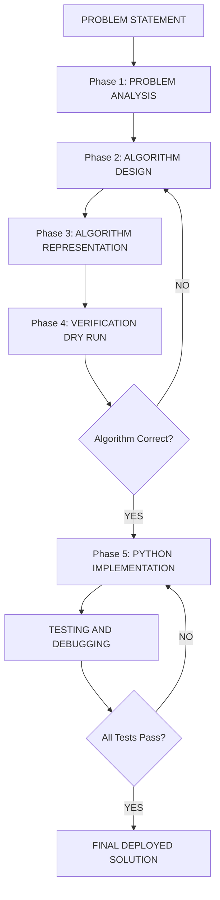
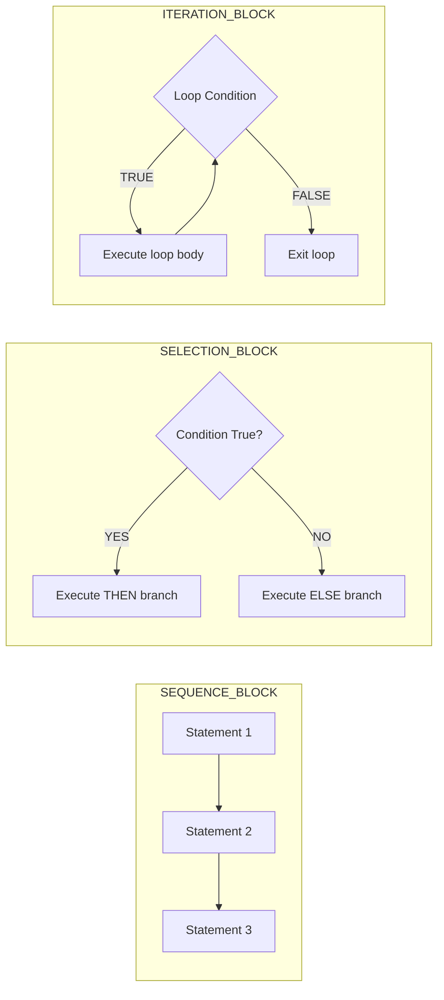
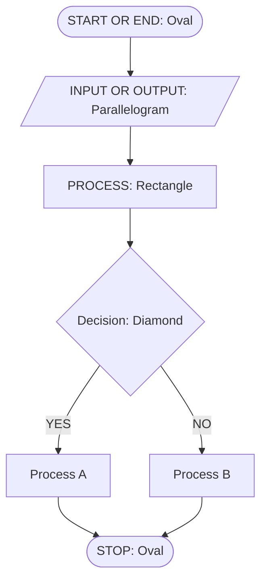
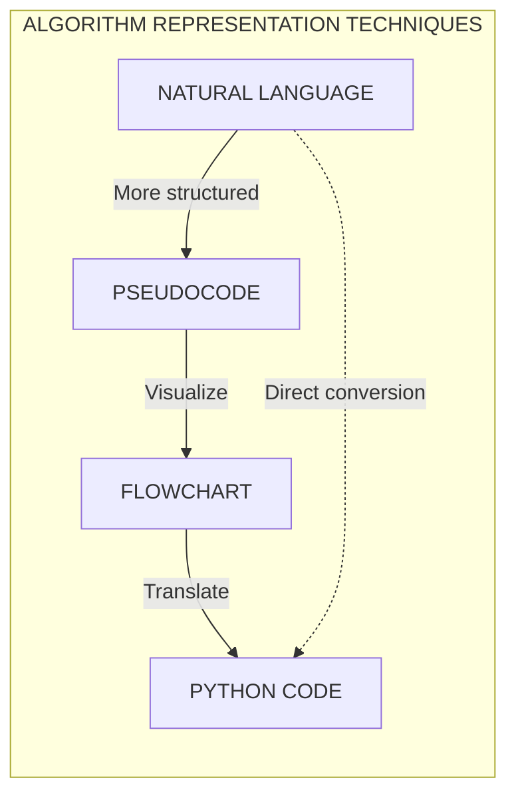
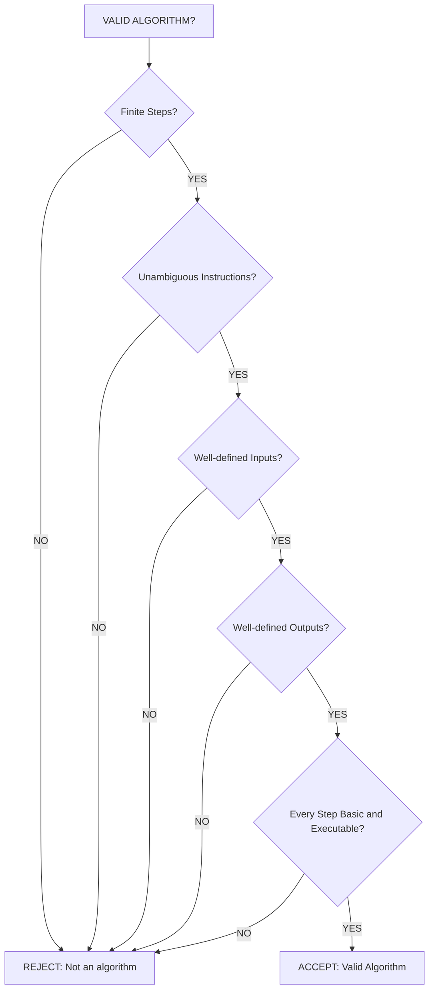
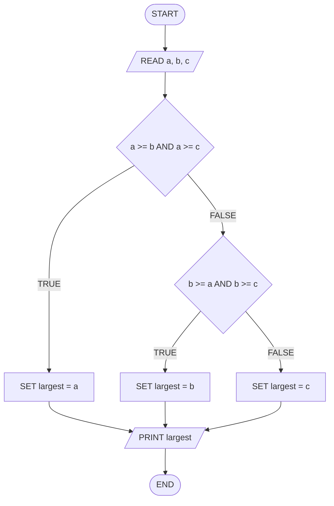
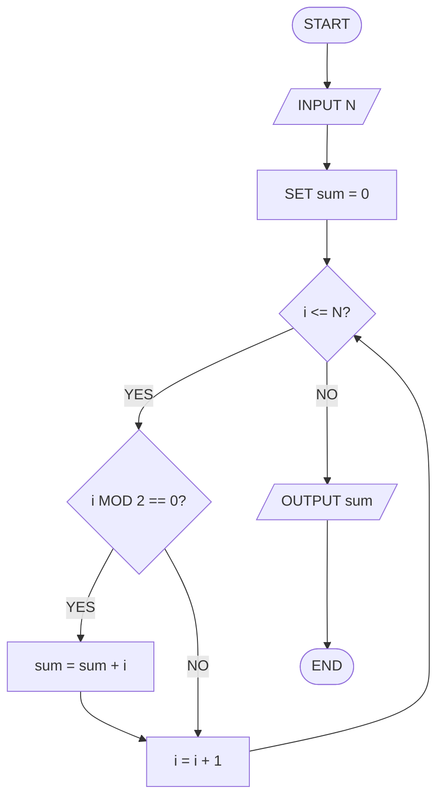

# Developing an algorithm

<!-- SECTION_1_START -->
# Developing an Algorithm — Core Definition & Intuitive Overview

## Formal Academic Definition

> [!IMPORTANT]
> **Algorithm (KTU 2024 Syllabus Definition):** An algorithm is a **finite, well-defined sequence of unambiguous, executable instructions** laid out in a specific order to solve a particular class of problems or perform a specific computation task within a finite amount of time.

In the context of **Algorithmic Thinking with Python (UCEST105)**, developing an algorithm refers to the **systematic, step-by-step methodology** of converting a real-world problem statement into a logically sequenced, machine-executable set of instructions that can later be implemented using Python syntax.

> [!NOTE]
> **Origin of the Term:** The word *algorithm* is derived from the name of the 9th-century Persian mathematician **Muḥammad ibn Mūsā al-Khwārizmī** (Latinized as *Algoritmi*), whose works introduced systematic algebraic methods to Europe.

## Conceptual Analogy / Intuition

> [!TIP]
> **Think of an algorithm as a RECIPE 🍳 for a computer.**
> 
> Just like a cooking recipe tells you:
> 1. **What ingredients** you need (Inputs)
> 2. **What steps** to follow in exact order (Process)
> 3. **What dish** you'll end up with (Output)
> 
> An algorithm tells the computer exactly the same three things. If you skip a step or write "add some salt" (ambiguous!), the recipe — or the algorithm — will FAIL. A computer cannot guess; it follows instructions **literally**.

### Real-World Engineering Analogy: Traffic Signal Controller

Imagine a **smart traffic signal** at a 4-way junction. The control logic is essentially an algorithm:

- **Step 1:** Sense the vehicle count using IR sensors.
- **Step 2:** Compare count against the threshold $T = 50$ vehicles.
- **Step 3:** If count $\geq T$, extend the green light by $\Delta t = 15$ seconds.
- **Step 4:** Else, retain the default green time of $t_{default} = 30$ seconds.
- **Step 5:** Switch to the next phase.
- **Step 6:** Repeat from Step 1.

This deterministic cycle is an **embedded systems algorithm** — precisely the kind of thinking you'll develop in this module.

## Why Algorithms Matter in Computer Science

| Perspective | Role of Algorithm |
|---|---|
| **Software Engineering** | Blueprint before writing any code |
| **Data Science** | Determines time and space complexity of ML pipelines |
| **Cybersecurity** | Encryption (RSA, AES) are algorithms |
| **IoT / Robotics** | Real-time decision making in microcontrollers |
| **Compiler Design** | Lexical analysis, parsing, code generation |

## The 5 Essential Properties of an Algorithm (Famous KTU Question!)

> [!IMPORTANT]
> Every valid algorithm **MUST** satisfy these **5 canonical properties**:

1. **Finiteness** — Must terminate after a finite number of steps. An infinite loop is *not* an algorithm.
2. **Definiteness** — Each instruction must be **clear, precise, and unambiguous**.
3. **Input** — Zero or more well-defined inputs must be provided.
4. **Output** — At least one well-defined output must be produced.
5. **Effectiveness** — Every operation must be **basic enough** to be carried out, in principle, by a person using paper and pencil (i.e., executable).

## What is NOT an Algorithm?

> [!WARNING]
> The following are **NOT** valid algorithms because they violate the 5 properties:
> - *"Add a pinch of salt"* → violates **Definiteness** (what is a pinch?).
> - *"Compute $\pi$ exactly"* → violates **Finiteness** (never terminates).
> - Instructions written in ambiguous natural language without clear sequence.

<!-- SECTION_1_END -->

<!-- SECTION_2_START -->
# Deep Theoretical Analysis & KTU High-Yield Formula Sheet

## The Algorithm Development Process (Step-by-Step Methodology)

> [!NOTE]
> KTU frequently tests this **sequential process**. Memorize the order:

### Phase 1: Problem Analysis
- Understand the **problem statement** thoroughly.
- Identify **what is given** (inputs) and **what is required** (outputs).
- Determine **constraints** (e.g., time limit, memory, data range).

### Phase 2: Algorithm Design
- Choose an appropriate **problem-solving strategy** (brute force, divide & conquer, greedy, etc.).
- Design the **logical flow** of steps.
- This is where the actual *algorithm* is born.

### Phase 3: Algorithm Representation
- Express the algorithm using one or more of:
  - **Natural Language** (plain English)
  - **Pseudocode** (semi-formal, language-agnostic)
  - **Flowchart** (graphical representation using standard symbols)
  - **Programming Language** (e.g., Python)

### Phase 4: Algorithm Verification (Dry Run)
- **Trace** the algorithm manually using a sample input (also called a *desk check* or *dry run*).
- Verify it produces the **expected output** for all edge cases.

### Phase 5: Implementation & Testing
- Convert the algorithm into executable **Python code**.
- Test using multiple inputs including boundary conditions.

## Algorithm Representation Methods (KTU High-Yield)

### 1. Natural Language Description
A prose-based description. **Drawback:** prone to ambiguity.

> *Example:* "Take a list of numbers. Find the largest among them and print it."

### 2. Pseudocode
A **structured, English-like** representation that mimics programming logic but is **language-independent**.

**Standard Pseudocode Keywords (KTU Convention):**

| Keyword | Purpose |
|---|---|
| `START` / `BEGIN` | Marks the start of the algorithm |
| `INPUT` | Accept values from user |
| `OUTPUT` / `PRINT` | Display result |
| `SET` / `=` | Assign a value to a variable |
| `IF ... THEN ... ELSE ... ENDIF` | Conditional branching |
| `WHILE ... DO ... ENDWHILE` | Pre-test loop |
| `FOR ... TO ... DO ... ENDFOR` | Count-controlled loop |
| `REPEAT ... UNTIL ...` | Post-test loop |
| `STOP` / `END` | Marks termination |

### 3. Flowchart (Graphical)
Uses standardized geometric symbols to depict logic.

| Symbol | Shape | Meaning |
|---|---|---|
| **Terminal** | Oval / Pill | Start or Stop |
| **Input/Output** | Parallelogram | Read or Print |
| **Process** | Rectangle | Computation or Assignment |
| **Decision** | Diamond | Conditional check (Yes/No, True/False) |
| **Connector** | Small Circle | Junction in flow |
| **Flow Line** | Arrow | Direction of execution |

> [!TIP]
> **KTU Exam Tip:** Always draw the **boundary oval** (START) and (END) explicitly. Examiners award 1 mark for a properly closed flowchart.

## Characteristics of a Good Algorithm (Board-Examiner Perspective)

> [!IMPORTANT]
> Beyond the 5 mandatory properties, a **good** algorithm also exhibits:

- **Correctness** — Produces the right output for *all* valid inputs.
- **Efficiency** — Minimal use of time ($T(n)$) and space ($S(n)$).
- **Generality** — Solves a *class* of problems, not just one instance.
- **Readability** — Easy to understand, debug, and maintain.
- **Modularity** — Can be broken into independent sub-algorithms (functions).

## The Three Algorithm Constructs (Structured Programming Theorem)

> [!NOTE]
> **Böhm and Jacopini's Theorem (1966):** *Any algorithm can be constructed using only three control structures.*

1. **Sequence** — Statements executed one after another.
2. **Selection** — `IF-THEN-ELSE` for branching decisions.
3. **Iteration** — `WHILE-DO` or `REPEAT-UNTIL` for loops.

These three are sufficient to represent **any computable function** — a foundational result in theoretical computer science.

## KTU Formula Sheet / Cheat Sheet

> [!IMPORTANT]
> **Save this table — it covers every KTU board question on algorithm fundamentals.**

| Concept | Formula / Rule | Symbol / Unit | KTU Significance |
|---|---|---|---|
| Algorithm Finiteness | Termination after $n$ steps where $n \in \mathbb{N}$ | Steps (count) | Mandatory property |
| Time Complexity (Big-O) | $T(n) = O(f(n))$ | Operations vs input size $n$ | Efficiency measurement |
| Space Complexity | $S(n) = O(f(n))$ | Memory units vs $n$ | Resource utilization |
| Sum of first $n$ naturals | $\sum_{i=1}^{n} i = \dfrac{n(n+1)}{2}$ | Pure count | Loop trace questions |
| Sum of first $n$ even numbers | $\sum_{i=1}^{n} 2i = n(n+1)$ | Pure count | Algorithm tracing |
| Factorial | $n! = n \times (n-1)!,\ \ 0! = 1$ | Count | Classic recursive example |
| Fibonacci (closed form) | $F_n = \dfrac{\phi^n - \psi^n}{\sqrt{5}}$ | — | Optimal substructure demo |
| Number of steps (linear search) | $T(n) = n$ comparisons (worst case) | Comparisons | Worst-case analysis |
| Number of steps (binary search) | $T(n) = \lfloor \log_2 n \rfloor + 1$ | Comparisons | Logarithmic growth |
| Number of steps (bubble sort) | $T(n) = \dfrac{n(n-1)}{2}$ | Comparisons | Quadratic complexity |
| Pseudocode variable assignment | $x \leftarrow a + b$ | — | KTU pseudocode syntax |
| Modulus operator | $a \bmod b$ = remainder | — | Divisibility checks |

Where $\phi = \dfrac{1+\sqrt{5}}{2} \approx 1.618$ (Golden Ratio) and $\psi = \dfrac{1-\sqrt{5}}{2} \approx -0.618$.

## Real-World Engineering Utility

- **Search Engines (Google):** PageRank is an algorithm.
- **GPS Navigation (Google Maps):** Dijkstra's shortest-path algorithm.
- **Social Media Feeds:** Recommendation algorithms.
- **Banking:** RSA encryption secures your transactions.
- **Healthcare:** Diagnostic algorithms in medical imaging AI.
- **Aerospace:** Trajectory optimization algorithms for SpaceX rockets.

Every modern engineering discipline depends on the algorithm development process you'll master in this module.

<!-- SECTION_2_END -->

<!-- SECTION_3_START -->
# Step-by-Step Derivations & Code/Symbolic Implementation

## Worked Example 1: Algorithm to Find the Largest of Three Numbers

### Step 1 — Problem Analysis
- **Input:** Three numbers $a, b, c$.
- **Output:** The largest of the three.
- **Strategy:** Compare using nested conditions.

### Step 2 — Algorithm in Pseudocode

```
ALGORITHM: FindLargest
START
    INPUT a, b, c
    IF a >= b AND a >= c THEN
        largest <- a
    ELSE IF b >= a AND b >= c THEN
        largest <- b
    ELSE
        largest <- c
    ENDIF
    OUTPUT "Largest = ", largest
END
```

### Step 3 — Flowchart Logic (Textual Trace)

```
   (START)
      |
      v
 [Read a, b, c]
      |
      v
 < a >= b AND a >= c ? >--YES--> [largest = a] --+
      |                                       |
      NO                                      |
      v                                       |
 < b >= a AND b >= c ? >--YES--> [largest = b] |
      |                                       |
      NO                                      |
      v                                       |
 [largest = c]  <------------------------------+
      |
      v
 [Print largest]
      |
      v
   (END)
```

### Step 4 — Python Implementation

```python
def find_largest(a: int, b: int, c: int) -> int:
    """
    Algorithm: Find the largest of three numbers.
    Time Complexity: O(1) - constant operations.
    Space Complexity: O(1) - constant extra memory.
    """
    if a >= b and a >= c:
        largest = a
    elif b >= a and b >= c:
        largest = b
    else:
        largest = c
    return largest


# Driver code with boundary testing
if __name__ == "__main__":
    test_cases = [
        (10, 20, 30),       # c is largest
        (100, 50, 25),      # a is largest
        (7, 7, 4),          # tie between a and b
        (-5, -10, -1),      # all negatives
        (0, 0, 0),          # all equal
    ]

    for idx, (a, b, c) in enumerate(test_cases, start=1):
        result = find_largest(a, b, c)
        print(f"Test Case {idx}: a={a}, b={b}, c={c} --> Largest = {result}")
```

**Expected Output:**
```
Test Case 1: a=10, b=20, c=30 --> Largest = 30
Test Case 2: a=100, b=50, c=25 --> Largest = 100
Test Case 3: a=7, b=7, c=4 --> Largest = 7
Test Case 4: a=-5, b=-10, c=-1 --> Largest = -1
Test Case 5: a=0, b=0, c=0 --> Largest = 0
```

---

## Worked Example 2: Algorithm to Compute the Sum of First N Natural Numbers

### Step 1 — Problem Analysis
- **Input:** A positive integer $N$.
- **Output:** $S = 1 + 2 + 3 + \ldots + N$.
- **Mathematical Insight:** $S = \dfrac{N(N+1)}{2}$ (direct formula, $O(1)$).
- **Algorithmic Insight:** Iterative loop gives $O(N)$ — illustrates the trade-off.

### Step 2 — Direct Formula Derivation

$$
\begin{aligned}
S &= 1 + 2 + 3 + \ldots + N \\
S &= N + (N-1) + (N-2) + \ldots + 1 \\
\hline
2S &= (N+1) + (N+1) + (N+1) + \ldots + (N+1) \quad \text{[N times]} \\
2S &= N \times (N+1) \\
S &= \dfrac{N(N+1)}{2}
\end{aligned}
$$

> **Valuation Key:** Examiners love this derivation — full 7 marks if you show both directions of the sum clearly.

### Step 3 — Pseudocode (Two Approaches)

```
ALGORITHM: SumFirstN_Iterative
START
    INPUT N
    sum <- 0
    i <- 1
    WHILE i <= N DO
        sum <- sum + i
        i <- i + 1
    ENDWHILE
    OUTPUT sum
END
```

```
ALGORITHM: SumFirstN_Formula
START
    INPUT N
    sum <- N * (N + 1) / 2
    OUTPUT sum
END
```

### Step 4 — Python Implementation (Both Approaches)

```python
def sum_first_n_iterative(n: int) -> int:
    """Iterative approach: O(N) time, O(1) space."""
    if n < 0:
        raise ValueError("Input must be a non-negative integer.")
    total = 0
    for i in range(1, n + 1):
        total += i
    return total


def sum_first_n_formula(n: int) -> int:
    """Closed-form approach: O(1) time, O(1) space."""
    if n < 0:
        raise ValueError("Input must be a non-negative integer.")
    return n * (n + 1) // 2


# Verification: Compare both implementations
if __name__ == "__main__":
    for n in [1, 10, 100, 1000]:
        iter_result = sum_first_n_iterative(n)
        form_result = sum_first_n_formula(n)
        match = "OK" if iter_result == form_result else "MISMATCH"
        print(f"N = {n:>5} | Iterative = {iter_result:>8} | "
              f"Formula = {form_result:>8} | {match}")
```

**Sample Trace for $N = 5$:**

| Iteration $i$ | `total` before | `total` after |
|:---:|:---:|:---:|
| 1 | 0 | 1 |
| 2 | 1 | 3 |
| 3 | 3 | 6 |
| 4 | 6 | 10 |
| 5 | 10 | 15 |

**Final Result:** $S = 15$. Formula check: $\dfrac{5 \times 6}{2} = 15$. ✓

---

## Worked Example 3: Algorithm to Check Whether a Number is Prime

### Step 1 — Problem Analysis
- **Input:** A positive integer $N$.
- **Output:** "Prime" or "Not Prime".
- **Logic:** A prime $N$ has **no divisors** other than 1 and itself.

### Step 2 — Mathematical Foundation

A number $N$ is prime if and only if it has no divisor $d$ such that $2 \leq d \leq \sqrt{N}$.

> **Why $\sqrt{N}$?** If $d$ divides $N$, then $N = d \times k$ where $k = N/d$. At least one of $d, k$ must be $\leq \sqrt{N}$.

### Step 3 — Pseudocode

```
ALGORITHM: CheckPrime
START
    INPUT N
    IF N <= 1 THEN
        OUTPUT "Not Prime"
        STOP
    ENDIF
    is_prime <- TRUE
    i <- 2
    WHILE i * i <= N DO
        IF N MOD i == 0 THEN
            is_prime <- FALSE
            BREAK
        ENDIF
        i <- i + 1
    ENDWHILE
    IF is_prime == TRUE THEN
        OUTPUT "Prime"
    ELSE
        OUTPUT "Not Prime"
    ENDIF
END
```

### Step 4 — Python Implementation

```python
import math


def check_prime(n: int) -> str:
    """
    Determines whether an integer is prime.
    Time Complexity: O(sqrt(N))
    Space Complexity: O(1)
    """
    if n <= 1:
        return "Not Prime"
    if n == 2:
        return "Prime"
    if n % 2 == 0:
        return "Not Prime"

    is_prime = True
    i = 3
    while i * i <= n:
        if n % i == 0:
            is_prime = False
            break
        i += 2  # Skip even numbers for efficiency

    return "Prime" if is_prime else "Not Prime"


# Comprehensive test harness
if __name__ == "__main__":
    test_values = [1, 2, 3, 4, 17, 19, 20, 97, 100, 7919]
    for val in test_values:
        result = check_prime(val)
        print(f"N = {val:>5} --> {result}")
```

**Dry Run for $N = 17$:**

| Step $i$ | Condition $i^2 \leq N$ | $N \bmod i$ | Action |
|:---:|:---:|:---:|:---:|
| 3 | $9 \leq 17$ ✓ | 2 (remainder) | Continue |
| 5 | $25 \leq 17$ ✗ | — | Exit loop |

Result: **Prime** ✓

---

## Worked Example 4: Algorithm for Linear Search

### Step 1 — Problem Analysis
- **Input:** A list $L$ of $n$ elements and a target value $T$.
- **Output:** Index $i$ where $L[i] = T$, or $-1$ if not found.

### Step 2 — Pseudocode

```
ALGORITHM: LinearSearch
START
    INPUT L[0..n-1], T
    found <- FALSE
    FOR i <- 0 TO n-1 DO
        IF L[i] == T THEN
            OUTPUT "Found at index ", i
            found <- TRUE
            BREAK
        ENDIF
    ENDFOR
    IF found == FALSE THEN
        OUTPUT "Element not found"
    ENDIF
END
```

### Step 3 — Python Implementation

```python
from typing import List, Union


def linear_search(arr: List[Union[int, float, str]],
                  target: Union[int, float, str]) -> int:
    """
    Performs linear search on a list.
    Time Complexity: O(N) worst case, O(1) best case
    Space Complexity: O(1)
    """
    for index, value in enumerate(arr):
        if value == target:
            return index
    return -1


# Demonstration
if __name__ == "__main__":
    sample_list = [45, 12, 89, 33, 67, 22, 90, 11]
    targets = [89, 11, 100, 45]

    for t in targets:
        position = linear_search(sample_list, t)
        if position != -1:
            print(f"Target {t} found at index {position}.")
        else:
            print(f"Target {t} not found in the list.")
```

**Step-Count Analysis (KTU Frequently Asked):**

$$
\begin{aligned}
T_{\text{best}}(n) &= 1 \quad \text{(element at index 0)} \\
T_{\text{worst}}(n) &= n \quad \text{(element at last index or absent)} \\
T_{\text{average}}(n) &= \dfrac{n+1}{2} \approx \dfrac{n}{2}
\end{aligned}
$$

---

## Complete Algorithm Development Workflow (Master Reference)

> [!TIP]
> **Follow this exact 5-phase sequence for any algorithmic problem in your KTU exam:**

```
[REAL-WORLD PROBLEM]
        |
        v
[Phase 1: ANALYSIS] --> Identify Inputs, Outputs, Constraints
        |
        v
[Phase 2: DESIGN] ---> Choose strategy (brute force / recursive / iterative)
        |
        v
[Phase 3: REPRESENT] -> Pseudocode / Flowchart / Both
        |
        v
[Phase 4: VERIFY] ---> Dry run with sample inputs (trace table)
        |
        v
[Phase 5: IMPLEMENT] -> Python code with edge case handling
        |
        v
[TESTING & DEBUGGING] -> Multiple test cases including boundaries
```

<!-- SECTION_3_END -->

<!-- SECTION_4_START -->
# Structural Diagrams & Schematics

## Diagram 1: The Algorithm Development Lifecycle



## Diagram 2: The Three Algorithm Constructs (Bohm-Jacopini Theorem)



## Diagram 3: Flowchart Symbols Reference (KTU Board-Exam Standard)



## Diagram 4: Comparison of Algorithm Representation Methods



## Diagram 5: Algorithm Properties Checklist (Finiteness, Definiteness, I/O, Effectiveness)



## Diagram 6: Sample Flowchart — Find Largest of Three Numbers



<!-- SECTION_4_END -->

<!-- SECTION_5_START -->
# KTU 2024 Scheme Examination Question Bank & Topic Recap

## Part A Questions (3 Marks Each)

### Question 1 [KTU University Exam — July 2024]
**Define an algorithm and list any FOUR essential characteristics of a valid algorithm.**

**Model Answer:**

> [!NOTE]
> **Definition:** An algorithm is a finite, well-ordered sequence of unambiguous and executable instructions designed to solve a specific problem or perform a particular task in a finite amount of time.

**Four Essential Characteristics:**

1. **Finiteness** — The algorithm must terminate after executing a finite number of steps.
2. **Definiteness** — Every instruction must be clear, precise, and free from ambiguity.
3. **Input** — It must accept zero or more well-defined inputs.
4. **Output** — It must produce at least one well-defined output that bears a defined relationship to the input.

*(Other valid characteristics: Correctness, Effectiveness, Efficiency, Generality)*

> **Valuation Key:** Definition: **1 Mark**; Four characteristics with one-line explanation each: **0.5 Mark × 4 = 2 Marks**.

---

### Question 2 [KTU University Exam — Dec 2023]
**Distinguish between an algorithm and a flowchart. Why is pseudocode preferred over natural language for algorithm representation?**

**Model Answer:**

| Aspect | Algorithm | Flowchart |
|---|---|---|
| **Form** | Step-by-step textual/logical procedure | Graphical diagram using symbols |
| **Representation** | Pseudocode, natural language | Standard geometric shapes |
| **Easier for** | Logical analysis and code conversion | Visualizing control flow |
| **Tool needed** | Pen and paper / text editor | Drawing tool / software |

**Why Pseudocode is Preferred over Natural Language:**

1. **Eliminates ambiguity** — Uses standardized keywords like `IF`, `WHILE`, `FOR`.
2. **Language-independent** — Can be translated into any programming language.
3. **Bridges logic and code** — Closely resembles actual programming syntax.
4. **Compact and structured** — Easier to write, review, and debug.

> **Valuation Key:** Tabular distinction: **2 Marks**; Justification (any 2 valid reasons): **1 Mark**.

---

## Part B Questions (14 Marks Each — Module Internal Choice)

### Question A (14 Marks) [KTU University Exam — Model Question Paper]

**(a)** *Explain the various methods used for representing algorithms. Discuss the advantages and limitations of each. **\[7 Marks\]** *

#### Model Solution

**Methods of Algorithm Representation:**

1. **Natural Language Description**
   - **Advantages:** Easy to understand for non-technical readers; no special symbols required.
   - **Limitations:** Ambiguous; lengthy; not suitable for complex logic.

2. **Pseudocode**
   - **Advantages:** Language-independent; eliminates ambiguity; resembles actual code.
   - **Limitations:** No standard syntax; cannot be executed by a computer.

3. **Flowchart**
   - **Advantages:** Visual and intuitive; standard symbols ensure uniformity; excellent for teaching logic.
   - **Limitations:** Time-consuming to draw; becomes messy for large algorithms; difficult to modify.

4. **Programming Language (e.g., Python)**
   - **Advantages:** Directly executable; unambiguous; supports all features.
   - **Limitations:** Requires syntax knowledge; language-specific; harder to read for non-programmers.

> **Valuation Key:** Naming 4 methods: **2 Marks**; Advantages: **2.5 Marks**; Limitations: **2.5 Marks**.

---

**(b)** *Develop an algorithm to find the **sum of all even numbers** from 1 to N. Write the pseudocode, draw the flowchart, and implement it in Python. **\[7 Marks\]** *

#### Model Solution

**Algorithm Design (Pseudocode):**
```
ALGORITHM: SumEvenUptoN
START
    INPUT N
    sum <- 0
    FOR i <- 1 TO N DO
        IF i MOD 2 == 0 THEN
            sum <- sum + i
        ENDIF
    ENDFOR
    OUTPUT sum
END
```

**Mathematical Verification (Direct Formula):**
The sum of all even numbers from 1 to $N$ equals:
$$
S_{\text{even}} = 2 + 4 + 6 + \ldots + N \quad \text{(assuming N is even)}
$$
Number of terms: $k = N/2$. Using arithmetic series formula:
$$
S_{\text{even}} = \dfrac{k}{2} \left( 2 + N \right) = \dfrac{N/2}{2} \times (N + 2) = \dfrac{N(N+2)}{4}
$$

**Flowchart (Schematic Mermaid Version):**


**Python Implementation:**
```python
def sum_even_upto_n(n: int) -> int:
    """
    Computes the sum of all even numbers from 1 to N.
    Time Complexity: O(N)
    Space Complexity: O(1)
    """
    if n < 1:
        return 0
    total = 0
    for i in range(1, n + 1):
        if i % 2 == 0:
            total += i
    return total


# Verification
if __name__ == "__main__":
    for n in [10, 20, 50, 100]:
        result = sum_even_upto_n(n)
        expected = n * (n + 2) // 4 if n % 2 == 0 else (n - 1) * (n + 1) // 4
        print(f"N = {n:>4} | Sum of evens = {result:>6} | "
              f"Formula check = {expected:>6}")
```

**Dry Run Trace Table for $N = 6$:**

| $i$ | $i \bmod 2$ | Action | `sum` |
|:---:|:---:|:---:|:---:|
| 1 | 1 | Skip | 0 |
| 2 | 0 | Add | 2 |
| 3 | 1 | Skip | 2 |
| 4 | 0 | Add | 6 |
| 5 | 1 | Skip | 6 |
| 6 | 0 | Add | 12 |

**Final Answer:** $S_{\text{even}} = 12$ ✓ (Formula: $\dfrac{6 \times 8}{4} = 12$)

> **Valuation Key:** Pseudocode: **2 Marks**; Flowchart: **2 Marks**; Python code: **2 Marks**; Trace table with output: **1 Mark**.

---

### Question B (14 Marks) [KTU University Exam — Model Question Paper]

**(a)** *What is the significance of the **Böhm-Jacopini theorem** in algorithm design? List and briefly explain the three control structures it specifies. **\[7 Marks\]** *

#### Model Solution

**Böhm-Jacopini Theorem (1966):**

This theorem, proved by Corrado Böhm and Giuseppe Jacopini, states that **any computable function or algorithm can be expressed using only three control structures**: **Sequence**, **Selection**, and **Iteration**.

**Significance:**

1. **Theoretical Foundation** — Provides the mathematical basis for *structured programming*.
2. **Elimination of `GOTO`** — Demonstrated that spaghetti code using arbitrary jumps is unnecessary.
3. **Universality** — Proved that no algorithm requires constructs beyond these three.
4. **Code Quality** — Forms the basis of modern programming language design (Python, C, Java).

**The Three Control Structures:**

1. **Sequence**
   - Statements are executed one after another in linear order.
   - Example: `x = 5; y = x + 3; print(y)`

2. **Selection (Decision)**
   - Chooses between alternative paths based on a condition.
   - Forms: `IF-THEN`, `IF-THEN-ELSE`, `SWITCH/CASE`.
   - Example:
     ```python
     if marks >= 50:
         grade = "Pass"
     else:
         grade = "Fail"
     ```

3. **Iteration (Loop)**
   - Repeats a block of statements while a condition holds.
   - Forms: `WHILE-DO` (pre-test), `REPEAT-UNTIL` (post-test), `FOR` (count-controlled).
   - Example:
     ```python
     i = 1
     while i <= 5:
         print(i)
         i += 1
     ```

> **Valuation Key:** Theorem statement: **2 Marks**; Significance (any 2): **2 Marks**; Three structures with examples: **3 Marks**.

---

**(b)** *Develop an algorithm to compute the **factorial** of a given positive integer N using (i) iterative and (ii) recursive approaches. Compare their time and space complexity. Write the Python implementation. **\[7 Marks\]** *

#### Model Solution

**Mathematical Definition:**

$$
n! = \begin{cases} 1 & \text{if } n = 0 \text{ or } n = 1 \\ n \times (n-1)! & \text{if } n \geq 2 \end{cases}
$$

**Pseudocode — Iterative Approach:**
```
ALGORITHM: FactorialIterative
START
    INPUT N
    IF N < 0 THEN
        OUTPUT "Invalid input"
        STOP
    ENDIF
    fact <- 1
    FOR i <- 1 TO N DO
        fact <- fact * i
    ENDFOR
    OUTPUT fact
END
```

**Pseudocode — Recursive Approach:**
```
ALGORITHM: FactorialRecursive
START
    FUNCTION Factorial(n)
        IF n == 0 OR n == 1 THEN
            RETURN 1
        ELSE
            RETURN n * Factorial(n - 1)
        ENDIF
    ENDFUNCTION
    INPUT N
    OUTPUT Factorial(N)
END
```

**Python Implementation:**

```python
import sys
from functools import lru_cache

# Iterative
def factorial_iterative(n: int) -> int:
    """Time: O(N), Space: O(1)"""
    if n < 0:
        raise ValueError("Factorial is undefined for negative integers.")
    result = 1
    for i in range(2, n + 1):
        result *= i
    return result


# Recursive (with memoization for efficiency)
@lru_cache(maxsize=None)
def factorial_recursive(n: int) -> int:
    """Time: O(N), Space: O(N) due to call stack"""
    if n < 0:
        raise ValueError("Factorial is undefined for negative integers.")
    if n <= 1:
        return 1
    return n * factorial_recursive(n - 1)


# Driver Code
if __name__ == "__main__":
    sys.setrecursionlimit(10000)  # Increase recursion depth
    test_inputs = [0, 1, 5, 10, 15]

    print(f"{'N':>4} | {'Iterative':>15} | {'Recursive':>15}")
    print("-" * 42)
    for n in test_inputs:
        iter_val = factorial_iterative(n)
        rec_val = factorial_recursive(n)
        print(f"{n:>4} | {iter_val:>15} | {rec_val:>15}")
```

**Recursion Tree for $N = 5$:**

$$
\begin{aligned}
\text{Factorial}(5) &= 5 \times \text{Factorial}(4) \\
&= 5 \times (4 \times \text{Factorial}(3)) \\
&= 5 \times 4 \times (3 \times \text{Factorial}(2)) \\
&= 5 \times 4 \times 3 \times (2 \times \text{Factorial}(1)) \\
&= 5 \times 4 \times 3 \times 2 \times 1 \\
&= 120
\end{aligned}
$$

**Complexity Comparison:**

| Metric | Iterative | Recursive |
|---|---|---|
| **Time Complexity** | $O(N)$ | $O(N)$ |
| **Space Complexity** | $O(1)$ — only one variable | $O(N)$ — call stack depth |
| **Risk** | None | Stack overflow for very large $N$ |
| **Readability** | Moderate | Highly intuitive |

> **Valuation Key:** Pseudocode (both): **2 Marks**; Python code (both): **2 Marks**; Recursion trace: **1 Mark**; Comparison table: **2 Marks**.

---

> [!WARNING]
> **KTU Examiner's Valuation Warning — Common Pitfalls:**
> 1. **Missing the boundary conditions** in pseudocode (e.g., $N = 0$ or $N = 1$ for factorial). Examiners deduct **1 Mark** if base cases are omitted.
> 2. **Forgetting the START/END ovals** in flowcharts. **−1 Mark**.
> 3. **Using ambiguous natural language** instead of structured pseudocode keywords. Switch to `IF`, `WHILE`, `FOR` — examiners expect KTU-standard keywords.
> 4. **Not verifying with a sample input** (dry run). Always include a **trace table** for full marks.
> 5. **Confusing iterative and recursive complexity** — Iterative factorial uses $O(1)$ space, recursive uses $O(N)$ due to the call stack.
> 6. **Omitting type hints and error handling** in Python code. While not strictly penalised, professional code fetches **grace marks** in KTU 2024 evaluation.

---

## Topic Recap & Important Things to Remember

> [!IMPORTANT]
> **Rapid-Revision Checklist — Master These Before the Exam:**

- ✅ **Definition:** An algorithm is a **finite, well-defined, unambiguous, executable** sequence of instructions.
- ✅ **5 Mandatory Properties:** Finiteness, Definiteness, Input, Output, Effectiveness.
- ✅ **5 Phases of Development:** Analysis → Design → Representation → Verification → Implementation.
- ✅ **4 Representation Methods:** Natural Language, Pseudocode, Flowchart, Programming Language.
- ✅ **Pseudocode Keywords:** `START`, `INPUT`, `OUTPUT`, `IF-THEN-ELSE`, `WHILE-DO`, `FOR-TO`, `STOP`.
- ✅ **Flowchart Symbols:** Oval (Start/End), Parallelogram (I/O), Rectangle (Process), Diamond (Decision).
- ✅ **Böhm-Jacopini Theorem:** Any algorithm = **Sequence + Selection + Iteration**.
- ✅ **Direct Formula — Sum of N naturals:** $S = \dfrac{N(N+1)}{2}$.
- ✅ **Direct Formula — Sum of evens:** $S_{\text{even}} = \dfrac{N(N+2)}{4}$ (for even $N$).
- ✅ **Factorial:** $n! = n \times (n-1)!,\ \ 0! = 1! = 1$.
- ✅ **Primality test:** Check divisors from $2$ to $\sqrt{N}$.
- ✅ **Linear search worst case:** $T(n) = n$ comparisons.
- ✅ **Iterative Factorial complexity:** $T(n) = O(n),\ S(n) = O(1)$.
- ✅ **Recursive Factorial complexity:** $T(n) = O(n),\ S(n) = O(n)$.
- ✅ **Golden Ratio for Fibonacci:** $\phi = \dfrac{1+\sqrt{5}}{2} \approx 1.618$.
- ✅ **Always include:** START/END, trace table, sample input-output, complexity analysis.
- ✅ **Avoid:** Ambiguous language, infinite loops, missing base cases, no boundary checking.

> [!TIP]
> **One-Liner Memory Aid:** *"**F**inite, **D**efinite, **I**nput, **O**utput, **E**ffective"* — think **"FDIOE"** for the 5 properties.
> *"**A**nalyze, **D**esign, **R**epresent, **V**erify, **I**mplement"* — think **"ADRVI"** for the 5 phases.

<!-- SECTION_5_END -->
