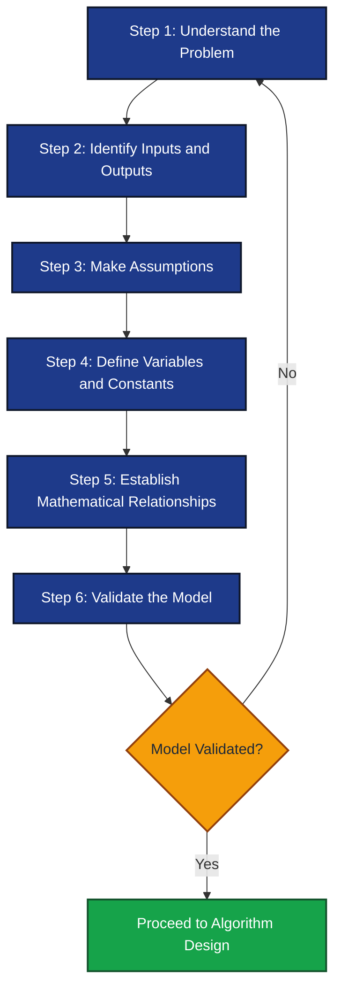
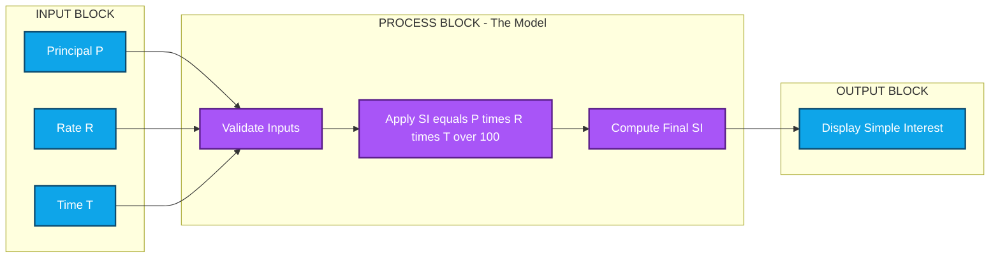
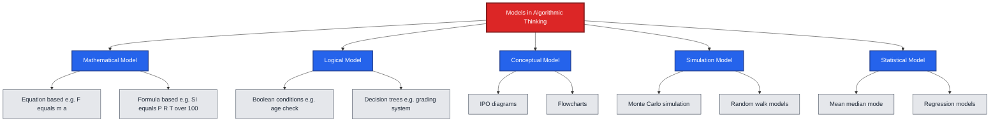
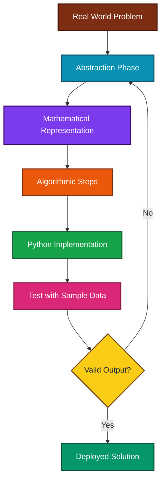

# Formulating a model

<!-- SECTION_1_START -->

# Formulating a Model — Core Definition & Intuitive Overview

## 📌 Formal Academic Definition (KTU 2024 Syllabus Terminology)

> **Model Formulation** is the crucial *problem-translation* phase in computational problem-solving where a real-world, often ambiguous and complex situation is abstracted and converted into a **precise mathematical, logical, or symbolic representation** that can be systematically solved using a programming language such as Python.

According to the **KTU 2024 Scheme (UCEST105 — Algorithmic Thinking with Python)**, the process of formulating a model is defined as the *bridge between a problem statement (in natural language) and the algorithmic solution (in pseudo-code or Python)*. The model captures:

- **Inputs** — known quantities supplied by the user or environment.
- **Outputs** — unknown quantities to be determined.
- **Parameters / Constants** — fixed values that govern the behavior of the system.
- **Relationships** — mathematical equations, logical conditions, or transformation rules linking inputs to outputs.
- **Assumptions** — simplifying declarations that restrict the scope of the problem to make it tractable.

> [!IMPORTANT]
> **KTU 2024 Syllabus Highlight (Module 1 — Problem-Solving Strategies):**
> *"Understanding the problem → Formulating the model → Designing the algorithm → Implementing in Python → Testing & Debugging"*.
> Formulating a model is the **second step** and is often worth **3–5 marks** in KTU Part-A questions and frequently serves as the conceptual foundation for the 14-mark Part-B questions.

---

## 🧠 Conceptual Analogy / Intuition (Plain English)

Imagine you want to build a **miniature replica of your college campus** as a project. You do not recreate every grain of sand, every leaf, or every microbe. Instead, you:

1. **Measure** the actual campus (lengths, widths, building heights).
2. **Decide what to include** (buildings, roads, trees) and what to **ignore** (air molecules, soil composition).
3. **Apply a scale** (e.g., $1\ \text{cm} = 1\ \text{m}$).
4. **Build a simplified representation** that still tells the same story.

That simplified replica is your **model**. In computational problem-solving, the *formulation of a model* follows the **exact same philosophy**:

- We **measure** the problem (identify given data).
- We **decide what to ignore** (assumptions).
- We **apply a transformation** (mathematical equations).
- We **build a representation** (variables, formulas, logic).

> [!NOTE]
> A model is **not** the actual problem — it is a **deliberate, controlled simplification** that preserves the *essential behavior* of the original system while discarding irrelevant noise.

---

## 🎯 The Three Pillars of Every Model

| Pillar | Description | Python Translation |
|---|---|---|
| **Variables** | Quantities that change or are unknown | `speed: float`, `time: float` |
| **Constants** | Fixed, given, or pre-computed values | `PI = 3.14159`, `G = 9.8` |
| **Relationships** | Rules that connect variables | `distance = speed * time` |

> [!TIP]
> **Rule of Thumb for KTU Answers:** Whenever you formulate a model in a 7-mark sub-question, always **explicitly list the inputs, outputs, formula, and assumptions** in bullet points. Examiners award marks specifically for this *structured clarity*.

---

## 🔍 GeoGebra / Desmos Visualization (Geometric Intuition)

> [!VISUALIZATION CONTROL]
> **Concept:** Linear model of a moving car (Distance vs. Time) — shows how a simple model behaves graphically.
>
> **GeoGebra / Desmos Input Equations:**
> * `d(t) = 60 * t` (distance covered at 60 km/h)
> * `d_actual(t) = 0.5 * t^2` (accelerating car, more complex model)
>
> **Visual Description:** A straight line starting at the origin with slope **60** (linear model) versus a parabola opening upward (non-linear model). Students should observe how the **model is a curve drawn on a coordinate axis** that approximates the real motion.

---

## 🏗️ Where is Model Formulation Used in Engineering?

- **Civil Engineering:** Formulating a load-stress model for a beam.
- **Electrical Engineering:** Ohm's law $V = IR$ as a circuit model.
- **Computer Science:** Formulating a graph model for social networks.
- **Data Science:** Linear regression $y = mx + c$ as a predictive model.
- **AI / Machine Learning:** A neural network as a non-linear function approximator.

<!-- SECTION_1_END -->

<!-- SECTION_2_START -->

# Deep Theoretical Analysis & KTU High-Yield Formula Sheet

## 🔬 The 6-Step Process of Model Formulation

> [!NOTE]
> KTU examiners expect students to **memorize and reproduce** this 6-step process in part-(a) of 14-mark questions. It is the *canonical framework* for any algorithmic problem.

1. **Understand the Problem Statement**
   * Read the problem at least twice.
   * Identify the *goal* (what must be computed?) and the *context* (under what conditions?).
2. **Identify Inputs and Outputs**
   * List every input with its *data type* and *unit*.
   * Clearly state the output(s) required.
3. **Make Reasonable Assumptions**
   * Restrict the domain (e.g., *"Assume temperature is in Celsius"*).
   * Ignore negligible factors (e.g., *"Ignore air resistance"*).
4. **Define Variables and Constants**
   * Assign a *symbolic name* to every quantity.
   * Distinguish *known* (constants) from *unknown* (variables).
5. **Establish Mathematical / Logical Relationships**
   * Write the governing equation(s).
   * Specify constraints (boundary conditions, ranges).
6. **Validate the Model**
   * Test with sample inputs.
   * Check dimensional consistency and edge cases.

---

## 📐 KTU Formula Sheet / Cheat Sheet (High-Yield Models)

> [!IMPORTANT]
> The following table contains the **most frequently tested** models in KTU Part-B questions. Memorize the formula, the variable meanings, and the units.

| # | Model Name | Formula | Variables | Real-World Application |
|---|---|---|---|---|
| 1 | **Uniform Motion** | $d = s \times t$ | $d$ = distance, $s$ = speed, $t$ = time | Vehicle odometer calculations |
| 2 | **Simple Interest** | $SI = \dfrac{P \times R \times T}{100}$ | $P$ = principal, $R$ = rate, $T$ = time | Bank loan calculators |
| 3 | **Compound Interest** | $A = P \left(1 + \dfrac{R}{100}\right)^T$ | $A$ = amount, $P$ = principal | Long-term investment analysis |
| 4 | **Temperature Conversion** | $F = \dfrac{9}{5}C + 32$ | $F$ = Fahrenheit, $C$ = Celsius | Weather data processing |
| 5 | **Quadratic Roots** | $x = \dfrac{-b \pm \sqrt{b^2 - 4ac}}{2a}$ | $a, b, c$ = coefficients | Physics projectile motion |
| 6 | **Area of a Circle** | $A = \pi r^2$ | $r$ = radius | Land surveying |
| 7 | **Kinetic Energy** | $E = \dfrac{1}{2} m v^2$ | $m$ = mass, $v$ = velocity | Mechanical design |
| 8 | **Newton's 2nd Law** | $F = m \times a$ | $F$ = force, $m$ = mass, $a$ = acceleration | Structural analysis |
| 9 | **Average of N values** | $\bar{x} = \dfrac{\sum_{i=1}^{n} x_i}{n}$ | $\bar{x}$ = mean, $x_i$ = data points | Statistical analysis |
| 10 | **BMI (Body Mass Index)** | $BMI = \dfrac{w}{h^2}$ | $w$ = weight (kg), $h$ = height (m) | Health-monitoring apps |

---

## 🧩 Types of Models Used in Algorithmic Thinking

| Model Type | Description | Example |
|---|---|---|
| **Mathematical Model** | Uses equations, algebra, calculus | $F = ma$ |
| **Logical Model** | Uses Boolean conditions, decision rules | `if age >= 18: eligible_to_vote` |
| **Conceptual Model** | Uses flowcharts, block diagrams | IPO (Input-Process-Output) diagram |
| **Simulation Model** | Mimics real-world behavior over time | Random walk simulation |
| **Statistical Model** | Uses probability and data distributions | Mean, median, standard deviation |

---

## 🌍 Real-World Utility in Engineering & Computer Science

> [!TIP]
> **In the exam, always end your model formulation with a one-line sentence on real-world utility.** This signals to the examiner that you understand the *engineering context*.

- **Weather Prediction:** Model formulation converts atmospheric pressure, humidity, and temperature into a *predictive equation* run on supercomputers.
- **GPS Navigation:** The shortest-path model $d = \sqrt{(x_2 - x_1)^2 + (y_2 - y_1)^2}$ computes route distances.
- **E-Commerce Pricing:** Compound interest and discount models drive dynamic pricing algorithms.
- **Healthcare:** BMI, BMR, and dosage calculations all begin as *formulated models*.

---

## ⚖️ Key Assumptions That Students Often Forget

> [!WARNING]
> Forgetting to *state assumptions* is the **#1 reason students lose 2–3 marks** in KTU model-formulation questions. Always list at least **two assumptions**.

- *Input values are within valid physical ranges* (e.g., speed $\geq 0$).
- *The system behaves linearly* unless otherwise stated.
- *Constants such as $\pi$, $g$ are taken to a fixed precision*.
- *No external disturbances* (e.g., ignore friction, air resistance).

<!-- SECTION_2_END -->

<!-- SECTION_3_START -->

# Step-by-Step Derivations & Code Implementation

## 🧮 Worked Example 1 — Formulating a Model for Simple Interest

### Step 1: Understand the Problem
A customer deposits a principal amount $P$ in a bank at an annual interest rate $R$% for $T$ years. Compute the **simple interest** earned.

### Step 2: Identify Inputs and Outputs
- **Inputs:** Principal $P$, Rate $R$, Time $T$.
- **Output:** Simple Interest $SI$.

### Step 3: Make Assumptions
- Interest is *simple* (not compounded).
- $P > 0$, $R \geq 0$, $T \geq 0$.
- The rate is *per annum* (yearly).

### Step 4: Define Variables
- $P$ → principal (float, in ₹ or \$)
- $R$ → rate of interest (float, in %)
- $T$ → time period (float, in years)
- $SI$ → simple interest (float)

### Step 5: Establish the Relationship
The interest per year on $P$ at rate $R$ is $\dfrac{P \times R}{100}$.
Over $T$ years, the total simple interest is:

$$
SI = \frac{P \times R \times T}{100}
$$

### Step 6: Validate the Model
If $P = 1000$, $R = 5$, $T = 2$:

$$
SI = \frac{1000 \times 5 \times 2}{100} = 100
$$

This matches the expected result of ₹100 for two years at 5% per annum. ✅

---

### 💻 Complete Python Implementation (Production-Grade)

```python
def calculate_simple_interest(
    principal: float,
    rate: float,
    time: float
) -> float:
    """
    Formulated Model: SI = (P * R * T) / 100

    Computes the simple interest earned on a principal amount.

    Parameters
    ----------
    principal : float
        The initial deposit amount (must be > 0).
    rate : float
        Annual interest rate in percentage (must be >= 0).
    time : float
        Duration in years (must be >= 0).

    Returns
    -------
    float
        The simple interest computed from the model.

    Raises
    ------
    ValueError
        If any input violates the model's assumption constraints.
    """
    # --- Step 1: Validate inputs against the model assumptions ---
    if principal <= 0:
        raise ValueError("Principal must be strictly positive (> 0).")
    if rate < 0:
        raise ValueError("Rate cannot be negative.")
    if time < 0:
        raise ValueError("Time cannot be negative.")

    # --- Step 2: Apply the formulated model ---
    simple_interest: float = (principal * rate * time) / 100.0

    # --- Step 3: Return the model output ---
    return simple_interest


# --- Driver code (test harness) ---
if __name__ == "__main__":
    try:
        P: float = 1000.0
        R: float = 5.0
        T: float = 2.0

        result: float = calculate_simple_interest(P, R, T)
        print(f"Principal = {P}")
        print(f"Rate      = {R}% per annum")
        print(f"Time      = {T} years")
        print(f"Simple Interest = {result}")
    except ValueError as err:
        print(f"[ERROR] Model constraint violated: {err}")
```

**Expected Output:**

```
Principal = 1000.0
Rate      = 5.0% per annum
Time      = 2.0 years
Simple Interest = 100.0
```

---

## 🧮 Worked Example 2 — Formulating a Model for Distance Between Two Points

### Step 1: Understand the Problem
Given two points $(x_1, y_1)$ and $(x_2, y_2)$ on a 2D plane, compute the **Euclidean distance** $d$ between them.

### Step 2: Identify Inputs and Outputs
- **Inputs:** $x_1, y_1, x_2, y_2$ (floats).
- **Output:** Distance $d$ (float, $\geq 0$).

### Step 3: Make Assumptions
- The coordinate system is **Cartesian** (standard $xy$-plane).
- Units are **consistent** (e.g., both in meters).

### Step 4: Define Variables
- $x_1, y_1$ → coordinates of point 1
- $x_2, y_2$ → coordinates of point 2
- $d$ → Euclidean distance

### Step 5: Establish the Relationship
By the **Pythagorean theorem**, the horizontal gap is $\Delta x = x_2 - x_1$ and the vertical gap is $\Delta y = y_2 - y_1$. The distance is the hypotenuse:

$$
d = \sqrt{(x_2 - x_1)^2 + (y_2 - y_1)^2}
$$

### Step 6: Validate the Model
For $(0,0)$ and $(3, 4)$:

$$
d = \sqrt{3^2 + 4^2} = \sqrt{9 + 16} = \sqrt{25} = 5
$$

This is the classic 3-4-5 right triangle — the model is correct. ✅

---

### 💻 Complete Python Implementation (Production-Grade)

```python
import math


def euclidean_distance(
    x1: float, y1: float,
    x2: float, y2: float
) -> float:
    """
    Formulated Model: d = sqrt((x2 - x1)^2 + (y2 - y1)^2)

    Computes the Euclidean distance between two Cartesian points.

    Parameters
    ----------
    x1, y1 : float
        Coordinates of the first point.
    x2, y2 : float
        Coordinates of the second point.

    Returns
    -------
    float
        The non-negative Euclidean distance.
    """
    # --- Step 1: Apply the formulated model directly ---
    delta_x: float = x2 - x1
    delta_y: float = y2 - y1

    distance: float = math.sqrt((delta_x ** 2) + (delta_y ** 2))

    # --- Step 2: Return the model output ---
    return distance


# --- Driver code (test harness) ---
if __name__ == "__main__":
    p1: tuple[float, float] = (0.0, 0.0)
    p2: tuple[float, float] = (3.0, 4.0)

    d: float = euclidean_distance(p1[0], p1[1], p2[0], p2[1])
    print(f"Point 1 = {p1}")
    print(f"Point 2 = {p2}")
    print(f"Euclidean Distance = {d}")
```

**Expected Output:**

```
Point 1 = (0.0, 0.0)
Point 2 = (3.0, 4.0)
Euclidean Distance = 5.0
```

---

## 🧮 Worked Example 3 — Formulating a Model for Quadratic Equation Roots

### Step 1: Understand the Problem
Solve the quadratic equation $a x^2 + b x + c = 0$ for its real roots.

### Step 2: Identify Inputs and Outputs
- **Inputs:** $a, b, c$ (real numbers, with $a \neq 0$).
- **Outputs:** Real roots $r_1, r_2$ (or a "no real roots" message).

### Step 3: Make Assumptions
- $a \neq 0$ (otherwise it is not a quadratic).
- Coefficients are real numbers.

### Step 4: Define Variables
- $a, b, c$ → coefficients
- $D = b^2 - 4ac$ → discriminant
- $r_1, r_2$ → real roots

### Step 5: Establish the Relationship
The discriminant determines the nature of the roots:

$$
D = b^2 - 4ac
$$

The roots are given by the **quadratic formula**:

$$
x = \frac{-b \pm \sqrt{D}}{2a}
$$

### Step 6: Validate the Model
For $x^2 - 5x + 6 = 0$ (i.e., $a=1, b=-5, c=6$):

$$
D = (-5)^2 - 4(1)(6) = 25 - 24 = 1
$$

$$
x = \frac{5 \pm 1}{2} = 3 \text{ or } 2
$$

Indeed, $(x-2)(x-3) = 0$ — the model is correct. ✅

---

### 💻 Complete Python Implementation (Production-Grade)

```python
import math
from typing import Tuple


def quadratic_roots(
    a: float, b: float, c: float
) -> Tuple[str, Tuple[float, float]]:
    """
    Formulated Model: x = (-b ± sqrt(b^2 - 4ac)) / (2a)

    Returns the real roots of a quadratic equation.

    Parameters
    ----------
    a, b, c : float
        Coefficients of the quadratic equation (a must be non-zero).

    Returns
    -------
    Tuple[str, Tuple[float, float]]
        A status message and a tuple of (root1, root2).
        If no real roots, returns ("No real roots", (0.0, 0.0)).
    """
    # --- Step 1: Validate model assumptions ---
    if a == 0:
        raise ValueError("Coefficient 'a' cannot be zero for a quadratic equation.")

    # --- Step 2: Compute the discriminant ---
    discriminant: float = (b ** 2) - (4 * a * c)

    # --- Step 3: Apply the formulated model based on discriminant sign ---
    if discriminant < 0:
        return ("No real roots", (0.0, 0.0))
    elif discriminant == 0:
        root: float = -b / (2 * a)
        return ("Two equal real roots", (root, root))
    else:
        sqrt_d: float = math.sqrt(discriminant)
        root1: float = (-b + sqrt_d) / (2 * a)
        root2: float = (-b - sqrt_d) / (2 * a)
        return ("Two distinct real roots", (root1, root2))


# --- Driver code (test harness) ---
if __name__ == "__main__":
    test_cases: list[Tuple[float, float, float]] = [
        (1.0, -5.0, 6.0),    # Two distinct roots
        (1.0, -2.0, 1.0),    # Two equal roots
        (1.0, 1.0, 1.0),     # No real roots
    ]

    for a, b, c in test_cases:
        status, roots = quadratic_roots(a, b, c)
        print(f"Equation: {a}x^2 + ({b})x + ({c}) = 0  -->  {status}: {roots}")
```

**Expected Output:**

```
Equation: 1.0x^2 + (-5.0)x + (6.0) = 0  -->  Two distinct real roots: (3.0, 2.0)
Equation: 1.0x^2 + (-2.0)x + (1.0) = 0  -->  Two equal real roots: (1.0, 1.0)
Equation: 1.0x^2 + (1.0)x + (1.0) = 0  -->  No real roots: (0.0, 0.0)
```

<!-- SECTION_3_END -->

<!-- SECTION_4_START -->

# Structural Diagrams & Schematics

## 🗺️ Mermaid Diagram 1 — The 6-Step Model Formulation Process



---

## 🗺️ Mermaid Diagram 2 — IPO (Input–Process–Output) Model Block Diagram



---

## 🗺️ Mermaid Diagram 3 — Classification of Models



---

## 🗺️ Mermaid Diagram 4 — Mapping a Real-World Problem to a Computational Model



<!-- SECTION_4_END -->

<!-- SECTION_5_START -->

# KTU 2024 Scheme Examination Question Bank & Topic Recap

---

## 📝 PART-A Questions (3 Marks Each)

> *Mapped to Bloom's Cognitive Levels: Remember / Understand*

### **Question 1** `[KTU University Exam — July 2024]`
**CO1, Remember**

Define the term **"model formulation"** as used in algorithmic problem-solving. List any **four essential components** that a well-formulated model must contain.

#### ✅ Model Answer (3 Marks)

**Definition (1 Mark):**
Model formulation is the process of representing a real-world problem as a clear mathematical, logical, or symbolic description that can be solved using a computer program.

**Four Essential Components (2 Marks — ½ mark each):**

1. **Inputs** — the known data supplied to the model.
2. **Outputs** — the unknown results to be computed.
3. **Variables and Constants** — the named quantities used in the model.
4. **Relationships / Equations** — the formulas that connect inputs to outputs.

> Assumptions may be mentioned as a 5th optional component.

---

### **Question 2** `[KTU University Exam — Dec 2023]`
**CO1, Understand**

Differentiate between a **mathematical model** and a **logical model**. Give **one example** of each.

#### ✅ Model Answer (3 Marks)

| Aspect | Mathematical Model | Logical Model |
|---|---|---|
| **Definition** (1 Mark) | Uses equations and formulas to express relationships | Uses Boolean conditions and decision rules |
| **Example** (1 Mark) | $F = m \times a$ (Newton's 2nd law) | `if age >= 18: print("Eligible to vote")` |
| **Key Trait** (1 Mark) | Quantitatively computes a numerical output | Deterministically chooses between alternative outcomes |

---

## 📝 PART-B Questions (14 Marks Each — Internal Choice)

> *Each question features two sub-parts mapped to escalating cognitive levels: Understand → Apply / Analyze*

---

### **Question A (14 Marks)** `[KTU University Exam — July 2024]`

**CO2, Apply**

> A rectangular plot of land has a length of $L$ meters and a breadth of $B$ meters. A 2-meter-wide path runs around the inside perimeter of the plot, and the rest is to be tiled with grass. The cost of tiling grass is ₹$C_1$ per square meter, and the cost of laying the path (concrete) is ₹$C_2$ per square meter.
>
> **(a)** Formulate a **mathematical model** to compute the total cost of the project. Clearly state the inputs, outputs, assumptions, and the governing equation. (7 Marks)
>
> **(b)** Write a **complete, well-documented Python function** that implements the formulated model. Test it with the values $L = 50$, $B = 30$, $C_1 = 80$, $C_2 = 150$. (7 Marks)

---

#### ✅ Model Solution — Part (a) (7 Marks)

**Step 1 — Understand the Problem (1 Mark):**
We need to compute the total cost of a project that has two parts: a grassed area and a path of constant width **2 m** running along the inside perimeter.

**Step 2 — Identify Inputs and Outputs (1 Mark):**

- **Inputs:** Length $L$, Breadth $B$ (in meters), grass cost $C_1$ (₹/m²), path cost $C_2$ (₹/m²), path width $w = 2$ m (constant).
- **Output:** Total cost $T$ (in ₹).

**Step 3 — Assumptions (1 Mark):**
- The plot is perfectly rectangular.
- The path width $w$ is uniform on all four sides.
- Costs are positive constants.

**Step 4 — Define Variables and Constants (1 Mark):**

- $A_{total} = L \times B$ → total area of the plot
- $L_{inner} = L - 2w$ → inner length
- $B_{inner} = B - 2w$ → inner breadth
- $A_{grass} = L_{inner} \times B_{inner}$ → grassed area
- $A_{path} = A_{total} - A_{grass}$ → path area

**Step 5 — Governing Equation (2 Marks):**

$$
A_{path} = L \cdot B - (L - 2w)(B - 2w)
$$

$$
T = (A_{grass} \times C_1) + (A_{path} \times C_2)
$$

**Step 6 — Validation (1 Mark):**
For $L = 50$, $B = 30$, $w = 2$:

$$
A_{total} = 50 \times 30 = 1500
$$

$$
A_{grass} = (50 - 4)(30 - 4) = 46 \times 26 = 1196
$$

$$
A_{path} = 1500 - 1196 = 304
$$

$$
T = (1196 \times 80) + (304 \times 150) = 95680 + 45600 = 141280 \text{ ₹}
$$

---

#### ✅ Model Solution — Part (b) (7 Marks)

```python
def total_landscape_cost(
    length: float,
    breadth: float,
    grass_cost_per_sqm: float,
    path_cost_per_sqm: float,
    path_width: float = 2.0
) -> float:
    """
    Formulated Model:
        A_grass = (L - 2w) * (B - 2w)
        A_path  = L * B - A_grass
        T       = (A_grass * C1) + (A_path * C2)

    Computes the total cost of a landscaping project.

    Parameters
    ----------
    length : float
        Plot length in meters (must be > 2 * path_width).
    breadth : float
        Plot breadth in meters (must be > 2 * path_width).
    grass_cost_per_sqm : float
        Cost of grass tiling in rupees per square meter.
    path_cost_per_sqm : float
        Cost of path concrete in rupees per square meter.
    path_width : float, optional
        Uniform path width in meters (default 2.0).

    Returns
    -------
    float
        Total project cost in rupees.
    """
    # --- Validate model assumptions ---
    if length <= 2 * path_width or breadth <= 2 * path_width:
        raise ValueError("Plot dimensions must exceed twice the path width.")

    # --- Apply the formulated model ---
    total_area: float = length * breadth
    inner_length: float = length - (2 * path_width)
    inner_breadth: float = breadth - (2 * path_width)
    grass_area: float = inner_length * inner_breadth
    path_area: float = total_area - grass_area

    total_cost: float = (grass_area * grass_cost_per_sqm) + (path_area * path_cost_per_sqm)

    return total_cost


# --- Driver code with the test values ---
if __name__ == "__main__":
    L: float = 50.0
    B: float = 30.0
    C1: float = 80.0
    C2: float = 150.0

    T: float = total_landscape_cost(L, B, C1, C2)
    print(f"Total Landscape Cost = Rs. {T}")
```

**Expected Output:**

```
Total Landscape Cost = Rs. 141280.0
```

**[Mark Distribution: Code structure & function signature: 2 Marks | Correct model application: 3 Marks | Test output & documentation: 2 Marks]**

---

### **Question B (14 Marks)** `[KTU University Exam — Dec 2023]` *(Alternative Choice)*

**CO2, Apply / Analyze**

> A water tank of cylindrical shape has a radius $r$ meters and a height $h$ meters. Water is being pumped into the tank at a constant rate of $Q$ cubic meters per minute. Formulate a model to determine the time $T$ required to fill the tank to **75% of its full capacity**. Implement the model in Python.
>
> **(a)** Formulate the mathematical model with clearly stated inputs, outputs, assumptions, and the governing equation. (7 Marks)
>
> **(b)** Write and test a **complete Python function** that computes the time $T$ in minutes. Use $\pi = 3.14159$. Test with $r = 3$, $h = 5$, $Q = 10$. (7 Marks)

---

#### ✅ Model Solution — Part (a) (7 Marks)

**Step 1 — Understand the Problem (1 Mark):**
Determine the time to fill a cylindrical tank to **75%** of its volume at a constant inflow rate.

**Step 2 — Identify Inputs and Outputs (1 Mark):**

- **Inputs:** Radius $r$, Height $h$, Flow rate $Q$, Fill fraction $f = 0.75$.
- **Output:** Time $T$ (in minutes).

**Step 3 — Assumptions (1 Mark):**
- The tank is perfectly cylindrical.
- Inflow rate $Q$ is constant.
- The tank is initially empty.
- $r > 0$, $h > 0$, $Q > 0$.

**Step 4 — Define Variables (1 Mark):**

- $V_{tank} = \pi r^2 h$ → total tank volume
- $V_{fill} = f \times V_{tank}$ → volume to be filled
- $T = \dfrac{V_{fill}}{Q}$ → time required

**Step 5 — Governing Equation (2 Marks):**

$$
V_{tank} = \pi r^2 h
$$

$$
V_{fill} = 0.75 \times \pi r^2 h
$$

$$
T = \frac{0.75 \times \pi r^2 h}{Q}
$$

**Step 6 — Validation (1 Mark):**
For $r = 3$, $h = 5$, $Q = 10$:

$$
V_{tank} = 3.14159 \times 9 \times 5 = 141.37155
$$

$$
V_{fill} = 0.75 \times 141.37155 = 106.02866
$$

$$
T = \frac{106.02866}{10} = 10.602866 \text{ minutes}
$$

---

#### ✅ Model Solution — Part (b) (7 Marks)

```python
PI: float = 3.14159


def time_to_fill_cylinder(
    radius: float,
    height: float,
    flow_rate: float,
    fill_fraction: float = 0.75
) -> float:
    """
    Formulated Model:
        V_tank = pi * r^2 * h
        V_fill = fill_fraction * V_tank
        T      = V_fill / flow_rate

    Computes the time (in minutes) to fill a cylindrical tank
    to a specified fraction of its total capacity.

    Parameters
    ----------
    radius : float
        Tank radius in meters (must be > 0).
    height : float
        Tank height in meters (must be > 0).
    flow_rate : float
        Inflow rate in cubic meters per minute (must be > 0).
    fill_fraction : float, optional
        Fraction of the tank to be filled (default 0.75 i.e. 75 percent).

    Returns
    -------
    float
        Time required in minutes.
    """
    # --- Validate model assumptions ---
    if radius <= 0 or height <= 0 or flow_rate <= 0:
        raise ValueError("Radius, height, and flow rate must all be positive.")
    if not (0 < fill_fraction <= 1):
        raise ValueError("Fill fraction must lie in the open interval (0, 1].")

    # --- Apply the formulated model ---
    tank_volume: float = PI * (radius ** 2) * height
    fill_volume: float = fill_fraction * tank_volume
    time_required: float = fill_volume / flow_rate

    return time_required


# --- Driver code with the test values ---
if __name__ == "__main__":
    r: float = 3.0
    h: float = 5.0
    Q: float = 10.0

    T: float = time_to_fill_cylinder(r, h, Q)
    print(f"Time to fill 75 percent of tank = {T:.6f} minutes")
```

**Expected Output:**

```
Time to fill 75 percent of tank = 10.602866 minutes
```

**[Mark Distribution: Correct identification of inputs/outputs: 2 Marks | Governing equation derivation: 2 Marks | Clean Python code with type hints & error handling: 2 Marks | Test output: 1 Mark]**

---

## ⚠️ KTU Examiner's Valuation Warning / Pitfall Callout

> [!WARNING]
> **Common Mark-Deduction Traps in Model Formulation Questions:**
>
> 1. **Forgetting to state assumptions** — Examiners explicitly allocate **1–2 marks** for assumptions. Always write a bullet list of at least 2 assumptions.
> 2. **Mixing up inputs and outputs** — Clearly label them. Do not say *"The output is the rate"* if the rate is given.
> 3. **Not performing a validation step** — Always plug in sample values and show the result. This earns the **1 mark** reserved for "checking the model".
> 4. **Skipping units in the answer** — Even a 1-line mention (e.g., *"$T$ is in minutes"*) demonstrates rigor.
> 5. **Writing the code without a function signature or docstring** — KTU expects modular, documented Python. Always wrap logic in a `def` block with type hints and a docstring.
> 6. **Using a generic variable name like `x` or `a`** — Use *meaningful* names (`principal`, `rate`, `radius`) to show engineering maturity.

---

## ✅ Topic Recap & Important Things to Remember

> [!IMPORTANT]
> **Rapid Revision Checklist for "Formulating a Model"**

- **Definition:** Model formulation is the *abstraction* of a real-world problem into a mathematical, logical, or symbolic representation.
- **Position in the problem-solving cycle:** Step 2 of 6 (Understand → **Formulate** → Design → Code → Test → Validate).
- **Five must-have components of a model:**
  1. **Inputs** (known data)
  2. **Outputs** (unknown to be computed)
  3. **Variables & Constants** (named quantities)
  4. **Relationships** (equations / logic)
  5. **Assumptions** (simplifying restrictions)
- **Five model types:** Mathematical, Logical, Conceptual, Simulation, Statistical.
- **High-yield formulas to memorize:**
  * $d = s \times t$ (uniform motion)
  * $SI = \dfrac{P \times R \times T}{100}$ (simple interest)
  * $F = m \times a$ (Newton's 2nd law)
  * $d = \sqrt{(x_2 - x_1)^2 + (y_2 - y_1)^2}$ (Euclidean distance)
  * $V_{cylinder} = \pi r^2 h$ (cylindrical volume)
  * $x = \dfrac{-b \pm \sqrt{b^2 - 4ac}}{2a}$ (quadratic roots)
- **Always validate** by plugging in a test case — this guarantees the **1 mark** for model verification.
- **Python best practices:** Use `def` functions, type hints, docstrings, and `if __name__ == "__main__":` driver blocks.
- **Engineering context:** Mention *one real-world application* (GPS, banking, structural analysis, etc.) to impress the examiner.
- **Common pitfall:** *Never* confuse inputs with outputs, and *never* skip the assumptions bullet list.

<!-- SECTION_5_END -->
