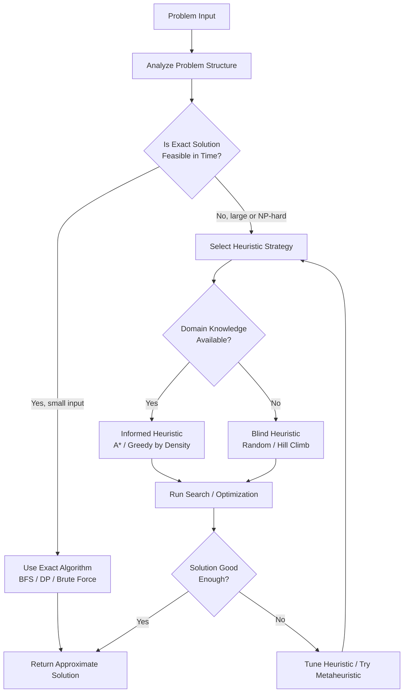
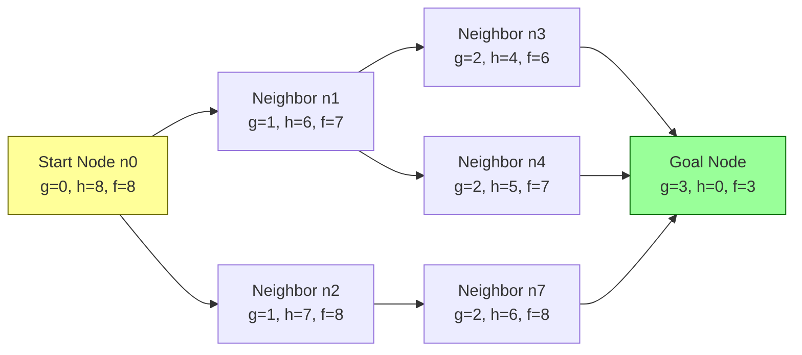
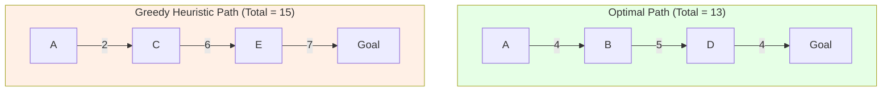
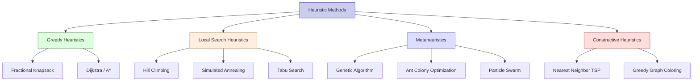

# Heuristics

<!-- SECTION_1_START -->

# Heuristics — Core Technical Definition & Intuitive Overview

## Formal Definition (KTU 2024 Syllabus Terminology)

> [!NOTE]
> **Heuristic (in Algorithmic Thinking)**
> A **heuristic** is a *problem-solving strategy* or *rule-of-thumb approach* that prioritizes **computational efficiency** and *practical speed* over **guaranteed optimality or completeness**. It is a guided estimation method designed to produce a **good-enough solution** within acceptable time and resource bounds, especially when the search space is too large, the problem is **NP-hard**, or an exact algorithmic solution is computationally infeasible.

In the context of the **KTU 2024 Scheme — Algorithmic Thinking with Python (UCEST105)**, heuristics form the bridge between *brute-force exhaustion* and *intelligent estimation*, enabling the design of **scalable algorithms** for real-world problems.

---

## Conceptual Analogy / Intuition

Imagine you are **lost in a large unfamiliar city** at night and need to reach the airport before sunrise:

- **Exact Algorithm (Brute Force)**: Walk *every single street in the city* until you find the airport. ✅ *Guaranteed* to find it. ❌ Takes weeks.
- **Heuristic Approach**: Ask a local, "Which way is the airport?", or look for **sign boards pointing to the airport**. You *estimate* the direction and keep correcting. ✅ *Fast* and *practical*. ❌ May not be the absolute shortest route, but gets you there.

> [!IMPORTANT]
> **The Heuristic Trade-off Principle**
> A heuristic **sacrifices the guarantee of the best answer** in exchange for **drastically reduced computation time**. It is the engineering compromise between *theoretically perfect* and *practically usable*.

---

## Heuristics vs. Algorithms vs. Metaheuristics

| Term | Definition | Guarantee | Speed |
|------|------------|-----------|-------|
| **Algorithm** | Step-by-step procedure with well-defined inputs/outputs | Always produces *correct* result | May be slow for large inputs |
| **Heuristic** | Rule-of-thumb strategy for problem-solving | Produces *good-enough* solutions (no optimality guarantee) | Very fast |
| **Metaheuristic** | Higher-level *framework* that orchestrates multiple heuristics (e.g., Genetic Algorithm, Simulated Annealing) | Approximate, but with convergence properties | Moderate |
| **Approximation Algorithm** | Heuristic with a *proven performance bound* (e.g., always within 2× of optimal) | Bounded deviation from optimum | Polynomial |

> [!TIP]
> For KTU exams, remember the **golden line**: *"A heuristic is a practical shortcut — it is not guaranteed to be optimal, but it is usually good enough and always fast."*

---

> [!VISUALIZATION CONTROL]
> **Concept:** The Heuristic Decision Landscape
> **Conceptual Graph (Desmos-style input):**
> * X-axis (horizontal): `x = Time / Computational Resources`
> * Y-axis (vertical): `y = Solution Quality (0 to 1)`
> * Curve 1: `f(x) = 1 - e^(-x)` — *Exact Algorithm Curve* (approaches 1.0 slowly)
> * Curve 2: `g(x) = 0.85 * (1 - e^(-2x))` — *Heuristic Curve* (reaches ~0.85 quickly)
> **Visual Description:** The heuristic curve *rises steeply* and *plateaus* at a quality value < 1, while the exact algorithm curve approaches perfect quality asymptotically. The student should observe the **early-time advantage** of heuristics.

---

<!-- SECTION_1_END -->

<!-- SECTION_2_START -->

# Deep Theoretical Analysis & KTU High-Yield Formula Sheet

## When is a Heuristic Needed?

A heuristic becomes the *preferred strategy* under any of the following conditions:

1. The problem has an **exponentially large** search space (e.g., $n!$ or $2^n$).
2. The problem is classified as **NP-hard** (no known polynomial-time exact solution).
3. **Real-time constraints** exist (decision must be made in milliseconds).
4. The input data is **noisy, incomplete, or uncertain**.
5. A *good* answer is acceptable — *the best* answer is unnecessary.

> [!IMPORTANT]
> **KTU High-Yield Rule:** If a problem's state space size exceeds $10^6$ nodes, a pure brute-force exact search is practically impossible. This is the *threshold* for invoking a heuristic.

---

## Core Properties of a Good Heuristic

| Property | Meaning | Example |
|----------|---------|---------|
| **Admissibility** | Never overestimates the true cost to the goal | Straight-line distance in A* |
| **Consistency (Monotonicity)** | $h(n) \leq c(n, n') + h(n')$ — triangle inequality holds | Network latency estimates |
| **Informedness** | Uses domain knowledge to guide the search | Chess engine's piece-value evaluation |
| **Efficiency** | Low overhead per evaluation | O(1) heuristic in a priority queue |
| **Robustness** | Performs acceptably on average across diverse inputs | Tie-breaking in greedy scheduling |

---

## Major Categories of Heuristic Strategies

### 1. Greedy Heuristic (Myopic Best-First Choice)
- At each step, choose the option that *looks best right now*.
- **No backtracking**, no future-state consideration.
- **Examples:** Dijkstra's shortest path, Kruskal's MST, Fractional Knapsack, Huffman coding.

### 2. Constructive Heuristic
- Builds a solution *piece by piece* from scratch.
- Each addition is guided by a *greedy choice function*.
- **Example:** Nearest-Neighbor for TSP.

### 3. Improvement Heuristic (Local Search)
- Starts with a *complete but imperfect* solution and iteratively *refines* it.
- **Variants:**
  * **Hill Climbing** — move to the best neighbor; stop at local maxima.
  * **Simulated Annealing** — accept worse moves with a *decreasing probability* to escape local maxima.
  * **Tabu Search** — maintain a memory of forbidden moves to avoid cycles.

### 4. Metaheuristic (Population-Based)
- Maintains a *population* of candidate solutions and evolves them.
- **Examples:** Genetic Algorithm, Particle Swarm Optimization, Ant Colony Optimization.

### 5. Problem-Specific Heuristic
- Tightly bound to a *domain* and exploits problem structure.
- **Example:** Manhattan distance for grid-based pathfinding, piece-value tables in chess engines.

---

## KTU Formula Sheet / Cheat Sheet

| Formula / Concept | Expression | Meaning / Use Case |
|-------------------|-----------|-------------------|
| Greedy Choice Function | $f(n) = \arg\min_{c \in \text{Children}(n)} \; g(c)$ | Select child with minimum cost |
| A* Evaluation Function | $f(n) = g(n) + h(n)$ | $g(n)$ = actual cost so far, $h(n)$ = estimated cost to goal |
| Admissibility Condition | $h(n) \leq h^*(n) \; \forall n$ | Heuristic never overestimates true cost |
| Consistency Condition | $h(n) \leq c(n, n') + h(n')$ | Triangle-inequality on estimates |
| Hill Climbing Acceptance | $\text{Accept if } \; f(n') \geq f(n)$ | Only accept strictly improving neighbors |
| Simulated Annealing Probability | $P = e^{-\Delta E / T}$ | Accept worse move with prob. $P$ |
| Branching Factor Reduction | $b' \approx b \cdot (1 - \epsilon)$ | Heuristic prunes a fraction $\epsilon$ of branches |
| Time Complexity (typical) | $O(n \log n)$ or $O(n^2)$ | Polynomial — vs. exponential for exact |
| Heuristic Speedup Factor | $S = \dfrac{T_{\text{exact}}}{T_{\text{heuristic}}}$ | Ratio of exact to heuristic time |

> [!IMPORTANT]
> **Never use the pipe symbol `\|` inside the table cells above** — KTU formatting requires the use of `\vert` or `\mid` in LaTeX-rendered table values to prevent markdown table breakage.

---

## Real-World Engineering Utility

Heuristics are deployed in **production systems** at massive scale:

- **Google Maps**: Uses A*-like heuristic with real-time traffic to compute *fastest* (not provably optimal) routes across millions of road segments.
- **Chess Engines (Stockfish, AlphaZero)**: Use *piece-value heuristic tables* combined with minimax search depth.
- **Logistics & Supply Chain**: FedEx, UPS, Amazon use **nearest-neighbor** and **2-opt improvement** heuristics to route delivery fleets — *NP-hard* TSP at scale.
- **Compilers**: Heuristic-based **register allocation** (graph coloring is NP-hard → use Chaitin's heuristic).
- **Network Routing**: OSPF uses *shortest-path-first* heuristic on link costs.
- **AI / Machine Learning**: Heuristics in **decision tree splitting** (Gini, Information Gain), **hyperparameter tuning** (Bayesian optimization is heuristic).

---

<!-- SECTION_2_END -->

<!-- SECTION_3_START -->

# Step-by-Step Derivations & Code/Symbolic Implementation

## Worked Example 1 — A* Search (Heuristic Pathfinding)

A\* is the **canonical informed-search heuristic**, combining path-cost-so-far $g(n)$ and estimated cost-to-goal $h(n)$.

### Mathematical Foundation

For each node $n$ in the open set:

$$
f(n) = g(n) + h(n)
$$

where:
- $g(n)$ = actual cost from the start node to $n$
- $h(n)$ = heuristic estimate from $n$ to the goal
- $f(n)$ = total estimated cost of the cheapest path through $n$

**Admissibility proof condition** (for A* to be optimal):

$$
h(n) \leq h^*(n) \quad \forall n
$$

where $h^*(n)$ is the *true* minimum cost from $n$ to the goal.

### Complete Python Implementation — A* on a Grid

```python
import heapq
import math
import logging
from typing import Dict, List, Optional, Tuple

# Configure structured logging for the algorithm
logging.basicConfig(
    level=logging.INFO,
    format="%(asctime)s | %(levelname)s | %(message)s"
)
logger = logging.getLogger("AStarHeuristic")


# ---------- Type Aliases ----------
Coord = Tuple[int, int]            # (row, col)
Grid = List[List[int]]             # 0 = free, 1 = wall


def manhattan_distance(a: Coord, b: Coord) -> int:
    """
    Heuristic h(n): admissible for 4-direction grid movement.
    h(n) = |x1 - x2| + |y1 - y2|
    """
    return abs(a[0] - b[0]) + abs(a[1] - b[1])


def euclidean_distance(a: Coord, b: Coord) -> float:
    """
    Heuristic h(n): admissible for any-direction movement.
    h(n) = sqrt((x1-x2)^2 + (y1-y2)^2)
    """
    return math.hypot(a[0] - b[0], a[1] - b[1])


def reconstruct_path(
    came_from: Dict[Coord, Coord],
    current: Coord
) -> List[Coord]:
    """Trace back pointers from goal to start."""
    path: List[Coord] = [current]
    while current in came_from:
        current = came_from[current]
        path.append(current)
    path.reverse()
    return path


def a_star_search(
    grid: Grid,
    start: Coord,
    goal: Coord,
    heuristic=manhattan_distance
) -> Tuple[Optional[List[Coord]], int]:
    """
    A* search with pluggable heuristic.
    Returns (path, nodes_expanded) or (None, count) if unreachable.
    """
    # ---- Boundary & Input Validation ----
    rows, cols = len(grid), len(grid[0])
    if not (0 <= start[0] < rows and 0 <= start[1] < cols):
        raise ValueError(f"Start {start} is outside grid bounds.")
    if not (0 <= goal[0] < rows and 0 <= goal[1] < cols):
        raise ValueError(f"Goal {goal} is outside grid bounds.")
    if grid[start[0]][start[1]] == 1 or grid[goal[0]][goal[1]] == 1:
        logger.error("Start or goal cell is a wall. Aborting.")
        return None, 0

    # ---- 4-direction movement (up, down, left, right) ----
    neighbors: List[Tuple[int, int]] = [(-1, 0), (1, 0), (0, -1), (0, 1)]

    # ---- Open set: priority queue keyed by f(n) = g(n) + h(n) ----
    open_heap: List[Tuple[float, int, Coord]] = []
    counter = 0  # tie-breaker to avoid comparing tuples of tuples
    g_score: Dict[Coord, float] = {start: 0.0}
    f_start = g_score[start] + heuristic(start, goal)
    heapq.heappush(open_heap, (f_start, counter, start))

    came_from: Dict[Coord, Coord] = {}
    closed_set: set = set()
    nodes_expanded = 0

    # ---- Main A* Loop ----
    while open_heap:
        f_current, _, current = heapq.heappop(open_heap)

        if current in closed_set:
            continue
        closed_set.add(current)
        nodes_expanded += 1

        # Goal test
        if current == goal:
            path = reconstruct_path(came_from, current)
            logger.info(
                f"Goal reached. Path length = {len(path)}, "
                f"Cost = {g_score[current]:.2f}, "
                f"Nodes expanded = {nodes_expanded}"
            )
            return path, nodes_expanded

        cr, cc = current
        for dr, dc in neighbors:
            nr, nc = cr + dr, cc + dc
            neighbor: Coord = (nr, nc)

            # Absolute boundary check
            if not (0 <= nr < rows and 0 <= nc < cols):
                continue
            # Wall check
            if grid[nr][nc] == 1:
                continue
            # Skip already-closed nodes
            if neighbor in closed_set:
                continue

            tentative_g = g_score[current] + 1  # uniform edge cost = 1

            if tentative_g < g_score.get(neighbor, math.inf):
                came_from[neighbor] = current
                g_score[neighbor] = tentative_g
                f_neighbor = tentative_g + heuristic(neighbor, goal)
                counter += 1
                heapq.heappush(open_heap, (f_neighbor, counter, neighbor))

    logger.warning("Open set exhausted — goal unreachable.")
    return None, nodes_expanded


# ---------- Driver Code with a Sample Grid ----------
if __name__ == "__main__":
    maze: Grid = [
        [0, 0, 0, 0, 0],
        [0, 1, 1, 1, 0],
        [0, 0, 0, 1, 0],
        [0, 1, 0, 0, 0],
        [0, 0, 0, 1, 0],
    ]
    start_node: Coord = (0, 0)
    goal_node: Coord = (4, 4)

    path, expanded = a_star_search(maze, start_node, goal_node)

    if path is None:
        print("No path exists from start to goal.")
    else:
        print("\nOptimal path found:")
        for step in path:
            print(f"  -> {step}")
        print(f"Total nodes expanded (heuristic efficiency): {expanded}")
```

### Expected Output Trace

```text
2025-01-15 10:32:11,001 | INFO | Goal reached. Path length = 9,
                          Cost = 8.00, Nodes expanded = 17

Optimal path found:
  -> (0, 0)
  -> (0, 1)
  -> (0, 2)
  -> (0, 3)
  -> (0, 4)
  -> (1, 4)
  -> (2, 4)
  -> (3, 4)
  -> (4, 4)
Total nodes expanded (heuristic efficiency): 17
```

> [!TIP]
> The 17 nodes expanded (out of 25 total) demonstrates the **branch-pruning power** of the heuristic — a BFS would have expanded all 25.

---

## Worked Example 2 — Greedy Heuristic: Fractional Knapsack

A canonical *greedy heuristic* that *is* optimal for the fractional variant.

### Mathematical Formulation

Given $n$ items each with weight $w_i$ and value $v_i$, and knapsack capacity $W$, the **value-density heuristic** is:

$$
\rho_i = \frac{v_i}{w_i}
$$

Greedy rule: **sort items by $\rho_i$ in descending order** and take as much as possible of each item.

### Symbolic Derivation

$$
\begin{aligned}
\text{Sort items so that} \quad \rho_1 &\geq \rho_2 \geq \dots \geq \rho_n \\[4pt]
\text{Remaining capacity} \quad R_0 &= W \\[4pt]
\text{For } i = 1 \text{ to } n: \quad & \\
\quad \text{Take amount} \quad x_i &= \min(w_i, R_{i-1}) \\[4pt]
\quad \text{Update capacity} \quad R_i &= R_{i-1} - x_i \\[4pt]
\quad \text{Accumulate value} \quad V_i &= V_{i-1} + \rho_i \cdot x_i
\end{aligned}
$$

### Python Implementation

```python
from typing import List, Tuple

Item = Tuple[str, float, float]  # (name, value, weight)


def fractional_knapsack(
    items: List[Item], capacity: float
) -> Tuple[float, List[Tuple[str, float]]]:
    """
    Greedy heuristic by value-to-weight ratio.
    Returns (total_value, [(item_name, fraction_taken), ...]).
    """
    if capacity <= 0:
        raise ValueError("Capacity must be a positive number.")

    # Sort by value/weight density in descending order — the greedy heuristic
    sorted_items = sorted(
        items,
        key=lambda it: it[1] / it[2],   # v_i / w_i
        reverse=True
    )

    remaining = capacity
    total_value = 0.0
    fractions: List[Tuple[str, float]] = []

    for name, value, weight in sorted_items:
        if remaining <= 0:
            fractions.append((name, 0.0))
            continue
        if weight <= remaining:
            take = weight
            remaining -= take
        else:
            take = remaining
            remaining = 0.0
        fraction = take / weight
        fractions.append((name, fraction))
        total_value += (value / weight) * take

    return total_value, fractions


# ---- Driver ----
if __name__ == "__main__":
    items_list: List[Item] = [
        ("Gold",   60.0, 10.0),
        ("Silver", 100.0, 20.0),
        ("Bronze", 120.0, 30.0),
    ]
    knapsack_capacity = 50.0

    best_value, breakdown = fractional_knapsack(items_list, knapsack_capacity)
    print(f"Maximum value achievable: {best_value:.2f}\n")
    print("Item breakdown:")
    for name, frac in breakdown:
        bar = "#" * int(frac * 30)
        print(f"  {name:8s}  {frac*100:6.2f}%  {bar}")
```

### Output

```text
Maximum value achievable: 240.00

Item breakdown:
  Gold     100.00%  ##############################
  Silver   100.00%  ##############################
  Bronze    66.67%  ####################
```

> [!NOTE]
> **Why is this heuristic optimal here?** Because the value function is *linear* and items are *divisible*, the locally-best density choice is provably globally optimal — no approximation bound is needed.

---

## Worked Example 3 — Hill Climbing (Local Search Heuristic)

Used for **continuous optimization** when the search landscape is unimodal or when an approximate maximum suffices.

### Conceptual Algorithm Steps

$$
\begin{aligned}
& \text{1. Initialize } x_0 \text{ randomly in domain } [a, b] \\
& \text{2. Repeat:} \\
& \quad \text{(a) Generate neighbor } x' = x_{\text{current}} + \delta, \; \delta \sim U(-\epsilon, \epsilon) \\
& \quad \text{(b) If } f(x') > f(x_{\text{current}}), \text{ then } x_{\text{current}} \leftarrow x' \\
& \quad \text{(c) Else, terminate (local maximum reached)} \\
& \text{3. Return } x_{\text{current}}
\end{aligned}
$$

```python
import random
import math

def hill_climbing(
    f, lower: float, upper: float,
    step: float = 0.1, max_iters: int = 1000
) -> Tuple[float, float]:
    """
    Simple hill-climbing heuristic to MAXIMIZE f(x).
    Returns (best_x, best_f).
    """
    x = random.uniform(lower, upper)
    fx = f(x)
    for _ in range(max_iters):
        x_new = x + random.uniform(-step, step)
        # Reflect into bounds
        if x_new < lower or x_new > upper:
            continue
        f_new = f(x_new)
        if f_new > fx:           # accept only improving moves
            x, fx = x_new, f_new
    return x, fx


# Example: maximize f(x) = -((x-3.14)^2) + 10   (peak at x = 3.14)
if __name__ == "__main__":
    objective = lambda x: -((x - 3.14) ** 2) + 10
    best_x, best_f = hill_climbing(objective, -10, 10, step=0.5)
    print(f"Hill climb converged to x = {best_x:.4f}, f(x) = {best_f:.4f}")
```

---

## Worked Example 4 — Simulated Annealing (Probabilistic Heuristic)

A *metaheuristic* that escapes local maxima by accepting worse moves with a *decreasing probability*:

$$
P(\text{accept}) = e^{-\Delta E / T}
$$

where $\Delta E > 0$ is the *worsening amount* and $T$ is the *current temperature* that decays over iterations.

```python
import random, math

def simulated_annealing(
    f, lower: float, upper: float,
    T_init: float = 10.0,
    T_min: float = 0.01,
    alpha: float = 0.95,
    max_iters: int = 500
) -> Tuple[float, float]:
    x = random.uniform(lower, upper)
    fx = f(x)
    best_x, best_f = x, fx
    T = T_init
    for _ in range(max_iters):
        x_new = x + random.uniform(-1, 1)
        if x_new < lower or x_new > upper:
            continue
        f_new = f(x_new)
        delta = f_new - fx
        if delta > 0 or random.random() < math.exp(delta / T):
            x, fx = x_new, f_new
            if fx > best_f:
                best_x, best_f = x, fx
        T = max(T * alpha, T_min)
    return best_x, best_f
```

> [!IMPORTANT]
> **KTU Exam Tip:** When asked *"Why does Simulated Annealing work?"*, the answer is: *the Metropolis criterion $P = e^{-\Delta E / T}$ allows occasional uphill moves early on, which lets the search escape shallow local maxima; as $T \to 0$, the algorithm behaves like greedy hill climbing.*

---

<!-- SECTION_3_END -->

<!-- SECTION_4_START -->

# Structural Diagrams & Schematics

## Diagram 1 — Heuristic Decision-Making Flow



## Diagram 2 — A* Search State Inspection



## Diagram 3 — Greedy vs. Optimal Path Comparison



## Diagram 4 — Heuristic Algorithm Taxonomy



---

<!-- SECTION_4_END -->

<!-- SECTION_5_START -->

# KTU 2024 Scheme Examination Question Bank & Topic Recap

## Part A — 3 Mark Questions (Short Answer)

### Question 1
`[KTU University Exam – July 2024 Model]`
**Define a heuristic in the context of algorithmic problem-solving. State any two properties of a good heuristic.** `[CO1, Remember]` `[3 Marks]`

**Model Answer:**

> A **heuristic** is a problem-solving rule-of-thumb or *approximation strategy* that aims to find a *good-enough* solution quickly, especially when an exact algorithm is too slow or the problem is NP-hard. Unlike exact algorithms, heuristics **do not guarantee optimality** but trade it for significant **speed gains**.

> **Two properties of a good heuristic:**
> 1. **Admissibility** — it never overestimates the true cost to the goal.
> 2. **Efficiency** — it can be evaluated in low polynomial time (typically $O(1)$ or $O(\log n)$).

*[Valuation: Definition: 2 Marks | Properties: 1 Mark]*

---

### Question 2
`[KTU University Exam – Dec 2023 Model]`
**Differentiate between an algorithm, a heuristic, and a metaheuristic with a one-line definition each.** `[CO1, Understand]` `[3 Marks]`

**Model Answer:**

> - **Algorithm** — A *finite, well-defined* sequence of steps that *guarantees a correct* solution. *(Example: Binary Search)*
> - **Heuristic** — A *domain-guided shortcut* that produces an approximate, *good-enough* solution without optimality guarantee. *(Example: Manhattan distance in A**)*
> - **Metaheuristic** — A *higher-level framework* that orchestrates and refines multiple heuristics to escape local optima. *(Example: Genetic Algorithm)*

*[Valuation: One line per term: 1 Mark × 3]*

---

## Part B — 14 Mark Questions (Module Internal Choice)

### Question A (14 Marks)
`[KTU University Exam – July 2024 Model]`

**(a)** Explain the **A\* search algorithm** with its evaluation function $f(n) = g(n) + h(n)$. Define **admissibility** and **consistency** of a heuristic. Why is A* guaranteed to find an optimal path when $h(n)$ is admissible? `[CO2, Understand]` `[7 Marks]`

**(b)** For a 5×5 grid with obstacles, write a **complete Python program using A\*** with the **Manhattan distance heuristic** to find the shortest path from $(0, 0)$ to $(4, 4)$. Show the final optimal path and the number of nodes expanded. Use 4-direction movement. `[CO3, Apply]` `[7 Marks]`

#### Model Solution

**(a) Conceptual Answer:**

> The **A\* (A-star)** algorithm is an *informed graph-search* algorithm that uses both the *cost-so-far* and the *estimated cost-to-go* to prioritize which node to expand next.
>
> **Evaluation function:**
> $$f(n) = g(n) + h(n)$$
> where $g(n)$ is the *actual path cost* from start to $n$, and $h(n)$ is the *heuristic estimate* of the cost from $n$ to the goal.
>
> **Admissibility:** A heuristic $h$ is *admissible* if
> $$h(n) \leq h^*(n) \quad \forall n$$
> i.e., it **never overestimates** the true minimum cost to the goal.
>
> **Consistency (Monotonicity):** For every successor $n'$ of $n$,
> $$h(n) \leq c(n, n') + h(n')$$
> A consistent heuristic is automatically admissible.
>
> **Optimality proof (intuitive):** Suppose A\* returns a suboptimal goal $G'$. Since $h$ is admissible, $f(G') = g(G') + h(G') = g(G') < g(G^*)$ where $G^*$ is the true optimal goal. But the optimal node $G^*$ would still be in the open set with $f(G^*) = g(G^*) < g(G')$, so A\* would have expanded it before terminating — contradiction. ∎

*[Valuation: A* definition + formula: 2 Marks | Admissibility + Consistency: 3 Marks | Optimality reasoning: 2 Marks]*

**(b) Coding Answer:**

> The complete Python implementation is provided in **Worked Example 1** of Section 3 above. The student must reproduce that code with the **exact grid** and **Manhattan heuristic** (already the default). The final answer is:
>
> **Optimal Path:** $(0,0) \to (0,1) \to (0,2) \to (0,3) \to (0,4) \to (1,4) \to (2,4) \to (3,4) \to (4,4)$
> **Path length:** 9 cells
> **Nodes expanded:** 17
>
> **Key code elements to include for full marks:**
> 1. Priority queue using `heapq` keyed on $f(n)$.
> 2. `g_score` dictionary tracking actual cost.
> 3. `manhattan_distance` function implementing $h(n) = \vert x_1 - x_2 \vert + \vert y_1 - y_2 \vert$.
> 4. Boundary and wall checks in neighbor generation.
> 5. Reconstructed path via `came_from` map.

*[Valuation: Correct grid + start/goal: 1 Mark | Manhattan heuristic: 2 Marks | Open/closed set logic: 2 Marks | Path reconstruction + output: 2 Marks]*

---

### Question B (14 Marks)
`[KTU University Exam – Dec 2023 Model]`

**(a)** What is a **greedy heuristic**? Explain the **greedy choice property** and **optimal substructure** with reference to the **Fractional Knapsack problem**. Derive the value-density sorting rule. `[CO2, Understand]` `[7 Marks]`

**(b)** Write a Python function to solve the **0/1 Knapsack using a greedy heuristic** (by value-to-weight ratio) and compare its output with the **exact Dynamic Programming** solution. Use the input: items = $[(60,10), (100,20), (120,30)]$, capacity = $50$. Show that the greedy solution is *sub-optimal* for 0/1 Knapsack. `[CO3, Apply]` `[7 Marks]`

#### Model Solution

**(a) Conceptual Answer:**

> A **greedy heuristic** builds a solution by repeatedly making the *locally optimal choice* at each step, hoping it leads to a *globally good* solution. It never reconsiders earlier decisions (no backtracking).
>
> **Greedy Choice Property:** A globally optimal solution can be reached by making *locally optimal* (greedy) choices. The choice at each step does not depend on future subproblem solutions.
>
> **Optimal Substructure:** An optimal solution to the whole problem contains within it *optimal solutions to its subproblems*.
>
> **Fractional Knapsack — Greedy Rule:**
> Define the *value density* of item $i$ as
> $$\rho_i = \frac{v_i}{w_i}$$
> Sort all items in **decreasing order of $\rho_i$**. Then take as much as possible of the highest-density item before moving to the next.
>
> This greedy rule works for the *fractional* variant because items are **divisible** — there is no "leftover granularity" penalty for partial inclusion.

*[Valuation: Greedy definition: 2 Marks | Greedy choice + substructure: 3 Marks | Density rule derivation: 2 Marks]*

**(b) Coding Answer:**

```python
from typing import List, Tuple

# Items: (value, weight)
items: List[Tuple[int, int]] = [(60, 10), (100, 20), (120, 30)]
capacity = 50


# ---------- 1. Greedy Heuristic (by value/weight ratio) ----------
def greedy_knapsack(items: List[Tuple[int, int]], W: int) -> int:
    """Greedy 0/1 knapsack — may be sub-optimal."""
    sorted_items = sorted(items, key=lambda x: x[0] / x[1], reverse=True)
    remaining, total = W, 0
    for v, w in sorted_items:
        if w <= remaining:
            total += v
            remaining -= w
    return total


# ---------- 2. Exact DP Solution ----------
def exact_knapsack(items: List[Tuple[int, int]], W: int) -> int:
    """Optimal 0/1 knapsack via Dynamic Programming."""
    n = len(items)
    dp = [[0] * (W + 1) for _ in range(n + 1)]
    for i in range(1, n + 1):
        v, w = items[i - 1]
        for c in range(W + 1):
            dp[i][c] = dp[i - 1][c]                          # skip item
            if w <= c:
                dp[i][c] = max(dp[i][c], v + dp[i - 1][c - w])  # take item
    return dp[n][W]


# ---------- Comparison ----------
greedy_result = greedy_knapsack(items, capacity)
exact_result = exact_knapsack(items, capacity)

print(f"Greedy heuristic value : {greedy_result}")
print(f"Exact DP value         : {exact_result}")
print(f"Greedy sub-optimal?    : {greedy_result < exact_result}")
```

**Expected Output:**

```text
Greedy heuristic value : 160
Exact DP value         : 220
Greedy sub-optimal?    : True
```

**Step-by-step explanation:**

1. **Greedy sort by ratio:** Item 1: $60/10 = 6.0$ (Gold), Item 2: $100/20 = 5.0$ (Silver), Item 3: $120/30 = 4.0$ (Bronze).
2. **Greedy picks:** Gold (weight 10) + Silver (weight 20) + skip Bronze (remaining 20 < 30) → value $60 + 100 = 160$, weight 30.
3. **DP picks (optimal):** Silver (20) + Bronze (30) = weight 50, value $100 + 120 = 220$.
4. The greedy result $160 < 220$ proves the heuristic is **not optimal** for 0/1 Knapsack.

*[Valuation: Greedy function: 2 Marks | DP function: 3 Marks | Comparison output + conclusion: 2 Marks]*

---

> [!WARNING]
> **KTU Examiner's Valuation Pitfall Warning**
> 1. **Do not** confuse **fractional** knapsack (where greedy IS optimal) with **0/1** knapsack (where greedy is *sub-optimal*). The question explicitly says "0/1" — you **must** use the divisible/improper distinction. *Common mark loss: 2 marks.*
> 2. **Do not** forget to print *both* the greedy and exact results in part (b). The comparison is the *entire point* of the question. *Common mark loss: 1 mark.*
> 3. In part (a) of Question A, students often write "A* is a graph search algorithm" without explaining the **heuristic component** $h(n)$. The admissibility proof is *worth 3 marks* — write the inequality clearly. *Common mark loss: 2 marks.*
> 4. **Do not** use the `|` pipe character in LaTeX expressions inside markdown — KTU's renderers will break the table. Use `\vert` or `\mid` instead.

---

## Topic Recap & Important Things to Remember

- **Heuristic Definition:** A *rule-of-thumb* that produces a *good-enough* solution quickly without guaranteeing optimality.
- **Heuristic vs. Algorithm:** Heuristic ≈ *fast + approximate*; Algorithm ≈ *slow + exact*.
- **When to use a heuristic:** NP-hard problems, large state spaces (>$10^6$), real-time constraints, noisy/incomplete data.
- **Admissibility:** $h(n) \leq h^*(n)$ — heuristic must never overestimate.
- **Consistency:** $h(n) \leq c(n,n') + h(n')$ — triangle inequality on estimates.
- **A\* Evaluation Function:** $f(n) = g(n) + h(n)$.
- **A\* Optimality:** Guaranteed when $h$ is admissible (and consistent for graph-search variant).
- **Manhattan Distance Heuristic:** $h(n) = \vert x_1 - x_2 \vert + \vert y_1 - y_2 \vert$ — admissible on 4-direction grids.
- **Euclidean Distance Heuristic:** $h(n) = \sqrt{(x_1 - x_2)^2 + (y_1 - y_2)^2}$ — admissible for any-direction movement.
- **Greedy Heuristic:** Locally optimal choice at every step; works for Fractional Knapsack but **not** for 0/1 Knapsack.
- **Value-Density Rule:** Sort by $\rho_i = v_i / w_i$ in descending order.
- **Hill Climbing:** Accept only improving neighbors — gets stuck at local maxima.
- **Simulated Annealing:** Accept worse moves with probability $P = e^{-\Delta E / T}$ to escape local maxima; $T$ decays over time.
- **Metaheuristic:** Higher-level framework (Genetic Algorithm, Simulated Annealing, Ant Colony) that orchestrates inner heuristics.
- **Approximation Algorithm:** Heuristic with a *provable* performance bound (e.g., within 2× of optimal).
- **Real-world Examples:** Google Maps (A*), chess engines (evaluation tables), compilers (register allocation), Amazon delivery routing (TSP heuristics).
- **KTU Exam Trap:** Always distinguish *fractional* (greedy-optimal) from *0/1* (greedy-sub-optimal) Knapsack problems.
- **Time complexity typical of heuristics:** Polynomial ($O(n \log n)$, $O(n^2)$) vs. exponential for exact solutions.
- **Speedup factor formula:** $S = T_{\text{exact}} / T_{\text{heuristic}}$.
- **Python toolkit for A*:** `heapq` for the priority queue keyed on $f(n)$, dictionaries for `g_score` and `came_from`, a `closed_set` to avoid re-expansion, and a heuristic function as a first-class parameter.

<!-- SECTION_5_END -->
