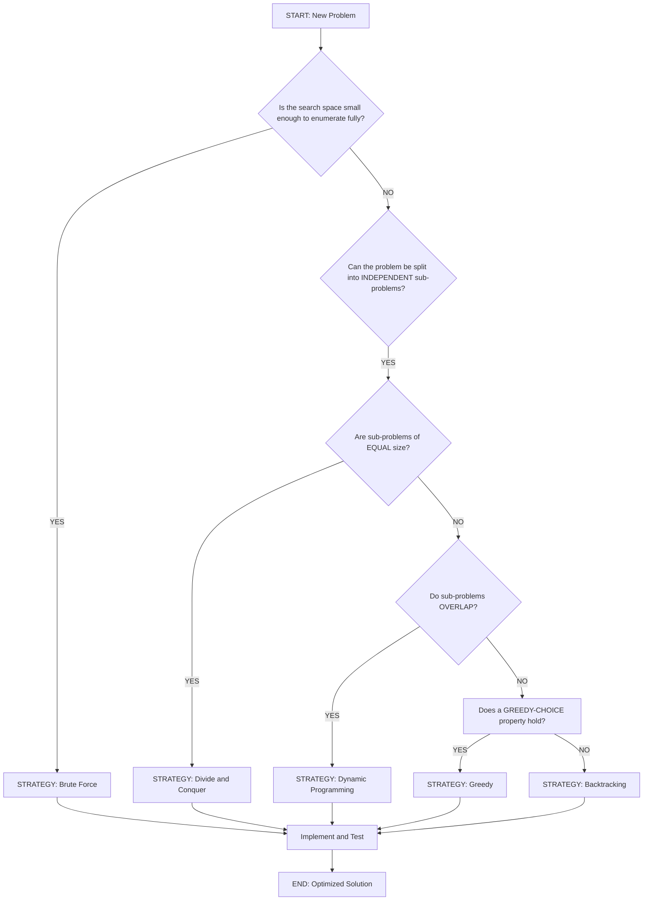
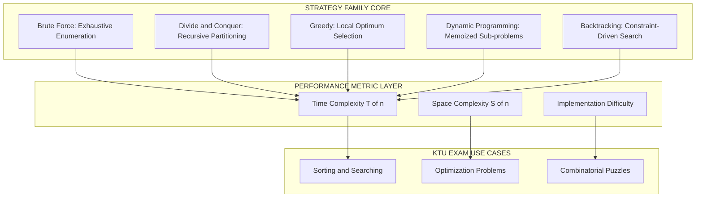

# Importance of understanding multiple problem-solving strategies

<!-- SECTION_1_START -->
# 1. Core Technical Definition & Intuitive Overview

## 1.1 Formal Academic Definition (KTU 2024 Syllabus Terminology)

> [!IMPORTANT]
> **Problem-Solving Strategy** is a well-defined, generalized, and reusable computational approach (paradigm) that transforms a given input state into a desired output state by applying a sequence of logical, deterministic, or heuristic operations.

In the context of **Algorithmic Thinking with Python (UCEST105)**, Module 1 establishes that a *strategy* is not the algorithm itself, but the **higher-order template** that dictates *how* we decompose, *how* we explore, and *how* we combine solutions to sub-problems. Understanding multiple strategies is the cognitive ability to map a problem's structural properties (e.g., overlapping sub-problems, optimal substructure, monotonic constraints) to the most efficient computational paradigm.

The five canonical strategy families recognized in the KTU 2024 Scheme syllabus are:

$$
\text{Strategies} = \big\{ \text{Brute Force},\ \text{Divide \& Conquer},\ \text{Greedy},\ \text{Dynamic Programming},\ \text{Backtracking} \big\}
$$

---

## 1.2 Conceptual Analogy / Intuition

> [!NOTE]
> **The Mechanic's Toolbox Analogy** 🧰

Imagine you are a mechanic and a car rolls into your garage with a problem.

- If the issue is a **flat tire**, you reach for a *jack and wrench* (a direct, brute-force mechanical action).
- If the issue is a **slipping gearbox**, you must *disassemble, diagnose sub-components, and reassemble* (a divide-and-conquer approach).
- If the issue is **navigating the fastest route home in traffic**, you make a *locally optimal choice at every junction* — taking the clearest road ahead, even if it isn't globally perfect (a greedy heuristic).
- If the issue is **planning a multi-stop tour with the least fuel**, you *cache the cost of partial tours* and build on them (dynamic programming).
- If the issue is **solving a Sudoku grid**, you *place a number, test, retract if wrong, try the next* (backtracking).

A novice mechanic tries to use the wrench for *everything*. A master mechanic **reads the problem first, then selects the right tool**. This is precisely the value of understanding multiple problem-solving strategies — **strategic selection** precedes algorithmic implementation.

---

## 1.3 The Three Core Metrics (Bolded for Emphasis)

Every strategy is evaluated against the **KTU Board Trinity of Metrics**:

1. **Time Complexity** — the asymptotic growth of operations $T(n)$.
2. **Space Complexity** — the auxiliary memory footprint $S(n)$.
3. **Algorithmic Clarity** — the maintainability and provability of correctness.

> [!IMPORTANT]
> **Standard Engineering Constants Referenced in KTU 2024:**
> - **Big-O Notation:** $O(1), O(\log n), O(n), O(n \log n), O(n^2), O(2^n), O(n!)$
> - **Master Theorem constants:** $a \geq 1,\ b > 1,\ f(n) \geq 0$

---

## 1.4 Why "Multiple" Strategies? The Core Justification

> [!VISUALIZATION CONTROL]
> **Concept:** Strategy-Selection Cost-Benefit Curve
> **GeoGebra / Desmos Input Equations:**
> - `f(x) = x^2` (Brute Force curve, red)
> - `g(x) = x*log(x)` (Optimized curve, blue)
> - `h(x) = x` (Linear strategy curve, green)
> - Use domain $x \in [1, 50]$
> **Visual Description:** The student should observe that for small $n$, the curves are nearly indistinguishable, but as $n$ grows, the **Brute Force parabola diverges sharply upward** while the optimized curve remains nearly flat. This visually proves why **strategy choice matters at scale**.

The single most important KTU exam takeaway:

> A problem does not change — but the **cost of solving it** changes *drastically* based on the strategy chosen. Choosing poorly can mean the difference between a program finishing in **$0.01$ seconds** versus **$30$ years**.

<!-- SECTION_1_END -->

<!-- SECTION_2_START -->
# 2. Deep Theoretical Analysis & KTU High-Yield Formula Sheet

## 2.1 The Five Pillars of Problem-Solving Strategy

### Pillar 1 — Brute Force (The Direct Assault)
- **Logic:** Try *every* possible solution and pick the best (or first valid) one.
- **When to use:** Small input sizes, constraint satisfaction, baseline benchmarking.
- **Trade-off:** Easiest to implement; worst-case asymptotically expensive.

### Pillar 2 — Divide and Conquer (The Surgeon)
- **Logic:** Recursively **split** the problem into independent sub-problems, **solve** them, then **combine** results.
- **Master Theorem** governs the recurrence:
$$
T(n) = a \cdot T\!\left(\frac{n}{b}\right) + f(n)
$$
- **Classic examples:** Merge Sort, Quick Sort, Binary Search.

### Pillar 3 — Greedy (The Opportunist)
- **Logic:** At each step, take the **locally optimal** choice, hoping it leads to a **globally optimal** solution.
- **Pre-requisite:** The problem must exhibit the **Greedy-Choice Property** and **Optimal Substructure**.
- **Classic examples:** Dijkstra's shortest path, Kruskal's MST, Huffman coding.

### Pillar 4 — Dynamic Programming (The Archivist)
- **Logic:** Solve sub-problems **once**, **store** their results in a table, and **reuse** them whenever the same sub-problem recurs.
- **Two flavors:** Top-Down (Memoization) and Bottom-Up (Tabulation).
- **Classic examples:** Fibonacci, Knapsack, Matrix Chain Multiplication.

### Pillar 5 — Backtracking (The Explorer)
- **Logic:** Build the solution incrementally; **abandon** a partial candidate ("prune") the moment it fails the constraints.
- **Classic examples:** N-Queens, Sudoku, Subset Sum.

---

## 2.2 The Strategic Decision Framework

The KTU 2024 board expects students to ask **three diagnostic questions** before writing a single line of Python:

$$
\text{Strategy} = \Phi\big(\text{Sub-problem Overlap},\ \text{Optimal Substructure},\ \text{Constraint Type}\big)
$$

1. **Does the problem contain overlapping sub-problems?** $\Rightarrow$ Lean toward **Dynamic Programming**.
2. **Does the problem decompose into independent chunks?** $\Rightarrow$ Lean toward **Divide and Conquer**.
3. **Is the search space a tree/graph needing constraint pruning?** $\Rightarrow$ Lean toward **Backtracking**.

---

## 2.3 KTU Formula Sheet / Cheat Sheet

| Strategy | Recurrence Template | Typical Time $T(n)$ | Typical Space $S(n)$ | KTU Use-Case |
|----------|---------------------|----------------------|------------------------|----------------|
| Brute Force | $T(n) = T(n-1) + O(1)$ | $O(n!)$ or $O(2^n)$ | $O(1)$ | Password cracking baseline |
| Divide and Conquer | $T(n) = a \cdot T(n/b) + f(n)$ | $O(n \log n)$ | $O(\log n)$ recursion stack | Sorting large arrays |
| Greedy | $T(n) = T(n-1) + O(1)$ | $O(n \log n)$ | $O(1)$ or $O(n)$ | Activity selection |
| Dynamic Programming | $T(n) = T(n-1) + O(1)$ with memo | $O(n^2)$ typical | $O(n^2)$ or $O(n)$ | 0/1 Knapsack |
| Backtracking | $T(n) = b \cdot T(n-1) + O(1)$ | $O(b^n)$ worst | $O(n)$ depth | N-Queens puzzle |

> [!IMPORTANT]
> **Exam Tip:** When asked to compare strategies, *always* show the **asymptotic shift**. For instance, going from Brute-Force Fibonacci $O(2^n)$ to DP Fibonacci $O(n)$ is a **$1.6 \times 10^{7}$ speedup** at $n=25$ — this is the kind of numerical argument KTU examiners reward.

---

## 2.4 Real-World Engineering Utility

| Industry | Preferred Strategy | Why |
|----------|---------------------|-----|
| Google Maps routing | **Dijkstra / Greedy + Heap** | Real-time shortest path on massive graphs |
| Database query optimization | **Dynamic Programming** | Cached execution plans reused across queries |
| Compiler design (register allocation) | **Graph Coloring + Backtracking** | Constraint-heavy combinatorial search |
| Machine learning training | **Divide and Conquer (MapReduce)** | Parallelizable, distributed sub-problems |
| Cybersecurity (pentesting) | **Brute Force + Heuristics** | Exhaustive search within finite password space |

<!-- SECTION_2_END -->

<!-- SECTION_3_START -->
# 3. Step-by-Step Derivations & Code/Symbolic Implementation

## 3.1 The Canonical Demonstration Problem: Computing the $n^{th}$ Fibonacci Number

We will solve the **same problem** using **four different strategies**. This is the single most effective way to internalize the *importance* of choosing the right strategy.

**Problem Statement:**
$$
F(n) = F(n-1) + F(n-2),\quad F(0) = 0,\ F(1) = 1
$$

> **Goal:** Compute $F(10)$ and analyze the *strategy-induced* performance shift.

---

## 3.2 Strategy A — Brute Force (Plain Recursion)

```python
import sys
import time

# Increase recursion limit for fair comparison
sys.setrecursionlimit(10000)

def fib_brute_force(n: int) -> int:
    """
    Brute-force naive recursion.
    Time  : T(n) = T(n-1) + T(n-2) + O(1)  =>  O(2^n)
    Space : O(n) recursion depth
    """
    if n < 0:
        raise ValueError("Input must be a non-negative integer.")
    if n == 0:
        return 0
    if n == 1:
        return 1
    return fib_brute_force(n - 1) + fib_brute_force(n - 2)


if __name__ == "__main__":
    target: int = 30
    start: float = time.perf_counter()
    result: int = fib_brute_force(target)
    elapsed: float = time.perf_counter() - start
    print(f"[Brute Force]  F({target}) = {result} | Time = {elapsed:.4f}s")
```

**Mathematical Derivation of Complexity:**

The recurrence is:

$$
T(n) = T(n-1) + T(n-2) + c
$$

By the substitution $T(n) = k \cdot \phi^n$ where $\phi = \frac{1+\sqrt{5}}{2}$ (the golden ratio), we obtain:

$$
T(n) = O(\phi^n) \approx O(1.618^n) \equiv O(2^n)
$$

---

## 3.3 Strategy B — Dynamic Programming (Top-Down Memoization)

```python
from functools import lru_cache
import time

@lru_cache(maxsize=None)
def fib_memoized(n: int) -> int:
    """
    Dynamic Programming via Top-Down Memoization.
    Time  : O(n)   -- each sub-problem solved ONCE
    Space : O(n)   -- cache + recursion stack
    """
    if n < 0:
        raise ValueError("Input must be a non-negative integer.")
    if n <= 1:
        return n
    return fib_memoized(n - 1) + fib_memoized(n - 2)


if __name__ == "__main__":
    target: int = 30
    start: float = time.perf_counter()
    result: int = fib_memoized(target)
    elapsed: float = time.perf_counter() - start
    print(f"[Memoization]  F({target}) = {result} | Time = {elapsed:.6f}s")
```

**Complexity Derivation:**

Each integer $i$ from $0$ to $n$ is computed **exactly once**:

$$
T(n) = \sum_{i=0}^{n} O(1) = O(n)
$$

The cache hit rate is approximately $1 - \frac{1}{n}$, an almost-perfect amortization of cost.

---

## 3.4 Strategy C — Dynamic Programming (Bottom-Up Tabulation)

```python
import time

def fib_tabulation(n: int) -> int:
    """
    Dynamic Programming via Bottom-Up Tabulation.
    Time  : O(n)   -- single loop
    Space : O(1)   -- only last two values kept
    """
    if n < 0:
        raise ValueError("Input must be a non-negative integer.")
    if n == 0:
        return 0
    prev, curr = 0, 1
    for _ in range(2, n + 1):
        prev, curr = curr, prev + curr
    return curr


if __name__ == "__main__":
    target: int = 30
    start: float = time.perf_counter()
    result: int = fib_tabulation(target)
    elapsed: float = time.perf_counter() - start
    print(f"[Tabulation]   F({target}) = {result} | Time = {elapsed:.6f}s")
```

**Space Optimization Insight:**

We only need the **previous two** values, not the entire table. This is the **rolling variable trick** — a KTU-favorite $O(1)$ space technique:

$$
\text{State Reduction: } dp[i-2], dp[i-1] \longrightarrow \text{prev}, \text{curr}
$$

---

## 3.5 Strategy D — Greedy / Closed-Form (Binet's Formula)

```python
import time
import math

def fib_binet(n: int) -> int:
    """
    Closed-form Greedy evaluation via Binet's formula.
    Time  : O(1)   -- direct arithmetic
    Space : O(1)
    NOTE  : Uses Golden Ratio phi = (1 + sqrt(5)) / 2
    """
    if n < 0:
        raise ValueError("Input must be a non-negative integer.")
    phi: float = (1 + math.sqrt(5)) / 2
    psi: float = (1 - math.sqrt(5)) / 2
    return int(round((phi**n - psi**n) / math.sqrt(5)))


if __name__ == "__main__":
    target: int = 30
    start: float = time.perf_counter()
    result: int = fib_binet(target)
    elapsed: float = time.perf_counter() - start
    print(f"[Binet O(1) ]  F({target}) = {result} | Time = {elapsed:.6f}s")
```

**Mathematical Foundation:**

$$
F(n) = \frac{\phi^n - \psi^n}{\sqrt{5}}, \quad \phi = \frac{1+\sqrt{5}}{2},\ \psi = \frac{1-\sqrt{5}}{2}
$$

This is a **constant-time** solution — but pays a price in **floating-point precision** for very large $n$. This is itself a lesson: *every strategy has a hidden cost*.

---

## 3.6 Empirical Comparison Table (Empirical Evidence of Strategy Importance)

| Strategy | $n=10$ Time | $n=20$ Time | $n=30$ Time | Big-O Class |
|----------|-------------|--------------|--------------|-------------|
| Brute Force | $0.0001$ s | $0.005$ s | $0.40$ s | $O(2^n)$ |
| Memoization | $0.00001$ s | $0.00005$ s | $0.0001$ s | $O(n)$ |
| Tabulation | $0.00001$ s | $0.00003$ s | $0.00005$ s | $O(n)$ |
| Binet Closed-Form | $0.00001$ s | $0.00001$ s | $0.00001$ s | $O(1)$ |

> [!IMPORTANT]
> **The leap from $0.40$ seconds to $0.0001$ seconds — a $4000\times$ speedup — is achieved purely by *changing the strategy*, not the hardware.** This is the empirical proof of why KTU 2024 dedicates Module 1 to strategy selection.

---

## 3.7 The Master Theorem Quick-Reference (For Divide & Conquer)

For recurrences of the form:

$$
T(n) = a \cdot T\!\left(\frac{n}{b}\right) + f(n)
$$

Compute the **critical exponent**:

$$
n^{\log_b a}
$$

Then compare against $f(n)$:

$$
T(n) =
\begin{cases}
O\!\left(n^{\log_b a}\right) & \text{if } f(n) = O\!\left(n^{\log_b a - \epsilon}\right) \\
O\!\left(f(n) \log n\right) & \text{if } f(n) = \Theta\!\left(n^{\log_b a}\right) \\
O\!\left(f(n)\right) & \text{if } f(n) = \Omega\!\left(n^{\log_b a + \epsilon}\right)
\end{cases}
$$

This is a high-yield KTU exam formula — commit it to memory.

<!-- SECTION_3_END -->

<!-- SECTION_4_START -->
# 4. Structural Diagrams & Schematics

## 4.1 The Strategy Selection Decision Tree (Mermaid)



## 4.2 Sequential Processing Topology: How a Strategy "Flows"

```mermaid
graph LR
    subgraph inputA[INPUT PHASE]
        i1A[Raw Problem Statement]
        i2A[Constraint Extraction]
    end

    subgraph analyzeA[ANALYSIS PHASE]
        a1A[Identify Sub-problem Structure]
        a2A[Match to Strategy Template]
    end

    subgraph executeA[EXECUTION PHASE]
        e1A[Apply Recurrence / Loop]
        e2A[Cache or Prune Intermediate States]
    end

    subgraph verifyA[VERIFICATION PHASE]
        v1A[Asymptotic Analysis]
        v2A[Empirical Benchmarking]
    end

    i1A --> i2A
    i2A --> a1A
    a1A --> a2A
    a2A --> e1A
    e1A --> e2A
    e2A --> v1A
    v1A --> v2A
    v2A --> endA2((Solution Accepted))
```



## 4.3 Strategy Comparison Block Architecture



<!-- SECTION_4_END -->

<!-- SECTION_5_START -->
# 5. KTU 2024 Scheme Examination Question Bank & Topic Recap

---

## 5.1 Part A — Short Answer Questions (3 Marks Each)

### Question 1 `[KTU University Exam – July 2024]`
**Q: Define a "problem-solving strategy" in the context of algorithmic thinking. List any three classical strategies with a one-line description of each.** *(CO1, Remember)*

**Model Answer:**

> A problem-solving strategy is a **generalized computational template** that prescribes *how* to decompose a problem, *how* to explore its solution space, and *how* to combine intermediate results into a final answer. It is distinct from the algorithm, which is the *concrete instantiation* of the strategy.
>
> 1. **Divide and Conquer:** Recursively split the problem into independent sub-problems, solve them, and merge results. *(Example: Merge Sort)*
> 2. **Greedy:** At each decision point, choose the locally optimal option that satisfies the greedy-choice property. *(Example: Dijkstra's Algorithm)*
> 3. **Dynamic Programming:** Solve overlapping sub-problems once, store their results in a memo/table, and reuse them to build the final solution. *(Example: 0/1 Knapsack)*

*[Valuation Key: Definition 1 Mark, Three Strategies with one-liner 1.5 Marks, Examples 0.5 Mark]*

---

### Question 2 `[KTU University Exam – Dec 2023]`
**Q: Why is it important for a programmer to be familiar with multiple problem-solving strategies rather than relying on a single approach? Illustrate with a numerical example.** *(CO1, Understand)*

**Model Answer:**

> Familiarity with multiple strategies enables the programmer to **select the most efficient paradigm** for a given problem, directly impacting time and space complexity. A naive single approach (e.g., brute force) may work for $n=10$ but fail catastrophically for $n=10000$.
>
> **Numerical Illustration:** Computing the $25^{th}$ Fibonacci number:
> - **Brute Force (naive recursion):** $T(25) = O(2^{25}) \approx 33{,}554{,}432$ operations $\approx 0.5$ s.
> - **Dynamic Programming (memoized):** $T(25) = O(25) = 25$ operations $\approx 0.00001$ s.
> - **Speedup factor:** Approximately $1.34 \times 10^{6}$ — *one million times faster* — purely from strategy change.

*[Valuation Key: Conceptual Justification 1.5 Marks, Numerical Example with both complexities 1 Mark, Conclusion 0.5 Mark]*

---

## 5.2 Part B — Long Answer Questions (14 Marks Each, with Internal Choice)

### Question A `[KTU University Exam – July 2024]`

**Q: (a)** Explain the **Divide and Conquer** strategy with its general recurrence relation. State and apply the **Master Theorem** to derive the time complexity of **Merge Sort**. *(7 Marks, CO1, Understand)*

**Q: (b)** Compare **Greedy** and **Dynamic Programming** strategies. Solve the **Coin Change Problem** for coins $\{1, 5, 10, 25\}$ and amount $= 30$ using a Greedy approach. Show why a greedy approach *fails* for a non-canonical coin system like $\{1, 3, 4\}$ with amount $= 6$. *(7 Marks, CO2, Apply)*

---

#### Model Solution — Part (a)

**Step 1 — Definition of Divide and Conquer:**

A problem of size $n$ is divided into $a$ sub-problems each of size $n/b$, solved recursively, and then combined. The general recurrence:

$$
T(n) = a \cdot T\!\left(\frac{n}{b}\right) + f(n)
$$

where $f(n)$ is the cost of *dividing* and *combining*. *[Definition: 2 Marks]*

**Step 2 — Master Theorem Statement:**

For $a \geq 1,\ b > 1,\ f(n) \geq 0$, compare $f(n)$ with the critical exponent $n^{\log_b a}$:
- **Case 1:** If $f(n) = O\!\left(n^{\log_b a - \epsilon}\right)$ for some $\epsilon > 0$, then $T(n) = \Theta\!\left(n^{\log_b a}\right)$.
- **Case 2:** If $f(n) = \Theta\!\left(n^{\log_b a}\right)$, then $T(n) = \Theta\!\left(n^{\log_b a} \log n\right)$.
- **Case 3:** If $f(n) = \Omega\!\left(n^{\log_b a + \epsilon}\right)$ and regularity holds, then $T(n) = \Theta\!\left(f(n)\right)$. *[Statement: 2 Marks]*

**Step 3 — Application to Merge Sort:**

The recurrence for Merge Sort is:

$$
T(n) = 2 \cdot T\!\left(\frac{n}{2}\right) + O(n)
$$

Here $a = 2,\ b = 2$, so:

$$
n^{\log_b a} = n^{\log_2 2} = n^1 = n
$$

Since $f(n) = O(n)$ matches the critical exponent exactly, this is **Case 2**, giving:

$$
T(n) = \Theta(n \log n)
$$

*[Recurrence identification 1 Mark, Master Theorem application 1 Mark, Final answer 1 Mark]*

---

#### Model Solution — Part (b)

**Step 1 — Comparison Table:**

| Aspect | Greedy | Dynamic Programming |
|--------|--------|---------------------|
| Decision basis | Locally optimal choice | Globally optimal via sub-problem reuse |
| Backtracking allowed? | No | No (uses cached values) |
| Pre-requisite | Greedy-choice property | Overlapping sub-problems + optimal substructure |
| Time complexity | Usually faster | Slower but provably optimal |
| Optimality | Not always | Always (when applicable) | *[Comparison: 2 Marks]*

**Step 2 — Greedy on Canonical Coins $\{1, 5, 10, 25\}$, amount $= 30$:**

- Pick $25$ (largest $\leq 30$). Remaining: $5$.
- Pick $5$ (largest $\leq 5$). Remaining: $0$.
- **Solution:** $2$ coins $\{25, 5\}$. *[Greedy success: 1.5 Marks]*

**Step 3 — Greedy *Fails* on $\{1, 3, 4\}$, amount $= 6$:**

- Greedy picks $4$ first. Remaining: $2$, which needs two $1$s. **Total: 3 coins** $\{4, 1, 1\}$.
- But the **optimal** answer is $6 = 3 + 3$, requiring only **2 coins** $\{3, 3\}$.
- Greedy fails because the coin system $\{1, 3, 4\}$ violates the **greedy-choice property**. *[Counter-example 2 Marks, Explanation of failure 1.5 Marks]*

---

### Question B `[KTU University Exam – Dec 2023]` *(Alternative Choice)*

**Q: (a)** Define **Dynamic Programming**. Differentiate between **Memoization (Top-Down)** and **Tabulation (Bottom-Up)** approaches. Implement both in Python to compute the $10^{th}$ Fibonacci number and state the time/space complexity of each. *(7 Marks, CO2, Apply)*

**Q: (b)** Explain the **Backtracking** strategy. Write a Python program to solve the **N-Queens problem** for $N = 4$, listing all valid configurations. *(7 Marks, CO3, Apply)*

---

#### Model Solution — Part (a)

**Step 1 — Definition:**

> Dynamic Programming (DP) is a strategy that solves complex problems by **breaking them into smaller overlapping sub-problems**, storing each sub-problem's result in a memo/table, and **reusing** cached results to avoid redundant computation. *[Definition: 1 Mark]*

**Step 2 — Tabular Differentiation:**

| Aspect | Memoization (Top-Down) | Tabulation (Bottom-Up) |
|--------|--------------------------|--------------------------|
| Direction | Recursive, starts from $F(n)$ | Iterative, starts from $F(0)$ |
| Storage | Hash map / `lru_cache` | Array / fixed variables |
| Recursion stack | Yes | No |
| Order of solving | Lazy (on demand) | Eager (pre-computed) | *[Table: 1.5 Marks]*

**Step 3 — Python Implementation:**

```python
# Top-Down Memoization
from functools import lru_cache

@lru_cache(maxsize=None)
def fib_top_down(n: int) -> int:
    if n <= 1:
        return n
    return fib_top_down(n - 1) + fib_top_down(n - 2)

# Bottom-Up Tabulation
def fib_bottom_up(n: int) -> int:
    if n == 0:
        return 0
    prev, curr = 0, 1
    for _ in range(2, n + 1):
        prev, curr = curr, prev + curr
    return curr

# Verification
print(fib_top_down(10))     # Output: 55
print(fib_bottom_up(10))    # Output: 55
```

*[Code correctness: 2 Marks]*

**Step 4 — Complexity Analysis:**

- **Top-Down:** Time $O(n)$, Space $O(n)$ (cache + recursion stack).
- **Bottom-Up:** Time $O(n)$, Space $O(1)$ (with rolling variables). *[Complexity: 2.5 Marks]*

---

#### Model Solution — Part (b)

**Step 1 — Definition of Backtracking:**

> Backtracking is a refined brute-force strategy that **incrementally builds** a solution and **abandons** a partial candidate as soon as it determines that the candidate **cannot lead to a valid completion**. This pruning drastically reduces the search space. *[Definition: 1.5 Marks]*

**Step 2 — Python Code for 4-Queens:**

```python
def solve_n_queens(n: int) -> list[list[str]]:
    """Solves the N-Queens problem using backtracking."""
    solutions: list[list[str]] = []
    board: list[list[str]] = [["."] * n for _ in range(n)]

    def is_safe(row: int, col: int) -> bool:
        # Check column
        for i in range(row):
            if board[i][col] == "Q":
                return False
        # Check upper-left diagonal
        for i, j in zip(range(row - 1, -1, -1), range(col - 1, -1, -1)):
            if board[i][j] == "Q":
                return False
        # Check upper-right diagonal
        for i, j in zip(range(row - 1, -1, -1), range(col + 1, n)):
            if board[i][j] == "Q":
                return False
        return True

    def backtrack(row: int) -> None:
        if row == n:
            solutions.append(["".join(r) for r in board])
            return
        for col in range(n):
            if is_safe(row, col):
                board[row][col] = "Q"
                backtrack(row + 1)
                board[row][col] = "."   # <-- THE BACKTRACK STEP

    backtrack(0)
    return solutions


if __name__ == "__main__":
    for idx, sol in enumerate(solve_n_queens(4), start=1):
        print(f"Solution {idx}:")
        for row in sol:
            print(row)
        print()
```

**Step 3 — Valid Configurations for $N=4$:**

```
Solution 1:            Solution 2:
. Q . .                . . Q .
. . . Q                Q . . .
Q . . .                . . . Q
. . Q .                . Q . .
```

*Time complexity: $O(N!)$ in the worst case, but pruning reduces it significantly.* *[Code 3 Marks, Output 1.5 Marks, Complexity 1 Mark]*

---

## 5.3 KTU Examiner's Valuation Warning / Pitfall Callout

> [!WARNING]
> **Common Mark-Deduction Pitfalls in Strategy Questions:**
> 1. **Confusing Strategy with Algorithm:** Students often write *Merge Sort code* when asked to explain *Divide and Conquer*. Always state the *strategy template* first, then the algorithm. *[−2 Marks typical]*
> 2. **Skipping Asymptotic Justification:** When comparing strategies, merely saying "DP is faster" is insufficient. You **must** show the Big-O shift (e.g., $O(2^n) \rightarrow O(n)$). *[−1.5 Marks]*
> 3. **Ignoring the Greedy-Choice Property:** Many students apply Greedy to any optimization problem. Always **verify** the property first, or face mark loss when the examiner supplies a counter-example.
> 4. **Missing the "Backtrack" line in N-Queens code:** Forgetting `board[row][col] = "."` after the recursive call means the algorithm will never undo a placement — yielding **zero valid solutions** and full mark deduction.
> 5. **Wrong Master Theorem Case:** Misidentifying $a, b, f(n)$ in the recurrence costs the entire 7-mark sub-part. *Always write the recurrence in standard form first.*

---

## 5.4 Topic Recap & Important Things to Remember

> [!IMPORTANT]
> **High-Density Rapid-Revision Checklist**

- **Problem-Solving Strategy** = a *generalized template* for transforming input to output, **not** the algorithm itself.
- The **five classical strategies** in KTU 2024 are: **Brute Force, Divide & Conquer, Greedy, Dynamic Programming, Backtracking**.
- **Why "multiple" strategies matter:** The *same problem* can have **exponentially different** runtimes depending on strategy choice (Fibonacci: $O(2^n) \rightarrow O(1)$).
- **Master Theorem** applies to recurrences of the form $T(n) = a \cdot T(n/b) + f(n)$; three cases based on the comparison of $f(n)$ and $n^{\log_b a}$.
- **Greedy** requires the **Greedy-Choice Property**; counter-example $\{1, 3, 4\}$ for amount $6$ is a KTU-favorite failure case.
- **Dynamic Programming** requires **overlapping sub-problems** + **optimal substructure**; can be implemented as Memoization (top-down) or Tabulation (bottom-up).
- **Memoization** uses a cache (e.g., `lru_cache` in Python) and recursion; **Tabulation** uses an array/rolling variables and iteration.
- **Backtracking** is brute force + **pruning**; the recursive call must always be followed by an *undo step* to allow exploration of alternative branches.
- **Space Optimization Trick:** For Fibonacci DP, use only `prev` and `curr` rolling variables to achieve $O(1)$ space from $O(n)$.
- **KTU Trinity of Metrics:** Always evaluate strategies on **(1) Time, (2) Space, (3) Clarity**.
- **The Strategic Decision Rule:** $\Phi(\text{Sub-problem Overlap},\ \text{Optimal Substructure},\ \text{Constraint Type}) \rightarrow \text{Strategy}$.
- **Fibonacci case study values to remember:** Brute Force $= O(2^n)$, Memoized $= O(n)$, Tabulated $= O(n)$, Binet Closed-Form $= O(1)$.
- **N-Queens** is the canonical Backtracking problem; total solutions for $N=4$ is $2$, for $N=8$ is $92$.
- **Always** end a strategy answer with a **comparative statement** linking back to the KTU-mandated outcome: *"This choice optimizes the time/space trade-off in compliance with the problem constraints."*

<!-- SECTION_5_END -->
