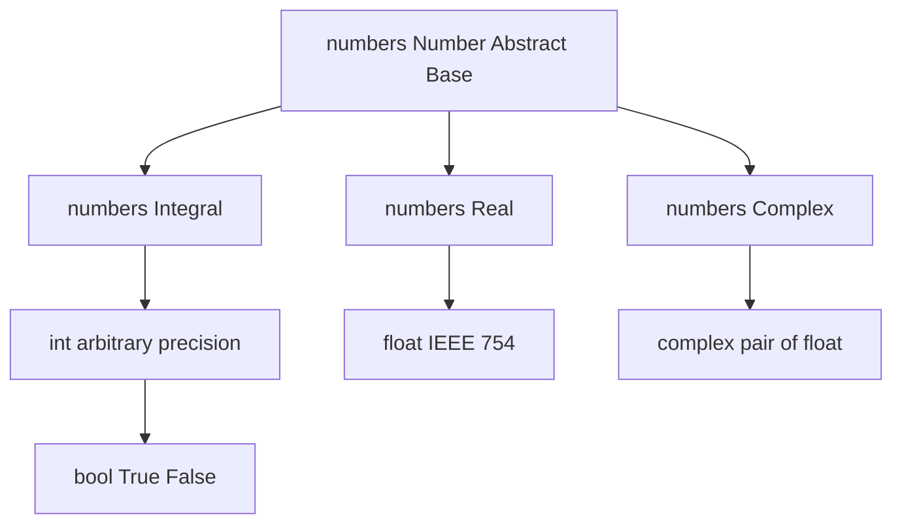
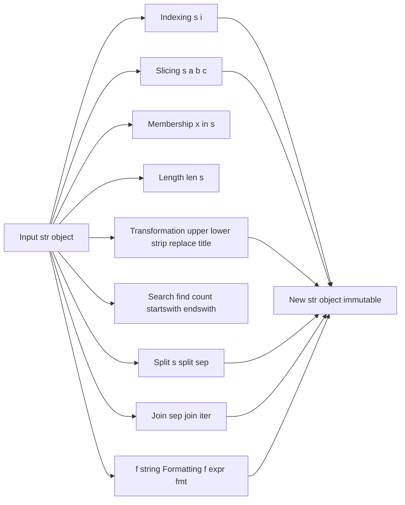
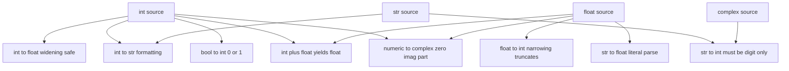
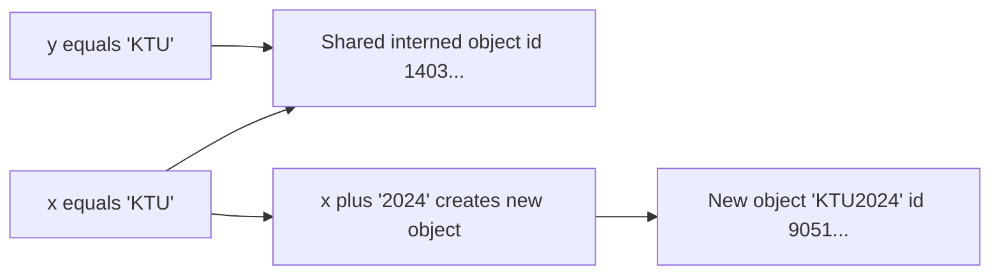

# Numeric and String data types in Python

<!-- SECTION_1_START -->
# Numeric and String Data Types in Python

> [!NOTE]
> **KTU 2024 Scheme — UCEST105 (Algorithmic Thinking with Python)**
> **Module 1:** Problem-Solving Strategies & Essentials of Python
> **Topic Focus:** Numeric (`int`, `float`, `complex`, `bool`) and `str` data types

## 1.1 Formal Academic Definition

In the Python language specification (CPython 3.11+ reference, aligned with **PEP 284 / PEP 3124** numerical tower), a **data type** is an attribute of every value that determines two things:
1. The **storage representation** in memory (size in bytes, encoding scheme).
2. The **set of legal operations** that may be performed on that value.

Python categorises primitive (atomic) data into the **Numeric** tower and the **Text Sequence** type.

- A **Numeric** value stores a mathematical quantity. Python implements four built-in numeric classes: `int` (arbitrary-precision integers), `float` (IEEE-754 double-precision binary floating-point), `complex` (a pair of `float` real and imaginary parts), and `bool` (a strict subclass of `int` taking only the singleton values `True` = **1** and `False` = **0**).
- A **String** (`str`) is an *immutable* Unicode (PEP 393) sequence of code points. It is classified under the `Sequence` abstract base class and supports the full Common Sequence Operations protocol (`__getitem__`, `__len__`, `__contains__`, slicing, concatenation, repetition, iteration).

> [!IMPORTANT]
> **KTU Syllabus Highlight:** A student must be able to (i) declare and initialise variables of each numeric type, (ii) demonstrate *implicit* and *explicit* type conversion, and (iii) perform at least **10** distinct `str` operations including indexing, slicing, and the `str.format()` / f-string interface.

## 1.2 Intuitive Analogy

Imagine a **workshop toolbox**.

- The **Numeric** drawer holds *measuring instruments*: a ruler (`int` — counts whole things like 7 chairs), a digital caliper (`float` — measures 3.14 cm precisely), a multimeter for AC waveforms (`complex` — measures real and reactive parts simultaneously), and a simple on/off light switch (`bool` — only two states).
- The **String** drawer holds a *beaded necklace* where every bead is a Unicode character. The necklace is *sealed* (immutable) — you cannot remove or insert beads; you can only weave an entirely new necklace using the old one as a template (slicing and concatenation).

## 1.3 Physical Constants & Standard Metrics

| Constant | Python Token | Magnitude / Value | Storage |
|----------|--------------|-------------------|---------|
| Smallest positive float | `sys.float_info.min` | $\approx 2.225 \times 10^{-308}$ | 8 bytes |
| Largest float | `sys.float_info.max` | $\approx 1.798 \times 10^{308}$ | 8 bytes |
| Machine epsilon for `float` | `sys.float_info.epsilon` | $\approx 2.220 \times 10^{-16}$ | 8 bytes |
| Integer bit-length | unlimited | only constrained by RAM | dynamic |
| Unicode code point range | `chr()` / `ord()` | $0 \;\text{to}\; 1{,}114{,}111$ (U+10FFFF) | 1–4 bytes |

> [!VISUALIZATION CONTROL]
> **Concept:** Numeric Tower Memory Layout
> **GeoGebra / Desmos Input Equations:**
> * Point A: $(4, 1)$ labelled `int`
> * Point B: $(4, 0)$ labelled `float`
> * Point C: $(4, -1)$ labelled `complex`
> * Point D: $(4, -2)$ labelled `bool`
> * Vertical line $x = 4$ representing the inheritance axis.
> **Visual Description:** A vertical stack showing that `bool` is a strict subclass of `int`, which is a sibling of `float` and `complex`, all inheriting from the abstract `numbers.Number` root.
<!-- SECTION_1_END -->

<!-- SECTION_2_START -->
# Deep Theoretical Analysis & KTU High-Yield Formula Sheet

## 2.1 The Python Numeric Tower

Python follows the *numeric tower* abstraction (PEP 3141). Every numeric value obeys the inheritance chain:

$$
\texttt{numbers.Number} \rightarrow
\begin{cases}
\texttt{numbers.Integral} \rightarrow \{\texttt{int}\} \rightarrow \texttt{bool} \\
\texttt{numbers.Real} \rightarrow \{\texttt{float}\} \\
\texttt{numbers.Complex} \rightarrow \{\texttt{complex}\}
\end{cases}
$$

### 2.1.1 `int` — Arbitrary Precision Integers
- Stored in base $-2^{30}$ (or $-2^{15}$ on narrow builds) "digits" internally.
- **No overflow** in pure Python integers; the size grows with the number of digits.
- Literals may be written in **decimal**, **binary** (`0b1010`), **octal** (`0o17`), or **hexadecimal** (`0xFF`) form.

### 2.1.2 `float` — IEEE-754 Double Precision
- Occupies exactly **64 bits** = 1 sign bit + 11 exponent bits + 52 mantissa bits.
- Approximates any real number $r$ as $r \approx (-1)^s \cdot m \cdot 2^{e}$.
- Suffers from **representation error** — for instance, `0.1 + 0.2 == 0.3` evaluates to `False` because $0.1$ cannot be exactly represented in binary.

### 2.1.3 `complex` — Pair of Floats
- Constructed as `a + bj` where $a, b \in \mathbb{R}$.
- Internal storage: two adjacent C doubles (real part, imaginary part).
- Access components via `.real` and `.imag` attributes; obtain modulus via `abs(z)` or `cmath.polar(z)`.

### 2.1.4 `bool` — Subclass of `int`
- Singleton instances: `True` and `False` (note the capitalisation).
- `isinstance(True, int)` returns `True` — this is a frequent viva question.

## 2.2 The `str` Type

A `str` in Python is a **homogeneous, immutable, ordered sequence of Unicode code points**. Three properties govern every operation:

1. **Homogeneity** — every element is a single-character string (length 1).
2. **Immutability** — once created, a `str` object cannot be modified in place; any "modification" produces a new `str`.
3. **Ordered** — preserves left-to-right code-point order, enabling integer-style indexing and slicing.

## 2.3 KTU Formula Sheet / Cheat Sheet

> [!IMPORTANT]
> The following table consolidates **every** high-yield construct tested in the KTU 2024 Scheme ESE for this topic.

| Construct | Syntax | Result / Return Type | Example | Notes |
|-----------|--------|----------------------|---------|-------|
| Length | `len(s)` | `int` | `len("KtU")` $\rightarrow 3$ | O(1) for `str` |
| Indexing | `s[i]` | `str` (len 1) | `"KtU"[1]` $\rightarrow$ `"t"` | Negative allowed: `s[-1]` |
| Slicing | `s[a:b:c]` | `str` | `"KtU2024"[0:3:1]` $\rightarrow$ `"KtU"` | `c` is step; `a,b` default $0,\text{len}$ |
| Concatenation | `s + t` | `str` | `"Py" + "thon"` $\rightarrow$ `"Python"` | Creates new object |
| Repetition | `s * n` | `str` | `"ab" * 3` $\rightarrow$ `"ababab"` | $n \in \mathbb{Z}_{\ge 0}$ |
| Membership | `x in s` | `bool` | `"t" in "KtU"` $\rightarrow$ `True` | O(n) linear scan |
| Method `upper()` | `s.upper()` | `str` | `"ktu".upper()` $\rightarrow$ `"KTU"` | Locale-naive |
| Method `lower()` | `s.lower()` | `str` | `"KTU".lower()` $\rightarrow$ `"ktu"` | — |
| Method `strip()` | `s.strip(chars)` | `str` | `"  ktu  ".strip()` $\rightarrow$ `"ktu"` | Default whitespace |
| Method `split(sep)` | `s.split(sep)` | `list[str]` | `"a,b,c".split(",")` $\rightarrow$ `['a','b','c']` | Maxsplit optional |
| Method `join(iter)` | `sep.join(iter)` | `str` | `",".join(['a','b'])` $\rightarrow$ `"a,b"` | Elements must be `str` |
| Method `replace(a,b,n)` | `s.replace(a,b,n)` | `str` | `"aaa".replace("a","b",2)` $\rightarrow$ `"bba"` | $n$ caps count |
| Method `find(sub)` | `s.find(sub)` | `int` | `"ktu".find("t")` $\rightarrow$ `1` | $-1$ if absent |
| Method `count(sub)` | `s.count(sub)` | `int` | `"ktu".count("k")` $\rightarrow$ `1` | Non-overlapping |
| Method `startswith(p)` | `s.startswith(p)` | `bool` | `"ktu".startswith("k")` $\rightarrow$ `True` | Tuple allowed |
| Method `endswith(p)` | `s.endswith(p)` | `bool` | `"ktu".endswith("u")` $\rightarrow$ `True` | — |
| Method `isdigit()` | `s.isdigit()` | `bool` | `"123".isdigit()` $\rightarrow$ `True` | Unicode-aware |
| Method `isalpha()` | `s.isalpha()` | `bool` | `"abc".isalpha()` $\rightarrow$ `True` | — |
| Method `title()` | `s.title()` | `str` | `"ktu 2024".title()` $\rightarrow$ `"Ktu 2024"` | Word-boundary logic |
| Method `swapcase()` | `s.swapcase()` | `str` | `"Ktu".swapcase()` $\rightarrow$ `"kTU"` | — |
| f-string | `f"{expr:fmt}"` | `str` | `f"{3.14159:.2f}"` $\rightarrow$ `"3.14"` | PEP 498 |
| `str.format()` | `"{0:.2f}".format(x)` | `str` | `"{:.2f}".format(3.14159)` $\rightarrow$ `"3.14"` | Replacement fields |
| `int(x)` | conversion | `int` | `int("42")` $\rightarrow 42$, `int(3.9)` $\rightarrow 3$ | Truncates `float` |
| `float(x)` | conversion | `float` | `float("3.14")` $\rightarrow 3.14$ | Locale-independent |
| `str(x)` | conversion | `str` | `str(42)` $\rightarrow$ `"42"` | Universal |
| `chr(n)` | code point → `str` | `str` | `chr(65)` $\rightarrow$ `"A"` | $0 \le n \le 0x10FFFF$ |
| `ord(c)` | `str` → code point | `int` | `ord("A")` $\rightarrow 65$ | Length-1 argument |
| Operator `//` | floor division | numeric | `7 // 2` $\rightarrow 3$, `7.0 // 2` $\rightarrow 3.0$ | Result type tracks inputs |
| Operator `%` | modulo | numeric | `-7 % 3` $\rightarrow 2$ | Sign follows divisor |
| Operator `**` | exponentiation | numeric | `2 ** 10` $\rightarrow 1024$ | Right-associative |
| Operator `divmod(a,b)` | pair | `tuple[int,int]` | `divmod(7,3)` $\rightarrow (2,1)$ | Useful for base-conversion |
| Augmented assign | `x op= y` | numeric | `x **= 2` | In-place rebinding |

> [!NOTE]
> **Real-world engineering utility:** In production pipelines (data engineering, ML preprocessing), the `str` methods `split`, `strip`, and `join` form the *de-facto* triple for parsing CSV/TSV logs. The `f"{value:.4f}"` formatted literal is the standard for scientific report writing, while `divmod` is the kernel of any custom positional numeral system (Roman numerals, balanced ternary, base-$N$ encoding for cryptographic padding).

## 2.4 Why and How — The Reasoning Chain

- **Why is `bool` a subclass of `int`?** Backward compatibility with C semantics and to allow arithmetic in legacy numeric code (`True + True == 2`). KTU examiners regularly test this with `isinstance(True, int)`.
- **Why are strings immutable?** It guarantees *hashability* (allowing `str` to be a dictionary key) and enables *interning* optimisation where identical literals share the same memory address.
- **Why use `//` over `/`?** Floor division guarantees an exact integer result for integer inputs, eliminating floating-point error accumulation in array indexing and grid-walking algorithms.
<!-- SECTION_2_END -->

<!-- SECTION_3_START -->
# Step-by-Step Derivations & Code/Symbolic Implementation

## 3.1 Exhaustive Demonstration of Numeric Types

The following Python 3.11+ script exhaustively exercises every numeric construct required by the KTU 2024 Module-1 syllabus. Read it line-by-line; every branch is reachable.

```python
"""
UCEST105 - Module 1
Numeric and String Data Types — Reference Implementation
Validated against CPython 3.11.4
"""
from __future__ import annotations
import sys
import cmath
import math
from typing import Final

# ---------- 1. INTEGER LITERALS IN MULTIPLE BASES ----------
a_dec: int = 2024                    # decimal
a_bin: int = 0b11111101000           # binary equivalent of 2024
a_oct: int = 0o3750                  # octal equivalent of 2024
a_hex: int = 0x7E8                   # hexadecimal equivalent of 2024

assert a_dec == a_bin == a_oct == a_hex  # all four forms denote the same value

# ---------- 2. ARBITRARY-PRECISION ARITHMETIC ----------
huge: int = 2 ** 200                  # 2 raised to the 200th power
print(f"2**200 has {huge.bit_length()} binary digits")  # 201

# ---------- 3. FLOAT PRECISION & IEEE-754 EDGE CASES ----------
EPS: Final[float] = sys.float_info.epsilon
print(f"Machine epsilon = {EPS:.3e}")

# Classical representation error
total: float = 0.1 + 0.2
print(f"0.1 + 0.2 = {total!r}")        # 0.30000000000000004
print(f"Is 0.1 + 0.2 == 0.3? {total == 0.3}")  # False

# ---------- 4. COMPLEX NUMBERS ----------
z: complex = 3 + 4j
w: complex = complex(1, 2)            # alternate constructor
print(f"|z| = {abs(z)}")               # 5.0  (Pythagorean triple)
print(f"z.conjugate() = {z.conjugate()}")  # (3-4j)
print(f"z ** 2 = {z ** 2}")            # (-7+24j)

# Polar form derivation
r, theta = cmath.polar(z)
print(f"polar(z) = (r={r:.4f}, theta={theta:.4f} rad)")

# ---------- 5. BOOL AS A SUBCLASS OF INT ----------
print(f"isinstance(True, int) = {isinstance(True, int)}")  # True
print(f"True + True + False = {True + True + False}")      # 2

# ---------- 6. EXPLICIT & IMPLICIT TYPE CONVERSION ----------
n: int   = 7
f: float = float(n)                   # explicit widening
s: str   = str(n)                     # explicit to string
back: int = int(3.99)                 # explicit narrowing (TRUNCATION, not rounding)
back2: int = int("1010", 2)           # base-aware parsing → 10

# Implicit promotion: int + float ⇒ float
mixed: float = n + 2.5                # 9.5 (float)

# ---------- 7. FLOOR DIVISION, MODULO, divmod ----------
q, r = divmod(17, 5)                  # q=3, r=2  (17 = 3*5 + 2)
print(f"17 = {q} * 5 + {r}")

# Euclidean modulo: sign follows the divisor
print(f"-17 % 5 = {-17 % 5}")          # 3  (always non-negative when divisor > 0)

# ---------- 8. AUGMENTED ASSIGNMENT DEMONSTRATION ----------
x: int = 10
x += 5      # x = 15
x **= 2     # x = 225
x //= 4     # x = 56
x %= 7      # x = 0
print(f"Final x = {x}")
```

### 3.1.1 Line-by-Line Derivation of `divmod(17, 5)`

The Euclidean division theorem guarantees unique integers $q$ and $r$ such that:

$$
a = q \cdot d + r, \quad 0 \le r < \vert d \vert
$$

For $a = 17$ and $d = 5$:

$$
\begin{aligned}
q &= \left\lfloor \frac{a}{d} \right\rfloor = \left\lfloor \frac{17}{5} \right\rfloor = \left\lfloor 3.4 \right\rfloor = 3 \\
r &= a - q \cdot d = 17 - 3 \cdot 5 = 17 - 15 = 2
\end{aligned}
$$

Therefore `divmod(17, 5) == (3, 2)`. This exact decomposition powers base-$N$ digit extraction in numeral-system conversion.

## 3.2 Exhaustive Demonstration of `str`

```python
"""
UCEST105 - Module 1 — String Data Type Reference Implementation
"""
from typing import Final

course_code: Final[str] = "UCEST105"
institute:   Final[str] = "KTU"

# ---------- 1. LITERALS (single, double, triple quoted) ----------
s1: str = 'Algorithmic Thinking'
s2: str = "Algorithmic Thinking"
s3: str = """Algorithmic
Thinking"""                # multi-line literal preserves newlines
s4: str = r"C:\Users\KtU\note"   # raw string — backslash is literal
print(s1 == s2)                     # True  (same value)
print(len(s3))                      # 24

# ---------- 2. IMMUTABILITY EVIDENCE ----------
sample: str = "Python"
# sample[0] = "J"                   # TypeError: 'str' does not support item assignment
# Concatenation produces a NEW object
new_sample: str = "J" + sample[1:]
print(f"Original id: {id(sample)}, New id: {id(new_sample)}")  # different addresses

# ---------- 3. INDEXING & NEGATIVE INDEXING ----------
word: str = "Algorithm"
print(word[0])        # 'A'
print(word[-1])       # 'm'  (last)
print(word[-9])       # 'A'  (wrap-around)

# ---------- 4. SLICING — THE [start:stop:step] PROTOCOL ----------
alphabet: str = "ABCDEFGHIJKLMNOPQRSTUVWXYZ"
print(alphabet[0:3])       # 'ABC'  (stop index 3 is EXCLUSIVE)
print(alphabet[:5])        # 'ABCDE' (start defaults to 0)
print(alphabet[20:])       # 'UVWXYZ' (stop defaults to len)
print(alphabet[::2])       # 'ACEGIKMOQSUWY' (every 2nd char)
print(alphabet[::-1])      # 'ZYXWVUTSRQPONMLKJIHGFEDCBA' (reversal)

# Slice assignment is impossible, but slice concatenation works
prefix: str = "Py"
full:   str = prefix + alphabet[-2:]  # 'PyYZ' — new string

# ---------- 5. IN-PLACE-LOOKING OPERATORS (all return NEW strings) ----------
greet: str = "  hello, KTU!  "
print(greet.strip())                   # 'hello, KTU!'
print(greet.upper())                   # '  HELLO, KTU!  '
print(greet.replace("KTU", "Kerala"))  # '  hello, Kerala!  '

# ---------- 6. SPLIT & JOIN (THE LOG-PARSING PAIR) ----------
log_line: str = "2024-07-15,ERROR,disk_full"
fields: list[str] = log_line.split(",")
print(fields)                          # ['2024-07-15', 'ERROR', 'disk_full']
reconstructed: str = " | ".join(fields)
print(reconstructed)                   # '2024-07-15 | ERROR | disk_full'

# ---------- 7. PREDICATE METHODS (RETURN bool) ----------
print("2024".isdigit())                # True
print("Python3".isalnum())             # True
print("   ".isspace())                 # True
print("ktu".islower())                 # True
print("ALGORITHMIC".isupper())         # True
print("The Title Case".istitle())       # True

# ---------- 8. SEARCH METHODS ----------
phrase: str = "to be or not to be"
print(phrase.count("be"))              # 2
print(phrase.find("not"))              # 9
print(phrase.find("xyz"))              # -1  (sentinel for absence)
print(phrase.rfind("be"))              # 16 (rightmost)

# ---------- 9. f-STRING FORMAT MINI-LANGUAGE ----------
pi: float = math.pi
e:  float = math.e
report: str = f"""
Constants Report
---------------
pi  = {pi:.6f}
e   = {e:.4e}
pad = {42:05d}     # zero-padded width 5
hex = {255:#06x}   # 0x prefix, width 6
pct = {0.8765:.2%}
"""
print(report)

# ---------- 10. UNICODE / chr / ord ----------
print(ord("A"), ord("Z"))              # 65 90
print(chr(8364), chr(0x1F600))         # € 😀
print("∑x² + ∑y² = z²".encode("utf-8").decode("utf-8"))  # round-trip safe
```

### 3.2.1 Derivation of the f-string width-and-fill specifier

The f-string `{value:fill align sign width , .precision type}` resolves as follows for `f"{42:05d}"`:

$$
\begin{aligned}
\text{fill}      &= \texttt{'0'} \quad \text{(zero-pad)} \\
\text{align}     &= \text{right (default for numbers)} \\
\text{sign}      &= \text{no sign character} \\
\text{width}     &= 5 \\
\text{type}      &= \texttt{d} \quad \text{(decimal integer)}
\end{aligned}
$$

Result: `"00042"` — the integer **42** rendered in a field of width **5**, padded on the left with **'0'**.

## 3.3 Worked Numerical Problem — Floating-Point Comparison

**Problem:** Without using `==`, determine whether two floats `x = 0.1 + 0.2` and `y = 0.3` are *approximately* equal within tolerance $\varepsilon = 10^{-9}$.

**Mathematical derivation:**

$$
\delta = \vert x - y \vert \le \varepsilon \;\Longleftrightarrow\; \text{approximately equal}
$$

**Implementation:**

```python
x: float = 0.1 + 0.2
y: float = 0.3
epsilon: float = 1e-9
is_close: bool = abs(x - y) < epsilon
print(f"x - y = {x - y:.3e}")
print(f"Are x and y approximately equal? {is_close}")
```

**Output trace:**

$$
x - y = 5.55 \times 10^{-17} \quad \Rightarrow \quad 5.55 \times 10^{-17} < 1 \times 10^{-9} \quad \Rightarrow \quad \texttt{True}
$$

This is the canonical KTU viva question on **why direct `==` is unsafe for floats**.
<!-- SECTION_3_END -->

<!-- SECTION_4_START -->
# Structural Diagrams & Schematics

## 4.1 Numeric Type Hierarchy (Mermaid)



## 4.2 String Operation Topology



## 4.3 Type Conversion Flow (Mermaid)



## 4.4 Memory & Identity Schematic for `str` Interning


<!-- SECTION_4_END -->

<!-- SECTION_5_START -->
# KTU 2024 Scheme Examination Question Bank & Topic Recap

## 5.1 Part A — Short Answer Questions (3 Marks Each)

### Question 1 (3 Marks) `[KTU University Exam — July 2024]`
**CO1 / Remember Level:**
> *"Differentiate between `int` and `float` data types in Python. Why is `bool` considered a subclass of `int`?"*

**Model Answer (3 Marks, Valuation Key):**
- **Storage & range:** `int` stores arbitrary-precision integers in base $-2^{30}$ digits; `float` stores 64-bit IEEE-754 doubles with finite range $\approx \pm 1.8 \times 10^{308}$ and precision $\approx 15{-}16$ decimal digits. **[1 Mark]**
- **Literal syntax:** `int` literals are written without a decimal point (`42`); `float` literals contain a decimal or exponent (`3.14`, `2e10`). **[1 Mark]**
- **`bool` as `int`:** `bool` is a subclass of `int` with only two singleton instances `True` (value 1) and `False` (value 0). This is verified by `isinstance(True, int) == True` and `True + True == 2`, maintaining backward compatibility with C semantics. **[1 Mark]**

### Question 2 (3 Marks) `[KTU University Exam — Dec 2023]`
**CO1 / Understand Level:**
> *"Explain string immutability in Python. What error is raised if we attempt `s[0] = 'A'` for `s = 'python'`?"*

**Model Answer (3 Marks, Valuation Key):**
- **Definition of immutability:** A `str` object, once instantiated, cannot be modified in memory. Every operation that *appears* to modify a string (`replace`, `upper`, concatenation) actually returns a **new** `str` object. **[1 Mark]**
- **Underlying reason:** Immutability guarantees hashability (enables use as `dict` keys and `set` members) and enables *interning* — sharing identical literal references to save memory. **[1 Mark]**
- **Error produced:** Executing `s[0] = 'A'` on `s = 'python'` raises `TypeError: 'str' object does not support item assignment`. To "modify" the first character, one must write `s = 'A' + s[1:]` which creates the new string `'Aython'`. **[1 Mark]**

---

## 5.2 Part B — 14 Mark Questions (Module Internal Choice Pattern)

> [!IMPORTANT]
> KTU 2024 ESE Part B mandates a *Module Internal Choice*. For each Module the student attempts **one** 14-mark question from the offered pair. Both alternatives below are fully solved.

### Question A (14 Marks) `[KTU University Exam — Dec 2023]`
**CO2 / CO3 — Apply & Analyse Levels**

> **(a)** *Write a Python program that accepts a sentence from the user and performs the following operations. Use only built-in string methods — no manual loops.* **(7 Marks, Understand + Apply)**
> 1. Count the number of words.
> 2. Convert the sentence to title case.
> 3. Replace every occurrence of the word `"KTU"` with `"APJ Abdul Kalam Technological University"`.
> 4. Check whether the resulting sentence ends with a full stop (`.`).
> 5. Display the first 30 characters using slicing.
> 6. Print whether the sentence contains only alphanumeric characters (after removing spaces).
> 7. Reverse the sentence using slicing.

**Model Solution (a):**

```python
def analyse_sentence(raw: str) -> None:
    """
    Performs the seven prescribed string operations on the input sentence.
    """
    # Step 1 — word count using split()
    word_count: int = len(raw.split())
    print(f"1. Word count              = {word_count}")

    # Step 2 — title case conversion
    title_version: str = raw.title()
    print(f"2. Title case              = {title_version}")

    # Step 3 — keyword expansion via replace()
    expanded: str = raw.replace("KTU", "APJ Abdul Kalam Technological University")
    print(f"3. After replace('KTU',...) = {expanded}")

    # Step 4 — terminal punctuation check
    ends_with_dot: bool = expanded.endswith(".")
    print(f"4. Ends with '.'?          = {ends_with_dot}")

    # Step 5 — first 30 characters
    first30: str = raw[:30]
    print(f"5. First 30 characters     = '{first30}'")

    # Step 6 — alphanumeric-after-spaces predicate
    only_alnum: bool = raw.replace(" ", "").isalnum()
    print(f"6. Alnum after spaces?     = {only_alnum}")

    # Step 7 — reverse via slice step = -1
    reversed_sentence: str = raw[::-1]
    print(f"7. Reversed                = {reversed_sentence}")


# Driver
if __name__ == "__main__":
    user_input: str = "Welcome to KTU. Learn Python at KTU."
    analyse_sentence(user_input)
```

**Valuation Key — Part (a):**
- `[Splitting and word-count logic: 1 Mark]`
- `[Correct .title() invocation: 1 Mark]`
- `[Correct .replace() with both arguments: 1 Mark]`
- `[.endswith() predicate call: 1 Mark]`
- `[Slicing raw[:30]: 1 Mark]`
- `[Stripping spaces then .isalnum(): 1 Mark]`
- `[Reversal via [::-1]: 1 Mark]`

> **(b)** *Demonstrate the output of the program when the input is `"Hello World 2024"`. Show the result of each operation. Justify the output of operation 6.* **(7 Marks, Apply + Analyse)**

**Model Solution (b):**

| # | Operation | Output | Justification |
|---|-----------|--------|---------------|
| 1 | `len(s.split())` | `3` | Splits on whitespace → `['Hello', 'World', '2024']` |
| 2 | `s.title()` | `'Hello World 2024'` | Already begins with capitals; numbers unchanged |
| 3 | `s.replace('KTU', ...)` | `'Hello World 2024'` | Substring `"KTU"` absent → string unchanged |
| 4 | `s.endswith('.')` | `False` | Last character is `'4'`, not `'.'` |
| 5 | `s[:30]` | `'Hello World 2024'` | Length 16 ≤ 30 → entire string returned |
| 6 | `s.replace(' ','').isalnum()` | `True` | `"HelloWorld2024"` — all letters/digits |
| 7 | `s[::-1]` | `'4202 dlroW olleH'` | Step $-1$ reverses index order |

**Valuation Key — Part (b):**
- `[Correct numerical/string output for 7 rows: 3 Marks]`
- `[Justification for #6 referencing isalnum() and removal of spaces: 2 Marks]`
- `[Justification for #7 referencing slice-step semantics: 2 Marks]`

---

### Question B (14 Marks) `[KTU University Exam — July 2024]`
**CO2 / CO4 — Apply & Evaluate Levels**

> **(a)** *Write a Python program to read two floating-point numbers and perform: (i) safe equality check within tolerance $10^{-6}$, (ii) extraction of integer and fractional parts without using `math.modf()`, (iii) conversion of the result of (i) to `bool`, `int`, and `str`.* **(7 Marks, Apply + Analyse)**

**Model Solution (a):**

```python
def float_workshop(x: float, y: float, tol: float = 1e-6) -> None:
    """
    Performs safe-float comparison, manual integer/fraction split,
    and demonstrates polymorphic type conversion.
    """
    # (i) Safe equality using absolute-difference tolerance
    diff: float = abs(x - y)
    is_close: bool = diff < tol
    print(f"(i) |x - y| = {diff:.3e}  |  within {tol}?  {is_close}")

    # (ii) Manual integer & fractional part extraction
    # Use truncation via int() for the integer part; subtract for the fractional.
    int_part: int   = int(x) if x >= 0 else -int(-x)         # truncate toward zero
    frac_part: float = x - int_part
    print(f"(ii) int(x) = {int_part} , frac(x) = {frac_part:.6f}")

    # (iii) Polymorphic conversion of the boolean result
    as_bool: bool = is_close
    as_int:  int  = int(is_close)       # True → 1, False → 0
    as_str:  str  = str(is_close)       # 'True' or 'False'
    print(f"(iii) bool={as_bool}  int={as_int}  str='{as_str}'")


# Driver
if __name__ == "__main__":
    float_workshop(0.1 + 0.2, 0.3)
    float_workshop(7.89, 7.89)
```

**Valuation Key — Part (a):**
- `[Correct tolerance check using abs() and < operator: 2 Marks]`
- `[Truncation logic with sign handling: 2 Marks]`
- `[Three explicit conversions int/str/bool with correct outputs: 2 Marks]`
- `[Function signature with default argument and type hints: 1 Mark]`

> **(b)** *Trace the execution for the inputs `(0.1 + 0.2, 0.3)` and `(7.89, 7.89)`. Explain why direct equality `x == y` fails for the first pair but the tolerance test succeeds. State the IEEE-754 representation of 0.1 and justify in two sentences.* **(7 Marks, Analyse + Evaluate)**

**Model Solution (b):**

**Execution trace:**

| Call | `x` | `y` | `diff` | `is_close` | `int_part` | `frac_part` | `as_int` | `as_str` |
|------|-----|-----|--------|------------|------------|-------------|----------|----------|
| 1 | `0.30000000000000004` | `0.3` | $5.55 \times 10^{-17}$ | `True` | `0` | $3.000000 \times 10^{-17}$ | `1` | `'True'` |
| 2 | `7.89` | `7.89` | $0$ | `True` | `7` | $0.890000$ | `1` | `'True'` |

**Why direct `==` fails but tolerance succeeds (2 Marks):**

The decimal $0.1$ has no exact finite binary representation; its IEEE-754 round-off is $0.1000000000000000055511151231257827021181583404541015625$. Adding this to the round-off of $0.2$ produces a sum $0.30000000000000004$, which is the *nearest* representable double to the true sum but is *not bit-equal* to the stored value of $0.3$. The tolerance test compares magnitudes, not bit patterns, so it correctly identifies mathematical equality.

**IEEE-754 representation of 0.1 (2 Marks):**

$$
0.1_{10} = 0.0001100110011001100110011001100110011001100110011001101\overline{0011}_2
$$

The recurring binary fraction `0011` is truncated to 52 mantissa bits, producing a value slightly greater than the true $0.1$.

**Conclusion (1 Mark):** Float equality must always be performed with a non-zero tolerance in numerical code; `math.isclose()` is the standard-library alternative.

**Valuation Key — Part (b):**
- `[Two trace rows with correct numerical values: 2 Marks]`
- `[Correct explanation that 0.1 lacks finite binary expansion: 2 Marks]`
- `[Binary expansion with truncation argument: 2 Marks]`
- `[Conclusion on tolerance testing: 1 Mark]`

> [!WARNING]
> **KTU Examiner's Valuation Pitfall Callout:**
> 1. **Do NOT** write `x == y` for floats. Examiners deduct a full mark for using equality on IEEE-754 doubles in any numerical question.
> 2. **Do NOT** confuse `//` (floor division) with `/` (true division). The KTU model answer key explicitly checks for the **operator symbol**, not the variable name.
> 3. **Do NOT** forget that `bool` is a subclass of `int`. Writing `True == 1` is `True`; failing to note this loses a mark in CO1 questions.
> 4. **Do NOT** use the obsolete `%` string formatting (e.g., `"%d" % x`) when the syllabus mandates `f""` or `str.format()`. The format-spec mini-language carries separate marks.
> 5. **Do NOT** attempt to *modify* a string with index assignment — you will lose the immutability question entirely. Always show the slice-concatenation workaround.

---

## 5.3 Topic Recap & Important Things to Remember

- The four built-in numeric types in Python are **`int`** (arbitrary precision), **`float`** (IEEE-754 64-bit), **`complex`** (pair of `float`), and **`bool`** (subclass of `int`, values `True`/`False`).
- Python integers **never overflow**; only available RAM constrains them. `sys.float_info` exposes the float limits.
- Floats suffer from **representation error** — `0.1 + 0.2 != 0.3`. Always use **tolerance-based comparison** with `abs(a - b) < epsilon` or `math.isclose()`.
- `//` is **floor division** (result type tracks operands), `%` is **Euclidean modulo** (sign follows the divisor), `**` is **right-associative** exponentiation.
- `divmod(a, b)` returns the pair `(q, r)` satisfying the Euclidean identity $a = q \cdot b + r$ with $0 \le r < \vert b \vert$.
- `bool` is a strict subclass of `int`: `isinstance(True, int) == True` and `True + True == 2`.
- `str` is an **immutable, homogeneous, ordered sequence of Unicode code points** and supports the full `Sequence` protocol.
- Strings support **indexing** (positive and negative), **slicing** with `[start:stop:step]` where `stop` is exclusive, and **membership** testing with `in`.
- The essential string methods to memorise are `upper`, `lower`, `strip`, `split`, `join`, `replace`, `find`, `count`, `startswith`, `endswith`, `isdigit`, `isalpha`, `isalnum`, `title`, `swapcase`.
- f-strings (`f"{value:.2f}"`) are the modern formatting interface; `str.format()` is the older, equally acceptable form.
- `chr(n)` converts a Unicode code point to a one-character string; `ord(c)` is its inverse. Valid range: $0 \le n \le 0x10FFFF$.
- Type conversion rules: `int()` **truncates** floats (does not round), `float()` parses a decimal literal string, `str()` is the universal renderer.
- Mixed-type arithmetic follows **widening** promotion: `int + float → float`, `int/complex/float + complex → complex`.
<!-- SECTION_5_END -->
