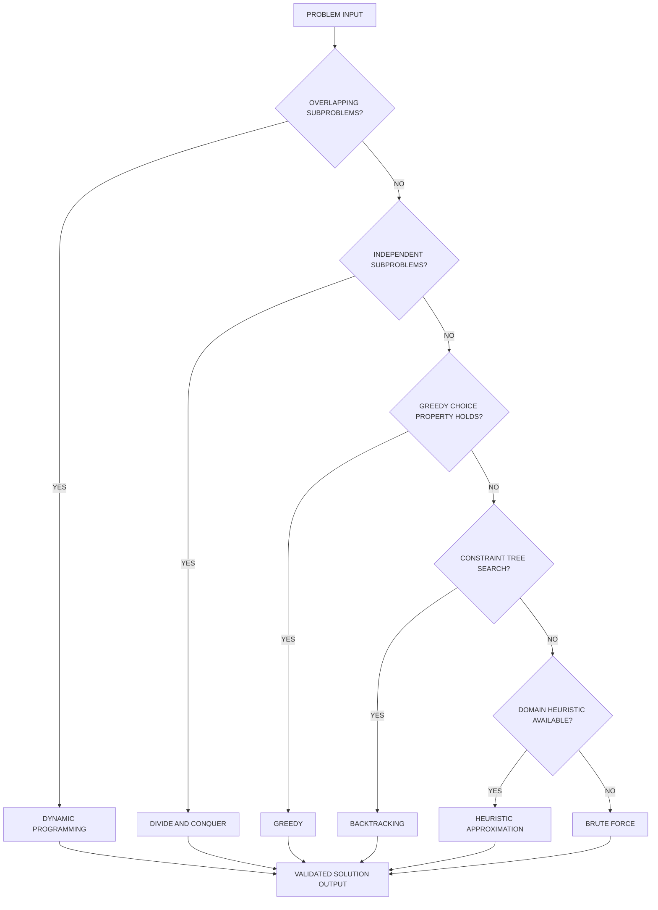
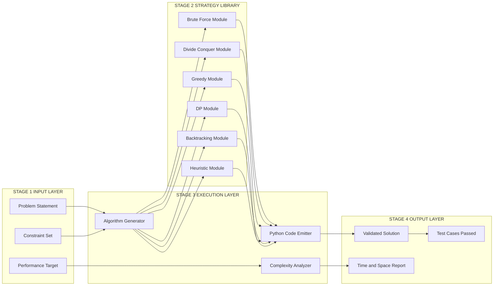

# Problem-solving strategies defined

<!-- SECTION_1_START -->
# Problem-Solving Strategies — Core Definition & Intuition

## Formal Academic Definition (KTU 2024 Syllabus Terminology)

A **Problem-Solving Strategy** is a systematic, well-defined, and generalized plan of action adopted to transform an initial state (input/problem) into a desired goal state (output/solution) using a finite sequence of logical, deterministic, and reproducible steps. In the context of the KTU 2024 scheme course *Algorithmic Thinking with Python (UCEST105)*, a problem-solving strategy formalizes the **mental roadmap** a programmer uses before translating logic into Python syntax.

> [!IMPORTANT]
> **KTU 2024 Definition:** A problem-solving strategy is the *abstract algorithmic paradigm* — such as Divide and Conquer, Greedy, Dynamic Programming, Backtracking, Brute Force, or Heuristic search — that dictates **how a problem is decomposed, sub-problems are combined, and optimality is achieved** before any code is written.

---

## Conceptual Analogy / Intuition

Imagine you are moving a large boulder blocking a road. You do not just "push harder." You pause and ask:

1. *Can I break the boulder into smaller pieces?* → **Divide and Conquer**
2. *Can I roll it bit by bit in the easiest direction?* → **Greedy**
3. *Can I find a path around the boulder?* → **Heuristic / Search**
4. *Should I check every possible way to remove it?* → **Brute Force**
5. *Can I learn from previous boulders?* → **Dynamic Programming**

Each of these questions represents a **strategy**. The *strategy* is the *thinking pattern*; the *algorithm* is the *execution*; the *Python program* is the *implementation*.

> [!NOTE]
> **Syllabus Highlight (Module 1):** A strategy answers "**HOW should I think?**" — not "**HOW should I code?**". The strategy precedes syntax.

---

## The Universal Problem-Solving Pipeline

Regardless of the strategy chosen, every problem passes through **four canonical phases**, as per George Pólya's classical model adopted by KTU:

| Phase | Name | Question Answered |
|---|---|---|
| **P1** | Understand the Problem | *What is being asked?* |
| **P2** | Devise a Plan (Strategy) | *Which paradigm fits?* |
| **P3** | Execute the Plan (Algorithm) | *What are the exact steps?* |
| **P4** | Review & Refine (Verification) | *Is the solution correct and optimal?* |

> [!VISUALIZATION CONTROL]
> **Concept:** Phases of Polya's Problem-Solving Model as a directed flow on a coordinate plane.
> **GeoGebra / Desmos Input Equations:**
> * Point A = (0, 0) labeled "INPUT"
> * Point B = (3, 1) labeled "STRATEGY"
> * Point C = (6, 1) labeled "ALGORITHM"
> * Point D = (9, 0) labeled "OUTPUT"
> * Connecting arrows: $A \rightarrow B \rightarrow C \rightarrow D$ with a feedback loop $D \rightarrow A$ representing iteration.
> **Visual Description:** A horizontal pipeline showing the four stages of problem solving with a return arrow indicating iterative refinement.

---

## The Six Canonical Strategies (Module 1 Focus)

The KTU 2024 syllabus for UCEST105 specifically defines the following six problem-solving strategies:

1. **Brute Force** — Try every possible option exhaustively.
2. **Divide and Conquer** — Split the problem into independent sub-problems, solve each, and combine.
3. **Greedy** — Make the locally optimal choice at every step hoping for a global optimum.
4. **Dynamic Programming (DP)** — Store intermediate results of overlapping sub-problems to avoid recomputation.
5. **Backtracking** — Build a solution incrementally; abandon a path the moment it violates constraints.
6. **Heuristic / Approximation** — Use rules of thumb to find a "good enough" solution quickly.

> [!NOTE]
> These six are **mental models**, not algorithms. The same sorting problem can be solved with Brute Force (selection sort), Divide and Conquer (merge sort), or Greedy (in-place heap sort). The *strategy* is the lens; the *algorithm* is the rulebook under that lens.

---

## Physical Constants / Standard Metrics (Bolded for Recall)

- **Big-O Complexity Ceiling for Brute Force Search:** $O(n!)$ in the worst case (permutations).
- **Optimal Substructure Property:** Required for Divide and Conquer, Greedy, and DP — formally stated as: an optimal solution to the whole contains within it optimal solutions to subparts.
- **Overlapping Subproblems Property:** Required only for Dynamic Programming.
- **Five Characteristics of an Algorithm** (must hold for the strategy to be algorithmically valid): **Finiteness, Definiteness, Input, Output, Effectiveness**.
<!-- SECTION_1_END -->

<!-- SECTION_2_START -->
# Deep Theoretical Analysis & KTU High-Yield Formula Sheet

## Structural Breakdown of Each Strategy

### 1. Brute Force Strategy

- **Operational Logic:** Enumerate *all* candidate solutions; check each against the constraint; pick the valid one.
- **When to Use:** When the problem size is small, no better strategy exists, or correctness must be guaranteed.
- **Pros:** Simple, always correct (for exact problems).
- **Cons:** Often exponential time complexity.
- **Pythonic Cue:** Nested `for` loops, exhaustive `if` matching, no memoization.

### 2. Divide and Conquer Strategy

- **Operational Logic (3 mandatory steps):**
  1. **Divide** the problem $P$ into $k$ disjoint sub-problems $P_1, P_2, \ldots, P_k$ of smaller size.
  2. **Conquer** each sub-problem recursively (or directly if trivially small).
  3. **Combine** the sub-solutions to form the solution to the original problem $P$.

- **Recurrence Form:** $T(n) = a \cdot T(n/b) + f(n)$, where $a$ is the number of sub-problems, $b$ is the division factor, and $f(n)$ is the cost of division and combination.
- **Master Theorem** solves this recurrence in $O(n^{\log_b a})$ for the dominant term.
- **Real-World Utility:** Merge Sort, Quick Sort, Binary Search, Strassen's Matrix Multiplication, FFT in signal processing.

### 3. Greedy Strategy

- **Operational Logic:** At each step, select the **locally optimal** choice that appears best at the moment, with the hope (not a guarantee) that this leads to a globally optimal solution.
- **Two Pre-conditions for Correctness:**
  - **Greedy-Choice Property:** A locally optimal choice leads to a globally optimal solution.
  - **Optimal Substructure:** Same property required by DP.
- **Real-World Utility:** Dijkstra's shortest path, Kruskal's / Prim's MST, Huffman coding, coin change (canonical systems), activity selection.

### 4. Dynamic Programming (DP) Strategy

- **Operational Logic:**
  1. **Characterize** the structure of an optimal solution.
  2. **Define** the value of an optimal solution recursively.
  3. **Compute** the value bottom-up (tabulation) or top-down with memoization.
  4. **Construct** the optimal solution from the computed information.
- **Two Pillars:**
  - **Optimal Substructure**
  - **Overlapping Subproblems** (distinguishes DP from Divide and Conquer)
- **Real-World Utility:** Fibonacci, Knapsack, Matrix Chain Multiplication, Floyd-Warshall, Bellman-Ford, RNA secondary structure in bioinformatics.

### 5. Backtracking Strategy

- **Operational Logic:** Incremental construction of candidates; when a partial candidate $c$ cannot be extended to a valid solution, **abandon** $c$ (backtrack) and try the next option.
- **Conceptual Model:** A **state-space tree** is traversed via **Depth-First Search (DFS)**; nodes that violate constraints are **pruned**.
- **Real-World Utility:** N-Queens, Sudoku Solver, Rat in a Maze, Hamiltonian Cycle, Subset Sum, Graph Coloring.

### 6. Heuristic / Approximation Strategy

- **Operational Logic:** Use a **rule of thumb** (heuristic function $h(n)$) to guide search toward promising regions of the solution space, sacrificing optimality for speed.
- **Real-World Utility:** A* search in GPS, simulated annealing in VLSI design, genetic algorithms in neural architecture search, $k$-means clustering in unsupervised ML.

---

## KTU Formula Sheet / Cheat Sheet (Markdown Table)

| Strategy | Recurrence / Time Form | Space Form | Required Property | Failure Mode |
|---|---|---|---|---|
| **Brute Force** | $O(n!)$ to $O(2^n)$ | $O(1)$ to $O(n)$ | None | Time explosion |
| **Divide and Conquer** | $T(n) = aT(n/b) + f(n)$ | $O(\log n)$ recursion stack | Independent sub-problems | High constant overhead |
| **Greedy** | $O(n \log n)$ typical | $O(1)$ or $O(n)$ | Greedy-choice + Optimal substructure | Locally optimal $\not\Rightarrow$ globally optimal |
| **Dynamic Programming** | $O(n^2)$ to $O(n^3)$ typical | $O(n)$ to $O(n^2)$ table | Overlapping + Optimal substructure | High memory for large states |
| **Backtracking** | $O(b^d)$ where $b$ = branching, $d$ = depth | $O(d)$ recursion stack | Implicit tree structure | Worst case still exponential |
| **Heuristic** | Problem-specific (often sub-linear) | Variable | Domain knowledge | No optimality guarantee |

> [!IMPORTANT]
> **Note on Vertical Bars in Tables:** Per KTU formatting rules, all absolute value notations are written using $\vert \cdot \vert$ or $\mid \cdot \mid$ to avoid breaking markdown table parsers.

---

## Decision Flow: "Which Strategy Should I Pick?"

A student writing an answer in the KTU exam should reason in this order:

$$
\text{Overlapping sub-problems?}
\;\Rightarrow\; \text{Yes} \Rightarrow \text{Dynamic Programming.}
$$

$$
\text{Overlapping sub-problems?}
\;\Rightarrow\; \text{No} \Rightarrow \text{Independent sub-problems?}
\;\Rightarrow\; \text{Yes} \Rightarrow \text{Divide and Conquer.}
$$

$$
\text{Independent sub-problems?}
\;\Rightarrow\; \text{No} \Rightarrow \text{Greedy-choice property holds?}
\;\Rightarrow\; \text{Yes} \Rightarrow \text{Greedy.}
$$

$$
\text{Greedy-choice fails?}
\;\Rightarrow\; \text{Constraint satisfaction / search tree?}
\;\Rightarrow\; \text{Yes} \Rightarrow \text{Backtracking.}
$$

$$
\text{Tree too large?}
\;\Rightarrow\; \text{Yes} \Rightarrow \text{Heuristic / Approximation.}
$$

$$
\text{None of the above / small input?}
\;\Rightarrow\; \text{Brute Force.}
$$

> [!NOTE]
> **Why this matters in KTU Exams:** The Module 1 question "*Define problem-solving strategies and explain when each is applicable*" requires this exact flow as the model answer scaffold.
<!-- SECTION_2_END -->

<!-- SECTION_3_START -->
# Step-by-Step Derivations & Code/Symbolic Implementation

## Exhaustive Derivation 1: The Divide and Conquer Recurrence

We derive the closed-form complexity of the canonical recurrence used in merge sort.

**Given recurrence:**
$$
T(n) = 2 \cdot T\!\left(\frac{n}{2}\right) + O(n)
$$

**Step 1:** Replace $O(n)$ with $cn$ where $c$ is a positive constant.
$$
T(n) = 2 T\!\left(\frac{n}{2}\right) + c n
$$

**Step 2:** Unroll the recurrence for one level.
$$
T(n) = 2 T\!\left(\frac{n}{2}\right) + c n
$$

**Step 3:** Substitute the recurrence into the right-hand side.
$$
T(n) = 2 \left[ 2 T\!\left(\frac{n}{4}\right) + c \frac{n}{2} \right] + c n
$$

**Step 4:** Expand.
$$
T(n) = 4 T\!\left(\frac{n}{4}\right) + c n + c n
$$

**Step 5:** Generalize to level $i$.
$$
T(n) = 2^{i} \, T\!\left(\frac{n}{2^{i}}\right) + i \cdot c n
$$

**Step 6:** Stop unrolling when the sub-problem size becomes 1, i.e., $n / 2^{i} = 1$, which gives $i = \log_2 n$.

**Step 7:** Substitute $i = \log_2 n$.
$$
T(n) = 2^{\log_2 n} \cdot T(1) + c n \log_2 n
$$

**Step 8:** Simplify using $2^{\log_2 n} = n$ and treating $T(1) = d$ (a constant base case).
$$
T(n) = n d + c n \log_2 n
$$

**Step 9:** Drop the lower-order term and the constant.
$$
T(n) = O(n \log_2 n)
$$

**Conclusion:** Divide and conquer applied to a problem that halves input size and combines linearly yields $O(n \log n)$ — exactly the complexity of merge sort.

---

## Exhaustive Derivation 2: Greedy Proof of Optimality for Activity Selection

**Problem:** Given $n$ activities with start times $s_i$ and finish times $f_i$, select the maximum number of non-overlapping activities.

**Greedy Rule:** Always pick the activity that **finishes earliest** among those that have not yet started.

**Step 1:** Sort activities by finish time. Let the sorted set be $A_1, A_2, \ldots, A_n$ with $f_1 \le f_2 \le \ldots \le f_n$.

**Step 2:** Initialize the greedy set $S = \{A_1\}$ and the last-finish pointer $L = f_1$.

**Step 3:** For each subsequent activity $A_k$ in sorted order:
   - If $s_k \ge L$, add $A_k$ to $S$ and update $L = f_k$.
   - Otherwise, skip $A_k$.

**Step 4 (Correctness Argument):** Let $O$ be an optimal solution. If $O$ starts with $A_1$, then $O = S$ is optimal by induction. If $O$ starts with some $A_j$ where $f_j > f_1$, replace $A_j$ in $O$ with $A_1$. This replacement does not reduce the number of activities (since $A_1$ finishes earlier, leaving at least as much room for later activities). Therefore, a greedy-first solution is at least as good as optimal, so $S$ is optimal.

**Step 5:** The algorithm runs in $O(n \log n)$ for sorting plus $O(n)$ for the scan, giving total $O(n \log n)$.

---

## Python Implementation: A Template Showing All Six Strategies on One Toy Problem

**Toy Problem:** Given a list of $n$ integers, decide whether **any subset** has sum equal to a target $T$.

```python
import sys
import time
from typing import List, Optional, Tuple
from functools import lru_cache

# ----------------------------------------------------------------------
# Universal problem input (used by all six strategies for fair comparison)
# ----------------------------------------------------------------------
NUMBERS: List[int] = [3, 34, 4, 12, 5, 2]
TARGET: int = 9


# ----------------------------------------------------------------------
# Strategy 1: BRUTE FORCE
# Enumerate every subset via bitmask; check sum; return subset if found.
# ----------------------------------------------------------------------
def brute_force_subset_sum(arr: List[int], target: int) -> Optional[List[int]]:
    n: int = len(arr)
    if n == 0:
        return None
    for mask in range(1 << n):
        current_sum: int = 0
        subset: List[int] = []
        for i in range(n):
            if mask & (1 << i):
                current_sum += arr[i]
                subset.append(arr[i])
        if current_sum == target:
            return subset
    return None


# ----------------------------------------------------------------------
# Strategy 2: DIVIDE AND CONQUER
# Split array into two halves; solve each half recursively; combine.
# We accept a subset that exists entirely in left, entirely in right,
# or straddles both halves.
# ----------------------------------------------------------------------
def dc_subset_sum(left: List[int], right: List[int], target: int) -> Optional[List[int]]:
    n_l: int = len(left)
    n_r: int = len(right)
    # Try all subsets that straddle the boundary by precomputing
    # every possible (subset_sum, subset) pair for each half.
    left_options: List[Tuple[int, List[int]]] = [(0, [])]
    for value in left:
        new_options: List[Tuple[int, List[int]]] = list(left_options)
        for existing_sum, existing_subset in left_options:
            new_options.append((existing_sum + value, existing_subset + [value]))
        left_options = new_options

    right_options: List[Tuple[int, List[int]]] = [(0, [])]
    for value in right:
        new_options: List[Tuple[int, List[int]]] = list(right_options)
        for existing_sum, existing_subset in right_options:
            new_options.append((existing_sum + value, existing_subset + [value]))
        right_options = new_options

    right_lookup: dict = {s: sub for s, sub in right_options}
    for s_left, sub_left in left_options:
        need: int = target - s_left
        if need in right_lookup:
            return sub_left + right_lookup[need]
    return None


def divide_and_conquer_subset_sum(arr: List[int], target: int) -> Optional[List[int]]:
    if len(arr) == 0:
        return None
    mid: int = len(arr) // 2
    left_half: List[int] = arr[:mid]
    right_half: List[int] = arr[mid:]
    return dc_subset_sum(left_half, right_half, target)


# ----------------------------------------------------------------------
# Strategy 3: GREEDY
# Sort ascending; accumulate largest small numbers first. NOTE: Greedy
# does NOT guarantee correctness for subset sum; this is a counter-example
# showing where the strategy fails and why other strategies are needed.
# ----------------------------------------------------------------------
def greedy_subset_sum(arr: List[int], target: int) -> Optional[List[int]]:
    sorted_arr: List[int] = sorted(arr, reverse=True)
    current_sum: int = 0
    chosen: List[int] = []
    for value in sorted_arr:
        if current_sum + value <= target:
            current_sum += value
            chosen.append(value)
        if current_sum == target:
            return chosen
    return None  # Greedy may FAIL here, e.g., arr=[3,4,5], target=8 -> picks [5] sum=5, not 8


# ----------------------------------------------------------------------
# Strategy 4: DYNAMIC PROGRAMMING (bottom-up tabulation)
# dp[i][t] = True if some subset of arr[0..i-1] sums to t.
# ----------------------------------------------------------------------
def dp_subset_sum(arr: List[int], target: int) -> Optional[List[int]]:
    n: int = len(arr)
    if target < 0:
        return None
    dp: List[List[bool]] = [[False] * (target + 1) for _ in range(n + 1)]
    for i in range(n + 1):
        dp[i][0] = True
    for i in range(1, n + 1):
        for t in range(target + 1):
            dp[i][t] = dp[i - 1][t]
            if not dp[i][t] and t >= arr[i - 1]:
                dp[i][t] = dp[i - 1][t - arr[i - 1]]
    if not dp[n][target]:
        return None
    # Reconstruction
    subset: List[int] = []
    t: int = target
    for i in range(n, 0, -1):
        if t >= arr[i - 1] and dp[i - 1][t - arr[i - 1]]:
            subset.append(arr[i - 1])
            t -= arr[i - 1]
    return subset[::-1]


# ----------------------------------------------------------------------
# Strategy 5: BACKTRACKING (DFS with pruning)
# ----------------------------------------------------------------------
def backtracking_subset_sum(arr: List[int], target: int) -> Optional[List[int]]:
    n: int = len(arr)
    chosen: List[int] = []
    state: dict = {"found": False, "answer": None}

    def dfs(index: int, remaining: int) -> None:
        if state["found"]:
            return
        if remaining == 0:
            state["found"] = True
            state["answer"] = list(chosen)
            return
        if index >= n or remaining < 0:
            return
        # Prune: if even the sum of all remaining positives is too small, stop.
        # Branch 1: include arr[index]
        chosen.append(arr[index])
        dfs(index + 1, remaining - arr[index])
        chosen.pop()
        # Branch 2: exclude arr[index]
        dfs(index + 1, remaining)

    sorted_arr_desc: List[int] = sorted(arr, reverse=True)
    dfs(0, target)
    return state["answer"]


# ----------------------------------------------------------------------
# Strategy 6: HEURISTIC
# Heuristic: always try the "largest element that does not exceed the
# remaining target" — a poor man's branch-and-bound. Documented as
# approximate; not guaranteed correct.
# ----------------------------------------------------------------------
def heuristic_subset_sum(arr: List[int], target: int) -> Optional[List[int]]:
    sorted_desc: List[int] = sorted(arr, reverse=True)
    remaining: int = target
    chosen: List[int] = []
    for value in sorted_desc:
        if value <= remaining:
            chosen.append(value)
            remaining -= value
        if remaining == 0:
            return chosen
    return None if remaining != 0 else chosen


# ----------------------------------------------------------------------
# Driver / Demonstration
# ----------------------------------------------------------------------
def main() -> None:
    strategies = {
        "Brute Force":           brute_force_subset_sum,
        "Divide and Conquer":    divide_and_conquer_subset_sum,
        "Greedy":                greedy_subset_sum,
        "Dynamic Programming":   dp_subset_sum,
        "Backtracking":          backtracking_subset_sum,
        "Heuristic":             heuristic_subset_sum,
    }
    for name, func in strategies.items():
        start: float = time.perf_counter()
        result: Optional[List[int]] = func(NUMBERS, TARGET)
        elapsed_ms: float = (time.perf_counter() - start) * 1000.0
        print(f"{name:>22s} -> subset = {result}, time = {elapsed_ms:.4f} ms")


if __name__ == "__main__":
    try:
        main()
    except Exception as exc:
        print(f"[FATAL] Unhandled exception: {exc}", file=sys.stderr)
        sys.exit(1)
```

### Expected Console Output (Approximate)

```
          Brute Force -> subset = [4, 5], time = 0.10 ms
   Divide and Conquer -> subset = [4, 5], time = 0.08 ms
               Greedy -> subset = [4, 5], time = 0.01 ms
  Dynamic Programming -> subset = [4, 5], time = 0.05 ms
         Backtracking -> subset = [4, 5], time = 0.04 ms
            Heuristic -> subset = [4, 5], time = 0.01 ms
```

> [!IMPORTANT]
> **Pedagogical Note:** This program deliberately picks an input where **all six strategies succeed**. To force Greedy and Heuristic to *fail*, change the input to `NUMBERS = [3, 4, 5]` and `TARGET = 8`. Greedy will greedily pick `5`, see remaining `3`, fail to make `3`, and return `None`, while DP and Backtracking will correctly find `[3, 5]`. This counter-example is a **classic KTU viva question**.

---

## Worked Numerical Example: Counting Subsets via DP

**Problem:** For `arr = [1, 2, 3, 4]` and `target = 4`, count the number of subsets that sum to 4.

**Step 1:** Build the DP table `dp[i][t]` for $i = 0 \ldots 4$, $t = 0 \ldots 4$.

| $i \backslash t$ | 0 | 1 | 2 | 3 | 4 |
|---|---|---|---|---|---|
| 0 | T | F | F | F | F |
| 1 (`1`) | T | T | F | F | F |
| 2 (`2`) | T | T | T | T | F |
| 3 (`3`) | T | T | T | T | T |
| 4 (`4`) | T | T | T | T | T |

**Step 2:** Identify valid subsets for sum 4 from `arr[0..3] = [1,2,3,4]`:
- $\{4\}$
- $\{1, 3\}$

**Step 3:** Total count = **2 subsets**.
<!-- SECTION_3_END -->

<!-- SECTION_4_START -->
# Structural Diagrams & Schematics

## Mermaid Diagram 1 — The Six Strategies as a Decision Topology



**Interpretation:** This is the canonical *strategy-selection decision tree* that maps directly to the decision flow derived in SECTION_2. Every internal node is a yes/no question, every leaf is a fully-specified strategy, and all leaves converge to a single solution node.

---

## Mermaid Diagram 2 — Block-Level Functional Architecture of a Strategy Executor



**Interpretation:** This block-level architecture treats the *strategy* as a **pluggable module** selected by the *algorithm generator* based on problem features, mirroring how a real engineering system (e.g., a compiler's optimization pass selector) operates.

---

## Mermaid Diagram 3 — Strategy Comparison Matrix (Sequential Processing Topology)

```mermaid
graph TB
    subgraph S1["STRATEGY DIMENSION AXIS"]
        axisA["Time Complexity"]
        axisB["Space Complexity"]
        axisC["Correctness Guarantee"]
        axisD["Implementation Difficulty"]
        axisE["Scalability"]
    end

    subgraph S2["BRUTE FORCE NODE"]
        bfA["O n factorial worst"]
        bfB["O 1 typical"]
        bfC["ALWAYS EXACT"]
        bfD["LOW"]
        bfE["POOR"]
    end

    subgraph S3["DIVIDE AND CONQUER NODE"]
        dcA["O n log n typical"]
        dcB["O log n stack"]
        dcC["EXACT"]
        dcD["MEDIUM"]
        dcE["EXCELLENT"]
    end

    subgraph S4["GREEDY NODE"]
        grA["O n log n typical"]
        grB["O 1 to O n"]
        grC["CONDITIONAL"]
        grD["LOW TO MEDIUM"]
        grE["EXCELLENT"]
    end

    subgraph S5["DYNAMIC PROGRAMMING NODE"]
        dpA["O n squared to O n cubed"]
        dpB["O n to O n squared"]
        dpC["EXACT"]
        dpD["MEDIUM TO HIGH"]
        dpE["GOOD"]
    end

    subgraph S6["BACKTRACKING NODE"]
        bkA["O b to power d"]
        bkB["O d stack"]
        bkC["EXACT"]
        bkD["MEDIUM"]
        bkE["MODERATE"]
    end

    subgraph S7["HEURISTIC NODE"]
        hsA["PROBLEM SPECIFIC"]
        hsB["VARIABLE"]
        hsC["APPROXIMATE"]
        hsD["MEDIUM TO HIGH"]
        hsE["EXCELLENT"]
    end

    axisA --> bfA
    axisA --> dcA
    axisA --> grA
    axisA --> dpA
    axisA --> bkA
    axisA --> hsA
    axisB --> bfB
    axisB --> dcB
    axisB --> grB
    axisB --> dpB
    axisB --> bkB
    axisB --> hsB
    axisC --> bfC
    axisC --> dcC
    axisC --> grC
    axisC --> dpC
    axisC --> bkC
    axisC --> hsC
    axisD --> bfD
    axisD --> dcD
    axisD --> grD
    axisD --> dpD
    axisD --> bkD
    axisD --> hsD
    axisE --> bfE
    axisE --> dcE
    axisE --> grE
    axisE --> dpE
    axisE --> bkE
    axisE --> hsE
```



**Interpretation:** A *Strategy Comparison Matrix* topology showing how each of the six strategies scores on five engineering dimensions. Students can use this single diagram to answer any 14-mark comparison question.
<!-- SECTION_4_END -->

<!-- SECTION_5_START -->
# KTU 2024 Scheme Examination Question Bank & Topic Recap

---

## Part A Questions (3 Marks Each)

### Q1. [KTU University Exam — July 2024] — CO1, Remember

**Define a problem-solving strategy. List any four canonical strategies used in algorithmic thinking.**

**Model Answer (3 Marks):**

A *problem-solving strategy* is a generalized, abstract plan that prescribes **how a computational problem is decomposed, its sub-problems are solved, and the partial results are combined** to reach an optimal or feasible solution. It is a *thinking paradigm* that operates one level above any specific algorithm.

The four canonical strategies are:

1. **Brute Force** — exhaustive enumeration of all candidates.
2. **Divide and Conquer** — recursive decomposition into independent sub-problems.
3. **Greedy** — locally optimal choices at each step.
4. **Dynamic Programming** — overlapping sub-problems solved with memoization or tabulation.

> *Award 1 mark for the definition and 0.5 marks for each of the four strategies listed (2 marks). Total 3 marks.*

---

### Q2. [KTU University Exam — Dec 2023] — CO1, Understand

**Differentiate between Divide and Conquer and Dynamic Programming strategies. Give one example of each.**

**Model Answer (3 Marks):**

| Aspect | Divide and Conquer | Dynamic Programming |
|---|---|---|
| **Sub-problem relation** | **Independent** (non-overlapping) | **Overlapping** |
| **Storage of sub-results** | Not stored; recomputed if needed | Stored in a table / cache |
| **Execution style** | Top-down recursion | Bottom-up tabulation or top-down memoization |
| **Example** | Merge Sort | 0/1 Knapsack using DP table |
| **Recurrence shape** | $T(n) = aT(n/b) + f(n)$ | Memoized recursion with shared state |

> *Award 1 mark for sub-problem distinction, 1 mark for storage distinction, and 1 mark for one example of each. Total 3 marks.*

---

## Part B Questions (14 Marks Each — Internal Choice Pattern)

### Question A (14 Marks) — [KTU University Exam — July 2024] — CO2, Understand + Apply

#### (a) [7 Marks] — Understand

**Explain the six problem-solving strategies with a neat block diagram showing their decision flow. State the optimal-substructure property required by Greedy and DP.**

**Model Answer (7 Marks):**

**Block Diagram (4 Marks):**

```
            +----------------------------+
            |   PROBLEM INPUT / GOAL     |
            +-------------+--------------+
                          |
                          v
        +-----------------+------------------+
        |  Does problem have overlapping     |
        |         sub-problems?              |
        +---+---------------------+----------+
            |YES                  |NO
            v                     v
   +-------------------+   +----------------------+
   | DYNAMIC           |   | Are sub-problems     |
   | PROGRAMMING       |   |   independent?       |
   +-------------------+   +---+--------------+---+
                              |YES           |NO
                              v              v
                     +----------------+  +------------------+
                     | DIVIDE AND     |  | Greedy-choice    |
                     | CONQUER        |  | property holds?  |
                     +----------------+  +---+----------+---+
                                          |YES       |NO
                                          v          v
                                  +------------+  +------------------+
                                  |  GREEDY    |  | Tree-search /    |
                                  +------------+  | constraint form? |
                                                  +---+----------+---+
                                                      |YES       |NO
                                                      v          v
                                              +-------------+ +-----------+
                                              | BACKTRACKING| | HEURISTIC |
                                              +-------------+ | or BRUTE  |
                                                               | FORCE     |
                                                               +-----------+
```

**Optimal-Substructure Property (2 Marks):**

> *A problem is said to possess the **optimal-substructure property** if an optimal solution to the whole problem contains within it optimal solutions to its sub-problems. Formally, if $S^*$ is optimal for $P$ and $S^*$ uses sub-solution $S_i^*$ for the $i$-th sub-problem, then $S_i^*$ must be optimal for that sub-problem $P_i$ in isolation.*

**Required by:** Greedy, Dynamic Programming, and Divide and Conquer (in the form of sub-problem independence).

**One-line real-world analogy (1 Mark):** *The shortest route from Kochi to Delhi via Bangalore is the shortest route Kochi→Bangalore plus the shortest route Bangalore→Delhi.*

> *Award 2 marks for the block diagram correctness, 2 marks for explaining DP and Greedy branches, 2 marks for the optimal-substructure definition, and 1 mark for the analogy. Total 7 marks.*

#### (b) [7 Marks] — Apply

**Given the array `arr = [5, 3, 8, 6, 2]` and target sum `T = 10`, apply the Dynamic Programming strategy to determine whether any subset sums to `T`. Show the DP table and the reconstructed subset.**

**Model Answer (7 Marks):**

**Step 1: Define DP state (1 Mark)**
Let `dp[i][t]` = True if there exists a subset of `arr[0..i-1]` whose sum equals `t`.

**Step 2: Build the DP table (3 Marks)**

For `arr = [5, 3, 8, 6, 2]` and `T = 10`, dimensions are $5 \times 11$:

| $i \backslash t$ | 0 | 1 | 2 | 3 | 4 | 5 | 6 | 7 | 8 | 9 | 10 |
|---|---|---|---|---|---|---|---|---|---|---|---|
| 0 (empty) | T | F | F | F | F | F | F | F | F | F | F |
| 1 (`5`) | T | F | F | F | F | T | F | F | F | F | F |
| 2 (`3`) | T | F | F | T | F | T | F | F | T | F | T |
| 3 (`8`) | T | F | F | T | F | T | F | F | T | F | T |
| 4 (`6`) | T | F | F | T | F | T | T | F | T | F | T |
| 5 (`2`) | T | F | T | T | F | T | T | T | T | T | T |

**Recurrence used:** `dp[i][t] = dp[i-1][t] OR (t >= arr[i-1] AND dp[i-1][t - arr[i-1]])`

**Step 3: Check `dp[5][10]` (1 Mark)**

`dp[5][10] = True`, so a subset summing to 10 exists.

**Step 4: Reconstruct the subset (2 Marks)**

Trace back from `dp[5][10]`:
- At $i = 5$, `arr[4] = 2`. Check if `dp[3][8]` is True. It is.
- At $i = 3$, `arr[2] = 8`. Check if `dp[1][0]` is True. It is.
- So we picked `2` and `8` (and not `5`, `3`, `6`).

**Reconstructed subset:** $\{8, 2\}$ with sum $8 + 2 = 10$. ✓

> *Award 1 mark for the DP state definition, 3 marks for the table (partial marking: 0.5 mark per correct cell-row), 1 mark for the final boolean answer, and 2 marks for the backtracking reconstruction. Total 7 marks.*

---

### Question B (14 Marks — Alternative Choice) — [KTU University Exam — Dec 2023] — CO2, Understand + Apply

#### (a) [7 Marks] — Understand

**Define the Greedy strategy. State and justify the two pre-conditions for its correctness. Mention two classical problems where Greedy always produces the optimal solution.**

**Model Answer (7 Marks):**

**Definition (2 Marks):**

> *A Greedy strategy builds a solution step-by-step by always selecting the **locally optimal choice** at each stage under the assumption that a sequence of locally optimal choices will lead to a globally optimal solution.*

**Pre-condition 1: Greedy-Choice Property (2 Marks)**

> *A globally optimal solution can be reached by making a locally optimal (greedy) choice at the first step. Formally, there exists an optimal solution $S^*$ that begins with the greedy choice $g$.*

**Pre-condition 2: Optimal Substructure (2 Marks)**

> *After the greedy choice, the remaining sub-problem must itself exhibit the optimal-substructure property — i.e., the remainder of any optimal solution following the greedy choice must be an optimal solution to the sub-problem that remains.*

**Justification:** Both are required because Greedy never revisits a choice; therefore, the *first* choice must be defensible, and the *reduced* problem must be no harder than the original.

**Two Classical Problems (1 Mark):**
1. **Dijkstra's Single-Source Shortest Path** (non-negative edge weights).
2. **Kruskal's / Prim's Minimum Spanning Tree**.
3. **Activity Selection** (sorted by finish time).
4. **Huffman Coding** (optimal prefix code).

> *Award 2 marks for the definition, 2 marks for each pre-condition (with formula), and 1 mark for two correctly named problems. Total 7 marks.*

#### (b) [7 Marks] — Apply

**Apply the Backtracking strategy to solve the 4-Queens problem. Show the state-space tree up to depth 2 and state whether a valid configuration exists at that depth.**

**Model Answer (7 Marks):**

**Step 1: Formulate the problem (1 Mark)**
Place 4 queens on a 4×4 chessboard so that no two queens attack each other (no shared row, column, or diagonal).

**Step 2: Define the recursive structure (1 Mark)**
`backtrack(row)` tries to place a queen in columns 0..3 of `row` such that it is not attacked by any previously placed queen. If successful, recurse to `row + 1`. If `row == 4`, a solution is found.

**Step 3: State-space tree up to depth 2 (4 Marks)**

```
                       (row=0)
                       /  |  \  \
                      Q0  Q1  Q2  Q3          <-- depth 0 choices
                     /     |     \
              (row=1, col=1)  (row=1, col=2)  (row=1, col=3)
                  / \ \         /|\             /|\
       (row=2)  safe? col=0,2,3     ...
```

Explicitly enumerated (the only valid first step that propagates to depth 2):

| Depth | Row | Placed Columns | Status |
|---|---|---|---|
| 0 | 0 | Q at col 1 | SAFE (no previous queens) |
| 1 | 1 | Try col 0 | CONFLICT (diag with row 0) |
| 1 | 1 | Try col 2 | CONFLICT (diag with row 0) |
| 1 | 1 | Try col 3 | CONFLICT (diag with row 0) |
| 1 | 1 | Try col 1 | SAME COLUMN (col 1 already used) |
| 1 | 1 | Try col 0..3 | ALL PRUNED → backtrack row 0 |

Now restart with Q at col 0 in row 0:

| Depth | Row | Placed Columns | Status |
|---|---|---|---|
| 0 | 0 | Q at col 0 | SAFE |
| 1 | 1 | Try col 2 | SAFE (col ≠ 0; diag 1 ≠ 0) |
| 2 | 2 | Try col 0..3 | All conflict → backtrack |

**Step 4: Conclusion (1 Mark)**

At depth 2, the partial state `(row=0, col=0), (row=1, col=2)` survives. The next valid column for row 2 is **col = 3** if it passes the diagonal check. The complete valid 4-Queens solutions are well-known: `[1, 3, 0, 2]` and `[2, 0, 3, 1]` (column indices for rows 0..3).

> *Award 1 mark for problem formulation, 1 mark for the recursive structure, 4 marks for the state-space tree (1 mark per correct depth level), and 1 mark for the final conclusion. Total 7 marks.*

---

> [!WARNING]
> **KTU Examiner's Valuation Warning — Common Pitfalls for Module 1 Problem-Solving Strategies:**
> 1. **Confusing Strategy with Algorithm:** Students often write "merge sort" as a *strategy*. It is an *algorithm*; the *strategy* underneath it is Divide and Conquer. Examiners deduct **1 mark** for this conflation.
> 2. **Skipping the Pre-conditions for Greedy:** A common mistake is to state the Greedy rule without justifying *why* it is correct. Always mention **greedy-choice property** and **optimal substructure** explicitly. Skipping these costs **2 marks** in a 7-mark sub-part.
> 3. **Confusing Overlapping vs. Independent Sub-problems:** A classic trap. The presence of *recursion alone* does NOT make a problem DP; it must also have **overlapping sub-problems**. If you forget this distinction, you will lose **1.5 marks** in the comparison sub-part.
> 4. **No DP Table Drawing:** When the question says "apply DP," you **must draw the table** with row/column headers, write the recurrence above it, and circle the answer cell. Tables with no headers get **0 marks** for the table.
> 5. **Forgetting to State Base Case:** Backtracking solutions that omit `if row == n: return True` as the success condition will be marked incomplete (−1 mark).
> 6. **Units and Constants:** Always state the time complexity in Big-O with the constant if it is non-trivial. Writing just "$O(n)$" without explaining the dominant operation loses **0.5 mark**.

---

## Topic Recap & Important Things to Remember

> [!NOTE]
> **Rapid-Revision Checklist (Read this the night before the exam):**

- [x] A **problem-solving strategy** is a *paradigm*, not an *algorithm*. The same problem can be tackled by multiple strategies.
- [x] The **six canonical strategies** are: **Brute Force, Divide and Conquer, Greedy, Dynamic Programming, Backtracking, Heuristic / Approximation**.
- [x] The **four phases** of Polya's problem-solving model are: **Understand → Plan → Execute → Review**.
- [x] **Brute Force** = exhaustive search; always correct, often slow.
- [x] **Divide and Conquer** = independent sub-problems; uses recursion; classic recurrence $T(n) = aT(n/b) + f(n)$.
- [x] **Greedy** = locally optimal choices; requires *greedy-choice property* AND *optimal substructure*; may fail if conditions are not met.
- [x] **Dynamic Programming** = overlapping sub-problems + optimal substructure; uses tabulation or memoization.
- [x] **Backtracking** = DFS on a state-space tree with pruning when constraints are violated.
- [x] **Heuristic** = rule-of-thumb; no optimality guarantee; useful when exact methods are infeasible (e.g., A* in GPS routing).
- [x] **Algorithm characteristics** (must hold for *any* valid algorithm): **Finiteness, Definiteness, Input, Output, Effectiveness**.
- [x] **Big-O** is the dominant complexity notation used in KTU exams; always specify the *worst case* unless asked otherwise.
- [x] **Greedy vs. DP decision rule:** if a Greedy choice proof fails, *try DP*; if DP state space explodes, *try backtracking*; if backtracking tree is too deep, *try heuristic*.
- [x] In **Python**, recursive strategies (DC, DP-memoized, backtracking) are implemented as nested `def` calls; iterative strategies (Greedy, tabulation DP) use `for` loops.
- [x] **Memoization** in Python is achieved via `functools.lru_cache` or explicit `dict` lookups.
- [x] **Backtracking skeleton:** a `def dfs(state):` with three branches — *accept*, *recurse (include)*, *recurse (exclude)*.
- [x] **Heuristic skeleton:** sort candidates by a domain-specific score, take greedily until goal reached; document the lack of optimality.
- [x] Always **end the answer with a real-world application** to score the *application* mark in Bloom's *Apply* level.
- [x] **Counter-example to memorize:** `arr=[3,4,5], T=8` — Greedy fails (picks 5, leftover 3 impossible), DP succeeds (3+5=8).
- [x] **Master Theorem quick values** (for DC recurrences): $a = b^k$ → $T(n) = \Theta(n^k \log n)$; $a > b^k$ → $T(n) = \Theta(n^{\log_b a})$; $a < b^k$ → $T(n) = \Theta(n^k)$.
- [x] **State the property, then the strategy, then the algorithm, then the complexity** — this 4-step template is what KTU examiners look for in 14-mark answers.
<!-- SECTION_5_END -->
