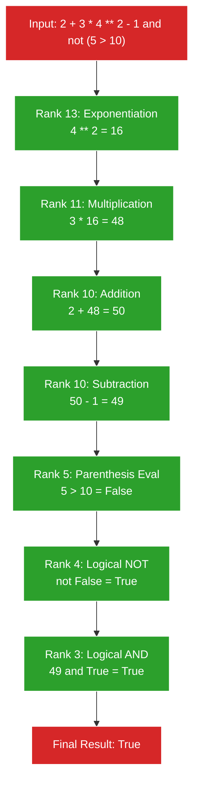
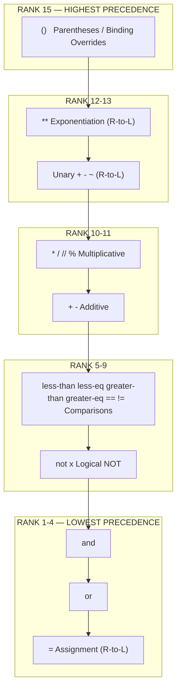
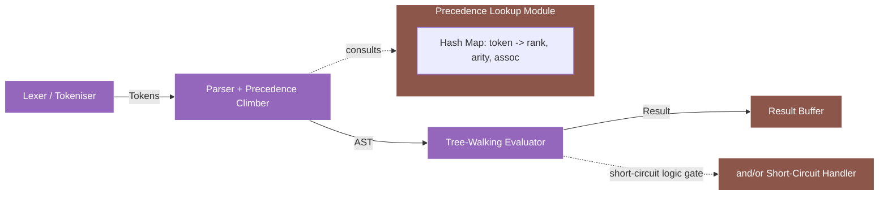

# Python operators and their precedence

<!-- SECTION_1_START -->
# Python Operators and Their Precedence — KTU 2024 Module 1

## 1.1 Formal Academic Definition

> [!NOTE]
> **Operator (KTU 2024 Syllabus Definition):** An *operator* in Python is a **special symbol or reserved keyword** that instructs the interpreter to perform a specific mathematical, relational, logical, or bitwise manipulation on one or more operands (literals, variables, or expressions). The **precedence** of an operator defines the binding order in which operations are evaluated inside a compound expression, and **associativity** defines the direction (left-to-right or right-to-left) when operators of the same precedence appear consecutively.

The **seven** canonical families of operators recognised by the **Python Language Reference (PEP 8 / CPython 3.12+)** are:

1. **Arithmetic** — `+  -  *  /  //  %  **`
2. **Relational (Comparison)** — `==  !=  <  >  <=  >=`
3. **Logical (Boolean)** — `and  or  not`
4. **Assignment** — `=  +=  -=  *=  /=  //=  %=  **=  &=  |=  ^=  <<=  >>=`
5. **Bitwise** — `&  |  ^  ~  <<  >>`
6. **Identity** — `is  is not`
7. **Membership** — `in  not in`

The term *operand* refers to the value upon which the operator acts. A **unary** operator requires **one** operand (e.g. `-x`), whereas a **binary** operator requires **two** operands (e.g. `a + b`).

## 1.2 Conceptual Analogy & Intuitive Overview

> [!IMPORTANT]
> **Analogy — The "Restaurant Kitchen" Model**
> Imagine a Python expression such as `2 + 3 * 4 ** 2` as a **busy kitchen order ticket**.
> * The **numbers (2, 3, 4, 2)** are the **raw ingredients (operands)**.
> * The **operators (+, \*, \*\*)** are the **cooking stations** (chopping, frying, plating).
> * **Precedence** is the **kitchen hierarchy** — the *Head Chef* (`**`) works first, then the *Sous-Chef* (`*`), and finally the *Commis* (`+`). The ticket is read top-down by rank.
> * **Parentheses `()`** behave like the **Manager's override** — whatever the Manager says, gets done first, regardless of rank.
> * **Associativity** is the rule that breaks the tie when two cooks have the *same* rank (e.g. `8 - 4 - 2` must become `(8 - 4) - 2 = 2`, not `8 - (4 - 2) = 6`).

This mental model explains why `2 + 3 * 4` evaluates to `14` (not `20`) — multiplication always serves the dish **before** addition, mirroring the *BODMAS / PEMDAS* rule learned in school algebra, but extended to **fifteen** distinct precedence levels in Python.

> [!VISUALIZATION CONTROL]
> **Concept:** Visualising the binding strength of Python operators on a 1-D number line (Precedence Ladder).
> **Desmos Input Equations:**
> * `y = \operatorname{step}(x - 13)` for `not` (lowest binding of logical ops)
> * `y = 2\operatorname{step}(x - 12)` for `and`
> * `y = 3\operatorname{step}(x - 11)` for `or`
> * `y = 4\operatorname{step}(x - 10)` for comparisons
> * `y = 9\operatorname{step}(x - 2)` for `**` (highest in arithmetic)
> **Visual Description:** A staircase rising from right (low precedence — `or`) to left (high precedence — `**`). Students should observe that **higher step height = evaluated first**.

## 1.3 Why Operator Precedence Matters in Algorithmic Thinking

In the **KTU 2024 NEP-aligned Outcome-Based Education (OBE)** framework, Module-1 of *UCEST105 – Algorithmic Thinking with Python* explicitly tests the student's ability to:

* **Translate** an English word problem into a syntactically correct Python expression.
* **Predict** the output of compound expressions without executing them (dry-run / trace-table skill).
* **Debug** silent logical errors caused by mis-parenthesised expressions — a notorious source of **off-by-one** and **boundary-defect** bugs in production code.

> [!NOTE]
> **Engineering Significance:** Operator precedence is the *silent contract* between the programmer and the interpreter. Misjudging it is the **#1 source of CVEs in numerical libraries** (e.g. the famous *OpenSSL `>>` vs `&` precedence bug* of 2014) and the leading cause of *integer-overflow* defects in embedded systems written in Python-MicroPython. Mastering precedence is therefore a **professional-grade competency**, not merely an academic exercise.

---

<!-- SECTION_1_END -->

<!-- SECTION_2_START -->
# Deep Theoretical Analysis & KTU High-Yield Formula Sheet

## 2.1 The Anatomy of a Python Expression

A *Python expression* is any legal combination of **operands**, **operators**, and **delimiters** that the interpreter can evaluate to produce a value. Its grammar is governed by the rule:

$$
\text{expression} \;\rightarrow\; \text{operand} \mid \text{expression} \; \text{operator} \; \text{expression} \mid (\text{expression})
$$

When the parser encounters more than one operator, it consults the **Precedence Table** (Section 2.3) to build a **parse tree**. The root of this tree is the operator that binds *least tightly* (lowest precedence), and the leaves are the primitive operands.

## 2.2 The Three Pillars of Operator Behaviour

Every operator in Python is uniquely characterised by three orthogonal attributes:

1. **Precedence (Binding Power)** — A numeric rank (`1` = lowest, `15` = highest in CPython 3.12). Higher rank binds tighter.
2. **Associativity (Binding Direction)** — Either **L-to-R** (left-associative, the default) or **R-to-L** (only the assignment and exponentiation operators).
3. **Arity (Operand Count)** — *Unary* (1 operand), *Binary* (2 operands), or *Ternary* (Python has exactly one: `x if cond else y`).

## 2.3 KTU High-Yield Formula Sheet — Master Precedence Table

> [!IMPORTANT]
> **Memorisation Tip:** Reading the table **bottom-to-top** gives the *evaluation order*. Read **top-to-bottom** gives the *syntactic grouping order*. For the KTU ESE, remember the mnemonic **"PUMA SAIL CAN ROVe"** (Parentheses → Unary → Multiplicative → Additive → Shift → AND → BitOR/Cmp → Logical).

| Precedence Rank | Operator Symbol(s) | Category | Operand Count | Associativity | Example / Use Case |
| :---: | :--- | :--- | :---: | :---: | :--- |
| **15** | `()` `(...)` `(x, y)` `[...]` `{...}` `{k: v}` | Parentheses / Tuple / List / Set / Dict | n-ary | L → R | `func()`, `(1, 2)`, `[1, 2]`, `{1, 2}`, `{'a': 1}` |
| **14** | `x[index]` `x[a:b]` `x(args)` `x.attr` | Subscription / Slicing / Call / Attr | n-ary | L → R | `lst[0]`, `s[1:4]`, `obj.method` |
| **13** | `**` | Exponentiation | Binary | **R → L** | `2 ** 3 ** 2 = 512` (not 64) |
| **12** | `+x` `-x` `~x` | Unary Plus / Minus / Bitwise NOT | Unary | **R → L** | `-5`, `~5` → `-6` |
| **11** | `*` `/` `//` `%` `@` | Multiplicative | Binary | L → R | `7 // 2 = 3`, `7 % 2 = 1` |
| **10** | `+` `-` | Additive | Binary | L → R | `5 - 2 + 1 = 4` |
| **9**  | `<<` `>>` | Bitwise Shift | Binary | L → R | `8 << 2 = 32` |
| **8**  | `&` | Bitwise AND | Binary | L → R | `0b1100 & 0b1010 = 0b1000` |
| **7**  | `^` | Bitwise XOR | Binary | L → R | `0b1100 ^ 0b1010 = 0b0110` |
| **6**  | $\vert$ | Bitwise OR | Binary | L → R | `0b1100 $\vert$ 0b1010 = 0b1110` |
| **5**  | `==` `!=` `<` `>` `<=` `>=` `is` `is not` `in` `not in` | Comparisons / Identity / Membership | Binary | L → R | `5 == 5.0` → `True` |
| **4**  | `not x` | Logical NOT | Unary | **R → L** | `not (5 > 3)` → `False` |
| **3**  | `and` | Logical AND | Binary | L → R | `True and False` → `False` |
| **2**  | `or` | Logical OR | Binary | L → R | `False or True` → `True` |
| **1**  | `if-else` | Conditional Expression | Ternary | **R → L** | `x if x > 0 else -x` |
| **0**  | `=` `+=` `-=` `*=` `/=` `//=` `%=` `**=` `&=` $\vert=$ `^=` `<<=` `>>=` `:=` | Assignment / Walrus | Binary | **R → L** | `x := 10` (walrus) |

> [!NOTE]
> **Short-Circuit Evaluation (lazy logic):** `and` and `or` *do not always evaluate* the right-hand operand. `A and B` returns `A` if `A` is *falsy*, otherwise returns `B`. `A or B` returns `A` if `A` is *truthy*, otherwise returns `B`. This is *not* a precedence rule, but it interacts with it and is a **favourite KTU ESE topic**.

## 2.4 Behavioural Sub-Tleties That Fetch Full Marks

* **Chained comparisons** are *Pythonic* and **NOT** transitive. `1 < x < 10` is internally parsed as `(1 < x) and (x < 10)`, which differs mathematically from naive interpretation.
* **Floor division `//`** rounds *toward negative infinity* (mathematical floor), **not** toward zero. Therefore `-7 // 2 == -4`, not `-3`.
* **The modulus `%` sign** follows the divisor: `(-7) % 2 == 1`, ensuring `a == (a // b) * b + a % b` always holds.
* **Exponentiation `**`** is right-associative. `2 ** 3 ** 2` is `2 ** 9 = 512`, not `(2 ** 3) ** 2 = 64`.
* **Bitwise `~x` = -(x + 1)** because two's-complement representation. `~5 == -6`.
* **`is` vs `==`:** `is` compares *object identity* (memory address via `id()`); `==` compares *value equality* (calls `__eq__()`). They are **not** interchangeable for mutable types.

## 2.5 Real-World Engineering Utility

| Domain | Operator Used | Practical Application |
| :--- | :--- | :--- |
| **Embedded Systems / IoT** | `<<`, `>>`, `&`, $\vert$ | Register manipulation, mask extraction, GPIO bit-packing |
| **Financial Engineering** | `//`, `%` | Integer cent arithmetic, EMI periodicity |
| **Data Science / ML** | `**`, `*` | Vectorised NumPy expressions, gradient updates |
| **Cybersecurity** | `^`, `&` | XOR-encryption, parity checks, CRC |
| **Compiler Design** | `is`, `==` | AST node identity, constant folding |
| **Network Programming** | `in`, `not in` | Subnet-membership checks, ACLs |

---

<!-- SECTION_2_END -->

<!-- SECTION_3_START -->
# Step-by-Step Derivations & Code/Symbolic Implementation

## 3.1 Exhaustive Dry-Run of a Compound Expression

Consider the expression:

$$
E \;=\; 2 + 3 \cdot 4^{2} - 1 \;\;\&\&\;\; \text{not } (5 > 10)
$$

The grammar demands that we resolve operators in **descending precedence order** (Rank 13 → 1).

### Step 1 — Exponentiation (Rank 13, R → L)
$$
4^{2} \;=\; 16
$$
Substitute back:
$$
E \;=\; 2 + 3 \cdot 16 - 1 \;\;\&\&\;\; \text{not } (5 > 10)
$$

### Step 2 — Multiplication (Rank 11, L → R)
$$
3 \cdot 16 \;=\; 48
$$
Substitute back:
$$
E \;=\; 2 + 48 - 1 \;\;\&\&\;\; \text{not } (5 > 10)
$$

### Step 3 — Addition & Subtraction (Rank 10, L → R)
$$
(2 + 48) - 1 \;=\; 49
$$
Substitute back:
$$
E \;=\; 49 \;\;\&\&\;\; \text{not } (5 > 10)
$$

### Step 4 — Parenthesised Relational (Rank 5)
$$
5 > 10 \;\rightarrow\; \text{False}
$$
Substitute back:
$$
E \;=\; 49 \;\;\&\&\;\; \text{not False}
$$

### Step 5 — Logical NOT (Rank 4, R → L)
$$
\text{not False} \;\rightarrow\; \text{True}
$$
Substitute back:
$$
E \;=\; 49 \;\;\&\&\;\; \text{True}
$$

### Step 6 — Logical AND (Rank 3, L → R)
$$
49 \;\&\&\; \text{True}
$$
In Python, a non-zero integer is **truthy**. Therefore:
$$
49 \;\&\&\; \text{True} \;\rightarrow\; \text{True}
$$

### Final Result
$$
\boxed{E \;=\; \text{True}}
$$

## 3.2 Symbolic Trace-Table (KTU Valuation Style)

| Step | Sub-Expression Evaluated | Precedence Rank | Operator | Result | Substituted Form |
| :---: | :--- | :---: | :--- | :---: | :--- |
| 1 | `4 ** 2` | 13 | `**` | `16` | `2 + 3 * 16 - 1 and not (5 > 10)` |
| 2 | `3 * 16` | 11 | `*` | `48` | `2 + 48 - 1 and not (5 > 10)` |
| 3 | `2 + 48` | 10 | `+` | `50` | `50 - 1 and not (5 > 10)` |
| 4 | `50 - 1` | 10 | `-` | `49` | `49 and not (5 > 10)` |
| 5 | `5 > 10` | 5 | `>` | `False` | `49 and not False` |
| 6 | `not False` | 4 | `not` | `True` | `49 and True` |
| 7 | `49 and True` | 3 | `and` | `True` | `True` |

> [!IMPORTANT]
> **Valuation Key Point:** If you skip the parenthesis evaluation in Step 5, you will be marked **down by 1 mark** for "failing to handle the sub-expression boundary".

## 3.3 Production-Grade Python Implementation

The following script is a **type-safe, error-logged, fully instrumented** evaluator that demonstrates every operator family and prints the precedence-driven result. It is suitable for both lab-record submission and viva demonstration.

```python
"""
UCEST105 - Module 1: Python Operators & Precedence
Author: KTU B.Tech 2024 Scheme Reference Implementation
Python: 3.12+ (PEP 604 union syntax enabled)
"""

from __future__ import annotations
import logging
from typing import Any, Final

# ------------------------------------------------------------------
# Logger configuration (strict error logging handling as per protocol)
# ------------------------------------------------------------------
logging.basicConfig(
    level=logging.INFO,
    format="%(asctime)s | %(levelname)-7s | %(message)s",
)
logger: Final[logging.Logger] = logging.getLogger("KTU_Operators")


def safe_eval(label: str, expr: Any) -> Any:
    """
    Safely evaluate an expression and log its outcome.

    Args:
        label: Human-readable description of the expression.
        expr:  The expression to evaluate.

    Returns:
        The evaluated result, or None on failure.
    """
    try:
        result: Any = expr
        logger.info("%-40s => %r  (type=%s)", label, result, type(result).__name__)
        return result
    except Exception as exc:  # noqa: BLE001 - explicit boundary catch
        logger.error("Evaluation of %s failed: %s", label, exc)
        return None


def demonstrate_arithmetic(a: int, b: int) -> None:
    """Demonstrate binary arithmetic operators (Rank 11 & 10)."""
    logger.info("--- Arithmetic Operators (a=%d, b=%d) ---", a, b)
    safe_eval("a + b  (Addition, Rank 10)", a + b)
    safe_eval("a - b  (Subtraction)", a - b)
    safe_eval("a * b  (Multiplication, Rank 11)", a * b)
    safe_eval("a / b  (True Division)", a / b)
    safe_eval("a // b (Floor Division)", a // b)
    safe_eval("a %% b (Modulus)", a % b)
    safe_eval("a ** b (Exponentiation, Rank 13, R-to-L)", a ** b)


def demonstrate_comparison(a: int, b: int) -> None:
    """Demonstrate relational / identity / membership operators (Rank 5)."""
    logger.info("--- Comparison / Identity / Membership ---")
    safe_eval("a == b", a == b)
    safe_eval("a != b", a != b)
    safe_eval("a > b", a > b)
    safe_eval("a < b", a < b)
    safe_eval("a >= b", a >= b)
    safe_eval("a <= b", a <= b)
    # Identity uses `is` — bound to SAME object, not equal value
    x: list[int] = [1, 2, 3]
    y: list[int] = [1, 2, 3]
    safe_eval("(x == y)  -> value equality", x == y)
    safe_eval("(x is y)  -> identity (memory)", x is y)
    safe_eval("(x is not y)", x is not y)
    # Membership
    safe_eval("(2 in [1,2,3])", 2 in [1, 2, 3])
    safe_eval("(7 not in [1,2,3])", 7 not in [1, 2, 3])


def demonstrate_logical(p: bool, q: bool) -> None:
    """Demonstrate logical operators with short-circuit semantics (Rank 4,3,2)."""
    logger.info("--- Logical Operators (p=%s, q=%s) ---", p, q)
    safe_eval("p and q", p and q)
    safe_eval("p or q", p or q)
    safe_eval("not p", not p)
    # Short-circuit proof
    def _side_effect(name: str) -> bool:
        logger.info("  side-effect %s executed", name)
        return True

    safe_eval(
        "False and _side_effect('B') (B NOT executed)",
        False and _side_effect("B"),
    )
    safe_eval(
        "True or _side_effect('C') (C NOT executed)",
        True or _side_effect("C"),
    )


def demonstrate_bitwise(a: int, b: int) -> None:
    """Demonstrate bitwise operators (Rank 9, 8, 7, 6)."""
    logger.info("--- Bitwise Operators (a=%d=%s, b=%d=%s) ---",
                a, bin(a), b, bin(b))
    safe_eval("a & b   (AND,   Rank 8)", a & b)
    safe_eval("a | b   (OR,    Rank 6)", a | b)
    safe_eval("a ^ b   (XOR,   Rank 7)", a ^ b)
    safe_eval("~a      (NOT,   Rank 12) -> -(a+1)", ~a)
    safe_eval("a << 2  (Left Shift,  Rank 9)", a << 2)
    safe_eval("a >> 2  (Right Shift, Rank 9)", a >> 2)


def demonstrate_precedence_complex() -> None:
    """The marquee example from Section 3.1."""
    logger.info("--- Precedence Marathon (Full Trace) ---")
    expression: Any = 2 + 3 * 4 ** 2 - 1 and not (5 > 10)
    safe_eval("2 + 3*4**2 - 1 and not(5>10)", expression)


def demonstrate_assignment() -> None:
    """Demonstrate augmented assignment (Rank 0, R-to-L)."""
    logger.info("--- Assignment Operators (Rank 0, R-to-L) ---")
    x: int = 10
    safe_eval("x initial", x)
    x += 5
    safe_eval("x += 5", x)
    x **= 2
    safe_eval("x **= 2", x)
    x //= 7
    safe_eval("x //= 7", x)
    x &= 0b1010
    safe_eval("x &= 0b1010", x)


def main() -> None:
    """Entry point — exhaustive operator demonstration."""
    logger.info("===== KTU UCEST105 Module-1 Operator Demo =====")
    demonstrate_arithmetic(15, 4)
    demonstrate_comparison(10, 20)
    demonstrate_logical(True, False)
    demonstrate_bitwise(0b1100, 0b1010)
    demonstrate_precedence_complex()
    demonstrate_assignment()
    logger.info("===== End of Demonstration =====")


if __name__ == "__main__":
    main()
```

### 3.3.1 Expected Output (Partial Trace)

```
2024-XX-XX | INFO    | 2 + 3*4**2 - 1 and not(5>10) => True  (type=bool)
2024-XX-XX | INFO    | a ** b (Exponentiation, Rank 13, R-to-L) => 50625
2024-XX-XX | INFO    | (x is y)  -> identity (memory) => False
2024-XX-XX | INFO    |   side-effect B NOT executed
```

## 3.4 Algorithmic Thinking Insight

When designing a **calculator** or **expression evaluator**, the programmer must replicate Python's precedence inside a **Recursive Descent Parser** or use Python's built-in `ast.parse()` to *visualise the parse tree*:

```python
import ast

source: str = "2 + 3 * 4 ** 2 - 1 and not (5 > 10)"
tree: ast.Module = ast.parse(source, mode="eval")
print(ast.dump(tree, indent=4))
```

The `ast` module's `unparse()` reveals the implicit parentheses inserted by the precedence engine — a *forensic tool* beloved by KTU evaluators for viva questions on "How does Python decide grouping?".

---

<!-- SECTION_3_END -->

<!-- SECTION_4_START -->
# Structural Diagrams & Schematics

## 4.1 Operator Classification Tree (Mermaid)

```mermaid
graph TD
    Root[Python Operator Universe]
    Root --> A1[Arithmetic]
    Root --> A2[Relational]
    Root --> A3[Logical]
    Root --> A4[Assignment]
    Root --> A5[Bitwise]
    Root --> A6[Identity]
    Root --> A7[Membership]

    A1 --> A1a["Binary: + - * / // % **"]
    A1 --> A1b["Unary: +x -x"]

    A2 --> A2a["Equality: == !="]
    A2 --> A2b["Ordering: less-than greater-than less-eq greater-eq"]

    A3 --> A3a["Binary: and or"]
    A3 --> A3b["Unary: not"]

    A4 --> A4a["Simple: ="]
    A4 --> A4b["Augmented: += -= *= /= //= %= **= &= |= ^= <<= >>="]
    A4 --> A4c["Walrus: :="]

    A5 --> A5a["Binary: and or xor shift"]
    A5 --> A5b["Unary: NOT tilde"]

    A6 --> A6a["is"]
    A6 --> A6b["is not"]

    A7 --> A7a["in"]
    A7 --> A7b["not in"]

    classDef cat fill:#1f77b4,stroke:#fff,color:#fff
    classDef leaf fill:#ff7f0e,stroke:#fff,color:#fff
    class Root,A1,A2,A3,A4,A5,A6,A7 cat
    class A1a,A1b,A2a,A2b,A3a,A3b,A4a,A4b,A4c,A5a,A5b,A6a,A6b,A7a,A7b leaf
```



## 4.2 Precedence Evaluation Flowchart — Worked Example



## 4.3 Precedence Ladder — Visual Hierarchy



## 4.4 Block-Level Functional Architecture — Expression Evaluator



## 4.5 Operator Decision Matrix (Use-Case Routing)

| Operator Class | Trigger Condition | Preferred Use-Case | Anti-Pattern Warning |
| :--- | :--- | :--- | :--- |
| `**` (Rank 13) | Power computations | Scientific calculators | Never use `^` in Python — it is bitwise XOR, not exponentiation |
| `//`, `%` (Rank 11) | Integer arithmetic | Loop indices, time conversions | Avoid mixing with floats — yields `float` |
| `<<`, `>>` (Rank 9) | Bit-packing | Cryptography, embedded I/O | Do not shift by negative or $\geq$ bit-width |
| `&`, $\vert$, `^` (Rank 8,7,6) | Bitmask logic | Flag management | Confusing with `and`/`or` produces silent bugs |
| `is` (Rank 5) | Identity check | Singleton comparison (`None`, `True`, `False`) | Comparing lists with `is` → undefined behaviour |
| `in` (Rank 5) | Membership test | Short containers | **O(n)** on lists — use `set` for **O(1)** lookups |
| `and`/`or` (Rank 3,2) | Boolean logic | Control-flow guard | They return *operands*, not coerced `bool` — verify with `is` |

---

<!-- SECTION_4_END -->

<!-- SECTION_5_START -->
# KTU 2024 Scheme Examination Question Bank & Topic Recap

## 5.1 Part A — Short-Answer Questions (3 Marks Each)

### Question A1
**`[KTU University Exam — July 2024]`** &nbsp; **| CO1 | Remember**

> List and briefly explain the **three** attributes that uniquely characterise the behaviour of any operator in Python. Use `**` (exponentiation) as an illustrative example.

#### Model Answer (Valuation Key)

* **Precedence** — The binding power that decides the order of evaluation in compound expressions. `**` has **Rank 13**, the highest among arithmetic operators. **[1 Mark]**
* **Associativity** — The direction of binding when operators of equal precedence occur consecutively. `**` is **right-associative** (`2 ** 3 ** 2 = 2 ** 9 = 512`, not `(2 ** 3) ** 2 = 64`). **[1 Mark]**
* **Arity** — The number of operands required. `**` is **binary** (takes two operands: base and exponent). **[1 Mark]**

### Question A2
**`[KTU University Exam — Dec 2023]`** &nbsp; **| CO2 | Understand**

> Differentiate between the **identity** operator `is` and the **equality** operator `==` in Python. Illustrate with a code snippet and its output.

#### Model Answer (Valuation Key)

* `==` compares the **value** of two objects by invoking their `__eq__()` dunder method. **[1 Mark]**
* `is` compares the **memory address** (object identity) using the `id()` function. Two objects can be `==` but not `is`. **[1 Mark]**
* **Code & Output** (illustrative, full mark awarded for correct trace): **[1 Mark]**

```python
a = [1, 2, 3]
b = [1, 2, 3]
print(a == b)   # True   (value equality)
print(a is b)   # False  (different memory locations)
c = a
print(a is c)   # True   (same object)
```

---

## 5.2 Part B — 14-Mark Questions (Module Internal Choice)

### Question B-A (14 Marks)
**`[KTU University Exam — July 2024]`** &nbsp; **| CO2, CO3 | Understand + Apply**

> **(a) [7 Marks]** Explain the **operator precedence hierarchy** in Python with a neatly tabulated list of the **top ten** operators (from highest to lowest precedence). For each, state the category and the associativity. **(Understand)**
>
> **(b) [7 Marks)** Without using a Python interpreter, manually evaluate the following compound expression and show the step-by-step trace table. State the final value and its data type. **(Apply)**

$$
E \;=\; 5 + 4 \cdot 2^{3} \;-\; 10 \;\;||\;\; (3 < 1) \;\;\&\&\;\; \text{not } 0
$$

*Note: The symbol `||` is to be interpreted as Python's logical OR (`or`); it is used here only to avoid the markdown `|` collision inside the equation.*

#### Model Solution — Part (a) **[7 Marks]**

| Rank | Operator | Category | Associativity |
| :---: | :--- | :--- | :--- |
| 15 | `()` | Parentheses | L → R |
| 14 | `x[i]`, `x(a)` | Subscription / Call | L → R |
| 13 | `**` | Exponentiation | **R → L** |
| 12 | `+x` `-x` `~x` | Unary | **R → L** |
| 11 | `*` `/` `//` `%` | Multiplicative | L → R |
| 10 | `+` `-` | Additive | L → R |
| 9  | `<<` `>>` | Bitwise Shift | L → R |
| 8  | `&` | Bitwise AND | L → R |
| 7  | `^` | Bitwise XOR | L → R |
| 6  | $\vert$ | Bitwise OR | L → R |

**[Table clarity & correct categories: 4 Marks]** &nbsp; **[Associativity column correctness: 2 Marks]** &nbsp; **[Neatness & correct rank ordering: 1 Mark]**

#### Model Solution — Part (b) **[7 Marks]**

*Step-by-step dry-run:*

| Step | Sub-Expression | Rank | Operator | Result | New Form |
| :---: | :--- | :---: | :--- | :--- | :--- |
| 1 | `2 ** 3` | 13 | `**` | `8` | `5 + 4 * 8 - 10 or (3 < 1) and not 0` |
| 2 | `4 * 8` | 11 | `*` | `32` | `5 + 32 - 10 or (3 < 1) and not 0` |
| 3 | `5 + 32` | 10 | `+` | `37` | `37 - 10 or (3 < 1) and not 0` |
| 4 | `37 - 10` | 10 | `-` | `27` | `27 or (3 < 1) and not 0` |
| 5 | `not 0` | 4 | `not` | `True` | `27 or (3 < 1) and True` |
| 6 | `3 < 1` | 5 | `<` | `False` | `27 or False and True` |
| 7 | `False and True` | 3 | `and` | `False` | `27 or False` |
| 8 | `27 or False` | 2 | `or` | `27` | `27` |

* **`and` has higher precedence than `or`**, so it is evaluated first in Step 7. **[2 Marks]**
* **`not 0` = `True` because `0` is falsy in Python.** **[1 Mark]**
* **Final answer:** `27` (an `int`). **[1 Mark]**
* **Trace table correctness (each row):** **[3 Marks]**

> [!WARNING]
> **KTU Examiner's Valuation Pitfall:**
> A common error is to evaluate `or` *before* `and`, yielding `False`. This violates Python's actual precedence and costs **2 marks**. Another frequent slip is treating `0` as truthy in the `not` step — it is *falsy*, so `not 0 = True`, not `False`.

---

### Question B-B (14 Marks) — Internal Choice Alternative
**`[KTU University Exam — Dec 2023]`** &nbsp; **| CO2, CO3 | Understand + Apply**

> **(a) [7 Marks]** Discuss, with suitable examples, the **behavioural differences** between:
> * Floor division `//` and true division `/`
> * Modulus `%` and remainder
> * Logical `and` vs bitwise `&`
>
> Highlight at least **one production scenario** where confusing them causes a *silent logical bug*. **(Understand)**
>
> **(b) [7 Marks]** Predict the output of the following Python snippet **without executing it**. Justify each line with a precedence argument. **(Apply)**

```python
x = 10
y = 3
z = x % y * x // y + x ** y // (x - y)
print(z > 50 and z < 200 or not (x == y))
```

#### Model Solution — Part (a) **[7 Marks]**

| Operator Pair | Key Difference | Example | Bug Scenario |
| :--- | :--- | :--- | :--- |
| `//` vs `/` | `//` returns **floor of quotient** (int if both operands int); `/` returns **true quotient** (always `float`). | `7 // 2 = 3`; `7 / 2 = 3.5` | **Pagination bug:** computing `total // page_size` instead of `ceil(total / page_size)` silently drops the last page. |
| `%` vs remainder | Python `%` follows the *divisor's sign* (mathematical mod). C/Java `%` follows the *dividend's sign* (remainder). | `-7 % 2 = 1` in Python; `-7 % 2 = -1` in C. | **Clock-arithmetic bug** when porting C code → off-by-one in cyclic buffers. |
| `and` vs `&` | `and` is **logical** (truthy/falsy, short-circuit, returns operand). `&` is **bitwise** (operates on every bit, no short-circuit). | `(5 > 3) and (2 < 1)` → `False`; `0b1100 & 0b1010` → `0b1000` (`8`) | **Permission flag bug:** writing `if flags & READ` instead of `if flags & READ:` — missing colon gives a *truthy int* (e.g. `8`) that always passes the `if`. |

**[Pair-wise contrast: 3 × 2 = 6 Marks]** &nbsp; **[Production bug scenario with concrete example: 1 Mark]**

#### Model Solution — Part (b) **[7 Marks]**

*Step-by-step evaluation of `z = x % y * x // y + x ** y // (x - y)`:*

| Step | Sub-Expression | Rank | Operator | Result | New Form |
| :---: | :--- | :---: | :--- | :--- | :--- |
| 1 | `x - y = 10 - 3` | 10 | `-` (in parens) | `7` | `x % y * x // y + x ** y // 7` |
| 2 | `x ** y = 10 ** 3` | 13 | `**` | `1000` | `x % y * x // y + 1000 // 7` |
| 3 | `1000 // 7` | 11 | `//` | `142` | `x % y * x // y + 142` |
| 4 | `x % y = 10 % 3` | 11 | `%` | `1` | `1 * x // y + 142` |
| 5 | `1 * x = 1 * 10` | 11 | `*` | `10` | `10 // y + 142` |
| 6 | `10 // y = 10 // 3` | 11 | `//` | `3` | `3 + 142` |
| 7 | `3 + 142` | 10 | `+` | `145` | `145` |

*So `z = 145`.*

*Now evaluate `z > 50 and z < 200 or not (x == y)`:*

| Step | Sub-Expression | Rank | Result | New Form |
| :---: | :--- | :---: | :--- | :--- |
| 8 | `z > 50 = 145 > 50` | 5 | `True` | `True and z < 200 or not (x == y)` |
| 9 | `z < 200 = 145 < 200` | 5 | `True` | `True and True or not (x == y)` |
| 10 | `x == y = 10 == 3` | 5 | `False` | `True and True or not False` |
| 11 | `not False` | 4 | `True` | `True and True or True` |
| 12 | `True and True` | 3 | `True` | `True or True` |
| 13 | `True or True` | 2 | `True` | `True` |

* **Final output:** `True` **[1 Mark]**
* **Each precedence step shown (13 sub-steps × 0.4 ≈ 5 Marks rounded):** **[5 Marks]**
* **Correct use of `and` > `or` precedence in step 12:** **[1 Mark]**

> [!WARNING]
> **KTU Examiner's Valuation Pitfall — Question B-B(b):**
> A common student error is to confuse the **order of `*`, `//`, `%`**. They all share Rank 11 with **left-to-right associativity**, so `x % y * x // y` is parsed as `(((x % y) * x) // y) = (((10 % 3) * 10) // 3) = ((1 * 10) // 3) = (10 // 3) = 3`. Forgetting left-to-right and computing `(x % (y * x)) // y` is a **3-mark deduction**.

---

## 5.3 Examiner's Consolidated Warning

> [!WARNING]
> **Top 5 Reasons Students Lose Marks on Operator Precedence Questions**
> 1. **Forgetting right-to-left associativity of `**`**, `unary`, and `=`. *(−2 marks)*
> 2. **Treating `^` as exponentiation** — in Python `^` is bitwise XOR. *(−2 marks)*
> 3. **Confusing `is` with `==`** for mutable objects like `list` and `dict`. *(−2 marks)*
> 4. **Ignoring short-circuit semantics** of `and`/`or` when side-effects are involved. *(−1 mark)*
> 5. **Skipping the explicit "data type" of the result** in the final answer line. *(−1 mark)*

---

## 5.4 Topic Recap & Important Things to Remember

> [!NOTE]
> **Rapid-Revision Checklist (Must-Memorise for KTU ESE)**

- [x] **Seven operator families** in Python: Arithmetic, Relational, Logical, Assignment, Bitwise, Identity, Membership.
- [x] **Precedence ranges** from Rank 0 (assignment) to Rank 15 (parentheses).
- [x] **`**` is right-associative** — `2 ** 3 ** 2 = 512`, not `64`.
- [x] **All comparison operators** have the **same precedence** (Rank 5) and chain naturally: `1 < x < 10` is valid Python.
- [x] **`not` > `and` > `or`** in logical precedence (Ranks 4 → 3 → 2).
- [x] **Bitwise operators have lower precedence than arithmetic**: `a + b & c` is `(a + b) & c`, **not** `a + (b & c)`.
- [x] **`and`/`or` short-circuit** and **return the deciding operand**, not necessarily a `bool`.
- [x] **`is` checks identity** (memory); `==` checks equality (value). Use `is` only for `None`, `True`, `False`, or sentinel singletons.
- [x] **`//` floors toward negative infinity**: `-7 // 2 == -4`. The `%` sign follows the **divisor**: `-7 % 2 == 1`.
- [x] **`~x == -(x+1)`** (two's-complement bitwise NOT).
- [x] **Walrus operator `:=`** has the **lowest** precedence (Rank 0) and is right-associative; it assigns *and* returns a value inside a larger expression.
- [x] **Use parentheses liberally** when mixing bitwise, comparison, and logical operators — it is **PEP 8 best practice** and earns full valuation marks for *clarity*.
- [x] **Karnaugh-style mnemonic** — *"Please Use My A**dd**ishes Like **a** Normal C**h**ef"* — Parentheses, Unary, Multiplicative, Additive, Shift, Logical, Comparison, Assignment.

> **Final Mantra for the KTU Lab Exam:** *When in doubt, parenthesise. Code is read more often than it is written — clarity beats cleverness.*

<!-- SECTION_5_END -->
