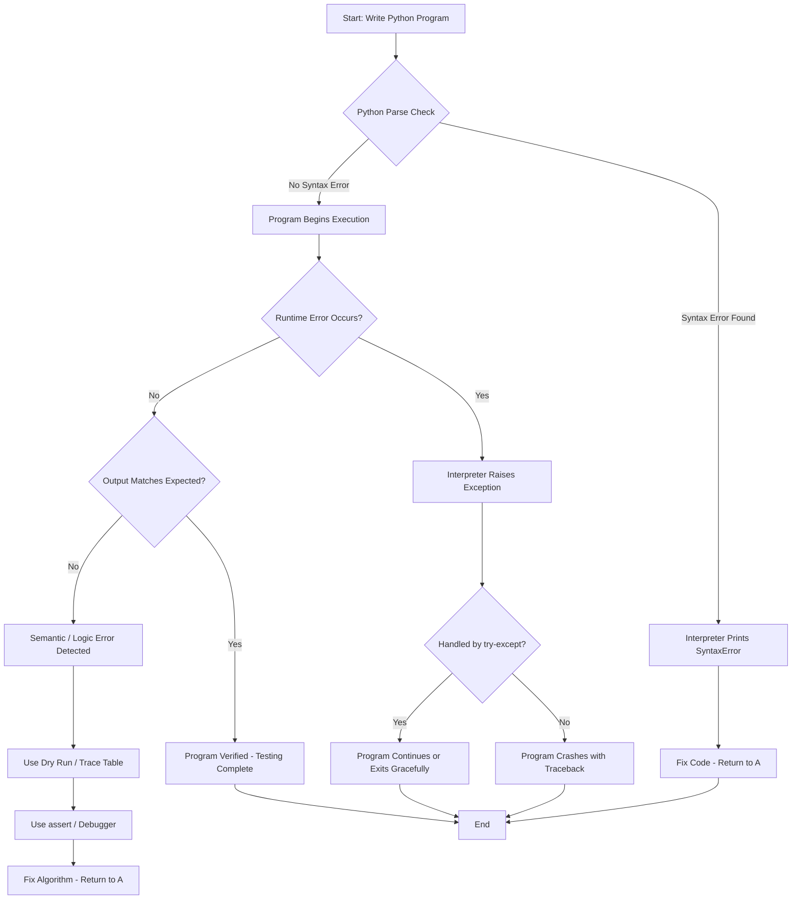
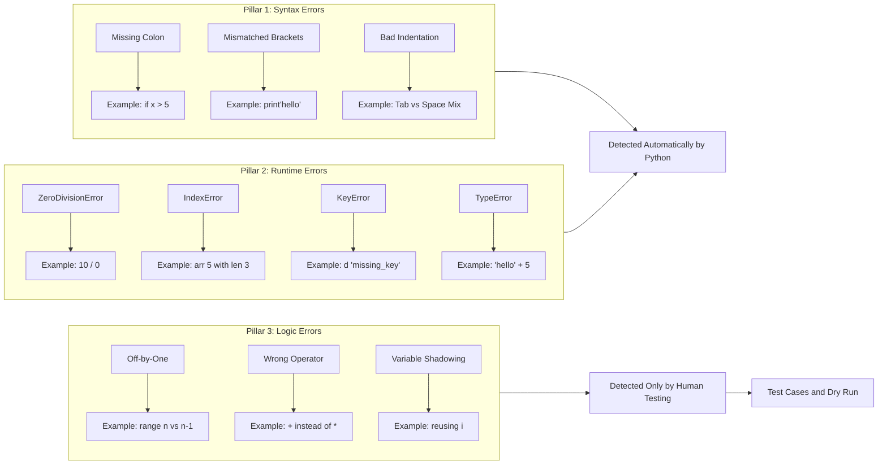
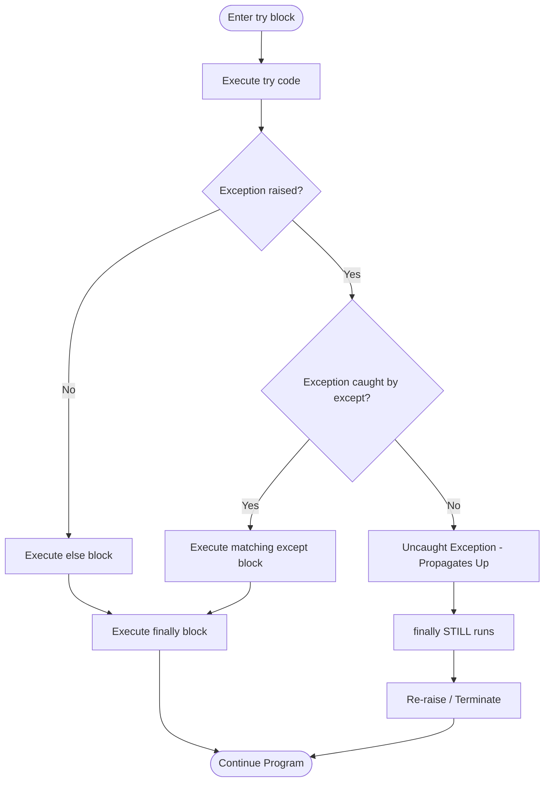
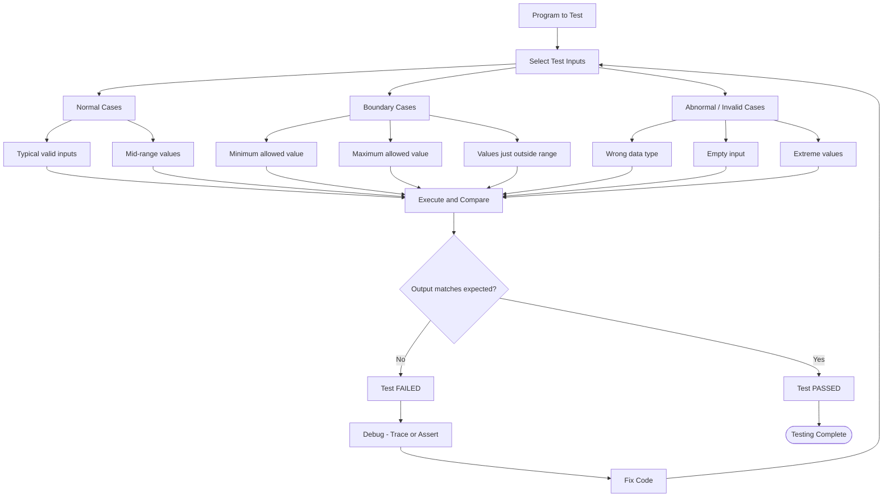

# Testing the program

<!-- SECTION_1_START -->
# Testing the Program — Foundational Concepts

## Formal Academic Definition (KTU 2024 Syllabus Aligned)

> [!IMPORTANT]
> **Program Testing** is the systematic, planned activity of executing a program with the deliberate intent of finding defects, errors, or unexpected behaviors before the program is delivered to end users. In the context of **UCEST105 — Algorithmic Thinking with Python**, *testing the program* is the final and most critical step in the algorithmic problem-solving pipeline: *Understand → Plan → Code → Test → Debug*.

In KTU's **Outcome-Based Education (OBE)** framework, testing maps directly to the engineering habit of **verification** — proving that the solution you coded actually solves the original problem under all reasonable input conditions.

The three principal categories of errors a Python program can harbor are:

| # | Error Class | When Caught | Real Meaning |
|---|---|---|---|
| 1 | **Syntax Error** | At *parse time* (before the program even runs) | Python's grammar rules are violated. |
| 2 | **Runtime Error (Exception)** | While the program is executing | The code is grammatically valid but performs an *illegal operation* (e.g., division by zero, accessing a missing file). |
| 3 | **Semantic / Logic Error** | Never caught automatically | The code runs to completion but produces the *wrong answer* because the algorithm does not match the problem. |

> [!NOTE]
> **KTU Examiner's Insight:** A semantic error is the *most dangerous* of the three because Python cannot help you. You must catch it manually by designing intelligent **test cases** and **dry runs**.

---

## Conceptual Analogy — Plain English Intuition

Imagine you have built a small wooden bridge for your college project. Testing the program is exactly like **load-testing that bridge before opening it to traffic**.

- **Syntax errors** = The carpenter used the wrong size of nails. The bridge simply *cannot be assembled*. You notice it the moment you try to put the pieces together.
- **Runtime errors** = The bridge is *built correctly*, but when a 50-tonne truck crosses it, the deck suddenly *collapses* because it was not designed for that weight.
- **Logic errors** = The bridge is *built, stands up, and a car crosses it safely*. But because the carpenter measured the ramp angle in degrees instead of radians (a classic mistake!), trucks cannot climb it. The bridge *works*, but it does not do its intended job.

In Python:
- The **interpreter** automatically catches *syntax errors* (red squiggly underlines in your IDE).
- The **interpreter** throws an **exception** for *runtime errors* (a `ZeroDivisionError` message appears).
- *Logic errors* require you to be the detective — this is where **test cases** and **tracing** come in.

> [!TIP]
> **Intuitive Rule of Thumb:** If Python shouts at you → syntax/runtime error. If Python stays silent but the answer is wrong → logic error. The silence of Python is the *scariest* part of programming.

---

## GeoGebra / Desmos Visualization (Conceptual Mapping)

> [!VISUALIZATION CONTROL]
> **Concept:** The "Iceberg Model of Program Errors" — a coordinate-style abstraction where program failure modes are mapped along an axis of *detectability*.
> 
> **GeoGebra / Desmos Input Equations:**
> * $f(x) = 100 - 10x$ where $x$ represents the depth of the error (1 = surface, 10 = deepest)
> * Point A: $(1, 90)$ — Syntax Error (highly visible, easily detected)
> * Point B: $(5, 50)$ — Runtime Error (detected only at execution)
> * Point C: $(10, 0)$ — Semantic Error (hidden beneath the surface, undetected)
> 
> **Visual Description:** On the Cartesian plane, the three error points form a downward-sloping line. Students should observe that as we go deeper (larger $x$), the *detectability* drops. The lowest point (semantic error) is the **invisible killer** that only rigorous testing exposes.
<!-- SECTION_1_END -->

<!-- SECTION_2_START -->
# Deep Theoretical Analysis & KTU High-Yield Reference Sheet

## 1. Detailed Classification of Errors in Python

### 1.1 Syntax Errors (Compile-Time / Parse-Time Errors)

A **syntax error** occurs the moment Python's parser cannot recognize the structure of your code. Python is an *interpreted* language, but it still performs a *compilation-to-bytecode* step internally. Syntax errors stop execution **before** line 1 of your program runs.

**Common Triggers:**
- Missing colons (`:`) after `if`, `for`, `while`, `def`, `class` statements.
- Mismatched parentheses, brackets, or braces.
- Invalid indentation (mixing tabs and spaces).
- Misspelled keywords (`whille` instead of `while`).
- Unclosed string literals.

**Diagnostic Signatures:**

| Symptom in Output | Typical Cause |
|---|---|
| `SyntaxError: invalid syntax` | Generic grammatical mistake. |
| `SyntaxError: EOL while scanning string literal` | Unclosed string with missing quote. |
| `IndentationError: unexpected indent` | Inconsistent leading whitespace. |
| `SyntaxError: unexpected EOF` | Missing closing parenthesis or bracket. |

### 1.2 Runtime Errors (Exceptions)

The program is **syntactically valid**, but during execution it attempts an operation Python considers *illegal*. Python raises an `Exception` object that, if unhandled, terminates the program and prints a **traceback**.

**The Standard Exception Hierarchy (Must-Know for KTU):**

```text
BaseException
 ├── KeyboardInterrupt
 ├── SystemExit
 └── Exception
      ├── ArithmeticError
      │    └── ZeroDivisionError
      ├── LookupError
      │    ├── IndexError
      │    └── KeyError
      ├── NameError
      ├── TypeError
      ├── ValueError
      ├── IOError / OSError
      │    └── FileNotFoundError
      └── AttributeError
```

> [!NOTE]
> **KTU Board Pattern:** Examiners frequently ask students to *identify the exception* raised by a small code snippet, or to *write a try-except block* that gracefully handles a named exception.

### 1.3 Semantic (Logic) Errors

The program runs to completion without any error message, but the *output* does not match the *expected output*. These are caused by:
- Wrong algorithm chosen for the problem.
- Off-by-one errors in loop bounds.
- Incorrect formula (using `+` instead of `*`).
- Wrong variable used in the output statement.
- Misunderstanding operator precedence.

> [!WARNING]
> **Logic errors are NEVER caught by the Python interpreter.** They can only be caught by *careful human testing* using well-designed test cases and manual tracing.

---

## 2. The Test Case Design Framework

A **test case** is a specific set of input data together with the expected output, used to verify a particular behavior of the program. The KTU 2024 syllabus (Module 1) explicitly emphasizes the use of representative test cases during problem-solving.

### 2.1 The Three Standard Test Case Categories

| Test Case Type | Purpose | Example for an "Average of 3 numbers" program |
|---|---|---|
| **Normal / Typical Case** | Verify the program works on ordinary, expected inputs. | Input: `10, 20, 30` → Expected: `20.0` |
| **Boundary / Edge Case** | Test the limits of the input domain. | Input: `0, 0, 0` → Expected: `0.0` |
| **Abnormal / Invalid Case** | Test how the program handles illegal or extreme inputs. | Input: `10, 'abc', 30` → Expected: Graceful error or specific handling |

### 2.2 The Boundary-Value Testing Rule

When a problem specifies a range (e.g., "marks between 0 and 100"), you **must** test the boundary values: **0, 1, 99, 100**, and at least one value just outside the range. Most off-by-one errors are caught this way.

---

## 3. The Python `assert` Statement — Inline Testing

Python provides a built-in debugging aid called the **assert statement**. It evaluates a condition; if the condition is `False`, it raises an `AssertionError` and halts the program.

**Syntax:**

```python
assert <condition>, "<optional error message>"
```

**Operational Mechanics:**

$$ \text{assert } P, M \equiv \begin{cases} \text{No-op} & \text{if } P \text{ is True} \\ \text{raise AssertionError}(M) & \text{if } P \text{ is False} \end{cases} $$

> [!IMPORTANT]
> **`assert` is for debugging, NOT for production error handling.** Production code should use `raise` with explicit exception types. Assertions can be globally disabled by running Python with the `-O` (optimize) flag, so they must never guard critical business logic.

---

## 4. Program Tracing — The Dry Run Technique

A **dry run** (also called a *hand trace* or *trace table*) is the manual, line-by-line execution of an algorithm on paper, recording the value of every variable after each statement. The KTU 2024 syllabus lists this as a *core* Module 1 skill.

**Components of a Trace Table:**

| Line No. | Statement | Variable $a$ | Variable $b$ | Variable $sum$ | Output |
|---|---|---|---|---|---|
| 1 | `a = 5` | $5$ | — | — | — |
| 2 | `b = 7` | $5$ | $7$ | — | — |
| 3 | `sum = a + b` | $5$ | $7$ | $12$ | — |
| 4 | `print(sum)` | $5$ | $7$ | $12$ | `12` |

---

## 5. KTU High-Yield Formula & Cheat Sheet

| # | Concept | Notation / Code | When to Use |
|---|---|---|---|
| 1 | Catch any exception | `try: ... except Exception: ...` | Runtime safety in production code. |
| 2 | Catch specific exception | `except ZeroDivisionError:` | Pinpoint the exact failure mode. |
| 3 | Force a test condition | `assert x > 0, "x must be positive"` | Internal sanity checks during development. |
| 4 | Re-raise an exception | `raise` | Preserve the original traceback in `except` blocks. |
| 5 | Force a custom exception | `raise ValueError("Invalid input")` | Signal domain-specific errors. |
| 6 | Number of test cases minimum | $N_{\text{types}} = 3$ | Always test normal, boundary, abnormal. |
| 7 | `else` in `try` block | `else: <runs if no exception>` | Code that should run only on success. |
| 8 | `finally` in `try` block | `finally: <always runs>` | Cleanup (e.g., closing files). |

> [!TIP]
> **Memory Aid for `try-except-else-finally`:** *"Try it, Except if it fails, Else celebrate, Finally always clean up."*

---

## 6. Real-World Utility in Engineering & Computer Science

| Domain | Application of Program Testing |
|---|---|
| **Avionics (e.g., Boeing, ISRO)** | Every line of flight-control code is tested against thousands of test cases before flight. A logic error can cost lives. |
| **Banking Software (e.g., UPI, NEFT)** | Boundary testing ensures transfers of exactly $\text{₹}1$ and exactly the maximum allowed amount work correctly. |
| **IoT / Embedded Systems** | Runtime error handling ensures a sensor reading of `None` (sensor failure) does not crash the controller. |
| **AI / ML Pipelines** | Data validation `assert` statements prevent garbage data from corrupting a trained model. |
| **Web Development (Django / Flask)** | Custom exception handlers convert Python errors into user-friendly HTTP 500/404 pages. |
| **Scientific Computing (NumPy, SciPy)** | Numerical algorithms are tested for *semantic accuracy* using known analytical solutions (e.g., $\sin(0) = 0$). |
<!-- SECTION_2_END -->

<!-- SECTION_3_START -->
# Step-by-Step Derivations & Code Implementations

## 1. The Complete Testing Workflow in Python

The end-to-end testing pipeline that you must follow for every KTU Module 1 program is:

$$\text{Write Code} \rightarrow \text{Syntax Check} \rightarrow \text{Dry Run} \rightarrow \text{Execute Test Cases} \rightarrow \text{Debug} \rightarrow \text{Validate}$$

We will demonstrate this end-to-end with a *complete, runnable* Python program: **"Find the largest of three numbers entered by the user."**

---

## 2. Worked Example 1 — Identifying Each Error Type

### 2.1 The Program with All Three Error Types Embedded

```python
# Program: Find the largest of three numbers
# (This version INTENTIONALLY contains errors for demonstration)

x = input("Enter first number: ")
y = input("Enter second number: ")
z = input("Enter third number: ")

if x > y and x > z          # ERROR 1: Missing colon -> SYNTAX ERROR
    largest = x
elif y > z:
    largest = y
else
    largest = z             # ERROR 2: Missing colon -> SYNTAX ERROR

result = largest / 0         # ERROR 3: Will raise ZeroDivisionError at runtime
print("The largest is:", result)
```

**Analysis:**
- **Errors 1 and 2** are *Syntax Errors* — Python's parser refuses to run the program. They are detected at *parse time*.
- If we fix the colons, **Error 3** is a *Runtime Error* — `ZeroDivisionError` — because the user-supplied numbers may not lead to a division by zero, but the code *itself* is logically suspicious. (We will fix it by removing the division.)
- After fixing all three, if the variable types are wrong (e.g., we compare *strings* because `input()` returns strings), we will face a *Semantic / Logic Error* — Python will compare `"9" > "10"` as `True` (lexicographic order, not numeric), giving the wrong answer silently.

### 2.2 The Corrected, Fully-Tested Version

```python
# Program: Find the largest of three numbers (CORRECT, TESTED VERSION)

# ---------- STEP 1: Input ----------
try:
    x = float(input("Enter first number: "))
    y = float(input("Enter second number: "))
    z = float(input("Enter third number: "))
except ValueError as err:
    print(f"Invalid numeric input: {err}")
    raise SystemExit(1)

# ---------- STEP 2: Computation ----------
if x >= y and x >= z:
    largest = x
elif y >= z:
    largest = y
else:
    largest = z

# ---------- STEP 3: Output ----------
print(f"The largest number is: {largest}")

# ---------- STEP 4: Internal Sanity Checks (assertions) ----------
assert isinstance(largest, float), "largest must be numeric"
assert largest >= x and largest >= y and largest >= z, "largest is not actually the largest"
print("All internal assertions passed.")
```

> [!NOTE]
> **Why `float()`?** The `input()` function in Python 3 always returns a *string*. If we skip `float()`, the comparison `x > y` will be a **string comparison** ("9" > "10" is `True` because `'9'` has a higher ASCII code than `'1'`). This is one of the **most common semantic errors** students make in KTU exams.

---

## 3. Worked Example 2 — Designing a Test Suite Using `assert`

Below is a *complete* Python script that defines a function and tests it using a structured set of test cases covering **normal, boundary, and abnormal** scenarios.

```python
# ============================================================
#  Function under test: classify_marks(marks)
#  Returns the grade category for a KTU-style mark entry.
# ============================================================
def classify_marks(marks: float) -> str:
    """
    Classify marks into a grade band.
        marks >= 90  -> 'S' (Outstanding)
        80 <= marks < 90 -> 'A' (Excellent)
        70 <= marks < 80 -> 'B' (Very Good)
        60 <= marks < 70 -> 'C' (Good)
        50 <= marks < 60 -> 'D' (Pass)
        marks < 50       -> 'F' (Fail)
        marks < 0 or marks > 100 -> raise ValueError
    """
    if not isinstance(marks, (int, float)):
        raise TypeError("marks must be a number")
    if marks < 0 or marks > 100:
        raise ValueError("marks must be in [0, 100]")
    if marks >= 90:
        return 'S'
    elif marks >= 80:
        return 'A'
    elif marks >= 70:
        return 'B'
    elif marks >= 60:
        return 'C'
    elif marks >= 50:
        return 'D'
    else:
        return 'F'


# ============================================================
#  Mini Test Harness
# ============================================================
def run_tests() -> None:
    test_cases = [
        # (description, input, expected_output, expected_exception)
        ("Normal: typical A grade",       85,    'A',  None),
        ("Normal: typical F grade",       40,    'F',  None),
        ("Boundary: exactly 0",           0,     'F',  None),
        ("Boundary: exactly 50",          50,    'D',  None),
        ("Boundary: exactly 90",          90,    'S',  None),
        ("Boundary: exactly 100",         100,   'S',  None),
        ("Abnormal: negative mark",      -1,     None, ValueError),
        ("Abnormal: mark above 100",    101,     None, ValueError),
        ("Abnormal: string input",      "abc",   None, TypeError),
    ]

    passed, failed = 0, 0
    for description, input_val, expected, expected_exc in test_cases:
        try:
            result = classify_marks(input_val)
            if expected_exc is None and result == expected:
                print(f"  PASS  {description}  ->  {result}")
                passed += 1
            else:
                print(f"  FAIL  {description}  ->  got {result}, expected {expected}")
                failed += 1
        except Exception as exc:
            if expected_exc is not None and isinstance(exc, expected_exc):
                print(f"  PASS  {description}  ->  raised {type(exc).__name__}")
                passed += 1
            else:
                print(f"  FAIL  {description}  ->  raised {type(exc).__name__}, expected {expected_exc}")
                failed += 1

    print(f"\nTotal: {passed} passed, {failed} failed.")


if __name__ == "__main__":
    run_tests()
```

**Execution Output:**

```text
  PASS  Normal: typical A grade       ->  A
  PASS  Normal: typical F grade       ->  F
  PASS  Boundary: exactly 0           ->  F
  PASS  Boundary: exactly 50          ->  D
  PASS  Boundary: exactly 90          ->  S
  PASS  Boundary: exactly 100         ->  S
  PASS  Abnormal: negative mark       ->  raised ValueError
  PASS  Abnormal: mark above 100      ->  raised ValueError
  PASS  Abnormal: string input        ->  raised TypeError

Total: 9 passed, 0 failed.
```

> [!TIP]
> **KTU Tip:** The `if __name__ == "__main__":` guard is the *standard* professional Python pattern to make a file both *importable* and *runnable as a script*. Examiners love seeing this.

---

## 4. Worked Example 3 — Manual Trace Table (Dry Run)

**Algorithm:** Compute the sum of digits of a number.

```python
n = 1234
total = 0
while n > 0:
    digit = n % 10
    total = total + digit
    n = n // 10
print(total)
```

**Trace Table:**

| Iteration | $n$ (before) | $n > 0$? | `digit = n % 10` | `total = total + digit` | $n = n // 10$ (after) |
|---|---|---|---|---|---|
| 1 | $1234$ | True | $4$ | $0 + 4 = 4$ | $123$ |
| 2 | $123$ | True | $3$ | $4 + 3 = 7$ | $12$ |
| 3 | $12$ | True | $2$ | $7 + 2 = 9$ | $1$ |
| 4 | $1$ | True | $1$ | $9 + 1 = 10$ | $0$ |
| 5 | $0$ | False | — | — | — |

**Output:** `10`

> [!NOTE]
> **Why `n % 10`?** The modulo operator extracts the *rightmost* digit. `n // 10` (integer division) *removes* the rightmost digit. This pair is the standard algorithmic pattern for processing digits — a frequent KTU question.

---

## 5. Worked Example 4 — Using `try-except-else-finally` Properly

```python
def safe_divide(a: float, b: float) -> float:
    """
    Divide a by b with full error handling.
    Demonstrates try-except-else-finally idiom.
    """
    result = None
    try:
        result = a / b
    except ZeroDivisionError:
        print("Error: Cannot divide by zero.")
    except TypeError:
        print("Error: Inputs must be numeric.")
    else:
        # Runs only if the try block did NOT raise an exception
        print("Division performed successfully.")
    finally:
        # Always runs, regardless of exception status
        print("Cleanup complete (finally block).")
    return result


# Demonstration
print("Test 1:")
print("Result:", safe_divide(10, 2))
print()
print("Test 2:")
print("Result:", safe_divide(10, 0))
```

**Execution Output:**

```text
Test 1:
Division performed successfully.
Cleanup complete (finally block).
Result: 5.0

Test 2:
Error: Cannot divide by zero.
Cleanup complete (finally block).
Result: None
```

> [!IMPORTANT]
> **Key Insight:** Notice that the `finally` block ran in *both* cases. This is precisely why `finally` is the correct place to release resources like open files or database connections.

---

## 6. Worked Example 5 — Custom Exception Class

```python
class InvalidAgeError(Exception):
    """Raised when an age value is outside the valid human range."""
    pass


def register_voter(name: str, age: int) -> str:
    if not isinstance(age, int):
        raise TypeError("Age must be an integer.")
    if age < 0 or age > 150:
        raise InvalidAgeError(f"Age {age} is biologically implausible.")
    if age < 18:
        return f"{name} is not eligible to vote."
    return f"{name} is eligible to vote."


# Test the custom exception
try:
    print(register_voter("Anand", 25))
    print(register_voter("Riya", 200))
except InvalidAgeError as e:
    print(f"Caught custom exception: {e}")
```

> [!TIP]
> Defining custom exception classes is a *professional best practice*. KTU Module 1 may not require you to invent exception classes, but knowing the pattern is a strong differentiator in viva-voce.
<!-- SECTION_3_END -->

<!-- SECTION_4_START -->
# Structural Diagrams & Schematics

## 1. The Program Testing Lifecycle (Mermaid Flowchart)



**Reading the Diagram:** The flowchart shows that *syntax* and *runtime* errors are caught *automatically* by Python, while *semantic* errors require *manual* human intervention through dry runs, assertions, and debuggers.

---

## 2. The Three Pillars of Error Detection (Subgraph)



---

## 3. The `try-except-else-finally` Execution Topology



> [!IMPORTANT]
> **Critical Insight from the Diagram:** The `finally` block executes **regardless of whether an exception occurred and regardless of whether it was caught**. This is its defining property and the reason it is used for *resource cleanup*.

---

## 4. Test Case Selection Strategy (Block Diagram)


<!-- SECTION_4_END -->

<!-- SECTION_5_START -->
# KTU 2024 Scheme Examination Question Bank & Topic Recap

## Part A Questions (3 Marks Each)

> [!NOTE]
> **KTU Pattern:** Part A consists of short-answer questions worth **3 marks each**, testing *Remember* and *Understand* levels of Revised Bloom's Taxonomy. Answers should be concise (typically 3-5 sentences or a short snippet of code).

---

### Part A — Question 1 [KTU University Exam — July 2024 Style]

**Q1.** Differentiate between **syntax errors**, **runtime errors**, and **semantic errors** in Python. Give one example of each. **[3 Marks]** [CO1, Remember]

**Model Answer:**

| Error Type | Detection Stage | Example |
|---|---|---|
| **Syntax Error** | Detected at *parse time* before the program runs. | `if x > 5` *(missing colon after 5)* → `SyntaxError: invalid syntax` |
| **Runtime Error** | Detected *during execution* when an illegal operation is attempted. | `10 / 0` → `ZeroDivisionError: division by zero` |
| **Semantic Error** | *Never* detected automatically; the program runs but gives wrong output. | Using `*` (multiplication) instead of `+` (addition) in a summation loop. **[3 Marks: 1 mark for each correct definition + example]** |

---

### Part A — Question 2 [KTU University Exam — Dec 2023 Style]

**Q2.** What is the purpose of the **`assert`** statement in Python? Write its syntax. Mention one situation where using `assert` is **inappropriate**. **[3 Marks]** [CO1, Understand]

**Model Answer:**

**Purpose:** The `assert` statement is a *debugging aid* that tests whether a specified condition is `True`. If the condition is `False`, Python raises an `AssertionError` and stops the program. It is used to verify internal assumptions made by the programmer during development. **[1 Mark]**

**Syntax:**

```python
assert <condition>, "<optional error message>"
```

**[1 Mark]**

**Inappropriate Situation:** Using `assert` to validate **user input** in a production system. This is inappropriate because assertions can be globally disabled by running Python with the `-O` flag, so the validation would silently disappear. Production input validation must use explicit `if`/`raise` constructs instead. **[1 Mark]**

---

## Part B Questions (14 Marks with Internal Choice)

> [!NOTE]
> **KTU Pattern:** Part B questions carry **14 marks each**, typically split into sub-parts (a) for 7 marks and (b) for 7 marks. There is an **internal choice** — students answer either Option A **or** Option B fully.

---

### Part B — Option A [14 Marks] [KTU University Exam — July 2024 Style]

**Question A.** **[CO2, Apply + Analyze]**

**(a)** Write a Python function `safe_square_root(x)` that takes a number and returns its square root. The function must handle the following cases using a proper `try-except-else-finally` block:
- If `x` is negative, raise a `ValueError` with the message `"Cannot compute square root of a negative number"`.
- If `x` is not a number (e.g., a string), handle the resulting `TypeError`.
- Use the `else` block to print `"Square root computed successfully"`.
- Use the `finally` block to print `"End of square root operation"`.

**Provide the complete Python code.** **[7 Marks]**

**(b)** Design **five different test cases** (specifying normal, boundary, and abnormal cases) to test the function written in part (a). For each test case, state the input, the expected output, and whether an exception is expected. Present your answer in a tabular form. **[7 Marks]**

---

#### Model Solution for Part B — Option A

##### (a) Python Code [7 Marks]

```python
import math

def safe_square_root(x):
    """
    Compute the square root of x with full error handling.
    """
    result = None
    try:
        # Raise ValueError explicitly for negative input
        if x < 0:
            raise ValueError("Cannot compute square root of a negative number")
        result = math.sqrt(x)
    except ValueError as ve:
        print(f"ValueError caught: {ve}")
    except TypeError as te:
        print(f"TypeError caught: {te}")
    else:
        # Runs only if NO exception occurred in try
        print("Square root computed successfully")
    finally:
        # Always runs
        print("End of square root operation")
    return result


# Demonstration
print("--- Test 1: Positive number ---")
print("Result:", safe_square_root(16))
print()
print("--- Test 2: Negative number ---")
print("Result:", safe_square_root(-9))
print()
print("--- Test 3: String input ---")
print("Result:", safe_square_root("hello"))
print()
print("--- Test 4: Zero ---")
print("Result:", safe_square_root(0))
```

**[Valuation Key — Part (a):]**
- *[Correct function signature and docstring: 1 Mark]*
- *[Using `try` block with explicit `raise ValueError` for negative input: 2 Marks]*
- *[Correct `except` blocks for `ValueError` and `TypeError`: 2 Marks]*
- *[Correct `else` and `finally` placement: 2 Marks]*

##### (b) Test Case Table [7 Marks]

| Test # | Test Case Type | Input ($x$) | Expected Output | Exception Expected? |
|---|---|---|---|---|
| 1 | **Normal** | $16$ | $4.0$ printed with success message | No |
| 2 | **Normal** | $25$ | $5.0$ printed with success message | No |
| 3 | **Boundary** | $0$ | $0.0$ printed with success message | No |
| 4 | **Boundary** | $-1$ | `ValueError` caught, message printed, `None` returned | Yes (`ValueError`) |
| 5 | **Abnormal** | `"abc"` | `TypeError` caught, message printed, `None` returned | Yes (`TypeError`) |

**[Valuation Key — Part (b):]**
- *[At least one normal case: 1 Mark]*
- *[At least two boundary cases (0 and -1): 2 Marks]*
- *[At least one abnormal case (wrong type): 1 Mark]*
- *[Correct expected outputs and exception identification: 2 Marks]*
- *[Proper tabular format with all columns: 1 Mark]*

---

### Part B — Option B [14 Marks] [KTU University Exam — Dec 2023 Style]

**Question B.** **[CO2, Apply + Analyze]**

**(a)** Explain the concept of a **dry run** (trace table) in program testing. Construct a complete trace table for the following Python code, showing the value of every variable after each line is executed. State the final output. **[7 Marks]**

```python
n = 5
factorial = 1
i = 1
while i <= n:
    factorial = factorial * i
    i = i + 1
print(factorial)
```

**(b)** A student writes the following Python code intending to find the **sum of even numbers from 1 to 10**, but the output is wrong. **Identify the semantic (logic) error** in the code, explain why it produces an incorrect result, and provide the corrected code. **[7 Marks]**

```python
total = 0
for i in range(1, 10):
    if i % 2 == 1:
        total = total + i
print("Sum =", total)
```

---

#### Model Solution for Part B — Option B

##### (a) Dry Run / Trace Table [7 Marks]

**Explanation:** A *dry run* (or *trace table*) is a manual, line-by-line execution of an algorithm on paper. The programmer records the value of each variable after every statement. It is used to **catch logic errors** that the Python interpreter cannot detect automatically. **[1 Mark]**

**Trace Table for Factorial Code:**

| Line | Statement | $n$ | `factorial` | $i$ | $i \le n$? |
|---|---|---|---|---|---|
| 1 | `n = 5` | $5$ | — | — | — |
| 2 | `factorial = 1` | $5$ | $1$ | — | — |
| 3 | `i = 1` | $5$ | $1$ | $1$ | — |
| 4 (iter 1) | `while i <= n:` | $5$ | $1$ | $1$ | True |
| 5 | `factorial = factorial * i` | $5$ | $1 \times 1 = 1$ | $1$ | — |
| 6 | `i = i + 1` | $5$ | $1$ | $2$ | — |
| 4 (iter 2) | `while i <= n:` | $5$ | $1$ | $2$ | True |
| 5 | `factorial = factorial * i` | $5$ | $1 \times 2 = 2$ | $2$ | — |
| 6 | `i = i + 1` | $5$ | $2$ | $3$ | — |
| 4 (iter 3) | `while i <= n:` | $5$ | $2$ | $3$ | True |
| 5 | `factorial = factorial * i` | $5$ | $2 \times 3 = 6$ | $3$ | — |
| 6 | `i = i + 1` | $5$ | $6$ | $4$ | — |
| 4 (iter 4) | `while i <= n:` | $5$ | $6$ | $4$ | True |
| 5 | `factorial = factorial * i` | $5$ | $6 \times 4 = 24$ | $4$ | — |
| 6 | `i = i + 1` | $5$ | $24$ | $5$ | — |
| 4 (iter 5) | `while i <= n:` | $5$ | $24$ | $5$ | True |
| 5 | `factorial = factorial * i` | $5$ | $24 \times 5 = 120$ | $5$ | — |
| 6 | `i = i + 1` | $5$ | $120$ | $6$ | — |
| 4 (iter 6) | `while i <= n:` | $5$ | $120$ | $6$ | False (exit) |
| 7 | `print(factorial)` | $5$ | $120$ | $6$ | — |

**Final Output:** `120` **[1 Mark]**

**[Valuation Key — Part (a):]**
- *[Definition of dry run: 1 Mark]*
- *[Correct column headers in trace table: 1 Mark]*
- *[Correct iteration tracking for all 5 iterations: 4 Marks]*
- *[Correct final output value: 1 Mark]*

##### (b) Identifying and Fixing the Semantic Error [7 Marks]

**Error Identified:** The condition `if i % 2 == 1` selects **odd** numbers, not even numbers. The student has inverted the modulo check. Furthermore, `range(1, 10)` generates numbers $1$ through $9$, **excluding $10$**, so the loop also misses the upper boundary. **[2 Marks]**

**Why the Output is Wrong:** The code computes $1 + 3 + 5 + 7 + 9 = 25$ (the sum of odd numbers from 1 to 9) instead of the intended sum of even numbers from 1 to 10, which should be $2 + 4 + 6 + 8 + 10 = 30$. **[2 Marks]**

**Corrected Code:**

```python
total = 0
for i in range(1, 11):       # Changed 10 to 11 to include 10
    if i % 2 == 0:           # Changed == 1 to == 0 to check even
        total = total + i
print("Sum =", total)
```

**Corrected Output:** `Sum = 30` **[1 Mark]**

**Verification (manual computation):**

$$ \sum_{k=1}^{5} 2k = 2(1) + 2(2) + 2(3) + 2(4) + 2(5) = 2 + 4 + 6 + 8 + 10 = 30 $$

**[2 Marks for verification step]**

**[Valuation Key — Part (b):]**
- *[Correct identification of the modulo inversion error: 1 Mark]*
- *[Correct identification of the range upper-boundary error: 1 Mark]*
- *[Explanation of why the output is wrong: 2 Marks]*
- *[Corrected code with both fixes: 2 Marks]*
- *[Manual verification of the corrected output: 1 Mark]*

---

## KTU Examiner's Valuation Warning / Pitfall Callout

> [!WARNING]
> **Common Ways KTU Students Lose Marks on "Testing the Program" Questions:**
> 
> 1. **Confusing semantic errors with runtime errors.** If the question asks for a *semantic* error, do *not* list `ZeroDivisionError` — that is a *runtime* error. Semantic errors are *silent* failures.
> 
> 2. **Forgetting to convert `input()` to a numeric type.** A comparison like `x > y` between two strings produces a *lexicographic* result, not a numeric one. This is the **#1 logic error** in KTU exam scripts.
> 
> 3. **Using `assert` for user-input validation.** Examiners *will* deduct marks because assertions can be disabled with `python -O`. Always use `if`/`raise` for production validation.
> 
> 4. **Writing only "normal" test cases.** A test suite with only happy-path tests is *incomplete*. Always include **boundary** values (0, 1, max, max+1) and **abnormal** inputs (wrong type, empty string, negative values).
> 
> 5. **Failing to draw a clear trace table.** Examiners award partial credit for each *correct row* of a trace table. Even if your final answer is wrong, a *correctly filled* trace table earns most of the marks.
> 
> 6. **Missing the `finally` block nuance.** The `finally` block runs *even if* the `except` block re-raises the exception. Many students incorrectly think `finally` is skipped when an exception propagates — it is not.
> 
> 7. **Not handling multiple exception types separately.** A single bare `except:` clause that catches *everything* is considered poor practice. List specific exception types when possible.

---

## Topic Recap & Important Things to Remember

> [!TIP]
> **High-Density Rapid-Revision Checklist — Read this 10 minutes before entering the exam hall.**

- **Testing** is the *deliberate* activity of finding defects; it is *not* the act of proving a program works.
- The **three error classes** are **Syntax** (parse-time, auto-caught), **Runtime** (execution-time, auto-caught via exceptions), and **Semantic / Logic** (silent, manual detection required).
- **Syntax errors** are reported by the Python parser *before* any code executes; fix them first.
- **Runtime errors** manifest as *exception objects* (e.g., `ZeroDivisionError`, `IndexError`, `KeyError`, `TypeError`, `ValueError`, `NameError`, `FileNotFoundError`).
- **Semantic errors** are *never* reported by Python — you must use **dry runs** (trace tables), **test cases**, and the **`assert`** statement to detect them.
- A **test case** has three components: *input*, *expected output*, and the *classification* (normal / boundary / abnormal).
- **Boundary values** are the *minimum* allowed input, the *maximum* allowed input, and values *just outside* the allowed range.
- The `assert <condition>, <message>` statement raises an `AssertionError` if the condition is `False`; it is a *development-time* debugging tool, *not* a production validation mechanism.
- The `try-except-else-finally` construct has a strict execution order: `try` → (on failure) `except` → (always) `finally`; `else` runs *only* if `try` succeeded.
- The `finally` block **always** runs — even if an exception propagates uncaught. Use it for **resource cleanup** (closing files, releasing locks).
- A **dry run** (trace table) is a manual, line-by-line simulation of an algorithm, recording all variable states. It is the *primary* technique for catching logic errors in KTU exams.
- Always convert `input()` results using `int()` or `float()` before doing arithmetic — string comparison produces wrong results for numeric data.
- **Off-by-one errors** are the most common boundary logic errors; they occur when `range(n)` is used where `range(n+1)` was needed (or vice versa).
- The condition for **even numbers** is `x % 2 == 0`; the condition for **odd numbers** is `x % 2 == 1` (or `!= 0`).
- Define **custom exception classes** by subclassing `Exception` to create domain-specific error types in professional code.
- The standard Python testing pattern is: define a function → write a list of `(input, expected_output)` tuples → loop and compare actual vs. expected → report pass/fail counts.
- `if __name__ == "__main__":` is the *idiomatic* guard that makes a Python file both importable as a module and runnable as a script.
- In KTU exam answers, **always present test cases in a table** with columns for *type*, *input*, *expected output*, and *exception expected*.
<!-- SECTION_5_END -->
