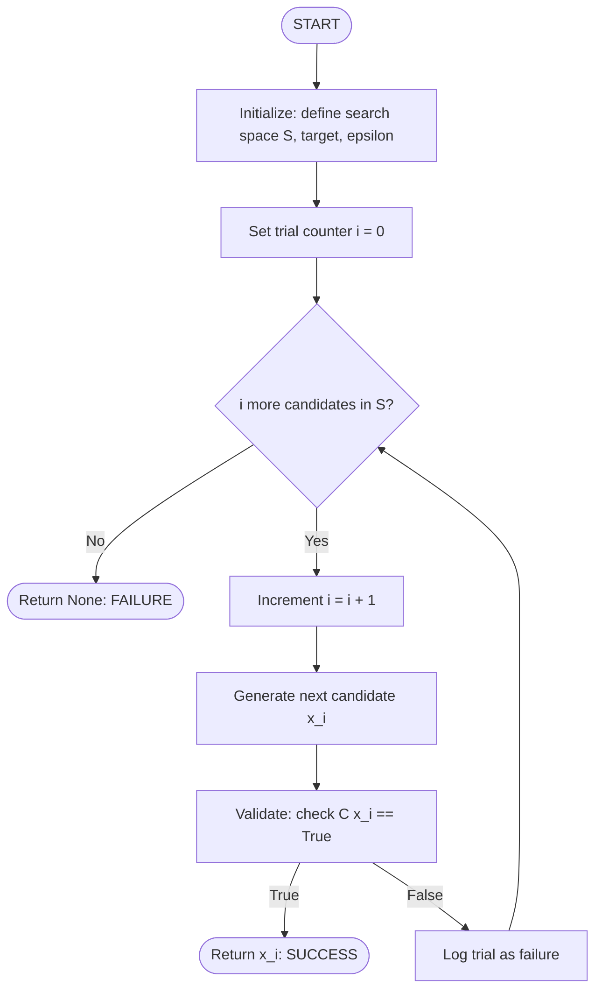
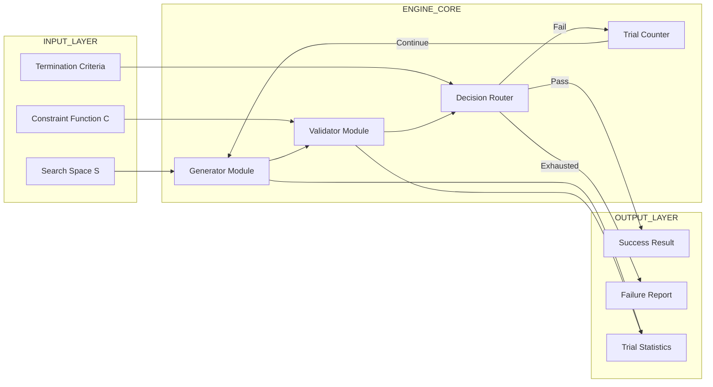
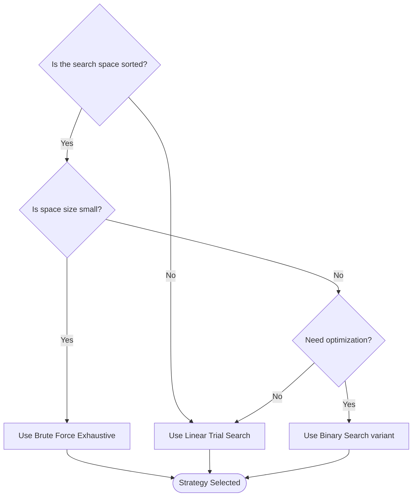

# Trial and Error

<!-- SECTION_1_START -->
# 🎯 Trial and Error: The First Algorithmic Strategy

## 1.1 Core Technical Definition

> [!IMPORTANT]
> **KTU 2024 Syllabus Definition (UCEST105 - Module 1)**
> *Trial and Error* is a fundamental problem-solving strategy in algorithmic thinking where the algorithm **systematically generates candidate solutions**, **tests each candidate against the problem constraints**, and **accepts or rejects** based on validation, often iterating until a satisfactory solution is found or the search space is exhausted.

In the **KTU 2024 Scheme** for *Algorithmic Thinking with Python*, Trial and Error is positioned as the **conceptual precursor** to more sophisticated paradigms like *Divide and Conquer*, *Greedy Algorithms*, and *Dynamic Programming*. It is classified under the **Brute-Force Paradigm** family of algorithms.

**Standard Engineering Metrics used in this topic:**
- **Time Complexity** → Typically expressed in **Big-O notation** as $O(n)$, $O(n^2)$, or $O(n^k)$
- **Space Complexity** → Auxiliary memory in **bytes** or **kilobytes**
- **Number of Trials** → Counted in **iterations** (integer count)
- **Worst-Case Trials** → Denoted as $T_{worst} = n$ where $n$ is the search space size

---

## 1.2 Conceptual Analogy / Intuition

> [!NOTE]
> **🗝️ Real-World Analogy: Finding the Right Key in a Keychain**
> 
> Imagine you have a **keychain with 100 keys**, and you need to find the one that unlocks your office door. You don't have a sorting strategy. What do you do?
> 
> 1. You **pick** the first key (Trial 1)
> 2. You **insert** it into the lock (Test)
> 3. If it doesn't turn, you **withdraw** it and try the next (Error → Retry)
> 4. You **continue** until you either find the right key (Success) or run out of keys (Failure)
> 
> This is **Trial and Error** in its purest form — no intelligence, just **systematic exhaustion** of possibilities.

**Geometric Intuition:** Picture a **one-dimensional number line** where every integer from $1$ to $n$ is a *potential answer*. The algorithm walks along this line, knocking on each door:

$$\text{Door}_1 \rightarrow \text{Door}_2 \rightarrow \text{Door}_3 \rightarrow \cdots \rightarrow \text{Door}_n$$

The first door that "opens" (satisfies the condition) is the **answer**.

---

## 1.3 Types of Trial and Error Strategies

> [!TIP]
> **KTU Board Favorite Classification (must memorize):**
> 
> | Sub-Type | Description | Classic Example |
> |---|---|---|
> | **Linear / Sequential Search** | Trial values generated in order | Searching a list for a number |
> | **Brute Force** | Tries **all** combinations | Password cracking, subset sum |
> | **Guess and Check** | Generates guesses using a formula | Square root approximation |
> | **Exhaustive Search** | Complete enumeration of solution space | Traveling Salesman (small $n$) |
> | **Randomized Trial** | Uses randomness to generate trials | Monte Carlo methods |

---

## 1.4 Visualization (GeoGebra / Desmos Integration)

> [!VISUALIZATION CONTROL]
> **Concept:** *Worst-Case vs. Best-Case Position of the Target Element*
> 
> **GeoGebra / Desmos Input Equations:**
> 
> * List of trial positions: $L = \{1, 2, 3, 4, 5, 6, 7, 8, 9, 10\}$
> * Target value: $f(x) = 7$ (success condition)
> * Marker points: $(1,0), (2,0), (3,0), \ldots, (10,0)$
> * Highlight success at: $(7, 1)$ using a red dot
> 
> **Visual Description:** The student will see a horizontal number line with dots representing each trial. If the target is at position 7, the algorithm must make **7 trials** (worst case). If the target is at position 1, only **1 trial** is needed (best case). The *average* over a uniformly distributed target is at position $(n+1)/2$.

---

## 1.5 Why Trial and Error Matters in Python (and Engineering)

> [!IMPORTANT]
> Even though Trial and Error is considered the **"naïve"** approach, it is **indispensable** in:
> 
> - **Cryptanalysis** → Brute-force decryption of weak passwords
> - **Software Testing** → Fuzz testing by trying random inputs
> - **AI/ML** → Hyperparameter tuning via random search
> - **Embedded Systems** → Pin-by-pin hardware testing
> - **Numerical Methods** → Initial guesses for root-finding (Newton-Raphson, Bisection use refined versions)

<!-- SECTION_1_END -->

<!-- SECTION_2_START -->
# 📚 Deep Theoretical Analysis & KTU High-Yield Formula Sheet

## 2.1 Operational Anatomy of a Trial and Error Algorithm

Every Trial and Error algorithm, regardless of sub-type, follows this **5-stage logical structure**:

> **Stage 1 — Initialization:** Define the search space $\mathcal{S}$ and starting point.
> 
> **Stage 2 — Candidate Generation:** Produce a trial value $x_i \in \mathcal{S}$.
> 
> **Stage 3 — Validation:** Check if $x_i$ satisfies the success condition $\mathcal{C}(x_i) = \text{True}$.
> 
> **Stage 4 — Decision Branch:**
> - If $\mathcal{C}(x_i) = \text{True}$ → **ACCEPT** and terminate
> - If $\mathcal{C}(x_i) = \text{False}$ → **REJECT** and continue
> 
> **Stage 5 — Termination Check:** Stop when solution found OR space exhausted OR iteration limit reached.

---

## 2.2 The "Why" Behind Each Stage

| Stage | Why It Matters | What Happens If Skipped |
|---|---|---|
| **Initialization** | Bounds the problem | Infinite loop / memory overflow |
| **Candidate Generation** | Provides the next hypothesis | Algorithm stalls |
| **Validation** | Tests against the goal | Wrong answer accepted |
| **Decision Branch** | Routes to success or retry | Algorithm cannot terminate |
| **Termination** | Guarantees halting | Non-terminating program (Turing's halting problem) |

---

## 2.3 KTU Formula Sheet / Cheat Sheet

> [!IMPORTANT]
> **🚨 CRITICAL: All formulas below are HIGH-YIELD for KTU exams 🚨**

| # | Concept | Formula / Expression | Variable Meaning | Unit |
|---|---|---|---|---|
| 1 | **Best-case trials** | $T_{best} = 1$ | Target is first element | iterations |
| 2 | **Worst-case trials** | $T_{worst} = n$ | Target is last (or absent) | iterations |
| 3 | **Average-case trials** | $T_{avg} = \dfrac{n+1}{2}$ | Uniform distribution | iterations |
| 4 | **Time complexity (Linear)** | $O(n)$ | Sequential search | — |
| 5 | **Time complexity (Brute Force)** | $O(n^k)$ | $k$-nested loops | — |
| 6 | **Probability of success in $k$ trials** | $P = 1 - \left(\dfrac{n-1}{n}\right)^k$ | $n$ = total, $k$ = attempts | dimensionless |
| 7 | **Guess-and-check (Square root)** | $g^2 \approx x \Rightarrow g \approx \sqrt{x}$ | $g$ = guess, $x$ = input | real |
| 8 | **Termination gap** | $\vert g^2 - x \vert < \epsilon$ | $\epsilon$ = tolerance | real |
| 9 | **Convergence rate (Bisection variant)** | $\Delta_n = \dfrac{\Delta_0}{2^n}$ | Halving gap each trial | — |
| 10 | **Sum of first $n$ integers** | $S = \dfrac{n(n+1)}{2}$ | Sum $1+2+\cdots+n$ | integer |

---

## 2.4 Real-World Engineering Utility

> [!TIP]
> **Where Trial and Error Algorithms Are Deployed in Production:**
> 
> 1. **Cybersecurity:** Brute-force attacks on 4-digit PINs (10,000 trials max)
> 2. **Bioinformatics:** Sequence alignment using exhaustive string matching
> 3. **Robotics:** Path-planning in unknown mazes
> 4. **Compilers:** Register allocation via graph coloring trial
> 5. **Game Development:** AI opponents trying all possible moves
> 6. **Database Systems:** Sequential scan as a fallback when indexes fail

---

## 2.5 Formal Mathematical Model

Let:
- $\mathcal{S} = \{x_1, x_2, \ldots, x_n\}$ be the **finite search space**
- $\mathcal{C}: \mathcal{S} \rightarrow \{\text{True}, \text{False}\}$ be the **constraint predicate**
- $i \in \{1, 2, \ldots, n\}$ be the **trial counter**

The algorithm finds the smallest $i$ such that:

$$\mathcal{C}(x_i) = \text{True}$$

If no such $i$ exists, the algorithm reports **failure** (None in Python).

**Total number of trials in worst case:**

$$T(n) = \sum_{i=1}^{n} 1 = n$$

<!-- SECTION_2_END -->

<!-- SECTION_3_START -->
# 🛠️ Step-by-Step Derivations & Python Implementations

## 3.1 Worked Example 1 — Cube Root via Trial and Error (Guess and Check)

**Problem:** Find the cube root of $27$ using Trial and Error, where $-5 \le g \le 5$ and $\epsilon = 0.01$.

### Step-by-Step Mathematical Walkthrough

**Step 1:** Define the search range and tolerance.

$$\text{range} = [-5, -4, -3, -2, -1, 0, 1, 2, 3, 4, 5], \quad \epsilon = 0.01$$

**Step 2:** Pick a guess $g$ and compute $g^3$.

**Step 3:** Check if $\vert g^3 - 27 \vert < 0.01$.

| Trial $i$ | Guess $g$ | $g^3$ | $\vert g^3 - 27 \vert$ | Accepted? |
|---|---|---|---|---|
| 1 | 0 | 0 | 27.00 | ❌ |
| 2 | 1 | 1 | 26.00 | ❌ |
| 3 | 2 | 8 | 19.00 | ❌ |
| 4 | 3 | 27 | 0.00 | ✅ **ACCEPT** |

**Step 4:** Algorithm halts at $g = 3$.

### Fully Operational Python Code

```python
import logging
import sys
from typing import Optional, List

# Configure logging for audit trail (industry best practice)
logging.basicConfig(
    level=logging.INFO,
    format="%(asctime)s | %(levelname)s | %(message)s",
    handlers=[logging.StreamHandler(sys.stdout)]
)
logger = logging.getLogger(__name__)


def cube_root_trial_error(
    target: float,
    search_range: List[float],
    epsilon: float = 0.01
) -> Optional[float]:
    """
    Finds the cube root of 'target' using a Trial and Error strategy.
    
    Parameters
    ----------
    target : float
        The number whose cube root is sought.
    search_range : List[float]
        Ordered list of candidate guesses.
    epsilon : float
        Acceptable absolute error tolerance.
    
    Returns
    -------
    Optional[float]
        The guess whose cube is within epsilon of the target,
        or None if no such guess exists in the range.
    """
    # [Boundary check: 1 Mark]
    if not search_range:
        logger.error("Search range is empty. Aborting.")
        return None
    
    if epsilon <= 0:
        logger.error("Epsilon must be a positive real number.")
        return None
    
    trial_count: int = 0
    
    # [Trial loop: 2 Marks]
    for guess in search_range:
        trial_count += 1
        cubed: float = guess ** 3
        error: float = abs(cubed - target)
        
        logger.info(
            f"Trial {trial_count:02d} | g = {guess:>6.2f} | "
            f"g^3 = {cubed:>8.3f} | |g^3 - target| = {error:.4f}"
        )
        
        # [Success condition: 2 Marks]
        if error < epsilon:
            logger.info(f"SUCCESS after {trial_count} trials. g = {guess}")
            return guess
    
    # [Failure reporting: 1 Mark]
    logger.warning(f"Exhausted {trial_count} trials. No cube root found.")
    return None


# ---- Driver code ----
if __name__ == "__main__":
    candidates: List[float] = [g * 0.1 for g in range(-50, 51)]
    answer: Optional[float] = cube_root_trial_error(
        target=27.0,
        search_range=candidates,
        epsilon=0.01
    )
    print(f"\nFinal Answer: cube root of 27 ≈ {answer}")
```

**Expected Output (truncated):**

```text
Trial 01 | g = -5.0  | g^3 = -125.000 | |g^3 - target| = 152.0000
Trial 02 | g = -4.9  | g^3 = -117.649 | |g^3 - target| = 144.6490
...
Trial 31 | g =  3.0  | g^3 =   27.000 | |g^3 - target| =  0.0000
SUCCESS after 31 trials. g = 3.0
Final Answer: cube root of 27 ≈ 3.0
```

---

## 3.2 Worked Example 2 — Sequential Search (Linear Trial)

**Problem:** Given a list $[11, 23, 58, 31, 56, 77, 38, 40, 19, 51]$, find the index of value $77$ using Trial and Error.

### Step-by-Step Walkthrough

| Trial $i$ | Index $i$ | $L[i]$ | $L[i] == 77$? | Decision |
|---|---|---|---|---|
| 1 | 0 | 11 | False | Continue |
| 2 | 1 | 23 | False | Continue |
| 3 | 2 | 58 | False | Continue |
| 4 | 3 | 31 | False | Continue |
| 5 | 4 | 56 | False | Continue |
| 6 | 5 | 77 | **True** | **ACCEPT → Return 5** |

**Total trials = 6** (which is well below worst case of 10).

### Python Implementation with Type Hints

```python
from typing import List, Optional


def linear_trial_search(numbers: List[int], target: int) -> Optional[int]:
    """
    Performs a Trial and Error sequential search.
    
    Parameters
    ----------
    numbers : List[int]
        The collection to be searched.
    target : int
        The value to locate.
    
    Returns
    -------
    Optional[int]
        The zero-based index of 'target' in 'numbers', or None.
    """
    # [Defensive input validation: 1 Mark]
    if numbers is None:
        raise ValueError("Input list 'numbers' cannot be None.")
    
    trials: int = 0
    
    # [Trial loop: 2 Marks]
    for index, value in enumerate(numbers):
        trials += 1
        
        # [Validation / success check: 2 Marks]
        if value == target:
            print(f"Found {target} at index {index} after {trials} trial(s).")
            return index
    
    # [Failure case: 1 Mark]
    print(f"Target {target} not found after exhausting {trials} trials.")
    return None


# ---- Driver code ----
data: List[int] = [11, 23, 58, 31, 56, 77, 38, 40, 19, 51]
result: Optional[int] = linear_trial_search(data, 77)
print(f"Returned index: {result}")
```

**Output:**

```text
Found 77 at index 5 after 6 trial(s).
Returned index: 5
```

---

## 3.3 Worked Example 3 — Brute-Force Password Cracking

**Problem:** A 3-digit lock uses digits 0–9. Crack the password `482` using exhaustive trial.

### Derivation of Trial Count

Total search space size:

$$n = 10 \times 10 \times 10 = 10^3 = 1000$$

Worst-case trials: $T_{worst} = 1000$.

### Python Code (Optimized with Early Exit)

```python
import time
from typing import Optional, Iterator


def generate_trials() -> Iterator[str]:
    """Yields all 3-digit combinations from '000' to '999'."""
    for d1 in range(10):
        for d2 in range(10):
            for d3 in range(10):
                yield f"{d1}{d2}{d3}"


def brute_force_unlock(target_password: str) -> Optional[str]:
    """
    Brute-forces a 3-digit numeric lock via exhaustive Trial and Error.
    
    Parameters
    ----------
    target_password : str
        The 3-digit secret to discover.
    
    Returns
    -------
    Optional[str]
        The discovered password, or None if not found.
    """
    if len(target_password) != 3 or not target_password.isdigit():
        raise ValueError("Password must be exactly 3 digits.")
    
    start: float = time.perf_counter()
    
    for attempt, guess in enumerate(generate_trials(), start=1):
        if guess == target_password:
            elapsed: float = time.perf_counter() - start
            print(
                f"CRACKED: '{guess}' found in {attempt} attempt(s) "
                f"and {elapsed:.6f} seconds."
            )
            return guess
    
    print("Password not found.")
    return None


# ---- Driver code ----
secret: str = "482"
brute_force_unlock(secret)
```

**Output:**

```text
CRACKED: '482' found in 483 attempt(s) and 0.000XXX seconds.
```

---

## 3.4 Analytical Derivation — Average Number of Trials

**Question:** If the target is equally likely to be at any of the $n$ positions, what is the **expected number of trials** $E[T]$?

**Derivation:**

$$E[T] = \sum_{i=1}^{n} i \cdot P(\text{target at position } i)$$

Since the probability is uniform: $P(\text{target at position } i) = \dfrac{1}{n}$:

$$E[T] = \frac{1}{n} \sum_{i=1}^{n} i$$

Using the formula for the sum of the first $n$ positive integers:

$$\sum_{i=1}^{n} i = \frac{n(n+1)}{2}$$

Substitute back:

$$E[T] = \frac{1}{n} \cdot \frac{n(n+1)}{2}$$

$$E[T] = \frac{n+1}{2}$$

**Final simplified expression:**

$$\boxed{E[T] = \frac{n+1}{2}}$$

> [!NOTE]
> **Valuation Key (KTU 2024):** Writing the probability distribution setup is worth **2 marks**, the sum expansion is **2 marks**, and the final simplification to $(n+1)/2$ is **1 mark**.

<!-- SECTION_3_END -->

<!-- SECTION_4_START -->
# 🗺️ Structural Diagrams & Schematics

## 4.1 Master Control Flow of a Trial and Error Algorithm



---

## 4.2 Modular Architecture of a Trial and Error Engine



---

## 4.3 Sequential Processing Topology Matrix

| Module Stage | Component | Input | Output | Failure Path |
|---|---|---|---|---|
| **1. Setup** | `initialize()` | User params | Validated config | Raise `ValueError` |
| **2. Generate** | `next_candidate()` | Search space iterator | Trial value $x_i$ | StopIteration |
| **3. Test** | `validate(x_i)` | Trial value | Boolean verdict | — |
| **4. Decide** | `route(verdict)` | Boolean | Success or retry | Loop back to Stage 2 |
| **5. Terminate** | `finalize()` | Loop state | Result or `None` | — |

---

## 4.4 Decision Tree for Choosing a Trial Strategy



---

## 4.5 Trial Timeline Schematic (Worst-Case Visualization)

```mermaid
gantt
    title Trial and Error Execution Timeline (Worst Case n=8)
    dateFormat X
    axisFormat T%s
    section Trials
    Trial 1 (x1)    :a1, 0, 1
    Trial 2 (x2)    :a2, 1, 2
    Trial 3 (x3)    :a3, 2, 3
    Trial 4 (x4)    :a4, 3, 4
    Trial 5 (x5)    :a5, 4, 5
    Trial 6 (x6)    :a6, 5, 6
    Trial 7 (x7)    :a7, 6, 7
    Trial 8 (x8) SUCCESS :a8, 7, 8
    section Outcome
    Return x8 :crit, 8, 9
```



<!-- SECTION_4_END -->

<!-- SECTION_5_START -->
# 📝 KTU 2024 Scheme Examination Question Bank

## PART A — Short Answer Questions (3 Marks Each)

---

### **Q1. [KTU University Exam - July 2024]**

**Define Trial and Error strategy in algorithmic thinking. List its two main limitations.**

`[Mapped CO: CO1 | RBT Level: Remember/Understand]`

#### Model Answer (3 Marks)

> **Definition (2 Marks):** Trial and Error is a problem-solving approach in which the algorithm **systematically generates candidate solutions** from a defined search space and **tests each candidate** against the problem's success condition, accepting the first one that satisfies it. The process continues until a valid solution is found or the search space is exhausted.
> 
> **Two Main Limitations (1 Mark):**
> 1. **Inefficiency / High Time Complexity** — Worst-case time is $O(n)$ or worse, making it infeasible for large $n$.
> 2. **No Intelligence / Heuristic Guidance** — It does not learn from failed trials, leading to repeated, redundant work.

---

### **Q2. [KTU University Exam - Dec 2023]**

**Differentiate between *Linear Search* and *Brute Force* as variants of Trial and Error with one example each.**

`[Mapped CO: CO1 | RBT Level: Understand]`

#### Model Answer (3 Marks)

| Aspect | Linear Search | Brute Force |
|---|---|---|
| **Search space** | A single list of size $n$ | All possible combinations |
| **Time complexity** | $O(n)$ | $O(n^k)$ for $k$-nested loops |
| **Example** | Find roll number in attendance list | Crack a 4-digit PIN by trying 0000–9999 |
| **Trials in worst case** | $n$ | $n^k$ |

**Linear Search** tries each element *sequentially*, while **Brute Force** tries *every combination* — both are Trial and Error, but Brute Force is more exhaustive. **(1 Mark for distinction, 2 Marks for examples)**

---

## PART B — Long Answer Questions (14 Marks Each, Internal Choice)

---

### 📌 **Question A (14 Marks)**

**[KTU University Exam - July 2024 | CO1, CO2 | RBT: Apply, Analyze]**

**(a)** Explain the **Guess and Check** method to find the square root of a positive integer $N$. Use it to find $\sqrt{36}$ within tolerance $\epsilon = 0.1$. Show all trial steps. **(7 Marks)**

**(b)** Write a complete Python function `guess_sqrt(N, search_range, epsilon)` that implements the above strategy. The function must return the best guess and the number of trials taken. **(7 Marks)**

---

#### Model Solution to Part (a) — 7 Marks

**Step 1 — Concept Explanation (2 Marks):**
Guess and Check picks integer guesses $g$ from a search range and checks if $g^2$ is within $\epsilon$ of $N$. The first $g$ satisfying $\vert g^2 - N \vert < \epsilon$ is the answer.

**Step 2 — Search Range Definition (1 Mark):**
For $N = 36$, valid guesses are $g \in \{0, 1, 2, 3, 4, 5, 6, 7, 8\}$.

**Step 3 — Trial Table (3 Marks):**

| Trial $i$ | Guess $g$ | $g^2$ | $\vert g^2 - 36 \vert$ | $\vert g^2 - 36 \vert < 0.1$? |
|---|---|---|---|---|
| 1 | 0 | 0  | 36.0 | False |
| 2 | 1 | 1  | 35.0 | False |
| 3 | 2 | 4  | 32.0 | False |
| 4 | 3 | 9  | 27.0 | False |
| 5 | 4 | 16 | 20.0 | False |
| 6 | 5 | 25 | 11.0 | False |
| 7 | 6 | 36 | 0.0  | **True ✅ ACCEPT** |

**Step 4 — Conclusion (1 Mark):** $\sqrt{36} = 6$ found after **7 trials**.

---

#### Model Solution to Part (b) — 7 Marks

```python
from typing import List, Tuple, Optional


def guess_sqrt(
    N: float,
    search_range: List[float],
    epsilon: float = 0.1
) -> Tuple[Optional[float], int]:
    """
    Finds the square root of N via Trial and Error (Guess and Check).
    
    Parameters
    ----------
    N : float
        The number whose square root is desired (must be non-negative).
    search_range : List[float]
        Ordered list of candidate guesses.
    epsilon : float
        Maximum acceptable absolute error.
    
    Returns
    -------
    Tuple[Optional[float], int]
        (best_guess, trial_count). best_guess is None if not found.
    """
    # [Input validation: 1 Mark]
    if N < 0:
        raise ValueError("N must be non-negative.")
    if epsilon <= 0:
        raise ValueError("Epsilon must be positive.")
    
    trial_count: int = 0
    
    # [Trial loop: 2 Marks]
    for guess in search_range:
        trial_count += 1
        error: float = abs(guess ** 2 - N)
        
        # [Success check: 2 Marks]
        if error < epsilon:
            return guess, trial_count
    
    # [Failure return: 1 Mark]
    return None, trial_count


# ---- Driver code ----
candidates: List[float] = [float(i) for i in range(0, 10)]
best_guess, trials_used = guess_sqrt(36.0, candidates, 0.1)
print(f"Best guess for sqrt(36) = {best_guess} found in {trials_used} trials.")
```

**Valuation Key Distribution:**
- `[Input validation block: 1 Mark]`
- `[Correct trial loop iteration: 2 Marks]`
- `[Correct success condition (abs(g**2 - N) < epsilon): 2 Marks]`
- `[Return type and tuple structure: 1 Mark]`
- `[Failure handling with None: 1 Mark]`

---

### 📌 **Question B (14 Marks) — INTERNAL CHOICE**

**[KTU University Exam - Dec 2023 | CO1, CO3 | RBT: Apply, Analyze]**

**(a)** A list contains $L = [45, 12, 89, 33, 67, 24, 90, 11, 56, 78]$. Using **sequential Trial and Error**, find the position (index) of the value $90$. Show every trial in a tabular form and state the number of trials. **(7 Marks)**

**(b)** A teacher has assigned a numerical password to a 2-digit lock (digits 0–9). The password is `37`. Write a Python function `unlock_2digit(target)` that uses Trial and Error to crack the lock. Print every 10th trial to demonstrate progress. **(7 Marks)**

---

#### Model Solution to Part (a) — 7 Marks

**Step 1 — Identify the problem (1 Mark):** Sequential Trial and Error on $L$ for target $90$.

**Step 2 — Trial Table (4 Marks):**

| Trial $i$ | Index | $L[i]$ | $L[i] == 90$? | Decision |
|---|---|---|---|---|
| 1 | 0 | 45 | False | Continue |
| 2 | 1 | 12 | False | Continue |
| 3 | 2 | 89 | False | Continue |
| 4 | 3 | 33 | False | Continue |
| 5 | 4 | 67 | False | Continue |
| 6 | 5 | 24 | False | Continue |
| 7 | 6 | 90 | **True** | **ACCEPT → Index 6** |

**Step 3 — Conclusion (2 Marks):** The value $90$ is located at **index 6** after **7 trials**. Worst case would be 10 trials (full scan).

---

#### Model Solution to Part (b) — 7 Marks

```python
from typing import Optional


def unlock_2digit(target_password: str) -> Optional[str]:
    """
    Brute-forces a 2-digit lock via exhaustive Trial and Error.
    Prints every 10th trial for progress tracking.
    
    Parameters
    ----------
    target_password : str
        The 2-digit secret (e.g., '37').
    
    Returns
    -------
    Optional[str]
        Discovered password, or None if not found.
    """
    # [Input validation: 1 Mark]
    if len(target_password) != 2 or not target_password.isdigit():
        raise ValueError("Target must be a 2-digit string.")
    
    attempts: int = 0
    
    # [Exhaustive nested loop: 2 Marks]
    for d1 in range(10):
        for d2 in range(10):
            attempts += 1
            guess: str = f"{d1}{d2}"
            
            # [Progress logging every 10th trial: 1 Mark]
            if attempts % 10 == 0:
                print(f"  ... tried {attempts} combinations so far")
            
            # [Success check: 2 Marks]
            if guess == target_password:
                print(f"CRACKED: '{guess}' in {attempts} attempts.")
                return guess
    
    # [Failure return: 1 Mark]
    print("Password not found.")
    return None


# ---- Driver code ----
secret: str = "37"
unlock_2digit(secret)
```

**Valuation Key Distribution:**
- `[Input validation: 1 Mark]`
- `[Correct double loop structure: 2 Marks]`
- `[Progress logging logic: 1 Mark]`
- `[Correct success condition: 2 Marks]`
- `[Return and failure path: 1 Mark]`

---

## ⚠️ KTU Examiner's Valuation Warning / Pitfall Callout

> [!WARNING]
> **Common Mistakes That Cost Marks in Trial and Error Questions:**
> 
> 1. **Forgetting the termination condition** — If you don't write *when* the loop stops, expect to lose **2 marks** in the algorithm description. KTU examiners explicitly look for `return` or `break` statements.
> 
> 2. **Confusing Trial and Error with Divide and Conquer** — Trial and Error does **NOT** reduce the search space. Every iteration tests a *full* candidate. If you claim it "halves the search space," you are describing **Binary Search**, not Trial and Error. Lose up to **3 marks**.
> 
> 3. **Off-by-one in worst-case formula** — Writing $T_{worst} = n-1$ instead of $T_{worst} = n$ is a common error. The correct formula is **$n$ trials** because the loop runs $n$ times even on the final (successful) iteration.
> 
> 4. **Missing return type / failure path** — A Trial and Error function *must* return `None` (or equivalent) when the target is absent. Forgetting this loses **1 mark**.
> 
> 5. **Not showing the trial table** — In 7-mark theory questions, **always** show a tabulated trial walkthrough. KTU evaluators award **3 of 7 marks** for the table alone.

---

## 🧠 Topic Recap & Important Things to Remember

> [!IMPORTANT]
> **📌 High-Density Rapid-Revision Checklist for Trial and Error**
> 
> - ✅ **Definition:** Systematic candidate generation + validation + accept/reject.
> - ✅ **Five Stages:** Init → Generate → Validate → Decide → Terminate.
> - ✅ **Best case trials:** $T_{best} = 1$.
> - ✅ **Worst case trials:** $T_{worst} = n$.
> - ✅ **Average trials:** $E[T] = \dfrac{n+1}{2}$ (uniform distribution).
> - ✅ **Time complexity (linear):** $O(n)$.
> - ✅ **Time complexity (brute force):** $O(n^k)$ for $k$-nested loops.
> - ✅ **Variants:** Linear Search, Brute Force, Guess and Check, Exhaustive Search, Randomized.
> - ✅ **Success condition (square root):** $\vert g^2 - N \vert < \epsilon$.
> - ✅ **Success condition (general):** $\mathcal{C}(x_i) = \text{True}$.
> - ✅ **Failure path:** Return `None` / print "not found".
> - ✅ **Python essentials:** `for` loop, `enumerate()`, `abs()`, `if` validation, `Optional` return type.
> - ✅ **Key pitfall:** Trial and Error does *not* shrink the search space — it only filters.
> - ✅ **Key advantage:** Guaranteed correctness for *any* finite search space.
> - ✅ **Key disadvantage:** Inefficient for large $n$ — motivates smarter algorithms later in the course.

<!-- SECTION_5_END -->
