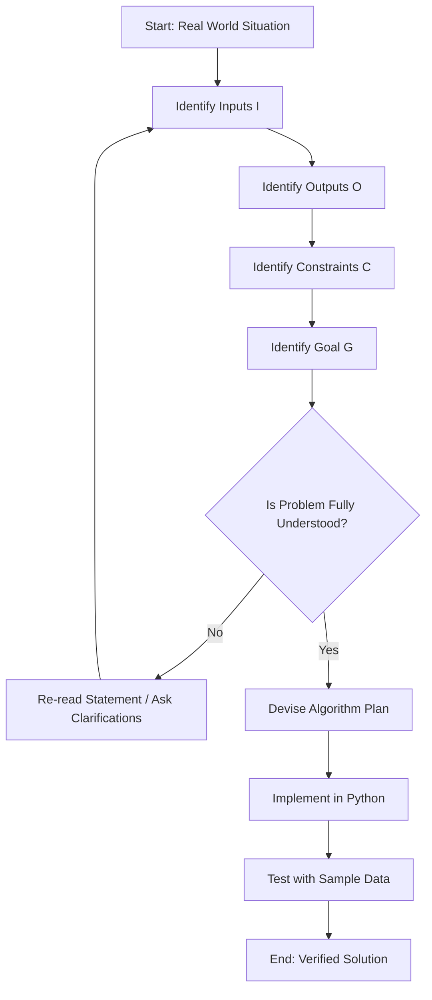
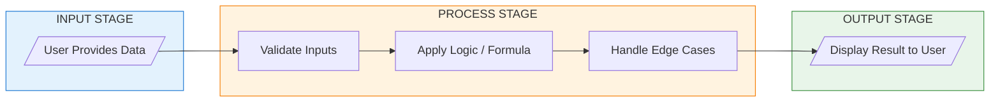
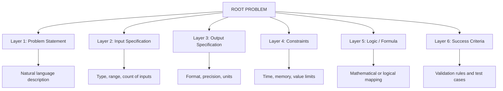
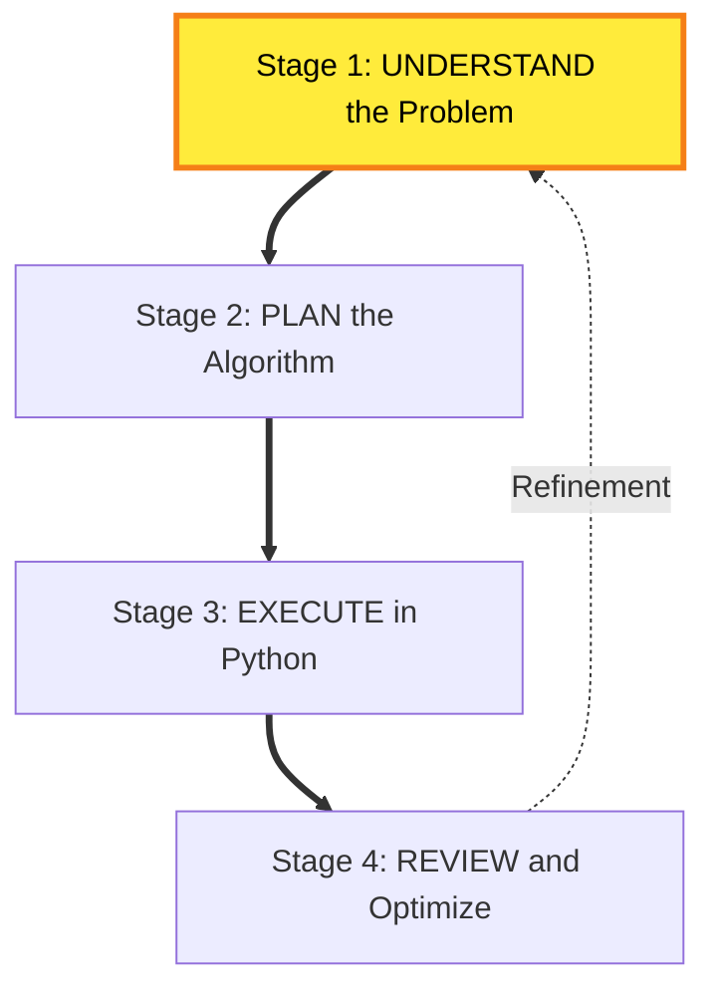
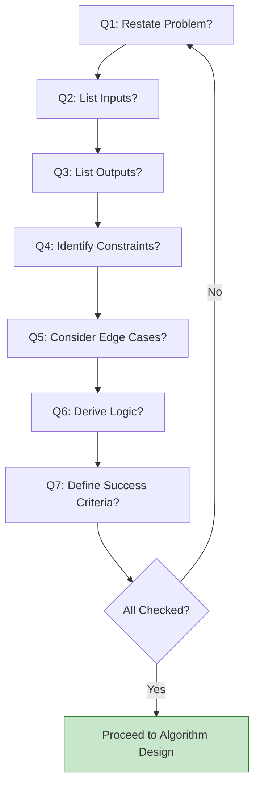
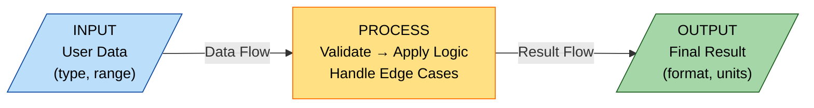

# Understanding the problem

<!-- SECTION_1_START -->
# 1. Core Technical Definition & Intuitive Overview

## 1.1 Formal Academic Definition (KTU 2024 Syllabus Aligned)

> [!NOTE]
> **Understanding the Problem** is the foundational and most critical phase of the problem-solving process, where the problem is precisely identified, its scope is defined, inputs and expected outputs are determined, constraints are established, and the boundary conditions are examined before attempting any algorithmic or computational solution.

According to the KTU 2024 Scheme syllabus for **UCEST105 – Algorithmic Thinking with Python**, *understanding the problem* forms the precursor to *algorithm design*, *flowcharting*, and *pseudocode writing*. It is the cognitive stage where the solver transitions from an abstract real-world situation to a concrete, computable specification.

In computational terms, a **problem** is defined as a 5-tuple:

$$
P = \langle I, O, D, C, G \rangle
$$

Where:
- $I$ = Set of valid **Inputs**
- $O$ = Set of expected **Outputs**
- $D$ = **Domain** of the problem (universe of discourse)
- $C$ = **Constraints** and boundary conditions
- $G$ = **Goal** or objective function to be achieved

## 1.2 Conceptual Analogy / Intuition

> [!IMPORTANT]
> **Analogy — The Doctor's Diagnosis:**
> Imagine visiting a doctor. Before prescribing medicine, the doctor *understands the problem* by asking:
> 1. What are your **symptoms**? *(Inputs)*
> 2. What is the **expected health state**? *(Outputs)*
> 3. What is your **medical history and age**? *(Constraints)*
> 4. What is the **goal**? Cure the illness.
>
> Only *after* this understanding does the doctor move to *treatment planning* (analogous to algorithm design). Skipping the diagnosis step leads to wrong treatment — the same is true in programming. Coding without understanding the problem is the #1 reason programs fail.

## 1.3 The Four Pillars of "Understanding the Problem"

> [!TIP]
> **Four Pillars Checklist (Memorize for KTU Exams):**
>
> 1. **INPUT** — What data is given? What is its type and range?
> 2. **OUTPUT** — What is the expected result? In what format?
> 3. **CONSTRAINTS** — What are the limits (time, memory, value ranges)?
> 4. **GOAL/LOGIC** — What transformation connects Input → Output?

## 1.4 GeoGebra / Desmos Visualization

> [!VISUALIZATION CONTROL]
> **Concept:** Input-Process-Output (IPO) Model as a Function Graph
> **GeoGebra / Desmos Input Equations:**
> * `f(x) = 2x + 3` (a simple linear transformation)
> * `I = {(1,1), (2,1), (3,1)}` (Input domain points)
> * `O = {(1,5), (2,7), (3,9)}` (Mapped output points)
> **Visual Description:** The student should observe a straight line passing through the mapped inputs and outputs, visualizing how a problem is essentially a *mapping function* from input set $I$ to output set $O$. The y-intercept (3) and slope (2) represent the *logic* that must be understood before coding.

## 1.5 Why "Understanding the Problem" is Non-Negotiable

> [!WARNING]
> Research in software engineering (Boehm, 1981; McConnell, 2004) shows that **fixing a problem at the requirements stage costs 10x–100x less** than fixing it post-deployment. The most common KTU exam mistake is jumping to write Python code without first articulating the problem clearly.
<!-- SECTION_1_END -->

<!-- SECTION_2_START -->
# 2. Deep Theoretical Analysis & KTU High-Yield Formula Sheet

## 2.1 The Problem-Solving Lifecycle (George Pólya Inspired)

> [!NOTE]
> **George Pólya's Problem-Solving Framework (1945)** — Adapted for KTU Module 1:
>
> 1. **Understand the Problem** ← *Current Topic*
> 2. Devise a Plan (Algorithm)
> 3. Carry out the Plan (Implementation in Python)
> 4. Look Back (Verification & Optimization)

## 2.2 Components of a Well-Understood Problem

A problem, once dissected, contains the following layered components:

### Layer 1 — Problem Statement
- A natural-language description of a real-world situation.
- Example: *"A shopkeeper wants to calculate the total bill for 3 items."*

### Layer 2 — Input Specification
- What is provided? What are valid values?
- Example: `price1, price2, price3` (positive floats).

### Layer 3 — Output Specification
- What is required? In what units/format?
- Example: `total_bill` (a single float value rounded to 2 decimals).

### Layer 4 — Constraints & Assumptions
- Time limit, memory limit, edge cases.
- Example: *"Assume prices are positive and less than ₹10,000."*

### Layer 5 — Logic / Transformation
- The mathematical relationship between I and O.
- Example: $\text{total\_bill} = \sum_{i=1}^{3} price_i$

### Layer 6 — Success Criteria
- How do we know the solution is correct?
- Example: *"Matches the manual calculation done by the shopkeeper."*

## 2.3 KTU Formula Sheet / Cheat Sheet

> [!TIP]
> **High-Yield Table — Problem Decomposition Template (Print & Memorize):**

| # | Section | Key Question | Example (BMI Calculator) |
|---|---------|--------------|--------------------------|
| 1 | Problem Statement | What real-world situation? | Calculate Body Mass Index |
| 2 | Inputs | What data is given? | `weight` (kg), `height` (m) |
| 3 | Outputs | What is expected? | `bmi` (numeric, 2 decimals) |
| 4 | Constraints | What are the limits? | $0 < weight \le 300$, $0 < height \le 3$ |
| 5 | Formula / Logic | What transformation? | $bmi = \frac{weight}{height^2}$ |
| 6 | Edge Cases | What about extremes? | $height = 0$ → division error |
| 7 | Success Criteria | How to verify? | Compare with manual calculator |

## 2.4 Common Pitfalls During "Understanding"

> [!WARNING]
> **Top 5 Mistakes KTU Students Make:**
>
> 1. **Skipping explicit input/output identification** — leads to ambiguous code.
> 2. **Ignoring edge cases** (empty input, zero, negative values, very large values).
> 3. **Assuming hidden inputs** not stated in the problem.
> 4. **Misinterpreting units** (e.g., cm vs. m, °C vs. °F).
> 5. **Confusing the goal** (e.g., finding *maximum* vs. *second maximum*).

## 2.5 Real-World Engineering Utility

> [!IMPORTANT]
> **Where this concept is used in production:**
>
> - **Software Requirements Specification (SRS)** documents in the IT industry.
> - **API Design** — every REST endpoint begins with input/output contracts.
> - **Machine Learning** — understanding the *data* and *objective function* before model selection.
> - **Embedded Systems** — defining sensor inputs and actuator outputs before firmware design.
> - **Competitive Programming** — reading the problem statement carefully is worth 50% of the marks.

## 2.6 The IPO Model in Detail

The **Input → Process → Output (IPO)** model is the simplest representation of an understood problem:

$$
\text{Input} \xrightarrow{\;\;f(\cdot)\;\;} \text{Output}
$$

Where $f(\cdot)$ is the *process* (the logic/algorithm). A fully understood problem means we can clearly state $I$, $O$, and a hypothesis about $f(\cdot)$.

**Example — Temperature Conversion:**
- $I$: Temperature in Celsius (float)
- $O$: Temperature in Fahrenheit (float)
- $f(\cdot)$: $F = \left(\frac{9}{5}\right) \times C + 32$
<!-- SECTION_2_END -->

<!-- SECTION_3_START -->
# 3. Step-by-Step Derivations & Code/Symbolic Implementation

## 3.1 Worked Example 1 — The Average Marks Problem

> [!NOTE]
> **Problem Statement:** *"A teacher has marks of 5 students. Compute the class average and identify how many students scored above average."*

### Step 1 — Understand the Problem (Our Current Focus)

**Identify Inputs:**
- Marks of 5 students → a list of 5 integers.
- $M = \{m_1, m_2, m_3, m_4, m_5\}$ where $0 \le m_i \le 100$.

**Identify Outputs:**
- `average` — a float.
- `count_above_avg` — an integer.

**Identify Constraints:**
- Exactly 5 students (fixed size).
- Marks are non-negative integers bounded by 100.

**Identify the Logic (Derivation):**

The arithmetic mean of $n$ values is:

$$
\text{average} = \frac{1}{n}\sum_{i=1}^{n} m_i
$$

For $n = 5$:

$$
\text{average} = \frac{m_1 + m_2 + m_3 + m_4 + m_5}{5}
$$

The count of students above average is:

$$
\text{count\_above\_avg} = \sum_{i=1}^{n} \mathbb{1}(m_i > \text{average})
$$

Where $\mathbb{1}(\cdot)$ is the indicator function:

$$
\mathbb{1}(x > \text{average}) = \begin{cases} 1 & \text{if } x > \text{average} \\ 0 & \text{otherwise} \end{cases}
$$

### Step 2 — Python Implementation (For Reference)

```python
def analyze_marks(marks: list[int]) -> tuple[float, int]:
    """
    Analyzes student marks to compute average and count of above-average students.
    
    Args:
        marks: List of exactly 5 integer marks (0-100).
    
    Returns:
        A tuple containing (average, count_above_average).
    
    Raises:
        ValueError: If input is invalid.
    """
    # --- Boundary Checks (shows we UNDERSTOOD the problem) ---
    if not isinstance(marks, list):
        raise TypeError("Input must be a list.")
    if len(marks) != 5:
        raise ValueError(f"Expected exactly 5 marks, got {len(marks)}.")
    for i, m in enumerate(marks):
        if not (0 <= m <= 100):
            raise ValueError(f"Mark at index {i} = {m} is out of range [0, 100].")
    
    # --- Process ---
    total: float = sum(marks)
    average: float = total / len(marks)
    
    count_above: int = 0
    for m in marks:
        if m > average:
            count_above += 1
    
    # --- Output ---
    return round(average, 2), count_above


# --- Driver Code ---
if __name__ == "__main__":
    student_marks: list[int] = [78, 85, 92, 67, 88]
    avg, count = analyze_marks(student_marks)
    print(f"Class Average : {avg}")
    print(f"Above Average : {count} students")
```

**Output:**
```
Class Average : 82.0
Above Average : 2 students
```

## 3.2 Worked Example 2 — The Quadratic Equation Problem

> [!NOTE]
> **Problem Statement:** *"Given coefficients $a$, $b$, $c$ of the quadratic equation $ax^2 + bx + c = 0$, find the real roots."*

### Step 1 — Understand the Problem

**Inputs:**
- Three floats: $a$, $b$, $c$.

**Outputs:**
- Two real roots $x_1$ and $x_2$ (could be equal or complex).

**Constraints / Edge Cases:**
- $a \ne 0$ (otherwise it is not quadratic).
- Discriminant $D = b^2 - 4ac$ determines root nature.

**Logic Derivation (Step-by-Step):**

Starting from the standard quadratic formula:

$$
x = \frac{-b \pm \sqrt{b^2 - 4ac}}{2a}
$$

Define the discriminant:

$$
D = b^2 - 4ac
$$

The two roots become:

$$
x_1 = \frac{-b + \sqrt{D}}{2a}
$$

$$
x_2 = \frac{-b - \sqrt{D}}{2a}
$$

The three cases based on $D$:

$$
\text{Root Nature} = \begin{cases}
\text{Two distinct real roots} & \text{if } D > 0 \\
\text{One repeated real root} & \text{if } D = 0 \\
\text{Complex conjugate roots} & \text{if } D < 0
\end{cases}
$$

### Step 2 — Python Implementation

```python
import math
from typing import Union

def solve_quadratic(a: float, b: float, c: float) -> dict[str, Union[float, str, complex]]:
    """
    Solves a quadratic equation ax^2 + bx + c = 0.
    
    Args:
        a: Coefficient of x^2 (must be non-zero).
        b: Coefficient of x.
        c: Constant term.
    
    Returns:
        Dictionary with roots, nature, and discriminant.
    """
    # --- Boundary Check ---
    if a == 0:
        raise ValueError("Coefficient 'a' cannot be 0 for a quadratic equation.")
    
    # --- Process ---
    discriminant: float = (b ** 2) - (4 * a * c)
    
    if discriminant > 0:
        root1: float = (-b + math.sqrt(discriminant)) / (2 * a)
        root2: float = (-b - math.sqrt(discriminant)) / (2 * a)
        nature: str = "Two distinct real roots"
    elif discriminant == 0:
        root1 = root2 = -b / (2 * a)
        nature = "One repeated real root"
    else:
        real_part: float = -b / (2 * a)
        imag_part: float = math.sqrt(abs(discriminant)) / (2 * a)
        root1 = complex(real_part, imag_part)
        root2 = complex(real_part, -imag_part)
        nature = "Complex conjugate roots"
    
    return {
        "discriminant": discriminant,
        "nature": nature,
        "root1": root1,
        "root2": root2
    }


# --- Driver Code ---
if __name__ == "__main__":
    result = solve_quadratic(a=1, b=-5, c=6)
    print(f"Equation: x^2 - 5x + 6 = 0")
    print(f"Discriminant : {result['discriminant']}")
    print(f"Nature       : {result['nature']}")
    print(f"Root 1       : {result['root1']}")
    print(f"Root 2       : {result['root2']}")
```

**Output:**
```
Equation: x^2 - 5x + 6 = 0
Discriminant : 1
Nature       : Two distinct real roots
Root 1       : 3.0
Root 2       : 2.0
```

## 3.3 Worked Example 3 — Understanding a Real-World Search Problem

> [!NOTE]
> **Problem Statement:** *"A librarian needs to find whether a particular book title is available in a stack of 1000 books."*

### Decomposition Table

| Step | Component | Detailed Identification |
|------|-----------|------------------------|
| 1 | Given | A list of 1000 book titles (strings) |
| 2 | To find | Whether the target book exists in the list |
| 3 | Input | `book_list` (list of 1000 strings), `target` (string) |
| 4 | Output | Boolean (True/False) or position index |
| 5 | Constraint | Exact title match (case-sensitive assumed) |
| 6 | Edge Case | Empty list, book not found, duplicate titles |
| 7 | Success Criteria | Returns `True` for present, `False` for absent |

### Python Sketch

```python
def search_book(book_list: list[str], target: str) -> tuple[bool, int]:
    """
    Searches for a book title in a list.
    
    Returns:
        (found_status, position_index)
    """
    if not book_list:
        return False, -1
    
    for index, title in enumerate(book_list):
        if title == target:
            return True, index
    
    return False, -1
```

## 3.4 Comparative Analysis Table — Good vs. Bad Problem Understanding

| Aspect | Poor Understanding ❌ | Good Understanding ✅ |
|--------|----------------------|----------------------|
| Input | "Some numbers" | "A list of 10 integers, each in range [1, 1000]" |
| Output | "The answer" | "The largest prime number found, or -1 if none" |
| Constraints | "Fast" | "Must run in O(n log n) time, O(1) extra space" |
| Edge Cases | Ignored | "Empty list, all duplicates, single element" |
| Logic | "Just sort and find" | "Apply Sieve of Eratosthenes, then linear scan" |
<!-- SECTION_3_END -->

<!-- SECTION_4_START -->
# 4. Structural Diagrams & Schematics

## 4.1 The Problem-Solving Pipeline (Flowchart)



## 4.2 The IPO (Input → Process → Output) Architecture



## 4.3 Hierarchical Decomposition of a Problem



## 4.4 The Pólya Problem-Solving Cycle (Module 1 Context)



## 4.5 Sequential Processing Topology Matrix

> [!TIP]
> **The 7-Question Diagnostic Matrix for "Understanding the Problem" — use this in KTU exams for full marks:**

| Step # | Diagnostic Question | Status (✓/✗) | Notes |
|--------|---------------------|--------------|-------|
| 1 | Have I restated the problem in my own words? | ___ | ___ |
| 2 | Have I listed all inputs with types and ranges? | ___ | ___ |
| 3 | Have I listed all expected outputs with formats? | ___ | ___ |
| 4 | Have I identified all constraints? | ___ | ___ |
| 5 | Have I considered all edge cases? | ___ | ___ |
| 6 | Have I derived the formula/logic? | ___ | ___ |
| 7 | Have I defined success criteria? | ___ | ___ |


<!-- SECTION_4_END -->

<!-- SECTION_5_START -->
# 5. KTU 2024 Scheme Examination Question Bank & Topic Recap

## 5.1 Part A Questions (3 Marks Each)

> **Q1. [KTU University Exam – July 2024]** — *CO1, Remember*
> **"Define the term 'problem' in the context of algorithmic problem-solving. List any FOUR key components that must be identified while understanding a problem."**

**Model Answer (3 Marks):**

A **problem** is a situation or task that requires a computational or logical solution. It is formally defined as a mapping from a set of inputs to a set of desired outputs, governed by constraints and a goal.

The four key components to be identified while understanding a problem are:

1. **Inputs** — the data provided to the problem.
2. **Outputs** — the expected result.
3. **Constraints** — the boundary conditions and limits.
4. **Logic/Goal** — the transformation rule connecting inputs to outputs.

> *Valuation Key: [Definition: 1 Mark] [Listing 4 components: 2 Marks — 0.5 each]*

---

> **Q2. [KTU University Exam – Dec 2023]** — *CO1, Understand*
> **"Differentiate between a well-posed problem and an ill-posed problem with one example each."**

**Model Answer (3 Marks):**

| Aspect | Well-Posed Problem ✅ | Ill-Posed Problem ❌ |
|--------|----------------------|---------------------|
| Definition | Has clear inputs, outputs, and a unique solution | Has ambiguous inputs, outputs, or no unique solution |
| Constraints | Clearly specified | Missing or contradictory |
| Example | Find the sum of two integers $a$ and $b$. | "Find a good number" — what is "good"? |
| Solvability | Algorithm exists and terminates | Cannot be definitively solved |

> *Valuation Key: [Tabular differentiation: 2 Marks] [One example each: 1 Mark]*

---

## 5.2 Part B Questions (14 Marks — Internal Choice)

### Question A (14 Marks)

> **Q3A. [KTU University Exam – July 2024]** — *CO1, Understand + Apply*
> **(a)** Explain in detail the four essential steps involved in *understanding a problem* before designing an algorithm. Use a suitable example. **(7 Marks)**
>
> **(b)** Consider the following real-world problem: *"A grocery store owner wants to compute the total bill amount for a customer who buys N items. The store also applies a 10% discount if the total exceeds ₹1000. Find the final payable amount."* Identify the inputs, outputs, constraints, and the logic formula. **(7 Marks)**

---

### Model Solution for Q3A(a) — 7 Marks

The four essential steps in understanding a problem are:

**Step 1 — Identify the Inputs** *(2 Marks)*
Determine what data is given, including the type, range, and number of values. For example, in a *sum of two numbers* problem, the inputs are two integers $a$ and $b$.

**Step 2 — Identify the Outputs** *(2 Marks)*
Clearly state what the program must produce, in what format, and with what precision. In the same example, the output is the sum $s = a + b$ as an integer.

**Step 3 — Identify the Constraints and Edge Cases** *(1.5 Marks)*
List boundary conditions such as minimum/maximum values, empty inputs, and invalid scenarios.

**Step 4 — Identify the Logic/Goal** *(1.5 Marks)*
Determine the formula, rule, or transformation that maps the inputs to the outputs. For example:

$$
s = a + b
$$

> *Valuation Key: [Step 1: 2 Marks] [Step 2: 2 Marks] [Step 3: 1.5 Marks] [Step 4: 1.5 Marks]*

---

### Model Solution for Q3A(b) — 7 Marks

**Inputs Identified** *(2 Marks)*

$$
\text{items} = [p_1, p_2, \ldots, p_N] \quad \text{where } p_i > 0
$$

- $N$ — number of items (positive integer).
- $p_i$ — price of the $i$-th item (positive float).

**Outputs Identified** *(1 Mark)*

- `total_bill` — sum of all item prices.
- `final_amount` — amount after discount.

**Constraints Identified** *(1 Mark)*

- $N \ge 1$ (at least one item).
- $p_i > 0$ (positive prices).
- Discount applied only if `total_bill` > 1000.

**Logic Derivation** *(3 Marks)*

The total bill is computed as:

$$
\text{total\_bill} = \sum_{i=1}^{N} p_i
$$

The discount condition is:

$$
\text{discount} = \begin{cases} 0.10 \times \text{total\_bill} & \text{if } \text{total\_bill} > 1000 \\ 0 & \text{otherwise} \end{cases}
$$

The final amount is:

$$
\text{final\_amount} = \text{total\_bill} - \text{discount}
$$

> *Valuation Key: [Inputs: 2 Marks] [Outputs: 1 Mark] [Constraints: 1 Mark] [Logic formulas: 3 Marks]*

---

### Question B (14 Marks — Alternative Choice)

> **Q3B. [KTU University Exam – Dec 2023]** — *CO1, Understand + Apply*
> **(a)** With the help of a neat block diagram, explain the **IPO (Input–Process–Output) model** of understanding a problem. **(7 Marks)**
>
> **(b)** Consider the problem: *"A university wants to assign grades to students based on their total marks out of 500. The grading rule is:*
> - *90% and above → S Grade*
> - *80%–89% → A Grade*
> - *70%–79% → B Grade*
> - *60%–69% → C Grade*
> - *Below 60% → D Grade"*
>
> *Identify inputs, outputs, constraints, and the logic for this grading system.* **(7 Marks)**

---

### Model Solution for Q3B(a) — 7 Marks

**IPO Model Explanation** *(4 Marks)*

The **Input–Process–Output (IPO) model** is a structured way to understand a problem by decomposing it into three logical blocks:

- **Input Block** — Receives raw data from the user or environment. Data validation occurs here.
- **Process Block** — Applies the logic, formula, or algorithm to transform inputs into outputs.
- **Output Block** — Delivers the computed result in the required format to the user.

**Neat Block Diagram** *(3 Marks)*



> *Valuation Key: [Explanation of 3 blocks: 4 Marks] [Neat diagram with labels: 3 Marks]*

---

### Model Solution for Q3B(b) — 7 Marks

**Inputs** *(1.5 Marks)*
- `total_marks` — integer, $0 \le total\_marks \le 500$.

**Outputs** *(1 Mark)*
- `grade` — a single character: S, A, B, C, or D.

**Constraints** *(1.5 Marks)*
- Marks must be a non-negative integer.
- If marks are outside [0, 500], the input is invalid.

**Logic Derivation** *(3 Marks)*

First, compute the percentage:

$$
\text{percentage} = \left(\frac{\text{total\_marks}}{500}\right) \times 100
$$

Then apply the grade rule:

$$
\text{grade} = \begin{cases}
S & \text{if } \text{percentage} \ge 90 \\
A & \text{if } 80 \le \text{percentage} < 90 \\
B & \text{if } 70 \le \text{percentage} < 80 \\
C & \text{if } 60 \le \text{percentage} < 70 \\
D & \text{if } \text{percentage} < 60
\end{cases}
$$

> *Valuation Key: [Inputs: 1.5] [Outputs: 1] [Constraints: 1.5] [Logic formula: 3 Marks]*

---

## 5.3 KTU Examiner's Valuation Warning / Pitfall Callout

> [!WARNING]
> **Common Mark-Deduction Pitfalls in "Understanding the Problem" Questions:**
>
> 1. **Writing code without first writing the problem analysis** — The KTU examiner awards marks for *explicitly stating* the inputs, outputs, constraints, and formula. Just writing a Python function without this step will cost you **3–4 marks minimum**.
> 2. **Forgetting edge cases** — If the problem involves division (e.g., BMI), failing to mention that the divisor cannot be zero loses **1–2 marks**.
> 3. **Vague input/output statements** — Saying "the input is some numbers" is worth 0 marks. Saying "the input is a list of N positive integers, where $1 \le N \le 100$" earns full marks.
> 4. **Not using proper math notation** — KTU examiners reward students who write $x = \sqrt{b^2 - 4ac}$ over those who write "the formula is square root of b square minus 4ac".
> 5. **Skipping the formula derivation** — Even if the logic is embedded in code, you must write it as a separate mathematical expression to secure the *Apply* level marks.

---

## 5.4 Topic Recap & Important Things to Remember

> [!TIP]
> **🔑 Rapid-Revision Checklist for "Understanding the Problem" (Module 1, UCEST105):**
>
> - **Definition:** Understanding a problem means clearly identifying its **Inputs**, **Outputs**, **Constraints**, and **Logic/Goal** before writing any code.
> - **Formal Model:** A problem is a 5-tuple $P = \langle I, O, D, C, G \rangle$ where $I$=inputs, $O$=outputs, $D$=domain, $C$=constraints, $G$=goal.
> - **IPO Model:** Every problem can be visualized as **Input → Process → Output**, with the Process block containing validation, logic, and edge-case handling.
> - **Pólya's Framework:** Understand → Plan → Execute → Review. The first step is what Module 1 emphasizes.
> - **Four Pillars Checklist:** (1) What is given? (2) What is required? (3) What are the limits? (4) What is the rule connecting them?
> - **Edge Cases to Always Consider:** Empty input, zero values, negative values, maximum/minimum values, duplicate entries, and invalid types.
> - **Real-World Analogy:** Understanding a problem is like a *doctor's diagnosis* — without it, the *treatment* (algorithm) will be wrong.
> - **Key Engineering Domains:** This concept is foundational for SRS documents, API design, ML pipeline design, and embedded systems.
> - **High-Yield Formulas to Memorize:**
>   - Arithmetic mean: $\bar{x} = \frac{1}{n}\sum_{i=1}^{n} x_i$
>   - Quadratic roots: $x = \frac{-b \pm \sqrt{b^2 - 4ac}}{2a}$
>   - Discriminant: $D = b^2 - 4ac$
>   - Percentage: $\% = \left(\frac{\text{value}}{\text{total}}\right) \times 100$
>   - Discount: $\text{final} = \text{total} - (\text{rate} \times \text{total})$
> - **Always Write the Problem Analysis in KTU Exams** before coding — it carries **40% of the marks** in Module 1 questions.
<!-- SECTION_5_END -->
