# Using the math module

<!-- SECTION_1_START -->

# Using the `math` Module in Python

## 1. Core Technical Definition

The **`math` module** is a built-in standard library in Python that provides access to the mathematical functions defined by the **C standard** (specifically the ISO C *math.h* header). It supplies a rich collection of precompiled, high-performance routines for:

- Trigonometric, inverse-trigonometric, and hyperbolic computations
- Logarithmic and exponential operations
- Number-theoretic operations (factorial, GCD, LCM, permutations, combinations)
- Rounding, flooring, ceiling, and truncation of real values
- Special mathematical constants like $\pi$ and $e$
- Floating-point introspection (finite, infinite, NaN checks)

> [!IMPORTANT]
> **KTU 2024 Syllabus Highlight (UCEST105 – Module 1):**
> The `math` module is a **standard library** — it is shipped with every CPython distribution. It must be **explicitly imported** using `import math` before any of its members can be accessed. It is *not* a third-party package, so no `pip install` is required.

> [!NOTE]
> **Formal Definition (KTU Board Terminology):**
> A *module* in Python is a file containing Python definitions (functions, variables, classes) that can be brought into the namespace of another script using the `import` statement. The `math` module is one such file (`math.py`/compiled `math.cpython-*.so`) bundled inside the Python standard library.

---

## 2. Conceptual Analogy / Intuition

Imagine you walk into a well-stocked **engineering workshop**. The workbench is empty, but the wall behind you has a pegboard with every tool neatly labelled: *wrenches, calipers, protractors, calculators*. You do not build these tools from scratch — you simply **select** what you need and **use** it.

The `math` module is that pegboard:

- **Importing** = walking up to the pegboard and signing the tool register.
- **Accessing** = picking a specific tool by its label, e.g. `math.sqrt`.
- **Constants** (`math.pi`, `math.e`) = the reference gauges that hang permanently on the wall.

If you forget to "sign the register" (skip the `import` statement), Python will raise a `NameError` — equivalent to trying to use a tool you never signed out.

> [!TIP]
> **Quick rule of thumb:** Anything you need that looks like it belongs on a scientific calculator — sines, cosines, logs, square roots, $\pi$, $e$ — is almost certainly inside `math`.

---

## 3. Why a Separate Module?

A common student question is: *"Why not just write `x ** 0.5` instead of `math.sqrt(x)`?"*

| Approach | Behaviour | Numerical Edge Cases |
|----------|-----------|----------------------|
| `x ** 0.5` | Generic exponentiation | Slower; less accurate for very small/large `x` |
| `math.sqrt(x)` | Calls the underlying C `sqrt` | Faster; consistent with IEEE-754 behaviour |

The `math` module gives **speed, accuracy, and a uniform API** for scientific work.

---

## 4. Visualization Control

> [!VISUALIZATION CONTROL]
> **Concept:** Mapping of the unit circle and trigonometric function outputs.
> **GeoGebra / Desmos Input Equations (parametric):**
> * $x(t) = \cos(t)$
> * $y(t) = \sin(t)$
> **Visual Description:** A unit circle plotted for $t \in [0, 2\pi]$. The `math.sin` and `math.cos` functions return the $y$ and $x$ coordinates respectively for any input angle $t$ in **radians**. This is the geometric intuition behind every trigonometric function in the `math` module.

<!-- SECTION_1_END -->

<!-- SECTION_2_START -->

# Deep Theoretical Analysis & KTU High-Yield Formula Sheet

The `math` module is organised into **six functional families**. Understanding these families is a high-yield KTU topic because question setters often group functions under these categories in Part A questions.

---

## 1. The Six Functional Families

### Family A — Mathematical Constants
- `math.pi` → $\pi \approx 3.141592653589793$
- `math.e` → Euler's number $e \approx 2.718281828459045$
- `math.tau` → $\tau = 2\pi \approx 6.283185307179586$
- `math.inf` → positive infinity (floating-point)
- `math.nan` → Not a Number (undefined result sentinel)

### Family B — Number-Theoretic & Rounding Functions
Used heavily in algorithms involving combinatorics, integer partitioning, and discrete math.

### Family C — Power, Exponential & Logarithmic Functions
The workhorses of growth/decay models, complexity analysis, and signal processing.

### Family D — Trigonometric Functions
All inputs and outputs are in **radians** unless converted.

### Family E — Hyperbolic Functions
Used in physics (catenary curves), statistics (Fisher transformation), and ML (activation analyses).

### Family F — Special & Utility Functions
Floating-point inspection, summation algorithms, and special values like $\Gamma(x)$.

---

## 2. KTU Formula Sheet / Cheat Sheet

> [!IMPORTANT]
> **KTU Board Tip:** Functions marked with $\dagger$ in the table below appear most frequently in KTU University Exam questions. Memorise their signatures and units first.

| Function | Mathematical Meaning | Domain / Range | Engineering Use Case |
|----------|----------------------|----------------|----------------------|
| `math.pi` $\dagger$ | $\pi$ constant | scalar | Geometry, DSP |
| `math.e` $\dagger$ | $e$ constant | scalar | Continuous compounding |
| `math.sqrt(x)` $\dagger$ | $\sqrt{x}$ | $x \geq 0 \Rightarrow y \geq 0$ | RMS voltage, Euclidean distance |
| `math.pow(x, y)` | $x^{y}$ (returns `float`) | $x>0$ or integer $x,y$ | Power calculations |
| `math.exp(x)` $\dagger$ | $e^{x}$ | all real $x$ | Decay/growth models |
| `math.log(x, base)` $\dagger$ | $\log_{\text{base}}(x)$ | $x>0$ | Information theory, dB scale |
| `math.log10(x)` | $\log_{10}(x)$ | $x>0$ | pH, Richter scale |
| `math.log2(x)` | $\log_{2}(x)$ | $x>0$ | Algorithm complexity (bits) |
| `math.log1p(x)` | $\ln(1+x)$ | $x>-1$ | Numerically stable for small $x$ |
| `math.sin(x)` $\dagger$ | $\sin(x)$ rad | $x$ in rad | Oscillations, AC circuits |
| `math.cos(x)` $\dagger$ | $\cos(x)$ rad | $x$ in rad | Oscillations, dot products |
| `math.tan(x)` | $\tan(x)$ rad | $x \neq \pi/2 + k\pi$ | Angles, slopes |
| `math.asin(x)` | $\arcsin(x)$ rad | $[-1, 1] \Rightarrow [-\pi/2, \pi/2]$ | Inverse trig |
| `math.acos(x)` | $\arccos(x)$ rad | $[-1, 1] \Rightarrow [0, \pi]$ | Inverse trig |
| `math.atan(x)` | $\arctan(x)$ rad | all $x \Rightarrow (-\pi/2, \pi/2)$ | Phase angle |
| `math.atan2(y, x)` | $\arctan(y/x)$ in correct quadrant | all $x,y$ | Robotics, navigation |
| `math.sinh(x)` | $(e^{x}-e^{-x})/2$ | all $x$ | Catenary cables |
| `math.cosh(x)` | $(e^{x}+e^{-x})/2$ | all $x$ | Catenary cables |
| `math.tanh(x)` | $\sinh(x)/\cosh(x)$ | all $x \Rightarrow (-1, 1)$ | Neural activation analogue |
| `math.degrees(x)` | rad $\to$ deg | rad input | UI displays |
| `math.radians(x)` | deg $\to$ rad | deg input | DSP pre-processing |
| `math.ceil(x)` $\dagger$ | smallest int $\geq x$ | real $x$ | Pagination, slot allocation |
| `math.floor(x)` $\dagger$ | largest int $\leq x$ | real $x$ | Array index, page count |
| `math.trunc(x)` | integer part toward $0$ | real $x$ | Truncation filters |
| `math.fabs(x)` | $\vert x \vert$ (float) | real $x$ | Error magnitudes |
| `math.factorial(n)` $\dagger$ | $n!$ | $n \in \mathbb{Z}_{\geq 0}$ | Permutations/combinations |
| `math.gcd(a, b)` $\dagger$ | $\gcd(\vert a \vert, \vert b \vert)$ | non-zero ints | Crypto, simplification |
| `math.lcm(a, b)` | $\mathrm{lcm}(\vert a \vert, \vert b \vert)$ | non-zero ints | Synchronisation |
| `math.comb(n, k)` $\dagger$ | $\binom{n}{k}$ | $n \geq k \geq 0$ | Binomial probability |
| `math.perm(n, k)` | $P(n,k) = n!/(n-k)!$ | $n \geq k \geq 0$ | Ordered arrangements |
| `math.fsum(iterable)` | accurate float sum | iterables of floats | Financial computing |
| `math.isclose(a, b)` | $\vert a - b \vert \leq \text{rel\_tol}$ | floats | Floating-point comparison |
| `math.isnan(x)` | True if NaN | float | Sensor error detection |
| `math.isinf(x)` | True if $\pm\infty$ | float | Overflow detection |
| `math.gamma(x)` | $\Gamma(x)$ | non-integer negatives $\Rightarrow$ error | Statistics |
| `math.hypot(x, y)` | $\sqrt{x^2 + y^2}$ | all real $x,y$ | Euclidean norm |

---

## 3. Real-World Engineering Utility

- **`math.hypot` in GPS systems:** Computes the great-circle-adjacent distance between two coordinates without intermediate overflow.
- **`math.fsum` in finance:** Uses Shewchuk's algorithm to keep summation errors bounded, critical for ledger accuracy.
- **`math.isclose` in testing:** The KTU-recommended way to compare floating-point outputs because `==` fails on `0.1 + 0.2 != 0.3`.
- **`math.comb` in probability:** Direct map to binomial coefficients used in reliability engineering and quality control.

<!-- SECTION_2_END -->

<!-- SECTION_3_START -->

# Step-by-Step Derivations & Code/Symbolic Implementation

> [!NOTE]
> **Pedagogical note:** The following code is exhaustive, PEP-8 compliant, and uses precise type hints. Each block illustrates one functional family. Run them in **IDLE / VS Code / Jupyter** to verify.

---

## 1. Master Demonstration Script (One-Shot Reference)

```python
"""
Comprehensive demonstration of the Python 'math' module.
Run with: python math_module_demo.py
"""

import math
from math import (pi, e, tau, sqrt, log, log2, log10, exp,
                  sin, cos, tan, radians, degrees,
                  ceil, floor, trunc, fabs, factorial,
                  gcd, lcm, comb, perm, fsum,
                  isclose, isnan, isinf, gamma, hypot)


def section_header(title: str) -> None:
    """Print a formatted section banner for readability."""
    line: str = "=" * 60
    print(f"\n{line}\n{title.center(60)}\n{line}")


# ---------- 1. CONSTANTS ----------
section_header("1. Mathematical Constants")
print(f"math.pi   = {pi}")                # 3.141592653589793
print(f"math.e    = {e}")                 # 2.718281828459045
print(f"math.tau  = {tau}")               # 6.283185307179586
print(f"math.inf  = {math.inf}")          # inf
print(f"math.nan  = {math.nan}")          # nan


# ---------- 2. POWER, EXP, LOG ----------
section_header("2. Power / Exponential / Logarithmic")
print(f"sqrt(144)        = {sqrt(144)}")           # 12.0
print(f"pow(2, 10)       = {math.pow(2, 10)}")     # 1024.0
print(f"exp(1)           = {exp(1)}")              # ~2.71828 (= e^1)
print(f"log(e**3, e)     = {log(exp(3), e)}")      # 3.0  (natural log base e)
print(f"log10(1000)      = {log10(1000)}")         # 3.0
print(f"log2(256)        = {log2(256)}")           # 8.0
print(f"log1p(1e-12)     = {math.log1p(1e-12)}")   # ~1e-12 (numerically stable)


# ---------- 3. TRIGONOMETRY ----------
section_header("3. Trigonometric (radians by default)")
angle_deg: float = 30.0
angle_rad: float = radians(angle_deg)            # convert deg -> rad
print(f"sin(30 deg)      = {sin(angle_rad):.6f}")  # 0.5
print(f"cos(60 deg)      = {cos(radians(60)):.6f}")  # 0.5
print(f"tan(45 deg)      = {tan(radians(45)):.6f}")  # 1.0

# Converting back
print(f"asin(0.5) in deg = {degrees(asin(0.5))}")  # 30.0
print(f"atan2(1, 1) in deg = {degrees(atan2(1, 1))}")  # 45.0


# ---------- 4. NUMBER-THEORETIC ----------
section_header("4. Number-Theoretic & Rounding")
x: float = -3.7
print(f"ceil(-3.7)       = {ceil(x)}")        # -3
print(f"floor(-3.7)      = {floor(x)}")       # -4
print(f"trunc(-3.7)      = {trunc(x)}")       # -3 (toward zero)
print(f"fabs(-3.7)       = {fabs(x)}")        # 3.7
print(f"factorial(6)     = {factorial(6)}")   # 720
print(f"gcd(48, 18)      = {gcd(48, 18)}")    # 6
print(f"lcm(4, 6)        = {lcm(4, 6)}")      # 12
print(f"comb(5, 2)       = {comb(5, 2)}")     # 10  -> C(5,2)
print(f"perm(5, 2)       = {perm(5, 2)}")     # 20  -> P(5,2)


# ---------- 5. SPECIAL / UTILITY ----------
section_header("5. Special & Utility")
print(f"hypot(3, 4)      = {hypot(3, 4)}")        # 5.0
print(f"fsum([.1]*10)    = {fsum([0.1]*10)}")     # 1.0 (vs sum() = 0.9999...)
print(f"isclose(0.1+0.2, 0.3) = {isclose(0.1+0.2, 0.3)}")  # True
print(f"isnan(math.nan)  = {isnan(math.nan)}")    # True
print(f"isinf(math.inf)  = {isinf(math.inf)}")    # True
print(f"gamma(5)         = {gamma(5)}")           # 24.0  (=(5-1)!)
print(f"gamma(0.5)       = {gamma(0.5):.6f}")     # 1.772454 (= sqrt(pi))
```

---

## 2. Worked Example 1 — Deriving the Volume of a Sphere

We use the formula $V = \dfrac{4}{3} \pi r^{3}$. Given $r = 7.5$ cm.

$$
\begin{aligned}
V &= \frac{4}{3} \pi r^{3} \\
  &= \frac{4}{3} \times \pi \times (7.5)^{3} \\
  &= \frac{4}{3} \times \pi \times 421.875 \\
  &= 562.5 \times \pi
\end{aligned}
$$

```python
import math

r: float = 7.5
volume: float = (4.0 / 3.0) * math.pi * math.pow(r, 3)
print(f"Volume of sphere with r={r} cm is {volume:.4f} cm^3")
# Output: Volume of sphere with r=7.5 cm is 1767.1459 cm^3
```

**Valuation mapping:** `[Importing math: 1 Mark]`, `[Formula transcription: 2 Marks]`, `[Substitution + pow: 1 Mark]`, `[Final numeric value: 1 Mark]`.

---

## 3. Worked Example 2 — Euclidean Distance Between Two Points

Given $P_1 = (3, 4)$ and $P_2 = (8, 1)$, find $d$.

$$
\begin{aligned}
d &= \sqrt{(x_2 - x_1)^{2} + (y_2 - y_1)^{2}} \\
  &= \sqrt{(8-3)^{2} + (1-4)^{2}} \\
  &= \sqrt{25 + 9} \\
  &= \sqrt{34} \\
  &\approx 5.8309518948
\end{aligned}
$$

```python
import math

x1, y1 = 3, 4
x2, y2 = 8, 1

# Method 1: explicit sqrt of sum of squares
d_1: float = math.sqrt((x2 - x1) ** 2 + (y2 - y1) ** 2)
print(f"Method 1 (sqrt):  {d_1}")

# Method 2: preferred — using hypot
d_2: float = math.hypot(x2 - x1, y2 - y1)
print(f"Method 2 (hypot): {d_2}")
```

> [!TIP]
> `math.hypot` is **numerically safer** because it internally scales the inputs to avoid intermediate overflow when $(x_2 - x_1)$ or $(y_2 - y_1)$ is extremely large.

---

## 4. Worked Example 3 — Solving a Quadratic with the Discriminant

For $ax^{2} + bx + c = 0$ with $a = 2, b = -7, c = 3$:

$$
\begin{aligned}
\Delta &= b^{2} - 4ac \\
       &= (-7)^{2} - 4 \cdot 2 \cdot 3 \\
       &= 49 - 24 = 25
\end{aligned}
$$

$$
x = \frac{-b \pm \sqrt{\Delta}}{2a}
  = \frac{7 \pm \sqrt{25}}{4}
  = \frac{7 \pm 5}{4}
$$

So $x_1 = 3$ and $x_2 = 0.5$.

```python
import math

a, b, c = 2, -7, 3
disc: float = math.pow(b, 2) - 4 * a * c

if disc < 0:
    print("Complex roots — use cmath instead of math.")
elif disc == 0:
    root: float = -b / (2 * a)
    print(f"Repeated real root: {root}")
else:
    sqrt_disc: float = math.sqrt(disc)
    x1: float = (-b + sqrt_disc) / (2 * a)
    x2: float = (-b - sqrt_disc) / (2 * a)
    print(f"Real roots: {x1} and {x2}")  # 3.0 and 0.5
```

---

## 5. Worked Example 4 — Compound Interest (Continuous Compounding)

For principal $P$, rate $r$, time $t$:

$$
A = P \cdot e^{rt}
$$

Given $P = 10000$, $r = 0.05$, $t = 10$:

$$
A = 10000 \cdot e^{0.5} \approx 10000 \cdot 1.6487 \approx 16487.21
$$

```python
import math

P: float = 10000.0
r: float = 0.05
t: float = 10.0

A: float = P * math.exp(r * t)
print(f"Final amount = {A:.2f}")
```

---

## 6. Common Pitfalls and Edge Cases

| Pitfall | Symptom | Fix |
|---------|---------|-----|
| `math.sqrt(-1)` | `ValueError: math domain error` | Use `cmath.sqrt(-1)` for complex results |
| `math.log(0)` | `ValueError: math domain error` | Check $x > 0$ before calling |
| `math.factorial(-1)` | `ValueError: factorial() not defined for negative values` | Validate $n \geq 0$ |
| `math.log(1000, base=-2)` | `ValueError: math domain error` | Base must be positive and $\neq 1$ |
| `math.gcd(0, 0)` | Returns `0` (mathematical convention) | Document this in user code |
| `math.tan(math.pi/2)` | Returns a very large number, not infinity | Avoid exact odd multiples of $\pi/2$ |

<!-- SECTION_3_END -->

<!-- SECTION_4_START -->

# Structural Diagrams & Schematics

The Mermaid diagram below maps the entire `math` module ecosystem into nested subgraphs, one per functional family. Each leaf node lists a representative API member. The labels use **raw uppercase alphanumeric text** with no markdown inside the quotes (per Mermaid safety rules).

```mermaid
graph TD
    A[math MODULE ROOT] --> B1[CONSTANTS FAMILY]
    A --> B2[NUMBER THEORETIC FAMILY]
    A --> B3[POWER EXP LOG FAMILY]
    A --> B4[TRIGONOMETRIC FAMILY]
    A --> B5[HYPERBOLIC FAMILY]
    A --> B6[SPECIAL UTILITY FAMILY]

    subgraph CONST
        B1 --> C1[math.pi]
        B1 --> C2[math.e]
        B1 --> C3[math.tau]
        B1 --> C4[math.inf]
        B1 --> C5[math.nan]
    end

    subgraph NUMTH
        B2 --> D1[math.ceil]
        B2 --> D2[math.floor]
        B2 --> D3[math.trunc]
        B2 --> D4[math.factorial]
        B2 --> D5[math.gcd]
        B2 --> D6[math.lcm]
        B2 --> D7[math.comb]
        B2 --> D8[math.perm]
    end

    subgraph POWLOG
        B3 --> E1[math.sqrt]
        B3 --> E2[math.pow]
        B3 --> E3[math.exp]
        B3 --> E4[math.log]
        B3 --> E5[math.log10]
        B3 --> E6[math.log2]
        B3 --> E7[math.log1p]
    end

    subgraph TRIG
        B4 --> F1[math.sin]
        B4 --> F2[math.cos]
        B4 --> F3[math.tan]
        B4 --> F4[math.asin]
        B4 --> F5[math.acos]
        B4 --> F6[math.atan]
        B4 --> F7[math.atan2]
        B4 --> F8[math.degrees]
        B4 --> F9[math.radians]
    end

    subgraph HYP
        B5 --> G1[math.sinh]
        B5 --> G2[math.cosh]
        B5 --> G3[math.tanh]
        B5 --> G4[math.asinh]
        B5 --> G5[math.acosh]
        B5 --> G6[math.atanh]
    end

    subgraph UTIL
        B6 --> H1[math.hypot]
        B6 --> H2[math.fsum]
        B6 --> H3[math.isclose]
        B6 --> H4[math.isnan]
        B6 --> H5[math.isinf]
        B6 --> H6[math.gamma]
        B6 --> H7[math.fmod]
        B6 --> H8[math.copysign]
    end

    style A fill:#FFD700,stroke:#000,stroke-width:2px
    style B1 fill:#87CEEB
    style B2 fill:#90EE90
    style B3 fill:#FFB6C1
    style B4 fill:#DDA0DD
    style B5 fill:#F0E68C
    style B6 fill:#FFA07A
```



### How to Read the Diagram

- The **root** `A` is the `math` module.
- Each **family subgraph** is a thematic cluster (Constants, Number-Theoretic, Power/Log, etc.).
- **Leaf nodes** are the actual callable members of the module.
- This taxonomy is what KTU examiners expect you to be able to reproduce in a 14-mark "explain the math module" question.

<!-- SECTION_4_END -->

<!-- SECTION_5_START -->

# KTU 2024 Scheme Examination Question Bank & Topic Recap

---

## Part A — Short Answer Questions (3 Marks Each)

### Question 1 `[KTU University Exam – July 2024]`
**CO1 / RBT: Remember**
*Explain the purpose of the `math` module in Python. Why is it necessary to import it explicitly?*

**Model Answer (3 Marks):**
The `math` module is a **standard library** in Python that provides access to mathematical functions such as trigonometric, logarithmic, exponential, and number-theoretic operations, along with constants like $\pi$ and $e$. It is implemented in C for speed and accuracy. The module must be imported explicitly using `import math` because Python follows a **modular namespace architecture** — names defined inside the module are not automatically visible in the calling script. This prevents naming conflicts and keeps the global namespace clean. **[1 Mark each for: definition, examples, and reason for explicit import.]**

---

### Question 2 `[KTU University Exam – Dec 2023]`
**CO1 / RBT: Understand**
*Differentiate between `math.floor(x)` and `math.ceil(x)` with suitable examples.*

**Model Answer (3 Marks):**
- `math.floor(x)` returns the **largest integer less than or equal to $x$** (rounds **down** toward $-\infty$). Example: `math.floor(3.7) = 3`, `math.floor(-3.2) = -4`. **[1.5 Marks]**
- `math.ceil(x)` returns the **smallest integer greater than or equal to $x$** (rounds **up** toward $+\infty$). Example: `math.ceil(3.2) = 4`, `math.ceil(-3.7) = -3`. **[1.5 Marks]**

---

## Part B — Long Answer Questions (14 Marks Each, Internal Choice)

### Question A `[KTU University Exam – July 2024]`
**CO1 / CO2 / RBT: Understand + Apply**

**(a)** *Explain the trigonometric functions available in the `math` module. Why is the input always in radians? Write a Python program to compute the area of a triangle given two sides $a = 5$, $b = 7$ and the included angle $\theta = 60^{\circ}$ using the formula:*

$$
\text{Area} = \tfrac{1}{2} a \cdot b \cdot \sin(\theta)
$$

*Show all conversions clearly. [7 Marks]*

**(b)** *Discuss the difference between `math.log(x)` and `math.log10(x)`. Write a Python script that computes the decibel (dB) level of a signal whose input power is $P = 250$ W, given the reference power $P_0 = 1$ W, using the formula:*

$$
\mathrm{dB} = 10 \log_{10}\!\left(\frac{P}{P_0}\right)
$$

*Also display the natural log and base-2 log of the same ratio. [7 Marks]*

---

**Model Solution for Question A:**

**Part (a) — Trigonometric Functions [7 Marks]**

The `math` module provides six primary trigonometric functions: `sin(x)`, `cos(x)`, `tan(x)`, `asin(x)`, `acos(x)`, `atan(x)`, plus the quadrant-aware `atan2(y, x)`. Hyperbolic variants — `sinh(x)`, `cosh(x)`, `tanh(x)` — are also available.

The inputs are in **radians** because radians are the *natural* angular measure in calculus (a radian is defined as the arc length divided by the radius, giving a dimensionless quantity). Degrees are an arbitrary human convention (360° = 1 revolution). All `math` trig functions therefore accept radians to keep computations consistent with the underlying C math library. **[1 Mark for listing functions, 1 Mark for radian explanation, 1 Mark for conversion utility, 1 Mark for code, 1 Mark for substitution, 2 Marks for final output.]**

```python
import math

a: float = 5.0
b: float = 7.0
theta_deg: float = 60.0
theta_rad: float = math.radians(theta_deg)   # convert deg -> rad

area: float = 0.5 * a * b * math.sin(theta_rad)
print(f"Theta in radians = {theta_rad:.6f}")  # 1.047198
print(f"sin(60 deg)      = {math.sin(theta_rad):.6f}")  # 0.866025
print(f"Area of triangle = {area:.4f} sq.units")  # 15.1554
```

**Valuation breakdown:** `[Conversion: 1 Mark]`, `[Substitution: 1 Mark]`, `[sin call: 1 Mark]`, `[Final result: 1 Mark]`, `[Bonus comment on radians: 3 Marks]`.

---

**Part (b) — Logarithmic Functions [7 Marks]**

`math.log(x)` computes the **natural logarithm** ($\log_e$ or $\ln$), i.e. logarithm to base $e$. `math.log10(x)` computes the **common (Briggsian) logarithm** to base 10. There is also `math.log2(x)` for base-2 logarithms and `math.log(x, base)` for an arbitrary base. Internally, all are implemented using optimised C routines; mathematically, they differ only in the base of the exponent. **[2 Marks for difference, 5 Marks for code + outputs.]**

```python
import math

P: float = 250.0        # input power in watts
P0: float = 1.0         # reference power in watts

ratio: float = P / P0
dB: float = 10 * math.log10(ratio)
ln_ratio: float = math.log(ratio)
log2_ratio: float = math.log2(ratio)

print(f"Power ratio P/P0  = {ratio}")
print(f"Decibel level     = {dB:.4f} dB")     # 23.9794 dB
print(f"Natural log       = {ln_ratio:.4f}")  # 5.5215
print(f"Log base 2        = {log2_ratio:.4f}")  # 7.9658
```

**Valuation breakdown:** `[Correct dB formula: 2 Marks]`, `[log10 usage: 1 Mark]`, `[log and log2 calls: 1 Mark each]`, `[Formatted output: 1 Mark]`.

---

### Question B `[KTU University Exam – Dec 2023]`
**CO1 / CO2 / RBT: Apply + Analyze**

**(a)** *With a neat Python program, demonstrate the use of `math.factorial`, `math.comb`, and `math.perm`. Compute the number of ways to:*
- *arrange 4 books out of 7 on a shelf (permutation),*
- *choose a committee of 3 members out of 10 (combination),*
- *find $8!$.*

*Display all three results with appropriate messages. [7 Marks]*

**(b)** *Explain the concept of floating-point comparison in Python. Why is `0.1 + 0.2 == 0.3` `False`? Write a program that uses `math.isclose()` with a relative tolerance of $10^{-9}$ to verify the same. Also demonstrate `math.fsum()` to sum 100 copies of $0.1$ and show why it gives a more accurate result than the built-in `sum()`. [7 Marks]*

---

**Model Solution for Question B:**

**Part (a) — Permutations, Combinations, Factorial [7 Marks]**

```python
import math

# 1. Arrangement of 4 books out of 7 (order matters -> permutation)
arrangements: int = math.perm(7, 4)

# 2. Committee of 3 out of 10 (order does not matter -> combination)
committee: int = math.comb(10, 3)

# 3. Factorial of 8
fact8: int = math.factorial(8)

print(f"Permutation P(7,4) = {arrangements}")   # 840
print(f"Combination C(10,3) = {committee}")     # 120
print(f"8! (factorial)      = {fact8}")         # 40320
```

**Valuation breakdown:** `[Import: 1 Mark]`, `[Three function calls correctly used: 2 Marks]`, `[Printed results with labels: 2 Marks]`, `[Verbal explanation of perm vs comb: 2 Marks]`.

**Mathematical derivation for P(7,4):**

$$
P(7, 4) = \frac{7!}{(7-4)!} = \frac{7!}{3!} = \frac{5040}{6} = 840
$$

**Mathematical derivation for C(10,3):**

$$
C(10, 3) = \frac{10!}{3! \, 7!} = \frac{3628800}{6 \cdot 5040} = 120
$$

---

**Part (b) — Floating-Point Comparison with `math.isclose` and `math.fsum` [7 Marks]**

`0.1 + 0.2 == 0.3` is `False` because decimal fractions like $0.1$ cannot be represented exactly in **IEEE-754 double-precision binary** floating-point. The closest representable values lead to a tiny rounding error. Example:

$$
0.1 + 0.2 = 0.30000000000000004
$$

`math.isclose(a, b, rel_tol, abs_tol)` checks whether the two numbers are approximately equal up to a tolerance, making it the recommended way to compare floats. **`math.fsum`** uses an accurate summation algorithm (Neumaier's improvement of Kahan's algorithm) to keep the cumulative error bounded. **[2 Marks for explanation, 5 Marks for code + outputs.]**

```python
import math

# 1. Floating-point comparison
a: float = 0.1 + 0.2
b: float = 0.3
print(f"a == b?                  {a == b}")          # False
print(f"isclose(a, b)?           {math.isclose(a, b, rel_tol=1e-9)}")  # True

# 2. Accurate summation
hundred_tenths: list[float] = [0.1] * 100
builtin_sum: float = sum(hundred_tenths)
fsum_result: float = math.fsum(hundred_tenths)
print(f"sum()     result = {builtin_sum!r}")   # 9.999999999999998
print(f"math.fsum() result = {fsum_result!r}") # 10.0
```

**Valuation breakdown:** `[Theory of float representation: 2 Marks]`, `[isclose call: 1 Mark]`, `[fsum call: 1 Mark]`, `[Comparison and output: 3 Marks]`.

---

> [!WARNING]
> **KTU Examiner's Valuation Warning — Common Pitfalls**
> 1. **Skipping the import:** Writing `pi = 3.14` instead of `import math` followed by `math.pi`. This is a guaranteed **2-mark deduction** in 14-mark questions.
> 2. **Using `^` for power:** Students often type `x^2`, which is the bitwise XOR operator in Python, not exponentiation. Use `**` or `math.pow`. Expected deduction: **1 Mark** per occurrence.
> 3. **Forgetting `radians()` conversion:** Passing `math.sin(60)` expecting 0.5. The function returns 0.3048 (a meaningless number), and the examiner **will** deduct **2 Marks**.
> 4. **Confusing `math.fabs(x)` with `abs(x)`:** Both work, but for floats `fabs` is the math-module convention the syllabus expects. Penalty if a question specifically asks for a `math` member: **0.5 Mark**.
> 5. **Using `math.log(x)` when `math.log10(x)` is required:** Causes numerical mismatch in dB / pH problems. Deduct **1 Mark**.
> 6. **Not handling negative inputs to `sqrt`:** Results in `ValueError` at runtime. Examiners look for either `cmath` usage or an `if` check. Deduct **1 Mark**.

---

## Topic Recap & Important Things to Remember

- **The `math` module is part of the Python Standard Library** — no installation is required, only `import math`. **[High-frequency KTU fact]**
- It must be **imported explicitly**; otherwise, all references to `math.sqrt`, `math.pi`, etc. raise `NameError`.
- **Trigonometric functions operate in radians, not degrees.** Always use `math.radians(deg)` before calling `sin/cos/tan` and `math.degrees(rad)` for the inverse display.
- **`math.floor(x)` rounds toward $-\infty$**; **`math.ceil(x)` rounds toward $+\infty$**; **`math.trunc(x)` rounds toward $0$**. For positive numbers, `floor` and `int()` coincide, but for negatives they differ.
- **`math.factorial(n)` is defined only for $n \geq 0$**. `math.gcd(0, 0) = 0` by mathematical convention.
- **`math.comb(n, k) = \binom{n}{k}$** (unordered), while **`math.perm(n, k) = P(n, k)$** (ordered). Both are zero when $k > n$ (return value `0`).
- **`math.log(x)` is the natural log** (base $e$). Use `math.log10(x)` for base 10, `math.log2(x)` for base 2, and `math.log(x, base)` for an arbitrary positive base $\neq 1$.
- **Never compare floats with `==`.** Use `math.isclose(a, b, rel_tol=1e-9)` for robust equality testing.
- **For accurate floating-point sums, use `math.fsum(iterable)`** instead of the built-in `sum()` — it uses compensated summation to bound the error.
- **`math.hypot(x, y)` is preferred over `math.sqrt(x**2 + y**2)`** because it avoids intermediate overflow and is faster.
- **`math.nan` and `math.inf`** are useful sentinels; check them with `math.isnan()` and `math.isinf()`.
- **`math.gamma(x)` generalises the factorial**: $\Gamma(n) = (n-1)!$ for positive integers.
- **Constants to memorise:** $\pi \approx 3.14159$, $e \approx 2.71828$, $\tau = 2\pi \approx 6.28318$.
- **Pitfall summary:** `math.sqrt(-1)` and `math.log(0)` raise `ValueError` — guard with `if x >= 0` or use `cmath` for complex numbers.
- **Unit test idiom used in KTU labs:** Always assert floating-point results using `math.isclose(actual, expected, rel_tol=1e-9, abs_tol=0.0)`.

<!-- SECTION_5_END -->
