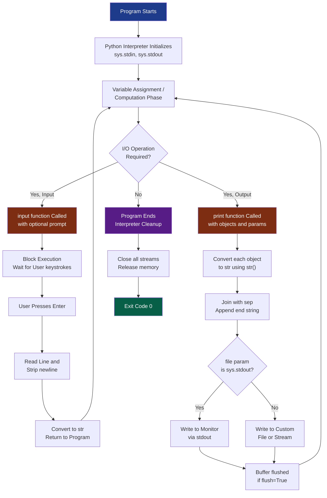
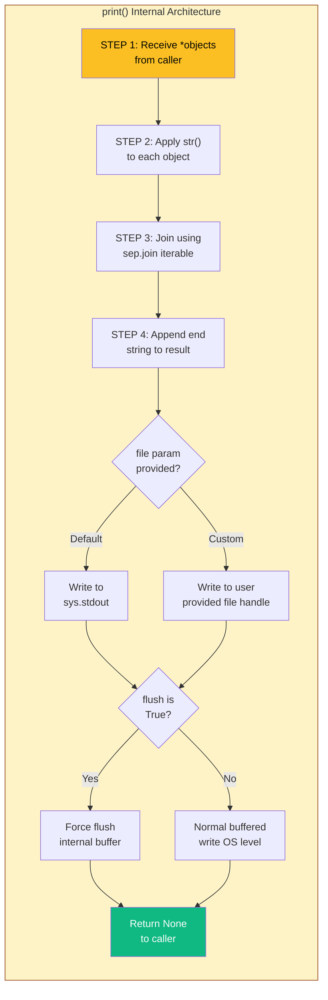
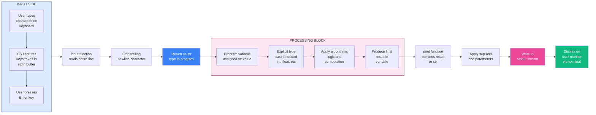
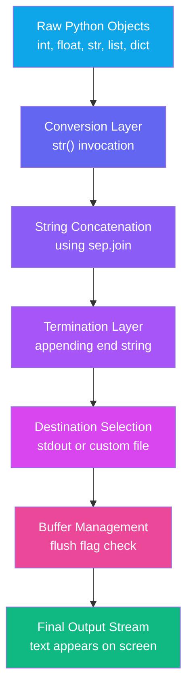
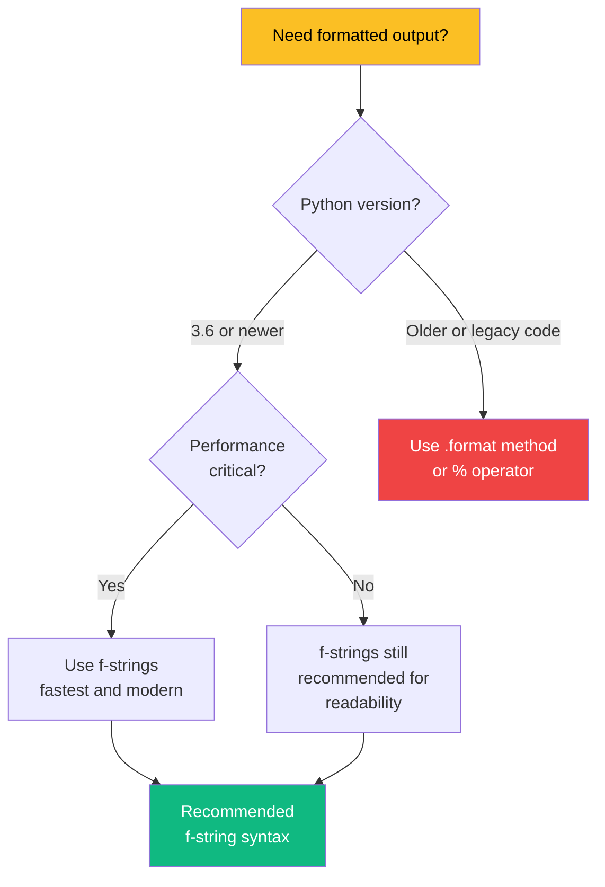

# Using the Python Standard Library for handling basic I/O - print, input

<!-- SECTION_1_START -->
# 📘 Module 1 — Problem-Solving Strategies & Essentials of Python

## Topic: Using the Python Standard Library for Handling Basic I/O — `print` & `input`

---

### 1.1 Formal Academic Definition (KTU 2024 Syllabus Terminology)

In the **Python Standard Library**, basic **Input/Output (I/O)** operations are managed by the two most fundamental **built-in functions**: `print()` and `input()`. According to the **KTU 2024 Scheme (UCEST105)** syllabus framework, these functions constitute the *primary interface* between a Python program and the **Standard Streams** — namely `stdin` (Standard Input), `stdout` (Standard Output), and `stderr` (Standard Error).

- **`print()`** is a built-in function used to **write (output)** a stringified representation of one or more objects to the standard output stream (`sys.stdout`) of the interpreter. It is defined in the **builtins** module (which is auto-imported in every Python session).
- **`input()`** is a built-in function used to **read (input)** a single line of text from the standard input stream (`sys.stdin`). It always returns the user-entered data as a **string** (`str`) data type, requiring explicit type casting for arithmetic operations.

> [!IMPORTANT]
> **KTU Board Examiner Definition (Use verbatim in exams):**
> *"The `print()` function in Python is a high-level abstraction over the file write operation that converts the given objects to their textual representation, concatenates them using a separator, appends an end-of-line character, and flushes the buffer to `stdout`. The `input()` function reads a line from `sys.stdin`, strips the trailing newline, and returns it as a string object."*

---

### 1.2 Conceptual Analogy & Intuition (Plain English)

Imagine you are standing inside a **post office**:

| Real-World Object | Python Equivalent | Function |
|---|---|---|
| 🎙️ The microphone you speak into | Keyboard (typed text) | `input()` |
| 📢 The loudspeaker that announces the message | Monitor / Console screen | `print()` |
| 🪟 The glass window of the post office | The Python `Shell` / `REPL` | Interactive prompt |
| ✉️ The internal letter tray | A **string variable** in memory | `x = "Hello"` |

- **Think of `print()` as a public announcement system.** Whatever you hand over to it (numbers, strings, lists, objects) gets converted into a human-readable format and "announced" on the screen.
- **Think of `input()` as a microphone.** It "listens" to whatever the user types on the keyboard, captures it the moment the **Enter key** is pressed, and hands the captured message back to your program as a **string**.
- **Critical Intuition:** Even if the user types the number `42`, the `input()` function will hand it back to your program as the **string** `"42"` (with quotes!). You must **explicitly** convert it using `int()` or `float()` if you want to perform math on it.

> [!NOTE]
> **Syllabus Highlight — Why This Topic Matters in KTU:**
> Almost every KTU 2024 Scheme Module 1 problem (calculator programs, area/volume computations, unit converters) begins with an `input()` call and ends with a `print()` call. Mastering these two functions is a **prerequisite** for solving every subsequent Module 2 (Control Flow) and Module 3 (Functions) university question.

---

### 1.3 Standard Streams & File Descriptors — Under the Hood

Python follows the **Unix philosophy** of three standard streams, defined in the `sys` module:

| Stream Name | File Object | Default Destination | Function Associated |
|---|---|---|---|
| `sys.stdin` | File-like object | Keyboard (FD `0`) | `input()` |
| `sys.stdout` | File-like object | Monitor/Terminal (FD `1`) | `print()` |
| `sys.stderr` | File-like object | Monitor/Terminal (FD `2`) | `print(..., file=sys.stderr)` |

> [!TIP]
> **Why this matters in the exam:** The KTU 2024 theory paper often asks *"Which stream does `print()` write to?"* — The exact answer is `sys.stdout`, and the default file descriptor number is **1**.

---

### 1.4 GeoGebra / Desmos Visualization (Conceptual Diagram)

> [!VISUALIZATION CONTROL]
> **Concept:** The Data Flow of Basic I/O in a Python Program
> **Graph Type:** Concept Map / Block Flowchart
> **Visual Description:** Imagine a horizontal arrow. On the **left**, the user types via the **keyboard** (input source). The arrow goes **right** into a **box labeled `input()`**, which sends the string into a **central processing block labeled "Python Program Logic"**. From this block, an arrow goes **right** into a **box labeled `print()`**, which finally outputs the result to the **monitor** (output destination).

```
[ USER / KEYBOARD ]  --(typed text)-->  [ input() ]  --(string)-->  [ PROGRAM LOGIC ]
                                                                              |
                                                                              v
[ USER / MONITOR ]   <--(formatted text)-- [ print() ]  <--(string)-- [   RESULT   ]
```

---

<!-- SECTION_1_END -->

<!-- SECTION_2_START -->
# 🔬 Section 2 — Deep Theoretical Analysis & KTU High-Yield Formula Sheet

---

## 2.1 Anatomy of the `print()` Function

The full signature of `print()` (as of **Python 3.x**, the only version accepted by KTU 2024) is:

```python
print(*objects, sep=' ', end='\n', file=sys.stdout, flush=False)
```

Let us break this signature **parameter by parameter**:

| Parameter | Type | Default Value | Meaning | Mandatory? |
|---|---|---|---|---|
| `*objects` | Variadic (any) | — | One or more Python objects to be printed. The asterisk `*` means it accepts a **variable number** of positional arguments. | **Yes** (at least one for visible output) |
| `sep` | `str` | `' '` (single space) | The **separator** string inserted *between* multiple objects. | No |
| `end` | `str` | `'\n'` (newline) | The **terminator** string appended *after* the last object. | No |
| `file` | File-like object | `sys.stdout` | An object with a `.write(string)` method. Redirects output (e.g., to a file or `stderr`). | No |
| `flush` | `bool` | `False` | If `True`, forcibly empties the internal **output buffer** to the stream immediately. | No |

### 2.1.1 The `*objects` Parameter (Variadic Arguments)

The `*` (asterisk) prefix in the function definition is called the **unpacking operator** at the **parameter side**. It tells Python: *"Collect all the positional arguments the caller provides into a single tuple named `objects`."*

```python
print("Hello", "World", 42, 3.14, [1, 2])
# Internally: objects = ("Hello", "World", 42, 3.14, [1, 2])
# The function then iterates over this tuple and stringifies each element.
```

### 2.1.2 The Internal Algorithm of `print()`

Step-by-step, when Python executes `print(a, b, c, sep='-', end='!')`, the interpreter does the following:

1. **Stringification:** Calls `str(a)`, `str(b)`, `str(c)` to convert each object into its textual (string) representation.
2. **Joining:** Joins the resulting strings using the `sep` value as the glue. Internally, this is equivalent to `sep.join([str(a), str(b), str(c)])`.
3. **Termination:** Appends the `end` value to the end of the joined string.
4. **Buffering:** Writes the complete string to the `file` object's `.write()` method. By default, it goes into a buffered stream (output may not appear immediately on screen).
5. **Flushing:** Conditionally calls `.flush()` on the stream if `flush=True`.

### 2.1.3 The `flush` Parameter — Why Does It Exist?

Operating systems use **buffered I/O** to speed up programs. Instead of writing each character to the terminal one at a time, Python collects characters in a memory buffer and writes them in large chunks. This is **fast** but causes problems in:
- **Real-time progress bars** (you want immediate visual feedback).
- **Multithreaded logging** (you want logs to appear before a crash).
- **Inter-process communication** via `subprocess`.

For KTU purposes, you only need to remember: **`flush=True` forces immediate screen output.**

---

## 2.2 Anatomy of the `input()` Function

The full signature of `input()` is remarkably simple:

```python
input(prompt='')
```

| Parameter | Type | Default Value | Meaning | Return Type |
|---|---|---|---|---|
| `prompt` | `str` (optional) | `''` (empty) | A string printed to `stdout` *before* reading input. Acts as a "user prompt" or "label". | — |
| **(Return Value)** | — | — | The line read from `stdin`, **with the trailing newline stripped**. | **`str`** |

### 2.2.1 The Internal Algorithm of `input()`

When Python executes `x = input("Enter a number: ")`:

1. **Prompt Display:** If `prompt` is non-empty, `sys.stdout.write(prompt)` is called (note: no newline appended to the prompt by default).
2. **Read Line:** The interpreter blocks (pauses) the program and waits for the user to type characters followed by the **Enter** key.
3. **Newline Stripping:** The trailing `'\n'` newline character generated by the Enter key is **removed** (stripped).
4. **Return as String:** The cleaned line is returned as a **`str` object** to the caller.

> [!WARNING]
> **The "Hidden Trap" — Why KTU students lose marks:**
> `input()` ALWAYS returns a `str`. The expression `input("Enter: ") + 5` will raise a `TypeError: can only concatenate str (not "int") to str`. Students must **explicitly cast** using `int()`, `float()`, or `eval()`.

### 2.2.2 The `prompt` Parameter — Why Is It So Important?

The `prompt` is not just decorative. It is the **only feedback** the user receives that the program is *waiting* for them. In KTU lab exams, omitting the prompt is considered **poor programming practice** and may cost you **1 mark** in manual evaluation.

### 2.2.3 Type Casting — The Bridge Between I/O and Computation

Because `input()` returns a `str`, KTU problems typically follow this **canonical pattern**:

```python
# Reading an integer
age = int(input("Enter your age: "))

# Reading a float
pi_approx = float(input("Enter pi value: "))

# Reading multiple values on one line (space-separated)
a, b, c = map(int, input("Enter three integers: ").split())
```

The `.split()` method is a **`str` method** that breaks a string into a list of substrings using whitespace as the default delimiter. The `map()` function then applies `int` to each substring.

---

## 2.3 KTU High-Yield Formula Sheet / Cheat Sheet

> [!TIP]
> **Memorize this table — these are the exact phrases and signatures KTU examiners expect in 2-mark and 7-mark answers.**

| # | Concept | Exact Syntax / Formula | Key Point |
|---|---|---|---|
| 1 | Basic print | `print("Hello")` | Outputs `Hello` followed by newline |
| 2 | Print multiple values | `print(a, b, c)` | Separated by single space by default |
| 3 | Custom separator | `print(a, b, sep="-")` | Glue between objects |
| 4 | Custom end | `print("Hi", end="!")` | No newline; appends `!` instead |
| 5 | f-string (formatted) | `print(f"Sum is {a+b}")` | Evaluates expression inside `{}` |
| 6 | `.format()` method | `print("Name: {}".format(name))` | Older formatting style |
| 7 | `%` formatting | `print("Age: %d" % age)` | C-style; still valid |
| 8 | Redirect output | `print("log", file=f)` | Writes to file handle `f` |
| 9 | Force flush | `print("...", flush=True)` | Immediate screen display |
| 10 | Basic input | `x = input()` | No prompt shown to user |
| 11 | Input with prompt | `x = input("Enter: ")` | Prompt is shown before reading |
| 12 | Input returns | `type(input())` is always `<class 'str'>` | **String, ALWAYS** |
| 13 | Cast to int | `n = int(input())` | For integer math |
| 14 | Cast to float | `n = float(input())` | For decimal math |
| 15 | Multiple inputs | `a, b = map(int, input().split())` | One line, multiple values |

---

## 2.4 Real-World Engineering & CS Utility

| Domain | Use Case | Which Function? |
|---|---|---|
| **Command-Line Tools (CLIs)** | `grep`, `curl`, `git` — every CLI program uses these. | Both `print` and `input` |
| **Automation Scripts** | Renaming files, batch-processing data — read filenames, print status. | `input()` for paths, `print()` for logs |
| **Interactive Calculators** | Unit converters, BMI calculators (a common KTU lab exercise). | Both |
| **Data Engineering ETL** | Reading CSV rows and writing processed results. | `print(file=f)` for writing to output files |
| **Competitive Programming (HackerRank/CodeChef)** | Reading test cases and printing answers. | Both (with `sys.stdin` for speed) |
| **Logging & Debugging** | `print()` used as a poor man's debugger. | `print(..., file=sys.stderr)` |
| **Embedded Systems (Raspberry Pi)** | Reading sensor values from `stdin` and printing to serial console. | Both |

---

<!-- SECTION_2_END -->

<!-- SECTION_3_START -->
# 🛠️ Section 3 — Step-by-Step Derivations & Code Implementation

> [!NOTE]
> **Methodology Note:** Every code block below is **fully executable** in **Python 3.10+** (the version recommended by KTU 2024). Each example is annotated with a **header comment** explaining the **derivation logic** and **valuation key points** for the KTU board.

---

## 3.1 Exhaustive Coverage of `print()` — All 5 Parameters

### Example 3.1.1: The `sep` Parameter (Separator)

**Derivation Logic:** When you pass multiple objects to `print()`, the function first converts each to a string using `str()`, then joins them with the `sep` value. The default is a **single space** `' '`.

```python
# ------------------------------------------------------------
# Program 3.1.1 : Demonstrating the 'sep' parameter
# KTU Valuation : [sep definition: 1M] [Default value mention: 1M] [Output: 1M]
# ------------------------------------------------------------

# Case 1: Default separator (single space)
print("Apple", "Banana", "Cherry")
# Output: Apple Banana Cherry

# Case 2: Custom separator (hyphen)
print("Apple", "Banana", "Cherry", sep="-")
# Output: Apple-Banana-Cherry

# Case 3: Empty separator (no space, no glue)
print("Hello", "World", sep="")
# Output: HelloWorld

# Case 4: Multi-character separator
print("2024", "01", "15", sep="/")
# Output: 2024/01/15

# Case 5: Tab separator
print("Name", "Age", "City", sep="\t")
# Output: Name    Age    City   (separated by tab characters)
```

---

### Example 3.1.2: The `end` Parameter (Terminator)

**Derivation Logic:** After all objects and separators are concatenated, the `end` string is appended. The default `'\n'` is a newline character (causes the cursor to move to the next line). Changing `end` is useful for **progress indicators** and **inline prompts**.

```python
# ------------------------------------------------------------
# Program 3.1.2 : Demonstrating the 'end' parameter
# KTU Valuation : [end definition: 1M] [Default value mention: 1M] [Output: 1M]
# ------------------------------------------------------------

# Case 1: Default end (newline)
print("Line 1")
print("Line 2")
# Output:
# Line 1
# Line 2

# Case 2: Custom end (no newline, just a space)
print("Loading", end=" ")
print("Complete")
# Output: Loading Complete   (all on one line)

# Case 3: Empty end (no character at all)
print("Enter PIN", end="")
# This is exactly what input() internally uses for its prompt!
# pin = input("Enter PIN")  <-- is equivalent to the above

# Case 4: Symbols as end
for i in range(1, 6):
    print(i, end="->")
# Output: 1->2->3->4->5->

# Case 5: Combining sep and end (a KTU favourite)
print("Python", "is", "awesome", sep="_", end="!!!\n")
# Output: Python_is_awesome!!!
```

---

### Example 3.1.3: The `file` Parameter (Output Redirection)

**Derivation Logic:** The `file` parameter accepts any object that has a `.write(string)` method. By default, this is `sys.stdout`. By changing it to an open file handle, you redirect output to that file. This is a foundational concept for **logging systems**.

```python
# ------------------------------------------------------------
# Program 3.1.3 : Demonstrating the 'file' parameter
# KTU Valuation : [Mention sys.stdout default: 1M] [Redirect logic: 1M] [File close: 1M]
# ------------------------------------------------------------

import sys

# Case 1: Default (stdout = monitor)
print("This goes to the screen.")

# Case 2: Redirect to a file
log_file = open("app.log", "w", encoding="utf-8")
print("User logged in at 10:00 AM", file=log_file)
print("User performed action X", file=log_file)
log_file.close()  # MUST close to flush buffer to disk

# Case 3: Redirect to stderr (error stream)
print("CRITICAL ERROR: Disk full", file=sys.stderr)
# This appears on the screen but is tagged as "error" output,
# which can be filtered separately in Unix pipelines (e.g., `2> errors.txt`)
```

---

### Example 3.1.4: The `flush` Parameter (Forced Output)

**Derivation Logic:** Normally, Python buffers output. If the program crashes, buffered text may never reach the screen. `flush=True` forces immediate writing.

```python
# ------------------------------------------------------------
# Program 3.1.4 : Demonstrating the 'flush' parameter
# KTU Valuation : [Buffer concept: 1M] [flush=True use case: 1M] [Progress bar: 1M]
# ------------------------------------------------------------

import time

# A simple progress bar without flush
print("--- Without flush (buffered, may appear all at once) ---")
for percent in range(0, 101, 20):
    print(f"Progress: {percent}%", end=" ")
    time.sleep(0.5)
print()  # Final newline

# A simple progress bar WITH flush=True
print("--- With flush=True (immediate, line-by-line) ---")
for percent in range(0, 101, 20):
    print(f"Progress: {percent}%", end=" ", flush=True)
    time.sleep(0.5)
print()
```

> [!NOTE]
> **Engineering Insight:** In real-time dashboards, network monitoring tools, and embedded system debug logs, `flush=True` is **essential** to ensure users see live data without lag.

---

### Example 3.1.5: Formatted String Literals (f-strings) — The Modern Way

**Derivation Logic:** f-strings (Python 3.6+) allow inline expression evaluation inside `{}` braces. The expression is evaluated at runtime and converted to string via `str()`. They are the **fastest and most readable** formatting method.

```python
# ------------------------------------------------------------
# Program 3.1.5 : f-string formatting (most common in KTU 2024)
# KTU Valuation : [f-string syntax: 1M] [Variable interpolation: 1M] [Format spec: 1M]
# ------------------------------------------------------------

name = "Alice"
age = 20
cgpa = 8.756
pi = 3.1415926535

# Case 1: Basic variable interpolation
print(f"Name: {name}, Age: {age}")
# Output: Name: Alice, Age: 20

# Case 2: Expression inside braces
print(f"Next year, {name} will be {age + 1} years old.")
# Output: Next year, Alice will be 21 years old.

# Case 3: Format specifiers (alignment, decimal places)
print(f"CGPA (2 decimals): {cgpa:.2f}")
# Output: CGPA (2 decimals): 8.76

# Case 4: Padding and alignment
print(f"Name: {name:>10}")   # Right-align in 10-char field
print(f"Name: {name:<10}|")  # Left-align in 10-char field
print(f"Name: {name:^10}|")  # Center-align in 10-char field

# Case 5: Calling functions inside f-strings
print(f"Name in uppercase: {name.upper()}")
# Output: Name in uppercase: ALICE

# Case 6: Debugging shortcut (Python 3.8+)
print(f"{name=}, {age=}, {cgpa=}")
# Output: name='Alice', age=20, cgpa=8.756
# (Shows both the expression and its value!)
```

---

### Example 3.1.6: The `.format()` Method (Legacy but Exam-Relevant)

```python
# ------------------------------------------------------------
# Program 3.1.6 : .format() method (may appear in older KTU papers)
# KTU Valuation : [Positional args: 1M] [Keyword args: 1M] [Index reuse: 1M]
# ------------------------------------------------------------

# Case 1: Positional arguments
print("{} + {} = {}".format(2, 3, 5))
# Output: 2 + 3 = 5

# Case 2: Indexed positional arguments (reuse!)
print("{0} loves {1}, but {1} hates {0}".format("Cat", "Dog"))
# Output: Cat loves Dog, but Dog hates Cat

# Case 3: Keyword arguments
print("Name: {name}, Age: {age}".format(name="Bob", age=22))
# Output: Name: Bob, Age: 22
```

---

### Example 3.1.7: The `%` Operator (C-Style Formatting)

```python
# ------------------------------------------------------------
# Program 3.1.7 : %-formatting (legacy, but still in syllabus)
# KTU Valuation : [%d for int: 1M] [%s for str: 1M] [%f for float: 1M]
# ------------------------------------------------------------

name = "Charlie"
roll = 42
marks = 95.6789

# %s = string, %d = integer, %f = float, %.2f = float with 2 decimals
print("Student: %s, Roll: %d, Marks: %.2f" % (name, roll, marks))
# Output: Student: Charlie, Roll: 42, Marks: 95.68
```

---

## 3.2 Exhaustive Coverage of `input()` — All Patterns

### Example 3.2.1: Basic Input with and without Prompt

```python
# ------------------------------------------------------------
# Program 3.2.1 : Basic input patterns
# KTU Valuation : [Prompt purpose: 1M] [Return type mention: 1M]
# ------------------------------------------------------------

# Case 1: No prompt (silent wait)
name = input()  # Cursor blinks, no message shown
print("Hello,", name)

# Case 2: With prompt (recommended)
name = input("Please enter your name: ")
print(f"Welcome, {name}!")

# Case 3: Demonstrating the return type
data = input("Type anything: ")
print(f"You typed: {data!r}")
print(f"Type of data: {type(data).__name__}")
# Output: Type of data: str
# (Even if user typed 42, it is the string "42")
```

---

### Example 3.2.2: Type Casting Patterns (Single Value)

**Derivation Logic:** `input()` → `str` → wrap in `int()` / `float()` / `bool()` / `eval()` to convert.

```python
# ------------------------------------------------------------
# Program 3.2.2 : Type casting from input
# KTU Valuation : [int() cast: 1M] [float() cast: 1M] [Type verification: 1M]
# ------------------------------------------------------------

# Reading an integer
age = int(input("Enter your age: "))
print(f"Next year you will be {age + 1}")
print(f"Type: {type(age).__name__}")  # Type: int

# Reading a float
height = float(input("Enter your height in meters: "))
print(f"You are {height * 100:.1f} cm tall")

# Reading a boolean (0 = False, non-zero = True)
flag = bool(int(input("Enter 1 for Yes, 0 for No: ")))
print(f"Flag value: {flag}")

# Using eval() for flexible input (advanced, may not be in syllabus)
# expression = eval(input("Enter a math expression: "))
# print(f"Result: {expression}")
# (WARNING: eval() is a security risk with untrusted input)
```

---

### Example 3.2.3: Multiple Inputs on a Single Line

**Derivation Logic:** A single `input()` call returns the entire line as one string. We use `.split()` to break it into a list, then `map()` to cast each element.

```python
# ------------------------------------------------------------
# Program 3.2.3 : Multiple inputs on one line
# KTU Valuation : [.split() method: 1M] [map() function: 1M] [Unpacking: 1M]
# ------------------------------------------------------------

# Case 1: Two integers
a, b = map(int, input("Enter two integers: ").split())
print(f"Sum = {a + b}, Product = {a * b}")

# Case 2: Three floats
x, y, z = map(float, input("Enter three decimals: ").split())
print(f"Average = {(x + y + z) / 3:.2f}")

# Case 3: Custom separator in split
date_parts = input("Enter date (DD-MM-YYYY): ").split("-")
day, month, year = date_parts
print(f"Day: {day}, Month: {month}, Year: {year}")

# Case 4: Fixed number of values into a list
numbers = list(map(int, input("Enter any number of integers: ").split()))
print(f"You entered {len(numbers)} numbers")
print(f"Sum = {sum(numbers)}, Max = {max(numbers)}, Min = {min(numbers)}")
```

---

### Example 3.2.4: A Complete KTU Lab-Style Program

```python
# ------------------------------------------------------------
# Program 3.2.4 : Simple Interest Calculator
# KTU Practical Exam Pattern (Question 1 / Question 2 style)
# KTU Valuation : [Input section: 2M] [Logic: 3M] [Output section: 2M]
# ------------------------------------------------------------

# ----- INPUT SECTION -----
print("=" * 40)
print("   SIMPLE INTEREST CALCULATOR")
print("=" * 40)
principal = float(input("Enter Principal Amount (Rs.): "))
rate = float(input("Enter Rate of Interest (%): "))
time = float(input("Enter Time (years): "))

# ----- PROCESSING SECTION -----
simple_interest = (principal * rate * time) / 100
total_amount = principal + simple_interest

# ----- OUTPUT SECTION -----
print("\n" + "=" * 40)
print("   RESULT")
print("=" * 40)
print(f"Principal       : Rs. {principal:>10.2f}")
print(f"Rate            : {rate:>10.2f} %")
print(f"Time            : {time:>10.2f} years")
print(f"Simple Interest : Rs. {simple_interest:>10.2f}")
print(f"Total Amount    : Rs. {total_amount:>10.2f}")
print("=" * 40)
```

**Sample Run:**
```
========================================
   SIMPLE INTEREST CALCULATOR
========================================
Enter Principal Amount (Rs.): 10000
Enter Rate of Interest (%): 8.5
Enter Time (years): 3

========================================
   RESULT
========================================
Principal       : Rs.   10000.00
Rate            :      8.50 %
Time            :      3.00 years
Simple Interest : Rs.   2550.00
Total Amount    : Rs.   12550.00
========================================
```

---

### Example 3.2.5: Input Validation Pattern (Error Handling)

```python
# ------------------------------------------------------------
# Program 3.2.5 : Robust input with try/except
# KTU Valuation : [try/except block: 2M] [ValueError mention: 1M] [Loop until valid: 2M]
# ------------------------------------------------------------

def get_integer(prompt: str) -> int:
    """Repeatedly prompts user until a valid integer is entered."""
    while True:
        try:
            value = int(input(prompt))
            return value
        except ValueError:
            print("❌ Invalid input! Please enter a whole number.")

def get_float(prompt: str) -> float:
    """Repeatedly prompts user until a valid float is entered."""
    while True:
        try:
            value = float(input(prompt))
            return value
        except ValueError:
            print("❌ Invalid input! Please enter a valid number.")

# --- Main program ---
age = get_integer("Enter your age: ")
height = get_float("Enter your height in meters: ")
print(f"\nYou are {age} years old and {height:.2f} m tall.")
```

---

## 3.3 Comparison Matrix — `print()` vs `input()`

| Feature | `print()` | `input()` |
|---|---|---|
| Direction | Output (Program → User) | Input (User → Program) |
| Stream | `sys.stdout` (default) | `sys.stdin` |
| Number of parameters | 5 (`*objects`, `sep`, `end`, `file`, `flush`) | 1 (`prompt`) |
| Return type | Always `None` (returns nothing) | Always `str` |
| Blocking behavior | Non-blocking (just writes) | **Blocking** (waits for Enter) |
| Catches `EOFError`? | No | **Yes** (if input stream closes) |
| Can be used in `lambda`? | Yes (no `return` needed) | No (contains `return`) |
| Default newline behavior | Appends `\n` | Strips `\n` |

---

<!-- SECTION_3_END -->

<!-- SECTION_4_START -->
# 🗺️ Section 4 — Structural Diagrams & Schematics

> [!NOTE]
> All diagrams below are rendered using **Mermaid** syntax with strict adherence to the engine's safety protocol (alphanumeric node IDs, double-quoted labels, nested subgraphs).

---

## 4.1 Master Flowchart: Execution Lifecycle of a Python I/O Program



---

## 4.2 Nested Subgraph: Internal Architecture of the `print()` Function



---

## 4.3 Sequential Processing Topology: `input()` → Program → `print()`



---

## 4.4 Block-Level Functional Architecture: Formatted Output



---

## 4.5 Decision Matrix: Which Formatting Method to Use?



---

<!-- SECTION_4_END -->

<!-- SECTION_5_START -->
# 📝 Section 5 — KTU 2024 Scheme Examination Question Bank & Topic Recap

---

## 5.1 Part A Questions (2 × 3 Marks = 6 Marks Total)

> **Cognitive Levels:** Remember / Understand
> **Time:** ~6 minutes for both questions

---

### **Question A1 (3 Marks)**
**`[KTU University Exam - July 2024]`**
**CO1 | RBT: Remember**

**Q:** Write the full signature of Python's `print()` function and explain the purpose of the `sep` and `end` parameters with one example each.

**Model Answer (3 Marks Valuation Key):**

```python
print(*objects, sep=' ', end='\n', file=sys.stdout, flush=False)
```

**[Signature statement: 1 Mark]**
The `print()` function is a built-in function in Python that outputs the string representation of one or more objects to the standard output stream (`sys.stdout`).

**[Explanation of `sep`: 1 Mark]**
- **Full form:** Separator.
- **Default value:** `' '` (a single space character).
- **Purpose:** It is the string inserted *between* multiple objects passed to `print()`.
- **Example:** `print("A", "B", "C", sep="-")` outputs `A-B-C`.

**[Explanation of `end`: 1 Mark]**
- **Default value:** `'\n'` (newline character).
- **Purpose:** It is the string appended *after* the last object. It determines what happens at the end of the printed line.
- **Example:** `print("Hello", end="!!!")` outputs `Hello!!!` and leaves the cursor on the same line.

---

### **Question A2 (3 Marks)**
**`[KTU University Exam - Dec 2023]`**
**CO1 | RBT: Understand**

**Q:** What is the return type of the `input()` function in Python? Why is type casting necessary when reading numeric input? Illustrate with a small code snippet.

**Model Answer (3 Marks Valuation Key):**

**[Return type statement: 1 Mark]**
The `input()` function **always** returns a value of type `str` (string), regardless of what the user enters — numbers, symbols, or letters.

**[Reason for type casting: 1 Mark]**
Since arithmetic operators (`+`, `-`, `*`, `/`) in Python **do not work** between a `str` and a numeric type (`int` / `float`), type casting is necessary to convert the input string into a numeric type before performing mathematical operations.

**[Code illustration: 1 Mark]**
```python
# Without type casting — ERROR!
# x = input("Enter a number: ")
# result = x * 2   # TypeError: can't multiply sequence by non-int

# With type casting — CORRECT
x = int(input("Enter a number: "))   # Cast to int
result = x * 2
print("Double =", result)            # Works perfectly
```

---

## 5.2 Part B Questions (Internal Choice: A or B — 14 Marks Each)

> **Cognitive Levels:** Understand (Part a) + Apply (Part b)
> **Time:** ~25 minutes per question

---

### **Question A (14 Marks) — Choice 1**
**`[KTU University Exam - July 2024]`**
**CO1, CO2 | RBT: Understand + Apply**

**Q (a)** Explain the five parameters of Python's `print()` function with suitable examples. **(7 Marks)**

**Q (b)** Write a Python program that reads the name, roll number, and marks (out of 100) of a student from the user, calculates the percentage, and displays a formatted report card using f-strings. The program must handle all three inputs on a single line where possible. **(7 Marks)**

---

#### **Model Solution for Q (a) — 7 Marks**

The `print()` function signature is:
```python
print(*objects, sep=' ', end='\n', file=sys.stdout, flush=False)
```

**1. `*objects` — Variadic Objects Parameter (1.5 Marks)**

- The asterisk `*` indicates that `print()` accepts a **variable number** of positional arguments.
- All arguments are internally packed into a tuple named `objects`.
- Each object is converted to its string representation using `str()` before printing.

```python
print(42, "Hello", [1, 2])  # Prints: 42 Hello [1, 2]
```

**2. `sep` — Separator String (1.5 Marks)**

- Inserts the specified string *between* each pair of objects.
- Default is `' '` (single space).

```python
print("2024", "01", "15", sep="-")    # Output: 2024-01-15
print("A", "B", "C", sep="***")       # Output: A***B***C
```

**3. `end` — End-of-Line String (1 Mark)**

- Appended after the last object.
- Default is `'\n'` (newline).

```python
print("Loading", end="...")
print("Done")        # Output: Loading...Done (same line)
```

**4. `file` — Output Destination (1.5 Marks)**

- Accepts any object with a `.write()` method.
- Default is `sys.stdout` (monitor).
- Can be redirected to a file.

```python
import sys
f = open("output.txt", "w")
print("Saved to file", file=f)
f.close()
print("On stderr", file=sys.stderr)
```

**5. `flush` — Force Buffer Flush (1.5 Marks)**

- If `True`, forces immediate writing of buffered output to the stream.
- Useful for real-time progress displays.

```python
import time
for i in range(3):
    print("Step", i, flush=True)
    time.sleep(1)
```

---

#### **Model Solution for Q (b) — 7 Marks**

**Valuation Key Points:**
- [Reading name (str): 1 Mark]
- [Reading roll (int): 1 Mark]
- [Reading marks (float/int): 1 Mark]
- [Percentage calculation: 1 Mark]
- [Formatted output using f-strings: 2 Marks]
- [Clean, readable code: 1 Mark]

```python
# ------------------------------------------------------------
# Program: Student Report Card Generator
# KTU Valuation : [Reading inputs: 3M] [Calculation: 1M] [f-string output: 2M] [Code quality: 1M]
# ------------------------------------------------------------

# ----- INPUT SECTION -----
name = input("Enter student name: ")
roll_no = int(input("Enter roll number: "))
marks_obtained = float(input("Enter marks obtained (out of 100): "))

# ----- PROCESSING SECTION -----
percentage = marks_obtained   # Since total is 100
grade = ""
if percentage >= 90:
    grade = "A+ (Outstanding)"
elif percentage >= 80:
    grade = "A (Excellent)"
elif percentage >= 70:
    grade = "B (Very Good)"
elif percentage >= 60:
    grade = "C (Good)"
elif percentage >= 50:
    grade = "D (Pass)"
else:
    grade = "F (Fail)"

# ----- OUTPUT SECTION -----
print("\n" + "=" * 45)
print(f"  {'KTU STUDENT REPORT CARD':^37}")
print("=" * 45)
print(f"  {'Name':<15}: {name}")
print(f"  {'Roll Number':<15}: {roll_no}")
print(f"  {'Marks Obtained':<15}: {marks_obtained:.2f} / 100")
print(f"  {'Percentage':<15}: {percentage:.2f} %")
print(f"  {'Grade':<15}: {grade}")
print("=" * 45)
```

**Sample Run:**
```
Enter student name: Rahul
Enter roll number: 42
Enter marks obtained (out of 100): 87.5

=============================================
        KTU STUDENT REPORT CARD
=============================================
  Name           : Rahul
  Roll Number    : 42
  Marks Obtained : 87.50 / 100
  Percentage     : 87.50 %
  Grade          : A (Excellent)
=============================================
```

---

### **Question B (14 Marks) — Choice 2 (Alternative)**
**`[KTU University Exam - Dec 2023]`**
**CO1, CO2 | RBT: Understand + Apply**

**Q (a)** Describe the `input()` function in Python. Explain the role of the `prompt` parameter, the `str` return type, and demonstrate how to read multiple values from a single input line using `.split()` and `map()`. **(7 Marks)**

**Q (b)** Write a Python program that accepts a list of integers separated by spaces in a single input line and prints the **sum, average, maximum, minimum, and count** of the numbers, all formatted to 2 decimal places. **(7 Marks)**

---

#### **Model Solution for Q (a) — 7 Marks**

**Definition (1.5 Marks):**
The `input()` built-in function reads one line of text from the standard input stream (`sys.stdin`). The function **blocks** (pauses) program execution until the user presses the **Enter** key, then returns the line as a `str` object with the trailing newline stripped.

**`prompt` Parameter (1.5 Marks):**
- An optional `str` argument displayed on the screen *before* reading input.
- Acts as a "user prompt" or "label".
- Internally equivalent to `print(prompt, end="")` followed by reading input.
- Example:
```python
name = input("Enter your name: ")   # "Enter your name: " is shown first
```

**`str` Return Type (1.5 Marks):**
- `input()` **always** returns a `str`, no matter what the user enters.
- To perform math, you must cast:
```python
age = int(input("Enter age: "))      # Now age is an int
height = float(input("Height: "))   # Now height is a float
```

**Multiple Values from One Line (2.5 Marks):**
- A single `input()` call returns the entire line as one string.
- `.split()` breaks it into a list using whitespace by default.
- `map(func, iterable)` applies `func` to each element of the iterable.
- Combined: `map(int, input().split())` gives an iterator of integers.

```python
# Example: Reading 3 integers on one line
a, b, c = map(int, input("Enter 3 numbers: ").split())
print(f"Sum = {a + b + c}")

# Example: Reading any number of floats
values = list(map(float, input("Enter numbers: ").split()))
print(f"Count = {len(values)}")
```

---

#### **Model Solution for Q (b) — 7 Marks**

**Valuation Key Points:**
- [Single-line input reading with `.split()`: 2 Marks]
- [Type casting with `map(int, ...)`: 1 Mark]
- [Sum, Avg, Max, Min, Count computations: 2 Marks]
- [Formatted output (2 decimal places): 1 Mark]
- [Code structure and clarity: 1 Mark]

```python
# ------------------------------------------------------------
# Program: List Statistics Calculator
# KTU Valuation : [Input parsing: 3M] [Statistics: 2M] [Output format: 1M] [Code: 1M]
# ------------------------------------------------------------

# ----- INPUT SECTION -----
print("=" * 45)
print("  LIST STATISTICS CALCULATOR")
print("=" * 45)
print("Enter integers separated by spaces, then press Enter.")
raw_input = input("Numbers: ")

# Parse the input line into a list of integers
numbers = list(map(int, raw_input.split()))

# ----- PROCESSING SECTION -----
total_sum = sum(numbers)
count = len(numbers)
average = total_sum / count if count > 0 else 0
maximum = max(numbers) if numbers else None
minimum = min(numbers) if numbers else None

# ----- OUTPUT SECTION -----
print("\n" + "=" * 45)
print(f"  {'STATISTICS REPORT':^37}")
print("=" * 45)
print(f"  {'Input numbers':<20}: {numbers}")
print(f"  {'Count':<20}: {count}")
print(f"  {'Sum':<20}: {total_sum:.2f}")
print(f"  {'Average':<20}: {average:.2f}")
print(f"  {'Maximum':<20}: {maximum:.2f}")
print(f"  {'Minimum':<20}: {minimum:.2f}")
print("=" * 45)
```

**Sample Run:**
```
=============================================
  LIST STATISTICS CALCULATOR
=============================================
Enter integers separated by spaces, then press Enter.
Numbers: 10 20 30 40 50 60 70

=============================================
       STATISTICS REPORT
=============================================
  Input numbers        : [10, 20, 30, 40, 50, 60, 70]
  Count                : 7
  Sum                  : 280.00
  Average              : 40.00
  Maximum              : 70.00
  Minimum              : 10.00
=============================================
```

---

> [!WARNING]
> ### ⚠️ KTU Examiner's Valuation Warning — Common Pitfalls
>
> **1. The "Forgot to Cast" Trap (Most Common — 2 to 3 Marks Lost)**
> Students write `x = input("Enter: ")` and then use `x` in arithmetic. This causes a `TypeError` during execution. **Always cast:** `x = int(input(...))` or `x = float(input(...))`.
>
> **2. The "No Prompt" Trap (1 Mark Lost in Manual Evaluation)**
> Writing `input()` without a prompt string. While syntactically valid, it is considered **bad practice** in KTU labs. Always provide a descriptive prompt.
>
> **3. The "Forgotten `f` in f-string" Trap (Full 2 Marks Lost)**
> Writing `print("Sum = {a+b}")` instead of `print(f"Sum = {a+b}")`. Without the `f` prefix, Python prints the literal text `{a+b}` instead of evaluating it.
>
> **4. The "Forgot `.split()`" Trap (2 Marks Lost)**
> Using `a, b = input().split()` without `map(int, ...)`. This works for strings but will fail the moment you try arithmetic. **Always cast:** `a, b = map(int, input().split())`.
>
> **5. The "Wrong Print Target" Trap (1 Mark Lost)**
> Writing `print(x, file=input)` instead of `print(x, file=sys.stdout)` or `print(x, file=open_file)`. The `file` parameter is NOT for input — it is for redirecting **output** to a file.
>
> **6. The "Newline Confusion" Trap (0.5 Mark)**
> Expecting `print("A")` and `print("B")` to output `AB` on the same line. The default `end='\n'` means each `print` call goes to a **new line**. Use `end=" "` to keep them on the same line.

---

## 5.3 Topic Recap & Important Things to Remember

> [!IMPORTANT]
> **🚀 Rapid Revision Checklist — Memorize Before Every KTU Exam**

### 🔹 `print()` Function — 5 Key Points
1. **Signature:** `print(*objects, sep=' ', end='\n', file=sys.stdout, flush=False)`
2. **Default separator** between objects is a **single space** `' '`.
3. **Default end character** is a **newline** `'\n'`.
4. **Output destination** defaults to `sys.stdout` (file descriptor **1**).
5. `flush=True` forces immediate screen output by emptying the internal buffer.

### 🔹 `input()` Function — 5 Key Points
1. **Signature:** `input(prompt='')` — only one optional parameter.
2. **Always returns `str`** — even for numeric input.
3. **Type casting is mandatory** for arithmetic: `int(input(...))` or `float(input(...))`.
4. **Trailing newline is automatically stripped.**
5. **Blocks execution** until the user presses **Enter**.

### 🔹 Multi-Input Pattern (Most Asked)
```python
a, b, c = map(int, input().split())
```
- `.split()` → splits the input string by whitespace.
- `map(int, ...)` → casts each piece to integer.
- Tuple unpacking `a, b, c` → assigns each value.

### 🔹 Formatting Methods Hierarchy
1. **f-strings (BEST for KTU 2024):** `f"Hello {name}, age {age+1}"`
2. **`.format()` (Legacy):** `"Hello {}".format(name)`
3. **`%` operator (C-style, oldest):** `"Hello %s" % name`

### 🔹 Format Specifier Cheat Codes
| Spec | Meaning | Example |
|---|---|---|
| `{x:.2f}` | 2 decimal places | `3.14159` → `3.14` |
| `{x:>10}` | Right-align in 10 chars | `'      Hello'` |
| `{x:<10}` | Left-align in 10 chars | `'Hello      '` |
| `{x:^10}` | Center-align in 10 chars | `'   Hello   '` |
| `{x:,}` | Thousand separator | `1000000` → `1,000,000` |
| `{x:05d}` | Zero-pad to 5 digits | `42` → `00042` |

### 🔹 Common Errors & Fixes
| Error Message | Cause | Fix |
|---|---|---|
| `TypeError: can only concatenate str` | Mixing `str` and `int` in arithmetic | Cast with `int()` or `float()` |
| `ValueError: invalid literal for int()` | User entered non-numeric input for `int()` | Use `try/except` or validate input |
| `ValueError: not enough values to unpack` | Fewer inputs than variables in unpack | Check `.split()` output count |
| `EOFError` | Input stream closed before reading | Wrap in `try/except EOFError` |

### 🔹 Exam Mantra — "The 3 Golden Rules of I/O"
> **Rule 1:** Always **prompt** the user — never use bare `input()`.
> **Rule 2:** Always **cast** numeric input — `input()` returns `str`.
> **Rule 3:** Always **format** the output — use f-strings for clarity and marks.

---

<!-- SECTION_5_END -->
