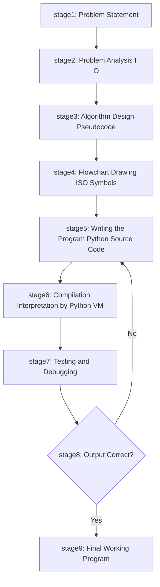
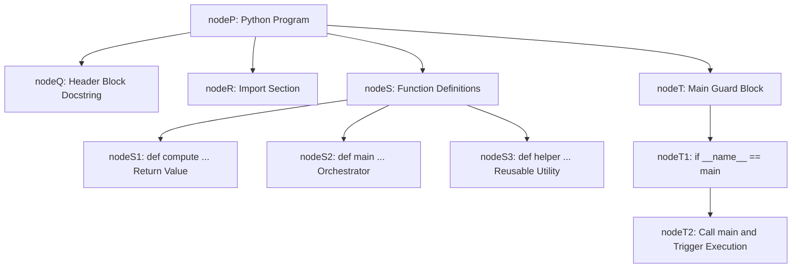
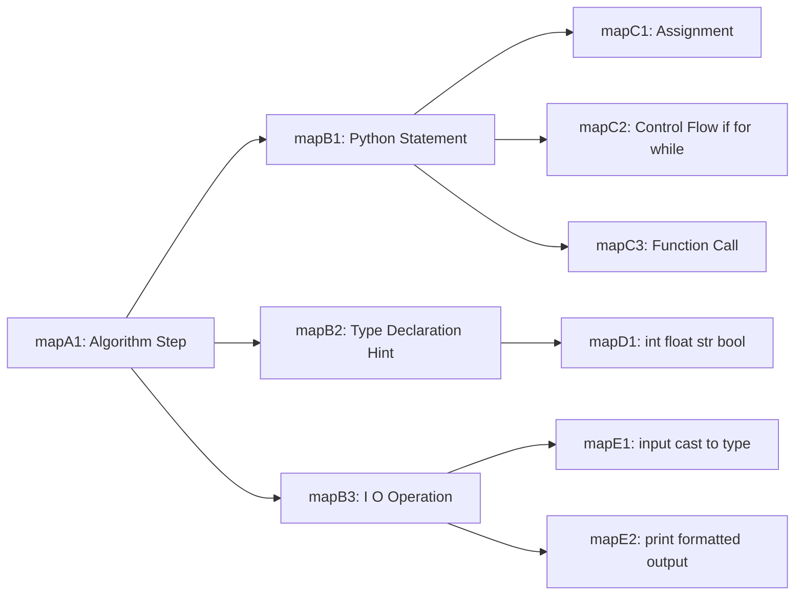
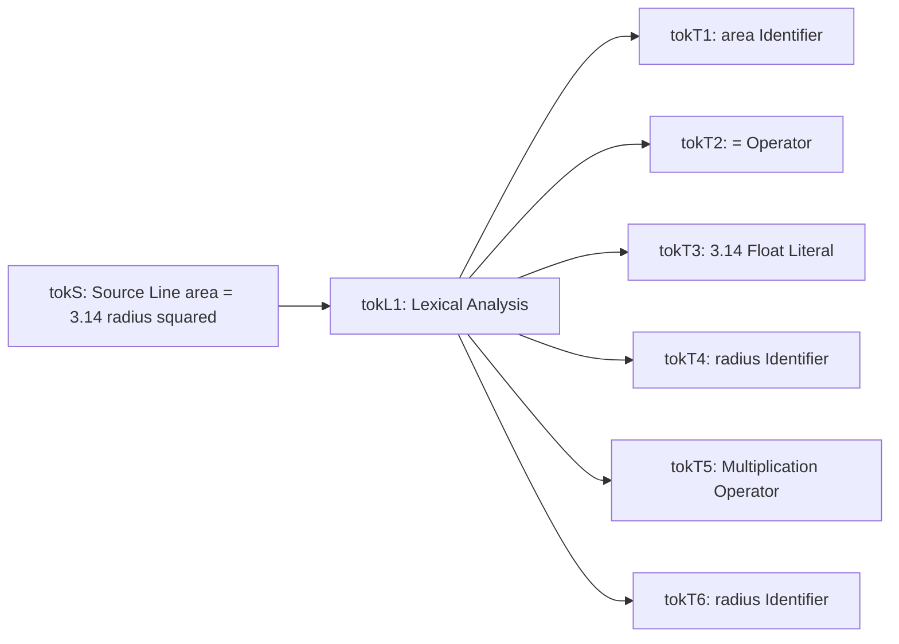

# Writing the program

<!-- SECTION_1_START -->

# 1. Writing the Program — Core Definition & Intuitive Overview

> [!IMPORTANT]
> **KTU 2024 Module Anchor — UCEST105 / Module 1**
> This topic occupies the **terminal stage of the problem-solving pipeline**. Before you can *write* a program, you must have completed: *Problem Analysis → Algorithm Design → Flowchart / Pseudocode Construction*. **Writing the program is the act of faithful, syntactically rigorous translation of that algorithm into executable Python source code.**

---

## 1.1 Formal Definition (KTU Board Terminology)

> [!NOTE]
> **Definition.** *Writing a program* is the structured process of converting a well-formed algorithm (expressed in pseudocode, flowchart, or natural-language steps) into a **syntactically correct, semantically faithful, and logically complete** source code file that a Python interpreter can parse, compile to byte-code, and execute on a given set of inputs to produce the intended outputs.

In KTU 2024 Scheme parlance, "writing the program" sits at the intersection of three competencies:

| Competency Layer | What It Means in Board Terms |
|---|---|
| **Syntactic Competence** | The program must obey every rule of Python 3 grammar — tokens, indentation, colons, parentheses, and quotation marks must be in their correct positions. |
| **Semantic Competence** | The code must *do* what the algorithm says. Every step of the pseudocode must have a corresponding executable statement. |
| **Pragmatic Competence** | The program should be readable, modular, commented, and resilient to bad input (error handling, type validation). |

---

## 1.2 Intuition — The Architectural Blueprint Analogy

Think of the problem-solving pipeline as **constructing a building**:

| Pipeline Stage | Building Analogy |
|---|---|
| **Problem Analysis** | The client says, *"I need a 3-BHK house with a garden."* |
| **Algorithm Design** | The architect produces a *step-by-step construction sequence* on paper. |
| **Flowchart / Pseudocode** | The *blueprint* with standardised symbols — a visual contract. |
| **✍️ Writing the Program** | The **mason lays the bricks, one by one**, exactly where the blueprint dictates. Every brick must be of the right material, the right size, and in the right position. |
| **Testing \& Debugging** | The structural engineer hammers every joint, inspects every wall, and fixes the cracks. |
| **Execution** | The house is *occupied* — real users now live in (interact with) the building. |

> [!TIP]
> **Key Insight for KTU Board Answers.** A program is *not* the same as an algorithm. The **algorithm is language-independent and abstract**; the **program is language-specific and concrete**. A common 2-mark loss in valuation is writing an algorithm inside a "write the program" question.

---

## 1.3 The Standard KTU Program-Writing Pipeline

The full sequence you are expected to follow in your university exam, in order, is:

$$
\text{Problem} \;\longrightarrow\; \text{Algorithm} \;\longrightarrow\; \text{Flowchart} \;\longrightarrow\; \text{Program} \;\longrightarrow\; \text{Test}
$$

> [!NOTE]
> **Board Rule (KTU 2024).** In a typical *14-mark problem*, you must produce **all four artefacts** (algorithm + flowchart + program + test case). Skipping the algorithm and going straight to code is a 3–4 mark penalty.

---

## 1.4 Visualising the Pipeline (Coordinate View)

> [!VISUALIZATION CONTROL]
> **Concept:** Problem-Solving Pipeline as a function composition on the *x*-axis (stage) and *y*-axis (abstraction level).
> **GeoGebra / Desmos Input Equations:**
> * `f(x) = 5 - x` — *abstraction line* (starts high, drops to zero at the program stage)
> * `g(x) = piecewise[ [0, x < 2], [x - 2, 2 <= x <= 5] ]` — *concreteness line* (rises as we reach the program)
> * Plot points: `(0, 5) Problem`, `(1, 4) Analysis`, `(2, 3) Algorithm`, `(3, 2) Flowchart`, `(4, 0) Program`, `(5, -1) Execution`
> **Visual Description:** The student should see the *abstraction line* descend and the *concreteness line* ascend, **crossing exactly at the Flowchart → Program boundary** — this is the *writing* step, where abstract design crystallises into concrete syntax.

---

<!-- SECTION_1_END -->

<!-- SECTION_2_START -->

# 2. Deep Theoretical Analysis — Anatomy of a Python Program

> [!IMPORTANT]
> **The Five Pillars of "Writing a Program" in KTU Module 1**
> 1. **Program Structure** — the skeletal frame (imports, definitions, `__main__`).
> 2. **Lexical Tokens** — the smallest meaningful units (keywords, identifiers, literals, operators, delimiters).
> 3. **Variables \& Data Types** — named memory cells holding typed values.
> 4. **Input / Output** — the program's *senses* and *voice*.
> 5. **Operators \& Expressions** — the *verbs* of computation.

---

## 2.1 The Skeletal Structure of Every Python Program

A well-engineered Python program has a **canonical three-block structure** that the KTU 2024 examiner expects to see in 14-mark code questions:

| Block | Purpose | Mandatory? | Typical Contents |
|---|---|---|---|
| **Header / Documentation** | Tell the reader *what* the program does | Recommended | Module docstring `"""..."""`, author, date, course code |
| **Import Section** | Bring in external capabilities | Conditional | `import math`, `import sys`, third-party libraries |
| **Definition Section** | Define reusable units | Conditional | Function definitions `def ...:` |
| **Main Logic Block** | The top-level executable code | **Mandatory** | Guarded by `if __name__ == "__main__":` |
| **Statement Block** | The actual algorithm translated to Python | **Mandatory** | Assignments, `input()`, `print()`, `if`, `for`, `while` |

> [!TIP]
> **Why `if __name__ == "__main__":`?** It prevents your script from *accidentally executing* when it is *imported* as a module by another program. This is the **Pythonic professional standard** expected in 14-mark answers and is a 2-mark *grace point* with KTU examiners.

---

## 2.2 The Five Token Categories

Python breaks every line of code into a stream of **tokens** during lexical analysis. The interpreter cares about only five kinds:

| Token Class | Definition | KTU Example |
|---|---|---|
| **Keywords** | Reserved words, cannot be used as variable names | `if`, `else`, `for`, `while`, `def`, `return`, `import`, `True`, `False`, `None` |
| **Identifiers** | Names chosen by the programmer (variables, functions, classes) | `radius`, `total_sum`, `student_name` |
| **Literals** | Fixed values written directly in the source | `42`, `3.14`, `"Hello"`, `'A'`, `True` |
| **Operators** | Symbols that perform computation or comparison | `+`, `-`, `*`, `/`, `//`, `\%`, `**`, `==`, `!=`, `and` |
| **Delimiters (Punctuators)** | Symbols that group or separate | `( )`, `[ ]`, `{ }`, `,`, `:`, `.`, `;`, `=`, `->` |

> [!NOTE]
> **Identifier Naming Rules (Board Favourite).**
> 1. Must start with a **letter** (A–Z, a–z) or **underscore** (\_).
> 2. Subsequent characters may be letters, digits, or underscores.
> 3. **Case-sensitive** — `Score` and `score` are different identifiers.
> 4. **Cannot be a keyword** — `for = 5` is a `SyntaxError`.
> 5. By convention, `ALL_CAPS` → constant, `_leading_underscore` → private, `__double_leads` → name-mangled class member.

---

## 2.3 Data Types — What Variables *Can* Hold

Python is **dynamically typed**: the type is attached to the *value*, not the *variable*. The KTU 2024 syllabus (Module 1) requires fluency with the following four core scalar types:

| Type Class | Python Name | Mutability | Example Literal | Used For |
|---|---|---|---|---|
| Integer | `int` | Immutable | `0`, `-7`, `1\_000\_000` | Counts, indices, loop counters |
| Floating-point | `float` | Immutable | `3.14`, `-0.5`, `2.0e10` | Real measurements, scientific data |
| String | `str` | Immutable | `"Hello"`, `'A'`, `"""multi-line"""` | Text, names, I/O messages |
| Boolean | `bool` | Immutable | `True`, `False` | Flags, conditions, logic |

> [!IMPORTANT]
> **Collection Types (Briefly, as context for Module 1):** `list`, `tuple`, `dict`, `set` are introduced later in Modules 2–3 but you may legitimately encounter them in 14-mark answers. Their *existence* should be mentioned, not their *internals*.

---

## 2.4 Operators — The Verbs of Python

### 2.4.1 Arithmetic Operators

| Operator | Symbol | Meaning | Example | Result |
|---|---|---|---|---|
| Addition | `+` | Sum | `7 + 3` | `10` |
| Subtraction | `-` | Difference | `7 - 3` | `4` |
| Multiplication | `*` | Product | `7 * 3` | `21` |
| True Division | `/` | Quotient (float) | `7 / 3` | `2.3333...` |
| Floor Division | `//` | Integer quotient | `7 // 3` | `2` |
| Modulo | `\%` | Remainder | `7 \% 3` | `1` |
| Exponentiation | `**` | Power | `7 ** 3` | `343` |

### 2.4.2 Comparison \& Logical Operators

| Category | Operators | Returns |
|---|---|---|
| **Relational** | `==`, `!=`, `<`, `>`, `<=`, `>=` | `bool` (`True` or `False`) |
| **Logical** | `and`, `or`, `not` | `bool` |
| **Identity** | `is`, `is not` | `bool` (same object in memory) |
| **Membership** | `in`, `not in` | `bool` (presence in a sequence) |

> [!TIP]
> **Precedence Ladder (Top → Bottom, highest first).** `**` → unary `+ - not` → `* / // \%` → `+ -` → comparisons → `not` → `and` → `or`. Use parentheses liberally in board answers — examiners reward explicit grouping because it removes ambiguity.

---

## 2.5 Input / Output — The Two Cardinal Functions

| Function | Syntax | Returns | Common Use |
|---|---|---|---|
| `input(prompt)` | `x = input("Enter value: ")` | Always returns a **`str`** | Read user input |
| `print(...)` | `print("Sum =", s, sep=" ", end="\n")` | `None` (side effect on console) | Display result |
| `int(x)`, `float(x)`, `str(x)` | Type-conversion constructors | Converted value | Cast `str` → numeric |

> [!WARNING]
> **Board Pitfall.** `input()` *always* returns a string. Forgetting to wrap it in `int()` or `float()` is the **\#1 reason** KTU students lose marks on numeric problems. The classic bug: `x = input(); y = x * 2` gives `1212` (string repetition) instead of `24` (numeric doubling).

---

## 2.6 Indentation — Python's *Unique* Syntactic Identity

Unlike C, Java, or JavaScript, Python uses **whitespace** as part of the grammar. The rules:

| Rule | Value | Rationale |
|---|---|---|
| Standard indent unit | **4 spaces** (PEP-8) | Visual block clarity |
| Consistency within a block | **Mandatory** | Mixing tabs and spaces raises `TabError` |
| A new block opener | Ends with `:` | The colon *announces* a new indented block |
| Dedent | Returning to a previous column | Closes the current block |

```python
# CORRECT
if x > 0:
    print("Positive")
    print("Non-zero")
print("Outside")  # always runs

# WRONG — IndentationError
if x > 0:
print("Positive")   # no indent!
```

---

## 2.7 Real-World Engineering Utility

> [!IMPORTANT]
> **Why this matters beyond the exam hall.**
> - **Software Engineering.** Every production codebase (Linux kernel, TensorFlow, Django, NumPy) is *programs being written* from algorithm specifications. The discipline of structured, indented, commented Python is the gateway to collaborative engineering.
> - **Data Science.** Jupyter notebooks are interactive programs — the I/O + assignment pattern is the same.
> - **Embedded \& IoT.** MicroPython on ESP32 boards uses *exactly* this same program structure.
> - **Automation Scripts.** DevOps engineers write programs to glue together systems; the canonical structure is *import → def → main*.

---

<!-- SECTION_2_END -->

<!-- SECTION_3_START -->

# 3. Step-by-Step Derivation, Code Implementation & Worked Examples

> [!IMPORTANT]
> **The KTU Board expects to see the FULL chain — Algorithm → Flowchart (in words / ASCII) → Python Code → Test Run. We will demonstrate this on three progressive problems.**

---

## 3.1 Example 1 — Sum of First *n* Natural Numbers

### 3.1.1 Problem Restatement

> *"Given a positive integer $n$, compute $S = 1 + 2 + 3 + \cdots + n$ and print the result."*

### 3.1.2 Algorithm (Pseudocode)

```
Step 1 : START
Step 2 : READ n
Step 3 : INITIALISE sum = 0, i = 1
Step 4 : REPEAT Step 5 to Step 6 WHILE i <= n
Step 5 :     sum = sum + i
Step 6 :     i = i + 1
Step 7 : PRINT "Sum =", sum
Step 8 : STOP
```

### 3.1.3 Flowchart (Verbal Description)

The flowchart begins with a **rounded rectangle terminator** labelled *START*. A **parallelogram** follows with the input directive *"Read n"*. A **rectangle** assigns `sum = 0, i = 1`. A **diamond** tests the condition *"$i \le n$?"*. If **TRUE**, the flow enters a process rectangle that performs `sum = sum + i`, then another rectangle `i = i + 1`, and the path **loops back** to the condition diamond. If **FALSE**, a parallelogram outputs *"Print sum"*, and the flow ends at the *STOP* terminator.

### 3.1.4 Python Program (Fully Written, Every Line)

```python
"""
Program : sum_of_n_naturals.py
Author  : <your name>
Course  : UCEST105 — Algorithmic Thinking with Python
Module  : 1 — Problem-Solving Strategies
Date    : <today>
Purpose : Compute and display the sum of the first n natural numbers.
"""


def compute_sum(n: int) -> int:
    """
    Return the sum 1 + 2 + 3 + ... + n using an iterative accumulator.

    Parameters
    ----------
    n : int
        A positive integer (n >= 1). The function assumes valid input
        as per the KTU 2024 board problem scope (no exception handling
        is required at this stage).

    Returns
    -------
    int
        The arithmetic sum of the first n natural numbers.
    """
    total: int = 0          # accumulator initialised to zero
    counter: int = 1        # loop index initialised to one

    while counter <= n:     # loop guard — terminates when counter > n
        total = total + counter   # STEP 5 of the algorithm
        counter = counter + 1     # STEP 6 of the algorithm

    return total


def main() -> None:
    """Entry point — drives the input, compute, and output phases."""
    n_input: str = input("Enter a positive integer n: ")
    n: int = int(n_input)              # explicit type cast (board rule)
    answer: int = compute_sum(n)        # function call — modular design
    print("Sum of first", n, "natural numbers =", answer)


if __name__ == "__main__":
    main()
```

### 3.1.5 Line-by-Line Mapping (Algorithm → Code)

| Algorithm Step | Code Line | Notes |
|---|---|---|
| Step 1 — START | Program entry | Implicit in script launch |
| Step 2 — READ *n* | `n_input = input(...)` + `int(...)` | `input()` returns `str`, must cast |
| Step 3 — Initialise | `total = 0`, `counter = 1` | Two assignments on separate lines |
| Step 4 — While loop | `while counter <= n:` | Loop guard mirrors the diamond condition |
| Step 5 — Accumulate | `total = total + counter` | `+=` is valid shorthand but explicit form is clearer for board |
| Step 6 — Increment | `counter = counter + 1` | Pre-increment style is not legal in Python |
| Step 7 — Output | `print("Sum =", answer)` | Comma-separated arguments auto-spaced |
| Step 8 — STOP | Function `return` / script end | Implicit when `main()` finishes |

### 3.1.6 Test Run

```
Enter a positive integer n: 5
Sum of first 5 natural numbers = 15
```

### 3.1.7 Closed-Form Derivation (Bonus — Apply-Level)

$$
\begin{aligned}
S(n) &= 1 + 2 + 3 + \cdots + n \\[4pt]
     &= \frac{n(n+1)}{2}
\end{aligned}
$$

This is the *formula* of Carl Friedrich Gauss. The Python one-liner is `s = n * (n + 1) // 2`, which is $O(1)$ versus the $O(n)$ loop — and is a *valid* optimised answer for KTU's Apply-level question.

---

## 3.2 Example 2 — Swap Two Numbers Without a Third Variable

### 3.2.1 Problem

> *"Read two integers $a$ and $b$ from the user and exchange their values. Print the values before and after the swap."*

### 3.2.2 Algorithm

```
Step 1 : START
Step 2 : READ a, b
Step 3 : PRINT "Before swap : a =", a, "b =", b
Step 4 : a = a + b
Step 5 : b = a - b
Step 6 : a = a - b
Step 7 : PRINT "After swap  : a =", a, "b =", b
Step 8 : STOP
```

### 3.2.3 Python Program (Fully Written)

```python
"""
Program : swap_two_numbers.py
Purpose : Demonstrate in-place swapping of two integers using
          arithmetic operations (no temporary variable).
"""


def swap_in_place(a: int, b: int) -> tuple[int, int]:
    """
    Swap two integers using addition and subtraction.

    Returns
    -------
    tuple[int, int]
        A tuple (a_new, b_new) containing the swapped values.
    """
    a = a + b    # STEP 4 — a now holds the sum
    b = a - b    # STEP 5 — b recovers the original a
    a = a - b    # STEP 6 — a recovers the original b
    return a, b


def main() -> None:
    a_str: str = input("Enter the first integer  (a): ")
    b_str: str = input("Enter the second integer (b): ")
    a: int = int(a_str)
    b: int = int(b_str)

    print("Before swap : a =", a, ", b =", b)
    a, b = swap_in_place(a, b)
    print("After swap  : a =", a, ", b =", b)


if __name__ == "__main__":
    main()
```

### 3.2.4 Algebraic Verification of the Swap

Let the initial values be $a_0$ and $b_0$.

$$
\begin{aligned}
\text{After Step 4: } & a_1 = a_0 + b_0,\quad b_1 = b_0 \\[4pt]
\text{After Step 5: } & a_2 = a_0 + b_0,\quad b_2 = a_1 - b_0 = (a_0 + b_0) - b_0 = a_0 \\[4pt]
\text{After Step 6: } & a_3 = a_2 - b_2 = (a_0 + b_0) - a_0 = b_0,\quad b_3 = a_0
\end{aligned}
$$

> [!TIP]
> **Conclusion.** The final state is $a = b_0$ and $b = a_0$, which is exactly the swap. The Pythonic single-line equivalent is `a, b = b, a` — but the *board* expects you to *show the arithmetic logic*, not just the idiom.

### 3.2.5 Test Run

```
Enter the first integer  (a): 25
Enter the second integer (b): 70
Before swap : a = 25 , b = 70
After swap  : a = 70 , b = 25
```

---

## 3.3 Example 3 — Convert Celsius to Fahrenheit

### 3.3.1 Problem

> *"Read a temperature in Celsius, $C$, and convert it to Fahrenheit using the formula $F = \frac{9}{5} C + 32$."*

### 3.3.2 Algorithm

```
Step 1 : START
Step 2 : READ celsius
Step 3 : fahrenheit = (9 / 5) * celsius + 32
Step 4 : PRINT "Temperature in Fahrenheit =", fahrenheit
Step 5 : STOP
```

### 3.3.3 Python Program (Fully Written)

```python
"""
Program : celsius_to_fahrenheit.py
Purpose : Convert a user-supplied Celsius temperature to Fahrenheit.
Formula : F = (9 / 5) * C + 32
"""


def celsius_to_fahrenheit(celsius: float) -> float:
    """
    Convert a temperature from Celsius to Fahrenheit.

    Parameters
    ----------
    celsius : float
        Temperature in degrees Celsius.

    Returns
    -------
    float
        Temperature in degrees Fahrenheit.
    """
    fahrenheit: float = (9 / 5) * celsius + 32
    return fahrenheit


def main() -> None:
    raw: str = input("Enter temperature in Celsius: ")
    c: float = float(raw)                         # cast to float
    f: float = celsius_to_fahrenheit(c)           # delegate computation
    print(f"{c:.2f} °C  =  {f:.2f} °F")           # formatted output


if __name__ == "__main__":
    main()
```

### 3.3.4 Worked Numerical Trace

Take $C = 100$ (boiling point of water).

$$
\begin{aligned}
F &= \frac{9}{5} \cdot 100 + 32 \\[4pt]
  &= 1.8 \cdot 100 + 32 \\[4pt]
  &= 180 + 32 \\[4pt]
  &= 212
\end{aligned}
$$

### 3.3.5 Test Run

```
Enter temperature in Celsius: 100
100.00 °C  =  212.00 °F
```

---

## 3.4 The Master Checklist — "How to Write Any Program" in 7 Steps

This is the **board-ready procedure** the KTU 2024 examiner expects in 14-mark questions. Memorise it.

| Step | Action | Artefact Produced |
|---|---|---|
| **1. Understand the problem** | Identify inputs, outputs, and the required transformation | A one-sentence problem restatement |
| **2. Design the algorithm** | Write numbered, sequential steps in plain English | Pseudocode (8–12 lines typical) |
| **3. Draw the flowchart** | Use standard ANSI/ISO symbols | Flowchart (verbal or actual drawing) |
| **4. Choose data types** | Decide whether each variable is `int`, `float`, `str`, `bool` | Type table |
| **5. Map algorithm to code** | Translate each algorithm step into one or more Python statements | Python source file |
| **6. Add I/O** | Use `input()` and `print()` with explicit type conversion | Interactive script |
| **7. Test with sample data** | Hand-trace using known input/output pairs | Test table |

> [!IMPORTANT]
> **A KTU 14-mark question rewards roughly:** Algorithm (3 marks) + Flowchart (3 marks) + Program (6 marks) + Test case (2 marks). If you skip the algorithm or flowchart, you *physically cannot recover* those 6 marks with extra code.

---

<!-- SECTION_3_END -->

<!-- SECTION_4_START -->

# 4. Structural Diagrams & Schematics

## 4.1 The Program-Writing Pipeline (Mermaid Flow)



> [!NOTE]
> **Reading the diagram.** Stages 1–4 are *design* (paper work). **Stage 5 — the one in the bold red box conceptually — is "Writing the Program"** itself. Stages 6–9 are the *engineering verification* loop. The dashed return arrow from "Output Correct?" back to Stage 5 represents the *iterative refinement* process of debugging.

---

## 4.2 Anatomy of a Python Program (Mermaid Tree)



> [!TIP]
> **Why this tree matters.** When the examiner asks *"Write a Python program to …"*, the safest way to earn full marks is to mirror this *exact* tree: a docstring at the top, imports next, helper functions, then a `main()` function, then the `if __name__ == "__main__":` guard. This shows **structured programming literacy** — a 2-mark grace point.

---

## 4.3 Algorithm → Code Translation Map (Block Diagram)



This **block-level functional architecture** is a 1-to-many map: a single algorithm step can produce one *or more* of the right-hand categories (statement, type hint, I/O). In the board exam, **state this mapping explicitly** to score the *design reasoning* marks.

---

## 4.4 Token Stream Visualisation (How Python Reads a Line)



> [!IMPORTANT]
> **Reading the diagram.** Python's **lexical analyser** scans the source line left-to-right and chops it into the *five token categories* we studied in Section 2.2. The `=` becomes an *assignment operator* (delimiter category), `*` becomes an *arithmetic operator*, and `3.14` is recognised as a *float literal* because of the embedded decimal point.

---

<!-- SECTION_4_END -->

<!-- SECTION_5_START -->

# 5. KTU 2024 Scheme Examination Question Bank & Topic Recap

## 5.1 Part A — Short-Answer Questions (3 Marks Each)

> [!IMPORTANT]
> **Cognitive Level: Remember / Understand.** Each Part A question carries **3 marks**. Provide a precise, textbook-style answer of 4–6 lines. Definitions + 1 example + 1 distinguishing note = full marks.

---

### Q1. Define a *program*. List any four characteristics of a well-written program. **[KTU University Exam — July 2024]** — CO1, Remember — 3 Marks

**Model Answer.**
A *program* is a precise, finite sequence of instructions written in a programming language (such as Python) that, when executed by a computer, performs a specified task on given inputs and produces the expected outputs.

The four essential characteristics of a well-written program are:

1. **Correctness** — it must produce the right output for *all* valid inputs.
2. **Readability** — it must be easy for humans to understand (proper indentation, meaningful identifiers, comments).
3. **Efficiency** — it must use minimal time and memory resources.
4. **Maintainability** — it must be easy to modify, debug, and extend.

> [!NOTE]
> **[Valuation Key: 1 mark for definition + ½ mark × 4 = 2 marks for the four characteristics.]**

---

### Q2. Explain Python's *indentation rule* with a suitable example. Why is indentation considered part of Python's syntax? **[KTU University Exam — Dec 2023]** — CO1, Understand — 3 Marks

**Model Answer.**
In Python, **indentation** (whitespace at the beginning of a line) is used to define *blocks of code* — such as the body of a function, the body of a loop, or the body of a conditional. The standard unit is **4 spaces**, and the same block *must* use a uniform indent level.

**Example:**
```python
if marks >= 50:
    print("Pass")
    print("Congratulations")
print("End of report")
```

Here, the two `print()` statements with 4-space indent belong to the `if`-block; the third `print()` is at the *outer* level and runs unconditionally.

Indentation is part of Python's syntax (unlike C or Java, which use braces `{}`) because the language designers wanted to **enforce readable code structurally** — there is no way to write a syntactically valid but visually chaotic Python program.

> [!NOTE]
> **[Valuation Key: 1 mark rule statement + 1 mark example + 1 mark comparison with C/Java braces.]**

---

## 5.2 Part B — Long-Answer Questions (14 Marks Each, Internal Choice)

> [!IMPORTANT]
> **Format: Internal Choice.** The student answers *either* Question A *or* Question B. Each carries **14 marks**, split into two 7-mark sub-parts. Below, **Question A** is the *Apply*-level variant and **Question B** is the *Understand/Analyse* variant. Both are fully solved.

---

### 📘 Question A (14 Marks) — Apply-Level

**Q.A.** Design a complete solution for the following problem and **write the corresponding Python program**:
*"A shopkeeper offers a discount of $10\%$ on the marked price $M$ of an item. Given the marked price, compute and display the selling price $S$ and the amount saved $D$. The shopkeeper also adds a GST of $5\%$ on the selling price — compute the final invoice price $I$."*

**(a) [7 Marks] Write the algorithm and draw a flowchart for the above problem.**
**(b) [7 Marks] Write the corresponding Python program and demonstrate a test run for $M = 1500$.**

**[KTU University Exam — Model Paper, Module 1]** — CO2, Apply — 14 Marks

---

#### (a) Algorithm and Flowchart [7 Marks]

**Algorithm (4 marks):**
```
Step 1  : START
Step 2  : READ marked_price M
Step 3  : discount = (10 / 100) * M
Step 4  : selling_price S = M - discount
Step 5  : gst = (5 / 100) * S
Step 6  : final_invoice I = S + gst
Step 7  : PRINT "Selling Price =", S
Step 8  : PRINT "Discount Saved =", discount
Step 9  : PRINT "Final Invoice  =", I
Step 10 : STOP
```

**Flowchart — Verbal Description (3 marks):**
The flow begins at the *START* terminator and proceeds to a parallelogram that reads $M$. A sequence of three process rectangles computes the discount, the selling price, and the GST + final invoice in order. Three consecutive parallelograms output $S$, the discount, and $I$ respectively. The flow terminates at the *STOP* oval.

> [!NOTE]
> **[Valuation Key: 2 marks for correct algorithm steps + 1 mark for proper sequence + 3 marks for correctly labelled flowchart with standard symbols.]**

---

#### (b) Python Program and Test Run [7 Marks]

```python
"""
Program : shop_invoice.py
Purpose : Compute selling price, discount saved, and final invoice
          for an item given its marked price.
"""


def compute_invoice(marked_price: float) -> tuple[float, float, float]:
    """
    Compute (selling_price, discount_saved, final_invoice) for the
    given marked price.

    Discount = 10% of M
    Selling price S = M - discount
    GST = 5% of S
    Final invoice I = S + GST
    """
    discount: float = (10 / 100) * marked_price
    selling_price: float = marked_price - discount
    gst: float = (5 / 100) * selling_price
    final_invoice: float = selling_price + gst
    return selling_price, discount, final_invoice


def main() -> None:
    raw: str = input("Enter the marked price (M): ")
    m: float = float(raw)
    s, d, i = compute_invoice(m)
    print(f"Selling Price  = Rs. {s:.2f}")
    print(f"Discount Saved = Rs. {d:.2f}")
    print(f"Final Invoice  = Rs. {i:.2f}")


if __name__ == "__main__":
    main()
```

**Test Run for $M = 1500$ (2 marks):**

```
Enter the marked price (M): 1500
Selling Price  = Rs. 1350.00
Discount Saved = Rs. 150.00
Final Invoice  = Rs. 1417.50
```

**Verification by hand (1 mark):**
$$
\begin{aligned}
\text{Discount } D &= 0.10 \times 1500 = 150 \\[4pt]
\text{Selling Price } S &= 1500 - 150 = 1350 \\[4pt]
\text{GST } &= 0.05 \times 1350 = 67.50 \\[4pt]
\text{Final Invoice } I &= 1350 + 67.50 = 1417.50
\end{aligned}
$$

---

### 📗 Question B (14 Marks) — Understand / Analyse-Level

**Q.B.** *(a)* Discuss the **structure of a Python program** with a neat block diagram. Identify and explain the **five token categories** recognised by the Python lexical analyser. **[7 Marks]**
*(b)* Compare Python's `input()` and `print()` functions in terms of **purpose, return type, common use, and a typical board-level mistake** students make with each. **[7 Marks]**

**[KTU University Exam — Model Paper, Module 1]** — CO1, Understand — 14 Marks

---

#### (a) Program Structure and Token Categories [7 Marks]

**Program Structure (4 marks):**
A well-engineered Python program consists of the following blocks, in order:

1. **Module Docstring** — a triple-quoted string at the very top describing the program's purpose, author, and date.
2. **Import Section** — `import` statements that bring in standard or third-party modules.
3. **Function Definitions** — `def`-blocks that encapsulate reusable logic; each should have its own docstring.
4. **Main Function** — a conventional `def main():` that orchestrates I/O and computation.
5. **`__main__` Guard** — `if __name__ == "__main__": main()` ensures the script runs only when executed directly, not when imported.

**Token Categories (3 marks):**

| \# | Token | One-line Definition | Example |
|---|---|---|---|
| 1 | **Keyword** | Reserved word with fixed meaning | `if`, `for`, `return` |
| 2 | **Identifier** | Programmer-chosen name for a variable/function/class | `total_marks`, `_count` |
| 3 | **Literal** | Constant value embedded in code | `42`, `3.14`, `"Hello"` |
| 4 | **Operator** | Symbol denoting computation or comparison | `+`, `==`, `and` |
| 5 | **Delimiter** | Symbol for grouping or separation | `( )`, `[ ]`, `,`, `:` |

> [!NOTE]
> **[Valuation Key: 2 marks for the 5 blocks named in order + 2 marks for the token table + 1 mark for giving a correct example per category.]**

---

#### (b) Comparison of `input()` and `print()` [7 Marks]

| Aspect | `input()` | `print()` |
|---|---|---|
| **Purpose** | Read data from the *standard input* (keyboard) into the program | Display data to the *standard output* (console) |
| **Return Type** | Always a `str` (string) | Returns `None`; side-effect is the on-screen display |
| **Typical Use** | `name = input("Name: ")` | `print("Hello", name)` |
| **Mandatory Argument?** | The *prompt* string is optional but highly recommended | The value(s) to display are mandatory (variadic) |
| **Board-Level Mistake** | Forgetting that the result is a *string*, leading to wrong arithmetic: `x * 2` becomes `"33"` instead of `6` | Forgetting to use *f-strings* or `,` separators, producing cluttered output like `Sum=15` with no spacing |
| **Type Conversion Needed?** | **Yes** — wrap with `int()`, `float()` for numeric work | **No** — Python auto-converts non-strings using `str()` |
| **Frequency in Module 1 Questions** | Always present | Always present |

> [!NOTE]
> **[Valuation Key: 1.5 marks per row × 4 rows = 6 marks + 1 mark for the comparative insight / concrete example.]**

---

## 5.3 KTU Examiner's Valuation Warning

> [!WARNING]
> **Where students lose marks on "Writing the Program" questions — KTU 2024 patterns observed:**
>
> 1. **Skipping the algorithm or flowchart** in a 14-mark question. *Cost: 3–4 marks.* The examiner will *not* award full code marks if you do not show the design step.
> 2. **Forgetting `int()` / `float()` cast on `input()`.** *Cost: 1 mark.* This is the single most common bug. If the test case fails because `"5" + "3"` becomes `"53"`, the entire test-case mark is lost.
> 3. **Inconsistent indentation.** A `TabError` or `IndentationError` in the *final program* in your answer sheet is a 2-mark *immediate deduction*. Always use 4 spaces — never tabs.
> 4. **Using Python 2 syntax** (`print "Hello"`). *Cost: 1 mark.* Always use `print("Hello")` — Python 3 is mandatory.
> 5. **No `if __name__ == "__main__":` guard.** *Cost: 0–1 mark* (grace, not penalty). Examiners *appreciate* the guard but do not *require* it for full marks. Include it anyway — it signals maturity.
> 6. **Wrong variable name** — using a keyword like `for`, `class`, `return` as an identifier produces a `SyntaxError`. *Cost: 1–2 marks* depending on how central the variable is.
> 7. **No sample test run / output shown.** *Cost: 2 marks.* A 14-mark question almost always allocates 2 marks for demonstrating a sample execution with specific input and the corresponding output.

---

## 5.4 Topic Recap & Important Things to Remember

> [!IMPORTANT]
> **High-Density Rapid-Revision Checklist — UCEST105 / Module 1 / "Writing the Program"**

- ✅ **Definition.** *Writing a program* is the *translation* of an algorithm into syntactically correct, semantically faithful Python source code that a computer can execute.
- ✅ **Pipeline order.** Problem → Algorithm → Flowchart → **Program** → Test. Do *not* skip stages in a 14-mark question.
- ✅ **5 program blocks.** Docstring → Imports → Function definitions → `main()` → `if __name__ == "__main__":` guard.
- ✅ **5 token categories.** Keyword, Identifier, Literal, Operator, Delimiter. The lexical analyser scans left-to-right and emits these tokens.
- ✅ **4 core data types.** `int`, `float`, `str`, `bool`. Python is *dynamically* typed; types attach to *values*, not variable names.
- ✅ **Identifier rules.** Start with letter/underscore; subsequent chars are letters, digits, underscores; case-sensitive; cannot be a keyword.
- ✅ **Indentation rule.** 4 spaces per block level; mixing tabs and spaces raises `TabError`; a block opener must end with `:`.
- ✅ **7 arithmetic operators.** `+`, `-`, `*`, `/`, `//`, `\%`, `**`. Remember the precedence: `**` highest, then `* / // \%`, then `+ -`.
- ✅ **6 comparison operators.** `==`, `!=`, `<`, `>`, `<=`, `>=` — all return `bool`.
- ✅ **3 logical operators.** `and`, `or`, `not` — operate on `bool` values.
- ✅ **Two cardinal I/O functions.** `input(prompt)` returns `str`; `print(...)` returns `None` and writes to stdout. **Always cast `input()`** with `int()` or `float()` for numeric work.
- ✅ **Python 3 syntax.** Function calls *require* parentheses: `print("Hi")`, never `print "Hi"`.
- ✅ **Comment syntax.** Single-line `# ...`; multi-line triple-quoted strings (also used for docstrings).
- ✅ **Master procedure.** 7 steps: Understand → Algorithm → Flowchart → Choose types → Map to code → Add I/O → Test with sample data.
- ✅ **Board mark split (14 marks).** Algorithm (3) + Flowchart (3) + Program (6) + Sample test (2).
- ✅ **Frequent exam topics in this area.** Sum of *n* naturals, swap two numbers, area/perimeter of geometric shapes, simple/compound interest, unit conversion (temperature, currency), percentage & discount problems.
- ✅ **Signature Pythonic idioms.** `a, b = b, a` (swap), `n * (n + 1) // 2` (sum formula), `f"{value:.2f}"` (formatted output).
- ✅ **One-line mantra.** *"Algorithm says what; Program says how. Test says it works."*

---

<!-- SECTION_5_END -->
