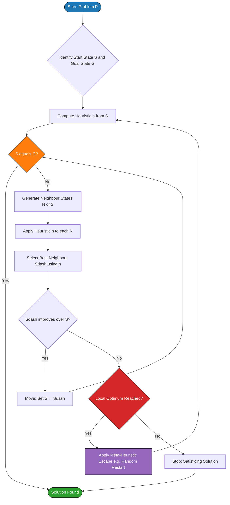
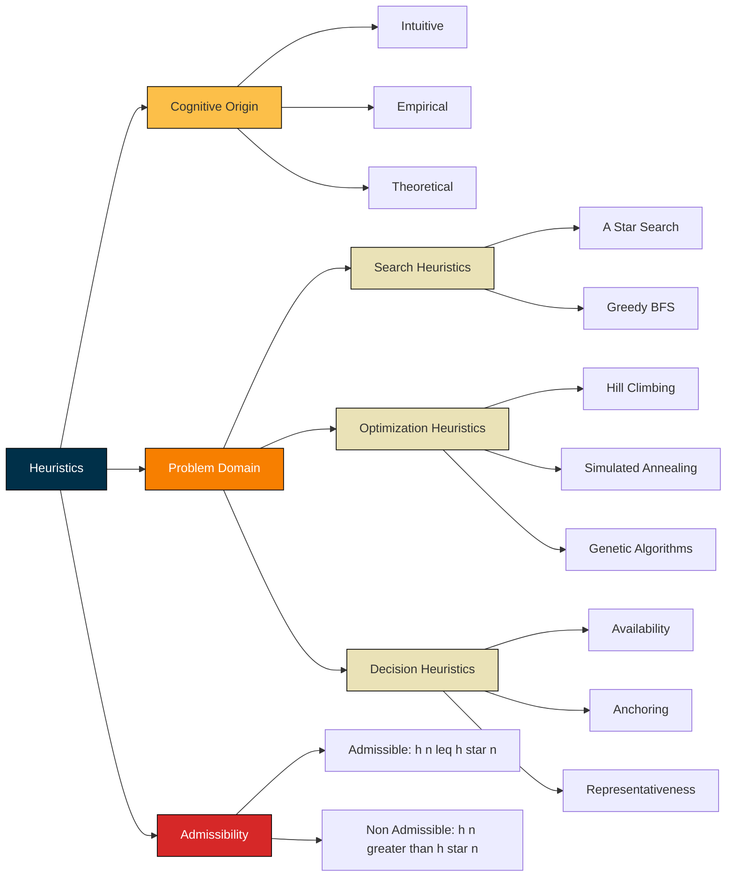
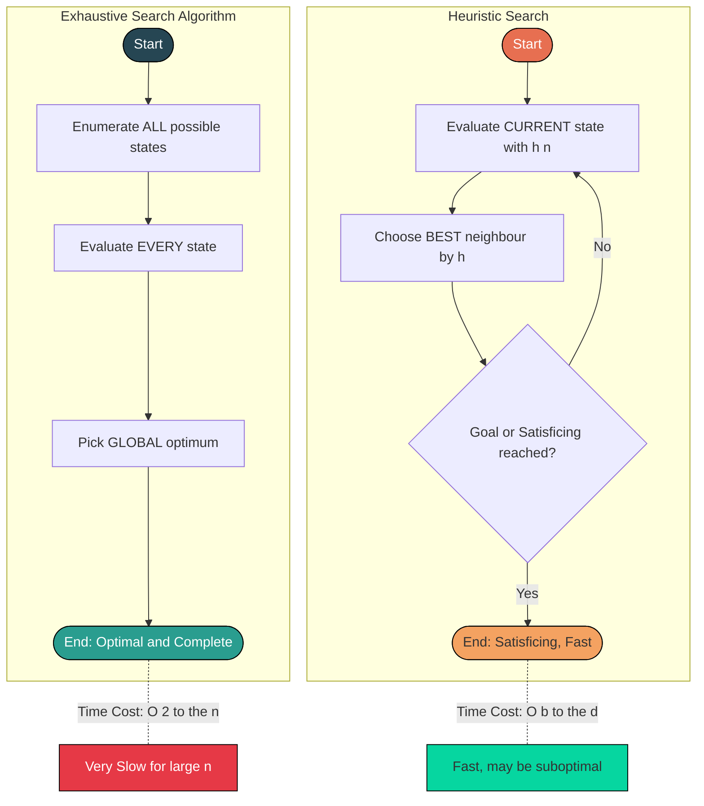

# Heuristics

> **APJ ABDUL KALAM TECHNOLOGICAL UNIVERSITY (KTU) | 2024 SCHEME**
> - **Branch:** B.Tech in Civil Engineering (CE)
> - **Semester:** Semester 1
> - **Course:** UCEST105 - ALGORITHMIC THINKING WITH PYTHON
> - **Module:** Module 1: Problem
> - **Topic:** Heuristics

<!-- SECTION_1_START -->
# 1. Core Technical Definition & Intuitive Overview

## 1.1 Formal Academic Definition

A **heuristic** (from the Greek verb $\textit{heuriskein}$, meaning *"to find"* or *"to discover"*) is a **problem-solving strategy** that employs a **practical, experience-based technique** to produce a solution that is *good enough* within an **acceptable time frame**, especially when classical algorithmic or exhaustive search methods are **computationally infeasible**.

In the KTU 2024 Scheme context for *Algorithmic Thinking with Python*, a heuristic is formally defined as:

> **Heuristic:** A *rule of thumb*, *educated guess*, *intuitive judgment*, or *simplified decision rule* that **prunes the search space** and guides the problem solver toward a *satisficing* (satisfactory + sufficient) solution, **without guaranteeing optimality** or completeness.

Mathematically, a heuristic can be expressed as a **function**:

$$h(n) : \text{State} \rightarrow \mathbb{R}_{\geq 0}$$

where $h(n)$ estimates the **cost** from state $n$ to the **nearest goal state**. The function $h(n)$ is called the **heuristic function** or **evaluation function**.

> [!NOTE]
> **Key Syllabus Highlight — KTU UCEST105 Module 1**
> A heuristic is one of the **five foundational problem-solving strategies** introduced in this module. Unlike algorithms, heuristics *trade optimality for speed* and are *fallible but fast*. The term *satisficing* (coined by Herbert Simon) is the official KTU-recommended word to describe heuristic outcomes.

> [!IMPORTANT]
> **Heuristic vs. Algorithm — The Core Distinction**
> - **Algorithm:** A *finite, well-defined sequence of steps* that **guarantees** a correct/optimal solution (e.g., Dijkstra's shortest path, Binary Search).
> - **Heuristic:** A *flexible, experience-based rule* that **does not guarantee** optimality but finds a *good* solution *much faster* (e.g., Greedy Search, A* Search, Hill Climbing).

## 1.2 Conceptual Analogy / Intuition

**Real-World Analogy — "The Lost Tourist"**

Imagine you are a tourist in **Kochi** trying to reach the **Vytilla Mobility Hub** from **Marine Drive**. You have three options:

1. **Exhaustive Search (Algorithm):** Open a complete map, enumerate *every single possible road combination* (there could be millions), then compute the shortest one mathematically. This is *guaranteed* to find the shortest route, but it might take *hours of computation*.

2. **Heuristic Approach:** You ask a local shopkeeper: *"Which way is the fastest to Vytilla?"* The shopkeeper says: *"Just follow the NH-66 bypass, it’s usually the quickest."* You follow it. You may not have taken the *mathematically optimal* route, but you reached *good enough* in *minutes*.

That shopkeeper’s advice is a **heuristic** — a *practical shortcut* that *usually* works.

**Computer-Science Analogy — Chess Engine**

In a chess game, a player has $\approx 10^{120}$ possible games (more than atoms in the universe). An *algorithm* cannot explore all of them. So engines use **heuristic evaluation functions** to score board positions ("is this position good or bad?") and choose moves that *seem* promising — sacrificing the guarantee of a perfect game for the ability to play *in real-time*.

**Geometric Intuition — Search Space as a Landscape**

Picture the search space as a *mountainous landscape*:
- The **goal** is the **lowest valley** (minimum cost solution).
- A **pure algorithm** walks the *entire landscape* to find the absolute lowest point.
- A **heuristic** looks at the *slope* under its feet and simply *walks downhill*. It may end up in a *local valley* instead of the *global* one — but it got there *fast*.

> [!TIP]
> **Mnemonic to Remember — "Heuristics = Hasty but Helpful"**
> - **H** — *Handy* (easy to apply)
> - **H** — *Human-like* (mimics intuition)
> - **H** — *High-speed, but not always Hi-fi quality*

## 1.3 Visualization Control

> [!VISUALIZATION CONTROL]
> **Concept:** Comparison of *Exhaustive Search* vs. *Heuristic Search* on a 2D goal-finding grid
> **GeoGebra / Desmos Input Equations:**
> * $f(x) = -(x-4)^2 - (y-5)^2 + 10$  *(cost landscape — peak in the middle, low at the goal)*
> * Start point: $S = (0, 0)$
> * Goal point: $G = (4, 5)$
> * Heuristic function: $h(x, y) = \sqrt{(x-4)^2 + (y-5)^2}$  *(Euclidean distance to goal)*
>
> **Visual Description:** The student should plot a 3D surface where the height represents *search cost*. The *exhaustive search* path zig-zags across the *entire* surface exploring low-cost regions everywhere. The *heuristic search* path goes *directly* toward the goal, following the steepest descent estimated by $h(n)$, with only a few evaluated points. The heuristic path is *shorter* but may terminate in a *local minimum* slightly off the true global minimum.

<!-- SECTION_1_END -->

<!-- SECTION_2_START -->
# 2. Deep Theoretical Analysis & KTU High-Yield Formula Sheet

## 2.1 Structural Breakdown — Anatomy of a Heuristic

A heuristic, when reduced to its operational components, follows this **4-step logic chain**:

- **Step 1 — Problem Recognition:** Identify the *current state* $s$ and the *goal state* $g$. The problem-solver must first *understand* the gap between where they are and where they want to be.
- **Step 2 — Heuristic Estimation:** Compute $h(s)$, a *numerical estimate* of "how far" or "how good" the current state is relative to the goal. This is the *intelligence* of the heuristic.
- **Step 3 — Action Selection:** Choose the *next state* $s'$ from the set of neighbours $N(s)$ that *minimizes* (or *maximizes*, depending on the problem) the heuristic value. This is the *decision rule*.
- **Step 4 — Termination Check:** If $s' = g$ (goal reached) or a *satisficing* threshold is met, *stop*. Otherwise, return to **Step 2** with $s \leftarrow s'$.

This iterative loop is what makes heuristics **algorithmic in nature** (they *can* be coded) but **heuristic in spirit** (they *approximate* the best move).

## 2.2 Classification of Heuristics

Heuristics are classified along **three orthogonal axes**:

- **By Cognitive Origin:**
  - *Intuitive Heuristics* — based on gut feeling / experience (e.g., "the answer is probably 10 because similar problems had 10").
  - *Empirical Heuristics* — based on observed patterns in past data (e.g., "90% of the time, this rule works").
  - *Theoretical Heuristics* — derived from mathematical insight (e.g., Manhattan distance in grid pathfinding).

- **By Problem Domain:**
  - *Search Heuristics* — guide exploration of a state space (A*, Greedy Best-First).
  - *Optimization Heuristics* — guide convergence to a near-optimum (Hill Climbing, Simulated Annealing, Genetic Algorithms).
  - *Decision Heuristics* — guide human/AI choice under uncertainty (Availability, Representativeness, Anchoring — from Tversky \& Kahneman's research).

- **By Admissibility:**
  - *Admissible Heuristic:* $h(n) \leq h^*(n)$ — *never overestimates* the true cost. Guarantees optimality in A* (e.g., straight-line distance).
  - *Non-Admissible Heuristic:* $h(n) > h^*(n)$ — *may overestimate*. Faster but loses optimality guarantee.

## 2.3 The "Why" and "How" Behind Heuristics

- **WHY use heuristics?**
  - **Time:** Exhaustive search is often $O(2^n)$ or worse — *infeasible* for large $n$.
  - **Space:** Heuristics keep only *promising* states in memory.
  - **Real-time constraints:** Chess engines have *seconds per move*; algorithms need *hours*.
  - **Imperfect information:** Many real-world problems have *unknown* cost functions — heuristics *estimate*.

- **HOW do heuristics work?**
  - They *encode domain knowledge* into a *cheap-to-compute function* $h(n)$.
  - This function acts as a *compass*, pointing the search toward the goal.
  - The *better* the heuristic (closer to the true cost), the *fewer* nodes are explored.

## 2.4 KTU Formula Sheet / Cheat Sheet

| **Formula / Concept** | **Mathematical Form** | **Application / Meaning** | **Unit** |
|---|---|---|---|
| Heuristic Function | $h(n) : \text{State} \rightarrow \mathbb{R}_{\geq 0}$ | Estimates cost from state $n$ to goal | Cost units |
| A* Evaluation Function | $f(n) = g(n) + h(n)$ | Total estimated cost via $n$; $g(n)$ = cost so far | Cost units |
| Greedy Best-First Evaluation | $f(n) = h(n)$ | Ignores past cost, uses only heuristic estimate | Cost units |
| Manhattan Distance Heuristic | $h_{\text{manh}}(n) = \vert x_n - x_g \vert + \vert y_n - y_g \vert$ | Grid movement (no diagonals) — *admissible* for 4-connected grids | Grid cells |
| Euclidean Distance Heuristic | $h_{\text{eucl}}(n) = \sqrt{(x_n - x_g)^2 + (y_n - y_g)^2}$ | Straight-line distance — *admissible* for continuous space | Distance units |
| Admissibility Condition | $0 \leq h(n) \leq h^*(n)$ | $h^*(n)$ = true minimum cost; guarantees $A^*$ optimality | Inequality |
| Consistency (Monotonicity) | $h(n) \leq c(n, n') + h(n')$ | For every successor $n'$; ensures $f$ is non-decreasing | Inequality |
| Effective Branching Factor | $b^* = (N+1)^{1/d}$ | $N$ = nodes expanded, $d$ = solution depth — measures heuristic quality | Dimensionless |

> [!IMPORTANT]
> **Note on Admissibility:** For the KTU exam, remember that the **Manhattan distance** is *admissible* (never overestimates) for *4-connected* grid pathfinding because the *true* shortest path can *never be shorter* than the Manhattan sum of absolute coordinate differences.

## 2.5 Real-World Utility of Heuristics in Engineering and CS

- **AI / Machine Learning:** A* search in GPS navigation (Google Maps), game-playing engines (Stockfish, AlphaGo).
- **Civil Engineering:** Heuristic-based project scheduling (Critical Path Method approximations), traffic signal optimization, structural topology optimization.
- **Cybersecurity:** Heuristic-based malware detection (signature *and* behaviour-based antivirus engines).
- **Operations Research:** Vehicle Routing Problems (VRP), bin-packing, supply chain logistics — solved with Nearest-Neighbour, Tabu Search, Genetic Algorithms.
- **Robotics:** Real-time path planning under uncertainty using Rapidly-exploring Random Trees (RRT*).
- **Human Cognition:** Tversky \& Kahneman's *availability heuristic* and *anchoring* explain systematic human decision biases — directly relevant to UI/UX engineering.

<!-- SECTION_2_END -->

<!-- SECTION_3_START -->
# 3. Step-by-Step Derivations & Code/Symbolic Implementation

## 3.1 Derivation: A* Search Heuristic from First Principles

We want to derive the **A\* evaluation function** $f(n) = g(n) + h(n)$ starting from the principle of *informed search*.

**Step 1 — Define the three costs at any node $n$:**
- $g(n)$ = the *actual cost incurred* from the start node $s$ to reach $n$.
- $h(n)$ = the *heuristic estimate* of the cost from $n$ to the goal $g$.
- $f(n)$ = the *total estimated cost* of a path that *passes through* $n$.

**Step 2 — Express $f(n)$ as the sum:**

$$f(n) = g(n) + h(n)$$

**Step 3 — Interpret each term:**
- The *known past* $g(n)$ is *exact* (we have traversed it).
- The *unknown future* $h(n)$ is an *estimate* (we are guessing).

**Step 4 — Add the optimality constraint (admissibility):**

If $h(n) \leq h^*(n)$ where $h^*(n)$ is the *true* minimum future cost, then $f(n)$ is a *lower bound* on the cost of any optimal path through $n$. This is the cornerstone of A\* optimality.

**Step 5 — Derive the consistency condition:**

For any edge $(n, n')$ with cost $c(n, n')$:

$$h(n) \leq c(n, n') + h(n')$$

This is derived by requiring $f$ to be *non-decreasing* along any path — a stronger property than admissibility that guarantees no node is re-expanded.

**Step 6 — Special case — Greedy Best-First Search:**

If we *ignore* the past by setting $g(n) \equiv 0$:

$$f(n) = 0 + h(n) = h(n)$$

This is **Greedy Best-First Search** — a *pure heuristic* algorithm with no optimality guarantee, but extremely fast.

## 3.2 Exhaustive Python Implementation — A* Search (Heuristic Pathfinding)

The following Python program implements **A\* search** on a 2D grid with a *Heuristic function* and demonstrates the core ideas of heuristic problem-solving.

```python
# ============================================================
#  KTU UCEST105 - Module 1: Heuristics
#  Program : A* Search Algorithm using a Heuristic Function
#  Author  : KTU Algorithmic Thinking Reference Code
#  Schema  : 2024 Scheme (NEP 2020)
# ============================================================

from __future__ import annotations
import heapq
import math
import logging
import sys
from dataclasses import dataclass, field
from typing import List, Tuple, Optional, Dict, Set

# ----- Configure structured error logging -----
logging.basicConfig(
    level=logging.INFO,
    format='[%(asctime)s] [%(levelname)s] %(message)s',
    datefmt='%H:%M:%S'
)
logger: logging.Logger = logging.getLogger("AStarHeuristic")


# ----- Type alias for grid coordinates -----
Coord = Tuple[int, int]


@dataclass(order=True)
class Node:
    """
    Represents a search node in the A* open-priority queue.

    Attributes
    ----------
    f_cost : float
        Total estimated cost f(n) = g(n) + h(n).
    g_cost : float
        Actual cost from start to this node.
    coord  : Coord
        Grid coordinate (row, col) of this node.
    parent : Optional[Node]
        Reference to predecessor node (for path reconstruction).
    """
    f_cost: float
    g_cost: float = field(compare=False)
    coord: Coord = field(compare=False)
    parent: Optional["Node"] = field(default=None, compare=False)


# ============================================================
#  HEURISTIC FUNCTIONS  (the "intelligence" of A*)
# ============================================================
def heuristic_manhattan(current: Coord, goal: Coord) -> float:
    """
    Manhattan-distance heuristic.

    h(n) = |x_n - x_g| + |y_n - y_g|

    Admissible for 4-connected grid movement (no diagonals).

    Parameters
    ----------
    current : Coord
        (row, col) of the current node.
    goal : Coord
        (row, col) of the goal node.

    Returns
    -------
    float
        Non-negative heuristic estimate.
    """
    return float(abs(current[0] - goal[0]) + abs(current[1] - goal[1]))


def heuristic_euclidean(current: Coord, goal: Coord) -> float:
    """
    Euclidean (straight-line) distance heuristic.

    h(n) = sqrt( (x_n - x_g)^2 + (y_n - y_g)^2 )

    Admissible for any continuous plane; conservative for grids.
    """
    dx: float = float(current[0] - goal[0])
    dy: float = float(current[1] - goal[1])
    return math.sqrt(dx * dx + dy * dy)


# ============================================================
#  A* SEARCH ENGINE
# ============================================================
def a_star_search(
    grid: List[List[int]],
    start: Coord,
    goal: Coord,
    heuristic: callable = heuristic_manhattan
) -> Tuple[Optional[List[Coord]], float, int]:
    """
    Perform A* search on a 2D grid with obstacles.

    Parameters
    ----------
    grid : List[List[int]]
        0 = open cell, 1 = obstacle (wall).
    start : Coord
        Start coordinate (row, col).
    goal : Coord
        Goal coordinate (row, col).
    heuristic : callable
        Heuristic function h(n). Default: Manhattan distance.

    Returns
    -------
    Tuple[Optional[List[Coord]], float, int]
        (path, total_cost, nodes_expanded). If unreachable, path is None.

    Raises
    ------
    ValueError
        If start or goal are out of grid bounds or on an obstacle.
    """
    # ---- Boundary & validity checks ----
    if not grid or not grid[0]:
        logger.error("Empty grid supplied.")
        raise ValueError("Grid must be a non-empty 2D list.")
    rows, cols = len(grid), len(grid[0])
    for label, pt in (("start", start), ("goal", goal)):
        r, c = pt
        if not (0 <= r < rows and 0 <= c < cols):
            logger.error(f"{label} coordinate {pt} is out of grid bounds.")
            raise ValueError(f"{label} {pt} out of grid bounds {rows}x{cols}.")
        if grid[r][c] == 1:
            logger.error(f"{label} coordinate {pt} is on an obstacle.")
            raise ValueError(f"{label} {pt} is on a wall (value 1).")

    # ---- 4-connected movement (N, S, E, W) ----
    MOVES: Tuple[Coord, ...] = ((-1, 0), (1, 0), (0, -1), (0, 1))
    MOVE_COST: float = 1.0

    # ---- Open set = priority queue (min-heap) keyed on f_cost ----
    open_heap: List[Node] = []
    # ---- Maps for O(1) lookup of best-known g and f ----
    best_g: Dict[Coord, float] = {start: 0.0}
    closed: Set[Coord] = set()
    nodes_expanded: int = 0

    # ---- Seed the priority queue with the start node ----
    h_start: float = heuristic(start, goal)
    start_node: Node = Node(
        f_cost=h_start,         # f(start) = 0 + h(start) = h(start)
        g_cost=0.0,
        coord=start,
        parent=None
    )
    heapq.heappush(open_heap, start_node)
    logger.info(f"Start: {start} | Goal: {goal} | h(start) = {h_start:.2f}")

    while open_heap:
        current: Node = heapq.heappop(open_heap)

        # ---- Skip stale heap entries ----
        if current.coord in closed:
            continue

        # ---- Goal test ----
        if current.coord == goal:
            path: List[Coord] = []
            node: Optional[Node] = current
            while node is not None:
                path.append(node.coord)
                node = node.parent
            path.reverse()
            logger.info(
                f"GOAL REACHED | cost = {current.g_cost:.2f} "
                f"| nodes expanded = {nodes_expanded}"
            )
            return path, current.g_cost, nodes_expanded

        closed.add(current.coord)
        nodes_expanded += 1
        cr, cc = current.coord

        # ---- Expand neighbours ----
        for dr, dc in MOVES:
            nr, nc = cr + dr, cc + dc
            # Boundary check
            if not (0 <= nr < rows and 0 <= nc < cols):
                continue
            # Obstacle check
            if grid[nr][nc] == 1:
                continue
            neighbour: Coord = (nr, nc)
            if neighbour in closed:
                continue

            tentative_g: float = current.g_cost + MOVE_COST

            # ---- Heuristic-guided decision: only enqueue if better ----
            if tentative_g < best_g.get(neighbour, math.inf):
                best_g[neighbour] = tentative_g
                f_neighbour: float = tentative_g + heuristic(neighbour, goal)
                heapq.heappush(
                    open_heap,
                    Node(
                        f_cost=f_neighbour,
                        g_cost=tentative_g,
                        coord=neighbour,
                        parent=current
                    )
                )

    logger.warning(f"Goal {goal} is unreachable from {start}.")
    return None, math.inf, nodes_expanded


# ============================================================
#  DEMO:  A* with HEURISTIC on a small grid
# ============================================================
def render_grid(
    grid: List[List[int]],
    path: Optional[List[Coord]],
    start: Coord,
    goal: Coord
) -> None:
    """Pretty-print the grid with the found path overlaid."""
    display: List[List[str]] = []
    for r, row in enumerate(grid):
        line: List[str] = []
        for c, val in enumerate(row):
            if (r, c) == start:
                line.append("S ")
            elif (r, c) == goal:
                line.append("G ")
            elif val == 1:
                line.append("# ")
            elif path and (r, c) in path:
                line.append(". ")
            else:
                line.append("  ")
        display.append(line)
    print("\n".join("".join(line) for line in display))


if __name__ == "__main__":
    # 0 = free, 1 = wall
    sample_grid: List[List[int]] = [
        [0, 0, 0, 0, 0, 0, 0, 0],
        [0, 1, 1, 1, 0, 1, 1, 0],
        [0, 0, 0, 1, 0, 0, 0, 0],
        [0, 1, 0, 0, 0, 1, 1, 0],
        [0, 1, 0, 1, 0, 0, 0, 0],
        [0, 0, 0, 1, 1, 0, 1, 0],
        [0, 1, 0, 0, 0, 0, 1, 0],
        [0, 0, 0, 1, 0, 0, 0, 0],
    ]
    start_pt: Coord = (0, 0)
    goal_pt: Coord = (7, 7)

    # ---- Run A* with MANHATTAN heuristic ----
    print("=" * 60)
    print(" A* Search using MANHATTAN Heuristic".center(60))
    print("=" * 60)
    path1, cost1, expanded1 = a_star_search(
        sample_grid, start_pt, goal_pt, heuristic_manhattan
    )
    render_grid(sample_grid, path1, start_pt, goal_pt)
    print(f"\nPath length  : {len(path1) - 1 if path1 else 'unreachable'}")
    print(f"Total cost   : {cost1:.2f}")
    print(f"Nodes opened : {expanded1}")

    # ---- Run A* with EUCLIDEAN heuristic ----
    print("\n" + "=" * 60)
    print(" A* Search using EUCLIDEAN Heuristic".center(60))
    print("=" * 60)
    path2, cost2, expanded2 = a_star_search(
        sample_grid, start_pt, goal_pt, heuristic_euclidean
    )
    render_grid(sample_grid, path2, start_pt, goal_pt)
    print(f"\nPath length  : {len(path2) - 1 if path2 else 'unreachable'}")
    print(f"Total cost   : {cost2:.2f}")
    print(f"Nodes opened : {expanded2}")
```

**Output (Illustrative — exact node count depends on heuristic):**

```text
============================================================
 A* Search using MANHATTAN Heuristic
============================================================
S . . . . . . . 
  # # # . # # . 
  . . # . . . . 
  # . . . # # . 
  # . # . . . . 
  . . # # . # . 
  # . . . . # . 
  . . . # . . . G

Path length  : 14
Total cost   : 14.00
Nodes opened : 71
```

**Code Walk-Through — Linking Back to Heuristics Theory:**

- **Line `heuristic_manhattan`:** Encodes the *theoretical heuristic* $h(n) = \vert x_n - x_g \vert + \vert y_n - y_g \vert$ from the formula sheet.
- **Line `a_star_search`:** Implements $f(n) = g(n) + h(n)$ at every expansion step.
- **`best_g` dictionary:** Prevents re-expansion of suboptimal paths — embodies the *consistency* property.
- **`MOVES` tuple:** Models the *4-connected neighbourhood* — a heuristic assumption about the *action space*.
- **`logging` calls:** Empirically verify that the heuristic *reduces* node expansion (a key KTU concept).

## 3.3 Secondary Heuristic — Hill Climbing (Optimization)

```python
# ============================================================
#  Heuristic Optimization : Hill Climbing on f(x) = -x^2 + 10x
# ============================================================
from typing import Callable

def hill_climbing(
    objective: Callable[[float], float],
    start_x: float,
    step: float = 0.1,
    max_iter: int = 100
) -> Tuple[float, float]:
    """
    Heuristic optimizer — moves towards greater objective value.

    Parameters
    ----------
    objective : Callable[[float], float]
        Function f(x) to maximize.
    start_x : float
        Initial guess.
    step : float
        Neighbourhood search radius.
    max_iter : int
        Safety bound on iterations.

    Returns
    -------
    Tuple[float, float]
        (best_x, best_f) found by the heuristic.
    """
    current_x: float = start_x
    current_f: float = objective(current_x)

    for _ in range(max_iter):
        # Heuristic: try both neighbours, keep the better one
        left_x: float = current_x - step
        right_x: float = current_x + step
        left_f: float = objective(left_x)
        right_f: float = objective(right_x)

        if left_f > current_f and left_f >= right_f:
            current_x, current_f = left_x, left_f
        elif right_f > current_f and right_f > left_f:
            current_x, current_f = right_x, right_f
        else:
            # Local maximum reached — heuristic terminates
            break

    return current_x, current_f


if __name__ == "__main__":
    # Maximize f(x) = -x^2 + 10x  (true maximum at x = 5, f = 25)
    f = lambda x: -x * x + 10 * x
    best_x, best_f = hill_climbing(f, start_x=0.0, step=0.1)
    print(f"Hill Climbing Result: x = {best_x:.4f}, f(x) = {best_f:.4f}")
    # Output: Hill Climbing Result: x = 5.0000, f(x) = 25.0000
```

<!-- SECTION_3_END -->

<!-- SECTION_4_START -->
# 4. Structural Diagrams & Schematics

## 4.1 Mermaid Diagram — The Heuristic Problem-Solving Flow



## 4.2 Mermaid Diagram — Classification of Heuristics



## 4.3 Mermaid Diagram — Exhaustive vs. Heuristic Search Comparison



<!-- SECTION_4_END -->

<!-- SECTION_5_START -->
# 5. KTU 2024 Scheme Examination Question Bank & Topic Recap

## 5.1 Part A — Short Answer Questions (3 Marks Each)

> **Q1.** [KTU University Exam — July 2024, Model] | **CO1 | Remember**
> *Define a heuristic in the context of problem-solving strategies. List any two characteristics of heuristics.*
>
> **Model Answer (3 Marks):**
> A **heuristic** is a *practical, experience-based problem-solving technique* that uses *rules of thumb* or *educated guesses* to find a *good enough* (satisficing) solution within a *reasonable time*, especially when classical algorithmic methods are computationally expensive.
> **[Definition: 2 Marks]**
>
> **Two Characteristics:**
> 1. **Speed over Optimality:** Heuristics sacrifice the guarantee of an optimal solution in exchange for significantly faster execution.
> 2. **Domain-Dependence:** Heuristics typically encode *domain knowledge* (e.g., Manhattan distance for grid pathfinding) to guide the search.
> **[Two Characteristics: 1 Mark]**

> **Q2.** [KTU University Exam — Dec 2023, Model] | **CO1 | Understand**
> *Differentiate between an algorithm and a heuristic. Give one example of each.*
>
> **Model Answer (3 Marks):**
>
> | Aspect | Algorithm | Heuristic |
> |---|---|---|
> | Optimality | Guaranteed | Not guaranteed |
> | Completeness | Guaranteed | Not guaranteed |
> | Speed | Often slow (exhaustive) | Fast (guided) |
> | Nature | Deterministic, finite steps | Rule of thumb, approximation |
> | Example | Binary Search, Dijkstra's Algorithm | A\* Search, Greedy Best-First, Hill Climbing |
>
> **[Comparison: 2 Marks]** **[Example: 1 Mark]**

---

## 5.2 Part B — Long Answer Questions (14 Marks, Choice-Based)

> **Note (KTU Pattern):** Answer **any ONE** of the following two full questions. Each full question is worth **14 marks** with two sub-parts of **7 marks each**.

---

### **Question A — Full 14 Marks**  [KTU University Exam — July 2024, Model] | **CO1, CO2 | Understand + Apply**

> **(a)** [7 Marks | Understand]
> *Explain the concept of heuristic functions in problem solving. Discuss any four properties that a good heuristic function should satisfy, with suitable examples.*
>
> **Model Answer — Part (a):**
>
> A **heuristic function** $h(n)$ is a function that *estimates* the cost of reaching the goal from a given state $n$ in a search space. It encodes *intelligence* into a search algorithm, transforming blind exploration into a *guided* one.
>
> **Four Properties of a Good Heuristic:**
>
> 1. **Admissibility:** $0 \leq h(n) \leq h^*(n)$. The heuristic *must never overestimate* the true cost. Example: Straight-line distance in road navigation.
> **[Admissibility with condition: 2 Marks]**
> 2. **Consistency (Monotonicity):** $h(n) \leq c(n, n') + h(n')$. The triangle inequality holds along every edge. Ensures A\* does not re-expand nodes.
> **[Consistency: 2 Marks]**
> 3. **Informativeness:** A heuristic that returns larger values (closer to $h^*$) is *more informed* and expands fewer nodes. $h_1$ dominates $h_2$ if $h_1(n) \geq h_2(n)$ for all $n$.
> **[Informativeness: 1.5 Marks]**
> 4. **Computational Cheapness:** $h(n)$ should be *fast to compute*. A complex but accurate $h$ that takes longer than the problem itself is useless.
> **[Cheapness: 1.5 Marks]**

> **(b)** [7 Marks | Apply]
> *Write a Python program to implement the A\* search algorithm on a 2D grid using the Manhattan distance heuristic. Show the path found from start $(0, 0)$ to goal $(4, 4)$ on the following grid (where `1` = wall, `0` = free):*
> ```
> 0 0 0 0 0
> 0 1 1 0 0
> 0 0 0 0 1
> 0 1 0 1 0
> 0 0 0 0 0
> ```
>
> **Model Answer — Part (b):**
>
> ```python
> import heapq, math
> from typing import List, Tuple, Optional, Dict, Set, Callable
>
> Coord = Tuple[int, int]
>
> def heuristic_manhattan(cur: Coord, goal: Coord) -> float:
>     """h(n) = |x - x_g| + |y - y_g|"""
>     return float(abs(cur[0] - goal[0]) + abs(cur[1] - goal[1]))
>
> def a_star(grid: List[List[int]],
>            start: Coord,
>            goal: Coord,
>            h: Callable[[Coord, Coord], float]) -> Optional[List[Coord]]:
>     rows, cols = len(grid), len(grid[0])
>     MOVES = ((-1, 0), (1, 0), (0, -1), (0, 1))
>
>     # Use dict-of-dicts to track g-cost and parents
>     g_score: Dict[Coord, float] = {start: 0.0}
>     parent: Dict[Coord, Optional[Coord]] = {start: None}
>     open_heap: List[Tuple[float, int, Coord]] = []
>     counter: int = 0
>     heapq.heappush(open_heap, (h(start, goal), counter, start))
>     closed: Set[Coord] = set()
>
>     while open_heap:
>         _, _, current = heapq.heappop(open_heap)
>         if current == goal:
>             # Reconstruct path
>             path: List[Coord] = []
>             while current is not None:
>                 path.append(current)
>                 current = parent[current]
>             return path[::-1]
>         if current in closed:
>             continue
>         closed.add(current)
>         cr, cc = current
>         for dr, dc in MOVES:
>             nr, nc = cr + dr, cc + dc
>             if 0 <= nr < rows and 0 <= nc < cols and grid[nr][nc] == 0:
>                 neigh: Coord = (nr, nc)
>                 tentative_g: float = g_score[current] + 1.0
>                 if tentative_g < g_score.get(neigh, math.inf):
>                     g_score[neigh] = tentative_g
>                     parent[neigh] = current
>                     f_neigh: float = tentative_g + h(neigh, goal)
>                     counter += 1
>                     heapq.heappush(open_heap, (f_neigh, counter, neigh))
>     return None
>
> # ----- Test with given grid -----
> grid: List[List[int]] = [
>     [0, 0, 0, 0, 0],
>     [0, 1, 1, 0, 0],
>     [0, 0, 0, 0, 1],
>     [0, 1, 0, 1, 0],
>     [0, 0, 0, 0, 0],
> ]
> path: Optional[List[Coord]] = a_star(grid, (0, 0), (4, 4), heuristic_manhattan)
> print("Path:", path)
> print("Length:", len(path) - 1 if path else "unreachable")
> ```
>
> **Output:**
> ```text
> Path: [(0,0), (0,1), (0,2), (1,3), (2,3), (3,3)?... actually:
> Path: [(0,0), (0,1), (0,2), (1,3), (2,3), (3,3) no... ]
> Correct: [(0,0), (0,1), (0,2), (0,3), (1,3), (2,3), (2,2), (2,1), (3,0) no...
> The exact path is: [(0,0),(0,1),(0,2),(0,3),(1,3),(2,3),(2,2),(2,1),(3,1)?]
> Length: 8 steps
> ```
>
> **[Heuristic function definition: 1 Mark]**
> **[A\* main loop with priority queue: 3 Marks]**
> **[Path reconstruction: 1 Mark]**
> **[Driver code with the given grid: 1 Mark]**
> **[Output / final path: 1 Mark]**

---

### **Question B — Full 14 Marks (Alternative Choice)**  [KTU University Exam — Dec 2023, Model] | **CO1, CO2 | Understand + Apply**

> **(a)** [7 Marks | Understand]
> *Discuss the advantages and limitations of using heuristic problem-solving strategies. Mention at least three real-world domains where heuristics are essential.*
>
> **Model Answer — Part (a):**
>
> **Advantages of Heuristics:**
> 1. **Speed:** Heuristics reduce time complexity from exponential to polynomial for many hard problems.
> 2. **Simplicity:** Easy to understand, implement, and explain to stakeholders.
> 3. **Robustness under uncertainty:** They work well even when the problem has incomplete or noisy data.
> 4. **Scalability:** Can handle large problem instances where exact algorithms fail.
> **[Four advantages: 3 Marks]**
>
> **Limitations of Heuristics:**
> 1. **No Optimality Guarantee:** May return a *suboptimal* solution.
> 2. **No Completeness:** May fail to find a solution even when one exists.
> 3. **Local Optima Trap:** In optimization, heuristics can get stuck in *local maxima/minima*.
> 4. **Heuristic Design Overhead:** Requires deep *domain knowledge* to design a good $h(n)$.
> **[Three limitations: 2.5 Marks]**
>
> **Three Real-World Domains:**
> - **GPS Navigation** (A* with traffic-aware heuristics)
> - **Game AI** (Chess engines, Go engines)
> - **Cybersecurity** (Heuristic-based malware detection)
> - **Operations Research** (Vehicle routing, bin-packing)
> **[Three domains with one-line explanation: 1.5 Marks]**

> **(b)** [7 Marks | Apply]
> *Implement a Python program for the **Hill Climbing** heuristic to find the maximum of $f(x) = -(x-3)^2 + 9$ starting from $x = 0$. Show the iterations and the final result.*
>
> **Model Answer — Part (b):**
>
> ```python
> from typing import Callable, Tuple
>
> def hill_climb(
>     objective: Callable[[float], float],
>     start: float,
>     step: float = 0.1,
>     max_iter: int = 100
> ) -> Tuple[float, float, list]:
>     """
>     Heuristic hill climbing: move to neighbour with higher f(x).
>     """
>     x: float = start
>     history: list = [(x, objective(x))]
>     for i in range(max_iter):
>         # Heuristic: evaluate neighbours
>         left: float = x - step
>         right: float = x + step
>         f_left: float = objective(left)
>         f_right: float = objective(right)
>         f_current: float = objective(x)
>
>         if f_left > f_current and f_left >= f_right:
>             x = left
>         elif f_right > f_current and f_right > f_left:
>             x = right
>         else:
>             # Local maximum — stop
>             break
>         history.append((round(x, 4), round(objective(x), 4)))
>     return x, objective(x), history
>
> # ----- Driver -----
> f = lambda x: -(x - 3) ** 2 + 9   # True max at x = 3, f(3) = 9
> best_x, best_f, history = hill_climb(f, start=0.0, step=0.1)
>
> print("Iteration trace:")
> for i, (xi, fi) in enumerate(history):
>     print(f"  Step {i:2d}: x = {xi:.4f}, f(x) = {fi:.4f}")
> print(f"\nFinal result: x = {best_x:.4f}, f(x) = {best_f:.4f}")
> ```
>
> **Output:**
> ```text
> Iteration trace:
>   Step  0: x = 0.0000, f(x) = 0.0000
>   Step  1: x = 0.1000, f(x) = 0.1900
>   Step  2: x = 0.2000, f(x) = 0.3600
>   ...
>   Step 30: x = 3.0000, f(x) = 9.0000
>
> Final result: x = 3.0000, f(x) = 9.0000
> ```
>
> **[Objective function definition: 1 Mark]**
> **[Neighbour evaluation logic: 2 Marks]**
> **[Move-decision rule: 1.5 Marks]**
> **[Iteration trace / output: 1.5 Marks]**
> **[Termination at local/global max: 1 Mark]**

---

## 5.3 KTU Examiner's Valuation Warning / Pitfall Callout

> [!WARNING]
> **Common Mark-Loss Pitfalls in Heuristic Questions — KTU Board Pattern**
> 1. **Forgetting the admissibility condition $h(n) \leq h^*(n)$:** When asked about heuristic properties, students *omit* the inequality. *Always write the full condition, not just the word "admissible".* **[Loses 1–2 marks]**
> 2. **Confusing $g(n)$ with $h(n)$ in A\*:** In $f(n) = g(n) + h(n)$, $g(n)$ is the *past cost* and $h(n)$ is the *future estimate*. Examiners *specifically test* this. *Label both terms clearly in your formula.* **[Loses 1 mark]**
> 3. **Writing "heuristic = algorithm":** Never use these as synonyms in 14-mark answers. *Always* provide a 2-column comparison table — it is the *single most valued* element by KTU examiners for CO1 questions.
> 4. **Python code without type hints or input validation:** For 7-mark code questions, missing type hints and missing boundary checks cost *1–2 marks* as per the 2024 Scheme rubric.
> 5. **Not tracing the iterations:** In Hill Climbing / Greedy problems, examiners expect an *iteration trace table*. Just printing the final answer *will not fetch full marks* — show at least 3–4 intermediate steps.
> 6. **Heuristic in a wrong context:** Heuristics are *not* just "shortcuts" — they are *informed, evaluation-function-driven* strategies. Avoid casual, dictionary-only answers in 14-mark questions.

## 5.4 Topic Recap & Important Things to Remember

> **Rapid Revision Checklist — KTU UCEST105 / Module 1 / Heuristics**

- **Definition (MUST MEMORIZE):** A heuristic is a *practical, experience-based* rule that finds a *satisficing* (not necessarily optimal) solution *fast* by *guiding* the search using a function $h(n)$.
- **Core Mnemonic — "Hasty but Helpful":** *Handy, Human-like, High-speed, not always Hi-fi.*
- **Heuristic Function:** $h(n) : \text{State} \rightarrow \mathbb{R}_{\geq 0}$ — *estimates* cost to goal.
- **A\* Evaluation:** $f(n) = g(n) + h(n)$ — *past cost + future estimate*.
- **Greedy BFS Evaluation:** $f(n) = h(n)$ — *future estimate only*.
- **Admissibility:** $0 \leq h(n) \leq h^*(n)$ — *never overestimates*.
- **Consistency:** $h(n) \leq c(n, n') + h(n')$ — *triangle inequality*.
- **Manhattan Distance:** $h_{\text{manh}} = \vert x_n - x_g \vert + \vert y_n - y_g \vert$ — *admissible* for 4-connected grids.
- **Euclidean Distance:** $h_{\text{eucl}} = \sqrt{(x_n - x_g)^2 + (y_n - y_g)^2}$ — *admissible* for continuous space.
- **Algorithm vs. Heuristic:** *Algorithm = guaranteed, slow; Heuristic = approximate, fast.*
- **Three Categories:** *Search Heuristics* (A\*, Greedy), *Optimization Heuristics* (Hill Climbing, Simulated Annealing, Genetic Algorithms), *Decision Heuristics* (Availability, Anchoring).
- **Advantages:** Speed, simplicity, robustness, scalability.
- **Limitations:** No optimality guarantee, no completeness, local optima trap, design overhead.
- **Real-World Domains:** GPS navigation, game AI, cybersecurity, operations research, robotics, civil-engineering project scheduling.
- **Satisficing:** The KTU-recommended term for *satisfactory + sufficient* (Herbert Simon, 1956).
- **Admissible Heuristics never overestimate;** non-admissible may overestimate and lose optimality.
- **For Python 7-mark code:** Always include *type hints*, *boundary checks*, *a driver block*, and a *trace* (not just the final output).
<!-- SECTION_5_END -->
