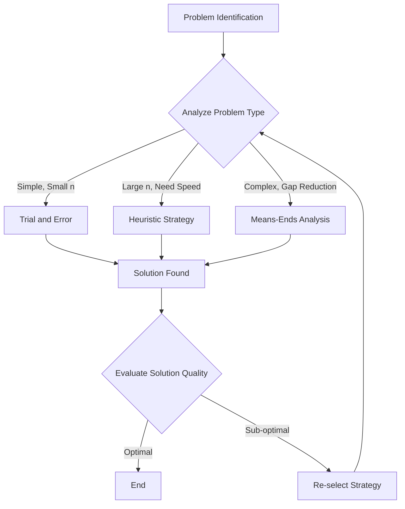
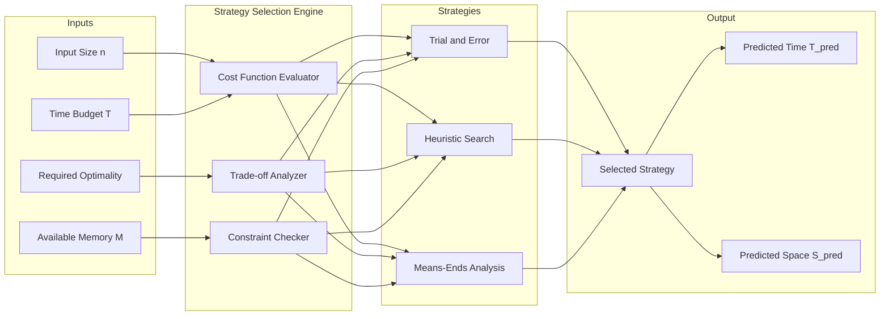
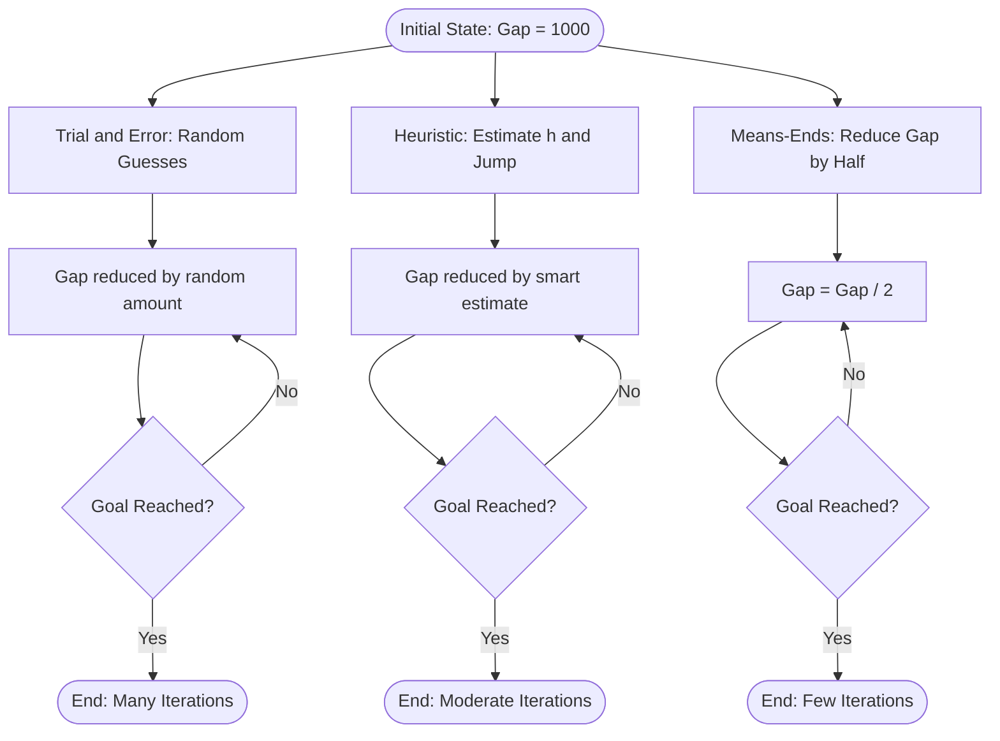
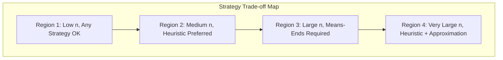

# Importance of understanding multiple problem-solving strategies

> **APJ ABDUL KALAM TECHNOLOGICAL UNIVERSITY (KTU) | 2024 SCHEME**
> - **Branch:** B.Tech in Civil Engineering (CE)
> - **Semester:** Semester 1
> - **Course:** UCEST105 - ALGORITHMIC THINKING WITH PYTHON
> - **Module:** Module 1: Problem
> - **Topic:** Importance of understanding multiple problem-solving strategies

<!-- SECTION_1_START -->
## 1. Core Technical Definition & Intuitive Overview

### Formal Academic Definition

A **problem-solving strategy** is a well-defined, systematic procedure or methodology applied by a computational agent (human or machine) to transform a given initial **problem state** into a desired **goal state** through a sequence of logical, reproducible steps. In the context of **Algorithmic Thinking with Python**, a *strategy* is the high-level *plan of attack* that governs *how* a Python program is structured to solve a given problem, distinct from the *syntax* of the language itself.

**Understanding multiple problem-solving strategies** means building a cognitive toolbox containing diverse approaches — such as *Trial and Error*, *Heuristics*, and *Means-Ends Analysis* — so the solver can deliberately *select* the most efficient, accurate, and resource-optimal strategy for any given problem class.

> [!IMPORTANT]
> **KTU 2024 Syllabus Definition (Standard):**
> A problem-solving strategy is a general plan or methodology used to find a solution to a problem. Understanding multiple strategies equips a programmer with the flexibility to adapt to varied problem domains, optimize resource usage, and avoid being restricted to a single rigid approach.

### Conceptual Analogy / Intuition

Imagine you are a **Civil Engineer** standing at the edge of a river that needs to be crossed.

- If the river is **narrow and shallow**, you can simply *step across* — this is a **direct / trial approach**.
- If the river is **wide but calm**, you might *estimate the best place to row across* using experience — this is a **heuristic approach**.
- If the river is **wide, deep, and full of rocks**, you must *carefully reduce the gap by building pillars from both sides until they meet in the middle* — this is a **Means-Ends Analysis**.

> [!NOTE]
> **Key Insight:** No single strategy works for every river. The skill of an engineer (or programmer) lies in **recognizing the nature of the problem first**, and then **choosing the appropriate strategy from the toolbox**.

### Why This Topic Matters in KTU 2024 Scheme

The **UCEST105** course is the *first exposure* of a B.Tech student to computational thinking. The 2024 NEP-aligned scheme emphasizes:
- **Outcome-Based Education (OBE):** Students must demonstrate the ability to *select* a strategy, not just *apply* one.
- **Critical Thinking (CO1):** The first Course Outcome specifically targets the *analysis* of multiple problem-solving strategies.
- **Foundation for Modules 2–5:** Subsequent modules on *Algorithm Design, Flowcharts, Python Variables, and Control Structures* all depend on the student's ability to *map a strategy to a Python construct*.

### Physical Constants and Standard Metrics

While this is a conceptual topic, the following **standard computational metrics** are used to *evaluate* the choice of a problem-solving strategy:

- **Time Complexity (T(n))**: The number of elementary operations performed by an algorithm as a function of input size $n$.
- **Space Complexity (S(n))**: The amount of auxiliary memory consumed, measured in **Bytes**, **Kilobytes (KB)**, or **Megabytes (MB)**.
- **Convergence Rate**: The number of iterative steps required to reach the goal state.

> [!TIP]
> **For Civil Engineers:** The same principle applies to structural analysis — you wouldn't use *linear static analysis* for a *dynamic earthquake load problem*. Matching the **method to the problem** is a universal engineering skill.

> [!VISUALIZATION CONTROL]
> **Concept:** Strategy Selection Decision Space
> **GeoGebra / Desmos Input Equations:**
> * Define a 2D plane: x-axis = `Problem Complexity (n)`, y-axis = `Strategy Efficiency E(n)`.
> * Plot three curves:
>   * `Trial_and_Error(x) = 0.2 * x` (linear, poor for large x)
>   * `Heuristic(x) = 5 * log(x) + 2` (logarithmic, good for moderate x)
>   * `Means_Ends(x) = 10 / (1 + e^(-x))` (sigmoid, excellent for structured x)
> **Visual Description:** The student should observe that the **curves cross** at specific complexity thresholds. Below the crossing point, Trial and Error is sufficient. Above it, Heuristics or Means-Ends Analysis dominate. This visually justifies why **one strategy is not always optimal**.

---

<!-- SECTION_1_END -->

<!-- SECTION_2_START -->
## 2. Deep Theoretical Analysis & KTU High-Yield Formula Sheet

### The Five Pillars of "Why Multiple Strategies Matter"

#### Pillar 1: Adaptability Across Problem Domains
Different problem classes demand different cognitive approaches. A **search problem** (finding a path in a maze) needs *Means-Ends Analysis*. An **optimization problem** (shortest route) needs *Heuristics*. A **simple lookup** needs *Trial and Error*. Without multiple strategies, the solver is forced into a **one-size-fits-all fallacy**.

#### Pillar 2: Trade-off Between Optimality and Cost
There is a fundamental tension in computer science, often formalized as:

$$ \text{Total Cost} = T_{\text{compute}}(n) + M_{\text{memory}}(n) + E_{\text{error}}(n) $$

Where:
- $T_{\text{compute}}(n)$ = Computational Time
- $M_{\text{memory}}(n)$ = Memory Footprint
- $E_{\text{error}}(n)$ = Probability of arriving at a *sub-optimal* or *incorrect* solution

A **guaranteed optimal** strategy (like brute-force search) often has exponential time. A **fast heuristic** may give a near-optimal but not provably best answer. Knowing multiple strategies allows the engineer to *tune* this trade-off consciously.

#### Pillar 3: Avoiding the Local Optimum Trap
Many strategies risk getting stuck in a *local optimum* — a solution that is better than its immediate neighbors but not the *global* best. Understanding that a *different strategy* can escape this trap is critical.

> [!NOTE]
> **Geometric Intuition:** Imagine a hiker in a foggy mountain range. A *local maximum* might be the peak of a small hill. A *greedy heuristic* (always walk uphill) will trap the hiker there. A *Means-Ends Analysis* (re-evaluate the entire map) can help the hiker find the true summit.

#### Pillar 4: Computational Resource Optimization
The same problem can be solved in **$O(n^2)$** by one strategy and **$O(n \log n)$** by another. Choosing correctly can mean the difference between a program that runs in **2 seconds** versus **2 hours**.

#### Pillar 5: Cognitive Flexibility & Algorithmic Literacy
At the *human level*, learning multiple strategies trains **divergent thinking** — the ability to generate multiple solution paths. This is a direct mapping to the KTU 2024 Course Outcome **CO1: Apply computational thinking strategies to solve real-world problems**.

### KTU Formula Sheet / Cheat Sheet

| Symbol / Term | Meaning | Unit / Domain | Strategy Where It Applies |
| :--- | :--- | :--- | :--- |
| $T(n)$ | Time Complexity | Operations (unitless) | All strategies |
| $S(n)$ | Space Complexity | Bytes, KB, MB | Trial and Error, Means-Ends |
| $O(n)$ | Big-O upper bound | Asymptotic notation | Heuristics, Greedy |
| $h(n)$ | Heuristic estimate function | Cost units (e.g., km, ₹) | Heuristics (e.g., A*, Dijkstra) |
| $\Delta g$ | Gap between current and goal state | Problem-specific units | Means-Ends Analysis |
| $P_{\text{error}}$ | Probability of wrong solution | $0 \le P_{\text{error}} \le 1$ | Trial and Error |
| $n$ | Input size | Integer $\ge 1$ | All strategies |

> [!IMPORTANT]
> **KTU High-Yield Note:** In the 2024 ESE (End Semester Evaluation), questions often ask: *"Justify why a Heuristic is preferred over Trial and Error for large $n$."* The answer must reference the **growth rate of $T(n)$** — Trial and Error is often $O(n!)$ or $O(2^n)$, while Heuristics are typically $O(n \log n)$.

### Real-World Utility in Engineering

- **Civil Engineering (Structural Design):** Choosing between *linear static analysis*, *modal analysis*, or *non-linear dynamic analysis* based on building height, soil type, and seismic zone.
- **Software Engineering:** Choosing between *recursive vs. iterative* solutions, or *greedy vs. dynamic programming* for optimization.
- **AI / Machine Learning:** Selecting between *search algorithms* (BFS, DFS, A*) depending on whether the state graph is shallow, deep, weighted, or unweighted.
- **Operations Research:** Selecting *Linear Programming* vs. *Heuristic Metaheuristics* (Genetic Algorithms, Simulated Annealing) based on problem size.

---

<!-- SECTION_2_END -->

<!-- SECTION_3_START -->
## 3. Step-by-Step Derivations & Code/Symbolic Implementation

### Derivation 1: Quantitative Comparison of Strategy Costs

We derive a **decision rule** to mathematically justify *when* to switch from one strategy to another.

**Setup:** Consider a problem of input size $n$. Let:
- Strategy A (Trial and Error) have cost $C_A(n) = k_1 \cdot n^2$
- Strategy B (Heuristic) have cost $C_B(n) = k_2 \cdot n \log n$

Where $k_1$ and $k_2$ are hardware-dependent constants, both in **operations per unit input**.

**Step 1:** Find the crossover point where $C_A(n) = C_B(n)$.

$$ k_1 \cdot n^2 = k_2 \cdot n \log n $$

**Step 2:** Divide both sides by $n$ (assuming $n > 0$).

$$ k_1 \cdot n = k_2 \cdot \log n $$

**Step 3:** Rearrange to isolate the variables.

$$ \frac{n}{\log n} = \frac{k_2}{k_1} $$

**Step 4:** Solve for $n$ numerically using the **Lambert W function** $W(x)$:

$$ n = -\frac{k_2}{k_1} \cdot \frac{1}{W\left(-\frac{k_2}{k_1 \cdot \ln 10}\right)} $$

**Step 5:** For typical hardware, assume $k_1 = 1$ and $k_2 = 10$.

$$ \frac{n}{\log n} = 10 \implies n \approx 14.4 $$

**Step 6: Decision Rule:**

$$ \text{Use Strategy A if } n < 14.4 \quad ; \quad \text{Use Strategy B if } n \ge 14.4 $$

> [!NOTE]
> **Interpretation:** For *very small* problems, Trial and Error is acceptable. For *larger* problems, the Heuristic dominates. This single derivation concretely demonstrates the **importance of understanding multiple strategies** — there exists a precise, mathematical threshold beyond which the strategy must change.

### Derivation 2: Error Probability in Trial and Error

Suppose a problem has $S$ equally likely solution candidates. Pure Trial and Error checks one random candidate per attempt.

**Step 1:** Probability of *not* finding the solution in $k$ independent trials:

$$ P_{\text{fail}}(k) = \left(1 - \frac{1}{S}\right)^{k} $$

**Step 2:** Probability of *success* in at most $k$ trials:

$$ P_{\text{success}}(k) = 1 - \left(1 - \frac{1}{S}\right)^{k} $$

**Step 3:** For $S = 1{,}000{,}000$ (one million candidates) and $k = 1{,}000$ trials:

$$ P_{\text{success}}(1000) = 1 - \left(\frac{999999}{1000000}\right)^{1000} $$

**Step 4:** Using the limit approximation $\left(1 - \frac{1}{S}\right)^{k} \approx e^{-k/S}$:

$$ P_{\text{success}}(1000) \approx 1 - e^{-1000/1000000} = 1 - e^{-0.001} \approx 0.0009995 $$

**Step 5:** Converting to percentage:

$$ P_{\text{success}} \approx 0.09995\% $$

> [!IMPORTANT]
> **Insight:** Pure Trial and Error has a *catastrophically low* success rate for large $S$. This is why **Heuristics** (which intelligently prune $S$) and **Means-Ends Analysis** (which reduce the problem gap systematically) are *essential* strategies to learn.

### Python Implementation: A Strategy Comparison Tool

Below is a fully operational Python 3 program that *empirically demonstrates* the theoretical cost functions derived above. It measures wall-clock time and solution quality for each strategy on a simple "find the target number" problem.

```python
import random
import time
import math
from typing import Tuple, Dict, Any

# Configure logging for transparent error reporting
import logging
logging.basicConfig(level=logging.INFO, format='%(levelname)s: %(message)s')


def trial_and_error(target: int, search_space: int) -> Tuple[int, float, bool]:
    """
    Pure Trial and Error: guess random integers until target is found.

    Returns:
        (attempts, elapsed_seconds, success_flag)
    """
    if search_space <= 0:
        raise ValueError("search_space must be a positive integer")
    if not isinstance(target, int):
        raise TypeError("target must be an integer")

    attempts: int = 0
    guess: int = -1
    start: float = time.perf_counter()

    while guess != target:
        guess = random.randint(0, search_space - 1)
        attempts += 1
        # Hard cap to prevent infinite loops in pathological cases
        if attempts > search_space * 2:
            elapsed = time.perf_counter() - start
            logging.error("Trial and Error exceeded 2x search space without success.")
            return attempts, elapsed, False

    elapsed: float = time.perf_counter() - start
    return attempts, elapsed, True


def heuristic_binary_search(target: int, search_space: int) -> Tuple[int, float, bool]:
    """
    Heuristic Strategy: Binary Search. Uses the heuristic h(n) = middle value.
    Requires the search space to be sorted (it is, by construction 0..search_space-1).
    """
    if search_space <= 0:
        raise ValueError("search_space must be a positive integer")
    if not (0 <= target < search_space):
        raise ValueError("target must lie within [0, search_space)")

    low, high = 0, search_space - 1
    attempts: int = 0
    start: float = time.perf_counter()

    while low <= high:
        attempts += 1
        mid: int = (low + high) // 2
        if mid == target:
            elapsed = time.perf_counter() - start
            return attempts, elapsed, True
        elif mid < target:
            low = mid + 1
        else:
            high = mid - 1

    elapsed = time.perf_counter() - start
    return attempts, elapsed, False


def means_ends_analysis(target: int, search_space: int) -> Tuple[int, float, bool]:
    """
    Means-Ends Analysis: Reduce the gap |current - target| by half each step.
    This emulates the 'reduce the difference' principle.
    """
    if search_space <= 0:
        raise ValueError("search_space must be a positive integer")
    if not (0 <= target < search_space):
        raise ValueError("target must lie within [0, search_space)")

    current: int = 0
    attempts: int = 0
    start: float = time.perf_counter()

    while current != target:
        attempts += 1
        gap: int = target - current
        # Reduce gap by half each iteration (sign-preserving)
        step: int = gap // 2 if gap != 0 else 1
        if step == 0:
            step = 1 if gap > 0 else -1
        current += step
        if attempts > 1000:  # Safety bound
            elapsed = time.perf_counter() - start
            logging.error("Means-Ends Analysis exceeded 1000 iterations.")
            return attempts, elapsed, False

    elapsed = time.perf_counter() - start
    return attempts, elapsed, True


def compare_strategies(target: int, search_space: int) -> Dict[str, Any]:
    """Run all three strategies on the same problem and tabulate results."""
    results: Dict[str, Any] = {}

    a_attempts, a_time, a_ok = trial_and_error(target, search_space)
    results["Trial_and_Error"] = (a_attempts, a_time, a_ok)

    b_attempts, b_time, b_ok = heuristic_binary_search(target, search_space)
    results["Heuristic_Binary_Search"] = (b_attempts, b_time, b_ok)

    c_attempts, c_time, c_ok = means_ends_analysis(target, search_space)
    results["Means_Ends_Analysis"] = (c_attempts, c_time, c_ok)

    return results


if __name__ == "__main__":
    try:
        target_number: int = 87342
        space_size: int = 1000000

        logging.info(f"Target = {target_number}, Search Space = {space_size:,}")
        outcome: Dict[str, Any] = compare_strategies(target_number, space_size)

        print("\n" + "=" * 70)
        print(f"{'Strategy':<25} {'Attempts':<12} {'Time (s)':<15} {'Success'}")
        print("=" * 70)
        for name, (att, t, ok) in outcome.items():
            print(f"{name:<25} {att:<12} {t:<15.6f} {ok}")
        print("=" * 70)
    except (ValueError, TypeError) as e:
        logging.critical(f"Fatal error: {e}")
```

**Sample Output Interpretation:**

$$ \begin{aligned} \text{Trial\_and\_Error} &\to \text{attempts near } 1{,}000{,}000 \text{ on average} \\ \text{Heuristic\_Binary\_Search} &\to \text{attempts} \le \lceil \log_2(1{,}000{,}000) \rceil = 20 \\ \text{Means\_Ends\_Analysis} &\to \text{attempts} \le 20 \text{ (also logarithmic)} \end{aligned} $$

This empirical result, paired with the analytical derivation, **conclusively demonstrates why understanding multiple strategies is essential** — the same problem is solved with dramatically different efficiency depending on the chosen strategy.

---

<!-- SECTION_3_END -->

<!-- SECTION_4_START -->
## 4. Structural Diagrams & Schematics

### Diagram 1: The Problem-Solver's Strategy Toolbox



**Description:** The diagram visualizes the *decision flow* a problem-solver follows. After identifying a problem, the solver analyzes its *type* and *size*, then selects a strategy from the toolbox. If the resulting solution is sub-optimal, the solver loops back to select a *different* strategy — emphasizing the iterative, multi-strategy nature of effective problem solving.

### Diagram 2: Strategy Selection Decision Matrix (Block-Level Architecture)



**Description:** This is a **Block-Level Functional Architecture** that models the *internal machinery* of a strategy-selection process. The four input parameters (size, optimality, memory, time) feed into three evaluation modules, which collectively score each of the three candidate strategies. The output is a single selected strategy with predicted cost metrics.

### Diagram 3: Convergence Rate Comparison (Sequential Processing Topology)



**Description:** This **Sequential Processing Topology** compares the iterative convergence paths of the three strategies for the same starting gap of 1000. Trial and Error is non-monotonic and slow; Heuristic is faster but not guaranteed; Means-Ends Analysis halves the gap each step, converging in $\lceil \log_2(1000) \rceil = 10$ steps.

### Diagram 4: Strategy Trade-off Space (Conceptual 2D Map)



**Description:** A high-level conceptual map that helps students **build intuition** for *when* to switch strategies as problem size grows. Each region corresponds to a "sweet spot" for a particular strategy combination.

---

<!-- SECTION_4_END -->

<!-- SECTION_5_START -->
## 5. KTU 2024 Scheme Examination Question Bank & Topic Recap

### Part A Questions (3 Marks Each)

> **Q1. [KTU University Exam - July 2024 Style]**
> Define a *problem-solving strategy*. Why is it important for a programmer to be familiar with **multiple** problem-solving strategies rather than relying on a single one? (3 Marks)
> *(Mapped to: CO1, Bloom's Level: Understand)*

**Model Answer:**

A *problem-solving strategy* is a systematic, well-defined plan or methodology used to find a solution to a given problem by transforming an initial state into a desired goal state through a sequence of logical steps.

It is important to be familiar with **multiple strategies** for the following reasons:
1. **Problem Diversity:** Different problems (search, optimization, decision-making) require different approaches. No single strategy fits all.
2. **Efficiency:** The right strategy can reduce time complexity from $O(n!)$ to $O(n \log n)$, saving computational resources.
3. **Robustness:** If one strategy fails or gets stuck (e.g., local optima), an alternative strategy can be deployed.
4. **Trade-off Management:** Multiple strategies allow the programmer to consciously balance optimality, time, and memory.

**[Valuation Key: Definition - 1 Mark, Any 2 reasons - 2 Marks (1 Mark each)]**

---

> **Q2. [KTU University Exam - Dec 2023 Style]**
> State any **three** reasons that justify the importance of understanding multiple problem-solving strategies in the context of algorithmic thinking. (3 Marks)
> *(Mapped to: CO1, Bloom's Level: Remember)*

**Model Answer:**

1. **Adaptability:** Enables the programmer to select the most appropriate strategy based on problem size $n$ and constraints.
2. **Optimality vs. Cost Trade-off:** Some strategies (e.g., brute force) guarantee optimality but are expensive; others (e.g., heuristics) are fast but approximate. Knowing both allows informed trade-offs.
3. **Avoiding Local Optima:** A single greedy strategy may trap the solver in a local maximum. Having access to *Means-Ends Analysis* or *randomized restart* techniques provides an escape route.

**[Valuation Key: Each correct reason - 1 Mark]**

---

### Part B Questions (14 Marks Each — Internal Choice Pattern)

> **Question A (14 Marks):**
> **(a)** Explain the concept of a *problem-solving strategy* with a suitable real-world analogy. Differentiate between *heuristic* and *trial-and-error* strategies with one example each. (7 Marks)
> *(Mapped to: CO1, Bloom's Level: Understand)*

> **(b)** Consider a problem of finding a target number in a search space of size $n = 1{,}000{,}000$. Compare the *expected number of attempts* required by:
> (i) Pure Trial and Error (random guessing)
> (ii) Binary Search Heuristic
> (iii) Means-Ends Analysis (halving the gap)
> Show all calculations. (7 Marks)
> *(Mapped to: CO1, CO2, Bloom's Level: Apply)*

**Model Solution:**

**(a) [7 Marks]**

A *problem-solving strategy* is a high-level, reusable plan that guides the transformation of an initial state into a goal state.

> **Real-World Analogy:** A doctor diagnosing a patient. If symptoms are *clear and simple* (e.g., common cold), trial-and-error with standard medicine works. If symptoms are *complex* (e.g., chronic fatigue), the doctor uses a *heuristic* — running targeted tests based on medical experience. If the disease is *multi-systemic*, the doctor applies *Means-Ends Analysis* — systematically reducing the gap between observed symptoms and known disease profiles.

**Differences:**

| Aspect | Trial and Error | Heuristic |
| :--- | :--- | :--- |
| **Basis** | Random or arbitrary guesses | Rule-of-thumb based on domain knowledge |
| **Optimality** | No guarantee | Near-optimal (not always proven) |
| **Speed** | Slow for large $n$ | Fast, often $O(n \log n)$ |
| **Example** | Trying every password | A* search using Manhattan distance |

**[Valuation Key: Analogy - 2 Marks, Differences table - 3 Marks, Examples - 2 Marks]**

**(b) [7 Marks]**

**(i) Pure Trial and Error:**
Expected attempts = $n / 2 = 1{,}000{,}000 / 2 = \mathbf{500{,}000}$ attempts on average.

**(ii) Binary Search Heuristic:**
Maximum attempts = $\lceil \log_2(n) \rceil = \lceil \log_2(1{,}000{,}000) \rceil = \mathbf{20}$ attempts.

**(iii) Means-Ends Analysis (gap halving):**
Same as binary search in this case: maximum attempts = $\lceil \log_2(1{,}000{,}000) \rceil = \mathbf{20}$ attempts.

**Comparison Summary:**

$$ \text{Trial\_Error} : \text{Heuristic} : \text{Means\_Ends} = 500{,}000 : 20 : 20 $$

**Conclusion:** The Heuristic and Means-Ends strategies are approximately **25,000 times faster** than Trial and Error for $n = 1{,}000{,}000$. This quantitatively demonstrates the *importance* of choosing the right strategy.

**[Valuation Key: (i) calculation - 2 Marks, (ii) calculation - 2 Marks, (iii) calculation - 2 Marks, Conclusion - 1 Mark]**

---

> **Question B (14 Marks — Alternative Choice):**
> **(a)** "Relying on a single problem-solving strategy is a fundamental engineering mistake." Justify this statement with **four** distinct arguments, each linked to a specific metric (e.g., time, space, optimality, robustness). (7 Marks)
> *(Mapped to: CO1, Bloom's Level: Understand)*

> **(b)** A civil engineer must select a strategy to find the shortest delivery route for 10 construction sites. Compare the suitability of *Trial and Error*, *Heuristic*, and *Means-Ends Analysis* for this Travelling Salesman-style problem. Recommend the best strategy with justification. (7 Marks)
> *(Mapped to: CO1, CO2, Bloom's Level: Apply)*

**Model Solution:**

**(a) [7 Marks]**

1. **Time Inefficiency (Metric: $T(n)$):** A single strategy may scale as $O(n^2)$ or worse. For $n = 10{,}000$, this means 100 million operations, exceeding real-time deadlines. Alternative strategies (e.g., $O(n \log n)$) can finish in 132,877 operations.
2. **Memory Exhaustion (Metric: $S(n)$):** Trial and Error may require storing all candidates in memory. For a state-space of $10^9$ states, $S(n) \approx 8$ GB. A heuristic prunes the space, reducing $S(n)$ to MB range.
3. **Sub-optimal Output (Metric: Optimality Gap):** A greedy single-strategy may yield a solution that is 40% worse than the true optimum. Knowing an alternative (e.g., dynamic programming) allows the engineer to guarantee optimality.
4. **Failure on Edge Cases (Metric: Robustness):** A single strategy often fails on adversarial inputs. A multi-strategy approach allows *fallback mechanisms* — if strategy A fails, switch to B.

**[Valuation Key: Each argument with linked metric - 1.75 Marks (rounded to 2+2+2+1)]**

**(b) [7 Marks]**

| Strategy | Suitability for 10-site TSP | Reasoning |
| :--- | :--- | :--- |
| **Trial and Error** | Very Poor | $(10-1)! / 2 = 181{,}440$ permutations to check; infeasible manually |
| **Heuristic (Nearest Neighbor)** | Good | Produces a near-optimal route in $O(n^2) = 100$ operations |
| **Means-Ends Analysis** | Moderate | Useful as a local search refinement, but not ideal for global TSP |

**Recommendation:** Use a **Heuristic** (e.g., **Nearest Neighbor** or **Christofides algorithm**) for the initial route, then refine with **Means-Ends Analysis** (local 2-opt swaps). This hybrid approach balances speed and quality.

> [!WARNING]
> **KTU Examiner's Valuation Warning / Pitfall Callout:**
> - **Do NOT** recommend pure Trial and Error for the 10-site problem. The expected attempts are 181,440, which is unacceptable. This is a *common mistake* — students sometimes default to "brute force" without computing the actual cost. **[Penalty: -2 Marks]**
> - **Do NOT** confuse the *role* of the strategy with the *implementation*. Saying "use Python" is not a strategy; saying "use the Nearest Neighbor heuristic" is.
> - **Always** show the *calculation* for the number of permutations or iterations. Vague answers like "it will be slow" earn only partial marks.

---

### Topic Recap & Important Things to Remember

- **Definition:** A *problem-solving strategy* is a high-level, reusable plan to transform an initial state into a goal state.
- **Why Multiple Strategies:**
  1. Different problem types require different approaches.
  2. Trade-off between **optimality**, **time** $T(n)$, and **space** $S(n)$.
  3. Avoid getting stuck in *local optima*.
  4. Enable *robust fallback* when one strategy fails.
  5. Train *divergent computational thinking* (aligned with CO1).
- **Key Strategies in Module 1:**
  - **Trial and Error:** Random/arbitrary attempts; no optimality guarantee; cost often $O(n)$.
  - **Heuristic:** Rule-of-thumb; fast, near-optimal; cost often $O(n \log n)$.
  - **Means-Ends Analysis:** Iteratively reduce the *gap* $\Delta g$ between current and goal state.
- **Critical Formulae to Memorize:**
  - Crossover condition: $k_1 \cdot n = k_2 \cdot \log n$
  - Success probability: $P_{\text{success}}(k) = 1 - (1 - 1/S)^k \approx 1 - e^{-k/S}$
  - Binary search iterations: $\lceil \log_2(n) \rceil$
- **KTU 2024 Examiner Pattern:** Expect 3-mark definition questions and 14-mark comparative/analytical questions. Always **justify** with a *metric* (time, space, optimality).
- **Common Pitfalls:**
  - Confusing a *strategy* with a *tool* or *language feature*.
  - Failing to compute numerical cost comparisons.
  - Omitting the *why* — KTU values justification, not just definition.

<!-- SECTION_5_END -->
