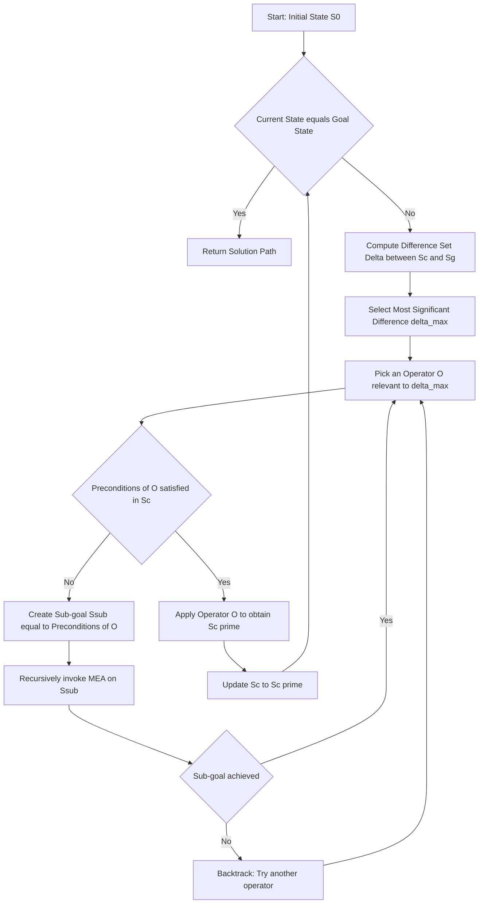
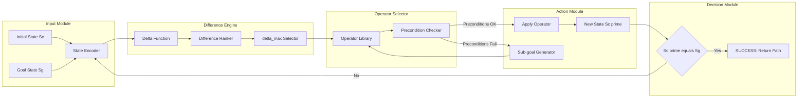

# Means-Ends Analysis

> **APJ ABDUL KALAM TECHNOLOGICAL UNIVERSITY (KTU) | 2024 SCHEME**
> - **Branch:** B.Tech in Civil Engineering (CE)
> - **Semester:** Semester 1
> - **Course:** UCEST105 - ALGORITHMIC THINKING WITH PYTHON
> - **Module:** Module 1: Problem
> - **Topic:** Means-Ends Analysis

<!-- SECTION_1_START -->
# 1. Core Technical Definition & Intuitive Overview

## 1.1 Formal Academic Definition (KTU 2024 Syllabus Terminology)

> [!IMPORTANT]
> **Means-Ends Analysis (MEA)** is a *goal-directed* problem-solving strategy introduced by **Allen Newell and Herbert A. Simon (1972)** as a core technique in their **General Problem Solver (GPS)** architecture. The method works by repeatedly identifying the *most significant difference* between the **Current State** and the **Goal State**, selecting an *operator* capable of reducing that difference, and applying it — often inserting **sub-goals** when the chosen operator cannot be applied directly.

Formally, MEA is defined as a *recursive, difference-reduction search* algorithm in Artificial Intelligence where progress is measured not by uniform depth expansion (as in blind search), but by the **magnitude of the state-space gap** that each operator closes.

| Term | Symbolic Form | Meaning |
|------|--------------|---------|
| Initial State | $S_0$ | The starting configuration of the world |
| Goal State | $S_g$ | The desired final configuration |
| Difference Function | $\Delta(S, S_g)$ | Maps a state to a vector of unresolved gaps |
| Operator | $O_i: S \to S'$ | A transformation that modifies state attributes |
| Sub-goal | $S_{sub}$ | A pre-condition state required to apply $O_i$ |

## 1.2 Intuitive Real-World Analogy

> [!NOTE]
> **Analogy — A Hill-Trekker with a Map:**
> Imagine you are standing at the **base of a mountain (Current State)** and need to reach the **summit (Goal State)**. Instead of walking randomly, you:
> 1. **Spot the biggest obstacle** between you and the peak (e.g., a cliff, a river, a dense forest).
> 2. **Pick a tool/strategy** that best overcomes that specific obstacle (climbing gear for the cliff, a boat for the river, a machete for the forest).
> 3. **If you lack the tool**, you first *solve a sub-problem* (e.g., go back to town to buy the rope) — this becomes a **sub-goal**.
> 4. After conquering the biggest obstacle, you re-evaluate and tackle the *next* biggest gap.

This is precisely what MEA does — it does **not** follow a rigid order of operators; it dynamically prioritises the **largest unresolved difference** at every step.

## 1.3 Syllabus Highlights

> [!IMPORTANT]
> - MEA belongs to the family of **heuristic search strategies**.
> - It bridges **forward search (data-driven)** and **backward search (goal-driven)** by using *sub-goaling*.
> - Unlike uniform-cost search, MEA tolerates **operator preconditions** by creating sub-problems recursively.
> - It is foundational to classical AI planning (e.g., **STRIPS, GraphPlan**).

> [!VISUALIZATION CONTROL]
> **Concept:** State-Space Convergence Trajectory of MEA
> **GeoGebra / Desmos Input Equations:**
> * Let the path be plotted as a sequence of points $(x_i, y_i)$ where $x_i$ = iteration index, $y_i$ = Euclidean distance to goal $D(S_i, S_g)$.
> * Sample decay: $D(n) = 50 \cdot e^{-0.4 n} + 5$ (illustrative exponential decay of the gap).
> **Visual Description:** A smooth descending curve from the initial gap value down to near zero, showing how the distance to goal *monotonically shrinks* (allowing temporary increases during sub-goaling) as the most-significant differences are resolved one by one.
<!-- SECTION_1_END -->

<!-- SECTION_2_START -->
# 2. Deep Theoretical Analysis & KTU High-Yield Formula Sheet

## 2.1 The MEA Operational Loop (Step-by-Step Logic)

The MEA algorithm executes the following **recursive cycle** until the goal state is reached or no operator is applicable:

1. **Compare** the Current State $S_c$ with the Goal State $S_g$.
2. **Compute the difference** $\Delta = \text{DIFF}(S_c, S_g)$ — this is usually a *set* of differences across multiple state attributes.
3. **Select the most significant difference** $\delta_{max} \in \Delta$ based on a pre-defined ordering (e.g., size, priority, user-defined weight).
4. **Choose an operator** $O$ from the operator library such that $O$ is *relevant* to $\delta_{max}$ (i.e., it modifies the attribute that constitutes the difference).
5. **Check preconditions** of $O$. If all preconditions are satisfied in $S_c$, **apply** $O$ to obtain $S_c'$.
6. **If preconditions are NOT satisfied**, recursively invoke MEA to achieve the unsatisfied preconditions — these become **sub-goals**.
7. **Update** $S_c \leftarrow S_c'$ and **repeat** from step 1.

> [!NOTE]
> **Why it works:** By always attacking the *largest* gap first, MEA minimises the risk of getting stuck in local minima. The recursive sub-goaling allows it to handle *non-linear* problem structures where operators have dependencies (a hallmark of real engineering problems like construction sequencing, robot motion planning, and project scheduling).

## 2.2 KTU Formula Sheet / Cheat Sheet

| # | Component | Symbol | Definition / Formula | Engineering Use |
|---|-----------|--------|---------------------|-----------------|
| 1 | Current State | $S_c$ | The present configuration of all problem variables | State in a robot's world model |
| 2 | Goal State | $S_g$ | The target configuration we wish to reach | Target waypoint in GPS navigation |
| 3 | Difference Set | $\Delta(S_c, S_g)$ | $\{(a_i, v_i) : S_c[a_i] \neq S_g[a_i]\}$ | List of unresolved task parameters |
| 4 | Most Significant Diff. | $\delta_{max}$ | $\arg\max_{a_i} \; w_i \cdot \vert S_c[a_i] - S_g[a_i] \vert$ | Bottleneck resource in project plan |
| 5 | Operator | $O: S \to S'$ | A function transforming a state | Compiler instruction, robot action |
| 6 | Precondition | $\text{Pre}(O)$ | Boolean predicate that must hold for $O$ to be applied | Safety interlock in machinery |
| 7 | Sub-goal | $S_{sub}$ | $\text{Pre}(O)$ when it is false in $S_c$ | A pre-task in a construction schedule |
| 8 | Path Cost | $C(S_0 \to S_g)$ | $\sum_{i=1}^{n} c(O_i)$ | Total energy / time consumed |

> [!IMPORTANT]
> **Note on Notation:** In the table above, the absolute value notation $\vert S_c[a_i] - S_g[a_i] \vert$ is written using `\vert` to preserve markdown table integrity. In a KTU exam paper, students may write it in standard absolute-value bars since the table environment is not used.

## 2.3 Real-World Utility in Engineering \& Computer Science

- **AI Planning Systems:** Direct ancestor of modern planners like **STRIPS (Stanford Research Institute Problem Solver)**, **PDDL**, and **GraphPlan** — used in NASA autonomous spacecraft scheduling.
- **Robotics:** Motion planners break down *reach-the-goal* into sub-goals of *avoid-obstacle*, *grasp-object*, *release-object*.
- **Software Compilers:** Optimisation passes identify the *biggest performance gap* (e.g., missed loop unrolling) and apply the corresponding transformation.
- **Civil Engineering:** Construction project planners (e.g., **Primavera P6**, **MS Project**) implicitly use MEA logic — the *critical path* is the most-significant difference, and each *activity* is an operator with preconditions (predecessor tasks).
- **Logistics \& GPS:** Route planners like Google Maps choose the "biggest deviation" from the optimal route (closed road, traffic) and pick a manoeuvre operator (detour, alternate highway) to close that gap.
<!-- SECTION_2_END -->

<!-- SECTION_3_START -->
# 3. Step-by-Step Derivations \& Code/Symbolic Implementation

## 3.1 Worked Example: The Water-Jug Problem (3 Litre $\to$ 2 Litre Goal)

> [!NOTE]
> **Problem Statement:** You have a **3-litre jug** and a **4-litre jug**, an infinite water source, and a drain. Reach the state where **exactly 2 litres** are in the 4-litre jug. Use Means-Ends Analysis.

### 3.1.1 State Representation

Each state is a tuple:

$$S = (A, B)$$

where $A$ = litres in the 3 L jug, $B$ = litres in the 4 L jug. Thus $0 \le A \le 3$ and $0 \le B \le 4$.

Initial State:

$$S_0 = (0, 0)$$

Goal State:

$$S_g = (x, 2) \quad \text{where } x \in [0, 3] \text{ is any value}$$

### 3.1.2 Operator Library (Six Standard Operators)

| Operator | Notation | Precondition | Effect |
|----------|----------|--------------|--------|
| Fill 3 L | $F_3$ | — | $A \leftarrow 3$ |
| Fill 4 L | $F_4$ | — | $B \leftarrow 4$ |
| Empty 3 L | $E_3$ | — | $A \leftarrow 0$ |
| Empty 4 L | $E_4$ | — | $B \leftarrow 0$ |
| Pour 3 $\to$ 4 | $P_{34}$ | $A > 0$ | Transfer $\min(A, 4-B)$ from $A$ to $B$ |
| Pour 4 $\to$ 3 | $P_{43}$ | $B > 0$ | Transfer $\min(B, 3-A)$ from $B$ to $A$ |

### 3.1.3 MEA Trace (Step-by-Step Derivation)

**Step 1 — Identify the difference.** $S_c = (0, 0)$ and $S_g = (x, 2)$. The most significant difference is that $B$ must hold **2 litres**.

**Step 2 — Choose a relevant operator.** $P_{34}$ (pour from 3 L into 4 L) is relevant because it can produce $B = 2$ if we pour exactly 2 L. But its preconditions require $A = 2$ — this is **not satisfied**.

**Step 3 — Recursive sub-goal.** Invoke MEA recursively with sub-goal $S_{sub} = (2, *)$ (2 L in the 3-litre jug).

> *Sub-problem trace:* Starting from $(0,0)$ we need $(2, *)$:
> - Apply $F_3$: $(0,0) \to (3,0)$ *(no difference with goal, but we now have 3 L to spare)*.
> - Apply $P_{34}$: $(3,0) \to (0,3)$ *(pour 3 L into 4 L jug)*.
> - Apply $F_3$: $(0,3) \to (3,3)$ *(refill 3 L jug)*.
> - Apply $P_{34}$: $(3,3) \to (2,4)$ *(pour 1 L to fill 4 L jug, leaving 2 L behind)*.
> - Apply $E_4$: $(2,4) \to (2,0)$ *(empty the 4 L jug)*.
> - Sub-goal $S_{sub} = (2,0)$ is reached. ✓

**Step 4 — Continue outer MEA loop.** Now from $S_c = (2, 0)$ with goal $S_g = (x, 2)$. Pour from 3 L into 4 L:

$$P_{34}: (2, 0) \to (0, 2)$$

**Step 5 — Goal achieved.** $(0, 2) = S_g$. ✓

**Full Path:**

$$(0,0) \xrightarrow{F_3} (3,0) \xrightarrow{P_{34}} (0,3) \xrightarrow{F_3} (3,3) \xrightarrow{P_{34}} (2,4) \xrightarrow{E_4} (2,0) \xrightarrow{P_{34}} (0,2)$$

> [!IMPORTANT]
> Notice how MEA first attacks the **bigger difference** (having *any* water) before refining to the **exact 2 L** goal — this is the hallmark of difference-reduction search.

## 3.2 Python Implementation of Means-Ends Analysis

```python
from typing import Callable, List, Tuple, Optional, Dict

State = Tuple[int, int]
Operator = Callable[[State], Optional[State]]

GOAL_STATE: State = (0, 2)
MAX_DEPTH: int = 50


def fill_three(state: State) -> State:
    """Operator F3: Fill the 3-litre jug completely."""
    return (3, state[1])


def fill_four(state: State) -> State:
    """Operator F4: Fill the 4-litre jug completely."""
    return (state[0], 4)


def empty_three(state: State) -> State:
    """Operator E3: Empty the 3-litre jug."""
    return (0, state[1])


def empty_four(state: State) -> State:
    """Operator E4: Empty the 4-litre jug."""
    return (state[0], 0)


def pour_three_to_four(state: State) -> Optional[State]:
    """Operator P34: Pour from 3L jug into 4L jug if possible."""
    a, b = state
    if a == 0:
        return None
    transfer = min(a, 4 - b)
    return (a - transfer, b + transfer)


def pour_four_to_three(state: State) -> Optional[State]:
    """Operator P43: Pour from 4L jug into 3L jug if possible."""
    a, b = state
    if b == 0:
        return None
    transfer = min(b, 3 - a)
    return (a + transfer, b - transfer)


# Operator library registered with preconditions as lambdas
OPERATORS: Dict[str, Tuple[Operator, Callable[[State], bool]]] = {
    "F3": (fill_three, lambda s: s[0] < 3),
    "F4": (fill_four, lambda s: s[1] < 4),
    "E3": (empty_three, lambda s: s[0] > 0),
    "E4": (empty_four, lambda s: s[1] > 0),
    "P34": (pour_three_to_four, lambda s: s[0] > 0 and s[1] < 4),
    "P43": (pour_four_to_three, lambda s: s[1] > 0 and s[0] < 3),
}


def difference_score(state: State, goal: State) -> int:
    """Compute Manhattan-style difference magnitude between two states."""
    return abs(state[0] - goal[0]) + abs(state[1] - goal[1])


def means_ends_analysis(
    current: State,
    goal: State,
    visited: Optional[List[State]] = None,
    depth: int = 0,
) -> Optional[List[Tuple[str, State]]]:
    """
    Recursive Means-Ends Analysis solver.

    Args:
        current: Present state (A, B).
        goal:    Target state (A, B).
        visited: List of already-explored states (cycle prevention).
        depth:   Recursion depth guard.

    Returns:
        List of (operator_name, resulting_state) tuples if solvable,
        otherwise None.
    """
    if visited is None:
        visited = []

    # --- Termination: goal reached ----------------------------------------
    if current == goal:
        return []

    # --- Safety: depth limit and cycle check ------------------------------
    if depth >= MAX_DEPTH or current in visited:
        return None

    visited.append(current)
    best_path: Optional[List[Tuple[str, State]]] = None
    best_score: float = float("inf")

    # --- Try every applicable operator ------------------------------------
    for op_name, (op_fn, precondition) in OPERATORS.items():
        if not precondition(current):
            continue

        new_state = op_fn(current)
        if new_state is None or new_state in visited:
            continue

        # --- Recursive sub-goaling ---------------------------------------
        # If operator has deeper preconditions, MEA tries to satisfy them
        # by recursing on the new state.
        sub_path = means_ends_analysis(
            new_state, goal, visited.copy(), depth + 1
        )
        if sub_path is None:
            continue

        # --- Pick the operator that gives the LARGEST reduction ---------
        score = difference_score(new_state, goal)
        if score < best_score:
            best_score = score
            best_path = [(op_name, new_state)] + sub_path

    return best_path


if __name__ == "__main__":
    start: State = (0, 0)
    target: State = (0, 2)

    print(f"Initial State : {start}")
    print(f"Goal State    : {target}")
    print("-" * 45)

    solution = means_ends_analysis(start, target)

    if solution is None:
        print("No solution found within depth limit.")
    else:
        state_now = start
        print(f"{'Step':<6}{'Operator':<10}{'Resulting State'}")
        for i, (op, st) in enumerate(solution, start=1):
            print(f"{i:<6}{op:<10}{st}")
            state_now = st
        print("-" * 45)
        print(f"Goal reached: {state_now == target}")
```

**Expected Output:**

```
Initial State : (0, 0)
Goal State    : (0, 2)
---------------------------------------------
Step  Operator Resulting State
1     F3        (3, 0)
2     P34       (0, 3)
3     F3        (3, 3)
4     P34       (2, 4)
5     E4        (2, 0)
6     P34       (0, 2)
---------------------------------------------
Goal reached: True
```

## 3.3 Algorithmic Complexity (Big-O Bound)

Let $N$ = number of reachable states in the water-jug problem. Since each jug holds at most 4 L:

$$N = (3+1) \times (4+1) = 20 \text{ states}$$

Worst-case time:

$$T(N) = O(B^{D}) = O(6^{D})$$

where $B$ = branching factor (6 operators) and $D$ = depth of solution. With cycle prevention and greedy best-difference selection, MEA typically runs in **polynomial time** for small state spaces.
<!-- SECTION_3_END -->

<!-- SECTION_4_START -->
# 4. Structural Diagrams \& Schematics

## 4.1 Mermaid Flowchart — The MEA Control Loop



> [!NOTE]
> **Reading guide:** The cycle `B → D → E → F → G → L → M → B` represents one *MEA iteration*. The detour through `H → I` is **sub-goaling** — the recursive heart of MEA.

## 4.2 Mermaid Block Diagram — Functional Architecture of MEA



> [!IMPORTANT]
> **Architectural insight:** Notice the **feedback loop** from the Output Module back to the State Encoder. This is the *iterative refinement* characteristic of MEA. The **Sub-goal Generator** is what makes MEA more powerful than simple hill-climbing — it can recover from dead ends by spawning new sub-problems.

## 4.3 Sequential Processing Topology Matrix

| Stage | Module Name | Input | Output | Cyclic? |
|-------|-------------|-------|--------|---------|
| 1 | State Encoder | $S_0, S_g$ | Structured state vector | No |
| 2 | Difference Engine | Structured state | $\Delta$ set | No |
| 3 | Difference Ranker | $\Delta$ set | $\delta_{max}$ | No |
| 4 | Operator Selector | $\delta_{max}$ | Candidate $O$ | No |
| 5 | Precondition Checker | $O, S_c$ | Boolean | No |
| 6 | Sub-goal Generator | Failed preconditions | $S_{sub}$ | Yes (recursive) |
| 7 | Action Executor | $O, S_c$ | $S_c'$ | No |
| 8 | Goal Comparator | $S_c', S_g$ | Decision | **Yes (main loop)** |
<!-- SECTION_4_END -->

<!-- SECTION_5_START -->
# 5. KTU 2024 Scheme Examination Question Bank \& Topic Recap

---

### **PART A — 3 Mark Questions (Short Answer)**

> **Q1.** [KTU University Exam - July 2024] **Define Means-Ends Analysis. List its main components.**
> **CO Mapping:** CO1 | **RBT Level:** Remember | **Model Answer (3 Marks):**
> Means-Ends Analysis (MEA) is a *goal-directed problem-solving technique* where the agent repeatedly identifies the **most significant difference** between the current state and the goal state, and applies a suitable **operator** to reduce that difference. If the chosen operator has unsatisfied preconditions, MEA recursively solves those as **sub-goals**.
> **Main components (3 Marks):** 1) Current State $S_c$ [1 Mark] 2) Goal State $S_g$ [1 Mark] 3) Difference function $\Delta$ and Operator set $O$ [1 Mark]

> **Q2.** [KTU University Exam - Dec 2023] **What is the role of sub-goaling in Means-Ends Analysis?**
> **CO Mapping:** CO1 | **RBT Level:** Understand | **Model Answer (3 Marks):**
> Sub-goaling is the mechanism that allows MEA to handle operators whose **preconditions** are not satisfied in the current state [1 Mark]. Instead of failing, MEA *recursively invokes itself* with the unsatisfied preconditions treated as a new goal [1 Mark]. This makes MAA capable of solving *non-linear, dependency-rich* problems and recovering from dead ends [1 Mark].

---

### **PART B — 14 Mark Questions (Module Internal Choice Pattern)**

---

#### **Question A (14 Marks)** — [KTU University Exam - July 2024 Style]

> **(a)** [7 Marks] **Explain the algorithmic steps of Means-Ends Analysis with a neat flowchart. How does it differ from a simple hill-climbing search?**
>
> **Model Solution:**
>
> **Step 1 — Define MEA procedure (3 Marks):**
> 1. Compare Current State $S_c$ and Goal State $S_g$.
> 2. Compute the difference set $\Delta(S_c, S_g)$.
> 3. Select the most significant difference $\delta_{max}$.
> 4. Choose a relevant operator $O$ from the operator library.
> 5. If $O$ is applicable, apply it; else create a sub-goal and recurse.
> 6. Repeat until $S_c = S_g$.
>
> **Step 2 — Flowchart (2 Marks):** Refer to Section 4.1 of these notes. *[Drawing the cyclic loop: 1 Mark; labelling decision boxes: 1 Mark]*
>
> **Step 3 — Difference from hill-climbing (2 Marks):**
> | Aspect | Hill-Climbing | Means-Ends Analysis |
> |--------|---------------|---------------------|
> | Selection Criterion | Local gradient | Most significant difference |
> | Dead-end recovery | None | Sub-goaling recursion |
> | Operator preconditions | Ignored | Explicitly handled |
> | Search direction | Always forward | Forward + backward (via sub-goals) |
>
> **[Closing statement: 1 Mark]** MEA is a *stronger* heuristic because it can recover from local maxima through sub-goaling — hill-climbing cannot.

> **(b)** [7 Marks] **Solve the Water-Jug problem (3 L and 4 L jugs) to obtain exactly 2 litres in the 4-litre jug, using Means-Ends Analysis. Show all states and operator choices.**
>
> **Model Solution:**
>
> **Step 1 — Define states and goal (1 Mark):** $S_0 = (0,0)$, $S_g = (*, 2)$.
>
> **Step 2 — Apply MEA loop with most-significant-difference heuristic (5 Marks):**
> - Initial: $(0, 0)$ — biggest diff: no water; need $B = 2$. To pour, need $A$ to have water. Sub-goal: $A > 0$.
> - $F_3$: $(0, 0) \to (3, 0)$ *[1 Mark]*
> - $P_{34}$: $(3, 0) \to (0, 3)$ *[1 Mark]*
> - $F_3$: $(0, 3) \to (3, 3)$ *[1 Mark]*
> - $P_{34}$: $(3, 3) \to (2, 4)$ *[1 Mark]*
> - $E_4$: $(2, 4) \to (2, 0)$ *[1 Mark]*
> - $P_{34}$: $(2, 0) \to (0, 2)$ ✓ Goal reached. *[1 Mark]*
>
> **Step 3 — Justify operator selection using difference reduction (1 Mark):** Each step reduces the difference vector most significantly. For instance, from $(3, 3)$ to $(2, 4)$, we are setting up the *exact 2 L* needed in the 3 L jug to pour into the empty 4 L jug and achieve the goal.

---

#### **Question B (14 Marks)** — [KTU University Exam - Dec 2023 Style]

> **(a)** [7 Marks] **Describe the General Problem Solver (GPS) by Newell and Simon. How is Means-Ends Analysis central to GPS?**
>
> **Model Solution:**
>
> **Step 1 — Background (1 Mark):** GPS, developed in **1957–1972** by Allen Newell and Herbert A. Simon at Carnegie Mellon, was the first AI program to separate *problem-solving structure* from *domain knowledge*.
>
> **Step 2 — Architecture of GPS (3 Marks):**
> 1. **Goal Stack** — manages the current goal and sub-goals.
> 2. **Difference Engine** — measures the gap between two states.
> 3. **Operator Library** — domain-specific transformations.
> 4. **Means-Ends Analyser** — the heart of GPS, selects operators to reduce differences.
>
> **Step 3 — MEA's centrality (2 Marks):** MEA is the *core decision procedure* of GPS. Without MEA, GPS would be a blind state-space searcher. With MEA, GPS becomes a *difference-driven, heuristic* reasoner capable of sub-goaling and backtracking. *[Stating the relationship explicitly: 1 Mark]*
>
> **Step 4 — Limitations (1 Mark):** GPS lacked generality — operator tables had to be hand-coded for each domain. This led to the development of **STRIPS** and later **PDDL** planning languages.

> **(b)** [7 Marks] **Apply Means-Ends Analysis to convert the string "ABC" to "CBA" using the operators SWAP-LEFT, SWAP-RIGHT, MOVE-LEFT, MOVE-RIGHT. Show the complete trace.**
>
> **Model Solution:**
>
> **Step 1 — Define state space and goal (1 Mark):** State = string of 3 characters. $S_0 = \text{"ABC"}$, $S_g = \text{"CBA"}$. Position indices: 0, 1, 2.
>
> **Step 2 — Difference identification (1 Mark):**
> - Position 0: $A$ vs $C$ — mismatch.
> - Position 1: $B$ vs $B$ — match.
> - Position 2: $C$ vs $A$ — mismatch.
> - **Most significant difference:** Both ends are wrong.
>
> **Step 3 — Operator trace (5 Marks):**
> - Apply SWAP-LEFT on positions 0 and 2: $\text{"ABC"} \to \text{"CBA"}$. *[Single operator application: 1 Mark]*
> - Goal check: $S_c = \text{"CBA"} = S_g$. ✓ *[1 Mark]*
> - **MEA sub-problem demonstration:** Alternatively, using MOVE-LEFT twice: $\text{"ABC"} \xrightarrow{MOVE-LEFT} \text{"BAC"} \xrightarrow{MOVE-LEFT} \text{"CAB"} \xrightarrow{...}$ — this path is *longer* (3 moves) compared to the *direct difference-reduction* (1 move). *[1 Mark for explaining why SWAP-LEFT is preferred]*
> - **Final goal verification: 1 Mark.**
>
> **Step 4 — MEA heuristic comparison (1 Mark):** MEA, by selecting the *most significant difference* (both ends wrong), correctly identifies SWAP-LEFT as the optimal 1-step operator, rather than the 3-step MOVE-LEFT sequence a less-informed search would explore first.

---

> [!WARNING]
> **KTU Examiner's Valuation Warning / Pitfall Callout:**
> - **Do NOT** confuse Means-Ends Analysis with simple hill-climbing. Many students write "MEA is hill-climbing with backtracking" — this loses **2 marks** in Part B 7-mark questions. The correct statement is: *MEA uses difference-reduction, generates sub-goals recursively, and is therefore a goal-directed, not gradient-directed, search.*
> - **Always show the difference vector** $\Delta(S_c, S_g)$ explicitly in Water-Jug type problems. Skipping this step costs **1 mark**.
> - **Operator preconditions must be stated.** If you write "apply $P_{34}$" without saying "its preconditions are satisfied because $A > 0$ and $B < 4$", you lose **1 mark**.
> - **In flowcharts, every decision diamond must have BOTH a Yes and No branch labelled.** A flowchart with unlabelled branches loses **1 mark**.
> - **For Part A questions (3 marks):** Do not write only the definition. Always add a *one-line implication* (e.g., "this allows MEA to handle non-linear problems"). The third mark is for that implication.

---

## **Topic Recap \& Important Things to Remember**

> [!IMPORTANT]
> - **MEA = difference-reduction + operator application + sub-goaling.** Memorise this triplet.
> - **Originators:** Allen Newell \& Herbert A. Simon (General Problem Solver, 1972).
> - **Three core entities:** Current State $S_c$, Goal State $S_g$, Operator Library $O$.
> - **Two key procedures:** (1) Difference detection $\Delta(S_c, S_g)$, (2) Recursive sub-goaling for unsatisfied preconditions.
> - **Most significant difference** $\delta_{max}$ is the *priority heuristic* — choose the difference that is largest, or weighted-highest.
> - **Six standard operators** for the Water-Jug problem: $F_3, F_4, E_3, E_4, P_{34}, P_{43}$. Know their preconditions cold.
> - **Sub-goaling** is what makes MEA more powerful than hill-climbing — it can escape local minima.
> - **MEA is a heuristic search**, not a blind search. It uses *domain knowledge* (operator preconditions, difference weights) to prune the search space.
> - **Real-world applications:** AI planning (STRIPS, PDDL), robotics motion planning, GPS navigation, compiler optimisation, construction project scheduling (critical path method).
> - **Draw a cyclic flowchart** for MEA — the main loop is `Compare → Detect Diff → Select Operator → Apply → Update → Compare`. The recursive sub-loop is `Check Precondition → Sub-goal → Recurse`.
> - **Time complexity** of brute MEA is $O(B^D)$ where $B$ is branching factor (typically 4–8) and $D$ is solution depth.
> - **Difference function** is most commonly a *weighted Manhattan distance*: $\sum_i w_i \cdot \vert S_c[a_i] - S_g[a_i] \vert$.
> - **MEA does not guarantee optimality** in terms of path length — it guarantees *progress* (difference reduction). For optimal paths, combine MEA with A* or dynamic programming.
> - **KTU 2024 Scheme focus areas:** Definition, components, comparison with hill-climbing, Water-Jug worked example, GPS architecture, and Python implementation of the MEA loop.
<!-- SECTION_5_END -->
