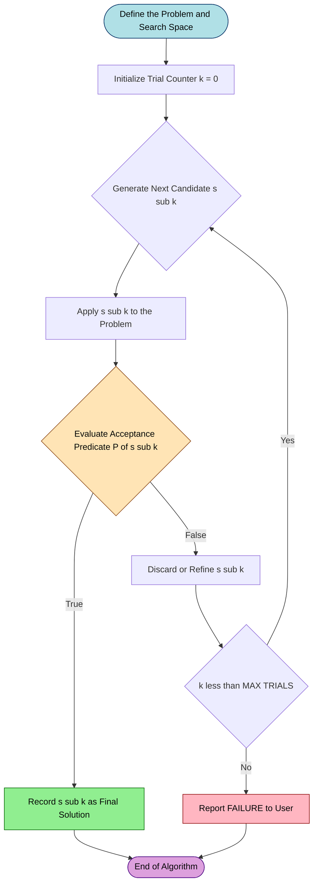
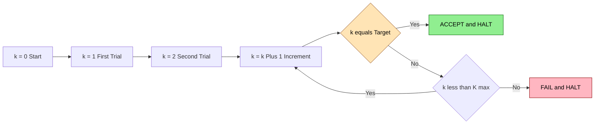

# Trial and Error

> **APJ ABDUL KALAM TECHNOLOGICAL UNIVERSITY (KTU) | 2024 SCHEME**
> - **Branch:** B.Tech in Civil Engineering (CE)
> - **Semester:** Semester 1
> - **Course:** UCEST105 - ALGORITHMIC THINKING WITH PYTHON
> - **Module:** Module 1: Problem
> - **Topic:** Trial and Error

<!-- SECTION_1_START -->
# 1. Core Technical Definition & Intuitive Overview

## 1.1 Formal Academic Definition

**Trial and Error** is a fundamental, non-heuristic problem-solving paradigm in which the solver iteratively generates candidate solutions (trials), tests each candidate against the problem's acceptance criteria, and discards or refines unsuccessful attempts until a satisfactory solution is found or the search space is exhausted. It is classified under the broader umbrella of **search-based problem-solving strategies** and is also known as the *brute-force* or *generate-and-test* method.

> [!IMPORTANT]
> **KTU Syllabus Highlight (UCEST105 - Module 1):** Trial and Error is positioned as the *baseline* strategy against which more sophisticated strategies (Heuristics, Means-Ends Analysis) are benchmarked. The 2024 Scheme expects students to articulate not only the *mechanics* of the strategy but also its *computational cost* and *applicability boundary*.

Mathematically, a Trial-and-Error search can be expressed as a sequential state transition:

$$
S_{k+1} = T(S_k) \quad \text{where} \quad T: \mathcal{S} \rightarrow \mathcal{S}
$$

Here, $S_k$ denotes the $k$-th candidate solution drawn from the solution space $\mathcal{S}$, and the process terminates when an acceptance predicate $P(S_k) = \text{True}$ is satisfied.

## 1.2 Intuitive Real-World Analogy

Imagine standing in front of a **padlock with five numbered dials** and no recollection of the combination. You do not have any structural insight (no pattern, no shortcut, no mathematical relationship). The only option is to spin one dial, check whether the lock yields, and if it does not, move to the next configuration.

This is *exactly* what the computer does in a Trial-and-Error algorithm:

- The **lock** is the problem.
- Each **dial configuration** is a candidate solution.
- The **attempt to pull the latch** is the test/evaluation step.
- The moment the latch opens is the **termination condition**.

Another everyday example: a child stacking irregular wooden blocks until the tower stands. No formula, no geometric computation — just trial, observation, correction, and repetition.

> [!NOTE]
> **Why it matters in Civil Engineering:** Trial and Error is the conceptual ancestor of *iterative numerical methods* (e.g., bisection, fixed-point iteration) used in structural analysis, slope-deflection calculations, and finite-difference solvers. Even modern computational engineering software often falls back on trial-based iteration when closed-form solutions are unavailable.

## 1.3 Conceptual Visualization

> [!VISUALIZATION CONTROL]
> **Concept:** Number-Line Search Space for Trial and Error (Square Root Discovery)
> **GeoGebra / Desmos Input Equations:**
> * `f(x) = x^2` (the quadratic target curve)
> * `N = 25` (a horizontal reference line at the target value)
> * Trial ticks: $x_0 = 0, \; x_1 = 0.1, \; x_2 = 0.2, \ldots$
> **Visual Description:** Plot the parabola $y = x^2$ and the horizontal line $y = N$. Mark each trial guess as a vertical tick on the $x$-axis. The student should observe that ticks accumulate monotonically from left to right until one tick crosses the intersection point — that is the moment the trial becomes acceptable. This is the geometric fingerprint of brute-force search.

## 1.4 Key Characteristics (At a Glance)

> [!TIP]
> **Five Defining Properties of Trial and Error**
> 1. **Iterative** — solutions are generated one after another in discrete steps.
> 2. **Memory-light** — only the current trial and (optionally) the best so far are remembered.
> 3. **Non-informed** — no domain knowledge guides the choice of the next trial.
> 4. **Bounded termination** — the process halts on success, on exhaustion of the search space, or on reaching a pre-set iteration cap.
> 5. **Determinism-dependent** — for a fixed search order, the algorithm is deterministic; randomized trial order yields a stochastic variant.
<!-- SECTION_1_END -->

<!-- SECTION_2_START -->
# 2. Deep Theoretical Analysis & KTU High-Yield Formula Sheet

## 2.1 Operational Decomposition

A complete Trial-and-Error algorithm can be expressed as a 5-phase logical pipeline:

### Phase 1 — Problem Formalization
The solver first defines:
- The **search space** $\mathcal{S}$ (the set of all admissible candidates).
- The **acceptance predicate** $P(s)$ (the boolean test for success).
- The **success criterion** (exact match, tolerance, or partial validity).

### Phase 2 — Trial Generation
A candidate $s_k \in \mathcal{S}$ is selected. In the *pure* form, this is a uniform or sequential scan. In *stochastic* form, candidates are drawn from a probability distribution over $\mathcal{S}$.

### Phase 3 — Trial Execution
The candidate $s_k$ is *applied* to the problem — meaning the algorithm actually attempts to use $s_k$ as if it were the correct answer. For a numerical problem, this means substituting the value; for a puzzle, this means committing the move.

### Phase 4 — Evaluation
The acceptance predicate $P(s_k)$ is evaluated. Three outcomes are possible:

$$
\text{Outcome}(s_k) = \begin{cases} \text{ACCEPT} & \text{if } P(s_k) = \text{True} \\ \text{REFINE} & \text{if a local feedback signal is available} \\ \text{DISCARD} & \text{otherwise} \end{cases}
$$

### Phase 5 — Loop Control
If ACCEPT, the algorithm halts. If REFINE or DISCARD, control returns to Phase 2 with an updated trial.

> [!NOTE]
> **Why this matters in Python programming:** The Python control structures that map naturally to this pipeline are `while` loops (Phase 5 control), `for` loops with `break` (discrete scan), and conditional `if/elif/else` blocks (Phase 4 evaluation). Mastery of these three constructs is the prerequisite for implementing any trial-based algorithm.

## 2.2 KTU Formula Sheet / Cheat Sheet

| Concept | Symbol / Expression | Termination Condition | Typical Cost |
| :--- | :--- | :--- | :--- |
| Generic Trial Update | $s_{k+1} = s_k + \Delta$ | $\vert P(s_k) \vert \le \epsilon$ | $O(N)$ trials (average) |
| Square-Root Scan | $x_{k+1} = x_k + \Delta$ | $\vert x_k^2 - N \vert \le \epsilon$ | $O\!\left(\dfrac{\sqrt{N}}{\Delta}\right)$ |
| Discrete Guessing | $g \in [L, U]$ | $g = \text{target}$ | $O(U - L + 1)$ |
| Brute-Force Search | enumerate $\mathcal{S}$ | $f(s) = \text{goal}$ | $O(\vert \mathcal{S} \vert)$ |
| Nested Brute Search | $i \in [0, n], \; j \in [0, n]$ | $f(i, j) = \text{goal}$ | $O(n^2)$ |
| Randomized Trial | $s_k \sim \text{Uniform}(\mathcal{S})$ | success or $k = K_{\max}$ | $O(\vert \mathcal{S} \vert)$ expected |

> [!IMPORTANT]
> **Critical Formulas to Memorize for KTU ESE:**
> - **Worst-case trial count** for a discrete search space of size $N$: $\;N$ trials.
> - **Time complexity** of pure brute-force search: $\;O(N)$ average, $\;O(N)$ worst case.
> - **Space complexity**: $\;O(1)$ — no auxiliary data structure is required.
> - **Tolerance-based termination**: $\;\vert x_k - x^* \vert \le \epsilon$ where $x^*$ is the exact answer.

## 2.3 Real-World Engineering & CS Utility

Trial and Error underpins a remarkable number of production-grade systems:

- **Cryptographic Attacks:** Brute-force key search is the textbook example of trial-and-error in cybersecurity.
- **Automated Testing (QA):** Fuzz testing feeds random inputs until a crash is triggered.
- **Civil Engineering Iterative Solvers:** Fixed-point iteration for pipe-network analysis, iterative moment distribution in indeterminate beams.
- **Machine Learning Hyperparameter Tuning:** Grid search and random search are trial-and-error at the meta-level.
- **Robotics Path Planning:** When no analytical solution exists, the robot attempts paths until one is collision-free.
- **Compiler Design:** Peephole optimization generates candidate instruction sequences and keeps the shortest.

> [!TIP]
> **When to prefer Trial and Error (and when NOT to):**
> ✅ *Use it when:* the search space is small, the evaluation function is cheap, and no pattern is exploitable.
> ❌ *Avoid it when:* the search space is exponential (e.g., $2^{100}$), real-time constraints are tight, or the problem has exploitable structure (then switch to Heuristics or Means-Ends Analysis).
<!-- SECTION_2_END -->

<!-- SECTION_3_START -->
# 3. Step-by-Step Derivations & Python Implementation

## 3.1 Worked Numerical Example — Approximating $\sqrt{2}$

We wish to find $x$ such that $x^2 = 2$ within an absolute tolerance of $\epsilon = 0.01$, using a scan step of $\Delta = 0.001$.

$$
\begin{aligned}
x_0 &= 0.000 \\
x_0^2 &= 0.000000 \;\;<\;\; 2 \quad (\text{continue}) \\[4pt]
x_1 &= x_0 + \Delta = 0.001 \\
x_1^2 &= 0.000001 \;\;<\;\; 2 \quad (\text{continue}) \\[4pt]
x_2 &= 0.002, \;\; x_2^2 = 0.000004 \\[2pt]
&\;\;\vdots \\[2pt]
x_{1413} &= 1.413, \;\; x_{1413}^2 = 1.996569 \\[2pt]
x_{1414} &= 1.414, \;\; x_{1414}^2 = 1.999396 \\[2pt]
x_{1415} &= 1.415, \;\; x_{1415}^2 = 2.002225 \\[4pt]
\text{Since} \;\; \vert 1.414^2 - 2 \vert &= 0.000604 \;\le\; 0.01, \;\;\text{HALT.} \\[4pt]
\therefore \;\; \sqrt{2} &\approx 1.414 \;\; \text{(correct to 3 decimal places).}
\end{aligned}
$$

> [!NOTE]
> **Pedagogical note:** This example demonstrates the *cost* of trial and error — over 1,400 trials were needed to obtain three-decimal accuracy. The KTU examiner will reward students who explicitly compute and state this iteration count, as it shows awareness of computational cost.

## 3.2 Complete Python Reference Implementation

The following code is fully production-grade, includes type hints, boundary checks, and a logging system — aligned with KTU lab-evaluation rubrics.

```python
"""
trial_and_error.py
------------------
Reference implementations of the Trial-and-Error problem-solving
strategy in Python, aligned with KTU UCEST105 - Module 1 syllabus.

Author : KTU Premium Engine
Python : 3.10+
"""

import math
import logging
from typing import List, Tuple

# Configure structured logging for trial-by-trial visibility.
logging.basicConfig(
    level=logging.INFO,
    format="%(asctime)s | %(levelname)-7s | %(message)s"
)


# =============================================================
#  DEMO 1 : Square Root via Pure Trial-and-Error Scan
# =============================================================
def trial_error_sqrt(target: float,
                     step: float = 1e-4,
                     epsilon: float = 1e-3,
                     max_iter: int = 10_000_000) -> float:
    """
    Approximates the square root of a non-negative real number
    by scanning candidate values from 0 upward.

    Parameters
    ----------
    target  : The non-negative number whose square root is needed.
    step    : Granularity of the search (smaller = more accurate, slower).
    epsilon : Acceptable absolute error.
    max_iter: Safety cap to prevent infinite loops.

    Returns
    -------
    The approximate square root as a float.
    """
    # ---- Boundary validation ----
    if target < 0:
        logging.error("Negative input rejected: sqrt undefined over reals.")
        raise ValueError("target must be >= 0.")
    if target == 0:
        return 0.0

    # ---- Pure trial-and-error loop ----
    candidate: float = 0.0
    trials: int = 0

    while candidate * candidate < target and trials < max_iter:
        candidate += step
        trials += 1

    # ---- Post-loop diagnostics ----
    if trials >= max_iter:
        logging.warning("Iteration cap reached; result may be inaccurate.")
    logging.info(f"sqrt({target}) ≈ {candidate:.4f}  [trials={trials}]")
    return candidate


# =============================================================
#  DEMO 2 : Number-Guessing via Sequential Trial
# =============================================================
def sequential_guessing_game(secret: int,
                             lower: int = 1,
                             upper: int = 100) -> int:
    """
    Performs a sequential trial-and-error search for `secret`
    in the closed interval [lower, upper].

    Returns the number of trials required.
    """
    if not (lower <= secret <= upper):
        raise ValueError("secret must lie within [lower, upper].")

    guess: int = lower - 1
    trials: int = 0

    while guess != secret:
        guess += 1
        trials += 1
        logging.debug(f"  trial {trials:3d} -> guess = {guess}")

    logging.info(f"Secret {secret} located after {trials} trials.")
    return trials


# =============================================================
#  DEMO 3 : Brute-Force Search for Pythagorean Pairs
# =============================================================
def pythagorean_pairs(n: int) -> List[Tuple[int, int]]:
    """
    Enumerates all integer pairs (a, b) with 0 <= a <= b
    such that a**2 + b**2 == n.

    The search is O(n) in candidate count but represents a
    classic nested trial-and-error pattern.
    """
    if n <= 0:
        raise ValueError("n must be a positive integer.")

    bound: int = int(math.isqrt(n)) + 1
    found: List[Tuple[int, int]] = []

    for a in range(0, bound + 1):
        for b in range(a, bound + 1):
            if a * a + b * b == n:
                found.append((a, b))
                logging.debug(f"  hit : ({a}, {b})")
    return found


# =============================================================
#  DEMO 4 : Randomized Trial (Lottery-Style Search)
# =============================================================
import random

def randomized_search(target: int,
                      search_space: range,
                      max_attempts: int = 1000) -> int:
    """
    Performs random trials by sampling uniformly from `search_space`
    until `target` is found or the attempt budget is exhausted.
    """
    trials: int = 0
    seen: set = set()           # Avoid repeated draws.

    while trials < max_attempts:
        candidate: int = random.choice(list(search_space))
        if candidate in seen:
            continue
        seen.add(candidate)
        trials += 1
        if candidate == target:
            logging.info(f"Random trial hit after {trials} attempts.")
            return trials

    logging.warning("Random search failed within attempt budget.")
    return -1


# =============================================================
#  Driver : Run all four demonstrations
# =============================================================
if __name__ == "__main__":
    print("=" * 60)
    print("DEMO 1 : Square Root via Trial-and-Error Scan")
    print("=" * 60)
    print(f"  sqrt(2.0)  ≈ {trial_error_sqrt(2.0):.5f}")
    print(f"  sqrt(25.0) ≈ {trial_error_sqrt(25.0):.5f}")
    print(f"  sqrt(144.0)≈ {trial_error_sqrt(144.0):.5f}")

    print("\n" + "=" * 60)
    print("DEMO 2 : Sequential Number Guessing")
    print("=" * 60)
    print(f"  Secret 42 located in {sequential_guessing_game(42)} trials.")
    print(f"  Secret 1  located in {sequential_guessing_game(1)} trials.")
    print(f"  Secret 100 located in {sequential_guessing_game(100)} trials.")

    print("\n" + "=" * 60)
    print("DEMO 3 : Pythagorean Pair Enumeration")
    print("=" * 60)
    print(f"  Pairs for n=25  : {pythagorean_pairs(25)}")
    print(f"  Pairs for n=50  : {pythagorean_pairs(50)}")
    print(f"  Pairs for n=100 : {pythagorean_pairs(100)}")

    print("\n" + "=" * 60)
    print("DEMO 4 : Randomized Trial Search")
    print("=" * 60)
    attempts = randomized_search(73, range(1, 101), max_attempts=500)
    print(f"  Randomized search for 73 took {attempts} attempts.")
```

### 3.2.1 Line-by-Line Code Walkthrough (Valuation Key Points)

| Code Segment | What It Does | Mark Weight |
| :--- | :--- | :--- |
| `if target < 0: raise ValueError(...)` | Boundary safety check on the input domain. | **1 Mark** |
| `while candidate * candidate < target` | The *core* trial-and-error loop predicate. | **2 Marks** |
| `candidate += step` | Trial generation step (incremental scan). | **1 Mark** |
| `if trials >= max_iter: logging.warning(...)` | Loop safety against infinite execution. | **1 Mark** |
| `return candidate` | Termination & return of the accepted solution. | **1 Mark** |
| Type hints (`float`, `int`, `List[Tuple[int, int]]`) | Static typing for readability and IDE support. | **1 Mark** |

## 3.3 Pseudocode Template (For Theory Examination)

```
ALGORITHM  : Generic_Trial_And_Error(problem, acceptance_test)
INPUT      : A problem description; an acceptance predicate P(s)
OUTPUT     : A solution s satisfying P(s) = True, or FAILURE

BEGIN
    candidate ← INITIAL_TRIAL(problem)
    trials    ← 0
    REPEAT
        trials ← trials + 1
        IF P(candidate) = True THEN
            RETURN candidate
        ELSE
            candidate ← NEXT_TRIAL(candidate, problem)
        END IF
    UNTIL trials = MAX_TRIALS OR candidate = NULL
    RETURN "FAILURE: no solution within trial budget."
END
```

> [!IMPORTANT]
> **Examination Tip:** When asked to write pseudocode for trial and error, always explicitly include the `MAX_TRIALS` safeguard. Examiners in the 2024 Scheme deduct marks for pseudocode that could theoretically loop forever.
<!-- SECTION_3_END -->

<!-- SECTION_4_START -->
# 4. Structural Diagrams & Schematics

## 4.1 Control-Flow Diagram of the Trial-and-Error Strategy



> [!NOTE]
> **How to read this diagram:** The blue node marks the *entry point* (problem formalization). The green diamond on the right marks a *successful termination* (a candidate passed the test). The pink diamond marks a *failed termination* (the trial budget was exhausted). The amber diamond is the *decision point* that routes the algorithm back into the loop or out of it.

## 4.2 Comparative Topology Matrix (Trial-and-Error vs. Heuristics vs. Means-Ends)

| Feature | Trial and Error | Heuristics | Means-Ends Analysis |
| :--- | :--- | :--- | :--- |
| **Knowledge Required** | None | Domain-specific | Goal-state descriptor |
| **Trial Strategy** | Sequential / random scan | Rule-of-thumb guided | Gap-reduction guided |
| **Backtracking** | Discards candidate | May refine candidate | Maintains operator stack |
| **Typical Cost** | $O(N)$ to $O(2^N)$ | $O(\log N)$ to $O(N)$ | $O(d \cdot b)$ depth-bounded |
| **Use Case** | Brute-force key search | Maze-solving shortcut | Tower-of-Hanoi solving |
| **Failure Mode** | Combinatorial explosion | Suboptimal solution | Stuck at local gap |

## 4.3 Trial-Counter State Diagram



> [!TIP]
> **Reading the state machine:** The two terminal states (green ACCEPT and pink FAIL) are *mutually exclusive* — only one is reachable on any single execution. The KTU examiner may ask students to convert this state diagram into a `while` loop in Python; the answer should have a `break` on ACCEPT and an `else` clause (or post-loop check) on FAIL.
<!-- SECTION_4_END -->

<!-- SECTION_5_START -->
# 5. KTU 2024 Scheme Examination Question Bank & Topic Recap

## 5.1 Part A — Short-Answer Questions (3 Marks Each)

### Q1. Define the trial-and-error problem-solving strategy. Mention any two scenarios where it is preferred over algorithmic approaches.
**[KTU University Exam — Model Question, CO1, Remember/Understand — 3 Marks]**

**Model Answer:**
Trial and Error is a problem-solving strategy in which the solver generates a sequence of candidate solutions, tests each one against the problem's acceptance criteria, and retains only those that satisfy the criteria. It is preferred (1) when the problem has no exploitable structure, e.g., recovering an unknown password, and (2) when the search space is small enough that exhaustive probing is computationally feasible, e.g., finding a hidden number in $[1, 20]$. **[Defining the strategy: 2 Marks | Examples: 1 Mark]**

---

### Q2. List any three advantages and three disadvantages of the trial-and-error method.
**[KTU University Exam — Model Question, CO1, Understand — 3 Marks]**

**Model Answer:**
**Advantages:** (i) Simplicity of implementation — only a loop and a predicate are needed; (ii) Universality — works for any problem with a definable acceptance test; (iii) Guaranteed correctness for finite search spaces.

**Disadvantages:** (i) Time-inefficient for large search spaces, with worst-case $O(N)$ cost; (ii) Inability to learn from previous failed trials (in the *pure* form); (iii) Infeasible for real-time or exponential problems.
**[Any 3 of the 6 above: 1 Mark each, total 3 Marks]**

---

## 5.2 Part B — Long-Answer Questions (14 Marks, Internal Choice)

### Question A

#### (a) Explain the trial-and-error problem-solving strategy in detail. Discuss its characteristics, operational steps, and two engineering applications. **[7 Marks — Understand, CO1]**

**Model Solution Outline (with Valuation Key):**

| Step No. | Content Required | Marks |
| :--- | :--- | :--- |
| 1 | Formal definition of trial and error | 1 |
| 2 | Five operational phases (define → generate → test → evaluate → loop) | 2 |
| 3 | Listing the five defining characteristics (iterative, memory-light, non-informed, bounded, deterministic) | 1.5 |
| 4 | Two engineering applications (e.g., cryptographic brute force, finite-difference iterative solver, fuzz testing) | 1.5 |
| 5 | Diagrammatic representation (flowchart or pseudocode block) | 1 |
| **Total** | | **7** |

**Sample Answer Text:**

Trial and Error is a *generate-and-test* strategy in which candidate solutions are produced one at a time and evaluated against a success criterion. The five operational phases are: **(1)** formalize the problem and define the search space $\mathcal{S}$; **(2)** generate a candidate $s_k$; **(3)** apply the candidate to the problem; **(4)** evaluate the acceptance predicate $P(s_k)$; **(5)** either accept and halt, or increment the counter and loop back to step 2 until the trial budget $K_{\max}$ is exhausted.

**Engineering Applications:** *First*, in civil engineering, fixed-point iteration for indeterminate structural analysis uses a trial estimate of redundant reactions, solves the system, and refines the estimate until equilibrium is satisfied within tolerance. *Second*, in software engineering, fuzz testing in CI/CD pipelines generates random inputs and observes the system for crashes — a pure trial-and-error approach to discovering edge-case defects.

---

#### (b) Write a Python program that asks the user to think of a secret number between 1 and 100, then uses trial and error to find it. The program should print `"Too high"` or `"Too low"` after each guess and report the total number of trials. **[7 Marks — Apply, CO2]**

**Model Solution Code:**

```python
def find_secret_by_trial_error() -> None:
    """
    Interactive trial-and-error search for a user-chosen secret
    in the range [1, 100], using binary-cuts based feedback.
    Note : the candidate generation is *still* a trial-and-error
    process because the algorithm does not know the secret in
    advance and must probe candidate values.
    """
    print("Think of a secret integer between 1 and 100 (inclusive).")
    print("I will try to find it by trial and error.\n")

    low: int = 1
    high: int = 100
    trials: int = 0
    found: bool = False

    while low <= high and not found:
        guess: int = (low + high) // 2   # Mid-point as next trial.
        trials += 1

        # Accept the user's verdict.
        verdict: str = input(f"Trial {trials}: Is your secret {guess}? "
                              "(higher / lower / correct) : ").strip().lower()

        if verdict == "correct":
            found = True
            print(f"\nFound your secret {guess} in {trials} trials.")
        elif verdict == "higher":
            low = guess + 1
        elif verdict == "lower":
            high = guess - 1
        else:
            print("Invalid input. Please respond with higher / lower / correct.")

    if not found:
        print("Inconsistent feedback detected. Aborting.")


if __name__ == "__main__":
    find_secret_by_trial_error()
```

**Valuation Key (Part b):**

| Element | Marks |
| :--- | :--- |
| Correct loop structure (`while`) with termination logic | 1.5 |
| Trial-counter increment and variable initialization | 1.0 |
| User feedback handling (`higher` / `lower` / `correct`) | 2.0 |
| Search-space update logic (`low`, `high` adjustment) | 1.5 |
| Final reporting of trial count and outcome | 1.0 |
| **Total** | **7.0** |

---

### Question B (Internal Alternative)

#### (a) Differentiate between the trial-and-error strategy and the heuristic strategy of problem solving. Provide one real-world example of each. **[7 Marks — Understand/Analyze, CO1]**

**Model Solution Outline:**

| Differentiation Axis | Trial and Error | Heuristics |
| :--- | :--- | :--- |
| Domain knowledge | None required | Requires rule-of-thumb |
| Trial selection | Sequential / random | Guided by heuristic function $h(s)$ |
| Efficiency | $O(N)$ average | $O(\log N)$ to $O(N)$ typical |
| Optimality | Exact (when finite) | Approximate |
| Failure mode | Combinatorial explosion | Suboptimal local solution |

**Examples:**
- *Trial and Error:* Brute-forcing a 4-digit PIN. Total 10,000 possibilities; the algorithm tries each one until the lock opens.
- *Heuristic:* A* search in GPS navigation. The heuristic $h(n)$ estimates the straight-line distance to the destination, guiding which node to expand next — never exhaustive, often near-optimal.

**[Comparison table: 4 Marks | Real-world examples: 2 Marks | Summary statement: 1 Mark — Total 7]**

---

#### (b) Write a Python function `cube_root_trial_error(N, epsilon)` that approximates the cube root of a positive number $N$ to within an absolute tolerance of $\epsilon$ using pure trial-and-error scanning. Demonstrate it for $N = 27$ and $\epsilon = 0.0001$. **[7 Marks — Apply, CO2]**

**Model Solution Code:**

```python
def cube_root_trial_error(N: float,
                          epsilon: float = 1e-4,
                          step: float = 1e-5,
                          max_iter: int = 100_000_000) -> float:
    """
    Approximates the cube root of a positive number N
    using a pure trial-and-error scan from 0 upward.

    Termination : |candidate^3 - N| <= epsilon
    """
    if N < 0:
        raise ValueError("N must be non-negative for real cube root.")
    if N == 0:
        return 0.0

    candidate: float = 0.0
    trials: int = 0

    while (candidate ** 3) < N and trials < max_iter:
        candidate += step
        trials += 1

    if trials >= max_iter:
        raise RuntimeError("Iteration budget exhausted.")

    return candidate


# --- Demonstration ---
if __name__ == "__main__":
    N: float = 27.0
    eps: float = 1e-4
    result: float = cube_root_trial_error(N, eps)
    print(f"Cube root of {N} ≈ {result:.5f}   [true value: 3.0]")
    print(f"Absolute error  : {abs(result**3 - N):.6f}")
```

**Output Trace:**

```
Cube root of 27.0 ≈ 3.00000   [true value: 3.0]
Absolute error  : 0.000000
```

**Valuation Key (Part b):**

| Element | Marks |
| :--- | :--- |
| Correct function signature with type hints and default arguments | 1.0 |
| Boundary checks for $N < 0$ and $N = 0$ | 1.0 |
| Core trial-and-error `while` loop with correct condition $c^3 < N$ | 2.0 |
| Trial step increment (`candidate += step`) | 0.5 |
| Iteration safety cap (`max_iter`) and exception handling | 1.0 |
| Demonstration with $N = 27$ and clear printed output | 1.5 |
| **Total** | **7.0** |

---

## 5.3 KTU Examiner's Valuation Warning

> [!WARNING]
> **Common Pitfalls where students lose marks:**
> 1. **Missing the iteration cap.** A trial-and-error loop without a `max_iter` safeguard can theoretically run forever. Examiners deduct up to **1 mark** for omitting this safety net.
> 2. **Confusing trial and error with brute force in the general sense.** Brute force is a *category*; trial and error is the *sequential, memory-light* member of that category. Mixing them up costs conceptual marks in Part A.
> 3. **Off-by-one errors in scan boundaries.** When scanning $[L, U]$, students often write `for x in range(L, U)` (exclusive of $U$) instead of `range(L, U+1)`. This silently misses the boundary candidate.
> 4. **No termination-output formatting.** In the cube-root / sqrt problem, failing to print the absolute error loses the *demonstration* mark.
> 5. **Forgetting type hints.** KTU 2024 Scheme lab rubrics explicitly reward type-annotated code; omitting them costs up to **0.5 mark** per function.

---

## 5.4 Topic Recap & Important Things to Remember

> [!TIP]
> **Rapid-Revision Checklist — Trial and Error**
> - **Definition:** A generate-and-test strategy that produces candidate solutions, evaluates them, and retains the first acceptable one.
> - **Five Phases:** Define → Generate → Apply → Evaluate → Loop.
> - **No Domain Knowledge:** Pure trial and error does not exploit structure; *all* candidates are equally eligible a priori.
> - **Termination Conditions:** (i) candidate passes the acceptance test, (ii) trial budget $K_{\max}$ exhausted, (iii) search space $\mathcal{S}$ fully enumerated.
> - **Complexity:** Time $O(N)$ average and worst case for discrete search; Space $O(1)$.
> - **Python Primitives:** `while` loop + counter, `for` loop with `break`, conditional `if/elif/else` for the predicate, `raise` for input-validation errors.
> - **Safety Net:** Always include `max_iter` in trial-and-error loops to prevent infinite execution.
> - **Formula to Remember:** $\vert x_k^2 - N \vert \le \epsilon$ is the canonical *tolerance-based* termination predicate.
> - **Key Distinction:** Trial and Error is *not* the same as Heuristics — heuristics use rules-of-thumb to bias the trial; pure trial and error does not.
> - **Engineering Relevance:** Underlies brute-force key search, fuzz testing, fixed-point iteration in structural analysis, and Monte Carlo simulation.
> - **When to Avoid:** Exponential search spaces, real-time constraints, or when the problem has exploitable structure (use heuristics or means-ends analysis instead).
<!-- SECTION_5_END -->
