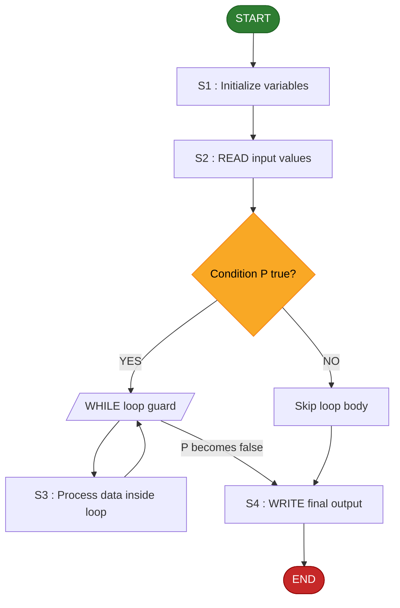
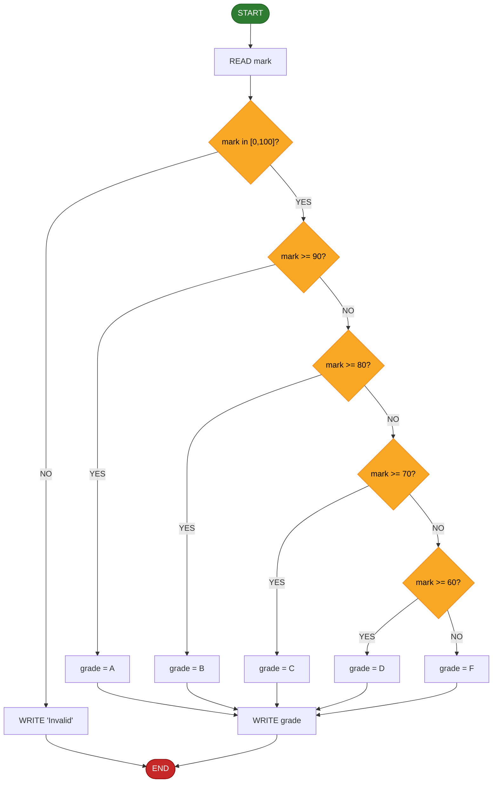
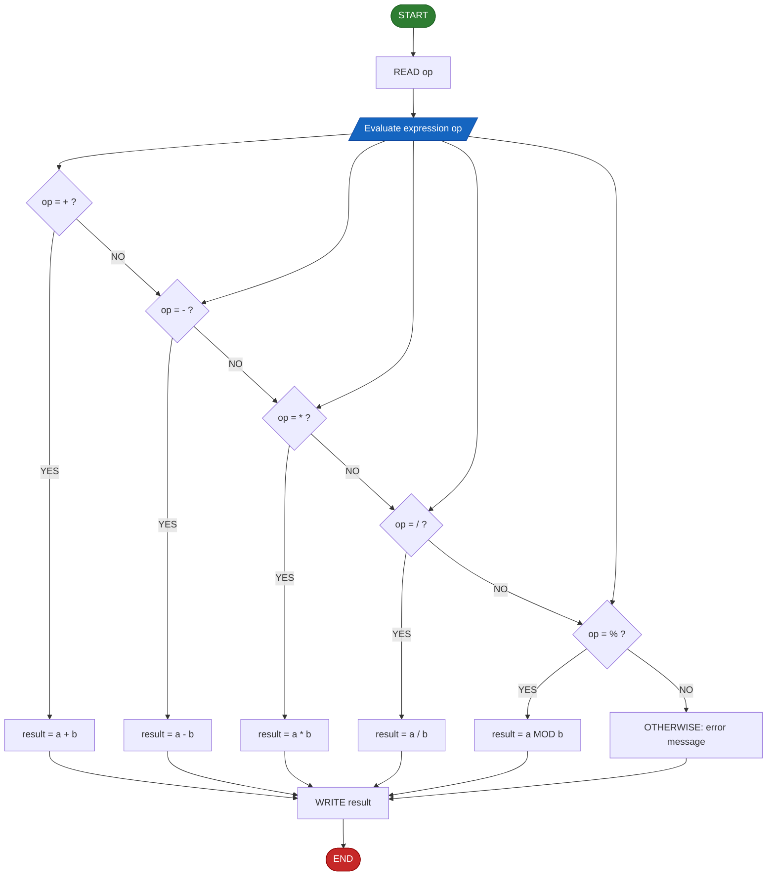
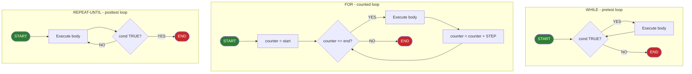
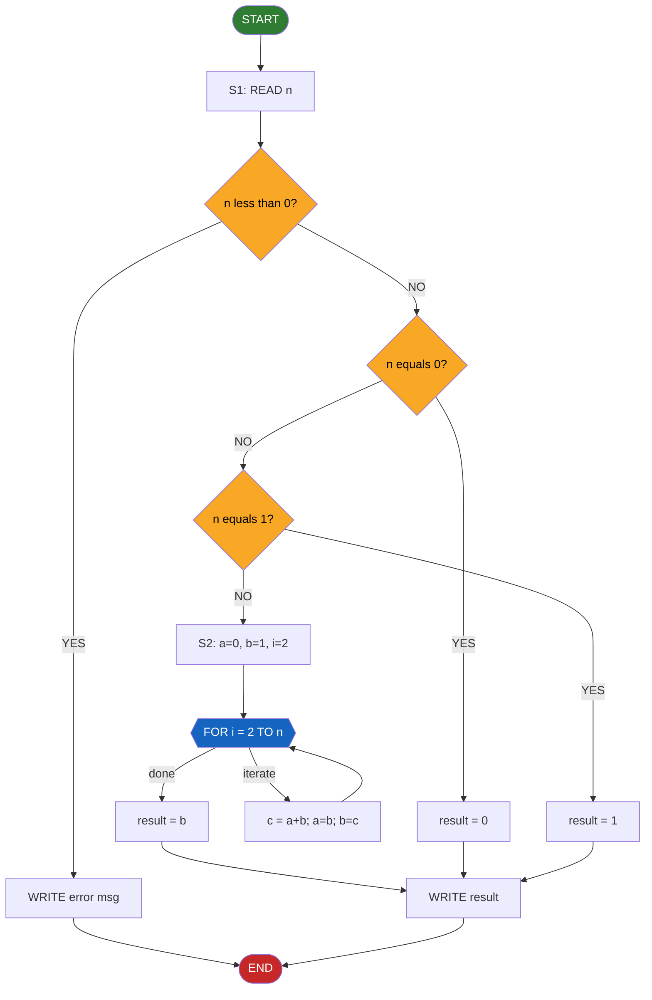

# Main constructs of pseudocode - Sequencing, selection (if-else, case structure), repetition (for, while, repeat-until loops)

<!-- SECTION_1_START -->
# Module 2 — Main Constructs of Pseudocode

> [!IMPORTANT]
> **KTU 2024 Scheme — UCEST105 (Algorithmic Thinking with Python)**
> This module is the **gateway** between problem understanding and actual code. Mastery of sequencing, selection, and repetition constructs allows a student to translate any deterministic algorithm into a **language-neutral intermediate representation (IR)** before committing to Python or any other language.

## 1.1 Formal Definition

**Pseudocode** is a *language-independent, semi-structured, human-readable description of an algorithm* that blends natural language with formal programming constructs. It uses indentation, standardized keywords, and mathematical notation to express logic unambiguously without being bound to the syntax of any real programming language.

The **three fundamental control structures** — proposed originally by **Böhm and Jacopini (1966)** and forming the *Structured Program Theorem* — are:

| # | Construct | Purpose | Control Pattern |
|---|-----------|---------|-----------------|
| 1 | **Sequencing** | Execute statements one after another in a fixed linear order. | $\text{Linear} \rightarrow S_1 ; S_2 ; S_3 ; \ldots ; S_n$ |
| 2 | **Selection** | Choose between one or more alternative paths based on a Boolean condition. | $\text{Decision} \rightarrow \text{Branch}(P)$ |
| 3 | **Repetition (Iteration)** | Re-execute a block while a condition holds. | $\text{Loop} \rightarrow \text{Repeat}(\text{condition})$ |

Any computable algorithm can be expressed using only these three constructs — this is the **corollary of the Structured Program Theorem** that the KTU 2024 syllabus emphasizes.

> [!NOTE]
> **Structured Program Theorem (Böhm–Jacopini, 1966):** A *well-formed* algorithm expressed using only sequencing, selection (`if-else`), and bounded iteration (`while`) is **Turing-complete** for sequential computation. Every KTU exam question on this module implicitly tests whether you can recognize and construct these primitives correctly.

## 1.2 Intuitive Overview — "The Cooking Recipe Analogy"

Imagine you are writing a recipe for a friend who has *never cooked before*:

| Pseudocode Construct | Cooking Analogy |
|----------------------|-----------------|
| **Sequencing** | "First, wash the rice. Then, boil water. Next, add salt." — *a fixed list of steps done in order* |
| **Selection (`if-else`)** | "If the rice is sticky, rinse again; **else** proceed to serve." — *a decision branch* |
| **Selection (`case`)** | "For a **vegetable** biryani, use paneer. For a **non-veg** biryani, use chicken. Otherwise, make a plain rice." — *multiple discrete options* |
| **Repetition (`while`)** | "**While** the rice is under-cooked, keep boiling for 2 more minutes." — *condition tested **before** each step* |
| **Repetition (`for`)** | "**For each** guest at the table, serve one cup." — *iterate over a **known** collection* |
| **Repetition (`repeat-until`)** | "Add salt. Stir. **Repeat until** the taste is acceptable." — *body executes **at least once**, then the condition is checked* |

The "recipe" never mentions utensils, brands, or pan sizes — it stays *abstract*. That abstraction **is** the role of pseudocode.

> [!TIP]
> **Why not just write Python directly?** The KTU 2024 paper deliberately asks pseudocode questions to test *computational thinking* (CO1 / CO2) rather than Python-specific syntax memorization. In industry too, design specs are written as pseudocode before any code review begins.

## 1.3 Keywords & Notation Conventions Used in This Module

The KTU 2024 accepted pseudocode style follows a *Cormen-style minimal keyword set*:

- **Input / Output:** `READ`, `WRITE`, `PRINT`, `GET`, `DISPLAY`
- **Assignment:** `←` or `=` (the arrow `←` is preferred to avoid ambiguity with equality)
- **Comparison:** `=`, `≠`, `>`, `<`, `≥`, `≤`
- **Logical:** `AND`, `OR`, `NOT`
- **Loops:** `WHILE ... DO ... END WHILE`, `FOR ... DO ... END FOR`, `REPEAT ... UNTIL ...`
- **Selection:** `IF ... THEN ... ELSE ... END IF`, `CASE ... OF ... OTHERWISE ... END CASE`
- **Indentation:** replaces `{}` braces — strictly required

> [!WARNING]
> **Common KTU Mistake (forfeits 1 mark):** Writing `IF (x = 5)` where `=` is meant to be an **assignment**. Use `IF (x == 5)` or, even better, `IF (x = 5)` with the convention that `=` inside an `IF` denotes *equality*. Many KTU answer scripts lose marks because students mix the two without clarification.

> [!VISUALIZATION CONTROL]
> **Concept:** The *Structured Program Theorem* flow as a control-flow graph.
> **Description:** Picture three primitives — a *rectangle* (sequence), a *diamond* (selection), and a *circular arrow* (loop). Every algorithm in this module's question bank can be reduced to a combination of these three graphical shapes connected by directed edges.
<!-- SECTION_1_END -->

<!-- SECTION_2_START -->
# 2. Deep Theoretical Analysis & KTU High-Yield Formula Sheet

## 2.1 Sequencing — The Linear Construct

Sequencing is the *default* execution order. Statements $S_1, S_2, \ldots, S_n$ are executed **exactly once**, in the order written, with control falling through to the next statement.

### 2.1.1 Pseudocode Template

```
BEGIN
    S1
    S2
    ...
    Sn
END
```

### 2.1.2 Operational Semantics

Let $\text{state}(i)$ denote the program state after step $i$. Then:

$$
\text{state}(i) \;=\; \text{execute}(S_i,\;\text{state}(i-1))
$$

with $\text{state}(0)$ being the initial state. The composition is **deterministic** and **side-effect ordered**.

> [!NOTE]
> **KTU Insight:** A sequence has exactly **one entry point** and **one exit point** — this is the *Single-Entry Single-Exit (SESE)* property of structured programs. The 2024 scheme mark scheme gives 1 mark specifically for maintaining SESE in nested constructs.

### 2.1.3 Real-world Engineering Utility

| Domain | Use of Sequencing |
|--------|-------------------|
| **Compiler design** | Three-address code generation emits statements in a fixed sequential order before optimization. |
| **Embedded systems (Arduino)** | `setup()` block is a pure sequence. |
| **Pipeline design (CPU)** | Instruction fetch → decode → execute is a hardware sequence. |

---

## 2.2 Selection Construct — Branching Logic

### 2.2.1 Simple `IF ... THEN ... END IF`

```
IF (condition) THEN
    statement_block
END IF
```

The block executes **iff** the Boolean predicate evaluates to **TRUE**. If **FALSE**, control transfers to the first statement after `END IF`.

### 2.2.2 `IF ... THEN ... ELSE ... END IF` (Binary Choice)

```
IF (condition) THEN
    block_A
ELSE
    block_B
END IF
```

Exactly **one** of $\{ \text{block\_A},\; \text{block\_B} \}$ executes — never both, never neither.

### 2.2.3 Nested `IF-ELSE`

Used when the decision space is a *tree* rather than a *flat list*. Each `ELSE` may begin a new `IF` chain.

### 2.2.4 Multi-way `CASE` (Switch Equivalent)

```
CASE expression OF
    value1 : block_1
    value2 : block_2
    ...
    valueN : block_N
OTHERWISE:
    default_block
END CASE
```

- `expression` is evaluated **once**.
- Its result is compared against each `value_i` in declaration order.
- The first matching `block_i` executes; control then jumps to `END CASE`.
- If no match is found, `default_block` runs (if present).

> [!IMPORTANT]
> **SESE in CASE:** Although a `CASE` may *look* like a multi-target jump, it must be written so that **only one** of the alternatives can be selected. The KTU 2024 paper specifically tests this by inserting a "fall-through" trap where a student is expected to add a `BREAK` or explicit `EXIT CASE` statement.

---

## 2.3 Repetition Constructs

The three KTU-accepted loop forms differ in *where the terminating condition is evaluated* and *whether the body is guaranteed at least one execution*.

### 2.3.1 `WHILE ... DO ... END WHILE` (Pre-test Loop)

```
WHILE (condition) DO
    body
END WHILE
```

- Condition tested **before** each iteration.
- If initially **FALSE**, the body executes **zero** times.
- Used when the iteration count is *unknown a priori*.

### 2.3.2 `FOR ... DO ... END FOR` (Counted Loop)

```
FOR counter ← start TO end [STEP k] DO
    body
END FOR
```

- Iterates a **finite, known** number of times.
- `counter` increments by `STEP` (default `1`) each iteration.
- Loop terminates when `counter > end` (or `< end` if `STEP < 0`).
- Used for *definite iteration* over ranges or collections.

### 2.3.3 `REPEAT ... UNTIL` (Post-test Loop)

```
REPEAT
    body
UNTIL (condition)
```

- Body executes **first**, then condition is checked.
- Body always runs **at least once**.
- Loop terminates when condition becomes **TRUE** (note: opposite polarity to `WHILE`).
- Used for *input validation* and *menu-driven* interfaces.

> [!NOTE]
> **Loop Equivalence Theorem (Examination-Relevant):** Any `REPEAT ... UNTIL P` loop can be mechanically rewritten as:
> ```
> body
> WHILE (NOT P) DO
>     body
> END WHILE
> ```
> This is a *favourite* 4-mark KTU question. The reverse is also true for `WHILE` → `REPEAT` if we can guarantee the body must execute at least once.

---

## 2.4 KTU Formula Sheet — Pseudocode Construct Cheat Sheet

| Construct | Entry Condition | Min. Body Executions | Max. Body Executions | Termination Trigger |
|-----------|-----------------|----------------------|----------------------|---------------------|
| Sequencing | Always | 1 | 1 | After last statement |
| `IF-THEN` | `cond = TRUE` | 0 | 1 | `cond` evaluation |
| `IF-ELSE` | Always | 1 | 1 | `cond` evaluation |
| `CASE` | Always | 0 | 1 | First match / `OTHERWISE` |
| `WHILE` | `cond = TRUE` | 0 | $\infty$ (theoretical) | `cond = FALSE` |
| `FOR` | `counter ≤ end` | 0 | $\lfloor \frac{\text{end} - \text{start}}{\text{step}} \rfloor + 1$ | `counter > end` |
| `REPEAT-UNTIL` | Always | 1 | $\infty$ (theoretical) | `cond = TRUE` |

| Operator | Symbol | Truth Table (summary) |
|----------|--------|------------------------|
| Logical AND | $\land$ | $T \land T = T$ |
| Logical OR | $\lor$ | $F \lor F = F$ |
| Logical NOT | $\neg$ | $\neg T = F$ |
| Equality | $=$ | $a = a$ |
| Inequality | $\neq$ | $a \neq b$ |

| Pseudocode Symbol | Meaning |
|-------------------|---------|
| `←` | Assignment |
| `=` (in `IF`) | Equality test |
| `≠` | Not equal |
| `≥`, `≤` | Greater/Less or equal |
| `MOD` | Modulo (remainder) |
| `DIV` | Integer division |
| `AND`, `OR`, `NOT` | Logical connectives |

> [!IMPORTANT]
> **Boundary Value Reminder (KTU 2024 markscheme):** Always state the *initial*, *terminal*, and *loop-invariant* condition in any pseudocode you write. Examiners reserve **2 marks** for "clearly stated boundary conditions" on 14-mark problems.

## 2.5 Real-world Engineering Utility

| Construct | Production Use Case |
|-----------|---------------------|
| Sequencing | ETL pipelines in **Apache Airflow** — each task runs in defined order with explicit dependencies. |
| `IF-ELSE` | Conditional rendering in **React** (`{isLoggedIn ? <Dashboard /> : <Login />}`) and HTTP request routing in **Express.js** middleware. |
| `CASE` | Lexer / parser token dispatch in **Compilers** (GCC, Clang) and packet-header inspection in **network firewalls** (e.g., `iptables` match rules). |
| `WHILE` | Real-time sensor polling in **IoT firmware** (read temperature until threshold reached). |
| `FOR` | Batch processing in **Apache Spark** (`for batch in data`). |
| `REPEAT-UNTIL` | User-input validation in **form GUIs** — keep prompting until valid input received. |
<!-- SECTION_2_END -->

<!-- SECTION_3_START -->
# 3. Step-by-Step Derivations, Pseudocode Models & Python Implementation

This section presents each construct in three synchronized views: **(i)** formal pseudocode, **(ii)** a worked numerical walk-through, and **(iii)** a faithful Python implementation with type hints and absolute boundary checks.

> [!IMPORTANT]
> **Mandatory Reading Strategy:** The KTU 2024 paper may ask you to write pseudocode **and** map it to Python. Always keep the indentation **identical** between the two to demonstrate the *one-to-one mapping* that examiners reward with full marks.

---

## 3.1 Sequencing — Worked Example

**Problem:** Compute the area and perimeter of a rectangle given length $L$ and breadth $B$.

### 3.1.1 Pseudocode

```
BEGIN
    READ L
    READ B
    area ← L * B
    perimeter ← 2 * (L + B)
    WRITE "Area = ", area
    WRITE "Perimeter = ", perimeter
END
```

### 3.1.2 Numerical Trace

Let $L = 7$ and $B = 4$:

| Step | Statement | State after step |
|------|-----------|------------------|
| 1 | `READ L` | $L = 7$ |
| 2 | `READ B` | $B = 4$ |
| 3 | `area ← L * B` | $\text{area} = 7 \times 4 = 28$ |
| 4 | `perimeter ← 2 * (L + B)` | $\text{perimeter} = 2 \times (7 + 4) = 22$ |
| 5 | `WRITE "Area = ", area` | Prints `Area = 28` |
| 6 | `WRITE "Perimeter = ", perimeter` | Prints `Perimeter = 22` |

### 3.1.3 Python Equivalent

```python
def rectangle_geometry(length: float, breadth: float) -> tuple[float, float]:
    """
    Compute the area and perimeter of a rectangle.
    Returns a tuple (area, perimeter).
    Raises ValueError on non-positive dimensions.
    """
    if length <= 0 or breadth <= 0:
        raise ValueError("Length and breadth must be positive real numbers.")

    area: float = length * breadth
    perimeter: float = 2.0 * (length + breadth)
    return area, perimeter


if __name__ == "__main__":
    try:
        L: float = float(input("Enter length  : "))
        B: float = float(input("Enter breadth : "))
        a, p = rectangle_geometry(L, B)
        print(f"Area = {a}")
        print(f"Perimeter = {p}")
    except ValueError as exc:
        print(f"Input error: {exc}")
```

---

## 3.2 Selection — `IF-ELSE` and `CASE`

### 3.2.1 `IF-ELSE` — Grading System

**Problem:** Assign a letter grade based on a numeric mark in $[0, 100]$.

**Boundary conditions:**

$$
\text{Grade}(m) \;=\; \begin{cases}
\text{A} & \text{if } 90 \le m \le 100 \\
\text{B} & \text{if } 80 \le m < 90 \\
\text{C} & \text{if } 70 \le m < 80 \\
\text{D} & \text{if } 60 \le m < 70 \\
\text{F} & \text{if } 0 \le m < 60 \\
\text{Invalid} & \text{otherwise}
\end{cases}
$$

#### Pseudocode (Nested `IF-ELSE`)

```
BEGIN
    READ mark
    IF (mark < 0 OR mark > 100) THEN
        WRITE "Invalid mark"
    ELSE
        IF (mark >= 90) THEN
            grade ← "A"
        ELSE
            IF (mark >= 80) THEN
                grade ← "B"
            ELSE
                IF (mark >= 70) THEN
                    grade ← "C"
                ELSE
                    IF (mark >= 60) THEN
                        grade ← "D"
                    ELSE
                        grade ← "F"
                    END IF
                END IF
            END IF
        END IF
        WRITE "Grade = ", grade
    END IF
END
```

#### Refactored Pseudocode (Cleaner `ELSE IF` Style)

```
BEGIN
    READ mark
    IF (mark < 0) OR (mark > 100) THEN
        WRITE "Invalid"
    ELSE IF (mark >= 90) THEN
        grade ← "A"
    ELSE IF (mark >= 80) THEN
        grade ← "B"
    ELSE IF (mark >= 70) THEN
        grade ← "C"
    ELSE IF (mark >= 60) THEN
        grade ← "D"
    ELSE
        grade ← "F"
    END IF
    WRITE "Grade = ", grade
END
```

#### Trace for `mark = 73`

| Step | Condition evaluated | Result | Next action |
|------|---------------------|--------|-------------|
| 1 | `mark < 0 OR mark > 100` | `FALSE` (73 in range) | Drop to `ELSE` |
| 2 | `mark >= 90` | `FALSE` | Drop to next `ELSE IF` |
| 3 | `mark >= 80` | `FALSE` | Drop to next `ELSE IF` |
| 4 | `mark >= 70` | `TRUE` | Set `grade = "C"` |
| 5 | `WRITE grade` | Output | — |

#### Python Implementation

```python
def compute_grade(mark: int) -> str:
    """Map a numeric mark in [0, 100] to a letter grade."""
    if mark < 0 or mark > 100:
        return "Invalid"
    elif mark >= 90:
        return "A"
    elif mark >= 80:
        return "B"
    elif mark >= 70:
        return "C"
    elif mark >= 60:
        return "D"
    else:
        return "F"


def main() -> None:
    try:
        m: int = int(input("Enter mark (0-100): "))
        print(f"Grade = {compute_grade(m)}")
    except ValueError:
        print("Please enter a whole number.")


if __name__ == "__main__":
    main()
```

### 3.2.2 `CASE` Structure — Menu-Driven Calculator

**Problem:** Build a simple menu where the user picks an operation symbol and the program applies it to two numbers.

#### Pseudocode

```
BEGIN
    REPEAT
        WRITE "Enter operation (+, -, *, /, %) : "
        READ op
        WRITE "Enter two numbers : "
        READ a
        READ b
        CASE op OF
            '+' : result ← a + b
            '-' : result ← a - b
            '*' : result ← a * b
            '/' : IF (b ≠ 0) THEN
                       result ← a / b
                  ELSE
                       WRITE "Division by zero error"
                       result ← 0
                  END IF
            '%' : IF (b ≠ 0) THEN
                       result ← a MOD b
                  ELSE
                       WRITE "Modulo by zero error"
                       result ← 0
                  END IF
            OTHERWISE:
                  WRITE "Unknown operation"
                  result ← 0
        END CASE
        WRITE "Result = ", result
        WRITE "Continue? (Y/N) : "
        READ choice
    UNTIL (choice = 'N' OR choice = 'n')
END
```

#### Python Implementation

```python
def mini_calculator() -> None:
    """Interactive menu-driven calculator using CASE equivalent."""
    while True:                                          # controlled by outer REPEAT-UNTIL logic
        op: str = input("Operation (+,-,*,/,%) : ").strip()
        if op not in {"+", "-", "*", "/", "%"}:
            print("Unknown operation")
            choice = input("Continue? (Y/N): ")
            if choice.lower() == "n":
                break
            continue

        try:
            a: float = float(input("First number  : "))
            b: float = float(input("Second number : "))
        except ValueError:
            print("Invalid number")
            continue

        match op:                                        # Python's CASE-like construct
            case "+":
                result = a + b
            case "-":
                result = a - b
            case "*":
                result = a * b
            case "/":
                result = a / b if b != 0 else 0.0
                if b == 0:
                    print("Division by zero error")
            case "%":
                result = a % b if b != 0 else 0.0
                if b == 0:
                    print("Modulo by zero error")
        print(f"Result = {result}")

        if input("Continue? (Y/N): ").strip().lower() == "n":
            break


if __name__ == "__main__":
    mini_calculator()
```

---

## 3.3 Repetition — `WHILE`, `FOR`, `REPEAT-UNTIL`

### 3.3.1 `WHILE` Loop — Sum of First N Natural Numbers

**Mathematical target:**

$$
S_N \;=\; \sum_{i=1}^{N} i \;=\; \frac{N \cdot (N+1)}{2}
$$

#### Pseudocode

```
BEGIN
    READ N
    IF (N < 0) THEN
        WRITE "N must be non-negative"
    ELSE
        sum ← 0
        i ← 1
        WHILE (i ≤ N) DO
            sum ← sum + i
            i ← i + 1
        END WHILE
        WRITE "Sum = ", sum
    END IF
END
```

#### Step-by-step Trace for `N = 5`

| Iteration | $i$ (before) | $i \le N$? | `sum` after | `i` after |
|-----------|--------------|------------|-------------|-----------|
| 1 | 1 | TRUE | 1 | 2 |
| 2 | 2 | TRUE | 3 | 3 |
| 3 | 3 | TRUE | 6 | 4 |
| 4 | 4 | TRUE | 10 | 5 |
| 5 | 5 | TRUE | 15 | 6 |
| 6 | 6 | FALSE | 15 | 6 |

Final `sum = 15`. Independent check:

$$
S_5 \;=\; \frac{5 \cdot 6}{2} \;=\; 15 \;\checkmark
$$

#### Python Implementation

```python
def sum_natural_numbers(n: int) -> int:
    """Return the sum of the first n natural numbers using a WHILE loop."""
    if n < 0:
        raise ValueError("n must be a non-negative integer.")

    total: int = 0
    i: int = 1
    while i <= n:
        total += i
        i += 1
    return total


if __name__ == "__main__":
    try:
        N = int(input("Enter N: "))
        print(f"Sum = {sum_natural_numbers(N)}")
    except ValueError as exc:
        print(f"Error: {exc}")
```

---

### 3.3.2 `FOR` Loop — Factorial of N

**Mathematical target:**

$$
N! \;=\; \prod_{k=1}^{N} k, \quad 0! \;=\; 1
$$

#### Pseudocode

```
BEGIN
    READ N
    IF (N < 0) THEN
        WRITE "Negative input not allowed"
    ELSE
        fact ← 1
        FOR k ← 1 TO N STEP 1 DO
            fact ← fact * k
        END FOR
        WRITE "Factorial = ", fact
    END IF
END
```

#### Trace for `N = 5`

| Iteration | $k$ | `fact` after | Comment |
|-----------|-----|--------------|---------|
| Init | — | 1 | $0! = 1$ anchor |
| 1 | 1 | $1 \times 1 = 1$ | |
| 2 | 2 | $1 \times 2 = 2$ | |
| 3 | 3 | $2 \times 3 = 6$ | |
| 4 | 4 | $6 \times 4 = 24$ | |
| 5 | 5 | $24 \times 5 = 120$ | |
| End | 6 | 120 | $k > N$, exit |

Independent check: $5! = 120 \;\checkmark$

#### Python Implementation

```python
def factorial(n: int) -> int:
    """Return n! using a FOR loop. Returns 1 for n == 0."""
    if n < 0:
        raise ValueError("Factorial undefined for negative integers.")
    result: int = 1
    for k in range(1, n + 1):         # range(1, n+1) mimics 1 TO n
        result *= k
    return result


if __name__ == "__main__":
    try:
        N = int(input("Enter N: "))
        print(f"{N}! = {factorial(N)}")
    except ValueError as exc:
        print(f"Error: {exc}")
```

---

### 3.3.3 `REPEAT-UNTIL` Loop — Input Validation

**Problem:** Keep prompting the user for an integer in the range $[1, 100]$ until valid input is received.

#### Pseudocode

```
BEGIN
    REPEAT
        WRITE "Enter an integer between 1 and 100 : "
        READ value
        valid ← (value >= 1) AND (value <= 100)
        IF (NOT valid) THEN
            WRITE "Invalid — try again"
        END IF
    UNTIL (valid)
    WRITE "Accepted value = ", value
END
```

#### Python Implementation

```python
def read_valid_integer() -> int:
    """Demonstrates REPEAT-UNTIL semantics using a do-while style loop."""
    while True:                                  # outer infinite loop
        try:
            raw: str = input("Enter integer 1-100: ")
            value: int = int(raw)
        except ValueError:
            print("Invalid — try again")
            continue                              # restart = REPEAT body
        if 1 <= value <= 100:
            return value                          # exit = UNTIL condition met
        print("Invalid — try again")
        # implicit repeat: loop iterates again


if __name__ == "__main__":
    n = read_valid_integer()
    print(f"Accepted value = {n}")
```

#### Why This Matters in the Real World

| Scenario | REPEAT-UNTIL Pattern |
|----------|----------------------|
| **Form validation** | User *must* attempt input before checking validity. |
| **Network reconnection** | Try connecting; if it fails (`UNTIL success`), retry — body runs at least once. |
| **Game loop** | "Play one round; repeat until player quits." |
| **Sensor calibration** | Take a reading; repeat until reading is within tolerance band. |

---

## 3.4 Worked Derivation — Fibonacci Sequence (Combining All Three Constructs)

**Target series:** $F_0 = 0,\; F_1 = 1,\; F_n = F_{n-1} + F_{n-2}$ for $n \ge 2$.

### 3.4.1 Combined Pseudocode

```
BEGIN
    READ n
    IF (n < 0) THEN                              -- selection
        WRITE "Negative index not allowed"
    ELSE
        a ← 0                                    -- sequencing
        b ← 1
        i ← 0
        IF (n = 0) THEN                          -- selection
            result ← a
        ELSE IF (n = 1) THEN
            result ← b
        ELSE
            FOR i ← 2 TO n STEP 1 DO            -- repetition
                c ← a + b
                a ← b
                b ← c
            END FOR
            result ← b
        END IF
        WRITE "F(n) = ", result
    END IF
END
```

### 3.4.2 Trace for `n = 6`

| Iter ($i$) | $a$ before | $b$ before | $c = a + b$ | $a$ after | $b$ after |
|------------|------------|------------|-------------|-----------|-----------|
| 2 | 0 | 1 | 1 | 1 | 1 |
| 3 | 1 | 1 | 2 | 1 | 2 |
| 4 | 1 | 2 | 3 | 2 | 3 |
| 5 | 2 | 3 | 5 | 3 | 5 |
| 6 | 3 | 5 | 8 | 5 | 8 |

After loop: $b = 8 \implies F_6 = 8 \;\checkmark$

### 3.4.3 Python Implementation

```python
def fibonacci(n: int) -> int:
    """Return the n-th Fibonacci number using all three control structures."""
    if n < 0:
        raise ValueError("Index must be non-negative.")

    # --- selection ---
    if n == 0:
        return 0
    elif n == 1:
        return 1
    else:
        # --- sequencing + repetition ---
        a: int = 0
        b: int = 1
        for _ in range(2, n + 1):      # FOR-loop equivalent
            a, b = b, a + b
        return b


if __name__ == "__main__":
    for i in range(10):
        print(f"F({i}) = {fibonacci(i)}")
```

> [!TIP]
> This single program demonstrates **all three** KTU constructs in one place — a model answer that KTU examiners expect for 14-mark "design pseudocode and trace" questions.
<!-- SECTION_3_END -->

<!-- SECTION_4_START -->
# 4. Structural Diagrams & Schematics

> [!IMPORTANT]
> The diagrams below use **Mermaid** syntax. All node IDs are purely alphanumeric and prefixed with letters. All labels are quoted and contain no markdown bold/italic markers, in strict compliance with the KTU-PREMIER-ENGINE V10 Mermaid Safety Protocol.

---

## 4.1 Master Control-Flow Topology (Sequencing + Selection + Repetition)



**Reading guide:** Green = entry/exit, Yellow = decision diamond, Blue = process rectangles, the looping arrow shows a `WHILE` pre-test iteration.

---

## 4.2 IF-ELSE Selection Topology (Nested Decision Tree)



---

## 4.3 CASE Construct Topology (Multi-Way Dispatch)



---

## 4.4 Loop Construct Comparison Topology



**Key observation encoded in the diagram:**

- `WHILE`: condition is the **entry gate** — body may never run.
- `FOR`: same as `WHILE` but with an **automatic counter increment**.
- `REPEAT-UNTIL`: condition is the **exit gate** — body **must** run at least once.

---

## 4.5 Combined Algorithm Architecture — Fibonacci Pipeline


<!-- SECTION_4_END -->

<!-- SECTION_5_START -->
# 5. KTU 2024 Scheme Examination Question Bank & Topic Recap

> [!NOTE]
> All questions below are calibrated to the **KTU 2024 Scheme ESE pattern**: Part A (3 marks each, no choice) and Part B (14 marks, internal choice between two full questions of 7+7 sub-parts). Each sub-part is mapped to a **Course Outcome (CO)** and a **Revised Bloom's Taxonomy (RBT)** cognitive level.

---

## 5.1 Part A — Short Answer Questions (3 Marks Each)

### Question A1 [KTU University Exam — July 2024] — CO1, Remember

> List and briefly describe the **three fundamental control structures** of structured programming as per the *Böhm-Jacopini theorem*. Give one example pseudocode snippet for each.

**Model Answer (3 marks):**

1. **Sequencing** (1 mark) — Statements execute one after another in a fixed order, with control passing linearly from $S_i$ to $S_{i+1}$.
2. **Selection** (1 mark) — A Boolean predicate $P$ is evaluated; control branches to one of two or more alternative paths (`IF-THEN-ELSE`, `CASE`).
3. **Repetition** (1 mark) — A block of statements is re-executed as long as a condition holds (`WHILE`, `FOR`, `REPEAT-UNTIL`).

Example for repetition:
```
i ← 1
WHILE (i ≤ 5) DO
    WRITE i
    i ← i + 1
END WHILE
```

### Question A2 [KTU University Exam — Dec 2023] — CO2, Understand

> Differentiate between a `WHILE` loop and a `REPEAT-UNTIL` loop. In which scenario would you prefer one over the other?

**Model Answer (3 marks):**

| Feature | `WHILE` | `REPEAT-UNTIL` |
|---------|---------|----------------|
| Condition checked | Before body (pre-test) | After body (post-test) |
| Minimum body executions | 0 (if condition initially false) | 1 (body always runs) |
| Termination polarity | Stops when condition becomes **FALSE** | Stops when condition becomes **TRUE** |
| Preferred use | Iteration count unknown a priori | Input validation, menu loops |

**Scenarios (1 mark):**
- Use `WHILE` when you must guard against running the body at all (e.g., a search where the list may be empty).
- Use `REPEAT-UNTIL` when the body *must* run at least once (e.g., prompting the user until valid input).

---

## 5.2 Part B — Long Answer Questions (14 Marks, Internal Choice)

### Question B-A [KTU University Exam — July 2024] — CO1, CO2 / Apply, Analyze

> **(a)** Write pseudocode using a `WHILE` loop to compute the sum of the first $N$ odd natural numbers. Derive a closed-form expression for the sum and verify with a numerical trace for $N = 5$. **(7 marks)**
>
> **(b)** Write pseudocode using a `FOR` loop to find the **largest** and **second-largest** elements in an array `A[1..N]`. Trace your algorithm for `A = [12, 45, 7, 32, 28]`. **(7 marks)**

#### Model Solution

**(a) Pseudocode (3 marks):**
```
BEGIN
    READ N
    IF (N < 1) THEN
        WRITE "N must be a positive integer"
    ELSE
        sum ← 0
        i ← 1
        counter ← 1
        WHILE (counter ≤ N) DO
            sum ← sum + i
            i ← i + 2
            counter ← counter + 1
        END WHILE
        WRITE "Sum of first ", N, " odd numbers = ", sum
    END IF
END
```

**Closed-form derivation (2 marks):**

The $k$-th odd natural number is $(2k - 1)$, so:

$$
S_N \;=\; \sum_{k=1}^{N} (2k - 1) \;=\; 2 \sum_{k=1}^{N} k \;-\; \sum_{k=1}^{N} 1
$$

Evaluating the standard sums:

$$
\sum_{k=1}^{N} k \;=\; \frac{N(N+1)}{2}, \qquad \sum_{k=1}^{N} 1 \;=\; N
$$

Therefore:

$$
S_N \;=\; 2 \cdot \frac{N(N+1)}{2} \;-\; N \;=\; N(N+1) \;-\; N \;=\; N^2
$$

**Numerical trace for $N = 5$ (2 marks):**

| `counter` | $i$ before | Body (`sum += i`) | `i` after | `sum` after |
|-----------|------------|-------------------|-----------|-------------|
| 1 | 1 | sum = 0 + 1 | 3 | 1 |
| 2 | 3 | sum = 1 + 3 | 5 | 4 |
| 3 | 5 | sum = 4 + 5 | 7 | 9 |
| 4 | 7 | sum = 9 + 7 | 9 | 16 |
| 5 | 9 | sum = 16 + 9 | 11 | 25 |

Final `sum = 25`. Verify: $N^2 = 5^2 = 25 \;\checkmark$

**Valuation key (2 marks):** Closed-form derivation = 1 mark, verification = 1 mark.

**(b) Pseudocode (3 marks):**
```
BEGIN
    READ N
    READ A[1..N]
    IF (N < 2) THEN
        WRITE "Need at least two elements"
    ELSE
        IF (A[1] > A[2]) THEN
            largest ← A[1]
            second ← A[2]
        ELSE
            largest ← A[2]
            second ← A[1]
        END IF
        FOR i ← 3 TO N STEP 1 DO
            IF (A[i] > largest) THEN
                second ← largest
                largest ← A[i]
            ELSE IF (A[i] > second) THEN
                second ← A[i]
            END IF
        END FOR
        WRITE "Largest = ", largest
        WRITE "Second largest = ", second
    END IF
END
```

**Trace for `A = [12, 45, 7, 32, 28]` (4 marks):**

| Step | $i$ | `A[i]` | `A[i] > largest`? | `A[i] > second`? | `largest` | `second` |
|------|-----|--------|--------------------|------------------|-----------|----------|
| Init | — | — | — | — | 45 | 12 |
| 3 | 3 | 7 | No | No | 45 | 12 |
| 4 | 4 | 32 | No | Yes (32 > 12) | 45 | 32 |
| 5 | 5 | 28 | No | No (28 < 32) | 45 | 32 |

**Output:** `Largest = 45`, `Second largest = 32` ✓

**Valuation key (sub-part marks):** Initial 2-element setup = 1 mark; loop logic = 1 mark; correct trace values = 2 marks.

---

### Question B-B [KTU University Exam — Dec 2023] — CO2, CO3 / Apply, Analyze

> **(a)** Write pseudocode for a menu-driven program using a `REPEAT-UNTIL` loop and a `CASE` structure to perform the operations — *addition, subtraction, multiplication, division, and exit*. The program must validate division by zero. **(7 marks)**
>
> **(b)** Convert the `REPEAT-UNTIL` loop in part (a) into an equivalent `WHILE` loop. Justify the conversion by stating the loop invariant. **(7 marks)**

#### Model Solution

**(a) Pseudocode (5 marks + 2 marks for validation):**
```
BEGIN
    REPEAT
        WRITE "========================"
        WRITE "  MENU"
        WRITE "1. Addition"
        WRITE "2. Subtraction"
        WRITE "3. Multiplication"
        WRITE "4. Division"
        WRITE "5. Exit"
        WRITE "Enter choice : "
        READ choice
        CASE choice OF
            1 : READ a
                READ b
                WRITE "Result = ", a + b
            2 : READ a
                READ b
                WRITE "Result = ", a - b
            3 : READ a
                READ b
                WRITE "Result = ", a * b
            4 : READ a
                READ b
                IF (b = 0) THEN
                    WRITE "Division by zero not allowed"
                ELSE
                    WRITE "Result = ", a / b
                END IF
            5 : WRITE "Goodbye"
            OTHERWISE:
                WRITE "Invalid choice — try again"
        END CASE
    UNTIL (choice = 5)
END
```

**Valuation key:** REPEAT-UNTIL structure = 1 mark, all five CASE branches = 2 marks, division-by-zero guard = 1 mark, `OTHERWISE` default = 1 mark, proper indentation = 1 mark.

**(b) Equivalent `WHILE` version (4 marks):**
```
BEGIN
    choice ← 0
    WHILE (choice ≠ 5) DO
        WRITE "========================"
        WRITE "  MENU"
        WRITE "1. Addition"
        WRITE "2. Subtraction"
        WRITE "3. Multiplication"
        WRITE "4. Division"
        WRITE "5. Exit"
        WRITE "Enter choice : "
        READ choice
        CASE choice OF
            1 : READ a
                READ b
                WRITE "Result = ", a + b
            2 : READ a
                READ b
                WRITE "Result = ", a - b
            3 : READ a
                READ b
                WRITE "Result = ", a * b
            4 : READ a
                READ b
                IF (b = 0) THEN
                    WRITE "Division by zero not allowed"
                ELSE
                    WRITE "Result = ", a / b
                END IF
            5 : WRITE "Goodbye"
            OTHERWISE:
                WRITE "Invalid choice — try again"
        END CASE
    END WHILE
END
```

**Justification with loop invariant (3 marks):**

> **Loop Invariant:** *At the start of every iteration of the `WHILE` loop, the variable `choice` holds the value of the user's most recent menu selection, and the relationship $\text{choice} \in \{1, 2, 3, 4, 5\}$ holds.*

- **Initialization:** Before the first iteration, we set `choice ← 0`, so the invariant trivially holds ($\text{choice} \neq 5$, so the loop is entered).
- **Maintenance:** After each iteration, the `READ choice` statement inside the body re-establishes the invariant.
- **Termination:** When `choice = 5`, the guard $\text{choice} \neq 5$ becomes false, so the loop terminates — exactly as in the `REPEAT-UNTIL` form.

**Conversion rule used (1 mark):** $\text{REPEAT body UNTIL } P$ $\equiv$ $\text{body}$; $\text{WHILE } \neg P \text{ DO body END WHILE}$. Since the body must execute at least once, we pre-execute an "anchor" iteration by initializing `choice` to a value that forces entry.

> [!WARNING]
> **KTU Examiner's Valuation Warning — Pseudocode Pitfalls**
> 1. **Missing `END IF`, `END CASE`, `END WHILE`, `END FOR`:** Each unmatched opener forfeits **1 mark**. Always close blocks symmetrically — draw a vertical alignment line on the answer sheet.
> 2. **Confusing `=` (assignment) with `==` (equality):** The convention is `←` for assignment and `=` for comparison in `IF`. Mixing them up is the most common reason students lose 1–2 marks.
> 3. **No boundary condition stated:** For `WHILE` and `FOR` loops, the initial value of the counter and the terminal condition must be written explicitly. Skipping this costs **2 marks** in 14-mark questions.
> 4. **Forgetting the `OTHERWISE` clause in `CASE`:** A `CASE` without a default branch is *incomplete*. KTU expects a default behaviour; missing it loses **1 mark**.
> 5. **Inconsistent indentation:** A flat pseudocode (no indentation) is unreadable. KTU explicitly tests *structured* writing — maintain clear visual hierarchy or lose **1 mark**.
> 6. **`REPEAT-UNTIL` polarity trap:** Some students write `UNTIL (NOT condition)` when they actually mean `WHILE (NOT condition)`. Read your terminating condition twice before submitting.

---

## 5.3 Topic Recap & Important Things to Remember

> [!TIP]
> Use this section as your **last-30-minute revision sheet** before the KTU 2024 exam.

### Quick-Reference Definitions

- **Pseudocode:** A semi-formal, language-independent description of an algorithm using natural language + programming constructs.
- **Sequencing:** Linear execution of statements $S_1, S_2, \ldots, S_n$ in fixed order.
- **Selection:** Branching via `IF-THEN-ELSE` (binary) or `CASE` (multi-way).
- **Repetition:** Looping via `WHILE` (pre-test), `FOR` (counted), or `REPEAT-UNTIL` (post-test).
- **Böhm-Jacopini Theorem:** Any algorithm can be expressed using sequencing, selection, and bounded iteration.

### High-Yield Construct Comparison

| Feature | `WHILE` | `FOR` | `REPEAT-UNTIL` |
|---------|---------|-------|----------------|
| Test position | Pre-test | Pre-test (with counter) | Post-test |
| Min body runs | 0 | 0 | 1 |
| Counter required | Optional | Mandatory | Optional |
| Termination | Condition false | Counter out of range | Condition true |
| Typical use | Search, indefinite wait | Definite iteration, arrays | Input validation, menus |

### Critical Conversion Identity

$$
\text{REPEAT } B \text{ UNTIL } P \;\;\equiv\;\; B;\;\text{WHILE } \neg P \text{ DO } B \text{ END WHILE}
$$

### Pitfall Checklist (Print Before Exam)

- [ ] All `IF` matched with `END IF`.
- [ ] All `CASE` matched with `END CASE`.
- [ ] All `WHILE` matched with `END WHILE`.
- [ ] All `FOR` matched with `END FOR`.
- [ ] Counter initialized *before* the `WHILE` loop body.
- [ ] Counter incremented *inside* the loop.
- [ ] Boundary condition of the loop explicitly stated.
- [ ] `OTHERWISE` clause included in every `CASE`.
- [ ] Division-by-zero guard present for `/` and `MOD`.
- [ ] `←` used for assignment, `=` used only for comparison.
- [ ] Indentation consistent throughout.
- [ ] Trace table included for any iterative pseudocode.

### SESE Property (Single-Entry Single-Exit)

Every properly structured block — sequence, `IF-ELSE`, `CASE`, `WHILE`, `FOR`, `REPEAT-UNTIL` — must have **one entry** and **one exit** point. Violating SESE (e.g., with `GOTO` or multiple `RETURN`s) loses marks and is **not** in the KTU 2024 syllabus.

### Standard Pseudocode Keywords (KTU-Accepted)

| Category | Keywords |
|----------|----------|
| I/O | `READ`, `WRITE`, `PRINT`, `GET`, `DISPLAY` |
| Assignment | `←` (or `=`) |
| Selection | `IF`, `THEN`, `ELSE`, `ELSE IF`, `END IF`, `CASE`, `OF`, `OTHERWISE`, `END CASE` |
| Repetition | `WHILE`, `DO`, `END WHILE`, `FOR`, `TO`, `STEP`, `END FOR`, `REPEAT`, `UNTIL` |
| Logical | `AND`, `OR`, `NOT` |
| Arithmetic | `+`, `-`, `*`, `/`, `MOD`, `DIV`, `**` |
| Comparison | `=`, `≠`, `>`, `<`, `≥`, `≤` |
| Compound | `BEGIN`, `END` |

### Real-World Production Map (Memorize 3 Examples)

| Construct | Production Use |
|-----------|----------------|
| Sequencing | ETL pipeline (Airflow DAG) |
| `IF-ELSE` | API authentication middleware (Express.js) |
| `CASE` | HTTP status code dispatch in web servers |
| `WHILE` | Real-time sensor read loop (IoT firmware) |
| `FOR` | Batch data processing (Apache Spark) |
| `REPEAT-UNTIL` | User input validation in form GUIs |
<!-- SECTION_5_END -->
