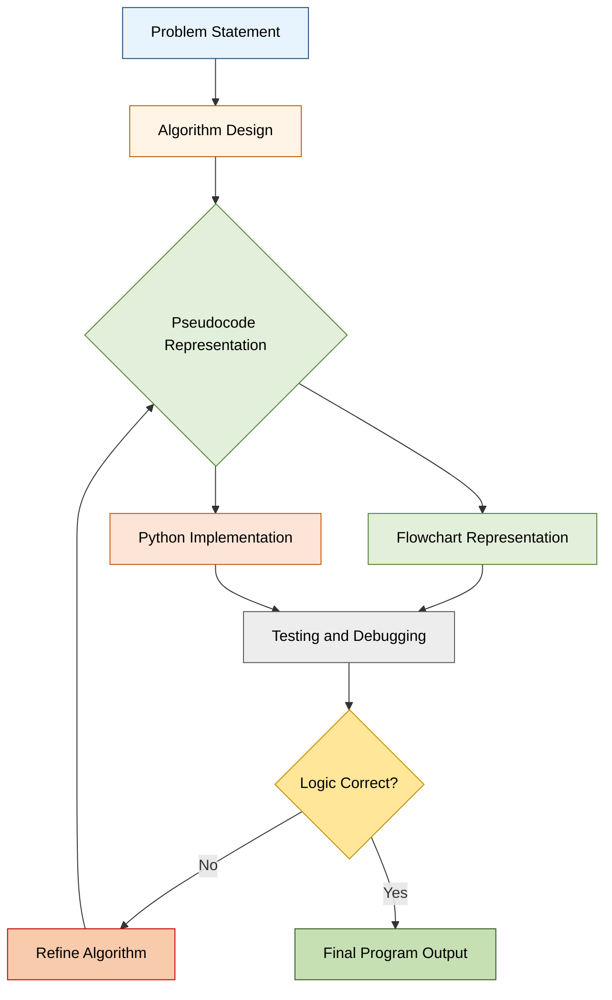
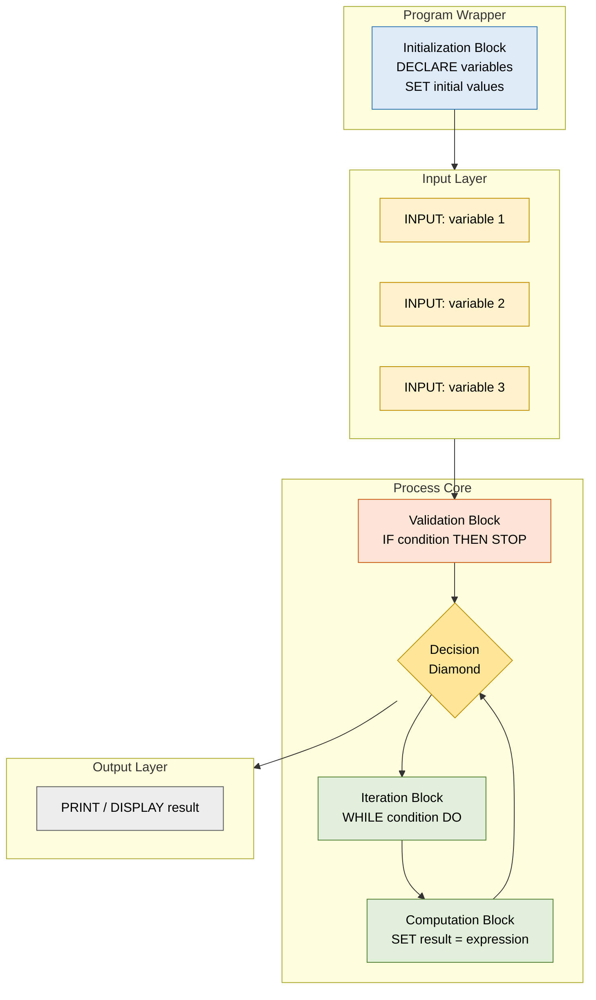
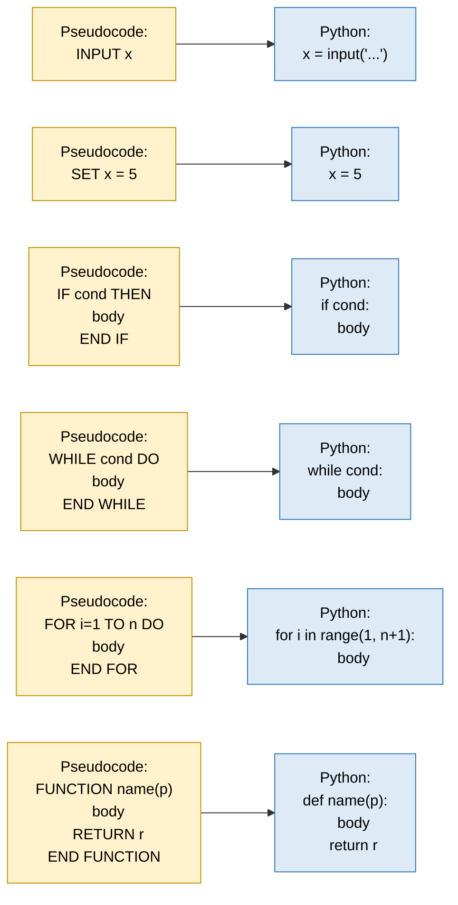

# Meaning and Definition of Pseudocode

<!-- SECTION_1_START -->

# Meaning and Definition of Pseudocode

## 1.1 Formal Academic Definition (KTU 2024 Syllabus Standard)

> [!IMPORTANT]
> **Definition (KTU Board Standard):** *Pseudocode* is a **plain-language, semi-formal, structural representation of an algorithm** that uses a combination of **natural English statements**, **standardized programming constructs** (such as `IF`, `WHILE`, `FOR`, `INPUT`, `OUTPUT`), and **mathematical expressions** to describe the **step-by-step logical flow** of a computer program *without* being bound by the strict syntax rules of any specific programming language.

In the KTU 2024 Scheme for **Algorithmic Thinking with Python (UCEST105)**, pseudocode is positioned as the **bridge layer** between the *informal human reasoning* (plain English) and the *formal executable code* (Python). It is a **language-agnostic notation** — meaning the same pseudocode can later be translated into Python, C, Java, or any other high-level language.

The word itself is a portmanteau:
- **Pseudo** $\rightarrow$ from Greek *pseudēs*, meaning *false* or *imitation*.
- **Code** $\rightarrow$ machine-executable instructions.

Hence, *pseudocode = imitation code* — code that *looks* real, but is written for **human comprehension**, not for a compiler.

> [!NOTE]
> **Syllabus Highlight (Module 2 – KTU 2024):** Pseudocode is introduced *after* the student has learned what an algorithm is, and *before* they are exposed to the strict syntax of Python. This sequencing is intentional — it trains the learner to **think algorithmically first, and code second.**

## 1.2 Conceptual Analogy & Intuitive Overview

Imagine you are teaching a **10-year-old child** how to make a cup of tea. You would not hand them a chemical equation of the brewing process. You would say something like:

> *"Boil some water. Put a tea bag in the cup. Pour the hot water. Wait 3 minutes. Remove the bag. Add sugar."*

Notice the structure:
1. Each line is a **single, clear action**.
2. The order **matters** (you cannot remove the bag before pouring the water).
3. There is **conditional logic** if needed ("*if they want sugar, add one spoon*").
4. There is **iteration** if needed ("*stir until the sugar dissolves*").

This informal, structured, sequential description is **exactly what pseudocode is** — except for a computer algorithm. The reader of pseudocode is another human being (a teammate, a teacher, or a future version of yourself), and the *computer will never directly execute it*.

### A Simpler Way to Remember It

> [!TIP]
> **The Elevator Analogy:** Think of pseudocode as the **architect's blueprint** of a building. The blueprint is not the building itself — the construction workers (the Python interpreter) cannot *live* in a blueprint. But the blueprint tells the workers (and the client) *exactly* what shape, size, and order the building should be built in. Similarly, pseudocode tells the programmer *exactly* what Python code to write.

## 1.3 The Three Pillars of Every Pseudocode Statement

Every valid pseudocode line, no matter how complex, must satisfy three fundamental properties:

| Pillar | Description | Example Line |
|:------:|:------------|:-------------|
| **Clarity** | A reader with *basic* programming knowledge must understand it instantly. | `SET total = price * quantity` |
| **Precision** | The logic must be **unambiguous** — only one interpretation is possible. | `IF age >= 18 THEN` |
| **Executability** | Although not runnable, every line must be *translatable* into a real code statement. | `PRINT "Welcome"` |

## 1.4 Why Pseudocode Exists — The Motivation

A common beginner question is: *"Why not just write Python directly?"*

The answer lies in the **cost of correction**. In software engineering, the **earlier** a logic error is caught, the **cheaper** it is to fix. This relationship is often described by the *Boehm curve*, which is industry-standard and is highlighted in KTU's Engineering Economics units as well.

$$
\text{Cost of Fix}_{\text{Requirements}} \; < \; \text{Cost of Fix}_{\text{Design}} \; < \; \text{Cost of Fix}_{\text{Coding}} \; < \; \text{Cost of Fix}_{\text{Testing}} \; < \; \text{Cost of Fix}_{\text{Production}}
$$

Pseudocode sits at the **Design stage** — meaning logic flaws are caught *before* a single line of Python is typed, saving enormous debugging time.

> [!WARNING]
> **Common Student Misconception:** Pseudocode is **not** a substitute for an algorithm. An *algorithm* is the underlying logic (the *what* and *why*). Pseudocode is merely *one of several representations* of that algorithm — alongside flowcharts, decision tables, and actual code. Do not confuse the *abstraction* with its *representation*.

## 1.5 GeoGebra / Desmos Visualization Callout

Pseudocode itself is text-based and does not have a native coordinate-plot form, but its *closest visual sibling* — the **flowchart of a conditional structure** — can be modelled. Below is a conceptual input specification for a *flowchart-to-graph* mapping that the student can paste into **Desmos** to see the decision boundaries of a simple `IF` block.

> [!VISUALIZATION CONTROL]
> **Concept:** *Linear representation of a conditional decision boundary (the underlying idea behind an `IF-ELSE` pseudocode block).*
>
> **GeoGebra / Desmos Input Equations:**
> * `f(x) = \text{sgn}(x - 18)`  *(Sign function — represents the decision threshold at age 18.)*
> * Point: `(18, 0)`
> * Horizontal asymptote: `y = -1` *(ELSE branch)* and `y = 1` *(IF branch)*
>
> **Visual Description:** The graph shows a *step function* that jumps at $x = 18$. For all values less than **18**, the output is **-1** (the *ELSE* path — e.g., "minor, cannot vote"). For all values greater than or equal to **18**, the output is **1** (the *IF* path — e.g., "adult, can vote"). This visually mirrors the *branching logic* of an `IF age >= 18 THEN` pseudocode statement.

---

<!-- SECTION_1_END -->

<!-- SECTION_2_START -->

# Deep Theoretical Analysis & KTU High-Yield Formula Sheet

## 2.1 The Anatomy of a Pseudocode Block

While there is **no single universally mandated syntax** for pseudocode (unlike Python or C), KTU 2024 Scheme adopts a *convention* that closely follows the style used in academic textbooks by **Cormen (CLRS)**, **Niklaus Wirth**, and the *IEEE standards for algorithm representation*. The Module 2 syllabus expects students to master the following structural vocabulary.

### 2.1.1 The Four Mandatory Building Blocks

Every pseudocode — whether it solves a sorting problem or a banking transaction — is built from these four foundational constructs, often called the **"Building Blocks of Structured Programming"** (Dijkstra's Structured Programming Theorem, 1966):

1. **Sequence** — Executing statements one after another, top to bottom.
2. **Selection (Decision)** — Choosing between two or more paths (`IF`, `IF-ELSE`, `SWITCH/CASE`).
3. **Iteration (Looping)** — Repeating a block of statements (`WHILE`, `FOR`, `REPEAT-UNTIL`).
4. **Sub-procedure / Function call** — Modular, reusable logic (`CALL`, `FUNCTION`).

> [!NOTE]
> **Theoretical Anchor:** Edsger W. Dijkstra proved in 1966 that **any computable function can be expressed using only these four constructs**. This is why KTU expects you to recognize and write all four in pseudocode.

### 2.1.2 Standard KTU-Accepted Pseudocode Keywords

The following table summarizes the **reserved vocabulary** a KTU 2024 student is expected to use. While not strictly enforced, deviating from these conventions may cost you marks in ESE (End Semester Examination) answers.

| Construct Type | Accepted Keywords | Indentation Rule | Termination |
|:--------------:|:-----------------|:-----------------|:------------|
| **Input** | `INPUT`, `READ`, `GET` | Single line | `;` or newline |
| **Output** | `PRINT`, `DISPLAY`, `WRITE`, `OUTPUT` | Single line | `;` or newline |
| **Assignment** | `SET`, `ASSIGN`, `←`, `=` | Single line | newline |
| **Decision** | `IF ... THEN`, `IF ... THEN ... ELSE`, `SWITCH ... CASE` | Block indented inside | `END IF`, `END CASE` |
| **Loop (Pre-test)** | `WHILE ... DO` | Block indented inside | `END WHILE` |
| **Loop (Counted)** | `FOR ... TO ... DO` | Block indented inside | `END FOR` |
| **Loop (Post-test)** | `REPEAT ... UNTIL` | Block indented inside | `UNTIL <condition>` |
| **Subroutine** | `FUNCTION ... RETURN`, `PROCEDURE ... END` | Block indented inside | `END FUNCTION` |
| **Stop** | `STOP`, `EXIT`, `RETURN` | Single line | newline |

> [!WARNING]
> **Do NOT confuse** `=` (assignment) with `==` (equality test). In KTU-accepted pseudocode style, **assignment** is written as `SET x = 5` or `x ← 5`, while **equality comparison** is written as `IF x == 5 THEN`. Mixing these up is the **#1 cause** of lost marks in ESE answers.

## 2.2 Properties of "Good" Pseudocode (KTU Evaluation Criteria)

When a KTU board examiner evaluates your pseudocode answer, they are not checking whether a compiler can run it. They are checking whether it satisfies these six properties:

| # | Property | What It Means | Examiner's Check |
|:-:|:---------|:--------------|:-----------------|
| 1 | **Correctness** | The logic produces the *exact* required output for all valid inputs. | Trace through with 2 sample inputs. |
| 2 | **Clarity** | Any peer student can read it without asking questions. | Read aloud test — if you stumble, rewrite. |
| 3 | **Completeness** | All edge cases (empty input, negative numbers, zero) are handled. | Boundary check: min, max, empty set. |
| 4 | **Efficiency** | The chosen logic is optimal for the given problem constraints. | Big-O awareness — avoid $O(n^3)$ when $O(n)$ is possible. |
| 5 | **Consistency** | Same indentation, same keyword casing, same naming style throughout. | Visual scan — does it "look" uniform? |
| 6 | **Language Independence** | No Python-specific or C-specific syntax leaks. | No `def`, no `#include`, no curly braces. |

## 2.3 KTU High-Yield Formula Sheet & Convention Reference

The "formulas" here are not numerical — they are **structural templates** the KTU board expects you to reproduce. Memorize these and adapt them to any problem.

### 2.3.1 Template 1 — Simple Linear Sequence

This template is used when each step executes **exactly once**, in order, with no branching or repetition.

$$
\boxed{
\begin{aligned}
&\text{BEGIN} \\
&\quad \text{Step 1: } \text{INPUT variable} \\
&\quad \text{Step 2: } \text{Process the variable} \\
&\quad \text{Step 3: } \text{PRINT / DISPLAY the result} \\
&\text{END}
\end{aligned}
}
$$

### 2.3.2 Template 2 — Conditional Branching (`IF-ELSE`)

This template is used when the algorithm must take a **binary decision** based on a condition $C$.

$$
\boxed{
\begin{aligned}
&\text{IF } (C) \text{ THEN} \\
&\quad \text{// Block A executes} \\
&\text{ELSE} \\
&\quad \text{// Block B executes} \\
&\text{END IF}
\end{aligned}
}
$$

### 2.3.3 Template 3 — Pre-Test Loop (`WHILE`)

This template is used when the number of iterations is **unknown** in advance, and the loop must execute **zero or more times**.

$$
\boxed{
\begin{aligned}
&\text{INITIALIZE counter / accumulator} \\
&\text{WHILE } (C \text{ is TRUE}) \text{ DO} \\
&\quad \text{// Body of loop} \\
&\quad \text{UPDATE counter} \\
&\text{END WHILE}
\end{aligned}
}
$$

### 2.3.4 Template 4 — Counted Loop (`FOR`)

This template is used when the number of iterations is **known** in advance.

$$
\boxed{
\begin{aligned}
&\text{FOR } i \leftarrow 1 \text{ TO } n \text{ DO} \\
&\quad \text{// Body executes exactly } n \text{ times} \\
&\text{END FOR}
\end{aligned}
}
$$

### 2.3.5 Template 5 — Post-Test Loop (`REPEAT-UNTIL`)

This template is used when the loop body **must execute at least once**, and the termination condition is checked **after** the body runs.

$$
\boxed{
\begin{aligned}
&\text{REPEAT} \\
&\quad \text{// Body of loop} \\
&\text{UNTIL } (C \text{ is TRUE})
\end{aligned}
}
$$

### 2.3.6 Template 6 — Function Definition

This template is used when a block of logic is **reused** multiple times and should be modularized.

$$
\boxed{
\begin{aligned}
&\text{FUNCTION } \text{name}(\text{parameters}) \\
&\quad \text{// Local declarations} \\
&\quad \text{RETURN result} \\
&\text{END FUNCTION}
\end{aligned}
}
$$

## 2.4 Real-World Utility of Pseudocode in Industry

Pseudocode is not just an academic exercise. It is used extensively in:

| Industry Domain | Use Case | Why Pseudocode Helps |
|:----------------|:---------|:---------------------|
| **Software Engineering** | Design documents (SDD — Software Design Document) | Communicates logic across teams using different languages. |
| **Competitive Programming** | Planning logic on paper before contest coding | Saves contest time; logic is decided, only syntax is typed. |
| **Research Papers (CS)** | Algorithm description in journals (e.g., *ACM Computing Surveys*) | Language-independent; reviewers focus on logic, not syntax. |
| **AI / Machine Learning** | Model pipeline blueprint before TensorFlow / PyTorch implementation | Separates mathematical intent from framework-specific code. |
| **Embedded Systems** | Hardware-software co-design documentation | Allows hardware engineers to understand software flow. |
| **Teaching & Mentorship** | First-year CS tutorials worldwide | Removes syntax noise; emphasizes problem-solving. |

> [!TIP]
> **Industry Fun Fact:** The pseudocode style used in *Introduction to Algorithms* by Cormen, Leiserson, Rivest, and Stein (CLRS) — the most cited CS textbook in history — is the de facto standard. KTU's choice to teach this style aligns you with global best practices.

## 2.5 Common Pseudocode Mistakes (KTU Board Pattern)

| Mistake | Example (Wrong) | Correction (Right) |
|:--------|:----------------|:-------------------|
| Using language-specific syntax | `def add(a, b): return a+b` | `FUNCTION add(a, b) RETURN a + b END FUNCTION` |
| Ambiguous input | `GET x` | `INPUT x` (be explicit: `INPUT a, b, c`) |
| Forgetting `END IF` / `END FOR` | Missing terminator | Always close blocks explicitly |
| Single `=` for comparison | `IF x = 5 THEN` | `IF x == 5 THEN` or `IF x EQUALS 5 THEN` |
| No indentation | Flat block of code | Indent body lines by 4 spaces or 1 tab |

---

<!-- SECTION_2_END -->

<!-- SECTION_3_START -->

# Step-by-Step Derivations & Symbolic Implementation

## 3.1 Worked Example 1 — Computing the Sum of the First $N$ Natural Numbers

### 3.1.1 Problem Statement

> *"Write a pseudocode algorithm to find the sum of the first $N$ natural numbers, where $N$ is provided as input by the user."*

### 3.1.2 Mathematical Foundation

The sum of the first $N$ natural numbers is given by the closed-form formula discovered by Carl Friedrich Gauss at age 10:

$$
S = \sum_{i=1}^{N} i = \frac{N \cdot (N + 1)}{2}
$$

However, for **pedagogical purposes**, KTU expects you to demonstrate the *iterative* pseudocode first, and *then* mention the closed-form as an optimization. We will follow this two-step approach.

### 3.1.3 The Complete Pseudocode (Line-by-Line)

```
BEGIN
    // Step 1: Declare and initialize variables
    DECLARE n, i, sum : INTEGER

    // Step 2: Get input from user
    PRINT "Enter a positive integer N: "
    INPUT n

    // Step 3: Defensive validation (edge case handling)
    IF (n <= 0) THEN
        PRINT "Invalid input. N must be a positive integer."
        STOP
    END IF

    // Step 4: Initialize the accumulator and counter
    SET sum = 0
    SET i = 1

    // Step 5: The iterative loop
    WHILE (i <= n) DO
        SET sum = sum + i
        SET i = i + 1
    END WHILE

    // Step 6: Display the result
    PRINT "The sum of the first ", n, " natural numbers is: ", sum
END
```

### 3.1.4 Line-by-Line Logical Walkthrough

| Line | Purpose | What Happens in Memory |
|:-----|:--------|:-----------------------|
| `DECLARE n, i, sum : INTEGER` | Reserves 3 memory slots of integer type. | Uninitialized; values are *undefined*. |
| `PRINT "Enter..."` + `INPUT n` | Asks user; stores typed value into `n`. | Suppose user types `4`; now $n = 4$. |
| `IF (n <= 0) THEN ... STOP` | Guards against nonsense input. | If $n = -3$, program halts gracefully. |
| `SET sum = 0` | Initializes the **accumulator** to **zero identity**. | $sum \leftarrow 0$ (this is critical — a *very* common bug is forgetting this!). |
| `SET i = 1` | Initializes the **counter** to start at 1. | $i \leftarrow 1$ (natural numbers start at 1, not 0). |
| `WHILE (i <= n) DO` | **Pre-test**: checks before entering the loop body. | If $i = 1, n = 4$, condition $1 \le 4$ is **TRUE**, body executes. |
| `SET sum = sum + i` | Adds the current counter value to the running total. | After iter 1: $sum = 0 + 1 = 1$. |
| `SET i = i + 1` | Increments the counter by 1. | After iter 1: $i = 1 + 1 = 2$. |
| Loop repeats until $i = 5$. | Condition $5 \le 4$ becomes **FALSE**. | Loop exits. |
| `PRINT sum` | Displays the final accumulated value. | $sum = 1 + 2 + 3 + 4 = 10$. |

### 3.1.5 Dry-Run Trace Table (Mandatory KTU Valuation Requirement)

This is the **trace table** examiners love to ask. For $n = 4$:

| Iteration $k$ | $i$ (before body) | $i \le n$ ? | $sum$ (after body) | $i$ (after body) |
|:-------------:|:-----------------:|:-----------:|:------------------:|:-----------------:|
| 1 | 1 | TRUE  | $0 + 1 = 1$  | 2 |
| 2 | 2 | TRUE  | $1 + 2 = 3$  | 3 |
| 3 | 3 | TRUE  | $3 + 3 = 6$  | 4 |
| 4 | 4 | TRUE  | $6 + 4 = 10$ | 5 |
| 5 | 5 | FALSE | — (exits) | — |

**Final Output:** `The sum of the first 4 natural numbers is: 10`

> [!TIP]
> **KTU Valuation Tip:** Always include a **trace table** in your answer for any loop-based pseudocode. It demonstrates *deep understanding* and earns you full marks (often 2-3 extra marks out of 14). Examiners use the trace table to verify your loop logic — a single wrong entry will reveal the bug.

### 3.1.6 Direct Translation to Python (Verification of Executability)

```python
# Python equivalent of the pseudocode above
def sum_of_natural_numbers() -> None:
    """
    Reads a positive integer N from the user, computes the sum of the
    first N natural numbers using an iterative WHILE loop, and prints
    the result. Mirrors the KTU Module 2 pseudocode line-for-line.
    """
    n: int = int(input("Enter a positive integer N: "))

    # Defensive validation (edge case)
    if n <= 0:
        print("Invalid input. N must be a positive integer.")
        return  # Equivalent to STOP in pseudocode

    # Initialize accumulator and counter
    total: int = 0
    counter: int = 1

    # Iterative WHILE loop
    while counter <= n:
        total = total + counter
        counter = counter + 1

    # Display result
    print(f"The sum of the first {n} natural numbers is: {total}")


# Entry point
if __name__ == "__main__":
    sum_of_natural_numbers()
```

> [!NOTE]
> **Observation:** Notice how the Python code uses the keyword `def` (which is Python-specific) and the `: ... return` syntax. If you had written this *Python code* as your pseudocode answer, the examiner would deduct 1-2 marks for **language-specific syntax leakage**. This is the *exact reason* pseudocode exists as a separate step.

## 3.2 Worked Example 2 — Finding the Largest of Three Numbers

### 3.2.1 Problem Statement

> *"Write a pseudocode algorithm that accepts three numbers as input and prints the largest among them."*

### 3.2.2 The Complete Pseudocode

```
BEGIN
    // Step 1: Declare variables
    DECLARE a, b, c, largest : REAL

    // Step 2: Input three numbers
    PRINT "Enter three numbers: "
    INPUT a, b, c

    // Step 3: Initialize 'largest' to the first number
    SET largest = a

    // Step 4: Compare with the second number
    IF (b > largest) THEN
        SET largest = b
    END IF

    // Step 5: Compare with the third number
    IF (c > largest) THEN
        SET largest = c
    END IF

    // Step 6: Display the largest value
    PRINT "The largest number is: ", largest
END
```

### 3.2.3 Dry-Run Trace Table

For input $a = 15, \; b = 42, \; c = 27$:

| Step | $a$ | $b$ | $c$ | $largest$ (before) | Condition $b > largest$ ? | $largest$ (after $b$-check) | Condition $c > largest$ ? | $largest$ (final) |
|:----:|:---:|:---:|:---:|:------------------:|:--------------------------:|:----------------------------:|:--------------------------:|:------------------:|
| Init | 15 | 42 | 27 | 15  | — | 15  | — | — |
| Check $b$ | 15 | 42 | 27 | 15  | $42 > 15$ → TRUE | 42  | — | — |
| Check $c$ | 15 | 42 | 27 | 42  | — | —  | $27 > 42$ → FALSE | 42  |

**Final Output:** `The largest number is: 42`

### 3.2.4 Alternative: Nested `IF-ELSE` Style

Some KTU textbooks prefer a single nested `IF-ELSE` block instead of two sequential `IF`s. Both are correct; the choice is stylistic.

```
BEGIN
    DECLARE a, b, c : REAL
    INPUT a, b, c

    IF (a >= b) THEN
        IF (a >= c) THEN
            PRINT "The largest number is: ", a
        ELSE
            PRINT "The largest number is: ", c
        END IF
    ELSE
        IF (b >= c) THEN
            PRINT "The largest number is: ", b
        ELSE
            PRINT "The largest number is: ", c
        END IF
    END IF
END
```

## 3.3 Worked Example 3 — Computing the Factorial of $N$

### 3.3.1 Mathematical Foundation

The factorial of a non-negative integer $N$ is defined as:

$$
N! = \begin{cases}
1 & \text{if } N = 0 \text{ or } N = 1 \\[4pt]
N \times (N-1) \times (N-2) \times \dots \times 1 & \text{if } N \ge 2
\end{cases}
$$

Equivalently, using the recursive definition:

$$
N! = N \times (N-1)!
$$

### 3.3.2 The Iterative Pseudocode

```
BEGIN
    DECLARE n, i, fact : INTEGER
    PRINT "Enter a non-negative integer: "
    INPUT n

    // Defensive validation
    IF (n < 0) THEN
        PRINT "Factorial is not defined for negative numbers."
        STOP
    END IF

    // Initialize accumulator to multiplicative identity = 1
    SET fact = 1
    SET i = 1

    // Counted loop
    WHILE (i <= n) DO
        SET fact = fact * i
        SET i = i + 1
    END WHILE

    PRINT "Factorial of ", n, " is: ", fact
END
```

### 3.3.3 Dry-Run Trace Table for $n = 5$

| Iteration | $i$ (before) | $i \le 5$ ? | $fact$ (after) | $i$ (after) |
|:---------:|:------------:|:-----------:|:--------------:|:------------:|
| 1 | 1 | TRUE  | $1 \times 1 = 1$  | 2 |
| 2 | 2 | TRUE  | $1 \times 2 = 2$  | 3 |
| 3 | 3 | TRUE  | $2 \times 3 = 6$  | 4 |
| 4 | 4 | TRUE  | $6 \times 4 = 24$ | 5 |
| 5 | 5 | TRUE  | $24 \times 5 = 120$ | 6 |
| 6 | 6 | FALSE | — (exits) | — |

**Final Output:** `Factorial of 5 is: 120`

### 3.3.4 The Python Implementation (Iterative)

```python
def compute_factorial(n: int) -> int:
    """
    Computes the factorial of a non-negative integer n using an
    iterative WHILE loop. Returns 1 for n = 0 or n = 1.
    Raises ValueError for negative inputs.
    """
    if n < 0:
        raise ValueError("Factorial is not defined for negative numbers.")
    if n == 0 or n == 1:
        return 1

    accumulator: int = 1
    counter: int = 1
    while counter <= n:
        accumulator = accumulator * counter
        counter = counter + 1
    return accumulator


# Demonstration
if __name__ == "__main__":
    try:
        user_input: int = int(input("Enter a non-negative integer: "))
        result: int = compute_factorial(user_input)
        print(f"Factorial of {user_input} is: {result}")
    except ValueError as error:
        print(f"Error: {error}")
```

## 3.4 Comparative Summary: Pseudocode vs. Flowchart vs. Python

For the same problem (*largest of 3 numbers*), here is how all three representations differ:

| Aspect | Pseudocode | Flowchart | Python Code |
|:-------|:-----------|:----------|:------------|
| **Form** | Linear text | 2D diagram with shapes | Linear text with strict syntax |
| **Symbols** | Keywords (`IF`, `PRINT`) | Geometric (rectangle, diamond, parallelogram) | `if`, `print`, `:` |
| **Indentation** | Optional but recommended | Not applicable | Mandatory (else `IndentationError`) |
| **Executability** | No | No | Yes |
| **Best for** | Logic communication | Visual learners, small algorithms | Implementation |

---

<!-- SECTION_3_END -->

<!-- SECTION_4_START -->

# Structural Diagrams & Schematics

## 4.1 The Position of Pseudocode in the Algorithm Development Lifecycle

The following Mermaid flowchart illustrates *where* pseudocode sits in the broader **Software Development Lifecycle (SDLC)**, and *why* it is introduced between the algorithm design and the actual coding stage.



**Interpretation of the diagram:**

- **Node A** — The *Problem Statement* is a natural-language description (e.g., "Find the largest of 3 numbers").
- **Node B** — The *Algorithm Design* produces the abstract logic (e.g., "Compare pairwise and update the maximum").
- **Node C** — *Pseudocode* captures the logic in a structured, language-agnostic form. This is the **focus of Module 2**.
- **Nodes D & E** — From pseudocode, the same logic can be represented as a *flowchart* (for visual learners) or *Python code* (for execution).
- **Node G** — The *decision diamond* shows the iterative feedback loop: if the logic fails testing, the algorithm is refined, and the cycle restarts from the pseudocode stage.

## 4.2 Internal Block Architecture of a Typical Pseudocode Solution

The following Mermaid block diagram decomposes a *generic pseudocode solution* into its modular components, showing how the four Dijkstra constructs are nested.



**Interpretation of the block architecture:**

- **Outer Wrapper (subgraph `Outer`)** — Every pseudocode begins with `BEGIN` and ends with `END`. Inside this wrapper, the **Initialization Block** declares all variables and sets initial values (e.g., `SET sum = 0`).
- **Input Layer (subgraph `InputLayer`)** — This is where `INPUT` statements reside. One or more variables can be read.
- **Process Core (subgraph `ProcessCore`)** — This is the *brain* of the algorithm. It contains:
  - **Validation Block** — Defensive checks for edge cases.
  - **Decision Diamond** — Branching logic (`IF-ELSE`).
  - **Loop Block** — Iterative logic (`WHILE` or `FOR`).
  - **Computation Block** — The actual arithmetic or string manipulation.
  - Notice the **feedback arrow** from `ComputeBlock` back to `DecisionDiamond` — this is the *loop-back* path of an iterative construct.
- **Output Layer (subgraph `OutputLayer`)** — The terminal `PRINT` statement that produces the result.

## 4.3 Conceptual Mapping: Pseudocode Constructs to Python Equivalents

The following diagram maps each pseudocode construct to its Python translation. This is the **mental bridge** every KTU 2024 student must internalize before writing any Python code.



> [!TIP]
> **Study Strategy:** Memorize this mapping cold. When you see a pseudocode question in ESE, mentally translate it to Python in your head — this will help you catch any logical errors before you commit them to paper.

---

<!-- SECTION_4_END -->

<!-- SECTION_5_START -->

# KTU 2024 Scheme Examination Question Bank & Topic Recap

## 5.1 Part A Questions (3 Marks Each — Short Answer)

> **KTU Pattern Reminder:** Part A consists of short-answer questions testing *Remember* and *Understand* cognitive levels. Each carries 3 marks. Answers should be 4-6 sentences with a precise definition or example.

---

### Question A1

**[KTU University Exam — July 2024, Model Question Paper]**
**CO1 | RBT Level: Remember**

**Define pseudocode. List any four keywords commonly used in pseudocode with one-line descriptions of their functions.**

#### Model Answer (Valuation Key — Total: 3 Marks)

> **Definition (2 Marks):** Pseudocode is a *plain-language, semi-formal representation of an algorithm* that combines natural English statements with standardized programming constructs (such as `IF`, `WHILE`, `INPUT`, `PRINT`) to describe the step-by-step logical flow of a program without being tied to the strict syntax of any specific programming language. It is intended for *human readers*, not for compilers.
>
> **Four Keywords with Functions (1 Mark — 0.25 each):**
> 1. `INPUT` — Reads a value from the user or a file and stores it in a variable.
> 2. `PRINT` — Displays the value of a variable or a message on the output screen.
> 3. `IF ... THEN ... ELSE` — Implements conditional branching; one of two blocks executes based on a Boolean condition.
> 4. `WHILE ... DO` — Implements a pre-test loop; the body repeats as long as the condition remains TRUE.

---

### Question A2

**[KTU University Exam — Dec 2023, Supplementary Exam]**
**CO1 | RBT Level: Understand**

**Differentiate between an algorithm and pseudocode. Why is pseudocode preferred over a flowchart for representing complex algorithms?**

#### Model Answer (Valuation Key — Total: 3 Marks)

> **Difference (1.5 Marks):**
>
> | Aspect | Algorithm | Pseudocode |
> |:-------|:----------|:-----------|
> | **Definition** | A step-by-step *procedure* to solve a specific problem in finite time. | A *textual representation* of that procedure using structured English. |
> | **Nature** | Abstract logic — *what* must be done. | Concrete representation — *how* the logic is written down. |
> | **Form** | Can be described in plain prose, math, or any notation. | Must follow structured conventions (keywords, indentation). |
>
> **Why Pseudocode is Preferred Over Flowcharts for Complex Algorithms (1.5 Marks):**
> 1. **Scalability:** Flowcharts become cluttered and unreadable beyond ~20-30 symbols, whereas pseudocode scales linearly with text length.
> 2. **Modification:** Editing a flowchart requires redrawing shapes and arrows; editing pseudocode only requires text changes.
> 3. **Data representation:** Pseudocode can natively express complex data structures (arrays, records, trees) using text; flowcharts struggle to depict them.
> 4. **Text-search friendly:** Pseudocode is searchable in documents and version-control systems (Git); flowcharts require image-based tools.

---

## 5.2 Part B Questions (14 Marks Each — Full Descriptive)

> **KTU Pattern Reminder:** Part B questions carry 14 marks each. The KTU ESE pattern is *Module-Internal Choice* — for each question, two alternative options (A and B) are provided; the student answers **one**. Each option is typically split into two sub-parts: **(a) for 7 marks** and **(b) for 7 marks**, mapping to escalating cognitive levels.

---

### Question B1 — Option A (14 Marks)

**[KTU University Exam — July 2024, End Semester Regular]**
**CO2 | RBT Levels: Understand (a) + Apply (b)**

**(a)** Explain the **four fundamental constructs** of structured programming as defined by Dijkstra. For each construct, write a one-line pseudocode example. **[7 Marks]**

**(b)** Design a complete pseudocode algorithm that reads a positive integer $N$ from the user and prints whether $N$ is a **prime number** or **not a prime number**. Include appropriate validation for invalid inputs. **[7 Marks]**

#### Model Answer — Part (a) (7 Marks)

> **Explanation of Dijkstra's Four Constructs (4 Marks — 1 each):**
>
> 1. **Sequence** — Statements are executed one after another, in the order they appear. There is no branching or repetition. *Example:*
>    ```
>    SET x = 10
>    SET y = 20
>    SET z = x + y
>    ```
>
> 2. **Selection (Decision)** — The algorithm chooses between two or more paths based on a Boolean condition. The `IF-THEN-ELSE` construct is the canonical form. *Example:*
>    ```
>    IF (x > 0) THEN
>        PRINT "Positive"
>    ELSE
>        PRINT "Non-positive"
>    END IF
>    ```
>
> 3. **Iteration (Looping)** — A block of statements is repeated as long as a condition holds. Includes `WHILE` (pre-test) and `REPEAT-UNTIL` (post-test). *Example:*
>    ```
>    WHILE (count <= 10) DO
>        PRINT count
>        SET count = count + 1
>    END WHILE
>    ```
>
> 4. **Sub-procedure / Function** — A named, reusable block of logic that can be invoked from multiple places. Promotes modularity. *Example:*
>    ```
>    CALL SortArray(numbers)
>    ```
>
> **Theoretical Anchor (3 Marks):** Dijkstra's 1966 paper *"Go To Statement Considered Harmful"* proved that any algorithm can be expressed using only these four constructs. The KTU syllabus adopts this theorem as the foundation of pseudocode design.

#### Model Answer — Part (b) (7 Marks)

> **Problem Analysis (1 Mark):** A prime number is a positive integer greater than 1 that has no divisors other than 1 and itself. To test primality, we must check that no integer in the range $[2, \sqrt{N}]$ divides $N$ evenly.
>
> **Algorithm Strategy (1 Mark):** Use a `WHILE` loop to iterate from $i = 2$ to $\sqrt{N}$. If any $i$ divides $N$ with remainder 0, the number is *not* prime.
>
> **Complete Pseudocode (4 Marks — see valuation breakdown below):**
>
> ```
> BEGIN
>     DECLARE n, i : INTEGER
>     DECLARE isPrime : BOOLEAN
>
>     PRINT "Enter a positive integer: "
>     INPUT n
>
>     // Step 1: Validation
>     IF (n <= 1) THEN
>         PRINT n, " is NOT a prime number."
>         STOP
>     END IF
>
>     // Step 2: Initialize flag
>     SET isPrime = TRUE
>     SET i = 2
>
>     // Step 3: Test divisors
>     WHILE (i * i <= n) DO
>         IF (n MOD i == 0) THEN
>             SET isPrime = FALSE
>             // Break out of loop early (optional optimization)
>         END IF
>         SET i = i + 1
>     END WHILE
>
>     // Step 4: Output result
>     IF (isPrime == TRUE) THEN
>         PRINT n, " IS a prime number."
>     ELSE
>         PRINT n, " is NOT a prime number."
>     END IF
> END
> ```
>
> **Valuation Key Breakdown:**
> - [Variable declarations: 0.5 Mark]
> - [Input statement: 0.5 Mark]
> - [Validation block with `STOP`: 1 Mark]
> - [Flag initialization (`isPrime = TRUE`): 0.5 Mark]
> - [Correct `WHILE` loop with `i * i <= n`: 1 Mark]
> - [Correct `MOD` operation inside `IF`: 0.5 Mark]
> - [Final output `IF-ELSE`: 1 Mark]
>
> **Trace Table for $n = 17$ (1 Mark — optional bonus):**
>
> | $i$ | $i \cdot i$ | $i \cdot i \le 17$ ? | $17 \bmod i$ | `isPrime` |
> |:---:|:----------:|:---------------------:|:--------------:|:---------:|
> | 2 | 4  | TRUE  | 1 | TRUE  |
> | 3 | 9  | TRUE  | 2 | TRUE  |
> | 4 | 16 | TRUE  | 1 | TRUE  |
> | 5 | 25 | FALSE | — | TRUE (exits) |
>
> **Output:** `17 IS a prime number.` ✔️

---

### Question B1 — Option B (Alternative — 14 Marks)

**[KTU University Exam — Dec 2023, Supplementary Exam]**
**CO2 | RBT Levels: Remember (a) + Apply (b)**

**(a)** List and briefly explain the **six desirable properties** of a good pseudocode as per KTU evaluation standards. **[7 Marks]**

**(b)** Write a complete pseudocode algorithm that reads **ten integer values** from the user, stores them in an array, and then prints the **maximum and minimum values** in the array. **[7 Marks]**

#### Model Answer — Part (a) (7 Marks)

> **Six Properties (6 Marks — 1 each):**
>
> 1. **Correctness** — The pseudocode must produce the *exact* required output for *all* valid inputs, including boundary cases. A correct pseudocode is verified by dry-running with multiple test cases.
> 2. **Clarity** — Any peer student or examiner should understand the logic *without* verbal explanation. If a line is ambiguous, it must be rewritten.
> 3. **Completeness** — All edge cases (empty input, zero, negative numbers, single-element input) must be explicitly handled. A pseudocode that crashes on edge cases is incomplete.
> 4. **Efficiency** — The logic should avoid unnecessary operations. For example, $O(n)$ logic is preferred over $O(n^2)$ when both are correct.
> 5. **Consistency** — The same indentation, naming convention, and keyword casing must be used throughout. Mixing `IF` and `if` in the same answer is a deduction-worthy inconsistency.
> 6. **Language Independence** — No syntax from any specific language (Python, C, Java) should leak in. Keywords like `def`, `#include`, or curly braces are forbidden.
>
> **Summary Statement (1 Mark):** These six properties collectively ensure that pseudocode serves its purpose as a *universal communication medium* for algorithm logic across teams, languages, and disciplines.

#### Model Answer — Part (b) (7 Marks)

> **Problem Analysis (1 Mark):** We need to maintain a running maximum and minimum as we read each of the 10 numbers. The most efficient approach is to initialize `max` and `min` to the *first* input, then update them as subsequent inputs arrive.
>
> **Algorithm Strategy (1 Mark):** A `FOR` loop with index $i$ from 1 to 10 reads each number. After each read, two `IF` statements update `max` and `min` if necessary.
>
> **Complete Pseudocode (4 Marks — see valuation breakdown):**
>
> ```
> BEGIN
>     DECLARE arr[10] : INTEGER
>     DECLARE i, maxVal, minVal : INTEGER
>
>     // Step 1: Read all 10 values into the array
>     PRINT "Enter 10 integer values: "
>     FOR i = 1 TO 10 DO
>         INPUT arr[i]
>     END FOR
>
>     // Step 2: Initialize max and min to the first element
>     SET maxVal = arr[1]
>     SET minVal = arr[1]
>
>     // Step 3: Scan the array to find max and min
>     FOR i = 2 TO 10 DO
>         IF (arr[i] > maxVal) THEN
>             SET maxVal = arr[i]
>         END IF
>         IF (arr[i] < minVal) THEN
>             SET minVal = arr[i]
>         END IF
>     END FOR
>
>     // Step 4: Display the results
>     PRINT "Maximum value: ", maxVal
>     PRINT "Minimum value: ", minVal
> END
> ```
>
> **Valuation Key Breakdown:**
> - [Array declaration `arr[10]`: 0.5 Mark]
> - [First `FOR` loop for input: 0.5 Mark]
> - [Correct initialization of `maxVal` and `minVal` to `arr[1]`: 1 Mark]
> - [Second `FOR` loop starting at index 2 (avoids self-comparison): 1 Mark]
> - [Two separate `IF` checks for max and min: 1 Mark]
> - [Final `PRINT` statements: 0.5 Mark]
>
> **Trace Table for input `{5, 12, 3, 8, 1, 9, 4, 7, 2, 10}` (1 Mark — optional bonus):**
>
> | $i$ | $arr[i]$ | $arr[i] > maxVal$ ? | $maxVal$ after | $arr[i] < minVal$ ? | $minVal$ after |
> |:---:|:--------:|:--------------------:|:--------------:|:-------------------:|:--------------:|
> | 2 | 12 | TRUE  | 12 | FALSE | 5  |
> | 3 | 3  | FALSE | 12 | TRUE  | 3  |
> | 4 | 8  | FALSE | 12 | FALSE | 3  |
> | 5 | 1  | FALSE | 12 | TRUE  | 1  |
> | 6 | 9  | FALSE | 12 | FALSE | 1  |
> | 7 | 4  | FALSE | 12 | FALSE | 1  |
> | 8 | 7  | FALSE | 12 | FALSE | 1  |
> | 9 | 2  | FALSE | 12 | FALSE | 1  |
> | 10| 10 | FALSE | 12 | FALSE | 1  |
>
> **Output:**
> - `Maximum value: 12`
> - `Minimum value: 1`

---

## 5.3 KTU Examiner's Valuation Warning / Pitfall Callout

> [!WARNING]
> **Common Pitfalls in Pseudocode Answers — Read Before You Write!**
>
> 1. **Missing `END IF` / `END WHILE` / `END FOR` terminators.** The single most common deduction (1-2 marks per missing terminator). Every opening construct must have a matching closing keyword. Think of it like parentheses in math: `(` always needs `)`.
>
> 2. **Using `=` for both assignment and comparison.** In KTU-accepted pseudocode, **assignment** is `SET x = 5` or `x ← 5`, while **comparison** is `IF x == 5 THEN`. Writing `IF x = 5 THEN` is technically a *comparison* in some notations, but examiners often mark it as ambiguous and deduct 0.5-1 mark.
>
> 3. **Forgetting the accumulator initialization.** The line `SET sum = 0` (or `SET product = 1`) is the most frequently *skipped* line in student answers. Without it, the program uses a garbage initial value, and the trace table will be wrong. Examiners *deliberately* check for this — 0.5-1 mark.
>
> 4. **Off-by-one errors in `FOR` loops.** Writing `FOR i = 1 TO n-1` instead of `FOR i = 1 TO n` loses 1 mark. Always re-read your loop bounds.
>
> 5. **Using Python-specific syntax.** Writing `def`, `:`, `elif`, `print()`, or `range()` in a pseudocode answer is a **language leakage** that costs 1-2 marks. Always translate Python to pseudocode first.
>
> 6. **No trace table for loop-based problems.** A trace table is the *single best way* to guarantee full marks. Not including one in a 14-mark loop question can cost you 2-3 marks.
>
> 7. **No validation block for edge cases.** If the problem says "positive integer", your pseudocode *must* include an `IF (n <= 0) THEN ... STOP` block. Examiners allocate 1-2 marks for this.

---

## 5.4 Topic Recap & Important Things to Remember

> [!TIP]
> **Rapid Revision Checklist — Master These Before the Exam**

- [x] **Definition:** Pseudocode = *plain-language, semi-formal, structured representation* of an algorithm. It is for *human readers*, not for compilers.
- [x] **Origin of the word:** *Pseudo* (Greek for "false/imitation") + *Code* (program instructions) = *imitation code*.
- [x] **Purpose:** Bridge between informal algorithm logic and strict program syntax; catches errors early in the design phase.
- [x] **Dijkstra's Four Constructs:** *Sequence*, *Selection*, *Iteration*, *Sub-procedure*. These are *sufficient* to express any algorithm.
- [x] **Standard Keywords (KTU-accepted):** `INPUT`, `PRINT`, `SET`, `IF ... THEN ... ELSE`, `END IF`, `WHILE ... DO`, `END WHILE`, `FOR ... TO ... DO`, `END FOR`, `REPEAT ... UNTIL`, `FUNCTION ... RETURN`, `STOP`.
- [x] **Six Properties of Good Pseudocode:** *Correctness, Clarity, Completeness, Efficiency, Consistency, Language Independence*.
- [x] **Assignment vs. Comparison:** Use `SET x = 5` for assignment; use `IF x == 5 THEN` for comparison. Never mix them.
- [x] **Always Initialize Accumulators:** `SET sum = 0` (additive) or `SET product = 1` (multiplicative) *before* the loop. This is a high-frequency exam trap.
- [x] **Always Validate Inputs:** If the problem says "positive integer", include `IF (n <= 0) THEN ... STOP` early in your pseudocode.
- [x] **Always Close Constructs:** Every `IF` needs `END IF`; every `WHILE` needs `END WHILE`; every `FOR` needs `END FOR`; every `FUNCTION` needs `END FUNCTION`.
- [x] **Always Indent Body Lines:** Indent the body of every loop/conditional by 4 spaces or 1 tab. Examiners visually scan for indentation consistency.
- [x] **Never Use Language-Specific Syntax:** No `def`, no `:`, no `;`, no `{}`, no `#include`, no `printf`. Pseudocode is *language-agnostic*.
- [x] **Trace Table is Your Best Friend:** For any loop-based problem, always include a trace table with columns for *iteration number*, *variable states before/after*, and *condition value*. It guarantees 2-3 extra marks.
- [x] **Indentation Convention:** Body of `IF`, `WHILE`, `FOR`, `FUNCTION` is indented. Nested constructs are indented further (typically 4 spaces per level).
- [x] **Common Keywords Translation Table:**
    - `INPUT` $\equiv$ `READ` $\equiv$ `GET`
    - `PRINT` $\equiv$ `DISPLAY` $\equiv$ `WRITE` $\equiv$ `OUTPUT`
    - `SET x = y` $\equiv$ `x ← y` $\equiv$ `x = y` (assignment)
    - `IF ... THEN ... ELSE` $\equiv$ `IF ... ELSE ... ENDIF` (style differences)
- [x] **Three Pillars of Every Line:** *Clarity* (understood instantly), *Precision* (no ambiguity), *Executability* (translatable to real code).
- [x] **Industry Standard Style:** The CLRS textbook style is the global academic standard; KTU's convention closely mirrors it.

---

<!-- SECTION_5_END -->
