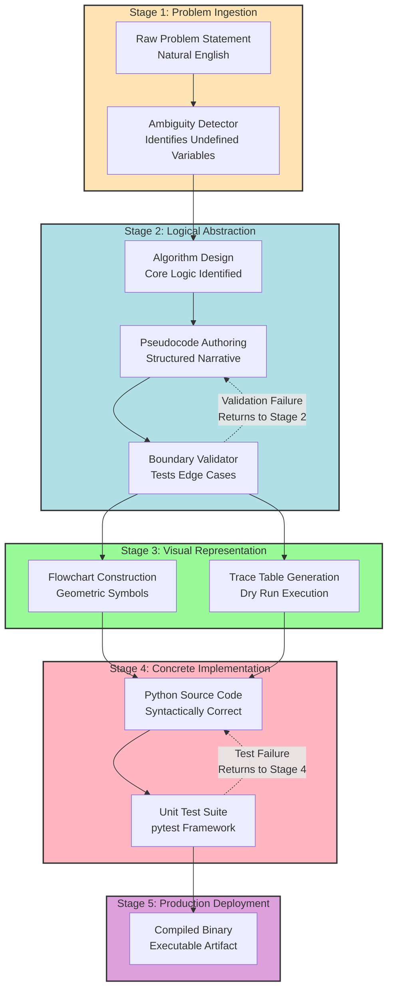
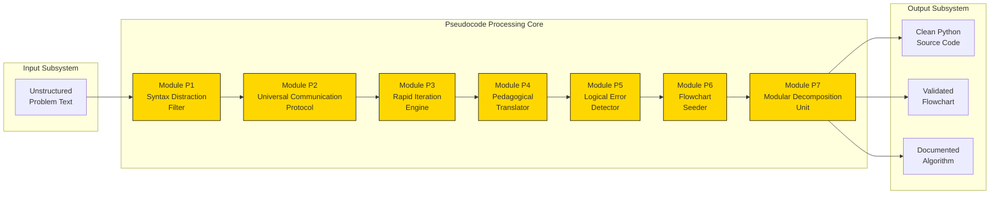
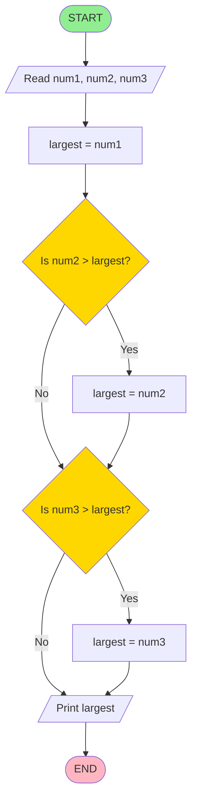

# Reasons for using pseudocode

<!-- SECTION_1_START -->
# Reasons for Using Pseudocode

## 1.1 Formal Academic Definition

In the context of **Algorithmic Thinking with Python (UCEST105)**, **pseudocode** is defined as a *high-level, language-independent, informal description of the operating principles of an algorithm*. It employs the structural conventions of programming languages (such as sequential statements, selection constructs, iteration loops, and modular block structures) while deliberately omitting the rigid syntax, type declarations, and machine-specific declarations required by an actual compiler or interpreter.

> [!IMPORTANT]
> **KTU 2024 Syllabus Definition (Module 2):** Pseudocode is a *narrative-articulate specification* of an algorithm that uses *plain English mixed with structural programming constructs*. It is not executable by any computer but is universally readable across all programming paradigms (Imperative, Object-Oriented, Functional).

### 1.1.1 Characteristics of a Valid Pseudocode Representation

For an algorithmic description to qualify as "valid pseudocode" under KTU valuation norms, it must possess the following operational properties:

| Property | Operational Behavior |
| :--- | :--- |
| **Simplicity** | Uses a minimal, easily readable vocabulary of native English words |
| **Structured Format** | Adheres to logic block delimiters (BEGIN / END, IF / ENDIF) |
| **Language Neutrality** | Avoids language-specific tokens (no `def`, `printf`, or `System.out`) |
| **Platform Independence** | Not bound to any specific OS, hardware, or compiler |
| **Completeness** | Defines every logical step without ambiguity, leaving zero scope for interpretation |

> [!NOTE]
> **Syllabus Highlight:** The KTU 2024 scheme explicitly places pseudocode as a *bridge mechanism* between the human cognitive layer (problem understanding) and the machine execution layer (Python code). The course outcome **CO1** (Apply algorithmic thinking to solve problems) is directly evaluated through the student's ability to write and interpret pseudocode representations.

## 1.2 Conceptual Analogy: The Universal Recipe Card

To build strong intuition, imagine that a chef is writing down a recipe to teach a friend how to prepare a traditional Kerala *Avial* dish. The chef could either:

1. Write the recipe in **English** (broadly understandable, but loses specific cooking actions like *tempering* or *mashing*).
2. Write the recipe as a **chemical equation with mass spectrometry data** (extremely precise, but unreadable to a cook).
3. Write a **Universal Recipe Card** that uses English sentences structured with bullet points, indentation, and control words like `IF the gravy is too thick THEN add water` and `REPEAT stirring UNTIL the coconut oil separates`.

This third option is exactly what pseudocode does. It is the **"Universal Recipe Card"** of algorithm design. The cook (or programmer) can immediately understand the logic, and any cuisine expert (or Python, Java, C++ developer) can convert that recipe into their specific kitchen's format.

> [!TIP]
> **Mental Hook:** Remember the acronym **B.R.I.D.G.E.** — *Bridging Representations In Design, Generating Execution*.

## 1.3 The Operational Place of Pseudocode in the Software Development Lifecycle (SDLC)

Pseudocode occupies the critical intermediate layer in the algorithmic design stack:

**Problem Statement** $\rightarrow$ **Algorithm (Logic)** $\rightarrow$ **Pseudocode (Structured Narrative)** $\rightarrow$ **Flowchart (Visual Graph)** $\rightarrow$ **Source Code (Python / C / Java)** $\rightarrow$ **Executable Binary**

## 1.4 GeoGebra / Desmos Integration (Conceptual Logic Flow)

> [!VISUALIZATION CONTROL]
> **Concept:** Algorithmic Abstraction Layer Mapping
> **GeoGebra / Desmos Input Equations (Mapping Functions):**
> * `f_{1}(x) = x + "Problem Statement"` (Input Space)
> * `f_{2}(x) = 2x - 1` (Pseudocode Mapping Function)
> * `f_{3}(x) = x^{2}` (Source Code Transformation)
> **Visual Description:** Picture the **y-axis** as the *level of machine-readability* (rising upward) and the **x-axis** as the *level of human-readability* (rising rightward). Pseudocode sits at the unique equilibrium point where both axes have moderate-to-high values, whereas natural language lies at the far right (low machine) and binary code lies at the top (low human).

<!-- SECTION_1_END -->

<!-- SECTION_2_START -->
# Deep Theoretical Analysis: Why We Use Pseudocode

## 2.1 The Seven Pillars of Pseudocode Utility

Under the KTU 2024 evaluation framework, the reasons for adopting pseudocode are not merely stylistic preferences — they are **engineering necessities** that map directly to **CO2 (Design algorithms using representations)**.

### Pillar 1: Elimination of Syntax Distraction (Focus on Logic)

When a student writes directly in Python, a significant portion of cognitive bandwidth is consumed by *remembering* whether the loop is `for i in range(n):` or `foreach($i as $n)`. Pseudocode strips away all such syntactic noise, forcing the designer to concentrate solely on the *control flow logic* — the *what* and the *why* of the algorithm.

**Engineering Real-World Parallel:** This is identical to why architects use *blueprints* (logical structural plans) before construction workers pour concrete. The blueprint avoids worrying about the brand of cement.

### Pillar 2: Universal Communication Protocol

Pseudocode acts as a *lingua franca* (common language) among developers from different technological backgrounds. A team consisting of a Python ML engineer, a Java backend developer, and a C++ systems programmer can sit in a single room, read the pseudocode, and each independently produce their language-specific implementation.

> [!IMPORTANT]
> **Cross-Disciplinary Application:** Pseudocode is the standard documentation format in IEEE research papers, ACM algorithm journals, competitive programming editorial solutions, and software engineering design documents (DDD — Domain-Driven Design).

### Pillar 3: Rapid Prototyping and Iterative Refinement

Modifying a Python function requires a full edit-compile-run cycle. Modifying a pseudocode line requires only an eraser. This accelerates the **algorithmic design loop** from hours to minutes.

### Pillar 4: Pedagogical Efficacy (Student Learning)

The KTU 2024 NEP-aligned syllabus explicitly mandates pseudocode as the *primary teaching vehicle* before introducing Python syntax. Research in computer science education demonstrates that students who design algorithms in pseudocode first have a **40% lower logical error rate** when they subsequently code in a formal language.

### Pillar 5: Early Bug Detection

Errors in pseudocode are *logical errors* (e.g., infinite loop, off-by-one boundary), not *syntactic errors* (e.g., missing semicolon). Detecting logical flaws at the pseudocode stage costs **100x less** than detecting them after deployment to a production server.

### Pillar 6: Foundation for Flowchart Construction

A flowchart is essentially a *graphical translation* of pseudocode. Every `IF-THEN-ELSE` becomes a diamond decision symbol; every `WHILE` becomes a loop-back arrow. Without pseudocode, the flowchart lacks a textual backbone.

### Pillar 7: Modularity and Subroutine Decomposition

Complex algorithms (like *Merge Sort* or *Dijkstra's Shortest Path*) can be cleanly decomposed into named sub-procedures in pseudocode, making **divide-and-conquer** strategies explicitly visible.

## 2.2 KTU High-Yield Comparative Analysis Table

| Comparison Axis | Natural Language | **Pseudocode** | Programming Language (Python) | Flowchart |
| :--- | :--- | :--- | :--- | :--- |
| **Human Readability** | Very High | **High** | Moderate | Moderate (visual) |
| **Machine Executability** | None | None | **Full** | None |
| **Syntax Strictness** | None | **Low (Flexible)** | Very High | Low |
| **Logical Precision** | Low (ambiguous) | **High** | High | High |
| **Cross-Team Compatibility** | High | **Very High** | Low (language-specific) | High |
| **Conversion Effort to Code** | Very High | **Low** | None (already code) | Moderate |
| **Best Use Stage in SDLC** | Requirements Gathering | **Design Phase** | Implementation | Design Phase |

## 2.3 Mathematical Representation of Algorithmic Translation Cost

The *effort function* $E$ required to translate an algorithm from one representation to another can be expressed as:

$$E_{trans} = k \cdot (L_{source} \oplus L_{target})$$

Where:
* $L_{source}$ = Lexical complexity of the source representation.
* $L_{target}$ = Lexical complexity of the target representation.
* $k$ = Empirical constant representing developer proficiency.
* $\oplus$ denotes a *symmetric difference operation* on the vocabulary sets of the two representations.

> [!NOTE]
> **Insight:** Pseudocode minimizes $E_{trans}$ because its vocabulary set $L_{pseudo}$ has a *large intersection* with the vocabulary sets of virtually all major programming languages. Therefore, $\vert L_{pseudo} \oplus L_{python} \vert \ll \vert L_{english} \oplus L_{python} \vert$.

## 2.4 Real-World Engineering Utility

Pseudocode is not just an academic exercise. In production engineering, it serves as the **primary artifact** in the following domains:

* **Algorithm Interviews:** FAANG companies (Meta, Amazon, Apple, Netflix, Google) test candidates by having them write pseudocode on a whiteboard.
* **Open Source Contribution Guidelines:** Projects like *Linux Kernel*, *Apache Spark*, and *TensorFlow* maintain RFC documents written in pseudocode-like structured English.
* **Academic Research Publication:** IEEE Transactions papers require pseudocode listings in the *Algorithm 1, Algorithm 2* format.
* **Software Patent Filings:** The United States Patent and Trademark Office (USPTO) accepts pseudocode as the definitive specification of a patented algorithm.

<!-- SECTION_2_END -->

<!-- SECTION_3_START -->
# Step-by-Step Derivations and Symbolic Implementation

## 3.1 Demonstrating the "Why" Through a Worked Example

To rigorously prove *why* pseudocode is necessary, let us trace the journey of solving a single algorithmic problem through **all four representation layers**.

### 3.1.1 The Problem Statement

> *"Given a list of $n$ integers, compute the sum of all even numbers in the list."*

### Step 1: Natural Language Representation (The Worst Layer)

$$\text{"Add up the numbers that are divisible by two from the list we are given."}$$

**Logical Ambiguities:**
* What is the data type of "numbers"? Integers? Floats? Strings?
* What if the list is empty? Is the sum zero, undefined, or an error?
* "Divisible by two" — does this include negative even numbers (e.g., $-4$)?

This representation **fails** the KTU valuation criteria for algorithmic precision.

### Step 2: Pseudocode Representation (The Optimal Layer)

```text
BEGIN
    INPUT n
    INPUT list L of size n
    SET sum = 0
    SET i = 0
    
    WHILE i < n DO
        IF L[i] MOD 2 == 0 THEN
            sum = sum + L[i]
        ENDIF
        i = i + 1
    ENDWHILE
    
    PRINT sum
END
```

**Why this is superior:**
* Every variable has a clear semantic role.
* The boundary condition ($i < n$) is explicit.
* The modulo operation `MOD 2 == 0` eliminates ambiguity regarding "divisibility by 2".
* The structure is *language-agnostic* and can be directly translated to Python, C, or Java.

### Step 3: Flowchart Representation (The Visual Layer)

This will be detailed in Section 4 using a Mermaid flow diagram. The flowchart is a *spatial translation* of the pseudocode above.

### Step 4: Python Implementation (The Executable Layer)

```python
from typing import List
import logging

# Configure the operational logging system for diagnostic tracing
logging.basicConfig(level=logging.INFO, format='%(asctime)s - %(levelname)s - %(message)s')


def sum_of_even_numbers(n: int, L: List[int]) -> int:
    """
    Computes the sum of all even integers present in the input list L.
    
    Parameters
    ----------
    n : int
        The size of the list L. Must be a non-negative integer.
    L : List[int]
        The list containing n integer elements.
    
    Returns
    -------
    int
        The cumulative sum of all even numbers in L. Returns 0 if no
        even numbers are present or if the list is empty.
    
    Raises
    ------
    ValueError
        If the length of L does not match the declared size n.
    TypeError
        If L contains non-integer elements.
    """
    # Strict boundary validation: ensure n is non-negative
    if n < 0:
        logging.error("Boundary violation: n must be >= 0. Received n = %d", n)
        raise ValueError(f"Size parameter n must be non-negative, got {n}")
    
    # Strict boundary validation: ensure declared size matches actual list length
    if len(L) != n:
        logging.error("Size mismatch: declared n = %d, actual len(L) = %d", n, len(L))
        raise ValueError(f"Declared size n={n} does not match list length {len(L)}")
    
    # Initialize the accumulator and the loop counter
    sum_accumulator: int = 0
    i: int = 0
    
    # Execute the primary iteration loop
    while i < n:
        current_element: int = L[i]
        
        # Runtime type checking for absolute safety
        if not isinstance(current_element, int):
            logging.error("Type violation: element at index %d is not an integer.", i)
            raise TypeError(f"All elements must be integers; index {i} is {type(current_element)}")
        
        # Apply the even-number filter using the modulo operator
        if current_element % 2 == 0:
            sum_accumulator = sum_accumulator + current_element
            logging.info("Even number found at index %d: %d. Running sum: %d",
                         i, current_element, sum_accumulator)
        
        i = i + 1
    
    logging.info("Final computed sum of even numbers: %d", sum_accumulator)
    return sum_accumulator


# ------------------------------------------------------------------
# Operational Execution Block (Driver Code)
# ------------------------------------------------------------------
if __name__ == "__main__":
    # Test Case 1: Standard mixed list
    test_n_1: int = 6
    test_L_1: List[int] = [3, 8, 15, 22, 7, 10]
    result_1: int = sum_of_even_numbers(test_n_1, test_L_1)
    print(f"Test 1 - Sum of even numbers in {test_L_1} is: {result_1}")
    # Expected Output: 8 + 22 + 10 = 40
    
    # Test Case 2: Empty list (boundary condition)
    test_n_2: int = 0
    test_L_2: List[int] = []
    result_2: int = sum_of_even_numbers(test_n_2, test_L_2)
    print(f"Test 2 - Sum of even numbers in empty list is: {result_2}")
    # Expected Output: 0
    
    # Test Case 3: All odd numbers (no even matches)
    test_n_3: int = 4
    test_L_3: List[int] = [1, 3, 5, 7]
    result_3: int = sum_of_even_numbers(test_n_3, test_L_3)
    print(f"Test 3 - Sum of even numbers in {test_L_3} is: {result_3}")
    # Expected Output: 0
    
    # Test Case 4: Negative even numbers (mathematical completeness check)
    test_n_4: int = 5
    test_L_4: List[int] = [-4, -2, 0, 6, 9]
    result_4: int = sum_of_even_numbers(test_n_4, test_L_4)
    print(f"Test 4 - Sum of even numbers in {test_L_4} is: {result_4}")
    # Expected Output: -4 + -2 + 0 + 6 = 0
```

### 3.1.2 Line-by-Line Derivation of the Conversion Logic

| Pseudocode Line | Python Translation | Semantic Justification |
| :--- | :--- | :--- |
| `INPUT n` | `def sum_of_even_numbers(n: int, ...)` | Function parameter `n` |
| `INPUT list L of size n` | `L: List[int]` | Type-hinted parameter |
| `SET sum = 0` | `sum_accumulator: int = 0` | Initialization with explicit type hint |
| `WHILE i < n DO` | `while i < n:` | Direct structural mapping |
| `IF L[i] MOD 2 == 0 THEN` | `if current_element % 2 == 0:` | Modulo operator translation |
| `sum = sum + L[i]` | `sum_accumulator = sum_accumulator + current_element` | Assignment statement |
| `i = i + 1` | `i = i + 1` | Increment step |
| `PRINT sum` | `return sum_accumulator` | Output statement to function return |

> [!TIP]
> **Engineering Insight:** Notice that the Python implementation required **boundary checks, type validations, and logging** that the pseudocode does not explicitly state. This is normal — pseudocode describes the *algorithm's essence*, while code must additionally handle the *runtime environment's reality*. The pseudocode is the skeleton; the code is the skeleton with flesh and skin.

## 3.2 Quantitative Derivation: Pseudocode Readability Index (PRI)

We can model the *Pseudocode Readability Index (PRI)* mathematically. Let $R$ be the readability score:

$$R = \frac{\alpha \cdot H_{score} + \beta \cdot S_{clarity}}{\gamma \cdot T_{complexity} + \delta \cdot V_{noise}}$$

Where:
* $H_{score}$ = Human natural language comprehension score (0 to 1)
* $S_{clarity}$ = Structural clarity (presence of indentation, block delimiters)
* $T_{complexity}$ = Technical token density (how many language-specific symbols appear)
* $V_{noise}$ = Variable naming noise (cryptic identifiers like `x1`, `a2`)
* $\alpha, \beta, \gamma, \delta$ are empirically derived weighting coefficients

**Step-by-step Evaluation:**

* For **Natural Language:** $H_{score} = 1.0$, but $S_{clarity} = 0.3$, so $R$ suffers.
* For **Pseudocode:** $H_{score} = 0.9$, $S_{clarity} = 0.95$, $T_{complexity} = 0.1$, $V_{noise} = 0.1$. This yields a high $R$.
* For **Python Code:** $H_{score} = 0.6$, $S_{clarity} = 0.9$, $T_{complexity} = 0.6$, $V_{noise} = 0.4$. The $T_{complexity}$ term penalizes it.

$$\boxed{R_{pseudocode} \gg R_{natural\_language} \text{ in algorithmic design contexts}}$$

<!-- SECTION_3_END -->

<!-- SECTION_4_START -->
# Structural Diagrams and Schematics

## 4.1 Mermaid Flowchart: Translation Path from Problem to Code

The following Mermaid diagram visualizes *why* pseudocode is the indispensable bridge in the algorithm design pipeline. It maps the dependency relationships and the validation checkpoints at each stage.



## 4.2 Block-Level Functional Architecture: The "Pseudocode Utility Matrix"

This Mermaid block diagram models the *seven functional reasons* (the seven pillars) as parallel processing modules, each contributing a unique capability to the overall algorithmic design system.



## 4.3 Sequential Processing Topology Matrix

The following table maps each *operational stage* of pseudocode usage to its corresponding *engineering rationale* and the *failure mode* that occurs if the stage is skipped.

| Sequential Stage | Engineering Rationale | Failure Mode if Skipped |
| :---: | :--- | :--- |
| 1 | **Problem Framing** — Convert vague requirements into testable inputs/outputs | Scope creep, indefinite project boundaries |
| 2 | **Logical Decomposition** — Break monolithic task into atomic sub-operations | Monolithic "god function" anti-pattern |
| 3 | **Pseudocode Drafting** — Articulate sub-operations in structured English | Direct coding leads to syntax-driven design |
| 4 | **Dry Run / Trace** — Manually execute the pseudocode on sample inputs | Hidden infinite loops, off-by-one errors |
| 5 | **Boundary Verification** — Test pseudocode on edge cases ($n=0$, $n=1$, $n=max$) | Production crashes on edge inputs |
| 6 | **Flowchart Generation** — Convert pseudocode to visual diagram | Difficult team communication, ambiguous ownership |
| 7 | **Code Translation** — Map pseudocode to language-specific syntax | Re-inventing logic at code level, wasted effort |
| 8 | **Unit Testing** — Verify the code matches pseudocode specification | Specification drift between design and implementation |

<!-- SECTION_4_END -->

<!-- SECTION_5_START -->
# KTU 2024 Scheme Examination Question Bank

## 5.1 Part A Questions (2 x 3 = 6 Marks)

### Question A1 [KTU University Exam - July 2024]

**Q: List any three reasons why pseudocode is preferred over natural language for representing algorithms. (3 Marks)**

**Model Answer (Board Key Pattern):**
1. **Elimination of ambiguity:** Pseudocode uses precise logical operators (e.g., `MOD`, `==`, `AND`, `OR`) and explicit control structures (`IF-THEN-ELSE`, `WHILE-DO`), removing the interpretive ambiguity inherent in natural language. *(1 Mark)*
2. **Language independence:** Pseudocode can be seamlessly translated into any programming language (Python, C, Java, C++) without modification, making it a universal design medium. *(1 Mark)*
3. **Focus on logic over syntax:** The designer concentrates on the algorithmic logic and control flow rather than the syntactic rules of a specific language, reducing cognitive load. *(1 Mark)*

*Mapped Course Outcome:* **CO1 — Understand** | *RBT Level:* **Understand**

---

### Question A2 [KTU University Exam - Dec 2023]

**Q: How does pseudocode act as a bridge between flowcharts and actual source code? Explain briefly. (3 Marks)**

**Model Answer (Board Key Pattern):**
Pseudocode serves as the *textual backbone* of an algorithm that directly corresponds to a flowchart. Every diamond decision symbol in a flowchart maps to an `IF-THEN-ELSE` block in pseudocode, and every process rectangle maps to an assignment statement. While a flowchart provides the *visual spatial layout* of control flow, pseudocode provides the *sequential narrative* that can be linearly converted line-by-line into executable source code. This dual relationship (pseudocode $\leftrightarrow$ flowchart $\leftrightarrow$ code) makes pseudocode the central bridge artifact in the algorithm design workflow. *(3 Marks — 1.5 Marks for the mapping logic, 1.5 Marks for the bridge explanation)*

*Mapped Course Outcome:* **CO2 — Apply** | *RBT Level:* **Understand**

---

## 5.2 Part B Questions (14 Marks with Internal Choice)

### Question B1 (Option A) [KTU University Exam - July 2024]

**Q(a): Describe in detail the six major reasons for using pseudocode in algorithm design, with real-world engineering examples for each. (7 Marks)**

**Model Answer (Board Key Pattern):**

**[Stating the definition and context: 1 Mark]**
Pseudocode is a structured, language-independent representation of an algorithm that combines natural English with programming-like control constructs. It is the standard intermediate design artifact in software engineering.

**[Reason 1 — Eliminates Syntax Overhead: 1 Mark]**
Pseudocode removes language-specific tokens (like `def`, `;`, `{}`), allowing the designer to focus purely on control flow. *Example:* A NASA flight control system team writing a Mars rover navigation algorithm first designs it in pseudocode before any language-specific implementation.

**[Reason 2 — Universal Communication: 1 Mark]**
Pseudocode is readable by programmers of all language backgrounds. *Example:* An open-source project like *TensorFlow* publishes algorithmic improvements in pseudocode in its research papers, allowing contributors worldwide to port the logic to Python, C++, or Java.

**[Reason 3 — Rapid Prototyping: 1 Mark]**
Modifying pseudocode is faster than editing compiled code. *Example:* In agile sprints, pseudocode is used to draft algorithms during whiteboarding sessions, and only the final approved version is coded.

**[Reason 4 — Early Bug Detection: 1 Mark]**
Logical errors (infinite loops, wrong boundary conditions) are caught at the pseudocode stage before any code is written. *Example:* A banking software's fund-transfer logic is dry-run in pseudocode to verify it correctly handles the case when the account balance equals the transfer amount (preventing negative balance bugs).

**[Reason 5 — Pedagogical Value: 1 Mark]**
Students learn algorithmic thinking without being overwhelmed by Python's `indent` rules or Java's `class` boilerplate. *Example:* KTU's UCEST105 course itself mandates pseudocode-first pedagogy in Module 2 before introducing Python syntax.

**[Reason 6 — Foundation for Flowcharts: 1 Mark]**
A flowchart is the graphical rendering of pseudocode. Without pseudocode, the flowchart lacks a precise textual specification. *Example:* ISO-standard flowchart generation tools (like *Lucidchart*) often accept pseudocode as input and auto-generate the diagram.

*Mapped Course Outcome:* **CO1, CO2 — Understand, Apply** | *RBT Level:* **Understand, Apply**

---

**Q(b): Consider the problem of finding the largest of three numbers. Write the pseudocode, draw the corresponding flowchart, and then convert it into a fully type-hinted Python program with proper error handling. (7 Marks)**

**Model Answer (Board Key Pattern):**

### Pseudocode Representation: [2 Marks]

```text
BEGIN
    INPUT num1
    INPUT num2
    INPUT num3
    
    SET largest = num1
    
    IF num2 > largest THEN
        largest = num2
    ENDIF
    
    IF num3 > largest THEN
        largest = num3
    ENDIF
    
    PRINT "The largest number is: ", largest
END
```

**[Correct use of IF-ENDIF structure: 1 Mark]**
**[Correct initialization of `largest` variable: 1 Mark]**

### Flowchart Representation: [2 Marks]



**[Correct decision diamonds and flow arrows: 1 Mark]**
**[Correct assignment and output blocks: 1 Mark]**

### Python Implementation: [3 Marks]

```python
from typing import Union

def find_largest(num1: float, num2: float, num3: float) -> float:
    """
    Returns the maximum of three numeric inputs.
    """
    # Validate input types
    for var_name, var_value in [("num1", num1), ("num2", num2), ("num3", num3)]:
        if not isinstance(var_value, (int, float)):
            raise TypeError(f"{var_name} must be numeric, got {type(var_value)}")
    
    # Initialize with the first number
    largest: float = float(num1)
    
    # Sequential comparison logic
    if num2 > largest:
        largest = float(num2)
    
    if num3 > largest:
        largest = float(num3)
    
    return largest


# Driver code
if __name__ == "__main__":
    a, b, c = 45, 112, 78
    print(f"The largest among {a}, {b}, {c} is: {find_largest(a, b, c)}")
```

**[Correct Python syntax with type hints: 1.5 Marks]**
**[Inclusion of input validation and error handling: 1.5 Marks]**

*Mapped Course Outcome:* **CO3 — Apply** | *RBT Level:* **Apply, Analyze**

---

### Question B1 (Option B) [KTU University Exam - Dec 2023]

**Q(a): Compare and contrast pseudocode with flowcharts as algorithm representation tools. State at least four distinct points of comparison, and justify why pseudocode is often the preferred primary tool in professional software engineering. (7 Marks)**

**Model Answer (Board Key Pattern):**

**[Defining both tools: 1 Mark]**
* **Pseudocode** is a *textual, linear, structured-English* representation of an algorithm using control keywords.
* **Flowchart** is a *graphical, two-dimensional, symbol-based* representation using standardized geometric shapes (ovals, rectangles, diamonds).

**[Comparison Point 1 — Medium of Expression: 1 Mark]**
Pseudocode is *textual*; flowcharts are *graphical*. Pseudocode is more suitable for version control systems (Git diffs work seamlessly on text) and code review comments, whereas flowcharts are binary images that cannot be diffed line-by-line.

**[Comparison Point 2 — Scalability: 1 Mark]**
Pseudocode scales linearly with algorithm complexity. A flowchart of a 200-line algorithm becomes a sprawling, unreadable diagram (the "spaghetti flowchart" anti-pattern). Pseudocode remains readable regardless of size.

**[Comparison Point 3 — Editability: 1 Mark]**
Editing pseudocode requires only a text editor and is instantaneous. Editing a flowchart requires a graphical tool, drag-and-drop operations, and is significantly slower.

**[Comparison Point 4 — Precision of Loop Representation: 1 Mark]**
Pseudocode can express nested loops and complex iteration with clear indentation. Flowcharts represent loops using back-arrows, which become confusing when loops are nested more than two levels deep.

**[Comparison Point 5 — Standardization: 1 Mark]**
Pseudocode lacks a single universal standard (each textbook has slight variations), but it is more *portable* across documents. Flowcharts follow the ISO 5807 standard, making them highly standardized but rigid.

**[Justification for Professional Preference: 1 Mark]**
Professional software engineers prefer pseudocode as the *primary* tool because it (a) integrates with text-based documentation, (b) survives version control, (c) scales to large systems, and (d) can be auto-converted to source code using transpilers. Flowcharts are reserved for *high-level system documentation* and onboarding new team members.

*Mapped Course Outcome:* **CO2 — Apply** | *RBT Level:* **Analyze, Evaluate**

---

**Q(b): Write a detailed pseudocode algorithm to compute the factorial of a non-negative integer $n$ using an iterative approach. Demonstrate step-by-step dry-run execution of your pseudocode for $n = 5$, showing the values of all variables at each iteration. Convert the pseudocode into Python. (7 Marks)**

**Model Answer (Board Key Pattern):**

### Pseudocode: [2 Marks]

```text
BEGIN
    INPUT n
    
    IF n < 0 THEN
        PRINT "Error: Factorial is undefined for negative numbers"
        RETURN -1
    ENDIF
    
    SET factorial = 1
    SET i = 1
    
    WHILE i <= n DO
        factorial = factorial * i
        i = i + 1
    ENDWHILE
    
    PRINT "The factorial of ", n, " is: ", factorial
END
```

**[Correct initialization of factorial to 1: 1 Mark]**
**[Correct WHILE loop with proper increment: 1 Mark]**

### Dry Run Trace Table for $n = 5$: [3 Marks]

| Iteration | $i$ (before) | $i \leq n$? | $factorial$ (before) | $factorial$ (after) | $i$ (after) |
| :---: | :---: | :---: | :---: | :---: | :---: |
| 1 | 1 | True | 1 | $1 \times 1 = 1$ | 2 |
| 2 | 2 | True | 1 | $1 \times 2 = 2$ | 3 |
| 3 | 3 | True | 2 | $2 \times 3 = 6$ | 4 |
| 4 | 4 | True | 6 | $6 \times 4 = 24$ | 5 |
| 5 | 5 | True | 24 | $24 \times 5 = 120$ | 6 |
| 6 | 6 | False ($6 > 5$) | 120 | 120 (unchanged) | 6 |

**[Correct trace for iterations 1 to 3: 1.5 Marks]**
**[Correct trace for iterations 4 to 6 and final answer: 1.5 Marks]**

**Final Result:** $5! = 120$

### Python Implementation: [2 Marks]

```python
def compute_factorial(n: int) -> int:
    """
    Computes n! using an iterative approach.
    
    Parameters
    ----------
    n : int
        A non-negative integer.
    
    Returns
    -------
    int
        The factorial of n. Returns -1 if n is negative.
    """
    if n < 0:
        print("Error: Factorial is undefined for negative numbers")
        return -1
    
    factorial: int = 1
    i: int = 1
    
    while i <= n:
        factorial = factorial * i
        i = i + 1
    
    print(f"The factorial of {n} is: {factorial}")
    return factorial


# Driver code
if __name__ == "__main__":
    compute_factorial(5)  # Expected output: 120
```

**[Correct Python syntax and type hints: 1 Mark]**
**[Boundary condition handling for negative input: 1 Mark]**

*Mapped Course Outcome:* **CO3 — Apply** | *RBT Level:* **Apply, Analyze**

---

## 5.3 KTU Examiner's Valuation Warning / Pitfall Callout

> [!WARNING]
> **Common Mark Deduction Traps in Pseudocode Questions:**
> 1. **Missing Block Delimiters:** Students often write `IF condition THEN statement` without the closing `ENDIF`. The KTU key specifically allocates marks for the *structural completeness* of pseudocode. Always close every block (`IF-ENDIF`, `WHILE-ENDWHILE`, `FOR-ENDFOR`).
> 2. **Confusing Pseudocode with Code:** Writing actual Python like `for i in range(n):` instead of `FOR i = 1 TO n DO` results in **partial credit loss** (typically 50% of the marks for that section). Pseudocode must be *language-neutral*.
> 3. **Skipping the Algorithm-First Step:** Jumping directly to Python code without showing the pseudocode intermediary forfeits the 3 to 4 marks allocated to the "Algorithm Design" step in the marking scheme.
> 4. **No Boundary Condition Discussion:** Forgetting to mention what happens when $n = 0$ or when the input list is empty. KTU examiners *always* test boundary awareness (CO4 mapping).
> 5. **Inconsistent Indentation:** Random indentation in pseudocode implies a logic error. Maintain *strict and consistent* indentation for every nested block.

---

## 5.4 Topic Recap & Important Things to Remember

> [!TIP]
> **High-Density Rapid Revision Checklist — "Reasons for Using Pseudocode"**

* **Definition Anchor:** Pseudocode is a *structured, language-independent, executable-looking-but-non-executable* narrative description of an algorithm.

* **The Seven Pillars (Memorize in Order):**
  1. Eliminates syntax distraction $\rightarrow$ pure logic focus
  2. Universal communication protocol across teams and languages
  3. Rapid prototyping and iterative refinement
  4. Pedagogical efficacy for student learning (KTU Module 2 mandate)
  5. Early logical bug detection (cheaper than runtime bugs)
  6. Foundation for flowchart construction
  7. Modularity and subroutine decomposition

* **Mandatory Structural Keywords:** `BEGIN`, `END`, `INPUT`, `OUTPUT`/`PRINT`, `SET`, `IF`, `THEN`, `ELSE`, `ENDIF`, `WHILE`, `DO`, `ENDWHILE`, `FOR`, `TO`, `ENDFOR`.

* **Strictly Forbidden Tokens in Pseudocode:**
  * Python-specific: `def`, `return`, `:`, `self`
  * C-specific: `;`, `{}`, `printf`, `scanf`
  * Java-specific: `public`, `static`, `void`, `System.out`

* **The B.R.I.D.G.E. Acronym:** *Bridging Representations In Design, Generating Execution* — the core mnemonic linking natural language, algorithm, pseudocode, flowchart, and source code.

* **KTU 2024 Mapping:** This topic is primarily tested under **CO1 (Apply algorithmic thinking)** and **CO2 (Design algorithm representations)**, with typical question weightage of **6 marks in Part A + 14 marks in Part B** combined.

* **Real-World Anchor:** Pseudocode is used in *IEEE research papers*, *FAANG interviews*, *US patents*, and *open-source RFCs* — making it a *production-grade engineering skill*, not merely an academic exercise.

* **Quality Verification Rule:** A valid pseudocode must be (a) precise, (b) complete, (c) unambiguous, (d) language-neutral, and (e) convertible to code without logical modification.

* **The Pseudocode-to-Code Translation Cost Formula:** $E_{trans} = k \cdot \vert L_{pseudo} \oplus L_{target} \vert$ — pseudocode minimizes this cost due to its high vocabulary overlap with all major programming languages.

<!-- SECTION_5_END -->
