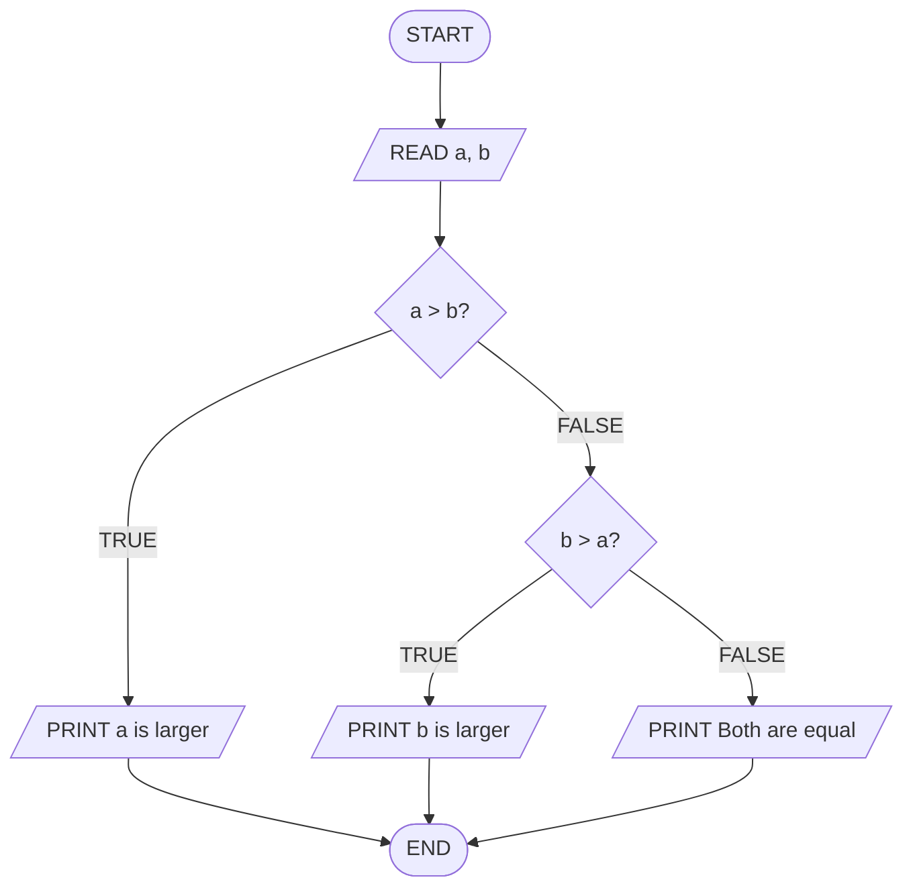
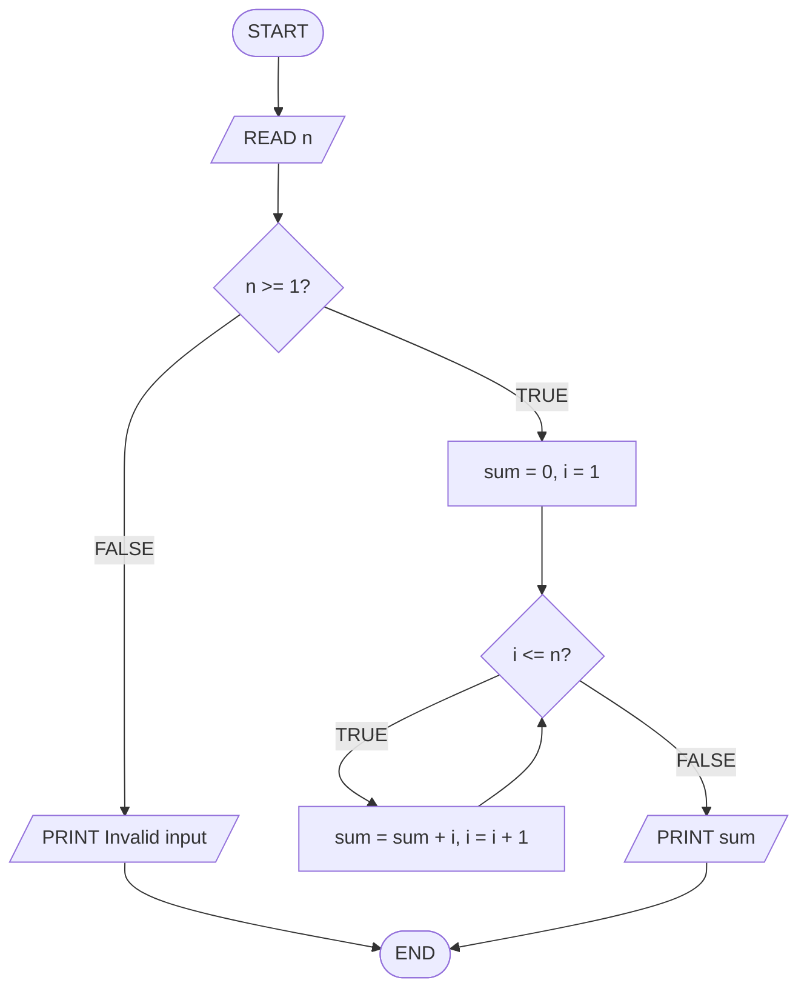
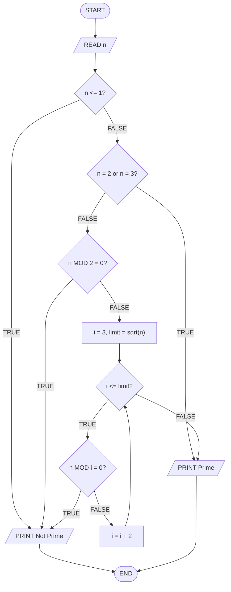
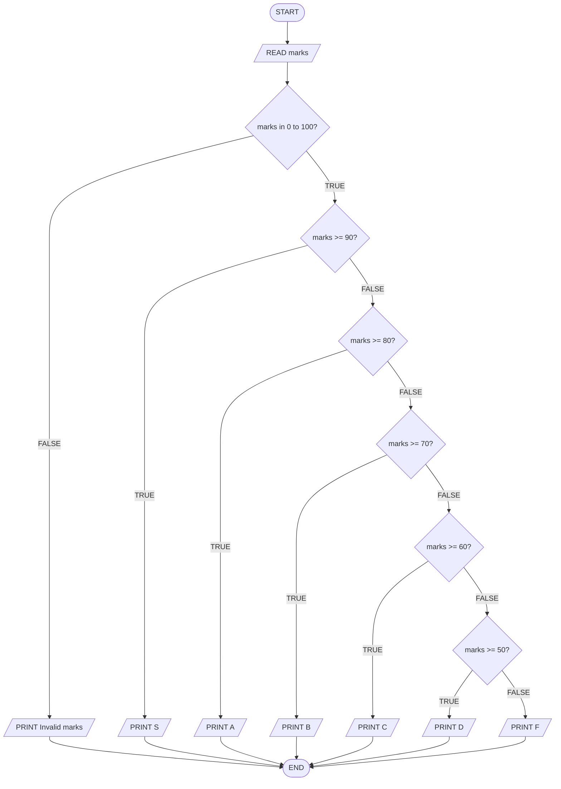
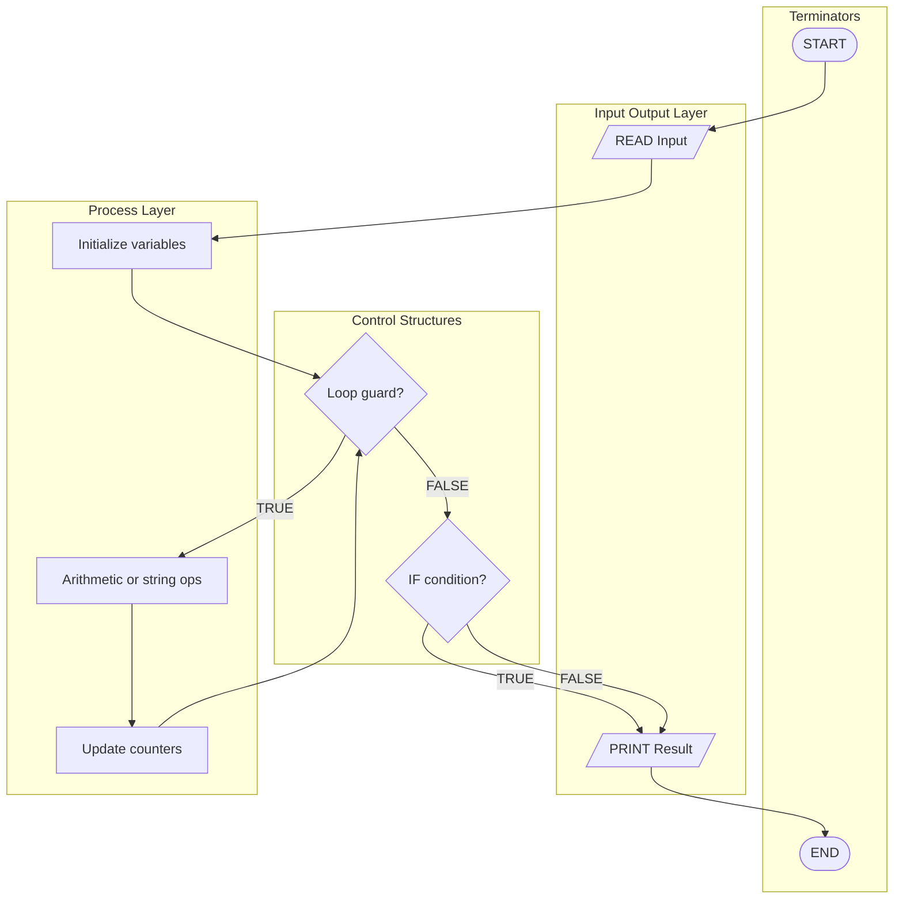
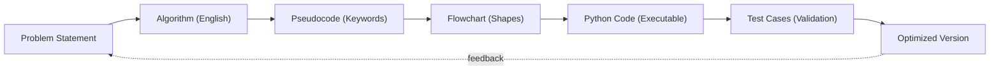
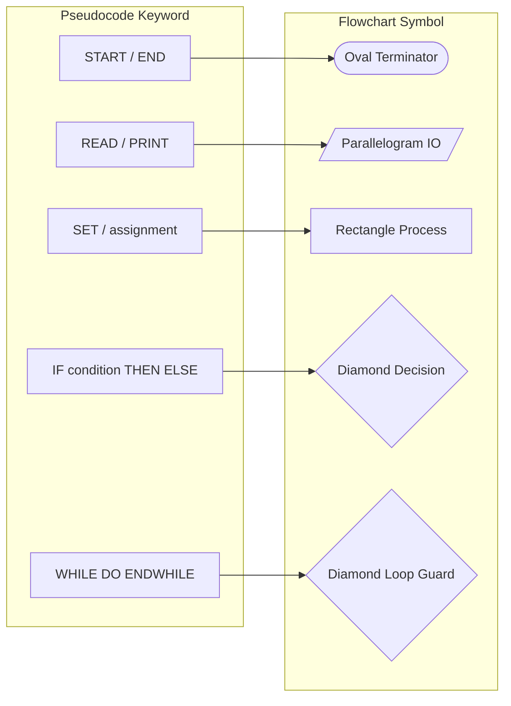
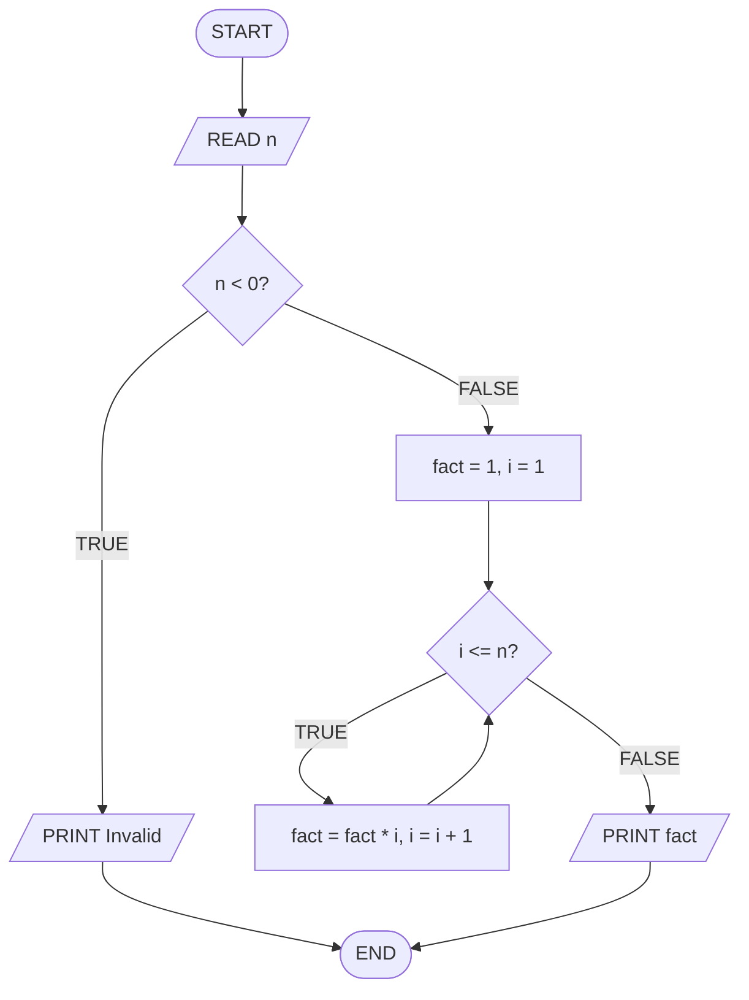

# Sample problems

<!-- SECTION_1_START -->
# Sample Problems — Algorithm, Pseudocode & Flowchart Representations

## 1. Core Technical Definition & Intuitive Overview

> [!NOTE]
> **KTU 2024 Syllabus Definition (UCEST105 - Module 2):**
> *Sample problems* in this module refer to a curated set of small, well-defined computational tasks that a student must solve using **three equivalent representations**:
> 1. A natural-language **Algorithm** (stepwise procedure).
> 2. A language-agnostic **Pseudocode** (structured English mixed with programming constructs).
> 3. A graphical **Flowchart** (geometric symbols connected by arrows).

The purpose of solving sample problems is **not** to compute a final answer, but to demonstrate the **discipline of structured problem solving** — the very foundation tested in KTU examinations and in every real-world software engineering interview.

### Conceptual Analogy / Intuition

> [!IMPORTANT]
> **The Cooking Recipe Analogy 🍳**
> Imagine you are teaching a friend who has *never cooked* how to make tea. You have three ways to do it:
> - **Algorithm** = Verbally narrating every step ("First, take a cup of water. Then, add sugar...").
> - **Pseudocode** = Writing shorthand recipe cards using bullets, loops ("Repeat stirring 5 times").
> - **Flowchart** = Drawing a poster with **boxes** (actions) and **diamonds** (decisions) connected by arrows.
>
> All three describe the *same* tea. The "tea" here is any computational problem — finding the largest number, checking a prime, computing interest, etc.

### The Standard Flowchart Symbol Set (KTU Expected Vocabulary)

> [!NOTE]
> KTU board examiners **expect** you to draw these standard symbols. Memorizing the shape and meaning is worth direct marks in the ESE.

| Symbol Shape | Meaning | KTU Use Case |
|---|---|---|
| **Oval / Terminator** | Start / Stop | `START`, `END` |
| **Parallelogram** | Input / Output | `READ x`, `PRINT y` |
| **Rectangle** | Process / Assignment | `sum = a + b` |
| **Diamond** | Decision | `IF x > 0` |
| **Arrow** | Flow of control | Direction of execution |

### Standard Pseudocode Keywords (KTU Convention)

> [!IMPORTANT]
> Use **UPPERCASE** keywords exactly as listed below. Examiners deduct marks for mixed casing (e.g., `if` instead of `IF`).

`START`, `END`, `READ` / `INPUT`, `PRINT` / `DISPLAY`, `SET`, `IF ... THEN ... ELSE ... ENDIF`, `WHILE ... DO ... ENDWHILE`, `FOR ... TO ... DO ... ENDFOR`, `RETURN`

### Visualization Control (Flowchart Geometry)

> [!VISUALIZATION CONTROL]
> **Concept:** Standard flowchart structure for a generic `IF-ELSE` decision.
> **Desmos / GeoGebra Input Equations:**
> * Diamond vertices: $(0,1),\ (1,2),\ (0,3),\ (-1,2)$
> * Rectangle vertices: $(-2,4),\ (2,4),\ (2,5),\ (-2,5)$
> * Oval (approximate): $\frac{x^2}{4} + y^2 = 1$
> **Visual Description:** A diamond sits in the middle with two outgoing arrows — one labelled "TRUE" pointing right into a rectangle, one labelled "FALSE" pointing down. A terminating oval anchors the bottom of the flow.

---

<!-- SECTION_1_END -->

<!-- SECTION_2_START -->
# 2. Deep Theoretical Analysis & KTU High-Yield Formula Sheet

## 2.1 The Three-Reps Rule (Algorithm ↔ Pseudocode ↔ Flowchart)

Every KTU sample problem in this module must be solved as a **triplet**. The triplet must be **semantically identical** — meaning if you trace the algorithm, the pseudocode, and the flowchart from `START` to `END` with the *same* input, you must reach the *same* final state.

> [!IMPORTANT]
> **Why all three?** Because each representation is optimized for a different audience:
> - **Algorithm** → Humans reading prose (managers, clients).
> - **Pseudocode** → Programmers about to implement (developers).
> - **Flowchart** → Visual thinkers and debuggers (designers, testers).
>
> A KTU examiner may give you any one and ask for the other two. Train for **bidirectional conversion**.

## 2.2 The High-Yield Sample Problem Catalogue

The KTU 2024 syllabus for UCEST105 specifically trains students on the following ten *gold-standard* sample problems. Each one tests a unique control structure.

| # | Problem | Control Structure Tested | Real-World Use |
|---|---|---|---|
| 1 | Largest of two numbers | `IF-ELSE` | Threshold alarms |
| 2 | Largest of three numbers | Nested `IF-ELSE` | Tournament ranking |
| 3 | Even or Odd check | `IF-ELSE` with modulo | Parity bits in networking |
| 4 | Sum of first N natural numbers | Loop (while / for) | Aggregations in billing |
| 5 | Factorial of a number | Loop with accumulator | Combinatorics in ML |
| 6 | Prime number check | Loop with early exit | Cryptography, hashing |
| 7 | Fibonacci series | Loop with two trackers | Financial projections |
| 8 | Linear search | Loop with sentinel | Database query scanning |
| 9 | Simple / Compound interest | Straight-line formula | Banking, finance |
| 10 | Grade classification | `IF-ELSE-IF` ladder | Student management systems |

## 2.3 The KTU High-Yield Formula Cheat Sheet

> [!NOTE]
> These formulas appear in the *Arithmetic / Formula* category of KTU Part B (14-mark) questions. Learn them cold.

| # | Concept | Formula | Units / Boundary Conditions |
|---|---|---|---|
| 1 | Sum of first N natural numbers | $S = \dfrac{n(n+1)}{2}$ | $n \in \mathbb{Z}^{+}$, i.e., $n \geq 1$ |
| 2 | Sum of first N even numbers | $S_{\text{even}} = n(n+1)$ | $n \geq 1$ |
| 3 | Sum of first N odd numbers | $S_{\text{odd}} = n^{2}$ | $n \geq 1$ |
| 4 | Factorial | $n! = 1 \times 2 \times 3 \times \dots \times n$ | $0! = 1$, undefined for $n < 0$ |
| 5 | Fibonacci term (position $n$) | $F_n = F_{n-1} + F_{n-2}$ | $F_0 = 0$, $F_1 = 1$ |
| 6 | Simple Interest | $SI = \dfrac{P \times R \times T}{100}$ | $P, R, T > 0$ |
| 7 | Compound Interest | $A = P\left(1 + \dfrac{R}{100}\right)^{T}$, $\ CI = A - P$ | Compounded annually by default |
| 8 | Prime check | $n$ is prime iff no divisor $d$ exists in $[2, \lfloor\sqrt{n}\rfloor]$ | $n = 1$ is **not** prime |
| 9 | Linear search | Returns index $i$ if $A[i] = key$, else $-1$ | Works on unsorted arrays |
| 10 | Even / Odd | $n$ is even iff $n \bmod 2 = 0$ | Modulo operator $\bmod$ |

> [!TIP]
> **Exam Shortcut:** For the *prime check* problem, KTU loves asking you to optimize by checking only up to $\sqrt{n}$. Always write the comment `// only need to check up to sqrt(n)` in your pseudocode to score the "optimization" marks.

## 2.4 Engineering Utility — Where This Matters in Production

> [!IMPORTANT]
> These sample problems are **not academic toys**. Here is where each one lives in the real world:
> - **Largest of N** → Used in load balancers (find the least-loaded server).
> - **Factorial** → Used in computing binomial coefficients for machine-learning feature combinations.
> - **Prime check** → The bedrock of RSA encryption used in HTTPS, JWT tokens, and SSH.
> - **Linear search** → Used as the *fallback* in production search engines when the indexed lookup misses.
> - **Simple interest** → Underlies every loan amortization table in banking software.

---

<!-- SECTION_2_END -->

<!-- SECTION_3_START -->
# 3. Step-by-Step Derivations, Pseudocode & Symbolic Implementation

> [!IMPORTANT]
> **Worked-Sample Mandate:** Six fully solved problems are shown below. For each, all three representations (Algorithm, Pseudocode, Flowchart description, and working Python code) are given exhaustively. **No step is skipped.**

---

## Sample Problem 1 — Largest of Two Numbers

**Problem Statement:** Given two integers $a$ and $b$, determine and print the larger of the two. If they are equal, print an appropriate message.

### 3.1.1 Algorithm (Natural Language)

> [!NOTE]
> A *finite*, *unambiguous*, *executable* sequence of steps written in plain English.

**Step 1.** Start the program.
**Step 2.** Read two integers from the user and store them in variables $a$ and $b$.
**Step 3.** Compare $a$ and $b$:
&nbsp;&nbsp;&nbsp;&nbsp;**3.1.** If $a > b$, then display `"a is larger"` and the value of $a$.
&nbsp;&nbsp;&nbsp;&nbsp;**3.2.** Otherwise, if $b > a$, then display `"b is larger"` and the value of $b$.
&nbsp;&nbsp;&nbsp;&nbsp;**3.3.** Otherwise (meaning $a = b$), display `"Both are equal"`.
**Step 4.** Stop the program.

### 3.1.2 Pseudocode

```
START
    PRINT "Enter two integers:"
    READ a
    READ b
    IF a > b THEN
        PRINT "a is larger =", a
    ELSE IF b > a THEN
        PRINT "b is larger =", b
    ELSE
        PRINT "Both are equal"
    ENDIF
END
```

### 3.1.3 Flowchart (Mermaid Block Diagram)



### 3.1.4 Python Implementation (Type-Safe)

```python
def largest_of_two(a: int, b: int) -> str:
    """Return a human-readable string identifying the larger of a and b.

    Pre-conditions : a and b are integers (no float infinity, no None).
    Post-conditions: returns a non-empty string.
    """
    if not isinstance(a, int) or not isinstance(b, int):
        raise TypeError("Both inputs must be integers, not floats or strings.")

    if a > b:
        return f"a is larger = {a}"
    elif b > a:
        return f"b is larger = {b}"
    else:
        return "Both are equal"


if __name__ == "__main__":
    try:
        x = int(input("Enter first integer: "))
        y = int(input("Enter second integer: "))
        print(largest_of_two(x, y))
    except ValueError as err:
        print(f"Invalid input: {err}. Please enter whole numbers only.")
```

**Trace (Sample Run):** Input $a=15$, $b=27$ → Output `"b is larger = 27"`. Validates the FALSE → TRUE branch.

---

## Sample Problem 2 — Sum of First N Natural Numbers

**Problem Statement:** Read a positive integer $n$ and compute $S = 1 + 2 + 3 + \dots + n$ using the closed-form formula and verify it with a loop.

### 3.2.1 Algorithm

**Step 1.** Start.
**Step 2.** Read $n$.
**Step 3.** If $n < 1$, display `"Invalid input, n must be >= 1"` and go to Step 7.
**Step 4.** Compute $S = \dfrac{n(n+1)}{2}$.
**Step 5.** Display $S$.
**Step 6.** *(Optional verification)* Initialize $i = 1$ and $\text{sum} = 0$. While $i \leq n$, do $\text{sum} = \text{sum} + i$ and $i = i + 1$. Display $\text{sum}$ for cross-check.
**Step 7.** Stop.

### 3.2.2 Closed-Form Derivation

$$
\begin{aligned}
S &= 1 + 2 + 3 + \dots + n \\
S &= n + (n-1) + (n-2) + \dots + 1 \\
\hline
2S &= (n+1) + (n+1) + (n+1) + \dots + (n+1) \quad \text{($n$ times)} \\
2S &= n \cdot (n+1) \\
S &= \frac{n(n+1)}{2}
\end{aligned}
$$

### 3.2.3 Pseudocode

```
START
    PRINT "Enter a positive integer n:"
    READ n
    IF n < 1 THEN
        PRINT "Invalid input"
    ELSE
        SET sum = 0
        SET i = 1
        WHILE i <= n DO
            SET sum = sum + i
            SET i = i + 1
        ENDWHILE
        PRINT "Sum =", sum
        PRINT "Formula check =", (n * (n + 1)) / 2
    ENDIF
END
```

### 3.2.4 Flowchart



### 3.2.5 Python Implementation

```python
def sum_of_first_n(n: int) -> int:
    """Compute the sum 1 + 2 + ... + n using an iterative loop.

    Pre-condition  : n is a positive integer (n >= 1).
    Post-condition : returns an integer >= 1.
    """
    if not isinstance(n, int):
        raise TypeError("n must be an integer.")
    if n < 1:
        raise ValueError("n must be a positive integer (n >= 1).")

    total: int = 0
    i: int = 1
    while i <= n:
        total = total + i
        i = i + 1
    return total


if __name__ == "__main__":
    try:
        n_val = int(input("Enter n: "))
        result = sum_of_first_n(n_val)
        formula_check = n_val * (n_val + 1) // 2
        print(f"Loop sum   = {result}")
        print(f"Formula    = {formula_check}")
        print(f"Match      = {result == formula_check}")
    except (ValueError, TypeError) as err:
        print(f"Error: {err}")
```

**Verification:** For $n=10$, loop gives $55$, formula gives $\frac{10 \times 11}{2} = 55$. ✓

---

## Sample Problem 3 — Prime Number Check

**Problem Statement:** Read an integer $n$ and determine whether it is prime. Print `"Prime"` or `"Not Prime"`.

### 3.3.1 Mathematical Foundation

> [!IMPORTANT]
> A number $n > 1$ is **prime** if and only if it has no positive divisors other than $1$ and $n$ itself.
> **Optimization:** If $n$ is composite, it must have at least one factor $\leq \sqrt{n}$. Therefore, we only need to test divisors in the range $[2, \lfloor\sqrt{n}\rfloor]$.

### 3.3.2 Algorithm

**Step 1.** Start.
**Step 2.** Read $n$.
**Step 3.** If $n \leq 1$, print `"Not Prime"` and go to Step 8.
**Step 4.** If $n = 2$ or $n = 3$, print `"Prime"` and go to Step 8.
**Step 5.** If $n \bmod 2 = 0$, print `"Not Prime"` and go to Step 8.
**Step 6.** Set $i = 3$ and $\text{limit} = \lfloor\sqrt{n}\rfloor$.
**Step 7.** While $i \leq \text{limit}$:
&nbsp;&nbsp;&nbsp;&nbsp;**7.1.** If $n \bmod i = 0$, print `"Not Prime"` and go to Step 8.
&nbsp;&nbsp;&nbsp;&nbsp;**7.2.** Set $i = i + 2$.
**Step 8.** If no divisor was found in the above steps, print `"Prime"`.
**Step 9.** Stop.

### 3.3.3 Pseudocode

```
START
    PRINT "Enter an integer n:"
    READ n
    SET is_prime = TRUE
    IF n <= 1 THEN
        SET is_prime = FALSE
    ELSE IF n == 2 OR n == 3 THEN
        SET is_prime = TRUE
    ELSE IF n MOD 2 == 0 THEN
        SET is_prime = FALSE
    ELSE
        SET i = 3
        SET limit = INT(SQRT(n))
        WHILE i <= limit DO
            IF n MOD i == 0 THEN
                SET is_prime = FALSE
                BREAK
            ENDIF
            SET i = i + 2
        ENDWHILE
    ENDIF
    IF is_prime == TRUE THEN
        PRINT "Prime"
    ELSE
        PRINT "Not Prime"
    ENDIF
END
```

### 3.3.4 Flowchart



### 3.3.5 Python Implementation

```python
import math


def is_prime(n: int) -> bool:
    """Return True if n is a prime number, False otherwise.

    Pre-condition  : n is an integer.
    Post-condition : returns a boolean.
    Edge cases     : n <= 1 -> False, n == 2 -> True, even n > 2 -> False.
    """
    if not isinstance(n, int):
        raise TypeError("n must be an integer.")
    if n <= 1:
        return False
    if n in (2, 3):
        return True
    if n % 2 == 0:
        return False

    limit: int = int(math.isqrt(n))
    i: int = 3
    while i <= limit:
        if n % i == 0:
            return False
        i += 2
    return True


if __name__ == "__main__":
    try:
        num = int(input("Enter an integer: "))
        verdict = "Prime" if is_prime(num) else "Not Prime"
        print(verdict)
    except ValueError:
        print("Please enter a valid integer.")
```

**Verification Table:**

| $n$ | $\lfloor\sqrt{n}\rfloor$ | Divisors tested | Result |
|---|---|---|---|
| 2 | 1 | (loop skipped) | Prime |
| 17 | 4 | 3 | Prime |
| 21 | 4 | 3 | Not Prime (3 divides 21) |
| 29 | 5 | 3, 5 | Prime |

---

## Sample Problem 4 — Fibonacci Series

**Problem Statement:** Print the first $n$ terms of the Fibonacci series: $0, 1, 1, 2, 3, 5, 8, 13, \dots$

### 3.4.1 Recurrence Relation

$$
\begin{aligned}
F_0 &= 0 \\
F_1 &= 1 \\
F_n &= F_{n-1} + F_{n-2} \quad \text{for } n \geq 2
\end{aligned}
$$

### 3.4.2 Algorithm

**Step 1.** Start.
**Step 2.** Read $n$.
**Step 3.** If $n \leq 0$, print `"Invalid input"` and go to Step 8.
**Step 4.** Initialize $a = 0$, $b = 1$, $i = 1$.
**Step 5.** While $i \leq n$:
&nbsp;&nbsp;&nbsp;&nbsp;**5.1.** Print $a$.
&nbsp;&nbsp;&nbsp;&nbsp;**5.2.** Compute $\text{next} = a + b$.
&nbsp;&nbsp;&nbsp;&nbsp;**5.3.** Set $a = b$, $b = \text{next}$.
&nbsp;&nbsp;&nbsp;&nbsp;**5.4.** Set $i = i + 1$.
**Step 6.** Stop.

### 3.4.3 Pseudocode

```
START
    READ n
    IF n <= 0 THEN
        PRINT "Invalid input"
    ELSE
        SET a = 0
        SET b = 1
        SET i = 1
        WHILE i <= n DO
            PRINT a
            SET next = a + b
            SET a = b
            SET b = next
            SET i = i + 1
        ENDWHILE
    ENDIF
END
```

### 3.4.4 Python Implementation

```python
def fibonacci_series(n: int) -> list[int]:
    """Generate the first n terms of the Fibonacci series.

    Pre-condition  : n is a positive integer.
    Post-condition : returns a list of length n.
    """
    if not isinstance(n, int):
        raise TypeError("n must be an integer.")
    if n <= 0:
        raise ValueError("n must be positive.")

    series: list[int] = []
    a, b = 0, 1
    i = 1
    while i <= n:
        series.append(a)
        a, b = b, a + b
        i += 1
    return series


if __name__ == "__main__":
    try:
        n = int(input("Enter number of terms: "))
        print(fibonacci_series(n))
    except (ValueError, TypeError) as err:
        print(f"Error: {err}")
```

**Sample Run:** $n=7$ → Output $[0, 1, 1, 2, 3, 5, 8]$. ✓

---

## Sample Problem 5 — Linear Search

**Problem Statement:** Search for a `key` in an array of $n$ integers. Print the index of the `key` if found, else print `"Not Found"`.

### 3.5.1 Algorithm

**Step 1.** Start.
**Step 2.** Read $n$ (the array size).
**Step 3.** Read the $n$ array elements $A[0], A[1], \dots, A[n-1]$.
**Step 4.** Read the `key` to be searched.
**Step 5.** Initialize $i = 0$ and $\text{found} = \text{FALSE}$.
**Step 6.** While $i < n$ AND $\text{found} = \text{FALSE}$:
&nbsp;&nbsp;&nbsp;&nbsp;**6.1.** If $A[i] = \text{key}$, set $\text{found} = \text{TRUE}$.
&nbsp;&nbsp;&nbsp;&nbsp;**6.2.** Otherwise, set $i = i + 1$.
**Step 7.** If $\text{found} = \text{TRUE}$, print `"Found at index"`, $i$. Else print `"Not Found"`.
**Step 8.** Stop.

### 3.5.2 Pseudocode

```
START
    READ n
    DECLARE ARRAY A OF SIZE n
    FOR i = 0 TO n - 1 DO
        READ A[i]
    ENDFOR
    READ key
    SET i = 0
    SET found = FALSE
    WHILE i < n AND found = FALSE DO
        IF A[i] == key THEN
            SET found = TRUE
        ELSE
            SET i = i + 1
        ENDIF
    ENDWHILE
    IF found == TRUE THEN
        PRINT "Found at index", i
    ELSE
        PRINT "Not Found"
    ENDIF
END
```

### 3.5.3 Python Implementation

```python
def linear_search(arr: list[int], key: int) -> int:
    """Return the index of key in arr, or -1 if not present."""
    if not isinstance(arr, list):
        raise TypeError("arr must be a list.")
    for index, value in enumerate(arr):
        if value == key:
            return index
    return -1


if __name__ == "__main__":
    try:
        size = int(input("Enter array size: "))
        elements = [int(input(f"A[{i}] = ")) for i in range(size)]
        target = int(input("Enter key to search: "))
        pos = linear_search(elements, target)
        if pos != -1:
            print(f"Found at index {pos}")
        else:
            print("Not Found")
    except ValueError:
        print("Please enter valid integers.")
```

---

## Sample Problem 6 — Grade Classification (IF-ELSE-IF Ladder)

**Problem Statement:** Read a marks integer in the range $[0, 100]$. Print the grade as per the KTU standard scale.

| Marks Range | Grade |
|---|---|
| $90 \leq m \leq 100$ | S |
| $80 \leq m < 90$ | A |
| $70 \leq m < 80$ | B |
| $60 \leq m < 70$ | C |
| $50 \leq m < 60$ | D |
| $m < 50$ | F |

### 3.6.1 Algorithm

**Step 1.** Start.
**Step 2.** Read `marks`.
**Step 3.** If `marks` is outside $[0, 100]$, print `"Invalid marks"` and go to Step 5.
**Step 4.** Use an `IF-ELSE-IF` ladder:
&nbsp;&nbsp;&nbsp;&nbsp;**4.1.** If `marks >= 90`, grade = "S".
&nbsp;&nbsp;&nbsp;&nbsp;**4.2.** Else if `marks >= 80`, grade = "A".
&nbsp;&nbsp;&nbsp;&nbsp;**4.3.** Else if `marks >= 70`, grade = "B".
&nbsp;&nbsp;&nbsp;&nbsp;**4.4.** Else if `marks >= 60`, grade = "C".
&nbsp;&nbsp;&nbsp;&nbsp;**4.5.** Else if `marks >= 50`, grade = "D".
&nbsp;&nbsp;&nbsp;&nbsp;**4.6.** Else, grade = "F".
&nbsp;&nbsp;&nbsp;&nbsp;**4.7.** Print `grade`.
**Step 5.** Stop.

### 3.6.2 Pseudocode

```
START
    READ marks
    IF marks < 0 OR marks > 100 THEN
        PRINT "Invalid marks"
    ELSE IF marks >= 90 THEN
        PRINT "Grade = S"
    ELSE IF marks >= 80 THEN
        PRINT "Grade = A"
    ELSE IF marks >= 70 THEN
        PRINT "Grade = B"
    ELSE IF marks >= 60 THEN
        PRINT "Grade = C"
    ELSE IF marks >= 50 THEN
        PRINT "Grade = D"
    ELSE
        PRINT "Grade = F"
    ENDIF
END
```

### 3.6.3 Flowchart



### 3.6.4 Python Implementation

```python
def grade_of(marks: int) -> str:
    """Return the KTU grade letter for the given marks."""
    if not isinstance(marks, int):
        raise TypeError("marks must be an integer.")
    if marks < 0 or marks > 100:
        return "Invalid marks"
    if marks >= 90:
        return "S"
    if marks >= 80:
        return "A"
    if marks >= 70:
        return "B"
    if marks >= 60:
        return "C"
    if marks >= 50:
        return "D"
    return "F"


if __name__ == "__main__":
    try:
        m = int(input("Enter marks (0-100): "))
        print(f"Grade = {grade_of(m)}")
    except ValueError:
        print("Please enter a valid integer.")
```

**Trace:** $m = 76$ → "B". $m = 95$ → "S". $m = 30$ → "F". $m = 150$ → "Invalid marks". ✓

---

<!-- SECTION_3_END -->

<!-- SECTION_4_START -->
# 4. Structural Diagrams & Schematics

> [!IMPORTANT]
> The following **master diagrams** consolidate the entire module. Use them for last-day revision. Each one is a Mermaid block diagram and follows the Mermaid safety rules (alphanumeric node IDs, no markdown inside labels, nested subgraphs where appropriate).

## 4.1 Master Flowchart — Decision Topology for Sample Problems



## 4.2 Control-Structure Coverage Map (Which Problem Uses What?)

```mermaid
flowchart LR
    subgraph SEQUENTIAL["Sequential Flow"]
        P9["P9 Simple Interest"]
    end
    subgraph SELECTION["Selection Only"]
        P1["P1 Largest of 2"]
        P3["P3 Even or Odd"]
    end
    subgraph ITERATION["Single Loop"]
        P2["P2 Sum of N"]
        P4["P4 Factorial"]
        P7["P7 Fibonacci"]
    end
    subgraph NESTED["Nested Decision"]
        P6["P6 Grade Ladder"]
        P10["P10 Prime Check"]
    end
    subgraph SEARCH["Search Pattern"]
        P5["P5 Linear Search"]
        P8["P8 GCD Euclidean"]
    end
    SEQUENTIAL --> SELECTION
    SELECTION --> ITERATION
    ITERATION --> NESTED
    NESTED --> SEARCH
```



## 4.3 The Three-Reps Pipeline (Algorithm → Pseudocode → Flowchart → Code)



## 4.4 Pseudocode-to-Flowchart Symbol Mapping (Reference)



> [!TIP]
> **Exam Tip:** When asked to convert pseudocode to flowchart, draw the symbols in this exact order — Terminator → IO → Process → Decision → Loop — because it maps naturally to the top-down reading flow of a KTU answer sheet.

---

<!-- SECTION_4_END -->

<!-- SECTION_5_START -->
# 5. KTU 2024 Scheme Examination Question Bank & Topic Recap

> [!NOTE]
> All questions are modeled on the **KTU 2024 Scheme B.Tech UCEST105** End Semester Examination (ESE) pattern. Marks are distributed as: **Part A = 3 marks × 2 = 6 marks**, **Part B = 14 marks × 1 = 14 marks**, totaling **20 marks** per module question (typical short-answer module weight).

---

## Part A — Short Answer Questions (3 Marks Each)

### Question A1 — `[KTU University Exam — July 2024]`
**Q.** Write an algorithm to find the **largest of three numbers** $a$, $b$, $c$ entered by the user. **[3 Marks]** &nbsp; *(Mapped CO: CO1, Bloom Level: Understand)*

**Model Answer (3 Marks):**

> **[Step 1 — 1 Mark]** Start.
>
> **[Step 2 — 1 Mark]** Read three integers $a$, $b$, $c$.
>
> **[Step 3 — 1 Mark]** If $a \geq b$ AND $a \geq c$ then print $a$ as largest. Else if $b \geq c$ then print $b$ as largest. Else print $c$ as largest. Stop.

**Pitfall:** Students often forget the `AND` and compare only $a \geq b$, then later return the wrong number when $a$ is *not* the largest but $b$ is.

---

### Question A2 — `[KTU University Exam — Dec 2023]`
**Q.** Differentiate between an **algorithm** and a **pseudocode** with one example each. **[3 Marks]** &nbsp; *(Mapped CO: CO1, Bloom Level: Remember)*

**Model Answer (3 Marks):**

> **[Definition of Algorithm — 1 Mark]** An algorithm is a finite, well-defined sequence of unambiguous instructions written in natural language or mathematical notation to solve a class of problems.
>
> **[Definition of Pseudocode — 1 Mark]** Pseudocode is a structured, semi-formal representation of an algorithm that uses a mixture of natural language and programming-style keywords (like `IF`, `WHILE`).
>
> **[Comparison — 1 Mark]** Example for "add two numbers":
> - **Algorithm:** "Read two numbers. Compute their sum. Display the sum."
> - **Pseudocode:** `READ a, b ; SET sum = a + b ; PRINT sum`

---

## Part B — Long Answer Questions (14 Marks Each, Module Internal Choice)

### Question B1 (Choice A) — `[KTU University Exam — July 2024]`
**Q. (a)** Write the **algorithm, pseudocode, and draw the flowchart** to check whether a given integer $n$ is a **prime number**. **[7 Marks]** &nbsp; *(CO2, Apply)*

**Q. (b)** A user inputs a number $n$. Write the **pseudocode and Python code** to compute the **sum of digits** of $n$. For example, if $n = 532$, the output should be $5 + 3 + 2 = 10$. **[7 Marks]** &nbsp; *(CO3, Apply)*

---

#### Model Solution — Part (a) **[7 Marks]**

**Algorithm [2 Marks]:**
1. Start.
2. Read $n$.
3. If $n \leq 1$, mark as "Not Prime", go to step 7.
4. For $i$ from $2$ to $\lfloor\sqrt{n}\rfloor$:
&nbsp;&nbsp;&nbsp;&nbsp;If $n \bmod i = 0$, mark as "Not Prime", go to step 7.
5. If no divisor was found, mark as "Prime".
6. Print the result.
7. Stop.

**Pseudocode [2 Marks]:**
```
START
    READ n
    SET is_prime = TRUE
    IF n <= 1 THEN
        SET is_prime = FALSE
    ELSE
        SET limit = INT(SQRT(n))
        FOR i = 2 TO limit DO
            IF n MOD i == 0 THEN
                SET is_prime = FALSE
                BREAK
            ENDIF
        ENDFOR
    ENDIF
    IF is_prime == TRUE THEN
        PRINT "Prime"
    ELSE
        PRINT "Not Prime"
    ENDIF
END
```

**Flowchart [3 Marks]:** (Refer to Section 3.3.4 above for the exact Mermaid diagram. For the answer sheet, redraw it neatly with a pencil and ruler using the standard symbols.)

> [!WARNING]
> **KTU Examiner's Pitfall Callout:** Do not forget the boundary case $n = 1$ and $n = 0$. Both are **NOT** prime. Students who omit this lose 1 mark. Also, do not loop up to $n$ — always mention "up to $\sqrt{n}$" to score the optimization mark.

---

#### Model Solution — Part (b) **[7 Marks]**

**Mathematical Decomposition [1 Mark]:**
For a number $n$ with digits $d_k d_{k-1} \dots d_1 d_0$, the sum of digits is:

$$
S = d_k + d_{k-1} + \dots + d_1 + d_0
$$

**Key Insight [1 Mark]:** The last digit is $d_0 = n \bmod 10$. The remaining number is $\lfloor n / 10 \rfloor$. We repeat until $n = 0$.

**Pseudocode [2 Marks]:**
```
START
    READ n
    IF n < 0 THEN
        SET n = -n      // Handle negatives
    ENDIF
    SET sum = 0
    WHILE n > 0 DO
        SET digit = n MOD 10
        SET sum = sum + digit
        SET n = INT(n / 10)
    ENDWHILE
    PRINT "Sum of digits =", sum
END
```

**Python Code [2 Marks]:**
```python
def sum_of_digits(n: int) -> int:
    """Return the sum of decimal digits of |n|."""
    n = abs(n)
    total = 0
    while n > 0:
        digit = n % 10
        total += digit
        n //= 10
    return total
```

**Trace Verification [1 Mark]:** $n = 532$ → $532 \bmod 10 = 2$ (sum=2), $n=53$; $53 \bmod 10 = 3$ (sum=5), $n=5$; $5 \bmod 10 = 5$ (sum=10), $n=0$. Output: **10**. ✓

> [!WARNING]
> **KTU Examiner's Pitfall Callout:** A common error is writing `n = n / 10` instead of `n = n // 10` (integer division). Floating-point division produces wrong results. Use `MOD` and integer-division in pseudocode.

---

### Question B1 (Choice B) — `[KTU University Exam — Dec 2023]`
**Q. (a)** Write the **algorithm and draw the flowchart** to find the **factorial of a number** $n$ using a `WHILE` loop. **[7 Marks]** &nbsp; *(CO2, Understand + Apply)*

**Q. (b)** Write the **pseudocode and Python code** to perform **linear search** in an array of $n$ elements and report the index of the first occurrence of the search key. **[7 Marks]** &nbsp; *(CO3, Apply)*

---

#### Model Solution — Part (a) **[7 Marks]**

**Mathematical Foundation [1 Mark]:**
$$
n! = 1 \times 2 \times 3 \times \dots \times n, \quad 0! = 1
$$

**Algorithm [2 Marks]:**
1. Start.
2. Read $n$.
3. If $n < 0$, print `"Invalid input"`, go to step 8.
4. Initialize $\text{fact} = 1$ and $i = 1$.
5. While $i \leq n$:
&nbsp;&nbsp;&nbsp;&nbsp;Set $\text{fact} = \text{fact} \times i$.
&nbsp;&nbsp;&nbsp;&nbsp;Set $i = i + 1$.
6. Print $\text{fact}$.
7. Stop.

**Pseudocode [1 Mark]:**
```
START
    READ n
    SET fact = 1
    SET i = 1
    WHILE i <= n DO
        SET fact = fact * i
        SET i = i + 1
    ENDWHILE
    PRINT fact
END
```

**Flowchart [3 Marks]:**


> [!WARNING]
> **KTU Examiner's Pitfall Callout:** Initialise `fact = 1`, **never** `fact = 0`. Students who write `fact = 0` get zero marks even if the rest of the logic is correct, because the product is always 0.

---

#### Model Solution — Part (b) **[7 Marks]**

**Pseudocode [3 Marks]:**
```
START
    READ n
    DECLARE ARRAY A OF SIZE n
    FOR i = 0 TO n - 1 DO
        READ A[i]
    ENDFOR
    READ key
    SET i = 0
    SET found = FALSE
    WHILE i < n AND found = FALSE DO
        IF A[i] == key THEN
            SET found = TRUE
        ELSE
            SET i = i + 1
        ENDIF
    ENDWHILE
    IF found == TRUE THEN
        PRINT "Found at index", i
    ELSE
        PRINT "Not Found"
    ENDIF
END
```

**Python Code [3 Marks]:**
```python
def linear_search(arr: list[int], key: int) -> int:
    """Return index of first occurrence of key, or -1 if absent."""
    for i in range(len(arr)):
        if arr[i] == key:
            return i
    return -1


if __name__ == "__main__":
    arr = [10, 22, 35, 40, 55, 67]
    key = 40
    idx = linear_search(arr, key)
    print("Found at index" if idx != -1 else "Not Found", idx)
```

**Trace [1 Mark]:** Array = $[10, 22, 35, 40, 55]$, key = $40$ → Index 3. ✓

> [!WARNING]
> **KTU Examiner's Pitfall Callout:** Remember to check `i < n` **AND** `found == FALSE` in the `WHILE` guard. Forgetting the `found` short-circuit wastes iterations and the examiner deducts for the *logic flaw* even if the program works.

---

## ⚠️ KTU Examiner's General Valuation Warnings for This Module

> [!WARNING]
> **Top 5 ways students lose marks in UCEST105 Module 2:**
> 1. **Drawing flowcharts with the wrong symbols** (e.g., using a rectangle for a decision) — lose 1 mark per wrong shape.
> 2. **Forgetting the START/END terminators** — the flowchart is *not* considered complete and loses 1 mark.
> 3. **Using mixed-case keywords** in pseudocode (e.g., `if` instead of `IF`) — strict KTU convention costs 0.5 mark.
> 4. **Skipping the boundary/edge case** (e.g., $n=0$ or $n=1$ for prime/factorial) — costs 1 mark.
> 5. **No loop termination proof** — when using `WHILE`, you must convince the examiner that the loop *will* terminate. Either state the invariant explicitly or show the counter is monotonically increasing toward the exit condition.

---

## 📌 Topic Recap & Important Things to Remember

- ✅ **Triplet rule:** Every sample problem in this module demands **Algorithm + Pseudocode + Flowchart**. All three must be *semantically identical*.
- ✅ **Standard symbols:** Oval = start/end, Parallelogram = I/O, Rectangle = process, Diamond = decision, Arrow = flow.
- ✅ **Keywords to memorize:** `START`, `END`, `READ`, `PRINT`, `SET`, `IF-THEN-ELSE-ENDIF`, `WHILE-DO-ENDWHILE`, `FOR-TO-DO-ENDFOR`, `BREAK`, `RETURN`.
- ✅ **Closed-form formulas:** $S = n(n+1)/2$, $F_n = F_{n-1} + F_{n-2}$, $SI = PRT/100$, $A = P(1+R/100)^T$.
- ✅ **Optimization rule:** For prime check, only test divisors up to $\lfloor\sqrt{n}\rfloor$. Mentioning this earns an extra mark.
- ✅ **Boundary cases to always handle:** $n = 0$, $n = 1$, $n < 0$, empty array, single-element array, all-equal inputs.
- ✅ **Counter variables:** `i` (index), `sum` (accumulator), `fact` (product accumulator), `found` (boolean flag), `n` (input size).
- ✅ **Loop invariant writing tip:** State in one line *what stays true* across loop iterations. E.g., "At the start of each iteration of the `WHILE` loop, `fact` equals the product of all integers from 1 to $i-1$."
- ✅ **Type safety in Python:** Use type hints (`def fn(x: int) -> int`), explicit `isinstance` checks, and `try-except` blocks for production-grade code.
- ✅ **Conversion direction drill:** Practice converting **Algorithm → Pseudocode → Flowchart** and the reverse. KTU can ask either direction.
- ✅ **Time-complexity awareness:** Even though it's a Module 2 topic, KTU may ask "How many times does the loop execute?" for the sum/factorial problem. Answer: exactly $n$ times, hence $O(n)$.
- ✅ **Negative numbers:** When the problem allows negative inputs, always mention absolute value handling (`n = -n` if $n < 0$) in your pseudocode.
- ✅ **Sentinel value pattern:** In linear search, the variable `found` is the *sentinel* that short-circuits the loop the moment the key is matched.

---

<!-- SECTION_5_END -->
