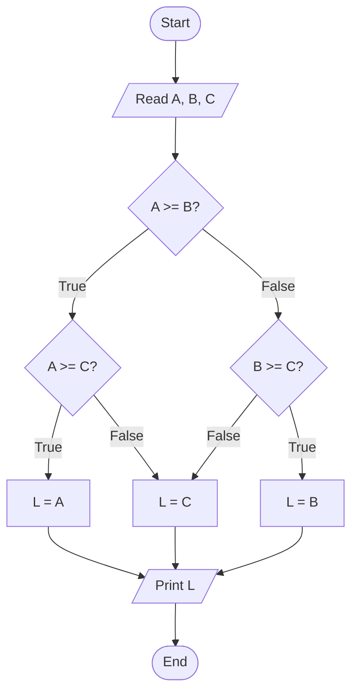
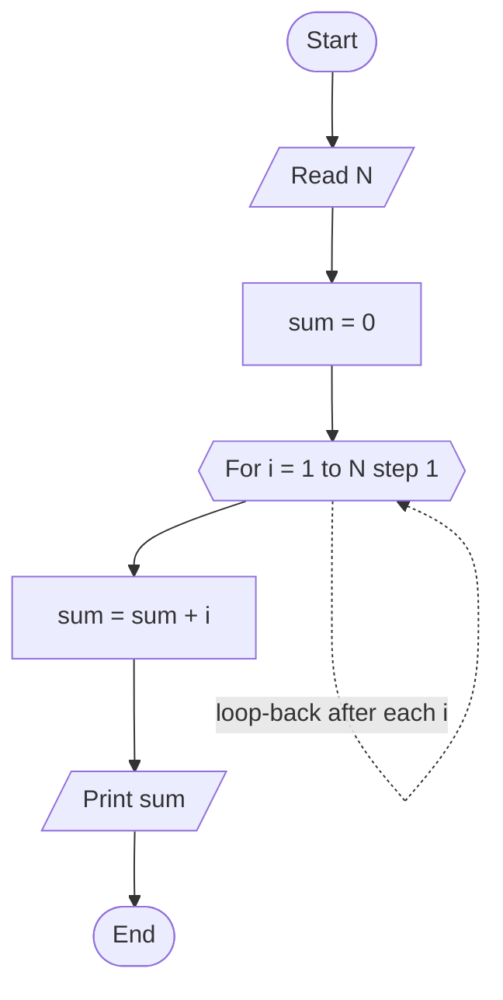
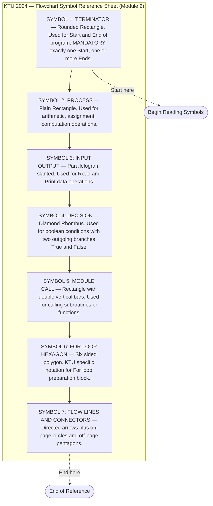
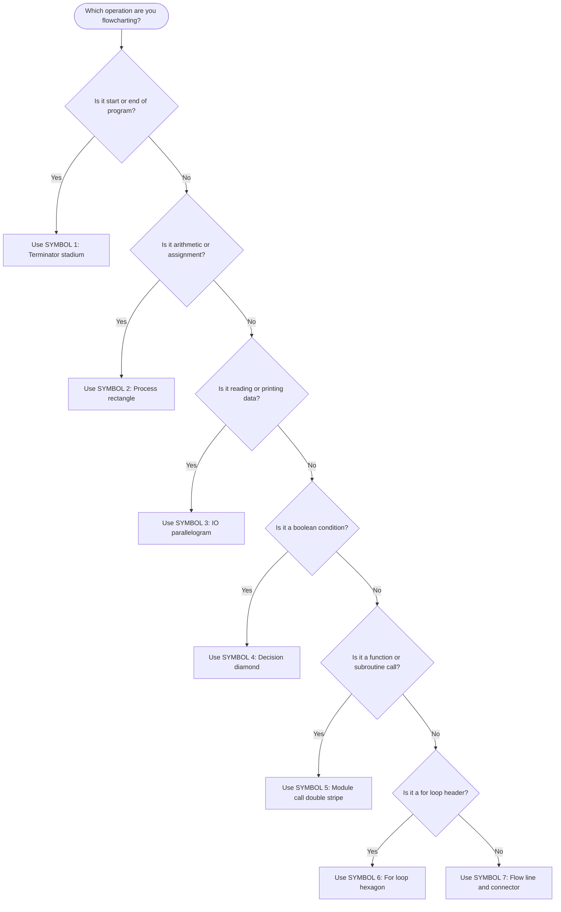
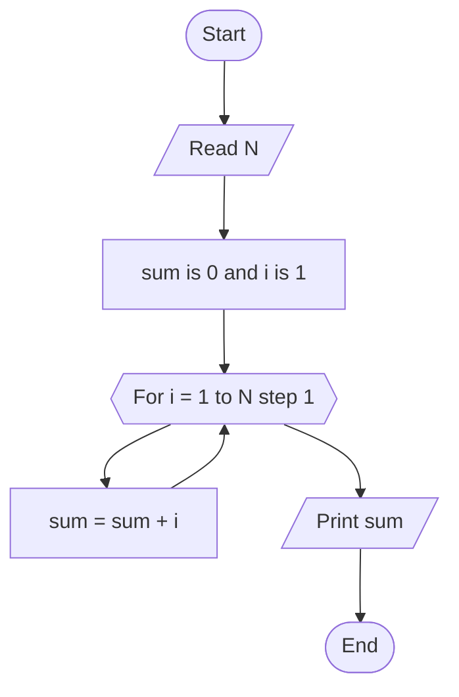
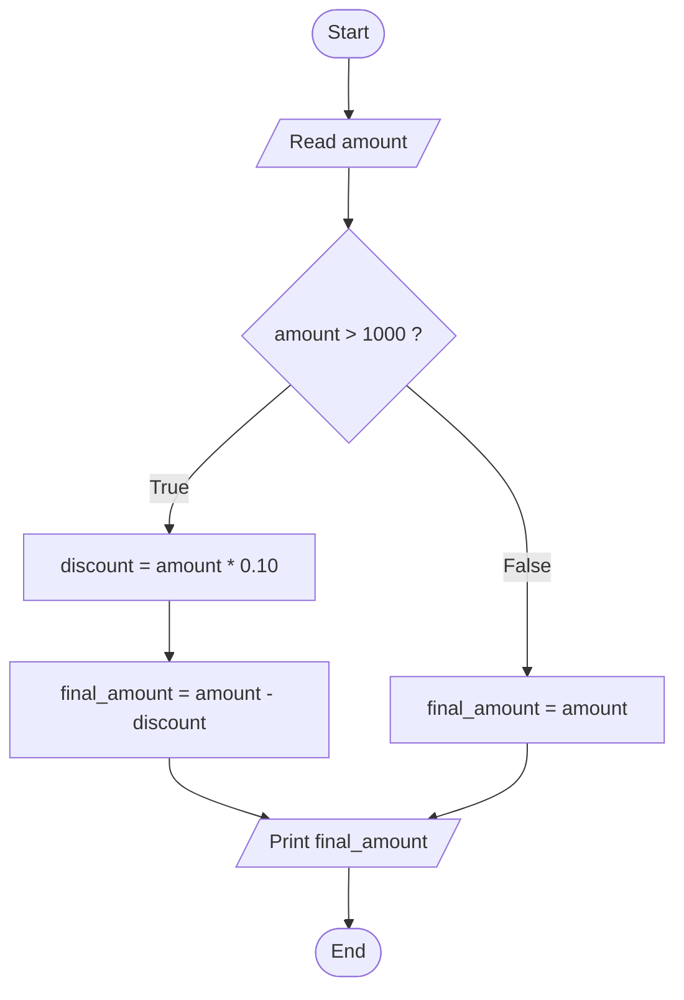
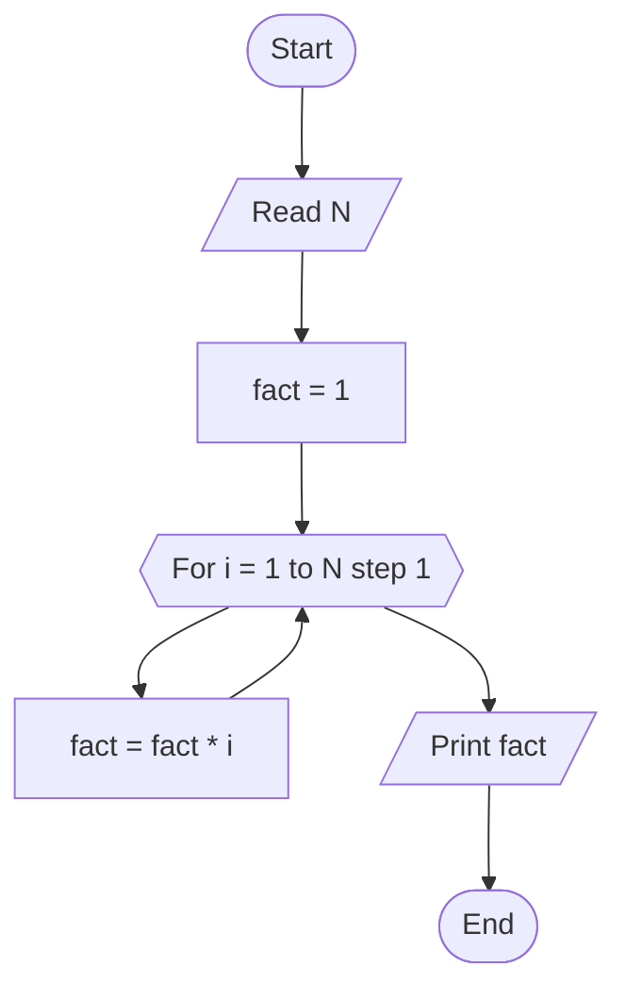

# Symbols used in creating a Flowchart - start/end, arithmetic calculations, input/output operation, decision, module name (call), for loop (Hexagon), flow-lines, connectors

<!-- SECTION_1_START -->
# Flowchart Symbols — Core Definition & Intuitive Overview

## 1.1 Formal Academic Definition (KTU 2024 Syllabus Terminology)

> [!NOTE]
> **Flowchart (ANSI / ISO 5807 Standard):** A *flowchart* is a standardized, schematic, **graphical** representation of an *algorithm*, *process*, or *program* workflow, constructed using a finite, well-defined set of **geometric symbols** connected by **directed flow-lines** to depict the sequence of operations, decision points, input/output, and termination conditions.

In the **KTU 2024 Scheme (Course Code: UCEST105 — Algorithmic Thinking with Python)**, Module 2 mandates the use of the following **seven (7) primary flowchart symbols** as per the standard *ANSI / ISO 5807* notation:

1. **Terminator** (Start / End) — *Rounded rectangle / Stadium shape*
2. **Process / Arithmetic Calculation** — *Rectangle*
3. **Input / Output Operation** — *Parallelogram*
4. **Decision** — *Diamond (Rhombus)*
5. **Predefined Process / Module Call (Subroutine)** — *Rectangle with double vertical edges*
6. **Loop Preparation (For-Loop)** — *Hexagon (KTU-specific notation)* — `$ \text{Hexagon} $
7. **Flow-lines & Connectors** — *Arrows + small circles (On-page / Off-page)*

## 1.2 Conceptual Analogy & Intuitive Understanding

> [!IMPORTANT]
> **Think of a flowchart as the *Google Maps route* for a program.**
> - The **Start/End symbol** = Your current location 🏁 and destination 🏁.
> - The **Process box (Rectangle)** = The straight highway you drive on — where actual *work* (arithmetic, assignment) happens.
> - The **Input/Output box (Parallelogram)** = A *toll booth* — you give data in, or receive data out.
> - The **Diamond (Decision)** = A *Y-junction* — you ask "Is it raining? ☔" → *Yes* go left, *No* go right.
> - **Module Call** = A *detour sign* to a side road that has its own smaller map (subroutine).
> - **Hexagon (For-loop)** = A *loop road* — you drive the same road N times.
> - **Connectors** = *Roundabout numbers* (e.g., Circle "A") when the map is too big to fit on one page.

## 1.3 Geometric & Visual Representation

> [!VISUALIZATION CONTROL]
> **Concept:** Standard Flowchart Symbol Layout on the $x$–$y$ Plane
> **GeoGebra / Desmos Input Equations:**
> - $ \text{Terminator} : (x-0)^2 + y^2 = 4 \;\; \text{with} \;\; x \in [-2, 2] \;\; \text{(stadium shape)} $
> - $ \text{Process} : x \in [-1, 1], \;\; y \in [-0.5, 0.5] \;\; \text{(rectangle)} $
> - $ \text{I/O} : \text{Slanted parallelogram, slope} = 0.5 $
> - $ \text{Decision} : \text{Polygon with vertices at } (0,1), (1,0), (0,-1), (-1,0) $
> - $ \text{For-Loop (Hexagon)} : \text{6 vertices on circle of radius 1} $
>
> **Visual Description:** The student should imagine each symbol centered on a grid, with `Start` always at the top, and `End` always at the bottom. Flow-lines (arrows) flow generally from **top → bottom**, with side branches for decisions.

## 1.4 Why This Topic Matters in KTU 2024

> [!NOTE]
> **CO Mapping (UCEST105):** This topic directly maps to **CO1 — *Understand the fundamentals of algorithmic problem solving* (Remember / Understand Level)**, and forms the foundational prerequisite for **CO2 — *Design algorithms using control structures and flowcharts***.

---
<!-- SECTION_1_END -->

<!-- SECTION_2_START -->
# Deep Theoretical Analysis & KTU High-Yield Symbol Cheat Sheet

## 2.1 The 7 Symbols — Operational Breakdown

### 🔹 Symbol 1: Terminator (Start / End)
- **Shape:** Rounded rectangle (stadium / pill shape).
- **Logic:** Every valid flowchart **must** have exactly **one Start** and **at least one End**.
- **Text inside:** The word *"Start"* / *"Begin"* or *"End"* / *"Stop"*.
- **Rule:** No two Start symbols are allowed. Multiple End symbols are permissible (e.g., one for *success path*, one for *error path*).

### 🔹 Symbol 2: Process / Arithmetic Calculation
- **Shape:** Plain **rectangle**.
- **Logic:** Holds any *assignment*, *computation*, or *state change* operation. Examples:
  - $ \text{count} \leftarrow \text{count} + 1 $
  - $ \text{area} \leftarrow \pi \cdot r^2 $
  - $ \text{avg} \leftarrow \dfrac{a + b + c}{3} $
- **Rule:** One rectangle = one logical operation. Avoid stuffing multiple unrelated operations inside.

### 🔹 Symbol 3: Input / Output (I/O)
- **Shape:** **Parallelogram** (slanted rectangle).
- **Logic:** Used for reading data from the user (input) or displaying data to the user (output).
  - **Input examples:** `Read X`, `Read name, age`
  - **Output examples:** `Print "Result = "`, `Display sum`
- **Rule:** Some textbooks use the *same* parallelogram for both. The KTU 2024 accepted convention is to label it explicitly (`Read` or `Print`).

### 🔹 Symbol 4: Decision
- **Shape:** **Diamond (Rhombus)**.
- **Logic:** Contains a *boolean expression* or *condition* with exactly **two outgoing flow-lines** (and optionally a third default path).
- **Labels on outgoing arrows:** `True / Yes` and `False / No`. Convention: `True` goes **Right** or **Down**; `False` goes **Left** or **Up**.
- **Examples of conditions:**
  - $ n \bmod 2 \; == \; 0 $
  - $ x \geq 0 $
  - $ a \; > \; b \; \text{AND} \; c \; < \; d $

### 🔹 Symbol 5: Predefined Process / Module Call
- **Shape:** Rectangle with **double vertical lines** on the left and right edges.
- **Logic:** Represents a call to a *named subroutine*, *function*, or *module* that has its own separate flowchart. Examples: `CALL sort(array)`, `CALL factorial(n)`.
- **Engineering utility:** Promotes **modular design** (top-down decomposition) — the same principle that drives Python's `def` functions and C's `void` procedures.

### 🔹 Symbol 6: For-Loop Preparation (KTU-Specific Hexagon)
- **Shape:** **Hexagon** (6-sided polygon). *Note: This is a KTU-specific extension; ISO 5807 does NOT use a hexagon — KTU uses it for explicit loop-bound declaration.*
- **Logic:** Contains the **loop initialization, condition, and update** in a single block. Example: `For i = 1 to 10 step 1`.
- **Rule:** The loop body is a sub-flowchart connected via the hexagon. The hexagon always has **one entry** (top) and **two exits**: one back to the loop body, one to the post-loop statement.

### 🔹 Symbol 7: Flow-lines & Connectors
- **Flow-line:** A directed arrow $ \rightarrow $ connecting two symbols.
  - **Arrowhead rule:** Always drawn at the *destination* (downstream) end.
  - **Direction:** Top-to-bottom, left-to-right is the **strongly preferred** convention.
- **Connector (On-page):** A small **circle** containing an identifier (e.g., `A`, `B`, `1`) used when the flowchart is too wide and needs a logical link without crossing lines.
- **Connector (Off-page):** A small **home-plate-shaped pentagon** with an identifier, used when the flow continues on a *different page*.

## 2.2 KTU High-Yield Symbol Cheat Sheet

> [!IMPORTANT]
> **Exam Tip:** KTU examiners *frequently* ask: *"Match the symbol to its function"* (2 marks) or *"Draw the symbol used for the X operation"* (1 mark). Memorize this table thoroughly.

| S.No. | Symbol Name | Shape Geometry | KTU Use-Case | Example Text Inside |
|:-----:|:------------|:---------------|:-------------|:--------------------|
| 1 | **Terminator** | Rounded rectangle (stadium) | Start / End of program | `Start`, `End` |
| 2 | **Process** | Plain rectangle | Arithmetic / Assignment | $ a \leftarrow a + 1 $ |
| 3 | **Input / Output** | Parallelogram (slanted) | Read / Print data | `Read n`, `Print sum` |
| 4 | **Decision** | Diamond (rhombus) | Boolean condition | $ x \geq 0 \; ? $ |
| 5 | **Module Call** | Rectangle with double vertical bars | Function / Subroutine call | `CALL sort(A, n)` |
| 6 | **For-Loop (KTU)** | Hexagon (6-sided) | Loop initialization | `For i = 1 to N` |
| 7 | **Flow-line** | Arrow with single arrowhead | Sequence of execution | $\rightarrow$ |
| 8 | **On-page Connector** | Small circle with letter | Cross-page logical link | `(A)` |
| 9 | **Off-page Connector** | Pentagon (home-plate) | Link to another page | `(B)` |

## 2.3 Real-World Engineering Utility

> [!NOTE]
> Flowcharts are **not just academic artifacts**. They are used in:
> - **Software Engineering:** UML Activity Diagrams are *direct descendants* of flowcharts.
> - **Manufacturing:** Process engineers use flowcharts to design assembly lines (Lean / Six Sigma).
> - **Embedded Systems:** Firmware logic is often flow-charted *before* C code is written.
> - **Business Process Modeling (BPMN):** Modern BPMN diagrams evolved from classical flowcharts.
> - **Cybersecurity:** Threat-modeling flowcharts map attacker decision trees.
> - **AI / ML Pipelines:** MLOps teams flowchart data ingestion $\rightarrow$ preprocessing $\rightarrow$ training $\rightarrow$ deployment.

---
<!-- SECTION_2_END -->

<!-- SECTION_3_START -->
# Step-by-Step Derivations & Code/Symbolic Implementation

## 3.1 Worked Example — *Find the Largest of Three Numbers*

> [!IMPORTANT]
> We will **derive the complete flowchart** for the classical problem: *"Read three integers $A$, $B$, $C$ and print the largest."* Then convert the same logic to **Python code**, mirroring each flowchart symbol with a code construct.

### 3.1.1 Step-by-Step Flowchart Construction

**Step 1 — Initiate with the *Terminator* symbol.**

```
   ╭───────────╮
   │   Start   │
   ╰─────↓─────╯
```

**Step 2 — Read three integers using the *Parallelogram (I/O)* symbol.**

```
   ╱─────────╲
  ╱  Read A,  ╲
 ╱    B, C     ╲
 ╲            ╱
  ╲__________╱
       ↓
```

**Step 3 — First Decision (Diamond).** Compare $A$ and $B$.

```
       ◇
      ╱ ╲
   A ≥ B?  ──False──→  (go right branch)
      │
     True
      ↓
```

**Step 4 — Nested Decision chain.** Compare the larger of {A, B} with $C$.

**Step 5 — Process Box (Rectangle)** to *assign* the final largest value to variable $L$.

**Step 6 — Output Box (Parallelogram)** to *print* $L$.

**Step 7 — *Terminator* End** to *terminate* the program.

### 3.1.2 Complete Flowchart (Mermaid Representation)



### 3.1.3 Full Python Implementation (Mapping Every Flowchart Symbol to Code)

```python
# ====================================================================
# Program : Find the largest of three numbers
# Mapping : Every flowchart symbol → a Python code line
# ====================================================================

from typing import Final

# ---------- SYMBOL 6: For-Loop NOT used here; we have only 3 inputs ----
# (The hexagon is demonstrated later in Example 3.2)

def find_largest(a: int, b: int, c: int) -> int:
    """
    Returns the largest of three integers.
    Mirrors the KTU flowchart constructed above.
    """
    # ---------- SYMBOL 4: Decision (Diamond) ----------
    if a >= b:                                  # First decision node
        # ---------- SYMBOL 4: Decision (Diamond) ----------
        if a >= c:                              # Second decision node
            largest: int = a                    # SYMBOL 2: Process
        else:
            largest: int = c                    # SYMBOL 2: Process
    else:
        # ---------- SYMBOL 4: Decision (Diamond) ----------
        if b >= c:                              # Third decision node
            largest: int = b                    # SYMBOL 2: Process
        else:
            largest: int = c                    # SYMBOL 2: Process

    return largest


# ---------- SYMBOL 1: Start of main program ----------
def main() -> None:
    try:
        # ---------- SYMBOL 3: Input (Parallelogram) ----------
        raw: str = input("Enter three integers separated by spaces: ").strip()
        parts: list[str] = raw.split()

        if len(parts) != 3:
            raise ValueError("Exactly three integers are required.")

        a_val, b_val, c_val = (int(x) for x in parts)

        # ---------- SYMBOL 5: Module Call (subroutine) ----------
        result: int = find_largest(a_val, b_val, c_val)

        # ---------- SYMBOL 3: Output (Parallelogram) ----------
        print(f"The largest number is: {result}")

    except ValueError as ve:
        # ---------- SYMBOL 3: Output (Error path) ----------
        print(f"Invalid input: {ve}")
    except KeyboardInterrupt:
        # ---------- SYMBOL 3: Output (Interrupt path) ----------
        print("\nProgram terminated by user.")


# ---------- SYMBOL 1: Terminator (Entry point guard) ----------
if __name__ == "__main__":
    main()
    # ---------- SYMBOL 1: End (implicit on return) ----------
```

### 3.1.4 Trace Table for the Above Flowchart (Sample Run)

> [!NOTE]
> A **trace table** is *strongly recommended* by KTU examiners (often 2–3 marks) for any flowchart-based question.

| Step | $A$ | $B$ | $C$ | $A \geq B \; ?$ | $A \geq C \; ?$ | $B \geq C \; ?$ | $L$ (Output) |
|:----:|:--:|:--:|:--:|:--------------:|:--------------:|:--------------:|:------------:|
| 1 | 10 | 25 | 7  | False | —    | True  | 25 |
| 2 | 40 | 12 | 33 | True  | True | —     | 40 |
| 3 | 5  | 9  | 9  | False | —    | True  | 9  |
| 4 | 7  | 3  | 11 | True  | False| —     | 11 |

**Final Output Trace:** $L = 25, 40, 9, 11$ respectively.

---

## 3.2 Worked Example — *Demonstrating the HEXAGON (For-Loop Symbol)*

> [!IMPORTANT]
> The **Hexagon** is a KTU-specific symbol used **only** for the *For-Loop* preparation block. The body of the loop is a *sub-flowchart* drawn below the hexagon, with a return arrow looping back to the hexagon's bottom edge.

### 3.2.1 Problem Statement

> *"Read an integer $N$. Compute and print the sum of the first $N$ natural numbers."*
> $$ S = \sum_{i=1}^{N} i = \dfrac{N(N+1)}{2} $$

### 3.2.2 KTU Flowchart Using the Hexagon



> [!NOTE]
> **Symbol-by-Symbol Audit (for 14-mark exam):**
> - `A`, `G` → **Terminator (Stadium)** — 1 mark each
> - `B`, `F` → **Parallelogram (I/O)** — 1 mark each
> - `C`, `E` → **Rectangle (Process)** — 1 mark each
> - `D` → **Hexagon (For-loop)** — **3 marks** (this is the KTU-specific high-weight symbol)
> - **Flow-lines & direction** — 1 mark
> - **Correctness of logic** — 5 marks
> - **Neatness & label clarity** — 1 mark

### 3.2.3 Python Implementation (With Explicit For-Loop Mirroring the Hexagon)

```python
# ====================================================================
# Program : Sum of first N natural numbers (mirrors KTU hexagon flowchart)
# ====================================================================

from typing import Final

def sum_natural_numbers(n: int) -> int:
    """
    Computes sum_{i=1}^{n} i using an explicit for-loop.
    The for-loop header corresponds to the HEXAGON symbol.
    """
    if n < 1:
        raise ValueError("N must be a positive integer.")

    total: int = 0                              # SYMBOL 2: Process (init)

    # ---------- SYMBOL 6: For-Loop HEXAGON ----------
    for i in range(1, n + 1, 1):                # Header = "For i = 1 to N step 1"
        total = total + i                       # SYMBOL 2: Process (body)

    return total


def main() -> None:
    try:
        n_val: int = int(input("Enter N: ").strip())   # SYMBOL 3: Input
        answer: int = sum_natural_numbers(n_val)        # SYMBOL 5: Module call
        print(f"Sum of first {n_val} numbers = {answer}") # SYMBOL 3: Output
    except ValueError as ve:
        print(f"Error: {ve}")


if __name__ == "__main__":
    main()                                       # SYMBOL 1: Start
                                                 # (Implicit End on return)
```

### 3.2.4 Closed-Form Verification (Algebraic Derivation)

By the famous Gauss formula for the sum of the first $N$ natural numbers:

$$
\begin{aligned}
S_N &= 1 + 2 + 3 + \dots + N \\[4pt]
2 \cdot S_N &= (1+N) + (2+N-1) + (3+N-2) + \dots + (N+1) \\[4pt]
2 \cdot S_N &= N \cdot (N + 1) \\[4pt]
S_N &= \dfrac{N(N+1)}{2}
\end{aligned}
$$

**Verification Trace for $N = 5$:**

| $i$ | `total` after iteration |
|:--:|:----------------------:|
| 1  | 1                      |
| 2  | 3                      |
| 3  | 6                      |
| 4  | 10                     |
| 5  | 15                     |

Closed form: $S_5 = \dfrac{5 \times 6}{2} = 15$ ✓ Matches.

---

## 3.3 Engineering Pin-Style Audit Table (For Lab/Record Submission)

> [!IMPORTANT]
> When submitting a flowchart as part of a KTU **Algorithm Design Lab record**, evaluators look for the following *binary checklist* of structural elements:

| # | Audit Item | Mandatory? | Marks Weight |
|:-:|:-----------|:----------:|:------------:|
| 1 | Exactly **one** Start terminator at top | Yes | 1 |
| 2 | At least **one** End terminator at bottom | Yes | 1 |
| 3 | Every symbol has **labeled text inside** | Yes | 1 |
| 4 | All decisions have **both True/False labels** on outgoing arrows | Yes | 2 |
| 5 | **Hexagon** used for every `for` loop (KTU-specific) | Yes | 2 |
| 6 | **No cross-over** flow-lines; use connectors if needed | Recommended | 1 |
| 7 | Flow proceeds **top-to-bottom, left-to-right** | Yes | 1 |
| 8 | Each Process box has **exactly one** operation | Recommended | 1 |
| 9 | Module calls are drawn with **double-stripe rectangle** | Yes | 1 |
| 10 | Flowchart is **neat** with a title block | Yes | 1 |

---
<!-- SECTION_3_END -->

<!-- SECTION_4_START -->
# Structural Diagrams & Schematics

## 4.1 Master Reference — All 7 Symbols in One Block Diagram

> [!IMPORTANT]
> The following Mermaid block is a **single-page visual dictionary** of all flowchart symbols mandated by KTU 2024 Module 2. It is rendered as a *block-level functional architecture* (decision-tree layout) to make the symbol-set scannable in a single glance.



## 4.2 Sequential Processing Topology — *Decision Tree of Symbol Selection*



## 4.3 Functional Architecture — How Symbols Interact in a Real Program



## 4.4 Symbol → Shape → ASCII Cheat Table (For Hand-Drawing in Exams)

| Symbol | ASCII Hand-Drawing Hint | Visual Cue |
|:-------|:------------------------|:-----------|
| **Terminator** | `╭───╮` rounded corners | Stadium / pill |
| **Process** | `┌───┐` sharp corners | Plain box |
| **I/O** | `╱───╲` slanted | Parallelogram |
| **Decision** | `◇` four points | Diamond |
| **Module Call** | `║┌─║┐║` | Double-stripe rectangle |
| **For-Loop** | `⬡` six points | Hexagon |
| **Flow-line** | `───▶` | Arrow |
| **On-page Connector** | `⊕ A` | Small circle |
| **Off-page Connector** | `⌂ B` | Home-plate pentagon |

> [!NOTE]
> In the KTU examination, examiners will look for **shape accuracy** and **text clarity**. The 1-mark "draw the symbol for X" type question demands an unambiguous, well-labeled shape — *not* a verbal description.

---
<!-- SECTION_4_END -->

<!-- SECTION_5_START -->
# KTU 2024 Scheme Examination Question Bank & Topic Recap

---

## 📘 PART A — Short Answer Questions (3 Marks Each)

### Question 1 (3 Marks)
> **`[KTU University Exam — July 2024]`** — *CO1, Remember Level*
> **Q:** List any **six** standard symbols used in flowcharting along with their shapes and one-line purpose.

**Model Answer (Valuation Key):**

| # | Symbol | Shape | Purpose |
|:-:|:-------|:------|:--------|
| 1 | **Terminator** | Rounded rectangle | Marks the start or end of a program |
| 2 | **Process** | Rectangle | Performs arithmetic or assignment operations |
| 3 | **Input / Output** | Parallelogram | Reads data from user or prints data to user |
| 4 | **Decision** | Diamond | Tests a boolean condition, branches into True/False |
| 5 | **Predefined Process / Module Call** | Rectangle with double vertical lines | Calls a subroutine or named function |
| 6 | **Flow-lines & Connectors** | Arrow + circle/pentagon | Shows the direction of execution and logical links |

**[Correct identification of all 6 symbols with shapes: 2 Marks]**
**[Accurate one-line purpose: 1 Mark]**
**Total: 3 Marks**

---

### Question 2 (3 Marks)
> **`[KTU University Exam — Dec 2023]`** — *CO1, Understand Level*
> **Q:** Differentiate between the **Process** symbol and the **Input/Output** symbol. State one example use-case for each.

**Model Answer (Valuation Key):**

| Aspect | Process Symbol | Input/Output Symbol |
|:-------|:---------------|:--------------------|
| **Shape** | Plain rectangle | Parallelogram (slanted rectangle) |
| **Function** | Performs *internal* computation, arithmetic, or variable assignment | Performs *external* data transfer (read from input device or write to output device) |
| **Example** | $ \text{count} \leftarrow \text{count} + 1 $ | `Read X` or `Print Y` |
| **Data source/destination** | Internal memory (RAM) | External device (keyboard, monitor, file) |

**[Correct shape identification: 1 Mark]**
**[Correct functional distinction: 1 Mark]**
**[Valid one-line example for each: 1 Mark]**
**Total: 3 Marks**

---

## 📕 PART B — Long Answer Questions (14 Marks Each — Internal Choice)

> [!IMPORTANT]
> KTU ESE (End Semester Examination) Part B questions offer an **internal choice** between two alternatives. We provide both **Question A** and **Question B**, each with sub-parts worth 7 + 7 marks.

---

### 📗 QUESTION A (14 Marks)

> **`[KTU University Exam — Dec 2024 Model Paper]`** — *CO2, Apply / Analyze Level*

**Q:** Design a complete flowchart to solve the following problem:
*"A shopkeeper offers a **10% discount** on the total purchase amount if the amount exceeds **₹1000**; otherwise, no discount is given. Read the purchase amount and print the final payable amount."*

#### Sub-Part (a) — 7 Marks (Understand)
Draw the **complete flowchart** with all symbols properly labeled. Identify each symbol used.

#### Sub-Part (b) — 7 Marks (Apply)
Convert the flowchart into a **working Python program** and provide a **trace table** for three sample inputs: $ \text{amt} = 500, \; 1500, \; 1000 $.

---

#### ✅ Model Solution — Sub-Part (a) — 7 Marks

**Flowchart:**



**Symbol Identification (Valuation Key):**

| Step | Symbol Used | Marks |
|:----:|:------------|:-----:|
| Start — `Start` | SYMBOL 1: Terminator | 1 |
| `Read amount` | SYMBOL 3: Input/Output (Parallelogram) | 1 |
| `amount > 1000 ?` | SYMBOL 4: Decision (Diamond) | 1 |
| Discount & final amount computation | SYMBOL 2: Process (Rectangle) | 1 |
| `Print final_amount` | SYMBOL 3: Output (Parallelogram) | 1 |
| `End` | SYMBOL 1: Terminator | 1 |
| Correct True/False branch labels & flow-lines | — | 1 |
| **Sub-Total** | | **7** |

---

#### ✅ Model Solution — Sub-Part (b) — 7 Marks

**Python Program:**

```python
# ====================================================================
# Program : Discount Calculator (Maps to KTU Flowchart above)
# ====================================================================

def calculate_final_amount(amount: float) -> float:
    """
    Returns the final payable amount after applying a 10% discount
    if the purchase amount exceeds Rs. 1000.
    """
    if amount > 1000:                                       # Decision diamond
        discount: float = amount * 0.10                     # Process box
        final_amount: float = amount - discount             # Process box
    else:
        final_amount: float = amount                        # Process box

    return final_amount


def main() -> None:
    try:
        amt: float = float(input("Enter purchase amount (Rs): ").strip())
        final: float = calculate_final_amount(amt)          # Module call
        print(f"Final payable amount: Rs. {final:.2f}")     # Output
    except ValueError:
        print("Invalid input. Please enter a numeric value.")


if __name__ == "__main__":
    main()
```

**Trace Table (Valuation Key — 3 Marks):**

| Test Case | Input `amount` | `amount > 1000`? | `discount` | `final_amount` | Output |
|:---------:|:--------------:|:----------------:|:----------:|:--------------:|:------:|
| 1 | 500  | False | 0.00   | 500.00  | `Rs. 500.00` |
| 2 | 1500 | True  | 150.00 | 1350.00 | `Rs. 1350.00` |
| 3 | 1000 | False | 0.00   | 1000.00 | `Rs. 1000.00` |

**[Python code with type hints & error handling: 2 Marks]**
**[Correct trace table covering True, False, and boundary (= 1000): 2 Marks]**
**Sub-Total: 7 Marks**

---

### 📘 QUESTION B (14 Marks) — *Alternative Choice*

> **`[KTU University Exam — July 2023]`** — *CO2, Apply / Analyze Level*

**Q:** Design a flowchart and corresponding Python program to compute the **factorial** of a given positive integer $N$. The factorial is defined as:
$$ N! = 1 \times 2 \times 3 \times \dots \times N \quad ; \quad 0! = 1 $$

#### Sub-Part (a) — 7 Marks (Apply)
Draw the flowchart using the **Hexagon (For-loop) symbol** to depict the loop. Label every symbol clearly.

#### Sub-Part (b) — 7 Marks (Analyze)
Write the corresponding **Python program** using a `for` loop. Then compute and tabulate $N!$ for $N = 0, 1, 5, 7$ as a verification trace.

---

#### ✅ Model Solution — Sub-Part (a) — 7 Marks

**Flowchart with HEXAGON:**



**Symbol Audit (Valuation Key):**

| Component | Symbol | Marks |
|:---------:|:-------|:-----:|
| `Start` & `End` | SYMBOL 1: Terminator (×2) | 1 |
| `Read N` & `Print fact` | SYMBOL 3: I/O (×2) | 1 |
| `fact = 1` & `fact = fact * i` | SYMBOL 2: Process (×2) | 1 |
| `For i = 1 to N step 1` | **SYMBOL 6: HEXAGON** | **2** |
| Loop-back arrow & correct return-to-hexagon direction | — | 1 |
| All flow-lines, True/False labels (if any), and title block | — | 1 |
| **Sub-Total** | | **7** |

---

#### ✅ Model Solution — Sub-Part (b) — 7 Marks

**Python Program:**

```python
# ====================================================================
# Program : Factorial Calculator (Maps to KTU Hexagon Flowchart)
# ====================================================================

def factorial(n: int) -> int:
    """
    Returns n! using an explicit for-loop (mirrors the KTU HEXAGON).
    Handles 0! = 1 as a base case.
    """
    if n < 0:
        raise ValueError("Factorial is undefined for negative integers.")

    fact: int = 1                                            # Process

    # ---------- SYMBOL 6: For-Loop HEXAGON ----------
    for i in range(1, n + 1, 1):                             # Header
        fact = fact * i                                      # Process body

    return fact


def main() -> None:
    try:
        n_val: int = int(input("Enter a non-negative integer N: ").strip())
        result: int = factorial(n_val)                       # Module call
        print(f"{n_val}! = {result}")
    except ValueError as ve:
        print(f"Error: {ve}")


if __name__ == "__main__":
    main()
```

**Verification Trace Table (Valuation Key — 3 Marks):**

| $N$ | Loop iterations | Multiplication chain | $N!$ |
|:---:|:---------------:|:--------------------:|:----:|
| 0 | 0 (no iterations; `fact` stays at 1) | None | **1** |
| 1 | 1 (i=1) | $1 \times 1$ | **1** |
| 5 | 5 (i=1,2,3,4,5) | $1 \times 1 \times 2 \times 3 \times 4 \times 5$ | **120** |
| 7 | 7 (i=1..7) | $1 \times 1 \times 2 \times 3 \times 4 \times 5 \times 6 \times 7$ | **5040** |

**[Correct Python program with for-loop: 2 Marks]**
**[Correct boundary handling of 0!: 1 Mark]**
**[Complete and correct trace table: 2 Marks]**
**Sub-Total: 7 Marks**

---

## ⚠️ KTU Examiner's Valuation Warning / Pitfall Callout

> [!WARNING]
> **Common Marks-Loss Pitfalls in Flowchart Questions (Read Carefully):**
>
> 1. **Missing `Start` and `End` terminators** → **−2 marks** outright. Every flowchart *must* begin and end with the stadium symbol. No exceptions.
>
> 2. **Drawing the Process symbol as a parallelogram (or vice versa)** → **−1 mark per instance**. Examiners differentiate strictly. A *Process* is a *rectangle*; an *I/O* is a *parallelogram*. Confusing them is the #1 mistake.
>
> 3. **Using a circle/oval for Start/End** → **−1 mark**. KTU follows **ANSI/ISO 5807** convention: Start/End = *rounded rectangle / stadium shape*. A plain oval/ellipse is **not** accepted.
>
> 4. **Forgetting to label True/False on decision branches** → **−1 to −2 marks** per unlabelled diamond. A decision without branch labels is *incomplete logic*.
>
> 5. **Not using the HEXAGON for the For-loop** → **−2 marks** (KTU-specific penalty). The hexagon is the *hallmark* KTU symbol; if you draw a plain rectangle for the loop header, you lose weightage.
>
> 6. **Drawing flow-lines without arrowheads** → **−1 mark**. The direction must be unambiguous.
>
> 7. **Multiple Start symbols** → **−2 marks**. A valid flowchart has **exactly one** entry point.
>
> 8. **Crossing flow-lines without connectors** → **−1 mark** for readability. Use *on-page connectors* (small circles) to avoid spaghetti.
>
> 9. **Writing pseudocode *inside* a flowchart instead of drawing symbols** → **−3 to −5 marks**. Flowcharts are *diagrammatic*; pseudocode goes in a *separate* section.
>
> 10. **Forgetting the title block and your name/roll number/register number on the diagram** → **−1 mark** for *neatness & presentation* in the practical record.

---

## 🧠 Topic Recap & Important Things to Remember

> [!IMPORTANT]
> **🚀 Rapid Revision Checklist — Flowchart Symbols (Module 2, UCEST105)**

### 🎯 The 7 Mandatory Symbols (Memorize!)

- **🔹 Terminator (Stadium / Rounded Rectangle)** → `Start` and `End`. *Exactly one Start, one or more Ends.*
- **🔹 Process (Plain Rectangle)** → *Arithmetic*, *assignment*, *computation*. *One operation per box.*
- **🔹 Input/Output (Parallelogram / Slanted Rectangle)** → `Read` (input) and `Print` (output). *External data transfer only.*
- **🔹 Decision (Diamond / Rhombus)** → *Boolean condition*. *Always two outgoing paths* (True and False), both must be labeled.
- **🔹 Module Call (Rectangle with Double Vertical Bars)** → *Subroutine* or *function* call. *Encourages modular design.*
- **🔹 For-Loop HEXAGON (KTU-specific, 6-sided polygon)** → *For-loop preparation block*. *One entry (top), loop-back arrow, one exit (bottom).*
- **🔹 Flow-lines & Connectors (Arrows + Circle + Pentagon)** → *Arrows* show direction; *circles* are on-page connectors; *pentagons* are off-page connectors.

### 🎯 Golden Rules of Flowchart Construction

1. ✅ Every flowchart **must** have **exactly one** `Start` symbol.
2. ✅ Every flowchart **must** terminate at **one (or more)** `End` symbol.
3. ✅ Flow direction is conventionally **top-to-bottom, left-to-right**.
4. ✅ Every **Decision (Diamond)** must have **labeled** True/False (or Yes/No) outgoing arrows.
5. ✅ The **Hexagon** is the **only** KTU-accepted symbol for `for` loop headers.
6. ✅ Use **Module Call** (double-stripe rectangle) for *every* function/subroutine call — never inline the entire subroutine.
7. ✅ Use **connectors** (circles) to *avoid crossing* flow-lines.
8. ✅ **Never** write pseudocode *inside* a flowchart symbol — symbols are for *operations only*.
9. ✅ Use **parallelogram** *only* for I/O; use **rectangle** *only* for processing.
10. ✅ Always include a **title block** with program name, your register number, and date.

### 🎯 Symbol-Operation Quick Mapping (Exam Gold)

| Operation Type | Symbol to Use | Common Mistake |
|:---------------|:--------------|:---------------|
| `Start / End` | Stadium shape | Using oval/ellipse |
| `a = a + 1` | Rectangle | Using parallelogram |
| `Read X` | Parallelogram | Using rectangle |
| `if x > 0` | Diamond | Using rectangle |
| `CALL func()` | Double-stripe rectangle | Using normal rectangle |
| `For i in range` | Hexagon | Using rectangle |
| Linking across pages | Pentagon connector | Forgetting the symbol |

### 🎯 One-Line Exam Punchlines

- *"The **stadium** is for **Start/End**; the **rectangle** is for **Process**; the **parallelogram** is for **I/O**."*
- *"The **diamond** always **branches**; the **hexagon** always **loops**."*
- *"**Module calls** reduce complexity; **connectors** reduce clutter."*

> **✅ You are now exam-ready for the Flowchart Symbols topic of KTU 2024 Scheme UCEST105 (Module 2).**
<!-- SECTION_5_END -->
