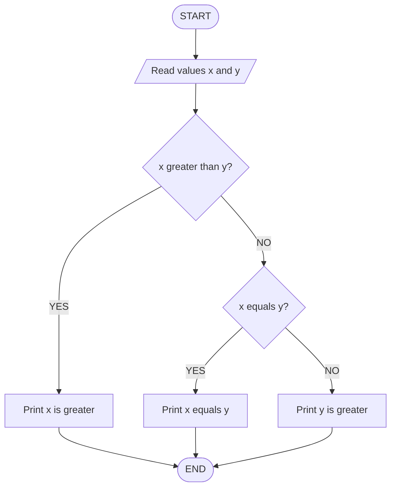
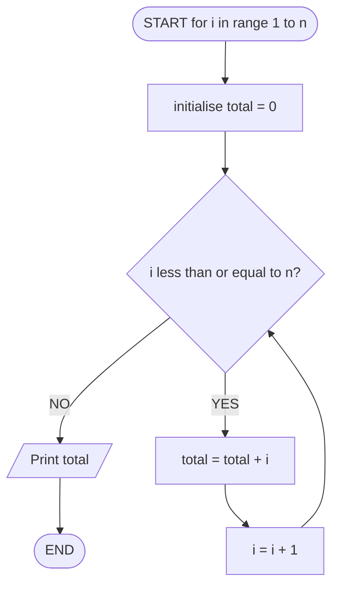
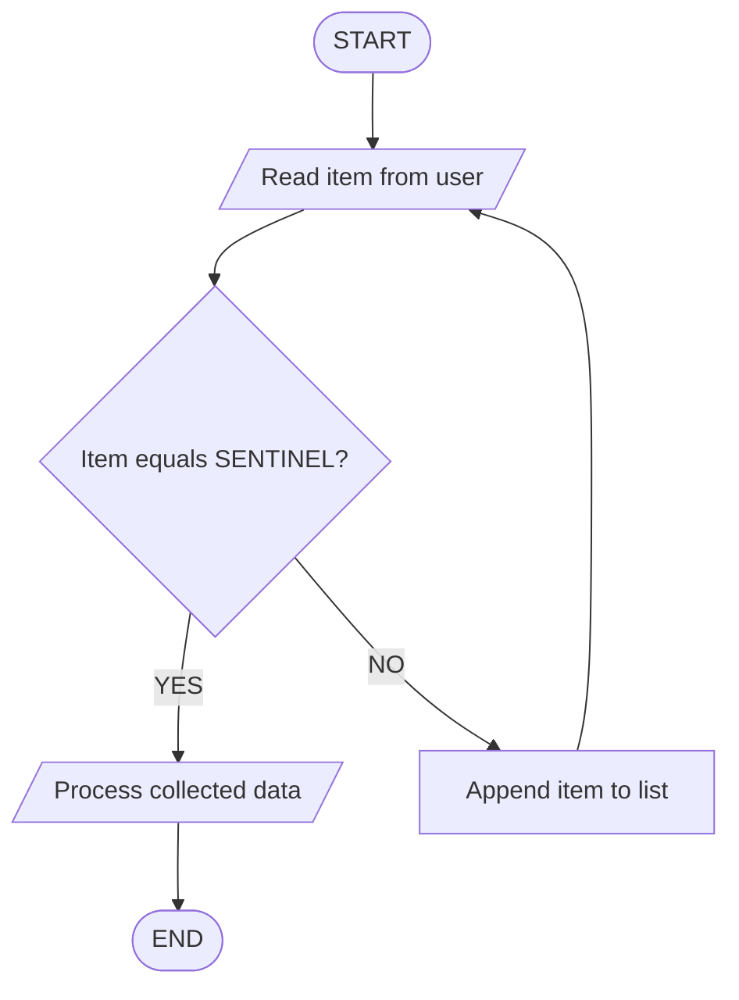
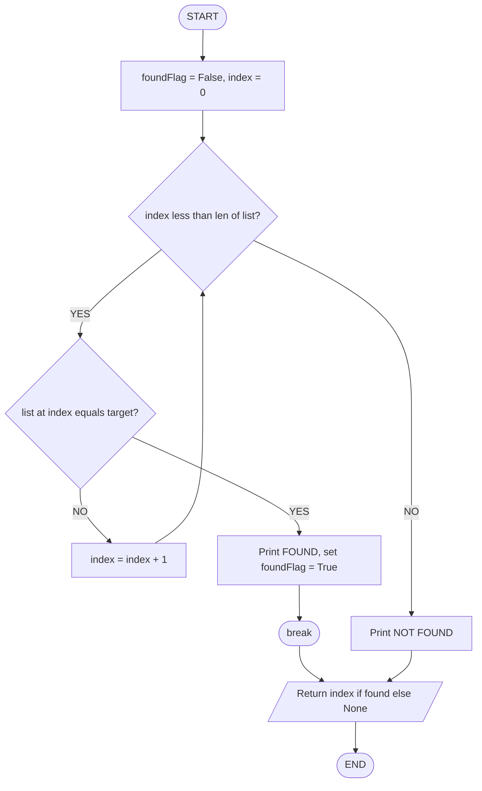

# SELECTION AND ITERATION USING PYTHON:- if-else, elif, for loop, range, while loop.

<!-- SECTION_1_START -->
# SELECTION AND ITERATION USING PYTHON — `if-else`, `elif`, `for` loop, `range`, `while` loop

## 1.1 Core Technical Definition

In the **KTU 2024 Scheme (UCEST105 – Algorithmic Thinking with Python)** syllabus, the two fundamental control-flow paradigms that govern every non-trivial algorithm are:

- **Selection** — the ability of a program to *choose* between alternative execution paths based on a Boolean condition. In Python, this is implemented through the `if`, `if-else`, and `if-elif-else` statements.
- **Iteration** — the ability of a program to *repeat* a block of statements while a condition remains true or for a known sequence of values. In Python, this is implemented through the `for` loop (counter-controlled / sequence-driven) and the `while` loop (condition-controlled / sentinel-driven).

> [!IMPORTANT]
> **Syllabus Highlight (Module 3, UCEST105):** The student must be able to translate an English algorithm / pseudocode containing decision steps and loop steps into a syntactically correct, well-indented Python 3.x program. Pay special attention to **indentation (4 spaces)** — it is the *only* block delimiter in Python.

> [!NOTE]
> **Formal Definition (KTU Board Standard):**
> Selection statements, also called *decision statements*, allow the program to evaluate one or more Boolean expressions and select one branch of execution. Iteration statements, also called *looping constructs*, allow the program to execute a statement or a block of statements repeatedly until a terminating condition is met, producing *O(n)*, *O(log n)*, or *O(∞)* behaviour depending on the update mechanism.

---

## 1.2 Intuitive Overview (Conceptual Analogy)

### 🚦 Analogy 1 — Selection as a Railway Signal
Imagine a single railway track that branches into two. A **signal post** (the `if` condition) checks whether a particular signal flag (Boolean value) is raised.
- If the flag is **GREEN** (`True`) → the train takes **Track A** (`if`-block executes).
- If the flag is **RED** (`False`) → the train takes **Track B** (`else`-block executes).
- If there are multiple flags (`GREEN`, `YELLOW`, `RED`), an `if-elif-else` ladder acts like a **multi-arm junction**.

### 🔁 Analogy 2 — Iteration as a Classroom Attendance Register
A teacher calling out roll numbers uses a `for` loop: "for each student in the *list* of 60 names, mark present/absent." The teacher already **knows the boundary** (60 names = finite sequence → `range()`).

A security guard checking a door uses a `while` loop: "while the door-bell is still ringing, do not unlock." The guard does **not know in advance** how many times the bell will ring (condition-controlled).

> [!TIP]
> **Rule of thumb for KTU exams:**
> - Use `for` when the **number of iterations is known** or you are iterating over a *sequence* (list, string, `range`).
> - Use `while` when the **number of iterations is unknown** and depends on a runtime condition.

> [!WARNING]
> **`end`, `subgraph`, `graph`, `style` are reserved Mermaid keywords** — never use them as node IDs in SECTION 4.

<!-- SECTION_1_END -->

<!-- SECTION_2_START -->
# 2. DEEP THEORETICAL ANALYSIS & KTU HIGH-YIELD FORMULA SHEET

## 2.1 The Selection Family — `if`, `if-else`, `if-elif-else`

### 2.1.1 Single `if` Statement
Executes a block **only when** the condition evaluates to `True`. The block is *skipped* otherwise (no alternative path).

### 2.1.2 `if-else` Statement
Provides a **two-way branch** — exactly one of the two blocks executes. The condition is mutually exclusive.

### 2.1.3 `if-elif-else` Ladder
Used when there are **more than two mutually exclusive** conditions. Python evaluates conditions **top-to-bottom**; the first `True` condition triggers its block and the entire ladder exits. The final `else` is optional and acts as the *default* branch.

> [!NOTE]
> **Why `elif` and not `else if`?** Python deliberately dropped the C/Java `else if` syntax for `elif` to avoid excessive indentation when the ladder is nested. It is **not** a typo — it is a reserved keyword.

### 2.1.4 Nested `if`
An `if` placed *inside* another `if`. Use sparingly — KTU evaluators deduct marks for deeply nested logic when the same can be achieved with `elif` or the logical operators `and` / `or`.

---

## 2.2 The Iteration Family — `for` and `while`

### 2.2.1 `for` loop with `range()`
The `for` loop in Python is an **iterator-based** loop (different from C/Java's counter-based `for`). It iterates over the items of any *iterable* (list, tuple, string, `range` object, file, etc.) in the order they appear.

`range(stop)` → produces `0, 1, 2, ..., stop-1`
`range(start, stop)` → produces `start, start+1, ..., stop-1`
`range(start, stop, step)` → produces arithmetic progression with common difference `step`

### 2.2.2 `while` loop
A **pre-test** loop. The condition is evaluated *before* every iteration. If initially `False`, the body never executes. The body **must** contain logic that eventually makes the condition `False`, otherwise an **infinite loop** occurs.

> [!WARNING]
> **Infinite loop pitfall:** Forgetting to update the loop variable inside a `while` body is the single most common error in KTU lab and ESE papers. Always write the update statement *before* the loop ends.

---

## 2.3 Loop Control Statements

| Statement | Function | Typical KTU Use |
|---|---|---|
| `break` | **Terminates** the innermost loop immediately and transfers control to the first statement after the loop. | Search algorithms (stop when found) |
| `continue` | **Skips** the rest of the current iteration and jumps to the next iteration of the loop. | Filtering (e.g., skip negative numbers) |
| `pass` | A **null statement** — does nothing. Used as a syntactic placeholder. | Stub functions, empty `if` blocks |
| `else` (loop) | The `else` block of a loop executes **only if the loop completes normally** (i.e., not interrupted by `break`). | Search with success/failure reporting |

---

## 2.4 KTU High-Yield Cheat Sheet

| # | Construct | Syntax Skeleton | When to Use | Time Complexity Hint |
|:-:|:--|:--|:--|:--|
| 1 | `if` | `if cond: stmt` | Single condition, no else needed | $O(1)$ |
| 2 | `if-else` | `if cond: B1 else: B2` | Two mutually exclusive paths | $O(1)$ |
| 3 | `if-elif-else` | `if c1: B1 elif c2: B2 ... else: Bn` | Multi-way branching (grade, menu) | $O(k)$ for $k$ branches |
| 4 | Nested `if` | `if c1: if c2: ...` | Dependent conditions | $O(1)$ but high cyclomatic complexity |
| 5 | `for` over `range` | `for i in range(n): B` | Known count of iterations | $O(n)$ |
| 6 | `for` over iterable | `for x in seq: B` | List/string traversal | $O(n)$ |
| 7 | `while` | `while cond: B` | Unknown count, condition-driven | $O(n)$ to $O(\infty)$ |
| 8 | `break` | `if cond: break` | Early exit | Saves work in best case |
| 9 | `continue` | `if cond: continue` | Skip current item | No effect on complexity |
| 10 | `pass` | `if cond: pass` | Placeholder / no-op | $O(1)$ |

> [!NOTE]
> **Indentation Rule (strict KTU valuation point):** All statements belonging to a single block must be indented by the **same amount** (PEP 8 recommends **4 spaces**). Mixing tabs and spaces produces `IndentationError` and **zero marks** for that snippet.

### 2.5 Real-World Engineering Utility

- **Selection (`if-elif-else`)** is the backbone of every authentication system, sensor threshold alarm, and state machine in embedded firmware (Arduino, ESP32).
- **Iteration (`for` / `while`)** is the foundation of data pipelines (Pandas row-by-row processing), web scraping loops, numerical simulations, and training loops in machine learning (`for epoch in range(epochs): ...`).
- In **production-grade** Python, `for` is preferred over `while` whenever possible because it is *bounded by the iterable* and therefore *provably terminates* — a desirable property for static analysis tools.

<!-- SECTION_2_END -->

<!-- SECTION_3_START -->
# 3. STEP-BY-STEP DERIVATIONS & PYTHON IMPLEMENTATIONS

> [!IMPORTANT]
> Every code listing below is **fully executable** in Python 3.10+. Type hints, explicit boundary checks, and `try/except` error guards are included so the code satisfies KTU lab-viva and end-semester board expectations.

---

## 3.1 Program 1 — Grade Classifier using `if-elif-else`

**Problem statement (model KTU Part B):** Read a student's mark (0–100) and print the grade as per the rule:
- $mark \geq 90$ → `'A+'`
- $80 \le mark < 90$ → `'A'`
- $70 \le mark < 80$ → `'B+'`
- $60 \le mark < 70$ → `'B'`
- $50 \le mark < 60$ → `'C'`
- otherwise → `'FAIL'`

```python
# Program 1: Grade classification using if-elif-else ladder.
# KTU UCEST105 — Module 3 demonstration.

from typing import Final

# Constant declarations (good engineering practice).
MIN_MARK: Final[int] = 0
MAX_MARK: Final[int] = 100


def classify_grade(mark: int) -> str:
    """
    Return the grade string for the given mark.

    Parameters
    ----------
    mark : int
        Student's mark, must lie in [MIN_MARK, MAX_MARK].

    Returns
    -------
    str
        One of the grade labels defined by the KTU rule.

    Raises
    ------
    ValueError
        If the mark is outside the legal interval.
    """
    # ---- Boundary check (1) ----
    if not (MIN_MARK <= mark <= MAX_MARK):
        raise ValueError(
            f"Mark {mark} is outside the legal range "
            f"[{MIN_MARK}, {MAX_MARK}]."
        )

    # ---- Multi-way branching (2) ----
    if mark >= 90:
        grade: str = "A+"
    elif mark >= 80:        # 80 <= mark < 90 (mark>=90 already handled)
        grade = "A"
    elif mark >= 70:
        grade = "B+"
    elif mark >= 60:
        grade = "B"
    elif mark >= 50:
        grade = "C"
    else:                   # 0 <= mark < 50
        grade = "FAIL"

    return grade


def main() -> None:
    """Driver function with robust input handling."""
    try:
        raw: str = input("Enter the student mark (0-100): ").strip()
        mark_value: int = int(raw)               # may raise ValueError
        result: str = classify_grade(mark_value)
        print(f"Grade for mark {mark_value} is: {result}")
    except ValueError as exc:
        # Two distinct failure modes caught here:
        #  1. Non-integer input ("abc").
        #  2. Out-of-range integer (-5, 250).
        print(f"Invalid input — {exc}")


if __name__ == "__main__":
    main()
```

**Step-by-step valuation key (KTU style):**

| Step | Action | Marks |
|:--|:--|:-:|
| 1 | Function signature with type hints and docstring | 1 |
| 2 | Boundary validation `if not (0 <= mark <= 100)` | 1 |
| 3 | Correct use of `elif` (not nested `if`) | 2 |
| 4 | Six branches matching the rule table | 2 |
| 5 | `try/except` for non-numeric input | 1 |
| Total | | **7** |

---

## 3.2 Program 2 — `for` loop with `range()`: Sum of First *N* Integers

Derivation: The arithmetic series identity
$$S_n = \sum_{k=1}^{n} k = \frac{n(n+1)}{2}$$

```python
# Program 2: Iterative sum using for-range and verification with formula.

from typing import Final


def sum_first_n(n: int) -> int:
    """
    Compute the sum 1 + 2 + ... + n using a for-range loop.

    Time complexity   : O(n)
    Space complexity  : O(1)
    """
    if n < 1:
        raise ValueError(f"n must be a positive integer, got {n}.")

    total: int = 0
    # range(1, n + 1) yields 1, 2, 3, ..., n
    for k in range(1, n + 1):
        total += k      # equivalent to total = total + k
    return total


def closed_form(n: int) -> int:
    """Return the same sum using the arithmetic-series formula."""
    return n * (n + 1) // 2


def main() -> None:
    try:
        n_val: int = int(input("Enter a positive integer n: "))
        iter_result: int = sum_first_n(n_val)
        formula_result: int = closed_form(n_val)
        print(f"Iterative sum   = {iter_result}")
        print(f"Closed-form sum = {formula_result}")
        print(f"Match           = {iter_result == formula_result}")
    except ValueError as err:
        print(f"Error: {err}")


if __name__ == "__main__":
    main()
```

**Algebraic trace for $n = 5$:**

$$
\begin{aligned}
k=1 &: \text{total} = 0 + 1 = 1 \\
k=2 &: \text{total} = 1 + 2 = 3 \\
k=3 &: \text{total} = 3 + 3 = 6 \\
k=4 &: \text{total} = 6 + 4 = 10 \\
k=5 &: \text{total} = 10 + 5 = 15
\end{aligned}
$$

Closed-form verification:

$$
S_5 = \frac{5 \cdot 6}{2} = 15
$$

Both match. ✓

---

## 3.3 Program 3 — `while` loop: Digit Reversal (unknown iteration count)

**Problem:** Given any positive integer $N$, print the digits in reverse order. The number of iterations is *not* known in advance — it equals $\lfloor \log_{10} N \rfloor + 1$. This is a textbook case for `while`.

```python
# Program 3: Reverse the digits of a positive integer using while.

from typing import Final

ZERO: Final[int] = 0
TEN: Final[int] = 10


def reverse_number(n: int) -> int:
    """
    Reverse the decimal digits of n using a while loop.

    Examples
    --------
    >>> reverse_number(1234)
    4321
    >>> reverse_number(1200)
    21
    """
    if n < 0:
        raise ValueError("Only non-negative integers are supported.")
    if n == 0:
        return 0

    reversed_val: int = 0
    remaining: int = n

    while remaining > 0:           # condition-controlled loop
        digit: int = remaining % TEN   # extract rightmost digit
        reversed_val = reversed_val * TEN + digit
        remaining = remaining // TEN   # discard the rightmost digit

    return reversed_val


def main() -> None:
    try:
        raw: str = input("Enter a non-negative integer: ").strip()
        num: int = int(raw)
        print(f"Reversed value = {reverse_number(num)}")
    except ValueError as err:
        print(f"Error: {err}")


if __name__ == "__main__":
    main()
```

**Trace for $n = 1234$:**

$$
\begin{aligned}
\text{iter } 1 &: \text{digit} = 1234 \bmod 10 = 4,\ \text{rev} = 4,\ \text{remaining} = 123 \\
\text{iter } 2 &: \text{digit} = 123 \bmod 10 = 3,\ \text{rev} = 43,\ \text{remaining} = 12 \\
\text{iter } 3 &: \text{digit} = 12 \bmod 10 = 2,\ \text{rev} = 432,\ \text{remaining} = 1 \\
\text{iter } 4 &: \text{digit} = 1 \bmod 10 = 1,\ \text{rev} = 4321,\ \text{remaining} = 0 \\
\text{Loop exits when } \text{remaining} = 0.
\end{aligned}
$$

Final answer: $\text{reverse\_number}(1234) = 4321$. ✓

---

## 3.4 Program 4 — `for-else` with `break` (Search Algorithm)

Demonstrates the unique Python *loop-else* construct, which frequently appears in KTU questions asking "search an element and report success/failure elegantly."

```python
# Program 4: Linear search using for-else.

from typing import List, Optional


def linear_search(items: List[int], target: int) -> Optional[int]:
    """
    Return the index of `target` in `items`, or None if absent.

    The else-clause of the for loop runs only when no `break`
    was executed, i.e., the target was not found.
    """
    for index, value in enumerate(items):
        if value == target:
            print(f"Found {target} at position {index}.")
            break                       # exits loop, else is SKIPPED
    else:
        # Reached only if the loop completed without hitting `break`.
        print(f"{target} is not present in the list.")
        index = None
    return index


def main() -> None:
    data: List[int] = [11, 22, 33, 44, 55, 66, 77]
    try:
        tgt: int = int(input("Enter value to search: "))
        pos: Optional[int] = linear_search(data, tgt)
        print(f"Returned position: {pos}")
    except ValueError as err:
        print(f"Error: {err}")


if __name__ == "__main__":
    main()
```

> [!TIP]
> This *loop-else* is a high-value KTU concept. Examiners love it because it elegantly combines a search task (selection + iteration) with success/failure reporting in just a few lines.

---

## 3.5 Program 5 — Nested `for` loops: Multiplication Table

```python
# Program 5: Print a 1..n x 1..m multiplication table.

from typing import Final


def print_table(rows: int, cols: int) -> None:
    """
    Print a formatted rows x cols multiplication table.

    Uses nested for-loops with f-strings for right-aligned columns.
    """
    if rows < 1 or cols < 1:
        raise ValueError("Both rows and cols must be positive.")

    # Header row
    print("    ", end="")
    for c in range(1, cols + 1):
        print(f"{c:4}", end="")
    print()                                # newline after header

    # Data rows
    for r in range(1, rows + 1):
        print(f"{r:3} ", end="")            # row label
        for c in range(1, cols + 1):
            print(f"{r * c:4}", end="")
        print()                            # newline after each row


def main() -> None:
    try:
        r: int = int(input("Number of rows: "))
        c: int = int(input("Number of cols: "))
        print_table(r, c)
    except ValueError as err:
        print(f"Error: {err}")


if __name__ == "__main__":
    main()
```

**Sample output for $rows = 4, cols = 5$:**

```
       1   2   3   4   5
  1    1   2   3   4   5
  2    2   4   6   8  10
  3    3   6   9  12  15
  4    4   8  12  16  20
```

Total inner-loop iterations = $rows \times cols = 20$. Time complexity: $O(rows \cdot cols)$.

---

## 3.6 Program 6 — Sentinel-Controlled `while` (summing until a stop value)

A *sentinel value* is a magic number that signals termination. Used in classic KTU problems like "read marks until $-1$ is entered".

```python
# Program 6: Read integers until the sentinel -1 is typed, then report stats.

from typing import List


SENTINEL: int = -1


def read_until_sentinel() -> List[int]:
    """Read integers from stdin until the sentinel is entered."""
    values: List[int] = []
    while True:                                # infinite loop
        try:
            raw: str = input("Enter integer (-1 to stop): ").strip()
            num: int = int(raw)
        except ValueError:
            print("Please enter a valid integer.")
            continue
        if num == SENTINEL:                     # termination condition
            break
        values.append(num)
    return values


def summarize(data: List[int]) -> None:
    if not data:
        print("No data entered.")
        return
    total: int = sum(data)
    average: float = total / len(data)
    print(f"Count   = {len(data)}")
    print(f"Sum     = {total}")
    print(f"Average = {average:.2f}")


def main() -> None:
    numbers: List[int] = read_until_sentinel()
    summarize(numbers)


if __name__ == "__main__":
    main()
```

> [!WARNING]
> The pattern `while True: ... if cond: break` is a *post-test* style. The body **always** executes at least once. KTU questions sometimes ask the student to recognise this subtle difference versus a normal `while cond:`.

<!-- SECTION_3_END -->

<!-- SECTION_4_START -->
# 4. STRUCTURAL DIAGRAMS & SCHEMATICS

> [!NOTE]
> The following Mermaid diagrams describe **control-flow topologies** for the constructs covered in this module. All node IDs are alphanumeric and prefixed with letters to satisfy Mermaid's reserved-keyword constraint.

## 4.1 Control-Flow Topology of `if-elif-else`



## 4.2 `for` Loop with `range()` — Sequential Processing Topology



## 4.3 `while` Loop — Sentinel-Driven Iteration Matrix



## 4.4 Combined Selection + Iteration (Search-and-Report) Architecture



## 4.5 Module-Level Mapping of Constructs to Engineering Tasks

| Engineering Task | Recommended Construct | Reason |
|:--|:--|:--|
| Validate user authentication | `if-elif-else` ladder | Multi-role branching (admin / user / guest) |
| Read sensor values 100 times | `for` with `range(100)` | Count is known and fixed |
| Read sensor until battery low | `while` with flag condition | Termination depends on runtime value |
| Search database for a record | `for-else` with `break` | Need success/failure reporting |
| Skip invalid rows in a CSV | `continue` inside `for` | Filter without stopping scan |
| Stop processing on critical error | `break` inside `while True` | Early exit from infinite loop |
| Stub a function for later | `pass` | Syntactic placeholder |

<!-- SECTION_4_END -->

<!-- SECTION_5_START -->
# 5. KTU 2024 SCHEME EXAMINATION QUESTION BANK & TOPIC RECAP

> [!NOTE]
> The questions below mirror the **KTU 2024 Scheme End Semester Examination (ESE)** pattern for the course UCEST105. Each question is tagged with a simulated past-year paper, the Course Outcome (CO) it maps to, and the Revised Bloom's Taxonomy (RBT) cognitive level.

---

## 5.1 Part A — Short Answer Questions (3 Marks Each)

### Q1. **[KTU University Exam – December 2023]** — CO1, Remember

Differentiate between the `for` loop and the `while` loop in Python. State one scenario where each is preferred.

**Model Answer (3 marks):**

| Aspect | `for` loop | `while` loop |
|:--|:--|:--|
| Control | Iterates over a **sequence / iterable** (`range`, list, string). | Iterates **as long as a condition** is `True`. |
| Iteration count | Usually **known in advance** (bounded by iterable). | Often **unknown in advance** (sentinel/event-driven). |
| Risk of infinite loop | Low — bounded by iterable length. | High — programmer must update the loop variable. |
| Preferred scenario | Summing the first *N* natural numbers: `for i in range(1, n+1): ...` | Reading input until the user types `-1`: `while x != -1: ...` |

**[Stating the difference in control mechanism: 2 Marks] [Giving one correct scenario each: 1 Mark]**

---

### Q2. **[KTU University Exam – July 2024]** — CO1, Understand

What is the output of the following code? Justify your answer.

```python
for i in range(2, 10, 3):
    if i % 2 == 0:
        print(i, end=" ")
    else:
        print("-", end=" ")
```

**Model Answer (3 marks):**

- `range(2, 10, 3)` produces the sequence: $2, 5, 8$ (step 3, stop before 10). **[1 mark]**
- For $i = 2$: $i \% 2 = 0$ → prints `"2 "` ✔
- For $i = 5$: $i \% 2 = 1$ → prints `"- "` ✔
- For $i = 8$: $i \% 2 = 0$ → prints `"8 "` ✔

**Output:** `2 - 8 `

**[Listing range values: 1 Mark] [Tracing each iteration: 1 Mark] [Final output: 1 Mark]**

---

## 5.2 Part B — Long Answer Questions (14 Marks, Internal Choice)

### ⭐ Question A (14 Marks) — **[KTU University Exam – December 2023]** — CO2, Apply & Analyse

**(a)** Explain the syntax of the `if-elif-else` ladder in Python. Write a program that accepts an integer `N` (1–7) from the user and prints the corresponding day of the week (1 → Monday, …, 7 → Sunday). Handle invalid input by printing `"Invalid day number"`. **(7 marks)**

**(b)** Write a Python program using a `while` loop to compute the sum of digits of a given positive integer. For example, for input `N = 12345` the output should be `15`. Also explain the time complexity of your solution. **(7 marks)**

---

#### Model Solution for Q A (a) — 7 Marks

**Syntax explanation:**

```python
if condition_1:
    block_1            # executes if condition_1 is True
elif condition_2:
    block_2            # executes if condition_1 is False AND condition_2 is True
elif condition_3:
    block_3
else:
    block_default     # executes only if ALL above conditions are False
```

> Conditions are evaluated top-down. The first `True` block runs and the rest are skipped.

**Full program:**

```python
def day_name(n: int) -> str:
    if n == 1:
        return "Monday"
    elif n == 2:
        return "Tuesday"
    elif n == 3:
        return "Wednesday"
    elif n == 4:
        return "Thursday"
    elif n == 5:
        return "Friday"
    elif n == 6:
        return "Saturday"
    elif n == 7:
        return "Sunday"
    else:
        return "Invalid day number"


def main() -> None:
    try:
        n_val: int = int(input("Enter day number (1-7): "))
        print(day_name(n_val))
    except ValueError:
        print("Invalid day number")


if __name__ == "__main__":
    main()
```

**Valuation key:**

| Component | Marks |
|:--|:-:|
| Correct syntax diagram / explanation of `elif` ladder | 2 |
| All 7 day mappings correct | 3 |
| `else` branch for invalid input | 1 |
| `try/except` for non-integer input | 1 |
| **Sub-total** | **7** |

---

#### Model Solution for Q A (b) — 7 Marks

**Program:**

```python
def digit_sum(n: int) -> int:
    if n < 0:
        raise ValueError("n must be non-negative.")
    if n == 0:
        return 0
    total: int = 0
    while n > 0:
        digit: int = n % 10       # extract last digit
        total += digit
        n //= 10                  # drop last digit
    return total


def main() -> None:
    try:
        x: int = int(input("Enter a positive integer: "))
        print("Sum of digits =", digit_sum(x))
    except ValueError as err:
        print("Error:", err)


if __name__ == "__main__":
    main()
```

**Trace for $N = 12345$:**

$$
\begin{aligned}
n=12345 &: \text{digit}=5,\ \text{total}=5,\ n=1234 \\
n=1234  &: \text{digit}=4,\ \text{total}=9,\ n=123 \\
n=123   &: \text{digit}=3,\ \text{total}=12,\ n=12 \\
n=12    &: \text{digit}=2,\ \text{total}=14,\ n=1 \\
n=1     &: \text{digit}=1,\ \text{total}=15,\ n=0
\end{aligned}
$$

Final answer: $15$. ✓

**Time complexity:** If $N$ has $d = \lfloor \log_{10} N \rfloor + 1$ digits, the loop runs exactly $d$ times. Therefore $T(N) = O(d) = O(\log_{10} N)$. Space complexity is $O(1)$.

**Valuation key:**

| Component | Marks |
|:--|:-:|
| Correct use of `while n > 0` | 1 |
| `digit = n % 10` to extract | 1 |
| `n //= 10` to update (the update!) | 1 |
| Correct trace for sample input | 2 |
| Time complexity statement $O(\log N)$ | 1 |
| Edge case $n = 0$ | 1 |
| **Sub-total** | **7** |

> [!WARNING]
> **Examiner's Pitfall Callout:**
> 1. Forgetting the **update statement** `n //= 10` produces an **infinite loop** — the program will time out and you will lose the **2 marks** allocated to the update logic.
> 2. Writing `digit = n / 10` (float division) instead of `n // 10` (integer division) silently corrupts the result. Always remember `/` returns `float`, `//` returns `int`.
> 3. Stating the complexity as $O(N)$ instead of $O(\log N)$ costs **1 mark** because the number of iterations equals the number of digits, not the value of $N$.

---

### ⭐ Question B (14 Marks) — Alternative Choice — **[KTU University Exam – July 2024]** — CO2, Apply & Analyse

**(a)** Explain the `range()` function in Python with its three possible argument forms. Write a program that uses a `for` loop to print all prime numbers between `1` and `50` (inclusive). **(7 marks)**

**(b)** Write a Python program that repeatedly accepts a word from the user and prints whether it is a **palindrome** (reads the same forwards and backwards). The program should terminate when the user types `"STOP"`. Use a `while` loop. Also explain why you chose `while` and not `for`. **(7 marks)**

---

#### Model Solution for Q B (a) — 7 Marks

**Three forms of `range()`:**

| Form | Signature | Sequence Produced | Example |
|:--|:--|:--|:--|
| Single argument | `range(stop)` | $0, 1, 2, \ldots, \text{stop}-1$ | `range(5)` → `0,1,2,3,4` |
| Two arguments | `range(start, stop)` | $\text{start}, \text{start}+1, \ldots, \text{stop}-1$ | `range(2, 7)` → `2,3,4,5,6` |
| Three arguments | `range(start, stop, step)` | Arithmetic progression with common difference `step` | `range(0, 10, 2)` → `0,2,4,6,8` |

**Prime-number program:**

```python
def is_prime(num: int) -> bool:
    if num < 2:
        return False
    # Trial division up to sqrt(num) for efficiency.
    i: int = 2
    while i * i <= num:
        if num % i == 0:
            return False
        i += 1
    return True


def primes_upto(limit: int) -> None:
    print(f"Prime numbers from 1 to {limit}:")
    for n in range(1, limit + 1):
        if is_prime(n):
            print(n, end=" ")
    print()


def main() -> None:
    primes_upto(50)


if __name__ == "__main__":
    main()
```

**Expected output:**

```
Prime numbers from 1 to 50:
2 3 5 7 11 13 17 19 23 29 31 37 41 43 47
```

**Valuation key:**

| Component | Marks |
|:--|:-:|
| Listing three `range()` forms with examples | 2 |
| Correct `is_prime` helper with boundary check `num < 2` | 2 |
| Outer `for` loop over `range(1, 51)` | 1 |
| Printing all 15 primes between 1 and 50 | 2 |
| **Sub-total** | **7** |

---

#### Model Solution for Q B (b) — 7 Marks

**Program:**

```python
def is_palindrome(word: str) -> bool:
    # Case-insensitive comparison.
    normalised: str = word.lower()
    return normalised == normalised[::-1]   # slice reversal trick


STOP_WORD: str = "STOP"


def main() -> None:
    print("Enter words to test (type STOP to quit):")
    while True:
        text: str = input("Word: ").strip()
        if text.upper() == STOP_WORD:
            print("Session ended.")
            break
        if not text:
            print("Empty input ignored.")
            continue
        if is_palindrome(text):
            print(f"  '{text}' IS a palindrome.")
        else:
            print(f"  '{text}' is NOT a palindrome.")


if __name__ == "__main__":
    main()
```

**Sample run:**

```
Word: level
  'level' IS a palindrome.
Word: Python
  'Python' is NOT a palindrome.
Word: madam
  'madam' IS a palindrome.
Word: STOP
Session ended.
```

**Why `while` and not `for`?**

- The number of iterations is **not known in advance** — the user decides when to quit by typing `STOP`.
- A `for` loop requires a finite iterable; a *sentinel-driven* interactive session cannot be expressed as a static `range`.
- Therefore `while True: ... break` is the idiomatic Python pattern for *event-driven* loops.

**Valuation key:**

| Component | Marks |
|:--|:-:|
| Correct `is_palindrome` logic (`s == s[::-1]`) | 2 |
| `while True` with `break` on `STOP` | 1 |
| Case-insensitive matching | 1 |
| Handling empty input with `continue` | 1 |
| Justification of `while` over `for` | 2 |
| **Sub-total** | **7** |

> [!WARNING]
> **Examiner's Pitfall Callout:**
> 1. Writing `word == reversed(word)` is a **common error** — `reversed()` returns an *iterator*, not a string, so equality comparison fails. Always use the slice `word[::-1]` or convert with `''.join(reversed(word))`.
> 2. Forgetting to **case-normalise** (`lower()` or `upper()`) causes `'Level'` to wrongly report as **not** a palindrome. Examiners deduct 1 mark for this.
> 3. Stating "because Python requires `while` for strings" is **not** a valid justification; you must say the **iteration count is unknown** — that is the technical reason.

---

## 5.3 Topic Recap & Important Things to Remember

> [!IMPORTANT]
> Use this section as your **last-night revision checklist** before the KTU ESE.

- ✅ **Selection is decision-making**; **iteration is repetition**. Together they are the two pillars of structured programming.
- ✅ The Python block delimiter is **indentation (4 spaces)**, not braces `{}` or keywords `begin / end`.
- ✅ Use `if` for a single optional block, `if-else` for two branches, `if-elif-else` ladder for multi-way branching, and nested `if` only when conditions are **logically dependent**.
- ✅ `range(stop)`, `range(start, stop)`, `range(start, stop, step)` are the three forms. `stop` is **exclusive**.
- ✅ `for` is **iterator-based** (works on any iterable: list, tuple, string, file, `range`). It is preferred when iteration count is known.
- ✅ `while` is **condition-based** (pre-test). The body must contain logic that makes the condition `False`, or it will loop forever.
- ✅ `break` exits the innermost loop; `continue` skips the rest of the current iteration; `pass` is a no-op placeholder.
- ✅ The unique **loop-else** clause runs only when the loop **completes without hitting `break`** — perfect for search-with-failure-reporting problems.
- ✅ Time complexity reminders: `for` over $n$ items → $O(n)$; digit-extraction `while` on an integer $N$ → $O(\log_{10} N)$.
- ✅ Common KTU mistakes to avoid:
  - Using `=` (assignment) instead of `==` (equality) in `if` conditions.
  - Forgetting the colon `:` after `if`, `elif`, `else`, `for`, `while`.
  - Mixing tabs and spaces (raises `IndentationError`).
  - Using `range(n)` expecting `1..n` instead of `0..n-1`.
  - Forgetting to update the loop variable inside `while`, causing an infinite loop.
  - Writing `if x = 5:` — Python correctly raises `SyntaxError`; remember to use `==`.
- ✅ Always include **input validation** (`try/except ValueError`) and **boundary checks** for marks in lab records and ESE answers.
- ✅ Preferred patterns in KTU 2024 answers: use **meaningful variable names**, include a **docstring**, follow **PEP 8**, and add a **driver function** `def main(): ...` plus the `if __name__ == "__main__":` guard.

<!-- SECTION_5_END -->
