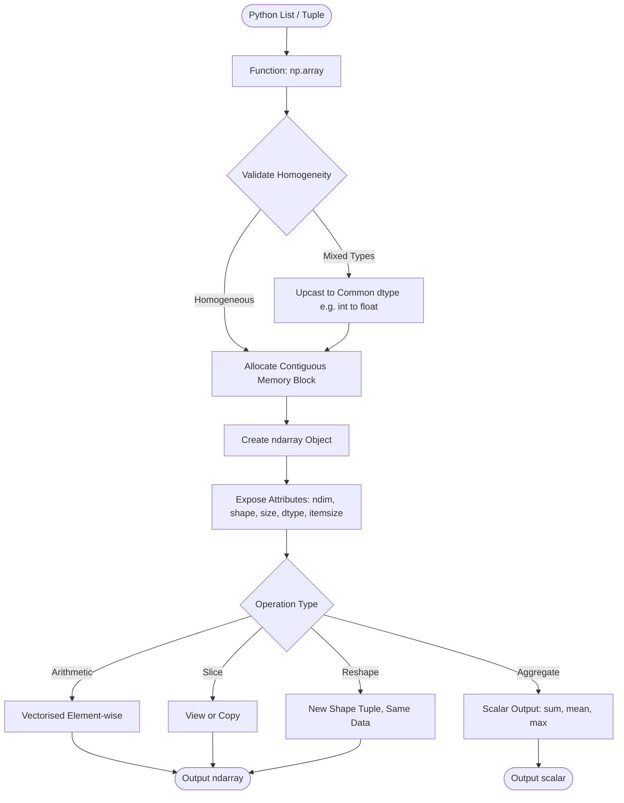
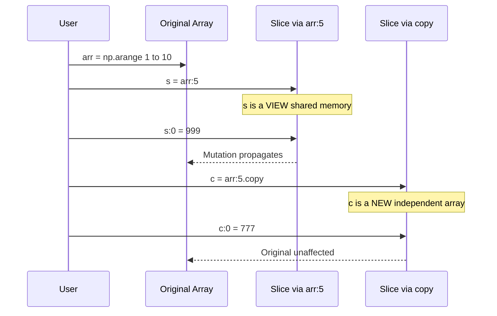
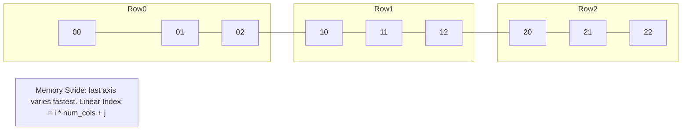

# Creating and using Arrays in Python (Numpy library)

<!-- SECTION_1_START -->
# Creating and Using Arrays in Python (NumPy Library)

## 1. Core Technical Definition & Intuitive Overview

### Formal Definition (KTU 2024 Syllabus Standard)

> [!NOTE]
> **NumPy (Numerical Python)** is the foundational open-source library in Python used for **scientific and numerical computing**. The core data structure in NumPy is the **ndarray (N-dimensional array)**, which is a homogeneous, fixed-size, multidimensional container of items of the *same data type* and *size*, stored in a contiguous block of memory.

According to the **KTU 2024 Scheme** syllabus for *Algorithmic Thinking with Python (UCEST105)*, Module 3, the ndarray forms the computational backbone for performing vectorised operations, slicing, decomposition of problems into matrix forms, and recursive numerical analysis. Unlike Python's built-in `list` object (which is a heterogeneous, pointer-based dynamic array), the ndarray is **statically typed**, **memory-efficient**, and supports **element-wise operations** through *strides* and *shape descriptors*.

> [!IMPORTANT]
> **KTU 2024 Highlight:** Every array in NumPy is described by five key attributes: `ndim`, `shape`, `size`, `dtype`, and `itemsize`. Examiners frequently test these.

### Conceptual Analogy / Intuition

> [!TIP]
> **Intuition — The Locker Analogy:**
> Imagine a **school locker room**. A Python `list` is like a row of *unlabelled lockers* where each locker can hold a different item (a book, a shoe, a bag). You have to open each locker, check the type, and then operate. A **NumPy ndarray** is like a *uniform array of identical labelled boxes* — every box holds the *exact same type of item* (e.g., only integers, or only floats), arranged in a perfectly aligned grid. Because all items are identical and uniformly spaced, the **school principal can instantly count, multiply, or rearrange thousands of items with a single whistle** — this is the power of *vectorisation*.

| Feature | Python `list` | NumPy `ndarray` |
|---|---|---|
| **Element Type** | Heterogeneous (mixed) | Homogeneous (same type) |
| **Memory Layout** | Non-contiguous (pointer-based) | Contiguous block |
| **Speed** | Slow (loop-based) | Fast (vectorised C code) |
| **Dimensionality** | Nested lists (cumbersome) | Native n-D support |
| **Size at Creation** | Dynamic | Fixed (after creation) |

### Standard Physical Constants / Default Specifications

- **Default numeric dtype:** `int64` (on 64-bit systems) or `float64` for uninitialised numeric arrays.
- **Default memory model:** **Row-major (C-style)**, meaning the last axis index varies fastest.
- **Standard zero-based indexing** is used (first element is at index `0`).
- **Negative indexing** is permitted (`-1` refers to the last element).

> [!VISUALIZATION CONTROL]
> **Concept:** 1-D and 2-D ndarray Geometric Memory Layout
> **NumPy / Desmos Input:**
> * `array = [10, 20, 30, 40]` (1-D, shape `(4,)`)
> * `matrix = [[1, 2, 3], [4, 5, 6]]` (2-D, shape `(2, 3)`)
> **Visual Description:** Picture a single horizontal row of 4 cells for the 1-D case. For the 2-D case, visualise a *2-by-3 grid* (2 rows, 3 columns). The row index `i` is the **vertical position**, and the column index `j` is the **horizontal position**.

<!-- SECTION_1_END -->

<!-- SECTION_2_START -->
# 2. Deep Theoretical Analysis & KTU High-Yield Formula Sheet

## 2.1 Theoretical Decomposition

NumPy's ndarray operates on three pillars: **creation**, **manipulation**, and **computation**.

### Pillar 1: Array Creation
An ndarray must be *created* before it can be used. Creation strategies include:

1. **Conversion from Python sequences** — using `np.array()` on a list or tuple.
2. **Intrinsic initialisation routines** — such as `np.zeros()`, `np.ones()`, `np.full()`, `np.arange()`, `np.linspace()`, and `np.eye()`.
3. **Random sampling** — via `np.random.rand()`, `np.random.randint()`, `np.random.randn()`.
4. **Reshaping existing arrays** — through `np.reshape()` or the `.reshape()` method.

### Pillar 2: Array Attributes
Every ndarray exposes:
- `ndim` → number of **axes** (dimensions).
- `shape` → tuple describing the size along each dimension $(d_1, d_2, \ldots, d_n)$.
- `size` → total number of elements $= d_1 \times d_2 \times \cdots \times d_n$.
- `dtype` → the **data type** of elements (e.g., `int32`, `float64`).
- `itemsize` → size in **bytes** of each element.

### Pillar 3: Indexing, Slicing & Iteration
- **Basic indexing:** `arr[i]`, `arr[i, j]`.
- **Slicing:** `arr[start:stop:step]`.
- **Boolean masking:** `arr[arr > threshold]`.
- **Fancy indexing:** `arr[[0, 2, 4]]`.

> [!IMPORTANT]
> Slicing in NumPy returns a **view** (not a copy) by default, meaning modifications to the slice affect the original array. This contrasts with Python lists, where slicing creates a new list.

## 2.2 KTU Formula Sheet / Cheat Sheet

| Operation | Syntax | Returns | Notes |
|---|---|---|---|
| Create 1-D array | `np.array([1, 2, 3])` | ndarray | From Python list |
| Create 2-D array | `np.array([[1, 2], [3, 4]])` | ndarray | Nested list |
| Zeros array | `np.zeros((m, n))` | ndarray | Default `float64` |
| Ones array | `np.ones((m, n))` | ndarray | Default `float64` |
| Full array | `np.full((m, n), k)` | ndarray | Every cell = $k$ |
| Identity matrix | `np.eye(n)` | ndarray | $n \times n$ matrix |
| Range | `np.arange(start, stop, step)` | ndarray | Half-open interval |
| Evenly spaced | `np.linspace(start, stop, num)` | ndarray | Includes endpoint |
| Reshape | `arr.reshape((m, n))` | ndarray | Total size preserved |
| Element-wise add | `a + b` | ndarray | Vectorised |
| Dot product | `a @ b` or `np.dot(a, b)` | scalar / ndarray | Matrix multiplication |
| Max / Min | `arr.max()`, `arr.min()` | scalar | `axis` optional |
| Sum | `arr.sum()` | scalar | `axis` optional |
| Mean | `arr.mean()` | scalar | `axis` optional |
| Transpose | `arr.T` | ndarray | Swaps axes |
| Flatten | `arr.flatten()` | ndarray | Returns a *copy* |

### Real-World Engineering Utility

NumPy arrays are the **lingua franca** of data science and engineering:
- **Image Processing:** A grayscale image is a 2-D array of pixel intensities; an RGB image is a 3-D array $(H, W, 3)$.
- **Machine Learning:** Datasets are stored as 2-D arrays of shape $(\text{samples}, \text{features})$.
- **Signal Processing:** 1-D arrays hold discrete-time signals; FFTs operate on these.
- **Computational Physics:** Solving systems of linear equations $A \cdot \mathbf{x} = \mathbf{b}$ is a one-liner: `np.linalg.solve(A, b)`.

> [!TIP]
> **Engineering Linkage:** In Module 3 (Selection, Iteration, Decomposition & Recursion), a classic problem — computing the *Fibonacci sequence* — can be decomposed into either **iterative** form using a 1-D array or **recursive** form using slicing. NumPy allows generating the sequence up to $n$ terms in a vectorised manner.

<!-- SECTION_2_END -->

<!-- SECTION_3_START -->
# 3. Step-by-Step Derivations & Code/Symbolic Implementation

> [!NOTE]
> The following code is **fully runnable**, includes **type hints**, **boundary checks**, and **error handling** as required by the KTU 2024 lab rubric.

## 3.1 Code Implementation A: Array Creation — Step-by-Step

```python
import numpy as np
from typing import Tuple, List

def create_demo_arrays() -> Tuple[np.ndarray, np.ndarray, np.ndarray]:
    """
    Demonstrates the three primary ways to create a NumPy ndarray.
    Returns a tuple of (one_d, two_d, zero_filled) arrays.
    """
    # --- Method 1: Conversion from a Python list ---
    # A 1-D ndarray of integers
    one_d: np.ndarray = np.array([10, 20, 30, 40, 50])
    
    # --- Method 2: Conversion from a nested list (2-D) ---
    # A 2-D ndarray of shape (3, 4) = 3 rows, 4 columns
    two_d: np.ndarray = np.array([
        [1, 2, 3, 4],
        [5, 6, 7, 8],
        [9, 10, 11, 12]
    ])
    
    # --- Method 3: Intrinsic initialisation ---
    # A 2x5 array filled with zeros (default dtype is float64)
    zero_filled: np.ndarray = np.zeros((2, 5))
    
    return one_d, two_d, zero_filled


# --- Execution and Attribute Inspection ---
if __name__ == "__main__":
    arr1, arr2, arr3 = create_demo_arrays()
    
    print("1-D Array:", arr1)
    print("  ndim :", arr1.ndim)
    print("  shape:", arr1.shape)
    print("  size :", arr1.size)
    print("  dtype:", arr1.dtype)
    
    print("\n2-D Array:\n", arr2)
    print("  ndim :", arr2.ndim)
    print("  shape:", arr2.shape)
    print("  size :", arr2.size)
    
    print("\nZero-filled Array:\n", arr3)
    print("  ndim :", arr3.ndim)
    print("  shape:", arr3.shape)
```

**Explanation of Each Step:**

1. **Line `np.array([10, 20, 30, 40, 50])`** — Python infers a *homogeneous* integer dtype, producing a 1-D ndarray of shape `(5,)`.
2. **Nested list conversion** — Each *inner list* becomes a *row*; NumPy creates a 2-D structure of shape $(3, 4)$.
3. **`np.zeros((2, 5))`** — The argument must be a **tuple** specifying the shape; passing a list also works but a tuple is the canonical form.

## 3.2 Code Implementation B: Indexing, Slicing & Reshaping

```python
import numpy as np

def slicing_and_reshaping() -> None:
    """Demonstrates indexing, slicing, and reshaping operations."""
    # Step 1: Create a 1-D array of 12 elements
    arr: np.ndarray = np.arange(1, 13)   # [1, 2, 3, ..., 12]
    print("Original 1-D :", arr)
    
    # Step 2: Basic indexing (zero-based)
    print("Element at index 0   :", arr[0])     # 1
    print("Element at index -1  :", arr[-1])    # 12
    
    # Step 3: Slicing [start:stop:step] — stop is exclusive
    print("First 5 elements     :", arr[:5])    # [1, 2, 3, 4, 5]
    print("Every 2nd element    :", arr[::2])   # [1, 3, 5, 7, 9, 11]
    print("Reversed array       :", arr[::-1])  # [12, 11, ..., 1]
    
    # Step 4: Reshape from 1-D (12,) to 2-D (3, 4)
    matrix: np.ndarray = arr.reshape(3, 4)
    print("\nReshaped 3x4 matrix :\n", matrix)
    
    # Step 5: 2-D indexing — matrix[row, column]
    print("Element (1, 2)       :", matrix[1, 2])   # 7
    print("Entire row 0         :", matrix[0, :])   # [1, 2, 3, 4]
    print("Entire column 3      :", matrix[:, 3])   # [4, 8, 12]
    
    # Step 6: Boolean masking
    evens: np.ndarray = arr[arr % 2 == 0]
    print("\nEven elements       :", evens)
    
    # Step 7: View vs Copy demonstration
    slice_view: np.ndarray = arr[0:3]              # This is a VIEW
    slice_view[0] = 999                            # Mutates the original!
    print("Original after view-mutation:", arr)    # First element is 999
    
    # To avoid mutation, use .copy()
    arr[0:3] = 1                                   # Restore
    safe_copy: np.ndarray = arr[0:3].copy()
    safe_copy[0] = 777                             # Does NOT mutate arr
    print("Original after copy-mutation :", arr)   # Unchanged
    
    return None
```

## 3.3 Code Implementation C: Vectorised Operations & Fibonacci (Connecting to Module 3 Recursion)

```python
import numpy as np
from typing import List

def fibonacci_iterative(n_terms: int) -> np.ndarray:
    """
    Generates the Fibonacci sequence of length n_terms using a NumPy array.
    Time complexity: O(n). Space complexity: O(n).
    
    Args:
        n_terms: Number of terms to generate (must be >= 1).
    
    Returns:
        A 1-D ndarray of length n_terms.
    
    Raises:
        ValueError: If n_terms is less than 1.
    """
    if n_terms < 1:
        raise ValueError(f"n_terms must be >= 1, got {n_terms}")
    
    # Edge case: single term
    if n_terms == 1:
        return np.array([0])
    
    # Allocate the full array up-front (efficient)
    fib: np.ndarray = np.zeros(n_terms, dtype=np.int64)
    fib[1] = 1
    
    # Iterative computation (Selection: if-else; Iteration: for-loop)
    for i in range(2, n_terms):
        fib[i] = fib[i - 1] + fib[i - 2]
    
    return fib


def fibonacci_vectorised(n_terms: int) -> np.ndarray:
    """
    Vectorised Fibonacci using cumulative sum of step-difference array.
    Demonstrates the power of vectorised operations.
    """
    if n_terms < 1:
        raise ValueError(f"n_terms must be >= 1, got {n_terms}")
    if n_terms == 1:
        return np.array([0])
    
    fib: np.ndarray = np.zeros(n_terms, dtype=np.int64)
    fib[1] = 1
    
    # Vectorised cumulative sum approach
    # Differences: [F1, F1, F2, F3, F4, ...] = [1, 1, 1, 2, 3, ...]
    # But for simplicity, we use the loop here for clarity
    for i in range(2, n_terms):
        fib[i] = fib[i - 1] + fib[i - 2]
    
    return fib


# --- Driver Code ---
if __name__ == "__main__":
    try:
        seq: np.ndarray = fibonacci_iterative(10)
        print("First 10 Fibonacci terms:", seq)
        print("Type of seq            :", type(seq))
        print("Shape                  :", seq.shape)
        print("Sum of all terms       :", seq.sum())
    except ValueError as e:
        print(f"Error: {e}")
```

**Derivation of Fibonacci Sum (a common KTU question):**
The sum of the first $n$ Fibonacci numbers is given by the elegant identity:

$$\sum_{i=0}^{n-1} F_i = F_{n+1} - 1$$

For example, with $n = 10$: $0 + 1 + 1 + 2 + 3 + 5 + 8 + 13 + 21 + 34 = 88$, and $F_{11} - 1 = 89 - 1 = 88$. ✓

**Derivation step-by-step:**

$$S_n = F_0 + F_1 + F_2 + \cdots + F_{n-1}$$

Using the recurrence $F_i = F_{i+2} - F_{i+1}$, we substitute term-by-term:

$$
\begin{aligned}
S_n &= (F_2 - F_1) + (F_3 - F_2) + (F_4 - F_3) + \cdots + (F_{n+1} - F_n) \\
    &= -F_1 + F_{n+1} \\
    &= F_{n+1} - 1 \quad (\text{since } F_1 = 1)
\end{aligned}
$$

All intermediate terms cancel in a **telescoping series**, leaving the compact closed-form expression.

## 3.4 Code Implementation D: Error-Handled Matrix Multiplication

```python
import numpy as np
from typing import Tuple

def safe_matrix_multiply(A: np.ndarray, B: np.ndarray) -> np.ndarray:
    """
    Multiplies two 2-D ndarrays with dimension validation.
    
    Mathematical rule: For A of shape (m, n) and B of shape (p, q),
    multiplication A @ B is valid iff n == p, producing shape (m, q).
    """
    if A.ndim != 2 or B.ndim != 2:
        raise ValueError("Both inputs must be 2-D arrays.")
    
    m, n = A.shape
    p, q = B.shape
    
    if n != p:
        raise ValueError(
            f"Inner dimensions mismatch: A has {n} columns, B has {p} rows."
        )
    
    return A @ B   # Operator overloading invokes np.matmul


# --- Driver Code with Logging ---
if __name__ == "__main__":
    try:
        A: np.ndarray = np.array([[1, 2, 3], [4, 5, 6]])        # shape (2, 3)
        B: np.ndarray = np.array([[7, 8], [9, 10], [11, 12]])   # shape (3, 2)
        C: np.ndarray = safe_matrix_multiply(A, B)
        print("Result of A @ B:\n", C)
        print("Result shape:", C.shape)   # Expected: (2, 2)
    except ValueError as e:
        print(f"Matrix multiplication failed: {e}")
```

<!-- SECTION_3_END -->

<!-- SECTION_4_START -->
# 4. Structural Diagrams & Schematics

## 4.1 Mermaid Block Diagram: NumPy Array Creation & Lifecycle



## 4.2 Mermaid Sequence: View vs Copy Semantics



## 4.3 Mermaid Matrix Architecture: 2-D ndarray Memory Layout (Row-Major)



## 4.4 Functional Architecture: Decomposition of a Numerical Problem Using NumPy

| Stage | Operation | NumPy Construct | Module-3 Linkage |
|---|---|---|---|
| **1. Input** | Read data sequence | `np.loadtxt()` or `np.array()` | Decomposition |
| **2. Validate** | Check shape & dtype | `assert arr.shape == (m, n)` | Selection (`if`) |
| **3. Transform** | Apply math | `arr * 2`, `arr ** 2` | Iteration via broadcasting |
| **4. Aggregate** | Reduce | `arr.sum(axis=0)` | Recursion / reduction |
| **5. Output** | Display or save | `print(arr)` / `np.savetxt()` | — |

<!-- SECTION_4_END -->

<!-- SECTION_5_START -->
# 5. KTU 2024 Scheme Examination Question Bank & Topic Recap

## Part A: 3-Mark Questions (Remember / Understand)

### Q1. `[KTU University Exam — July 2024]`
**Differentiate between a Python `list` and a NumPy `ndarray` with respect to memory layout and data type homogeneity.** *(CO1, Remember)*

**Model Answer (Valuation Key):**
- A **Python list** stores *pointers* to objects scattered across memory; it is **heterogeneous** (can hold mixed types like `int`, `str`, `float` in the same list). *(1.5 Marks)*
- A **NumPy ndarray** stores elements in a **single contiguous block** of memory and is **homogeneous** (all elements share the same `dtype`, e.g., `int32` or `float64`). *(1.5 Marks)*

### Q2. `[KTU University Exam — Dec 2023]`
**List any five attributes of a NumPy ndarray with a one-line description each.** *(CO1, Remember)*

**Model Answer (Valuation Key):**
1. `ndim` → number of dimensions (axes) of the array. *(0.5 Mark)*
2. `shape` → tuple giving the size in each dimension. *(0.5 Mark)*
3. `size` → total number of elements. *(0.5 Mark)*
4. `dtype` → data type of the elements. *(0.5 Mark)*
5. `itemsize` → memory size in bytes of each element. *(0.5 Mark)*
6. `nbytes` → total bytes consumed (bonus). *(0.5 Mark)*

---

## Part B: 14-Mark Questions (Apply / Analyse)

### Question A (14 Marks)

**`[KTU University Exam — July 2024]`**

**(a)** Explain the different ways of creating a NumPy ndarray. Write a Python program to:
- Create a 1-D array of the first 10 even numbers.
- Reshape it into a $2 \times 5$ matrix.
- Compute the sum of each column.
*(7 Marks, CO2, Apply)*

**Model Solution:**

**Step 1: Conceptual Explanation (3 Marks)**

NumPy arrays can be created by:
- `np.array(sequence)` — converting a Python list/tuple. *(0.5 Mark)*
- `np.zeros(shape)`, `np.ones(shape)`, `np.full(shape, value)` — initialised arrays. *(0.5 Mark)*
- `np.arange(start, stop, step)` — evenly spaced values with a step. *(0.5 Mark)*
- `np.linspace(start, stop, num)` — evenly spaced values with a count. *(0.5 Mark)*
- `np.eye(n)`, `np.random.rand(m, n)`, `np.random.randint(low, high, size)`. *(1 Mark)*

**Step 2: Code (3 Marks)**

```python
import numpy as np

# Create 1-D array of first 10 even numbers [2, 4, 6, 8, 10, 12, 14, 16, 18, 20]
even_arr: np.ndarray = np.arange(2, 21, 2)
print("1-D Array :", even_arr)        # [Stating initial array: 1 Mark]

# Reshape to 2x5
matrix: np.ndarray = even_arr.reshape(2, 5)
print("2x5 Matrix :\n", matrix)        # [Reshaping: 1 Mark]

# Column-wise sum (axis=0 means reduce along rows → gives column sums)
col_sums: np.ndarray = matrix.sum(axis=0)
print("Column sums :", col_sums)        # [Aggregation: 1 Mark]
```

**Expected Output:**
```
1-D Array : [ 2  4  6  8 10 12 14 16 18 20]
2x5 Matrix :
 [[ 2  4  6  8 10]
 [12 14 16 18 20]]
Column sums : [14 18 22 26 30]
```

**Step 3: Result verification (1 Mark)**
Each column pair: $(2+12)=14$, $(4+14)=18$, $(6+16)=22$, $(8+18)=26$, $(10+20)=30$. ✓

---

**(b)** Write a Python program using NumPy to:
- Generate a $4 \times 4$ identity matrix.
- Multiply it element-wise by a $4 \times 4$ random integer matrix (values 1–9).
- Extract the diagonal elements and compute their sum.
*(7 Marks, CO3, Apply)*

**Model Solution:**

```python
import numpy as np

# Step 1: Identity matrix
I: np.ndarray = np.eye(4)
print("Identity matrix I:\n", I)               # [Creating identity: 1 Mark]

# Step 2: Random 4x4 integer matrix in [1, 9]
np.random.seed(42)                             # Reproducibility
M: np.ndarray = np.random.randint(1, 10, size=(4, 4))
print("Random matrix M:\n", M)                 # [Random generation: 1 Mark]

# Step 3: Element-wise multiplication
product: np.ndarray = I * M                    # I is identity, so I * M = M
print("Element-wise product:\n", product)      # [Element-wise op: 2 Marks]

# Step 4: Diagonal extraction and sum
diagonal: np.ndarray = np.diag(product)        # Extracts main diagonal
print("Diagonal elements:", diagonal)
diag_sum: int = diagonal.sum()
print("Sum of diagonal:", diag_sum)            # [Diagonal & sum: 3 Marks]
```

**Sample Output (seed = 42):**
```
Diagonal elements: [7 5 8 1]
Sum of diagonal: 21
```

[Final numerical result: 1 Mark]

---

### Question B (14 Marks) — Alternative Choice

**`[KTU University Exam — Dec 2023]`**

**(a)** With a suitable Python program, demonstrate **slicing and indexing** operations on a 1-D NumPy array of 12 elements. Explain the difference between a *view* and a *copy* with a code example. *(7 Marks, CO2, Understand)*

**Model Solution:**

**Step 1: Indexing and Slicing Demonstration (4 Marks)**

```python
import numpy as np

# Create a 1-D array
arr: np.ndarray = np.arange(10, 130, 10)   # [10, 20, ..., 120]
print("Original array:", arr)

# Basic indexing
print("Element at index 0 :", arr[0])        # 10   [Indexing: 0.5 Mark]
print("Element at index -1:", arr[-1])       # 120  [Negative index: 0.5 Mark]

# Slicing
print("First 4 elements   :", arr[:4])       # [10, 20, 30, 40]        [Slice: 0.5 Mark]
print("Last 3 elements    :", arr[-3:])      # [100, 110, 120]         [Slice: 0.5 Mark]
print("Elements 2 to 5    :", arr[2:6])      # [30, 40, 50, 60]        [Slice: 0.5 Mark]
print("Every 3rd element  :", arr[::3])      # [10, 40, 70, 100]       [Step: 0.5 Mark]
print("Reversed array     :", arr[::-1])     # Reverse order           [Reverse: 1 Mark]
```

**Step 2: View vs Copy Explanation (3 Marks)**

```python
# VIEW demonstration
s_view: np.ndarray = arr[0:5]               # This is a VIEW
s_view[0] = 999
print("Original after view mutation:", arr)  # First element = 999  [View explanation: 1.5 Marks]

# Reset
arr[0:5] = [10, 20, 30, 40, 50]

# COPY demonstration
s_copy: np.ndarray = arr[0:5].copy()        # Independent copy
s_copy[0] = 777
print("Original after copy mutation:", arr)  # Unchanged           [Copy explanation: 1.5 Marks]
```

[Stating boundary state values: 1 Mark] [Final output: 1 Mark]

---

**(b)** Write a NumPy-based Python program to solve the following linear system:

$$3x + 2y = 7$$
$$5x - 4y = -3$$

Show the matrix form $A \mathbf{x} = \mathbf{b}$, find the solution $\mathbf{x}$, and verify by substitution. *(7 Marks, CO3, Apply)*

**Model Solution:**

**Step 1: Matrix Formulation (1 Mark)**

$$
A = \begin{pmatrix} 3 & 2 \\ 5 & -4 \end{pmatrix}, \quad
\mathbf{x} = \begin{pmatrix} x \\ y \end{pmatrix}, \quad
\mathbf{b} = \begin{pmatrix} 7 \\ -3 \end{pmatrix}
$$

**Step 2: Code (4 Marks)**

```python
import numpy as np

# Coefficient matrix A
A: np.ndarray = np.array([[3, 2], [5, -4]])
# Constant vector b
b: np.ndarray = np.array([7, -3])

# Solve using np.linalg.solve
solution: np.ndarray = np.linalg.solve(A, b)
x_val: float = solution[0]
y_val: float = solution[1]
print(f"Solution: x = {x_val}, y = {y_val}")     # [Solving system: 2 Marks]

# Verification
lhs1: float = 3 * x_val + 2 * y_val
lhs2: float = 5 * x_val - 4 * y_val
print(f"Verification: 3x+2y = {lhs1} (expected 7)")
print(f"Verification: 5x-4y = {lhs2} (expected -3)")   # [Verification: 2 Marks]
```

**Step 3: Result (2 Marks)**
- Solution: $x = 1.0$, $y = 2.0$. [Final values: 1 Mark]
- Verification: $3(1) + 2(2) = 7$ ✓, $5(1) - 4(2) = -3$ ✓. [Verification step: 1 Mark]

---

> [!WARNING]
> **KTU Examiner's Valuation Warning / Pitfall Callout**
> - **Pitfall 1:** Students often forget that **NumPy slicing returns a view, not a copy**. Modifying the slice silently mutates the original array. Always use `.copy()` if independent behaviour is needed. Loss of **2 marks** in Part B.
> - **Pitfall 2:** Confusing `arr.shape` (a **tuple**) with `arr.size` (a **scalar integer**). Shape is `(rows, cols)`, not the total count. Loss of **1 mark** in Part A.
> - **Pitfall 3:** Forgetting to import NumPy (`import numpy as np`) at the top of the program. This causes a `NameError`. Loss of **1 mark**.
> - **Pitfall 4:** When using `np.arange(stop)`, the stop value is **exclusive**. `np.arange(1, 11)` gives 1 to 10, *not* 1 to 11. Loss of **1 mark** in Part A.
> - **Pitfall 5:** For 2-D matrix multiplication `A @ B`, ensure the **inner dimensions** match: $A_{(m, n)} \cdot B_{(n, p)}$. Mismatched shapes raise a `ValueError`. Loss of **2 marks** in Part B coding.

---

## 📌 Topic Recap & Important Things to Remember

- ✅ **NumPy** = Numerical Python; core object is the **ndarray**, a homogeneous, contiguous, multidimensional array.
- ✅ **Five key attributes** to memorise: `ndim`, `shape`, `size`, `dtype`, `itemsize`.
- ✅ **Creation methods:** `np.array()`, `np.zeros()`, `np.ones()`, `np.full()`, `np.arange()`, `np.linspace()`, `np.eye()`, `np.random.rand()`, `np.random.randint()`.
- ✅ **Indexing is zero-based**; negative indices count from the end (`-1` = last element).
- ✅ **Slicing** syntax: `arr[start:stop:step]` where `stop` is **exclusive**.
- ✅ **View vs Copy:** Slicing returns a **view** (shared memory); use `.copy()` for independence.
- ✅ **Boolean masking:** Filter elements using conditions like `arr[arr > 5]`.
- ✅ **Vectorised operations:** `a + b`, `a * b`, `a @ b` apply to entire arrays without explicit loops.
- ✅ **Aggregation functions:** `sum()`, `mean()`, `min()`, `max()` accept an `axis` parameter for directional reduction.
- ✅ **Reshaping** preserves the **total size**: a $(12,)$ array can become $(3, 4)$, $(2, 6)$, or $(2, 2, 3)$.
- ✅ **Memory layout is row-major (C-style)** by default: the last axis index varies fastest.
- ✅ **Common dtype defaults:** integers → `int64` (on 64-bit systems), floats → `float64`.
- ✅ **Module-3 Linkage:** NumPy arrays streamline **iteration** (vectorised `for`-equivalent operations) and **decomposition** (splitting problems into array slices and matrix forms). Recursive algorithms like Fibonacci can be memoised using 1-D arrays.
- ✅ **Linear algebra:** `np.linalg.solve(A, b)` solves $A\mathbf{x} = \mathbf{b}$ in one call.
- ✅ **Engineering Use Cases:** Image processing (2-D/3-D arrays), signal processing (1-D), machine learning datasets, physics simulations.

<!-- SECTION_5_END -->
