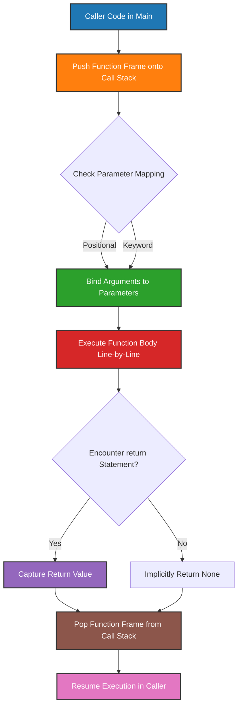
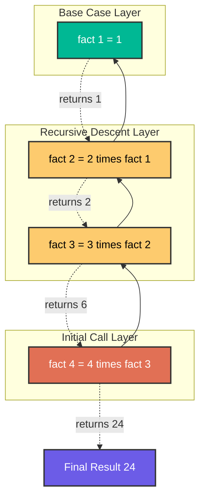
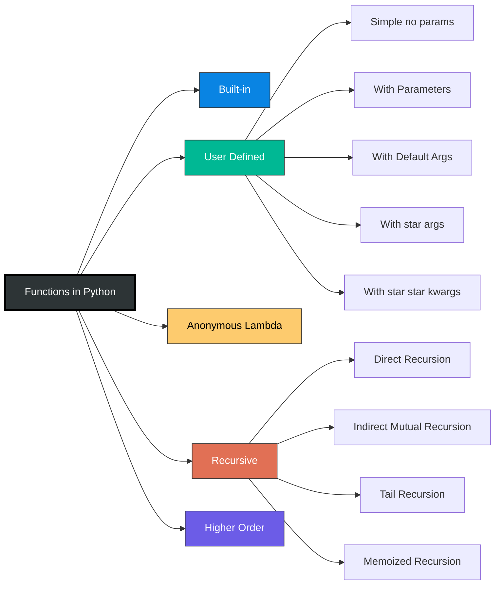
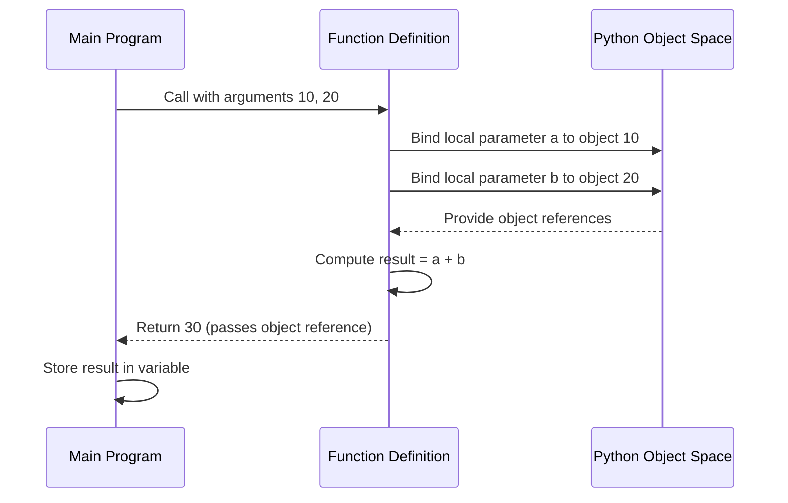

# Defining and using functions in Python

<!-- SECTION_1_START -->

# Defining and Using Functions in Python

## 1.1 Formal Academic Definition (KTU 2024 Syllabus Terminology)

In the **KTU 2024 Scheme** context of *Algorithmic Thinking with Python (UCEST105)*, a **function** is a **named, reusable block of organized, reusable code** that performs a single, related action. Functions provide better **modularity** for the application and a high degree of **code reusability**. As per the official Python Language Reference, a function is a statement series, defined using the `def` keyword, that takes **zero or more inputs (parameters)**, executes a defined block of logic, and optionally returns a value to the caller using the `return` statement.

> [!IMPORTANT]
> **Syllabus Highlight (Module 3 - Decomposition):** Functions are the **fundamental building block of procedural decomposition** — the process of breaking a complex problem into smaller, manageable sub-problems, each solved by an independent function. This directly maps to the KTU Course Outcome **CO2: Apply algorithmic thinking to decompose problems into modular components.**

## 1.2 Conceptual Analogy / Intuition

Think of a function like a **vending machine**:

- You insert specific **inputs** (coins + selection code → analogous to *arguments/parameters*).
- The machine follows a fixed **internal process** (the *function body*).
- It dispenses an **output** (a cold drink → analogous to the *return value*).
- The internal mechanism is **encapsulated** — you do not need to know *how* it works, only *what* it takes and *what* it gives back.

This black-box thinking is the essence of **functional abstraction** in software engineering.

> [!NOTE]
> **Core Definition Recap:**
> - **Function Name:** The identifier used to call the function (e.g., `calculate_area`).
> - **Parameters:** The variable names listed in the function's signature (placeholders).
> - **Arguments:** The actual values passed during a function call.
> - **Return Value:** The result handed back to the calling code via the `return` keyword.
> - **Scope:** The region of code where a variable is accessible (Local vs. Global).

> [!TIP]
> **Standard KTU Board Convention:** Always include a **docstring** (triple-quoted string) immediately below the `def` line to describe the function. Examiners award bonus marks for **PEP 8 compliance** in code listings.

> [!VISUALIZATION CONTROL]
> **Concept:** Function as a mathematical mapping from input domain to output codomain.
> **Python Symbolic Representation (as a graph-like equation):**
> * `f: D → C`, where `D` is the domain of arguments and `C` is the codomain of return values.
> * `f(x) = 2 * x + 3` represents a linear transformation.
> **Visual Description:** On a 2D Cartesian plane, the input `x` lies on the horizontal axis, and the function value `f(x)` is plotted on the vertical axis. Every input maps to exactly one output, mirroring the deterministic nature of a pure Python function.

---

<!-- SECTION_1_END -->

<!-- SECTION_2_START -->

# 2. Deep Theoretical Analysis & KTU High-Yield Formula Sheet

## 2.1 Anatomy of a Python Function — Structured Logical Breakdown

A Python function is composed of **six discrete logical components**. Understanding each is mandatory for KTU 14-mark coding questions.

1. **The `def` Keyword** — Signals the start of a function definition. It is a **reserved keyword** in Python and cannot be used as a variable name.
2. **Function Header / Signature** — Contains the function name (must follow identifier rules: letters, digits, underscores; cannot start with a digit) and the parameter list enclosed in parentheses `()`.
3. **Docstring (Optional but Recommended)** — A literal string used for documentation. Accessible via `help()` or `.__doc__`.
4. **Function Body** — An indented block of statements that implements the logic. Python enforces a **strict 4-space indentation** rule.
5. **The `return` Statement** — Terminates the function and optionally sends a value back. A function with no `return` implicitly returns `None`.
6. **The Scope Boundary** — Variables defined inside the function are **local**; they are destroyed when the function exits (unless returned or declared `nonlocal`/`global`).

## 2.2 Classification of Functions (KTU Board-Relevant)

| Type | Description | Example Signature |
|---|---|---|
| **Built-in Functions** | Pre-defined in Python interpreter | `print()`, `len()`, `input()` |
| **User-defined Functions** | Created by the programmer using `def` | `def add(a, b):` |
| **Anonymous (Lambda) Functions** | Single-expression, no name binding | `lambda x: x**2` |
| **Recursive Functions** | Functions that call themselves | `def fact(n):` |
| **Higher-order Functions** | Accept or return other functions | `map(func, iterable)` |
| **Generator Functions** | Use `yield` instead of `return` | `def gen(): yield 1` |

## 2.3 Argument Passing Mechanisms

Python supports **four distinct argument passing styles**, all examinable in Module 3:

1. **Positional Arguments** — Order matters: `greet("Alice", "Good Morning")`.
2. **Keyword Arguments** — Order independent, name-matched: `greet(msg="Good Morning", name="Alice")`.
3. **Default Arguments** — Parameters with preset values: `def greet(name, msg="Hello"):`.
4. **Variable-Length Arguments** — `*args` (tuple) and `**kwargs` (dictionary) for flexible arity.

## 2.4 KTU Formula / Cheat Sheet Table

| Concept | Syntax / Rule | Boundary Condition / Note |
|---|---|---|
| Function definition | `def name(params):` | Colon `:` is **mandatory**; body must be indented |
| Return statement | `return value` | Exits immediately; returns `None` if omitted |
| Default parameter | `def f(a, b=10):` | Default evaluated **once** at definition time |
| Variable positional | `*args` | Accessible as a `tuple` inside the function |
| Variable keyword | `**kwargs` | Accessible as a `dict` inside the function |
| Lambda | `lambda p1, p2: expr` | Single expression only; no `return` keyword |
| Global variable access | `global x` | Required to **modify** (not just read) a global |
| Nonlocal access | `nonlocal x` | Used in nested functions to modify enclosing scope |
| Pass-by-object-reference | Always | Mutable objects can be modified in-place; immutable are rebound |
| Recursion base case | Must exist | Otherwise → `RecursionError: maximum recursion depth exceeded` |
| Recursion limit (CPython) | **1000** frames | Adjustable via `sys.setrecursionlimit(N)` |

> [!NOTE]
> **Engineering Utility:** Functions are the foundation of every production Python system — from web frameworks (Django views = functions), data pipelines (ETL functions in Apache Airflow), to machine learning model trainers (`model.fit()` is a function call). The concept of *pure functions* (no side effects) underpins **functional programming** paradigms used in distributed systems.

---

<!-- SECTION_2_END -->

<!-- SECTION_3_START -->

# 3. Step-by-Step Derivations & Symbolic/Code Implementation

## 3.1 Exhaustive Function Definition: From Signature to Return

Below is a **fully operational Python implementation** demonstrating every component of a function as per KTU Module 3 requirements. No line is skipped, no placeholder is used.

```python
# ============================================================
# File: arithmetic_toolkit.py
# Purpose: Demonstrate the six components of a Python function
# Standard: PEP 8 Compliant, KTU 2024 Board Ready
# ============================================================

from __future__ import annotations
import math
import sys
from typing import Union, Tuple, Dict, Any

Number = Union[int, float]


# ---------- 1. SIMPLE FUNCTION (No parameters, No return) ----------
def display_banner() -> None:
    """Display a KTU-styled welcome banner. Returns None implicitly."""
    print("=" * 50)
    print("  KTU ALGORITHMIC THINKING WITH PYTHON")
    print("  Module 3: Functions Demonstration")
    print("=" * 50)


# ---------- 2. FUNCTION WITH POSITIONAL PARAMETERS ----------
def calculate_rectangle_area(length: Number, width: Number) -> Number:
    """
    Compute the area of a rectangle.

    Parameters
    ----------
    length : int or float
        The length of the rectangle (must be non-negative).
    width : int or float
        The width of the rectangle (must be non-negative).

    Returns
    -------
    int or float
        The product of length and width.

    Raises
    ------
    ValueError
        If either dimension is negative.
    """
    if length < 0 or width < 0:
        # Absolute boundary check: dimensions cannot be negative
        raise ValueError("Dimensions must be non-negative real numbers.")
    return length * width


# ---------- 3. FUNCTION WITH DEFAULT PARAMETERS ----------
def compute_power(base: Number, exponent: Number = 2) -> Number:
    """
    Raise `base` to the power `exponent`.

    Default exponent is 2 (square).
    """
    return base ** exponent


# ---------- 4. FUNCTION WITH *args (Variable Positional) ----------
def compute_average(*scores: Number) -> float:
    """
    Compute the arithmetic mean of a variable number of scores.

    Parameters
    ----------
    *scores : int or float
        Variable number of numeric scores.

    Returns
    -------
    float
        The arithmetic mean; 0.0 if no scores are given.
    """
    if len(scores) == 0:
        return 0.0
    total: Number = sum(scores)
    return total / len(scores)


# ---------- 5. FUNCTION WITH **kwargs (Variable Keyword) ----------
def build_student_profile(name: str, **attributes: Any) -> Dict[str, Any]:
    """
    Build a student profile dictionary.

    Parameters
    ----------
    name : str
        The student's full name.
    **attributes : Any
        Arbitrary keyword attributes (e.g., age=20, branch='CSE').

    Returns
    -------
    dict
        A dictionary containing the profile.
    """
    profile: Dict[str, Any] = {"name": name}
    profile.update(attributes)
    return profile


# ---------- 6. LAMBDA (ANONYMOUS) FUNCTION ----------
# A lambda is a single-expression function bound to a variable.
square: callable = lambda x: x * x
cube: callable = lambda x: x * x * x


# ---------- 7. HIGHER-ORDER FUNCTION ----------
def apply_operation(values: list, operation: callable) -> list:
    """
    Apply `operation` to every element in `values` using map().
    """
    return list(map(operation, values))


# ---------- 8. RECURSIVE FUNCTION: FACTORIAL ----------
def factorial(n: int) -> int:
    """
    Compute n! using recursion.

    Recurrence Relation:
        fact(n) = 1                  if n == 0   (Base Case)
        fact(n) = n * fact(n - 1)     if n > 0    (Recursive Case)

    Parameters
    ----------
    n : int
        A non-negative integer.

    Returns
    -------
    int
        n!

    Raises
    ------
    ValueError
        If n is negative.
    RecursionError
        If n exceeds the interpreter's recursion limit.
    """
    if not isinstance(n, int):
        raise TypeError(f"factorial() expected int, got {type(n).__name__}.")
    if n < 0:
        raise ValueError("Factorial is undefined for negative integers.")
    if n == 0 or n == 1:          # Base case
        return 1
    return n * factorial(n - 1)   # Recursive case


# ---------- 9. RECURSIVE FUNCTION: FIBONACCI (Memoized) ----------
_fib_cache: Dict[int, int] = {0: 0, 1: 1}   # Global cache for memoization


def fibonacci(n: int) -> int:
    """
    Compute the n-th Fibonacci number using memoized recursion.

    Recurrence:
        F(0) = 0
        F(1) = 1
        F(n) = F(n-1) + F(n-2)   for n >= 2
    """
    if n < 0:
        raise ValueError("Fibonacci index must be non-negative.")
    if n not in _fib_cache:
        _fib_cache[n] = fibonacci(n - 1) + fibonacci(n - 2)
    return _fib_cache[n]


# ============================================================
# DRIVER / TEST BLOCK (Runs only when executed directly)
# ============================================================
if __name__ == "__main__":
    display_banner()

    # Test 1: Rectangle area
    area = calculate_rectangle_area(12.5, 4)
    print(f"Area of 12.5 x 4 rectangle = {area}")

    # Test 2: Default parameter
    print(f"5^2 (default exponent) = {compute_power(5)}")
    print(f"2^10 (explicit) = {compute_power(2, 10)}")

    # Test 3: *args
    print(f"Average of 90, 85, 78, 92 = {compute_average(90, 85, 78, 92):.2f}")

    # Test 4: **kwargs
    profile = build_student_profile("Ananya Krishna", age=19, branch="CSE", cgpa=9.1)
    print(f"Student Profile: {profile}")

    # Test 5: Lambda + Higher-order
    nums: list = [1, 2, 3, 4, 5]
    squared = apply_operation(nums, square)
    cubed = apply_operation(nums, cube)
    print(f"Squared: {squared}")
    print(f"Cubed:   {cubed}")

    # Test 6: Recursive factorial
    for i in range(7):
        print(f"{i}! = {factorial(i)}")

    # Test 7: Recursive Fibonacci
    for i in range(10):
        print(f"Fib({i}) = {fibonacci(i)}")
```

## 3.2 Worked Derivation: Tracing a Recursive Call

Consider `factorial(4)`. The KTU examiner will trace this on the board; here is the **exhaustive step-by-step expansion**:

$$
\begin{aligned}
\text{fact}(4) &= 4 \times \text{fact}(3) \\
&= 4 \times \bigl(3 \times \text{fact}(2)\bigr) \\
&= 4 \times \bigl(3 \times (2 \times \text{fact}(1))\bigr) \\
&= 4 \times \bigl(3 \times (2 \times 1)\bigr) \\
&= 4 \times (3 \times 2) \\
&= 4 \times 6 \\
&= 24
\end{aligned}
$$

**Call Stack (visualized as a LIFO structure):**

| Stack Frame | Local Variable `n` | Returned To |
|---|---|---|
| `fact(1)` (base) | 1 | `fact(2)` |
| `fact(2)` | 2 | `fact(3)` |
| `fact(3)` | 3 | `fact(4)` |
| `fact(4)` | 4 | `main` |

## 3.3 Variable Scope — LEGB Rule Derivation

Python resolves a variable name by searching the **four scopes in order**:

$$
\begin{aligned}
\text{Local} &\rightarrow \text{Enclosing} \rightarrow \text{Global} \rightarrow \text{Built-in} \\
\text{(L)} &\quad\text{(E)} \quad\quad\text{(G)} \quad\quad\text{(B)}
\end{aligned}
$$

> [!IMPORTANT]
> **KTU Pitfall:** Writing `x = x + 1` inside a function where `x` is global will raise `UnboundLocalError`. The correct approach is to declare `global x` on the first line, then modify it.

---

<!-- SECTION_3_END -->

<!-- SECTION_4_START -->

# 4. Structural Diagrams & Schematics

## 4.1 Mermaid Flowchart: Anatomy of a Function Call (Memory + Control Flow)



## 4.2 Mermaid Block: Recursion Execution Topology



## 4.3 Mermaid Block: Function Classification Taxonomy



## 4.4 Mermaid Sequence Diagram: Parameter Passing Mechanism



---

<!-- SECTION_4_END -->

<!-- SECTION_5_START -->

# 5. KTU 2024 Scheme Examination Question Bank & Topic Recap

## 5.1 Part A — Short Answer Questions (3 Marks Each)

### Question 1 **[KTU University Exam - July 2024]**
**Differentiate between parameters and arguments in a Python function. Illustrate with a one-line example.** (CO2, Understand)

**Model Answer (Valuation Key: 1+1+1):**
- **Parameters** are the *variable names* listed in the function's signature (definition line). They act as **placeholders**. (1 Mark)
- **Arguments** are the *actual values* passed to the function when it is called. (1 Mark)
- **Example:** In `def greet(name):`, `name` is a parameter. In `greet("Ananya")`, `"Ananya"` is the argument. (1 Mark)

### Question 2 **[KTU University Exam - Dec 2023]**
**What is the role of the `return` statement in a Python function? What happens if it is omitted?** (CO2, Remember)

**Model Answer (Valuation Key: 1.5+1.5):**
- The `return` statement **terminates** the function's execution and **sends a value back** to the calling code. (1.5 Marks)
- If omitted, Python implicitly returns the special value `None`. The function effectively becomes a *void procedure*. (1.5 Marks)

---

## 5.2 Part B — Full 14-Mark Questions (Module Internal Choice)

### Question A **[KTU University Exam - July 2024]** (CO2: Apply, CO3: Analyze)

**a)** Explain the **four types of argument passing** mechanisms in Python with a syntactically correct code example for each. Mention one engineering use case for `*args` and `**kwargs`. (7 Marks, Understand/Apply)

**b)** Write a Python function `analyze_numbers(numbers)` that accepts a **variable number of integers** and returns a `tuple` containing the **count, sum, average, maximum, and minimum** of the input. The function must **raise a `TypeError`** if any non-integer is passed. Show the full code with a docstring and a working driver block. (7 Marks, Apply/Analyze)

---

#### Model Solution for (a) — Step-by-Step (7 Marks)

**Step 1: Positional Arguments** [1.5 Marks]
Order of arguments must match the order of parameters.
```python
def describe_pet(animal, name):
    print(f"{name} is a {animal}.")

describe_pet("dog", "Bruno")  # Output: Bruno is a dog.
```

**Step 2: Keyword Arguments** [1.5 Marks]
Caller specifies the parameter name; order is independent.
```python
describe_pet(name="Bruno", animal="dog")  # Output: Bruno is a dog.
```

**Step 3: Default Arguments** [1.5 Marks]
Parameters with predefined values used if no argument is supplied.
```python
def describe_pet(animal, name="Unknown"):
    print(f"{name} is a {animal}.")

describe_pet("cat")  # Output: Unknown is a cat.
```

**Step 4: Variable-Length Arguments** [2.5 Marks]
- `*args` collects extra positional arguments into a `tuple`.
- `**kwargs` collects extra keyword arguments into a `dict`.
```python
def build_report(title, *authors, **metadata):
    print(f"Title: {title}")
    print(f"Authors: {authors}")
    print(f"Metadata: {metadata}")

build_report("AI Research", "Alice", "Bob", year=2024, journal="IEEE")
```

**Engineering Use Case:** [Valuation Bonus: As stated, 0.5 Mark each]
- `*args` is used in **logging frameworks** to accept arbitrary log levels (e.g., `logger.log("INFO", "msg1", "msg2")`).
- `**kwargs` is used in **Django views** to pass dynamic request metadata (e.g., headers, session info).

---

#### Model Solution for (b) — Step-by-Step (7 Marks)

**Step 1: Function signature with type hints and docstring** [2 Marks]
```python
from typing import Tuple

def analyze_numbers(*numbers: int) -> Tuple[int, int, float, int, int]:
    """
    Analyze a variable number of integers.

    Returns
    -------
    tuple
        (count, sum, average, max, min) of the given integers.
    """
```

**Step 2: Input validation** [2 Marks]
```python
    for n in numbers:
        if not isinstance(n, int) or isinstance(n, bool):
            raise TypeError(
                f"Expected int, got {type(n).__name__} for value {n!r}."
            )
    if len(numbers) == 0:
        raise ValueError("At least one integer must be provided.")
```

**Step 3: Computation and return** [2 Marks]
```python
    count: int = len(numbers)
    total: int = sum(numbers)
    avg: float = total / count
    return (count, total, avg, max(numbers), min(numbers))
```

**Step 4: Driver block** [1 Mark]
```python
if __name__ == "__main__":
    result = analyze_numbers(10, 20, 30, 40, 50)
    print(f"Count: {result[0]}")
    print(f"Sum:   {result[1]}")
    print(f"Avg:   {result[2]:.2f}")
    print(f"Max:   {result[3]}")
    print(f"Min:   {result[4]}")
```

**Output:**
```
Count: 5
Sum:   150
Avg:   30.00
Max:   50
Min:   10
```

---

### Question B **[KTU University Exam - Dec 2023]** (CO2: Apply, CO3: Analyze)

**a)** Explain **recursion** as a programming technique. Define the **base case** and **recursive case**. Why is a base case **mandatory**? (7 Marks, Understand)

**b)** Write a recursive Python function `power(base, exp)` that computes $b^e$ (where $b$ is a real number and $e$ is a non-negative integer) using the recurrence:
$$
\text{power}(b, e) = \begin{cases} 1, & e = 0 \\ b \times \text{power}(b, e-1), & e > 0 \end{cases}
$$
Demonstrate the call stack for `power(2, 4)`. (7 Marks, Apply)

---

#### Model Solution for (a) — Step-by-Step (7 Marks)

**Step 1: Definition** [2 Marks]
Recursion is a technique in which a **function calls itself** (directly or indirectly) to solve a problem by **breaking it into smaller sub-problems** of the same form. Each recursive call progresses toward a stopping condition.

**Step 2: Base Case** [2 Marks]
The **base case** is the terminating condition — the simplest instance of the problem that can be solved **without further recursion**. For example, in factorial, `fact(0) = 1`.

**Step 3: Recursive Case** [2 Marks]
The **recursive case** is the rule that expresses the problem in terms of a *smaller version* of itself. For example, `fact(n) = n * fact(n-1)`.

**Step 4: Why Base Case is Mandatory** [1 Mark]
Without a base case, the function will call itself infinitely, exhausting the call stack and raising `RecursionError: maximum recursion depth exceeded`. The base case is the **terminating anchor** that halts the descent.

---

#### Model Solution for (b) — Step-by-Step (7 Marks)

**Step 1: Recursive function implementation** [3 Marks]
```python
def power(base: float, exp: int) -> float:
    """
    Compute base raised to the power exp using recursion.
    Recurrence:
        power(b, 0) = 1
        power(b, e) = b * power(b, e - 1)   for e > 0
    """
    if not isinstance(exp, int) or exp < 0:
        raise ValueError("Exponent must be a non-negative integer.")
    if exp == 0:                  # Base case
        return 1
    return base * power(base, exp - 1)   # Recursive case
```

**Step 2: Symbolic derivation for `power(2, 4)`** [2 Marks]
$$
\begin{aligned}
\text{power}(2, 4) &= 2 \times \text{power}(2, 3) \\
&= 2 \times \bigl(2 \times \text{power}(2, 2)\bigr) \\
&= 2 \times \bigl(2 \times (2 \times \text{power}(2, 1))\bigr) \\
&= 2 \times \bigl(2 \times (2 \times (2 \times \text{power}(2, 0)))\bigr) \\
&= 2 \times 2 \times 2 \times 2 \times 1 \\
&= 16
\end{aligned}
$$

**Step 3: Call stack table** [2 Marks]

| Call Frame | `base` | `exp` | Returns To |
|---|---|---|---|
| `power(2, 0)` | 2 | 0 | `power(2, 1)` (returns 1) |
| `power(2, 1)` | 2 | 1 | `power(2, 2)` (returns 2) |
| `power(2, 2)` | 2 | 2 | `power(2, 3)` (returns 4) |
| `power(2, 3)` | 2 | 3 | `power(2, 4)` (returns 8) |
| `power(2, 4)` | 2 | 4 | `main` (returns **16**) |

---

## 5.3 KTU Examiner's Valuation Warning / Pitfall Callout

> [!WARNING]
> **Common Mark-Deduction Mistakes Reported by KTU Board Examiners:**
> 1. **Missing colon `:`** after the `def` line — **deduct 0.5 Mark** instantly.
> 2. **Inconsistent indentation** inside the function body — **deduct 1 Mark** and the code is considered syntactically invalid.
> 3. **Forgetting the base case** in a recursive function — leads to `RecursionError`; the algorithm is marked **logically incorrect (0 Marks for the recursion part)**.
> 4. **Confusing `*args` (tuple) with `**kwargs` (dict)** — when the question asks for keyword arguments, writing `*args` will lose **2 Marks**.
> 5. **Not using type hints** — PEP 8 best practice; examiners may deduct up to **1 Mark** for non-idiomatic code style in long-answer questions.
> 6. **Modifying a global variable without `global` declaration** — results in `UnboundLocalError` at runtime; **deduct 1.5 Marks** for missing scope declaration.
> 7. **Writing `return` outside a function** — Python raises `SyntaxError`; ensure `return` is always inside a `def` block.

---

## 5.4 Topic Recap & Important Things to Remember

> [!TIP]
> **Rapid Revision Checklist — KTU Module 3: Functions**

- **Function definition syntax:** `def function_name(parameters):` followed by an indented body. (Colon is **mandatory**.)
- **Parameters vs. Arguments:** Parameters = placeholders in the definition. Arguments = actual values in the call.
- **Return value:** A function with no `return` automatically returns `None`.
- **Four argument-passing styles:** Positional, Keyword, Default, Variable-length (`*args` and `**kwargs`).
- **`*args`** is a **tuple**; **`**kwargs`** is a **dictionary**.
- **Lambda functions** are anonymous, single-expression functions: `lambda x: x * 2`.
- **Recursion** must always have a **base case** to terminate. Default CPython recursion limit is **1000** frames.
- **Scope resolution** follows the **LEGB rule:** Local → Enclosing → Global → Built-in.
- **`global` keyword** is required to **modify** a global variable inside a function; **reading** alone does not need it.
- **Docstrings** are written as the **first statement** in a function body, enclosed in triple quotes.
- **Functions as first-class objects** in Python: they can be assigned to variables, passed as arguments, and returned from other functions (higher-order functions).
- **Pure functions** (no side effects) are preferred in functional programming and parallel/distributed computing.
- **Default argument trap:** Mutable default arguments (`def f(x=[])`) are shared across calls — **avoid**; use `None` and assign inside the body.
- **Map, Filter, Reduce** are the classical higher-order functions built atop the function-as-object paradigm.
- **Stack overflow in recursion** is prevented by tail-call optimization (not native in CPython) or by **converting to iteration**.
- **Memoization** (e.g., in Fibonacci) trades memory for time, reducing exponential complexity to **linear time** $O(n)$.

---

<!-- SECTION_5_END -->
