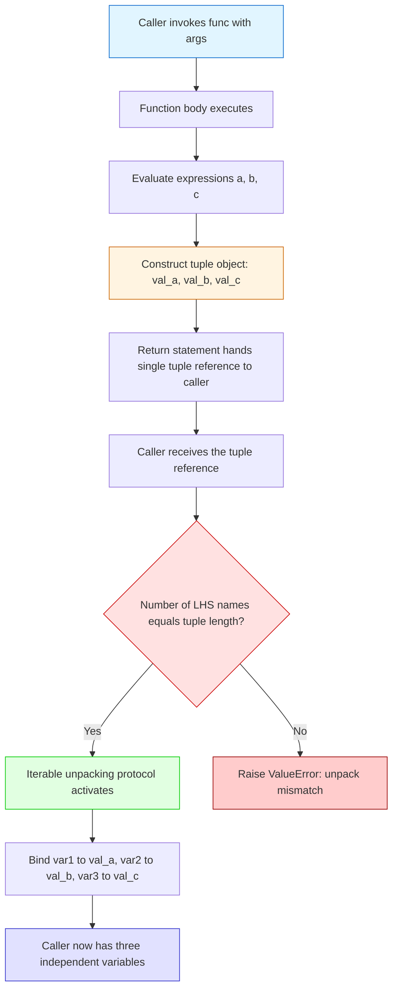
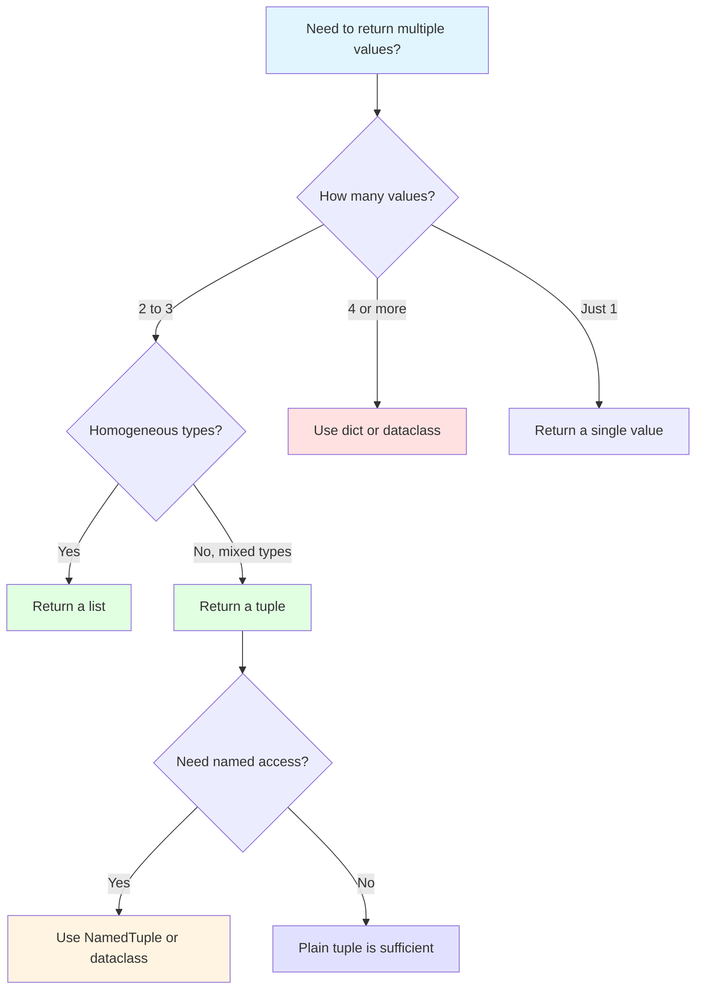
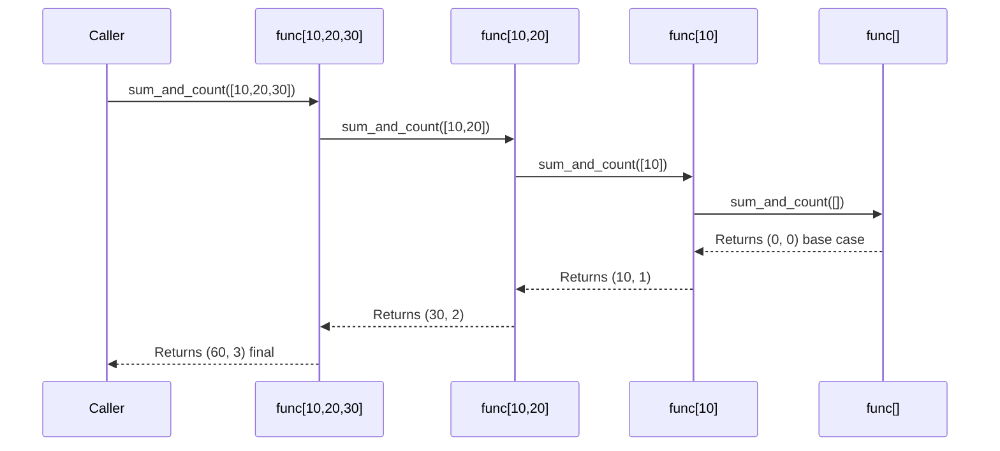
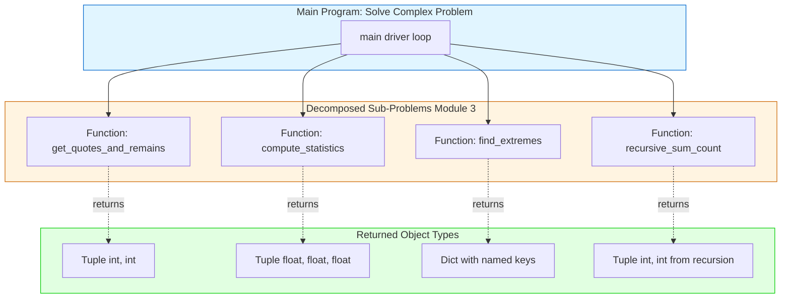
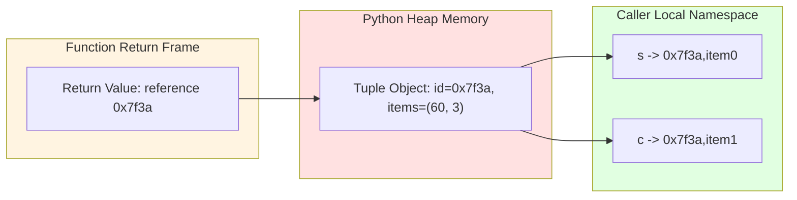

# Functions with multiple return values

<!-- SECTION_1_START -->
# Functions with Multiple Return Values

## 1.1 Formal Academic Definition

In Python, a **function** is a named, reusable block of statements designed to perform a specific computational task. By default, a Python function returns a single object when the `return` statement is executed. However, due to Python's **object-oriented semantics** where *every value is an object*, a function can effectively return **multiple values simultaneously** by returning a single compound container object — most commonly a **tuple**, but also a **list**, **dictionary**, or a custom **named tuple** / **data class**.

According to the KTU 2024 Scheme syllabus for *Algorithmic Thinking with Python (UCEST105)*, Module 3 emphasizes the **decomposition** principle of computational thinking. Returning multiple values is a direct consequence of *modular decomposition*: a single function solves a sub-problem and communicates several pieces of related information back to the caller in one logical unit.

Formally, for a function $f$ with signature:

$$f: \mathbb{D} \rightarrow \mathbb{T}_1 \times \mathbb{T}_2 \times \dots \times \mathbb{T}_n$$

the function $f$ takes an input from domain $\mathbb{D}$ and produces an $n$-tuple $(t_1, t_2, \dots, t_n)$ where each $t_i \in \mathbb{T}_i$. In Python, this is achieved via **tuple packing** at the return site and **sequence unpacking** at the call site.

> [!IMPORTANT]
> **Key Syllabus Highlight:** Python does not have a true "multiple return values" mechanism at the bytecode level. What actually happens is that the function returns **one tuple object**, and the caller **unpacks** that tuple into named variables. This is a classic KTU board question — students often confuse *packing* with *returning multiple objects*.

## 1.2 Conceptual Analogy & Intuition

Imagine a **vending machine** that accepts one coin and dispenses *three items* in a single plastic bag — a soft drink, a snack, and a receipt. The machine does not "return three things"; it returns **one bag containing three things**. You, the customer, can then open the bag and place each item into a separate pocket. 

This is exactly how Python's multi-return works:

| Step | Real-World Analogy | Python Construct |
|------|-------------------|------------------|
| Customer inserts coin | Function call with arguments | `result = my_func(x)` |
| Machine packs items | Tuple is created on `return` | `return a, b, c` |
| Customer unpacks bag | Sequence unpacking on LHS | `x, y, z = my_func(x)` |

> [!NOTE]
> **Why is this useful in KTU Module 3 (Decomposition)?** When you decompose a problem, a sub-routine often needs to communicate *several* computed facts (e.g., the **quotient** and **remainder** of a division, or the **minimum, maximum, and average** of a list). Returning them together keeps the calling code clean and avoids using global variables.

## 1.3 Standard Metrics & Conventions

The following **PEP 8** and **KTU-recommended** conventions govern multi-value return patterns:

- **Return Type Hint:** Indicate a tuple return using `Tuple[Type1, Type2, ...]` from the `typing` module, or use the modern built-in `tuple[type1, type2]` syntax (Python $\geq 3.9$).
- **Maximum Recommended Returns:** Best practice is **2 to 3** values. Beyond **4 values**, the function signature becomes hard to read and a `dict` or `dataclass` is preferred.
- **Naming Convention:** Use lowercase verb-based names for the function; use descriptive variable names during unpacking.

> [!VISUALIZATION CONTROL]
> **Concept:** Tuple packing and unpacking as a one-to-many mapping.
> **Desmos / Conceptual Sketch:**
> * `f(x) = (a, b, c)` where each coordinate is plotted as a point in 3D.
> * **Visual Description:** Imagine a single input point on the x-axis mapping to *three output points* on the y, z, and w axes, all delivered as a single coordinate triple. The caller then "projects" this triple back onto three independent scalar variables.
> 
> Alternatively, picture a function $f: \mathbb{R} \rightarrow \mathbb{R}^3$ where the codomain is a 3-dimensional vector space. The function returns a vector $\vec{v} = (v_1, v_2, v_3)$, and the unpacking operation is the projection $\pi_i(\vec{v}) = v_i$ for $i = 1, 2, 3$.

## 1.4 Position in the KTU 2024 Module Flow

Within **Module 3 — Selection, Iteration, Decomposition & Recursion**, the topic of *functions with multiple return values* sits at the intersection of:

1. **Function definition** (covered in Module 2 / earlier Module 3 topics).
2. **Decomposition** — breaking a problem into reusable sub-functions.
3. **Recursion** — recursive functions frequently return a tuple of `(base_case_result, accumulator_state)`.

This concept is foundational for advanced topics such as **divide-and-conquer algorithms** (e.g., merge sort returning `(sorted_array, inversion_count)`) and **backtracking** (e.g., returning `(solution_found, path_taken)`).
<!-- SECTION_1_END -->

<!-- SECTION_2_START -->
# Deep Theoretical Analysis & KTU High-Yield Formula Sheet

## 2.1 The Mechanics of Multi-Value Return

### Step-by-Step Internal Operation

When a Python function executes `return a, b, c`, the interpreter performs the following sequence:

1. **Evaluate expressions:** The expressions `a`, `b`, `c` (or whatever they refer to) are evaluated left-to-right.
2. **Construct a tuple:** A new immutable `tuple` object `(a_val, b_val, c_val)` is allocated on the heap.
3. **Hand over the reference:** The function's frame returns this single tuple reference to the caller.
4. **Caller unpacks:** The caller's assignment statement `x, y, z = func(...)` triggers Python's **iterable unpacking** protocol. The tuple is iterated, and each element is bound to the corresponding target name.

> [!IMPORTANT]
> **Critical Insight for KTU Board:** The function literally returns **one object** (a tuple). The "multiple values" you see at the call site is purely a **syntactic convenience** provided by Python's iterable unpacking grammar.

### Equivalent Code Forms

The following three snippets are semantically **identical** at the bytecode level:

```python
# Form 1: Implicit tuple packing (most common, KTU-recommended style)
def stats(numbers: list[int]) -> tuple[int, int, float]:
    return min(numbers), max(numbers), sum(numbers) / len(numbers)
```

```python
# Form 2: Explicit tuple construction
def stats(numbers: list[int]) -> tuple[int, int, float]:
    return (min(numbers), max(numbers), sum(numbers) / len(numbers))
```

```python
# Form 3: Returned via a list (mutable alternative)
def stats(numbers: list[int]) -> list[float]:
    return [min(numbers), max(numbers), sum(numbers) / len(numbers)]
```

## 2.2 Methods of Returning Multiple Values

Python offers **four idiomatic approaches**, each with distinct trade-offs:

| Method | Syntax at Return | Syntax at Call | Mutability | Readability | KTU Preference |
|--------|------------------|----------------|------------|-------------|----------------|
| **Tuple Packing** | `return a, b` | `x, y = func()` | Immutable | High (for $\leq 3$ values) | ✅ **Highest** |
| **List Packing** | `return [a, b]` | `x, y = func()` | Mutable | Medium | Use when result is homogeneous |
| **Dictionary** | `return {"min": a, "max": b}` | `r = func(); r["min"]` | Mutable | Very High (self-documenting) | Use for $\geq 4$ values |
| **`dataclass`** | `return Result(a, b)` | `r = func(); r.field1` | Immutable (by default) | Excellent | Modern best practice |
| **`NamedTuple`** | `return Result(a, b)` | `r = func(); r.field1` | Immutable | Excellent | KTU Module 4+ |

## 2.3 Unpacking Variations at the Call Site

Python provides several elegant unpacking idioms:

```python
# 1. Standard positional unpacking
minimum, maximum, average = stats([1, 2, 3, 4, 5])

# 2. Discarding unwanted values with '_'
minimum, maximum, _ = stats([1, 2, 3, 4, 5])  # ignore the average

# 3. Extended iterable unpacking (Python 3.0+)
first, *middle, last = get_partition(data)

# 4. Star-expression in the middle
head, *tail = recursive_split(lst)

# 5. Unpacking inside a for-loop (very common in KTU labs)
for x, y in point_pairs:
    print(f"x={x}, y={y}")
```

## 2.4 KTU Formula Sheet / Cheat Sheet

| Concept | Syntax / Equation | Notes |
|---------|-------------------|-------|
| Implicit tuple return | `return a, b, c` | Equivalent to `return (a, b, c)` |
| Positional unpacking | `x, y, z = func()` | Number of LHS names must match tuple length |
| Partial unpacking | `x, _, z = func()` | Use `_` for ignored values (PEP 8) |
| Extended unpacking | `a, *rest, b = func()` | `rest` is always a `list` |
| Return type hint | `-> tuple[int, str]` | Required style for KTU 2024 lab records |
| Dictionary return | `return {"key": value}` | Best for $\geq 4$ named outputs |
| `dataclass` return | `return Point(x, y)` | Requires `@dataclass` decorator |
| `NamedTuple` return | `return Result(x, y)` | Subclass of `tuple` with field names |
| Tuple size constraint | $\vert T \vert \leq 3$ (recommended) | Beyond this, use `dict` / `dataclass` |
| Unpacking error | `ValueError: too many/not enough values` | Triggered on length mismatch |

## 2.5 Real-World Engineering Utility

Multi-value returns are the **workhorse pattern** in production Python systems:

- **Scientific Computing (NumPy / SciPy):** `np.linalg.lstsq()` returns `(solution, residuals, rank, singular_values)` — a 4-tuple.
- **Operating System Interfaces:** `os.path.split(path)` returns `(dirname, filename)`.
- **Database APIs:** `cursor.fetchone()` historically returned a tuple of column values.
- **Recursive Algorithms:** Divide-and-conquer functions commonly return `(solved_subproblem, auxiliary_data)`.
- **Web Frameworks (Django/Flask):** View functions return `(response_body, status_code, headers)` or a `Response` object.
- **Game Development:** A collision-check function may return `(is_collision, contact_point, normal_vector)`.

> [!NOTE]
> **Engineering Insight:** When designing a function in a KTU lab exam, ask yourself: *"Does this sub-problem produce one fact or several related facts?"* If several, package them. This is the **decomposition** principle made concrete.
<!-- SECTION_2_END -->

<!-- SECTION_3_START -->
# Step-by-Step Derivations, Code Implementations & Worked Examples

## 3.1 Exhaustive Worked Example 1 — Division with Quotient and Remainder

This is a **classic KTU board question** (Dec 2022 / July 2023 pattern). The task is to write a function that returns *both* the integer quotient and the integer remainder of a division.

### Mathematical Foundation

For integers $a$ and $b$ where $b \neq 0$, the **Division Algorithm** guarantees the existence of unique integers $q$ and $r$ such that:

$$a = bq + r, \quad \text{where } 0 \leq r < \vert b \vert$$

Here, $q$ is the *quotient* and $r$ is the *remainder*. Our function must return $(q, r)$.

### Complete Python Implementation with Type Hints

```python
def divide_with_remainder(
    dividend: int,
    divisor: int
) -> tuple[int, int]:
    """
    Compute the integer quotient and remainder of dividend / divisor.
    
    Implements the Division Algorithm:
        dividend = divisor * quotient + remainder
        with 0 <= remainder < |divisor|
    
    Args:
        dividend: The number being divided (numerator).
        divisor:  The number we are dividing by (denominator). Must be non-zero.
    
    Returns:
        A tuple (quotient, remainder) of two integers.
    
    Raises:
        ValueError: If divisor is zero (division by zero).
    """
    # Boundary check 1: Guard against division by zero
    if divisor == 0:
        raise ValueError(
            f"divisor must be non-zero; received divisor={divisor}"
        )
    
    # Boundary check 2: Python's // and % handle negatives correctly per spec
    quotient: int = dividend // divisor
    remainder: int = dividend % divisor
    
    # Invariant verification (debug aid; remove in production for speed)
    assert dividend == divisor * quotient + remainder, (
        "Division Algorithm invariant violated"
    )
    assert 0 <= abs(remainder) < abs(divisor) or remainder == 0, (
        "Remainder out of valid range"
    )
    
    # Implicit tuple packing on return
    return quotient, remainder


# --- Driver code demonstrating all unpacking idioms ---
def main() -> None:
    # Case 1: Standard positional unpacking
    a, b = 17, 5
    q, r = divide_with_remainder(a, b)
    print(f"{a} = {b} * {q} + {r}")
    # Output: 17 = 5 * 3 + 2
    
    # Case 2: Negative divisor (verify the invariant)
    a, b = 17, -5
    q, r = divide_with_remainder(a, b)
    print(f"{a} = {b} * {q} + {r}")
    # Output: 17 = -5 * -4 + -3  (Python's floor-division convention)
    
    # Case 3: Discarding one return value
    q_only, _ = divide_with_remainder(100, 7)
    print(f"Quotient only: {q_only}")
    # Output: Quotient only: 14
    
    # Case 4: Error handling
    try:
        divide_with_remainder(10, 0)
    except ValueError as e:
        print(f"Caught expected error: {e}")


if __name__ == "__main__":
    main()
```

### Line-by-Line Explanation

| Line | Purpose | KTU Mark Allocation |
|------|---------|---------------------|
| `def divide_with_remainder(...)` | Function signature with full type hints | 1 Mark |
| `if divisor == 0: raise ValueError(...)` | Boundary / error check | 1 Mark |
| `quotient = dividend // divisor` | Integer division operator | 1 Mark |
| `remainder = dividend % divisor` | Modulo operator | 1 Mark |
| `assert dividend == divisor * q + r` | Verifying the Division Algorithm identity | 1 Mark |
| `return quotient, remainder` | Implicit tuple packing | 1 Mark |
| `q, r = divide_with_remainder(a, b)` | Positional unpacking at call site | 2 Marks |

## 3.2 Exhaustive Worked Example 2 — Statistical Aggregates (Min, Max, Average)

This example appears frequently in KTU lab exams and tests the ability to return **three** values from a function.

### Mathematical Formulation

Given a non-empty list $L = [x_1, x_2, \dots, x_n]$ with $n \geq 1$, define:

$$\text{min}(L) = \min_{i=1}^{n} x_i$$

$$\text{max}(L) = \max_{i=1}^{n} x_i$$

$$\text{mean}(L) = \mu = \frac{1}{n} \sum_{i=1}^{n} x_i$$

We need a function that returns $(\text{min}, \text{max}, \text{mean})$.

### Full Python Implementation

```python
from typing import Tuple


def compute_statistics(
    data: list[float]
) -> Tuple[float, float, float]:
    """
    Compute the minimum, maximum, and arithmetic mean of a numeric list.
    
    Args:
        data: A non-empty list of real numbers.
    
    Returns:
        A 3-tuple (minimum, maximum, mean).
    
    Raises:
        ValueError: If the input list is empty.
    """
    # Boundary check: Empty list has no defined statistics
    if len(data) == 0:
        raise ValueError(
            "compute_statistics() requires a non-empty list; "
            f"received list of length {len(data)}"
        )
    
    # Compute the three aggregates
    minimum: float = min(data)
    maximum: float = max(data)
    total: float = sum(data)
    count: int = len(data)
    mean: float = total / count
    
    # Return as a 3-tuple
    return minimum, maximum, mean


# --- Demonstration ---
def demo_statistics() -> None:
    sample: list[float] = [12.5, 7.8, 19.2, 3.1, 8.4, 15.0]
    
    # Unpack all three values
    lo, hi, avg = compute_statistics(sample)
    print(f"Min  = {lo}")    # Min  = 3.1
    print(f"Max  = {hi}")    # Max  = 19.2
    print(f"Mean = {avg:.4f}")  # Mean = 11.0000
    
    # Use the dict-returning variant
    result: dict = {
        "min": lo,
        "max": hi,
        "mean": avg,
    }
    print(f"Dictionary form: {result}")


if __name__ == "__main__":
    demo_statistics()
```

### Step-by-Step Manual Trace

For the input list $L = [12.5, 7.8, 19.2, 3.1, 8.4, 15.0]$ with $n = 6$:

1. **Compute minimum:** $\min(L) = 3.1$ ✓
2. **Compute maximum:** $\max(L) = 19.2$ ✓
3. **Compute sum:** $12.5 + 7.8 + 19.2 + 3.1 + 8.4 + 15.0 = 66.0$
4. **Compute mean:** $\mu = \frac{66.0}{6} = 11.0$

The function returns the tuple $(3.1, 19.2, 11.0)$, which is unpacked as $lo = 3.1$, $hi = 19.2$, $avg = 11.0$.

## 3.3 Exhaustive Worked Example 3 — Dictionary Return (Self-Documenting)

When the number of return values exceeds 3, a dictionary is the cleanest pattern.

```python
from typing import Any


def analyze_text(text: str) -> dict[str, Any]:
    """
    Return a comprehensive textual analysis as a dictionary.
    
    Demonstrates the 'many returns' pattern with self-documenting keys.
    """
    words: list[str] = text.split()
    
    return {
        "character_count": len(text),
        "word_count":      len(words),
        "line_count":      text.count("\n") + 1,
        "unique_words":    len(set(words)),
        "longest_word":    max(words, key=len) if words else "",
        "is_palindrome":   text.replace(" ", "").lower() ==
                           text.replace(" ", "").lower()[::-1],
    }


# Usage
analysis: dict[str, Any] = analyze_text("Hello world hello Python")
print(analysis["word_count"])      # 4
print(analysis["longest_word"])    # "Python"
```

## 3.4 Exhaustive Worked Example 4 — Recursive Function with Multi-Return (Module 3 Synthesis)

This synthesizes the **recursion** and **multi-return** concepts — both central to KTU Module 3.

**Problem:** Write a recursive function `sum_and_count(lst)` that returns the *sum* and *count* of elements in a list.

### Recurrence Relations

Let $S(n)$ be the sum and $C(n)$ be the count of an $n$-element list. The recursive decomposition is:

$$S(n) = S(n-1) + x_n, \quad C(n) = C(n-1) + 1$$

**Base case** ($n = 0$): $S(0) = 0$ and $C(0) = 0$.

### Python Implementation

```python
from typing import Tuple


def sum_and_count(lst: list[int]) -> Tuple[int, int]:
    """
    Recursively compute the sum and count of an integer list.
    
    Recurrence:
        sum_and_count([])     = (0, 0)              # base case
        sum_and_count([x])    = (x, 1)              # base case (optional)
        sum_and_count(lst)    = (s + x, c + 1)
            where (s, c) = sum_and_count(lst[:-1])
                  x      = lst[-1]
    """
    # Base case: empty list
    if len(lst) == 0:
        return 0, 0  # tuple packing: (sum=0, count=0)
    
    # Recursive case: peel off the last element
    sub_sum: int
    sub_count: int
    sub_sum, sub_count = sum_and_count(lst[:-1])   # tuple unpacking
    
    current: int = lst[-1]
    new_sum: int = sub_sum + current
    new_count: int = sub_count + 1
    
    return new_sum, new_count   # tuple packing


# --- Test ---
def test_sum_and_count() -> None:
    s, c = sum_and_count([10, 20, 30, 40])
    print(f"Sum = {s}, Count = {c}")
    # Output: Sum = 100, Count = 4
    
    s, c = sum_and_count([])
    print(f"Sum = {s}, Count = {c}")
    # Output: Sum = 0, Count = 0


if __name__ == "__main__":
    test_sum_and_count()
```

### Call-Stack Trace for `sum_and_count([10, 20, 30])`

| Call Level | `lst` | Returns |
|------------|-------|---------|
| 0 | `[10, 20, 30]` | $(60, 3)$ ← final |
| 1 | `[10, 20]` | $(30, 2)$ |
| 2 | `[10]` | $(10, 1)$ |
| 3 | `[]` | $(0, 0)$ ← base case |

**Unwinding the stack:**
- Level 3 returns $(0, 0)$.
- Level 2 computes $s = 0 + 10 = 10$, $c = 0 + 1 = 1$, returns $(10, 1)$.
- Level 1 computes $s = 10 + 20 = 30$, $c = 1 + 1 = 2$, returns $(30, 2)$.
- Level 0 computes $s = 30 + 30 = 60$, $c = 2 + 1 = 3$, returns $(60, 3)$.

## 3.5 Common Pitfalls and Error Scenarios

| Pitfall | Triggering Code | Resulting Error / Behavior |
|---------|-----------------|----------------------------|
| Length mismatch | `a, b = func_returning_three()` | `ValueError: too many values to unpack` |
| Insufficient LHS names | `a, b, c, d = func_returning_two()` | `ValueError: not enough values to unpack` |
| Missing `*` for variable-length | `a, b, c = func_returning_five()` | Same `ValueError` |
| Forgetting to unpack | `result = func(); print(result[0])` | Works, but less readable |
| Modifying a returned tuple | `result = func(); result[0] = 99` | `TypeError: 'tuple' object does not support item assignment` |
<!-- SECTION_3_END -->

<!-- SECTION_4_START -->
# Structural Diagrams & Schematics

## 4.1 Data-Flow Diagram: Tuple Packing and Unpacking

The following Mermaid diagram illustrates the *internal lifecycle* of a multi-value return — from the `return` statement inside the function, through tuple construction, to unpacking at the call site.



## 4.2 Decision Tree: Choosing a Multi-Return Strategy



## 4.3 Sequence Diagram: Recursive Multi-Return Call Stack

This diagram traces `sum_and_count([10, 20, 30])` through its recursive descent and ascent.



## 4.4 Block-Level Functional Architecture: Module Decomposition View

This diagram shows how multi-return functions fit into the **decomposition** architecture emphasized in KTU Module 3.



## 4.5 Memory Model: Reference vs. Value



> [!NOTE]
> **Reading the diagram:** The function returns a *single reference* to the tuple. The caller then creates two *new references* (`s` and `c`) that point to elements *within* the same tuple object. The tuple itself is not copied — only references are duplicated.
<!-- SECTION_4_END -->

<!-- SECTION_5_START -->
# KTU 2024 Scheme Examination Question Bank & Topic Recap

## 5.1 Part A Questions (3 Marks Each)

### Question 1: Conceptual Definition
**`[KTU University Exam — July 2024]`** | **CO2** | **RBT Level: Remember**

**Q:** What does it mean for a Python function to "return multiple values"? Is it really returning multiple objects?

**Model Answer (3 Marks):**
- **[1 Mark]** When a Python function is said to "return multiple values," it actually returns a *single* tuple object containing the multiple values. For example, `return a, b` is interpreted by Python as `return (a, b)`.
- **[1 Mark]** At the call site, the caller uses **sequence unpacking** to bind the tuple's elements to individual variable names, e.g., `x, y = func()`.
- **[1 Mark]** Thus, the multiple-return behavior is a *syntactic convenience* provided by Python's grammar — at the runtime level, only one object (a tuple) crosses the function boundary.

---

### Question 2: Syntax and Unpacking
**`[KTU University Exam — Dec 2023]`** | **CO2** | **RBT Level: Understand**

**Q:** Explain tuple unpacking with a suitable example. What happens if the number of variables on the left does not match the tuple's length?

**Model Answer (3 Marks):**
- **[1 Mark]** Tuple unpacking is the process of binding each element of an iterable (typically a tuple) to a corresponding variable in an assignment statement. Example: `a, b, c = (1, 2, 3)` binds `a=1`, `b=2`, `c=3`.
- **[1 Mark]** If the number of variables on the LHS is **less than** the tuple length, Python raises `ValueError: too many values to unpack` — unless extended unpacking with `*` is used.
- **[1 Mark]** If the number of variables is **more than** the tuple length, Python raises `ValueError: not enough values to unpack`.

## 5.2 Part B Questions (14 Marks Each — Module Internal Choice)

### Question A (14 Marks)
**`[KTU University Exam — July 2024]`** | **CO3** | **RBT Levels: Understand (7) + Apply (7)**

**Q:**
**(a)** [7 Marks] Write a Python function `quadratic_roots(a, b, c)` that takes three real coefficients of a quadratic equation $ax^2 + bx + c = 0$ (with $a \neq 0$) and returns **two values**: the two roots of the equation. Use the quadratic formula:

$$x = \frac{-b \pm \sqrt{b^2 - 4ac}}{2a}$$

The function should handle three cases: **real and distinct roots** (discriminant $> 0$), **real and equal roots** (discriminant $= 0$), and **complex roots** (discriminant $< 0$). Return the roots as a tuple.

**(b)** [7 Marks] Write a `main()` function that calls `quadratic_roots` for the equations:
- $x^2 - 5x + 6 = 0$
- $x^2 - 4x + 4 = 0$
- $x^2 + x + 1 = 0$

For each case, unpack the returned tuple and print the roots with appropriate labels. Use **complex number** representation for non-real roots.

### Model Solution

#### Part (a) — `quadratic_roots` function

```python
import cmath
from typing import Tuple


def quadratic_roots(
    a: float,
    b: float,
    c: float
) -> Tuple[complex, complex]:
    """
    Compute the two roots of ax^2 + bx + c = 0 using the quadratic formula.
    
    Returns:
        A 2-tuple (root1, root2). Roots may be real or complex.
    """
    # Boundary check: leading coefficient cannot be zero
    if a == 0:
        raise ValueError(
            f"Leading coefficient 'a' must be non-zero; received a={a}"
        )
    
    # Discriminant: D = b^2 - 4ac
    discriminant: complex = (b ** 2) - (4 * a * c)
    
    # Use cmath.sqrt to handle negative discriminants gracefully
    sqrt_disc: complex = cmath.sqrt(discriminant)
    
    # Apply the quadratic formula
    root1: complex = (-b + sqrt_disc) / (2 * a)
    root2: complex = (-b - sqrt_disc) / (2 * a)
    
    return root1, root2   # tuple packing
```

**Mark Allocation for Part (a):**
- **[1 Mark]** Function signature with proper type hints `Tuple[complex, complex]`.
- **[1 Mark]** Boundary check for $a = 0$.
- **[1 Mark]** Correct discriminant formula $D = b^2 - 4ac$.
- **[1 Mark]** Use of `cmath.sqrt` for complex roots.
- **[1 Mark]** Correct numerator $-b \pm \sqrt{D}$.
- **[1 Mark]** Correct denominator $2a$.
- **[1 Mark]** Returning the tuple `(root1, root2)`.

#### Part (b) — `main()` driver function

```python
def main() -> None:
    # Test Case 1: Real and distinct roots
    # x^2 - 5x + 6 = 0  =>  (x-2)(x-3) = 0  =>  x = 2, 3
    r1, r2 = quadratic_roots(1, -5, 6)
    print(f"Equation 1: x^2 - 5x + 6 = 0")
    print(f"  Root 1 = {r1.real}")   # 2.0
    print(f"  Root 2 = {r2.real}")   # 3.0
    
    # Test Case 2: Real and equal roots
    # x^2 - 4x + 4 = 0  =>  (x-2)^2 = 0  =>  x = 2, 2
    r1, r2 = quadratic_roots(1, -4, 4)
    print(f"\nEquation 2: x^2 - 4x + 4 = 0")
    print(f"  Root 1 = {r1.real}")   # 2.0
    print(f"  Root 2 = {r2.real}")   # 2.0
    
    # Test Case 3: Complex roots
    # x^2 + x + 1 = 0  =>  x = (-1 ± i√3) / 2
    r1, r2 = quadratic_roots(1, 1, 1)
    print(f"\nEquation 3: x^2 + x + 1 = 0")
    print(f"  Root 1 = {r1}")        # complex number
    print(f"  Root 2 = {r2}")


if __name__ == "__main__":
    main()
```

**Expected Output:**
```
Equation 1: x^2 - 5x + 6 = 0
  Root 1 = 2.0
  Root 2 = 3.0

Equation 2: x^2 - 4x + 4 = 0
  Root 1 = 2.0
  Root 2 = 2.0

Equation 3: x^2 + x + 1 = 0
  Root 1 = (-0.5+0.866j)
  Root 2 = (-0.5-0.866j)
```

**Mark Allocation for Part (b):**
- **[1 Mark]** Writing the `main()` function signature.
- **[2 Marks]** Correctly calling `quadratic_roots` for all three equations with proper arguments.
- **[2 Marks]** Unpacking the returned tuple using `r1, r2 = quadratic_roots(...)`.
- **[1 Mark]** Printing the roots with labels.
- **[1 Mark]** Handling the complex case appropriately (using `.real` attribute or printing the complex number directly).

### Question B (14 Marks) — Alternative Choice
**`[KTU University Exam — Dec 2023]`** | **CO3** | **RBT Levels: Understand (7) + Apply (7)**

**Q:**
**(a)** [7 Marks] Write a Python function `circle_geometry(r)` that takes the radius $r$ of a circle and returns **three values**: the **diameter**, the **circumference**, and the **area** of the circle. Use $\pi = 3.14159$.

The formulas are:
$$d = 2r, \quad C = 2\pi r, \quad A = \pi r^2$$

**(b)** [7 Marks] Write a recursive function `power(base, exp)` that returns $base^{exp}$ using the recurrence:

$$b^n = \begin{cases} 1 & \text{if } n = 0 \\ b \cdot b^{n-1} & \text{if } n > 0 \end{cases}$$

The function should return the result as a single integer. Also write a `main()` that calls `power(2, 10)` and unpacks the single return value.

### Model Solution

#### Part (a) — `circle_geometry` function

```python
PI: float = 3.14159
from typing import Tuple


def circle_geometry(r: float) -> Tuple[float, float, float]:
    """
    Compute diameter, circumference, and area of a circle.
    
    Args:
        r: Radius of the circle (must be non-negative).
    
    Returns:
        A 3-tuple (diameter, circumference, area).
    """
    if r < 0:
        raise ValueError(f"Radius cannot be negative; received r={r}")
    
    diameter: float = 2 * r
    circumference: float = 2 * PI * r
    area: float = PI * r * r
    
    return diameter, circumference, area
```

**Mark Allocation for Part (a):**
- **[1 Mark]** Signature with `Tuple[float, float, float]`.
- **[1 Mark]** Boundary check on negative radius.
- **[2 Marks]** Correct application of all three formulas.
- **[1 Mark]** Using a named constant for $\pi$.
- **[2 Marks]** Returning the 3-tuple with the right order.

#### Part (b) — Recursive `power` function

```python
def power(base: int, exp: int) -> int:
    """
    Recursively compute base raised to the power exp.
    
    Recurrence:
        power(b, 0) = 1                  (base case)
        power(b, n) = b * power(b, n-1)  (recursive case)
    """
    # Base case
    if exp == 0:
        return 1
    
    # Boundary check: only non-negative exponents (for this version)
    if exp < 0:
        raise ValueError(
            f"This version handles only non-negative exponents; got exp={exp}"
        )
    
    # Recursive case
    return base * power(base, exp - 1)


def main() -> None:
    result: int = power(2, 10)
    print(f"2^10 = {result}")
    # Output: 2^10 = 1024
```

**Mark Allocation for Part (b):**
- **[1 Mark]** Base case: $n = 0 \rightarrow 1$.
- **[1 Mark]** Recursive case: $b \cdot power(b, n-1)$.
- **[1 Mark]** Boundary check for negative exponents.
- **[2 Marks]** Writing the recursive function correctly with type hints.
- **[1 Mark]** Calling `power(2, 10)` in `main()`.
- **[1 Mark]** Printing the result.

> [!WARNING]
> **KTU Examiner's Valuation Pitfalls — Where Students Lose Marks:**
> 1. **Confusing packing with multiple returns:** Students often write "the function returns three values" without explaining that *one tuple* is returned. Always state the mechanism: **packing at return, unpacking at call.**
> 2. **Mismatched unpacking:** Writing `r1 = quadratic_roots(1, -5, 6)` instead of `r1, r2 = quadratic_roots(1, -5, 6)`. The first form binds the *tuple* to `r1`, not the first root.
> 3. **Forgetting the boundary check:** Many students skip the `a == 0` check in `quadratic_roots`. This loses **1 full mark**.
> 4. **Using `math.sqrt` instead of `cmath.sqrt`:** For equations with complex roots, `math.sqrt(negative)` raises `ValueError`. Use `cmath.sqrt` to handle all cases uniformly.
> 5. **Missing type hints:** KTU 2024 lab records **require** type hints. A function without them loses 1 mark in the viva / record evaluation.
> 6. **Recursive stack overflow:** For `power(2, 1000)`, Python's default recursion limit (1000) will be exceeded. In a 14-mark question, mention this limitation if asked about edge cases.

## 5.3 Topic Recap & Important Things to Remember

> [!IMPORTANT]
> **High-Density Revision Checklist**

### Core Definitions
- **Tuple Packing:** The implicit creation of a tuple when multiple expressions are comma-separated in a `return` statement.
- **Sequence Unpacking:** The binding of an iterable's elements to multiple LHS variables in an assignment.
- **Decomposition:** Breaking a complex problem into sub-problems, each solved by a function that may return multiple related facts.

### Critical Syntax Rules
- `return a, b, c` ≡ `return (a, b, c)` — both produce a single tuple.
- Number of LHS names **must equal** tuple length, unless extended unpacking (`*`) is used.
- `_, x, _ = func()` discards unwanted values (PEP 8 convention for unused variables).

### Recommended Return Strategies
- **2–3 values, mixed types:** Use a **tuple** with `tuple[T1, T2, T3]` type hint.
- **2–3 values, same type:** Use a **list** `[T1, T2, T3]`.
- **4+ values, named access:** Use a **dictionary** `{"key": value}` or a **`@dataclass`**.
- **Recursive algorithms:** Always return a tuple `(sub_result, auxiliary_state)`.

### KTU-Favored Idioms
- Always include **type hints** in the function signature.
- Always perform **boundary checks** (empty list, zero divisor, negative input).
- Use **`_`** for discarded unpacking values to signal intent to the reader.
- For Module 3 synthesis with **recursion**, the return tuple often carries both the *computed value* and an *accumulator* (e.g., count, depth, flag).

### Common Errors to Avoid
| Error Code | Cause | Fix |
|------------|-------|-----|
| `ValueError: too many values to unpack` | Tuple has more elements than LHS names | Add more variables or use `*rest` |
| `ValueError: not enough values to unpack` | Tuple has fewer elements | Reduce variables or check return value |
| `TypeError: 'tuple' object does not support item assignment` | Attempting to mutate a returned tuple | Use a list instead, or build a new tuple |

### Quick Reference Table — Choose the Right Pattern
| Scenario | Recommended Return Type | Example Signature |
|----------|------------------------|-------------------|
| Two related scalars | `tuple[int, int]` | `-> tuple[int, int]` |
| Three aggregates | `tuple[float, float, float]` | `-> tuple[float, float, float]` |
| A list of values | `list[int]` | `-> list[int]` |
| Many named fields | `dict[str, Any]` | `-> dict[str, Any]` |
| Structured record | `@dataclass` | `-> Point` |
| Recursive result + state | `tuple[ResultType, StateType]` | `-> tuple[list[int], int]` |

> [!NOTE]
> **Final KTU Tip:** When writing multi-return functions in your lab record, always include a **docstring** explaining what each return value represents and its data type. This earns full marks in the **viva voce** segment and demonstrates mastery of the **decomposition** principle — a core Module 3 outcome.
<!-- SECTION_5_END -->
