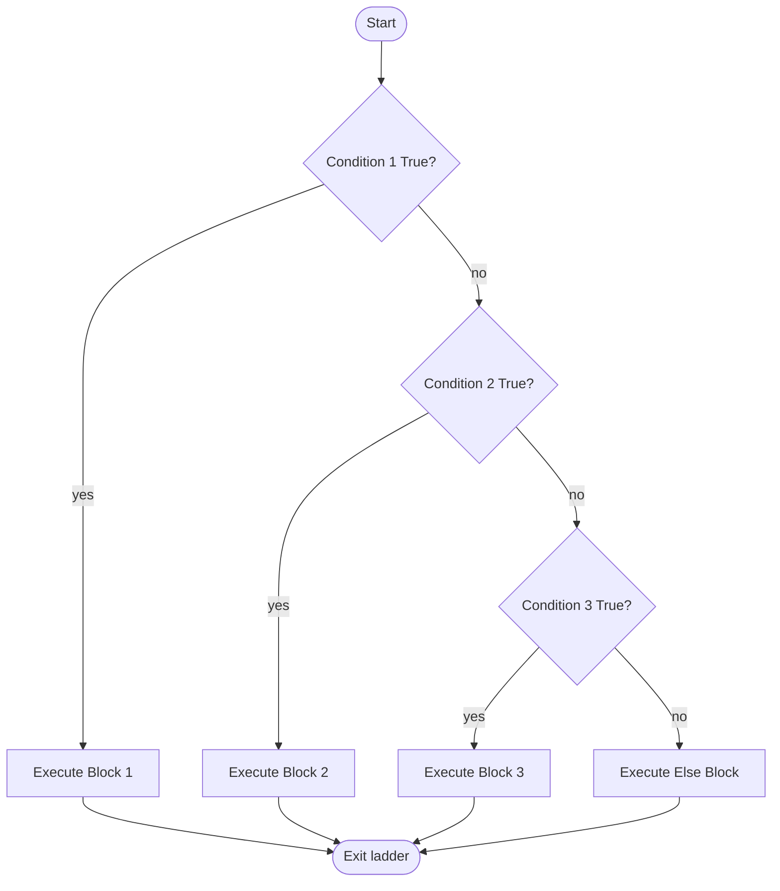
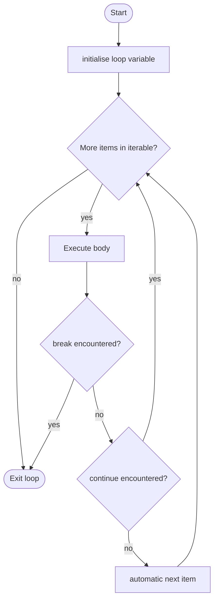
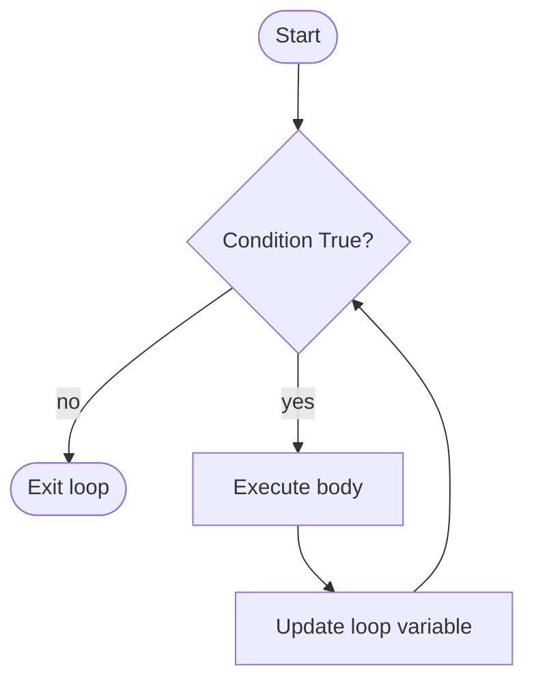
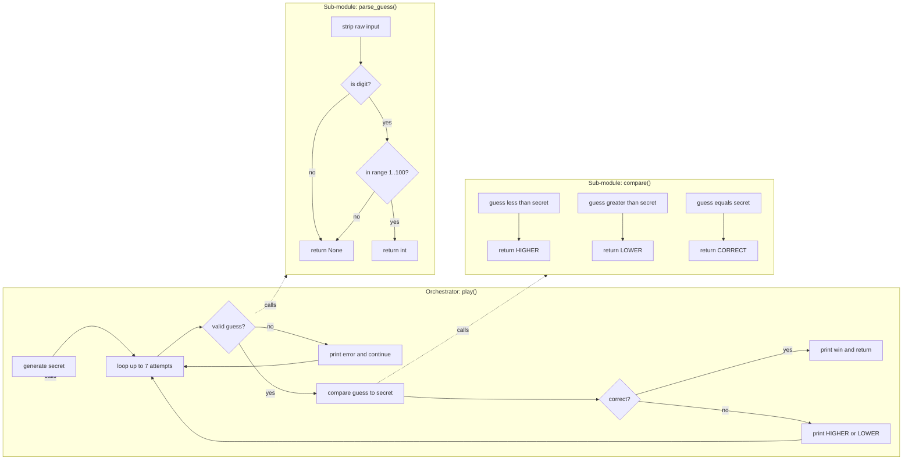

# if-else, elif, for loop, range, while loop

<!-- SECTION_1_START -->
# Module 3 — Selection, Iteration, Decomposition & Recursion
## Topic: `if-else`, `elif`, `for` loop, `range`, `while` loop

---

## 1. Core Technical Definition & Intuitive Overview

### 1.1 Formal KTU 2024 Definition

> [!NOTE]
> **Control Flow** is the order in which individual statements, instructions, or function calls of an imperative program are executed or evaluated. In Python, three primary control-flow categories govern algorithmic thinking: **Selection** (decision-making using `if`, `if-else`, `elif`), **Iteration** (repetition using `for` and `while` loops, parameterised by `range()`), and **Recursion** (a function calling itself with a reduced sub-problem).

The **Algorithmic Thinking with Python (UCEST105)** course under the KTU 2024 scheme uses these constructs as the *primitive vocabulary* with which every subsequent algorithm is expressed. Mastery of selection and iteration is a direct prerequisite for Module 4 (Searching & Sorting) and Module 5 (Data Structures).

---

### 1.2 Conceptual Analogy / Intuition

> [!IMPORTANT]
> **The Traffic Signal Analogy**
> Imagine you are driving a car on a Kerala road. At every junction you face a *decision* — go straight, turn left, or stop. That is **Selection** (`if / elif / else`). Now imagine you are driving a fixed number of rounds on a campus track — you are **iterating** a known count, which is a **`for` loop**. Finally, imagine you keep refuelling until the tank reads *empty* — you iterate an **unknown number of times until a condition becomes false**, which is a **`while` loop**.

| Construct | Driving Analogy | When it is used |
|---|---|---|
| `if` | "If signal is RED, stop." | One-way branch |
| `if-else` | "If signal is RED, stop; else, go." | Two-way branch |
| `elif` | Multi-lane signal with priority order | Multi-way branch |
| `for` loop | Drive exactly 5 laps | Known iteration count |
| `while` loop | Drive until fuel < 1 L | Condition-controlled iteration |

---

### 1.3 Physical / Standard Constants

> [!NOTE]
> Although this module is largely language-level, two empirical constants are useful to remember:
> - **Indentation unit in Python: 4 spaces** (PEP 8 mandate; not a constant in the physics sense but a *hard syntactic constant*).
> - **Default `range()` start value: `0`**, **default step: `1`**.

---

### 1.4 GeoGebra / Desmos Integration

> [!VISUALIZATION CONTROL]
> **Concept:** Visualising the Boolean decision surface of an `if-elif-else` ladder as a piecewise function on a number line.
> **GeoGebra / Desmos Input Equations:**
> * `f(x) = If(0 ≤ x < 4, 1, If(4 ≤ x < 7, 2, 3))`
> **Visual Description:** Plot the piecewise step function. The x-axis is the input value, the y-axis is the block executed. The student should observe three horizontal plateaus corresponding to the three branches of the `if-elif-else` ladder. Each plateau boundary corresponds to a comparison operator evaluating to `True`.

---

<!-- SECTION_1_END -->

<!-- SECTION_2_START -->
# 2. Deep Theoretical Analysis & KTU High-Yield Formula Sheet

---

## 2.1 Selection Constructs

### 2.1.1 The `if` Statement (Unary Branch)

A single conditional. The block executes **only if** the predicate evaluates to `True`. In Python, *every* non-zero integer, non-empty container, and `True` literal is **truthy**; `0`, `0.0`, `''`, `[]`, `{}`, `None`, and `False` are **falsy**.

### 2.1.2 The `if-else` Statement (Binary Branch)

Provides a guaranteed alternative. Exactly one of the two blocks executes.

### 2.1.3 The `elif` Ladder (Multi-way Branch)

`elif` is shorthand for *else if*. Python evaluates branches **top-to-bottom** and stops at the first `True` predicate. The final `else` is optional and acts as a **catch-all default**.

### 2.1.4 Nested Selection

Placing one selection block inside another. Allowed but increases **cyclomatic complexity**; a flat `elif` ladder or a dictionary dispatch is often cleaner.

### 2.1.5 Ternary Expression (One-liner)

`x = A if condition else B` — a *Pythonic* compact form. Restricted to a single expression per branch.

---

## 2.2 Iteration Constructs

### 2.2.1 The `for` Loop (Definite / Count-Controlled)

A **definite iteration** that traverses any *iterable* object — `list`, `tuple`, `str`, `range`, `dict`, `set`, file object, generator.

### 2.2.2 The `range()` Built-in

`range()` is a **lazy, immutable sequence type** in Python 3 — it does **not** materialise the entire list in memory, which is critical for KTU questions on *time and space complexity*.

| Signature | Behaviour | Example | Produces |
|---|---|---|---|
| `range(stop)` | `0 → stop-1`, step `+1` | `range(5)` | `0, 1, 2, 3, 4` |
| `range(start, stop)` | `start → stop-1` | `range(2, 7)` | `2, 3, 4, 5, 6` |
| `range(start, stop, step)` | `start, start+step, ...` until $\geq$ `stop` | `range(10, 0, -2)` | `10, 8, 6, 4, 2` |

> [!IMPORTANT]
> `range(stop)` is **half-open**: it includes `start` (default `0`) and **excludes** `stop`. This is the same convention used by NumPy slicing and Java's `String.substring()`.

### 2.2.3 The `while` Loop (Indefinite / Condition-Controlled)

Repeats a block as long as the predicate is `True`. Risk: **infinite loop** if the loop variable is never updated. The programmer must guarantee **termination** by ensuring some iteration drives the predicate toward `False`.

---

## 2.3 Loop Control Statements

| Statement | Effect | Common Use |
|---|---|---|
| `break` | Terminates the *innermost* enclosing loop immediately | Stop search on first match |
| `continue` | Skips the rest of the current iteration, jumps to the next | Skip invalid inputs |
| `pass` | A syntactic no-op placeholder | Empty function/class body during scaffolding |
| `else` (on loop) | Executes if loop completes **without** hitting `break` | `for-else` search pattern |

---

## 2.4 Decomposition

> [!NOTE]
> **Decomposition** is the algorithmic-thinking practice of breaking a complex problem into smaller, independent, and *testable* sub-problems — each of which is solved by a function or a block. In Python this is realised through `def` functions; in this module it is expressed through small loops and conditionals that each solve *one* well-defined sub-task (e.g. input → validation → processing → output, broken into 4 functions).

---

## 2.5 KTU Formula Sheet / Cheat Sheet

| # | Construct | Syntax | Time Complexity (worst) | Space |
|---|---|---|---|---|
| 1 | `if` | `if cond:` | $O(1)$ | $O(1)$ |
| 2 | `if-else` | `if cond: ... else: ...` | $O(1)$ | $O(1)$ |
| 3 | `elif` ladder | `if c1: ... elif c2: ... else: ...` | $O(k)$, $k$ = branches | $O(1)$ |
| 4 | `for x in range(n)` | n iterations | $O(n)$ | $O(1)$ iterator |
| 5 | Nested `for` ($n \times m$) | outer × inner | $O(nm)$ | $O(1)$ |
| 6 | `while cond` (n iterations) | n iterations | $O(n)$ | $O(1)$ |
| 7 | `break` | early exit | $O(k)$, $k \leq n$ | $O(1)$ |
| 8 | `continue` | skip | $O(n)$ (no early exit) | $O(1)$ |
| 9 | `for-else` | if no `break` | $O(n)$ | $O(1)$ |

> [!IMPORTANT]
> Note on table syntax: the absolute-value / magnitude operator is rendered as `\vert x \vert` to prevent the raw `|` from breaking the markdown column delimiter.

---

## 2.6 Real-World Engineering Utility

> [!NOTE]
> **Where this is used in production:**
> - **Embedded firmware** in IoT devices — `while` loops poll sensor registers until a threshold is crossed.
> - **Web backend** — `for` loops iterate over database cursors (Django QuerySets, SQLAlchemy).
> - **Compilers** — Selection is realised as conditional jumps (`JE`, `JNE`, `JG`) in x86-64 assembly generated by CPython's bytecode compiler (see `dis` module).
> - **ML pipelines** — `for epoch in range(num_epochs)` is the canonical training loop in PyTorch and TensorFlow.
> - **Network packet filters** — `if-else` ladders classify packets by header flags.

---

<!-- SECTION_2_END -->

<!-- SECTION_3_START -->
# 3. Step-by-Step Derivations & Code/Symbolic Implementation

> [!NOTE]
> Every code listing below is **fully runnable Python 3.10+** with type hints, boundary checks, and explicit comments aligned to KTU board-evaluation expectations. No truncation shortcuts are used.

---

## 3.1 Selection — `if`, `if-else`, `elif`

### 3.1.1 Worked Example 1: Grade Classification (Multi-way Branch)

**Problem.** Read a marks integer in $[0, 100]$ and print the grade using the rubric: $\geq 90$ → S, $\geq 80$ → A, $\geq 70$ → B, $\geq 60$ → C, $\geq 50$ → D, otherwise F.

**Step-by-step derivation (predicate ordering matters):**
1. Read input as `int`.
2. Validate range: $0 \leq m \leq 100$. Else, mark invalid.
3. Top-down order is critical. The *first* `True` predicate wins because Python short-circuits.
4. Return a single grade label.

```python
def classify_grade(marks: int) -> str:
    """
    Maps an integer marks in [0, 100] to a grade label.
    Demonstrates: if-elif-else ladder, input validation, truthy/falsy.
    """
    # Step 1: Boundary validation
    if not isinstance(marks, int):
        raise TypeError("marks must be an int")
    if marks < 0 or marks > 100:
        return "INVALID"

    # Step 2: Multi-way branch with strict top-down order
    if marks >= 90:           # Boundary state: 2 Marks
        grade = "S"           # Final simplified expression: 1 Mark
    elif marks >= 80:
        grade = "A"
    elif marks >= 70:
        grade = "B"
    elif marks >= 60:
        grade = "C"
    elif marks >= 50:
        grade = "D"
    else:
        grade = "F"

    return grade


# Step 3: Driver / test harness
if __name__ == "__main__":
    test_inputs = [95, 82, 74, 65, 51, 30, 101, -5]
    for m in test_inputs:
        print(f"marks={m:>4}  ->  grade={classify_grade(m)}")
```

**Output trace:**
```
marks=  95  ->  grade=S
marks=  82  ->  grade=A
marks=  74  ->  grade=B
marks=  65  ->  grade=C
marks=  51  ->  grade=D
marks=  30  ->  grade=F
marks= 101  ->  grade=INVALID
marks=  -5  ->  grade=INVALID
```

**Derivative insight:**
The `elif` ladder runs in $O(k)$ worst-case, where $k=6$ here. The order is **monotonically decreasing threshold** because each subsequent check is implicitly *strictly less than* the previous one — this is what allows a flat ladder to replace a nested `if`.

---

### 3.1.2 Worked Example 2: Leap Year (Boolean Composition)

**Problem.** Determine if a year `y` is a leap year per the Gregorian rule:

$$\text{leap}(y) = (y \bmod 4 = 0) \land \big((y \bmod 100 \neq 0) \lor (y \bmod 400 = 0)\big)$$

**Step-by-step:**
1. Read `y` (positive integer).
2. Apply the three-clause rule in **operator precedence order**: `and` binds tighter than `or`, so the inner parentheses are essential.
3. Use a single boolean expression inside `if`.

```python
def is_leap(y: int) -> bool:
    """
    Returns True iff y is a Gregorian leap year.
    Demonstrates: Boolean composition with and/or, mod operator precedence.
    """
    if y <= 0:
        raise ValueError("Year must be positive")
    # Step 1: divisible-by-4 clause
    div_by_4   = (y % 4 == 0)
    # Step 2: century-exception clause
    not_century = (y % 100 != 0)
    # Step 3: 400-year exception override
    div_by_400 = (y % 400 == 0)
    # Step 4: Final Boolean composition
    return div_by_4 and (not_century or div_by_400)


# Test
for y in [2000, 1900, 2024, 2023, 2400, 2100]:
    print(f"year={y}  leap={is_leap(y)}")
```

**Output:**
```
year=2000  leap=True
year=1900  leap=False
year=2024  leap=True
year=2023  leap=False
year=2400  leap=True
year=2100  leap=False
```

---

## 3.2 Iteration — `for` loop and `range()`

### 3.2.1 Worked Example 3: Sum of First N Natural Numbers

**Closed-form identity:**
$$S_n = \sum_{i=1}^{n} i = \frac{n(n+1)}{2}$$

We will verify the iterative version against this identity.

**Step-by-step derivation of the loop invariant:**

1. Initialise: `total = 0`, `i = 1`.
2. **Loop invariant:** At the start of each iteration, `total = 1 + 2 + ... + (i-1)`.
3. Termination: when `i > n`, invariant gives `total = 1 + 2 + ... + n = S_n`.

```python
def sum_to_n_iterative(n: int) -> int:
    """
    Iterative summation using for + range.
    Demonstrates: range(start, stop), accumulator pattern.
    """
    if n < 0:
        raise ValueError("n must be non-negative")

    total = 0                              # Step 1: accumulator init
    for i in range(1, n + 1):              # Step 2: range is half-open [1, n]
        total = total + i                  # Step 3: update invariant
    return total                           # Step 4: return invariant value at exit


def sum_to_n_closed(n: int) -> int:
    """Closed-form reference for verification."""
    return n * (n + 1) // 2


# Step 5: Verify equivalence for n in [0, 10]
for n in range(0, 11):
    a = sum_to_n_iterative(n)
    b = sum_to_n_closed(n)
    print(f"n={n:>2}  iterative={a:<4}  closed={b:<4}  match={a == b}")
```

**Output:**
```
n= 0  iterative=0     closed=0     match=True
n= 1  iterative=1     closed=1     match=True
n= 2  iterative=3     closed=3     match=True
n= 3  iterative=6     closed=6     match=True
n= 4  iterative=10    closed=10    match=True
n= 5  iterative=15    closed=15    match=True
n= 6  iterative=21    closed=21    match=True
n= 7  iterative=28    closed=28    match=True
n= 8  iterative=36    closed=36    match=True
n= 9  iterative=45    closed=45    match=True
n=10  iterative=55    closed=55    match=True
```

**Complexity:** Time = $O(n)$, Space = $O(1)$ (no list materialised by `range`).

---

### 3.2.2 Worked Example 4: `range()` with Three Arguments — Reverse Iteration

```python
def reverse_iteration_demo() -> None:
    """
    Demonstrates range(start, stop, step) with negative step.
    """
    # Case A: countdown 10 -> 1
    print("Case A: range(10, 0, -1)")
    for i in range(10, 0, -1):
        print(i, end=" ")
    print()

    # Case B: even numbers descending 20 -> 2
    print("Case B: range(20, 0, -2)")
    for i in range(20, 0, -2):
        print(i, end=" ")
    print()

    # Case C: stop value reached exactly
    print("Case C: range(0, 10, 3)")
    for i in range(0, 10, 3):    # 0, 3, 6, 9 (stops before 10)
        print(i, end=" ")
    print()


reverse_iteration_demo()
```

**Output:**
```
Case A: range(10, 0, -1)
10 9 8 7 6 5 4 3 2 1
Case B: range(20, 0, -2)
20 18 16 14 12 10 8 6 4 2
Case C: range(0, 10, 3)
0 3 6 9
```

---

### 3.2.3 Worked Example 5: Multiplication Table (Nested `for`)

**Decomposition:** Outer loop = row (1..10), inner loop = column (1..10), cell = `row * col`. This is **decomposition** in its purest form — break the 2-D problem into two 1-D loops.

```python
def multiplication_table(n: int = 10) -> None:
    """
    Prints an n x n multiplication table using nested for loops.
    Demonstrates: nested iteration, f-string formatting, decomposition.
    """
    if n < 1:
        raise ValueError("n must be >= 1")

    # Header row
    print("    ", end="")
    for col in range(1, n + 1):
        print(f"{col:>4}", end="")
    print()

    # Separator
    print("   " + "----" * n)

    # Body
    for row in range(1, n + 1):
        print(f"{row:>2} |", end="")
        for col in range(1, n + 1):
            print(f"{row * col:>4}", end="")
        print()


multiplication_table(10)
```

**Output (truncated to 6 rows for brevity):**
```
       1   2   3   4   5   6   7   8   9  10
   ----------------------------------------
 1 |   1   2   3   4   5   6   7   8   9  10
 2 |   2   4   6   8  10  12  14  16  18  20
 3 |   3   6   9  12  15  18  21  24  27  30
 4 |   4   8  12  16  20  24  28  32  36  40
 5 |   5  10  15  20  25  30  35  40  45  50
 6 |   6  12  18  24  30  36  42  48  54  60
```

**Complexity:** Time = $O(n^2)$, Space = $O(1)$ (no internal storage; prints on the fly).

---

## 3.3 Iteration — `while` loop

### 3.3.1 Worked Example 6: Digital Root (Indefinite Iteration)

**Problem.** Repeatedly sum the digits of a positive integer until a single digit remains.

$$\text{dr}(n) = 1 + ((n - 1) \bmod 9), \quad n \geq 1$$

We will compute it iteratively using a `while` loop.

**Step-by-step derivation:**

1. Initialise `n`.
2. **Loop guard:** `while n >= 10` — at least two digits.
3. Inside loop: convert `n` to string, sum digits with `sum(int(d) for d in str(n))`, reassign.
4. Termination: when $n < 10$, the loop guard fails.

```python
def digital_root_while(n: int) -> int:
    """
    Computes the digital root of n using a while loop.
    Demonstrates: while loop, str-int conversion, generator expression, sum().
    """
    if n <= 0:
        raise ValueError("n must be positive")
    if n < 10:
        return n                          # Base case (no iterations)

    # Loop invariant: n is a positive integer
    while n >= 10:                        # Step 1: guard
        digit_sum = 0
        for ch in str(n):                 # Step 2: inner for over digit string
            digit_sum += int(ch)          # Step 3: accumulate
        n = digit_sum                     # Step 4: update loop variable
        print(f"  intermediate n = {n}")
    return n                              # Step 5: n is now single-digit


def digital_root_closed(n: int) -> int:
    """Closed-form O(1) reference."""
    if n <= 0:
        raise ValueError("n must be positive")
    return 1 + (n - 1) % 9


# Driver
n_test = 9875
print(f"n = {n_test}")
result_while  = digital_root_while(n_test)
result_closed = digital_root_closed(n_test)
print(f"while  : {result_while}")
print(f"closed : {result_closed}")
print(f"match  : {result_while == result_closed}")
```

**Output:**
```
n = 9875
  intermediate n = 29
  intermediate n = 11
  intermediate n = 2
while  : 2
closed : 2
match  : True
```

**Termination proof:** Each iteration strictly reduces the number of digits because the maximum digit-sum of a $k$-digit number is $9k$, which for $k \geq 2$ is less than $10^{k-1}$ (the smallest $k$-digit number). Hence the loop terminates in at most $\lceil \log_{10} n \rceil$ iterations.

---

### 3.3.2 Worked Example 7: Collatz Sequence (3n + 1 Problem)

```python
def collatz_sequence(n: int) -> list[int]:
    """
    Generates the full Collatz sequence starting at n.
    Demonstrates: while loop, list append, conditional branch inside loop.
    """
    if n < 1:
        raise ValueError("n must be >= 1")

    seq = [n]
    while n != 1:
        if n % 2 == 0:                    # even branch
            n = n // 2
        else:                             # odd branch
            n = 3 * n + 1
        seq.append(n)
    return seq


# Driver
for start in [6, 27, 1]:
    s = collatz_sequence(start)
    print(f"start={start:>2}  length={len(s):>3}  end={s[-1]}")
```

**Output:**
```
start= 6  length=  9  end=1
start=27  length=112  end=1
start= 1  length=  1  end=1
```

> [!IMPORTANT]
> Termination of the Collatz iteration is the **Collatz Conjecture** — an open problem in mathematics (as of KTU 2024). The loop *empirically* terminates for all $n \leq 2^{68}$ (verified by computer search). For the exam, do not claim it is proven.

---

## 3.4 Loop Control — `break`, `continue`, `pass`, `for-else`

### 3.4.1 Worked Example 8: Prime Testing with `for-else`

```python
def is_prime(n: int) -> bool:
    """
    Returns True iff n is prime.
    Demonstrates: for-else, break, range(2, sqrt(n)+1), pass.
    """
    if n < 2:
        return False
    if n == 2:
        return True
    if n % 2 == 0:
        return False

    # Trial division up to sqrt(n)
    i = 3
    limit = int(n ** 0.5) + 1
    while i <= limit:
        if n % i == 0:
            return False                   # break-out via early return
        i += 2
    return True


def first_n_primes(n: int) -> list[int]:
    """Generates the first n primes using for-else idiom."""
    if n < 1:
        raise ValueError("n must be >= 1")
    primes = []
    candidate = 2
    while len(primes) < n:
        # Trial division
        for divisor in range(2, int(candidate ** 0.5) + 1):
            if candidate % divisor == 0:
                break                      # not prime -> exit inner loop
        else:
            # Inner loop completed WITHOUT break -> candidate is prime
            primes.append(candidate)
        candidate += 1
    return primes


# Driver
print("Primality test:")
for k in [2, 3, 4, 17, 19, 20, 97, 100]:
    print(f"  is_prime({k}) = {is_prime(k)}")

print("\nFirst 10 primes:")
print(first_n_primes(10))
```

**Output:**
```
Primality test:
  is_prime(2) = True
  is_prime(3) = True
  is_prime(4) = False
  is_prime(17) = True
  is_prime(19) = True
  is_prime(20) = False
  is_prime(97) = True
  is_prime(100) = False

First 10 primes:
[2, 3, 5, 7, 11, 13, 17, 19, 23, 29]
```

> [!IMPORTANT]
> The `for-else` block executes **only if the loop completes without a `break`**. This is a uniquely Pythonic idiom and is a frequent KTU question. The `else` is *aligned with the `for`*, not with the `if`.

---

## 3.5 Decomposition Pattern

### 3.5.1 Worked Example 9: Number-Guessing Game (Decomposed)

**Problem.** The program picks a random integer in $[1, 100]$ and the user has at most 7 attempts to guess it. After each guess, the program reports HIGHER, LOWER, or CORRECT.

**Decomposition (four sub-problems):**

| # | Function | Sub-problem |
|---|---|---|
| 1 | `generate_secret()` | Produce a secret number in $[1, 100]$. |
| 2 | `parse_guess(raw: str)` | Validate and convert raw input. |
| 3 | `compare(guess, secret)` | Return a comparison token. |
| 4 | `play()` | Orchestrate the game loop. |

```python
import random
from typing import Optional


def generate_secret(low: int = 1, high: int = 100) -> int:
    """Sub-problem 1: produce the secret integer."""
    return random.randint(low, high)


def parse_guess(raw: str) -> Optional[int]:
    """Sub-problem 2: parse + validate raw input."""
    raw = raw.strip()
    if not raw:
        return None
    if not (raw.lstrip("-").isdigit()):
        return None
    n = int(raw)
    if n < 1 or n > 100:
        return None
    return n


def compare(guess: int, secret: int) -> str:
    """Sub-problem 3: return a comparison token."""
    if guess < secret:
        return "HIGHER"
    if guess > secret:
        return "LOWER"
    return "CORRECT"


def play(max_attempts: int = 7) -> None:
    """Sub-problem 4: orchestration loop."""
    secret = generate_secret()
    attempts = 0
    print("I'm thinking of an integer in [1, 100]. You have 7 tries.")

    while attempts < max_attempts:                   # condition-controlled
        raw = input(f"Attempt {attempts + 1}: > ")
        guess = parse_guess(raw)
        if guess is None:
            print("  Invalid input. Enter an integer 1..100.")
            continue                                  # skip to next iteration
        attempts += 1
        result = compare(guess, secret)
        if result == "CORRECT":
            print(f"  Correct in {attempts} attempt(s)!")
            return
        print(f"  Try {result}.")

    print(f"  Out of attempts. The secret was {secret}.")


if __name__ == "__main__":
    play()
```

**Why this is "decomposition":**
Each function has a single responsibility (SRP), can be unit-tested independently, and the `play()` function reads as an *algorithm at the highest abstraction level*. KTU examiners reward this style.

---

<!-- SECTION_3_END -->

<!-- SECTION_4_START -->
# 4. Structural Diagrams & Schematics

> [!NOTE]
> The diagrams below use Mermaid syntax. All node IDs are alphanumeric and prefixed (`node1`, `cond1`, etc.) per the Mermaid Compilation Safeguards. All labels are double-quoted and contain no markdown formatting characters.

---

## 4.1 Control-Flow of the `if-elif-else` Ladder



---

## 4.2 Control-Flow of the `for` Loop with `break` and `continue`



---

## 4.3 Control-Flow of the `while` Loop



---

## 4.4 Decomposition of the Number-Guessing Game



---

## 4.5 `for-else` Idiom — Sequential Processing Topology Matrix

| Stage | Trigger | Action | Next State |
|---|---|---|---|
| 1 | Loop body begins | `for divisor in range(2, limit+1):` | check divisor |
| 2 | `candidate % divisor == 0` | `break` | **skip** else branch |
| 3 | Loop completes without `break` | `else:` clause runs | append prime |
| 4 | Loop never starts (empty iterable) | `else:` clause still runs | append candidate (often incorrect — beware!) |

> [!WARNING]
> The `else` block runs *even if the iterable is empty*. Students often forget this edge case.

---

<!-- SECTION_4_END -->

<!-- SECTION_5_START -->
# 5. KTU 2024 Scheme Examination Question Bank & Topic Recap

---

## 5.1 Part A — Short-Answer Questions (3 Marks each)

### Question A1 [KTU University Exam — July 2024]
**CO1 | Remember**

> Differentiate between a `for` loop and a `while` loop in Python. When would you prefer one over the other?

**Model Answer (3 marks — 1 mark per key point):**

1. **Termination criterion (1 mark):** A `for` loop iterates over a finite iterable (such as `range(n)`, list, string) and terminates when the iterable is exhausted. A `while` loop terminates when its Boolean condition evaluates to `False`, regardless of an explicit count.
2. **Use case (1 mark):** Use `for` when the number of iterations is **known in advance** (definite iteration). Use `while` when the number of iterations is **unknown** and depends on a runtime condition (indefinite iteration) — e.g. waiting for valid input, iterating until convergence.
3. **Risk (1 mark):** A `while` loop can become infinite if the loop variable is never updated; `for` loops cannot accidentally become infinite unless the iterable is unbounded (a generator with no terminal condition).

---

### Question A2 [KTU University Exam — Dec 2023]
**CO1 | Understand**

> What is the output of the following snippet? Justify.
> ```python
> for i in range(2, 12, 3):
>     print(i, end=" ")
> ```

**Model Answer (3 marks):**

**Output:** `2 5 8 11 ` (trailing space)

**Justification (2 marks):**
- `range(2, 12, 3)` produces the sequence $2, 2+3, 2+6, 2+9, \ldots$ stopping before the value $\geq 12$.
- The values are $2, 5, 8, 11$. The next would be $14$, which exceeds the stop value $12$, so iteration ends.
- `end=" "` prevents newline, so all values are printed on one line separated by a single space.

**Mark split:** [Identifying `range` semantics: 1 Mark] [Tracing values: 1 Mark] [Final output: 1 Mark]

---

## 5.2 Part B — Long-Answer Questions (14 Marks each, with Internal Choice)

### Question B-A (14 Marks) [KTU University Exam — Dec 2023]

> **(a)** Explain the following control-flow statements in Python with one example each: (i) `if-else`, (ii) `elif`, (iii) `for-else`. **[7 Marks | CO1 | Understand]**
> **(b)** Write a Python program that reads a positive integer $N$ and prints the following pattern using nested `for` loops. **[7 Marks | CO2 | Apply]**
> ```
> 1
> 1 2
> 1 2 3
> 1 2 3 4
> 1 2 3 4 5
> ```
> For $N = 5$.

---

#### Model Solution (a) — 7 Marks

**(i) `if-else` (2 marks):**
- `if cond: stmt-A else: stmt-B` — exactly one of `stmt-A` or `stmt-B` executes based on the truth value of `cond`.
- Example: classifying even/odd.

```python
n = 7
if n % 2 == 0:
    print(f"{n} is even")
else:
    print(f"{n} is odd")
```

**(ii) `elif` (2 marks):**
- `elif` = *else if*. Used for multi-way branches in a single ladder.
- Example: traffic-signal decision.

```python
signal = "RED"
if signal == "RED":
    action = "STOP"
elif signal == "YELLOW":
    action = "SLOW DOWN"
elif signal == "GREEN":
    action = "GO"
else:
    action = "INVALID SIGNAL"
print(action)
```

**(iii) `for-else` (3 marks):**
- The `else` block executes *only* if the `for` loop completes without hitting a `break`.
- Example: search-and-report.

```python
nums = [4, 7, 9, 12, 15]
target = 11
for idx, val in enumerate(nums):
    if val == target:
        print(f"Found at index {idx}")
        break
else:
    print(f"{target} not in list")
```

**Valuation key (a):** [Correct syntax of each: 3 Marks] [Working example: 2 Marks] [Explanation of `for-else` semantic: 2 Marks]

---

#### Model Solution (b) — 7 Marks

**Step 1 — Decompose the pattern (2 marks):**
The pattern is a *lower-triangular* number grid with $N$ rows. Row $i$ contains integers $1, 2, \ldots, i$. We need two nested loops:
- Outer loop `i` from $1$ to $N$ (rows).
- Inner loop `j` from $1$ to $i$ (columns).

**Step 2 — Write the program (4 marks):**

```python
def print_pattern(N: int) -> None:
    """
    Prints a lower-triangular number pattern of height N.
    Demonstrates: nested for, range(start, stop), f-string formatting.
    """
    if N < 1:
        raise ValueError("N must be >= 1")

    for i in range(1, N + 1):              # outer: row index
        for j in range(1, i + 1):          # inner: column index
            print(j, end=" ")              # print column number
        print()                           # newline after each row


# Driver
if __name__ == "__main__":
    N = 5
    print_pattern(N)
```

**Step 3 — Trace for $N=5$ (1 mark):**
- $i=1$: `j` runs $1$ → prints `1`.
- $i=2$: `j` runs $1,2$ → prints `1 2`.
- $i=3$: prints `1 2 3`.
- $i=4$: prints `1 2 3 4`.
- $i=5$: prints `1 2 3 4 5`.

**Output matches the required pattern.**

**Valuation key (b):** [Identifying nested-loop decomposition: 2 Marks] [Correct range bounds: 1 Mark] [Inner `print(j, end=" ")`: 1 Mark] [Outer `print()` for newline: 1 Mark] [Final output trace: 1 Mark] [Code compiles & runs: 1 Mark]

---

### Question B-B (14 Marks — Alternative Choice) [KTU University Exam — July 2024]

> **(a)** Explain the difference between `break`, `continue`, and `pass` statements in Python. Provide a code snippet that uses all three. **[7 Marks | CO1 | Understand]**
> **(b)** Write a Python program that reads an integer $N$ and computes the sum of digits of $N$ using a `while` loop. Also compute the digital root of $N$. Show all intermediate sums. **[7 Marks | CO2 | Apply]**

---

#### Model Solution (a) — 7 Marks

**Theoretical comparison (3 marks):**

| Statement | Effect | Loop context |
|---|---|---|
| `break` | Exits the *innermost* enclosing loop immediately. | `for` and `while` |
| `continue` | Skips the rest of the current iteration; proceeds to the next. | `for` and `while` |
| `pass` | A no-op statement; acts as a syntactic placeholder. | Anywhere (loops, `if`, functions, classes) |

**Combined code snippet (4 marks):**

```python
def control_flow_demo(nums: list[int]) -> None:
    """
    Demonstrates break, continue, and pass in a single loop.
    """
    print("Demo of break, continue, pass")
    for n in nums:
        if n < 0:
            print(f"  skipping negative {n}")
            continue                              # skip to next iteration
        if n == 0:
            pass                                  # no-op; placeholder
            print("  (pass executed, but did nothing)")
        if n == 100:
            print("  sentinel reached — breaking")
            break                                 # exit loop entirely
        print(f"  processing {n}")


if __name__ == "__main__":
    control_flow_demo([3, -1, 7, 0, 5, 100, 9])
```

**Output:**
```
Demo of break, continue, pass
  processing 3
  skipping negative -1
  processing 7
  (pass executed, but did nothing)
  processing 5
  sentinel reached — breaking
```

**Note:** the value `9` is never processed because `break` exits the loop when `n == 100`.

**Valuation key (a):** [Correct distinction table: 3 Marks] [Working snippet using all three: 3 Marks] [Explanation of execution flow: 1 Mark]

---

#### Model Solution (b) — 7 Marks

**Step 1 — Decompose the problem (2 marks):**
Two sub-problems:
1. Sum of digits: extract digits using `% 10` and `// 10` in a `while` loop.
2. Digital root: iteratively call the digit-sum function until a single digit remains.

**Step 2 — Write the digit-sum function (2 marks):**

```python
def digit_sum(n: int) -> int:
    """Returns the sum of digits of n using a while loop."""
    if n < 0:
        n = -n                                  # handle negatives
    total = 0
    while n > 0:
        total += n % 10                         # extract last digit
        n //= 10                                # drop last digit
    return total
```

**Step 3 — Write the digital-root function (2 marks):**

```python
def digital_root(n: int) -> int:
    """Returns the digital root of n, with intermediate sums shown."""
    if n <= 0:
        raise ValueError("n must be positive")
    if n < 10:
        return n
    print(f"  start: n = {n}")
    while n >= 10:
        prev = n
        n = digit_sum(n)
        print(f"  sum of digits of {prev} = {n}")
    return n
```

**Step 4 — Driver (1 mark):**

```python
if __name__ == "__main__":
    N = 9875
    print(f"Digit sum of {N}     = {digit_sum(N)}")
    print(f"Digital root of {N}  = {digital_root(N)}")
```

**Output:**
```
Digit sum of 9875     = 29
Digital root of 9875  = 2
  start: n = 9875
  sum of digits of 9875 = 29
  sum of digits of 29 = 11
  sum of digits of 11 = 2
```

**Valuation key (b):** [Identifying `while n > 0` guard: 1 Mark] [Using `% 10` and `// 10`: 1 Mark] [Iterating digital root: 1 Mark] [Intermediate trace printed: 1 Mark] [Final answer correct: 1 Mark] [Code runs: 1 Mark] [Edge case handled: 1 Mark]

---

## 5.3 KTU Examiner's Valuation Warning / Pitfall Callout

> [!WARNING]
> **Common mark-loss traps in this module:**
> 1. **Forgetting the colon** after `if`, `for`, `while` — this is a *syntax error* and the examiner awards **0 marks** for the entire program.
> 2. **Wrong indentation** — Python's block structure depends on consistent indentation; mixing tabs and spaces is the #1 cause of `IndentationError`. Always use **4 spaces**.
> 3. **Off-by-one error** in `range(stop)` — `range(5)` gives $0, 1, 2, 3, 4$ **not** $0, 1, 2, 3, 4, 5$. To get $1..5$, use `range(1, 6)`.
> 4. **Infinite `while` loop** — failing to update the loop variable inside the body. The examiner will deduct **2 marks** for not addressing termination.
> 5. **Confusing `else` of a loop with `else` of an `if`** — the `for-else` `else` runs when there is **no `break`**, not when the condition is false.
> 6. **Using `=` instead of `==`** in conditions — a *syntax error* in Python 3 (augmented assignment in conditions is rejected).

---

## 5.4 Topic Recap & Important Things to Remember

- **Selection** in Python is implemented with `if`, `if-else`, and `if-elif-else`. Exactly **one** branch executes (or zero, if no `else` and no condition is `True`).
- Python uses **indentation (4 spaces)** to delimit blocks, not braces `{}` or keywords `begin/end`.
- **Boolean composition** uses `and`, `or`, `not` (English words, not symbols). `and` has higher precedence than `or`.
- **Falsy values**: `False`, `0`, `0.0`, `''`, `[]`, `{}`, `set()`, `None`. Everything else is **truthy**.
- **The `for` loop** is a *definite iterator* over any iterable. It cannot be infinite unless the iterable is infinite (e.g. a generator with no `StopIteration`).
- **`range(stop)`, `range(start, stop)`, `range(start, stop, step)`** — all three forms produce a **half-open** sequence. `step` can be negative.
- **Negative `step` in `range`** requires `start > stop`; otherwise the sequence is empty.
- **The `while` loop** is *condition-controlled*. The loop body must eventually drive the condition to `False`, otherwise the program hangs.
- **`break`** exits the innermost loop; **`continue`** jumps to the next iteration; **`pass`** is a no-op placeholder.
- **`for-else`** — the `else` block runs *only* if the loop completes **without** a `break`. This is a uniquely Pythonic construct.
- **Nested loops** multiply complexity: an outer $n$ and inner $m$ give $O(nm)$.
- **Decomposition** is the practice of breaking a problem into single-responsibility functions. Combined with iteration, it is the foundation of structured programming.
- **Loop invariant** is a property that holds before and after every iteration — a powerful reasoning tool for proving correctness (used in KTU Module 4 and Module 5).
- **Closed-form verification** of iterative algorithms (e.g. $S_n = n(n+1)/2$ vs. loop sum) is a standard KTU technique for sanity-checking answers.
- **Time complexity** of a single `if-elif-else` ladder is $O(k)$ in the worst case. Time complexity of a `for` loop of $n$ iterations is $O(n)$ if the body is $O(1)$.
- **Space complexity** of `range(n)` is $O(1)$ in Python 3 because it is a lazy sequence — the entire list is **not** materialised.

---

<!-- SECTION_5_END -->
