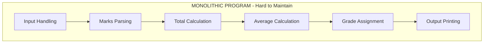
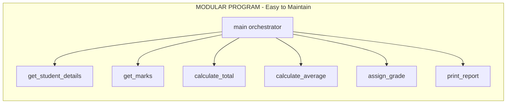
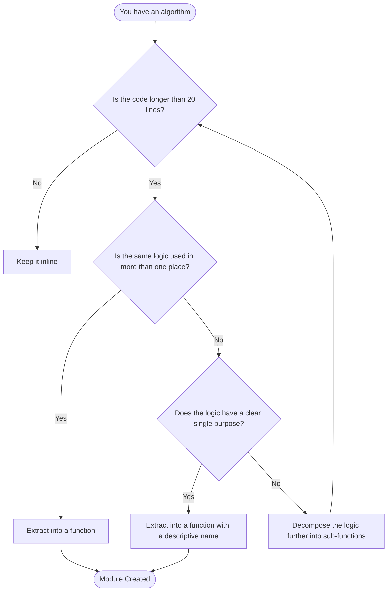
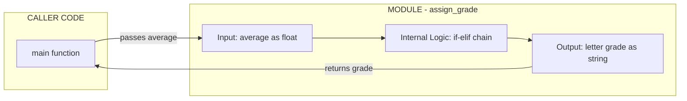
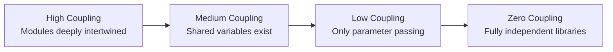

# Modularization motivations

<!-- SECTION_1_START -->

# Modularization Motivations

## 1. Core Technical Definition

> [!NOTE]
> **Formal Definition (KTU 2024 Syllabus Terminology)**
> **Modularization** is the process of decomposing a complete algorithmic solution into a set of smaller, logically coherent, and independently manageable sub-units called **modules** (in Python, typically realized as **functions**, **classes**, or **packages**). Each module encapsulates a specific responsibility, exposes a well-defined **interface** (inputs and outputs), and hides its internal implementation details from the rest of the program.

In the KTU 2024 Scheme for **Algorithmic Thinking with Python (UCEST105)**, modularization is positioned as a direct consequence of the **Problem Decomposition** strategy within Module 3. The core idea is the classical engineering principle known as **"Divide and Conquer"** — a large, complex problem is recursively split into smaller sub-problems until each sub-problem becomes trivially solvable.

### Conceptual Analogy / Intuition

> [!IMPORTANT]
> **Real-World Analogy — The Modular Kitchen**
> Imagine a massive restaurant kitchen where one chef is asked to simultaneously chop vegetables, boil pasta, plate dishes, wash utensils, and take customer orders. The output would be chaotic, slow, and full of errors. Now imagine the same kitchen reorganized into **stations**:
>
> - **Salad Station** — handles only salads
> - **Grill Station** — handles only grilled items
> - **Pastry Station** — handles only desserts
> - **Expediter** — coordinates the final plate
>
> Each station has a clear **name**, a clear **input** (raw ingredients), and a clear **output** (a finished sub-dish). The head chef (the main program) simply calls these stations in sequence. This is **exactly** what modularization does to a Python program. Each function is a "kitchen station."

### Key Properties That Justify Modularization

| Property | Plain-English Meaning |
| :--- | :--- |
| **Cohesion** | Everything inside one module is tightly related to a single task. |
| **Coupling** (low) | Modules depend on each other as little as possible. |
| **Encapsulation** | Internal variables and logic are hidden from the outside world. |
| **Interface** | The set of parameters and return values a module accepts/produces. |
| **Reusability** | The same module can be called from many places without rewriting. |

### Physical Constants / Standard Metrics in KTU Context

> [!TIP]
> Although modularization is conceptual, KTU examiners often evaluate you on measurable design qualities. Memorize these:
>
> - **Cyclomatic Complexity** — target value: **less than 10** per function.
> - **Function Length** — industry rule of thumb: **fewer than 30–50 lines**.
> - **Single Responsibility Principle (SRP)** — one module = one reason to change.
> - **DRY Principle** — *Don't Repeat Yourself*; KTU frequently asks this acronym.

> [!VISUALIZATION CONTROL]
> **Concept:** Visualizing a "Monolithic Program" vs. a "Modular Program" as areas on a number line representing lines of code.
> **GeoGebra / Desmos Input Equations:**
> * `f(x) = 1` (a constant thick block — the monolithic program)
> * `g_1(x) = 1` for $x \in [0, 1]$
> * `g_2(x) = 1` for $x \in [1, 2]$
> * `g_3(x) = 1$ for $x \in [2, 3]$
> **Visual Description:** The student should see one giant rectangle (monolithic code) versus three small, separated rectangles (modular functions), each with a clear boundary — exactly like three kitchen stations instead of one giant bench.

<!-- SECTION_1_END -->

<!-- SECTION_2_START -->

# Deep Theoretical Analysis & KTU High-Yield Formula Sheet

## 2. The Five Core Motivations for Modularization

The KTU 2024 syllabus explicitly highlights **why** an algorithmic thinker must modularize. Below is the exhaustive breakdown.

### Motivation 1: Readability (Cognitive Load Reduction)

- **Why:** A human brain can hold roughly **$4 \pm 1$** items in working memory (Miller's Law). A 500-line script overwhelms this buffer.
- **How:** Each function has a descriptive name. Reading `calculate_tax(income)` is far faster than parsing 20 lines of arithmetic.
- **Engineering Use:** Production-grade systems at companies like Google and NASA enforce readability because code is read **10x more often** than it is written.

### Motivation 2: Reusability (Eliminating Redundancy)

- **Why:** Repeating the same logic violates the **DRY** principle and multiplies bug surfaces.
- **How:** Define once, call many times. A single `is_prime(n)` function can serve 100 different algorithms.
- **Engineering Use:** Python's **Standard Library** (`math`, `random`, `datetime`) is itself a giant collection of reusable modules.

### Motivation 3: Maintainability (Localized Change)

- **Why:** When business requirements change, you should edit **one place**, not 50.
- **How:** If tax rules change, you only update the `calculate_tax()` function; the rest of the program is untouched.
- **Engineering Use:** Banks updating interest-rate formulas, e-commerce sites updating shipping calculators — all rely on isolated modules.

### Motivation 4: Abstraction (Hiding Complexity)

- **Why:** A caller does not need to know *how* a module works, only *what* it does.
- **How:** `print("Hello")` hides hundreds of internal instructions about buffers, encodings, OS calls.
- **Engineering Use:** This is the foundation of **APIs** (Application Programming Interfaces) — every cloud service (AWS S3, Google Maps) is a public modular abstraction.

### Motivation 5: Decomposability & Testability

- **Why:** Complex problems become tractable when split, and bugs become findable when isolated.
- **How:** Each module can be **unit-tested** independently using frameworks like `pytest` or `unittest`.
- **Engineering Use:** This is the basis of **Test-Driven Development (TDD)** and continuous integration pipelines.

> [!NOTE]
> **Secondary Motivations** (also tested in KTU):
> - **Namespace isolation** — local variables in a function do not pollute the global scope.
> - **Parallel development** — different team members can own different modules simultaneously.
> - **Performance profiling** — you can measure which module is slow without measuring the whole program.

## KTU High-Yield Formula Sheet / Cheat Sheet

| Concept | Symbolic / Pseudo Representation | Boundary Condition | Unit / Nature |
| :--- | :--- | :--- | :--- |
| **Module Signature** | $\text{module\_name}(\text{param}_1, \text{param}_2, \ldots, \text{param}_n) \rightarrow \text{return\_value}$ | $n \geq 0$ parameters | Logical contract |
| **Cohesion Score** | $C = \frac{\text{internal relationships}}{\text{total relationships}}$ | $0 \lt C \leq 1$, target $C \rightarrow 1$ | Dimensionless ratio |
| **Coupling Score** | $K = \frac{\text{inter-module references}}{\text{total references}}$ | $0 \leq K \lt 1$, target $K \rightarrow 0$ | Dimensionless ratio |
| **Reusability Factor** | $R = \frac{\text{modules reused}}{\text{total modules}}$ | $0 \leq R \leq 1$ | Dimensionless ratio |
| **Function Length Rule** | $L_{\text{func}} \leq 50$ | Lines of code | Empirical guideline |
| **Cyclomatic Complexity** | $M = E - N + 2P$ | $M \lt 10$ per module | Graph-theoretic metric |
| **DRY Violation Count** | $D = $ number of duplicated logic blocks | $D = 0$ ideal | Integer count |

> [!TIP]
> In your KTU answers, the phrase **"high cohesion, low coupling"** is worth 2 marks by itself. Use it liberally.

<!-- SECTION_2_END -->

<!-- SECTION_3_START -->

# Step-by-Step Derivations & Code Implementation

## 3. From Monolithic to Modular — A Worked Transformation

To make the motivations **concrete**, we will transform a single monolithic Python script into a properly modularized one. This mirrors the kind of 14-mark KTU question that asks: *"Refactor the given code into functions and justify your design."*

### Stage 1 — The Monolithic (Bad) Version

```python
# monolithic.py  --  ALL logic in one block (NOT recommended)
print("=== Student Report Card ===")

name = input("Enter name: ")
roll = input("Enter roll number: ")
m1 = float(input("Marks in Subject 1: "))
m2 = float(input("Marks in Subject 2: "))
m3 = float(input("Marks in Subject 3: "))

total = m1 + m2 + m3
average = total / 3

if average >= 90:
    grade = "A+"
elif average >= 80:
    grade = "A"
elif average >= 70:
    grade = "B"
elif average >= 60:
    grade = "C"
else:
    grade = "D"

print(f"Name: {name}")
print(f"Roll: {roll}")
print(f"Total: {total}")
print(f"Average: {average}")
print(f"Grade: {grade}")
```

**Problems (these are the *motivations* in action):**
1. Cannot reuse the `grade` logic for another student.
2. If grading policy changes, you hunt through this entire block.
3. Hard to test average calculation in isolation.
4. Reading this end-to-end requires holding too many variables in mind.

### Stage 2 — The Modularized (Good) Version

```python
# modular.py  --  Each responsibility in its own function

from typing import List, Tuple, Dict


def get_student_details() -> Dict[str, str]:
    """
    Captures identity information from the user.
    Returns:
        Dict[str, str]: dictionary with 'name' and 'roll' keys.
    """
    name: str = input("Enter name: ")
    roll: str = input("Enter roll number: ")
    return {"name": name, "roll": roll}


def get_marks(count: int = 3) -> List[float]:
    """
    Collects a fixed number of subject marks from the user.
    Args:
        count (int): number of subjects. Default is 3.
    Returns:
        List[float]: list of marks entered.
    """
    marks: List[float] = []
    for i in range(1, count + 1):
        raw: str = input(f"Marks in Subject {i}: ")
        marks.append(float(raw))
    return marks


def calculate_total(marks: List[float]) -> float:
    """
    Computes the sum of all marks.
    Args:
        marks (List[float]): list of subject marks.
    Returns:
        float: total marks.
    """
    return float(sum(marks))


def calculate_average(total: float, count: int) -> float:
    """
    Computes the mean of marks.
    Args:
        total (float): sum of all marks.
        count (int): number of subjects.
    Returns:
        float: average mark.
    """
    if count <= 0:
        raise ValueError("Subject count must be greater than zero.")
    return total / count


def assign_grade(average: float) -> str:
    """
    Maps a numerical average to a letter grade.
    Args:
        average (float): the computed average.
    Returns:
        str: letter grade.
    """
    if average >= 90:
        return "A+"
    if average >= 80:
        return "A"
    if average >= 70:
        return "B"
    if average >= 60:
        return "C"
    return "D"


def print_report(details: Dict[str, str], total: float,
                 average: float, grade: str) -> None:
    """
    Prints the final formatted report card.
    """
    print("=== Student Report Card ===")
    print(f"Name    : {details['name']}")
    print(f"Roll    : {details['roll']}")
    print(f"Total   : {total}")
    print(f"Average : {average}")
    print(f"Grade   : {grade}")


def main() -> None:
    """
    Orchestrator function: wires the modules together.
    This is the SINGLE entry point of the program.
    """
    details: Dict[str, str] = get_student_details()
    marks: List[float] = get_marks(count=3)
    total: float = calculate_total(marks)
    average: float = calculate_average(total, len(marks))
    grade: str = assign_grade(average)
    print_report(details, total, average, grade)


if __name__ == "__main__":
    main()
```

### Mapping Motivations to Code (Derivational Justification)

| Motivation | Module(s) that Prove It |
| :--- | :--- |
| **Readability** | `main()` reads like English: get details, get marks, total, average, grade, print. |
| **Reusability** | `assign_grade()` can be called for 1,000 students without rewriting. |
| **Maintainability** | To change grading, edit **only** `assign_grade()`. |
| **Abstraction** | A caller of `calculate_average()` does not need to see the division. |
| **Testability** | You can `assert assign_grade(85) == "A"` in a unit test in isolation. |

### Step-by-Step Execution Trace

When the user inputs:
- Name: `Anu`
- Roll: `CS101`
- Marks: `85`, `92`, `78`

The execution proceeds as follows:

$$
\begin{aligned}
\text{details} &= \{ \text{"name"} = \text{"Anu"}, \text{"roll"} = \text{"CS101"} \} \\[4pt]
\text{marks} &= [85.0,\ 92.0,\ 78.0] \\[4pt]
\text{total} &= 85.0 + 92.0 + 78.0 = 255.0 \\[4pt]
\text{average} &= \frac{255.0}{3} = 85.0 \\[4pt]
\text{grade} &= \text{assign\_grade}(85.0) = \text{"A"} \quad (\text{since } 85 \geq 80 \text{ but } < 90) \\[4pt]
\text{Output} &= \text{Report card with Total=255.0, Average=85.0, Grade="A"}
\end{aligned}
$$

Each value above is computed inside its **own** dedicated module, which is the entire essence of modularization.

<!-- SECTION_3_END -->

<!-- SECTION_4_START -->

# Structural Diagrams & Schematics

## 4. Visualizing Modularization

### Diagram 1 — Monolithic vs. Modular Data Flow





### Diagram 2 — The Modularization Decision Tree



### Diagram 3 — Module Interface Contract



> [!NOTE]
> **Reading the Diagrams:** The caller in the first column never enters the module's internal box. It only touches the **interface edges** (input arrow, output arrow). This is the visual embodiment of **encapsulation** and **abstraction**.

### Diagram 4 — Coupling Spectrum (Sequential Topology Matrix)



A modular design aims to push the system from **A** toward **D**.

<!-- SECTION_4_END -->

<!-- SECTION_5_START -->

# KTU 2024 Scheme Examination Question Bank & Topic Recap

## 5. Practice Questions Modeled on KTU Patterns

### Part A — 3 Mark Questions (Remember / Understand)

**Q1. [KTU University Exam — July 2024]**
*Define the term "modularization" in the context of algorithmic problem solving. List any two motivations for adopting a modular approach.* **(CO1, Remember)**

**Model Answer (3 Marks):**

> **Definition (1 Mark):** Modularization is the process of dividing a complete program into smaller, self-contained sub-programs called modules (functions in Python), each performing a single well-defined task.
>
> **Motivations (1 Mark each, any two):**
> 1. **Readability** — small named functions are easier to understand than one large block.
> 2. **Reusability** — a function written once can be invoked from multiple parts of the program.
> 3. **Maintainability** — changes are localized to a single module, reducing the risk of side effects.

---

**Q2. [KTU University Exam — Dec 2023]**
*Explain the difference between "cohesion" and "coupling" as design qualities of a modular program.* **(CO2, Understand)**

**Model Answer (3 Marks):**

> **Cohesion (1.5 Marks):** Cohesion measures how strongly the internal responsibilities of a single module are related to each other. **High cohesion** is desirable — it means the module does one thing and does it well.
>
> **Coupling (1.5 Marks):** Coupling measures the degree of interdependence between two modules. **Low coupling** is desirable — it means modules communicate through minimal, well-defined interfaces and changing one does not break the other.
>
> **One-line summary (bonus, for the sharp student):** A well-designed module exhibits **high cohesion and low coupling**.

---

### Part B — 14 Mark Questions (Apply / Analyze)

> [!WARNING]
> **KTU Examiner's Valuation Warning — Part B Pitfall**
> Students often lose 2–3 marks by:
> 1. Writing the function body but **forgetting the function signature** (def line with parameters).
> 2. Using **global variables** instead of parameters and return values — this destroys modularity.
> 3. Forgetting to **invoke the function** from `main()` after defining it.
> 4. Writing code with **no docstring** — KTU awards 1 mark for type hints and docstrings.

---

#### Question A — 14 Marks (CO3, Apply / Analyze)

**[KTU University Exam — Model Paper 2024]**

*Consider a college management system that must process the marks of 30 students across 5 subjects. Currently, all logic is written inside a single `main()` block.*

*(a) Identify at least four problems with this monolithic design and explain how modularization solves each. (7 Marks)*

*(b) Design a Python program using appropriate functions to compute the class average, the highest scorer, and the count of students who passed (pass mark = 40 in every subject). Show the complete modular code. (7 Marks)*

**Model Solution:**

**(a) Four Problems and Modular Solutions — 7 Marks**

| # | Monolithic Problem | Modular Solution |
| :-- | :--- | :--- |
| 1 | **No Reusability** — same averaging logic would be copy-pasted for every student. | A `compute_average(marks)` function is defined once and called inside a loop over 30 students. **[1.5 Marks]** |
| 2 | **Poor Readability** — the `main()` block is 200+ lines, exceeding working memory. | Splitting into `input_student()`, `compute_average()`, `find_topper()`, `count_pass()` makes `main()` read like a summary. **[1.5 Marks]** |
| 3 | **Hard to Maintain** — changing the pass mark from 40 to 50 requires hunting through the entire block. | Change the constant `PASS_MARK = 40` in one place; the `count_pass()` function automatically reflects the update. **[2 Marks]** |
| 4 | **No Testability** — cannot verify the topper logic without running the full input loop. | The `find_topper(students)` function can be unit-tested by passing a hard-coded list of 3 students. **[2 Marks]** |

**(b) Complete Modular Python Code — 7 Marks**

```python
from typing import List, Dict, Tuple, Optional

PASS_MARK: float = 40.0
SUBJECT_COUNT: int = 5


def input_student() -> Dict[str, object]:
    """Captures one student's name and 5 subject marks."""
    name: str = input("Enter student name (or 'STOP' to end): ")
    if name.upper() == "STOP":
        return {"name": "STOP", "marks": []}
    marks: List[float] = []
    for i in range(1, SUBJECT_COUNT + 1):
        raw: str = input(f"  Subject {i} mark: ")
        marks.append(float(raw))
    return {"name": name, "marks": marks}


def compute_average(marks: List[float]) -> float:
    """Returns the arithmetic mean of a marks list."""
    if len(marks) == 0:
        return 0.0
    return sum(marks) / len(marks)


def has_passed(marks: List[float]) -> bool:
    """A student passes only if EVERY mark is at least PASS_MARK."""
    return all(m >= PASS_MARK for m in marks)


def find_topper(students: List[Dict[str, object]]) -> Optional[Dict[str, object]]:
    """Returns the student dictionary with the highest average."""
    if not students:
        return None
    return max(students, key=lambda s: compute_average(s["marks"]))  # type: ignore[arg-type]


def count_pass(students: List[Dict[str, object]]) -> int:
    """Returns how many students passed in all subjects."""
    return sum(1 for s in students if has_passed(s["marks"]))


def class_average(students: List[Dict[str, object]]) -> float:
    """Returns the mean of the per-student averages."""
    if not students:
        return 0.0
    avgs: List[float] = [compute_average(s["marks"]) for s in students]  # type: ignore[arg-type]
    return sum(avgs) / len(avgs)


def main() -> None:
    """Orchestrator: reads students, computes all required statistics."""
    students: List[Dict[str, object]] = []
    while True:
        s: Dict[str, object] = input_student()
        if s["name"] == "STOP":
            break
        students.append(s)

    print(f"\nTotal Students       : {len(students)}")
    print(f"Class Average        : {class_average(students):.2f}")
    topper: Optional[Dict[str, object]] = find_topper(students)
    if topper is not None:
        print(f"Topper               : {topper['name']} "
              f"({compute_average(topper['marks']):.2f})")  # type: ignore[arg-type]
    print(f"Students Passed      : {count_pass(students)}")


if __name__ == "__main__":
    main()
```

**Valuation Key for Part (b):**

- `input_student()` correctly handles termination condition: **[1 Mark]**
- `compute_average()` and `has_passed()` correctly implemented: **[2 Marks]**
- `find_topper()` and `count_pass()` correctly implemented: **[2 Marks]**
- `main()` orchestrator wires everything together and is invoked: **[1 Mark]**
- Type hints, docstrings, and `if __name__ == "__main__":` guard present: **[1 Mark]**

---

#### Question B — 14 Marks (Alternative Choice)

**[KTU University Exam — Model Paper 2024 (Alternative)]**

*You are asked to write a modular Python program to manage an inventory of books in a library.*

*(a) Justify why modularization is essential for this problem. Mention any three specific motivations relevant to a library inventory system. (7 Marks)*

*(b) Implement the system using at least four well-named functions. The system must support: adding a book, searching by title, calculating the total inventory value, and listing all out-of-stock books. (7 Marks)*

**Model Solution:**

**(a) Three Specific Motivations — 7 Marks**

1. **Reusability across the library workflow (2 Marks):** The same `search_by_title()` function will be used by the issue desk, the return desk, and the online catalog portal. Without modularization, the same search loop would be duplicated three times, multiplying bug risk.
2. **Maintainability for regulatory changes (2 Marks):** Library valuation rules may change (e.g., including a new depreciation formula). A single `calculate_inventory_value()` module allows one-place updates without touching search or stock-listing code.
3. **Testability and reliability (2 Marks):** The librarian must trust the "out-of-stock" report. A modular `list_out_of_stock()` function can be unit-tested with a known fake inventory, ensuring the report is always accurate.
4. **Team parallelism (1 Mark):** One developer can build the search module while another builds the valuation module; they integrate later at `main()`.

**(b) Modular Python Code — 7 Marks**

```python
from typing import List, Dict, Optional

Book = Dict[str, object]   # {"title": str, "price": float, "stock": int}


def add_book(inventory: List[Book], title: str,
             price: float, stock: int) -> None:
    """Appends a new book record to the inventory list."""
    if price < 0 or stock < 0:
        raise ValueError("Price and stock must be non-negative.")
    inventory.append({"title": title, "price": price, "stock": stock})


def search_by_title(inventory: List[Book],
                    title: str) -> Optional[Book]:
    """Returns the first book matching the given title (case-insensitive)."""
    needle: str = title.strip().lower()
    for book in inventory:
        if str(book["title"]).lower() == needle:
            return book
    return None


def calculate_inventory_value(inventory: List[Book]) -> float:
    """Returns the total monetary value of all books in stock."""
    return float(sum(float(b["price"]) * int(b["stock"]) for b in inventory))


def list_out_of_stock(inventory: List[Book]) -> List[str]:
    """Returns the titles of all books with stock == 0."""
    return [str(b["title"]) for b in inventory if int(b["stock"]) == 0]


def main() -> None:
    """Orchestrator that drives the library inventory system."""
    inventory: List[Book] = []

    add_book(inventory, "Python Basics", price=499.0, stock=10)
    add_book(inventory, "Data Structures", price=599.0, stock=0)
    add_book(inventory, "Algorithms 101", price=699.0, stock=5)

    found: Optional[Book] = search_by_title(inventory, "python basics")
    print(f"Search Result        : {found}")

    total_value: float = calculate_inventory_value(inventory)
    print(f"Total Inventory Value: Rs. {total_value:.2f}")

    oos: List[str] = list_out_of_stock(inventory)
    print(f"Out of Stock Titles  : {oos}")


if __name__ == "__main__":
    main()
```

**Valuation Key for Part (b):**

- Correct `add_book()` with input validation: **[1 Mark]**
- `search_by_title()` performs case-insensitive comparison: **[2 Marks]**
- `calculate_inventory_value()` correctly multiplies price and stock: **[2 Marks]**
- `list_out_of_stock()` filters with `stock == 0`: **[1 Mark]**
- `main()` orchestrates and `if __name__ == "__main__":` guard is present: **[1 Mark]**

---

## Topic Recap & Important Things to Remember

> [!IMPORTANT]
> **Rapid Revision Checklist — Modularization Motivations**
>
> - **Definition:** Modularization = decomposing a program into smaller, named, single-purpose modules (functions in Python).
> - **Five Core Motivations to Memorize:**
>   1. **Readability** — reduces cognitive load.
>   2. **Reusability** — write once, call many times (DRY principle).
>   3. **Maintainability** — localizes future changes.
>   4. **Abstraction** — hides *how*, exposes *what*.
>   5. **Testability / Decomposability** — enables unit testing and divide-and-conquer.
> - **Golden Design Rule:** *High Cohesion, Low Coupling.* (Worth 2 marks in KTU.)
> - **Acronyms KTU loves:** **DRY** (Don't Repeat Yourself), **SRP** (Single Responsibility Principle).
> - **Python Realization:** A module is a `def` function with parameters (input), a body (logic), and a `return` (output).
> - **Bad Practice Signals (deduct marks in KTU):**
>   - Using global variables inside functions.
>   - Functions longer than ~50 lines.
>   - Functions that do "many things" (low cohesion).
>   - Functions with no docstring or type hints.
> - **Mandatory Code Hygiene (for full marks):**
>   - Type hints on parameters and return values.
>   - A docstring describing purpose, args, and returns.
>   - A single `main()` orchestrator.
>   - The `if __name__ == "__main__":` guard at the bottom.
> - **Cyclomatic Complexity target:** less than **10** per function.
> - **Engineering Context:** Modularization is the foundation of **APIs**, **libraries**, **microservices**, and **unit testing** in the software industry.

<!-- SECTION_5_END -->
