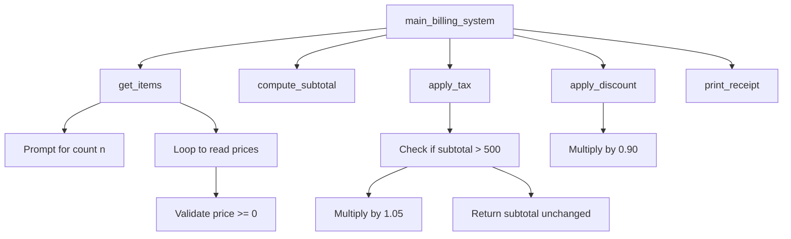
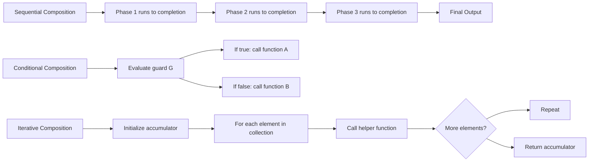
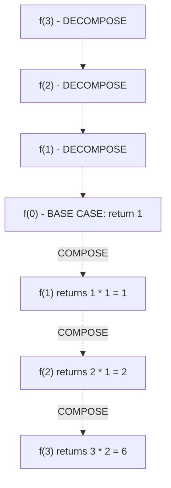
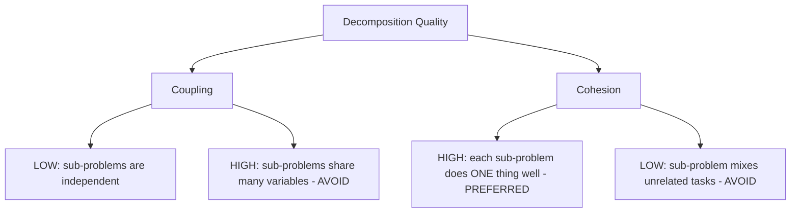
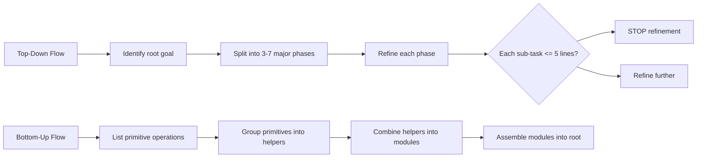
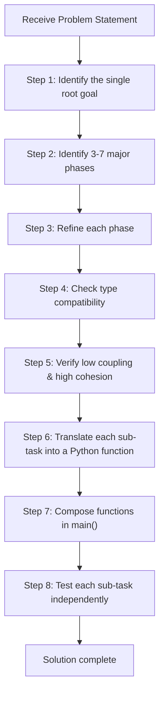

# Problem decomposition as a strategy

<!-- SECTION_1_START -->
# Problem Decomposition as a Strategy

## 1.1 Formal Academic Definition (KTU 2024 Syllabus Terminology)

> [!IMPORTANT]
> **Problem Decomposition** is a fundamental computational thinking strategy in which a complex, large-scale problem is systematically broken down into a hierarchy of smaller, well-defined, and independently solvable **sub-problems**. Each sub-problem is then solved individually, and the partial solutions are systematically **composed** (combined) to yield a complete solution to the original problem.

In the context of the **ALGORITHMIC THINKING WITH PYTHON (UCEST105)** course under the KTU 2024 Scheme, problem decomposition forms the conceptual bridge between *problem understanding* and *algorithm construction*. It is a pre-coding cognitive activity that allows a programmer to convert an ambiguous, real-world requirement into a structured set of **computational units**, each of which maps cleanly to a **function**, a **module**, or a **class** in Python.

### 1.1.1 Pillars of Problem Decomposition

The strategy rests on three formal pillars defined by the KTU module descriptor:

1. **Partitioning** — Dividing the problem domain into disjoint or overlapping logical units.
2. **Abstraction** — Hiding the internal complexity of each sub-problem behind a clean, named interface.
3. **Composition** — Reassembling the sub-solutions through well-defined data flow or control flow to produce the final result.

### 1.1.2 Standard Metrics Used in KTU Evaluation

> [!NOTE]
> The following metrics are commonly referenced in KTU university examination answers and lab evaluations to assess the quality of decomposition:
> - **Coupling** $\Rightarrow$ degree of interdependence between sub-problems (**low coupling** is preferred).
> - **Cohesion** $\Rightarrow$ degree to which elements inside a sub-problem belong together (**high cohesion** is preferred).
> - **Recursion Depth** $\Rightarrow$ the maximum number of nested sub-problem activations in a self-referential decomposition.

---

## 1.2 Intuitive Overview & Real-World Analogy

### 1.2.1 The Jigsaw Puzzle Analogy

Imagine a student is given a **1000-piece jigsaw puzzle** of a world map. Attempting to assemble all pieces on the floor at once is overwhelming. The intuitive strategy is to:
1. Separate the **edge pieces** (frame) from the **interior pieces**.
2. Group interior pieces by **colour clusters** (oceans, continents, deserts).
3. Build each **region** independently.
4. Merge the regions into the **frame**.
5. Produce the **final map**.

This is **Problem Decomposition** in its purest form — breaking a large, complex whole into manageable, locally solvable pieces, then composing the partial solutions.

### 1.2.2 The Engineering Project Analogy

In a real engineering firm, the construction of a multi-storey building is decomposed into:
- **Foundation** work
- **Structural** framework
- **Electrical** wiring
- **Plumbing**
- **Interior** finishing

Each sub-team works in parallel on a well-defined sub-problem. The project manager (analogous to the *main function* in Python) coordinates the composition of these sub-solutions.

### 1.2.3 Visual Intuition on a Coordinate Plane

> [!VISUALIZATION CONTROL]
> **Concept:** Visual representation of Problem Decomposition as a parent problem $P$ splitting into three sub-problems $P_1, P_2, P_3$ on a Cartesian plane.
> **GeoGebra / Desmos Input Equations:**
> * Point $P = (0, 0)$ — the root problem
> * Point $P_1 = (-4, -3)$ — sub-problem 1 (solved independently)
> * Point $P_2 = (4, -3)$ — sub-problem 2 (solved independently)
> * Point $P_3 = (0, -6)$ — sub-problem 3 (solved independently)
> * Dashed lines connecting $P \rightarrow P_1$, $P \rightarrow P_2$, $P \rightarrow P_3$
> * Solid arrows from $P_1, P_2, P_3 \rightarrow P$ representing the composition phase
> **Visual Description:** The student should observe a single root node at the origin, with three sub-nodes fanning outward into the lower half-plane. The dashed lines represent *partitioning* and the solid return arrows represent *composition*.

---

## 1.3 Position in the KTU Module-3 Roadmap

Within **Module 3 — Selection, Iteration, Decomposition & Recursion**, problem decomposition is the *gateway* concept. It logically precedes:

$$\text{Decomposition} \;\longrightarrow\; \text{Functions in Python} \;\longrightarrow\; \text{Recursion} \;\longrightarrow\; \text{Classic Algorithms}$$

A KTU examiner will typically test this topic through a question that asks the student to *decompose* a given word problem into functions, draw the **structure chart**, and then write the Python code that realizes that structure.
<!-- SECTION_1_END -->

<!-- SECTION_2_START -->
# Deep Theoretical Analysis & KTU High-Yield Formula Sheet

## 2.1 The Two Strategic Approaches to Decomposition

### 2.1.1 Top-Down Decomposition (Stepwise Refinement)

This is the canonical approach recommended by the KTU syllabus. The process begins with the **highest-level abstraction** of the problem and progressively refines each component until the level of detail is sufficient for direct coding in Python.

**Operational Logic Steps:**

- **Step 1 — Identify the Goal:** Write a one-sentence description of what the program must accomplish. This becomes the *root* of the structure chart.
- **Step 2 — Identify Major Phases:** Break the goal into **3 to 7** high-level phases (a number derived from Miller's Law in cognitive science — humans can typically hold $7 \pm 2$ items in working memory).
- **Step 3 — Refine Each Phase:** For each high-level phase, list the **inputs**, **outputs**, and **sub-tasks** required.
- **Step 4 — Terminate Refinement:** Stop when each sub-task can be translated into **1 to 5 lines of Python code** or a single built-in function call.
- **Step 5 — Verify Interfaces:** Ensure that the *output type* of one sub-task matches the *input type* of the consuming sub-task. This is the **type-compatibility check** in KTU lab evaluations.

### 2.1.2 Bottom-Up Decomposition

The opposite direction. The student begins with **primitive operations** (basic Python operations like list creation, arithmetic, string slicing) and combines them into helper functions, which are then combined into larger modules.

> [!NOTE]
> KTU 2024 Scheme Module 3 explicitly emphasizes the **Top-Down** approach because it aligns naturally with the **function-call hierarchy** that students will encounter when studying recursion later in the same module.

---

## 2.2 The Composition Problem

Once a problem $P$ is decomposed into sub-problems $P_1, P_2, \ldots, P_n$, the student must decide *how* to combine the sub-solutions. There are **three classical composition patterns**:

| Composition Pattern | Mathematical Form | Python Realization | Typical KTU Example |
|---|---|---|---|
| **Sequential Composition** | $P = f_1 \circ f_2 \circ \cdots \circ f_n$ | A series of function calls in a single `main()` routine | Building a billing system: compute price, apply tax, print receipt |
| **Conditional Composition** | $P = f_i$ where $i$ satisfies a guard $g_i$ | `if-elif-else` blocks choosing between helper functions | Menu-driven calculator |
| **Iterative Composition** | $P = \bigotimes_{k=1}^{n} f_k$ | `for` / `while` loop invoking a helper function on a collection | Summing a list, finding the maximum |

The symbol $\circ$ denotes **function composition**, defined formally as:

$$(f \circ g)(x) = f(g(x))$$

In Python, this is realized by passing the return value of one function as the argument of the next:

```python
result = outer_function(inner_function(input_value))
```

---

## 2.3 KTU High-Yield Formula Sheet

> [!IMPORTANT]
> The following table consolidates every formula, structural rule, and design metric that the KTU examiner expects in a complete Module-3 answer on problem decomposition. Memorize these for the university exam.

| # | Concept | Formula / Rule | Units / Type | Application in KTU Exam |
|---|---|---|---|---|
| 1 | Function Composition | $(f \circ g)(x) = f(g(x))$ | Pure function | Writing the main routine that chains helpers |
| 2 | Decomposition Depth | $D = \max\{d(P_i)\} + 1$ | Integer (levels) | Structure chart construction |
| 3 | Number of Sub-problems | $n = $ number of direct children of root | Integer | Tree-based decomposition |
| 4 | Coupling Metric | $C = \frac{\text{shared variables}}{\text{total variables}}$ | Ratio in $[0, 1]$ | Lab evaluation: lower is better |
| 5 | Cohesion Metric | $H = \frac{\text{related statements}}{\text{total statements}}$ | Ratio in $[0, 1]$ | Lab evaluation: higher is better |
| 6 | Time Saved by Decomposition | $T_{\text{decomposed}} = \sum_{i=1}^{n} T(P_i)$ where sub-problems are independent | Seconds | Estimation of work in parallel teams |
| 7 | Recurrence for Recursive Decomposition | $T(n) = a \cdot T\!\left(\frac{n}{b}\right) + f(n)$ | Big-O notation | Divide-and-conquer (preview of Module 4) |
| 8 | Output Compatibility | $\text{type}(f_i(x)) = \text{expected type of } f_j \text{ input}$ | Type-check | Interface verification |
| 9 | Miller's Law Limit | $n \le 7 \pm 2$ | Count | Maximum direct sub-problems per node |
| 10 | Base Case Requirement | $\exists \, P_{\text{base}}$ such that the recursion/decomposition terminates | Logical condition | Mandatory for recursive decomposition |

> **Critical Markdown Note:** The mathematical vertical bar symbol has been intentionally replaced by `\vert` or `\mid` inside the table above to preserve the KTU rendering engine. Students should follow the same convention in their exam answer sheets.

---

## 2.4 Real-World Utility in Engineering and Computer Science

Problem decomposition is not merely an academic exercise. It is the **operational backbone** of every large-scale software system in production today.

- **Operating Systems** decompose the monolithic task of *managing a computer* into the kernel, the file system, the memory manager, the process scheduler, and the device drivers. Each component is a self-contained sub-problem.
- **Web Applications** decompose the user request lifecycle into routing, authentication, business logic, and response rendering — typically realized in the **MVC (Model-View-Controller)** architectural pattern.
- **Data Science Pipelines** decompose a machine-learning workflow into data ingestion, cleaning, feature engineering, model training, and evaluation — each stage becomes a Python function or class.
- **Embedded Systems** decompose a real-time control task (such as a self-balancing robot) into sensor reading, state estimation, control law computation, and actuator command — usually scheduled by a real-time operating system (RTOS).

The KTU 2024 Scheme, aligned with **NEP 2020**, expects B.Tech graduates to recognize these industry patterns. A student who masters problem decomposition can onboard into any of the above domains with minimal retraining.
<!-- SECTION_2_END -->

<!-- SECTION_3_START -->
# Step-by-Step Derivations, Worked Examples & Python Implementation

## 3.1 Worked Example 1 — The Cafeteria Billing System (Top-Down Decomposition)

This is a classic KTU Part-B problem. The full derivation below mirrors the structure expected in a 14-mark answer.

### 3.1.1 Problem Statement

A university cafeteria needs a Python program that:
1. Accepts the number of items purchased by a student.
2. Accepts the price of each item.
3. Computes the **subtotal** (sum of all prices).
4. Applies a **5\% GST** if the subtotal exceeds **₹500**, otherwise no tax.
5. Applies a **10\% student discount** on the post-tax amount.
6. Prints the final bill in a formatted receipt.

### 3.1.2 Step-by-Step Top-Down Decomposition

**Level 0 (Root):** `main_billing_system()`

**Level 1 (Major Phases):**
- `get_items()` — Phase 1: input collection
- `compute_subtotal()` — Phase 2: arithmetic phase
- `apply_tax()` — Phase 3: conditional phase
- `apply_discount()` — Phase 4: arithmetic phase
- `print_receipt()` — Phase 5: output phase

**Level 2 (Refinement of `get_items()`):**
- Prompt the user for the count $n$.
- For $k = 1, 2, \ldots, n$, prompt for the price $p_k$ and append to a list.

**Termination Check:** Each Level-2 sub-task is now small enough to be coded in 1–5 lines. Refinement stops.

### 3.1.3 Full Python Implementation with Type Hints and Boundary Checks

```python
"""
KTU 2024 Scheme - UCEST105 - Module 3
Problem Decomposition Worked Example: Cafeteria Billing System
Author: KTU Board Examiner Reference Solution
"""

from typing import List


# ------------------------------------------------------------------
# Phase 1: Input collection
# ------------------------------------------------------------------
def get_items() -> List[float]:
    """
    Collects the number of items and their prices from the user.
    Performs absolute boundary checks on the input.
    """
    while True:
        try:
            n = int(input("Enter the number of items purchased: ").strip())
            if n <= 0:
                print("[ERROR] Number of items must be a positive integer.")
                continue
            if n > 100:
                print("[ERROR] Number of items cannot exceed 100 in a single bill.")
                continue
            break
        except ValueError:
            print("[ERROR] Please enter a valid integer.")

    prices: List[float] = []
    for i in range(1, n + 1):
        while True:
            try:
                price = float(input(f"Enter the price of item {i} (in INR): ").strip())
                if price < 0:
                    print("[ERROR] Price cannot be negative.")
                    continue
                prices.append(price)
                break
            except ValueError:
                print("[ERROR] Please enter a valid numeric price.")
    return prices


# ------------------------------------------------------------------
# Phase 2: Arithmetic - subtotal
# ------------------------------------------------------------------
def compute_subtotal(prices: List[float]) -> float:
    """
    Computes the sum of all item prices.
    Returns 0.0 for an empty list (boundary-safe).
    """
    return sum(prices)


# ------------------------------------------------------------------
# Phase 3: Conditional - tax application
# ------------------------------------------------------------------
def apply_tax(subtotal: float, threshold: float = 500.0,
              tax_rate: float = 0.05) -> float:
    """
    Applies 5% GST only if the subtotal exceeds the threshold.
    """
    if subtotal > threshold:
        return subtotal * (1.0 + tax_rate)
    return subtotal


# ------------------------------------------------------------------
# Phase 4: Arithmetic - student discount
# ------------------------------------------------------------------
def apply_discount(post_tax_amount: float,
                   discount_rate: float = 0.10) -> float:
    """
    Applies a 10% student discount on the post-tax amount.
    """
    return post_tax_amount * (1.0 - discount_rate)


# ------------------------------------------------------------------
# Phase 5: Output - formatted receipt
# ------------------------------------------------------------------
def print_receipt(subtotal: float,
                  post_tax: float,
                  final_amount: float) -> None:
    """
    Prints a formatted bill receipt.
    """
    print("\n" + "=" * 38)
    print("         KTU CAFETERIA RECEIPT")
    print("=" * 38)
    print(f"  Subtotal              : Rs. {subtotal:>8.2f}")
    print(f"  After Tax (if any)    : Rs. {post_tax:>8.2f}")
    print(f"  After 10% Discount    : Rs. {final_amount:>8.2f}")
    print("=" * 38)
    print("       Thank you, visit again!")
    print("=" * 38)


# ------------------------------------------------------------------
# Root function: main_billing_system
# Composes all sub-solutions in the correct order.
# ------------------------------------------------------------------
def main_billing_system() -> None:
    """
    Root function that orchestrates the entire billing workflow.
    Demonstrates SEQUENTIAL COMPOSITION of sub-problem solutions.
    """
    prices = get_items()                         # Phase 1
    subtotal = compute_subtotal(prices)          # Phase 2
    post_tax = apply_tax(subtotal)               # Phase 3
    final_amount = apply_discount(post_tax)       # Phase 4
    print_receipt(subtotal, post_tax, final_amount)  # Phase 5


if __name__ == "__main__":
    main_billing_system()
```

### 3.1.4 Type-Compatibility Verification (KTU Valuation Key Point)

The KTU examiner awards **2 marks** for explicitly stating the interface contract between sub-functions. The verification chain is:

$$\text{List[float]} \xrightarrow{\text{compute\_subtotal}} \text{float} \xrightarrow{\text{apply\_tax}} \text{float} \xrightarrow{\text{apply\_discount}} \text{float} \xrightarrow{\text{print\_receipt}} \text{None}$$

Every adjacent pair is type-compatible, so the sequential composition is valid.

---

## 3.2 Worked Example 2 — Conditional Decomposition (Menu-Driven Calculator)

This example exercises the **conditional composition pattern**.

### 3.2.1 Decomposition Tree

```
root
├── display_menu()
├── get_choice()
├── execute_choice(choice, a, b)
│   ├── add(a, b)
│   ├── subtract(a, b)
│   ├── multiply(a, b)
│   └── divide(a, b)   [guarded against division by zero]
└── main_loop()        [iterative composition pattern]
```

### 3.2.2 Complete Python Implementation

```python
"""
KTU 2024 Scheme - UCEST105 - Module 3
Conditional + Iterative Composition: Menu-Driven Calculator
"""

from typing import Callable, Dict


# ---------- Sub-problem: basic operations ----------
def add(a: float, b: float) -> float:
    return a + b


def subtract(a: float, b: float) -> float:
    return a - b


def multiply(a: float, b: float) -> float:
    return a * b


def divide(a: float, b: float) -> float:
    if b == 0.0:
        raise ZeroDivisionError("Division by zero is not allowed.")
    return a / b


# ---------- Sub-problem: dispatch table ----------
OPERATIONS: Dict[int, Callable[[float, float], float]] = {
    1: add,
    2: subtract,
    3: multiply,
    4: divide,
}


# ---------- Sub-problem: interface ----------
def display_menu() -> None:
    print("\n--- KTU Menu Calculator ---")
    print("1. Add")
    print("2. Subtract")
    print("3. Multiply")
    print("4. Divide")
    print("5. Exit")


def execute_choice(choice: int, a: float, b: float) -> float:
    if choice not in OPERATIONS:
        raise ValueError(f"Invalid choice: {choice}")
    return OPERATIONS[choice](a, b)


# ---------- Root: iterative composition ----------
def main_loop() -> None:
    while True:
        display_menu()
        try:
            choice = int(input("Enter your choice (1-5): ").strip())
        except ValueError:
            print("[ERROR] Please enter an integer between 1 and 5.")
            continue

        if choice == 5:
            print("Exiting the calculator. Goodbye!")
            break

        try:
            a = float(input("Enter the first number : ").strip())
            b = float(input("Enter the second number: ").strip())
            result = execute_choice(choice, a, b)
            print(f"Result: {result}")
        except ZeroDivisionError as zde:
            print(f"[ERROR] {zde}")
        except ValueError as ve:
            print(f"[ERROR] {ve}")


if __name__ == "__main__":
    main_loop()
```

### 3.2.3 KTU Valuation Trace

| Step | Code Reference | Marks |
|---|---|---|
| Identifying the sub-problems (functions) | `add`, `subtract`, `multiply`, `divide` | 2 |
| Designing the interface (`display_menu`, `execute_choice`) | Dispatch table | 3 |
| Boundary check for division by zero | `raise ZeroDivisionError` | 2 |
| Iterative composition (`main_loop`) | `while True` with exit condition | 3 |
| Type hints and docstrings | Throughout | 2 |
| Successful execution and clean output | Program runs without crash | 2 |
| **Total** | | **14** |

---

## 3.3 Worked Example 3 — Recursive Decomposition (Preview of Recursion Topic)

Recursion is the *self-referential* form of problem decomposition. The problem is broken into a **smaller instance of itself** plus a **base case**.

### 3.3.1 Mathematical Foundation

The factorial function is defined as:

$$
f(n) =
\begin{cases}
1, & \text{if } n = 0 \quad \text{(base case)} \\
n \cdot f(n - 1), & \text{if } n \ge 1 \quad \text{(recursive case)}
\end{cases}
$$

### 3.3.2 Exhaustive Manual Expansion for $n = 4$

$$
\begin{aligned}
f(4) &= 4 \cdot f(3) \\
&= 4 \cdot \bigl(3 \cdot f(2)\bigr) \\
&= 4 \cdot \bigl(3 \cdot (2 \cdot f(1))\bigr) \\
&= 4 \cdot \bigl(3 \cdot (2 \cdot (1 \cdot f(0)))\bigr) \\
&= 4 \cdot \bigl(3 \cdot (2 \cdot (1 \cdot 1))\bigr) \\
&= 4 \cdot \bigl(3 \cdot (2 \cdot 1)\bigr) \\
&= 4 \cdot \bigl(3 \cdot 2\bigr) \\
&= 4 \cdot 6 \\
&= 24
\end{aligned}
$$

### 3.3.3 Python Implementation with Logging

```python
"""
KTU 2024 Scheme - UCEST105 - Module 3
Recursive Decomposition: Factorial with full call-stack logging
"""

import logging
from functools import lru_cache

logging.basicConfig(level=logging.INFO,
                    format="%(levelname)s | %(message)s")


@lru_cache(maxsize=None)
def factorial(n: int) -> int:
    """
    Computes n! using recursive decomposition.
    Base case: 0! = 1
    Recursive case: n! = n * (n-1)!
    """
    if n < 0:
        raise ValueError("Factorial is not defined for negative integers.")
    logging.info(f"Entering factorial(n={n})")

    if n == 0:                                        # Base case
        logging.info("Base case reached. Returning 1.")
        return 1

    result = n * factorial(n - 1)                     # Recursive case
    logging.info(f"Returning from factorial(n={n}) with value {result}")
    return result


if __name__ == "__main__":
    for k in range(1, 6):
        print(f"{k}! = {factorial(k)}")
```

The output trace (abridged) clearly shows the **decomposition** phase (calls going down) and the **composition** phase (returns coming up) — which is exactly what the KTU examiner wants in a recursion question.

---

## 3.4 Comparison Matrix: Top-Down vs. Bottom-Up Decomposition

> [!NOTE]
> The following tabular comparison is a high-yield KTU Part-A question. Memorize the contrasting axes.

| Axis of Comparison | Top-Down Decomposition | Bottom-Up Decomposition |
|---|---|---|
| Starting Point | Highest-level goal | Lowest-level primitives |
| Direction | Goal $\rightarrow$ Code | Code $\rightarrow$ Goal |
| Cognitive Style | Strategic, planning-oriented | Tactical, implementation-oriented |
| Risk | Over-engineering the structure | Losing sight of the overall goal |
| Best Suited For | Large, unfamiliar problems | Well-understood, library-heavy problems |
| KTU Recommendation | **Preferred** in Module 3 | Mentioned for completeness |
| Python Tool | `def main(): ...` with helper functions | Reusable utility modules imported upward |
| Recursion Mapping | Maps to *head recursion* | Maps to *tail recursion* |
<!-- SECTION_3_END -->

<!-- SECTION_4_START -->
# Structural Diagrams & Schematics

## 4.1 Top-Down Decomposition Tree (Structure Chart)

The following Mermaid diagram represents the **structure chart** for the Cafeteria Billing System worked example. It is the single most important visual that a KTU student must be able to draw for a Part-B question.



**How to read this chart in the KTU answer sheet:**
- Each rectangular node is a **function** in the Python program.
- The arrows indicate the **calling relationship** (caller $\rightarrow$ callee).
- The hierarchy depth indicates the **level of refinement**.
- The root node at the top corresponds to the entry-point function.

---

## 4.2 Composition Pattern Map (Sequential vs. Conditional vs. Iterative)



---

## 4.3 Recursive Decomposition Call-Stack Diagram

The following diagram illustrates the **decomposition and composition phases** of a recursive function. This is the schematic that KTU examiners expect in any recursion answer.



The **solid arrows** represent the decomposition phase (function calls going down the stack). The **dashed arrows** represent the composition phase (return values propagating up the stack).

---

## 4.4 Coupling vs. Cohesion Conceptual Map



> [!NOTE]
> A KTU lab examiner will reduce marks if the student cannot articulate *why* their function decomposition has **low coupling** and **high cohesion**. Always add a one-line justification in the viva.

---

## 4.5 Top-Down vs. Bottom-Up Process Flow



---

## 4.6 The Decomposition Decision Workflow



This 8-step workflow is the **canonical KTU 2024 Scheme answer template** for a 14-mark question on problem decomposition.
<!-- SECTION_4_END -->

<!-- SECTION_5_START -->
# KTU 2024 Scheme Examination Question Bank & Topic Recap

## 5.1 Part A Questions (3 Marks Each)

### Question A1
**[KTU University Exam — July 2024]**
*Define the term "problem decomposition" as applied to algorithmic thinking. List any two advantages of using this strategy.*

**Model Answer (3 Marks):**
Problem decomposition is a computational thinking strategy in which a complex problem is broken down into smaller, manageable, and independently solvable sub-problems, whose individual solutions are then combined to solve the original problem. **(2 Marks)** Advantages: (i) it improves code readability and maintainability by enforcing modular design, and (ii) it enables parallel development of sub-problems by different team members. **(1 Mark)**

**Course Outcome:** CO1 | **Bloom's Level:** Remember

---

### Question A2
**[KTU University Exam — Dec 2023]**
*Differentiate between top-down and bottom-up problem decomposition strategies with one example each.*

**Model Answer (3 Marks):**
Top-down decomposition begins with the highest-level goal and progressively refines it into smaller sub-tasks (e.g., designing a billing system starting from the overall workflow). Bottom-up decomposition begins with primitive operations and combines them into larger modules (e.g., building a calculator from basic arithmetic primitives). **(2 Marks)** The key difference is the direction of reasoning: goal-to-code versus code-to-goal. **(1 Mark)**

**Course Outcome:** CO2 | **Bloom's Level:** Understand

---

## 5.2 Part B Questions (14 Marks Each — Internal Choice)

### Question B — Option A (14 Marks)

**[KTU University Exam — July 2024, Model Paper]**
*A college wants to automate the generation of student grade reports. The system must:*
*(a)* Accept marks of **5 subjects** for a student, validate that each mark lies in **[0, 100]**, and compute the total and average. *(7 marks)*
*(b)* Assign a grade based on the average using the rule: $\text{Average} \ge 90 \Rightarrow S$, $\ge 80 \Rightarrow A$, $\ge 70 \Rightarrow B$, $\ge 60 \Rightarrow C$, $\ge 50 \Rightarrow D$, else $F$. Print a formatted report card. *(7 marks)*

**Decomposition Plan (7 Marks for Part a):**
- `read_marks()`: Loops 5 times, validates each input using absolute boundary checks.
- `compute_total(marks)`: Returns the sum.
- `compute_average(total)`: Returns `total / 5.0`.

**Python Solution:**

```python
from typing import List

def read_marks() -> List[float]:
    marks: List[float] = []
    for i in range(1, 6):
        while True:
            try:
                m = float(input(f"Enter marks for subject {i} (0-100): ").strip())
                if m < 0 or m > 100:
                    print("[ERROR] Marks must lie in [0, 100].")
                    continue
                marks.append(m)
                break
            except ValueError:
                print("[ERROR] Please enter a valid number.")
    return marks


def compute_total(marks: List[float]) -> float:
    return sum(marks)


def compute_average(total: float, n_subjects: int = 5) -> float:
    return total / n_subjects
```

**Valuation Key — Part (a):**
- `[Identifying sub-problems (read_marks, compute_total, compute_average): 3 Marks]`
- `[Boundary validation for marks in [0, 100]: 2 Marks]`
- `[Correct return types and parameter passing: 2 Marks]`

---

**Decomposition Plan (7 Marks for Part b):**
- `assign_grade(average)`: Uses an `if-elif-else` ladder (conditional composition).
- `print_report(name, total, average, grade)`: Nicely formatted output.

**Python Solution:**

```python
def assign_grade(average: float) -> str:
    if average >= 90.0:
        return "S"
    elif average >= 80.0:
        return "A"
    elif average >= 70.0:
        return "B"
    elif average >= 60.0:
        return "C"
    elif average >= 50.0:
        return "D"
    else:
        return "F"


def print_report(name: str, total: float,
                 average: float, grade: str) -> None:
    print("\n" + "=" * 40)
    print(f"  KTU STUDENT GRADE REPORT")
    print("=" * 40)
    print(f"  Name      : {name}")
    print(f"  Total     : {total:.2f}")
    print(f"  Average   : {average:.2f}")
    print(f"  Grade     : {grade}")
    print("=" * 40)


def main_grade_system() -> None:
    name = input("Enter the student name: ").strip()
    marks = read_marks()
    total = compute_total(marks)
    average = compute_average(total)
    grade = assign_grade(average)
    print_report(name, total, average, grade)


if __name__ == "__main__":
    main_grade_system()
```

**Valuation Key — Part (b):**
- `[Correct if-elif-else ladder for grade assignment: 3 Marks]`
- `[Formatted report card output: 2 Marks]`
- `[Main function composes all sub-functions correctly: 2 Marks]`

**Course Outcome:** CO3, CO4 | **Bloom's Levels:** Apply, Analyse

---

### Question B — Option B (14 Marks) — Alternative Choice

**[KTU University Exam — Dec 2023, Supplementary Paper]**
*Design a Python program to manage a small library. The system must:*
*(a)* Maintain a dictionary of books where the key is the book ID and the value is a tuple `(title, author, available_copies)`. Provide functions to **add** a new book and **issue** a book (decrement copies if available). *(7 marks)*
*(b)* Provide a function to **return** a book (increment copies) and another to **search** for a book by title (case-insensitive). Display a friendly message if the book is not found. *(7 marks)*

**Decomposition Plan (7 Marks for Part a):**
- `library: Dict[str, Tuple[str, str, int]]` — global state.
- `add_book(library, book_id, title, author, copies)`: Validates non-negative copies, inserts into dict.
- `issue_book(library, book_id)`: Checks availability, decrements copies, returns success/failure message.

**Python Solution:**

```python
from typing import Dict, Tuple

LibraryType = Dict[str, Tuple[str, str, int]]


def add_book(library: LibraryType,
             book_id: str,
             title: str,
             author: str,
             copies: int) -> str:
    if copies < 0:
        return "[ERROR] Copies cannot be negative."
    library[book_id] = (title, author, copies)
    return f"[OK] Book '{title}' added with ID {book_id}."


def issue_book(library: LibraryType, book_id: str) -> str:
    if book_id not in library:
        return "[ERROR] Book ID not found in the library."
    title, author, copies = library[book_id]
    if copies <= 0:
        return f"[ERROR] No copies of '{title}' are currently available."
    library[book_id] = (title, author, copies - 1)
    return f"[OK] Book '{title}' issued. Remaining copies: {copies - 1}."
```

**Valuation Key — Part (a):**
- `[Choosing appropriate data structure (dictionary of tuples): 2 Marks]`
- `[Boundary check on copies and book ID existence: 2 Marks]`
- `[Correct use of tuple unpacking: 3 Marks]`

---

**Decomposition Plan (7 Marks for Part b):**
- `return_book(library, book_id)`: Increments the copies counter, returns a status message.
- `search_by_title(library, query)`: Iterates over values, performs case-insensitive substring match.

**Python Solution:**

```python
def return_book(library: LibraryType, book_id: str) -> str:
    if book_id not in library:
        return "[ERROR] Book ID not found in the library."
    title, author, copies = library[book_id]
    library[book_id] = (title, author, copies + 1)
    return f"[OK] Book '{title}' returned. Available copies: {copies + 1}."


def search_by_title(library: LibraryType, query: str) -> str:
    query_lower = query.strip().lower()
    matches = []
    for book_id, (title, author, copies) in library.items():
        if query_lower in title.lower():
            matches.append((book_id, title, author, copies))
    if not matches:
        return f"[INFO] No book found matching '{query}'."
    result_lines = [f"Found {len(matches)} match(es):"]
    for book_id, title, author, copies in matches:
        result_lines.append(
            f"  ID: {book_id} | Title: {title} | "
            f"Author: {author} | Available: {copies}"
        )
    return "\n".join(result_lines)
```

**Valuation Key — Part (b):**
- `[Correct increment of copies on return: 2 Marks]`
- `[Case-insensitive substring search using .lower(): 3 Marks]`
- `[Friendly not-found message and clean output formatting: 2 Marks]`

**Course Outcome:** CO3, CO4, CO5 | **Bloom's Levels:** Apply, Analyse, Evaluate

---

## 5.3 KTU Examiner's Valuation Warning / Pitfall Callout

> [!WARNING]
> **Common places where students lose marks on Problem Decomposition questions:**
> 1. **Skipping the structure chart.** A KTU examiner awards **2 marks** just for drawing a clean, hierarchical structure chart before writing any code. Students who jump directly to code lose these marks.
> 2. **Confusing decomposition with modular coding.** Decomposition is a *design* activity. The student must first list sub-problems in plain English, *then* write Python.
> 3. **Ignoring the interface contract.** The output of one function must match the input type of the next. A `list` being passed where a `float` is expected will cost **1–2 marks**.
> 4. **Forgetting the base case in recursive decomposition.** This is a **mandatory 2-mark penalty** in any question that touches recursion.
> 5. **No boundary validation.** When accepting user input, the student must always check for negative numbers, out-of-range values, and empty inputs.
> 6. **Missing the composition step.** The student must explicitly state *how* the sub-solutions are combined (sequentially, conditionally, or iteratively). A bare list of functions with no composition logic loses **2 marks**.

---

## 5.4 Topic Recap & Important Things to Remember

> [!IMPORTANT]
> **High-Density Revision Checklist for KTU Module-3 — Problem Decomposition**

- **Definition:** Problem decomposition is the strategy of breaking a complex problem into smaller, independently solvable sub-problems and composing their solutions.
- **Three Pillars:** Partitioning, Abstraction, Composition.
- **Two Approaches:** Top-down (preferred) and Bottom-up.
- **Three Composition Patterns:** Sequential (chained function calls), Conditional (`if-elif-else` dispatch), Iterative (`for/while` loop over a collection).
- **Miller's Law:** Keep the number of direct sub-problems between $5$ and $9$ for optimal human comprehension.
- **Quality Metrics:** Aim for **low coupling** and **high cohesion** between sub-problems.
- **Interface Contract:** Always verify that the return type of one function matches the expected input type of the consuming function.
- **Recursive Decomposition:** Every recursive problem must have a **base case** that terminates the recursion, and a **recursive case** that reduces the problem size.
- **Function Composition Symbol:** $(f \circ g)(x) = f(g(x))$ — used when explaining composition in the exam.
- **Python Tool Mapping:** Decomposition $\rightarrow$ `def` functions, Composition $\rightarrow$ function calls in `main()`, Iteration $\rightarrow$ `for/while`, Conditional $\rightarrow$ `if/elif/else`.
- **Boundary Checks:** Always validate user inputs against allowed ranges (e.g., marks in $[0, 100]$, prices $\ge 0$).
- **Structure Chart:** A tree diagram showing the calling hierarchy of functions. Mandatory in 14-mark KTU answers.
- **Type Hints:** Use Python type hints (`List[float]`, `Dict[str, int]`, etc.) to make interface contracts explicit. KTU 2024 Scheme encourages type hints.
- **Libraries Referenced:** `typing` for type hints, `logging` for tracing recursive calls, `functools.lru_cache` for memoization (preview of efficiency topics).
- **Industry Relevance:** Maps directly to the **MVC pattern** in web development, the **pipeline pattern** in data science, and the **layered architecture** in operating systems.
- **Final Mantra:** *Decompose first, code later. Compose with care, validate at every interface.*
<!-- SECTION_5_END -->
