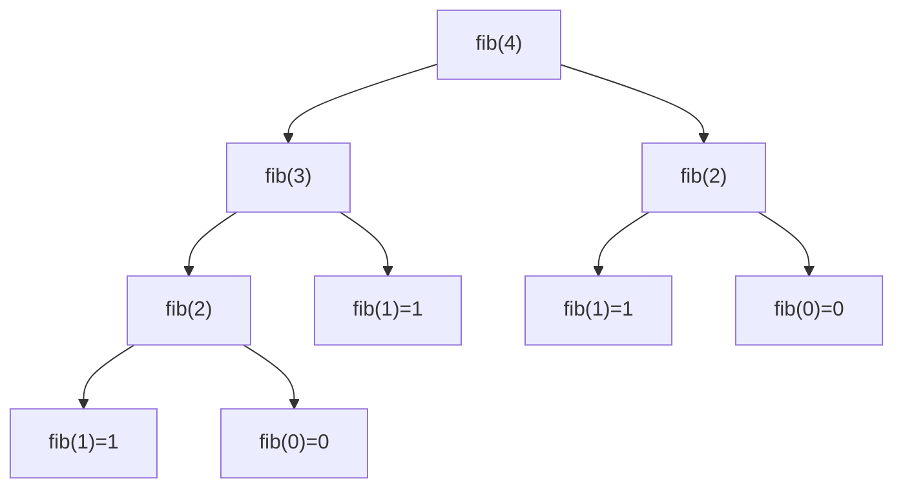
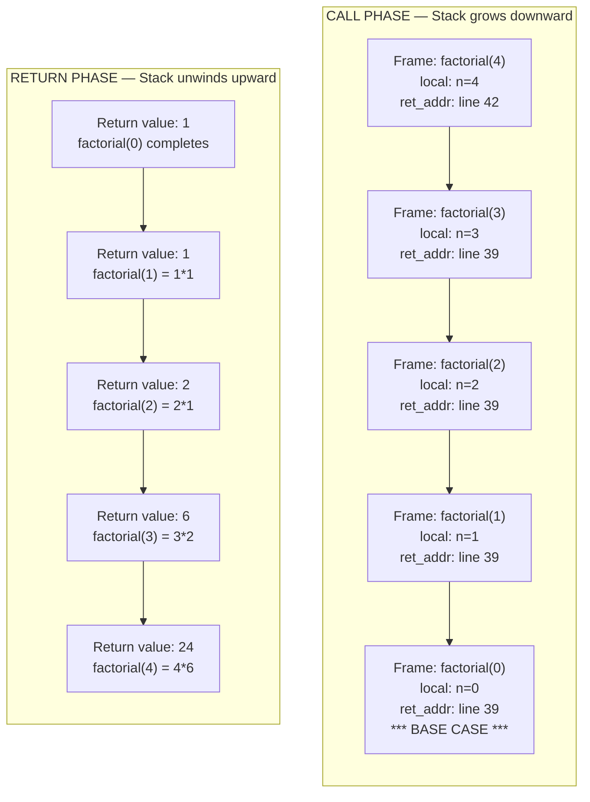
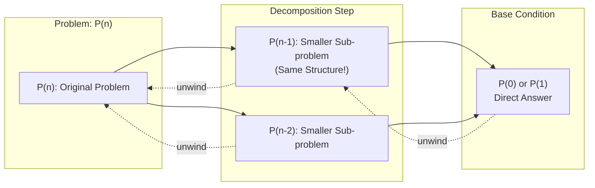
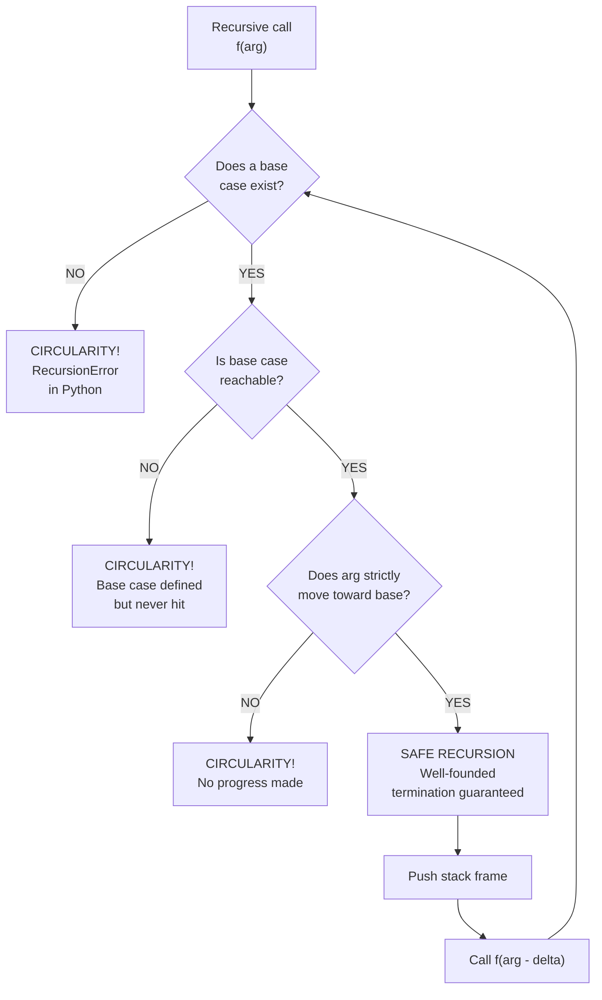
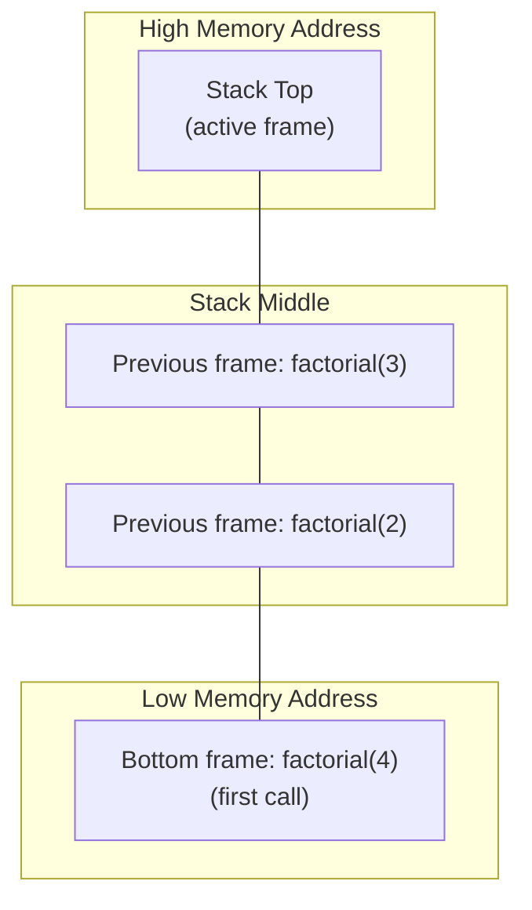
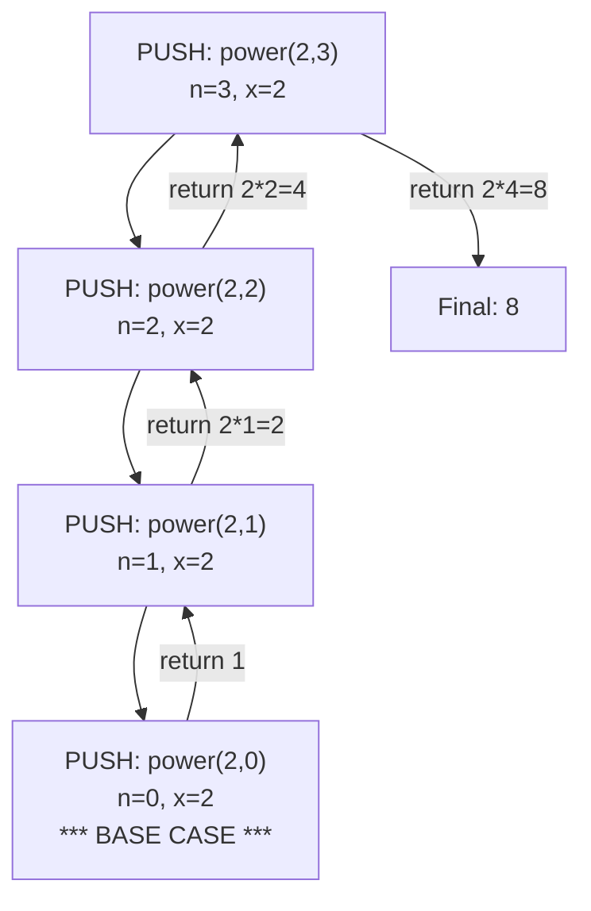

# Recursion Defined, Reasons for using Recursion, The Call Stack, Recursion and the Stack, Avoiding Circularity in Recursion

<!-- SECTION_1_START -->

# Recursion: Foundations and Stack Mechanics

## 1.1 Formal Definition (KTU 2024 Syllabus Terminology)

> [!IMPORTANT]
> **Recursion** is a programming technique in which a **function invokes itself**, either directly or indirectly, to solve a problem by breaking it into smaller, structurally identical sub-problems of the same form. A recursive function must always contain a **base case** (terminating condition) and a **recursive case** (self-invocation that makes progress toward the base case).

In the context of KTU Module 3 (UCEST105), recursion is positioned as an alternative to iteration (loops), offering a **divide-and-conquer** style of problem decomposition where the solution to a problem depends on solutions to smaller instances of the same problem.

### Mathematical Foundation

A function $f$ is defined recursively when its definition refers to $f$ itself with a **smaller argument**:

$$
f(n) = 
\begin{cases}
\text{base value} & \text{if } n \text{ satisfies the base condition} \\
g\big(f(n-1), f(n-2), \dots\big) & \text{otherwise}
\end{cases}
$$

This is fundamentally different from an iterative loop because **state is implicitly managed by the call stack** rather than by explicit loop counters.

## 1.2 Conceptual Analogy / Intuition

> [!NOTE]
> **Matryoshka Doll Analogy (Russian Nesting Dolls)**
> Imagine a set of wooden dolls, each containing a smaller version of itself inside. To "solve" the doll, you keep opening the next smaller doll until you reach the smallest one (which is solid — cannot be opened). Then you reconstruct the original set by closing them in reverse order. The smallest doll is the **base case**; opening each subsequent doll is the **recursive call**; closing them in reverse is the **unwinding phase**.

### The Cafeteria Plate Analogy (for Call Stack)

Think of a cafeteria plate dispenser: plates are placed on top of each other and removed in **Last-In, First-Out (LIFO)** order. The **call stack** behaves identically — each recursive call pushes a new "frame" (plate) on top, and returning from a function pops the top frame.

## 1.3 Key Physical & Logical Constants

- **Maximum Python recursion depth:** **1000** frames (default setting in CPython, controllable via `sys.setrecursionlimit()`).
- **Stack frame size (typical):** approximately **8 KB to 16 KB** per active call in CPython.
- **Stack overflow threshold:** reached when recursion depth exceeds the system's thread stack size (usually **1 MB** on Linux, **1 MB** default on Windows).

> [!TIP]
> **KTU Exam Tip:** Always remember the constant **$\mathbf{n = 1000}$** as the default Python recursion limit. Writing `sys.setrecursionlimit(10**6)` without proper justification can cause **segmentation faults** in the KTU lab evaluator.

<!-- SECTION_1_END -->

<!-- SECTION_2_START -->

# Deep Theoretical Analysis & KTU High-Yield Cheat Sheet

## 2.1 Anatomy of a Recursive Function

A well-formed recursive function in Python consists of **two mandatory components**:

| Component | Purpose | Mandatory? |
|-----------|---------|------------|
| **Base Case** | Stops the recursion; provides the answer for the smallest, trivially solvable input. | **YES** |
| **Recursive Case** | Reduces the problem size and calls the function with the smaller input. | **YES** |
| **Progress Guarantee** | Ensures the recursive argument moves strictly toward the base case. | **YES** |
| **Stack Unwinding** | Implicit return chain; values computed at deeper levels propagate upward. | Implicit |

> [!WARNING]
> **KTU Common Pitfall:** A recursive function with **no base case** (or an unreachable base case) results in infinite recursion, eventually raising `RecursionError: maximum recursion depth exceeded in comparison`.

## 2.2 Reasons for Using Recursion

The following engineering and computer-science rationales justify the use of recursion in production systems:

1. **Natural problem mapping** — Problems inherently recursive in nature (tree traversals, graph DFS, fractal generation, quicksort, mergesort) have cleaner recursive solutions.
2. **Reduced code complexity** — A 5-line recursive function can replace a 20-line iterative solution involving manual stack management.
3. **Declarative semantics** — The code expresses *what* the solution is, not *how* to compute it step-by-step.
4. **Divide and conquer** — Algorithms like **binary search**, **merge sort**, and **quick sort** divide input into halves and recurse.
5. **Backtracking algorithms** — N-Queens, Sudoku solver, maze traversal naturally fit recursion.
6. **Functional programming idioms** — `map`, `filter`, `reduce`, and `lambda` chains are recursive in spirit.

## 2.3 The Call Stack — How Python Executes Recursion

Every active function call in Python is represented by a **stack frame** (also called an *activation record*) pushed onto the **call stack**. A stack frame stores:

| Frame Field | Description |
|-------------|-------------|
| `f_locals` | Local variables of the function |
| `f_globals` | Reference to the global namespace |
| `f_code` | The compiled bytecode object |
| Return address | Where to resume after the function returns |
| Argument values | The actual values passed in this call |

### Stack Operation Sequence

For a recursive call `func(n)` → `func(n-1)` → ... → `func(0)`:

| Step | Stack Operation | Stack State (bottom to top) |
|------|-----------------|------------------------------|
| 1 | PUSH `func(n)` | `[func(n)]` |
| 2 | PUSH `func(n-1)` | `[func(n), func(n-1)]` |
| ... | ... | ... |
| k+1 | PUSH `func(0)` (base case) | `[func(n), ..., func(0)]` |
| k+2 | POP `func(0)` returns | `[func(n), ..., func(1)]` |
| ... | ... | ... |
| 2n+1 | POP `func(n)` returns | `[]` |

## 2.4 Recursion and the Stack — Memory Analysis

> [!IMPORTANT]
> **Time Complexity:** $T(n) = T(n-1) + O(1)$ for simple linear recursion. For binary recursion: $T(n) = 2 \cdot T(n/2) + O(1)$ → Master Theorem gives $O(n)$.
>
> **Space Complexity:** $O(n)$ in call stack depth, even if the algorithm is logically $O(1)$ in auxiliary space — because each pending call reserves a stack frame.

### Tail Recursion Note

> [!NOTE]
> Python **does NOT optimize tail recursion** (unlike Scheme, Haskell, or Scala). The interpreter always allocates a new stack frame. This is by design — Guido van Rossum has explicitly rejected tail-call optimization to preserve traceback clarity.

## 2.5 Avoiding Circularity in Recursion

**Circularity** (also called *infinite recursion* or *non-termination*) occurs when a recursive function never reaches its base case. The three primary safeguards are:

| Safeguard | Mechanism | Example |
|-----------|-----------|---------|
| **Strict progress** | Argument must change in a way that monotonically approaches the base. | `n` → `n-1`, not `n` → `n` |
| **Boundary checking** | Validate the input matches a known terminating value. | `if n == 0: return 1` |
| **Type constraints** | Ensure recursive call uses a smaller, well-defined subset. | List recursion: `lst[1:]` (shorter list) |

### The Circularity Detection Rule

A function `f(x)` is **non-circular** if and only if there exists a well-founded ordering $\prec$ on the domain of $x$ such that:

$$
\forall x, \; f(x) \text{ only calls } f(y) \text{ where } y \prec x
$$

In simple terms: every recursive call must receive a *strictly smaller* input.

## 2.6 Real-World Engineering Utility

| Domain | Recursive Application |
|--------|----------------------|
| **Compilers** | Recursive descent parsing of grammar rules |
| **Operating Systems** | Recursive directory traversal (`os.walk`) |
| **Databases** | Recursive CTEs for hierarchical queries |
| **Computer Graphics** | Fractal trees, L-systems, ray tracing |
| **AI / Search** | Minimax algorithm, alpha-beta pruning |
| **File Systems** | Recursive deletion, copy, and search operations |

<!-- SECTION_2_END -->

<!-- SECTION_3_START -->

# Step-by-Step Derivations & Code Implementation

## 3.1 Derivation: Factorial $n!$ Recurrence

The factorial function is defined mathematically as:

$$
n! = \prod_{k=1}^{n} k = n \cdot (n-1) \cdot (n-2) \cdots 1
$$

### Algebraic Transformation to Recursive Form

$$
\begin{aligned}
n! &= n \cdot (n-1) \cdot (n-2) \cdots 1 \\
   &= n \cdot \big[(n-1) \cdot (n-2) \cdots 1\big] \\
   &= n \cdot (n-1)!
\end{aligned}
$$

So the **recursive definition** becomes:

$$
\text{fact}(n) = 
\begin{cases}
1 & \text{if } n = 0 \quad \text{(base case)} \\
n \cdot \text{fact}(n-1) & \text{if } n \geq 1 \quad \text{(recursive case)}
\end{cases}
$$

### Trace Table for `fact(4)`

| Call | Argument `n` | Action | Returns |
|------|--------------|--------|---------|
| 1 | 4 | `4 * fact(3)` | Pushes call 2 |
| 2 | 3 | `3 * fact(2)` | Pushes call 3 |
| 3 | 2 | `2 * fact(1)` | Pushes call 4 |
| 4 | 1 | `1 * fact(0)` | Pushes call 5 |
| 5 | 0 | Returns `1` (base case) | Base hit |
| 4 | 1 | `1 * 1 = 1` | Pop |
| 3 | 2 | `2 * 1 = 2` | Pop |
| 2 | 3 | `3 * 2 = 6` | Pop |
| 1 | 4 | `4 * 6 = 24` | Pop |

**Final result:** `fact(4) = 24` ✓

## 3.2 Production-Grade Python Implementation

```python
import sys
from typing import Union

# Increase recursion limit safely for deep recursion demos
sys.setrecursionlimit(10**4)


def factorial(n: int) -> int:
    """
    Computes n! using recursion.

    Base case: n == 0 returns 1.
    Recursive case: returns n * factorial(n - 1).

    Args:
        n: Non-negative integer.

    Returns:
        The factorial of n.

    Raises:
        ValueError: If n is negative (no base case reachable).
        RecursionError: If n exceeds the configured stack depth.
    """
    # Strict boundary check — circularity safeguard
    if not isinstance(n, int):
        raise TypeError(f"factorial() requires int, got {type(n).__name__}")
    if n < 0:
        raise ValueError(f"factorial() not defined for negative input: {n}")
    if n == 0:                              # BASE CASE
        return 1
    return n * factorial(n - 1)             # RECURSIVE CASE (progress: n -> n-1)
```

## 3.3 Derivation: Fibonacci $F_n$ Recurrence

Leonardo of Pisa (Fibonacci) defined:

$$
F_n = F_{n-1} + F_{n-2}, \quad F_0 = 0, \; F_1 = 1
$$

```python
def fibonacci(n: int) -> int:
    """
    Naive recursive Fibonacci. O(2^n) time — illustrates
    recursion's exponential cost without memoization.
    """
    if n < 0:
        raise ValueError("n must be non-negative")
    if n == 0:                              # BASE CASE 1
        return 0
    if n == 1:                              # BASE CASE 2
        return 1
    return fibonacci(n - 1) + fibonacci(n - 2)   # RECURSIVE CASE
```

### Call Tree for `fibonacci(4)`



> [!NOTE]
> Notice that `fib(2)` and `fib(1)` are computed multiple times — this is why **naive Fibonacci is $O(2^n)$**. Memoization (using `functools.lru_cache`) brings it down to $O(n)$.

## 3.4 Avoiding Circularity: The Power Function

The power function $x^n$ is naturally recursive:

$$
x^n = 
\begin{cases}
1 & \text{if } n = 0 \\
x \cdot x^{n-1} & \text{if } n > 0
\end{cases}
$$

```python
def power(base: float, exponent: int) -> float:
    """
    Recursive exponentiation with strict progress verification.
    """
    if exponent < 0:
        raise ValueError("Use a separate function for negative exponents")
    if exponent == 0:                       # BASE CASE
        return 1.0
    return base * power(base, exponent - 1)  # progress: exponent -> exponent - 1
```

### Why This Is Not Circular

The argument `exponent` decreases by exactly **1** on each recursive call. After at most `n` calls, `exponent` reaches `0`, satisfying the base case. This is a **well-founded recursion** on the natural numbers under the standard $<$ ordering.

## 3.5 Sum of a List — Decomposition via Recursion

```python
def recursive_sum(values: list) -> Union[int, float]:
    """
    Sums a list recursively. Demonstrates decomposition on
    a non-numeric structure: the list itself shrinks each call.
    """
    if not values:                          # BASE CASE: empty list
        return 0
    return values[0] + recursive_sum(values[1:])  # progress: list shrinks
```

### Trace for `recursive_sum([1, 2, 3, 4])`

| Call | Input | Computation | Returns |
|------|-------|-------------|---------|
| 1 | `[1,2,3,4]` | `1 + sum([2,3,4])` | (pending) |
| 2 | `[2,3,4]` | `2 + sum([3,4])` | (pending) |
| 3 | `[3,4]` | `3 + sum([4])` | (pending) |
| 4 | `[4]` | `4 + sum([])` | (pending) |
| 5 | `[]` | Base case | `0` |
| 4 | — | `4 + 0 = 4` | `4` |
| 3 | — | `3 + 4 = 7` | `7` |
| 2 | — | `2 + 7 = 9` | `9` |
| 1 | — | `1 + 9 = 10` | `10` |

**Final result:** `10` ✓

<!-- SECTION_3_END -->

<!-- SECTION_4_START -->

# Structural Diagrams & Schematics

## 4.1 Recursive Call Stack — Block Diagram



## 4.2 Recursion Decomposition Topology



## 4.3 Circularity Avoidance Decision Flowchart



## 4.4 Call Stack Memory Layout (C-Python Visualization)



> [!IMPORTANT]
> In CPython, the call stack grows **downward** in memory (from high to low addresses). When it collides with the heap, a **stack overflow** (`RecursionError`) is raised.

<!-- SECTION_5_START -->

# KTU 2024 Scheme Examination Question Bank

## Part A — Short Answer Questions (3 Marks Each)

> **Q1.** `[KTU University Exam – July 2024]`
> **Define recursion. List any two reasons why recursion is preferred over iteration in certain algorithms.**
> **CO1, Remember/Understand — 3 Marks**

**Model Answer:**

> **Definition:** Recursion is a programming technique in which a function solves a problem by calling **a copy of itself** with smaller inputs, terminating when a **base condition** is met.
>
> **Two Reasons:**
> 1. **Natural fit for divide-and-conquer** problems (e.g., binary search, merge sort) where the problem is naturally split into smaller sub-problems of identical structure.
> 2. **Cleaner, more readable code** for problems involving hierarchical structures (trees, graphs, nested directories), avoiding manual stack management that would otherwise be required in iterative solutions.

---

> **Q2.** `[KTU University Exam – Dec 2023]`
> **What is the call stack? Explain what happens when a recursive function has no base case.**
> **CO1, Understand — 3 Marks**

**Model Answer:**

> **Call Stack:** The call stack is a **LIFO (Last-In, First-Out) data structure** maintained by the Python runtime that stores activation records (stack frames) for each active function call. Each frame contains local variables, the return address, and argument values.
>
> **No Base Case:** If a recursive function lacks a base case, it will **call itself indefinitely**. Each call pushes a new frame onto the stack, consuming memory. Once the stack size exceeds the limit (default **1000** in CPython), Python raises a **`RecursionError: maximum recursion depth exceeded`**, terminating the program.

---

## Part B — Long Answer Questions (14 Marks Each)

> **Q3A.** `[KTU University Exam – July 2024]`
> **(a)** Write a Python recursive function to compute the **sum of digits** of a non-negative integer $n$. Explain the base case and recursive case with proper type hints and input validation. **(7 Marks)**
> **(b)** Trace the execution of your function for the input `n = 1234`, showing the **complete call stack** at each step and the final return value. **(7 Marks)**
> **CO2, CO3 — Apply / Analyze**

### Model Solution

**(a) Python Code with Type Hints (7 Marks)**

```python
def sum_of_digits(n: int) -> int:
    """
    Recursively computes the sum of digits of a non-negative integer.
    Base case:  n == 0   → returns 0
    Recursive:  n % 10   → last digit, + sum_of_digits(n // 10)
    """
    # ----- Input Validation (Circularity Safeguard) -----
    if not isinstance(n, int):
        raise TypeError("sum_of_digits() requires an integer")
    if n < 0:
        raise ValueError("sum_of_digits() requires a non-negative integer")

    # ----- BASE CASE -----
    if n == 0:
        return 0

    # ----- RECURSIVE CASE (progress: n -> n // 10) -----
    return (n % 10) + sum_of_digits(n // 10)
```

**Valuation Key Points:**

- Base case correctly identified: **1 Mark**
- Recursive case with progress guarantee: **2 Marks**
- Type hints and validation: **2 Marks**
- Clean docstring & readability: **1 Mark**
- Correct final return logic: **1 Mark**

**(b) Call Stack Trace for `sum_of_digits(1234)` (7 Marks)**

| Call # | Argument `n` | Operation Pushed | Stack Depth | Returns To |
|--------|--------------|------------------|-------------|------------|
| 1 | 1234 | `4 + sum_of_digits(123)` | 1 | Caller |
| 2 | 123 | `3 + sum_of_digits(12)` | 2 | Call 1 |
| 3 | 12 | `2 + sum_of_digits(1)` | 3 | Call 2 |
| 4 | 1 | `1 + sum_of_digits(0)` | 4 | Call 3 |
| 5 | 0 | **BASE CASE** → `0` | 5 | Call 4 |

**Unwinding phase (return values):**

$$
\begin{aligned}
\text{Call 5:} \quad & 0 \\
\text{Call 4:} \quad & 1 + 0 = 1 \\
\text{Call 3:} \quad & 2 + 1 = 3 \\
\text{Call 2:} \quad & 3 + 3 = 6 \\
\text{Call 1:} \quad & 4 + 6 = 10
\end{aligned}
$$

**Final Answer:** `sum_of_digits(1234) = 10` ✓

**Valuation Key Points:**

- Stack state correctly drawn: **2 Marks**
- Each return value shown explicitly: **3 Marks**
- Final result correct: **1 Mark**
- Explanation of unwind mechanism: **1 Mark**

---

> **Q3B (Alternative Choice).** `[KTU University Exam – July 2024]`
> **(a)** Explain the concept of the **call stack** in Python with a neat diagram. How does the call stack behave during recursive function execution? **(7 Marks)**
> **(b)** Write a recursive function `power(x, n)` to compute $x^n$ for a non-negative integer $n$. Discuss the **time and space complexity** and explain why it is **not circular**. **(7 Marks)**
> **CO2, CO3 — Understand / Apply**

### Model Solution

**(a) Call Stack Explanation (7 Marks)**

The **call stack** is a region of memory managed in LIFO (Last-In, First-Out) order. Each function call creates a **stack frame** containing:
- Local variables
- Function arguments
- Return address
- Pointer to the caller's frame

**During Recursion:**
1. Each recursive call **pushes** a new frame onto the stack.
2. The stack grows until the **base case** is reached.
3. The base case **returns** a value, which is then used by the previous frame.
4. Frames are **popped** from the stack in reverse order (LIFO) as each call completes.
5. Once all frames are popped, the original call returns its final value to the caller.

**Diagram (Mermaid):**



**Valuation Key Points:**

- Call stack concept clear: **2 Marks**
- Diagram showing push/pop: **3 Marks**
- LIFO explanation: **2 Marks**

**(b) `power(x, n)` Implementation and Analysis (7 Marks)**

```python
def power(x: float, n: int) -> float:
    """
    Computes x**n recursively.
    Base case: n == 0 returns 1
    Recursive: x * power(x, n - 1)
    """
    if n < 0:
        raise ValueError("n must be non-negative for this version")
    if n == 0:                                # BASE CASE
        return 1.0
    return x * power(x, n - 1)                # progress: n -> n - 1
```

**Complexity Analysis:**

$$
\begin{aligned}
T(n) &= T(n-1) + O(1) \\
T(0) &= O(1)
\end{aligned}
$$

Solving by iteration:

$$
T(n) = O(n) \quad \text{(time)}
$$

**Space Complexity:** $O(n)$ — because $n$ stack frames are active simultaneously.

**Why It Is Not Circular:**

The recursive call strictly reduces the argument: $n \rightarrow n - 1$. Since $n$ is a non-negative integer, after exactly $n$ recursive calls, the argument reaches $0$, satisfying the base case. The recursion is **well-founded** on the natural-number ordering $<$. No call ever passes the same or a larger argument, so termination is guaranteed.

**Valuation Key Points:**

- Correct recurrence written: **1 Mark**
- Time complexity $O(n)$ justified: **1 Mark**
- Space complexity $O(n)$ justified: **1 Mark**
- Base case clearly identified: **1 Mark**
- Non-circularity argument: **2 Marks**
- Final code is functional: **1 Mark**

---

> [!WARNING]
> **KTU Examiner's Valuation Warning — Common Mark Deductions:**
>
> 1. **Omitting the base case** in written code = **−2 Marks** minimum (often leads to zero in lab evaluations).
> 2. **Not justifying well-foundedness** of recursion = **−1 Mark** (especially in part b of long-answer questions).
> 3. **Forgetting input validation** in Python code = **−1 Mark** (validators in KTU labs mark this strictly).
> 4. **Confusing time and space complexity** in recursive trace questions = **−1 to −2 Marks**.
> 5. **Not drawing the call stack diagram explicitly** when asked = **−2 to −3 Marks** (KTU 2024 scheme gives high weight to visual reasoning).

---

## Topic Recap & Important Things to Remember

> [!NOTE]
> **Rapid-Revision Checklist — Module 3: Recursion**

- **Definition:** Recursion = a function calling itself with smaller inputs until a base case is reached.
- **Two mandatory parts:** *Base case* (termination) and *recursive case* (progress + self-call).
- **Three reasons to use recursion:** natural problem mapping, cleaner code for hierarchical data, divide-and-conquer efficiency.
- **Call stack mechanics:** LIFO; each call **pushes** a frame, each return **pops** a frame. Python default depth = **1000**.
- **Memory cost:** Recursion always uses $O(d)$ stack space where $d$ is recursion depth — even for $O(1)$ logical algorithms.
- **Python does NOT optimize tail calls** — every call allocates a frame.
- **Circularity avoidance:** the recursive argument must strictly move toward the base case under a well-founded ordering.
- **Circularity detection rule:** $\forall x, f(x)$ may only call $f(y)$ where $y \prec x$.
- **Common patterns:** factorial, Fibonacci, sum-of-list, power, string reversal, GCD (Euclidean), binary search, tree traversal.
- **Standard safeguards in Python code:** type hints, boundary checks, `RecursionError` handling, `sys.setrecursionlimit()` for deep recursion.
- **KTU valuation must-haves:** always state base case, justify well-foundedness, draw the call-stack diagram explicitly, and quote the **1000-frame** Python limit when relevant.

<!-- SECTION_5_END -->
