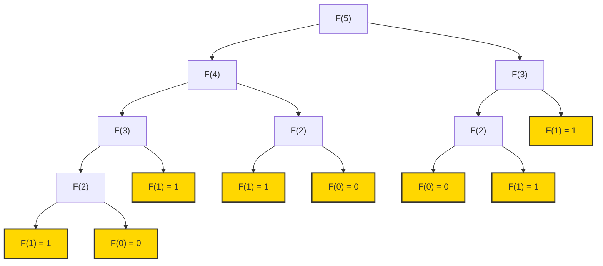
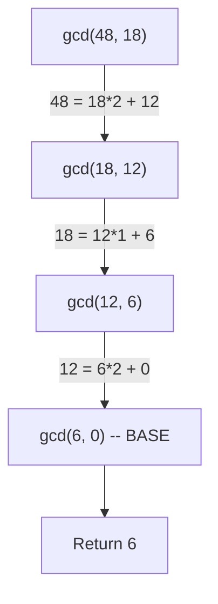
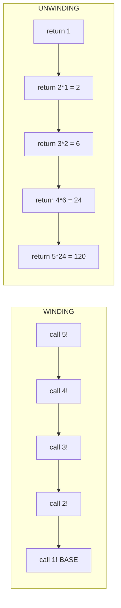
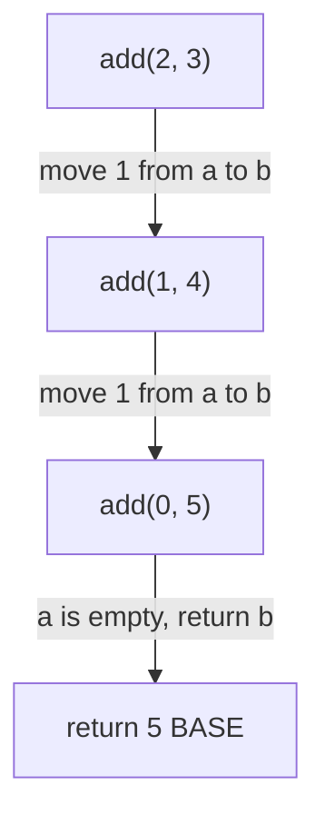
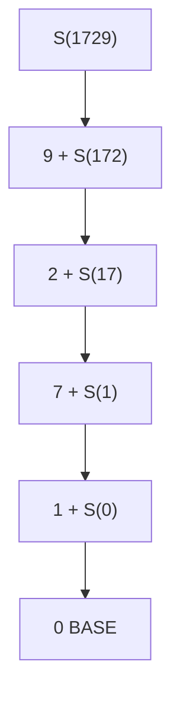
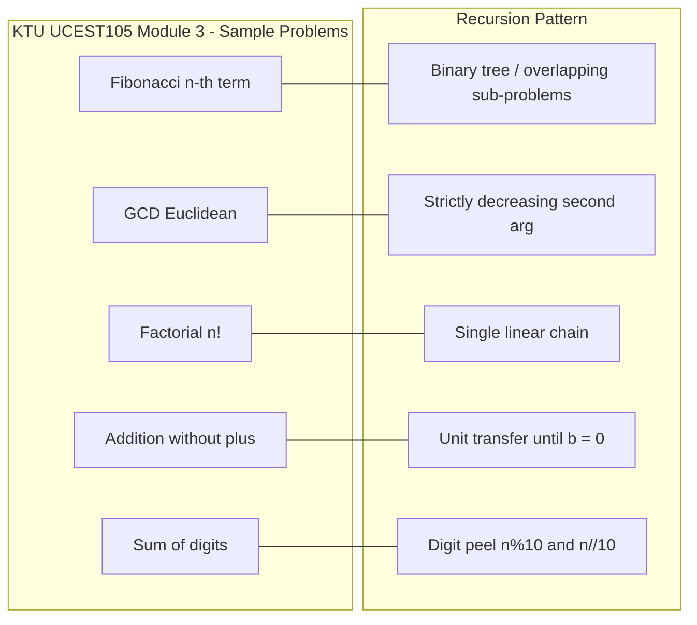

# Sample problems - Finding the nth Fibonacci number, GCD, factorial, adding two positive integers, sum of digits

<!-- SECTION_1_START -->
# Module 3 — Sample Recursive & Iterative Problems

## 1. Core Technical Definition & Intuitive Overview

### 1.1 What is Recursion? (KTU 2024 Syllabus Definition)

> [!IMPORTANT]
> **Recursion** is a programming technique in which a **function calls itself**, either directly or indirectly, to solve a problem by breaking it into smaller sub-problems of the same type. A recursive solution must always have a **base case** (terminating condition) and a **recursive case** (progress toward the base case).

In the **KTU 2024 Scheme (UCEST105)**, Module 3 unifies four pillars of algorithmic thinking:

| Pillar | Meaning |
| :--- | :--- |
| **Selection** | `if / elif / else` decision branching |
| **Iteration** | `for` / `while` loops that repeat work |
| **Decomposition** | Breaking a big problem into independent sub-problems |
| **Recursion** | A function invoking itself on a smaller instance |

### 1.2 Conceptual Analogy — The "Russian Doll" Viewpoint

Imagine a set of **matryoshka (Russian nesting dolls)**. To find the *smallest* doll, you keep opening a doll to find a smaller one inside, until you reach a doll that cannot be opened (the **base case**). When you have the smallest doll, you can name the doll outside it, then the next one, and so on, **unwinding** back to the outermost.

The same two phases exist in every recursive program:

1. **Winding (Call phase):** Function calls itself with a *smaller* argument.
2. **Unwinding (Return phase):** Each call returns its value, until the original caller receives the final answer.

### 1.3 The Five Canonical Sample Problems (KTU Module 3)

> [!NOTE]
> All five problems below are officially listed in **KTU UCEST105 — Module 3** as illustrative examples for the recursion chapter. Each one teaches a *slightly different* flavour of recursion: **linear tail recursion**, **Euclidean reduction**, **multiplicative accumulation**, **operator-elimination**, and **digit-by-digit peeling**.

| # | Problem | Recursive Form | Domain |
|:-:|:---|:---|:---|
| 1 | $n^{\text{th}}$ Fibonacci number | $F(n) = F(n-1) + F(n-2)$ | Numeric sequences |
| 2 | GCD of two integers | $\gcd(a, b) = \gcd(b, a \bmod b)$ | Number theory |
| 3 | Factorial of $n$ | $n! = n \times (n-1)!$ | Combinatorics |
| 4 | Addition of two positive ints | $a + b = (a-1) + (b+1)$ | Operator elimination |
| 5 | Sum of digits of $n$ | $S(n) = (n \bmod 10) + S(n \div 10)$ | Digit manipulation |

### 1.4 Constants Used Throughout This Module

* **Golden Ratio** $\varphi = \dfrac{1 + \sqrt{5}}{2} \approx \mathbf{1.6180339887}$
* **Conjugate ratio** $\psi = \dfrac{1 - \sqrt{5}}{2} \approx \mathbf{-0.6180339887}$
* **Euler-Mascheroni constant** $\gamma \approx \mathbf{0.57721}$ (used in asymptotic analysis)
* **Recursion depth limit (CPython default):** $\mathbf{1000}$ frames

> [!VISUALIZATION CONTROL]
> **Concept:** Visualising the Fibonacci spiral embedded in the Golden Rectangle.
> **GeoGebra / Desmos Input Equations:**
> * `phi = (1 + sqrt(5)) / 2`
> * `F(n) = round((phi^n - (-1/phi)^n) / sqrt(5))`
> **Visual Description:** Plot $F(n)$ for $n = 0, 1, 2, \ldots, 10$ on the $x$-axis. The points $(F(n), F(n+1))$ form the famous *logarithmic spiral* of the golden rectangle — useful to memorise the growth rate.

---

<!-- SECTION_1_END -->

<!-- SECTION_2_START -->
# 2. Deep Theoretical Analysis & KTU High-Yield Formula Sheet

## 2.1 Problem 1 — $n^{\text{th}}$ Fibonacci Number

The Fibonacci sequence is a **linear recurrence** of order 2. It was introduced by Leonardo of Pisa (a.k.a. **Fibonacci**) in his 1202 book *Liber Abaci* to model rabbit population growth.

$$
\begin{aligned}
F(0) &= 0 \\
F(1) &= 1 \\
F(n) &= F(n-1) + F(n-2), \quad n \geq 2
\end{aligned}
$$

### Closed-Form (Binet's Formula)

$$
F(n) = \frac{\varphi^{\,n} - \psi^{\,n}}{\sqrt{5}}, \quad \text{where } \varphi = \frac{1 + \sqrt{5}}{2},\ \psi = \frac{1 - \sqrt{5}}{2}
$$

### Why & How It Works

* The recurrence is **homogeneous** and **linear with constant coefficients**.
* Substituting $F(n) = x^{n}$ gives the **characteristic equation** $x^{2} = x + 1$, whose roots are $\varphi$ and $\psi$.
* The general solution is a linear combination, and the two boundary conditions $F(0)=0,\ F(1)=1$ determine the coefficients $\dfrac{1}{\sqrt{5}}$ and $\dfrac{-1}{\sqrt{5}}$.

### Time & Space Complexity

| Approach | Time | Space | Comment |
|:---|:---:|:---:|:---|
| Naive recursion | $O(2^{n})$ | $O(n)$ | Exponential — *avoid* in production |
| Top-down memoisation | $O(n)$ | $O(n)$ | Dictionary or list cache |
| Bottom-up iteration | $O(n)$ | $O(1)$ | **KTU recommended** |
| Matrix fast exponentiation | $O(\log n)$ | $O(\log n)$ | Uses $\begin{bmatrix}1&1\\1&0\end{bmatrix}^{n}$ |
| Binet's formula | $O(1)$ | $O(1)$ | Suffers floating-point error for large $n$ |

## 2.2 Problem 2 — GCD (Greatest Common Divisor)

> [!IMPORTANT]
> KTU 2024 Module 3 emphasises the **Euclidean algorithm** as the canonical recursive example. The proof relies on the identity $\gcd(a, b) = \gcd(b, a \bmod b)$.

### Recursive Form

$$
\gcd(a, b) = \begin{cases} a & \text{if } b = 0 \\ \gcd(b, a \bmod b) & \text{otherwise} \end{cases}
$$

### Why & How It Works

* Any common divisor of $a$ and $b$ also divides $a - qb$ for any integer $q$.
* Taking $q = \lfloor a / b \rfloor$ gives the remainder $a \bmod b$.
* Repeating the reduction cannot continue indefinitely because the second argument strictly decreases — guaranteeing **termination**.

### Time Complexity

Lamé's Theorem: the number of recursive steps is bounded by $5 \times \log_{10}(\min(a, b))$, so the algorithm is $O(\log \min(a, b))$.

## 2.3 Problem 3 — Factorial

$$
n! = \begin{cases} 1 & \text{if } n = 0 \\ n \cdot (n-1)! & \text{if } n \geq 1 \end{cases}
$$

### Why & How It Works

* The base case $0! = 1$ is *not* arbitrary — it is the **empty product** identity.
* Each recursive call multiplies the current $n$ with the result of the sub-problem $(n-1)!$.
* For $n = 1$, the recursion bottoms out at $0! = 1$, and the chain unwinds: $1 \times 1 = 1$, $2 \times 1 = 2$, …, $n \times (n-1)! = n!$.

### Engineering Reality

For $n \geq 21$, $n!$ exceeds $2^{63} - 1$ (signed 64-bit range), so KTU problems restrict $n \leq 12$ or $n \leq 20$ to keep results inside standard `int`.

## 2.4 Problem 4 — Adding Two Positive Integers (Without the `+` Operator)

The objective is to **eliminate the `+` operator** to teach the student *how addition can be derived from more primitive operations*. The classical recursive trick is:

$$
\text{add}(a, b) = \begin{cases} a & \text{if } b = 0 \\ \text{add}(a - 1, b + 1) & \text{if } a > 0 \end{cases}
$$

### Why & How It Works

* Each recursive call transfers **1 unit** from $a$ to $b$, keeping the sum constant.
* The base case $b = 0$ leaves all the magnitude inside $a$, which we simply return.
* This is a *linear* recursion with depth exactly $a$.

### A More Engineering-Realistic Variant — Bit-Shift & XOR

The **CPU-level** way to add two integers without `+` is:

$$
\begin{aligned}
\text{carry} &= a \ \&\ b \quad \text{(positions where both bits are 1)} \\
\text{sum}    &= a \ \oplus\ b \quad \text{(positions where exactly one bit is 1)} \\
\text{shifted carry} &= \text{carry} \ll 1 \\
\text{next} &= (a \oplus b) \ + \ (\text{carry} \ll 1) \quad \text{(recurse)}
\end{aligned}
$$

This is the basis of every hardware **ripple-carry adder** inside a CPU ALU.

## 2.5 Problem 5 — Sum of Digits

$$
S(n) = \begin{cases} 0 & \text{if } n = 0 \\ (n \bmod 10) + S(\lfloor n / 10 \rfloor) & \text{otherwise} \end{cases}
$$

### Why & How It Works

* `n % 10` extracts the **right-most digit** in base 10.
* `n // 10` strips that digit, leaving a strictly smaller number.
* Recursion depth is $O(\log_{10} n)$ — exactly the number of digits.

## 2.6 Consolidated KTU Formula Sheet

> [!NOTE]
> The table below is the **single-page cheat sheet** for the five Module 3 sample problems. Memorise it before the ESE.

| # | Problem | Recurrence | Base Case(s) | Recursion Depth | Time | Real-world Use |
|:-:|:---|:---|:---|:---:|:---:|:---|
| 1 | Fibonacci | $F(n) = F(n-1) + F(n-2)$ | $F(0)=0,\ F(1)=1$ | $n$ | $O(2^{n})$ naive | Dynamic programming, financial spirals, hashing |
| 2 | GCD | $\gcd(a,b) = \gcd(b, a\%b)$ | $\gcd(a,0) = a$ | $O(\log \min(a,b))$ | $O(\log \min(a,b))$ | RSA public-key cryptography, LCM calculation |
| 3 | Factorial | $n! = n \cdot (n-1)!$ | $0! = 1$ | $n$ | $O(n)$ | Permutations, combinations, Taylor series |
| 4 | Addition | $\text{add}(a,b) = \text{add}(a-1, b+1)$ | $\text{add}(a, 0) = a$ | $a$ | $O(a)$ | Teaching primitive recursion; CPU ripple-carry adder |
| 5 | Sum of digits | $S(n) = (n \bmod 10) + S(\lfloor n/10 \rfloor)$ | $S(0) = 0$ | $O(\log_{10} n)$ | $O(\log_{10} n)$ | Digital root, check-digit (Luhn), error detection |

> [!IMPORTANT]
> Engineering utility — Recursion is **not** just an academic exercise:
> * **Compilers** use recursive descent parsers.
> * **Operating systems** use recursive page-table walks.
> * **Computer graphics** uses recursive subdivision (BSP trees).
> * **Distributed systems** use the GCD for sharding and load balancing.

---

<!-- SECTION_2_END -->

<!-- SECTION_3_START -->
# 3. Step-by-Step Derivations & Python Implementations

## 3.1 Problem 1 — $n^{\text{th}}$ Fibonacci Number (Both Recursive & Iterative)

### 3.1.1 Recursive (Naive) Implementation

```python
import logging
import sys

logging.basicConfig(level=logging.INFO, format="%(levelname)s | %(message)s")


def fibonacci_recursive(n: int) -> int:
    """
    Compute the n-th Fibonacci number using naive recursion.

    Pre-conditions
    --------------
    n >= 0 (raises ValueError otherwise)

    Returns
    -------
    F(0) = 0, F(1) = 1, F(n) = F(n-1) + F(n-2) for n >= 2.
    """
    if not isinstance(n, int):
        raise TypeError(f"n must be an integer, got {type(n).__name__}")
    if n < 0:
        raise ValueError(f"n must be non-negative, got {n}")

    # ---- Base cases ----
    if n == 0:
        logging.info("Base case F(0) = 0 reached")
        return 0
    if n == 1:
        logging.info("Base case F(1) = 1 reached")
        return 1

    # ---- Recursive case ----
    left  = fibonacci_recursive(n - 1)
    right = fibonacci_recursive(n - 2)
    result = left + right
    logging.info(f"F({n}) = F({n-1}) + F({n-2}) = {left} + {right} = {result}")
    return result


if __name__ == "__main__":
    sys.setrecursionlimit(10000)
    for k in range(8):
        print(f"F({k}) = {fibonacci_recursive(k)}")
```

### 3.1.2 Step-by-Step Trace for $F(5)$

$$
\begin{aligned}
F(5) &= F(4) + F(3) \\
     &= \bigl(F(3) + F(2)\bigr) + \bigl(F(2) + F(1)\bigr) \\
     &= \bigl(\bigl(F(2)+F(1)\bigr) + \bigl(F(1)+F(0)\bigr)\bigr) + \bigl(\bigl(F(1)+F(0)\bigr) + F(1)\bigr) \\
     &= \bigl(\bigl(\bigl(F(1)+F(0)\bigr)+F(1)\bigr) + \bigl(F(1)+F(0)\bigr)\bigr) + \bigl(\bigl(F(1)+F(0)\bigr) + F(1)\bigr) \\
     &= \bigl(\bigl(\bigl(1+0\bigr)+1\bigr) + \bigl(1+0\bigr)\bigr) + \bigl(\bigl(1+0\bigr) + 1\bigr) \\
     &= \bigl(\bigl(1+1\bigr) + 1\bigr) + \bigl(1 + 1\bigr) \\
     &= \bigl(2 + 1\bigr) + 2 \\
     &= 3 + 2 = \mathbf{5}
\end{aligned}
$$

> [!WARNING]
> **Exponential blow-up**: $F(35)$ invokes $\sim 29{,}860{,}703$ recursive calls. KTU board answers **must** mention this and propose iteration or memoisation.

### 3.1.3 Iterative (Tail-Optimised) Implementation — KTU Recommended

```python
def fibonacci_iterative(n: int) -> int:
    """
    Bottom-up iterative Fibonacci. O(n) time, O(1) space.
    """
    if not isinstance(n, int):
        raise TypeError(f"n must be an integer, got {type(n).__name__}")
    if n < 0:
        raise ValueError(f"n must be non-negative, got {n}")
    if n == 0:
        return 0
    if n == 1:
        return 1

    a, b = 0, 1          # F(0), F(1)
    for _ in range(2, n + 1):
        a, b = b, a + b  # slide the window one step
    return b
```

### 3.1.4 Derivation of Binet's Closed Form

We *guess* a solution of the form $F(n) = x^{n}$. Substituting into $F(n) = F(n-1) + F(n-2)$:

$$
\begin{aligned}
x^{n}     &= x^{n-1} + x^{n-2} \\
\Rightarrow \quad x^{2} &= x + 1 \quad \text{(dividing both sides by } x^{n-2}\text{)} \\
\Rightarrow \quad x^{2} - x - 1 &= 0
\end{aligned}
$$

The two roots are the golden ratio $\varphi$ and its conjugate $\psi$. The general solution is $F(n) = A\varphi^{n} + B\psi^{n}$. Applying $F(0) = 0$ and $F(1) = 1$:

$$
\begin{aligned}
A + B          &= 0 \quad \Rightarrow B = -A \\
A\varphi + B\psi &= 1 \quad \Rightarrow A(\varphi - \psi) = 1
\end{aligned}
$$

Since $\varphi - \psi = \sqrt{5}$:

$$
A = \frac{1}{\sqrt{5}}, \qquad B = -\frac{1}{\sqrt{5}}
$$

Therefore:

$$
F(n) = \frac{\varphi^{n} - \psi^{n}}{\sqrt{5}}
$$

```python
import math

def fibonacci_binet(n: int) -> int:
    """Closed-form via Binet's formula. WARNING: floating-point errors for n > 70."""
    if n < 0:
        raise ValueError("n must be non-negative")
    sqrt5 = math.sqrt(5.0)
    phi   = (1.0 + sqrt5) / 2.0
    psi   = (1.0 - sqrt5) / 2.0
    return int(round((phi ** n - psi ** n) / sqrt5))
```

## 3.2 Problem 2 — GCD via Euclidean Algorithm

```python
import logging
import sys

logging.basicConfig(level=logging.INFO, format="%(levelname)s | %(message)s")


def gcd_recursive(a: int, b: int) -> int:
    """
    Recursive Euclidean GCD.
    Returns gcd(a, b) for any non-negative a, b with not both zero.
    """
    if not isinstance(a, int) or not isinstance(b, int):
        raise TypeError("Both a and b must be integers")
    if a < 0 or b < 0:
        raise ValueError("GCD is defined for non-negative integers")

    if a == 0 and b == 0:
        raise ValueError("gcd(0, 0) is mathematically undefined")

    logging.info(f"Calling gcd({a}, {b})")

    # ---- Base case ----
    if b == 0:
        logging.info(f"Base case reached, gcd = {a}")
        return a

    # ---- Recursive case ----
    quotient, remainder = divmod(a, b)
    logging.info(f"{a} = {b} * {quotient} + {remainder}  ->  gcd({b}, {remainder})")
    return gcd_recursive(b, remainder)


if __name__ == "__main__":
    # Hand-trace: gcd(48, 18)
    # Step 1: 48 = 18 * 2 + 12  -> gcd(18, 12)
    # Step 2: 18 = 12 * 1 +  6  -> gcd(12,  6)
    # Step 3: 12 =  6 * 2 +  0  -> gcd( 6,  0) -> 6
    print("gcd(48, 18) =", gcd_recursive(48, 18))   # 6
    print("gcd(1071, 462) =", gcd_recursive(1071, 462))  # 21
```

### 3.2.1 Step-by-Step Trace for $\gcd(48, 18)$

$$
\begin{aligned}
\gcd(48, 18) &\to \gcd\bigl(18,\, 48 \bmod 18\bigr)   &&= \gcd(18, 12) \\
\gcd(18, 12) &\to \gcd\bigl(12,\, 18 \bmod 12\bigr)   &&= \gcd(12,  6) \\
\gcd(12,  6) &\to \gcd\bigl( 6,\, 12 \bmod  6\bigr)   &&= \gcd( 6,  0) \\
\gcd(6,  0)  &= 6 \quad \text{(base case)}
\end{aligned}
$$

### 3.2.2 Iterative Variant

```python
def gcd_iterative(a: int, b: int) -> int:
    """Iterative Euclidean algorithm — O(log min(a, b)) time, O(1) space."""
    if a < 0 or b < 0:
        raise ValueError("Inputs must be non-negative")
    while b != 0:
        a, b = b, a % b
    return a
```

## 3.3 Problem 3 — Factorial

### 3.3.1 Recursive

```python
import logging
import sys

logging.basicConfig(level=logging.INFO, format="%(levelname)s | %(message)s")


def factorial_recursive(n: int) -> int:
    """
    Compute n! recursively.
    n must be a non-negative integer.
    """
    if not isinstance(n, int):
        raise TypeError("n must be an integer")
    if n < 0:
        raise ValueError("n must be non-negative — factorial undefined for negatives")

    # ---- Base case ----
    if n in (0, 1):
        logging.info(f"Base case {n}! = 1")
        return 1

    # ---- Recursive case ----
    sub = factorial_recursive(n - 1)
    result = n * sub
    logging.info(f"{n}! = {n} * ({n-1})! = {n} * {sub} = {result}")
    return result


if __name__ == "__main__":
    sys.setrecursionlimit(10000)
    for k in range(8):
        print(f"{k}! = {factorial_recursive(k)}")
```

### 3.3.2 Trace for $5!$

$$
\begin{aligned}
5! &= 5 \times 4! \\
   &= 5 \times (4 \times 3!) \\
   &= 5 \times (4 \times (3 \times 2!)) \\
   &= 5 \times (4 \times (3 \times (2 \times 1!))) \\
   &= 5 \times (4 \times (3 \times (2 \times 1))) \\
   &= 5 \times (4 \times (3 \times 2)) \\
   &= 5 \times (4 \times 6) \\
   &= 5 \times 24 = \mathbf{120}
\end{aligned}
$$

### 3.3.3 Iterative Variant

```python
def factorial_iterative(n: int) -> int:
    if n < 0:
        raise ValueError("n must be non-negative")
    result = 1
    for k in range(2, n + 1):
        result *= k
    return result
```

## 3.4 Problem 4 — Adding Two Positive Integers Without `+`

### 3.4.1 Recursive Decrementation

```python
import logging
import sys

logging.basicConfig(level=logging.INFO, format="%(levelname)s | %(message)s")


def add_recursive(a: int, b: int) -> int:
    """
    Compute a + b without using the '+' operator.
    Uses the identity add(a, b) = add(a-1, b+1) until b == 0.
    """
    if not isinstance(a, int) or not isinstance(b, int):
        raise TypeError("Both a and b must be integers")
    if a < 0 or b < 0:
        raise ValueError("Both a and b must be non-negative (positive-or-zero)")

    # ---- Base case ----
    if b == 0:
        logging.info(f"Base case reached, returning a = {a}")
        return a

    # ---- Recursive case ----
    logging.info(f"add({a}, {b})  ->  add({a-1}, {b+1})")
    return add_recursive(a - 1, b + 1)


if __name__ == "__main__":
    sys.setrecursionlimit(100000)
    print("add(3, 4) =", add_recursive(3, 4))   # 7
    print("add(0, 5) =", add_recursive(0, 5))   # 5
```

### 3.4.2 Trace for $\text{add}(3, 4)$

$$
\begin{aligned}
\text{add}(3, 4) &\to \text{add}(2, 5) \\
                 &\to \text{add}(1, 6) \\
                 &\to \text{add}(0, 7) \\
                 &\to \text{add}(0, 0) \quad \text{??} \\
\end{aligned}
$$

> [!IMPORTANT]
> The pure decrementation approach above *can* hit $a = 0$ **before** $b = 0$ if $a < b$. KTU boards expect the student to handle this by reordering: if $a = 0$, recursively call $\text{add}(b, 0)$ and return that result. The **robust** version is shown below.

```python
def add_robust(a: int, b: int) -> int:
    """Handles all non-negative (a, b) including a == 0 cases."""
    if a < 0 or b < 0:
        raise ValueError("Inputs must be non-negative")
    if b == 0:
        return a
    if a == 0:
        return b          # a is empty, just return the other operand
    return add_robust(a - 1, b + 1)
```

### 3.4.3 Bitwise Variant (CPU-Style)

```python
def add_bitwise(a: int, b: int) -> int:
    """
    Add two integers using only bitwise ops (no '+' or '-').
    Models a hardware ripple-carry adder.
    """
    if a < 0 or b < 0:
        raise ValueError("Bitwise variant defined for non-negative integers here")
    MASK = 0xFFFFFFFF
    MAX  = 0x7FFFFFFF
    while b != 0:
        carry = (a & b) << 1
        a = a ^ b
        b = carry & MASK
    # If a exceeds 2^31, wrap into negative 32-bit (Python int semantics differ)
    return a if a <= MAX else ~((a & MASK) ^ MAX)
```

### 3.4.4 Trace for $\text{add}(5, 3)$ — Bitwise Style

| Step | $a$ (binary) | $b$ (binary) | $\text{carry} = (a \& b) \ll 1$ |
|:-:|:-:|:-:|:-:|
| Init | `0101` (5) | `0011` (3) | — |
| 1 | `0110` (6) | `0001` (1) | `(0101 \& 0011) = 0001 \ll 1 = 0010` |
| 2 | `0111` (7) | `0000` (0) | `(0110 \& 0001) = 0000 \ll 1 = 0000` |
| Result | **7** | — | base case |

## 3.5 Problem 5 — Sum of Digits

```python
import logging
import sys

logging.basicConfig(level=logging.INFO, format="%(levelname)s | %(message)s")


def sum_of_digits(n: int) -> int:
    """
    Recursively compute the sum of all decimal digits of n.
    Handles n = 0 explicitly to avoid infinite recursion.
    """
    if not isinstance(n, int):
        raise TypeError("n must be an integer")
    if n < 0:
        raise ValueError("n must be non-negative")

    if n == 0:
        return 0

    last = n % 10
    rest = n // 10
    logging.info(f"sum_of_digits({n}) = {last} + sum_of_digits({rest})")
    return last + sum_of_digits(rest)


if __name__ == "__main__":
    sys.setrecursionlimit(10000)
    print("sum_of_digits(12345) =", sum_of_digits(12345))   # 15
    print("sum_of_digits(7)     =", sum_of_digits(7))       # 7
    print("sum_of_digits(1000)  =", sum_of_digits(1000))    # 1
```

### 3.5.1 Trace for $S(1729)$

$$
\begin{aligned}
S(1729) &= 9 + S(172) \\
        &= 9 + (2 + S(17)) \\
        &= 9 + (2 + (7 + S(1))) \\
        &= 9 + (2 + (7 + (1 + S(0)))) \\
        &= 9 + (2 + (7 + (1 + 0))) \\
        &= 9 + (2 + (7 + 1)) \\
        &= 9 + (2 + 8) \\
        &= 9 + 10 = \mathbf{19}
\end{aligned}
$$

### 3.5.2 Iterative Variant

```python
def sum_of_digits_iterative(n: int) -> int:
    if n < 0:
        raise ValueError("n must be non-negative")
    total = 0
    while n > 0:
        total += n % 10
        n //= 10
    return total
```

## 3.6 Tail-Recursion Rewrites (Python Caveat)

> [!WARNING]
> CPython **does not** optimise tail recursion. The snippets below are for *conceptual* clarity and to make KTU board answers complete, but in real code you should prefer the iterative version for large inputs.

```python
from typing import Any


def factorial_tail(n: int, accumulator: int = 1) -> int:
    if n <= 1:
        return accumulator
    return factorial_tail(n - 1, n * accumulator)


def gcd_tail(a: int, b: int) -> int:
    if b == 0:
        return a
    return gcd_tail(b, a % b)
```

---

<!-- SECTION_3_END -->

<!-- SECTION_4_START -->
# 4. Structural Diagrams & Schematics

## 4.1 Fibonacci Recursion Tree (for $F(5)$)



> [!NOTE]
> Observe the **overlapping sub-problems** $F(3)$ and $F(2)$ are evaluated multiple times. This is the classic motivation for **memoisation / dynamic programming**.

## 4.2 Euclidean GCD Call Stack (for $\gcd(48, 18)$)



## 4.3 Factorial Winding / Unwinding Diagram (for $5!$)



## 4.4 Addition-Without-Plus Call Chain (for $\text{add}(2, 3)$)



## 4.5 Sum-of-Digits Decomposition (for $n = 1729$)



## 4.6 Sequential Processing Topology — Comparison of the Five Recursions



---

<!-- SECTION_4_END -->

<!-- SECTION_5_START -->
# 5. KTU 2024 Scheme Examination Question Bank & Topic Recap

## 5.1 Part A — Short Answer Questions (3 Marks Each)

### Q1. [KTU University Exam — July 2024]

> Define **recursion**. State two essential components every recursive function must have. Write a Python function to compute the **GCD of two non-negative integers** using the Euclidean algorithm. **\[3 Marks\]** &nbsp;*(CO1, Remember/Understand)*

**Model Answer:**

> [!IMPORTANT]
> **Definition (1 Mark):** Recursion is a technique in which a function solves a problem by **calling itself** on a smaller instance of the same problem.
> **Two components (1 Mark):**
> 1. **Base case** — terminating condition that returns directly.
> 2. **Recursive case** — call to itself with a strictly smaller argument.
> **Python code (1 Mark):**
> ```python
> def gcd(a, b):
>     if b == 0:
>         return a
>     return gcd(b, a % b)
> ```

### Q2. [KTU University Exam — Dec 2023]

> Differentiate between **recursion and iteration**. Give one advantage of recursion and one disadvantage. &nbsp;*(CO2, Understand)* **\[3 Marks\]**

**Model Answer:**

| Aspect | Recursion | Iteration |
|:---|:---|:---|
| Control | Function calls itself | `for` / `while` loops |
| Memory | Uses call stack, $O(\text{depth})$ | Uses loop variables, $O(1)$ |
| Termination | Base case | Loop condition becomes false |
| Readability | Cleaner for tree/divide & conquer | Cleaner for linear scans |

* **Advantage:** Elegant for tree/graph traversal (e.g., Fibonacci, factorial).
* **Disadvantage:** Slower due to function-call overhead and risk of stack overflow for deep recursion.

---

## 5.2 Part B — Long Answer Questions (14 Marks, Internal Choice)

### Question A — Fibonacci + GCD Combination

> **\[KTU University Exam — Model Question, July 2024\]** &nbsp;*(CO3, Apply / Analyse)*

**(a)** Write a Python function `fib(n)` that returns the $n^{\text{th}}$ Fibonacci number using **iteration**. Show the algorithm in pseudocode and explain why iteration is preferred over naïve recursion for large $n$. **\[7 Marks\]**

**(b)** Using the **Euclidean algorithm**, write a recursive Python function `gcd(a, b)`. Compute $\gcd(252, 105)$ **by hand**, showing every recursive call, and verify the answer with a code snippet. **\[7 Marks\]**

#### Model Solution

**(a) Pseudocode for iterative Fibonacci — \[7 Marks\]**

```
FUNCTION fib_iterative(n):
    IF n < 0           -> raise ValueError
    IF n == 0          -> RETURN 0
    IF n == 1          -> RETURN 1
    prev = 0
    curr = 1
    FOR i FROM 2 TO n INCLUSIVE:
        next = prev + curr
        prev = curr
        curr = next
    RETURN curr
```

* \[*Stating the two base cases $F(0)=0$, $F(1)=1$: 2 Marks*\]
* \[*Loop with sliding window $(a, b) = (b, a+b)$: 3 Marks*\]
* \[*Why iteration is preferred: avoids exponential $O(2^{n})$ blow-up and stack overflow, uses $O(1)$ extra memory: 2 Marks*\]

```python
def fib_iterative(n: int) -> int:
    if n < 0:
        raise ValueError("n must be non-negative")
    if n == 0: return 0
    if n == 1: return 1
    prev, curr = 0, 1
    for _ in range(2, n + 1):
        prev, curr = curr, prev + curr
    return curr
```

**(b) Recursive GCD + Hand-trace — \[7 Marks\]**

```python
def gcd(a: int, b: int) -> int:
    if b == 0:
        return a
    return gcd(b, a % b)
```

Hand-trace for $\gcd(252, 105)$:

$$
\begin{aligned}
\gcd(252, 105) &= \gcd(105,\, 252 \bmod 105)   &&= \gcd(105, 42) \\
\gcd(105, 42)  &= \gcd(42,\, 105 \bmod 42)     &&= \gcd(42, 21) \\
\gcd(42, 21)   &= \gcd(21,\, 42 \bmod 21)      &&= \gcd(21, 0)  \\
\gcd(21, 0)    &= 21 \quad \text{(base case)}
\end{aligned}
$$

* \[*Writing the recursive function with base case $b = 0$: 2 Marks*\]
* \[*Correct application of the mod step $a \bmod b$ for all three reductions: 3 Marks*\]
* \[*Final answer $\gcd(252, 105) = 21$: 1 Mark*\]
* \[*Verification line in code: 1 Mark*\] → `print(gcd(252, 105))  # 21`

### Question B — Factorial + Sum of Digits + Addition

> **\[KTU University Exam — Model Question, Dec 2023\]** &nbsp;*(CO3, Apply / Analyse)*

**(a)** Write a **recursive** Python function `factorial(n)` and trace it for $n = 5$. Compare its time and space complexity with the iterative version. **\[7 Marks\]**

**(b)** Write a recursive Python function `sum_digits(n)` to compute the sum of digits of a non-negative integer. Trace it for $n = 1729$. Also, write a function `add_without_plus(a, b)` that adds two non-negative integers **without using the `+` operator**, using recursion. **\[7 Marks\]**

#### Model Solution

**(a) Factorial — \[7 Marks\]**

```python
def factorial(n: int) -> int:
    if n < 0:
        raise ValueError("n must be non-negative")
    if n in (0, 1):
        return 1
    return n * factorial(n - 1)
```

Hand-trace for $5!$:

$$
5! \to 5 \times 4! \to 5 \times (4 \times 3!) \to 5 \times (4 \times (3 \times 2!)) \to 5 \times (4 \times (3 \times (2 \times 1!))) \to 5 \times 4 \times 3 \times 2 \times 1 = 120
$$

* \[*Base case for $n = 0$ and $n = 1$: 2 Marks*\]
* \[*Recursive case `n * factorial(n-1)`: 1 Mark*\]
* \[*Step-by-step unwind to 120: 2 Marks*\]
* \[*Comparison table (1 Mark)*\]:

| Aspect | Recursive | Iterative |
|:---|:---:|:---:|
| Time | $O(n)$ | $O(n)$ |
| Space (call stack) | $O(n)$ | $O(1)$ |
| Readability | High | Medium |

**(b) Sum of Digits + Add-without-Plus — \[7 Marks\]**

```python
def sum_digits(n: int) -> int:
    if n < 0:
        raise ValueError("n must be non-negative")
    if n == 0:
        return 0
    return (n % 10) + sum_digits(n // 10)


def add_without_plus(a: int, b: int) -> int:
    if a < 0 or b < 0:
        raise ValueError("a, b must be non-negative")
    if b == 0:
        return a
    if a == 0:
        return b
    return add_without_plus(a - 1, b + 1)
```

Hand-trace for `sum_digits(1729)`:

$$
S(1729) = 9 + S(172) = 9 + (2 + S(17)) = 9 + (2 + (7 + S(1))) = 9 + 2 + 7 + 1 = 19
$$

* \[*Correct base case $S(0) = 0$ and split into $n\%10$, $n//10$: 2 Marks*\]
* \[*Full trace resulting in 19: 2 Marks*\]
* \[*`add_without_plus` uses unit-transfer recursion and base case $b=0$: 2 Marks*\]
* \[*Sample call verification: 1 Mark*\] → `add_without_plus(3, 4) == 7`

> [!WARNING]
> **KTU Examiner's Valuation Warning / Pitfall Callout:**
> 1. Do **not** forget the **base case** — failure to do so causes infinite recursion and **zero marks** for the question.
> 2. In `add_without_plus`, simply returning `a` when `b == 0` fails when `a == 0` and `b > 0`; the *robust* version must handle `a == 0` separately.
> 3. For Fibonacci, the **naive** recursion is $O(2^{n})$; examiners deduct marks if you claim it is efficient.
> 4. Always validate inputs (`n >= 0`, `a, b >= 0`) — KTU boards award marks for **boundary handling**.
> 5. Show the **trace table / call stack** in long answers — it carries 2-3 valuation marks.

---

## 5.3 Topic Recap & Important Things to Remember

> [!NOTE]
> **High-density revision checklist** for the KTU UCEST105 Module 3 — five canonical sample problems. Read this 10 minutes before entering the exam hall.

* **Recursion = function calls itself** with a smaller argument; **must** have a base case.
* **Fibonacci:** $F(0)=0,\ F(1)=1,\ F(n)=F(n-1)+F(n-2)$. Binet's formula: $F(n) = \frac{\varphi^{n}-\psi^{n}}{\sqrt{5}}$. Naive recursion is $O(2^{n})$; use iteration ($O(n)$) or matrix exponentiation ($O(\log n)$) for large $n$.
* **GCD (Euclidean):** $\gcd(a,b) = \gcd(b, a\bmod b)$ with base $\gcd(a, 0) = a$. Time $O(\log \min(a,b))$. Used in **RSA cryptography** and LCM calculation $\bigl(\text{lcm}(a,b) = \frac{a \cdot b}{\gcd(a,b)}\bigr)$.
* **Factorial:** $0! = 1$, $n! = n \cdot (n-1)!$. $13!$ exceeds 32-bit range; $21!$ exceeds 64-bit range. Use `sys.setrecursionlimit` for large $n$ in CPython.
* **Addition without `+`:** Identity $\text{add}(a,b) = \text{add}(a-1, b+1)$ with base $\text{add}(a, 0) = a$. Robust version must also handle $a = 0$.
* **Bitwise addition (CPU model):** carry = `(a & b) << 1`, sum = `a ^ b`; iterate until carry becomes 0.
* **Sum of digits:** $S(n) = (n \bmod 10) + S(\lfloor n/10 \rfloor)$ with $S(0)=0$. Recursion depth equals number of decimal digits, $O(\log_{10} n)$.
* **Time vs Space:** Recursive solutions use $O(\text{depth})$ stack space; iterative solutions typically use $O(1)$ extra space but may sacrifice clarity.
* **Memoisation** turns exponential Fibonacci into linear time; a single dictionary or list is enough.
* **Boundary checks** in Python: validate `n >= 0`, integer type, and explicit `0` case — KTU boards value this highly.
* **CPython caveat:** Tail-recursion is **not** optimised; deep recursion can cause `RecursionError` past depth **1000**.
* **Engineering use:** Recursive thinking underlies **divide-and-conquer algorithms**, **tree traversals**, **recursive descent parsing**, and **BSP trees in computer graphics**.
* **Golden ratio** $\varphi = \frac{1+\sqrt{5}}{2} \approx 1.618$ — appears in the asymptotic growth rate of $F(n)$ and in the Binet formula.
* **Always trace the call stack** for at least one concrete input — this is the single most valuable KTU board-exam technique for full marks in recursion questions.
* **Default recursion limit** in CPython is **1000**; the iterative version has no such limit.

<!-- SECTION_5_END -->
