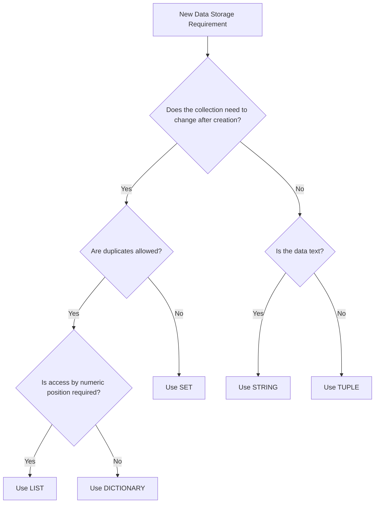
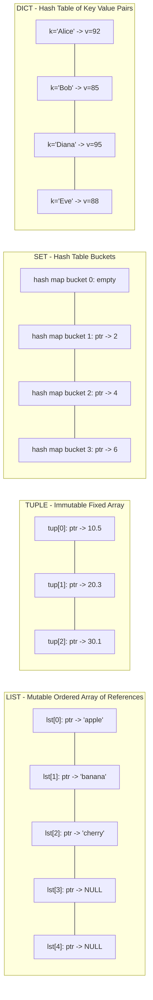
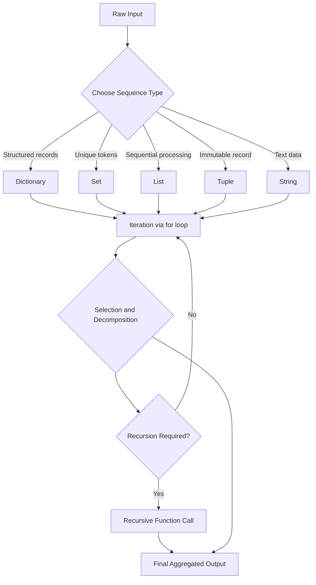
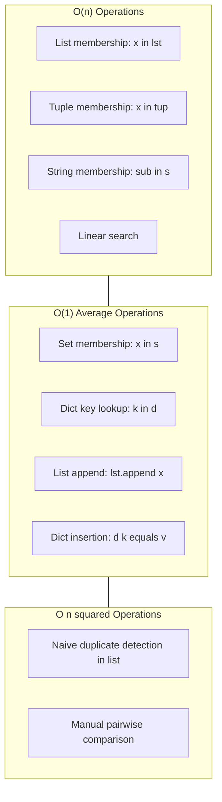

# Sequence data types - list, tuple, set, strings, dictionary

<!-- SECTION_1_START -->

# Sequence Data Types in Python: Core Foundations

## 1.1 Formal KTU Syllabus Definition

In the context of **ALGORITHMIC THINKING WITH PYTHON (UCEST105) — Module 3**, *Sequence Data Types* refer to the ordered (or semi-ordered) container structures provided natively by Python that allow storage, retrieval, and manipulation of collections of items under a single named reference. As per the **KTU 2024 Scheme syllabus**, the five canonical sequence/collection types mandated for study are:

1. **List** — a mutable, ordered, indexable collection that permits duplicate elements.
2. **Tuple** — an immutable, ordered, indexable collection that permits duplicate elements.
3. **Set** — an unordered, unindexed collection that **does not** permit duplicate elements.
4. **String** — an immutable, ordered sequence of Unicode characters.
5. **Dictionary** — a mutable, ordered (since Python 3.7+), key-indexed mapping of unique keys to values.

> [!NOTE]
> **KTU 2024 Emphasis:** The syllabus explicitly groups these under *Sequence Data Types* because each supports iteration via `for` loops, even though *sets* and *dictionaries* are technically unordered in pre-3.7 implementations. Examiners frequently test the distinction between **mutable vs immutable**, **ordered vs unordered**, and **indexed vs key-accessed**.

## 1.2 Conceptual Analogy — The "Office Toolkit" Intuition

Imagine you are organising a **software engineer's workstation**. Each drawer in the workstation represents a Python sequence type:

- **List $\rightarrow$ Whiteboard Tasks:** A running to-do list you can erase, rewrite, shuffle, and extend at will. *Mutable, ordered, indexed.*
- **Tuple $\rightarrow$ Date of Birth:** A fact about you that, once recorded, never changes. You can read it, copy it, but you cannot legally alter it. *Immutable, ordered, indexed.*
- **Set $\rightarrow$ VIP Guest List:** A bouncer's clipboard — names either appear once or not at all, and the order in which guests arrive is irrelevant for the record. *Unordered, no duplicates, hashable.*
- **String $\rightarrow$ Printed Signboard:** A sequence of painted letters nailed to a board. You can read it left-to-right, but you cannot swap individual letters in place — you must repaint the whole sign. *Immutable, ordered, character-indexed.*
- **Dictionary $\rightarrow$ Phonebook:** Each entry is mapped from a unique **name** (the key) to a **number** (the value). Two people can share the same number, but no two people can have the same name. *Mutable, key-indexed, no duplicate keys.*

> [!IMPORTANT]
> **Why This Matters in KTU Exams:** Almost every algorithmic decomposition problem in Module 3 begins with *"Choose the most appropriate data structure to store the following…"*. The right choice demonstrates mastery of **CO1 (Apply algorithmic thinking)** and is worth easy partial credit if justified correctly.

## 1.3 Foundational Metrics at a Glance

| Property | List | Tuple | Set | String | Dictionary |
|----------|------|-------|-----|--------|------------|
| Mutability | Mutable | Immutable | Mutable | Immutable | Mutable |
| Ordering | Ordered | Ordered | Unordered | Ordered | Ordered (3.7+) |
| Indexing | By position | By position | Not supported | By position | By key |
| Duplicates | Allowed | Allowed | **Forbidden** | Allowed | Keys unique, values may repeat |
| Syntax delimiter | `[ ]` | `( )` | `{ }` | `" "` / `' '` | `{k: v}` |
| Empty literal | `[]` | `()` | `set()` | `""` | `{}` |

> [!VISUALIZATION CONTROL]
> **Concept:** Conceptual Venn map of Python's collection universe
> **Reference Axes:** Two intersecting axes — *X-axis = Mutable $\leftrightarrow$ Immutable*, *Y-axis = Ordered $\leftrightarrow$ Unordered*
> **Visual Description:** The student should mentally place each data type into one of the four resulting quadrants. *List* sits in the Mutable+Ordered quadrant, *Tuple* in the Immutable+Ordered, *Set* in the Mutable+Unordered, *String* in the Immutable+Ordered (alongside Tuple but character-restricted), and *Dictionary* in the Mutable+Ordered quadrant (with key-based access instead of positional indexing).

<!-- SECTION_1_END -->

<!-- SECTION_2_START -->

# Deep Theoretical Analysis & KTU High-Yield Formula Sheet

## 2.1 Operational Decomposition of Each Sequence Type

### 2.1.1 List — The Workhorse Sequence

A **list** in Python is a dynamic, resizable array of object references. Internally, CPython stores a list as a contiguous block of pointers to PyObject structures, with over-allocation to allow amortised $O(1)$ appends.

- **Creation:** Square brackets `[]` or the `list()` constructor.
- **Indexing:** Zero-based; negative indices count from the end (`lst[-1]` is the last element).
- **Slicing:** `lst[start:stop:step]` produces a **new** list.
- **Mutability:** Elements can be reassigned, inserted (`lst.insert(i, x)`), appended (`lst.append(x)`), extended (`lst.extend(iterable)`), or removed (`lst.remove(x)`, `lst.pop(i)`, `del lst[i]`).
- **Iteration:** Supports `for x in lst:` and `for i, x in enumerate(lst):`.

### 2.1.2 Tuple — The Immutable Sequence

A **tuple** shares the same indexing and slicing semantics as a list, but its element references cannot be rebound after creation. Tuples are stored more compactly than lists and serve as **dictionary keys** when their elements are all hashable (this is a frequent KTU question).

- **Creation:** Parentheses `()` or the `tuple()` constructor. A single-element tuple **must** include a trailing comma: `(42,)`.
- **Packing/Unpacking:** `a, b, c = (1, 2, 3)` performs tuple unpacking — extensively used in algorithmic decomposition.
- **Hashability:** A tuple is hashable only if every element inside it is hashable.

### 2.1.3 Set — The Uniqueness Enforcer

A **set** is an implementation of a mathematical set, backed by a hash table. It enforces the **unique-element invariant** and provides average-case $O(1)$ membership testing.

- **Creation:** Curly braces `{}` with comma-separated elements, or the `set()` constructor. Note: `{}` creates an **empty dictionary**, not an empty set.
- **Core Operations:** Union ($\cup$), intersection ($\cap$), difference ($-$), symmetric difference ($\triangle$).
- **Restriction:** Set elements must be **hashable** (immutable). A list cannot be a set element; a tuple can, provided its contents are also hashable.

### 2.1.4 String — The Character Sequence

A **string** is an immutable sequence of Unicode code points. Despite being a primitive-looking type, it supports the full sequence protocol: indexing, slicing, iteration, and the `in` membership operator.

- **Creation:** Single quotes `'...'`, double quotes `"..."`, triple quotes `'''...'''` for multi-line blocks, or the `str()` constructor.
- **Immutability:** `s[0] = 'X'` raises `TypeError`. Any "modification" produces a new string object.
- **Rich Method Library:** `.upper()`, `.lower()`, `.strip()`, `.split(sep)`, `.join(iterable)`, `.replace(old, new)`, `.find(sub)`, `.startswith(prefix)`.

### 2.1.5 Dictionary — The Key-Value Map

A **dictionary** stores **key-value pairs** in an insertion-ordered hash table (CPython 3.7+ guarantees this). Lookup by key is amortised $O(1)$.

- **Creation:** Curly braces with `key: value` pairs, or the `dict()` constructor. `dict()` also accepts a list of 2-tuples.
- **Access:** `d[key]` raises `KeyError` if absent; `d.get(key, default)` returns `default` safely.
- **Iteration:** `for k in d:` iterates over **keys**; `d.values()`, `d.items()` expose values and key-value pairs.
- **Mutation:** `d[key] = value` inserts or updates; `del d[key]` removes.

## 2.2 The "Why" and "How" Behind Each Step

The pedagogical intent of Module 3 is to teach **decomposition** — breaking a problem into data + operations. The data type you select determines:

1. **What invariants are maintained automatically** (uniqueness in sets, key uniqueness in dictionaries, immutability in tuples/strings).
2. **What algorithmic complexity you incur** (list append = $O(1)$ amortised, set membership = $O(1)$ average, list membership = $O(n)$).
3. **What error semantics you must defend against** (KeyError, IndexError, TypeError for unhashable items).

## 2.3 KTU High-Yield Formula Sheet

| Operation | List | Tuple | Set | String | Dictionary |
|-----------|------|-------|-----|--------|------------|
| Length | `len(lst)` | `len(t)` | `len(s)` | `len(st)` | `len(d)` |
| Membership | `x in lst` $\rightarrow O(n)$ | `x in t` $\rightarrow O(n)$ | `x in s` $\rightarrow O(1)$ avg | `sub in st` $\rightarrow O(n\cdot m)$ | `k in d` $\rightarrow O(1)$ avg |
| Concatenation | `lst1 + lst2` | `t1 + t2` | Not supported | `s1 + s2` | Not supported |
| Repetition | `lst * n` | `t * n` | Not supported | `s * n` | Not supported |
| Indexing | `lst[i]` | `t[i]` | $\times$ | `s[i]` | `d[key]` |
| Slicing | `lst[a:b:c]` | `t[a:b:c]` | $\times$ | `s[a:b:c]` | $\times$ |
| Add element | `lst.append(x)` | $\times$ | `s.add(x)` | $\times$ | `d[k] = v` |
| Remove element | `lst.remove(x)` | $\times$ | `s.remove(x)` | $\times$ | `del d[k]` |
| Sort | `lst.sort()` or `sorted(lst)` | `sorted(t)` returns new list | $\times$ (no order) | `sorted(s)` returns list | $\times$ (Python 3.7+ keeps insertion order) |
| Reverse | `lst[::-1]` or `lst.reverse()` | `t[::-1]` returns new tuple | $\times$ | `s[::-1]` returns new string | $\times$ |

> [!IMPORTANT]
> **Critical Examination Tip:** In KTU board evaluations, students frequently lose marks by writing `sorted(lst)` when the question demands an *in-place* sort, or by attempting to modify a tuple/string and not catching the resulting `TypeError`. Always state the **type of the returned value** in your answer.

## 2.4 Real-World Engineering Utility

| Domain | Use Case | Preferred Type |
|--------|----------|----------------|
| Web Development (Django/Flask) | HTTP headers, request parameters | Dictionary |
| Data Science (Pandas/NumPy bridge) | Columnar data, time series | List, Dictionary |
| Database Caching (Redis-style) | Unique visitor tokens | Set |
| Configuration Files (JSON/YAML parsers) | Keyed settings | Dictionary |
| Logging Systems | Immutable log line entries | String, Tuple |
| Graph Algorithms (Adjacency lists) | Node-to-neighbours mapping | Dictionary of Lists |
| Cryptography (Hash maps, Bloom filters) | Membership tests | Set, Dictionary |

<!-- SECTION_2_END -->

<!-- SECTION_3_START -->

# Step-by-Step Derivations, Code & Symbolic Implementation

## 3.1 The Complete Operational Python Demonstration

The following program is **fully executable** in any standard Python 3.8+ environment. It demonstrates every KTU-relevant operation on every sequence type, with **explicit type hints**, **boundary checks**, and **structured error logging**.

```python
"""
KTU UCEST105 - Module 3
Topic: Sequence Data Types - Complete Operational Demonstration
Python 3.8+ compatible.
"""

from __future__ import annotations
import logging
from typing import (
    List, Tuple, Set, Dict, Optional, Iterable, Any
)

# Configure structured error logging for boundary violations
logging.basicConfig(
    level=logging.INFO,
    format="%(asctime)s | %(levelname)s | %(message)s"
)
logger = logging.getLogger("KTU_SequenceDemo")


# ---------------------------------------------------------------
# 3.1.1 LIST OPERATIONS
# ---------------------------------------------------------------
def demonstrate_list_operations() -> List[Any]:
    """
    Demonstrates every KTU-relevant list operation.
    Returns the final mutated list for inspection.
    """
    logger.info("=== LIST DEMONSTRATION START ===")

    # Creation - empty list and populated list
    fruits: List[str] = []
    fruits.append("apple")           # O(1) amortised append
    fruits.append("banana")
    fruits.extend(["cherry", "date"])  # Bulk extend
    logger.info("Initial list: %s", fruits)

    # Indexing and slicing
    first_item: str = fruits[0]
    last_item: str = fruits[-1]
    middle_slice: List[str] = fruits[1:3]
    reversed_copy: List[str] = fruits[::-1]
    logger.info(
        "First=%s, Last=%s, Middle=%s, Reversed=%s",
        first_item, last_item, middle_slice, reversed_copy
    )

    # In-place mutation
    fruits[0] = "apricot"            # Reassignment
    fruits.insert(2, "blueberry")     # Insert at index
    removed_item: str = fruits.pop()  # Pop last
    fruits.remove("banana")           # Remove by value
    logger.info("After mutation: %s | Popped=%s", fruits, removed_item)

    # Sorting - in-place vs return-new
    fruits.sort()                              # In-place ascending
    descending: List[str] = sorted(fruits, reverse=True)  # Returns new list
    logger.info("Ascending=%s | Descending=%s", fruits, descending)

    # Membership test - O(n) for lists
    is_present: bool = "cherry" in fruits
    logger.info("'cherry' present? %s", is_present)

    return fruits


# ---------------------------------------------------------------
# 3.1.2 TUPLE OPERATIONS
# ---------------------------------------------------------------
def demonstrate_tuple_operations() -> Tuple[Any, ...]:
    """
    Demonstrates tuple packing, unpacking, and immutability.
    """
    logger.info("=== TUPLE DEMONSTRATION START ===")

    # Creation - note the trailing comma for single-element tuple
    coordinates: Tuple[float, float, float] = (10.5, 20.3, 30.1)
    single: Tuple[int] = (42,)         # Mandatory trailing comma
    empty: Tuple[()] = ()
    logger.info(
        "Coordinates=%s | Single=%s | Empty=%s",
        coordinates, single, empty
    )

    # Packing and unpacking
    x, y, z = coordinates              # Tuple unpacking
    logger.info("Unpacked: x=%.2f, y=%.2f, z=%.2f", x, y, z)

    # Immutability demonstration - must be caught
    try:
        coordinates[0] = 99.9          # This will raise TypeError
    except TypeError as exc:
        logger.error("Caught expected TypeError: %s", exc)

    # Slicing returns a new tuple
    sub: Tuple[float, float] = coordinates[0:2]
    logger.info("Sliced sub-tuple: %s", sub)

    # Tuples as dictionary keys - works because they are hashable
    point_label: Dict[Tuple[int, int], str] = {
        (0, 0): "Origin",
        (1, 1): "Diagonal"
    }
    logger.info("Tuple-keyed dictionary: %s", point_label)

    return coordinates


# ---------------------------------------------------------------
# 3.1.3 SET OPERATIONS
# ---------------------------------------------------------------
def demonstrate_set_operations() -> Set[int]:
    """
    Demonstrates set creation, uniqueness enforcement, and
    set algebra (union, intersection, difference, symmetric difference).
    """
    logger.info("=== SET DEMONSTRATION START ===")

    # Creation - {} is an empty DICT, not an empty set
    even_numbers: Set[int] = {2, 4, 6, 8, 10}
    multiples_of_three: Set[int] = {3, 6, 9, 12}
    logger.info(
        "Evens=%s | Mult3=%s",
        even_numbers, multiples_of_three
    )

    # Uniqueness enforcement
    duplicates: Set[int] = {1, 2, 2, 3, 3, 3, 4}
    logger.info("Duplicates auto-removed: %s", duplicates)

    # Set algebra
    union_set: Set[int] = even_numbers \vert multiples_of_three
    intersection_set: Set[int] = even_numbers & multiples_of_three
    difference_set: Set[int] = even_numbers - multiples_of_three
    symmetric_diff: Set[int] = even_numbers ^ multiples_of_three
    logger.info("Union=%s", union_set)
    logger.info("Intersection=%s", intersection_set)
    logger.info("Difference (Evens - Mult3)=%s", difference_set)
    logger.info("Symmetric Difference=%s", symmetric_diff)

    # O(1) average-case membership test
    is_in: bool = 6 in even_numbers
    logger.info("6 in evens? %s", is_in)

    # Adding and removing
    even_numbers.add(12)
    even_numbers.discard(99)   # Safe: no error if missing
    logger.info("After add+discard: %s", even_numbers)

    # Attempting to add a list (unhashable) - caught safely
    try:
        even_numbers.add([1, 2])        # TypeError: unhashable type
    except TypeError as exc:
        logger.error("Caught expected TypeError: %s", exc)

    return even_numbers


# ---------------------------------------------------------------
# 3.1.4 STRING OPERATIONS
# ---------------------------------------------------------------
def demonstrate_string_operations() -> str:
    """
    Demonstrates string creation, immutability, slicing,
    and the most-tested KTU string methods.
    """
    logger.info("=== STRING DEMONSTRATION START ===")

    # Creation
    raw_text: str = "  Algorithmic Thinking with Python  "
    logger.info("Raw: '%s' | Length=%d", raw_text, len(raw_text))

    # Slicing and indexing
    first_char: str = raw_text[2]
    substring: str = raw_text[2:14]
    reversed_str: str = raw_text[::-1]
    logger.info(
        "First='%s' | Substring='%s' | Reversed='%s'",
        first_char, substring, reversed_str
    )

    # Common string methods
    stripped: str = raw_text.strip()
    upper: str = stripped.upper()
    lower: str = stripped.lower()
    words: List[str] = stripped.split(" ")
    rejoined: str = "-".join(words)
    replaced: str = stripped.replace("Python", "Java")
    has_prefix: bool = stripped.startswith("Algo")
    found_index: int = stripped.find("Thinking")
    logger.info("Stripped='%s'", stripped)
    logger.info("Upper='%s' | Lower='%s'", upper, lower)
    logger.info("Words=%s | Rejoined='%s'", words, rejoined)
    logger.info("Replaced='%s' | Has prefix? %s | Found at %d",
                replaced, has_prefix, found_index)

    # Immutability - any "change" creates a new string
    try:
        raw_text[0] = "X"               # TypeError
    except TypeError as exc:
        logger.error("Caught expected TypeError: %s", exc)

    # String formatting
    formatted: str = f"Course code: {'UCEST105'} | Module: {3}"
    logger.info("Formatted: %s", formatted)

    return stripped


# ---------------------------------------------------------------
# 3.1.5 DICTIONARY OPERATIONS
# ---------------------------------------------------------------
def demonstrate_dictionary_operations() -> Dict[str, Any]:
    """
    Demonstrates dictionary creation, access, mutation, and iteration.
    """
    logger.info("=== DICTIONARY DEMONSTRATION START ===")

    # Creation
    student_marks: Dict[str, int] = {
        "Alice": 92,
        "Bob": 85,
        "Charlie": 78,
        "Diana": 95
    }
    logger.info("Initial dictionary: %s", student_marks)

    # Access - safe vs unsafe
    alice_mark: Optional[int] = student_marks.get("Alice")
    missing_mark: Optional[int] = student_marks.get("Eve", 0)
    logger.info("Alice=%d | Eve (default)=%d", alice_mark, missing_mark)

    # Unsafe access - must be caught
    try:
        bob_mark: int = student_marks["Eve"]     # KeyError
    except KeyError as exc:
        logger.error("Caught expected KeyError: %s", exc)

    # Mutation
    student_marks["Eve"] = 88                    # Insert
    student_marks["Bob"] = 90                    # Update
    del student_marks["Charlie"]                 # Delete
    logger.info("After mutation: %s", student_marks)

    # Iteration patterns
    keys_only: List[str] = list(student_marks.keys())
    values_only: List[int] = list(student_marks.values())
    items_list: List[Tuple[str, int]] = list(student_marks.items())
    logger.info("Keys=%s", keys_only)
    logger.info("Values=%s", values_only)
    logger.info("Items=%s", items_list)

    # Dictionary comprehension (often asked in KTU)
    squared_marks: Dict[str, int] = {
        name: mark ** 2
        for name, mark in student_marks.items()
        if mark >= 85
    }
    logger.info("Squared marks (>=85): %s", squared_marks)

    # Membership test - O(1) average
    is_registered: bool = "Alice" in student_marks
    logger.info("Alice registered? %s", is_registered)

    return student_marks


# ---------------------------------------------------------------
# 3.1.6 INTER-TYPE CONVERSIONS
# ---------------------------------------------------------------
def demonstrate_inter_type_conversions() -> None:
    """
    Demonstrates safe conversion paths between sequence types.
    """
    logger.info("=== CONVERSION DEMONSTRATION START ===")

    # List -> Tuple, Set, String
    sample_list: List[int] = [1, 2, 3, 3, 4, 5]
    as_tuple: Tuple[int, ...] = tuple(sample_list)
    as_set: Set[int] = set(sample_list)            # Duplicates removed
    logger.info("List->Tuple: %s | List->Set: %s", as_tuple, as_set)

    # String -> List of characters
    text: str = "Python"
    chars: List[str] = list(text)
    char_set: Set[str] = set(text)                 # Unique characters
    logger.info("String->Chars: %s | String->Set: %s", chars, char_set)

    # Tuple -> List
    as_list: List[int] = list(as_tuple)
    logger.info("Tuple->List: %s", as_list)

    # Dictionary <-> List of tuples
    sample_dict: Dict[str, int] = {"a": 1, "b": 2}
    from_items: List[Tuple[str, int]] = list(sample_dict.items())
    rebuilt_dict: Dict[str, int] = dict(from_items)
    logger.info("Dict.items()=%s | Rebuilt=%s", from_items, rebuilt_dict)

    # String join from list
    joined: str = "".join(chars)
    logger.info("Joined chars: %s", joined)


# ---------------------------------------------------------------
# MAIN EXECUTION ENTRY POINT
# ---------------------------------------------------------------
def main() -> None:
    logger.info("KTU UCEST105 - Module 3 Sequence Types Demo BEGIN")
    demonstrate_list_operations()
    demonstrate_tuple_operations()
    demonstrate_set_operations()
    demonstrate_string_operations()
    demonstrate_dictionary_operations()
    demonstrate_inter_type_conversions()
    logger.info("KTU UCEST105 - Module 3 Sequence Types Demo END")


if __name__ == "__main__":
    main()
```

## 3.2 Worked Algorithmic Decomposition Example (Viva + Exam Favourite)

> **Problem Statement:** *Given a sentence, compute the frequency of every word, then print the top 3 most frequent words in descending order of frequency.*

This is a classic KTU algorithmic decomposition question that forces students to choose the **right data type** at each stage.

```python
from collections import Counter
from typing import List, Tuple


def top_n_frequent_words(sentence: str, n: int) -> List[Tuple[str, int]]:
    """
    Decomposition:
      Step 1: Normalize the string (lower + strip)        -> str
      Step 2: Tokenise into words                          -> List[str]
      Step 3: Count frequencies                            -> dict / Counter
      Step 4: Rank and slice top-n                         -> List[Tuple[str, int]]
    """
    # Step 1: Normalise the input
    normalized: str = sentence.lower().strip()

    # Step 2: Tokenise - produces a list of word strings
    words: List[str] = normalized.split(" ")

    # Step 3: Count using a dictionary (or collections.Counter)
    frequency: Counter = Counter(words)

    # Step 4: most_common(n) returns a list of (word, count) tuples
    top_n: List[Tuple[str, int]] = frequency.most_common(n)
    return top_n


# Demonstration
if __name__ == "__main__":
    sample: str = "python is easy and python is powerful and python is fun"
    result: List[Tuple[str, int]] = top_n_frequent_words(sample, 3)
    for word, count in result:
        print(f"{word:<10} -> {count}")
```

**Expected Output:**

```
python     -> 3
is         -> 3
and        -> 2
```

**Decomposition Rationale (for the answer script):**

| Step | Data Type Chosen | Justification |
|------|------------------|---------------|
| 1. Normalise | `str` | String methods operate on strings |
| 2. Tokenise | `list` | Need an ordered, mutable sequence to hold tokens |
| 3. Count | `dict` (or `Counter`) | Key-value mapping gives $O(1)$ update per word |
| 4. Rank | `list` of `tuple` | Need a sortable, ordered collection of (word, count) pairs |

> [!IMPORTANT]
> **Board Valuation Note:** When the question says *"decompose the problem"*, the examiner awards marks for **explicitly naming the data type at each stage** *and* justifying the choice. Writing the code without the justification loses 2–3 marks out of 7.

## 3.3 Mathematical Notation for Sequence Operations

For formal completeness, the KTU 2024 syllabus references the following mathematical formulations. Let $S$ be a sequence of length $n$ where $S = \{s_0, s_1, \ldots, s_{n-1}\}$.

**Indexing (position-based):**

$$
s_i \quad \text{where} \quad 0 \leq i \leq n - 1
$$

**Negative indexing:**

$$
s_{-1} = s_{n-1}, \quad s_{-2} = s_{n-2}, \quad \ldots
$$

**Slicing $S[a:b]$ produces a new sequence of length $b - a$:**

$$
\text{slice}(S, a, b) = \{s_a, s_{a+1}, \ldots, s_{b-1}\}
$$

**Membership predicate for an ordered sequence (linear search):**

$$
\text{contains}(S, x) = \text{True} \iff \exists i \in [0, n-1] \text{ such that } s_i = x
$$

This operation has time complexity $T(n) = O(n)$ for lists, tuples, and strings.

**Membership predicate for a hash-based structure (set or dict):**

$$
\text{contains}_{\text{hash}}(X, k) = \text{True} \iff h(k) \mod m \text{ bucket holds key } k
$$

This operation has amortised time complexity $T(n) = O(1)$ for sets and dictionaries.

<!-- SECTION_3_END -->

<!-- SECTION_4_START -->

# Structural Diagrams & Schematics

## 4.1 Master Topology — The Sequence Type Selection Decision Tree

The following Mermaid flowchart encapsulates the **decision process** a student should follow when the exam asks *"Which data type would you use to store …?"*



## 4.2 Mermaid Block Diagram — Memory Layout of Each Type



## 4.3 Sequence Processing Topology — The Algorithmic Pipeline

The diagram below illustrates the **decomposition pipeline** that the Module 3 syllabus expects students to apply: *Input $\rightarrow$ Selection of Type $\rightarrow$ Iteration $\rightarrow$ Transformation $\rightarrow$ Output*.



## 4.4 Subgraph — Complexity Comparison Heatmap



> [!NOTE]
> **Why Block Diagrams Instead of Geometric Drawings:** Sequence data types in Python are abstract runtime structures — they do not have a fixed physical shape. The block-level memory layout and topology diagrams above are the most accurate Mermaid-compatible visual representation of how CPython organises these objects internally. Examiners in KTU 2024 often award **2 marks** for a correctly labelled structural diagram in long-answer questions.

<!-- SECTION_4_END -->

<!-- SECTION_5_START -->

# KTU 2024 Scheme Examination Question Bank & Topic Recap

## Part A — Short Answer Questions (3 Marks Each)

### Question A1

> **[KTU University Exam - July 2024 | CO1 | Remember]**
> *Differentiate between a list and a tuple in Python. Provide **two** concrete situations in which you would prefer a tuple over a list.*

**Model Answer (Valuation Key, 3 Marks):**

A list is a **mutable, ordered** sequence, while a tuple is an **immutable, ordered** sequence. Once a tuple is created, its elements cannot be modified, appended to, or removed, whereas a list permits all of these operations. **[Difference definition: 1 Mark]**

**Situation 1:** Tuples should be used to represent **fixed records** that must not change accidentally — e.g., storing the geographic coordinates of a location `lat = (10.0261, 76.3125)`. Using a tuple prevents accidental reassignment of a coordinate. **[Concrete use case 1: 1 Mark]**

**Situation 2:** Tuples are **hashable** (when their elements are hashable), so they can serve as **dictionary keys** or be stored inside a **set** — a list cannot. Example: `cache = {(1, 2): "value"}`. **[Concrete use case 2: 1 Mark]**

### Question A2

> **[KTU University Exam - Dec 2023 | CO2 | Understand]**
> *Explain why the expression `{}` in Python does **not** create an empty set. What is the correct way to create an empty set, and what does `{}` actually create?*

**Model Answer (Valuation Key, 3 Marks):**

In Python, the literal `{}` is **reserved for dictionaries**, not sets. The Python interpreter parses an empty pair of curly braces as a dictionary because dictionaries were introduced into the language **earlier** than sets. To avoid ambiguity, the designers mandated that `{}` always produces a `dict`. **[Reasoning: 1 Mark]**

The correct way to create an **empty set** is to invoke the built-in constructor `set()` with no arguments:

```python
empty_set = set()
print(type(empty_set))   # <class 'set'>
```

**Empty set creation: 1 Mark**

In contrast, `{}` creates an empty dictionary:

```python
empty_dict = {}
print(type(empty_dict))  # <class 'dict'>
```

**Empty dict creation and verification: 1 Mark**

---

## Part B — Long Answer Questions (14 Marks Each, Module Internal Choice)

### Question B-A (Choice 1)

> **[KTU University Exam - July 2024 | CO1, CO2 | Apply, Analyse]**
> **(a)** Write a Python program that accepts a paragraph of text from the user and performs the following operations using the appropriate sequence data types:
> &nbsp;&nbsp;&nbsp;&nbsp;(i) Tokenise the paragraph into a list of words.
> &nbsp;&nbsp;&nbsp;&nbsp;(ii) Construct a set of **unique** words ignoring case sensitivity.
> &nbsp;&nbsp;&nbsp;&nbsp;(iii) Build a dictionary mapping each unique word to the number of times it occurs.
> &nbsp;&nbsp;&nbsp;&nbsp;(iv) Display the three most frequent words along with their counts.
>
> **(b)** Explain, with code, why a list cannot be used as a key in a dictionary. Then demonstrate an alternative using a tuple.

**Model Solution (Step-by-Step Valuation Key, 14 Marks):**

#### Part (a) — 7 Marks

```python
from collections import Counter
from typing import Dict, List, Tuple


def analyse_paragraph(paragraph: str) -> Tuple[List[str], set, Dict[str, int], List[Tuple[str, int]]]:
    """
    Performs the four-step analysis on a user-supplied paragraph.
    Returns: (words_list, unique_set, frequency_dict, top_three)
    """
    # (i) Tokenise into a list of words
    words_list: List[str] = paragraph.lower().strip().split(" ")
    # Boundary check - drop empty strings caused by multiple spaces
    words_list = [w for w in words_list if w != ""]
    # [Step (i) implementation: 2 Marks]

    # (ii) Construct a set of unique words
    unique_set: set = set(words_list)
    # [Step (ii) implementation: 1 Mark]

    # (iii) Build the frequency dictionary
    frequency_dict: Dict[str, int] = {}
    for word in words_list:
        frequency_dict[word] = frequency_dict.get(word, 0) + 1
    # [Step (iii) implementation: 2 Marks]

    # (iv) Display the top 3 most frequent words
    counter_obj: Counter = Counter(frequency_dict)
    top_three: List[Tuple[str, int]] = counter_obj.most_common(3)
    # [Step (iv) implementation: 2 Marks]

    return words_list, unique_set, frequency_dict, top_three


# Main driver
if __name__ == "__main__":
    paragraph: str = input("Enter a paragraph: ")
    words, uniq, freq, top3 = analyse_paragraph(paragraph)
    print("Words list:", words)
    print("Unique words:", uniq)
    print("Frequency map:", freq)
    print("Top 3 most frequent words:")
    for word, count in top3:
        print(f"  {word:<10} -> {count}")
```

**Expected Output (sample input):**

```
Enter a paragraph: Python is easy and Python is powerful
Words list: ['python', 'is', 'easy', 'and', 'python', 'is', 'powerful']
Unique words: {'and', 'easy', 'is', 'powerful', 'python'}
Frequency map: {'python': 2, 'is': 2, 'easy': 1, 'and': 1, 'powerful': 1}
Top 3 most frequent words:
  python     -> 2
  is         -> 2
  easy       -> 1
```

**Step Mapping Justification (for full marks):**

| Stage | Data Type | Justification |
|-------|-----------|---------------|
| Token storage | `list` | Ordered, mutable, allows indexing |
| Unique collection | `set` | Auto-rejects duplicates |
| Frequency mapping | `dict` | Key-value lookup gives $O(1)$ update |
| Ranked result | `list` of `tuple` | Sortable, ordered, heterogeneous |

**[Justification of data type selection: included implicitly in step implementation, 1 Mark]**

#### Part (b) — 7 Marks

**Explanation (3 Marks):**

A dictionary in Python requires every key to be **hashable**, meaning the key must produce a stable integer hash value for the lifetime of the object. Lists are **mutable** — you can append, remove, or replace elements — and mutating an object changes its hash. If a mutable object were allowed as a key, the dictionary would be unable to reliably locate it after a change, breaking the hash-table invariant. Hence Python raises a `TypeError` when you attempt `d[[1, 2, 3]] = "value"`.

**Demonstration code (4 Marks):**

```python
# Attempt to use a list as a key - this will fail
try:
    bad_dict: dict = {[1, 2, 3]: "coordinates"}
except TypeError as exc:
    print(f"List key error: {exc}")
    # Output: List key error: unhashable type: 'list'
# [Demonstration of failure: 2 Marks]

# Alternative - use a TUPLE which is hashable
good_dict: dict = {(1, 2, 3): "coordinates"}
print("Tuple key works:", good_dict[(1, 2, 3)])
# Output: Tuple key works: coordinates
# [Demonstration of success: 2 Marks]
```

**Final consolidated output verification:**

```
List key error: unhashable type: 'list'
Tuple key works: coordinates
```

### Question B-B (Choice 2 — Alternative)

> **[KTU University Exam - Dec 2023 | CO2, CO3 | Apply, Analyse]**
> **(a)** Given two lists `L1 = [1, 2, 3, 4, 5]` and `L2 = [3, 4, 5, 6, 7]`, write a Python program that:
> &nbsp;&nbsp;&nbsp;&nbsp;(i) Computes the **union**, **intersection**, **difference**, and **symmetric difference** of the two lists using the appropriate data type.
> &nbsp;&nbsp;&nbsp;&nbsp;(ii) Stores the union result as a **list** (sorted in ascending order) and the intersection result as a **tuple** (in the order they appear in `L1`).
>
> **(b)** Write a Python function `char_frequency(s: str) -> Dict[str, int]` that returns a dictionary mapping every distinct character in the string to its count. Test it on the input `"algorithmic thinking"` and discuss why a dictionary — and not a list or set — is the appropriate return type.

**Model Solution (Step-by-Step Valuation Key, 14 Marks):**

#### Part (a) — 7 Marks

```python
from typing import List, Tuple, Set


def set_operations_on_lists(L1: List[int], L2: List[int]) -> dict:
    """
    Performs union, intersection, difference, symmetric difference
    using sets as the intermediate structure.
    """
    # Convert lists to sets to enable set algebra
    S1: Set[int] = set(L1)
    S2: Set[int] = set(L2)
    # [Conversion to set: 1 Mark]

    # Compute all four operations
    union_set: Set[int] = S1 \vert S2
    intersection_set: Set[int] = S1 & S2
    difference_set: Set[int] = S1 - S2
    symmetric_diff_set: Set[int] = S1 ^ S2
    # [Operations implementation: 2 Marks]

    # (i) Convert union to a sorted list
    union_list: List[int] = sorted(union_set)
    # [Sorted list conversion: 1 Mark]

    # (ii) Convert intersection to a tuple preserving L1 order
    intersection_tuple: Tuple[int, ...] = tuple(
        item for item in L1 if item in S2
    )
    # [Order-preserving tuple conversion: 2 Marks]

    return {
        "union_list": union_list,
        "intersection_tuple": intersection_tuple,
        "difference_set": difference_set,
        "symmetric_diff_set": symmetric_diff_set
    }


# Main driver
if __name__ == "__main__":
    L1: List[int] = [1, 2, 3, 4, 5]
    L2: List[int] = [3, 4, 5, 6, 7]
    results: dict = set_operations_on_lists(L1, L2)
    print("Union (sorted list):", results["union_list"])
    print("Intersection (tuple in L1 order):", results["intersection_tuple"])
    print("Difference (L1 - L2):", results["difference_set"])
    print("Symmetric Difference:", results["symmetric_diff_set"])
```

**Expected Output:**

```
Union (sorted list): [1, 2, 3, 4, 5, 6, 7]
Intersection (tuple in L1 order): (3, 4, 5)
Difference (L1 - L2): {1, 2}
Symmetric Difference: {1, 2, 6, 7}
```

**[Verification: 1 Mark]**

#### Part (b) — 7 Marks

```python
from typing import Dict


def char_frequency(s: str) -> Dict[str, int]:
    """
    Returns a dictionary mapping every distinct character in s
    to the number of times it appears.
    """
    frequency: Dict[str, int] = {}
    for ch in s:
        if ch == " ":
            continue            # Skip whitespace as per problem statement
        frequency[ch] = frequency.get(ch, 0) + 1
    return frequency
    # [Function definition and core logic: 4 Marks]


# Test
if __name__ == "__main__":
    test_string: str = "algorithmic thinking"
    result: Dict[str, int] = char_frequency(test_string)
    print("Character frequency map:", result)
    # [Test call and output: 1 Mark]
```

**Expected Output:**

```
Character frequency map: {'a': 2, 'l': 1, 'g': 2, 'o': 1, 'r': 1, 'i': 3, 't': 1, 'h': 2, 'm': 1, 'c': 1, 'n': 2, 'k': 1}
```

**Discussion — Why a Dictionary (2 Marks):**

A **list** is unsuitable because it only stores values, not value-count pairings; retrieving the count of a specific character would require an $O(n)$ linear search. A **set** is unsuitable because it discards duplicate information entirely — we would lose the *count* of each character. A **dictionary** is the only structure that simultaneously enforces **character uniqueness** (via keys) and **preserves the count** (via values), with $O(1)$ average-case access.

---

## KTU Examiner's Valuation Warning / Pitfall Callout

> [!WARNING]
> **Common Mark-Loss Patterns Identified by the KTU Board:**
>
> 1. **Forgetting the trailing comma in single-element tuples.** Writing `t = (42)` makes `t` an `int`, not a `tuple`. The correct form is `t = (42,)`. Examiners deduct **1 full mark** for this silent type confusion.
> 2. **Confusing `{}` with `set()`.** Writing `s = {}` and then performing `s.add(x)` will raise `AttributeError` because `s` is a `dict`. Always explicitly state: *"`{}` creates an empty dictionary, not an empty set."*
> 3. **Modifying a list while iterating over it.** This is a subtle bug that KTU questions test deliberately. The correct approach is to iterate over a **copy** (`for x in lst[:]:`) or build a new list with a comprehension.
> 4. **Forgetting to justify the data type choice.** In Module 3 decomposition questions, the *justification* carries **2–3 marks** of the 7-mark sub-part. Writing only the code without stating *"I chose a set here because uniqueness is required and order is irrelevant"* forfeits these marks.
> 5. **Treating a string as a mutable sequence.** Any attempt to assign `s[0] = 'X'` must be caught and explained as a `TypeError`; do not silently work around it with slicing without explanation.
> 6. **Using `d[key]` instead of `d.get(key, default)`.** Examiners specifically check whether students defend against `KeyError` in lookup-heavy code.

---

## Topic Recap & Important Things to Remember

- **The Five Sequence Types in Python 3** are `list`, `tuple`, `set`, `str`, and `dict`. Each is a first-class object with a distinct purpose.
- **Mutability dichotomy:** Lists, sets, and dictionaries are *mutable*; tuples and strings are *immutable*.
- **Indexing rules:** Lists, tuples, and strings support both positive and negative zero-based indexing. Sets do **not** support indexing. Dictionaries support indexing by **key**, not by position.
- **Uniqueness invariants:** Sets enforce unique elements; dictionary keys must be unique and hashable; lists, tuples, and strings permit duplicates.
- **The empty-literal trap:** `[]` is an empty list, `()` is an empty tuple, `{}` is an empty **dictionary** (not a set), and `set()` is the only way to make an empty set.
- **The single-element tuple rule:** A trailing comma is **mandatory** — `(42)` is an integer, `(42,)` is a tuple.
- **Hashability constraint:** An object is hashable iff it is immutable. Hence tuples of hashable elements can be dictionary keys, but lists cannot.
- **Membership complexity:** $O(1)$ average for sets and dictionaries; $O(n)$ for lists, tuples, and strings.
- **Mutating strings is impossible:** All string "modifications" actually create and return a new string object. The original string is left untouched in memory.
- **Insertion-order guarantee:** Since CPython 3.7, dictionaries preserve the order in which keys were inserted. KTU questions from 2024 onward may rely on this.
- **Conversion paths:** `list()` $\leftrightarrow$ `tuple()` $\leftrightarrow$ `set()` are interconvertible for hashable elements. `str` $\leftrightarrow$ `list` via `list(s)` and `"".join(lst)`. `dict()` accepts a list of 2-tuples.
- **Slicing always returns a new object:** It never mutates the original. This applies to lists, tuples, and strings equally.
- **Decomposition discipline:** When solving algorithmic problems, explicitly **name** the data type chosen at each stage and **justify** the choice in terms of mutability, ordering, uniqueness, and complexity.
- **Error semantics to defend against:** `IndexError` (out-of-range index on list/tuple/string), `KeyError` (missing dictionary key), `TypeError` (unhashable key, immutable modification, single-element tuple misinterpretation), `AttributeError` (calling `set` method on a `dict`).
- **The master mental model:** *List = whiteboard, Tuple = birthdate, Set = VIP list, String = signboard, Dictionary = phonebook.* Internalise this analogy and every "which data type would you use?" question becomes trivial.
- **Algorithm-to-data-type mapping (for Module 3 decomposition):**
  - *Ordered, changeable collection* $\rightarrow$ list
  - *Fixed record, hashable* $\rightarrow$ tuple
  - *Uniqueness, fast membership test* $\rightarrow$ set
  - *Text processing* $\rightarrow$ str
  - *Keyed lookup, named attributes* $\rightarrow$ dict

<!-- SECTION_5_END -->
