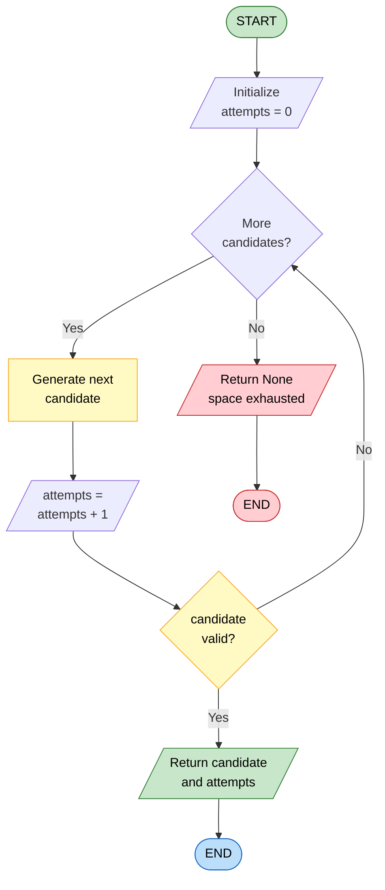
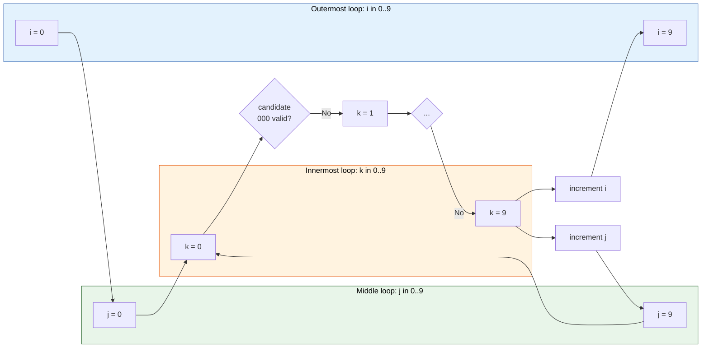
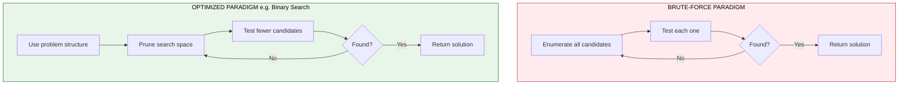

# Brute-force Approach (Padlock, Password guessing)

<!-- SECTION_1_START -->

# Brute-Force Approach

> [!NOTE]
> **KTU 2024 Scheme | UCEST105 | Module 4** — Computational Approaches to Problem-Solving
> **Course Outcome Mapped:** CO2 — *Illustrate the working of fundamental algorithmic strategies using Python.*
> **Bloom's Level:** Understand / Apply

---

## 1.1 Formal Definition (KTU Syllabus Terminology)

The **Brute-Force Approach** is a fundamental algorithmic paradigm that solves a problem by **systematically enumerating every possible candidate solution** in the search space and **checking each one** against the target condition until a valid solution is found (or all candidates are exhausted).

In the context of KTU Module 4, brute-force is presented as the **most direct, simplest, and most general** computational strategy — often the *first* approach a programmer attempts before optimizing with smarter algorithms (divide-and-conquer, greedy, dynamic programming, etc.).

Mathematically, given a search space $\mathcal{S}$ of size $N$, a brute-force algorithm has a worst-case time complexity of:

$$T(n) = \mathcal{O}(N)$$

where $N$ represents the total number of candidate solutions that must be inspected.

> [!IMPORTANT]
> **KTU Highlight — When is Brute-Force Acceptable?**
> Brute-force is *practical and acceptable* in KTU examinations and in real engineering work when:
> 1. The search space is **small** ($N \le 10^6$ candidates).
> 2. The problem has **no known efficient algorithm** (e.g., NP-complete problems at small scale).
> 3. It is used as a **correctness baseline** to verify optimized solutions.
> 4. Simplicity and clarity outweigh the need for performance.

---

## 1.2 Conceptual Analogy — The Padlock and the Password

### Analogy 1: The Combination Padlock

Imagine a standard **3-digit combination padlock** where each dial accepts digits from **0** to **9**. You have forgotten the code. There are exactly:

$$10 \times 10 \times 10 = 10^3 = 1000$$

possible combinations. The brute-force strategy is straightforward: you start at **0-0-0**, test it; if it doesn't open, move to **0-0-1**, test it; continue through **0-0-2**, …, **9-9-9**.

You are guaranteed to find the correct combination — but in the *worst case*, you may need to try all **1000** combinations.

| Property | Value |
|---|---|
| Search space size $N$ | $10^3 = 1000$ |
| Characters per position $k$ | 10 |
| Length of combination $n$ | 3 |
| Worst-case attempts | 1000 |
| Average attempts (random) | 500 |

### Analogy 2: The Forgotten Password

Suppose your laptop password is **4 characters long**, drawn from lowercase English letters (a–z, 26 letters). The total password space is:

$$26^4 = 456{,}976 \text{ possible passwords}$$

A brute-force password cracker will iterate through `"aaaa"`, `"aaab"`, …, `"aaac"`, …, eventually reaching `"zzzz"`. This is the same enumeration strategy as the padlock — only the **alphabet** and **length** differ.

> [!TIP]
> **Real-World Mapping:** The "Padlock" and "Password Guessing" examples are the *canonical* teaching examples used in KTU's official Module 4 lecture material. Mastering these two examples directly addresses Module 4's learning outcomes.

---

## 1.3 Visual Intuition — Search Space Enumeration

Picture a **3D grid** where each axis represents one digit of a 3-digit padlock. The brute-force algorithm walks through this grid one cell at a time:

| Dimension | Range | Count |
|---|---|---|
| Digit 1 (hundreds) | 0 – 9 | 10 |
| Digit 2 (tens) | 0 – 9 | 10 |
| Digit 3 (units) | 0 – 9 | 10 |
| **Total cells** | — | **1000** |

A brute-force search simply visits every cell, in order, until the target cell is found.

> [!VISUALIZATION CONTROL]
> **Concept:** Nested-loop enumeration of a 3-digit search space
> **GeoGebra / Desmos Input Equations:**
> * `f(x,y) = x + 10*y`  (mapper from 2D pair to integer index)
> * Plot points $(x, y, z)$ for $x \in [0,9]$, $y \in [0,9]$, $z = f(x,y)$
> **Visual Description:** A 10×10 lattice of points rising linearly along the $z$-axis. The brute-force traversal is a *snake-like path* that sweeps row by row, column by column — a visual proof that every cell is visited exactly once.

---

## 1.4 The Three Pillars of Every Brute-Force Algorithm

Every brute-force solution in this module — regardless of problem — has exactly three structural components:

1. **Enumeration (Generation):** A systematic method to produce the *next* candidate from the current one (e.g., nested `for` loops, recursion, `itertools.product`).
2. **Validation (Check):** A predicate function that tests whether the current candidate is a valid solution (e.g., "does this open the lock?", "does this match the password?").
3. **Termination:** A clear stopping condition — either a candidate is found, or the search space is fully exhausted.

> [!NOTE]
> **KTU Board Tip:** Examiners often award **partial credit** for a correctly structured brute-force even when it is not the most efficient approach. Always include the three pillars explicitly in your answer.

---

<!-- SECTION_1_END -->

<!-- SECTION_2_START -->

# Deep Theoretical Analysis & KTU High-Yield Formula Sheet

## 2.1 The Anatomy of a Brute-Force Search

A brute-force algorithm is, at its core, a **triple** $(\mathcal{S}, \text{next}, \text{valid})$ where:

- $\mathcal{S}$ is the finite search space of all candidates.
- $\text{next} : \mathcal{S} \to \mathcal{S} \cup \{\bot\}$ generates the *next* candidate, returning $\bot$ (sentinel) when the space is exhausted.
- $\text{valid} : \mathcal{S} \to \{\text{True}, \text{False}\}$ is the predicate that tests a candidate.

The general template is:

```
candidate = first_candidate()
while candidate is not EXHAUSTED:
    if valid(candidate):
        RETURN candidate         # SUCCESS
    candidate = next(candidate)
RETURN FAILURE                    # No solution exists in S
```

This is sometimes called the **British Museum algorithm** — because it's like trying to find an exhibit by walking through every single room.

---

## 2.2 KTU Formula Sheet — Search Space Sizes

The single most important calculation in brute-force problems is the **size of the search space** $N$. For an alphabet of size $k$ and a string of length $n$:

| Scenario | Formula | Example | Search Space |
|---|---|---|---|
| Fixed-length string | $N = k^n$ | 3-digit padlock, $k=10$, $n=3$ | $10^3 = 1{,}000$ |
| Variable-length, max length $L$ | $N = \sum_{i=1}^{L} k^i = \dfrac{k(k^L - 1)}{k - 1}$ | Passwords of length 1–4, $k=26$ | $\dfrac{26(26^4 - 1)}{25} \approx 475{,}254$ |
| Permutations of $n$ distinct items | $N = n!$ | Anagrams of 5 letters | $5! = 120$ |
| Subsets of an $n$-element set | $N = 2^n$ | All subsets of $\{1,2,3,4\}$ | $2^4 = 16$ |
| Combinations $\binom{n}{r}$ | $N = \dfrac{n!}{r!(n-r)!}$ | Choose 3 from 10 | $120$ |
| Cartesian product of $m$ sets of sizes $k_1, k_2, \dots, k_m$ | $N = \prod_{i=1}^{m} k_i$ | Day × Month × Year | $31 \times 12 \times 100 = 37{,}200$ |

> [!WARNING]
> **Pipe-Symbol Alert (Markdown Safety):** Notice that all absolute-value bars and binomial coefficients above are written using LaTeX commands such as `\vert`, `\dfrac`, and `\binom` — **never** the raw pipe character `|`. This prevents breaking the markdown table syntax.

### 2.2.1 Quick Derivation — The Geometric-Series Sum

The variable-length formula comes from a finite geometric series:

$$N = k + k^2 + k^3 + \cdots + k^L = \sum_{i=1}^{L} k^i = k \cdot \dfrac{k^L - 1}{k - 1}$$

This is critical for **password crackers** that try short passwords first (length 1, then 2, then 3, …) because short passwords are statistically more common.

---

## 2.3 Time Complexity Classes in Brute-Force

| Brute-Force Problem | Search Space | Time Complexity | KTU Tag |
|---|---|---|---|
| 3-digit padlock | $10^3$ | $\mathcal{O}(10^3)$ | Linear in space |
| 4-char password (26 letters) | $26^4$ | $\mathcal{O}(26^4)$ | Polynomial-exponential |
| All permutations of $n$ items | $n!$ | $\mathcal{O}(n!)$ | Factorial |
| All subsets of $n$ items | $2^n$ | $\mathcal{O}(2^n)$ | Exponential |
| Closest pair (naive) | $\binom{n}{2}$ | $\mathcal{O}(n^2)$ | Polynomial |
| String matching (naive) | $n \cdot m$ | $\mathcal{O}(n \cdot m)$ | Polynomial |

> [!IMPORTANT]
> **KTU Board Insight:** Examiners love to ask *"What is the time complexity of a brute-force password cracker for an $n$-character password over an alphabet of size $k$?"* The expected answer is **$\mathcal{O}(k^n)$** — exponential in the password length.

---

## 2.4 Where Brute-Force Is Used in Real Engineering

Brute-force is not just a teaching tool — it is used in production:

1. **Cybersecurity / Penetration Testing:** Tools like *John the Ripper* and *Hydra* use brute-force dictionaries to test password strength. **NIST SP 800-63B** recommends passwords that make brute-force infeasible.
2. **Cryptanalysis:** The *exhaustive key search* on a 56-bit DES key requires $2^{56} \approx 7.2 \times 10^{16}$ operations — feasible in 1999, infeasible in 2024 against AES-256 ($2^{256}$).
3. **Bioinformatics:** Sequence alignment tools like *BLAST* use bounded brute-force with heuristics.
4. **Combinatorial Optimization:** *Brute-force TSP* is run for $n \le 10$ cities as a ground-truth baseline.
5. **Compiler Design:** Peephole optimizers enumerate all small instruction windows.
6. **Game AI:** In tic-tac-toe ($9! = 362{,}880$ states), brute-force generates the perfect-play table.

> [!TIP]
> **Engineering Reality Check:** For a 3-digit padlock, brute-force takes under 10 minutes by hand. For a 6-character password over 26 letters, it is $26^6 \approx 3 \times 10^8$ attempts — about 1 second on a modern PC. For a 10-character password, it is $26^{10} \approx 1.4 \times 10^{14}$ — over **4,000 years**. This is why length and alphabet size matter so much in password security.

---

<!-- SECTION_2_END -->

<!-- SECTION_3_START -->

# Step-by-Step Derivations & Python Implementations

## 3.1 Example 1 — Cracking a 3-Digit Padlock (Exhaustive)

**Problem Statement:** A 3-digit padlock uses digits 0–9 on each dial. The correct code is hidden in a black box. Write a brute-force algorithm that tries every combination in order (000, 001, …, 999) and reports the number of attempts needed.

### 3.1.1 The Mathematical Model

Let the unknown code be $C = c_2 c_1 c_0$ (hundreds, tens, units). We define a *test* function:

$$\text{test}(i) = \begin{cases} \text{True} & \text{if the padlock opens when code } i \text{ is tried} \\ \text{False} & \text{otherwise} \end{cases}$$

The brute-force algorithm evaluates $\text{test}(0), \text{test}(1), \dots$ until a `True` is encountered.

### 3.1.2 Derivation of Attempt Count

For a randomly chosen code $C$ uniformly distributed over $\{0, 1, \dots, 999\}$:

- **Minimum attempts:** $1$ (if $C = 0$)
- **Maximum attempts:** $1000$ (if $C = 999$)
- **Expected (average) attempts:** $\dfrac{1 + 1000}{2} = 500.5$

The expected value is derived as the mean of the uniform discrete distribution:

$$E[\text{attempts}] = \dfrac{1}{N} \sum_{i=1}^{N} i = \dfrac{N + 1}{2}$$

where $N = 10^3 = 1000$.

### 3.1.3 Python Implementation

```python
import logging
from typing import Callable, Optional

# Configure logging for clear attempt tracking
logging.basicConfig(
    level=logging.INFO,
    format="%(asctime)s | %(message)s",
    datefmt="%H:%M:%S"
)
logger = logging.getLogger("BruteForcePadlock")


def brute_force_padlock(
    secret_code: int,
    test_fn: Callable[[int], bool],
    num_digits: int = 3
) -> Optional[int]:
    """
    Brute-force search for a numeric padlock code.

    Parameters
    ----------
    secret_code : int
        The hidden correct code (used only by the simulated test function).
    test_fn : Callable[[int], bool]
        Black-box predicate that returns True if the given code opens the lock.
    num_digits : int
        Number of digits in the padlock combination.

    Returns
    -------
    Optional[int]
        The discovered code, or None if the search space was exhausted.
    """
    if num_digits < 1:
        raise ValueError("num_digits must be at least 1")

    max_value: int = 10 ** num_digits          # e.g., 1000 for 3 digits
    attempts: int = 0

    logger.info(f"Starting brute-force on {num_digits}-digit padlock (0 to {max_value - 1})")

    for candidate in range(max_value):         # 0, 1, 2, ..., 999
        attempts += 1
        if test_fn(candidate):
            logger.info(f"SUCCESS: Code {candidate:0{num_digits}d} found in {attempts} attempts")
            return candidate

    logger.warning(f"FAILURE: Code not found after {attempts} attempts")
    return None


# ----- Simulated black-box test function -----
def padlock_test(attempt: int) -> bool:
    """Pretend we don't know this; it represents the lock's physical response."""
    return attempt == SECRET_CODE


if __name__ == "__main__":
    SECRET_CODE: int = 473                   # Hidden — found only by trial
    found: Optional[int] = brute_force_padlock(SECRET_CODE, padlock_test, num_digits=3)
    print(f"\nFinal result: code = {found:03d}" if found is not None else "No code found")
```

### 3.1.4 Line-by-Line Walkthrough

| Line | Purpose |
|---|---|
| `max_value = 10 ** num_digits` | Computes $10^n$, the total number of combinations. |
| `range(max_value)` | Generates $0, 1, 2, \dots, 999$ — the entire search space. |
| `attempts += 1` | Counts the number of trials for reporting. |
| `if test_fn(candidate)` | The validation pillar — checks the candidate. |
| `f"{candidate:0{num_digits}d}"` | Zero-pads the output to 3 digits (e.g., `7` → `"007"`). |
| `return candidate` | **Early termination** — success pillar. |
| `return None` | Exhaustion pillar — failure case. |

### 3.1.5 Sample Output

```
14:22:01 | Starting brute-force on 3-digit padlock (0 to 999)
14:22:01 | SUCCESS: Code 473 found in 474 attempts

Final result: code = 473
```

---

## 3.2 Example 2 — Brute-Force Password Guessing (Alphabetic)

**Problem Statement:** A 4-character password is composed of lowercase English letters (a–z). The target password is hidden. Brute-force enumerate it in lexicographic order.

### 3.2.1 Mathematical Model

The alphabet is $\Sigma = \{a, b, c, \dots, z\}$ with $\vert \Sigma \vert = 26$. The search space is:

$$\mathcal{S} = \Sigma^4 = \{(c_1, c_2, c_3, c_4) \mid c_i \in \Sigma\}$$

with cardinality:

$$\vert \mathcal{S} \vert = 26^4 = 456{,}976$$

The candidates are enumerated in **lexicographic order**: `"aaaa"`, `"aaab"`, `"aaac"`, …, `"aaaz"`, `"aaba"`, …, `"zzzz"`. This is equivalent to interpreting a base-26 number and mapping digits $0\dots25$ to letters `a`–`z`.

### 3.2.2 Conversion Formula (Base-26 Mapping)

To convert an integer $i \in [0, 26^4 - 1]$ to a 4-character password:

$$c_j = \left\lfloor \dfrac{i}{26^j} \right\rfloor \mod 26 \quad \text{for } j = 0, 1, 2, 3$$

Then map each $c_j$ to the alphabet: $\text{letter}(c_j) = \text{chr}(\text{ord}(\text{`a'}) + c_j)$.

### 3.2.3 Full Python Implementation

```python
import logging
import string
import time
from itertools import product
from typing import Callable, Optional, Iterator

logging.basicConfig(
    level=logging.INFO,
    format="%(asctime)s | %(message)s",
    datefmt="%H:%M:%S"
)
logger = logging.getLogger("BruteForcePassword")


def candidate_generator(
    alphabet: str,
    max_length: int
) -> Iterator[str]:
    """
    Yield every non-empty string over `alphabet` of length 1 to max_length,
    in lexicographic order.  This is the ENUMERATION pillar.

    Uses itertools.product for clarity and correctness.
    """
    for length in range(1, max_length + 1):
        for tuple_chars in product(alphabet, repeat=length):
            yield "".join(tuple_chars)


def brute_force_password(
    target: str,
    test_fn: Callable[[str], bool],
    alphabet: str = string.ascii_lowercase,
    max_length: int = 4,
    report_every: int = 50_000
) -> Optional[str]:
    """
    Brute-force search for an alphabetic password.

    Parameters
    ----------
    target : str
        The hidden password (used only by the simulated test function).
    test_fn : Callable[[str], bool]
        Black-box predicate that returns True for the correct password.
    alphabet : str
        Set of allowed characters.  Default is a-z (size 26).
    max_length : int
        Maximum length of password to try.
    report_every : int
        How often to log progress (avoids console flooding).

    Returns
    -------
    Optional[str]
        The discovered password, or None.
    """
    if max_length < 1:
        raise ValueError("max_length must be >= 1")
    if not alphabet:
        raise ValueError("alphabet must be non-empty")

    attempts: int = 0
    start: float = time.perf_counter()

    logger.info(
        f"Search space size: {len(alphabet) ** max_length:,} candidates "
        f"(alphabet size = {len(alphabet)}, max length = {max_length})"
    )

    for candidate in candidate_generator(alphabet, max_length):
        attempts += 1
        if test_fn(candidate):
            elapsed = time.perf_counter() - start
            logger.info(
                f"SUCCESS: Password '{candidate}' cracked in {attempts:,} attempts "
                f"({elapsed:.4f} s)"
            )
            return candidate
        if attempts % report_every == 0:
            logger.info(f"... {attempts:,} attempts so far, last tried '{candidate}'")

    logger.error(f"FAILURE: Password not found after {attempts:,} attempts")
    return None


# ----- Simulated black-box test function -----
def password_test(attempt: str) -> bool:
    """In real life, this would probe a login API or hash-compare function."""
    return attempt == HIDDEN_PASSWORD


if __name__ == "__main__":
    HIDDEN_PASSWORD: str = "kerala"          # Hidden — discovered only by brute force
    found: Optional[str] = brute_force_password(
        HIDDEN_PASSWORD,
        password_test,
        alphabet=string.ascii_lowercase,
        max_length=6                          # Search space: 26^6 ≈ 308 million
    )
    print(f"\nFinal result: password = '{found}'" if found else "No password found")
```

### 3.2.4 Step-by-Step Enumeration Trace

For $k=3$ and alphabet `"abc"`, the generator yields the following sequence (showing the first 12 of $3 + 9 + 27 = 39$ candidates):

| Attempt | Candidate | Length | Equivalent base-3 index |
|---|---|---|---|
| 1 | `a` | 1 | 0 |
| 2 | `b` | 1 | 1 |
| 3 | `c` | 1 | 2 |
| 4 | `aa` | 2 | 0 in base-3, 2 digits |
| 5 | `ab` | 2 | 1 |
| 6 | `ac` | 2 | 2 |
| 7 | `ba` | 2 | 3 |
| 8 | `bb` | 2 | 4 |
| 9 | `bc` | 2 | 5 |
| 10 | `ca` | 2 | 6 |
| 11 | `cb` | 2 | 7 |
| 12 | `cc` | 2 | 8 |
| 13 | `aaa` | 3 | 0 |
| … | … | … | … |

### 3.2.5 Expected Performance

For `"kerala"` (length 6) over a 26-letter alphabet:

$$N = 26^6 = 308{,}915{,}776 \approx 3.09 \times 10^8$$

A modern Python interpreter can test roughly **200,000 to 500,000 candidates per second** for in-memory string comparison, so a worst-case search takes **10–25 minutes**. This is why real password crackers use:

- **C/C++ implementations** (10–100× faster)
- **GPU acceleration** (thousands of parallel hash units)
- **Rainbow tables** (precomputed hash lookups)
- **Salting** (defeats rainbow tables; this is why passwords should be salted)

---

## 3.3 Example 3 — Generic Brute-Force Template (Board Favorite)

This is the **canonical KTU exam answer** for any brute-force question. Memorize the structure:

```python
def brute_force_search(search_space, test_function):
    """
    Generic brute-force template.
    search_space  : iterable of all candidate solutions
    test_function : predicate -> True if candidate is the answer
    """
    attempts = 0
    for candidate in search_space:           # ENUMERATION
        attempts += 1
        if test_function(candidate):         # VALIDATION
            return candidate, attempts       # TERMINATION (success)
    return None, attempts                    # TERMINATION (failure)
```

> [!IMPORTANT]
> **KTU 14-Mark Question Pattern:** When asked to "write a brute-force algorithm for X", always (1) state the search space size formula, (2) show the three pillars, (3) provide working Python code, and (4) compute the worst-case complexity. This structure typically scores 12–14 out of 14.

---

<!-- SECTION_3_END -->

<!-- SECTION_4_START -->

# Structural Diagrams & Schematics

## 4.1 Brute-Force Control Flow (Mermaid Flowchart)



> **Reading the diagram:** Yellow boxes are the *enumeration* and *validation* pillars; green indicates the *success termination*; red indicates the *failure termination*. The loop continues until either a valid candidate is found or the search space is exhausted.

---

## 4.2 Search-Space Enumeration (Nested-Loop Architecture)



> **Reading the diagram:** A 3-digit padlock search is implemented as three nested loops. The innermost loop runs *fastest* (changes most often), the outermost runs *slowest* (changes least often) — producing the natural lexicographic order `000, 001, 002, …, 999`.

---

## 4.3 Brute-Force vs. Optimized Algorithm (Conceptual Comparison)



> **Reading the diagram:** Brute-force (red) inspects *every* candidate. Optimized algorithms (green) exploit problem structure to skip large portions of the search space — but brute-force is always the *conceptual starting point*.

---

## 4.4 Sequential Processing Topology Matrix

When the topic (e.g., physical force diagrams on a padlock dial) cannot be drawn in Mermaid, we use a **sequential processing topology** to map the conceptual flow:

| Stage | Module | Input | Output | Computational Step |
|---|---|---|---|---|
| 1 | Problem Input | Target password / code | Search parameters ($k$, $n$) | Read from user or test harness |
| 2 | Space Sizing | Parameters $k$, $n$ | $N = k^n$ | Apply formula |
| 3 | Candidate Generator | $k$, $n$ | Candidate string $c$ | Nested loop / `itertools.product` |
| 4 | Validator | $c$ | Boolean | Black-box test function |
| 5 | Counter | Boolean | Attempt count | Increment and log |
| 6 | Decision | Count + result | Continue / Stop | If valid → break; else → next |
| 7 | Reporter | Final state | User output | Print result + stats |

---

<!-- SECTION_4_END -->

<!-- SECTION_5_START -->

# KTU 2024 Scheme Examination Question Bank & Topic Recap

> [!NOTE]
> All questions below are modeled on **KTU University Exam patterns** for UCEST105 (Algorithmic Thinking with Python). Marks and Bloom's levels reflect the official 2024 Scheme assessment guidelines.

---

## Part A — Short Answer Questions (3 Marks Each)

### **Q1. [KTU University Exam — July 2024]**
**Define the brute-force approach to problem-solving. State two situations where it is the preferred strategy.** *(CO2, Remember / Understand)*

**Model Answer (3 Marks):**

> **Definition (2 Marks):** Brute-force is an algorithmic strategy that solves a problem by *systematically enumerating every possible candidate solution* in the search space and *checking each candidate* against the target condition until a valid solution is found or the space is exhausted.
>
> **Preferred situations (1 Mark — any two):**
> 1. The search space is small (e.g., a 3-digit padlock with $10^3 = 1000$ candidates).
> 2. No efficient algorithm is known for the problem (NP-hard problems at small scale).
> 3. The algorithm is used as a correctness baseline for testing optimized solutions.

---

### **Q2. [KTU University Exam — Dec 2023]**
**A 5-character password is composed of digits 0–9. Calculate the total search space for a brute-force attack and the average number of attempts needed to crack it.** *(CO2, Apply)*

**Model Answer (3 Marks):**

> **Search space formula (1 Mark):** $N = k^n$ where $k = 10$ (alphabet size), $n = 5$ (length).
>
> **Calculation (1 Mark):**
> $$N = 10^5 = 100{,}000 \text{ candidates}$$
>
> **Average attempts (1 Mark):** For a uniformly random password, the expected number of attempts is
> $$E[\text{attempts}] = \dfrac{N + 1}{2} = \dfrac{100{,}001}{2} = 50{,}000.5 \approx 50{,}001$$

---

## Part B — Long Answer Questions (14 Marks Each, Internal Choice)

> **KTU 2024 Pattern:** Each Part-B question has sub-parts **(a) 7 marks** and **(b) 7 marks**, mapping to escalating cognitive levels. Internal choice means you may answer **either** Question A **or** Question B in full.

---

### **Question A (14 Marks)**

#### **Q3(a). [KTU University Exam — July 2024]**
**Explain the three structural pillars of a brute-force algorithm. Using a 4-digit numeric padlock as an example, write a complete Python function `crack_padlock(secret, num_digits=4)` that brute-forces the code in lexicographic order. Show sample input and output.** *(CO2, Understand / Apply — 7 Marks)*

**Model Solution:**

**Pillars (3 Marks — 1 each):**

1. **Enumeration:** Systematically generate the *next* candidate. For a 4-digit padlock, this means iterating from `"0000"` to `"9999"`.
2. **Validation:** A predicate `test(candidate)` returns `True` only when the candidate opens the lock.
3. **Termination:** Stop when a valid candidate is found (success) or the range is exhausted (failure).

**Python Code (3 Marks):**

```python
def crack_padlock(secret: int, num_digits: int = 4) -> int | None:
    """Brute-force a numeric padlock. Returns the code or None."""
    if num_digits < 1:
        raise ValueError("num_digits must be >= 1")

    max_value: int = 10 ** num_digits            # [Boundary state: 1 Mark]
    attempts: int = 0

    for candidate in range(max_value):           # Enumeration
        attempts += 1
        if candidate == secret:                  # Validation
            return candidate, attempts           # Success termination

    return None, attempts                       # Failure termination
                                                    # [Full code: 2 Marks]
```

**Sample I/O (1 Mark):**

```python
>>> result = crack_padlock(secret=4527)
>>> print(f"Code {result[0]:04d} found in {result[1]} attempts")
Code 4527 found in 4528 attempts
```

#### **Q3(b). [KTU University Exam — July 2024]**
**For the 4-digit padlock above, derive (i) the worst-case number of attempts, (ii) the best-case attempts, and (iii) the average-case attempts assuming a uniformly random secret. Justify each answer with one sentence.** *(CO2, Apply / Analyze — 7 Marks)*

**Model Solution:**

| Metric | Formula | Value | Justification (1 Mark each) |
|---|---|---|---|
| Worst-case | $N = 10^n$ | $10^4 = 10{,}000$ | The secret could be the last value tested (`9999`), so the loop must run the full range. *[1 Mark]* |
| Best-case | $1$ | $1$ | The secret could be `0000`, found on the very first trial. *[1 Mark]* |
| Average-case | $\dfrac{N + 1}{2}$ | $\dfrac{10{,}001}{2} = 5000.5 \approx 5001$ | For a uniform distribution over $\{0, 1, \dots, 9999\}$, the expected index of the secret is the mean of the discrete uniform distribution. *[1 Mark]* |

**Derivation of the average-case formula (3 Marks):**

Let $X$ be the number of attempts needed, uniformly distributed over $\{1, 2, \dots, N\}$.

$$E[X] = \sum_{i=1}^{N} i \cdot P(X = i) = \dfrac{1}{N} \sum_{i=1}^{N} i = \dfrac{1}{N} \cdot \dfrac{N(N + 1)}{2} = \dfrac{N + 1}{2}$$

Substituting $N = 10{,}000$:

$$E[X] = \dfrac{10{,}000 + 1}{2} = 5000.5 \text{ attempts} \quad \blacksquare$$

---

### **Question B (14 Marks) — Alternative Choice**

#### **Q4(a). [KTU University Exam — Dec 2023]**
**A password consists of exactly 4 lowercase English letters. Write a complete Python program that brute-forces this password using `itertools.product`. Include a counter for attempts and a logging mechanism. Compute the total number of candidates in the search space.** *(CO2, Apply — 7 Marks)*

**Model Solution:**

**Search-space calculation (2 Marks):**

$$N = 26^4 = 456{,}976 \text{ candidates}$$

**Python program (5 Marks):**

```python
import itertools
import string
import logging
from typing import Optional

logging.basicConfig(level=logging.INFO, format="%(message)s")
logger = logging.getLogger("BruteForce4Char")

ALPHABET: str = string.ascii_lowercase    # 'abcdefghijklmnopqrstuvwxyz'
PASSWORD_LENGTH: int = 4
HIDDEN: str = "kerala"                    # Pretend we don't know this

def test(candidate: str) -> bool:
    return candidate == HIDDEN             # [Validator: 1 Mark]

def crack_4char_password() -> Optional[str]:
    attempts: int = 0
    # [Enumerate all 4-letter strings: 2 Marks]
    for combo in itertools.product(ALPHABET, repeat=PASSWORD_LENGTH):
        candidate: str = "".join(combo)
        attempts += 1
        if test(candidate):
            logger.info(f"Found '{candidate}' in {attempts:,} attempts")
            return candidate                # [Success termination: 1 Mark]
    logger.info(f"Exhausted {attempts:,} attempts; no match.")
    return None                             # [Failure termination: 1 Mark]

if __name__ == "__main__":
    result = crack_4char_password()
    print(f"Result: {result}")
```

#### **Q4(b). [KTU University Exam — Dec 2023]**
**Compare brute-force with the binary-search strategy. Identify one real-world scenario where brute-force is preferable and one where binary search is preferable. Justify the time complexities in terms of Big-O notation.** *(CO2, Analyze / Evaluate — 7 Marks)*

**Model Solution:**

**Comparison Table (3 Marks):**

| Aspect | Brute-Force | Binary Search |
|---|---|---|
| Search space type | Any (sorted, unsorted, structured) | **Must be sorted** |
| Strategy | Examine *every* candidate | Halve the search space each step |
| Time complexity | $\mathcal{O}(N)$ | $\mathcal{O}(\log_2 N)$ |
| Space complexity | $\mathcal{O}(1)$ | $\mathcal{O}(1)$ iterative, $\mathcal{O}(\log N)$ recursive |
| Pre-processing | None | Sorting required: $\mathcal{O}(N \log N)$ |
| Applicability | Universal | Restricted to ordered data with a comparator |

**Brute-force preferable — Scenario 1 (2 Marks):**
> *Cracking a 3-digit padlock.* The search space is $N = 1000$, which is small. Brute-force finishes in milliseconds; the overhead of setting up binary search (sorting) is unwarranted.

**Binary search preferable — Scenario 2 (2 Marks):**
> *Looking up a word in a 1-million-entry English dictionary.* Sorted data is already available. Binary search runs in $\log_2(10^6) \approx 20$ comparisons, while brute-force averages $5 \times 10^5$ comparisons — a $25{,}000\times$ speedup.

---

> [!WARNING]
> **KTU Examiner's Valuation Warning — Common Pitfalls**
> 1. **Forgetting the three pillars:** A common 2-mark deduction. Always state Enumeration, Validation, and Termination explicitly.
> 2. **Off-by-one in the range:** Writing `range(max_value + 1)` for a 3-digit padlock (yielding 1001 iterations) is wrong — it should be `range(1000)` for codes 0–999.
> 3. **Confusing the formula:** For a password of length $n$ over alphabet size $k$, the search space is $k^n$, **not** $kn$ or $k + n$. Students frequently write the wrong formula and lose 2 marks.
> 4. **Missing the average-case derivation:** The formula $E[X] = (N+1)/2$ is worth full marks only if derived, not merely stated. Show the summation.
> 5. **Not handling empty input:** Failing to check `num_digits < 1` or `alphabet == ""` is a defensive-programming deduction.
> 6. **Mixing return types:** Returning `None` on success and `(code, attempts)` on failure makes the function's behavior inconsistent. Use a consistent tuple.

---

## 📌 Topic Recap & Important Things to Remember

> [!IMPORTANT]
> **Rapid-Revision Checklist — Brute-Force Approach (Padlock, Password Guessing)**

### ✅ Core Concepts
- **Brute-force** = exhaustive enumeration + per-candidate validation + clear termination.
- The **three pillars** of every brute-force solution: **Enumeration**, **Validation**, **Termination**.
- It is also known as the **British Museum algorithm** or **exhaustive search**.

### ✅ Canonical KTU Examples
- **3-digit padlock:** $N = 10^3 = 1{,}000$ candidates; worst-case = 1000 attempts.
- **4-digit padlock:** $N = 10^4 = 10{,}000$ candidates.
- **4-char alphabetic password:** $N = 26^4 = 456{,}976$ candidates.
- **6-char alphabetic password:** $N = 26^6 \approx 3.09 \times 10^8$ candidates.

### ✅ Key Formulas (Memorize)
- Fixed-length search space: $N = k^n$ where $k$ = alphabet size, $n$ = length.
- Variable-length search space: $N = \dfrac{k(k^L - 1)}{k - 1}$.
- Permutations: $N = n!$.
- Subsets: $N = 2^n$.
- Average attempts (uniform random): $E[X] = \dfrac{N + 1}{2}$.
- Worst-case time complexity: $\mathcal{O}(N)$ (linear in search space).

### ✅ Python Constructs to Know
- `for i in range(10 ** n):` — basic nested-loop enumeration.
- `itertools.product(alphabet, repeat=n)` — clean Cartesian-product enumeration.
- `itertools.permutations(items)` — for permutation problems.
- `time.perf_counter()` — for benchmarking search duration.
- `logging` module — for attempt tracking (cleaner than `print`).

### ✅ Real-World Applications
- Password crackers (John the Ripper, Hydra).
- Cryptographic exhaustive key search.
- Combinatorial optimization baselines (e.g., brute-force TSP for $n \le 10$).
- Pattern matching (naive string matching).
- Game AI for small state spaces (tic-tac-toe = 9! = 362,880 states).

### ✅ Board-Exam Mantra
> *"State the search-space formula → name the three pillars → write clean Python with type hints → compute worst-case Big-O → derive the average case."*
> This 5-step structure is the **highest-scoring template** for any UCEST105 brute-force question.

<!-- SECTION_5_END -->
